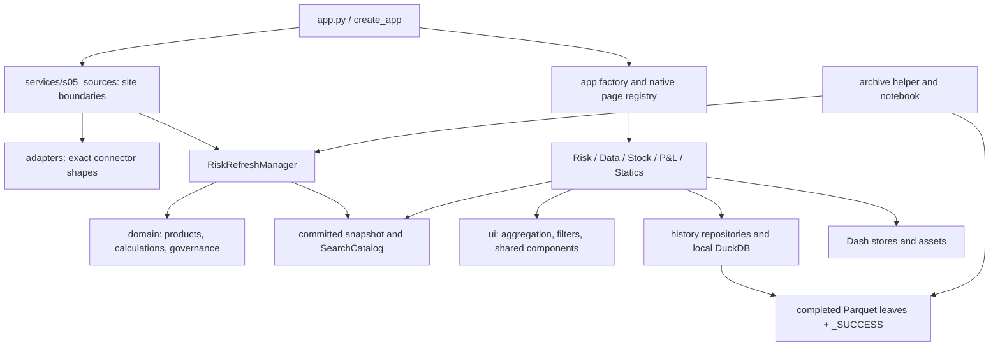
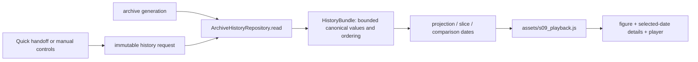

# Rebirth V5: architecture, operating guide, tests, and development map

**Inspected:** 6 September 2026. **Source baseline:** `8f65a1124e54702597347967c7064eb4f7edf133`.

**Publication destination:** `streamlitdash/Rebirth-V5`, branch `v4`. This publication adds the manuals only. The reviewed and tested snapshot is the source baseline above plus the documented local changes; publication does not install those application, test or optional tool changes into `v4`.

This is a guide to the code that exists in this checkout, followed by a prioritized development plan. It is not a claim that every proposed fix or plot preview has been integrated. Local application changes now include the Statics file-switch reset and the Risk hierarchy-index/cache lifecycle redesign described in sections 6 and 7. Their files and regressions are listed in section 18.20. The exact tool-file manifest in `tests/s35_pipelinearch.py` also includes the three new standalone review tools; its legacy-boundary checks remain intact. Portfolio expansion, chart replacements and the broader history/Stock proposals remain unapplied. This documentation change itself does not alter financial calculations, connectors, plots, or deployment.

The complete tracked non-archive file inventory and test-file map are at the end. Repeated archive leaves are grouped by their exact common contract; package initializers are still listed because some contain real page composition. Source filenames and symbols are the authority when older README or experiment notes disagree.

## Navigation

1. [Purpose and boundaries](#1-purpose-and-boundaries)
2. [How to run and use the application](#2-how-to-run-and-use-the-application)
3. [Architecture and dependency direction](#3-architecture-and-dependency-direction)
4. [Boot, shared shell, and refresh](#4-boot-shared-shell-and-refresh)
5. [Financial contracts and calculation sequence](#5-financial-contracts-and-calculation-sequence)
6. [State, caches, and persistence](#6-state-caches-and-persistence)
7. [Risk page](#7-risk-page)
8. [Data page](#8-data-page)
9. [Stock page](#9-stock-page)
10. [P&L page](#10-pl-page)
11. [Statics page](#11-statics-page)
12. [History, archive jobs, and notebooks](#12-history-archive-jobs-and-notebooks)
13. [Frontend assets and charts](#13-frontend-assets-and-charts)
14. [Configuration, deployment, and diagnostics](#14-configuration-deployment-and-diagnostics)
15. [Test strategy and observed verification](#15-test-strategy-and-observed-verification)
16. [Development recipes](#16-development-recipes)
17. [Practical roadmap](#17-practical-roadmap)
18. [Complete tracked file inventory](#18-complete-tracked-file-inventory)

## 1. Purpose and boundaries

Rebirth is a Dash application for reviewing a governed financial risk snapshot, its estimated P&L, current Stock positions, historical observations, and the configuration that shapes those views. It is not a general portfolio-management platform, a pricing engine for arbitrary instruments, or an execution system.

The five native routes are:

| Route | Owner | Main question |
|---|---|---|
| `/` | Risk | What exposures, market moves, promotions, and estimated P&L are in the committed snapshot? |
| `/data` | Data | How did one exact Risk or Market identity change across archived dates and tenor axes? |
| `/stock` | Stock | What positions are held, what is their market value, and what history belongs to the selected scope? |
| `/pnl` | P&L | What are Today/MTD/YTD results; what should be adjusted, validated, and sent? |
| `/static-data` | Statics | What do the approved connector/configuration files contain, and which governed files may be edited? |

Unknown routes use `cube/pages/s01_notfound.py`; the registry also gives that layout the conventional Dash `not_found_404` key.

**Data status matters.** The checked-in sources and 262-date archive are deterministic demonstration fixtures. Current connector identities use `TEMP_REPLACE_ME`; older immutable archive strings may retain `FAKE_REPLACE_ME`. `send_sog_pl` and `send_portfolio_pl` are replacement boundaries, not evidence of a production integration. The archive ends on 21 August 2026. A page requesting a later natural date can correctly fail to find fixture Stock; do not silently label August data as September data.

**Terminology.** Risk means a sourced sensitivity/exposure; dRisk is the supplied change measure, not a number the browser invents. PL is the product-formula result or the appropriate historical source. Stock is market value, and dStock is market-value change. dStock is not automatically investment return or market P&L: position additions/removals and currency effects may contribute.

## 2. How to run and use the application

### 2.1 Local launch

From the repository root, the documented environment is:

```powershell
python -m venv .venv
.\.venv\Scripts\python.exe -m pip install -r requirements-dev.txt
.\.venv\Scripts\python.exe app.py
```

Then open `http://127.0.0.1:8050/`. Host, port, debug, and proxy paths are controlled by `RuntimeSettings` in `cube/app/s01_settings.py`. `app.py --host 127.0.0.1 --port 8051` overrides local address settings. `app:server` is the WSGI object. `use_reloader=False` avoids creating a duplicate refresh process during local launch.

For this review workspace only, an environment also exists at `../.review-venv/`; that is not part of the repository or an application dependency.

### 2.2 Normal user journey

1. Wait for the shell's initial refresh to finish, or inspect its explicit failure state. A later failed refresh should leave the last good snapshot available.
2. On Risk, inspect the current date/status and apply the intended saved view. Editing filter controls changes a draft; **Apply filters** commits it. **Cancel changes** restores the committed selection.
3. Use Aggregate P&L for the selected reporting dimension, Quick Risk for a reported/raw risk identity, and Quick Market for a raw quote identity. Hand an identity to Data when history is needed.
4. In Risk Explorer, select the product family and expand Cross or SplitVA rows. A selected metric cell drives tenor detail. Promotion recalculation is a separate explicit action; ordinary filters do not continuously create promotion generations.
5. On Data, choose identity and period, then **Load history**. Projection, slice, comparison dates, and playback act on the returned bundle. A Quick handoff pre-fills controls once; it should not lock them thereafter.
6. On Stock, apply its independent page filters, inspect the pivot and position rows, and select history. Read the limitations in section 9 before interpreting a leaf's history or a total dStock as a whole-book reconciliation.
7. On P&L, use the page's one committed filter scope for summary, history, editors, and send sections. Editing, saving an adjustment, and sending are distinct actions. Current connectors demonstrate the boundary only.
8. On Statics, Read is inspection; Write is limited to the approved configuration subset. Save validates and replaces the file. It does not itself publish a new risk snapshot.

### 2.3 When the date is outside the demonstration archive

Stock source availability is different from a page rendering failure. Check the requested date against `data/histo/`. The browser review saw a September 4 request while the fixture archive ended August 21. Use an explicitly labeled supported historical/demo date for investigation, or provide the correct dated source. Changing a shared date while Stock stays mounted has an additional state limitation described below; do not assume every page silently rebases its local date stores.

## 3. Architecture and dependency direction



The intended direction is external data → validated domain objects/frames → a committed read boundary → page-owned aggregation/presentation. Browser callbacks should not assemble a competing market or risk snapshot.

- `cube/domain/` owns financial meaning, identity keys, formula choices, aggregation rules, and validation.
- `cube/adapters/` translates site APIs into exact connector shapes. It should not invent Portfolio mappings or reported identity.
- `cube/services/` owns I/O composition, refresh transactions, durable small stores, and optional reference providers.
- `cube/history/` owns archived contracts, atomic persistence, generation detection, SQL access, and typed query results.
- `cube/ui/` contains shared presentation/filter behavior. It currently also normalizes canonical column labels to internal UI names; that bridge is an identified cleanup candidate.
- `cube/pages/` owns route-specific layout, callbacks, selections, and charts.
- `cube/app/` owns settings, protocols, startup, routes, logging, and the composition root.
- `assets/` owns browser behavior and CSS. It operates on bounded returned data and DOM state, not source connectors.

This is not a perfectly isolated textbook layering. `cube/history/s07_sql.py` has P&L-shaped query results; page modules contain some pure projection logic; `_RefreshStateMixin` and `RiskRefreshManager` share internal state; factory and Risk cache both participate in prepared-frame lifecycle. Describe those as the current design, not as independent services that can be freely distributed.

### 3.1 Page injection

`cube/app/s07_factory.py::build_app` creates the services and stores page builder callables in Flask configuration under `PAGE_SERVICES_CONFIG_KEY`. `cube/pages/__init__.py::page_services` reads the active Flask app. Each page's `layout()` calls its corresponding builder. This avoids storing one user's state in module globals and lets app factories inject test sources.

`cube/app/s06_routing.py::register_native_pages` registers stable layout callables and clears/rebuilds Dash's process-global page registry. The shell mounts one `dash.page_container`; only the active route's body is mounted. `suppress_callback_exceptions=True` is used because page targets appear/disappear with navigation. The page registry is process-global even though services are app-specific; test factories need to account for that distinction.

### 3.2 Why page ownership exists

Risk Explorer interactions do not need to import the Stock page to obtain filters, and Stock should not load P&L history just to paint a shell. Shared concepts go in shared contracts/helpers; page-specific renderers and callback IDs stay with their page. A small callback-registration facade is useful. Arbitrarily splitting helpers to meet a file-length target is not an architectural benefit.

## 4. Boot, shared shell, and refresh

### 4.1 Cold start

`app.py::create_app` configures logging, creates a manager through `build_production_refresh_manager`, resolves paths, builds `PLSendConfig`, and injects Stock/history/reduction services into `build_app`. It does not intentionally load all connectors or scan an annual archive merely by importing the WSGI entrypoint.

`build_app` uses a warm committed snapshot if one exists; otherwise it constructs a loading shell. `StartupCoordinator` owns one process-level background initial writer. Shared startup controls and Risk/P&L route builders may request that same idempotent attempt; concurrent browsers follow its progress rather than each starting a new writer.

```mermaid
sequenceDiagram
    participant B as Browser
    participant A as Dash/Flask shell
    participant C as StartupCoordinator
    participant M as Refresh manager
    participant S as Site connectors
    B->>A: request route and shell
    A-->>B: shell, stores, status controls
    B->>A: start/follow refresh; poll status
    A->>C: idempotent start
    C->>M: refresh candidate
    M->>S: bounded connector calls
    S-->>M: validated candidate inputs
    M->>M: calculate, map, validate, build catalog
    M->>M: atomic commit revision
    A-->>B: revision/progress updates
    B->>A: page callbacks for committed revision
```

Health/progress reads are compact. They should not deep-copy every financial frame. The startup watchdog reports a stalled attempt; it does not kill arbitrary Python connector code or authorize a second writer.

### 4.2 Refresh variants

| Action | Owner and intended effect |
|---|---|
| Refresh Risk | `RiskRefreshManager.refresh(force_risk=True, ...)`: rebuild the required risk/market/calculation/governance candidate and dependent release/search state. |
| Refresh PL | `refresh(force_pl=True, ...)`: refresh the appropriate current-market/P&L path while retaining eligible dated source state. |
| Refresh Portfolios | `refresh_portfolios`: reload Portfolio/reporting governance and rebuild dependent governed views from committed source caches. |
| Apply forced dates/settings | Risk date-draft logic validates/rebases the draft, then passes settings to one manager refresh with revision/reset expectations. |
| Clear Cache | `reset_refresh`: advance reset generation, discard reconstructable state, perform a guarded refresh; page/history owners observe the generation and clear their caches. |
| Automatic P&L | Browser-local 15-minute scheduling; manager coalesces near-concurrent automatic attempts using a minimum-age check. |

`cube/pages/risk/s15_refresh.py::register_refresh_callbacks` owns the Dash coordination even though its controls are in the shared shell. `assets/s12_refresh.js` handles browser startup/polling/status lifecycle. It is important to trace both when a button appears stuck: one owns server work, the other the immediate browser presentation.

### 4.3 Transaction and failure boundaries

`RiskRefreshManager` performs expensive source work outside the reader state lock, constructs a candidate, validates it, then commits together with its search catalog. `_RefreshStateMixin::_commit_full_snapshot` publishes the related fields under the state lock. Readers hold the previous committed object until replacement is ready. `StaleRefreshError`, `StaleResetGenerationError`, and `RefreshInProgressError` distinguish stale requests from busy ownership.

Current operational controls include:

- 15-second caller-side deadline per callable connector boundary;
- 120-second combined waiting budget per refresh;
- a bounded daemon call gate retaining at most eight calls that have not returned;
- one normal market request in flight by default;
- zero automatic market retries by default;
- one refresh-wide operational market circuit breaker.

The last point is a current limitation: the first operational market failure can skip other products' requests. `experiments/fix12.md` proposes isolation by product; it is not proof of an implemented change. Schema/type errors are treated differently from operational unavailability and can reject the candidate. A warm rejected transaction should preserve its last good snapshot. Cold unavailable feeds may yield a valid partial candidate where the explicit contracts permit it.

The manager timeout stops waiting; it cannot terminate arbitrary Python code. Real clients still need native connection/read timeouts. Do not confuse connector deadlines, startup watchdog reporting, Gunicorn timeout, and publish-status polling: they have different owners and effects.

## 5. Financial contracts and calculation sequence

### 5.1 Grain first

| Data | Identity/authority | Why it matters |
|---|---|---|
| Product Risk | Product identity + raw Underlying + declared tenors + Portfolio | Multiple portfolios can legitimately own exposure to the same quote. |
| Open/Current quote | Risk Type + Risk Greek + raw Underlying + declared tenor axes within its Source Type/product | Portfolio and Group are not quote keys. |
| Quote order | Connector-owned rank per raw Underlying and axis | Rank describes display authority; it is not quote identity. |
| Portfolio config | Exactly one row per Portfolio | Governance joins `many_to_one`; ambiguous mappings must fail. |
| Reported mapping | Unique Risk Type + Risk Greek + raw Underlying → reported name | Many raw names may share a reported identity; quote calculation must precede this mapping. |
| Threshold | Exact Risk Type + Risk Greek | Ratios mean nothing if thresholds are joined at the wrong product grain. |
| Stock | CRDS + CPTY + Portfolio + Instrument + Currency in current contract | Current/prior comparison is one-to-one on the five fields, not on CRDS alone. |
| Archived Risk | Completed post-calculation snapshot with date/revision metadata | Historical filtering needs historical governed fields, not a re-created current snapshot. |
| Archived Market | Complete unique raw MarketBook with official status | Quote-only tenors must remain accessible even without a current position. |

### 5.2 Normal calculation path

```text
readiness/inventory → source Risk date
                         ↓
product adapter → get_product_risk
Market Date/status → Open + Current adapters → validated MarketBook
                         ↓
Risk left many-to-one MarketBook → product PL (+ derived Gamma rows)
                         ↓
Cross Gamma / New Trades supplemental rows using the same quote authority
                         ↓
Portfolio mapping → Reported Underlying → thresholds / baseline pins
                         ↓
dashboard conversion + release validation → snapshot + SearchCatalog
                         ↓
UI preparation → committed page filters → aggregates/tables/plots
```

Open and Current merge `one_to_one`; Risk joins the resulting quotes `many_to_one`. Never “fix” a merge error by arbitrarily dropping a duplicate quote or collapsing distinct portfolios. Check the exact declared key and whether repeated rows are genuinely identical first.

Dates are separate authorities: Market Date, previous business-date Open, checker date, each product's aged Risk date, and optional forced overrides. A stale Risk feed does not automatically request an equally stale current-market quote. Date normalization in the checked-in code uses pandas business-day conventions; it is not a comprehensive exchange-specific holiday service.

### 5.3 Product catalogue

`cube/domain/s02_products.py::PRODUCT_SPECS` is the authority. The current registered set is:

| Key / Source Type | Type / Greek | Axes | Market unit | Formula |
|---|---|---|---|---|
| `fxdelta` / `fx/delta` | FX / Delta | scalar | pips | percentage |
| `fxgamma` / `fx/gamma` | FX / Gamma | scalar | outright | Taylor gamma |
| `fxvega` / `fx/vega` | FX / Vega | Swap | vol points | absolute |
| `irdelta` / `ir/delta` | IR / Delta | Swap | bp | absolute |
| `irgamma` / `ir/gamma` | IR / Gamma | Swap | bp | Taylor gamma; move scale 10,000, risk step 10 |
| `irdeltavega` / `ir/deltavega` | IR / DeltaVega | Swap × Option | bp | percentage |
| `xccy` / `ir/xccy` | IR / XCCY | Swap | bp | absolute |
| `xccyvega` / `ir/xccyvega` | IR / XCCYVega | Swap × Option | bp | percentage |
| `inflation` / `ir/inflation` | IR / Inflation | Swap | bp | absolute |
| `inflationvega` / `ir/inflationvega` | IR / InflationVega | Swap × Option | bp | percentage |
| `basis` / `ir/basis` | IR / Basis | Swap | bp | absolute |
| `bond` / `ir/bond` | IR / Bond | Swap | bp | absolute |
| `creditdelta` / `credit/delta` | Credit / Delta | Swap | bp | absolute |
| `creditvega` / `credit/vega` | Credit / Vega | Swap | bp | absolute |
| `commodelta` / `commo/delta` | Commo / Delta | Swap | outright | percentage |
| `commovega` / `commo/vega` | Commo / Vega | Swap | vol points | absolute |

An auxiliary `CASH_FLOW_PRODUCT_SPEC` (`new-position/cash-flow`, Cash Flow/New) uses identity PL for New Trades. It is deliberately outside the aged Risk/MarketBook catalogue: it must not create fabricated market quotes or readiness entries. The user-facing Commodity label may differ from the canonical `Commo` value.

### 5.4 Formula and missing-value rules

`cube/domain/s03_calculations.py::_pnl_move` and `get_product_pl` apply:

```text
raw move       = Current − Open
absolute PL    = Risk × raw move × multiplier
percentage PL  = Risk × ((Current − Open) / Open) × multiplier
Taylor move    = raw move × gamma_move_scale
developed Risk = sourced Gamma Risk × Taylor move / gamma_risk_step
Taylor PL      = 0.5 × developed Risk × Taylor move × multiplier
```

The sourced Gamma row retains Taylor PL. A derived Delta row in the Gamma split carries the developed exposure, unavailable dRisk, and zero PL to avoid counting the Taylor contribution twice.

The current implementation coalesces a missing single quote leg from its available counterpart as a continuity policy; when both are absent, quote/P&L availability remains missing. It also normalizes certain nonfinite calculations to zero in `_normalize_computed_pl` and `_normalize_developed_risk`, including a flagged percentage move from zero Open. Those are implemented policies, not universally safe financial assumptions. The review recommends replacing undefined/nonfinite arithmetic with a rejected or explicitly unavailable result instead of an apparently ordinary zero. Changes must include raw-source reproductions and source/status propagation.

Null-preserving sums such as `sum(min_count=1)` prevent an entirely unavailable group from becoming zero. They do not by themselves establish completeness when only some contributing observations are present. Coverage/status needs its own meaning.

### 5.5 Supplemental risk and governance

- **Cross Gamma:** `cube/domain/s04_crossgamma.py` validates portfolio-level cross sensitivities, derives its market scope, and develops the supported dual-leg rows. `adapters/s06_crossgamma.py` owns the strict external boundary; it must not become an ad-hoc alternate market source.
- **New Trades:** `adapters/s07_newpositions.py` validates the raw blotter (including trade identity/time and source shape). `domain/s05_newtrades.py` creates required market scope and calculates rows using governed product contracts. Direct Cash Flow PL is an auxiliary classification. Preserve Trade ID traceability into Risk detail.
- **Reported names:** `attach_reported_underlying` maps after raw PL; missing mappings fall back to the raw label. Quick Risk can use reported identities; Quick Market stays raw.
- **Promotion:** `evaluate_promotions` compares aggregate absolute Risk/dRisk/PL to exact product thresholds. Baseline promotion uses the configured base scope; explicit current-view generation has its own immutable metadata. Connector-owned Vol Score ranks Top Promotions and is not the threshold ratio.
- **Pins:** `load_pinned_promotions` / `apply_pinned_promotions` read `data/s12_pinned.csv`. A pin supplements actual reason/bucket handling; it must not invent absent exposure or fake an infinite financial score.
- **JTD:** `services/s08_jtd.py::jtd_reference_rows` is an optional exact-Underlying reference lookup from `s13_jtd.csv`, cached by file metadata. It is not the source of all computed Credit JTD sensitivity values.
- **Reduced tenor:** `ReducedTenorReducer` operates post-P&L. Non-Credit products select a matrix from `s11_matrix.csv`; one-axis Credit products use the shared Credit mapping. Sum additive exposures within existing position boundaries. Quote values are matched to an exact reduced tenor when possible; they are not summed as though they were exposures.

## 6. State, caches, and persistence

### 6.1 Ownership map

| State | Owner / lifetime | Contents and intended use |
|---|---|---|
| Committed financial snapshot | `RiskRefreshManager`, one process | Large authoritative Risk, MarketBook, PL and governed frames; atomic revision. |
| Compact read views | `ControlSnapshot`, `PLSnapshot`, `FrameRead`, health/progress types | Copy only what a workflow needs, tied to same-revision metadata. |
| Exact search index | `SearchCatalog`, one committed revision | Risk identities/hierarchies and unique quote identity options. |
| Prepared Risk frame | Factory preparation cache plus `_RiskDataCache` | Avoid re-normalizing full data for every page/callback. Ownership is currently shared. |
| Filtered/reduced Risk | `_RiskDataCache` | Filtered frames: at most 32 entries and 512 MiB of accounted frame storage; revision-scoped reduced books, compact quotes and promotion generations have separate ownership. |
| Cross hierarchy indexes | `_RiskDataCache.hierarchy_index` | At most four entries and 256 MiB of conservatively accounted retained data; one immutable filtered frame and normalized Credit measure per key. |
| Explorer component trees | `_RiskDataCache.render_explorer` | Serialize each visible-table build; do not retain the resulting full component tree in the cache. Applies to Cross, SplitVA and Credit Multi. |
| Workspace component trees | `_RiskDataCache.rendered` | Aggregate P&L and Top Promotions retain their separate 24-entry LRU, without a byte budget; epoch checks prevent invalidated builds from repopulating it. |
| Draft/applied user filters | Page Dash stores/components | Small JSON-safe selection state; no global per-user DataFrame. |
| Data history request/bundle | Typed `HistoryQuery` plus browser bundle stores | Immutable requested identity/date scope and bounded canonical values for client playback. |
| Stock current comparison | Stock callback closure cache | Up to four revision/date keys; filters project those server frames. |
| History connections/catalogues | Archive/Stock/P&L repositories | Lazy in-memory DuckDB, metadata fingerprints, small selector/query caches. |
| Named saved views | `SavedFilterViewRepository` | Shared named catalogue, but each page has its own draft/applied state. |
| P&L adjustments | `LocalCsvAdjustmentRepository` | Complete date/portfolio files with revision/save metadata. |
| Statics | `StaticDataStore` | Approved CSV files; atomic per-file replacement. |
| Logs | App logging handler/modal | Bounded process-local operational records; not a durable business audit ledger. |

Browser state is untrusted input: parse/validate selections, identities, revisions and action envelopes before using them. Large authoritative frames stay on the server. Data playback is an intentional exception for a bounded canonical bundle, not permission to serialize the entire archive.

### 6.2 Implemented Risk cache lifecycle and remaining costs

The local redesign on 6 September 2026 moves reuse for the main Cross view from whole rendered component trees to `ui/s02_aggregation.py::HierarchyAggregationIndex`. The index stores additive measures in NumPy arrays and factorizes authoritative quote identities once. Node aggregation still preserves the existing missing-value sums, breakdown validation and independent quote aggregation. The source and index frames must be treated as immutable; there is no browser-owned mutable index.

`_RiskDataCache.hierarchy_index` keys reuse by the identity of the actual cached filtered frame plus a normalized Credit measure. The frame already represents its revision, product/family, split/filter, reduction and promotion scope. Expansion, metric display, sort and hierarchy presentation can reuse that index when the numeric scope remains the same. A retained entry holds a strong reference to its source frame, preventing a recycled Python object ID from becoming an accidental cache hit. Standard Cross, including Credit Single, obtains this index through `s07_explorer.py`; SplitVA and Credit Multi retain their independent aggregation paths.

The hierarchy LRU is bounded by **four entries and 256 MiB of accounted retained data**. `HierarchyAggregationIndex.memory_bytes` counts the full retained frame, numeric arrays and quote-index arrays; a separate Credit transformation also accounts for its retained source frame. Counting shared frame storage is intentionally conservative because the index can outlive a filtered-cache entry. This is not a bound on total process memory, Python object overhead, temporary build allocations, browser memory, or response size. An unowned frame or an index larger than the byte limit is still usable for that call but is not retained. Ownership for insertion means the source is the current prepared frame or one of the cache's current filtered frames.

`replace_frame` and `clear_reconstructable` advance `_cache_epoch` and clear hierarchy indexes alongside the other derived entries. Index builds capture the epoch and cannot repopulate a cache cleared while they were running. `filtered` verifies that the frame it obtained still matches the current frame before capturing revision/epoch; a changed revision causes a retry, while a same-revision cache clear allows the computed result to serve its caller without reinsertion. These checks guard the filter/refresh/reset race; they do not replace the page's existing action/view-token validation.

Every main Explorer view now calls `render_explorer`, which uses the existing reentrant render lock to serialize component construction and returns the result without retaining it. The numeric index amortizes repeated Cross aggregation preparation, but visible HTML must still be rebuilt and sent. Direct callers of `build_risk_table` can omit an index and receive a local one; when supplied, the builder uses the index's frame for both row membership and numeric values. Mixing its row positions with a separately transformed frame would be incorrect.

The `rendered` helper remains in use by the separate Aggregate P&L and Top Promotions workspace callbacks. Its **24-entry component LRU still has no byte budget**; it now also captures the epoch and skips insertion after invalidation during a build. The shared render lock serializes these builds too. This is a focused replacement of the large Explorer render-cache behavior, not a universal cache framework or removal of every component cache.

Reduced books remain lazy by revision/product scope, and explicit promotion generations remain count-bounded. The factory and page cache still both retain preparation/revision state; consolidating that ownership is preferable to adding another preparation cache. Remaining gaps, unchanged by this redesign:

- Clearing derived Risk frames does not recreate the cached `ReducedTenorReducer`; successful definitions and negative provider results can survive Clear Cache. A reproduced transient failure stays in full-tenor fallback until a new reducer instance is constructed.
- `SQLPLHistoryRepository` keeps `_stats_cache` and `_risk_summary_cache` in ordinary unbounded dictionaries until archive/connection reset. Distinct filters can accumulate full summary frames. Add a bounded LRU/byte policy; its SQL filter values are already normalized.
- Stock callback/cache dates and loaded history scope are not fully synchronized with shared revision changes.
- Every cache does not need a common abstract framework. Document its key, authority, maximum retained size, invalidation trigger, and failure recovery; then consolidate only duplicated ownership.

### 6.3 Persistence is not publication

Saved views use small validated shared JSON documents with a file-lock boundary. Adjustment saves replace complete selected portfolio files. They retain save/revision metadata for the effective stored version, but they are not an append-only audit history of every prior edit or send. Statics validates a complete governed file and publishes it using a temporary file and `os.replace`. Those are three distinct write contracts.

Atomic replacement prevents a reader seeing half-written bytes. It does not prove cross-file transactionality or protect two editors from a last-writer-wins overwrite. Statics currently has no content-hash/base-version conflict check. Its `static-data-revision` is a browser refresh signal, not a compare-and-swap database version. A future concurrency control should add an explicit saved-file fingerprint, without removing existing schema validation.

Hosted writable files may be ephemeral. A saved view, adjustment, or Statics edit is not automatically committed to Git or preserved across redeployment. Keep durable storage requirements explicit before changing worker topology.

## 7. Risk page

### 7.1 Components and interactions

`s16_view.py::build_layout` constructs the committed page: date/editor disclosures, checker inventory, unmapped books, workspace tabs, Explorer controls, and selected detail. `s17_callbacks.py` composes four callback groups and injects one Risk cache.

| Workflow | Main chain |
|---|---|
| Refresh/settings | shared controls → `s15_refresh` → force-date helpers in `s02_state` → manager → revision/status stores → page outputs |
| Aggregate P&L | applied reporting filters → `s14_workspacecallbacks` → cached prepared frame → shared `build_aggregate_pl_table` |
| Quick Risk | search controls `s08_quickrisk` → callback helpers `s10_search` → manager/SearchCatalog exact risk pivot → hierarchy/figure |
| Quick Market | search controls `s09_quickmarket` → manager exact quote result → quote-grain table/chart; optional detail/history helpers |
| Top Promotions | current/baseline generation + filters → `s13_workspacetables::top_promotions_frame` → bounded rank table |
| Explorer | family/split/view/filter/actions → `s07_explorer` → serialized `render_explorer` build → `_RiskDataCache.filtered` → cached index for standard Cross / independent SplitVA or Credit Multi aggregates → `s06_explorertables` → selected tenor detail in `s05_charts` |
| Recalculate/reset promotion | `s12_promotecallbacks` → `s11_promotion` typed generation → server cache + browser metadata → refreshed presentation |
| Data handoff | `s04_handoff` validates exact identity and filter view → shared handoff store + navigation → Data consumes once |

Cross and SplitVA are different presentations over governed data. Credit also has Single/Multi presentation and measure choices. Only standard Cross, including Credit Single after its selected measure transformation, uses the new reusable hierarchy index. All Explorer presentations avoid retaining full component trees, while Aggregate P&L and Top Promotions keep the separate workspace render cache. Product shapes and tenor axes should come from ProductSpec and quote-order columns, not guesses from visible labels.

### 7.2 Selection and stale event handling

Browser delegated actions in `assets/s13_risk.js` include a sequence and view token. `s02_state.py::_is_current_risk_action` validates the envelope against the rendered generation. `risk_action_view_token` includes data revision, risk type/family, table view, reporting dimension, and relevant generation state. This stops a late click from an old table being applied to a replacement view.

Open rows, selected contexts, and metric-detail controls are small state. Hierarchy keys are structured/serialized instead of parsed from human labels. `ui/s02_aggregation.py` contains `frame_for_context`, `visible_tree_level`, `tree_scope`, and aggregation indexes that select the corresponding frame without duplicating semantic levels. Quote aggregation must use its quote index independently of portfolio count.

These structures do not guarantee that every fully expanded table remains small. In the review's server-side capacity probe before the cache redesign, an all-open IR Vega family with 4,441 positions produced 5,835 rendered hierarchy rows, about 17.07 MB of serialized content, and about 6.97 seconds of server work; the Delta case was about 9.28 MB and 3.75 seconds. Those are historical measured examples on the review environment, not timings for the redesigned cache, browser timings, or universal capacity limits. Prefer sensible default collapse, bounded children/continuation, and selected-scope detail before increasing request timeouts or eagerly rendering the entire family.

The user's subsequent scale clarification is approximately **100k rows before adding Portfolio to the view, with 300–400 portfolios**. Whether 100k means raw positions or existing aggregate groups is still unconfirmed. Raw positions already contain Portfolio, so adding a group does not inherently multiply the input by 400. Existing aggregate groups may each split into many contributing books, however. Count actual distinct hierarchy/Portfolio combinations instead of assuming a dense Cartesian product.

For this scale, prefer an aggregated main tree and a **server-paged Portfolio detail for one selected row**. Resolve its exact context/filters/revision, aggregate its matching positions, calculate full matching totals, and only then select the displayed page (initial policy: 50 books, to be measured). Keep unique quote aggregation independent of book count. Hidden descendants are already skipped, but every visible row is still constructed as HTML and included in the response. The local cache redesign now reuses standard Cross numeric indexes across display states and stops retaining main Explorer component trees. It does not add paging or a visible-row limit, and it does not index SplitVA or Credit Multi. Aggregate P&L/Top Promotions still retain up to 24 workspace component trees without a byte budget.

Bounded visible rows and a progressively scoped production measurement remain necessary before enabling broad inline Portfolio expansion. The companion guide's two-file leaf patch is a functional proposal, not production capacity clearance; the suggested Portfolio detail and paging are also not implemented. The synthetic 100k-raw-position/400-portfolio probe in section 15.3 checks a modest selected scope with at most nine rendered rows. It does not measure a fully expanded book, 100k pre-aggregated display groups, or browser/production capacity.

### 7.3 Promotion is a separate decision from filtering

`PromotionBasis`, `PromotionRow`, and `PromotionGeneration` record explicit current-view promotion decisions. Changing a display filter does not silently recompute the generation. Reset returns to baseline. A stale-basis indicator explains when the visible scope differs from the one used to calculate the selected generation.

This separation is justified: users should know why an exposure is promoted. Do not simplify it by deriving a new decision on every table click. Do simplify duplicated browser/store representations if they express the same immutable selection.

### 7.4 Current plot design and proposals

Current detail supports line, heatmap, matrix, and product-shaped panels through `s05_charts`; Quick Risk and Quick Market have their own builders. Some shared meanings are duplicated across these chart owners. Preferred evolution is a small shared chart style/metric vocabulary and shape-specific helpers, not one universal plotting framework.

Proposed previews are design examples only: aligned exposure/change panels; readable signed heatmaps; a selected curve/surface slice; explicit source units and as-of labels; comparable color domains across dates; gray/unavailable cells rather than zero colors. Keep matrix values accessible because a financial surface often needs exact inspection. Do not put quote changes, exposure, and currency P&L on an unlabeled common numeric axis.

## 8. Data page

`s02_view.py::build_data_page` paints an archive-free shell. `s01_selection.py` derives legal Risk Type → Greek → Underlying choices from catalog entries. `s03_callbacks.py` owns handoff consumption, selector state, request creation, archive generation, query, serialization, and clientside callback registration.



The typed contracts live in `history/s01_models.py`: `RiskFilterView`, `HistoryIdentity`, `HistoryHandoff`, `HistoryQuery`, axis ordering, and `HistoryBundle`. `HistoryIdentity` retains actual source membership and raw/reported mode; an ambiguous string label is insufficient authority.

`choose_history_request` snapshots the controls on Load or a pending Quick handoff. The consumed nonce stops a handoff replay from overwriting later edits. `poll_archive_generation` and the repository fingerprint notice completed archive changes; invalidation differs from loading a new user-selected identity.

`ArchiveHistoryRepository` queries date availability, resolves the selected period against observed dates, loads only required rows/columns, applies Risk filters, constructs canonical axes, and enforces row/date/cell budgets. `ArchiveSQLStore` owns the lazy generation-scoped connection and distinct catalogues. Older archive formats remain supported through a legacy fallback in the repository; that fallback currently recognizes a specific exception message and is a cleanup candidate.

The browser receives a canonical bundle rather than a second raw-history payload. `assets/s09_playback.js` derives allowed projections and slices, handles Date A/B, static/playback modes, slider/wheel controls, and redraws without a new source query for each animation frame. Risk history plots Risk; Market history plots its official archived quote. The current code also offers aggregation/slice choices whose financial meaning must stay explicit: summing exposure across a tenor axis and aggregating quote values are different operations.

For UI changes, test the full handoff/manual-edit/load flow, scalar/one-axis/two-axis bundles, missing dates/cells, maximum payload, and reset while playback is active. The fixture archive having only one year does not make a 5Y request invalid; it should resolve truthfully to available history.

## 9. Stock page

### 9.1 Current implementation

`build_stock_page_route` selects the comparison date pair and builds a shell. The single-use load interval and shared revision/reset inputs trigger `s04_callbacks.py::load_current_stock`. It calls `s01_data.py::load_stock_page_data`, which obtains current and prior Stock through the adapter, loads Portfolio governance, and calls `map_stock_comparison_portfolios`.

The domain compares exact five-field identities using an outer one-to-one merge. It keeps current/prior values and Added/Removed/Changed status. The current page then calls `stock_display_rows`, retaining only positions with a current market value and presenting Stock/dStock plus unaggregated metadata.

Applied Stock filters affect its pivot and detail rows. `s05_pivot.py::build_stock_pivot` defaults to Activity → Category (Bucket) → CRDS → CPTY, offers optional Currency/Product columns and Stock/dStock measures, and constructs only expanded hierarchy descendants. `s03_view.py` supplies the DataTables and history controls.

History currently resolves CRDS + Activity against the current mapped snapshot, calls `SQLStockHistoryRepository` once per resulting exact identity, validates the returned frames, sums value by date, and plots Stock plus dStock. The manual history selectors intentionally remain independent of table filters in the existing tests.

### 9.2 What remains wrong or ambiguous

These are review findings, not implemented changes:

1. **Shipped identity mismatch:** current Stock normalizes fixture names to TEMP, but Stock SQL history queries raw archive FAKE names. A current identity returned zero rows where the corresponding raw identity returned two available dates.
2. **Clicked scope broadening:** the leaf may be CPTY/Portfolio-specific but its history payload only retains CRDS + Activity. A filtered 100-value leaf reproduced a 1,000-value resolved history scope including a hidden second portfolio. Clicked scope should carry exact path, committed filters, column split, and revision. Manual archive selection can remain independent if labeled.
3. **Silent split truncation:** only the first eight split labels are shown. Nine 100-value currencies reproduced eight displayed columns totaling 800 while position count remained nine. Show a total and explicit remainder or selectable column pages.
4. **Date lifecycle:** `stock-date-store` is initialized on route mount and never written by callbacks. Shared refresh reloads its old dates; loaded history also does not automatically rebase to a new Stock snapshot.
5. **Exit reconciliation:** prior-only rows are deliberately hidden. A whole-book change of −390 reproduced visible current-position dStock of +110 because a −500 exited position was omitted. Use a Changes view for reconciliation; do not call the existing projection an arithmetic bug.
6. **History membership:** current identity/mapping selection means history of today's selected basket, not the historical book including exited members. Label it or implement a dated membership authority.
7. **Currency/completeness:** establish whether Market Value is local or reporting currency before summing unlike currencies. Null-preserving sums alone cannot distinguish a partial identity observation from complete history.

### 9.3 A coherent next design

Use one visible scope/date bar; Current Positions and Changes modes; a pivot with total and selectable sort metric; a selected-scope detail area; then aligned Stock line and signed dStock bar panels sharing dates. Add a prior → additions → exits → continuing-position change → current waterfall using the existing comparison data. Show exact identities in lazy position detail rather than eagerly sending every row into a closed disclosure.

The unused provisional promotion/temporary-currency hierarchy functions in `domain/s09_stock.py` and the accepted-but-discarded `promotion_threshold` builder argument can be removed or quarantined once external compatibility requirements are checked. That is a clearer simplification than adding another hierarchy abstraction.

## 10. P&L page

### 10.1 Three related, different authorities

- Current calculated P&L comes from the committed manager snapshot.
- Historical overview/series comes from official Risk/Predict and Colossus archive projections.
- Effective send rows combine governed calculated rows with approved saved adjustments; editor drafts are not the committed market snapshot.

`PLSendConfig` injects Concerto mapping, adjustment repository, send functions, and history source. `cube/pages/pnl/__init__.py::register_callbacks` composes aggregate, validation, drilldown, and send callback groups.

### 10.2 Summary and inline history

`s07_view.py::build_pl_page` owns the shell. `s08_aggregate.py` owns page filter values and calls a `PLRiskSummaryQueryProtocol` source. `SQLPLHistoryRepository.risk_summary` builds Risk Type → Greek → Underlying results; `s10_summary.py` renders the bounded hierarchy.

The current summary uses the latest Predict/Risk result for Today and official Colossus totals for MTD/YTD through the archive date. Do not describe those columns as a single interchangeable current-source calculation. `s09_drilldown.py` converts a selected hierarchy scope and period into an inline query; `s03_history.py::build_pl_history_figure` shows the requested historical sources. Date gaps remain meaningful.

### 10.3 Editor, adjustment save, and send

```text
same-revision PL snapshot + governance + Concerto mapping
    → normalized send base
    → optional saved adjustment overlay
    → committed page filters + selected SOG/Portfolio scope
    → native editor draft with stable row IDs
    → validate/re-govern edited fields
    ├→ Save adjustments: persist selected complete portfolio files
    └→ Send: validate exact scope/revision and call injected sender
```

`s02_editor.py` contains pure conversion, allowed-scope, dropdown, row-governance, and draft helpers. `s04_sender.py` builds editor/send components. `s05_sendcallbacks.py` materializes effective queries lazily, controls each editor, saves adjustments, and sends all/SOG/Portfolio scopes. Derived mapping fields stay governed rather than freely edited. P&L file storage is `services/s03_adjustments.py`; pure adjustment semantics are in `domain/s08_pnl.py`.

Source functions named `send_*` remain examples in this checkout. Replacing them with real external transmission changes operational consequences; wire explicit authentication, recipient/system contracts, idempotency, outcome handling and audit requirements at that boundary before enabling it for a live workflow.

### 10.4 Validate P&L

`s06_validation.py` loads official Risk and Colossus for a selected date, builds a comparison and hierarchy, and renders it lazily while the disclosure is open. It keeps at most eight date comparisons, and browser chevrons can expand a prepared subtree without re-running the whole comparison. `assets/s14_pnl.js` also bridges native table range selection.

This is comparison/diagnostic UI, not a proof that all raw feeds reconcile. Missing/unmatched values and mapping scope need to remain visible. A useful future exceptions view would rank unexplained differences with drill-through to source rows, thresholds, freshness, and adjustment provenance.

## 11. Statics page

`StaticDataStore` whitelists exact files and resolves paths inside its data root. Read allows the connector/governance sequence plus `s11_matrix.csv`. Write is limited to Portfolio mapping, thresholds, Concerto mapping, and reported-underlying mapping. `s12_pinned.csv` and `s13_jtd.csv` exist but are not in the current Statics picker whitelist.

`s02_view.py` builds read/write tables and controls. `s03_callbacks.py` switches tabs, loads files, appends blank rows, cancels drafts, saves, and refreshes the Read table through a local revision signal. Store validation delegates to the existing domain loaders, so the editor cannot weaken exact schemas or one-to-one governance keys.

### 11.1 Existing local fix

`reset_static_table_view` is a separate callback triggered by the Write file selector. It clears `filter_query`, `sort_by`, `page_current`, `hidden_columns`, `active_cell`, and `selected_cells`. Previously, DataTable kept view state from the prior schema; an old-column filter could make a newly selected file appear empty. This is a reversible UI-state fix. It does not change file content or validation semantics. `tests/s42_statics.py` includes its focused regression.

### 11.2 Save lifecycle and remaining improvements

Save validates the whole table, flushes a temporary CSV, and atomically replaces the approved target. The status then asks the user to refresh the affected source to commit it into the app. A successful save is not yet a successful financial refresh. Portfolio/reporting changes, thresholds and Concerto mapping are consumed by different downstream owners; expose that effect rather than implying one generic button always updates everything.

Useful next changes are a visible draft/file state, before/after summary, selected-file fingerprint for stale-write rejection, cancel/unsaved-change behavior, and a small impact summary. Do not build a new governance platform merely to manage four CSV files. Preserve full-file validation and make the authority/date of the applied snapshot explicit.

## 12. History, archive jobs, and notebooks

### 12.1 Completed-leaf contract

The tracked archive uses 262 weekday directories from `2025-08-21` through `2026-08-21`, each containing:

```text
data/histo/YYYY-MM-DD/
    risk.parquet
    market.parquet
    colossus.parquet
    stock.parquet
    _SUCCESS
```

The manifest records schema version, dates, revision, row counts, columns, hashes and fixture identity. Application version V5 does not require changing archive schema version 4 or its `deterministic-rebirth-v4` marker. Read logic must handle label normalization without rewriting those immutable source bytes.

`s02_contracts.py` validates shapes and models; `s03_io.py` discovers and validates leaves, separates complete from pending state, writes completed official snapshots atomically, and adapts a manager into the official archive boundary. Do not invent `_SUCCESS`, alter one Parquet file independently, or backfill today's payload into historical folders.

### 12.2 Query owners

| Owner | Main role |
|---|---|
| `history/s04_queries.py` | Exact bounded Risk/Market queries, legacy support, PL projection and process cache invalidation. |
| `ArchiveSQLStore` | Data's lazy generation-scoped Risk/Market SQL and distinct selectors. |
| `ArchiveHistoryRepository` | Typed Data requests → period resolution → bounded canonical bundle/order. |
| `SQLPLHistoryRepository` | P&L summary, hierarchy, series and bounded raw-row results over virtual views. |
| `SQLStockHistoryRepository` | Page-owned Stock catalogue and exact position history. |
| `open_history_database` / `open_history_query_database` | In-memory SQL exploration/query setup over local validated files. |

DuckDB is an embedded query engine here, not a separately managed service or persistent database. Parquet remains authoritative. Connections are lazy, and generation metadata determines when they are rebuilt. The application does not currently provide a live remote S3 query backend; the README's S3 workflow downloads complete leaves first.

### 12.3 Daily archive and exploration

`tools/s02_archive.py::run_scheduled_archive` resolves `PL_HISTORICAL_PATH`, a `COLOSSUS_LOADER` in `module:function` form, and the manager factory. It calls `archive_from_manager(..., refresh=True)`. The daily job is idempotent: an existing completed official date is not overwritten. It targets the current natural official date, not an arbitrary historical backfill.

**Stock archive integration gap:** the ordinary `RefreshSnapshot` has no `stock_frame`. `archive_official_snapshot` only writes Stock when that optional field is supplied, and the default scheduled manager path does not supply it. The checked-in fixture leaves all containing `stock.parquet` therefore does not prove the daily job will continue Stock history. Add an explicit dated Stock loader/snapshot input at the archive boundary and test its completed manifest before promising a daily Stock archive. Keep its date aligned with the official archive Market Date.

`jobs/s01_archive.ipynb` is the notebook wrapper suitable for scheduling. It locates the project via the explicit root/environment or parent discovery and executes the shared job boundary. `jobs/s02_explore.ipynb` locates the repository, opens the in-memory database, and demonstrates date/count and grouped Risk queries against `archive_days`, `risk_history`, `market_history`, `colossus_history`, and `stock_history`. Do not import a second Dash app just to explore history.

`tools/s01_fixtures.py` creates deterministic connector data and streamed history fixtures, validates them, and has a read-only `--check` mode. Its write/install helpers are fixture-generation machinery, not the production archive scheduler. `tools/s03_benchmark.py` measures cold import, refresh, scale preparation/filter/render, and first history reads without rewriting source data.

### 12.4 Optional local synthetic-history examples

Two standalone tools added during this review demonstrate generation and real repository reads without changing the shipped archive or calling live connectors:

```powershell
.\.venv\Scripts\python.exe -m tools.s05_demo_history --start 2026-08-19 --end 2026-08-21 --output ../demo-history
.\.venv\Scripts\python.exe -m tools.s06_read_demo_history --archive ../demo-history
```

The generator requires an output directory outside the repository, validates the entire requested range against the supported synthetic fixture dates, and accepts only empty or complete tagged synthetic output. It constructs a snapshot that explicitly includes Stock, uses the existing atomic archive writer, retains validated completed days, then checks manifest hashes/schemas and SQL view counts. That explicit `stock_frame` example does not fix the default scheduled manager's Stock omission.

The reader verifies synthetic provenance, derives dates from completed leaves, and exercises P&L, typed Data Risk/Market, and exact Stock history repository APIs. Its Stock example uses an identity from the archive catalogue; it is not a regression fix for the separate current-Stock TEMP → archived FAKE mismatch. The examples reject untagged/real archives so their output remains clearly demonstration data. Neither tool is imported by the app or adds a scheduled job.

## 13. Frontend assets and charts

The CSS/JS names are ordered because Dash loads assets from the directory; shared namespace exports are consumed by later scripts. The full file inventory below explains each asset.

- Shell CSS defines typography, colors, backgrounds, spacing and semantic financial/status colors.
- Controls/table CSS styles disclosures, editors, calendar controls and table states.
- Page CSS covers Risk, P&L, Stock/Statics visuals, responsive layouts, Data/history, promotions and the application-log modal.
- `s09_playback.js` owns Data bundle projections, date comparisons and local playback.
- `s10_theme.js` coordinates theme and Plotly relayout alongside shared shell helpers.
- `s11_tables.js` handles selection/copy/resize and discovery of native-table UI hooks.
- `s12_refresh.js` owns browser-side startup and refresh progress polling/status.
- `s13_risk.js` owns delegated Risk hierarchy/cell actions and shortcuts.
- `s14_pnl.js` owns P&L range selection and local validation-tree interaction.

Browser scripts are necessary because some interactions should not require a server round trip per pointer movement or animation frame. They also introduce lifecycle risk when native pages mount/unmount. Check listener deduplication, observers, route disposal, disabled controls, keyboard behavior, and stale action envelopes in a real browser; matching braces in a source test does not establish any of those properties.

### 13.1 Chart acceptance criteria

For every plot, verify: metric and unit; exact scope; as-of/source dates; sign/zero reference; missing-value representation; tenor order; stable comparison scale; overflow/aggregation disclosure; readable hover; bounded traces/points; resize/theme behavior; and a table/drill-through path for exact values. These are display requirements with financial consequences, not decoration.

Proposed previews linked by the companion review are synthetic/design artifacts. They are not tests of the current app and do not imply live data integration. The local `tools/s04_chart_previews.py` reads the shipped synthetic archive and renders an exposure curve, aligned Open/Current/Move view, signed surface heatmap, and selected surface slice into `docs/chart-previews/index.html` with a small `data.json` payload. Run `python -m tools.s04_chart_previews --output docs/chart-previews` to regenerate the standalone gallery. It is not imported by `app.py`. Integrate one actual chart path at a time, using the existing product/metric contracts and real component callbacks.

## 14. Configuration, deployment, and diagnostics

### 14.1 Runtime settings

| Setting | Where read | Purpose |
|---|---|---|
| `HOST`, `PORT`, `DASH_DEBUG` | `RuntimeSettings`; optional CLI overrides in `app.py` | Local bind/debug settings. |
| `DASH_REQUESTS_PATHNAME_PREFIX`, `DASH_ROUTES_PATHNAME_PREFIX` | `RuntimeSettings` | Public/browser and backend route prefixes. |
| `JUPYTERHUB_SERVICE_PREFIX`, `DASH_JUPYTERHUB_MODE` | `RuntimeSettings` | Derive proxy/service URLs; proxy mode assumes prefix stripping. |
| `CONCERTO_MAPPING_PATH` | `app.py` | Concerto field mapping; default `data/s08_concerto.csv`. |
| `PL_ADJUSTMENT_PATH` | `app.py` | Adjustment directory; default `adjustments/`. |
| `PL_HISTORICAL_PATH` | `app.py`, archive job | Local complete archive root; default `data/histo/`. |
| `SAVED_FILTER_VIEWS_PATH` | `app.py` | Named shared views; default `data/saved_views/`. |
| `RISK_PRODUCT_DELAY_SECONDS` | `app.py` | Optional demonstration/stage delay, not a source timeout. |
| `CUBE_STARTUP_TIMEOUT_SECONDS` | app factory | Startup watchdog reporting threshold; default 2,400 seconds. |
| `CUBE_LOG_LEVEL` | app logging | Runtime logging verbosity. |
| `GUNICORN_THREADS`, `GUNICORN_TIMEOUT_SECONDS` | `gunicorn.conf.py` | Thread count and server timeout; defaults 4 and 300 seconds. |
| `COLOSSUS_LOADER`, `RISK_CUBE_PROJECT_ROOT` | archive job/notebook | Explicit daily archive integration and project discovery. |

Relative configured paths resolve from the application root rather than the terminal's working directory. Full connector deadline/retry settings also exist as explicit `RiskRefreshManager` constructor arguments; do not assume every constructor policy has an environment variable.

### 14.2 Deployment

`gunicorn.conf.py` uses one `gthread` worker intentionally: the committed snapshot and writer state are process-local. Increasing workers would create independent snapshots/caches and does not solve the current consistency model. The simplest supported deployment remains one snapshot owner with bounded threaded requests.

`publish.py` validates the exact demonstration archive, stages `app.py`, `gunicorn.conf.py`, `requirements.txt`, `cube/`, `assets/`, and `data/`, recompresses staged Parquet, and invokes the Plotly publisher. The original archive is not rewritten. `plotly-cloud.toml` identifies the existing application. `--keep-bundle` retains staging while publishing; it is not a dry-run flag.

The current publisher is fixture-specific. Before using it with real or newer history, replace exact historical-date/row/fixture assumptions with the intended release contract. Do not merely bypass manifest validation. Runtime writes, credentials and private data must have a deliberately managed deployment/persistence boundary; `.gitignore` does not make all untracked or staged data safe by itself.

### 14.3 Diagnostics

`app/s03_logging.py` supplies `perf_span`, bounded structured metrics, warning deduplication, and the process log buffer/terminal bridge. `app/s08_applogs.py` exposes the log modal. `app/s05_progress.py::progress_payload` serializes compact manager/coordinator state. The factory installs HTTP health/start/progress endpoints and response headers including no-store behavior for relevant JSON paths.

When debugging, capture the first source/validator failure, the exact date/status/product, and the last good revision. A later UI exception may be a consequence. Compare raw-source output against declared columns, dtypes, blanks, duplicate keys and tenor order before editing validators. Logs should explain stage/authority without becoming an unbounded dump of financial frames.

## 15. Test strategy and observed verification

### 15.1 Existing organization

`pytest.ini` sets `python_files = s*.py` and `testpaths = tests`; filenames intentionally do not follow pytest's usual `test_*.py` pattern. There are 48 tracked test modules, including two separately named `s48_*` modules and no requirement that numbering be contiguous. The complete per-file table below describes each owner and counts test function definitions; parametrization means those counts are not collected-case totals.

The suite includes financial contracts, adapters, dates, market joins, snapshots, overlays, reporting, page behavior, SQL/archive, frontend-source checks, performance logging, deployment staging, and architecture ownership. This is useful coverage, but passing it is not a guarantee of correct end-to-end browser behavior or every combined production-shaped case.

### 15.2 Commands

Run focused tests first for an actual change:

```powershell
.\.venv\Scripts\python.exe -m pytest tests/s04_market.py tests/s21_provenance.py -q
.\.venv\Scripts\python.exe -m pytest tests/s17_stock.py -q
.\.venv\Scripts\python.exe -m pytest tests/s42_statics.py -q
.\.venv\Scripts\python.exe -m pytest tests/s19_riskfilters.py -q
```

Choose the relevant line, not every command by habit. Before a release, the repository's documented gates are:

```powershell
.\.venv\Scripts\python.exe -m pytest -q
.\.venv\Scripts\python.exe -m ruff check .
.\.venv\Scripts\python.exe -m ruff format --check .
.\.venv\Scripts\python.exe tools/s01_fixtures.py --check
.\.venv\Scripts\python.exe tools/s03_benchmark.py --enforce
git diff --check
```

`--check` validates fixtures without regenerating them. Benchmark enforcement is hardware-sensitive, so compare an isolated run on a known machine and investigate the named stage instead of hiding a failure by raising every budget.

### 15.3 What was actually observed in this review

The earlier recorded full baseline run in the surrounding workspace's `review-tests.log` reports **668 passed, 52 warnings**. A later full-suite run on 6 September 2026, after the Statics patch, its regression, the three optional tools and their manifest entries, reports **672 passed, 56 warnings in 114.75 seconds** in `../final-tests-sep06.log`. At that stage repository-wide Ruff lint passed, Ruff formatting checks passed for the six changed/new Python files, and `git diff --check` passed. Both results are historical: they predate the subsequent Risk cache redesign and do not validate that new patch or any unapplied proposal.

**Risk cache redesign final verification: 686 tests passed, 56 warnings, 116.04 seconds**, recorded in `../final-cache-tests-sep06.log`. Whole-repository Ruff, formatting checks for all 11 changed/added Python files, and `git diff --check` passed. The four implementation files and 12 added test function definitions are present locally. The focused `tests/s19_riskfilters.py` run reports **55 passed in 3.17 seconds**; its 52 test function definitions include parametrized cases. Added coverage checks index reuse through the standard Cross table builder and the registered Explorer callback, independent quote aggregation and Credit measures, filter separation, source immutability, revision/reset isolation, LRU/byte/oversize behavior, unowned-frame bypass, concurrent/in-flight invalidation, and serialized Explorer builds without component retention. The implementation does not include Portfolio integration or a browser rendering budget.

The separate workspace `cache-scale-probe.py` produced `cache-scale-results.json` using **100,000 synthetic raw positions, 400 books and 250 shared quotes**. It compared fresh-index and reused-index standard Cross renders for four modest display states; every serialized visible table was exactly equal, and Risk/P&L totals were conserved. It retained one hierarchy index and zero Explorer component trees. The prepared source frame accounted for 39,957,132 bytes and the cached index for 51,981,132 bytes; these are retained-data accounting figures, not measured process RSS.

| Synthetic display state | Rendered rows | JSON bytes | Fresh index | Reused-index path |
|---|---:|---:|---:|---:|
| Collapsed, initial/cold index | 3 | 6,481 | 134.1 ms | 131.2 ms |
| One open hierarchy key | 4 | 8,717 | 137.2 ms | 20.7 ms |
| Two open hierarchy keys | 9 | 20,569 | 181.8 ms | 64.4 ms |
| One open key, Risk/PL metric expansion | 4 | 14,451 | 138.8 ms | 20.7 ms |

The first reused-path call still constructs its index; later rows demonstrate warm reuse. These are server-side example timings for small visible scopes, not browser timings, production capacity, a fully expanded 100k-row table, or a case with 100k pre-aggregated groups. The probe does not implement or benchmark Portfolio leaf expansion/paging, and it is outside the repository's application/test modules.

Warnings include Dash DataTable deprecation. A separate isolated benchmark log recorded passing first Market/Stock/P&L history budgets; inspect the full log for all stages and environment effects. No browser timings should be inferred from server-side callback timings or these test results.

The local Statics reset has its own regression and browser investigation in the companion review. Reproduction scripts outside the repository captured defects the baseline suite did not detect, including reducer recovery, actual source/history identity mismatch, clicked Stock scope broadening, and split truncation. Keep them as evidence; convert each into a durable regression alongside its eventual fix.

### 15.4 Higher-value additional tests

| Scenario | Assertion worth protecting |
|---|---|
| Raw bad arithmetic | Undefined percentage/overflow never becomes an ordinary valid-looking zero. |
| Missing quotes | Scalar/curve/surface unavailable input yields a valid-shaped result or explicit failed candidate, with truthful status. |
| One product outage | The chosen circuit policy is explicit; healthy products behave as designed. |
| Reducer recovery | Failure → provider recovery → Clear Cache retries and produces the reduced book. |
| Multiple portfolios per quote | Risk/PL aggregate correctly while a quote is not portfolio-weighted. |
| Shared reported identity | Raw member PL precedes reporting; metadata/tenor reductions remain correct. |
| Current fixture to Stock SQL | The current identity retrieves the real corresponding archived rows. |
| Same CRDS/Activity, different CPTY/Portfolio | A clicked leaf/column keeps its exact displayed scope. |
| Nine or more currency splits | No financial contribution disappears without explicit remainder/total. |
| Added/removed Stock | Changes reconcile prior-to-current; current-only projection is distinctly labeled. |
| Date commit while Stock mounted | Date pair, loaded snapshot and history agree or explicitly indicate retained older scope. |
| Statics file switch | Old filter/sort/page/hidden/selection state is cleared for the new schema. |
| Concurrent Statics editors | Stale base fingerprint fails before overwriting newer saved content, once that feature exists. |
| History partial availability | Gaps and incomplete totals are distinguishable from complete zero observations. |
| Cache churn | Bounded entry/byte limits hold across many scopes and resets. |
| Browser lifecycle | Direct cold route, filters Apply/Cancel, expansion through refresh, handoff edits, playback, theme, and keyboard selection work in mounted pages. |

Some architecture tests assert exact filenames, symbol locations, line limits, or delimiter counts. Keep import-direction/public-contract checks, but replace brittle checks when they obstruct a legitimate simplification. A JavaScript file with balanced braces can still have broken behavior; a correct extracted helper can fail a line-count/inventory test. Do not add more source-string assertions in place of a missing behavioral regression.

## 16. Development recipes

### 16.1 Add a product without bypassing the system

1. Define the actual position and quote grain, formula/unit convention, tenor axes and order authority.
2. Add the unique ProductSpec key/source/type/Greek in `domain/s02_products.py`.
3. Add/bind the exact adapter boundary and register it in `services/s05_sources.py`; support generic loader fallback only if its contract is truly appropriate.
4. Provide readiness/inventory and threshold coverage, plus Portfolio/reported mappings where applicable.
5. Trace release schema, SearchCatalog, family labels, scalar/curve/surface plotting and history contracts. Do not add a fake quote just to satisfy a plot.
6. Test raw connector shapes, duplicate/absent quotes, formulas, mapped/unmapped positions, reporting, committed reads, search and one complete page interaction.

### 16.2 Change a chart

Start at the actual builder, determine its input grain and metric authority, and document what the current plot makes hard to answer. Change the smallest renderer/style helper, preserving data order and nulls. Verify a real scalar/curve/surface case and a sparse case in a browser. Share style conventions where useful; do not move every chart into a newly invented configuration framework.

### 16.3 Add a page

Register the route through `app/s06_routing.py`, add a builder to factory-injected page services, provide the page `layout` and one callback facade, and put small cross-page selection state in the shared shell only if another page needs it. New source data still needs a service/typed repository boundary, not page-module global I/O. Include cold/direct URL, empty/error, reset/revision and path-prefix cases.

There are exactly five application pages in this baseline. Cash Flow is a New Trades calculation/classification in the Risk workflow; it is not a sixth native Cashflows page. A future page for it would need the registration and ownership work above.

### 16.4 Add a Portfolio reporting leaf carefully

Portfolio already exists as a position identity and as a Stock/P&L filter. Exposing it as a Risk reporting leaf is a presentation change, not permission to aggregate source positions away or add Portfolio to market quote keys. A naive addition to the generic view-dimension registry can duplicate the prepared `portfolio` column because the current dashboard conversion already includes it as position metadata. The companion fix guide contains the tested small recipe and its current/proposed status. Validate unique prepared columns and main/detail callbacks across product families; do not assume a dropdown entry alone completes the change.

At the subsequently reported 100k-row/300–400-portfolio scale, use the selected-scope paged design in section 7.2 first. The two-file leaf recipe alone has no display budget and should not be treated as the production implementation. Reuse existing scope resolution and aggregation rather than adding another financial data model.

### 16.5 Change governance or persistence

Modify the authoritative domain schema/validator first. Trace its CSV editor, source loader/cache, refresh/release, affected selectors and archive representation. Preserve old archives unless migration is an explicit supported operation. For persistent drafts/adjustments, define whether the operation replaces one row, a portfolio, or a whole file; atomically replacing bytes is not enough to define business conflict behavior.

### 16.6 Diagnose a merge or missing plot

Use `rg` to locate the live validator and inspect keys at each boundary. Record exact columns/dtypes, row and unique-key counts, duplicate groups, Open-only/Current-only/matched keys, tenor rank collisions, Portfolio mapping, and raw/reported identity. A blank chart can start in a source identity mismatch, not Plotly. Fix that boundary before spending time on chart styling.

## 17. Practical roadmap

### 17.1 Order work by trust, then clarity, then capability

**First: correctness and recovery.** Address the reproduced calculation/missing-data issues, Stock identity and scope mismatches, silent split omission, reducer recovery, and date/revision state. Bound history caches and add the minimum behavioral regressions. Preserve atomic snapshot publication and source validation.

**Second: make the daily workflow legible.** Unify scope/date/unit labels, show incomplete/stale observations, improve chart comparison scales, split level/change plots, keep exact values available, and distinguish current holdings from changes. Refine Statics save impact and stale-edit handling. Integrate reviewed previews one actual component at a time.

**Third: remove maintenance friction.** Consolidate prepared-data lifecycle; reduce canonical↔lowercase schema round trips; remove unused Stock hierarchy code and obsolete arguments after checking callers; isolate older archive readers if still required; relax brittle architecture tests; batch exact Stock history requests; load selected detail lazily.

**Then add capabilities that reuse existing authority:**

| Development | Why it fits | Prerequisite / smallest useful version |
|---|---|---|
| Data-quality/freshness panel | Users need to know whether a low risk or PL number is complete. | Reuse snapshot errors/status/dates and expose matched/missing quote coverage; do not invent a second health database. |
| “What changed?” comparison | Revision/date comparisons make large risk moves actionable. | Exact identity + stable scope; show added/removed/changed rows and contributions. |
| P&L exceptions review | Turns Validate P&L into a prioritized investigation workflow. | Explicit Predict/Colossus/adjustment sources, gap handling and drill-through. |
| Stock reconciliation | Explains daily market-value movement including exits. | Existing outer comparison plus a Changes view and waterfall. |
| Saved investigation context | Reopening a useful filter/identity/metric scope reduces repeated setup. | Save small versioned IDs/filters/date mode, not full financial frames; define stale revision behavior. |
| Scenario shocks | ProductSpec and sensitivities can support a bounded “what if” tool. | Explicit unit conventions and valuation approximation; one reviewed product/shock family first. Do not imply full repricing or approved risk limits. |
| Export of reviewed scope | Users may need exact inspected rows and provenance. | Bounded selected scope with date/revision/source/unit metadata and appropriate data-handling boundary. |

Avoid adding distributed workers, Redis, a plugin system, a universal table schema, or a generic workflow engine merely because the repository is large. Introduce infrastructure only for an observed deployment, concurrency, durability or latency need. A coherent one-process application with explicit immutable reads can remain the simplest correct design.

### 17.2 What is not implemented by this guide

The roadmap, live-app chart replacements, new browser tests, Stock redesign, broader preparation/history-cache consolidation, conflict control, scenarios, and expanded exceptions tooling are proposals. The standalone chart gallery and synthetic history tools have been delivered as local artifacts; they are not integrated application features. The Statics view reset and the focused Risk hierarchy-index/cache lifecycle redesign are local application changes. The latter's final validation is recorded separately in section 15.3. Portfolio grouping/paging remains unapplied. Consult the companion `FIXESMD` document for the exact reviewed implementation sequence and code changes; this manual is the architecture/test reference.

## 18. Complete tracked file inventory

The following inventory is generated from `git ls-files` and the live Python AST at the stated baseline, with local Statics and Risk cache responsibilities updated below. The tool-manifest update changes an expected filename set without changing module ownership or the tracked inventory. Every tracked source/config/test/document/notebook/asset outside repeated archive leaves is listed. “Entry points” selects useful public symbols (or private owner symbols where a module is intentionally internal), not every local expression/helper. The earlier sections explain their interactions; the tables make ownership findable.

### 18.1 Application package

| File | Responsibility | Entry points / owners |
|---|---|---|
| [`cube/app/__init__.py`](cube/app/__init__.py) | Application composition, startup, routing, and diagnostics. | Package exports/marker; inspect importing modules for use. |
| [`cube/app/s01_settings.py`](cube/app/s01_settings.py) | Runtime configuration for local, JupyterHub, and WSGI launches. | `env_flag`, `normalize_path_prefix`, `resolve_data_path`, `RuntimeSettings` |
| [`cube/app/s02_contracts.py`](cube/app/s02_contracts.py) | Structural types at the boundary between Dash and the refresh pipeline. | `AdjustmentRepositoryProtocol`, `RefreshProgressProtocol`, `RefreshHealthProtocol`, `SearchResultProtocol`, `RefreshSnapshotProtocol`, `ControlSnapshotProtocol`, `PLSnapshotProtocol`, `FrameReadProtocol`, `RefreshManagerProtocol` |
| [`cube/app/s03_logging.py`](cube/app/s03_logging.py) | Small structured timing helpers for startup, pages, and lazy queries. | `attach_application_log_handler`, `recent_application_log_text`, `clear_application_logs`, `configure_runtime_logging`, `perf_span`, `reset_performance_warnings` |
| [`cube/app/s04_startup.py`](cube/app/s04_startup.py) | Process-owned cold-start coordination for the risk cube. | `StartupStatus`, `StartupCoordinator` |
| [`cube/app/s05_progress.py`](cube/app/s05_progress.py) | Small, frame-free startup and refresh status serialization. | `progress_payload` |
| [`cube/app/s06_routing.py`](cube/app/s06_routing.py) | Native Dash page catalogue for the V5 application shell. | `register_native_pages` |
| [`cube/app/s07_factory.py`](cube/app/s07_factory.py) | Dash application factory and HTTP boundary configuration. | `build_app` |
| [`cube/app/s08_applogs.py`](cube/app/s08_applogs.py) | Bounded, process-local application log modal for operators. | `build_app_log_panel`, `register_app_log_callbacks` |

### 18.2 Domain

| File | Responsibility | Entry points / owners |
|---|---|---|
| [`cube/domain/__init__.py`](cube/domain/__init__.py) | Pure risk-cube contracts, calculations, and governance. | Package exports/marker; inspect importing modules for use. |
| [`cube/domain/s01_schema.py`](cube/domain/s01_schema.py) | Authoritative portfolio-configuration and reporting-field schema. | `PortfolioField` |
| [`cube/domain/s02_products.py`](cube/domain/s02_products.py) | Immutable product contracts and the authoritative product catalogue. | `ProductMarketConnector`, `ProductBulkMarketConnector`, `GenericMarketConnector`, `ProductionIntegrationError`, `AxisSpec`, `ProductSpec`, `DirectPLClassification`, `ProductConnectorAdapter` |
| [`cube/domain/s03_calculations.py`](cube/domain/s03_calculations.py) | Strict source validation and product-level market/P&L calculations. | `market_date_for`, `checker_date_for`, `risk_date_for`, `get_risk`, `get_market_open`, `get_market_status`, `get_product_risk`, `get_product_market_open`, `get_product_market_status`, `get_product_market`, `get_product_pl`, `build_all_pl` |
| [`cube/domain/s04_crossgamma.py`](cube/domain/s04_crossgamma.py) | Pure validation and dual-leg development of portfolio Cross Gamma risk. | `validate_cross_gamma_rows`, `cross_gamma_market_scope`, `build_cross_gamma_rows` |
| [`cube/domain/s05_newtrades.py`](cube/domain/s05_newtrades.py) | Pure New Trades validation, MarketBook joins, and P&L calculation. | `validate_new_trade_rows`, `new_trade_market_scope`, `build_new_trade_rows` |
| [`cube/domain/s06_reporting.py`](cube/domain/s06_reporting.py) | Validated reporting identities applied after raw market P&L calculation. | `load_reported_underlying_mapping`, `attach_reported_underlying` |
| [`cube/domain/s07_governance.py`](cube/domain/s07_governance.py) | Portfolio governance, reporting identity, promotion, and release views. | `load_config`, `load_thresholds`, `load_reported_underlyings`, `load_pinned_promotions`, `apply_baseline_promotions`, `apply_pinned_promotions`, `evaluate_promotions`, `apply_thresholds`, `merge_config`, `to_dashboard_frame`, `build_dashboard_dataframe` |
| [`cube/domain/s08_pnl.py`](cube/domain/s08_pnl.py) | Pure P&L-send mapping, aggregation, and adjustment rules. | `PLSendValidationError`, `normalize_market_date`, `load_plsend_mapping`, `load_historical_pl`, `load_legacy_pl_history_leaf`, `load_pl_history`, `normalize_pl_history_types`, `validate_pl_history_frame`, `select_pl_history_series`, `pl_history_period_bounds`, `pl_history_period_values`, `load_portfolio_governance`, `normalize_pl_send_rows`, `validate_pl_send_rows`, `empty_pl_send_frame`, `build_pl_send_base`, `collapse_pl_send_rows`, `apply_adjustment_overlay` |
| [`cube/domain/s09_stock.py`](cube/domain/s09_stock.py) | Pure Stock-to-Portfolio mapping at the governed Portfolio grain. | `normalize_stock_promotion_threshold`, `prepare_stock_hierarchy`, `summarize_stock_hierarchy`, `summarize_visible_stock_hierarchy`, `validate_stock_frame`, `map_stock_portfolios`, `compare_stock_snapshots`, `map_stock_comparison_portfolios`, `filter_stock_comparison` |
| [`cube/domain/s10_search.py`](cube/domain/s10_search.py) | Immutable, exact-identity lookup catalog for one committed Cube refresh. | `SearchResult`, `ResolvedHistoryIdentity`, `SearchCatalog`, `build_search_catalog` |
| [`cube/domain/s11_tenorreduction.py`](cube/domain/s11_tenorreduction.py) | Pure post-P&L reduction of one-axis Tenor Swap risk vectors. | `MatrixProvider`, `load_reduced_tenor_catalog`, `validate_reduction_matrix`, `validate_credit_tenor_mapping`, `ReducedTenorReducer`, `reduce_tenor_swap` |

### 18.3 Adapters

| File | Responsibility | Entry points / owners |
|---|---|---|
| [`cube/adapters/__init__.py`](cube/adapters/__init__.py) | Strict external connector adapters owned by Rebirth V5. | Package exports/marker; inspect importing modules for use. |
| [`cube/adapters/s01_common.py`](cube/adapters/s01_common.py) | Shared validation helpers for site-owned Risk and Market connectors. | `RiskSource`, `MarketSource`, `exact_frame`, `exact_status`, `exact_underlying`, `market_frame` |
| [`cube/adapters/s02_ir.py`](cube/adapters/s02_ir.py) | Strict IR connector adapters. | `build_ir_adapters` |
| [`cube/adapters/s03_fx.py`](cube/adapters/s03_fx.py) | Strict FX connector adapters. | `build_fx_adapters` |
| [`cube/adapters/s04_credit.py`](cube/adapters/s04_credit.py) | Strict Credit connector adapter. | `build_credit_adapter` |
| [`cube/adapters/s05_commodities.py`](cube/adapters/s05_commodities.py) | Working Commodity Delta curve adapter example. | `build_commo_adapter` |
| [`cube/adapters/s06_crossgamma.py`](cube/adapters/s06_crossgamma.py) | Strict Cross Gamma sensitivity adapter with deterministic Credit fixtures. | `CrossGammaSource`, `build_cross_gamma_adapter`, `get_cross_gamma` |
| [`cube/adapters/s07_newpositions.py`](cube/adapters/s07_newpositions.py) | Strict raw-blotter adapter scaffold for intraday new trades. | `NewPositionsSource`, `validate_new_positions`, `build_new_positions_adapter`, `get_new_positions` |
| [`cube/adapters/s08_stock.py`](cube/adapters/s08_stock.py) | Validated Stock connector boundary with a replaceable temp implementation. | `StockSource`, `normalize_stock_date`, `StockConnectorAdapter`, `build_stock_adapter`, `load_stock_archive_leaf`, `load_stock_history`, `get_stock` |

### 18.4 Services

| File | Responsibility | Entry points / owners |
|---|---|---|
| [`cube/services/__init__.py`](cube/services/__init__.py) | Runtime services that coordinate domain work. | Package exports/marker; inspect importing modules for use. |
| [`cube/services/s01_snapshots.py`](cube/services/s01_snapshots.py) | Immutable refresh errors, committed views, progress, and health models. | `RefreshInProgressError`, `StaleRefreshError`, `StaleResetGenerationError`, `RefreshSnapshot`, `ControlSnapshot`, `PLSnapshot`, `FrameRead`, `RefreshProgressSnapshot`, `RefreshHealthSnapshot` |
| [`cube/services/s02_state.py`](cube/services/s02_state.py) | Committed refresh state, defensive reads, progress, and atomic commits. | `_callable_name`, `_product_progress_label`, `_safe_failure_location`, `_log_refresh_metrics`, `_RefreshStateMixin` |
| [`cube/services/s03_adjustments.py`](cube/services/s03_adjustments.py) | Validated date/portfolio CSV storage for active P&L adjustments. | `AdjustmentPersistenceError`, `empty_persisted_adjustments`, `LocalCsvAdjustmentRepository` |
| [`cube/services/s04_savedviews.py`](cube/services/s04_savedviews.py) | Durable shared saved filter-view repository. | `SavedViewError`, `SavedViewConflictError`, `SavedViewValidationError`, `SavedFilterView`, `normalize_saved_view_name`, `SavedFilterViewRepository` |
| [`cube/services/s05_sources.py`](cube/services/s05_sources.py) | Lazy site-owned connector boundary over explicit temp CSV fixtures. | `TempCsvConnectorError`, `get_market_state`, `get_risk_checker`, `get_risk`, `get_cross_gamma_sensitivities`, `get_new_trades`, `get_market_open`, `get_market_status`, `get_fx_delta_market_open_bulk`, `get_fx_delta_market_status_bulk`, `get_portfolio_config`, `get_risk_thresholds`, `get_reported_underlyings`, `get_pinned_promotions`, `get_colossus_pl`, `send_sog_pl`, `send_portfolio_pl`, `get_product_connector_adapters`, `build_production_refresh_manager` |
| [`cube/services/s06_refresh.py`](cube/services/s06_refresh.py) | Atomic refresh orchestration with fail-soft last-good reads. | `ConnectorCallTimeoutError`, `ConnectorCallBusyError`, `ConnectorRefreshBudgetError`, `RiskRefreshManager` |
| [`cube/services/s07_tenorreduction.py`](cube/services/s07_tenorreduction.py) | Temporary reduced-tenor catalogue and injectable matrix provider boundary. | `get_reduced_tenor_catalog_source`, `get_reduced_tenor_matrix`, `get_credit_tenor_mapping` |
| [`cube/services/s08_jtd.py`](cube/services/s08_jtd.py) | Lazy lookup for the optional Jump-to-Default reference table. | `JTDReferenceError`, `jtd_reference_rows` |

### 18.5 History

| File | Responsibility | Entry points / owners |
|---|---|---|
| [`cube/history/__init__.py`](cube/history/__init__.py) | Canonical immutable-history and archive API for Rebirth V5. | Package exports/marker; inspect importing modules for use. |
| [`cube/history/s01_models.py`](cube/history/s01_models.py) | Strict, lazy Risk and Market history contracts for the native Data page. | `HistoryValidationError`, `RiskFilterView`, `HistoryIdentity`, `HistoryHandoff`, `HistoryCatalogEntry`, `HistoryIdentityCatalog`, `HistoryQuery`, `HistoryAxisOrder`, `HistoryOrdering`, `HistoryBundle`, `resolve_actual_period_dates` |
| [`cube/history/s02_contracts.py`](cube/history/s02_contracts.py) | Flat, atomic archives for one official Risk Explorer snapshot per date. | `RiskArchiveValidationError`, `OfficialSnapshot`, `RiskArchive`, `CompletedArchiveDay`, `ArchiveResult`, `archive_leaf_path`, `validate_risk_archive_frame`, `validate_colossus_frame`, `validate_market_archive_frame`, `validate_stock_archive_frame` |
| [`cube/history/s03_io.py`](cube/history/s03_io.py) | Atomic archive persistence, manifest validation, and date discovery. | `load_risk_archive`, `load_risk_colossus_archive`, `load_stock_archive_frame`, `list_completed_v4_archive_days`, `list_queryable_v4_archive_days`, `list_completed_market_dates`, `archive_official_snapshot`, `archive_from_manager` |
| [`cube/history/s04_queries.py`](cube/history/s04_queries.py) | Bounded archive projections and exact Risk, Market, and P&L queries. | `build_history_portfolio_authority`, `project_archive_to_pl_history`, `load_shared_pl_history`, `load_risk_history_for_identity`, `load_market_history_for_identity`, `load_full_market_history_for_identity`, `clear_archive_caches` |
| [`cube/history/s05_store.py`](cube/history/s05_store.py) | Lazy generation-scoped SQL access for Risk and Market history. | `ArchiveSQLStore` |
| [`cube/history/s06_repository.py`](cube/history/s06_repository.py) | Lazy Data-page catalog and bounded Risk/Market history repository. | `ArchiveHistoryRepository` |
| [`cube/history/s07_sql.py`](cube/history/s07_sql.py) | Lazy in-memory DuckDB views and bounded P&L history queries. | `PLHistoryHierarchyResult`, `PLHistorySeriesResult`, `PLHistoryRowsResult`, `PLRiskSummaryResult`, `open_history_database`, `open_history_query_database`, `SQLPLHistoryRepository` |

### 18.6 Shared UI

| File | Responsibility | Entry points / owners |
|---|---|---|
| [`cube/ui/__init__.py`](cube/ui/__init__.py) | Shared presentation helpers owned by the Rebirth V5 UI boundary. | Package exports/marker; inspect importing modules for use. |
| [`cube/ui/s01_constants.py`](cube/ui/s01_constants.py) | Shared schema, hierarchy, and metric constants for the Rebirth V5 UI. | `get_active_groups`, `get_active_alt_groups`, `compose_detail_metric`, `split_detail_metric` |
| [`cube/ui/s02_aggregation.py`](cube/ui/s02_aggregation.py) | Risk preparation/filtering and hierarchy aggregation; reusable immutable-scope numeric/quote indexes with conservative retained-data accounting. | `tenor_sort_key`, `tenor_axis_order`, `prepare_risk_data`, `apply_filters`, `preserve_pinned_promotions`, `recompute_filtered_promotion`, `filter_ir_family`, `credit_measure_column`, `credit_measure_available`, `credit_measure_values`, `apply_credit_measure`, `decimals_for`, `format_number`, `number_sign_class`, `selected_underlying_sort_metric`, `ordered_unique`, `selected_dimension`, `hierarchy_groups`, `dimension_title`, `row_key`, `parse_row_key`, `triggered_pattern_click`, `frame_for_context`, `hierarchical_market_value`, `average_move`, `HierarchyAggregationIndex`, `_MarketQuoteIndex`, `memory_bytes`, `aggregate_values`, `should_show_sum`, `display_metric`, `default_open_rows`, `visible_tree_level`, `tree_scope`, `detail_frame` |
| [`cube/ui/s03_filters.py`](cube/ui/s03_filters.py) | Reusable Dash controls and callbacks for shared saved filter views. | `matches_activity_1_to_3_base`, `SavedFilterViewControls`, `saved_view_options`, `build_saved_filter_view_bar`, `selected_filter_payload`, `committed_filter_state`, `committed_filter_state_values`, `base_saved_filter_view`, `is_base_saved_view`, `is_custom_saved_view`, `selected_saved_view_label`, `saved_view_control_values`, `saved_view_apply_request`, `saved_view_request_values`, `saved_view_request_id`, `saved_view_request_matches_base`, `register_saved_filter_view_callbacks` |
| [`cube/ui/s04_components.py`](cube/ui/s04_components.py) | Cross-page Dash components for tables, loading, and refresh lifecycle. | `build_aggregate_pl_table`, `build_cube_loader`, `build_header_utilities`, `build_operating_date_content`, `build_shared_refresh_shell`, `build_initial_load_layout` |

### 18.7 Risk page

| File | Responsibility | Entry points / owners |
|---|---|---|
| [`cube/pages/risk/__init__.py`](cube/pages/risk/__init__.py) | Native Dash Pages entry for the V5 Risk dashboard. | `layout`, `register_callbacks` |
| [`cube/pages/risk/s01_common.py`](cube/pages/risk/s01_common.py) | V5 Risk-page constants, controls, labels, and common presentation helpers. | `reporting_filter_map`, `quick_risk_filter_map`, `metric_title` |
| [`cube/pages/risk/s02_state.py`](cube/pages/risk/s02_state.py) | V5 Risk-page action/date state and prepared/filtered/reduced data ownership; bounded reusable Cross indexes, epoch invalidation and separate Explorer/workspace render lifetimes. | `_RiskDataCache`, `hierarchy_index`, `render_explorer`, `rendered`, `risk_action_view_token`, `risk_exclude_selected`, `filter_unmapped_portfolios`, `normalize_forced_dates`, `normalize_view_date`, `auto_refresh_enabled`, `commodity_market_enabled`, `risk_checker_enabled`, `collect_forced_dates`, `snapshot_forced_dates`, `snapshot_forced_view_date`, `make_force_draft`, `draft_forced_dates`, `draft_base_dates`, `draft_view_date`, `draft_base_view_date`, `force_dates_dirty`, `cancel_force_dates`, `rebase_force_draft`, `ForceApplyResult`, `apply_force_dates`, `persisted_force_dates` |
| [`cube/pages/risk/s03_defaults.py`](cube/pages/risk/s03_defaults.py) | V5 Risk-only immutable Filter View defaults. | `DefaultRiskFilterSelection`, `resolve_default_risk_activities`, `default_risk_filter_values`, `default_risk_filter_payload` |
| [`cube/pages/risk/s04_handoff.py`](cube/pages/risk/s04_handoff.py) | Typed Quick Risk/Market handoff into the V5 native Data page. | `build_risk_filter_view`, `build_history_handoff`, `register_callbacks` |
| [`cube/pages/risk/s05_charts.py`](cube/pages/risk/s05_charts.py) | V5 Risk-page tenor state, line, heatmap, matrix, and detail-panel builders. | `build_surface_matrix_table`, `detail_tenor_partitions`, `detail_tenor_view_state`, `selected_context_title`, `build_line_chart`, `build_tenor_heatmap`, `build_detail_panel_with_state` |
| [`cube/pages/risk/s06_explorertables.py`](cube/pages/risk/s06_explorertables.py) | V5 Cross and Split VA hierarchy presentation; standard Cross accepts a reusable aggregation index and consistently uses its frame. | `metric_class`, `metric_header`, `build_columns`, `build_tree_rows`, `build_risk_table`, `build_alt_risk_table`, `build_credit_multi_table`, `build_small_table` |
| [`cube/pages/risk/s07_explorer.py`](cube/pages/risk/s07_explorer.py) | V5 Explorer callbacks; reusable standard Cross/Credit Single indexes and uncached serialized component builds for all Explorer presentations. | `register_explorer_callbacks` |
| [`cube/pages/risk/s08_quickrisk.py`](cube/pages/risk/s08_quickrisk.py) | V5 Quick Risk controls and position-grain result presentation. | `build_quick_search`, `build_quick_risk_figure`, `build_quick_search_pivot` |
| [`cube/pages/risk/s09_quickmarket.py`](cube/pages/risk/s09_quickmarket.py) | V5 Quick Market controls, quote-grain results, and lazy history presentation. | `build_quick_market_search`, `quick_market_history_cell_state`, `quick_market_history_identity`, `quick_market_history_date_window`, `build_quick_market_history_result`, `build_quick_market_result` |
| [`cube/pages/risk/s10_search.py`](cube/pages/risk/s10_search.py) | V5 callback-only helpers for Quick Risk search interactions. | `_combine_udl_browser_search`, `_quick_search_result_parts`, `_combine_udl_dropdown_options`, `_normalise_quick_search_index`, `_prune_quick_search_indexes`, `_product_shaped_quick_search_indexes`, `_render_quick_search_pivot` |
| [`cube/pages/risk/s11_promotion.py`](cube/pages/risk/s11_promotion.py) | Explicit, revision-bound promotion generations for the V5 Risk page. | `PromotionBasis`, `PromotionRow`, `PromotionGeneration`, `baseline_promotion_generation`, `calculate_current_view_promotion`, `promotion_basis_is_stale`, `promotion_basis_summary`, `apply_promotion_generation`, `promotion_table`, `build_promotion_generation_controls` |
| [`cube/pages/risk/s12_promotecallbacks.py`](cube/pages/risk/s12_promotecallbacks.py) | V5 page-owned callbacks for explicit Risk promotion generations. | `RiskPromotionCacheProtocol`, `register_promotion_callbacks` |
| [`cube/pages/risk/s13_workspacetables.py`](cube/pages/risk/s13_workspacetables.py) | V5 promotions, exposure, and new-trade table presentation. | `top_book_exposure_frame`, `top_promotions_frame`, `build_top_promotions_table`, `top_book_hierarchy_frame`, `default_top_book_open_rows`, `build_top_book_exposures`, `new_trade_detail_frame`, `build_jtd_reference_table`, `build_new_trade_detail_table` |
| [`cube/pages/risk/s14_workspacecallbacks.py`](cube/pages/risk/s14_workspacecallbacks.py) | V5 Risk-page workspace callback ownership. | `register_workspace_callbacks` |
| [`cube/pages/risk/s15_refresh.py`](cube/pages/risk/s15_refresh.py) | V5 Risk-page startup and refresh callback ownership. | `register_refresh_callbacks` |
| [`cube/pages/risk/s16_view.py`](cube/pages/risk/s16_view.py) | Committed V5 Risk-page layout, date editor, checker, and mapping disclosures. | `build_risk_date_editor`, `build_risk_checker_inventory`, `build_unmapped_books_table`, `build_layout` |
| [`cube/pages/risk/s17_callbacks.py`](cube/pages/risk/s17_callbacks.py) | Public V5 Risk-page callback composition boundary. | `register_callbacks` |

### 18.8 Data page

| File | Responsibility | Entry points / owners |
|---|---|---|
| [`cube/pages/data/__init__.py`](cube/pages/data/__init__.py) | Native V5 Risk and Market history page. | `layout` |
| [`cube/pages/data/s01_selection.py`](cube/pages/data/s01_selection.py) | Pure direct-selection helpers owned by the V5 Data page. | `effective_identity_mode`, `matching_entries`, `risk_type_options`, `risk_greek_options`, `underlying_options`, `selected_value`, `catalog_key_for_handoff`, `direct_history_handoff` |
| [`cube/pages/data/s02_view.py`](cube/pages/data/s02_view.py) | Layout and ProductSpec-shaped figures owned by the native Data page. | `build_data_page`, `empty_history_figure` |
| [`cube/pages/data/s03_callbacks.py`](cube/pages/data/s03_callbacks.py) | Page-owned lazy query and playback callbacks for V5 Data history. | `serialize_history_bundle`, `history_breadcrumb`, `history_request_payload`, `query_history_bundle`, `poll_archive_generation`, `load_archive_catalog`, `register_callbacks` |

### 18.9 Stock page

| File | Responsibility | Entry points / owners |
|---|---|---|
| [`cube/pages/stock/__init__.py`](cube/pages/stock/__init__.py) | Native V5 route and composition boundary for the Stock page. | `build_stock_page_route`, `layout` |
| [`cube/pages/stock/s01_data.py`](cube/pages/stock/s01_data.py) | Stock filter contracts, date normalization, and source loading. | `StockPageData`, `default_stock_activities`, `stock_activity_options`, `stock_display_rows`, `default_stock_filter_values`, `stock_history_identities`, `default_stock_dates`, `normalize_stock_date_pair`, `stock_filter_map`, `stock_exclude_selected`, `stock_filter_options`, `load_stock_page_data` |
| [`cube/pages/stock/s02_history.py`](cube/pages/stock/s02_history.py) | V5 page-owned, lazy Stock archive queries and presentation helpers. | `StockHistoryCatalogResult`, `StockHistoryQueryProtocol`, `stock_history_identity_token`, `stock_history_identity_from_token`, `stock_history_identity_options`, `stock_history_date_range`, `normalize_stock_history_frame`, `SQLStockHistoryRepository`, `build_stock_history_empty_figure`, `stock_value_history_frame`, `build_stock_value_history_figure` |
| [`cube/pages/stock/s03_view.py`](cube/pages/stock/s03_view.py) | Small, page-owned components for the V5 Stock workflow. | `stock_table_records`, `stock_pivot_columns`, `build_stock_table`, `build_stock_position_detail`, `build_stock_filter_bar`, `build_stock_history_section`, `stock_summary_text`, `build_stock_page_shell`, `build_stock_page_from_data`, `build_stock_page_placeholder`, `build_stock_page`, `build_stock_page_from_sources` |
| [`cube/pages/stock/s04_callbacks.py`](cube/pages/stock/s04_callbacks.py) | Page-owned callbacks for the single-flow V5 Stock page. | `register_callbacks` |
| [`cube/pages/stock/s05_pivot.py`](cube/pages/stock/s05_pivot.py) | Small, page-owned Stock pivot projection. | `StockPivotResult`, `normalize_stock_pivot_controls`, `stock_pivot_path_token`, `stock_pivot_path_from_token`, `normalize_stock_pivot_open_paths`, `toggle_stock_pivot_path`, `build_stock_pivot`, `stock_pivot_row_payload` |

### 18.10 P&L page

| File | Responsibility | Entry points / owners |
|---|---|---|
| [`cube/pages/pnl/__init__.py`](cube/pages/pnl/__init__.py) | Native V5 page entry and callback facade for the governed P&L workflow. | `layout`, `register_callbacks` |
| [`cube/pages/pnl/s01_common.py`](cube/pages/pnl/s01_common.py) | Shared contracts for the single authoritative V5 P&L page. | `PLHistoryQueryProtocol`, `PLRiskSummaryQueryProtocol`, `PLSendConfig`, `pl_filter_map`, `committed_pl_filter_values`, `pl_cache_generation`, `pl_filter_options`, `pl_external_filter_map`, `apply_pl_filters` |
| [`cube/pages/pnl/s02_editor.py`](cube/pages/pnl/s02_editor.py) | Pure governed V5 P&L editor and effective-row helpers. | `_is_checked`, `_governance`, `_display_records`, `_domain_frame`, `_risk_type_options`, `_risk_greek_options`, `_datatable_options`, `_editor_dropdowns` |
| [`cube/pages/pnl/s03_history.py`](cube/pages/pnl/s03_history.py) | Plotly figure for the inline, lazy Aggregate P&L history view. | `build_pl_history_figure` |
| [`cube/pages/pnl/s04_sender.py`](cube/pages/pnl/s04_sender.py) | P&L send/editor layout owned independently from the page shell. | `build_pl_send_sections` |
| [`cube/pages/pnl/s05_sendcallbacks.py`](cube/pages/pnl/s05_sendcallbacks.py) | Callbacks for governed V5 P&L adjustment, editing, and sending. | `register_pl_send_callbacks` |
| [`cube/pages/pnl/s06_validation.py`](cube/pages/pnl/s06_validation.py) | Official historical Risk comparison for the V5 Validate P&L section. | `normalize_validate_pl_open_paths`, `build_validate_pl_comparison`, `build_validate_pl_table`, `build_validate_pl_section`, `register_validate_pl_callbacks` |
| [`cube/pages/pnl/s07_view.py`](cube/pages/pnl/s07_view.py) | V5 Dash components for governed P&L adjustment, send, and exploration. | `build_pl_inline_history_section`, `build_pl_filter_bar`, `build_pl_page` |
| [`cube/pages/pnl/s08_aggregate.py`](cube/pages/pnl/s08_aggregate.py) | P&L-page filter ownership and historical summary callbacks. | `register_pl_aggregate_callbacks` |
| [`cube/pages/pnl/s09_drilldown.py`](cube/pages/pnl/s09_drilldown.py) | Inline, lazy history for the current Aggregate P&L table. | `register_pl_history_callbacks` |
| [`cube/pages/pnl/s10_summary.py`](cube/pages/pnl/s10_summary.py) | Dedicated Risk Type → Greek → Underlying P&L summary components. | `path_token`, `decode_open_paths`, `build_pl_summary_table` |

### 18.11 Statics page

| File | Responsibility | Entry points / owners |
|---|---|---|
| [`cube/pages/static_data/__init__.py`](cube/pages/static_data/__init__.py) | Public facade for the V5 Statics Dash page. | Package exports/marker; inspect importing modules for use. |
| [`cube/pages/static_data/s01_store.py`](cube/pages/static_data/s01_store.py) | Small validated, atomic CSV store for the Statics page. | `StaticDataStore` |
| [`cube/pages/static_data/s02_view.py`](cube/pages/static_data/s02_view.py) | Read and governed-write layout for the Statics page. | `build_static_data_table`, `build_static_data_page`, `layout` |
| [`cube/pages/static_data/s03_callbacks.py`](cube/pages/static_data/s03_callbacks.py) | Page-owned callbacks for Statics read and governed write modes. | `register_callbacks` |

### 18.12 Root packages and route fallback

| File | Responsibility |
|---|---|
| [`cube/__init__.py`](cube/__init__.py) | Rebirth V5 application package. |
| [`cube/pages/__init__.py`](cube/pages/__init__.py) | V5 Dash page services backed by the active Flask application. `page_services()` reads the active Flask app configuration. |
| [`cube/pages/s01_notfound.py`](cube/pages/s01_notfound.py) | Explicit native Dash Pages fallback owned by the V5 page package. |

### 18.13 Browser assets

| File | Responsibility |
|---|---|
| [`assets/s01_shell.css`](assets/s01_shell.css) | Theme tokens, base typography/shell/layout and shared colors. Its old “one stylesheet” header does not describe the now-split asset tree. |
| [`assets/s02_controls.css`](assets/s02_controls.css) | Shared controls, disclosures, tables and current/legacy date-picker styling. |
| [`assets/s03_risk.css`](assets/s03_risk.css) | Risk workspace, Aggregate P&L, Top Promotions and Explorer presentation. |
| [`assets/s04_pnl.css`](assets/s04_pnl.css) | P&L send/editor/native DataTable presentation. |
| [`assets/s05_responsive.css`](assets/s05_responsive.css) | Responsive and supporting panel rules, including unmapped views. |
| [`assets/s06_visuals.css`](assets/s06_visuals.css) | Statics and Stock/table/visual page presentation. |
| [`assets/s07_history.css`](assets/s07_history.css) | Native Data page, history projections/playback and inline historical views. |
| [`assets/s08_promotions.css`](assets/s08_promotions.css) | Explicit promotion-generation actions and scope/status presentation. |
| [`assets/s09_playback.js`](assets/s09_playback.js) | ProductSpec-shaped Data history projections, slices, comparisons and browser-local playback. |
| [`assets/s10_theme.js`](assets/s10_theme.js) | Shared theme, Plotly appearance, shell motion and loader helpers; exposes helpers to later assets. |
| [`assets/s11_tables.js`](assets/s11_tables.js) | Native-table selection/copy/resize and dynamic UI-hook discovery. |
| [`assets/s12_refresh.js`](assets/s12_refresh.js) | Shared cold-start/retry/polling and refresh-progress browser lifecycle. |
| [`assets/s13_risk.js`](assets/s13_risk.js) | Risk hierarchy/cell delegated events, click tokens and keyboard shortcuts. |
| [`assets/s14_app_logs.css`](assets/s14_app_logs.css) | Shared header utilities and bounded app-log modal styling. |
| [`assets/s14_pnl.js`](assets/s14_pnl.js) | Native P&L DataTable range-selection bridge and local validation-tree expansion. |

### 18.14 Tools

| File | Responsibility | Entry points / owners |
|---|---|---|
| [`tools/__init__.py`](tools/__init__.py) | Package marker; no runtime behavior. | Package exports/marker; inspect importing modules for use. |
| [`tools/s01_fixtures.py`](tools/s01_fixtures.py) | Generate deterministic connectors and streamed realistic history fixtures. | `FixtureSource`, `OfficialHistoryFixture`, `FixtureValidationError`, `build_datasets`, `validate_datasets`, `build_official_history_fixture`, `iter_official_history_fixtures`, `validate_official_history_fixture`, `probe_representative_history_leaf`, `main` |
| [`tools/s02_archive.py`](tools/s02_archive.py) | Jupyter Scheduler entry point for the daily official Risk archive. | `resolve_archive_root`, `resolve_colossus_loader`, `run_scheduled_archive`, `run_from_env`, `main` |
| [`tools/s03_benchmark.py`](tools/s03_benchmark.py) | Measure Rebirth V5 startup and lazy-history paths on checked-in scale data. | `BenchmarkResult`, `run_benchmarks`, `main` |

### 18.15 Tests: complete file map

Counts below are test function definitions in the inspected live source, not collected parametrized cases. A module’s listed purpose is its current scope; the new tests recommended in section 15 are not implied to exist.

| File | Scope | Test definitions |
|---|---|---:|
| [`tests/s01_schema.py`](tests/s01_schema.py) | High-signal tests for the governed schema and product catalogue. | 6 |
| [`tests/s02_checker.py`](tests/s02_checker.py) | Checker, readiness, and business-date contract tests. | 16 |
| [`tests/s03_adapters.py`](tests/s03_adapters.py) | Executable examples for every checked-in personal adapter. | 10 |
| [`tests/s04_market.py`](tests/s04_market.py) | MarketBook, status routing, risk join, and tenor-order tests. | 21 |
| [`tests/s05_pl.py`](tests/s05_pl.py) | Governed P&L aggregation, overlay, history, and adjustment-storage tests. | 28 |
| [`tests/s06_ui.py`](tests/s06_ui.py) | Stable component-level checks for collapsible search and status-aware charts. | 35 |
| [`tests/s07_integration.py`](tests/s07_integration.py) | One fast end-to-end refresh over the explicit temp connector boundaries. | 29 |
| [`tests/s08_feeds.py`](tests/s08_feeds.py) | Focused temp-connector partition-cache tests. | 5 |
| [`tests/s09_plui.py`](tests/s09_plui.py) | PL disclosure laziness and application-factory boundary checks. | 20 |
| [`tests/s10_reads.py`](tests/s10_reads.py) | Targeted committed-state reads avoid unrelated DataFrame copies. | 3 |
| [`tests/s11_fixtures.py`](tests/s11_fixtures.py) | Canonical temp-fixture generator contract tests. | 13 |
| [`tests/s12_startup.py`](tests/s12_startup.py) | Cold-start shell, worker ownership, watchdog, and failure tests. | 25 |
| [`tests/s13_publish.py`](tests/s13_publish.py) | V5 runtime bundle and Plotly publish boundary regression tests. | 6 |
| [`tests/s14_reporting.py`](tests/s14_reporting.py) | Governed Reported Underlying mapping and post-P&L aggregation tests. | 10 |
| [`tests/s15_overlays.py`](tests/s15_overlays.py) | Focused contracts for the supported raw supplemental-risk paths. | 3 |
| [`tests/s16_refreshshell.py`](tests/s16_refreshshell.py) | Persistent refresh lifecycle checks for native Dash Pages. | 16 |
| [`tests/s17_stock.py`](tests/s17_stock.py) | Contracts for dated Stock comparison, local filters, and lazy callbacks. | 33 |
| [`tests/s18_newpositions.py`](tests/s18_newpositions.py) | Focused tests for the raw New Trades blotter adapter scaffold. | 17 |
| [`tests/s19_riskfilters.py`](tests/s19_riskfilters.py) | Risk filters/Portfolio boundaries, explicit generations, hierarchy-index reuse/bounds/immutability and concurrent render/invalidation regressions. | 52 |
| [`tests/s20_connectors.py`](tests/s20_connectors.py) | Connector-boundary clarity and fixture isolation tests. | 4 |
| [`tests/s21_provenance.py`](tests/s21_provenance.py) | Regression tests for the compact active product-pipeline contracts. | 2 |
| [`tests/s22_refreshdates.py`](tests/s22_refreshdates.py) | Force-date browser lifecycle and readiness-label regressions. | 4 |
| [`tests/s23_savedviews.py`](tests/s23_savedviews.py) | Page-local saved filter-view storage and component contracts. | 14 |
| [`tests/s24_plhistory.py`](tests/s24_plhistory.py) | Live inline P&L history figure and observed-series contracts. | 2 |
| [`tests/s25_crossgamma.py`](tests/s25_crossgamma.py) | Focused pure contracts for portfolio-level XGAMMA development. | 18 |
| [`tests/s26_newtrades.py`](tests/s26_newtrades.py) | Integrated New Trades calculation and runtime-publication regressions. | 6 |
| [`tests/s27_expandable.py`](tests/s27_expandable.py) | Cross-surface visual contracts for expandable hierarchy controls. | 6 |
| [`tests/s28_validation.py`](tests/s28_validation.py) | Official historical Risk comparison and Validate P&L regressions. | 17 |
| [`tests/s29_archive.py`](tests/s29_archive.py) | Official flat Risk archive, projection, and scheduler contracts. | 44 |
| [`tests/s30_history.py`](tests/s30_history.py) | V3.2 typed history, exact archive query, and frozen-order contracts. | 14 |
| [`tests/s31_data.py`](tests/s31_data.py) | Focused native Data handoff, lazy query, and playback tests. | 18 |
| [`tests/s32_observability.py`](tests/s32_observability.py) | Structured V5 performance logging contracts. | 8 |
| [`tests/s33_riskstate.py`](tests/s33_riskstate.py) | Rebirth V5 Risk defaults and explicit-promotion contracts. | 3 |
| [`tests/s34_riskpivot.py`](tests/s34_riskpivot.py) | Focused Risk Explorer layout regressions. | 1 |
| [`tests/s35_pipelinearch.py`](tests/s35_pipelinearch.py) | Final V5 pipeline ownership and legacy-boundary guards. | 2 |
| [`tests/s36_riskarch.py`](tests/s36_riskarch.py) | Ownership guards for the modular V5 Risk page. | 6 |
| [`tests/s37_domainarch.py`](tests/s37_domainarch.py) | V5 domain/service ownership through ordered implementation modules. | 2 |
| [`tests/s38_uiarch.py`](tests/s38_uiarch.py) | V5 shared-UI ownership and page-isolation guards. | 4 |
| [`tests/s39_assets.py`](tests/s39_assets.py) | Deterministic ownership and content integrity for V5 frontend assets. | 7 |
| [`tests/s40_pagearch.py`](tests/s40_pagearch.py) | Final V5 page-tree ownership with no compatibility package. | 4 |
| [`tests/s41_modulearch.py`](tests/s41_modulearch.py) | Meaningful P&L and Stock page-module ownership guards. | 3 |
| [`tests/s42_statics.py`](tests/s42_statics.py) | V5 Statics read/write contracts. | 10 |
| [`tests/s43_reducedtenor.py`](tests/s43_reducedtenor.py) | Focused contracts for the pure reduced-Tenor Swap engine. | 18 |
| [`tests/s44_tenorreductionsource.py`](tests/s44_tenorreductionsource.py) | Temporary matrix-provider boundary checks. | 3 |
| [`tests/s45_failurevisibility.py`](tests/s45_failurevisibility.py) | Cold-start failure reasons remain visible in progress and terminal logs. | 4 |
| [`tests/s46_applogs.py`](tests/s46_applogs.py) | Bounded application-log modal regressions. | 5 |
| [`tests/s48_jtd.py`](tests/s48_jtd.py) | Jump-to-Default reference-table regressions. | 4 |
| [`tests/s48_pinnedpromotions.py`](tests/s48_pinnedpromotions.py) | Pinned-promotion and selectable Top Promotions contracts. | 4 |

### 18.16 Runtime, deployment and tool configuration

| File | Responsibility |
|---|---|
| [`app.py`](app.py) | Only runtime composition/CLI entrypoint: `create_app`, `RuntimeSettings`, injected services, module `app` and WSGI `server`. |
| [`publish.py`](publish.py) | Fixture-specific validation, minimal runtime staging, staged Parquet compression, and Plotly publish command. Not a dry-run-only utility. |
| [`gunicorn.conf.py`](gunicorn.conf.py) | One gthread worker; environment-configured threads/timeout; graceful shutdown/keepalive. |
| [`plotly-cloud.toml`](plotly-cloud.toml) | Existing Plotly application identity and URL slug; not runtime financial configuration. |
| [`requirements.txt`](requirements.txt) | Pinned runtime Python dependencies and conditional non-Windows Gunicorn. |
| [`requirements-dev.txt`](requirements-dev.txt) | Runtime dependencies plus Plotly Cloud publishing CLI, pytest, and Ruff. |
| [`pytest.ini`](pytest.ini) | Discovers `tests/s*.py`, sets test root and reporting options. |
| [`.gitignore`](.gitignore) | Ignores local environments/caches/logs/private inputs/adjustments/pending archive and scratch DB files. It deliberately tracks completed fixture archives. |
| [`.gitattributes`](.gitattributes) | Text/newline normalization and binary treatment for Parquet/images/PDF. |

### 18.17 Tracked connector and reference files

The headers below come from the actual CSVs. Fixture values are demonstration data. No missing `s10` file is inferred from numbering.

| File | Purpose | Exact header |
|---|---|---|
| [`data/s01_readiness.csv`](data/s01_readiness.csv) | Per Risk Type/Greek source Age, used to choose Risk dates. | Risk Type, Risk Greek, Age |
| [`data/s02_checker.csv`](data/s02_checker.csv) | Not-ready Risk inventory: file identifier and product metadata. | Risk Type, Risk Greek, MRX File, Product |
| [`data/s03_risk.csv`](data/s03_risk.csv) | Raw product Risk/dRisk, position identity, Group, Vol Score and governed measure pairs. | Source Type, Underlying, Tenor Swap, Tenor Option, Portfolio, Group, Risk, dRisk, Vol Score, Risk SP01, dRisk SP01, Risk PSP01, dRisk PSP01, Risk PM01, dRisk PM01, Risk PM01P, dRisk PM01P, Risk Theta, dRisk Theta, Risk JTD, dRisk JTD |
| [`data/s04_open.csv`](data/s04_open.csv) | Opening quotes and connector-owned tenor orders. | Source Type, Underlying, Tenor Swap, Tenor Option, Tenor Swap Order, Tenor Option Order, Open |
| [`data/s05_current.csv`](data/s05_current.csv) | Current market quotes and connector-owned tenor orders. | Source Type, Underlying, Tenor Swap, Tenor Option, Tenor Swap Order, Tenor Option Order, Current |
| [`data/s06_portfolios.csv`](data/s06_portfolios.csv) | One-row-per-Portfolio product/activity/signoff/category governance; Statics-writable. | Portfolio, Product, Activity, SignoffGroup, Category |
| [`data/s07_thresholds.csv`](data/s07_thresholds.csv) | Exact product PL/Risk/dRisk positive thresholds; Statics-writable. | Risk Type, Risk Greek, PL, Risk, dRisk |
| [`data/s08_concerto.csv`](data/s08_concerto.csv) | Risk Type/Greek to Concerto field mapping; Statics-writable. | Risk Type, Risk Greek, ConcertoField |
| [`data/s09_reported.csv`](data/s09_reported.csv) | Raw-to-reported Underlying mapping; Statics-writable. | Risk Type, Risk Greek, Underlying, Reported Underlying |
| [`data/s11_matrix.csv`](data/s11_matrix.csv) | Non-Credit exact product/Underlying to reduced-tenor matrix name; Statics-readable only. | Risk Type, Risk Greek, Underlying, MatrixName |
| [`data/s12_pinned.csv`](data/s12_pinned.csv) | Exact pinned promotion identities consumed by governance; not in current Statics whitelist. | Risk Type, Risk Greek, Reported Underlying, Underlying |
| [`data/s13_jtd.csv`](data/s13_jtd.csv) | Optional exact-Underlying reference rows shown by JTD detail; not in current Statics whitelist. | Underlying |

### 18.18 Notebooks, existing guides and experiment artifacts

| File | Purpose / status |
|---|---|
| [`README.md`](README.md) | Existing operating/release guide. Contains useful exact contracts; some prose is stale (for example the claim that it is the only Markdown file and an older test inventory). Verify behavior against code. |
| [`FIX1.md`](FIX1.md) | Bounded market-call design note: deadlines, shared refresh circuit, partial/missing legs and optional FX Delta bulk hooks. |
| [`experiments/fix12.md`](experiments/fix12.md) | Proposed product-isolated market circuit. It is not implemented by the presence of this document. |
| [`experiments/fix13.md`](experiments/fix13.md) | Proposed market split/tenor aggregation and Risk-lag investigation. Treat proposed equations/changes as design until traced to live code. |
| [`experiments/fix14.md`](experiments/fix14.md) | Saved-view selection/cleared-filter note labeled implemented on v2-fix; live shared-filter code/tests are the authority for current behavior. |
| [`experiments/fix15.md`](experiments/fix15.md) | v3 pins/JTD/logging/cold-path note; its P&L diagnostic ideas remain explicitly unimplemented proposals. |
| [`experiments/fix16.md`](experiments/fix16.md) | v3 lazy reduced-tenor caching design note; current `_RiskDataCache` implements the reuse, with recovery limitations documented in this guide. |
| [`experiments/v3-header-buttons.png`](experiments/v3-header-buttons.png) | Historical UI screenshot supporting experiment notes; not a current browser acceptance test. |
| [`jobs/s01_archive.ipynb`](jobs/s01_archive.ipynb) | Official daily-archive notebook: optional explicit project root, project discovery/environment, shared idempotent scheduler invocation. |
| [`jobs/s02_explore.ipynb`](jobs/s02_explore.ipynb) | Read-only SQL exploration notebook: project discovery, in-memory views, available-date counts and example grouped Risk query. |

### 18.19 Repeated immutable archive files

Tracked archive coverage: **1,310 files in 262 dated leaves**, 2025-08-21 through 2026-08-21. Each leaf is represented by the following five explicitly accounted-for file roles; there is no application source hidden inside this grouping.

| Relative pattern | Tracked files | Role |
|---|---:|---|
| `data/histo/YYYY-MM-DD/_SUCCESS` | 262 | Completion/authority manifest: schema, dates, revision, shape, hashes and fixture marker. |
| `data/histo/YYYY-MM-DD/colossus.parquet` | 262 | Official portfolio/Underlying/type/Greek PL source. |
| `data/histo/YYYY-MM-DD/market.parquet` | 262 | Complete official quote-grain MarketBook with tenor order. |
| `data/histo/YYYY-MM-DD/risk.parquet` | 262 | Committed governed risk/exposure/P&L snapshot rows. |
| `data/histo/YYYY-MM-DD/stock.parquet` | 262 | Exact Stock position observations. |

### 18.20 Local changes and additions produced during this review

The tracked changes below include the earlier Statics/test-manifest edits and the later Risk cache implementation/regressions. The additional files are documentation or standalone tools/preview artifacts and are not automatically loaded by `app.py`. This is a working-tree status distinction, not an assertion that they have been committed or deployed. See section 15.3 for the validation stage of each change.

| File | Role |
|---|---|
| [`cube/pages/static_data/s03_callbacks.py`](cube/pages/static_data/s03_callbacks.py) | Tracked application change: reset the selected Statics file's dependent Write-picker state when the file changes. |
| [`tests/s42_statics.py`](tests/s42_statics.py) | Tracked regression change: exercise the Statics file-switch reset. |
| [`tests/s35_pipelinearch.py`](tests/s35_pipelinearch.py) | Tracked test-manifest change: add `s04_chart_previews.py`, `s05_demo_history.py` and `s06_read_demo_history.py` to the exact allowed tools set; retain all existing boundary checks. |
| [`cube/ui/s02_aggregation.py`](cube/ui/s02_aggregation.py) | Tracked Risk cache change: document immutable scope reuse and account retained frame, numeric-array and quote-array storage through `memory_bytes`. |
| [`cube/pages/risk/s02_state.py`](cube/pages/risk/s02_state.py) | Tracked Risk cache change: four-entry/256-MiB hierarchy LRU keyed by owned frame identity and normalized Credit measure; strong references, epoch invalidation, unowned/oversize bypass, filter race checks, uncached serialized Explorer builds and guarded workspace render insertion. |
| [`cube/pages/risk/s06_explorertables.py`](cube/pages/risk/s06_explorertables.py) | Tracked Risk cache change: accept a reusable standard Cross index and use its frame consistently; keep a local-index fallback for other callers. |
| [`cube/pages/risk/s07_explorer.py`](cube/pages/risk/s07_explorer.py) | Tracked Risk cache change: use indexed standard Cross/Credit Single and `render_explorer` for every Explorer view; retain independent SplitVA/Credit Multi aggregation. |
| [`tests/s19_riskfilters.py`](tests/s19_riskfilters.py) | Tracked regression change: 12 added test function definitions cover Risk index reuse, scope/measure isolation, ownership/memory bounds and concurrent invalidation/render behavior; final verification is recorded in section 15.3. |
| [`NEWTESTS.md`](NEWTESTS.md) | This architecture, operating, test and development reference. |
| [`FIXESMD.md`](FIXESMD.md) | Companion implementation/fix guide; consult its exact status and change scope. |
| `tools/s04_chart_previews.py` | Local standalone read-only renderer of synthetic archived examples; not imported by the application. |
| `tools/s05_demo_history.py` | Local optional synthetic archive generator using existing fixture/atomic-writer contracts, with required isolated output and provenance validation. |
| `tools/s06_read_demo_history.py` | Local read-only synthetic archive example through real Data, P&L and Stock repositories; dates and identity come from that archive. |
| `docs/chart-previews/index.html` | Locally generated offline Plotly preview gallery, not the live app. |
| `docs/chart-previews/data.json` | Locally generated preview data payload used by the gallery; does not replace source/archive data. |

These three optional Python files and two generated preview files are not included in this documentation-only publication. The complete tool sources are embedded in [FIXESMD.md](FIXESMD.md); follow its instructions to create the tools and generate the gallery locally. Workspace logs/results also remain local, and example absolute paths must be adapted to your checkout.

The surrounding workspace also contains review logs and reproduction scripts (`review_repro_*.py`), the synthetic `cache-scale-probe.py`/`cache-scale-results.json` measurement, and an external `rebirth-tenor-alternatives.html` preview. They are investigation artifacts outside the application checkout. Their presence is not runtime wiring.

### 18.21 Inventory verification and maintenance

The baseline inventory above accounts for **196 non-archive tracked files** and **1,310 archive files**, totaling **1,506 tracked files**. It includes **153 Python files**, of which **48 are test modules**. Boilerplate package markers are listed rather than silently omitted. Notebook code cells are described without executing the notebooks. Generated preview files are listed separately from the tracked baseline.

When the source changes, regenerate the inventory from `git ls-files`, inspect changed module symbols and callback dependencies, update the source baseline/date, and move only actually completed roadmap items into current-behavior sections. Do not update this document by copying an older architecture diagram that uses removed package paths.
