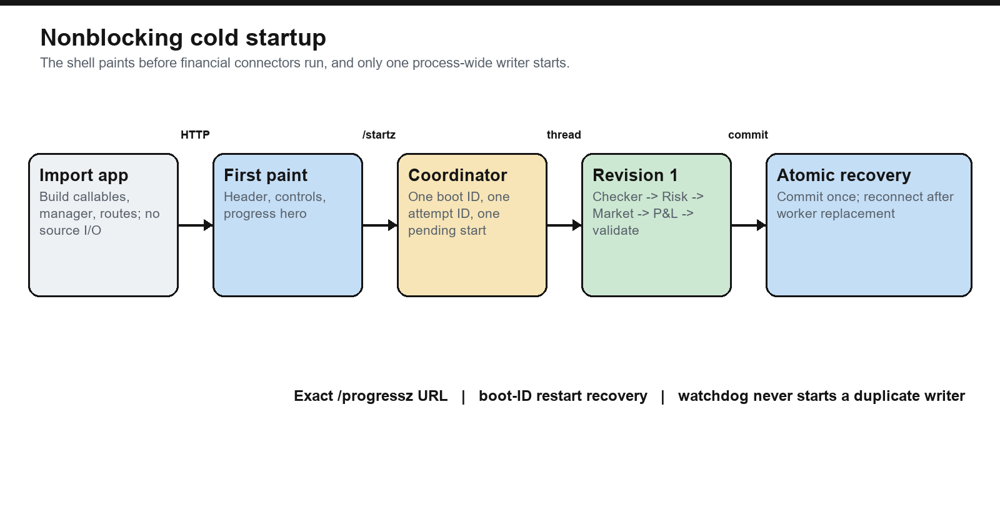
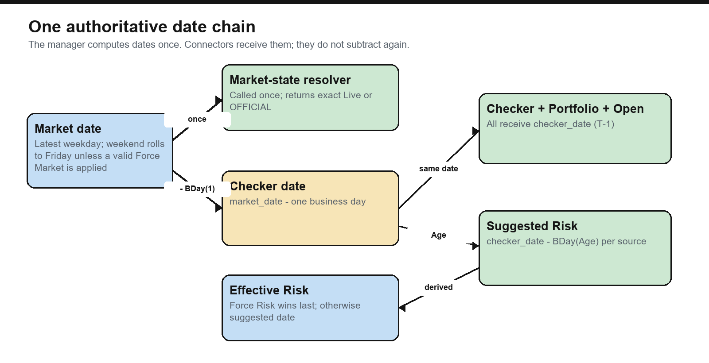
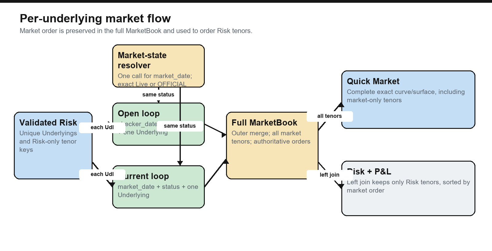

# Rebirth V3 — Risk & P&L

Rebirth is a reconstructed Dash application for loading dated risk, fetching per-underlying market
data, calculating product P&L, exploring the resulting cube, checking risk
readiness, and preparing governed P&L submissions.

The supplied recovery fragments are the primary source for this repository;
the clean Final Test implementation was used only to resolve missing or damaged
structure. The checked-in runtime is deliberately fixture-only: its connectors
read clearly marked fake CSV data and do not import private market libraries,
credentials, or production endpoints. Replace the feed boundary deliberately
before any production use.

No GitHub publication target or inherited Plotly Cloud application ID is
committed. A deliberate first publication must create or select its own remote
and deployment target.

## Start here

```powershell
python -m venv .venv
.\.venv\Scripts\Activate.ps1
python -m pip install -r requirements-dev.txt
python s01_app.py
```

Open <http://127.0.0.1:8050>. The navigation shell and refresh controls paint
first. The completed layout response then schedules one delayed background
worker; browser `/startz` and interval signals are idempotent recovery paths to
that same writer.

Run the quality gates with:

```powershell
python -m pytest -q
python -m ruff check .
python -m ruff format --check .
```

The clean suite covers schemas, dates, adapters, market routing, tenor order,
P&L, adjustment storage, UI components, native pages, feed caching, and a full
fake-data refresh. Run it locally; its collected count grows as
connector and page contracts are extended.
Dash 4.4 emits an upstream deprecation warning for native DataTable; that warning
is expected here because the governed editor deliberately does not use AG Grid.
It is not a failed quality gate, and the pinned Dash version is lifecycle-tested.

## Repository provenance

This checkout was reconstructed from supplied Rebirth source fragments. When
recovery inputs disagreed, a complete internally consistent supplied
implementation took precedence, followed by agreeing fragments, the clean
reference implementation for missing structure, and finally the smallest
explicit correction needed to make the combined public contract executable.
Transfer damage such as duplicated fragments, lost indentation, Markdown
fences inside source, orphaned tails, and proved token corruption was repaired;
financial formulas were not guessed from contradictory fragments.

The fixture boundary is deliberate. The checked-in application covers checker
readiness, Risk, Open, Current, portfolio governance, thresholds, reported
Underlying mapping, Stock, New Trades, XGAMMA, Colossus comparison, and local
P&L actions with visibly synthetic data. It calculates P&L through the real
validated pipeline rather than loading an unexplained output. Private
credentials, endpoints, market libraries, and unrecovered connector bodies are
not fabricated. Recovered site-owned bodies remain comment-only beside their
active CSV fallbacks so a production copy can switch them deliberately.

The source, tests, and this README are the complete maintained record. Do not
rely on an old test count or a removed migration guide; run the quality gates
above against the current checkout.

## The mental model

If you know ordinary Python but are new to Dash, remember this distinction:

- A Streamlit interaction commonly reruns the script from top to bottom.
- Dash creates a component tree once, then calls only the Python callback whose
  declared `Input` changed.
- A component has an `id`. A callback connects one or more component properties
  to Python. The callback returns new properties for its `Output` components.
- Expensive data belongs behind the refresh manager, not inside layout builders
  or every tab callback.

The application is therefore split into four layers:

1. **Connectors** retrieve canonical DataFrames.
2. **Core** validates, joins, calculates, caches, and commits a snapshot.
3. **UI preparation** converts the committed snapshot into display aggregates.
4. **Dash components and callbacks** render and update only what the user asked
   to see.


## File order and naming

Root, core, adapter, feed, tool, and test modules retain the `s01_`, `s02_`,
and later ordered names used by the original application. The `shared/` and
`pages/` packages use semantic filenames instead: cross-page infrastructure is
named by capability, while each native page owns its view, state, and callbacks.

Standard ecosystem names such as `README.md`, `.gitattributes`,
`requirements.txt`, `plotly-cloud.toml`, and `__init__.py` are unavoidable
tooling exceptions.

This root `README.md` is the authoritative manual for behavior implemented by
the current runtime. Versioned design specifications live under
`docs/rebirth-v3/`; they describe proposed behavior until code and tests prove
implementation, and V3.2 supersedes conflicts in earlier revisions. The two
root `rebirth_*guide.md` files are retained as historical audits, not
implementation authority. A regression test restricts Markdown to this manual,
those named historical audits, and the governed V3 documentation tree.

### Root

| File | Responsibility |
|---|---|
| `s01_app.py` | Composition root. Connects settings, feeds, Stock, storage, the unified lazy history root, P&L actions, and the Dash factory. Importing it does not load connector or archive data. |
| `s02_config.py` | Environment parsing and proxy/path configuration. |
| `s03_publish.py` | Builds a temporary Plotly runtime bundle and publishes it. The repository itself has no `app.py` forwarding shim. |
| `s04_server.py` | Gunicorn process/thread settings. |

### `core/`

| File | Responsibility |
|---|---|
| `s01_schema.py` | Canonical Portfolio identity plus one registry for Product, Activity, SignoffGroup, Category, Sub Category, and their roles. |
| `s02_pipeline.py` | Product catalogue, strict validation, date rules, market/risk joins, P&L, portfolio enrichment, refresh transaction, and progress. |
| `s03_search.py` | Revision-local indexed Risk Search and full-MarketBook Search. |
| `s04_pl.py` | Pure PLSEND mapping, aggregation, governance, canonical filtered Colossus/Predict history validation and period analysis, and adjustment overlays. |
| `s05_storage.py` | Validated, transactional `adjustments/date/portfolio--hash.csv` repository. |
| `s06_reporting.py` | Exact CSV validation and post-P&L attachment of `Reported Underlying`. |
| `s07_stock.py` | Strict dated Stock comparison, Stock-local filtering, and authoritative `many_to_one` Portfolio mapping. |
| `s08_saved_views.py` | One validated shared saved-filter catalogue with page-adapted requests, deterministic reads, atomic writes, and cross-worker locking. |
| `s09_cross_gamma.py` | Pure portfolio-level XGAMMA schema validation, MarketBook scope expansion, input-move development, output aggregation, and release. |
| `s10_new_trades.py` | Pure New Trades validation, row-local reference selection, ProductSpec MarketBook joins, P&L calculation, cash-flow identity treatment, and audit-detail retention. |
| `s11_risk_archive.py` | Strict, atomic flat-date Risk/Colossus/MarketBook/Stock archives, completed-date discovery, unique Portfolio authority, nonduplicating P&L-history projection, and bounded exact history readers. |
| `history.py` | Typed, lazy Risk/Market history queries, frozen ProductSpec ordering, bounded canonical grids, and exact source-row results. |

### `feeds/` and `adapters/`

| File | Responsibility |
|---|---|
| `feeds/s01_sources.py` | The site-owned boundary: checker, risk, market, portfolios, thresholds, Colossus P&L, senders, and manager composition. |
| `adapters/s01_common.py` | Exact-schema/status helpers shared by personal adapters. |
| `adapters/s02_ir.py` | Working IR Delta curve and IR DeltaVega surface examples. |
| `adapters/s03_fx.py` | FX Delta/Gamma/Vega contracts plus the recovered comment-only private builders. |
| `adapters/s04_credit.py` | Working Credit Delta curve and credit-measure example. |
| `adapters/s05_stock.py` | Validated replaceable `GetStock` boundary plus lazy, completed-leaf reads from the unified deterministic archive. |
| `adapters/s06_new_positions.py` | Strict raw `MARKET`/`CASHFLOW` New Trades blotter with Notional, traded-level availability, execution metadata, and deterministic fake Credit rows. |
| `adapters/s07_cross_gamma.py` | Strict portfolio-level Cross Gamma sensitivity adapter plus deterministic fake Credit matrices. |
| `adapters/s08_commo.py` | Working Commodity Delta curve example. |

Recovered private adapter bodies and the original shared `run_async` helper are
preserved as clearly marked, comment-only `REAL` blocks directly inside
`adapters/s01_common.py`, `s02_ir.py`, `s03_fx.py`, and `s04_credit.py`.
RiskChecker, Portfolio, sender, and product-registration blocks are likewise
inline in `feeds/s01_sources.py`, immediately before the active CSV fallback.
Each block has a two-step switch marker: uncomment `REAL`, then comment the
adjacent CSV fallback/return. The recovered pipeline differences are also kept
as comment-only blocks beside the active definitions in `core/s02_pipeline.py`:
MRX/MMM naming, ProductSpec formula metadata, Credit measure naming, and the
alternative Age arithmetic. The two recovered formula names whose calculation
engine was unavailable are explicitly marked reference-only rather than exposed
as an unsafe one-line switch. There are no separate `_disabled` source folders.

### `shared/`

| File | Responsibility |
|---|---|
| `contracts.py` | Protocols that keep pages independent from the concrete refresh manager and repositories. |
| `constants.py` | Governed view/filter dimensions, hierarchy fields, metrics, labels, and glyphs shared across pages. |
| `aggregation.py` | Canonical-to-display conversion, Risk filters, hierarchy aggregation, and tenor detail preparation. |
| `components.py` | Shared refresh shell, date/readiness controls, and cross-page component builders. |
| `saved_views.py` | Reusable saved-view controls and callback registration shared by Risk, Stock, and P&L. |
| `startup.py` | Process-local cold-start coordination and lightweight startup status. |
| `factory.py` | Dash/Flask construction, native page registration, shared shell, health, progress, and injected page services. |

### `pages/`

| File | Responsibility |
|---|---|
| `risk/` | Owns the Risk route, state/cache reducers, tables, charts, Quick Risk/Market search, full layout, and page-specific callbacks. |
| `pnl/` | Owns the P&L route/view, filter contract, pure governed editor helpers, Aggregate/history/send callbacks, and six-key archive validation. |
| `stock/` | Owns the Stock route/view, dated comparison, hierarchy and source-row rendering, page-only cache, stale-intent guards, saved filters, and callbacks. |
| `static_data/` | Owns the Statics route/view, path-safe CSV table builder, and page-only callback. |
| `not_found_404.py` | Prefix-safe native fallback for unknown URLs. |

The financial-page wrappers are deliberately manager-agnostic. They resolve
the active app's builders from Flask configuration, because Dash's page
registry is process-wide while tests and hosted workers can construct more than
one app factory. P&L, Statics, and Stock are compact page-owned vertical slices;
their financial dependencies are injected without importing another app.

### Other folders

- `assets/s01_style.css` is the pastel visual system.
- `assets/s02_app.js` owns keyboard shortcuts, delegated chevrons, cell-range
  selection, clipboard copying, selection dismissal, and progress polling.
- `assets/s03_select.js` keeps native Dash DataTable selections stable.
- `data/s01_*.csv` through `s09_*.csv` are explicit fake inputs;
  `data/histo/` is one unified daily archive whose completed leaves contain
  `risk.parquet`, `colossus.parquet`, `market.parquet`, `stock.parquet`, and
  `_SUCCESS`;
  `data/saved_views/shared/` is the runtime-local shared saved-filter catalogue.
- `tools/s01_fixtures.py` deterministically rebuilds the connector fixtures and
  the complete business-year archive; `--check` verifies byte-for-byte drift
  without changing the checked-in tree.
- `tools/s02_manual.py` creates the diagrams and this manual's PDF.
- `tools/s03_archive_official_risk.py` is the zero-argument, idempotent Python
  entry point used by the scheduled official archive job.
- `jobs/archive_official_risk.ipynb` is the thin Jupyter Scheduler notebook;
  its recurring-job setup and storage contract are documented in the
  JupyterHub scheduling section below.
- `jobs/explore_history.ipynb` is the no-server DuckDB notebook for querying
  the five governed annual-history views directly from Parquet.
- Tests are uniquely numbered from `s01_schema.py` through `s31_data.py`:
  schema, checker/dates, adapters, MarketBook, P&L/storage, UI, integration,
  feed cache, lazy P&L/factory behavior, targeted snapshot
  reads, deterministic fixture generation, cold-start ownership/watchdog, then
  the Plotly deployment bundle and entrypoint, reporting-identity mapping,
  supplied-risk overlays, shared refresh ownership, Stock, the isolated New
  Trades blotter contract, page-local Risk filtering, and exact isolation of
  inline recovered private connector blocks, the inline recovered pipeline
  contracts, refresh/date lifecycle contracts, shared saved views, and the
  expandable Colossus/Predict history explorer, portfolio-level XGAMMA
  validation/development, integrated New Trades reference/P&L publication, and
  the shared expandable-table visual contract, the official Validate P&L
  section, atomic official archive/scheduler behavior, and typed bounded V3.2
  history queries.

| Test file | Main boundary proved |
|---|---|
| `tests/s01_schema.py` | Portfolio registry and product/axis catalogue. |
| `tests/s02_checker.py` | Checker date, readiness completion, inventory, and progress-delay validation. |
| `tests/s03_adapters.py` | Executable IR, Commodity, and Credit personal-adapter examples. |
| `tests/s04_market.py` | Dynamic status routing, full MarketBook, risk-only join, and tenor order. |
| `tests/s05_pl.py` | P&L mapping/overlay and transactional adjustment storage. |
| `tests/s06_ui.py` | Lazy chevrons, the two-axis tenor contract, dynamic status/Move axes, exact-cell Quick Market history, selected New Trades detail, semantic total-row styling, and visible market ranks. |
| `tests/s07_integration.py` | End-to-end fake refresh, trading-timezone dates, one-call status routing/transitions, Portfolio-only preservation, and force validation. |
| `tests/s08_feeds.py` | Fake Source Type/Underlying partition reuse, official-cutoff handling, and Colossus source coverage. |
| `tests/s09_plui.py` | One-page-filter ownership, filtered Aggregate/Send All/individual sender behavior, filtered Histo table/chart parity, and no-config factory behavior. |
| `tests/s10_reads.py` | Defensive targeted reads copy only the requested committed frame. |
| `tests/s11_fixtures.py` | ProductSpec-driven fake schemas, annual Risk/Market/Colossus/Stock coverage, and exact deterministic generation/checking. |
| `tests/s12_startup.py` | Shell-first startup, one writer, no eager archive reads, pod-restart recovery, prefix routing, active-call watchdog, and retryable failures. |
| `tests/s13_publish.py` | Minimal Plotly bundle contents, native Cloud entrypoint discovery, deterministic archive-tag staging, runtime-history exclusion, and clean target configuration. |
| `tests/s14_reporting.py` | Cross-product Reported Underlying validation, post-P&L aggregation, thresholds, and raw-market separation. |
| `tests/s15_overlays.py` | XGAMMA/New Trades supplied-risk overlay validation, replacement, atomic publication, and dashboard release. |
| `tests/s16_refresh_shell.py` | Shared refresh controls remain single-owner and interactive across native navigation. |
| `tests/s17_stock.py` | Exact `GetStock` schema, lazy completed-leaf reads, dated outer comparison, Portfolio mapping/filtering, page cache, table, and page service. |
| `tests/s18_new_positions_adapter.py` | Raw New Trades `MARKET`/`CASHFLOW` schema, required Risk, optional Notional and execution metadata, `Traded True` behavior, identity, fake Credit rows, and cash-flow P&L. |
| `tests/s19_risk_filters.py` | Portfolio View-by/filter support, Risk-local include/exclude semantics, consumer wiring, Quick Market history callback ownership, and Stock-state isolation. |
| `tests/s20_connector_provenance.py` | Inline switch markers, recovered symbols, comment-only isolation, adjacency, and continued fake-CSV registration. |
| `tests/s21_pipeline_provenance.py` | Inline recovered pipeline markers plus proof that the validated CSV-compatible formulas/date contract remain active. |
| `tests/s22_refresh_dates.py` | Force-date click-order lifecycle contract and explicit RiskChecker fallback-age display. |
| `tests/s23_saved_views.py` | Shared-catalogue validation, atomic create/update/delete, Base/reset requests, page-state isolation, safe names, and filter-output ownership. |
| `tests/s24_plhistory.py` | Lazy six-level Colossus/Predict hierarchy, period comparisons, WTD/date windows, type selection, and observed-only chart behavior. |
| `tests/s25_cross_gamma.py` | Exact XGAMMA matrix schema, adapter-owned XGamma/XGamma Vega source classification, ProductSpec axes, MarketBook scope, stored-Move development, output summation, and fail-closed input/output-market behavior. |
| `tests/s26_new_trades.py` | Integrated traded-level/Open-reference P&L, official-market preservation, Cash Flow identity calculation, execution metadata, and manager publication. |
| `tests/s27_expandable_visuals.py` | Shared hierarchy-toggle glyphs, dimensions, spacing, browser synchronization, and removal of obsolete Stock level captions. |
| `tests/s28_validate_pl.py` | Completed-date discovery, strict Portfolio authority, mapped/Unmapped P/C presentation, shared-filter semantics, section-local chevrons, and deterministic archive examples. |
| `tests/s29_risk_archive.py` | Schema-v4 Parquet Risk/Colossus/MarketBook/Stock archives, v1-v3 read compatibility, atomic publication, governed P&L projection, exact lazy history reads, and scheduled-job configuration. |
| `tests/s30_history.py` | Typed V3.2 history handoffs, bounded exact Risk/Market queries, null-preserving grids, and frozen/ambiguous order handling. |
| `tests/s31_data.py` | Native Data-page handoff, query-only archive reads, ProductSpec charts, local playback, exact tables, and generation-safe cache reset. |

## What happens on startup



1. Python imports `s01_app.py` and creates connector callables, the manager,
   repositories, and the Dash app. It does **not** call the checker or risk.
2. The browser receives the header, page links, refresh strip, and progress hero.
3. After that first layout response, the server schedules the initial refresh
   with a short delay. The browser also calls the idempotent `/startz` endpoint,
   while `initial-load-trigger` remains an independent fallback. All three paths
   converge on the same process-wide `StartupCoordinator`; none can create a
   duplicate writer.
4. The coordinator assigns a server boot ID and attempt ID, then creates one
   daemon worker. Other browsers follow that exact attempt.
5. The manager builds revision 1 outside the Dash request thread. `/progressz`,
   `/startz`, and `/healthz` remain lock-light and responsive.
6. Only after the whole snapshot validates does the manager atomically commit
   it. The browser mounts the full page once. If a Plotly pod restarts during
   this sequence, the changed boot ID is detected, an idle replacement worker is
   restarted idempotently, and a request-fresh layout can recover the completed
   revision.

App construction and the cold shared shell only bind `data/histo` as a path.
They do not enumerate date leaves, read `_SUCCESS`, or load annual Risk, Market,
P&L, or Stock Parquet frames. Stock reads its selected dates inside its page callback;
Validate P&L, Histo P&L, Quick Market history, and typed archive queries likewise
read only after their page-local disclosure or query is requested.

The default startup watchdog is 2,400 seconds. A watchdog expiry reports the
active function/source/underlying and keeps following the original worker. It
does not start a second writer while an unknown connector call is still alive.
Every real HTTP, database, or file connector should also have its own I/O
timeout; Python cannot safely kill an arbitrary blocked thread.

The progress hero is not a scripted animation. The manager writes the actual
callable name, Source Type, Underlying, loop position, stage, and update time to
an independently readable progress object. The browser polls the exact public
`/progressz` URL supplied by the server without taking a snapshot DataFrame
lock. The Flask route separately uses the internal route prefix, so reverse
proxies cannot silently send progress requests to the wrong path.

A transport failure now says that refresh state is **not confirmed**, includes
the actual timeout/HTTP/content error, and retries with bounded backoff. It never
claims that a refresh is still being followed without server evidence. After a
long connection loss the page performs one guarded recovery reload; a
request-fresh Dash layout serves the completed revision if it already exists.
A persistent connector failure is logged with an incident ID and exposes Retry
without publishing a partial snapshot.

**Clear Cache** advances a process-local reset generation with compare-and-swap
semantics, then forces one full Risk + P&L transaction. Every ordinary browser
refresh carries the generation it rendered, and each commit rechecks the
captured generation under the state lock. A slow pre-reset writer therefore
cannot republish old data or retained metadata. A successful reset clears
forced Risk/View dates while preserving the committed Commodity and RiskChecker
settings; a failed reset keeps the exact last-good financial frames and exposes
Failed/Retry status. Only reconstructable page/query caches are cleared.

## Date chain



The manager computes dates once and passes them to connectors. Connectors must
not quietly recalculate them.

```text
system_date = the manager's calendar date in CUBE_MARKET_TIMEZONE
natural_market_date = latest weekday on or before system_date
market_date = forced/view date if supplied, otherwise natural_market_date
market_status = get_market_state(market_date) -> exactly Live or OFFICIAL

market_date
    ├── Current / status date = market_date
    └── checker_date / Open date = market_date - BDay(1)
          ├── get_risk_checker(checker_date)
          ├── get_portfolio_config(checker_date)
          ├── market_open(checker_date, ...)
          └── suggested risk date per source
                = checker_date - BDay(Age)
                └── optional Force Risk date wins last
```

Examples:

- Market Monday -> checker Friday.
- A natural Saturday or Sunday -> Market Friday -> checker/Open Thursday.
- `Age = 0` -> risk uses checker Friday.
- `Age = 1` -> risk uses the preceding Thursday.
- A missing known Risk Type/Risk Greek readiness pair is inserted with `Age = 0`
  and `Age Defaulted = True`.
- Age may be any nonnegative integer. Booleans, fractions, negatives, unknown
  pairs, and duplicate pairs fail validation.
- A forced Market/View Date must be a business day, not be in the future, and
  remain inside the configured history window.
- A forced per-source Risk Date must meet the same rules and cannot be later
  than the derived checker date. It is applied last, after readiness Age.

The injected `market_status_resolver(market_date)` is the only boundary that
decides Live versus OFFICIAL. Core never guesses from today versus historical.
One normal refresh calls the resolver once, validates its exact string, stores
it on `RefreshSnapshot.market_status`, writes it to readiness/MarketBook rows,
and passes it unchanged to every enabled Open and Current connector. The status
is shared; their dates are not: Open receives checker/T-1 and Current receives
Market Date. A
Portfolio-only refresh does not call it and preserves the committed status.

The checked-in fake resolver models the desk cutoff explicitly: an earlier
market date is `OFFICIAL`; today's market date is `Live` before 22:00 and
`OFFICIAL` from 22:00 in `CUBE_MARKET_TIMEZONE`. That clock rule belongs only to
the fixture boundary. Production must replace `get_market_state` with the real
source-status service; neither the manager nor the archive writer hardcodes a
second status convention.

While a different Market Date is only a client draft, the date panel says
**Resolved on apply** instead of predicting a status. Apply invokes the real
resolver as part of the refresh transaction.

The single checker function returns two DataFrames atomically:

```python
def get_risk_checker(
    checker_date: pd.Timestamp,
) -> tuple[pd.DataFrame, pd.DataFrame]:
    readiness = ...  # Risk Type, Risk Greek, Age
    inventory = ...  # Risk Type, Risk Greek, MMMFile, Product
    return readiness, inventory
```

When RiskChecker is On, each Risk/PL refresh calls this function exactly once
before it plans product dates, so readiness and inventory come from the same
dated observation. The smaller **Refresh Portfolios** action does not rerun it;
it intentionally uses the checker date already committed on the snapshot.

The inventory is allowed to be partial. It does not need every supported Greek.
Each `MMMFile` must end in `.mmm`, and `Product` is exactly `XVA` or `Hedges`.
The Risk Checker inventory table is not serialized into the page until its
native chevron is opened.

The date panel shows Suggested Market Date, the suggested checker/risk date, and
each source's system/applied Risk Date separately. The checker inventory states
the exact checker date it loaded. Force Market Date and Force All Risk are
explicit checkboxes, with per-source Risk overrides below them. Editing creates
a client draft; **Apply date settings** validates and refreshes it against the
current snapshot revision, while **Cancel** restores the committed dates.

## Canonical vocabulary

These names mean one thing everywhere:

| Column | Meaning | Examples |
|---|---|---|
| `Source Type` | Connector/product contract | `ir/delta`, `ir/gamma`, `credit/vega` |
| `Risk Type` | Large family | `IR`, `FX`, `Credit`, `Commo` |
| `Risk Greek` | Measure within a family | `Delta`, `Gamma`, `DeltaVega`, `Vega` |
| `Product` | Position partition | `XVA`, `Hedges` |
| `Underlying` | Market/risk instrument identity | `USD SOFR`, `EUR/USD` |
| `Reported Underlying` | Post-P&L reporting identity; may combine raw Underlyings | `CNx` for `CNY` + `CNO` |
| `Group` | Opaque hierarchy label supplied by Risk | `G10`, `Desk A`, any connector value |
| `Tenor Swap` | The only axis for a curve; surface x-axis | `1Y`, `5Y`, `30Y` |
| `Tenor Option` | Surface y-axis; blank for a curve | `1M`, `1Y` |
| `Open` | Opening quote | numeric |
| `Current` | Numeric quote selected by `Market Status` | numeric |
| `Move` | `Current - Open` at unique quote grain | numeric |
| `Market Status` | Which current source was used | `Live` or `OFFICIAL` |
| `Market Available` | Whether the row has a usable pair for P&L; Commo-Off supplies an explicit structural zero pair | boolean |
| `Market Data Status` | Availability/disable reason, not a quote-source selector | `Available`, `No matching market row` |
| `Risk Date` | Effective per-source risk date after Age/force rules | date |
| `Market Date` | Resolved business date used by Current and status; Open receives the preceding business day | date |
| `Risk`, `dRisk` | Authoritative connector values | numeric |
| `PL` | Product formula output | numeric or unavailable |
| `MMMFile` | Checker inventory filename | `ir_delta_expo.mmm` |

There is no numeric column named `Live` and no mixed status pseudo-column. The
numeric field is always `Current`; the separate
`Market Status` tells you whether `Current` came from Live or OFFICIAL.

## Connector contracts

Connector boundaries reject aliases and malformed schemas. Adapt source-specific
names inside your personal function, then return the exact public columns.

### Risk checker

```text
input:  checker_date
output 1 columns, exact order: Risk Type, Risk Greek, Age
output 2 columns, exact order: Risk Type, Risk Greek, MMMFile, Product
```

### Risk

```text
input:  risk_date, Source Type
base output: Underlying, [tenor axes], Portfolio, Group, Risk, dRisk
```

`Risk` and `dRisk` are already authoritative. The pipeline never renames a
generic `Value` or `Change` into them. Credit may additionally return:

```text
Risk SP01, dRisk SP01
Risk PSP01, dRisk PSP01
Risk PM01, dRisk PM01
Risk PM01P, dRisk PM01P
Risk Theta, dRisk Theta
Risk JTD, dRisk JTD
```

`Group` is authoritative from each Risk connector. The framework requires the
column because it is part of the table hierarchy, but it does not classify,
rewrite, normalize, or restrict its values in the core pipeline. `G10`, `Desk
A`, `Rates Core`, and any other connector value are treated identically.

The Risk boundary still validates the surrounding financial contract: required
columns, product identity, nonblank position keys, finite numeric Risk/dRisk,
complete optional Credit measure pairs, and duplicate position keys. There is
deliberately no Group allow-list or Group-content validator. The UI converts
values to display text only when it builds its own presentation copy.

### Market status resolver

```text
input:  market_date
output: exactly the string Live or OFFICIAL
calls:  once per normal refresh, before per-Underlying market loops
```

Replace `feeds/s01_sources.get_market_state` with the real site status service:

```python
def get_market_state(market_date: pd.Timestamp) -> str:
    status = market_state_api.for_date(market_date, timeout=10)
    if status not in {"Live", "OFFICIAL"}:
        raise ValueError("unexpected Market Status")
    return status
```

Do not choose a status inside product adapters. They receive this one validated
result so every product in a snapshot uses the same state.

### Opening and current market

```text
input:  market_date, one Underlying, market_status
Open output:    Underlying, [tenor axes], [axis orders], Open
Current output: Underlying, [tenor axes], [axis orders], Current
optional current output column: Market Status
```

If `Market Status` is returned, every row must exactly match the manager's
`market_status` argument. The current function chooses its upstream source from
that argument:

```python
def my_current(market_date, underlying, *, market_status):
    if market_status == "Live":
        records = live_api.fetch(market_date, underlying, timeout=20)
    elif market_status == "OFFICIAL":
        records = official_api.fetch(market_date, underlying, timeout=20)
    else:
        raise ValueError("unexpected Market Status")

    frame = pd.DataFrame(records)
    return frame.rename(columns={"quote": "Current"})[
        ["Underlying", "Tenor Swap", "Tenor Swap Order", "Current"]
    ]
```

There is intentionally no batch API in the framework. It loops internally over
the stable unique Underlyings from validated Risk. Each per-Underlying result is
validated before the all-or-nothing product frame is assembled. The checked-in
fake connector caches narrow Source Type/Underlying CSV partitions so this loop
demonstrates the production call shape without rereading the whole fixture for
every Underlying.

### Portfolio config

```text
input: checker_date
required: Portfolio, Product, Activity, SignoffGroup, Category
optional registered field: Sub Category
```

To add a new field such as `Desk`, add one `PortfolioField` in
`core/s01_schema.py`. Its roles decide whether it appears as a view dimension,
filter, PL metadata, or position field. The other layers derive their lists from
that registry; do not add separate hardcoded lists.

### Thresholds and PLSEND mapping

Thresholds use exact columns:

```text
Risk Type, Risk Greek, PL, Risk, dRisk
```

The P&L-send mapping uses:

```text
Risk Type, Risk Greek, ConcertoField
```

Both mappings require one row per Risk Type/Risk Greek pair. A ConcertoField may
belong to only one pair.

### Reported Underlying mapping

`data/s09_reported.csv` uses these exact columns:

```text
Risk Type, Risk Greek, Underlying, Reported Underlying
```

`Underlying` remains the raw market and P&L identity. Each product first joins
its own market and calculates P&L; only then does this CSV attach the reporting
label. A missing source row falls back to its unchanged `Underlying`. The source
key Risk Type + Risk Greek + Underlying must be unique, while any number of
source rows may intentionally share one Reported Underlying for aggregation.
Quick Market continues to search and display raw Underlying identities.
**Refresh Portfolios** reloads this CSV and atomically rebuilds its dependent
reporting views.

## Product and tenor catalogue

The product registry in `core/s02_pipeline.py` is the authoritative place for
Source Type, Risk Type, Risk Greek, axes, market unit, and formula.

| Source Type | Risk Type / Greek | Axes | Formula move |
|---|---|---|---|
| `fx/delta` | FX / Delta | none | percentage |
| `fx/gamma` | FX / Gamma | none | Taylor gamma |
| `fx/vega` | FX / Vega | `Tenor Swap` | absolute |
| `ir/delta` | IR / Delta | `Tenor Swap` | absolute |
| `ir/gamma` | IR / Gamma | `Tenor Swap` only | Taylor gamma |
| `ir/deltavega` | IR / DeltaVega | `Tenor Swap × Tenor Option` | percentage |
| `ir/xccy` | IR / XCCY | `Tenor Swap` | absolute |
| `ir/xccyvega` | IR / XCCYVega | `Tenor Swap × Tenor Option` | percentage |
| `ir/inflation` | IR / Inflation | `Tenor Swap` | absolute |
| `ir/inflationvega` | IR / InflationVega | `Tenor Swap × Tenor Option` | percentage |
| `ir/basis` | IR / Basis | `Tenor Swap` | absolute |
| `ir/bond` | IR / Bond | `Tenor Swap` | absolute |
| `credit/delta` | Credit / Delta | `Tenor Swap` | absolute |
| `credit/vega` | Credit / Vega | `Tenor Swap` only | absolute |
| `commo/delta` | Commo / Delta | `Tenor Swap` | percentage |
| `commo/vega` | Commo / Vega | `Tenor Swap` | absolute |

IR Gamma and Credit Vega are therefore curves, not hardcoded surfaces. True
surfaces have arbitrary `M × N` dimensions; there is no 3×3 assumption.

### Market-owned tenor order



A normal refresh first calls the injected status resolver once for the selected
Market Date. It then uses that single result for every Source Type:

1. Validate Risk.
2. Extract stable, unique Risk Underlyings.
3. Call Open once per Underlying with `Market Date - BDay(1)` and the resolved status.
4. Call Current once per Underlying with Market Date and the same status.
5. Validate `Tenor Swap Order` and, for a surface, `Tenor Option Order`.
6. Preserve the complete merged MarketBook, including market-only tenors.
7. Left-join MarketBook to Risk. The risk result therefore contains only Risk
   tenors, sorted by the matching market order.

“Preserve” here first means the complete MarketBook is held in the current
committed in-process snapshot and its exact-search catalog. It survives later
failed refreshes because the last good snapshot is retained. Once an OFFICIAL
snapshot is archived, the same quote-grain projection is also persisted as the
date leaf's `market.parquet`, so Quick Market can provide cross-restart daily
history without treating the live process as a database.

For example, the fake USD IR Delta market contains `1Y, 5Y, 10Y, 30Y`, while
Risk contains only `1Y, 5Y, 10Y`. Quick Market Search shows all four in market
order; Quick Risk Search shows only the three Risk tenors.

Tenor labels are categorical and equally spaced on charts. A sequence such as
`10Y, 11Y, 15Y` uses the exact supplied order without pretending the visual gap
from 11Y to 15Y must be four times wider.

## P&L calculation

Let:

```text
raw_move = Current - Open
```

The registry selects one formula:

```text
absolute move:   pnl_move = raw_move
percentage move: pnl_move = raw_move / Open
ordinary PL:     PL = Risk × pnl_move × product multiplier
```

A zero Open makes percentage P&L unavailable. Missing or incomplete market data
also makes P&L unavailable; the engine does not silently replace missing quotes
with zero. The deliberate exception is **Commo Off**, which skips those
connectors and constructs an explicitly labelled structural zero pair so the
disabled family cannot break the page.

Taylor products use metadata rather than product-name branches:

```text
taylor_move    = raw_move × gamma_move_scale
developed_risk = Risk × taylor_move / gamma_risk_step
PL             = 0.5 × developed_risk × taylor_move × multiplier
```

The sourced Gamma row keeps authoritative Risk/dRisk and Taylor P&L. A derived
Delta row is emitted only when market is complete; it has developed Risk,
`dRisk = unavailable`, and zero P&L.

The checked-in multipliers default to 1. Confirm real quote units and supply
product multipliers when composing the manager before production use.

## Refresh controls

The top strip is the first application section:

- **Refresh Portfolios** calls the dated portfolio mapping, reloads the Reported
  Underlying CSV, and rebuilds their dependent views. Its date is the checker
  date.
- **Refresh Risk** forces every risk product, both market legs, P&L, config, and
  thresholds through a new transaction.
- **Refresh PL** forces the Current market/P&L path and conditionally reloads
  risk when readiness dates changed. `Shift+F9` clicks this same button.
- **Commo** defaults Off. Off means commodity market connectors are not called;
  commodity Open, Current, Move, and P&L are explicitly zero so the page remains
  structurally valid.
- **RiskChecker** controls the combined checker call. Off skips it, uses Age 0
  for all known pairs, and exposes an empty inventory.
- **AutoPL** controls the 15-minute automatic P&L refresh.
- The moon/sun button is right-aligned and changes only theme state.

The status sentence reports last success, the number of unforced Age-0/T-1
sources, and the number of forced sources. The AutoPL switch itself shows its
browser-local state. During a call, the hero shows the actual function, Source
Type, Underlying, and loop position while the last committed snapshot remains
usable.

## Visual rules

The stylesheet has one coherent pastel system rather than page-specific theme
overrides:

- the page canvas is plain white with light pastel-grey outlines;
- index columns, including their headers, use the invariant pastel-blue index
  token (`#C4D5F5` in light mode) with black text and 2px black solid edges;
- semantic Total columns, and the Cross view P&L column, use `#FFFEE0` with
  black text and 2px black solid edges;
- table separators are always solid: ordinary hierarchy emphasis uses 1px
  rules and total/index emphasis uses 2px rules; there are no dotted or dashed
  table borders;
- negative numbers remain red, while risk rows and totals remain bold;
- disclosure chevrons are plain controls, with no circle or yellow badge; and
- dark mode keeps both pastel fills and black text so contrast is not inverted,
  while all date inputs, disabled forced-date fields, date ranges, and calendar
  popovers inherit the dark surface and text tokens.

Yellow is therefore a semantic total/P&L cue, not a general highlight colour.
The same rules cover the main tables, searches, previews, and editable native
Dash DataTables.

## Reporting dimensions, page-local filters, and shared views

Portfolio is a first-class governed UI reporting dimension as well as the
position key.
`shared/constants.py::PORTFOLIO_UI_FIELD` adds it to both
`VIEW_DIMENSION_FIELDS` and `FILTER_DIMENSION_FIELDS` without duplicating
Portfolio inside the core Portfolio-metadata registry. It therefore appears in
View-by controls such as the Risk table and Aggregate P&L alongside Product,
Activity, Signoff Group, Category, and Sub Category. Activity remains the
default View-by choice.

The Risk filter bar is one five-column desktop row in this exact order:
Activity, Signoff Group, Portfolio, Category, and Sub Category. Multiple values
inside one filter are ORed, while populated filters are ANDed with one another;
blank selections are unrestricted. For example, Activity `Credit` with
Portfolio `B` and `D` means `Credit AND (B OR D)`. A row needs one of those
Portfolios—it cannot be in both `B` and `D` at once. The page-local
**Exclude rows matching any selected value** checkbox is unchecked by default:

- unchecked: a row must match one selected value in every populated field;
- checked: each populated set is complemented, so a row must avoid the selected
  values in every populated field. In the example, that is
  `NOT Credit AND NOT (B OR D)`. It removes Credit rows everywhere and B/D rows
  in every Activity; it is deliberately not just `NOT (Credit AND (B OR D))`.

Risk Type and Split remain ordinary inclusion controls and are not inverted by
that checkbox. The reporting filters and mode feed Aggregate P&L, Top Book,
Risk Explorer and its detail, and Quick Risk. Unmapped Books can use only the
Portfolio subset because unmapped rows have no governed reporting metadata.

Risk, Stock, and P&L use separate IDs, stores, active-view values, and Exclude
checkboxes. Navigating or filtering one page therefore does not alter either
other page's live selection.

The named-view catalogue is nevertheless shared by all three pages. A view
created in Risk is offered in Stock and P&L, but it affects Stock or P&L only
after the user explicitly selects it there. Each page has one collapsed
**Saved views** disclosure. Its summary shows **Saved views** and the current
view name—**Base / No view** initially, or the selected named view—so the active
context stays visible without permanently showing the editor.

Opening the disclosure reveals the view selector, new-name input, **Save New**
or **Update View**, **Delete**, status/persistence copy, and the full
include/exclude guidance. The authoritative five filters sit directly below
those controls inside the same disclosure in the exact order Activity, Signoff
Group, Portfolio, Category, and Sub Category. The page-local **Exclude rows
matching any selected value** checkbox is part of that same filter panel.
Closing Saved views therefore hides both the editor and selectors without
changing their values or the filtered result.

The always-present **Base / No view** option clears that page's five filters and
restores include mode. With Base active, **Save New** creates a named view; with
a named view active, the same action becomes **Update View** and atomically
replaces that view's filter definition. Saving or selecting a named view updates
the collapsed summary label; deleting or resetting it returns the page and
label to Base.

Named views are validated JSON under `data/saved_views/shared/`. Applying one
submits a small component request to the active page's existing sole
filter-output callback, so shared views do not introduce duplicate Dash output
owners or cross-page live state. Names are normalized and path-safe, writes are
atomic, and a short filesystem lock serializes workers. Plotly's app filesystem
is runtime-local, however: saved views may be lost after a restart or redeploy.
Move this repository boundary to an approved durable database or object store
when cross-deploy persistence is required.

## Risk Explorer and detail charts

The main tables use one hierarchy engine and market-aware aggregation. Changing
Risk Type, IR family, Cross/SplitVA, dimension, or credit measure rebuilds only
the visible table. Rendered table trees and filtered frames use small bounded
revision-local caches.

IR keeps three family tabs. Delta orders `Delta`, `Inflation`, `Gamma`, `Bond`,
then `XGamma`; Basis orders `XCCY`, then `Basis`; Vega orders `DeltaVega`,
`InflationVega`, `XCCYVega`, then `XGamma Vega`. The XGamma source sensitivities
therefore remain visible inside the corresponding ordinary Delta/Vega family
rather than creating separate tabs.

Top Book Exposures is also lazy: its disclosure starts with no table children.
On first open, `default_top_book_open_rows` expands Label, Risk Type, and Risk
Greek so the Underlying rows are immediately visible. Change that helper—not
table height CSS—if a different default hierarchy depth is wanted.

Credit SplitVA has the same selectable measures as Credit Cross: SP01, PSP01,
PM01, PM01P, Theta, and JTD when those columns are present.

The detail area has exactly two logical pickers:

1. Measure: Risk, dRisk, P&L, or Move.
2. Component:
   - Risk/dRisk/P&L: Total, XVA, or Hedges.
   - Move: Move, Open, or Market Status.

For a one-axis product, the chart is a Tenor Swap line. For a true two-axis
product, Auto chooses a surface; the user can explicitly choose Tenor Swap
line, Tenor Option line, or Surface. Surface size comes from the data. The
diverging pastel scale maps
negative values to red, zero near white, and positive values to green.

Risk/dRisk/P&L line charts show Total on the primary axis and XVA/Hedges on the
secondary axis. If the user selects dRisk Hedges, both visible pickers remain on
dRisk and Hedges.

## Quick Risk Search and Quick Market Search

Both are native collapsible sections: the browser opens the shell immediately,
then the odd/even click gate loads content only while that disclosure is open.
Closing it prevents later snapshot revisions from rebuilding hidden tables.

### Quick Risk Search

`Combine Udl` is an exact searchable dropdown built from:

```text
Risk Type | Risk Greek | Reported Underlying
```

Quick Market keeps the raw `Underlying` instead. Typing words such as
`ir delta cnx`, `IR DELTA CNX`, or any mixed-case equivalent narrows the same bounded
list of exact reporting identities; it is not a free-text row query. The
catalog precomputes one exact identity-to-row map and does not build a
position-level posting index. Selecting one identity builds a parent/child
pivot with chevrons. Default Quick Risk index fields are Reported Underlying,
Underlying, Tenor Swap, and Tenor Option, so a reported `CNx` can expand into
raw `CNY` and `CNO`. Tenor Option is pruned automatically for one-dimensional
products and the visible picker is synchronized. Portfolio and any registered
reporting dimension can be added/reordered. The hierarchy rerenders when the
index choice changes.

Risk, dRisk, and P&L aggregate from position grain. Open, Current, and Move are
aggregated independently from unique quote grain, so a market quote is never
weighted merely because one Portfolio has more rows. They remain blank at a
many-to-one Reported Underlying parent and appear only when the raw Underlying
level is reached.

### Quick Market Search

The current table and tenor chart read the full committed MarketBook, never the
risk-joined dashboard. Its exact dropdown uses Risk Type, Risk Greek, and raw
Underlying, and the result includes market-only tenors. Line charts plot Open
and the actual dynamic Market Status on the primary axis and Market Move on the
secondary axis; surfaces show one selected Open, dynamic-status, or Move
heatmap. Move is always derived as `Current - Open`. The selector and displayed
current-column/trace label use `Live` or `OFFICIAL` from the committed snapshot,
while the canonical numeric storage column remains `Current`.

The historical panel then calls
`load_market_history_for_identity(root, risk_type, risk_greek, underlying)`
against that same exact raw identity in `PL_HISTORICAL_PATH`. For a curve or
surface, the **Historical quote cell** selector chooses one exact Tenor Swap +
Tenor Option cell in connector-owned rank order. The chart plots that cell's
stored `Current` once per Market Date. It never averages incompatible tenors,
weights quotes by Portfolio, or fills a missing date/value with zero. The
current in-memory quote replaces any archived point for today's date and is
therefore authoritative for today; if today's Current is unavailable, no fake
today point is plotted.

History is stored as an immutable `market.parquet` inside each unified daily leaf,
beside Risk, Colossus, Stock, and the completion marker rather than in one
append-only long CSV. Each leaf can be staged and published atomically, retried
idempotently, validated by digest, and cached independently. A single
ever-growing file would require cross-job append locking, risk a partial tail,
and force unrelated dates to share one rewrite/failure boundary.

## Table selection and clipboard behavior

Non-editable HTML tables support spreadsheet-like selection:

- drag across cells;
- Shift/Ctrl/Command add to a selection;
- index cells are selectable and copied too;
- `Ctrl+C`/`Command+C` copies a tab/newline grid suitable for Excel;
- the summary reports count, sum, average, min, and max for numeric cells;
- Escape, the summary close button, clicking outside, a route change, or a table
  rerender clears the selection bubble.

The SOG and Portfolio adjustment editors use native Dash DataTable rather than
AG Grid. They keep fixed row geometry, app typography, dropdown governance, and
native scrolling. Their values are copied through the DataTable/browser
interaction rather than the read-only table selection engine.

## P&L workflow and adjustments

The governed send workflow lives on the native `/pnl` page. It is no longer
mounted inside Risk, and its controls remain independent top-level sections
rather than one nested parent. Aggregate P&L is always visible; its Risk Type
rows use page-local chevrons to reveal or hide the corresponding Risk Greek
rows.

The page has exactly one filter state. Its five selectors are nested in the
P&L **Saved views** disclosure in the order Activity, Signoff Group, Portfolio,
Category, and Sub Category, followed by the include/exclude mode. The exact
component IDs are `pnl-activity-filter`, `pnl-signoffgroup-filter`,
`pnl-portfolio-filter`, `pnl-category-filter`,
`pnl-subcategory-filter`, and `pnl-filter-exclude-selected`. Include mode is OR
within one selector and AND across populated selectors; exclude mode removes a
row if it matches any selected value in any populated selector. Matching is
case-insensitive and displayed values keep their canonical spelling.

That one state is authoritative for the Aggregate table, Send All, the SOG and
Portfolio selectors/editors/senders, Validate P&L, and both the Histo P&L table
and chart. A saved P&L view stores those exact values and mode. For example, if
Portfolio B and D are selected, **Send All P&L** sends only the governed B-or-D
scope (plus applicable saved adjustments), never the unfiltered page payload.
Changing the page filter invalidates a previously loaded editor until that
editor is reloaded under the new governed scope.

1. **Aggregate P&L** — rebuild the mapped totals and expandable Risk Type/Greek
   hierarchy from the filtered rows.
2. **Send All P&L** — build the filtered governed effective P&L once, including
   in-scope saved adjustments, then send defensive copies to both the SOG and
   Portfolio destinations. Both destinations are attempted independently and
   the status reports full success, partial delivery, or total failure.
3. **SOG P&L** — choose an in-scope SignoffGroup, edit governed rows, save
   adjustments, then call `send_sog_pl` for that SOG.
4. **Portfolio P&L** — choose an in-scope Portfolio, edit governed rows, save
   adjustments, then call `send_portfolio_pl` for that Portfolio.
5. **P&L Explorer** — contains Validate P&L and Histo P&L under the same page
   filter rather than creating another filter bar.
6. **Validate P&L** — select one completed official date and compare the Risk
   Explorer snapshot's Risk, dRisk, and Predict P&L (`P`) with Colossus P&L
   (`C`) in a Signoff Group → Risk Type → Risk Greek → Underlying → Product →
   Portfolio hierarchy.
7. **Histo P&L** — lazily expand that same six-level hierarchy and compare the
   Colossus and Predict daily series for any selected filtered scope.

The former user-facing Raw Data disclosure has been removed. **Aggregate P&L**
and **Unmapped Books** remain on the native Risk page; Send All, SOG, Portfolio,
P&L Explorer, Validate P&L, and Histo belong only to `/pnl`.

There is one history root: `data/histo` by default, overrideable with
`PL_HISTORICAL_PATH`. **Validate P&L**, **Histo P&L**, and the Quick Market
historical panel all read that same root. Every checked-in date leaf has one
schema-v4 contract:

```text
<PL_HISTORICAL_PATH>/<YYYY-MM-DD>/
    risk.parquet
    colossus.parquet
    market.parquet
    stock.parquet
    _SUCCESS
```

Predict (`P`) is derived from the same `risk.parquet` `PL` values displayed by
Risk Explorer. Colossus (`C`) comes from the exact Portfolio + Underlying + Risk
Type + Risk Greek rows in `colossus.parquet`; Portfolio reporting authority is
attached only when the archived Risk rows prove it uniquely. `market.parquet`
is the complete raw-quote MarketBook used by exact Market history and has no
Portfolio column. `stock.parquet` is the same-date governed Stock source.
`_SUCCESS` declares schema version 4, the matching Market/Stock date, columns,
row counts, SHA-256 digests,
and the deterministic fixture tag for checked-in leaves. Readers ignore partial
directories and fail closed on extra, missing, mismatched, or corrupt files.

History access is lazy. `build_market_history_loader` only binds the root;
`load_shared_pl_history` catalogs P/C rows only when Histo P&L is opened;
Validate P&L and Stock read selected completed leaves; exact Risk/Market history
uses `ArchiveHistoryRepository` with bounded date/row limits and ProductSpec
axis order. Historical source rows remain available beside the null-preserving
canonical chart grid. Compatibility readers for explicitly supplied older
archives remain isolated in core, but the generator, checked-in tree, tests,
and deployment bundle use only the unified schema-v4 contract.

Parquet remains the source of truth. Embedded, in-memory DuckDB provides simple
SQL and Jupyter access over those files without a server or login, and creates
no committed `.duckdb` database. The application's page-local lazy readers
continue to use the same completed leaves.

For the simplest Jupyter route, open `jobs/explore_history.ipynb` and run its
cells. It opens the governed `archive_days`, `risk_history`, `market_history`,
`colossus_history`, and `stock_history` views and includes small example
queries. The same entry point is available to any notebook:

```python
from core.archive_sql import open_history_database

db = open_history_database("data/histo")
db.sql('SELECT count(*) AS days FROM archive_days').df()
```

The Histo P&L table starts at SignoffGroup and creates lower hierarchy rows only as
their chevrons are opened. Its index uses the same clean labels, indentation,
and chevrons as Risk Explorer, without repeating hierarchy-level names beside
each row. It has three period columns:

- **Daily (P)** is Predict only for the latest Market Date.
- **MTD** and **YTD** display Colossus by default. Clicking either column header
  expands that whole period into Colossus and Predict columns; values themselves
  do not repeat `C`/`P` badges on every row.

Selecting a period cell also selects its hierarchy scope for the plot. The plot
type selector can show Colossus, Predict, or Both. Range presets are **WTD**
(calendar Monday through the latest date), **MTD**, **YTD**, and **All**; the
date-range picker supports an explicit start and end as well. Series contain
only observed daily rows—an absent date is not fabricated as zero P&L.

The checked-in SOG and Portfolio sender boundaries reject delivery with an
explicit fixture-mode error, so the demo cannot falsely claim that rows reached
an external system. Supply only the two authorized sender functions in
`PLSendConfig` for production.

```python
def send_sog_pl(rows: pd.DataFrame) -> None:
    # Exact columns: Risk Type, Risk Greek, Portfolio, SignoffGroup,
    # ConcertoField, PL, Adjustment
    my_sender.send_sog(rows)
```

The workflow is genuinely lazy. SOG, Portfolio, Validate P&L, and Histo P&L
each have their own native odd/even click gate; Send All builds its
governed payload only when its button is pressed. Effective rows, dropdown
scopes, editable stores, and historical rows are created only when requested,
so a risk revision does not serialize hidden copies of P&L. If `build_app`
receives no `PLSendConfig`, `/pnl` renders an explicit unavailable state and
the factory omits its workflow stores/callbacks; it does not render inert
controls.

Each editable row is governed:

- Risk Type/Risk Greek must exist in the governed mapping.
- ConcertoField is derived from that pair and cannot contradict it.
- Portfolio must exist in portfolio governance.
- SignoffGroup is derived from Portfolio.
- A changed or new row is automatically marked `Adjustment = True`.
- Duplicate Portfolio + ConcertoField rows are collapsed before send.

The only adjustment layout is:

```text
adjustments/<YYYY-MM-DD>/<safe-portfolio-name>--<hash>.csv
```

Every file contains exactly one Portfolio and exact columns, plus Base Revision,
Saved At UTC, and Adjustment ID. Saving a Portfolio replaces that Portfolio's
active file atomically while retaining unrelated Portfolio files for the date.
The UI rejects an editor whose snapshot revision/date has changed, and the
repository rejects a target file saved against a newer Base Revision. A
multi-Portfolio SOG save stages all new CSVs, moves old targets to backups, and
restores the complete prior target set if any publish step fails.

`replace_portfolios` also makes deletion explicit. With **Show adjustments** On,
saving a scope with no remaining adjustment rows clears the saved file(s) for
that governed Portfolio scope. With it Off, an empty editor does not erase
hidden saved adjustments. In both modes, files for unrelated Portfolios are
left untouched.

When Show adjustments is On, an adjustment replaces a base row with the same:

```text
Market Date + Portfolio + ConcertoField
```

When Off, the repository is ignored. The application persists only the governed
adjustment files described above; it no longer constructs or writes a separate
full-P&L export.

## Official Risk archive and Validate P&L

The **Validate P&L** section immediately above **Histo P&L** on `/pnl` reopens
one completed daily Risk snapshot. Validate P&L reconstructs a
Risk-Explorer-style table with Risk, dRisk, Predict P&L (`P`), and Colossus P&L
(`C`), while Histo P&L provides period totals and time-series plotting.

The official archive is a flat-file partition, not a serialized Dash table:

```text
<PL_HISTORICAL_PATH>/
└── <YYYY-MM-DD>/
    ├── risk.parquet
    ├── colossus.parquet
    ├── market.parquet
    ├── stock.parquet
    └── _SUCCESS
```

`risk.parquet` is the complete committed `dashboard_frame` for that official run,
including all position and tenor detail needed to rebuild views later.
`colossus.parquet` has exact ordered columns `Portfolio, Underlying, Risk Type,
Risk Greek, PL`, with exactly one finite P&L row per first-four-column key.
`market.parquet` is the complete persisted Quick Market projection and has these
exact ordered `core.s03_search.MARKET_RESULT_COLUMNS`:

```text
Source Type, Risk Type, Risk Greek, Underlying, Tenor Swap, Tenor Option,
Tenor Swap Order, Tenor Option Order, Market Date, Open, Current, Move,
Market Status, Market Data Status
```

It deliberately has no Portfolio or reported-Underlying columns. Its quote
grain is Source Type + Risk Type + Risk Greek + raw Underlying + the declared
tenor axes; the two order columns are connector-owned display authority, not
quote keys. Every row belongs to the leaf's Market Date and an OFFICIAL source.
Unavailable values remain unavailable rather than becoming zero.

`stock.parquet` is the validated same-date Stock source with the exact governed
`CRDS, CPTY, Portfolio, Instrument, Currency, Quantity, Market Value` columns.
Stock page callbacks read only the selected completed leaves and keep their
bounded comparison cache page-local.

`_SUCCESS` is a JSON completion manifest containing the schema version, date,
revision, refresh time, row counts, columns, and SHA-256 digest for all four
Parquet files. The checked-in annual archive uses schema version 4 and declares
matching Market and Stock dates.
Readers ignore partial leaves without `_SUCCESS` and fail closed if a completed
leaf has extra/missing files or does not match its manifest.

The repository includes 262 deterministic business-date leaves from
2025-08-21 through 2026-08-21. Every leaf has the exact five-entry shape above
and carries fixture identity `deterministic-rebirth-v4`. The publisher stages
only leaves with that exact shape, schema, matching dates, and tag; arbitrary
runtime scheduler output is excluded even when it sits under `data/histo`.
Each realistic fake day contains exactly 10,000 Risk positions, 5,000 raw
Market quotes, 5,000 Colossus keys, and 5,000 Stock identities across all 16
ProductSpecs. PyArrow writes bounded row groups with dictionaries, statistics,
and Zstandard compression; missing financial values remain null, never zero.
The annual data includes stable identity lifecycles, seasonal/trend movement,
idiosyncratic and event shocks, derived Delta/Gamma contributors, and distinct
Predict versus Actual P&L. Curves use six governed points and surfaces use
bounded 4 × 3 grids per raw underlying. Each day reuses a stable pool of 640
governed portfolios and projects 2,000 Matched, 564 Predict-only, and 3,000
Colossus-only P&L identities.

The Colossus source key remains exactly **Portfolio + Underlying + Risk Type +
Risk Greek**. Validate P&L first proves a unique archived Portfolio → (Signoff
Group, Product) authority, then presents mapped rows as Signoff Group → Risk
Type → Risk Greek → Underlying → Product → Portfolio. It does not push a
Portfolio-level Colossus value into tenor rows or across Products. A known
C-only key stays in the mapped tree with P blank; an unknown or ambiguous
Portfolio appears once under **Unmapped Colossus** and is excluded from mapped
TOTAL. The status audits filtered, mapped, matched, Predict-only, mapped
Colossus-only, and Unmapped counts. Missing P or C values stay blank rather than
being zero-filled.

The single P&L page filter nested under Saved views is the authority for
Aggregate P&L, sending, Validate, and Histo. Filter changes close stale
historical hierarchy branches and clear historical cell selections before
rerendering Validate, the Histo table, and its chart from the same filtered
frame.

### JupyterHub scheduling

Use Jupyter Scheduler to run `jobs/archive_official_risk.ipynb` after the
market becomes official. The notebook calls the tested Python entry point in
`tools/s03_archive_official_risk.py`; it does not duplicate archive logic. A
suitable recurring schedule is:

```cron
0-55/5 22 * * 1-5
```

This attempts the job every five minutes during the 22:00 hour, Monday to
Friday. Configure Jupyter Scheduler for Europe/London, or translate the hour to
the scheduler server's timezone. Each attempt performs a forced Risk and P&L
refresh and publishes only when all of these are true:

1. `Market Date` equals `market_date_for(System Date)`, the manager's natural
   resolved business date. On a weekend this is the preceding Friday, not the
   raw Saturday/Sunday calendar date.
2. The committed market status is exactly `OFFICIAL`.
3. The committed snapshot has no refresh errors.

An early run returns `skipped`. The first eligible run writes its coherent Parquet files
to a temporary sibling and atomically renames the completed leaf; a site that
supplies same-date Stock archives it under the same schema-v4 contract. Later attempts
return `already_archived`; they do not call the Colossus loader and never
overwrite that official date. Set the notebook parameter
`risk_cube_project_root`, or `RISK_CUBE_PROJECT_ROOT`, when Scheduler stages the
notebook outside the repository; otherwise run it from the notebook's input
folder. Point `PL_HISTORICAL_PATH` at storage that survives JupyterHub restarts
and give the scheduled notebook and Dash app the same value. Replace the
fixture `feeds.s01_sources:get_colossus_pl` boundary (or set
`COLOSSUS_LOADER=module:function`) before production use.

## Replace the fake connectors

Start in `feeds/s01_sources.py`. Keep the public signatures and replace one body
at a time. The shared pipeline should not know your database client, API field
names, credentials, or retries.

For the recovered site code, search for `SWITCH TO REAL` / `SWITCH (1/2)`.
The original body is already comment-prefixed immediately above the active
fixture path. Uncomment that body and its marked imports, then comment the
adjacent `ACTIVE CSV FALLBACK` (or its one-line registration return). The
recovered `from __future__ import annotations` line stays commented because
each live adapter module already enables it at line 1. The
private `mrx`, `colossus`, ramp/QCD, and configuration dependencies still need
to exist in the target environment; keeping the source inline does not make
those unavailable services or credentials part of this repository. Commodity
is the main exception: no private Commodity implementation was recovered, so
its marker deliberately leaves the validated CSV adapter active. The original
registration also named Credit Vega and XCCY Vega builders whose bodies were
not recovered; those names are retained as `unavailable` provenance comments,
not switches that falsely claim to be runnable.

### Step 1: checker, market state, and portfolio functions

```python
def get_risk_checker(checker_date):
    readiness, inventory = my_checker(checker_date)
    return (
        readiness[["Risk Type", "Risk Greek", "Age"]],
        inventory[["Risk Type", "Risk Greek", "MMMFile", "Product"]],
    )


def get_market_state(market_date):
    # One call for the whole refresh; return exactly Live or OFFICIAL.
    return my_market_state_service(market_date)


def get_portfolio_config(portfolio_date):
    return my_portfolios(portfolio_date)[
        ["Portfolio", "Product", "Activity", "SignoffGroup", "Category"]
    ]
```

`portfolio_date` is already the checker date. Do not subtract another business
day inside the connector.

### Step 2: use the working personal adapters

IR Delta and IR DeltaVega:

```python
from adapters.s02_ir import build_ir_adapters

personal = build_ir_adapters(
    delta_risk=my_ir_delta_risk,
    delta_open=my_ir_delta_open,
    delta_current=my_ir_delta_current,
    deltavega_risk=my_ir_deltavega_risk,
    deltavega_open=my_ir_deltavega_open,
    deltavega_current=my_ir_deltavega_current,
)
```

Commodity Delta and Credit Delta:

```python
from adapters.s08_commo import build_commo_adapter
from adapters.s04_credit import build_credit_adapter

personal["commo/delta"] = build_commo_adapter(
    risk=my_commo_delta_risk,
    open_market=my_commo_delta_open,
    current_market=my_commo_delta_current,
)
personal["credit/delta"] = build_credit_adapter(
    risk=my_credit_delta_risk,
    open_market=my_credit_delta_open,
    current_market=my_credit_delta_current,
)
```

Then update `get_product_connector_adapters()` so these personal entries replace
the corresponding generic fake adapters. Every market callable is invoked once
per Risk-derived Underlying.

### Exact example shapes

```text
IR Delta risk:
Underlying, Tenor Swap, Portfolio, Group, Risk, dRisk

IR Delta Open:
Underlying, Tenor Swap, Tenor Swap Order, Open

IR Delta Current:
Underlying, Tenor Swap, Tenor Swap Order, Current

IR DeltaVega risk:
Underlying, Tenor Swap, Tenor Option, Portfolio, Group, Risk, dRisk

IR DeltaVega Open:
Underlying, Tenor Swap, Tenor Option,
Tenor Swap Order, Tenor Option Order, Open

IR DeltaVega Current:
Underlying, Tenor Swap, Tenor Option,
Tenor Swap Order, Tenor Option Order, Current

Commodity Delta uses the same curve shape as IR Delta.
Credit Delta uses the curve shape plus all ten optional Risk/dRisk measure columns.
```

Adapters deliberately require exact ordered columns. This makes a source change
fail at its boundary instead of producing a subtly wrong financial join.

## Stock, New Trades, and XGAMMA boundaries

The native `/stock` page deliberately shows one mapped table. Its replaceable
`adapters/s05_stock.py::get_stock` boundary (also exported as the business-facing
`GetStock`) receives a normalized stock date and returns these exact ordered
columns:

```text
CRDS, CPTY, Portfolio, Instrument, Currency, Quantity, Market Value
```

Text values must be nonblank and both numeric columns must be finite. The
checked-in source is visibly fake and varies its numeric values by date. The
page has editable Current and Prior Stock dates plus **Compare dates**. Given a
committed Market Date, Current defaults to one business day earlier and Prior
to one further business day earlier; the business-day offsets also handle
weekends and Mondays. Prior must be strictly earlier than Current.

Each comparison calls GetStock once per selected date. The temporary position
identity is the exact five-field key `CRDS, CPTY, Portfolio, Instrument,
Currency`; duplicates on either dated leg fail instead of being silently
aggregated. A validated full outer `one_to_one` comparison produces:

```text
Prior Quantity, Current Quantity, Quantity Change,
Prior Market Value, Current Market Value, Market Value Change, Stock Change
```

The change columns are Current minus Prior. A missing displayed leg remains
blank, while its delta uses zero for the absent amount. `Stock Change` makes
that convention visible with exact statuses `Added`, `Removed`, `Changed`, and
`Unchanged`.

The comparison is then left-joined through the existing authoritative Portfolio
mapping with `many_to_one` validation. The selected Current Stock date owns that
mapping lookup. A duplicate Portfolio authority fails; an unmapped Stock row is
retained with `Portfolio Mapped = False` and `Unmapped` governance metadata.

Stock has its own prefixed filter controls and store, independent of Risk state:
Activity, Signoff Group, Portfolio, Category, and Sub Category. Multiple values
are ORed within one field and populated fields are ANDed across fields. With
**Exclude rows matching any selected value** unchecked, selected values are
included; checking it complements every populated field and ANDs those
complements. The server
caches the unfiltered comparison by risk revision, Current date, Prior date,
and mapping date, so filter-only changes update the table and counts without
connector I/O.
GetStock itself remains lazy and runs only after `/stock` mounts or a dated
comparison/committed revision requires a reload.

### New Trades

`adapters/s06_new_positions.py` is the replaceable strict New Trades adapter.
Despite its compatibility filename and public `GetNewPositions` alias, its
active boundary is a mixed `MARKET`/`CASHFLOW` New Trades blotter with these
exact ordered input columns:

```text
Row Type, Trade ID, Position ID, Risk Type, Risk Greek, Underlying,
Tenor Swap, Tenor Option, Portfolio, Risk, Notional, Traded Level,
Traded True, Trade Time, Trader Code, Trader Name, Cash Flow
```

Trade ID + Position ID is unique across the complete blotter. A `MARKET` row
requires a registered ProductSpec Risk Type/Greek pair, its declared tenor
axes, finite Risk, a valid Trade Time, and nonblank Trader Code and Trader Name.
Risk is the operative sensitivity used by the existing product P&L formula.
Notional is optional execution/audit metadata; when supplied it must be finite,
and it is never used to calculate Risk or P&L.

`Traded True` is a required strict Boolean:

- `True` requires a finite Traded Level. That row-local level is the P&L
  reference.
- `False` requires Traded Level to be blank. The joined MarketBook Open becomes
  the P&L reference.

The official shared Open is never overwritten. `core/s10_new_trades.py` joins
each MARKET trade to its ProductSpec MarketBook with `many_to_one` validation,
uses Current versus that row's selected reference, and then applies the same
absolute, percentage, multiplier, or Taylor-gamma convention as the ordinary
product. Levels and moves remain in the product's existing default market-data
units; New Trades does not introduce a separate bump or direction conversion.
Missing required market data leaves P&L unavailable rather than turning it into
zero.

A `CASHFLOW` row uses the exact reserved identity `Risk Type = Cash Flow`, `Risk
Greek = New`. It has no market identity, Risk, Notional, execution description,
or traded level in the raw blotter. The auxiliary Cash Flow ProductSpec uses an
identity factor of one:

```text
released Risk = signed Cash Flow
P&L move = 1
released PL = signed Cash Flow
```

Cash Flow is released under `Source Type = new-position/cash-flow`, `Split = New
Trades`, and `Underlying = Cash Flow`. It participates in Risk/P&L views
and Quick Risk, but creates no synthetic MarketBook quote, Quick Market result,
or RiskChecker-age row.

The refresh manager loads New Trades before market retrieval so MARKET-only
Underlyings expand the required MarketBook scope. Both MARKET and CASHFLOW rows
are then published at position grain under `Split = New Trades`, with their
trade audit columns retained in `combined_pl`. Selecting a New Trades cell in
Risk Explorer adds a descriptive table above the existing tenor plot/table:

```text
Trade ID, Risk, Notional Traded, Traded Spread / Level,
Trade Time, Trader Code, Trader Name
```

The checked-in fixture demonstrates two Credit Delta trades: one with an
explicit traded level and one that falls back to MarketBook Open. It also
includes one signed Cash Flow example.

### XGAMMA

`adapters/s07_cross_gamma.py` owns the dated portfolio-level sensitivity source.
It returns this exact ordered matrix schema:

```text
Portfolio, Group,
Input Risk Type, Input Risk Greek, Risk Greek, Input Underlying,
Input Tenor Swap, Input Tenor Option,
Output Risk Type, Output Risk Greek, Output Underlying,
Output Tenor Swap, Output Tenor Option,
Cross Gamma Sensitivity
```

Input and output Risk Type/Greek pairs must already exist in `PRODUCT_SPECS`,
and each side must follow that product's declared tenor axes. `Input Risk Greek`
continues to identify the real driver MarketBook. The adapter also owns the
canonical `Risk Greek` that is presented in Risk Explorer: a Vega-family driver
must supply `XGamma Vega`; every other registered input Greek must supply
`XGamma`. Tenor order is not an adapter column: the corresponding MarketBook
owns display ranks. Cash Flow/New is excluded, sensitivities must be finite,
and an exact duplicate full portfolio/input/output matrix cell fails
validation.

`core/s09_cross_gamma.py` expands market retrieval for both input and output
Underlyings, then consumes the existing stored MarketBook `Move` exactly as-is:

```text
input contribution = Cross Gamma Sensitivity × input MarketBook Move

developed output Risk = sum(input contributions)
```

Each raw matrix cell is also released as the source sensitivity that was
actually supplied. That source leg keeps the input Risk Type, uses the
adapter-authoritative `Risk Greek = XGamma` or `Risk Greek = XGamma Vega`,
stores the raw Cross Gamma Sensitivity in `Risk`, and remains under `Split =
Risk`. It is deliberately one row per full input/output matrix cell, even when
two cells happen to share the same visible input identity.

The developed leg is separate. It keeps the real output Risk Type and Risk
Greek (for example `FX / Delta`), stores the summed developed amount in `Risk`,
and uses `Split = XGAMMA`. In other words, the Risk split shows what was
supplied; the XGAMMA split shows what that sensitivity developed into after the
input market move.

No hardcoded up/down direction, basis-point conversion, configured bump size,
or alternative unit convention is applied. Credit and IR use their existing bp
moves, FX Delta uses its existing percentage move, and every other input follows
the same MarketBook convention already used by its ProductSpec.

Contributions are summed only when Portfolio, Group, and the complete output
Risk Type/Greek/Underlying/tenor identity agree. The output ProductSpec and
MarketBook supply Source Type, quote values, and tenor orders. Both legs have
unavailable dRisk and PL fixed at zero for this version. A missing or
unavailable input quote fails the atomic refresh because the risk cannot be
developed. A missing output quote retains the developed risk and marks market
data unavailable.

The checked-in adapter contains three visibly fake Credit Delta sensitivities,
including two distinct inputs that develop and sum into the same output cell.

## Add a new risk product

1. Add one `ProductSpec` in `PRODUCT_SPECS` with a unique key, Source Type, Risk
   Type/Greek pair, axes, unit, and formula.
2. Choose axes from `SWAP_AXIS` and `OPTION_AXIS`. Use no axes for a scalar
   product, `SWAP_AXIS` for a curve, or both axes for a true surface.
3. Write a personal `ProductConnectorAdapter` with risk, Open, and Current
   callables.
4. Add the adapter under its exact Source Type in
   `get_product_connector_adapters()`.
5. Add the Risk Type/Greek pair to thresholds and PLSEND mapping.
6. Add fake rows to Risk/Open/Current and checker inventory.
7. Regenerate fixtures, run the tests, and add a focused adapter/formula test.

Missing readiness is not a blocker: the manager adds the new known pair at
Age 0 until the checker begins returning it.

## Add a reporting field

Add exactly one registry entry in `core/s01_schema.py`:

```python
PortfolioField(
    "Desk",
    "desk",
    "Desk",
    required=False,
    roles=frozenset({"view_dimension", "filter_dimension"}),
)
```

Then return `Desk` from the portfolio connector and add it to the fake Portfolio
CSV if you want demo coverage. The UI dimension picker/filter and P&L metadata
lists derive from the registry.

## Add a page and elements

`shared/factory.py::build_app` creates Dash with `use_pages=True`, disables
automatic folder scanning with `pages_folder=""`, and calls
`_register_native_pages` for a deterministic catalogue. One shared
`dash.page_container` mounts only the active native page; there are no hidden
page copies or second content router. Its prefix-safe routes are:

| Path | Page-owned content |
|---|---|
| `/` | Risk dashboard, including Aggregate P&L and Unmapped Books. |
| `/pnl` | One saved-view filter governing the expandable Aggregate P&L, Send All, SOG/Portfolio editing and sending, official Validate P&L, and expandable Colossus/Predict history. |
| `/stock` | A lazy Activity → Promotion → temporary Group → CPTY → CRDS stack over the filtered two-date comparison. |
| `/static-data` | The Statics fixture/static CSV selector and table. |
| `/404` | Native fallback for unknown paths. |

Every user-filterable native table—including Statics, Unmapped Books, the P&L
Explorer, and Stock source rows—uses case-insensitive text matching. Quick Risk and Quick
Market typed searches likewise normalize Unicode and case-fold queries;
selecting a result still returns its exact canonical identity.

The header, navigation, session stores, and single shared refresh-control shell
sit outside the page container. Risk and P&L expose that same refresh shell;
Stock and Statics do not mount duplicate refresh controls. Page wrappers
resolve per-app builders from Flask configuration because Dash's page registry
is process-wide. Risk and P&L share one prepared dashboard frame per committed
revision, so revisiting either route does not repeat the full pandas
normalization pass. Stock initially serializes only visible hierarchy rows;
closed branches and the raw source table are loaded explicitly on demand.

To add another page called Limits:

1. If Limits has external data, create `core/s09_limit.py` with its exact column
   tuple, loader `Protocol`, date normalization, and `validate_limits` function.
   Keep that core module independent from Dash and external I/O.
2. Add one site connector to `feeds/s01_sources.py`. It should only retrieve and
   adapt the source into that exact public schema:

```python
def get_limits(limit_date: pd.Timestamp) -> pd.DataFrame:
    records = limits_api.fetch(as_of=limit_date, timeout=20)
    return pd.DataFrame(records)[
        ["Limit ID", "Portfolio", "Measure", "Usage", "Limit"]
    ]
```

3. Create `pages/limits/view.py` with a pure layout builder and
   `pages/limits/callbacks.py` with the page callback. The callback calls the
   core loader, catches the error for the status panel, and never lets malformed
   data reach the table.

```python
import pandas as pd
from dash import Input, Output, dcc, html, no_update
from core.s09_limit import load_limits as load_limit_rows


def build_limits_page():
    return html.Section(
        [
            html.H1("Limits"),
            dcc.Dropdown(id="limits-book", options=[]),
            html.Button("Load", id="limits-load", n_clicks=0),
            html.Div(id="limits-results"),
            html.Div(id="limits-error", role="alert"),
        ],
        className="page-shell",
    )


def register_limits_callbacks(app, connector):
    @app.callback(
        Output("limits-results", "children"),
        Output("limits-error", "children"),
        Input("limits-load", "n_clicks"),
        prevent_initial_call=True,
    )
    def refresh_limits(_clicks):
        try:
            frame = load_limit_rows(connector, pd.Timestamp.today())
            return f"{len(frame):,} validated rows", ""
        except Exception as exc:
            return no_update, f"Limits unavailable: {exc}"
```

4. Add a stable `pages/limits/__init__.py` route and registration facade. If the
   page needs per-app services, resolve them through the active Flask app rather
   than capturing a manager in Dash's process-global page registry.
5. Register `/limits` in `_register_native_pages`, add its prefix-safe
   `dcc.Link`, and keep the single shared `dash.page_container`; do not add a
   second content router or mount hidden copies of other pages.
6. Call `register_limits_callbacks` once from `shared/factory.py` and pass
   `get_limits`; constructing the page must not call it.
7. Give the page its own connector instead of importing the risk manager unless
   it truly consumes the committed risk snapshot.
8. Test date forwarding, direct URL navigation, empty data, malformed data, and
   connector errors in the next free focused test module.

Common elements are `html.Div`, `html.Button`, `html.Details`, `dcc.Dropdown`,
`dcc.RadioItems`, `dcc.Graph`, `dcc.Store`, and `dash_table.DataTable`. Keep IDs
unique across every page because Dash validates one global component/callback
namespace. Adding a component only makes it visible; adding a callback is what
makes one of its properties react to an input.

## Fake data: expected dimensions

Fake entity values such as Underlyings, Portfolios, Activities, SignoffGroups,
and checker filenames contain `FAKE_REPLACE_ME`. Canonical contract values such
as `IR`, `Delta`, `XVA`, and Source Type deliberately remain exact. The marker
makes demo entities obvious without corrupting the schemas being demonstrated.

| File | Checked-in rows | Grain / expected dimensions |
|---|---:|---|
| `data/s01_readiness.csv` | 16 | one supplied ProductSpec Risk Type + Risk Greek; Age. Auxiliary Cash Flow and Cross Gamma identities do not manufacture readiness rows. |
| `data/s02_checker.csv` | 32 | Risk Type + Risk Greek + MMMFile + Product inventory rows. This inventory may be partial in a real connector. |
| `data/s03_risk.csv` | 1,296 | Source Type + Underlying + applicable tenor axes + Portfolio + authoritative Group; Risk/dRisk; optional Credit measures. Multiple Portfolios and tenor layers are present. |
| `data/s04_open.csv` | 318 | unique Source Type + Underlying + applicable tenor keys; market-owned order; Open. |
| `data/s05_current.csv` | 318 | same market keys/order as Open; Current. The manager attaches the dynamic Market Status. |
| `data/s06_portfolios.csv` | 5 | one row per Portfolio with Product and registered reporting metadata. |
| `data/s07_thresholds.csv` | 25 | all 16 ProductSpec pairs, Cash Flow/New, and `XGamma` plus `XGamma Vega` for each of the four market Risk Types, each with positive PL/Risk/dRisk limits. |
| `data/s08_concerto.csv` | 17 | all 16 ProductSpec pairs plus Cash Flow/New, each mapped to exactly one ConcertoField. Cross Gamma source sensitivities have zero P&L and are excluded before PLSEND mapping. |
| `data/s09_reported.csv` | 4 | unique Risk Type + Risk Greek + Underlying sources mapped to Reported Underlying; multiple sources may share one target. |
| `data/histo/<262 business dates>/{risk,colossus,market,stock}.parquet` | 10,000 + 5,000 + 5,000 + 5,000 per leaf | One realistic deterministic business year from 2025-08-21 through 2026-08-21. Every schema-v4 leaf has the four PyArrow/Zstandard Parquet files plus `_SUCCESS`, exact dates, row/column metadata, digests, and fixture tag `deterministic-rebirth-v4`. |

The fixture generator validates schemas, finite numbers, uniqueness, complete
source coverage, MarketBook order, date coverage, archive manifests, digests,
and the visible fake marker. A normal run builds, validates, writes, and releases
one date at a time before atomically installing its completed leaf; it never
retains 262 object-heavy DataFrames or a second annual tree. `--check` likewise
regenerates one temporary date at a time and compares every governed digest
without modifying the repository:

```powershell
python tools/s01_fixtures.py --probe-size
python tools/s01_fixtures.py
python tools/s01_fixtures.py --check
```

## Why interaction stays responsive

- Data acquisition runs once in the manager, not inside every explorer tab.
- Revision-local filtered frames, aggregations, rendered hierarchies, and exact
  search positions are bounded and reused.
- Large auxiliary sections mount their payload only when their own native
  disclosure is open; hidden Quick Search, checker inventory, Top Book, and P&L
  tables do not eagerly serialize.
- Date controls, P&L, Unmapped, checker, and dashboard callbacks use
  targeted committed-state readers, so opening one chevron copies only the
  frame it actually needs rather than the whole cube.
- Table chevrons use delegated browser events, so switching a row does not add
  thousands of individual JavaScript listeners.
- The cube refresh indicator is capped at 30 frames/second, paints only while
  visible, and becomes static when reduced motion is requested. It does not run
  a Python callback or scan table cells.
- Theme work is limited to a theme toggle or a newly inserted Plotly graph;
  ordinary DOM mutations no longer relayout every chart.

Connector latency can still dominate a refresh because the stated market API is
per Underlying and cannot batch. The active-call hero makes that cost visible;
the committed prior snapshot remains readable while the next one is built.

## Failure and health behavior

- A refresh has one nonblocking writer lock.
- Readers continue using the last successful immutable snapshot while a later
  refresh runs.
- Revision checks prevent a stale callback from overwriting newer state.
- Revision 1 failure publishes no partial financial data and exposes Retry.
- Later failure retains the last successful snapshot and records a warning.
- Full exceptions are logged server-side. The UI/progress endpoint shows the
  active function, source, underlying, and incident/error summary.
- `/healthz` returns starting, degraded, or ok plus revision and timestamps.
- `/progressz` returns current function, stage, source, underlying, product/loop
  counters, timestamps, revision, server boot ID, attempt ID, error, and startup
  watchdog fields.
- `/startz` is an idempotent POST recovery boundary. It starts revision 1 only
  when the current process is cold and idle; simultaneous tabs receive the same
  attempt ID.

## Environment settings

| Variable | Default | Meaning |
|---|---:|---|
| `HOST` | `127.0.0.1` | Development bind address. |
| `PORT` | `8050` | Development port. |
| `DASH_DEBUG` | `false` | Dash debug flag. |
| `DASH_REQUESTS_PATHNAME_PREFIX` | `/` | Public asset/callback prefix. |
| `DASH_ROUTES_PATHNAME_PREFIX` | `/` | Flask route prefix. |
| `JUPYTERHUB_SERVICE_PREFIX` | unset | Used to derive proxy/service prefixes. |
| `DASH_JUPYTERHUB_MODE` | `proxy` | `proxy` or `service`. |
| `CUBE_STARTUP_TIMEOUT_SECONDS` | `2400` | Non-destructive startup watchdog. |
| `CUBE_MARKET_TIMEZONE` | `Europe/London` | IANA trading timezone used to derive the manager's system date and passed to the fake status boundary. |
| `RISK_PRODUCT_DELAY_SECONDS` | `1` | Operator-visible hold after each post-startup Risk/dRisk product; initial startup remains undelayed. |
| `PL_HISTORICAL_PATH` | `data/histo` | Unified daily archive root used lazily by Validate P&L, Histo P&L, exact Risk/Market history, Stock, and the official archive job. |
| `COLOSSUS_LOADER` | `feeds.s01_sources:get_colossus_pl` | Scheduler-only `module:function` override for the exact four-key Colossus source. |
| `RISK_CUBE_PROJECT_ROOT` | unset | Repository root used when Jupyter Scheduler stages the notebook outside its input folder. |
| `CONCERTO_MAPPING_PATH` | `data/s08_concerto.csv` | Governed P&L-send mapping. |
| `PL_ADJUSTMENT_PATH` | `adjustments` | Adjustment root. |
| `SAVED_FILTER_VIEWS_PATH` | `data/saved_views` | Runtime-local root whose `shared/` child holds the validated Risk/Stock/P&L view catalogue. |
| `GUNICORN_TIMEOUT_SECONDS` | `300` | Gunicorn request timeout. |

## Publish to Plotly Cloud

Authenticate once with the official Plotly CLI, then run:

```powershell
python s03_publish.py
```

`s03_publish.py` creates a temporary minimal bundle. It stages `s01_app.py` as
Plotly's conventional `app.py` and `s04_server.py` as `gunicorn.conf.py` **only
inside that temporary directory**. Tests, tools, docs, caches, and compatibility
forwarders are not deployed. A history leaf is bundled only when it has the
exact `risk.parquet`, `colossus.parquet`, `market.parquet`, `stock.parquet`,
`_SUCCESS` shape and its manifest declares schema version 4, matching
Market/Stock dates, exact daily row counts and digests, and fixture tag
`deterministic-rebirth-v4`. Incomplete, pending, legacy, untagged, and
runtime scheduler leaves are excluded merely by failing that positive contract.
Point `PL_HISTORICAL_PATH` in the deployed app at the same durable shared
storage used by the Jupyter job—deployment is not a history-file transfer.
`plotly-cloud.toml` contains only `name = "rebirth-v3"`; it deliberately carries
no inherited `app_id` or `app_url`. The first authorized publication must create
or select its target explicitly. The publisher
does not override Plotly Cloud's entrypoint: native backend detection discovers
the Dash variable from the staged conventional `app.py`. `tzdata` is an
explicit runtime dependency because slim Linux images do not necessarily ship
the IANA database needed by `ZoneInfo("Europe/London")`.

Use one Gunicorn worker because snapshots and writer locks are process-local.
The worker has multiple threads so health/progress requests remain responsive
during connector work. Plotly Starter workers can sleep or be replaced, so the
browser/server bootstrap handshake explicitly detects a new process and
restarts an unowned cold attempt. In-memory snapshots still do not survive a
pod replacement; production deployments that must retain them need an external
snapshot store or an always-on worker.

## GitHub and printing

No GitHub repository URL is asserted by this checkout. After an authorized
remote has been created, inspect `git remote -v`, substitute its real URL, and
publish deliberately:

```powershell
git add --all
git commit -m "Reconstruct Rebirth with fixture data"
git remote add origin <authorized-rebirth-v3-url>
git push -u origin main
```

For later changes, commit deliberately and push `main`:

```powershell
git add --all
git commit -m "Describe the change"
git push -u origin main
```

To regenerate diagrams and an optional local PDF after editing this README:

```powershell
python tools/s02_manual.py
```

## Function reference

The following is a map of the top-level callables you are expected to navigate.
Functions beginning with `_` are internal implementation details; their module
docstrings and type hints are the source of truth.

### Composition and feeds

- `s01_app.create_app` wires settings, manager, adjustment repository, one
  shared PL-history root, PL actions, and the Dash factory.
- `s02_config.RuntimeSettings.from_env` validates local/proxy configuration.
- `s03_publish.stage_bundle` builds the minimal runtime; `publish` invokes the
  Plotly CLI.
- `feeds.s01_sources.get_risk_checker`, `get_risk`, `get_market_state`,
  `get_market_open`, `get_market_status`, `get_portfolio_config`, and
  `get_risk_thresholds` are the production replacement boundaries.
- `feeds.s01_sources.get_colossus_pl` is the replaceable official P&L source for
  the daily archive. It returns exactly Portfolio + Underlying + Risk Type +
  Risk Greek + PL, with one row per first-four-column key.
- `get_new_trades` and `get_cross_gamma_sensitivities` expose the active dated
  supplemental-risk sources used by the manager.
- `get_product_connector_adapters` binds a separate personal adapter per Source
  Type; `build_production_refresh_manager` composes the manager.
- `send_sog_pl` and `send_portfolio_pl` are independent action boundaries.
- `adapters.s01_common.exact_frame`, `exact_status`, `exact_underlying`, and
  `market_frame` enforce the small personal-adapter contracts.
- `build_ir_adapters`, `build_fx_adapters`, `build_commo_adapter`, and
  `build_credit_adapter` bind the active IR, FX, Commodity, and Credit contracts;
  their recovered site-owned implementations remain comment-only until switched.
- `adapters.s05_stock.get_stock`/`GetStock`, `validate_stock_frame`, and
  `build_stock_adapter` own the replaceable dated Stock boundary.
- `adapters.s06_new_positions.get_new_positions`, `validate_new_positions`, and
  `build_new_positions_adapter` own the active mixed New Trades blotter.
- `adapters.s07_cross_gamma.get_cross_gamma`, `validate_cross_gamma_rows`, and
  `build_cross_gamma_adapter` own the portfolio-level Cross Gamma source.

### Core

- `PortfolioField` and the constants in `core/s01_schema.py` own governed
  Portfolio metadata. The position-key Portfolio remains a separate canonical
  column rather than a duplicate config field.
- `AxisSpec`, `ProductSpec`, and `ProductConnectorAdapter` define product and
  connector metadata.
- `checker_date_for` and `risk_date_for` own risk/checker date arithmetic.
  `RiskRefreshManager` calls its injected `market_status_resolver` once and
  validates the sole Live/OFFICIAL routing result.
- Generic `get_risk`, `get_market_open`, and `get_market_status` are fail-closed
  integration boundaries. The checked-in app injects the explicit feed
  functions instead of relying on a fallback.
- `get_product_risk`, `get_product_market_open`,
  `get_product_market_status`, and `get_product_market` validate individual
  connector results.
- `get_product_pl` calculates one product; `build_all_pl` is the strict one-shot
  all-product API.
- `core.s09_cross_gamma.validate_cross_gamma_rows`,
  `cross_gamma_market_scope`, and `build_cross_gamma_rows` validate, scope, and
  develop portfolio-level XGAMMA from stored input MarketBook moves.
- `core.s10_new_trades.validate_new_trade_rows`, `new_trade_market_scope`, and
  `build_new_trade_rows` validate, scope, join, and calculate position-grain New
  Trades while retaining their execution audit trail.
- `core.s11_risk_archive.archive_official_snapshot` and
  `archive_from_manager` enforce natural-date/OFFICIAL/error-free eligibility
  and atomically publish immutable flat-date partitions. Schema-v4 leaves carry
  Zstandard-compressed Parquet Risk, Colossus, the full raw-quote MarketBook,
  and same-date Stock when supplied; each artifact is validated before the
  completion manifest appears. Explicit v1-v3 compatibility remains read-only.
- `list_completed_market_dates` discovers only leaves carrying `_SUCCESS`, and
  `load_risk_archive` validates manifests, file digests, schemas, and row counts;
  `project_archive_to_pl_history` derives
  the canonical daily P/C rows, `build_history_portfolio_authority` provides the
  strict nonduplicating Portfolio enrichment, and `load_shared_pl_history`
  projects completed dates lazily after the P&L history disclosure opens.
- `load_market_history_for_identity` returns one exact Risk Type + Risk Greek +
  raw Underlying identity across daily `market.parquet` leaves at unchanged tenor
  cell grain. `build_market_history_loader` binds the configured history root
  without cataloging it during app construction.
- `core.history.ArchiveHistoryRepository` accepts typed, bounded Risk/Market
  queries, preserves exact source rows, and builds a null-preserving canonical
  grid using frozen ProductSpec axes and explicit ordering status.
- `load_config`, `load_thresholds`, `merge_config`, `apply_thresholds`, and
  `to_dashboard_frame` govern the release frame. Threshold application never
  rewrites connector-owned Group values.
- `RiskRefreshManager.refresh` owns transactional refresh; `refresh_portfolios`
  owns the smaller dated mapping refresh, and `reset_refresh` advances the
  compare-and-swap reset generation before a forced Risk + P&L transaction.
  `snapshot` is the full atomic release;
  `control_snapshot`, `pl_snapshot`, and `read_frame` are defensive targeted
  readers; `health` and `progress` never copy financial frames.
  `RefreshSnapshot` records the authoritative `market_status` alongside all
  financial frames.
- `SearchCatalog` and `build_search_catalog` own revision-local exact identity
  indexes. `search_combine_udl_options` and `search_market_udl_options` return
  bounded dropdown slices; `pivot_combined_hierarchy` serves Quick Risk and
  `pivot_market_exact` serves Quick Market without connector I/O.
- `build_pl_send_base`, `collapse_pl_send_rows`, and
  `apply_adjustment_overlay` own P&L governance.
- `load_plsend_mapping`, `load_portfolio_governance`,
  `normalize_pl_send_rows`, and `validate_pl_send_rows` guard those operations;
  `load_pl_history` and `load_legacy_pl_history_leaf` remain isolated import
  compatibility readers—no checked-in or staged V3 archive uses that shape;
  `select_pl_history_series` returns observed daily points, and
  `pl_history_period_values` owns Daily (P), WTD, MTD, and YTD totals.
- `LocalCsvAdjustmentRepository.save/load` own adjustment persistence; `save`
  performs scoped staged publish/rollback and explicit Portfolio removal.
- `compare_stock_snapshots` owns the strict full-outer dated comparison;
  `map_stock_comparison_portfolios` attaches governed Portfolio metadata; and
  `filter_stock_comparison` applies Stock-local include/exclude filters without
  mutating the cached comparison. Stock hierarchy siblings are ranked from the
  filtered frame by descending absolute net current Stock, with labels used
  only to break equal-value ties.
- `SavedFilterViewRepository` owns the validated shared catalogue under
  `data/saved_views/shared`, safe names, deterministic reads, atomic
  create/update/delete, and cross-worker write locking. It adapts a selected
  view to the requesting page and stores filters only—never financial
  DataFrames or browser-global state.

### UI

- `PORTFOLIO_UI_FIELD`, `VIEW_DIMENSION_FIELDS`, and
  `FILTER_DIMENSION_FIELDS` make Portfolio and configured metadata available to
  selectors. `prepare_risk_data`, `apply_filters`,
  `HierarchyAggregationIndex`, `aggregate_values`, and `detail_frame` prepare
  display values and Risk-local include/exclude scopes.
- `build_risk_table`, `build_alt_risk_table`, `build_credit_multi_table`,
  `build_aggregate_pl_table`, and `build_top_book_exposures` render tables.
- `build_line_chart`, `build_tenor_heatmap`, and
  `build_detail_panel_with_state` render detail.
- `build_quick_search`, `build_quick_search_pivot`,
  `build_quick_market_search`, and `build_quick_market_result` render searches;
  `quick_market_history_cell_state`, `quick_market_history_identity`, and
  `build_quick_market_history_result` select and plot one exact raw quote cell
  through daily history.
- `build_risk_date_editor` renders date/readiness controls;
  `build_risk_checker_inventory` performs the lazy inventory render.
- `build_initial_load_layout` is the first paint; `build_layout` is the full
  Risk page.
- `build_saved_filter_view_bar`, `register_saved_filter_view_callbacks`, and
  `saved_view_request_values` expose one shared named catalogue through
  collapsed page-local controls, including Base/reset and Update View, while
  leaving live dropdown values with each page's existing sole callback owner.
- `StartupCoordinator` owns the background revision-1 worker;
  `register_callbacks` owns Risk/search/date interaction.
- `build_pl_page` and `build_pl_send_sections` build the native sender page,
  its one saved-view filter, Send All panel, SOG/Portfolio disclosures, and P&L
  Explorer; `PLSendConfig` supplies the sender/history boundaries, and
  `register_pl_aggregate_callbacks`, `register_pl_history_callbacks`, and
  `register_pl_send_callbacks` respectively own Aggregate/filter updates, lazy
  history actions, and scoped editing, adjustment save, and sending.
- `pl_filter_options`, `pl_external_filter_map`, and `apply_pl_filters` provide
  the one case-insensitive filter contract for Aggregate P&L, all send paths,
  Validate P&L, and both the Histo hierarchy and chart. The existing page
  filter reducer is the sole owner of those dropdown values.
- `build_pl_history_table_with_state`, `build_pl_history_figure`, and
  `build_pl_history_series_selector` render the expandable period table and its
  Colossus/Predict observed-series viewer.
- `build_validate_pl_comparison`, `build_validate_pl_table`, and
  `build_validate_pl_section` preserve the exact four-key Colossus source while
  rendering a governed six-level mapped hierarchy plus explicit Unmapped rows;
  `register_validate_pl_callbacks` owns its lazy completed-date discovery,
  archive read, and section-local chevrons.
- `default_stock_dates`, `load_stock_page_data`, `build_stock_page`, and
  `build_stock_table` own Stock date defaults, source composition, controls, and
  the one-table comparison page.
- `build_app` creates Flask endpoints and the persistent shell, registers the
  native page catalogue, and mounts one active body through
  `dash.page_container`. `/pnl` and `/stock` show explicit unavailable states
  when their external boundaries are not supplied. Validate P&L lists only
  completed archives from the configured P&L-history root.

## Deliberate rules versus replaceable examples

Deliberate core rules are strict schemas, one writer, last-good snapshot,
market-owned order, risk-only left join, dynamic status routing, mapping
governance, and adjustment keys.

Replaceable site examples are the connector bodies, connector-owned Group
values, product multipliers, threshold values, fake data, and the two sender
boundaries. They are kept in obvious single boundaries rather than scattered
through callbacks.

## What was intentionally removed

This clean repository does not contain:

- old forwarding app modules;
- alternate/old adjustment directories or single-file migration reads;
- retired curve aliases that conflicted with canonical Greek names;
- retired checker-file aliases or extensions;
- a numeric `Live` column or hardcoded always-Live/always-OFFICIAL data path;
- generic Value/Change-to-Risk/dRisk renaming;
- hard-coded underlying-to-Group classification or Group display ordering;
- the hidden no-op scenario multiplier;
- the old synchronous startup request;
- eager 2,000-row checker inventory HTML;
- AG Grid editor code;
- a fixed 3×3 volatility surface;
- artificial three-second product delays.

Those removals are intentional. If an upstream source has different names or an
old layout, adapt it once at the source boundary instead of teaching every layer
two meanings for the same thing.

## Production handoff checklist

Before replacing the examples with desk services, work through this list in
order. It keeps connector changes at the boundary and makes failures easy to
locate:

1. Replace `get_market_state` and prove both `Live` and `OFFICIAL` on controlled
   dates; never infer status inside a product connector.
2. Replace `get_risk_checker`, preserving its single checker-date input and its
   two canonical DataFrame outputs.
3. Replace `get_portfolio_config` and confirm the received date is exactly the
   committed checker date, with no second business-day subtraction.
4. Replace one product adapter at a time. Run its adapter test, then the fixture
   contract and complete test suite before adding the next product.
5. Compare each saved full MarketBook with its risk-only join. Confirm that
   market-only tenors remain searchable and visible risk tenors follow the
   connector's order.
6. Configure `CONCERTO_MAPPING_PATH`, adjustment storage, and the two send
   functions in a non-production environment first.
7. Exercise a connector timeout and malformed response. Confirm the active call
   and incident are visible, Retry is offered, and the last good snapshot stays
   readable.
8. Run `python -m pytest -q`, the Ruff checks, and
   `python tools/s01_fixtures.py --check`; then publish with
   `python s03_publish.py` and check `/healthz`, `/progressz`, and the idempotent
   `/startz` recovery path.

Keep the fake files and example adapters until every corresponding production
boundary has a focused contract test. They are executable documentation, not a
fallback path used by a failed production connector.
