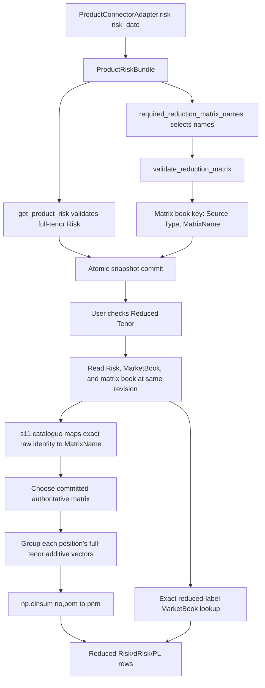

# How a Risk connector matrix becomes reduced-tenor Risk

This document describes the current Rebirth V5 implementation exactly. It covers the non-Credit numeric matrices carried beside Risk in `ProductRiskBundle`, from the connector boundary to the multiplication used by Risk Explorer.

The short version is:

1. A product Risk adapter returns full-tenor Risk and its same-date reduced-tenor matrix in one `ProductRiskBundle`.
2. Refresh validates both, stores the matrix under `(Source Type, MatrixName)`, and atomically commits it with the Risk revision.
3. Nothing is multiplied during refresh or cold start.
4. When the user checks **Reduced Tenor**, the UI reads the matrix from that same revision.
5. The catalogue selects a matrix by exact `Risk Type`, `Risk Greek`, and raw `Underlying`.
6. The reducer multiplies every additive full-tenor vector by the selected matrix:

   `reduced[position, new_tenor, measure] = sum(matrix[new_tenor, old_tenor] * full[position, old_tenor, measure])`

Market quotes are not multiplied. Credit uses a separate map-and-sum definition.

## What this matrix is

`ProductRiskBundle.matrices` contains **reduced-tenor numeric matrices**. Despite the short field name, it is not:

- the Risk DataFrame itself;
- a Cross Gamma sensitivity matrix;
- the Credit full-tenor-to-reduced-tenor mapping; or
- a generic matrix that every product must return.

Only registered one-axis `Tenor Swap` products can use this numeric reduction path. Scalar products and two-axis surfaces are left unchanged. Credit one-axis products use the separate `CREDIT_STANDARD` map-and-sum path described below.

The contracts live in:

- [`cube/domain/s02_products.py`](cube/domain/s02_products.py): `ProductRiskBundle`, `ProductRiskResult`, and `ProductConnectorAdapter`.
- [`cube/domain/s11_tenorreduction.py`](cube/domain/s11_tenorreduction.py): catalogue, matrix validation, selection, and multiplication.
- [`data/s11_matrix.csv`](data/s11_matrix.csv): identity-to-`MatrixName` selection catalogue.

## Do I need a wrapper bridge?

You need a wrapper only when the existing site Risk function still returns a plain DataFrame while matrix acquisition or parsing is separate.

If the function registered as `ProductConnectorAdapter.risk` already returns this object, no further wrapper is required:

```python
ProductRiskBundle(
    risk=full_tenor_risk,
    matrices={
        "IR_DELTA_STANDARD": ir_delta_reduction_matrix,
    },
)
```

If the existing connector returns only Risk, use a thin synchronous wrapper:

```python
import pandas as pd

from cube.domain.s02_products import ProductConnectorAdapter, ProductRiskBundle


def get_ir_delta_risk_bundle(risk_date: pd.Timestamp) -> ProductRiskBundle:
    # Both calls must resolve data for this exact risk_date.
    risk = get_site_ir_delta_risk(risk_date)
    matrices = get_site_ir_delta_reduction_matrices(risk_date)

    return ProductRiskBundle(
        risk=risk,
        matrices={
            # Key must exactly match MatrixName in data/s11_matrix.csv.
            "IR_DELTA_STANDARD": matrices["IR_DELTA_STANDARD"],
        },
    )


ir_delta_adapter = ProductConnectorAdapter(
    risk=get_ir_delta_risk_bundle,
    market_open=get_site_ir_delta_open,
    market_status=get_site_ir_delta_current,
)
```

If the site function now returns a custom object containing both parts, unwrap that object and validate only its Risk member before building the framework-owned bundle. An arbitrary tuple, dictionary, or site object is not recognized by `RiskRefreshManager`:

```python
from cube.adapters.s01_common import exact_frame
from cube.adapters.s02_ir import IR_DELTA_RISK
from cube.domain.s02_products import ProductRiskBundle


def get_delta_risk(risk_date: pd.Timestamp) -> ProductRiskBundle:
    site_result = get_site_delta_risk_and_matrix(risk_date)
    risk = exact_frame(
        site_result.risk,
        columns=IR_DELTA_RISK,
        label="IR Delta risk",
    )
    return ProductRiskBundle(
        risk=risk,
        matrices=site_result.matrices,
    )
```

This matters when using the builders in [`cube/adapters`](cube/adapters). Their existing low-level `RiskSource` boundary expects a DataFrame and calls `exact_frame(...)`. Passing a tuple or custom package into that boundary unchanged fails before the refresh manager can see it. Put the conversion inside the registered adapter Risk function, after extracting and validating the Risk DataFrame.

This wrapper does not need `async`, a daemon, or its own thread. The registered Risk callable is synchronous. Prefer one upstream bulk response or one bounded sub-call that returns Risk and the matrices together.

The bundle has no separate matrix-date field. The manager therefore cannot prove the matrix date itself: the adapter is responsible for returning Risk and matrices for the one `risk_date` it received.

Do not:

- insert matrix rows or columns into the Risk DataFrame;
- return `(risk, matrices)` as a tuple;
- use a catalogue label as a dictionary key unless it is the exact `MatrixName` value;
- return a stale or independently dated matrix; or
- wrap a source in `ProductRiskBundle` merely to return an empty mapping.

That last point is important because returning a bundle declares the source authoritative for matrices in that revision. If a required matrix is absent or invalid, the affected Risk remains full tenor; the UI deliberately will not fall back to a possibly stale fixture/provider matrix.

The current fixture bridge is `_get_csv_product_connector_adapters()` in [`cube/services/s05_sources.py`](cube/services/s05_sources.py). Its bound `risk()` function returns:

```python
return ProductRiskBundle(
    risk=get_risk(risk_date, _source),
    matrices=get_reduced_tenor_matrix_bundle(),
)
```

That fixture returns a shared example bundle for convenience. A production adapter should normally return only the named matrices relevant to its own source and current Risk response.

There are therefore two possible meanings of “bridge”:

- **Site connector bridge:** the small wrapper above. You add this only when site output is not already `ProductRiskBundle`.
- **Presentation bridge:** already implemented in `_RiskDataCache._reduce_filtered()` as `_to_reducer_columns()` -> `ReducedTenorReducer.reduce()` -> `_from_reducer_columns()`.

Do not write a second UI bridge or a second multiplication layer. Once the registered adapter returns `ProductRiskBundle`, the manager and UI paths below are already connected.

## End-to-end flow



The source-level call chain is:

```text
ProductConnectorAdapter.risk(risk_date)
  -> RiskRefreshManager._load_product_risk(...)
  -> refresh loop unwraps ProductRiskBundle
  -> get_product_risk(...) validates full-tenor Risk
  -> RiskRefreshManager._validated_bundle_matrices(...)
  -> RiskRefreshManager._commit_full_snapshot(...)
  -> RiskRefreshManager.read_reduction_matrices()
  -> _RiskDataCache._reduce_filtered(...)
  -> ReducedTenorReducer.reduce(...)
  -> ReducedTenorReducer._reduce_batch(...)
  -> np.einsum("no,pom->pnm", ...)
```

## Step 1: the catalogue selects the name

[`data/s11_matrix.csv`](data/s11_matrix.csv) has exactly these columns, in this order:

```csv
Risk Type,Risk Greek,Underlying,MatrixName
```

The selection key is the exact tuple:

```text
(Risk Type, Risk Greek, raw Underlying)
```

`Reported Underlying`, display buckets, and other UI labels do not participate. Text values must match the validated Risk rows exactly. Each identity may occur only once, although several identities may share one `MatrixName`.

Example:

```csv
IR,Delta,USD SOFR,IR_DELTA_STANDARD
IR,Delta,EUR ESTR,IR_DELTA_STANDARD
IR,Delta,GBP SONIA,GBP_IR_DELTA_STANDARD
```

This means USD SOFR and EUR ESTR share one matrix, while GBP SONIA uses another.

During refresh, `required_reduction_matrix_names(...)` selects only the distinct names needed by raw Underlyings actually present in that source's validated Risk. Extra matrices supplied in the bundle are ignored.

## Step 2: the matrix contract is validated

For a numeric matrix:

- rows are the **new/reduced tenor labels**;
- columns are the **old/full tenor labels**;
- every row and column label must be nonblank text and unique;
- every weight must be finite numeric data;
- booleans are rejected;
- the DataFrame must not be empty; and
- matrix row order is preserved and becomes the output `Tenor Swap Order`.

Example:

```python
import pandas as pd

matrix = pd.DataFrame(
    [
        [1.0, 1.0, 0.0],
        [0.0, 0.5, 1.0],
    ],
    index=["2Y", "Long"],       # reduced tenors
    columns=["1Y", "2Y", "5Y"],  # full tenors
)
```

The validator does not require rows or columns to sum to one. Negative weights, fractional weights, and structurally all-zero rows are allowed. These are business-defined linear weights, not probabilities. The matrix owner must verify that the weights have the intended conservation and risk meaning. At calculation time, an all-zero row has no non-zero support and produces `NaN` additive outputs rather than manufactured zeros.

At use time, the matrix must cover every full-tenor label that occurs in the selected source/identity batch. Extra unused matrix columns are allowed. If even one actual full tenor is missing, the whole mapped batch remains at full tenor; the reducer does not drop the uncovered exposure. This coverage check is lazy because it needs the actual Risk batch; `validate_reduction_matrix()` checks matrix structure, not business completeness or whether the axes were accidentally transposed.

Validation is implemented by `validate_reduction_matrix()` in [`cube/domain/s11_tenorreduction.py`](cube/domain/s11_tenorreduction.py).

## Step 3: refresh records source ownership and commits the matrix

In `RiskRefreshManager.refresh()` in [`cube/services/s06_refresh.py`](cube/services/s06_refresh.py):

1. `_load_product_risk()` calls the registered adapter.
2. If the result is a `ProductRiskBundle`, refresh separates `risk_result.risk` from `risk_result.matrices`.
3. `get_product_risk(...)` validates the Risk DataFrame first.
4. `_validated_bundle_matrices(...)` asks the catalogue which matrix names that validated Risk actually needs.
5. Each required matrix is validated.
6. Each valid matrix is stored internally under:

   ```python
   (spec.source_type, matrix_name)
   ```

   For example:

   ```python
   ("ir/delta", "IR_DELTA_STANDARD")
   ```

7. The source type is added to the authoritative-source set because it returned a bundle.

The internal key includes `Source Type` even though the external bundle key is only `MatrixName`. This prevents one source's matrix from accidentally serving another source with the same name.

If a required bundled matrix is missing or malformed, refresh keeps the valid Risk, logs an operational warning, and records the warning in the committed snapshot's `errors`. It does not publish an invalid matrix. Because the bundled source remains authoritative, the affected batch later stays full tenor instead of using the fallback provider.

Matrix lifetime follows the Risk source:

- a P&L-only or portfolio-only refresh reuses the committed matrix;
- when one source's Risk changes date or is reloaded, that source's old matrices are removed and replaced from its new response;
- unchanged sources retain their matrices; and
- the matrix book and financial frames are published together by `_commit_full_snapshot()`.

`read_reduction_matrices()` in [`cube/services/s02_state.py`](cube/services/s02_state.py) returns defensive copies plus:

```text
revision
matrices: {(Source Type, MatrixName): DataFrame}
authoritative_source_types: {Source Type, ...}
```

This is the revision bridge between refresh and the UI. No matrix multiplication happens in the connector, `_load_product_risk()`, validation, or snapshot commit.

## Step 4: Reduced Tenor activates the calculation

Risk Explorer uses a checklist value named `reduced-tenor`; unchecked is the full-tenor view. The option is handled in [`cube/pages/risk/s07_explorer.py`](cube/pages/risk/s07_explorer.py).

For full-tenor requests, the UI does not construct the reducer, read the reduction catalogue, call the fallback matrix provider, or read the matrix book. Bundled matrices may already be in the refresh snapshot, but they are dormant.

For a reduced-tenor request, [`cube/pages/risk/s02_state.py`](cube/pages/risk/s02_state.py) follows this path:

1. `_RiskDataCache.filtered(..., reduced_tenor=True)` requests a reduced book.
2. `_reduced_for_scope(...)` caches it by `(revision, active Risk Type)`.
3. `_reduce_filtered(...)` converts the lowercase prepared UI columns back to canonical domain names.
4. `_market_quotes_for_revision(...)` reads one compact MarketBook for the same revision.
5. `_reduction_matrices_for_revision(...)` calls `read_reduction_matrices()` once for the revision.
6. If either read has a different revision, the current attempt is discarded and the loop retries against the new revision.
7. `ReducedTenorReducer.reduce(...)` receives full post-P&L rows, same-revision quotes, committed matrices, and the authoritative-source set.
8. The resulting reduced book is cached and normal Risk Explorer filtering is applied.

A new revision invalidates the reduced book, quote cache, and matrix-book cache. This prevents a matrix from revision N being applied to Risk from revision N+1.

## Step 5: the reducer selects the actual matrix

`ReducedTenorReducer._batches()` in [`cube/domain/s11_tenorreduction.py`](cube/domain/s11_tenorreduction.py):

1. keeps only registered one-axis `Tenor Swap` source types;
2. maps each non-Credit row's exact `(Risk Type, Risk Greek, raw Underlying)` through the catalogue;
3. groups rows by `MatrixName`, `Source Type`, `Risk Type`, `Risk Greek`, and raw `Underlying`; and
4. passes each group's row positions to the reducer.

For each non-Credit batch, `reduce()` chooses the matrix as follows:

```python
if source_type in authoritative_source_types:
    matrix = committed_matrices.get((source_type, matrix_name))
else:
    matrix = matrix_provider(matrix_name)
```

The actual code validates and caches provider results, but that is the decision rule.

Therefore:

- a source that returned `ProductRiskBundle` uses only its committed same-revision matrix;
- a bundled source never falls back if its matrix is missing;
- a legacy source whose adapter returned only a DataFrame may use the configured provider; and
- a missing or malformed selected matrix leaves the entire batch unchanged at full tenor.

In the current app composition, [`app.py`](app.py) supplies `get_reduced_tenor_matrix` as the legacy/Credit provider. It is not called for a non-Credit source that has a committed authoritative bundle matrix.

Both sides of the composition must remain wired:

- `build_production_refresh_manager(..., reduced_tenor_catalog=...)` gives refresh the catalogue used to select and validate required bundle names.
- `build_app(..., reduced_tenor_catalog=..., reduced_tenor_matrix_provider=...)` enables the UI reducer and supplies legacy non-Credit fallbacks plus the Credit mapping.

The two `build_app` arguments are an all-or-nothing pair. If both are omitted, the checklist can still be rendered but Reduced Tenor is a no-op. If only one is supplied, app construction rejects the configuration.

## Step 6: exact multiplication

Before multiplying, `_reduce_batch()` treats each position and additive measure as a full-tenor vector.

Position identity is every remaining column after excluding:

- `Tenor Swap` and `Tenor Swap Order`;
- the additive measures being transformed;
- market quote columns; and
- carried metadata such as Vol Score, promotion fields, and thresholds.

Duplicate rows for the same position and old tenor are summed first, independently for every additive measure.

The array dimensions are:

```text
W / weights:  (new tenor n, old tenor o)
X / summed:   (position p, old tenor o, additive measure m)
Y / result:   (position p, new tenor n, additive measure m)
```

The exact implementation is:

```python
reduced_values = np.einsum("no,pom->pnm", weights, summed, optimize=True)
```

Equivalently:

```text
Y[p, n, m] = sum over o of W[n, o] * X[p, o, m]
```

The same selected matrix is applied independently to every position and every additive measure present in the frame, including:

- `Risk`, `dRisk`, and `PL`;
- `Risk Expo`, `Risk Hedges`;
- `dRisk Expo`, `dRisk Hedges`;
- `PL Expo`, `PL Hedges`;
- `P&L Expo`, `P&L Hedges`; and
- any present Credit measure columns defined by `CREDIT_MEASURE_COLUMNS`.

Missing additive input is not silently converted into a real zero. During accumulation, a missing term contributes zero, while a second support calculation tracks whether any non-zero matrix weight touched an observed input. If none did, that reduced output is reset to `NaN`. If some contributing tenors are observed and others are missing, the result is the weighted sum of the observed terms; measure-value completeness is not all-or-nothing.

The reducer creates one output row per position and matrix row. `Tenor Swap` becomes the matrix's row label, and `Tenor Swap Order` becomes `0, 1, ..., N-1` in matrix row order. Processed full-tenor rows are removed; reduced rows are inserted in stable position order. Unmapped, ineligible, or failed batches pass through unchanged.

`Vol Score`, promotion fields, and Risk/dRisk/PL thresholds are carried from the first source-order row for the resolved position; they are not multiplied. UI-derived `abs pl` and `rows` are dropped before reduction and recalculated afterward.

### Worked example

Using:

```text
                 old/full tenor
                 1Y    2Y    5Y
new 2Y          1.0   1.0   0.0
new Long        0.0   0.5   1.0
```

and position P1:

```text
Risk   = [10, 20, 30]
dRisk  = [ 1,  2,  3]
PL     = [100, 200, 300]
```

the output is:

```text
Risk[2Y]     = 1.0*10 + 1.0*20 + 0.0*30 = 30
Risk[Long]   = 0.0*10 + 0.5*20 + 1.0*30 = 40

dRisk[2Y]    = 1.0*1  + 1.0*2  + 0.0*3  = 3
dRisk[Long]  = 0.0*1  + 0.5*2  + 1.0*3  = 4

PL[2Y]       = 1.0*100 + 1.0*200 + 0.0*300 = 300
PL[Long]     = 0.0*100 + 0.5*200 + 1.0*300 = 400
```

Position P2 is transformed separately with the same weights. Expo and hedge measures are also transformed separately; they are not reconstructed from the new total after reduction.

## Market quotes are never matrix products

`Open`, `Current`, `Move`, `Market Available`, and `Market Data Status` are excluded from the additive tensor.

For each new reduced-tenor label, `_quote_values()` looks for an exact same-revision MarketBook row with:

```text
(Source Type, raw Underlying, Tenor Swap == reduced label)
```

If an exact quote exists, its quote fields are copied. If it does not exist:

- `Open`, `Current`, and `Move` are `NaN`;
- `Market Available` is `False`; and
- `Market Data Status` is blank.

For the worked example, a real `2Y` quote may be copied to the new `2Y` row. A synthetic `Long` row receives no quote unless the MarketBook itself contains an exact `Long` quote. The reducer never calculates `Long` market data from the `1Y`, `2Y`, and `5Y` quotes.

## Credit is different

Every one-axis Credit source uses the provider-owned two-column `CREDIT_STANDARD` mapping:

```text
Full Tenor, Reduced Tenor
```

Credit maps each full tenor to a target tenor and sums additive rows by position and target. It does not use `ProductRiskBundle.matrices`, the non-Credit numeric `einsum`, or per-Underlying rows in `s11_matrix.csv`.

The same completeness rule applies: if the Credit mapping omits an actual full tenor, the whole affected batch remains full tenor. Credit market quotes are also exact target-label lookups and are never summed.

The temporary numeric matrices and Credit mapping provider are in [`cube/services/s07_tenorreduction.py`](cube/services/s07_tenorreduction.py).

## Cross Gamma is also different

`cross_gamma_matrix_loader` and `get_cross_gamma_sensitivities` are supplemental Cross Gamma Risk inputs. They are not reduced-tenor weight matrices and do not flow through `ProductRiskBundle.matrices`.

Do not use a Cross Gamma sensitivity grid as the `W[new_tenor, old_tenor]` matrix described here.

## What happens on cold start

On a cold Risk refresh, a bundled connector fetches or parses its matrix as part of its synchronous `risk(risk_date)` call. The manager validates and commits that matrix, but does not perform the tensor multiplication.

The potentially heavier reduction is lazy: it happens only on the first Reduced Tenor request for a revision and Risk Type, then its result is reused from the server-side cache. Full-tenor users do not invoke it.

For a stable connector boundary:

- use the same `risk_date` for Risk and matrix data;
- prefer one bulk response or one bounded matrix sub-call;
- keep the wrapper synchronous;
- return only source-relevant matrices; and
- enforce network timeouts in the real connector/client, not by spawning an additional matrix thread.

## Verification

Run the focused contracts:

```powershell
python -m pytest `
  tests/s07_integration.py::test_dated_risk_matrices_are_reused_then_replaced_with_their_source `
  tests/s19_riskfilters.py::test_full_tenor_mode_does_not_read_catalog_or_call_matrix_provider `
  tests/s19_riskfilters.py::test_reduced_click_uses_committed_matrix_memory_without_provider_calls `
  tests/s19_riskfilters.py::test_reduced_tenor_book_is_built_once_then_reused_across_filters `
  tests/s43_reducedtenor.py::test_matrix_contract_requires_finite_numeric_unique_labelled_axes `
  tests/s43_reducedtenor.py::test_reducer_batches_positions_and_transforms_all_additive_measures `
  tests/s43_reducedtenor.py::test_committed_matrix_is_authoritative_and_missing_peer_stays_full `
  tests/s43_reducedtenor.py::test_market_quotes_are_exact_label_matches_and_never_matrix_products `
  tests/s43_reducedtenor.py::test_incomplete_matrix_skips_mapped_source_group_without_losing_risk `
  tests/s44_tenorreductionsource.py::test_temp_provider_covers_every_seed_reduction_name
```

After a refresh, the smallest direct diagnostic is:

```python
book = manager.read_reduction_matrices()

print("revision:", book.revision)
print("authoritative sources:", sorted(book.authoritative_source_types))
for (source_type, matrix_name), matrix in sorted(book.matrices.items()):
    print(source_type, matrix_name, matrix.shape)
    print("reduced rows:", matrix.index.tolist())
    print("full columns:", matrix.columns.tolist())
```

For a correctly bundled IR Delta source, expect an authoritative source such as `ir/delta` and a key such as `("ir/delta", "IR_DELTA_STANDARD")`.

## Common failure modes

| Symptom | Exact likely cause | Result |
|---|---|---|
| Risk validates, but selected rows remain full tenor | Required bundle key is missing, matrix is invalid, or a full-tenor label is uncovered | Risk is preserved; authoritative source does not fall back |
| Fallback provider is called unexpectedly | Adapter returned a plain DataFrame rather than `ProductRiskBundle` | Provider matrix may be used for that legacy source |
| Matrix is present but never selected | `MatrixName` key or exact raw Risk identity does not match `s11_matrix.csv` | Rows remain unmapped/full tenor |
| Reduced click fails while full view works | Non-Credit catalogue itself is malformed and was not validated during refresh | Fix the four-column catalogue contract |
| Reduced Risk is correct but quote is blank | No exact MarketBook quote exists for the new reduced label | Quote remains unavailable by design |
| Matrix appears transposed | Full tenors were placed on rows and reduced tenors on columns | Correct to rows=new, columns=old |
| New tenor order is wrong | Matrix DataFrame row order is wrong | Reorder matrix rows; row order owns output order |
| Credit ignores the numeric bundle matrix | Credit deliberately uses `CREDIT_STANDARD` map-and-sum | Update the Credit mapping provider instead |
| Cross Gamma data has no effect on tenor reduction | Cross Gamma is a separate supplemental Risk source | Supply a true reduction-weight matrix in the product Risk bundle |

## Rollback

To stop a site source from declaring matrices authoritative, change that adapter's `risk` callable back to returning only its validated Risk DataFrame. The current legacy provider path will then be eligible on a Reduced Tenor request.

That is a compatibility rollback, not the preferred production design: it breaks the same-date ownership link between the Risk response and its matrix. The safer rollback during an incident is usually to leave the bundle contract in place, omit or reject the bad matrix, and preserve full-tenor Risk until a corrected same-date matrix is available.
