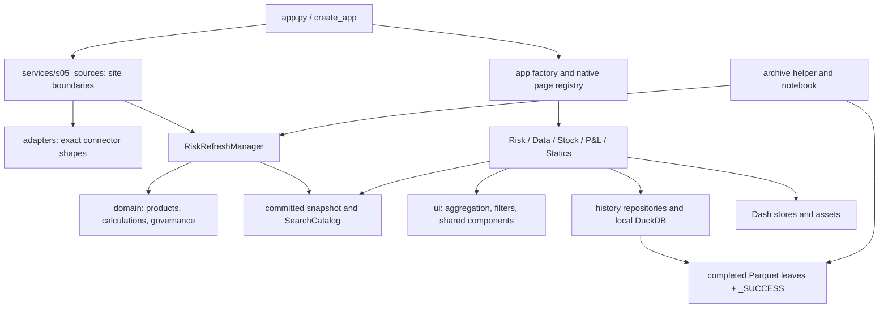
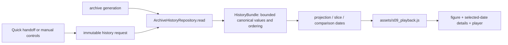

# all — Rebirth implementation handbook

**Branch:** `v5`, based on `v4` commit `950ea707a50f8d12beafa363855207ecc5ed505d`. This handbook consolidates only **FIXESMD.md**, **NEWTESTS.md** and **OPTIMISATIONS.md**. Their three standalone files are replaced by this document on `v5`; all other repository Markdown files are kept separately. Application code is unchanged by this documentation update.

This handbook preserves every source section and complete fenced code/patch block. Navigation is rewritten for one file, related material is grouped by topic, and the opening precedence rules distinguish alternative or superseded recipes. The large original patches are retained as reference bundles; choose the focused implementation once.

<a id="chapter-01"></a>
## Chapter 1 — Implementation order and source authority

### How to use this consolidated guide

This is one implementation guide assembled from the three manuals created for this review. It keeps their exact code, patches, detailed replacement instructions, architecture inventory and recorded results. Related sections are grouped into chapters below, so the reading order no longer depends on switching between three files. Source names beside sections identify where the original instructions came from; references to those names elsewhere in the prose mean the corresponding section of this handbook.

The guide documents a reviewed baseline, locally tested changes and further proposals. Publishing it does **not** install those application changes. Read each section's status, inspect your current checkout, and apply only changes that are still missing. Historical phrases such as “today”, “current” or “not published” retain the meaning they had in the original source. Reported test results describe the original work, not a fresh run against every later branch.

#### Chapter map

| Chapter | Content | When to use it |
|---|---|---|
| [2 — Architecture and current use](#chapter-02) | Components, interactions, financial contracts, page behaviour, state, persistence and configuration | Read first for context; use as a reference during changes |
| [3 — Baseline, Statics and Risk cache](#chapter-03) | Starting revision, broken picker, reusable grouped data and expansion-state cache fix | First implementation work |
| [4 — Correctness](#chapter-04) | P&L adjustments, Data filters, quotes, Stock scope, exits, coverage and recovery | Before building new features on those values |
| [5 — Capacity and performance](#chapter-05) | Allocation limits, pagination, P&L construction, cache bounds, grouping, copying and refresh | Before increasing the amount of displayed data |
| [6 — Portfolio](#chapter-06) | Main Risk hierarchy changes and scale checks | After the cache and capacity safeguards |
| [7 — Stock and history](#chapter-07) | Adding columns, real daily capture, isolated demos, adjustments and logging | After correctness and relevant history safeguards |
| [8 — Charts](#chapter-08) | Missing plots, tenor presentation, proposed designs and reproducible previews | After quote and selection correctness |
| [9 — Validation and future work](#chapter-09) | Tests, rollout, development recipes, architecture inventory and audit coverage | Consult throughout; use for final validation |
| [10 — Complete patches and tools](#chapter-10) | Full code blocks, alternative patch bundles and original review evidence | Copy from the selected recipe when a step calls for it |
| [11 — Source register](#chapter-11) | Navigation by each of the three original manuals and immutable originals | Find an old section name or compare the source |

#### Implementation order

1. **Establish the starting code.** Follow FIXESMD Part A in Chapter 3. Record the checkout and run the baseline checks before editing. Use Chapter 2 to identify the actual owner of each calculation, callback and stored value.
2. **Fix the Statics picker and reusable Risk cache.** Follow FIXESMD Part B, then the focused cache instructions from OPTIMISATIONS section 2. Use the exact patch sources in Chapter 10. Apply the cache change once; the two manuals contain overlapping copies of it.
3. **Fix the values and selected populations.** Follow FIXESMD Part F in its stated order. Resolve P&L adjustment consistency, Data filtering, quote selection, Stock scope and exits, totals/coverage and recovery before relying on them in a new display or saved history.
4. **Put limits before expensive work.** In Chapter 5, start with limits checked before allocating history grids, the browser row budget, Stock server pagination, P&L construction limits and bounded history caches. A small visible page or a play/pause control does not by itself bound how much the server builds or sends.
5. **Remove repeated work.** Continue the measured Chapter 5 recipes for shared grouping and surface pivots, validation, snapshot copying, hidden panels and refresh. Apply one change at a time and compare totals as well as performance. Leave smaller tuning until the large allocations and payloads are controlled.
6. **Enable Portfolio after its gates pass.** Use Chapter 6's exact hierarchy changes, then test a representative selection with roughly 100,000 rows and 300–400 portfolios. Verify collapsed and expanded output, response size and memory. The isolated benchmarks in the source are useful evidence, but do not prove that every production hierarchy will fit. Portfolio does not depend on finishing the chart or history features.
7. **Add Stock columns and daily history.** Follow Chapter 7. Add each field at its source/normalization boundary and then in the table's column definition; retain the pagination callback from Chapter 5. Define the real capture schedule and capture Stock as well as Risk/P&L where needed. Keep demo history isolated. Implement consistent adjustment values before treating the adjustment log as an audit record.
8. **Improve the charts.** Follow Chapter 8 after fixing missing market-move data and quote/selection rules. Generate and compare the proposed previews, then apply the selected presentation to the live renderer. Keep the shared-pivot optimisation when editing its layout or traces.
9. **Validate and release in small groups.** Use Chapter 9 plus the validation steps attached to each recipe. Check financial equivalence, picker interaction, Stock paging/filtering, history reads/writes, portfolio expansion and chart rendering for the changes actually installed. Keep each group independently reversible. Treat the future-development list as choices, not prerequisites.

#### Where the three guides overlap

| Overlap | Use this rule |
|---|---|
| Risk cache in FIXESMD Part B/Appendix A and OPTIMISATIONS section 2/Appendix A | Use the focused OPTIMISATIONS cache patch once. FIXESMD's combined patch is an alternative reconstruction bundle. |
| FIXESMD's combined application/test patch | It includes Statics and cache changes plus a manifest expecting three optional tools. If applying in phases, take the Statics hunks and focused cache patch first; add the tool sources and their manifest change together when using the tools. Do not apply the full bundle again later. |
| Repeated B4/B5 numbering in FIXESMD | Follow the full heading title and its direct link, not the short number alone. Both original sections are preserved. |
| Stock scope and pagination | Keep the business population rules from FIXESMD Part F. For the complete pagination callback, use OPTIMISATIONS section 4's Stock-detail recipe; avoid layering two competing callbacks onto the same output. |
| Surface styling and shared computation | Keep one shared pivot from OPTIMISATIONS section 3, then apply FIXESMD Part D's visual changes to that renderer. Do not restore the older duplicate computation while styling it. |
| P&L tree limits | The immediate construction budget reduces risk. Building a full server-driven expansion/paging interaction is a further change; the budget alone does not implement that interaction. |
| Stock/history recipes | Select one capture integration, retain the correct source population, and use bounded history-cache guidance. The optional synthetic generator demonstrates the readers; it does not create actual past observations. |
| NEWTESTS architecture and recipes | Use them to understand ownership and verify changes. NEWTESTS is not a third application patch to apply after the other two. |

The chapters preserve the original detailed instructions, including their stated limitations and alternatives. When two copies touch the same function, use the rule above and the selected recipe as one integrated edit. There is no requirement to add a new framework, distributed cache or extra service to follow this guide.

<a id="chapter-02"></a>
## Chapter 2 — Architecture, operation and existing behaviour

Read this chapter to understand existing owners and contracts. Its source descriptions refer to their stated baseline; the proposed changes in later chapters are not installed merely by appearing in this handbook.

In this chapter:

- [Part G — what is currently implemented and how to use it](#part-src-fixesmd-09) — `FIXESMD.md`.
- [1. Purpose and boundaries](#part-src-newtests-02) — `NEWTESTS.md`.
- [2. How to run and use the application](#part-src-newtests-03) — `NEWTESTS.md`.
- [3. Architecture and dependency direction](#part-src-newtests-04) — `NEWTESTS.md`.
- [4. Boot, shared shell, and refresh](#part-src-newtests-05) — `NEWTESTS.md`.
- [5. Financial contracts and calculation sequence](#part-src-newtests-06) — `NEWTESTS.md`.
- [6. State, caches, and persistence](#part-src-newtests-07) — `NEWTESTS.md`.
- [7. Risk page](#part-src-newtests-08) — `NEWTESTS.md`.
- [8. Data page](#part-src-newtests-09) — `NEWTESTS.md`.
- [9. Stock page](#part-src-newtests-10) — `NEWTESTS.md`.
- [10. P&L page](#part-src-newtests-11) — `NEWTESTS.md`.
- [11. Statics page](#part-src-newtests-12) — `NEWTESTS.md`.
- [12. History, archive jobs, and notebooks](#part-src-newtests-13) — `NEWTESTS.md`.
- [13. Frontend assets and charts](#part-src-newtests-14) — `NEWTESTS.md`.
- [14. Configuration, deployment, and diagnostics](#part-src-newtests-15) — `NEWTESTS.md`.

<a id="part-src-fixesmd-09"></a>
> **Source: `FIXESMD.md` — Part G — what is currently implemented and how to use it.** Local tested fixes plus proposals, optional tools and dated review evidence; use the master roadmap and select overlapping patches once. Original wording such as “current”, “implemented” and “not published” belongs to that source's stated date/baseline.

<a id="src-fixesmd-part-g--what-is-currently-implemented-and-how-to-use-it"></a>
### Part G — what is currently implemented and how to use it

| Area | Current use | Important boundary |
|---|---|---|
| Startup/refresh | Start `app.py`; let the browser request the first refresh; inspect progress and last-good revision | App construction is lazy; runtime refresh is not an automatic daily archive |
| Main Risk | Apply the governed filters; expand a Risk row; click a metric cell for tenor detail; choose the available tenor view | Portfolio exists in data, but main Portfolio leaf support is a proposal below |
| Quick Risk | Search a reported risk identity; inspect its bounded pivot; send a history handoff to Data | It uses position scope; market footer/cap findings remain pending |
| Quick Market | Search raw quote identity and inspect tenors | Portfolio metadata does not belong in quote identity |
| Full/reduced tenors | Use the existing tenor-view controls/provider-backed reduction | Provider failure fallback exists; invalidation and conservation findings remain pending |
| Data | Choose Risk/Market identity and period, press Load, then inspect/play/compare archive dates | Existing state/quote issues are documented; preview layout is not installed |
| Stock | Use current comparison/pivot and open Position detail for existing fields; select a row for history | Current dates/identity names must match available archive; clicked scope finding remains pending |
| P&L | Review overview/history; Validate against Colossus; edit and save adjustments; configured send functions are the destination boundary | Demo sends deliberately reject delivery; arithmetic/save issues must be resolved before relying on a changed workflow |
| Statics Read | Choose a source table to inspect | Read display does not save data |
| Statics Write | Choose one of four writable static tables, edit, use existing validation/save controls | The picker now clears stale table view state; source validation remains |
| Cash Flow | Inspect the direct-PL New Trades overlay in Risk and its trade detail | This is an auxiliary classification, not a sixth native route; see NEWTESTS module map |
| Saved views | Save/reapply governed filter views through the existing saved-view controls | This is view configuration, not an archive of the financial data displayed at save time |
| Application Logs | Open the logs control for bounded recent process records | In-memory log display is not a durable financial audit history |
| Official history | Use the archive writer/job after dated source integration; query completed v4 leaves | Writer is idempotent per date; Stock needs the additional job composition shown above |
| Adjustments | Active values are stored under date/portfolio files and reloaded by editors | Older versions/actor/reason/send receipts need the explicit audit extension |

Detailed source ownership, protocol boundaries, product formulas, callback interaction and every source/test/config file are in **NEWTESTS.md**. The findings appendices preserve all earlier review items rather than silently dropping issues that were not the focus of today's question.

<a id="part-src-newtests-02"></a>
> **Source: `NEWTESTS.md` — 1. Purpose and boundaries.** Architecture, operation, test inventory and future-development reference; not an additional patch bundle. Original wording such as “current”, “implemented” and “not published” belongs to that source's stated date/baseline.

<a id="src-newtests-1-purpose-and-boundaries"></a>
### 1. Purpose and boundaries

Rebirth is a Dash application for reviewing a governed financial risk snapshot, its estimated P&L, current Stock positions, historical observations, and the configuration that shapes those views. It is not a general portfolio-management platform, a pricing engine for arbitrary instruments, or an execution system.

The five native routes are:

| Route | Owner | Main question |
|---|---|---|
| `/` | Risk | What exposures, market moves, promotions, and estimated P&L are in the committed snapshot? |
| `/data` | Data | How did one exact Risk or Market identity change across archived dates and tenor axes? |
| `/stock` | Stock | What positions are held, what is their market value, and what history belongs to the selected scope? |
| `/pnl` | P&L | What are Today/MTD/YTD results; what should be adjusted, validated, and sent? |
| `/static-data` | Statics | What do the approved connector/configuration files contain, and which governed files may be edited? |

Unknown routes use `cube/pages/s01_notfound.py`; the registry also gives that layout the conventional Dash `not_found_404` key.

**Data status matters.** The checked-in sources and 262-date archive are deterministic demonstration fixtures. Current connector identities use `TEMP_REPLACE_ME`; older immutable archive strings may retain `FAKE_REPLACE_ME`. `send_sog_pl` and `send_portfolio_pl` are replacement boundaries, not evidence of a production integration. The archive ends on 21 August 2026. A page requesting a later natural date can correctly fail to find fixture Stock; do not silently label August data as September data.

**Terminology.** Risk means a sourced sensitivity/exposure; dRisk is the supplied change measure, not a number the browser invents. PL is the product-formula result or the appropriate historical source. Stock is market value, and dStock is market-value change. dStock is not automatically investment return or market P&L: position additions/removals and currency effects may contribute.

<a id="part-src-newtests-03"></a>
> **Source: `NEWTESTS.md` — 2. How to run and use the application.** Architecture, operation, test inventory and future-development reference; not an additional patch bundle. Original wording such as “current”, “implemented” and “not published” belongs to that source's stated date/baseline.

<a id="src-newtests-2-how-to-run-and-use-the-application"></a>
### 2. How to run and use the application

<a id="src-newtests-21-local-launch"></a>
#### 2.1 Local launch

From the repository root, the documented environment is:

```powershell
python -m venv .venv
.\.venv\Scripts\python.exe -m pip install -r requirements-dev.txt
.\.venv\Scripts\python.exe app.py
```

Then open `http://127.0.0.1:8050/`. Host, port, debug, and proxy paths are controlled by `RuntimeSettings` in `cube/app/s01_settings.py`. `app.py --host 127.0.0.1 --port 8051` overrides local address settings. `app:server` is the WSGI object. `use_reloader=False` avoids creating a duplicate refresh process during local launch.

For this review workspace only, an environment also exists at `../.review-venv/`; that is not part of the repository or an application dependency.

<a id="src-newtests-22-normal-user-journey"></a>
#### 2.2 Normal user journey

1. Wait for the shell's initial refresh to finish, or inspect its explicit failure state. A later failed refresh should leave the last good snapshot available.
2. On Risk, inspect the current date/status and apply the intended saved view. Editing filter controls changes a draft; **Apply filters** commits it. **Cancel changes** restores the committed selection.
3. Use Aggregate P&L for the selected reporting dimension, Quick Risk for a reported/raw risk identity, and Quick Market for a raw quote identity. Hand an identity to Data when history is needed.
4. In Risk Explorer, select the product family and expand Cross or SplitVA rows. A selected metric cell drives tenor detail. Promotion recalculation is a separate explicit action; ordinary filters do not continuously create promotion generations.
5. On Data, choose identity and period, then **Load history**. Projection, slice, comparison dates, and playback act on the returned bundle. A Quick handoff pre-fills controls once; it should not lock them thereafter.
6. On Stock, apply its independent page filters, inspect the pivot and position rows, and select history. Read the limitations in section 9 before interpreting a leaf's history or a total dStock as a whole-book reconciliation.
7. On P&L, use the page's one committed filter scope for summary, history, editors, and send sections. Editing, saving an adjustment, and sending are distinct actions. Current connectors demonstrate the boundary only.
8. On Statics, Read is inspection; Write is limited to the approved configuration subset. Save validates and replaces the file. It does not itself publish a new risk snapshot.

<a id="src-newtests-23-when-the-date-is-outside-the-demonstration-archive"></a>
#### 2.3 When the date is outside the demonstration archive

Stock source availability is different from a page rendering failure. Check the requested date against `data/histo/`. The browser review saw a September 4 request while the fixture archive ended August 21. Use an explicitly labeled supported historical/demo date for investigation, or provide the correct dated source. Changing a shared date while Stock stays mounted has an additional state limitation described below; do not assume every page silently rebases its local date stores.

<a id="part-src-newtests-04"></a>
> **Source: `NEWTESTS.md` — 3. Architecture and dependency direction.** Architecture, operation, test inventory and future-development reference; not an additional patch bundle. Original wording such as “current”, “implemented” and “not published” belongs to that source's stated date/baseline.

<a id="src-newtests-3-architecture-and-dependency-direction"></a>
### 3. Architecture and dependency direction



The intended direction is external data → validated domain objects/frames → a committed read boundary → page-owned aggregation/presentation. Browser callbacks should not assemble a competing market or risk snapshot.

- `cube/domain/` owns financial meaning, identity keys, formula choices, aggregation rules, and validation.
- `cube/adapters/` translates site APIs into exact connector shapes. It should not invent Portfolio mappings or reported identity.
- `cube/services/` owns I/O composition, refresh transactions, durable small stores, and optional reference providers.
- `cube/history/` owns archived contracts, atomic persistence, generation detection, SQL access, and typed query results.
- `cube/ui/` contains shared presentation/filter behavior. It currently also normalizes canonical column labels to internal UI names; that bridge is an identified cleanup candidate.
- `cube/pages/` owns route-specific layout, callbacks, selections, and charts.
- `cube/app/` owns settings, protocols, startup, routes, logging, and the composition root.
- `assets/` owns browser behavior and CSS. It operates on bounded returned data and DOM state, not source connectors.

This is not a perfectly isolated textbook layering. `cube/history/s07_sql.py` has P&L-shaped query results; page modules contain some pure projection logic; `_RefreshStateMixin` and `RiskRefreshManager` share internal state; factory and Risk cache both participate in prepared-frame lifecycle. Describe those as the current design, not as independent services that can be freely distributed.

<a id="src-newtests-31-page-injection"></a>
#### 3.1 Page injection

`cube/app/s07_factory.py::build_app` creates the services and stores page builder callables in Flask configuration under `PAGE_SERVICES_CONFIG_KEY`. `cube/pages/__init__.py::page_services` reads the active Flask app. Each page's `layout()` calls its corresponding builder. This avoids storing one user's state in module globals and lets app factories inject test sources.

`cube/app/s06_routing.py::register_native_pages` registers stable layout callables and clears/rebuilds Dash's process-global page registry. The shell mounts one `dash.page_container`; only the active route's body is mounted. `suppress_callback_exceptions=True` is used because page targets appear/disappear with navigation. The page registry is process-global even though services are app-specific; test factories need to account for that distinction.

<a id="src-newtests-32-why-page-ownership-exists"></a>
#### 3.2 Why page ownership exists

Risk Explorer interactions do not need to import the Stock page to obtain filters, and Stock should not load P&L history just to paint a shell. Shared concepts go in shared contracts/helpers; page-specific renderers and callback IDs stay with their page. A small callback-registration facade is useful. Arbitrarily splitting helpers to meet a file-length target is not an architectural benefit.

<a id="part-src-newtests-05"></a>
> **Source: `NEWTESTS.md` — 4. Boot, shared shell, and refresh.** Architecture, operation, test inventory and future-development reference; not an additional patch bundle. Original wording such as “current”, “implemented” and “not published” belongs to that source's stated date/baseline.

<a id="src-newtests-4-boot-shared-shell-and-refresh"></a>
### 4. Boot, shared shell, and refresh

<a id="src-newtests-41-cold-start"></a>
#### 4.1 Cold start

`app.py::create_app` configures logging, creates a manager through `build_production_refresh_manager`, resolves paths, builds `PLSendConfig`, and injects Stock/history/reduction services into `build_app`. It does not intentionally load all connectors or scan an annual archive merely by importing the WSGI entrypoint.

`build_app` uses a warm committed snapshot if one exists; otherwise it constructs a loading shell. `StartupCoordinator` owns one process-level background initial writer. Shared startup controls and Risk/P&L route builders may request that same idempotent attempt; concurrent browsers follow its progress rather than each starting a new writer.

```mermaid
sequenceDiagram
    participant B as Browser
    participant A as Dash/Flask shell
    participant C as StartupCoordinator
    participant M as Refresh manager
    participant S as Site connectors
    B->>A: request route and shell
    A-->>B: shell, stores, status controls
    B->>A: start/follow refresh; poll status
    A->>C: idempotent start
    C->>M: refresh candidate
    M->>S: bounded connector calls
    S-->>M: validated candidate inputs
    M->>M: calculate, map, validate, build catalog
    M->>M: atomic commit revision
    A-->>B: revision/progress updates
    B->>A: page callbacks for committed revision
```

Health/progress reads are compact. They should not deep-copy every financial frame. The startup watchdog reports a stalled attempt; it does not kill arbitrary Python connector code or authorize a second writer.

<a id="src-newtests-42-refresh-variants"></a>
#### 4.2 Refresh variants

| Action | Owner and intended effect |
|---|---|
| Refresh Risk | `RiskRefreshManager.refresh(force_risk=True, ...)`: rebuild the required risk/market/calculation/governance candidate and dependent release/search state. |
| Refresh PL | `refresh(force_pl=True, ...)`: refresh the appropriate current-market/P&L path while retaining eligible dated source state. |
| Refresh Portfolios | `refresh_portfolios`: reload Portfolio/reporting governance and rebuild dependent governed views from committed source caches. |
| Apply forced dates/settings | Risk date-draft logic validates/rebases the draft, then passes settings to one manager refresh with revision/reset expectations. |
| Clear Cache | `reset_refresh`: advance reset generation, discard reconstructable state, perform a guarded refresh; page/history owners observe the generation and clear their caches. |
| Automatic P&L | Browser-local 15-minute scheduling; manager coalesces near-concurrent automatic attempts using a minimum-age check. |

`cube/pages/risk/s15_refresh.py::register_refresh_callbacks` owns the Dash coordination even though its controls are in the shared shell. `assets/s12_refresh.js` handles browser startup/polling/status lifecycle. It is important to trace both when a button appears stuck: one owns server work, the other the immediate browser presentation.

<a id="src-newtests-43-transaction-and-failure-boundaries"></a>
#### 4.3 Transaction and failure boundaries

`RiskRefreshManager` performs expensive source work outside the reader state lock, constructs a candidate, validates it, then commits together with its search catalog. `_RefreshStateMixin::_commit_full_snapshot` publishes the related fields under the state lock. Readers hold the previous committed object until replacement is ready. `StaleRefreshError`, `StaleResetGenerationError`, and `RefreshInProgressError` distinguish stale requests from busy ownership.

Current operational controls include:

- 15-second caller-side deadline per callable connector boundary;
- 120-second combined waiting budget per refresh;
- a bounded daemon call gate retaining at most eight calls that have not returned;
- one normal market request in flight by default;
- zero automatic market retries by default;
- one refresh-wide operational market circuit breaker.

The last point is a current limitation: the first operational market failure can skip other products' requests. `experiments/fix12.md` proposes isolation by product; it is not proof of an implemented change. Schema/type errors are treated differently from operational unavailability and can reject the candidate. A warm rejected transaction should preserve its last good snapshot. Cold unavailable feeds may yield a valid partial candidate where the explicit contracts permit it.

The manager timeout stops waiting; it cannot terminate arbitrary Python code. Real clients still need native connection/read timeouts. Do not confuse connector deadlines, startup watchdog reporting, Gunicorn timeout, and publish-status polling: they have different owners and effects.

<a id="part-src-newtests-06"></a>
> **Source: `NEWTESTS.md` — 5. Financial contracts and calculation sequence.** Architecture, operation, test inventory and future-development reference; not an additional patch bundle. Original wording such as “current”, “implemented” and “not published” belongs to that source's stated date/baseline.

<a id="src-newtests-5-financial-contracts-and-calculation-sequence"></a>
### 5. Financial contracts and calculation sequence

<a id="src-newtests-51-grain-first"></a>
#### 5.1 Grain first

| Data | Identity/authority | Why it matters |
|---|---|---|
| Product Risk | Product identity + raw Underlying + declared tenors + Portfolio | Multiple portfolios can legitimately own exposure to the same quote. |
| Open/Current quote | Risk Type + Risk Greek + raw Underlying + declared tenor axes within its Source Type/product | Portfolio and Group are not quote keys. |
| Quote order | Connector-owned rank per raw Underlying and axis | Rank describes display authority; it is not quote identity. |
| Portfolio config | Exactly one row per Portfolio | Governance joins `many_to_one`; ambiguous mappings must fail. |
| Reported mapping | Unique Risk Type + Risk Greek + raw Underlying → reported name | Many raw names may share a reported identity; quote calculation must precede this mapping. |
| Threshold | Exact Risk Type + Risk Greek | Ratios mean nothing if thresholds are joined at the wrong product grain. |
| Stock | CRDS + CPTY + Portfolio + Instrument + Currency in current contract | Current/prior comparison is one-to-one on the five fields, not on CRDS alone. |
| Archived Risk | Completed post-calculation snapshot with date/revision metadata | Historical filtering needs historical governed fields, not a re-created current snapshot. |
| Archived Market | Complete unique raw MarketBook with official status | Quote-only tenors must remain accessible even without a current position. |

<a id="src-newtests-52-normal-calculation-path"></a>
#### 5.2 Normal calculation path

```text
readiness/inventory → source Risk date
                         ↓
product adapter → get_product_risk
Market Date/status → Open + Current adapters → validated MarketBook
                         ↓
Risk left many-to-one MarketBook → product PL (+ derived Gamma rows)
                         ↓
Cross Gamma / New Trades supplemental rows using the same quote authority
                         ↓
Portfolio mapping → Reported Underlying → thresholds / baseline pins
                         ↓
dashboard conversion + release validation → snapshot + SearchCatalog
                         ↓
UI preparation → committed page filters → aggregates/tables/plots
```

Open and Current merge `one_to_one`; Risk joins the resulting quotes `many_to_one`. Never “fix” a merge error by arbitrarily dropping a duplicate quote or collapsing distinct portfolios. Check the exact declared key and whether repeated rows are genuinely identical first.

Dates are separate authorities: Market Date, previous business-date Open, checker date, each product's aged Risk date, and optional forced overrides. A stale Risk feed does not automatically request an equally stale current-market quote. Date normalization in the checked-in code uses pandas business-day conventions; it is not a comprehensive exchange-specific holiday service.

<a id="src-newtests-53-product-catalogue"></a>
#### 5.3 Product catalogue

`cube/domain/s02_products.py::PRODUCT_SPECS` is the authority. The current registered set is:

| Key / Source Type | Type / Greek | Axes | Market unit | Formula |
|---|---|---|---|---|
| `fxdelta` / `fx/delta` | FX / Delta | scalar | pips | percentage |
| `fxgamma` / `fx/gamma` | FX / Gamma | scalar | outright | Taylor gamma |
| `fxvega` / `fx/vega` | FX / Vega | Swap | vol points | absolute |
| `irdelta` / `ir/delta` | IR / Delta | Swap | bp | absolute |
| `irgamma` / `ir/gamma` | IR / Gamma | Swap | bp | Taylor gamma; move scale 10,000, risk step 10 |
| `irdeltavega` / `ir/deltavega` | IR / DeltaVega | Swap × Option | bp | percentage |
| `xccy` / `ir/xccy` | IR / XCCY | Swap | bp | absolute |
| `xccyvega` / `ir/xccyvega` | IR / XCCYVega | Swap × Option | bp | percentage |
| `inflation` / `ir/inflation` | IR / Inflation | Swap | bp | absolute |
| `inflationvega` / `ir/inflationvega` | IR / InflationVega | Swap × Option | bp | percentage |
| `basis` / `ir/basis` | IR / Basis | Swap | bp | absolute |
| `bond` / `ir/bond` | IR / Bond | Swap | bp | absolute |
| `creditdelta` / `credit/delta` | Credit / Delta | Swap | bp | absolute |
| `creditvega` / `credit/vega` | Credit / Vega | Swap | bp | absolute |
| `commodelta` / `commo/delta` | Commo / Delta | Swap | outright | percentage |
| `commovega` / `commo/vega` | Commo / Vega | Swap | vol points | absolute |

An auxiliary `CASH_FLOW_PRODUCT_SPEC` (`new-position/cash-flow`, Cash Flow/New) uses identity PL for New Trades. It is deliberately outside the aged Risk/MarketBook catalogue: it must not create fabricated market quotes or readiness entries. The user-facing Commodity label may differ from the canonical `Commo` value.

<a id="src-newtests-54-formula-and-missing-value-rules"></a>
#### 5.4 Formula and missing-value rules

`cube/domain/s03_calculations.py::_pnl_move` and `get_product_pl` apply:

```text
raw move       = Current − Open
absolute PL    = Risk × raw move × multiplier
percentage PL  = Risk × ((Current − Open) / Open) × multiplier
Taylor move    = raw move × gamma_move_scale
developed Risk = sourced Gamma Risk × Taylor move / gamma_risk_step
Taylor PL      = 0.5 × developed Risk × Taylor move × multiplier
```

The sourced Gamma row retains Taylor PL. A derived Delta row in the Gamma split carries the developed exposure, unavailable dRisk, and zero PL to avoid counting the Taylor contribution twice.

The current implementation coalesces a missing single quote leg from its available counterpart as a continuity policy; when both are absent, quote/P&L availability remains missing. It also normalizes certain nonfinite calculations to zero in `_normalize_computed_pl` and `_normalize_developed_risk`, including a flagged percentage move from zero Open. Those are implemented policies, not universally safe financial assumptions. The review recommends replacing undefined/nonfinite arithmetic with a rejected or explicitly unavailable result instead of an apparently ordinary zero. Changes must include raw-source reproductions and source/status propagation.

Null-preserving sums such as `sum(min_count=1)` prevent an entirely unavailable group from becoming zero. They do not by themselves establish completeness when only some contributing observations are present. Coverage/status needs its own meaning.

<a id="src-newtests-55-supplemental-risk-and-governance"></a>
#### 5.5 Supplemental risk and governance

- **Cross Gamma:** `cube/domain/s04_crossgamma.py` validates portfolio-level cross sensitivities, derives its market scope, and develops the supported dual-leg rows. `adapters/s06_crossgamma.py` owns the strict external boundary; it must not become an ad-hoc alternate market source.
- **New Trades:** `adapters/s07_newpositions.py` validates the raw blotter (including trade identity/time and source shape). `domain/s05_newtrades.py` creates required market scope and calculates rows using governed product contracts. Direct Cash Flow PL is an auxiliary classification. Preserve Trade ID traceability into Risk detail.
- **Reported names:** `attach_reported_underlying` maps after raw PL; missing mappings fall back to the raw label. Quick Risk can use reported identities; Quick Market stays raw.
- **Promotion:** `evaluate_promotions` compares aggregate absolute Risk/dRisk/PL to exact product thresholds. Baseline promotion uses the configured base scope; explicit current-view generation has its own immutable metadata. Connector-owned Vol Score ranks Top Promotions and is not the threshold ratio.
- **Pins:** `load_pinned_promotions` / `apply_pinned_promotions` read `data/s12_pinned.csv`. A pin supplements actual reason/bucket handling; it must not invent absent exposure or fake an infinite financial score.
- **JTD:** `services/s08_jtd.py::jtd_reference_rows` is an optional exact-Underlying reference lookup from `s13_jtd.csv`, cached by file metadata. It is not the source of all computed Credit JTD sensitivity values.
- **Reduced tenor:** `ReducedTenorReducer` operates post-P&L. Non-Credit products select a matrix from `s11_matrix.csv`; one-axis Credit products use the shared Credit mapping. Sum additive exposures within existing position boundaries. Quote values are matched to an exact reduced tenor when possible; they are not summed as though they were exposures.

<a id="part-src-newtests-07"></a>
> **Source: `NEWTESTS.md` — 6. State, caches, and persistence.** Architecture, operation, test inventory and future-development reference; not an additional patch bundle. Original wording such as “current”, “implemented” and “not published” belongs to that source's stated date/baseline.

<a id="src-newtests-6-state-caches-and-persistence"></a>
### 6. State, caches, and persistence

<a id="src-newtests-61-ownership-map"></a>
#### 6.1 Ownership map

| State | Owner / lifetime | Contents and intended use |
|---|---|---|
| Committed financial snapshot | `RiskRefreshManager`, one process | Large authoritative Risk, MarketBook, PL and governed frames; atomic revision. |
| Compact read views | `ControlSnapshot`, `PLSnapshot`, `FrameRead`, health/progress types | Copy only what a workflow needs, tied to same-revision metadata. |
| Exact search index | `SearchCatalog`, one committed revision | Risk identities/hierarchies and unique quote identity options. |
| Prepared Risk frame | Factory preparation cache plus `_RiskDataCache` | Avoid re-normalizing full data for every page/callback. Ownership is currently shared. |
| Filtered/reduced Risk | `_RiskDataCache` | Filtered frames: at most 32 entries and 512 MiB of accounted frame storage; revision-scoped reduced books, compact quotes and promotion generations have separate ownership. |
| Cross hierarchy indexes | `_RiskDataCache.hierarchy_index` | At most four entries and 256 MiB of conservatively accounted retained data; one immutable filtered frame and normalized Credit measure per key. |
| Explorer component trees | `_RiskDataCache.render_explorer` | Serialize each visible-table build; do not retain the resulting full component tree in the cache. Applies to Cross, SplitVA and Credit Multi. |
| Workspace component trees | `_RiskDataCache.rendered` | Aggregate P&L and Top Promotions retain their separate 24-entry LRU, without a byte budget; epoch checks prevent invalidated builds from repopulating it. |
| Draft/applied user filters | Page Dash stores/components | Small JSON-safe selection state; no global per-user DataFrame. |
| Data history request/bundle | Typed `HistoryQuery` plus browser bundle stores | Immutable requested identity/date scope and bounded canonical values for client playback. |
| Stock current comparison | Stock callback closure cache | Up to four revision/date keys; filters project those server frames. |
| History connections/catalogues | Archive/Stock/P&L repositories | Lazy in-memory DuckDB, metadata fingerprints, small selector/query caches. |
| Named saved views | `SavedFilterViewRepository` | Shared named catalogue, but each page has its own draft/applied state. |
| P&L adjustments | `LocalCsvAdjustmentRepository` | Complete date/portfolio files with revision/save metadata. |
| Statics | `StaticDataStore` | Approved CSV files; atomic per-file replacement. |
| Logs | App logging handler/modal | Bounded process-local operational records; not a durable business audit ledger. |

Browser state is untrusted input: parse/validate selections, identities, revisions and action envelopes before using them. Large authoritative frames stay on the server. Data playback is an intentional exception for a bounded canonical bundle, not permission to serialize the entire archive.

<a id="src-newtests-62-implemented-risk-cache-lifecycle-and-remaining-costs"></a>
#### 6.2 Implemented Risk cache lifecycle and remaining costs

The local redesign on 6 September 2026 moves reuse for the main Cross view from whole rendered component trees to `ui/s02_aggregation.py::HierarchyAggregationIndex`. The index stores additive measures in NumPy arrays and factorizes authoritative quote identities once. Node aggregation still preserves the existing missing-value sums, breakdown validation and independent quote aggregation. The source and index frames must be treated as immutable; there is no browser-owned mutable index.

`_RiskDataCache.hierarchy_index` keys reuse by the identity of the actual cached filtered frame plus a normalized Credit measure. The frame already represents its revision, product/family, split/filter, reduction and promotion scope. Expansion, metric display, sort and hierarchy presentation can reuse that index when the numeric scope remains the same. A retained entry holds a strong reference to its source frame, preventing a recycled Python object ID from becoming an accidental cache hit. Standard Cross, including Credit Single, obtains this index through `s07_explorer.py`; SplitVA and Credit Multi retain their independent aggregation paths.

The hierarchy LRU is bounded by **four entries and 256 MiB of accounted retained data**. `HierarchyAggregationIndex.memory_bytes` counts the full retained frame, numeric arrays and quote-index arrays; a separate Credit transformation also accounts for its retained source frame. Counting shared frame storage is intentionally conservative because the index can outlive a filtered-cache entry. This is not a bound on total process memory, Python object overhead, temporary build allocations, browser memory, or response size. An unowned frame or an index larger than the byte limit is still usable for that call but is not retained. Ownership for insertion means the source is the current prepared frame or one of the cache's current filtered frames.

`replace_frame` and `clear_reconstructable` advance `_cache_epoch` and clear hierarchy indexes alongside the other derived entries. Index builds capture the epoch and cannot repopulate a cache cleared while they were running. `filtered` verifies that the frame it obtained still matches the current frame before capturing revision/epoch; a changed revision causes a retry, while a same-revision cache clear allows the computed result to serve its caller without reinsertion. These checks guard the filter/refresh/reset race; they do not replace the page's existing action/view-token validation.

Every main Explorer view now calls `render_explorer`, which uses the existing reentrant render lock to serialize component construction and returns the result without retaining it. The numeric index amortizes repeated Cross aggregation preparation, but visible HTML must still be rebuilt and sent. Direct callers of `build_risk_table` can omit an index and receive a local one; when supplied, the builder uses the index's frame for both row membership and numeric values. Mixing its row positions with a separately transformed frame would be incorrect.

The `rendered` helper remains in use by the separate Aggregate P&L and Top Promotions workspace callbacks. Its **24-entry component LRU still has no byte budget**; it now also captures the epoch and skips insertion after invalidation during a build. The shared render lock serializes these builds too. This is a focused replacement of the large Explorer render-cache behavior, not a universal cache framework or removal of every component cache.

Reduced books remain lazy by revision/product scope, and explicit promotion generations remain count-bounded. The factory and page cache still both retain preparation/revision state; consolidating that ownership is preferable to adding another preparation cache. Remaining gaps, unchanged by this redesign:

- Clearing derived Risk frames does not recreate the cached `ReducedTenorReducer`; successful definitions and negative provider results can survive Clear Cache. A reproduced transient failure stays in full-tenor fallback until a new reducer instance is constructed.
- `SQLPLHistoryRepository` keeps `_stats_cache` and `_risk_summary_cache` in ordinary unbounded dictionaries until archive/connection reset. Distinct filters can accumulate full summary frames. Add a bounded LRU/byte policy; its SQL filter values are already normalized.
- Stock callback/cache dates and loaded history scope are not fully synchronized with shared revision changes.
- Every cache does not need a common abstract framework. Document its key, authority, maximum retained size, invalidation trigger, and failure recovery; then consolidate only duplicated ownership.

<a id="src-newtests-63-persistence-is-not-publication"></a>
#### 6.3 Persistence is not publication

Saved views use small validated shared JSON documents with a file-lock boundary. Adjustment saves replace complete selected portfolio files. They retain save/revision metadata for the effective stored version, but they are not an append-only audit history of every prior edit or send. Statics validates a complete governed file and publishes it using a temporary file and `os.replace`. Those are three distinct write contracts.

Atomic replacement prevents a reader seeing half-written bytes. It does not prove cross-file transactionality or protect two editors from a last-writer-wins overwrite. Statics currently has no content-hash/base-version conflict check. Its `static-data-revision` is a browser refresh signal, not a compare-and-swap database version. A future concurrency control should add an explicit saved-file fingerprint, without removing existing schema validation.

Hosted writable files may be ephemeral. A saved view, adjustment, or Statics edit is not automatically committed to Git or preserved across redeployment. Keep durable storage requirements explicit before changing worker topology.

<a id="part-src-newtests-08"></a>
> **Source: `NEWTESTS.md` — 7. Risk page.** Architecture, operation, test inventory and future-development reference; not an additional patch bundle. Original wording such as “current”, “implemented” and “not published” belongs to that source's stated date/baseline.

<a id="src-newtests-7-risk-page"></a>
### 7. Risk page

<a id="src-newtests-71-components-and-interactions"></a>
#### 7.1 Components and interactions

`s16_view.py::build_layout` constructs the committed page: date/editor disclosures, checker inventory, unmapped books, workspace tabs, Explorer controls, and selected detail. `s17_callbacks.py` composes four callback groups and injects one Risk cache.

| Workflow | Main chain |
|---|---|
| Refresh/settings | shared controls → `s15_refresh` → force-date helpers in `s02_state` → manager → revision/status stores → page outputs |
| Aggregate P&L | applied reporting filters → `s14_workspacecallbacks` → cached prepared frame → shared `build_aggregate_pl_table` |
| Quick Risk | search controls `s08_quickrisk` → callback helpers `s10_search` → manager/SearchCatalog exact risk pivot → hierarchy/figure |
| Quick Market | search controls `s09_quickmarket` → manager exact quote result → quote-grain table/chart; optional detail/history helpers |
| Top Promotions | current/baseline generation + filters → `s13_workspacetables::top_promotions_frame` → bounded rank table |
| Explorer | family/split/view/filter/actions → `s07_explorer` → serialized `render_explorer` build → `_RiskDataCache.filtered` → cached index for standard Cross / independent SplitVA or Credit Multi aggregates → `s06_explorertables` → selected tenor detail in `s05_charts` |
| Recalculate/reset promotion | `s12_promotecallbacks` → `s11_promotion` typed generation → server cache + browser metadata → refreshed presentation |
| Data handoff | `s04_handoff` validates exact identity and filter view → shared handoff store + navigation → Data consumes once |

Cross and SplitVA are different presentations over governed data. Credit also has Single/Multi presentation and measure choices. Only standard Cross, including Credit Single after its selected measure transformation, uses the new reusable hierarchy index. All Explorer presentations avoid retaining full component trees, while Aggregate P&L and Top Promotions keep the separate workspace render cache. Product shapes and tenor axes should come from ProductSpec and quote-order columns, not guesses from visible labels.

<a id="src-newtests-72-selection-and-stale-event-handling"></a>
#### 7.2 Selection and stale event handling

Browser delegated actions in `assets/s13_risk.js` include a sequence and view token. `s02_state.py::_is_current_risk_action` validates the envelope against the rendered generation. `risk_action_view_token` includes data revision, risk type/family, table view, reporting dimension, and relevant generation state. This stops a late click from an old table being applied to a replacement view.

Open rows, selected contexts, and metric-detail controls are small state. Hierarchy keys are structured/serialized instead of parsed from human labels. `ui/s02_aggregation.py` contains `frame_for_context`, `visible_tree_level`, `tree_scope`, and aggregation indexes that select the corresponding frame without duplicating semantic levels. Quote aggregation must use its quote index independently of portfolio count.

These structures do not guarantee that every fully expanded table remains small. In the review's server-side capacity probe before the cache redesign, an all-open IR Vega family with 4,441 positions produced 5,835 rendered hierarchy rows, about 17.07 MB of serialized content, and about 6.97 seconds of server work; the Delta case was about 9.28 MB and 3.75 seconds. Those are historical measured examples on the review environment, not timings for the redesigned cache, browser timings, or universal capacity limits. Prefer sensible default collapse, bounded children/continuation, and selected-scope detail before increasing request timeouts or eagerly rendering the entire family.

The user's subsequent scale clarification is approximately **100k rows before adding Portfolio to the view, with 300–400 portfolios**. Whether 100k means raw positions or existing aggregate groups is still unconfirmed. Raw positions already contain Portfolio, so adding a group does not inherently multiply the input by 400. Existing aggregate groups may each split into many contributing books, however. Count actual distinct hierarchy/Portfolio combinations instead of assuming a dense Cartesian product.

For this scale, prefer an aggregated main tree and a **server-paged Portfolio detail for one selected row**. Resolve its exact context/filters/revision, aggregate its matching positions, calculate full matching totals, and only then select the displayed page (initial policy: 50 books, to be measured). Keep unique quote aggregation independent of book count. Hidden descendants are already skipped, but every visible row is still constructed as HTML and included in the response. The local cache redesign now reuses standard Cross numeric indexes across display states and stops retaining main Explorer component trees. It does not add paging or a visible-row limit, and it does not index SplitVA or Credit Multi. Aggregate P&L/Top Promotions still retain up to 24 workspace component trees without a byte budget.

Bounded visible rows and a progressively scoped production measurement remain necessary before enabling broad inline Portfolio expansion. The companion guide's two-file leaf patch is a functional proposal, not production capacity clearance; the suggested Portfolio detail and paging are also not implemented. The synthetic 100k-raw-position/400-portfolio probe in section 15.3 checks a modest selected scope with at most nine rendered rows. It does not measure a fully expanded book, 100k pre-aggregated display groups, or browser/production capacity.

<a id="src-newtests-73-promotion-is-a-separate-decision-from-filtering"></a>
#### 7.3 Promotion is a separate decision from filtering

`PromotionBasis`, `PromotionRow`, and `PromotionGeneration` record explicit current-view promotion decisions. Changing a display filter does not silently recompute the generation. Reset returns to baseline. A stale-basis indicator explains when the visible scope differs from the one used to calculate the selected generation.

This separation is justified: users should know why an exposure is promoted. Do not simplify it by deriving a new decision on every table click. Do simplify duplicated browser/store representations if they express the same immutable selection.

<a id="src-newtests-74-current-plot-design-and-proposals"></a>
#### 7.4 Current plot design and proposals

Current detail supports line, heatmap, matrix, and product-shaped panels through `s05_charts`; Quick Risk and Quick Market have their own builders. Some shared meanings are duplicated across these chart owners. Preferred evolution is a small shared chart style/metric vocabulary and shape-specific helpers, not one universal plotting framework.

Proposed previews are design examples only: aligned exposure/change panels; readable signed heatmaps; a selected curve/surface slice; explicit source units and as-of labels; comparable color domains across dates; gray/unavailable cells rather than zero colors. Keep matrix values accessible because a financial surface often needs exact inspection. Do not put quote changes, exposure, and currency P&L on an unlabeled common numeric axis.

<a id="part-src-newtests-09"></a>
> **Source: `NEWTESTS.md` — 8. Data page.** Architecture, operation, test inventory and future-development reference; not an additional patch bundle. Original wording such as “current”, “implemented” and “not published” belongs to that source's stated date/baseline.

<a id="src-newtests-8-data-page"></a>
### 8. Data page

`s02_view.py::build_data_page` paints an archive-free shell. `s01_selection.py` derives legal Risk Type → Greek → Underlying choices from catalog entries. `s03_callbacks.py` owns handoff consumption, selector state, request creation, archive generation, query, serialization, and clientside callback registration.



The typed contracts live in `history/s01_models.py`: `RiskFilterView`, `HistoryIdentity`, `HistoryHandoff`, `HistoryQuery`, axis ordering, and `HistoryBundle`. `HistoryIdentity` retains actual source membership and raw/reported mode; an ambiguous string label is insufficient authority.

`choose_history_request` snapshots the controls on Load or a pending Quick handoff. The consumed nonce stops a handoff replay from overwriting later edits. `poll_archive_generation` and the repository fingerprint notice completed archive changes; invalidation differs from loading a new user-selected identity.

`ArchiveHistoryRepository` queries date availability, resolves the selected period against observed dates, loads only required rows/columns, applies Risk filters, constructs canonical axes, and enforces row/date/cell budgets. `ArchiveSQLStore` owns the lazy generation-scoped connection and distinct catalogues. Older archive formats remain supported through a legacy fallback in the repository; that fallback currently recognizes a specific exception message and is a cleanup candidate.

The browser receives a canonical bundle rather than a second raw-history payload. `assets/s09_playback.js` derives allowed projections and slices, handles Date A/B, static/playback modes, slider/wheel controls, and redraws without a new source query for each animation frame. Risk history plots Risk; Market history plots its official archived quote. The current code also offers aggregation/slice choices whose financial meaning must stay explicit: summing exposure across a tenor axis and aggregating quote values are different operations.

For UI changes, test the full handoff/manual-edit/load flow, scalar/one-axis/two-axis bundles, missing dates/cells, maximum payload, and reset while playback is active. The fixture archive having only one year does not make a 5Y request invalid; it should resolve truthfully to available history.

<a id="part-src-newtests-10"></a>
> **Source: `NEWTESTS.md` — 9. Stock page.** Architecture, operation, test inventory and future-development reference; not an additional patch bundle. Original wording such as “current”, “implemented” and “not published” belongs to that source's stated date/baseline.

<a id="src-newtests-9-stock-page"></a>
### 9. Stock page

<a id="src-newtests-91-current-implementation"></a>
#### 9.1 Current implementation

`build_stock_page_route` selects the comparison date pair and builds a shell. The single-use load interval and shared revision/reset inputs trigger `s04_callbacks.py::load_current_stock`. It calls `s01_data.py::load_stock_page_data`, which obtains current and prior Stock through the adapter, loads Portfolio governance, and calls `map_stock_comparison_portfolios`.

The domain compares exact five-field identities using an outer one-to-one merge. It keeps current/prior values and Added/Removed/Changed status. The current page then calls `stock_display_rows`, retaining only positions with a current market value and presenting Stock/dStock plus unaggregated metadata.

Applied Stock filters affect its pivot and detail rows. `s05_pivot.py::build_stock_pivot` defaults to Activity → Category (Bucket) → CRDS → CPTY, offers optional Currency/Product columns and Stock/dStock measures, and constructs only expanded hierarchy descendants. `s03_view.py` supplies the DataTables and history controls.

History currently resolves CRDS + Activity against the current mapped snapshot, calls `SQLStockHistoryRepository` once per resulting exact identity, validates the returned frames, sums value by date, and plots Stock plus dStock. The manual history selectors intentionally remain independent of table filters in the existing tests.

<a id="src-newtests-92-what-remains-wrong-or-ambiguous"></a>
#### 9.2 What remains wrong or ambiguous

These are review findings, not implemented changes:

1. **Shipped identity mismatch:** current Stock normalizes fixture names to TEMP, but Stock SQL history queries raw archive FAKE names. A current identity returned zero rows where the corresponding raw identity returned two available dates.
2. **Clicked scope broadening:** the leaf may be CPTY/Portfolio-specific but its history payload only retains CRDS + Activity. A filtered 100-value leaf reproduced a 1,000-value resolved history scope including a hidden second portfolio. Clicked scope should carry exact path, committed filters, column split, and revision. Manual archive selection can remain independent if labeled.
3. **Silent split truncation:** only the first eight split labels are shown. Nine 100-value currencies reproduced eight displayed columns totaling 800 while position count remained nine. Show a total and explicit remainder or selectable column pages.
4. **Date lifecycle:** `stock-date-store` is initialized on route mount and never written by callbacks. Shared refresh reloads its old dates; loaded history also does not automatically rebase to a new Stock snapshot.
5. **Exit reconciliation:** prior-only rows are deliberately hidden. A whole-book change of −390 reproduced visible current-position dStock of +110 because a −500 exited position was omitted. Use a Changes view for reconciliation; do not call the existing projection an arithmetic bug.
6. **History membership:** current identity/mapping selection means history of today's selected basket, not the historical book including exited members. Label it or implement a dated membership authority.
7. **Currency/completeness:** establish whether Market Value is local or reporting currency before summing unlike currencies. Null-preserving sums alone cannot distinguish a partial identity observation from complete history.

<a id="src-newtests-93-a-coherent-next-design"></a>
#### 9.3 A coherent next design

Use one visible scope/date bar; Current Positions and Changes modes; a pivot with total and selectable sort metric; a selected-scope detail area; then aligned Stock line and signed dStock bar panels sharing dates. Add a prior → additions → exits → continuing-position change → current waterfall using the existing comparison data. Show exact identities in lazy position detail rather than eagerly sending every row into a closed disclosure.

The unused provisional promotion/temporary-currency hierarchy functions in `domain/s09_stock.py` and the accepted-but-discarded `promotion_threshold` builder argument can be removed or quarantined once external compatibility requirements are checked. That is a clearer simplification than adding another hierarchy abstraction.

<a id="part-src-newtests-11"></a>
> **Source: `NEWTESTS.md` — 10. P&L page.** Architecture, operation, test inventory and future-development reference; not an additional patch bundle. Original wording such as “current”, “implemented” and “not published” belongs to that source's stated date/baseline.

<a id="src-newtests-10-pl-page"></a>
### 10. P&L page

<a id="src-newtests-101-three-related-different-authorities"></a>
#### 10.1 Three related, different authorities

- Current calculated P&L comes from the committed manager snapshot.
- Historical overview/series comes from official Risk/Predict and Colossus archive projections.
- Effective send rows combine governed calculated rows with approved saved adjustments; editor drafts are not the committed market snapshot.

`PLSendConfig` injects Concerto mapping, adjustment repository, send functions, and history source. `cube/pages/pnl/__init__.py::register_callbacks` composes aggregate, validation, drilldown, and send callback groups.

<a id="src-newtests-102-summary-and-inline-history"></a>
#### 10.2 Summary and inline history

`s07_view.py::build_pl_page` owns the shell. `s08_aggregate.py` owns page filter values and calls a `PLRiskSummaryQueryProtocol` source. `SQLPLHistoryRepository.risk_summary` builds Risk Type → Greek → Underlying results; `s10_summary.py` renders the bounded hierarchy.

The current summary uses the latest Predict/Risk result for Today and official Colossus totals for MTD/YTD through the archive date. Do not describe those columns as a single interchangeable current-source calculation. `s09_drilldown.py` converts a selected hierarchy scope and period into an inline query; `s03_history.py::build_pl_history_figure` shows the requested historical sources. Date gaps remain meaningful.

<a id="src-newtests-103-editor-adjustment-save-and-send"></a>
#### 10.3 Editor, adjustment save, and send

```text
same-revision PL snapshot + governance + Concerto mapping
    → normalized send base
    → optional saved adjustment overlay
    → committed page filters + selected SOG/Portfolio scope
    → native editor draft with stable row IDs
    → validate/re-govern edited fields
    ├→ Save adjustments: persist selected complete portfolio files
    └→ Send: validate exact scope/revision and call injected sender
```

`s02_editor.py` contains pure conversion, allowed-scope, dropdown, row-governance, and draft helpers. `s04_sender.py` builds editor/send components. `s05_sendcallbacks.py` materializes effective queries lazily, controls each editor, saves adjustments, and sends all/SOG/Portfolio scopes. Derived mapping fields stay governed rather than freely edited. P&L file storage is `services/s03_adjustments.py`; pure adjustment semantics are in `domain/s08_pnl.py`.

Source functions named `send_*` remain examples in this checkout. Replacing them with real external transmission changes operational consequences; wire explicit authentication, recipient/system contracts, idempotency, outcome handling and audit requirements at that boundary before enabling it for a live workflow.

<a id="src-newtests-104-validate-pl"></a>
#### 10.4 Validate P&L

`s06_validation.py` loads official Risk and Colossus for a selected date, builds a comparison and hierarchy, and renders it lazily while the disclosure is open. It keeps at most eight date comparisons, and browser chevrons can expand a prepared subtree without re-running the whole comparison. `assets/s14_pnl.js` also bridges native table range selection.

This is comparison/diagnostic UI, not a proof that all raw feeds reconcile. Missing/unmatched values and mapping scope need to remain visible. A useful future exceptions view would rank unexplained differences with drill-through to source rows, thresholds, freshness, and adjustment provenance.

<a id="part-src-newtests-12"></a>
> **Source: `NEWTESTS.md` — 11. Statics page.** Architecture, operation, test inventory and future-development reference; not an additional patch bundle. Original wording such as “current”, “implemented” and “not published” belongs to that source's stated date/baseline.

<a id="src-newtests-11-statics-page"></a>
### 11. Statics page

`StaticDataStore` whitelists exact files and resolves paths inside its data root. Read allows the connector/governance sequence plus `s11_matrix.csv`. Write is limited to Portfolio mapping, thresholds, Concerto mapping, and reported-underlying mapping. `s12_pinned.csv` and `s13_jtd.csv` exist but are not in the current Statics picker whitelist.

`s02_view.py` builds read/write tables and controls. `s03_callbacks.py` switches tabs, loads files, appends blank rows, cancels drafts, saves, and refreshes the Read table through a local revision signal. Store validation delegates to the existing domain loaders, so the editor cannot weaken exact schemas or one-to-one governance keys.

<a id="src-newtests-111-existing-local-fix"></a>
#### 11.1 Existing local fix

`reset_static_table_view` is a separate callback triggered by the Write file selector. It clears `filter_query`, `sort_by`, `page_current`, `hidden_columns`, `active_cell`, and `selected_cells`. Previously, DataTable kept view state from the prior schema; an old-column filter could make a newly selected file appear empty. This is a reversible UI-state fix. It does not change file content or validation semantics. `tests/s42_statics.py` includes its focused regression.

<a id="src-newtests-112-save-lifecycle-and-remaining-improvements"></a>
#### 11.2 Save lifecycle and remaining improvements

Save validates the whole table, flushes a temporary CSV, and atomically replaces the approved target. The status then asks the user to refresh the affected source to commit it into the app. A successful save is not yet a successful financial refresh. Portfolio/reporting changes, thresholds and Concerto mapping are consumed by different downstream owners; expose that effect rather than implying one generic button always updates everything.

Useful next changes are a visible draft/file state, before/after summary, selected-file fingerprint for stale-write rejection, cancel/unsaved-change behavior, and a small impact summary. Do not build a new governance platform merely to manage four CSV files. Preserve full-file validation and make the authority/date of the applied snapshot explicit.

<a id="part-src-newtests-13"></a>
> **Source: `NEWTESTS.md` — 12. History, archive jobs, and notebooks.** Architecture, operation, test inventory and future-development reference; not an additional patch bundle. Original wording such as “current”, “implemented” and “not published” belongs to that source's stated date/baseline.

<a id="src-newtests-12-history-archive-jobs-and-notebooks"></a>
### 12. History, archive jobs, and notebooks

<a id="src-newtests-121-completed-leaf-contract"></a>
#### 12.1 Completed-leaf contract

The tracked archive uses 262 weekday directories from `2025-08-21` through `2026-08-21`, each containing:

```text
data/histo/YYYY-MM-DD/
    risk.parquet
    market.parquet
    colossus.parquet
    stock.parquet
    _SUCCESS
```

The manifest records schema version, dates, revision, row counts, columns, hashes and fixture identity. Application version V5 does not require changing archive schema version 4 or its `deterministic-rebirth-v4` marker. Read logic must handle label normalization without rewriting those immutable source bytes.

`s02_contracts.py` validates shapes and models; `s03_io.py` discovers and validates leaves, separates complete from pending state, writes completed official snapshots atomically, and adapts a manager into the official archive boundary. Do not invent `_SUCCESS`, alter one Parquet file independently, or backfill today's payload into historical folders.

<a id="src-newtests-122-query-owners"></a>
#### 12.2 Query owners

| Owner | Main role |
|---|---|
| `history/s04_queries.py` | Exact bounded Risk/Market queries, legacy support, PL projection and process cache invalidation. |
| `ArchiveSQLStore` | Data's lazy generation-scoped Risk/Market SQL and distinct selectors. |
| `ArchiveHistoryRepository` | Typed Data requests → period resolution → bounded canonical bundle/order. |
| `SQLPLHistoryRepository` | P&L summary, hierarchy, series and bounded raw-row results over virtual views. |
| `SQLStockHistoryRepository` | Page-owned Stock catalogue and exact position history. |
| `open_history_database` / `open_history_query_database` | In-memory SQL exploration/query setup over local validated files. |

DuckDB is an embedded query engine here, not a separately managed service or persistent database. Parquet remains authoritative. Connections are lazy, and generation metadata determines when they are rebuilt. The application does not currently provide a live remote S3 query backend; the README's S3 workflow downloads complete leaves first.

<a id="src-newtests-123-daily-archive-and-exploration"></a>
#### 12.3 Daily archive and exploration

`tools/s02_archive.py::run_scheduled_archive` resolves `PL_HISTORICAL_PATH`, a `COLOSSUS_LOADER` in `module:function` form, and the manager factory. It calls `archive_from_manager(..., refresh=True)`. The daily job is idempotent: an existing completed official date is not overwritten. It targets the current natural official date, not an arbitrary historical backfill.

**Stock archive integration gap:** the ordinary `RefreshSnapshot` has no `stock_frame`. `archive_official_snapshot` only writes Stock when that optional field is supplied, and the default scheduled manager path does not supply it. The checked-in fixture leaves all containing `stock.parquet` therefore does not prove the daily job will continue Stock history. Add an explicit dated Stock loader/snapshot input at the archive boundary and test its completed manifest before promising a daily Stock archive. Keep its date aligned with the official archive Market Date.

`jobs/s01_archive.ipynb` is the notebook wrapper suitable for scheduling. It locates the project via the explicit root/environment or parent discovery and executes the shared job boundary. `jobs/s02_explore.ipynb` locates the repository, opens the in-memory database, and demonstrates date/count and grouped Risk queries against `archive_days`, `risk_history`, `market_history`, `colossus_history`, and `stock_history`. Do not import a second Dash app just to explore history.

`tools/s01_fixtures.py` creates deterministic connector data and streamed history fixtures, validates them, and has a read-only `--check` mode. Its write/install helpers are fixture-generation machinery, not the production archive scheduler. `tools/s03_benchmark.py` measures cold import, refresh, scale preparation/filter/render, and first history reads without rewriting source data.

<a id="src-newtests-124-optional-local-synthetic-history-examples"></a>
#### 12.4 Optional local synthetic-history examples

Two standalone tools added during this review demonstrate generation and real repository reads without changing the shipped archive or calling live connectors:

```powershell
.\.venv\Scripts\python.exe -m tools.s05_demo_history --start 2026-08-19 --end 2026-08-21 --output ../demo-history
.\.venv\Scripts\python.exe -m tools.s06_read_demo_history --archive ../demo-history
```

The generator requires an output directory outside the repository, validates the entire requested range against the supported synthetic fixture dates, and accepts only empty or complete tagged synthetic output. It constructs a snapshot that explicitly includes Stock, uses the existing atomic archive writer, retains validated completed days, then checks manifest hashes/schemas and SQL view counts. That explicit `stock_frame` example does not fix the default scheduled manager's Stock omission.

The reader verifies synthetic provenance, derives dates from completed leaves, and exercises P&L, typed Data Risk/Market, and exact Stock history repository APIs. Its Stock example uses an identity from the archive catalogue; it is not a regression fix for the separate current-Stock TEMP → archived FAKE mismatch. The examples reject untagged/real archives so their output remains clearly demonstration data. Neither tool is imported by the app or adds a scheduled job.

<a id="part-src-newtests-14"></a>
> **Source: `NEWTESTS.md` — 13. Frontend assets and charts.** Architecture, operation, test inventory and future-development reference; not an additional patch bundle. Original wording such as “current”, “implemented” and “not published” belongs to that source's stated date/baseline.

<a id="src-newtests-13-frontend-assets-and-charts"></a>
### 13. Frontend assets and charts

The CSS/JS names are ordered because Dash loads assets from the directory; shared namespace exports are consumed by later scripts. The full file inventory below explains each asset.

- Shell CSS defines typography, colors, backgrounds, spacing and semantic financial/status colors.
- Controls/table CSS styles disclosures, editors, calendar controls and table states.
- Page CSS covers Risk, P&L, Stock/Statics visuals, responsive layouts, Data/history, promotions and the application-log modal.
- `s09_playback.js` owns Data bundle projections, date comparisons and local playback.
- `s10_theme.js` coordinates theme and Plotly relayout alongside shared shell helpers.
- `s11_tables.js` handles selection/copy/resize and discovery of native-table UI hooks.
- `s12_refresh.js` owns browser-side startup and refresh progress polling/status.
- `s13_risk.js` owns delegated Risk hierarchy/cell actions and shortcuts.
- `s14_pnl.js` owns P&L range selection and local validation-tree interaction.

Browser scripts are necessary because some interactions should not require a server round trip per pointer movement or animation frame. They also introduce lifecycle risk when native pages mount/unmount. Check listener deduplication, observers, route disposal, disabled controls, keyboard behavior, and stale action envelopes in a real browser; matching braces in a source test does not establish any of those properties.

<a id="src-newtests-131-chart-acceptance-criteria"></a>
#### 13.1 Chart acceptance criteria

For every plot, verify: metric and unit; exact scope; as-of/source dates; sign/zero reference; missing-value representation; tenor order; stable comparison scale; overflow/aggregation disclosure; readable hover; bounded traces/points; resize/theme behavior; and a table/drill-through path for exact values. These are display requirements with financial consequences, not decoration.

Proposed previews linked by the companion review are synthetic/design artifacts. They are not tests of the current app and do not imply live data integration. The local `tools/s04_chart_previews.py` reads the shipped synthetic archive and renders an exposure curve, aligned Open/Current/Move view, signed surface heatmap, and selected surface slice into `docs/chart-previews/index.html` with a small `data.json` payload. Run `python -m tools.s04_chart_previews --output docs/chart-previews` to regenerate the standalone gallery. It is not imported by `app.py`. Integrate one actual chart path at a time, using the existing product/metric contracts and real component callbacks.

<a id="part-src-newtests-15"></a>
> **Source: `NEWTESTS.md` — 14. Configuration, deployment, and diagnostics.** Architecture, operation, test inventory and future-development reference; not an additional patch bundle. Original wording such as “current”, “implemented” and “not published” belongs to that source's stated date/baseline.

<a id="src-newtests-14-configuration-deployment-and-diagnostics"></a>
### 14. Configuration, deployment, and diagnostics

<a id="src-newtests-141-runtime-settings"></a>
#### 14.1 Runtime settings

| Setting | Where read | Purpose |
|---|---|---|
| `HOST`, `PORT`, `DASH_DEBUG` | `RuntimeSettings`; optional CLI overrides in `app.py` | Local bind/debug settings. |
| `DASH_REQUESTS_PATHNAME_PREFIX`, `DASH_ROUTES_PATHNAME_PREFIX` | `RuntimeSettings` | Public/browser and backend route prefixes. |
| `JUPYTERHUB_SERVICE_PREFIX`, `DASH_JUPYTERHUB_MODE` | `RuntimeSettings` | Derive proxy/service URLs; proxy mode assumes prefix stripping. |
| `CONCERTO_MAPPING_PATH` | `app.py` | Concerto field mapping; default `data/s08_concerto.csv`. |
| `PL_ADJUSTMENT_PATH` | `app.py` | Adjustment directory; default `adjustments/`. |
| `PL_HISTORICAL_PATH` | `app.py`, archive job | Local complete archive root; default `data/histo/`. |
| `SAVED_FILTER_VIEWS_PATH` | `app.py` | Named shared views; default `data/saved_views/`. |
| `RISK_PRODUCT_DELAY_SECONDS` | `app.py` | Optional demonstration/stage delay, not a source timeout. |
| `CUBE_STARTUP_TIMEOUT_SECONDS` | app factory | Startup watchdog reporting threshold; default 2,400 seconds. |
| `CUBE_LOG_LEVEL` | app logging | Runtime logging verbosity. |
| `GUNICORN_THREADS`, `GUNICORN_TIMEOUT_SECONDS` | `gunicorn.conf.py` | Thread count and server timeout; defaults 4 and 300 seconds. |
| `COLOSSUS_LOADER`, `RISK_CUBE_PROJECT_ROOT` | archive job/notebook | Explicit daily archive integration and project discovery. |

Relative configured paths resolve from the application root rather than the terminal's working directory. Full connector deadline/retry settings also exist as explicit `RiskRefreshManager` constructor arguments; do not assume every constructor policy has an environment variable.

<a id="src-newtests-142-deployment"></a>
#### 14.2 Deployment

`gunicorn.conf.py` uses one `gthread` worker intentionally: the committed snapshot and writer state are process-local. Increasing workers would create independent snapshots/caches and does not solve the current consistency model. The simplest supported deployment remains one snapshot owner with bounded threaded requests.

`publish.py` validates the exact demonstration archive, stages `app.py`, `gunicorn.conf.py`, `requirements.txt`, `cube/`, `assets/`, and `data/`, recompresses staged Parquet, and invokes the Plotly publisher. The original archive is not rewritten. `plotly-cloud.toml` identifies the existing application. `--keep-bundle` retains staging while publishing; it is not a dry-run flag.

The current publisher is fixture-specific. Before using it with real or newer history, replace exact historical-date/row/fixture assumptions with the intended release contract. Do not merely bypass manifest validation. Runtime writes, credentials and private data must have a deliberately managed deployment/persistence boundary; `.gitignore` does not make all untracked or staged data safe by itself.

<a id="src-newtests-143-diagnostics"></a>
#### 14.3 Diagnostics

`app/s03_logging.py` supplies `perf_span`, bounded structured metrics, warning deduplication, and the process log buffer/terminal bridge. `app/s08_applogs.py` exposes the log modal. `app/s05_progress.py::progress_payload` serializes compact manager/coordinator state. The factory installs HTTP health/start/progress endpoints and response headers including no-store behavior for relevant JSON paths.

When debugging, capture the first source/validator failure, the exact date/status/product, and the last good revision. A later UI exception may be a consequence. Compare raw-source output against declared columns, dtypes, blanks, duplicate keys and tenor order before editing validators. Logs should explain stage/authority without becoming an unbounded dump of financial frames.

[Back to implementation order](#chapter-01) · [Source register](#chapter-11)

<a id="chapter-03"></a>
## Chapter 3 — Baseline, Statics picker and reusable Risk cache

Start from the actual code in your checkout. Apply the Statics callback/test hunks and the focused OPTIMISATIONS Risk cache patch once. The full FIXESMD patch in Chapter 10 is an alternative reconstruction bundle, not a second cache implementation.

In this chapter:

- [Part A — establish the exact starting point](#part-src-fixesmd-03) — `FIXESMD.md`.
- [Part B — reproduce the implemented Statics and Risk cache fixes](#part-src-fixesmd-04) — `FIXESMD.md`.
- [1. Status, scope and the first decisions](#part-src-optimisations-01) — `OPTIMISATIONS.md`.
- [2. The cache fix, repeated in full](#part-src-optimisations-02) — `OPTIMISATIONS.md`.

<a id="part-src-fixesmd-03"></a>
> **Source: `FIXESMD.md` — Part A — establish the exact starting point.** Local tested fixes plus proposals, optional tools and dated review evidence; use the master roadmap and select overlapping patches once. Original wording such as “current”, “implemented” and “not published” belongs to that source's stated date/baseline.

<a id="src-fixesmd-part-a--establish-the-exact-starting-point"></a>
### Part A — establish the exact starting point

<a id="src-fixesmd-step-a1-preserve-your-existing-work"></a>
#### Step A1. Preserve your existing work

Run from your repository checkout:

```powershell
git status --short
git rev-parse HEAD
git diff --stat
```

Do not reset or overwrite an existing checkout to follow this guide. If it has unrelated edits, use a separate checkout. For a new directory:

```powershell
git clone https://github.com/streamlitdash/Rebirth-V5.git Rebirth-V5-review
Set-Location Rebirth-V5-review
git switch -c review-guided-fixes 8f65a1124e54702597347967c7064eb4f7edf133
```

These are user-run reproduction commands; this review has not created or pushed that branch. If your intended `main` has advanced, compare its changes before applying the exact baseline snippets. Do not assume an old line number still identifies the right code.

<a id="src-fixesmd-step-a2-install-the-repositorys-pinned-dependencies"></a>
#### Step A2. Install the repository's pinned dependencies

For a new Windows environment:

```powershell
py -m venv .venv
& '.\.venv\Scripts\python.exe' -m pip install -r requirements.txt -r requirements-dev.txt
& '.\.venv\Scripts\python.exe' -m pytest -q
```

For this review workspace, the existing interpreter is `..\.review-venv\Scripts\python.exe` when running from `repo`. Substitute that path for `.\.venv\Scripts\python.exe` in the commands below if working here. No dependency upgrade is part of these changes.

The baseline full suite passed **668 tests** during the earlier review. That is a dated baseline result, not a promise that a different environment or production connector will pass.

<a id="part-src-fixesmd-04"></a>
> **Source: `FIXESMD.md` — Part B — reproduce the implemented Statics and Risk cache fixes.** Local tested fixes plus proposals, optional tools and dated review evidence; use the master roadmap and select overlapping patches once. Original wording such as “current”, “implemented” and “not published” belongs to that source's stated date/baseline.

<a id="src-fixesmd-part-b--reproduce-the-implemented-statics-and-risk-cache-fixes"></a>
### Part B — reproduce the implemented Statics and Risk cache fixes

<a id="src-fixesmd-step-b1-locate-the-callback-insertion-point"></a>
#### Step B1. Locate the callback insertion point

Open `cube/pages/static_data/s03_callbacks.py`, function `register_callbacks`. Find `render_static_data_table`, whose final statement returns `build_static_data_table(selected_file, store=static_store)`. Insert the following callback immediately after that function and immediately before the existing callback that outputs the Write table's `columns` and `data`.

```python
    @app.callback(
        Output("static-data-write-table", "filter_query"),
        Output("static-data-write-table", "sort_by"),
        Output("static-data-write-table", "page_current"),
        Output("static-data-write-table", "hidden_columns"),
        Output("static-data-write-table", "active_cell"),
        Output("static-data-write-table", "selected_cells"),
        Input("static-data-write-selector", "value"),
    )
    def reset_static_table_view(_selected_file):
        # DataTable retains view state when its data and schema are replaced.
        # A filter on a column from the previous file can hide every new row.
        return "", [], 0, [], None, []
```

No new imports are needed: `Input` and `Output` are already imported. Remove nothing from the data-loading/editing callback. Do not reset this state on every Save or Add Row; this callback is triggered by choosing a different dataframe.

<a id="src-fixesmd-step-b2-add-the-regression-test"></a>
#### Step B2. Add the regression test

In `tests/s42_statics.py`, place the exact new parametrized test from Appendix A after `test_statics_empty_editor_mounts_without_fixed_header_crash` and before `test_static_store_writes_validated_csv_atomically`. All of its imports/helpers already exist in that module. Appendix A is the complete applied diff, including the test; it contains no elided sections.

<a id="src-fixesmd-step-b3-run-focused-checks"></a>
#### Step B3. Run focused checks

```powershell
& '.\.venv\Scripts\python.exe' -m pytest tests/s42_statics.py -q
& '.\.venv\Scripts\python.exe' -m ruff check cube/pages/static_data/s03_callbacks.py tests/s42_statics.py
& '.\.venv\Scripts\python.exe' -m ruff format --check cube/pages/static_data/s03_callbacks.py tests/s42_statics.py
git diff --check
```

Verified result in this workspace: **13 passed**, lint/format passed. Dash DataTable deprecation warnings remain; migrating the entire table system is not necessary for this bug fix.

<a id="src-fixesmd-step-b4-check-the-actual-failing-interaction"></a>
#### Step B4. Check the actual failing interaction

1. Start the app with `python app.py --port 8057` using your environment's Python.
2. Open Statics → Write → Portfolio Mapping.
3. Filter its Portfolio column to one displayed value; `BOOK_A` was the review's test value.
4. Change the picker to Top Thresholds.
5. Confirm the filter is cleared and the new dataframe's rows are visible.
6. Change to Concerto Mapping and Reported Underlying Mapping; confirm each schema and its rows match the selection.
7. Return to Portfolio Mapping and confirm it still loads.

This browser sequence was executed successfully. No Save is needed. The original failure was retained view state: the picker and new columns changed, but the old Portfolio filter hid the new rows. The fix changes no static data. Switching dataframes already replaced unsaved table rows before this patch; the patch adds no new draft-discard behavior.

<a id="src-fixesmd-step-b5-roll-back-only-this-change-if-necessary"></a>
#### Step B5. Roll back only this change if necessary

If no subsequent changes touched these blocks, remove `reset_static_table_view` and its decorator, then remove the added parametrized test. Alternatively reverse the exact Appendix A patch with `git apply -R --check` followed by `git apply -R` against a saved patch file. Do not use a whole-file reset if the files contain other changes.

<a id="src-fixesmd-step-b4-implement-the-reusable-risk-index"></a>
#### Step B4. Implement the reusable Risk index

This is now an **applied local change**, following the cache discussion. The original `main` creates `HierarchyAggregationIndex` inside each new Cross table build and caches up to 24 finished table variants. The delivered Explorer instead reuses the numeric/quote index for the same filtered data and Credit measure, and renders the requested visible rows without retaining complete Explorer tables.

The code changes are in four existing files; tests are in one existing module. **Appendix A contains every exact added/removed line, including all imports and regression tests.** Follow the numbered placement instructions below with those hunks, or apply the complete Appendix A patch once to the stated baseline. Do not apply it twice if the Statics or cache changes are already present.

1. **`cube/ui/s02_aggregation.py`, `_MarketQuoteIndex`:** immediately after `_means_by_group` and before `value`, add the `memory_bytes` property from Appendix A. It counts `_row_quote_codes`, `_quote_values`, `_quote_to_option`, `_option_to_swap` and `_swap_to_underlying`. Remove none of the quote identity or hierarchical averaging code.
2. **Same file, `HierarchyAggregationIndex`:** replace its request-local docstring with the read-only reusable-scope contract. Immediately after `__init__` and before `aggregate`, add its `memory_bytes` property. Account for the retained frame, numeric array and all three quote indexes. Leave `aggregate` and the financial validation logic unchanged. The accounting is conservative retained-data accounting, not a measurement or cap of process RSS or construction peaks.
3. **`cube/pages/risk/s02_state.py`, imports/constants:** add `HierarchyAggregationIndex` and `apply_credit_measure` to the aggregation imports, import `CREDIT_MEASURES`, and add `_HIERARCHY_CACHE_MAX_ENTRIES = 4` and `_HIERARCHY_CACHE_MAX_BYTES = 256 * 1024 * 1024` after the existing filter-cache limits. These are internal initial budgets, not claims that every production worker can spare that memory.
4. **Same file, `_RiskDataCache.__init__`:** immediately after `_filtered_bytes`, initialize `_cache_epoch`, `_hierarchies` and `_hierarchy_bytes` exactly as shown. Each index entry retains the source frame, the index and its accounted size. Strong source references make `id(frame)` keys safe from object-ID reuse while retained.
5. **Same class, `replace_frame` and `clear_reconstructable`:** after clearing filter bytes, increment `_cache_epoch`, clear `_hierarchies`, and zero `_hierarchy_bytes`. Preserve all existing invalidation of market/reduction/promotion/workspace caches. This includes Clear Cache even when the financial revision has not changed.
6. **Same class, `filtered`:** after `current(manager)`, check under `_lock` that the returned frame is still `_frame`; retry if refresh replaced it. Capture both revision and epoch under that same lock. Before publishing a newly filtered result, retain the existing revision check and add the epoch check. A result whose clear epoch changed can finish its request but is not retained. This closes the old frame/new revision pairing window.
7. **Same class, immediately before `rendered`:** add `hierarchy_index` and `render_explorer` from the complete patch. The key is the exact immutable filtered-frame identity plus normalized Credit measure. Existing filter keys already distinguish data revision, filters, exclusion, splits, product/family, promotion generation and tenor reduction; do not create a parallel manual copy of those keys. Display expansion, metric visibility, sort and reported/raw presentation do not change this numeric index. Build under the existing reentrant computation lock, publish only in the unchanged epoch for an owned source frame, bypass retention for oversized/unowned results, and evict oldest entries until both limits hold. `render_explorer` keeps serialized construction but retains no component tree.
8. **Same class, `rendered`:** capture the epoch before starting a workspace build and check it before retaining the result. Keep this method for Aggregate P&L and Top Promotions. Their existing 24-entry component cache is separate and remains in use; this change is not a claim that all rendered caches across the application have been removed.
9. **`cube/pages/risk/s06_explorertables.py`, `build_risk_table`:** append the optional keyword `aggregation_index` to the signature. A supplied index's `frame` is authoritative for both row membership and metrics. Only construct a new index when none was supplied, preserving standalone callers. Keep the existing row renderer, quote treatment, number formatting and breakdowns.
10. **`cube/pages/risk/s07_explorer.py`, `render_active_risk_table`:** remove both `render_key = json.dumps(...)` blocks and the now-unused `json` import. Replace the two `cache.rendered(render_key, builder)` calls with `cache.render_explorer(builder)`. In `build_main_component`, preserve the Credit Multi early return. For standard Cross/Credit Single, replace the direct Credit frame transformation with `cache.hierarchy_index(filtered, credit_measure=...)`, using the selected/default Credit measure only on Credit. Pass that index into `build_risk_table`. Leave SplitVA's existing Credit transformation and aggregation rules intact.
11. **`tests/s19_riskfilters.py`:** add the two module imports and all cache regressions in Appendix A immediately after `test_render_cache_serializes_and_deduplicates_concurrent_builds`, before `test_full_tenor_mode_does_not_read_catalog_or_call_matrix_provider`. Keep the pre-existing tests. The new cases exercise real registered callback reuse, display membership, unchanged source data, independent quotes, Credit/filter scope, memory eviction, concurrency, refresh/clear and workspace stale publication.
12. **Validate and use:** run the focused command below, then the full delivered-tree checks in Part H. Restart the local application normally. No new UI setting is required. Open/close Risk branches and metric breakdowns as before; the unchanged data scope reuses the index. Change filters/measure or refresh and the corresponding data/index is used. Clear Cache drops retained indexes. Do not add Portfolio to shared registries as part of this change.

```powershell
& '.\.venv\Scripts\python.exe' -m pytest tests/s06_ui.py tests/s19_riskfilters.py tests/s33_riskstate.py tests/s34_riskpivot.py tests/s36_riskarch.py -q
```

The 256 MiB budget bounds accounted retained index data in one cache instance. Other application data, the existing filtered-frame cache, workspace component caches, Python object overhead and temporary build allocations also consume memory. Oversized scopes still calculate without retention, so they can rebuild on subsequent expansion. Do not present the budget as a guarantee against out-of-memory failures.

This patch improves **index reuse**, not every part of table rendering. Visible rows are still rebuilt/serialized on each request, and returning to an identical view can cost more HTML construction than the old finished-table hit. SplitVA and Credit Multi stop retaining Explorer component trees but still use their existing per-render reductions; they do not gain the Cross numeric index. No row pagination, branch insertion protocol, new Portfolio filter or total visible-row cap was implemented. Those remain necessary follow-up work for unrestricted Portfolio display at the reported scale.

<a id="src-fixesmd-step-b5-reproduce-the-scoped-capacity-comparison"></a>
#### Step B5. Reproduce the scoped capacity comparison

Appendix H contains the complete `cache-scale-probe.py` diagnostic. Save it next to a checkout named `repo`, then run it with that checkout's dependency environment. It constructs labelled synthetic **100,000 raw positions across 400 portfolios**, sharing 250 quotes; it does not read or write production sources. Its output is `cache-scale-results.json` beside the script. If your checkout has another name, update only its `ROOT / 'repo'` path references first.

```powershell
& '.\.review-venv\Scripts\python.exe' cache-scale-probe.py
```

The script compares the existing standalone fresh-index renderer with the new supplied-index path for four small visible scopes, and asserts exact serialized table equality and conserved Risk/P&L/quote values. It retains one index and no Explorer component trees. The output includes every measured time and accounted byte count. This is a controlled server-side comparison, not a browser benchmark, process-memory profile or approval to expand 100k grouped rows into books. Its full results are recorded in Part H.

To roll back this cache change independently, reverse only the four Risk/aggregation file hunks and the new s19 imports/tests in Appendix A. Keep the unrelated Statics fix and optional tools. Restart and rerun the focused tests. The cache patch changes no archive, connector or persisted financial data.

<a id="part-src-optimisations-01"></a>
> **Source: `OPTIMISATIONS.md` — 1. Status, scope and the first decisions.** Local tested cache fix plus proposed optimisations; isolated measurements do not establish production capacity. Original wording such as “current”, “implemented” and “not published” belongs to that source's stated date/baseline.

<a id="src-optimisations-1-status-scope-and-the-first-decisions"></a>
### 1. Status, scope and the first decisions

This is a source-wide audit of the main execution paths: startup, refresh, adapters/validation/calculations, reporting, tenor reduction, search, Risk, Data, Stock, P&L, Statics, history/archive access, browser rendering, logging and deployment. It identifies concrete remaining opportunities and also records existing optimisations worth preserving. It cannot certify that no other bottleneck exists in a private connector or a production workload that was not supplied.

**Publication scope:** this Markdown guide, including the exact cache patch as text. Publishing the guide does not apply that patch to the destination branch, merge application code into `main`, or deploy the application. Future sections are implementation proposals unless explicitly marked **implemented locally**. **Measured** identifies an isolated probe, not an integrated application change.

**Implemented locally before this audit:** the Statics Write picker reset and the Risk Explorer index-cache change. The cache patch is reproduced in full in Appendix A and explained step by step in section 2. It preserves the numeric/quote calculation rules while changing reuse and retention. The full local tree passed **686 tests, 56 warnings in 116.04 seconds**; that tree also contains the earlier Statics/tool additions. This count is evidence for that exact local tree, not a promised test count for applying the cache patch alone to an older checkout.

**Reported production scale:** approximately 100k rows and 300–400 portfolios. It remains unconfirmed whether 100k means raw positions across books or already aggregated groups before books are split. Those are materially different sizes. No recommendation assumes a dense 100k × 400 cross join, and no benchmark below claims to reproduce that case.

The highest-value direction is to bound allocations and browser output first, then remove repeated work for the same validated data. Do not replace the application with a new backend, add a queue for ordinary clicks, or cache every possible display combination. Keep one financial source of truth and make each display request small.

<a id="src-optimisations-11-how-to-read-and-apply-the-recommendations"></a>
#### 1.1 How to read and apply the recommendations

Each proposal gives the source function, the current trigger/cost, exact placement and replacement instructions, and validation requirements. A complete code block marked proposed is not a claim that it has been integrated. Broader UI proposals require all listed callback/state/schema changes together; a short helper alone is not the finished feature.

Blocks that replace only a signature, expression or branch are fragments for the named existing location. Complete functions and callbacks are identified explicitly. Do not execute every block as a standalone script or replace a whole module with a fragment.

Apply one coherent change at a time. Preserve the existing index-cache patch before following recommendations that refer to it. Use file path plus function name as the authority; line numbers describe the audited checkout and move after edits. Validate totals, unavailable values, row identity and source revision before judging timings.

The audit and guide introduce no additional runtime changes beyond those already implemented in the prior cache turn. Temporary probe scripts use synthetic/checked-in data and live outside the application package. Their measurements distinguish component bytes, accounted retained data and process/browser memory rather than equating them.

<a id="src-optimisations-12-current-benchmark-evidence"></a>
#### 1.2 Current benchmark evidence

The existing `tools/s03_benchmark.py` was run again during this audit, without changing thresholds. All nine reported budgets passed:

| Existing benchmark | Time | Budget | Actual scope |
|---|---:|---:|---|
| Fresh process import | 1,276.588 ms | 2,000 ms | No data reads/network during import |
| Spot refresh | 1,449.467 ms | 2,000 ms | 10,572 dashboard rows, 502 portfolios |
| Prepare scaled data | 344.282 ms | 2,500 ms | 100,000 raw rows, 500 portfolios |
| Default filter | 30.723 ms | 500 ms | 100,000 rows |
| Cross render labelled `100k` | 52.545 ms | 1,500 ms | **8,460 scoped input rows**, default expansion |
| First Risk history | 1,275.784 ms | 2,500 ms | 524 rows, 262 dates |
| First Market history | 385.802 ms | 2,000 ms | 1,572 rows, 262 dates |
| First Stock history | 757.702 ms | 2,500 ms | One exact identity, 262 dates |
| First P&L overview | 1,527.570 ms | 3,500 ms | 4,303 summary rows |

These are fixture measurements on the review machine. They do not show browser layout time, peak RSS, an all-open 100k-row tree, hundreds of exact Stock identity queries, or production connector latency. The `interaction.cross_render_100k` name describes the originating fixture; `run_benchmarks` filters it to one Risk type before the table operation. The `rows` result is the actual table input and must accompany the name.

**Exact measurement improvement:** in `tools/s03_benchmark.py::run_benchmarks`, rename that label to `interaction.cross_render_scoped` or preserve the label with an explicit scoped-row field in reports. Add a separate test operation using the actual `_RiskDataCache`/registered callback path, repeated open-state changes, and actual filtered row count. Reuse the complete synthetic comparison script in Appendix B as the starting point. Record visible rows and serialized response bytes as well as elapsed time. Do not silently change the fixture distribution or raise a threshold to make a failed production sample appear acceptable.

For production investigation, record four separate observations: (1) input/prepared/filtered rows and distinct hierarchy-book combinations; (2) index construction versus visible-component construction time; (3) response bytes and visible row/cell count; (4) worker memory and browser responsiveness. The existing `perf_span` helper can emit bounded counts; there is no need for a new monitoring system. Do not serialize a complete table a second time on every request just to log its size—capture actual response bytes or use an isolated probe.

<a id="part-src-optimisations-02"></a>
> **Source: `OPTIMISATIONS.md` — 2. The cache fix, repeated in full.** Local tested cache fix plus proposed optimisations; isolated measurements do not establish production capacity. Original wording such as “current”, “implemented” and “not published” belongs to that source's stated date/baseline.

<a id="src-optimisations-2-the-cache-fix-repeated-in-full"></a>
### 2. The cache fix, repeated in full

The original design prepared numeric/quote indexes once per table build, then cached the finished component tree by display state. That avoided repeated work within a render, but changing open rows could still rebuild the same index and retain another complete table. The new local design retains the compact index for an unchanged data/measure scope and constructs only the requested visible table without retaining Explorer display variants.

The scope is deliberately precise: standard Cross, including Credit Single, gains numeric-index reuse. SplitVA and Credit Multi stop retaining Explorer component trees but still use their existing reductions. Aggregate P&L and Top Promotions keep their separate 24-entry workspace component cache. This is not yet a displayed-row cap or a guarantee against very large visible tables.

<a id="src-optimisations-21-implement-the-reusable-risk-index"></a>
#### 2.1 Implement the reusable Risk index

This is now an **applied local change**, following the cache discussion. The original `main` creates `HierarchyAggregationIndex` inside each new Cross table build and caches up to 24 finished table variants. The delivered Explorer instead reuses the numeric/quote index for the same filtered data and Credit measure, and renders the requested visible rows without retaining complete Explorer tables.

The code changes are in four existing files; tests are in one existing module. **Appendix A contains every exact added/removed line, including all imports and regression tests.** Follow the numbered placement instructions below with those hunks, or apply the complete Appendix A patch once to the stated baseline. Do not apply it twice if the cache changes are already present.

1. **`cube/ui/s02_aggregation.py`, `_MarketQuoteIndex`:** immediately after `_means_by_group` and before `value`, add the `memory_bytes` property from Appendix A. It counts `_row_quote_codes`, `_quote_values`, `_quote_to_option`, `_option_to_swap` and `_swap_to_underlying`. Remove none of the quote identity or hierarchical averaging code.
2. **Same file, `HierarchyAggregationIndex`:** replace its request-local docstring with the read-only reusable-scope contract. Immediately after `__init__` and before `aggregate`, add its `memory_bytes` property. Account for the retained frame, numeric array and all three quote indexes. Leave `aggregate` and the financial validation logic unchanged. The accounting is conservative retained-data accounting, not a measurement or cap of process RSS or construction peaks.
3. **`cube/pages/risk/s02_state.py`, imports/constants:** add `HierarchyAggregationIndex` and `apply_credit_measure` to the aggregation imports, import `CREDIT_MEASURES`, and add `_HIERARCHY_CACHE_MAX_ENTRIES = 4` and `_HIERARCHY_CACHE_MAX_BYTES = 256 * 1024 * 1024` after the existing filter-cache limits. These are internal initial budgets, not claims that every production worker can spare that memory.
4. **Same file, `_RiskDataCache.__init__`:** immediately after `_filtered_bytes`, initialize `_cache_epoch`, `_hierarchies` and `_hierarchy_bytes` exactly as shown. Each index entry retains the source frame, the index and its accounted size. Strong source references make `id(frame)` keys safe from object-ID reuse while retained.
5. **Same class, `replace_frame` and `clear_reconstructable`:** after clearing filter bytes, increment `_cache_epoch`, clear `_hierarchies`, and zero `_hierarchy_bytes`. Preserve all existing invalidation of market/reduction/promotion/workspace caches. This includes Clear Cache even when the financial revision has not changed.
6. **Same class, `filtered`:** after `current(manager)`, check under `_lock` that the returned frame is still `_frame`; retry if refresh replaced it. Capture both revision and epoch under that same lock. Before publishing a newly filtered result, retain the existing revision check and add the epoch check. A result whose clear epoch changed can finish its request but is not retained. This closes the old frame/new revision pairing window.
7. **Same class, immediately before `rendered`:** add `hierarchy_index` and `render_explorer` from the complete patch. The key is the exact immutable filtered-frame identity plus normalized Credit measure. Existing filter keys already distinguish data revision, filters, exclusion, splits, product/family, promotion generation and tenor reduction; do not create a parallel manual copy of those keys. Display expansion, metric visibility, sort and reported/raw presentation do not change this numeric index. Build under the existing reentrant computation lock, publish only in the unchanged epoch for an owned source frame, bypass retention for oversized/unowned results, and evict oldest entries until both limits hold. `render_explorer` keeps serialized construction but retains no component tree.
8. **Same class, `rendered`:** capture the epoch before starting a workspace build and check it before retaining the result. Keep this method for Aggregate P&L and Top Promotions. Their existing 24-entry component cache is separate and remains in use; this change is not a claim that all rendered caches across the application have been removed.
9. **`cube/pages/risk/s06_explorertables.py`, `build_risk_table`:** append the optional keyword `aggregation_index` to the signature. A supplied index's `frame` is authoritative for both row membership and metrics. Only construct a new index when none was supplied, preserving standalone callers. Keep the existing row renderer, quote treatment, number formatting and breakdowns.
10. **`cube/pages/risk/s07_explorer.py`, `render_active_risk_table`:** remove both `render_key = json.dumps(...)` blocks and the now-unused `json` import. Replace the two `cache.rendered(render_key, builder)` calls with `cache.render_explorer(builder)`. In `build_main_component`, preserve the Credit Multi early return. For standard Cross/Credit Single, replace the direct Credit frame transformation with `cache.hierarchy_index(filtered, credit_measure=...)`, using the selected/default Credit measure only on Credit. Pass that index into `build_risk_table`. Leave SplitVA's existing Credit transformation and aggregation rules intact.
11. **`tests/s19_riskfilters.py`:** add the two module imports and all cache regressions in Appendix A immediately after `test_render_cache_serializes_and_deduplicates_concurrent_builds`, before `test_full_tenor_mode_does_not_read_catalog_or_call_matrix_provider`. Keep the pre-existing tests. The new cases exercise real registered callback reuse, display membership, unchanged source data, independent quotes, Credit/filter scope, memory eviction, concurrency, refresh/clear and workspace stale publication.
12. **Validate and use:** run the focused command below, then the full delivered-tree checks in section 8. Restart the local application normally. No new UI setting is required. Open/close Risk branches and metric breakdowns as before; the unchanged data scope reuses the index. Change filters/measure or refresh and the corresponding data/index is used. Clear Cache drops retained indexes. Do not add Portfolio to shared registries as part of this change.

```powershell
& '.\.venv\Scripts\python.exe' -m pytest tests/s06_ui.py tests/s19_riskfilters.py tests/s33_riskstate.py tests/s34_riskpivot.py tests/s36_riskarch.py -q
```

The 256 MiB budget bounds accounted retained index data in one cache instance. Other application data, the existing filtered-frame cache, workspace component caches, Python object overhead and temporary build allocations also consume memory. Oversized scopes still calculate without retention, so they can rebuild on subsequent expansion. Do not present the budget as a guarantee against out-of-memory failures.

This patch improves **index reuse**, not every part of table rendering. Visible rows are still rebuilt/serialized on each request, and returning to an identical view can cost more HTML construction than the old finished-table hit. SplitVA and Credit Multi stop retaining Explorer component trees but still use their existing per-render reductions; they do not gain the Cross numeric index. No row pagination, branch insertion protocol, new Portfolio filter or total visible-row cap was implemented. Those remain necessary follow-up work for unrestricted Portfolio display at the reported scale.

<a id="src-optimisations-22-reproduce-the-scoped-capacity-comparison"></a>
#### 2.2 Reproduce the scoped capacity comparison

Appendix B contains the complete `cache-scale-probe.py` diagnostic. Save it next to a checkout named `repo`, then run it with that checkout's dependency environment. It constructs labelled synthetic **100,000 raw positions across 400 portfolios**, sharing 250 quotes; it does not read or write production sources. Its output is `cache-scale-results.json` beside the script. If your checkout has another name, update only its `ROOT / 'repo'` path references first.

```powershell
& '.\.review-venv\Scripts\python.exe' cache-scale-probe.py
```

The script compares the existing standalone fresh-index renderer with the new supplied-index path for four small visible scopes, and asserts exact serialized table equality and conserved Risk/P&L/quote values. It retains one index and no Explorer component trees. The output includes every measured time and accounted byte count. This is a controlled server-side comparison, not a browser benchmark, process-memory profile or approval to expand 100k grouped rows into books. Its full results are recorded in section 8.

To roll back this cache change independently, reverse only the four Risk/aggregation file hunks and the new s19 imports/tests in Appendix A. Keep the unrelated Statics fix and optional tools. Restart and rerun the focused tests. The cache patch changes no archive, connector or persisted financial data.

[Back to implementation order](#chapter-01) · [Source register](#chapter-11)

<a id="chapter-04"></a>
## Chapter 4 — Correctness of P&L, Data, Stock and market values

Correct effective values, selected populations, quote authority and recovery before adding visual or history features. Keep the Stock population and financial rules while applying the more detailed pagination recipe in Chapter 5.

In this chapter:

- [Part F — exact migration order for the other reviewed issues](#part-src-fixesmd-08) — `FIXESMD.md`.

<a id="part-src-fixesmd-08"></a>
> **Source: `FIXESMD.md` — Part F — exact migration order for the other reviewed issues.** Local tested fixes plus proposals, optional tools and dated review evidence; use the master roadmap and select overlapping patches once. Original wording such as “current”, “implemented” and “not published” belongs to that source's stated date/baseline.

<a id="src-fixesmd-part-f--exact-migration-order-for-the-other-reviewed-issues"></a>
### Part F — exact migration order for the other reviewed issues

The following changes are **pending**. They are included to preserve every finding and its implementation boundary, not to claim that a new financial workflow has already been installed. Where the change needs a business decision, the decision is named explicitly rather than filled with guessed semantics.

<a id="src-fixesmd-step-f1-make-pl-effective-value-arithmetic-consistent"></a>
#### Step F1. Make P&L effective-value arithmetic consistent

Files: `cube/domain/s08_pnl.py`, `cube/pages/pnl/s02_editor.py`, `cube/pages/pnl/s05_sendcallbacks.py`, `cube/services/s03_adjustments.py`.

1. Decide whether an entered adjustment is a replacement value or a delta. Current persisted overlay is replacement; the added-row editor can instead sum with the base.
2. For the smallest compatible correction, retain **replacement** persistence and label the UI accordingly. Add/modify rows through one full business key: Market Date + Portfolio + ConcertoField, with Risk Type/Greek and SOG governed by mapping.
3. In the scoped-send path of `s05_sendcallbacks.py`, replace the independent collapse of all displayed rows with the same base-plus-adjustment overlay used for the saved effective result. Reuse `apply_adjustment_overlay`; do not add a second financial calculator in a callback.
4. In Save, load the complete active adjustment set for each touched portfolio before replacing its file. Upsert edited keys; preserve keys not edited, even when Show adjustments is off. A deletion must be explicit rather than inferred from the hidden subset.
5. If a whole-portfolio replacement remains the repository API, supply the complete updated portfolio set to it. Keep its atomic file replacement and validation.
6. Use an adjustment-store version for concurrent editing; the risk snapshot's Base Revision alone cannot distinguish two saves against the same snapshot. The audit/storage section describes a single transactional store if this is required.
7. Make preview, Save, scoped Send and Send filtered book display/use the same effective result. Distinguish pending draft changes from persisted changes before sending.
8. Add regression cases: base 100 plus entered replacement 10 previews/saves/sends 10; explicit delta mode, if added, consistently produces 110; editing IR preserves existing FX; explicit clear works; a stale concurrent save cannot silently overwrite the newer adjustment.

<a id="src-fixesmd-step-f2-preserve-datas-query-scope-and-loaded-state-identity"></a>
#### Step F2. Preserve Data's query scope and loaded-state identity

Files: `cube/pages/data/s02_view.py`, `s03_callbacks.py`, `cube/history/s01_models.py`, `assets/s09_playback.js`.

1. Keep one draft containing kind, exact identity, imported Risk contributor filters and period/dates. Populate it once when consuming a Quick handoff.
2. In `choose_history_request`, stop rebuilding the same imported identity through a filter-free catalog `to_handoff()` when Load or period changes should preserve its scope. Reuse the imported filter view when its identity still matches. Clearing scope must be visible and explicit.
3. Move Load after the full query control set in `s02_view.py`.
4. Build the loaded caption from the committed request/bundle, not from uncommitted selector values. Include filter include/exclude semantics and actual date range.
5. When the active kind changes, either restore that kind's own loaded result or clear the incompatible result. Preserve a prior result during draft editing only with its own caption and a pending-changes label.
6. Hydrate the period/custom dates alongside identity when returning to the page; shell request persistence without matching control hydration caused MTD data beneath All.
7. Keep dataset identity separate from view/slice/date state in `s09_playback.js`. Remove view/slice/compare dates from the key that resets the player to its last observation. Preserve/clamp the selected date only when the dataset changes.
8. Compute single-series bounds from the selected projection. Share bounds only when a comparison or explicit scale lock requires them.
9. Test the actual journeys: Quick Risk Activity 1 → Data → reload; Risk load → Market tab; MTD → another page → return; chosen date → different chart view.

<a id="src-fixesmd-step-f3-correct-quote-aggregation-before-redesigning-data-charts"></a>
#### Step F3. Correct quote aggregation before redesigning Data charts

Files: `assets/s09_playback.js` and `cube/pages/risk/s08_quickrisk.py`.

1. Use `bundle.kind` to distinguish additive Risk from Market quote levels in the history view choices.
2. Remove the generic Market Sum choice; select an exact fixed tenor. Add a defined average/basket only when constituents, weighting, units and coverage are explicit.
3. In the Quick Risk footer, do not sum Open/Current/Move across Portfolio rows. Use an available authoritative quote aggregate only where it has a meaning, or leave the footer unavailable. All-missing quotes must not become zero.
4. Distinguish complete hierarchy totals from a capped visible-leaf subtotal. Either calculate from the full filtered population or label the visible subset and its coverage. Do not relabel 250 shown books as the total of 300.
5. Regressions: duplicate positions sharing one quote do not multiply its value; 20 + missing does not masquerade as a market fall from a previously summed 50; missing quote totals remain missing; capped display and full population are distinguishable.

<a id="src-fixesmd-step-f4-preserve-stock-selected-scope-and-complete-totals"></a>
#### Step F4. Preserve Stock selected scope and complete totals

Files: `cube/pages/stock/s05_pivot.py`, `s01_data.py`, `s04_callbacks.py`, `s02_history.py`.

1. Replace the clicked-history population represented only by CRDS + Activity with the exact constituent identities resolved from the applied filters and clicked row/column. Retain the selected path and revision in the selection payload.
2. Resolve a row click against that filtered population, not the unfiltered current snapshot. Manual broad search remains a separate explicit action.
3. Remove silent first-eight column truncation. Page columns or show an explicit remainder and compatible totals. Do not mix currencies to make a convenient grand total.
4. Add Current positions / Changes as separate projections over the existing outer comparison. Include prior-only exits in Changes and retain current-only semantics in Current positions.
5. Re-derive route-default dates when the relevant snapshot/date authority changes; invalidate dependent history when its source revision changes.
6. Replace a missing-leaf internal-path error with requested date, latest available date and an explicit load-latest action. Do not silently use old data under a current label.
7. Regressions: clicked 100 cannot broaden to 1,000; nine currency columns cannot omit the ninth silently; a 500 exit reconciles whole-book change −390 rather than current-only +110; refresh and missing-date states retain truthful captions.

<a id="src-fixesmd-step-f5-normalize-the-democurrentarchive-identity-boundary"></a>
#### Step F5. Normalize the demo/current/archive identity boundary

Files: `cube/adapters/s08_stock.py`, `cube/pages/stock/s02_history.py`, `cube/history/s07_sql.py`, and the current CSV normalization in `cube/services/s05_sources.py`.

1. Define one explicit demo alias translation for `FAKE_REPLACE_ME` / `TEMP_REPLACE_ME` at a read boundary. Keep raw historical identity as provenance; use canonical identity consistently in matching.
2. Apply it to filter values and archive identity values in the relevant Stock/P&L reads; do not merely clear the user's filters until values appear.
3. Preserve all remaining exact keys, dates and cardinality checks. Do not add prefix heuristics for unrelated real identifiers.
4. Verify a current canonical identity finds its archived equivalent without matching another portfolio; missing identities still return no result.
5. Do not rewrite completed schema-v4 parquet files beneath existing manifests to solve a presentation alias mismatch.

<a id="src-fixesmd-step-f6-make-pl-reconciliation-complete-and-actionable"></a>
#### Step F6. Make P&L reconciliation complete and actionable

Files: `cube/pages/pnl/s06_validation.py`, `s08_aggregate.py`, `s10_summary.py`, `cube/history/s07_sql.py`.

1. Retain missing leaf Predict/Colossus values and attach coverage/status before hierarchy aggregation.
2. Compare matched Predict and Colossus totals over the same population; show unmatched amounts/counts separately. Partial Predict 10 versus complete Colossus 24 is not a complete residual.
3. Replace the per-branch ten-child cap with paging/load-more plus Underlying search. Sorting should surface missing and discrepant rows; do not sort solely by absolute Predict when it can be absent.
4. Add Difference and Status beside Predict/Colossus. Use explicit Missing Predict/Missing Colossus/Matched/Mismatch statuses.
5. Rename archive-derived Today using its actual date; display current base/effective-to-send separately.
6. Carry the clicked Today/MTD/YTD metric and period into history. Add daily/cumulative presentation without changing the underlying PL calculation.
7. Include historical-only filter options in history mode; do not silently discard a selected portfolio absent from the current snapshot.
8. Test missing one side, all missing, eleven+ children, old portfolios, month/year boundaries and the date/metric drill-through.

<a id="src-fixesmd-step-f7-keep-refresh-degradation-and-tenor-reduction-truthful"></a>
#### Step F7. Keep refresh degradation and tenor reduction truthful

Files: `cube/domain/s03_calculations.py`, `cube/domain/s11_tenorreduction.py`, `cube/pages/risk/s02_state.py`.

1. Give empty and nonempty Open/Current frames the same canonical numeric dtypes before joining. Avoid assigning an object-typed empty Series into a float column. Keep `many_to_one` Risk→Market validation.
2. Test Open-only, Current-only, both empty, connector outage and last-good-state behavior. Missing market values remain unavailable, never zero.
3. When Clear Cache is an explicit request to retry a repaired reduction provider, clear/recreate the reducer's matrix/catalog/failure caches as well as derived frames.
4. Replace the reduction support count's eight-bit accumulator with a safe integer or boolean-support operation. Verify 255, 256 and 257 contributing tenors.
5. Do not assume a Risk transformation conserves monetary P&L. Keep authoritative full-tenor P&L totals or require an explicitly conservative PL allocation contract. Test total invariance for each portfolio and retained missing coverage.
6. Preserve pinned promotion reasons and threshold/reporting authority. Do not solve a display problem by weakening financial validation or inventing promotion scores.

<a id="src-fixesmd-step-f8-reduce-unnecessary-implementation-layers-after-behavior-is-covered"></a>
#### Step F8. Reduce unnecessary implementation layers after behavior is covered

1. Consolidate Data handoff/draft ownership rather than adding another state store to reconcile existing stores.
2. Consolidate SOG/Portfolio P&L editors around one draft/effective-result model rather than duplicating callbacks again.
3. Keep the current page-owned Stock pivot; remove the obsolete hierarchy/promotion route only after proving no live imports need it. Update or retire tests that exist solely for the removed route.
4. Load Stock's unaggregated detail only when requested; batch selected history identities in one bounded read when measurements justify it.
5. Keep the bounded archive reader/cache and immutable published snapshot. Measure larger supported selections before adding workers, queues, databases or a generic chart framework.

[Back to implementation order](#chapter-01) · [Source register](#chapter-11)

<a id="chapter-05"></a>
## Chapter 5 — Capacity, pagination and performance

Bound allocations, browser output and retained results first. Then remove repeated work and measure. The global P&L construction guard is an intermediate safeguard; server-driven branch expansion remains a separate interaction change. Full financial totals must include every selected position.

In this chapter:

- [3. Risk, search, charts and browser work](#part-src-optimisations-03) — `OPTIMISATIONS.md`.
- [4. Data, Stock, P&L and history access](#part-src-optimisations-04) — `OPTIMISATIONS.md`.
- [5. Startup, refresh, financial preparation and operations](#part-src-optimisations-05) — `OPTIMISATIONS.md`.
- [6. Statics: avoid work for the hidden Read panel](#part-src-optimisations-06) — `OPTIMISATIONS.md`.
- [7. Recommended order and changes to avoid](#part-src-optimisations-07) — `OPTIMISATIONS.md`.

<a id="part-src-optimisations-03"></a>
> **Source: `OPTIMISATIONS.md` — 3. Risk, search, charts and browser work.** Local tested cache fix plus proposed optimisations; isolated measurements do not establish production capacity. Original wording such as “current”, “implemented” and “not published” belongs to that source's stated date/baseline.

<a id="src-optimisations-3-risk-search-charts-and-browser-work"></a>
### 3. Risk, search, charts and browser work

<a id="src-optimisations-risk-ui-search-and-browser-performance-audit"></a>
#### Risk, UI, Search and browser performance audit

Audit date: 2026-09-06. Source: the current local Rebirth-V5 checkout, including the already-applied hierarchy-index reuse patch. This section is read-only: every change below is a **proposal**, except the existing optimisation inventory. The row-scoping and detail-scoping probes ran outside the repository. They are not full application benchmarks.

<a id="src-optimisations-what-to-prioritise"></a>
##### What to prioritise

| Order | Finding | Confidence | Main benefit |
| --- | --- | --- | --- |
| 1 | Put a server-side visible-row budget on all three Explorer renderers before Portfolio expansion | High: unbounded recursion is explicit | Bound Python component creation, response size and browser DOM size |
| 2 | Group siblings once instead of scanning the same parent frame once per child | High; bounded 100k-row/400-sibling probe | Avoid repeated string conversion and whole-parent boolean scans |
| 3 | Stop building undisplayed Credit Multi/Split VA totals | High: visibility is known before calculation | Avoid full-scope calculation for cells deliberately left blank |
| 4 | Reuse one surface pivot for the Risk chart and its matrix | High: the same function is called twice | Remove duplicated grouping, ordering and allocations |
| 5 | Reuse the already-selected detail scope | High; 18 direct comparisons passed | Remove a repeated full-frame/context scan |
| 6 | Filter Search using only the selected columns | High structural confidence; performance unmeasured | Avoid copying all position columns per candidate identity |
| 7 | Batch column resizing and restrict rectangle selection to requested rows | High structural confidence; browser timing still required | Reduce main-thread work during mouse gestures |
| 8 | Profile the remaining per-node sums and shared render lock before introducing more caches | Confirmed remaining work, uncertain benefit of replacement | Avoid building a second overcomplicated caching system |

The first item addresses capacity. The others reduce avoidable work. None establishes that a 100k-row dataset expanded into hundreds of portfolios is safe to send in one response. A row count is not a count of source positions: the same source positions can contribute to many displayed parent/child rows.

<a id="src-optimisations-1-bound-the-visible-explorer-tree-before-constructing-more-html"></a>
##### 1. Bound the visible Explorer tree before constructing more HTML

Current source: `cube/pages/risk/s06_explorertables.py::build_tree_rows` at line 138; recursive call around line 316. `build_risk_table` starts at 335, `build_alt_risk_table` at 477, and `build_credit_multi_table` at 646. Closed branches already skip their descendants. There is no shared limit across the branches that are open. Each visible row constructs a label, buttons, cells, attributes and styles. The new index cache does not remove that output cost.

The smallest useful intermediate safeguard is a shared **render budget**, with a visible warning. It must be applied while constructing rows. Calling `body_rows[:2000]` after building everything is not a capacity fix. Do not truncate the source frame: financial totals must use the full filtered scope.

Exact proposed steps:

1. In `s06_explorertables.py`, immediately above `build_tree_rows`, add:

```python
_EXPLORER_TREE_ROW_LIMIT = 1999  # Plus the existing TOTAL row.


def _tree_limit_notice(budget: dict[str, int | bool]) -> list[html.Div]:
    if not budget["truncated"]:
        return []
    return [
        html.Div(
            f"Showing at most {_EXPLORER_TREE_ROW_LIMIT + 1:,} hierarchy rows. "
            "Some hierarchy rows are "
            "omitted. Totals include the full filtered scope. Collapse a "
            "branch or narrow the filters to see the remaining rows.",
            className="detail-note",
            role="status",
        )
    ]
```

2. Append this parameter to `build_tree_rows` after `underlying_sort_metric`:

```python
    render_budget: dict[str, int | bool] | None = None,
```

3. Inside its `for value in ordered_unique(...)` loop, before `next_context = ...`, add:

```python
        if render_budget is not None and int(render_budget["remaining"]) <= 0:
            render_budget["truncated"] = True
            break
```

4. Immediately after the existing `rows.append(html.Tr(...))` statement completes, before `if can_expand and is_open:`, add:

```python
        if render_budget is not None:
            render_budget["remaining"] = int(render_budget["remaining"]) - 1
```

5. In the recursive call to `build_tree_rows`, add `render_budget=render_budget`. The **same object** must be passed to all descendants; resetting 1,999 for each child would not bound the tree. Do not initialise a new budget inside `build_tree_rows`; initialise it only in each top-level builder as in step 6.

6. In each of `build_risk_table`, `build_alt_risk_table` and `build_credit_multi_table`, after the empty-frame return and before building the TOTAL row, add:

```python
    render_budget: dict[str, int | bool] = {
        "remaining": _EXPLORER_TREE_ROW_LIMIT,
        "truncated": False,
    }
```

7. Pass `render_budget=render_budget` into that builder's top-level `build_tree_rows(...)` call.

8. In each builder's final `html.Div([...], className="risk-table-wrap...", ...)`, add `*_tree_limit_notice(render_budget),` as the first item in the child list. Evaluate this after the tree has been built, as those functions already do.

9. Leave the default `render_budget=None` for direct callers until their separate presentation requirements are reviewed. One such caller exists in `cube/pages/risk/s13_workspacetables.py::build_top_book_exposures` at line 438; it is a separate Top Book helper, not the current ranked Top Promotions table. This change explicitly covers the three Explorer views and does not claim to bound every table in the application.

10. Keep Portfolio itself out of the hierarchy until this bound is tested. If inline Portfolio is then added, use the already-documented deepest-leaf approach and include it in row identity. Prefer a 50-row server-paged Portfolio breakdown for large scopes. That pagination is a separate feature; the budget above does not pretend to implement it.

Correctness rules: TOTAL and every displayed parent still aggregate all matching positions; omitted rows must be disclosed; no summary should be labelled as a total of only the visible rows; stale action-token validation must remain; the row-budget mechanism cannot alter quote aggregation or source data. The warning deliberately does not claim an exact omitted-row count because calculating that would require walking the unrendered tree.

Regression/measurement: extend `tests/s06_ui.py` with a small patched limit (for example 8 tree rows), two open sibling branches and grandchildren. Count `html.Tr` in the final body: at most nine including TOTAL. Verify the warning appears only when a further row was suppressed, the grand total is unchanged, and collapsing a branch frees budget for later branches. Repeat for Cross, Split VA and Credit Multi. Run `tests/s19_riskfilters.py` to retain action/callback correctness. On representative 100k-row/400-portfolio data measure server build time, JSON bytes, process RSS, browser response transfer and browser mount time at 500, 1,000 and 2,000 displayed rows. The suggested 2,000 is an initial guard, not a measured universal safe limit.

Rollback: remove the helper, budget argument and the three caller additions together. Do not disable the warning while keeping truncation.

<a id="src-optimisations-2-group-siblings-once-instead-of-repeatedly-rescanning-their-parent"></a>
##### 2. Group siblings once instead of repeatedly rescanning their parent

Current source: `build_tree_rows`, especially `scoped = tree_scope(frame, group_column, value)` at line 170. `cube/ui/s02_aggregation.py::tree_scope` calls `frame_for_context`, which converts the group column to strings and builds a full-length comparison mask for each child. With 400 children of a 100k-row parent this repeatedly inspects the same parent. The reusable numeric index accelerates the sums **after** this scoping step; it does not currently index branch membership.

The minimal change does not need a new persistent hierarchy cache. Build child-position groups once per visited parent and retain the existing special handling for the promoted `Other` branch.

Exact proposed steps:

1. In `build_tree_rows`, after `if group_column is None: return rows` and before the `for value in ordered_unique(...)` loop, add:

```python
    positions_by_value = frame.groupby(
        frame[group_column].astype(str),
        sort=False,
        dropna=False,
    ).indices
```

2. Replace only `scoped = tree_scope(frame, group_column, value)` with:

```python
        scoped = (
            tree_scope(frame, group_column, value)
            if group_column == "display bucket" and value == "Other"
            else frame.iloc[positions_by_value[value]]
        )
```

3. Keep `ordered_unique(...)`, `visible_tree_level(...)`, `next_context`, `row_key(...)` and the existing recursion unchanged. Authoritative tenor sorting and promotion rules remain their responsibility. The row budget in item 1 should be checked before creating each child scope.

4. Do not replace the promoted `Other` fallback with a plain group lookup: `tree_scope` excludes reported identities that are already promoted elsewhere in the same parent. That is financial membership logic, not incidental overhead.

A bounded local probe using 100,000 rows and 400 ordinary group labels produced identical group sums: repeated `tree_scope` took **0.3030 s**, grouped positions took **0.04065 s**, about **7.46× faster for this scoping-only loop**. This is one run on synthetic data, not a claimed sevenfold speed-up of the entire app. Mixed integer/text label comparisons also matched for visible labels. The probe is `probe-risk-ui-optimisations.py` outside the repo.

Before implementation, add a component-level old/new comparison covering reported/raw identity, sparse tenor levels, promotion enabled/disabled and `Other`. Include duplicate DataFrame indices and mixed `1`/`"1"` labels; positions must be positional (`iloc`), never assumed to be the DataFrame's index labels. The existing 100k-row performance fixture should compare cold and repeated expanded views with the same numeric cache. No new cache invalidation is needed for this local-per-parent grouping.

<a id="src-optimisations-3-skip-credit-multi-and-split-va-computation-when-the-cells-are-intentionally-blank"></a>
##### 3. Skip Credit Multi and Split VA computation when the cells are intentionally blank

Current source: `build_alt_risk_table::dimension_cells` at line 505 calculates a pandas groupby and total before `should_show_sum` decides whether anything may be displayed. `build_credit_multi_table::measure_cells` at line 672 calls `credit_measure_values` six times even when `should_show_sum` is false. The helper allocates masks and series and checks connector completeness; the unused TOTAL Risk row alone can touch the entire selected frame six times. `build_credit_multi_table` also recomputes measure availability at line 755 despite having `measure_completeness` already.

Exact proposed steps for Credit Multi:

1. Immediately after `show_value = should_show_sum(selected_metric, context)` in `measure_cells`, add:

```python
        if not show_value:
            return [
                html.Td(
                    "",
                    className=(
                        "metric-cell credit-measure-cell metric-cell-inert "
                        "number-positive"
                    ),
                    **{"data-metric": f"{selected_metric}:{measure}"},
                )
                for measure in CREDIT_MEASURES
            ]
```

2. Replace the `missing_measures = [...]` expression with:

```python
    missing_measures = [
        measure for measure in CREDIT_MEASURES if not measure_completeness[measure]
    ]
```

3. Keep the existing helper for displayed cells. Do not replace all calls with precomputed full-frame numbers without testing partial connector availability and Cross Gamma sources. `credit_measure_values` makes a local completeness decision as well as accepting the outer completeness flag. A naive precompute can blank a locally complete subgroup or leak partial values. P&L is intentionally repeated across measures; summing the six measure columns would double-count it.

Exact proposed steps for Split VA:

1. Add the following at the start of `dimension_cells`, before its groupby:

```python
        show_value = should_show_sum(selected_metric, context)
        if not show_value:
            return [
                html.Td(
                    "",
                    className=(
                        "metric-cell alt-dimension-cell metric-cell-inert"
                        + (" total-column" if value == "Total" else "")
                        + " number-positive"
                    ),
                    **{"data-metric": f"{selected_metric}:{value}"},
                )
                for value in [*dimension_values, "Total"]
            ]
```

2. Remove the later duplicate `show_value = should_show_sum(selected_metric, context)` assignment. Retain all existing groupby/sum code for displayed cells.

These snippets deliberately change only the meaningless sign class of an empty inert cell to neutral-positive. They do not remove a displayed value. If CSS later uses signed backgrounds on inert cells, change the inert styling explicitly rather than computing invisible financial totals for colour.

Tests: patch/spyon `credit_measure_values` and pandas grouping at a hidden total scope to assert they are not called for those cells; compare all displayed text, action attributes, available-measure notes and P&L totals before/after. Include all six measures, absent measures, generic XGamma risk and one genuinely incomplete connector pair. Existing relevant coverage: `tests/s25_crossgamma.py::test_credit_cross_gamma_source_uses_generic_risk_without_measure_pollution` and the Risk component/callback suites. Measure Credit Multi separately; the already-delivered hierarchy-index cache covers standard Cross/Credit Single, not these per-measure calculations.

<a id="src-optimisations-4-build-the-risk-surface-pivot-once-and-share-it-with-chart-and-matrix"></a>
##### 4. Build the Risk surface pivot once and share it with chart and matrix

Current source: `cube/pages/risk/s05_charts.py::_tenor_surface_pivot` line 95; `build_tenor_heatmap` line 488; `_build_detail_panel_from_frame` line 625, especially the second pivot at lines 809–813. In surface/auto mode the heatmap builds the pivot, and the adjacent matrix builds it again from the same detail and metric. Quick Market already returns its pivot with the chart (`s09_quickmarket.py::_market_surface_chart`, line 647), demonstrating the same sharing pattern without a global cache.

Exact proposed steps:

1. Rename the existing heatmap implementation to `_build_tenor_heatmap_from_pivot` and replace its signature with:

```python
def _build_tenor_heatmap_from_pivot(
    pivot: pd.DataFrame,
    metric: str,
    title: str = "Swap x option surface",
    *,
    ambiguous_option_order: bool = False,
    ambiguous_swap_order: bool = False,
) -> dcc.Graph:
```

2. Remove only its initial `_tenor_surface_pivot(detail, metric)` assignment. Keep the rest of the existing trace, axis, colour, annotation and Graph code unchanged.

3. Immediately before that private function, add a public compatibility wrapper with the original signature:

```python
def build_tenor_heatmap(
    detail: pd.DataFrame,
    metric: str,
    title: str = "Swap x option surface",
) -> dcc.Graph:
    pivot, option_ambiguous, swap_ambiguous = _tenor_surface_pivot(detail, metric)
    return _build_tenor_heatmap_from_pivot(
        pivot,
        metric,
        title,
        ambiguous_option_order=option_ambiguous,
        ambiguous_swap_order=swap_ambiguous,
    )
```

4. In `_build_detail_panel_from_frame`, immediately after `matrix_detail: pd.DataFrame | None = None`, add:

```python
    matrix_pivot: pd.DataFrame | None = None

    def surface_chart(surface_detail: pd.DataFrame) -> dcc.Graph:
        nonlocal matrix_pivot
        matrix_pivot, option_ambiguous, swap_ambiguous = _tenor_surface_pivot(
            surface_detail, metric
        )
        return _build_tenor_heatmap_from_pivot(
            matrix_pivot,
            metric,
            title="Swap x option surface",
            ambiguous_option_order=option_ambiguous,
            ambiguous_swap_order=swap_ambiguous,
        )
```

5. Replace the surface branch's `build_tenor_heatmap(displayed_detail, metric, title=...)` call with `surface_chart(displayed_detail)`.

6. Replace the auto branch's `build_tenor_heatmap(detail.loc[paired], metric, title=...)` call with `surface_chart(matrix_detail)`; this branch already sets `matrix_detail = detail.loc[paired]`.

7. At the bottom, replace the block beginning `if matrix_detail is not None and not matrix_detail.empty:` with:

```python
    if matrix_pivot is not None:
        detail_table = build_surface_matrix_table(matrix_pivot, metric)
    else:
        detail_table = build_small_table(displayed_detail, metric)
```

8. Keep `build_tenor_heatmap` in `__all__`; the private helper need not be exported.

Tests: spy on `_tenor_surface_pivot` and assert exactly one call for surface mode and one for an auto panel with paired rows. Compare figure arrays/axis order and the displayed matrix values for a sparse 2×3 and non-square larger grid; absent cells remain absent, not zero. Include conflicting connector-order annotations. Surface market values still use their existing mean, risk/P&L still use `sum(min_count=1)`; this optimisation does not resolve unrelated market-move identity/design issues.

<a id="src-optimisations-5-do-not-select-the-same-detail-context-twice"></a>
##### 5. Do not select the same detail context twice

Current source: `s05_charts.py::build_detail_panel_with_state` line 881 selects `scoped = frame_for_context(frame, context)`, then line 882 calls `detail_frame(frame, context, metric)`, which repeats the same selection internally.

Exact proposed change: replace

```python
    detail = detail_frame(frame, context, metric)
```

with

```python
    detail = detail_frame(scoped, {}, metric)
```

Leave the preceding `scoped = ...`, context/title handling and all aggregation rules in `detail_frame` unchanged. The latter still copies its selected frame before adding the `rows` column, so this does not mutate shared cached data.

A bounded outside-repo probe compared both forms for three contexts and six metrics (`risk`, `drisk`, `pl`, `move`, `open`, `current`): **18 exact DataFrame comparisons passed**. Add an empty selection and a multi-key context as regression cases before implementing. The likely saving grows with the input frame and depth of the selected context; there is no claimed whole-page timing here.

<a id="src-optimisations-6-filter-search-without-copying-every-position-column"></a>
##### 6. Filter Search without copying every position column

Current source: `cube/domain/s10_search.py::_filter_risk_positions` line 154. It constructs `candidates = frame.iloc[positions]` before checking whether any filter selections are nonempty. That copies/slices all available columns, although filtering needs only a small subset. `search_combine_udl_options` at line 1054 calls this once per candidate exact identity; a dictionary containing empty selections still incurs the broad slice.

Replace the complete `_filter_risk_positions` function with:

```python
def _filter_risk_positions(
    frame: pd.DataFrame,
    positions: np.ndarray,
    risk_filters: Mapping[str, Sequence[str] | None] | None,
    *,
    exclude_selected: bool = False,
) -> np.ndarray:
    """Filter exact position numbers using only active filter columns."""
    selected_filters = dict(risk_filters or {})
    unknown = sorted(set(selected_filters) - set(QUICK_RISK_FILTER_COLUMNS))
    if unknown:
        raise ValueError(f"Unknown Quick Risk filters: {unknown}")
    if len(positions) == 0 or not selected_filters:
        return positions

    active_filters: list[tuple[str, list[str]]] = []
    for column in QUICK_RISK_FILTER_COLUMNS:
        raw_selected = selected_filters.get(column)
        if isinstance(raw_selected, (str, bytes)):
            raise TypeError(
                f"Quick Risk filter {column!r} must be a sequence of values"
            )
        selected = list(raw_selected or [])
        if selected:
            active_filters.append((column, selected))
    if not active_filters:
        return positions

    keep = np.ones(len(positions), dtype=bool)
    for column, selected in active_filters:
        matches = frame[column].iloc[positions].isin(selected).to_numpy()
        keep &= ~matches if exclude_selected and column != SPLIT else matches
    return positions[keep]
```

No import changes are required: `Mapping`, `Sequence`, `pd` and `np` already exist. This keeps OR within a filter, AND between filters, and the special always-include Split rule. Exact row positions and their order remain unchanged; quote resolution still occurs after Risk filtering. Unknown-filter and text-instead-of-list rejection remain. A malformed frame/filter combination could raise a different first error because validation now precedes slicing; ordinary validated callers should not depend on that ordering.

An outside-repo probe compiled this exact replacement and compared **36** old/new filter outputs (including duplicate/out-of-order positions, no rows, inclusion/exclusion, empty selections and combined Portfolio/Split filters), plus **three** matching error type/message comparisons for unknown dimensions and malformed text selections. All matched. Before implementation, extend that check to every registered filter and compare `SearchCatalog.search_combine_udl_options` results including retention/removal of the currently selected identity. Relevant existing tests live in `tests/s19_riskfilters.py` and the Search suites discovered by `rg -n 'search_combine_udl_options|_filter_risk_positions' tests`.

Do not automatically replace this with a full-frame filter on every keystroke. A narrow text query can touch only one small identity, so a mandatory scan of all 100k positions could be slower. A cache of filter masks is a later measured option; it needs canonical filter/revision keys and a memory bound.

<a id="src-optimisations-7-reduce-browser-work-during-resize-and-rectangular-selection"></a>
##### 7. Reduce browser work during resize and rectangular selection

Current source: `assets/s11_tables.js::attachResizeHandles` line 269. Every mousemove calls `resizeColumn`, which queries all cells in the column and writes three style properties per cell. `cellsInRectangle` at line 188 queries all selectable cells and filters them even when the requested rectangle is tiny. These are local browser costs, independent of the Python numeric cache.

<a id="src-optimisations-resize-retain-the-current-table-implementation-and-batch-the-gesture"></a>
###### Resize: retain the current table implementation and batch the gesture

Replace only the entire `handle.addEventListener("mousedown", ...)` block at lines 287–305 with:

```javascript
        handle.addEventListener("mousedown", (event) => {
          event.preventDefault();
          event.stopPropagation();
          const startX = event.clientX;
          const startWidth = header.getBoundingClientRect().width;
          const columnCells = Array.from(
            table.querySelectorAll(`tr > *:nth-child(${index + 1})`),
          );
          let pendingWidth = startWidth;
          let frameId = null;

          const applyPendingWidth = () => {
            frameId = null;
            if (!table.isConnected) return;
            columnCells.forEach((cell) => {
              cell.style.width = `${pendingWidth}px`;
              cell.style.minWidth = `${pendingWidth}px`;
              cell.style.maxWidth = `${pendingWidth}px`;
            });
          };
          const onMove = (moveEvent) => {
            pendingWidth = Math.max(82, startWidth + moveEvent.clientX - startX);
            if (frameId === null) {
              frameId = requestAnimationFrame(applyPendingWidth);
            }
          };
          const onUp = () => {
            document.removeEventListener("mousemove", onMove, true);
            document.removeEventListener("mouseup", onUp, true);
            window.removeEventListener("blur", onUp);
            if (frameId !== null) cancelAnimationFrame(frameId);
            applyPendingWidth();
          };

          document.addEventListener("mousemove", onMove, true);
          document.addEventListener("mouseup", onUp, true);
          window.addEventListener("blur", onUp);
        });
```

The existing `resizeColumn` remains for keyboard resizing and the double-click reset remains. This is an incremental improvement: it still writes all cells in the column once per animation frame. A CSS `<colgroup>` redesign could reduce writes further but is a larger table-layout change and is not required for the initial fix.

<a id="src-optimisations-rectangle-visit-only-the-requested-table-rowscolumns"></a>
###### Rectangle: visit only the requested table rows/columns

Inside `cellsInRectangle`, keep all existing start/end/table checks and row/column range calculations. Replace the final `return Array.from(table.querySelectorAll(...)).filter(...)` expression with:

```javascript
    const cells = [];
    for (let rowIndex = rowMin; rowIndex <= rowMax; rowIndex += 1) {
      const row = table.rows[rowIndex];
      if (!row || row.hidden || row.parentElement?.tagName !== "TBODY") continue;
      for (let columnIndex = columnMin; columnIndex <= columnMax; columnIndex += 1) {
        const cell = row.cells[columnIndex];
        if (
          cell?.matches("td.metric-cell, th.index-cell, th.aggregate-index")
          && clipboardValueFromCell(cell) !== ""
        ) cells.push(cell);
      }
    }
    return cells;
```

This uses `rowIndex` and `cellIndex`, matching the original function's coordinate system. It does not reinterpret hidden rows or invent spreadsheet coordinates for colspans. Test selection/copy across hidden Quick Risk descendants, totals, keyboard modifiers, blank cells and multiple tables; resize via mouse and keyboard, double-click reset, blur during drag and table replacement during drag. Use DevTools Performance on a representative bounded table; compare long tasks and style/layout work. Syntax alone is not sufficient browser validation. No runtime JS changes have been applied by this audit.

<a id="src-optimisations-8-confirmed-remaining-work-that-should-be-profiled-not-prematurely-abstracted"></a>
##### 8. Confirmed remaining work that should be profiled, not prematurely abstracted

1. **Per-node aggregate reductions still run.** `HierarchyAggregationIndex.aggregate` in `cube/ui/s02_aggregation.py` (around line 1179) receives each scoped frame, gathers its rows from numeric arrays and calculates sums; market indexes deduplicate quote codes and calculate the existing hierarchy of means. The delivered cache avoids rebuilding these arrays/quote indexes across expansion, not every reduction. A small per-node numeric-result cache might help repeated expansions, but it needs a node-membership key including hierarchy identity, promotion/filter scope and market visibility. Reusing a result based only on the displayed label is wrong. Do items 1–2 and measure first; do not precompute every possible dimension hierarchy for 100k rows.

2. **Split VA and Credit Multi still do per-node calculations for visible cells.** The blank-cell change above is safe and small. A reusable measure-array index could help, but validate Cross Gamma overlays, missingness and source completeness first. Do not force these special tables through the standard index by silently changing their numbers. Their payoff should be reported separately from standard Cross.

3. **Explorer rendering is serialised.** `_RiskDataCache.render_explorer` at line 1093 uses the same `_render_compute_lock` as index creation/workspace builds. This bounds simultaneous large Python component allocations, but one large render can delay another user's request. Do not simply remove the lock or add parallel workers to hide latency: peak memory can multiply. Bound rows first, measure concurrent-user queue delay and RSS, then consider separate locks for index single-flight and bounded render execution if evidence justifies it.

4. **Workspace component caching remains.** `_RiskDataCache.rendered` at line 1098 retains up to 24 rendered results for Aggregate P&L/Top Promotions. It is separate from the removed Explorer component cache. Top Promotions is already bounded; Aggregate size depends on the chosen reporting dimension. Measure its maximum response and retained size before changing it. Lowering every cache limit blindly can just move work back into repeated rendering. The hierarchy cache is capped at four entries/256 MiB of retained-data accounting; filtered frames at 32 entries/512 MiB. Those are separate caches, not a 256 MiB total process-memory guarantee.

5. **Quick Risk parent pivots are independently recomputed for each prefix.** `SearchCatalog.pivot_combined_hierarchy` at line 1313 does this deliberately to preserve non-additive quote aggregation. It already caps leaves and payload (`250 × number of selected levels` from UI). Never derive market parent values by summing children, and never aggregate parent totals from the visible leaf cap. A risk-only rollup could reuse deepest additive totals; market parents still require the correct quote authority. This is a later measured optimisation, not the first capacity fix.

6. **Detail output can still be large.** `build_small_table` at `s06_explorertables.py:829` emits all grouped detail rows, and surfaces display both all cells in a Plotly figure and an HTML matrix. Typically this is far smaller than positions after grouping, but a broad multi-underlying selection can still be large. Measure actual detail cardinality; if excessive, add server paging for the table and require an exact underlying for a meaningful market surface. Do not silently drop tenor coordinates or downsample a risk heatmap: isolated exposures would disappear.

7. **Avoid waste on invisible workspace views.** The main reducer at `s07_explorer.py:591` already returns `no_update` for detail-only versus table-only events and renders only the active Cross/alt branch. Workspace tabs also gate their work. This is existing good behaviour. A request to split the large callback into several callbacks should not undo the one-request state-plus-render path.

<a id="src-optimisations-existing-good-optimisations-to-preserve"></a>
##### Existing good optimisations to preserve

- `_RiskDataCache.filtered` uses a bounded LRU with data-byte accounting and single-flight computation; reduced tenor books and exact quote caches are revision-aware. Do not duplicate those frames in browser Stores.
- The newly implemented `hierarchy_index` shares numeric/quote state across display changes, distinguishes Credit measure, uses strong source references, and refuses oversized/unowned frames. Refresh and clear invalidate it. Explorer does not retain full component trees any more.
- Main Explorer uses delegated `data-risk-*` actions and view tokens, avoiding thousands of pattern-matching Dash inputs. The callback rejects stale generation actions.
- `reduce_and_render_risk_view` owns state and display atomically, removing the previous extra network round-trip. Row expansion does not rerender detail; detail metric changes do not rerender the table.
- `SearchCatalog` constructs immutable exact-identity position indexes and a Risk-to-quote bridge at publication. The dropdown stops at a bounded number of matching options, and market quotes do not depend on portfolio count.
- Quick Risk resolves ProductSpec axes before pivoting. Do not reintroduce the discarded pattern of building an expensive generic pivot first and then doing the normal second pivot to discover its shape.
- Quick Market already shares the surface pivot with its matrix. Native Quick Risk collapse is acceptable because its hierarchy is already bounded; it does not establish that an unrestricted main Risk tree can be hidden in the DOM safely.
- The browser code already moved Risk table enhancement to scoped output-node observers, uses delegated document interactions and disconnects relevant hooks on lifecycle changes. Do not add more whole-document observers per table or per cell.
- Theme changes adjust Plotly layout instead of rebuilding the data pipeline. Animation/playback code already checks visibility and reduced motion. These are not the principal 100k-position bottlenecks.

<a id="src-optimisations-focused-execution-order"></a>
##### Focused execution order

Apply and validate each proposal independently: row budget → sibling scoping → invisible-cell work → shared surface pivot → single detail scope → narrow Search filter slices → browser gestures. Keep each commit small enough to revert. Do not combine a metric correctness fix with a performance change and call all output differences an optimisation. Record baseline/final rendered rows, serialized bytes, cold/warm callback time and peak process memory for the same revision, same selected scope and same open-row state.

The already-delivered index-cache fix belongs before these steps and should be repeated verbatim from the root audit's actual git diff. This section intentionally does not fabricate that diff or claim these proposals were applied.

<a id="part-src-optimisations-04"></a>
> **Source: `OPTIMISATIONS.md` — 4. Data, Stock, P&L and history access.** Local tested cache fix plus proposed optimisations; isolated measurements do not establish production capacity. Original wording such as “current”, “implemented” and “not published” belongs to that source's stated date/baseline.

<a id="src-optimisations-4-data-stock-pl-and-history-access"></a>
### 4. Data, Stock, P&L and history access

<a id="src-optimisations-data-stock-pl-and-archive-history-optimisation-audit"></a>
#### Data, Stock, P&L and archive-history optimisation audit

This section is based on the checked-out source on 6 September 2026, after the local Risk index-cache change. It is a read-only audit. The code below is an implementation proposal unless a measurement explicitly says it was exercised in a temporary in-process probe. None of these page or history changes was applied. The accompanying small probe is `optimisations-history-probe.py` outside the repository. It uses generated Stock rows and the existing read-only archive; no real data was modified.

<a id="src-optimisations-priorities-and-measured-evidence"></a>
##### Priorities and measured evidence

| Finding | Priority | Confidence | Main reason |
| --- | --- | --- | --- |
| Check canonical history size before allocating its Cartesian grid | P1 capacity guard | Confirmed from source | The current 16,000-cell guard runs after allocating the potentially huge grid. |
| Move Risk history contributor filters into SQL before `LIMIT` | P1 correctness and performance | Confirmed from source | A small selected book can currently be rejected because unrelated books exceed the 100,000-row database bound first. |
| Page Stock position detail on the server and load it only when opened | P1 payload reduction | Confirmed; synthetic serialization measured | Native pagination sends every row to the browser, even inside closed `<details>`. |
| Bound the complete hidden P&L Validate tree | P1 capacity guard | Confirmed from source | All descendants are built with `hidden=True`; ten children per parent is not a total-row bound. |
| Bound P&L history result caches by entries and estimated bytes | P1 memory retention | Confirmed from source | `_stats_cache` and `_risk_summary_cache` have no eviction within an archive generation. |
| Group Stock children in one pass | P2 inexpensive algorithm change | Output equality and timing measured on a generated 100k-row case | Replaces one full scope scan per sibling with one grouping pass. |
| Batch exact Stock history identities and separate bounds from search | P2 repeated reads | Confirmed execution path; benefit depends on identity count | One CRDS + Activity can fan out to many identities and queries. |
| Stop repeated metadata discovery within one history action | P2 archive I/O | Measured on 262 local completed dates | Warm discovery still stats every file; network shares may cost more. |
| Build P&L summary child lookup once per render | P3 local simplification | Confirmed source; not benchmarked | `_children` scans all summary paths each time. |

Measured synthetic example, not a production guarantee: 100,000 generated current Stock positions spread over 400 portfolios, with some null Stock values. Three repetitions of the current single-level Portfolio pivot had a median **634.2 ms**. Replacing only `_ordered_children` with the groupby version below had a median **328.8 ms**, with exactly equal `StockPivotResult` records, columns and position count. This does not measure deeper trees, callback transport, rendering, or the source load.

The same generated Stock detail produced **33,761,127 UTF-8 bytes** of compact JSON, before HTTP compression. Serializing its full records took a median **520.1 ms**. Its first 50 rows produced **16,734 bytes**. Real identifiers, columns and values will change these numbers. Native `page_size=15` currently does not prevent the full payload.

Existing local archive metadata probe, five calls over 262 completed dates: `ArchiveHistoryRepository.generation()` median **107.3 ms**; `list_queryable_v4_archive_days()` first call **417.5 ms**, warm calls about **65 ms**. These are metadata/schema discovery measurements on this local machine, not whole-file hash timings, not SQL query timings, and not a network-share forecast.

<a id="src-optimisations-1-reject-oversized-data-history-grids-before-allocation"></a>
##### 1. Reject oversized Data history grids before allocation

**Evidence.** `cube/history/s06_repository.py`, `ArchiveHistoryRepository.read`, around lines 424–454, calculates axis orders, calls `_canonical_values`, and only then checks `len(values) > self._max_cells`. `cube/history/s01_models.py`, `_canonical_values`, around lines 871–920, creates `pd.MultiIndex.from_product([dates, *axis_labels])`. The raw-row cap is 10,000 and the canonical-cell cap is 16,000, but sparse source rows can have many distinct dates and axis labels. For example, 1,000 dates and 100 labels on each of two axes imply 10,000,000 grid cells even with far fewer observed rows. A post-allocation guard cannot protect the allocation itself.

This is a capacity fix. It should preserve the same error/limit semantics for already rejected requests and avoid changing valid charts.

1. In `cube/history/s06_repository.py`, add `from math import prod` with the standard-library imports.
2. In `ArchiveHistoryRepository.read`, immediately after the `ordering = HistoryOrdering(...)` block and **before** `values = _canonical_values(...)`, add:

```python
        expected_cells = len(dates) * prod(
            len(axis.labels) for axis in ordering.axes
        )
        if expected_cells > self._max_cells:
            raise HistoryValidationError(
                f"Canonical history has {expected_cells:,} cells and exceeds the "
                f"{self._max_cells:,}-cell browser budget. Choose a narrower period "
                "or exact identity."
            )
```

3. Keep the existing post-build `len(values)` guard as a cheap defensive check. It also catches future changes to canonicalization whose size formula might differ.
4. Do not reduce a requested grid by silently dropping tenor/date cells. Missing cells must still become null for requests within budget.
5. Add a regression to `tests/s30_history.py`: construct a sparse two-axis query whose raw-row count is below 10,000 but whose expected grid exceeds the configured cap; replace `_canonical_values` with a function that fails if called, and verify the preflight raises the correct `HistoryValidationError` first. Also cover scalar data (`prod([]) == 1`), empty dates, an empty axis and exactly-at-limit data.
6. Re-run the existing one-axis, two-axis, cross-date order and browser budget tests in `tests/s30_history.py` and `tests/s31_data.py`. Measure peak memory only on a safe bounded synthetic grid; do not allocate an enormous production-like grid merely to demonstrate a known hazard.

No cache or new subsystem is required. Rollback consists only of removing the import and preflight block.

<a id="src-optimisations-2-apply-data-risk-contributor-filters-before-the-sql-row-bound"></a>
##### 2. Apply Data Risk contributor filters before the SQL row bound

**Evidence.** `cube/history/s05_store.py`, `ArchiveSQLStore.rows`, lines 258–339, filters identity and dates, orders, then uses `LIMIT max_rows + 1`. `cube/history/s06_repository.py`, `ArchiveHistoryRepository.read`, lines 375–402, rejects over 100,000 rows before `_apply_risk_filters(period_rows, handoff.filter_view)` executes. At the user's size, a selected Portfolio could have only a few thousand relevant rows but fail because other portfolios are read first. This is a correctness-of-query-bound improvement as well as less transport from DuckDB to pandas.

The exact existing semantics matter: `RiskFilterView` validates an allowlisted tuple of filters; values are OR within one field and AND across fields. Exclusion negates each populated reporting field, while **Split always remains inclusive**. The current Data store converts legacy `FAKE_REPLACE_ME` text to `TEMP_REPLACE_ME` before pandas filtering; preserve that existing behaviour until the separate alias correctness change is approved. The exact helper below was executed against DuckDB in eight small read-only cases and matched the current normalized pandas selection, including nulls, exclusion with Split, both fixture-label spellings and a quoted value. This validates the predicate only; the repository/callback integration remains unapplied and needs the tests listed below.

1. In `cube/history/s05_store.py`, import `RiskFilterView` from `.s01_models`.
2. Add this helper after `_quoted`. It interpolates only identifiers previously validated by `RiskFilterView` and quoted by `_quoted`; all selected values and legacy-label text remain SQL parameters:

```python
def _risk_filter_clause(view: RiskFilterView | None) -> tuple[str, list[object]]:
    if view is None:
        return "TRUE", []
    if not isinstance(view, RiskFilterView):
        raise TypeError("filter_view must be a RiskFilterView or None")
    clauses: list[str] = []
    parameters: list[object] = []
    for column, selected in view.filters:
        placeholders = ", ".join("?" for _value in selected)
        expression = f"replace(CAST({_quoted(column)} AS VARCHAR), ?, ?)"
        matches = f"coalesce({expression} IN ({placeholders}), FALSE)"
        negate = view.exclude_selected and column != "Split"
        clauses.append(f"NOT ({matches})" if negate else matches)
        parameters.extend((_LEGACY_ARCHIVE_NOTICE, _TEMP_NOTICE, *selected))
    return " AND ".join(clauses) or "TRUE", parameters
```

3. Add the keyword parameter `filter_view: RiskFilterView | None = None` to `ArchiveSQLStore.rows`. Before building `parameters`, calculate:

```python
        if kind != "risk" and filter_view is not None:
            raise ValueError("Market history does not accept Risk contributor filters")
        filter_clause, filter_parameters = _risk_filter_clause(filter_view)
```

4. In its SQL, add `AND ({filter_clause})` **after** the exact-underlying predicate and **before** the date predicate. Insert `*filter_parameters` into the bound parameter list after `*identities` and before `start_date`. Keep the `LIMIT max_rows + 1` parameter last.
5. In `ArchiveHistoryRepository.read`, add `filter_view=handoff.filter_view` to the `_store.rows(...)` call, immediately after its existing `max_rows=self._max_rows` argument. `HistoryHandoff.filter_view` is a real field in `s01_models.py`; its `__post_init__` explicitly rejects non-None filters for `kind == "market"` (around lines 357–365). Consequently valid Market requests pass `None`, and the store's new guard still rejects an invalid direct caller. No conditional is required or desirable to conceal invalid Market filters. Keep `_apply_risk_filters(...)` in place initially: it remains necessary for the legacy CSV fallback and provides a parity check while this change is introduced. Do not add contributor filters to Market queries.
6. Leave `available_dates` unchanged in this patch. That preserves current period resolution and visible gaps across the identity's observed dates. Filtering available dates too would alter which dates presets resolve to, and deserves a separate product decision.
7. Add tests to `tests/s30_history.py` using a lowered `max_rows` rather than a giant fixture: an identity with six source rows, a limit of three, and a selected Portfolio with two rows must now load exactly those two. Verify unfiltered requests still fail, selected requests above their own bound still fail, include/exclude multi-field parity, null values, Split inclusion, and the existing fixture-label mapping.
8. Compare the new SQL selection against `_apply_risk_filters` on the full small reference frame. Test typed malicious/invalid column names are rejected by `RiskFilterView` and quoted values remain parameters.

This proposal does not deduplicate positions, change quote grain, fill nulls, or bypass archive validation. Rollback removes the new argument/clause while retaining the established pandas filter.

<a id="src-optimisations-3-make-stock-position-detail-lazy-and-server-paged"></a>
##### 3. Make Stock position detail lazy and server-paged

**Evidence.** `cube/pages/stock/s03_view.py`, `build_stock_position_detail`, lines 167–218, uses `data=stock_table_records(display)`, `filter_action="native"`, `sort_action="native"`, `page_action="native"`, `page_size=15`, inside an `html.Details`. `cube/pages/stock/s04_callbacks.py`, `render_current_stock`, lines 300–410, outputs `stock_table_records(display)` for the entire filtered current frame. A closed Details element changes visibility, not the data transmitted. `stock_table_records` materializes object columns, dictionaries and a JSON ID for every row.

The related Statics Read table has the same native-pagination payload issue. Keep its solution separate from the small editable mapping tables, which need whole-frame validation.

The practical minimal Stock change is one page callback over the already server-owned `StockPageData`. It does not need a database or a cache of HTML tables. There is a UX choice: the snippet below replaces the native column-query language with an explicit plain-text search box. If the native filter syntax must remain, implement and test a small allowlisted parser instead; do not use `eval`, and do not claim native filtering works across rows the browser never receives.

<a id="src-optimisations-exact-stock-edits-in-order"></a>
###### Exact Stock edits, in order

1. In `cube/pages/stock/s03_view.py`, add `from math import ceil` with the standard-library imports. Add `stock_detail_page` to the module's existing `__all__` list.
2. Replace the complete `build_stock_position_detail` function, from its `def` through its return and before `build_stock_filter_bar`, with this function. It retains the existing argument for current builder call sites, and creates no position records during layout construction. Use an explicit button and callback-owned `Div.hidden`, as below: the installed Dash HTML component only reports Details clicks and does not synchronize a native Summary toggle back to `Details.open`. An `Input(..., "open")` alone would therefore not reliably load the detail:

```python
def build_stock_position_detail(display: pd.DataFrame) -> html.Div:
    """Create a lazy, server-paged view of unaggregated connector rows."""
    del display
    table = dash_table.DataTable(
        id="stock-position-detail-table",
        columns=_stock_table_columns(),
        data=[],
        filter_action="none",
        sort_action="custom",
        sort_mode="multi",
        sort_by=[],
        page_action="custom",
        page_current=0,
        page_size=50,
        page_count=0,
        active_cell=None,
        fixed_rows={"headers": True},
        style_table={"overflowX": "auto", "maxHeight": "52vh"},
        style_cell={
            "padding": "7px 9px",
            "textAlign": "left",
            "minWidth": "100px",
            "whiteSpace": "nowrap",
        },
        style_cell_conditional=[
            {
                "if": {"column_id": ["Quantity", "Stock", "dStock"]},
                "textAlign": "right",
                "fontVariantNumeric": "tabular-nums",
            }
        ],
    )
    content = html.Div(
        [
            html.P(
                "Static identifiers and Portfolio mappings are shown exactly as received.",
                className="page-note",
            ),
            html.Label("Search position detail", htmlFor="stock-detail-search"),
            dcc.Input(
                id="stock-detail-search",
                type="text",
                debounce=True,
                value="",
                maxLength=200,
            ),
            html.P(id="stock-detail-status", className="page-note", role="status"),
            table,
        ],
        id="stock-position-detail",
        hidden=True,
    )
    return html.Div(
        [
            html.Button(
                "Show position detail",
                id="stock-detail-toggle",
                type="button",
                n_clicks=0,
                **{"aria-expanded": "false", "aria-controls": "stock-position-detail"},
            ),
            content,
        ],
        className="stock-position-detail",
    )
```

3. In the same module, add this complete helper **after** `stock_table_records` and **before** `stock_pivot_columns`. It searches/sorts the full filtered frame, then serializes only the selected slice. Invalid browser page/sort values fail explicitly; no filter expression is evaluated:

```python
def stock_detail_page(display, *, search="", page_current=0, page_size=50, sort_by=()):
    text = str(search or "").strip()
    if len(text) > 200:
        raise ValueError("Stock detail search is limited to 200 characters")
    if isinstance(page_size, bool) or page_size not in {15, 25, 50, 100}:
        raise ValueError("Unsupported Stock detail page size")
    size = int(page_size)
    if isinstance(page_current, bool) or not isinstance(page_current, int) or page_current < 0:
        raise ValueError("Invalid Stock detail page number")
    if not isinstance(sort_by, (list, tuple)):
        raise ValueError("Invalid Stock detail sort")
    work = display
    if text:
        matches = pd.Series(False, index=work.index)
        for column in STOCK_DISPLAY_COLUMNS:
            matches |= work[column].astype("string").str.contains(
                text, case=False, regex=False, na=False
            )
        work = work.loc[matches]
    columns, ascending = [], []
    for item in sort_by or ():
        if not isinstance(item, Mapping):
            raise ValueError("Invalid Stock detail sort")
        column, direction = item.get("column_id"), item.get("direction")
        if column not in STOCK_DISPLAY_COLUMNS or direction not in {"asc", "desc"}:
            raise ValueError("Invalid Stock detail sort")
        if column not in columns:
            columns.append(column)
            ascending.append(direction == "asc")
    if columns:
        work = work.sort_values(columns, ascending=ascending, kind="stable")
    pages = ceil(len(work) / size)
    page = min(page_current, max(pages - 1, 0))
    return stock_table_records(work.iloc[page * size : (page + 1) * size]), pages
```

4. In `cube/pages/stock/s04_callbacks.py`, replace the current import `from .s03_view import STOCK_PERIODS, stock_pivot_columns, stock_table_records` with:

```python
from .s03_view import STOCK_PERIODS, stock_detail_page, stock_pivot_columns
```

5. Inside `register_callbacks`, immediately after the existing local `cached_page` helper and before the callback decorated with `Output("stock-loaded-snapshot", "data")`, insert this helper. This is the **exact existing filter-resolution block**, moved to one location; it uses the already imported functions and retains the prior fallback and logging:

```python
    def selected_display(page_data: StockPageData, committed_filter_state) -> pd.DataFrame:
        try:
            committed_values = committed_filter_state_values(
                committed_filter_state,
                STOCK_SAVED_VIEW_CONTROLS,
            )
        except ValueError as error:
            app.logger.warning("Ignoring invalid committed Stock filters: %s", error)
            committed_values = None
        if committed_values is None:
            defaults = default_stock_filter_values(page_data.mapped_stock)
            filter_values = [defaults[field.key] for field in STOCK_FILTER_FIELDS]
            exclude_value: list[str] = []
        else:
            filter_values, exclude_value = committed_values
        return stock_display_rows(
            page_data.mapped_stock,
            dimension_filters=stock_filter_map(filter_values),
            exclude_selected=stock_exclude_selected(exclude_value),
        )
```

6. Replace the complete `render_current_stock` callback, **including its decorator**, from `@app.callback(Output("stock-current-table", "data"), ...)` through the end of the function and before `toggle_stock_branch`, with the following. Its inputs stay the same. Its output tuple changes from eight to **seven** everywhere because position detail now has its own callback. This includes the empty, pivot-only and full-update return branches:

```python
    @app.callback(
        Output("stock-current-table", "data"),
        Output("stock-current-table", "columns"),
        Output("stock-row-count", "children"),
        Output("stock-mapped-count", "children"),
        Output("stock-unmapped-count", "children"),
        Output("stock-history-crds", "options"),
        Output("stock-history-activity", "options"),
        Input("stock-loaded-snapshot", "data"),
        Input(STOCK_SAVED_VIEW_CONTROLS.committed_state_id, "data"),
        Input("stock-pivot-rows", "value"),
        Input("stock-pivot-column", "value"),
        Input("stock-pivot-values", "value"),
        Input("stock-pivot-open-paths", "data"),
        prevent_initial_call=True,
    )
    def render_current_stock(
        loaded_snapshot,
        committed_filter_state,
        pivot_rows,
        pivot_column,
        pivot_values,
        open_paths,
    ):
        page_data = cached_page(loaded_snapshot)
        if page_data is None:
            empty = pd.DataFrame(columns=list(STOCK_DISPLAY_COLUMNS))
            pivot = build_stock_pivot(
                empty,
                row_fields=pivot_rows,
                column_field=pivot_column,
                value_fields=pivot_values,
                open_paths=open_paths,
            )
            return (
                [], stock_pivot_columns(pivot.columns),
                "Rows: 0", "Mapped: 0", "Unmapped: 0", [], [],
            )
        display = selected_display(page_data, committed_filter_state)
        pivot = build_stock_pivot(
            display,
            row_fields=pivot_rows,
            column_field=pivot_column,
            value_fields=pivot_values,
            open_paths=open_paths,
        )
        try:
            trigger = ctx.triggered_id
        except MissingCallbackContextException:
            trigger = None
        if trigger in {
            "stock-pivot-open-paths", "stock-pivot-rows",
            "stock-pivot-column", "stock-pivot-values",
        }:
            return (
                pivot.records, stock_pivot_columns(pivot.columns),
                no_update, no_update, no_update, no_update, no_update,
            )
        all_rows = stock_display_rows(page_data.mapped_stock)
        crds_values = sorted(
            all_rows["CRDS"].astype(str).unique().tolist(), key=str.casefold
        )
        activity_values = sorted(
            all_rows["Activity"].astype(str).unique().tolist(), key=str.casefold
        )
        mapped = int(display["Portfolio Mapped"].eq(True).sum())
        return (
            pivot.records,
            stock_pivot_columns(pivot.columns),
            f"Rows: {len(display):,} of {len(all_rows):,}",
            f"Mapped: {mapped:,}",
            f"Unmapped: {len(display) - mapped:,}",
            [{"label": value, "value": value} for value in crds_values],
            [{"label": value, "value": value} for value in activity_values],
        )
```

7. Immediately after that replacement callback, still **inside** `register_callbacks` and before `toggle_stock_branch`, add these three complete callbacks. The explicit button owns visibility; the detail renderer owns data/page count/status; the reset callback owns page reset/active cell. There are no duplicate outputs and no connector reads. Button clicks produce a real Dash property update, so visibility and loading remain synchronized. Do not add the entire frame to a `dcc.Store`:

```python
    @app.callback(
        Output("stock-position-detail", "hidden"),
        Output("stock-detail-toggle", "children"),
        Output("stock-detail-toggle", "aria-expanded"),
        Input("stock-detail-toggle", "n_clicks"),
        prevent_initial_call=True,
    )
    def toggle_stock_detail(clicks):
        opened = bool(int(clicks or 0) % 2)
        return (
            not opened,
            "Hide position detail" if opened else "Show position detail",
            str(opened).lower(),
        )

    @app.callback(
        Output("stock-position-detail-table", "data"),
        Output("stock-position-detail-table", "page_count"),
        Output("stock-detail-status", "children"),
        Input("stock-position-detail", "hidden"),
        Input("stock-loaded-snapshot", "data"),
        Input(STOCK_SAVED_VIEW_CONTROLS.committed_state_id, "data"),
        Input("stock-detail-search", "value"),
        Input("stock-position-detail-table", "page_current"),
        Input("stock-position-detail-table", "page_size"),
        Input("stock-position-detail-table", "sort_by"),
        prevent_initial_call=True,
    )
    def render_stock_detail(
        detail_hidden,
        loaded_snapshot,
        committed_filter_state,
        search,
        page_current,
        page_size,
        sort_by,
    ):
        if detail_hidden is not False:
            return [], 0, ""
        page_data = cached_page(loaded_snapshot)
        if page_data is None:
            return [], 0, "Load current Stock to inspect position detail."
        try:
            display = selected_display(page_data, committed_filter_state)
            records, pages = stock_detail_page(
                display,
                search=search,
                page_current=page_current,
                page_size=page_size,
                sort_by=sort_by,
            )
        except (TypeError, ValueError) as error:
            app.logger.warning("Could not render Stock detail: %s", error)
            return [], 0, f"Position detail could not be shown: {error}"
        if not pages:
            return [], 0, "No positions match this search and the applied filters."
        return records, pages, f"{len(records):,} positions on this page · {pages:,} pages."

    @app.callback(
        Output("stock-position-detail-table", "page_current"),
        Output("stock-position-detail-table", "active_cell"),
        Input("stock-loaded-snapshot", "data"),
        Input(STOCK_SAVED_VIEW_CONTROLS.committed_state_id, "data"),
        Input("stock-detail-search", "value"),
        Input("stock-position-detail-table", "sort_by"),
        Input("stock-position-detail-table", "page_size"),
        prevent_initial_call=True,
    )
    def reset_stock_detail_page(
        _loaded_snapshot, _committed_filter_state, _search, _sort_by, _page_size
    ):
        return 0, None
```

The reset callback may cause an additional small page projection when filters/search change; it avoids leaving the browser on a stale page number. The full source remains server-owned. This proposal intentionally does not introduce a cache to eliminate that second projection before measuring it.

8. Keep `toggle_stock_branch` and `select_stock_row` unchanged. The existing history row-click callback listens to `stock-current-table.active_cell` (the pivot). The position-detail table does **not** currently have its own history-click callback, and this pagination change does not silently add one. Its compact row IDs are preserved.
9. Update the existing assertions in `tests/s17_stock.py` for the deliberately changed seven-value callback contract. In `test_v5_current_load_is_lazy_cached_and_defaults_activities_one_to_three`, replace `assert rendered[3] == "Rows: 3 of 3"` with `assert rendered[2] == "Rows: 3 of 3"`. In `test_v5_filter_and_row_click_use_cache_then_prefill_history`, remove `detail` from the eight-value unpacking, leaving `(rows, _columns, row_count, mapped, unmapped, crds_options, _activity_options)`. Immediately after that `render(...)` call, query the new callback explicitly:

```python
    render_detail = _callback_for_output(app, "stock-position-detail-table", "data")
    detail, page_count, _detail_status = render_detail(
        False, token, committed, "", 0, 50, []
    )
    assert page_count == 1
```

Keep the existing `assert len(detail) == 1`, no-extra-connector-calls checks and pivot-only `no_update` assertions. Add these regressions to that test module: hidden detail returns no positions before the projection helper is called; button click 1 returns `(False, "Hide position detail", "true")` and click 2 returns `(True, "Show position detail", "false")`; more than 100k synthetic source rows still return at most requested page_size; searching/sorting finds records outside the original first page; invalid page/sort input is rejected; clearing filters/search resets page zero; nulls and connector metadata remain exact; pivot history selection remains unchanged. The test that checks enabled callback output ownership and shell IDs must continue to pass with the four added IDs (`stock-position-detail`, `stock-detail-toggle`, `stock-detail-search`, `stock-detail-status`).
10. Keep summary counts calculated from the **full filtered current Stock frame**. Do not replace full-scope counts or pivot totals with page totals. If export is added later, perform it from the same server query and clearly distinguish “this page” from “all matching rows”.
11. Format the two Python modules and changed Stock tests, run `tests/s17_stock.py`, then browser-check opening/closing detail, multi-column sorting, search debounce, next/previous pages, saved-filter application, and refresh. These are proposed edits: the audit has not applied this callback wiring or claimed it passed those integration tests.

This eliminates the major payload without introducing a second full-data cache. Sorting/filtering 100k rows still has a server cost; measure it before adding any filtered-view cache. Rollback restores the native table and its original output ownership.

The complete Stock snippets above received a limited read-only smoke check in `optimisations-stock-wiring-probe.py`: all five function/callback blocks parse, the proposed layout instantiates with empty custom-paged data behind a hidden Div, the explicit toggle returns the correct visibility/text/ARIA properties on both clicks, the missing-snapshot renderer returns seven outputs, the proposed callback outputs are unique, and small helper examples page/search/sort correctly. The installed Dash frontend was inspected to confirm why the native Details approach was unsuitable. This does not replace the requested real app/browser and existing Stock test integration checks, which remain pending because this is a guide-only publication.

<a id="src-optimisations-4-bound-the-hidden-pl-validate-tree"></a>
##### 4. Bound the hidden P&L Validate tree

**Evidence.** `cube/pages/pnl/s06_validation.py`, `_tree_rows`, lines 413–500, recurses into `path in nodes` regardless of whether the path is open. Closed descendants receive `hidden=True`. `VALIDATE_PL_CHILD_LIMIT = 10` limits siblings, but many parents at up to six levels can still produce a large component tree. `build_validate_pl_table` is lazy at the section level and date comparisons are cached, which helps. It does not limit the entire tree once requested. `_validate_unmapped_table` also materializes every unmapped record and should share a display budget or gain its own paging.

This is the exact situation discussed in the Portfolio conversation: caching numeric leaf data is useful; building every descendant's HTML and hiding it is still expensive. The current local JavaScript toggles depend on descendants being present, so simply changing `if can_expand:` to `if can_expand and is_open:` would break expansion. Do not make that isolated edit.

Recommended staged change:

1. First add a global build budget, for example `_VALIDATE_PL_MAX_RENDERED_ROWS = 1_000`, next to `VALIDATE_PL_CHILD_LIMIT`. Keep the ten-child limit too. Treat the number as an initial measured UI budget, not a financial limit.
2. Add an optional shared mutable counter argument to `_tree_rows`, initialized once at the root, passed to recursive calls, decremented before creating each `html.Tr`. Return immediately if it reaches zero. Use the same counter across all branches rather than resetting it per recursion. Do not change `_hierarchy_nodes` or its full-scope aggregates.

```python
# Add to _tree_rows' keyword parameters:
remaining: list[int] | None = None,

# Add at the beginning of _tree_rows:
if remaining is None:
    remaining = [_VALIDATE_PL_MAX_RENDERED_ROWS]

# Add at the start of the for-path loop, before creating components:
if remaining[0] <= 0:
    break
remaining[0] -= 1

# Pass through to its existing recursive _tree_rows(...) call:
remaining=remaining,
```

3. Update the visible limit note in `_validate_tree_table`: “Totals include every filtered row. The tree shows up to 10 children per branch and up to 1,000 hierarchy rows in this view. Narrow the page filters to inspect other rows.” This is honest truncation disclosure; do not imply a hidden child was absent from source data.
4. A bounded tree can still hide some children due to depth-first allocation. Treat the hard bound as immediate crash protection, not the final browse experience. The subsequent functional change should reuse the current comparison/numeric hierarchy and render requested branches on the server, with a 50-row child page. Add a browser store for open paths and parent pages, replace only the Validate toggle's local DOM handler with a Dash callback, and build descendants only when opened. This is a coupled Python/JavaScript change and requires a browser regression; it is not supplied as a one-line patch.
5. For `_validate_unmapped_table`, add a bounded server-paged detail or at minimum an explicit first-N preview/count. Preserve full unmapped totals and allow narrowing by page filters. Avoid creating a second unbounded HTML table beside the newly bounded main tree.
6. Add a test in the existing Validate P&L test module (locate with `rg -n 'build_validate_pl_table' tests`) with multiple ten-way branches: assert the **total hierarchy-row** count is bounded (header/root rows are additional), full root totals equal all input rows, and the limit note is present. Include closed branches because they are the current hidden payload. After the server-expansion change, verify expanding/collapsing works in the browser and counts include only actually built visible rows.

Rollback of stage one is only the budget/counter/note. Do not remove the existing date comparison cache, hierarchy prefix grouping, stale-generation checks, or authoritative archive hash validation.

<a id="src-optimisations-5-give-pl-history-numeric-caches-real-retention-bounds"></a>
##### 5. Give P&L history numeric caches real retention bounds

**Evidence.** `cube/history/s07_sql.py`, `SQLPLHistoryRepository.__init__`, lines 996–1008, initializes two ordinary dictionaries. `_cached_stats` (1129–1140), `_remember_hierarchy_stats` (1142–1163), and `risk_summary` (1356–1578) add one entry per filter scope. They clear on connection/generation replacement, but there is no within-generation eviction. Repeated saved views or many users can retain many summary DataFrames. These are numeric results, not HTML, so they are much smaller than the former Risk table cache; they still need a bound.

Do not replace this with a general distributed cache. A process-local LRU is sufficient for this reconstructable state. Each worker owns its own budget; deployment memory budgeting must multiply by worker count and include live query memory.

1. Add `from collections import OrderedDict` and `import sys` to `s07_sql.py`.
2. Keep the existing key/value type annotations, but initialize `_stats_cache` and `_risk_summary_cache` as `OrderedDict()` instead of `{}`. Optionally annotate them as OrderedDict explicitly for clarity.
3. Add `_PL_STATS_CACHE_ENTRIES = 128`, `_PL_RISK_CACHE_ENTRIES = 16`, and `_PL_RISK_CACHE_BYTES = 16 * 1024 * 1024` beside other private query limits. These are initial tunable retention budgets, not hard process-RSS guarantees.
4. Add this size helper near `_empty_summary`. `deep=True` covers DataFrame text but tuple paths may own nested strings, so count those conservatively as well:

```python
def _risk_summary_cache_bytes(result: PLRiskSummaryResult) -> int:
    frame = result.summary
    paths = frame.get(PL_RISK_SUMMARY_PATH, ())
    nested = sum(
        sys.getsizeof(part)
        for path in paths
        if isinstance(path, tuple)
        for part in path
    )
    return int(frame.memory_usage(index=True, deep=True).sum()) + nested
```

5. Add these two methods to `SQLPLHistoryRepository`, and call them only while its existing `RLock` is held:

```python
    def _remember_stats(self, key, value) -> None:
        self._stats_cache[key] = value
        self._stats_cache.move_to_end(key)
        while len(self._stats_cache) > _PL_STATS_CACHE_ENTRIES:
            self._stats_cache.popitem(last=False)

    def _remember_risk_summary(self, key, result) -> None:
        if _risk_summary_cache_bytes(result) > _PL_RISK_CACHE_BYTES:
            return
        self._risk_summary_cache[key] = result
        self._risk_summary_cache.move_to_end(key)
        while (
            len(self._risk_summary_cache) > _PL_RISK_CACHE_ENTRIES
            or sum(_risk_summary_cache_bytes(item)
                   for item in self._risk_summary_cache.values()) > _PL_RISK_CACHE_BYTES
        ):
            self._risk_summary_cache.popitem(last=False)
```

6. Replace `self._stats_cache[key] = cached` in `_cached_stats` with `self._remember_stats(key, cached)`. On a hit call `move_to_end(key)`.
7. Replace the direct assignment in `_remember_hierarchy_stats` with `self._remember_stats((clause, tuple(parameters)), (...existing tuple...))`.
8. In `risk_summary`, on an existing cache hit call `self._risk_summary_cache.move_to_end(cache_key)` before returning its defensive copy. Replace `self._risk_summary_cache[cache_key] = result` with `self._remember_risk_summary(cache_key, result)`.
9. Keep both clear operations in `_close_connection`. Keep returned defensive DataFrame copies: callers must not mutate retained results. An oversized result can still be returned to the current caller; it simply must not remain cached.
10. Cap total selected filter values separately if profiling or abuse hardening needs it. The current `_normalized_filters` caps each text length but not count; a 128-entry stats cache alone is not a strict byte bound for arbitrarily large key tuples. A simple key-byte check can skip caching a key whose UTF-8 text estimate exceeds 16 KiB, without rejecting the underlying valid query. If applied, use it in both remember methods.
11. Add focused repository tests for entry eviction, hit recency, oversized-summary bypass, total estimated byte budget, Clear Cache and new archive generation, defensive-copy isolation and equivalent totals after eviction/recompute. This change should only alter reuse, not SQL or financial aggregation.

The DataFrame byte estimate is accounting, not exact RSS; Python and DuckDB overhead, temporary copies and active queries remain separate. Use an RSS measurement during representative repeated-filter use to select final values.

<a id="src-optimisations-6-replace-stocks-sibling-rescans-with-one-grouping-pass"></a>
##### 6. Replace Stock's sibling rescans with one grouping pass

**Evidence.** `cube/pages/stock/s05_pivot.py`, `_ordered_children`, lines 148–158, obtains distinct labels and then scans `frame.loc[labels.eq(label)]` for each label. With 400 portfolios in a 100k-position scope, those sibling masks scan the same frame repeatedly. Each recursive level repeats the pattern.

The following exact function replacement was exercised in-process by the synthetic probe and produced identical output for that fixture. It is not yet an app patch and needs the existing Stock regression tests plus null/duplicate-index variants before integration.

1. Replace `_ordered_children` in `s05_pivot.py` with:

```python
def _ordered_children(
    frame: pd.DataFrame, field: str
) -> Iterable[tuple[str, pd.DataFrame]]:
    labels = frame[field].fillna("Unmapped").astype(str)
    children = [
        (str(label), child, abs(_metric_value(child, "Stock") or 0.0))
        for label, child in frame.groupby(
            labels, sort=False, observed=True, dropna=False
        )
    ]
    children.sort(key=lambda item: (-item[2], item[0].casefold()))
    return ((label, child) for label, child, _magnitude in children)
```

2. Keep `_metric_value(...).sum(min_count=1)`, ordering by absolute **net Stock**, tie-breaking, and the full child frames. Do not change the ordering to sum of absolute position values; that would change behaviour.
3. Test the existing pivot default, toggle, column split and totals tests in `tests/s17_stock.py`; add null labels, all-null metrics, cancellation to zero, duplicate indices, empty data and multiple expanded levels. Compare old/new complete output on small fixtures rather than writing an implementation-mirroring test.
4. Measure the 100k/400-book case and a representative deeper hierarchy. Expect less sibling scanning, not a fix for unbounded rendered rows.
5. Only after that simple change, consider reusing the Stock display projection across expand/collapse. `render_current_stock` calls `stock_display_rows` on every pivot change even though `loaded_snapshot` and committed filters are unchanged. A prepared projection may be keyed by the snapshot token, canonical committed filters and exclusion mode; do not include open paths in that key. Retain it only with a small entry/byte budget and clear it with the owning `cached_pages` store. Do not implement this additional cache unless measured projection time justifies it.

This is the same principle as the Risk fix but at a smaller scope. The first change removes an avoidable algorithmic cost without adding retention at all.

<a id="src-optimisations-7-batch-stock-history-and-obtain-bounds-without-a-catalog-search"></a>
##### 7. Batch Stock history and obtain bounds without a catalog search

**Evidence.** `cube/pages/stock/s04_callbacks.py`, `load_stock_history`, lines 565–612, resolves CRDS + Activity to a list of exact source identities, calls `query_source.catalog(crds, limit=1)` only to obtain global min/max dates, then loops `query_source.rows(identity, ...)` for every identity. `cube/pages/stock/s02_history.py`, `SQLStockHistoryRepository.catalog`, lines 286–338, executes both a bounds aggregate and a `SELECT DISTINCT` search. `rows`, lines 340–402, discovers the archive and executes an exact query each time. It returns an already normalized frame; the callback then normalizes it again.

At 400 identities, this can mean 400 metadata scans and 400 SQL statements for one chart. It is not always 400: the fan-out is the number of exact `STOCK_IDENTITY_COLUMNS` combinations for the selected CRDS + Activity, which must be measured.

1. Keep the existing `StockHistoryQueryProtocol` and callable fallback working. Introduce an optional `@runtime_checkable` `StockHistoryBatchQueryProtocol` in `s02_history.py` with two methods: `bounds()` returning min/max/date count and `rows_many(identities, start_date, end_date)`. Do not add required methods to the current protocol and silently break external implementations.
2. Implement the optional methods on `SQLStockHistoryRepository`. In `_current_connection`, calculate and retain the tiny global bounds once when a new completed-days tuple opens. Clear them in `clear()`. The existing `catalog` can reuse these same bounds and perform its search only when options are actually requested.
3. In `rows_many`, validate every identity through the current `stock_history_identity_token`/`from_token` contract, deduplicate only **identical selected keys**, normalize dates and reject reversed dates. Never deduplicate archive positions to hide an invalid duplicate.
4. Hold the existing repository lock for registration, query, and unregistration. Register the small requested-key DataFrame as `_stock_selected_keys`; semijoin it to `stock_history` on **all** `STOCK_IDENTITY_COLUMNS`. A portable SQL core is:

```python
        selected = pd.DataFrame(validated_identities, columns=STOCK_IDENTITY_COLUMNS)
        selected = selected.drop_duplicates().reset_index(drop=True)
        predicates = " AND ".join(
            f'h."{column}" = s."{column}"' for column in STOCK_IDENTITY_COLUMNS
        )
        projection = ", ".join(
            f'h."{column}"' for column in STOCK_HISTORY_COLUMNS
        )
        connection.register("_stock_selected_keys", selected)
        try:
            frame = connection.execute(
                f'''SELECT {projection} FROM stock_history h
                    SEMI JOIN _stock_selected_keys s ON {predicates}
                    WHERE h."{STOCK_DATE_COLUMN}" BETWEEN ? AND ?
                    ORDER BY h."{STOCK_DATE_COLUMN}"
                    LIMIT ?''',
                [start.date().isoformat(), end.date().isoformat(), max_rows + 1],
            ).df()
        finally:
            connection.unregister("_stock_selected_keys")
```

The snippet assumes the method has established `connection = self._current_connection()` inside the lock, validated `max_rows` as a positive bound, and handled an empty identity list by returning an empty `STOCK_HISTORY_COLUMNS` frame. Use a configured bound such as 100,000 exact history rows and explicitly raise if exceeded; do not silently truncate a chart. The registered column identifiers are constants, not browser strings.

5. Rename returned columns to the exact `STOCK_HISTORY_COLUMNS` order. Validate duplicate dated identities and unexpected keys. Group by the exact identity only to apply the existing `normalize_stock_history_frame` boundary if reusing it; preserve every valid row for later Stock summation. Keep the existing single-identity method as an adapter to this implementation or keep it unchanged initially.
6. In `load_stock_history`, detect `isinstance(stock_history_source, StockHistoryBatchQueryProtocol)`. For the batch implementation use `bounds()` instead of `catalog(...limit=1)` and call `rows_many` once. Keep the original per-identity path for custom/callable providers. Do not remove the legacy boundary validation without an explicit validated-result contract; a small repeated validation is preferable to trusting an arbitrary external source.
7. Preserve the look-back business day needed for `dStock`, actual archive gaps, and per-date summation of Market Value. No zero filling or forward filling. Quantity requires its own compatible-unit policy and should not be added to a combined CRDS history by simply summing unrelated units.
8. Add tests to `tests/s17_stock.py`: two exact identities with the same CRDS/Activity match the concatenated old result, query count is one, archive discovery is one for the batch, duplicate requested keys do not double values, unexpected/duplicate returned identities fail, prior business day is retained, missing dates stay missing, and the old provider protocol still works. Benchmark identity counts 1, 10 and 400 using small dated fixtures.

This adds one narrow optional repository capability, not a new storage format or persistent database.

<a id="src-optimisations-8-reduce-redundant-archive-metadata-work-without-weakening-validation"></a>
##### 8. Reduce redundant archive metadata work without weakening validation

**Evidence.** `cube/history/s03_io.py`, `_completed_archive_root_signature`, lines 583–606, enumerates all date leaves and stats all entries on every call to `list_queryable_v4_archive_days`. The completed-day validation result is already cached at `_completed_v4_archive_days_cached(maxsize=16)`. P&L and Stock call discovery from `_current_connection` on every query. Data has a separate `ArchiveHistoryRepository.generation` scan, lines 231–255, using `is_file` plus separate `stat()` calls for size and mtime. Its 60-second page interval is not a query interval; request callbacks also trigger generation checks.

Do **not** claim that interactive history rehashes every financial file on every click. It does not. The code deliberately keeps digest-verified `list_completed_v4_archive_days` and publish/test gates separate from the interactive schema/manifest/row-count path. Preserve both paths and all immutable-leaf contracts.

1. First make each fingerprint scan cheaper without changing its observable cadence. In `ArchiveHistoryRepository.generation`, replace the file comprehension with a loop that obtains each file's `stat()` once, uses `stat.S_ISREG(stat_result.st_mode)` for the existing regular-file check, and stores size/mtime from the same result. Add `from stat import S_ISREG`.
2. Apply the same single-stat approach to `_completed_archive_root_signature`: it already stores `stat = entry.stat()` but then calls `entry.is_file()` separately. Use `S_ISREG(stat.st_mode)` for that boolean. Keep all entries in the signature, including unexpected files/directories, so the completion contract still detects them.
3. Preserve existing treatment of absent files, concurrent creation and error handling. Catch only `FileNotFoundError` if a formerly absent expected file vanishes between enumeration and stat; do not swallow permission errors or completed-marker corruption. The full validation routine must still fail a completed leaf whose required file is missing.
4. Remove **intra-action** repeated discovery first: the Stock batch operation above must reuse one `_current_connection()` result for all its SQL statements. Bounds must be generation-scoped. Likewise any P&L action running multiple SQL statements should acquire the current connection once and pass that local handle.
5. Do not memoize archive discovery forever or key it solely on the root directory mtime. Existing date files and `_SUCCESS` metadata participate in validation, and new or invalid completed leaves must be detected.
6. A short worker-local discovery TTL is an optional later optimization for slow network shares only after these changes are measured. If adopted, make the freshness delay explicit (for example, five seconds), force refresh on Clear Cache and official publication, and clear the memo on error. Do not use that memo for strict digest verification/publish gates. This audit does **not** recommend a background filesystem watcher or new catalog service for this purpose.
7. Verify missing/in-progress leaves, new completed dates, changed manifests, unexpected files, non-directory roots and permission errors all retain their previous outcomes. Preserve `test_repository_is_lazy_bounded_and_generation_includes_new_leaves` and `test_catalog_and_exact_reads_share_one_validated_generation` in `tests/s30_history.py`.

On the measured local archive this is a secondary optimisation: a warm ~65–107 ms scan is real, but sending a 34 MB Stock detail and rebuilding a large hidden table are larger risks. On a high-latency share, reassess using timed spans.

<a id="src-optimisations-9-index-pl-summary-children-once-with-no-retained-html-cache"></a>
##### 9. Index P&L summary children once, with no retained HTML cache

**Evidence.** `cube/pages/pnl/s10_summary.py`, `_children`, lines 77–85, scans the complete `rows` mapping for every parent whose children are requested. `build_pl_summary_table` already converts the summary DataFrame to a `rows` dictionary. The underlying SQL summary is cached, and leaf display is already paged; keep those strengths.

1. In `build_pl_summary_table`, immediately after its existing loop that fills `rows`, build a parent lookup once:

```python
    children_by_parent: dict[tuple[str, ...], list[tuple[str, ...]]] = {}
    for path in rows:
        if path:
            children_by_parent.setdefault(path[:-1], []).append(path)
    for children in children_by_parent.values():
        children.sort(key=_sort_key)
```

2. In the nested `append_row`, replace `children = _children(rows, path)` with `children = children_by_parent.get(path, [])`.
3. Remove `_children` if `rg -n '_children\(' cube/pages/pnl/s10_summary.py tests` proves there are no other callers; update any test that directly targeted that private helper to assert rendered business order instead.
4. Preserve `_sort_key`, open-path reduction, the existing 75-leaf paging size (`PL_SUMMARY_LEAF_PAGE_SIZE = 75`), history cell IDs, and whole-scope totals. Do not introduce a cross-request table cache for this small lookup.
5. Compare rendered output for collapsed, expanded and paged summaries, including ties. Only keep the change if representative summary timings warrant it; this is P3 compared with the capacity items above.

<a id="src-optimisations-existing-optimisations-and-contracts-to-retain"></a>
##### Existing optimisations and contracts to retain

| Area inspected | What already works | Why it should remain |
| --- | --- | --- |
| Data `s01_selection`, `s02_view`, `s03_callbacks` | Exact typed identities, lazy catalog/query, canonical-only browser bundle; browser-side projection/playback and generation/reset checks | Slider/playback does not reread archive data. Raw history is not serialized into the bundle. |
| Data `ArchiveSQLStore` | One lazy connection per generation, distinct identity catalog cached, exact identity/column/date pushdown, query spans | Do not replace with full pandas reads of all history. Add the missing contributor pushdown. |
| History contracts/I/O/query modules | Atomic `_SUCCESS` publication, strict manifests, schema/row checks, digest-verified strict reader, bounded legacy caches, defensive results | Speed does not justify weakening immutable financial source authority. |
| Current Stock loader | Lazy two-date load, mapped comparison cached for up to four snapshot/date keys, committed filters, raw detail grain | Paging should reuse this source; do not refetch connectors per click or sum static metadata. |
| Stock pivot | Only requested open paths recurse; metric sums use `min_count=1`; small column-split cap | Keep missing metrics null and full-scope sums. Split truncation/visibility is a separate correctness/UX decision, not a free performance change. |
| P&L summary | SQL numeric summary reused per filter generation; three-level tree, only one Greek-level leaf branch open, leaf pagination | Expansion should continue reusing calculated summaries, rather than rescanning the archive or retaining HTML tables. |
| P&L historical series | Lazy selected-cell query, bounded SQL result, observed dates only, optional legacy reader fallback | Preserve honest gaps. A chart-style selector should not become a reason to load all archive rows. |
| Validate P&L | Lazy date discovery, limited-date comparison LRU, full-scope prefix aggregation, stale generation protection, same-render-key `PreventUpdate` | Add total output bounds without removing its correctness safeguards. |
| P&L editor/sender | Browser holds a compact query, effective frames retained server-side with an eight-entry limit, snapshot/filter/adjustment revisions in keys, sender payload copied | Do not cache or bypass authorization/validation side effects to save microseconds. Edits and sends require current revision checks. |

<a id="src-optimisations-separate-correctness-and-ux-work-not-disguised-as-optimisation"></a>
##### Separate correctness and UX work, not disguised as optimisation

- The current Data legacy identity substitution is broader than ideal and Stock/P&L fixture identities can differ. Resolve provenance-aware aliases explicitly; do not use a performance patch to broaden production identity matching.
- Stock pivot displays only the first eight split labels. If omitted splits are possible, expose their count or a governed “Other” total, or require a narrower filter. Removing them silently is not an optimization. Keep metric totals reconciled.
- Stock column additions must classify numeric measures, units, source identifiers and mapping metadata separately. Adding ISIN to financial comparison identity can change row cardinality and the archive contract; attach it through a validated metadata join instead.
- Runtime log rings, official archives and mutable adjustment state are different records. Do not compress or remove business audit events under a performance label. Add an immutable adjustment/send ledger only if the separately described history requirement is implemented.
- P&L plotting currently has a server-backed series selector. Using Plotly's existing legend for visibility could avoid a SQL call if both bounded series are loaded once, but it changes the interaction. Measure that specific call before introducing a browser store; the chart has at most the governed series-row cap, not 100k positions.

<a id="src-optimisations-verification-order-for-these-proposals"></a>
##### Verification order for these proposals

1. Land independent small changes first: Data pre-allocation guard; Data filter pushdown with parity tests; Stock groupby replacement; bounded P&L caches.
2. Then change payload ownership: Stock lazy detail/server paging, followed by Validate P&L total bounds and its coupled server-expansion work if needed.
3. Then batch Stock history and reduce metadata repetition. Benchmark exact-identity fan-out and filesystem location explicitly.
4. Run the focused existing test files for changed layers, add regression cases proving the actual previous behaviour, and test UI output ownership/browser interactions for callback edits. Existing root-reported 686 tests belong to the already implemented Risk cache patch; this audit does not claim those tests validate these unimplemented proposals.
5. For capacity checks record raw rows, unique source/quote/portfolio counts, grouped rows, visible and hidden rendered rows, uncompressed JSON bytes, elapsed callback time, process peak RSS and retained cache accounting. Check both cold and warm behaviour. Do not report pandas frame bytes as process RSS.
6. Compare numbers against an unoptimized reference on small deterministic fixtures: Risk/PL sums, quote independence, Stock prior-day differences, filters, nulls, exact identities and archive generation transitions. On larger synthetic data compare outputs or hashes before publishing any speed claim.
7. Avoid permanent benchmarks that mirror each implementation loop. Add a handful of representative capacity/reuse cases to the existing benchmark harness after identifying live entry points, then keep ordinary tests fast and deterministic.

<a id="part-src-optimisations-05"></a>
> **Source: `OPTIMISATIONS.md` — 5. Startup, refresh, financial preparation and operations.** Local tested cache fix plus proposed optimisations; isolated measurements do not establish production capacity. Original wording such as “current”, “implemented” and “not published” belongs to that source's stated date/baseline.

<a id="src-optimisations-5-startup-refresh-financial-preparation-and-operations"></a>
### 5. Startup, refresh, financial preparation and operations

<a id="src-optimisations-refresh-calculation-reduction-connector-and-runtime-optimisation-audit"></a>
#### Refresh, calculation, reduction, connector and runtime optimisation audit

This section is **a proposed implementation guide, not an applied patch**. It was checked against the current local source after the Risk aggregation-index cache change. Existing financial validation, connector ownership and atomic commits remain requirements. Timings below are isolated synthetic microbenchmarks on the review machine, not a claim about production capacity or crash diagnosis.

<a id="src-optimisations-priority-order-for-this-part-of-the-codebase"></a>
##### Priority order for this part of the codebase

| Priority | Change | Evidence and applicability |
|---|---|---|
| P2 | Avoid the full snapshot copy after Refresh Portfolios | Confirmed redundant work for that callback; follows the already implemented Risk/PL refresh pattern |
| P2 if supplemental books are large | Validate each New Trade/Cross Gamma frame once per manager attempt | Confirmed two domain validations of the same connector result; preserve public validation wrappers |
| P2 if supplemental books are large | Check product/tenor rules in groups instead of `iterrows()` | Measured New Trades validator improvement; Cross Gamma adaptation is proposed, not benchmarked |
| P3, small and low risk | Replace scalar `map(np.isfinite)` with the NumPy ufunc | Measured improvement with equivalent boolean results |
| P3 | Scope tenor-reduction quotes once per matrix batch | Confirmed five full-book masks per batch; measured modest benefit in the sample |
| P3 robustness | Bound performance-warning history and incomplete stdout lines | Confirmed two process-local accumulators lack bounds; not evidence of the user's crash |
| P4 | Remove redundant copies of tiny temporary-source frames | Real duplication but usually tiny benefit; optional housekeeping only |

The user's 100k Risk rows and 300–400 portfolios make visible-row limits and reusable Risk aggregates more urgent than most of these items. In particular, 100k Risk positions does **not** imply 100k New Trades or Cross Gamma matrix cells.

<a id="src-optimisations-r1-avoid-a-full-result-copy-after-refresh-portfolios"></a>
##### R1. Avoid a full result copy after Refresh Portfolios

**Location:** `cube/services/s06_refresh.py::RiskRefreshManager.refresh_portfolios` at line 1577, success return at line 1748 and retained-snapshot return at line 1817; `cube/pages/risk/s15_refresh.py::register_refresh_callbacks.refresh_pipeline` branch around line 646; `cube/app/s02_contracts.py::RefreshManagerProtocol.refresh_portfolios` around line 420. Use the symbols as anchors if preceding changes shift line numbers.

**Current cause:** `refresh_portfolios()` rebuilds the governed views, commits them, then `_copy_snapshot()` copies six frames, including combined P&L, dashboard, MarketBook and unmapped rows. The callback mainly needs the control metadata at this point and uses the established prepared-dashboard path for the actual display. Normal Risk/PL refresh already supports `copy_result=False` and then obtains `control_snapshot`; Portfolio refresh does not.

**Status/confidence:** proposed, high confidence in redundant copying; no production memory reduction has been measured. This optimises the return path, not the necessary recalculation after changed Portfolio mapping.

<a id="src-optimisations-exact-changes"></a>
###### Exact changes

1. In the service method signature add `copy_result: bool = True` after `expected_reset_generation`. Replace its return annotation with `RefreshSnapshot | None`:

   ```python
   def refresh_portfolios(
       self,
       *,
       reason: str = "portfolio mapping",
       expected_revision: int | None = None,
       expected_reset_generation: int | None = None,
       copy_result: bool = True,
   ) -> RefreshSnapshot | None:
   ```

2. Immediately after the method's existing docstring and before acquiring `_refresh_lock`, add:

   ```python
   if not isinstance(copy_result, bool):
       raise TypeError("copy_result must be boolean")
   ```

3. In **this method only**, replace its success return:

   ```python
   return self._copy_snapshot(snapshot) if copy_result else None
   ```

4. In the same method, replace the failure/last-good return:

   ```python
   return self._copy_snapshot(retained) if copy_result else None
   ```

   Do not remove `_commit_snapshot`, `_commit_full_snapshot`, stale-revision checks, `finally` lock release, or any failure handling.

5. Update the protocol declaration in `cube/app/s02_contracts.py` to match:

   ```python
   def refresh_portfolios(
       self,
       *,
       reason: str = "portfolio mapping",
       expected_revision: int | None = None,
       expected_reset_generation: int | None = None,
       copy_result: bool = True,
   ) -> RefreshSnapshotProtocol | None: ...
   ```

6. In `cube/pages/risk/s15_refresh.py`, replace the complete `elif "refresh-portfolios-button" in triggered_ids:` branch with:

   ```python
   elif "refresh-portfolios-button" in triggered_ids:
       refresh_manager.refresh_portfolios(
           reason="portfolio mapping",
           expected_revision=current_revision,
           expected_reset_generation=browser_reset_generation,
           copy_result=False,
       )
       snapshot = refresh_manager.control_snapshot
   ```

7. In test doubles implementing `refresh_portfolios`, accept the new optional keyword if the callback test invokes them. Find these with `rg -n "def refresh_portfolios|refresh-portfolios-button" tests`.

8. Extend `tests/s07_integration.py` with a regression using the existing manager fixture: first create revision 1, spy on `_copy_snapshot`, invoke `refresh_portfolios(copy_result=False)`, assert the return is `None`, assert no `_copy_snapshot` call, and assert `control_snapshot` describes the successfully committed revision. Repeat with a deliberately failing mapping source and assert the retained snapshot/error behaviour remains intact without the large copy. Keep an existing default-call test proving `copy_result=True` still returns an isolated full snapshot.

9. Run the integration and refresh/callback tests selected by the changed symbols, then the full suite before adopting. Measure refresh return duration and peak process memory separately from the necessary mapping/release/search work.

**Invariants:** default public behaviour remains backward compatible; callers cannot mutate committed frames; same error and atomicity semantics; no connector is skipped merely to save time. Rollback is limited to those three production files and the focused regression.

<a id="src-optimisations-r2-validate-supplemental-connector-results-once-inside-each-refresh"></a>
##### R2. Validate supplemental connector results once inside each refresh

**Location:** `cube/domain/s05_newtrades.py::new_trade_market_scope` (line 323) and `build_new_trade_rows` (line 519); `cube/domain/s04_crossgamma.py::cross_gamma_market_scope` (line 302) and `build_cross_gamma_rows` (line 493); calls in `cube/services/s06_refresh.py` around lines 2376, 2403, 2701 and 2721.

**Current cause:** the manager deliberately fetches each supplemental source once before fetching market quotes. It calls the scope function, which validates and copies the complete frame, then later calls the build function, which validates and copies the same raw result again. The adapter may also validate its external schema, but that is a distinct boundary and should stay. The avoidable duplication is specifically the **two domain validations within one refresh attempt**.

**Status/confidence:** proposed, high confidence in call duplication. No proposed public `skip_validation=True` flag is needed. Use small private functions for frames already validated by the manager, as other core paths already distinguish validated internal inputs from external inputs.

<a id="src-optimisations-exact-changes-for-new-trades"></a>
###### Exact changes for New Trades

1. In `cube/domain/s05_newtrades.py`, rename the current scope function to:

   ```python
   def _new_trade_market_scope_validated(
       rows: pd.DataFrame,
   ) -> dict[str, tuple[str, ...]]:
   ```

   Delete only `rows = validate_new_trade_rows(raw_or_validated)` from its body. Keep the remaining scope computation. Adjust its docstring to state that its input is already validated and it does not mutate it.

2. Rename the current builder to:

   ```python
   def _build_new_trade_rows_validated(
       rows: pd.DataFrame,
       market_frames: Mapping[str, pd.DataFrame],
       *,
       multipliers: Mapping[str, float] | None = None,
   ) -> pd.DataFrame:
   ```

   Delete only `rows = validate_new_trade_rows(raw_or_validated)` from its body. Keep the MarketBook mapping guard, multiplier validation, market join, unavailable-data handling, Gamma calculation, cashflows and audit columns.

3. Before `__all__`, add the two original public names as validating wrappers:

   ```python
   def new_trade_market_scope(
       raw_or_validated: object,
   ) -> dict[str, tuple[str, ...]]:
       """Validate an external frame and return its required quote scope."""
       return _new_trade_market_scope_validated(
           validate_new_trade_rows(raw_or_validated)
       )


   def build_new_trade_rows(
       raw_or_validated: object,
       market_frames: Mapping[str, pd.DataFrame],
       *,
       multipliers: Mapping[str, float] | None = None,
   ) -> pd.DataFrame:
       """Validate an external frame and release New Trades."""
       if not isinstance(market_frames, Mapping):
           raise TypeError(
               "market_frames must map Source Type to validated MarketBooks"
           )
       return _build_new_trade_rows_validated(
           validate_new_trade_rows(raw_or_validated),
           market_frames,
           multipliers=multipliers,
       )
   ```

4. Keep the existing public names in `__all__`; do not export the private helpers.

<a id="src-optimisations-exact-changes-for-cross-gamma"></a>
###### Exact changes for Cross Gamma

5. In `cube/domain/s04_crossgamma.py`, rename the current scope function to:

   ```python
   def _cross_gamma_market_scope_validated(
       rows: pd.DataFrame,
   ) -> dict[str, tuple[str, ...]]:
   ```

   Delete its single `rows = validate_cross_gamma_rows(raw_or_validated)` line. Preserve scope ordering and input/output quote identities.

6. Rename the current builder to:

   ```python
   def _build_cross_gamma_rows_validated(
       rows: pd.DataFrame,
       market_frames: Mapping[str, pd.DataFrame],
   ) -> pd.DataFrame:
   ```

   Delete its single validator call. Keep the mapping guard, empty-frame schema, source sensitivity rows, portfolio/input/output grain, contribution sums and output-quote handling.

7. Add the original public names before `__all__`:

   ```python
   def cross_gamma_market_scope(
       raw_or_validated: object,
   ) -> dict[str, tuple[str, ...]]:
       """Validate an external frame and return its required quote scope."""
       return _cross_gamma_market_scope_validated(
           validate_cross_gamma_rows(raw_or_validated)
       )


   def build_cross_gamma_rows(
       raw_or_validated: object,
       market_frames: Mapping[str, pd.DataFrame],
   ) -> pd.DataFrame:
       """Validate an external frame and release Cross Gamma positions."""
       if not isinstance(market_frames, Mapping):
           raise TypeError(
               "market_frames must map Source Type to validated MarketBooks"
           )
       return _build_cross_gamma_rows_validated(
           validate_cross_gamma_rows(raw_or_validated), market_frames
       )
   ```

<a id="src-optimisations-exact-manager-wiring"></a>
###### Exact manager wiring

8. In `cube/services/s06_refresh.py`, replace the imported supplemental scope/build names with the corresponding private helpers and add the two validator imports. Preserve the column constants:

   ```python
   from cube.domain.s04_crossgamma import (
       CROSS_GAMMA_COLUMNS,
       _build_cross_gamma_rows_validated,
       _cross_gamma_market_scope_validated,
       validate_cross_gamma_rows,
   )
   from cube.domain.s05_newtrades import (
       NEW_TRADE_COLUMNS,
       _build_new_trade_rows_validated,
       _new_trade_market_scope_validated,
       validate_new_trade_rows,
   )
   ```

9. Replace the existing `add_supplemental_scope(cross_gamma_market_scope(raw_cross_gamma))` statement with:

   ```python
   raw_cross_gamma = validate_cross_gamma_rows(raw_cross_gamma)
   add_supplemental_scope(
       _cross_gamma_market_scope_validated(raw_cross_gamma)
   )
   ```

   Place this after the existing loader `try/except`, so the operational-error empty-frame fallback is also validated. Keep it inside the existing loader-enabled branch.

10. Replace the New Trades scope statement with:

    ```python
    raw_new_trades = validate_new_trade_rows(raw_new_trades)
    add_supplemental_scope(_new_trade_market_scope_validated(raw_new_trades))
    ```

11. In the later P&L stage, replace only the function names of `build_cross_gamma_rows(...)` and `build_new_trade_rows(...)` calls with `_build_cross_gamma_rows_validated(...)` and `_build_new_trade_rows_validated(...)`. Keep their arguments, multiplier handling and `_with_supplemental_credit_sp01` wrapper. Change the matching progress `function_name` string to the new helper name so diagnostic locations remain accurate.

12. Extend `tests/s25_crossgamma.py`, `tests/s26_newtrades.py` and the manager integration tests. Prove external callers still reject duplicate identity, invalid axes, nonfinite sensitivity and malformed schemas; prove the manager calls each domain validator once in a successful attempt; assert public builder output equals private-builder output for validated frames; and assert input frames remain unchanged. Recheck missing quote behaviour, cashflows, Gamma developed Delta, and the same totals per portfolio/output identity.

**Do not do:** remove adapter validation, use a mutable global cache of supplemental frames, cache them across dates without a source revision, or trust that an arbitrary DataFrame is validated because its columns look right. This change reuses only the result within one already isolated refresh attempt.

<a id="src-optimisations-r3-replace-row-wise-producttenor-checks-with-grouped-checks"></a>
##### R3. Replace row-wise product/tenor checks with grouped checks

**Location:** `cube/domain/s05_newtrades.py::validate_new_trade_rows`, loop at line 311; `cube/domain/s04_crossgamma.py::validate_cross_gamma_rows`, loop at line 252.

**Current cause:** the allowed tenor axes depend on ProductSpec, but the code resolves the same product pair and performs scalar `.at` checks for every row. With many rows of the same product, that repeats the same rule lookup thousands of times. It is the rule that is grouped, not the financial positions: no rows are aggregated or removed.

**Measured:** a synthetic frame of 100,000 valid MARKET New Trade rows took a median **3,724.943 ms** with the original validator and **585.828 ms** with the grouped axes block below, across three runs. `assert_frame_equal` passed for valid output; both versions rejected a missing required tenor, a populated unused tenor and an unknown Greek. This is not a full regression suite and is not an end-to-end refresh timing.

<a id="src-optimisations-new-trades-replacement"></a>
###### New Trades replacement

1. Inside `validate_new_trade_rows`, keep everything before `pairs, _ = _product_catalogue()` exactly as it is.
2. Replace the block from that assignment through `_validate_axes(rows, row_index=row_index, spec=spec)` with:

   ```python
   pairs, _ = _product_catalogue()
   market_rows = rows.loc[market]
   for pair, group in market_rows.groupby(
       [RISK_TYPE, RISK_GREEK], sort=False, dropna=False
   ):
       try:
           spec = pairs[pair]
       except KeyError as exc:
           row_index = group.index[0]
           raise ValueError(
               f"New Trades pair {pair!r} is not in PRODUCT_SPECS at row {row_index}"
           ) from exc
       for column in (TENOR_SWAP, TENOR_OPTION):
           blank = group[column].eq("")
           invalid = blank if column in spec.tenor_columns else ~blank
           if invalid.any():
               _validate_axes(
                   rows, row_index=group.index[invalid][0], spec=spec
               )
   ```

3. Keep the final `return rows.reset_index(drop=True)`. Keep `_validate_axes` because the grouped block uses it to produce the authoritative error for an invalid row.

<a id="src-optimisations-cross-gamma-replacement"></a>
###### Cross Gamma replacement

4. Inside `validate_cross_gamma_rows`, replace the block beginning `pair_catalogue = _product_by_pair()` and ending with `_validate_axes(result, row_index=row_index, spec=spec, side=side)` with:

   ```python
   pair_catalogue = _product_by_pair()
   for side, type_column, greek_column in (
       ("Input", INPUT_RISK_TYPE, INPUT_RISK_GREEK),
       ("Output", OUTPUT_RISK_TYPE, OUTPUT_RISK_GREEK),
   ):
       for pair, group in result.groupby(
           [type_column, greek_column], sort=False, dropna=False
       ):
           row_index = group.index[0]
           if pair == ("Cash Flow", "New"):
               raise ValueError(
                   f"Cross Gamma {side} cannot use Cash Flow/New at row {row_index}"
               )
           try:
               spec = pair_catalogue[pair]
           except KeyError as exc:
               raise ValueError(
                   f"Cross Gamma {side} pair {pair!r} is not in PRODUCT_SPECS "
                   f"at row {row_index}"
               ) from exc
           columns = (
               _INPUT_COLUMNS_BY_AXIS
               if side == "Input"
               else _OUTPUT_COLUMNS_BY_AXIS
           )
           for axis, column in columns.items():
               blank = group[column].eq("")
               invalid = blank if axis in spec.tenor_columns else ~blank
               if invalid.any():
                   _validate_axes(
                       result,
                       row_index=group.index[invalid][0],
                       spec=spec,
                       side=side,
                   )
   ```

5. Keep all checks after this block, particularly expected XGamma/XGamma Vega classification and duplicate full matrix cells. The Cross Gamma replacement is a reviewed proposal but was **not** benchmarked or adopted in this audit.

6. Add regression examples for mixed scalar/curve/surface products on both Input and Output sides, blank/forbidden tenor cells, cashflow rejection, unknown pairs, empty frames and duplicate cells. Error ordering can change when several different invalid rows exist: grouping may report a different valid diagnostic first. Do not assert identical first-error ordering unless that is an intentional API requirement; assert the same malformed rows are rejected and valid results remain identical.

**Why this is not overengineering:** it replaces a per-row loop with a per-product loop inside the existing validators. It does not add another data model, framework, cache or validation engine.

<a id="src-optimisations-r4-use-numpys-vectorised-finite-number-check"></a>
##### R4. Use NumPy's vectorised finite-number check

**Locations:** `cube/domain/s05_newtrades.py` lines 150, 176 and 304; `cube/domain/s04_crossgamma.py` lines 242 and 414.

**Cause:** `.map(np.isfinite)` invokes a scalar function for each value. The operands here have already gone through `pd.to_numeric`; `np.isfinite(series)` performs the same finite-number operation as an array operation and preserves a Series index.

**Measured:** on 100,000 float values including NaN and positive/negative infinity, median `fillna(0.0).map(np.isfinite)` was **68.248 ms** versus **0.358 ms** for `np.isfinite(series.fillna(0.0))`, across three runs. The resulting Series were equal. This is a local operation, not a prediction of whole-app speedup.

<a id="src-optimisations-exact-replacements"></a>
###### Exact replacements

1. In `_finite_numeric` and `_optional_finite_numeric`, replace:

   ```python
   invalid = booleans | numeric.isna() | ~numeric.fillna(0.0).map(np.isfinite)
   ```

   with:

   ```python
   invalid = booleans | numeric.isna() | ~np.isfinite(numeric.fillna(0.0))
   ```

2. In `validate_new_trade_rows`, replace:

   ```python
   nonfinite_traded = known & ~traded_numeric.fillna(0.0).map(np.isfinite)
   ```

   with:

   ```python
   nonfinite_traded = known & ~np.isfinite(traded_numeric.fillna(0.0))
   ```

3. In `validate_cross_gamma_rows`, replace only the finite-check operand:

   ```python
   | ~converted_sensitivity.map(np.isfinite)
   ```

   with:

   ```python
   | ~np.isfinite(converted_sensitivity)
   ```

4. In `_build_input_legs` in the same file, replace:

   ```python
   | ~invalid_move.fillna(0.0).map(np.isfinite)
   ```

   with:

   ```python
   | ~np.isfinite(invalid_move.fillna(0.0))
   ```

5. NumPy is already imported in both files. Add no dependency. Do not remove the separate boolean, `isna`, known-trade or market-availability guards. The intermediate `fillna(0.0)` is only part of a validation mask; this change does **not** turn missing financial data into zero.

6. Run `tests/s25_crossgamma.py` and `tests/s26_newtrades.py`. Add parametrized dtype/value checks covering float64, nullable numeric inputs, NaN, infinity, booleans, numeric strings, blank optional fields, and nonnumeric text. Compare acceptance and outputs with the current implementation before merging.

<a id="src-optimisations-r5-avoid-five-full-marketbook-filters-per-tenor-reduction-batch"></a>
##### R5. Avoid five full-MarketBook filters per tenor-reduction batch

**Location:** `cube/domain/s11_tenorreduction.py::ReducedTenorReducer._quote_values` (line 510), `_reduce_batch` quote comprehension (line 603), `_reduce_credit_batch` quote loop (line 757).

**Cause:** `_quote_values` selects the same Source Type + Underlying from the full MarketBook each time it is called. Each batch calls it for up to five quote columns. Quote scope does not change between those calls.

**Status:** proposed, modest measured benefit. On 100k synthetic quotes and a five-column lookup, preselecting one 1k-row underlying subset reduced median time from **28.780 ms** to **25.406 ms**. There is no basis for claiming a fivefold whole-reduction speedup. For a small MarketBook this can be deferred.

<a id="src-optimisations-minimal-exact-change"></a>
###### Minimal exact change

1. In `_reduce_batch`, immediately before the `quote_values_by_column = {` comprehension, insert:

   ```python
   batch_market = market_frame
   if not market_frame.empty:
       batch_market = market_frame.loc[
           market_frame[SOURCE_TYPE].eq(source_type)
           & market_frame[UNDERLYING].eq(underlying)
       ]
   ```

2. Inside that comprehension, replace only the first argument to `self._quote_values` from `market_frame` to `batch_market`. Keep all remaining arguments and the `if column in batch` clause.

3. In `_reduce_credit_batch`, immediately before `for column in MARKET_QUOTE_COLUMNS:`, insert the same `batch_market` block. In that loop replace only the first `_quote_values` argument with `batch_market`.

4. Keep `_quote_values` unchanged. It still verifies scope on a much smaller frame, retains the existing missing-value defaults and resolves connector labels in the same way. Keeping its private signature avoids unnecessary interface changes.

5. Extend `tests/s43_reducedtenor.py` with an explicit MarketBook containing unrelated products/underlyings and all five quote columns. Compare complete reduced frames before/after; verify missing quotes, market-only tenors, Credit reduction, multiple portfolios and chunked versus unchunked output.

**Limits:** this does not address the existing first-occurrence quote choice if someone passes conflicting duplicate quotes to this private lookup. Do not treat selecting an arbitrary duplicate as a new optimisation; preserve the authoritative upstream quote uniqueness checks. Matrix/provider caching and the 32 MiB transient tensor budget already exist and should remain.

<a id="src-optimisations-r6-bound-the-two-small-runtime-accumulators-that-are-currently-unbounded"></a>
##### R6. Bound the two small runtime accumulators that are currently unbounded

**Location:** `cube/app/s03_logging.py::_warned` at line 38, `perf_span` around line 385, and `_TerminalTee.write` around line 251.

The published App Logs buffer is already bounded to 200 records with per-record and response character limits. Two adjacent details are different:

- `_warned` stores one `(event, revision)` key for every revision that exceeded a timing budget, without eviction. Usually small, but it grows across a long-lived process.
- `_TerminalTee._pending` accumulates text until a newline arrives. Repeated `print(..., end="")` or a source writing a very long unterminated line can grow this string without a bound. The later per-record truncation does not apply until a completed line is emitted.

Neither is confirmed as a cause of the user's Portfolio crash. They are worthwhile bounded-memory hygiene, not a reason to replace the logging system.

<a id="src-optimisations-bound-warning-de-duplication"></a>
###### Bound warning de-duplication

1. Extend the existing collections import:

   ```python
   from collections import OrderedDict, deque
   ```

2. Replace `_warned: set[tuple[str, object]] = set()` with:

   ```python
   _PERFORMANCE_WARNING_KEY_LIMIT = 512
   _warned: OrderedDict[tuple[str, object], None] = OrderedDict()
   _warned_lock = RLock()
   ```

3. Immediately before the `@contextmanager` decorator above `perf_span`, add the following helper. Keep that decorator attached to `perf_span`, not to the new helper:

   ```python
   def _first_performance_warning(key: tuple[str, object]) -> bool:
       with _warned_lock:
           if key in _warned:
               _warned.move_to_end(key)
               return False
           _warned[key] = None
           while len(_warned) > _PERFORMANCE_WARNING_KEY_LIMIT:
               _warned.popitem(last=False)
           return True
   ```

4. Replace `if over_budget and warning_key not in _warned:` with `if over_budget and _first_performance_warning(warning_key):` and delete the immediately following `_warned.add(warning_key)` line. Keep the actual warning/info emissions unchanged.

5. Replace the body of `reset_performance_warnings` with:

   ```python
   with _warned_lock:
       _warned.clear()
   ```

   An evicted ancient revision may warn again if revisited. That is acceptable for bounded operational diagnostics; if the business needs immutable event history, this logger is not that store.

<a id="src-optimisations-bound-incomplete-stdout-text"></a>
###### Bound incomplete stdout text

6. Add `_TERMINAL_PENDING_CHAR_LIMIT = 16_384` next to the other logging size constants.

7. In `_TerminalTee.write`, after the existing loop that handles all completed lines, still inside `with self._lock`, add:

   ```python
   if len(self._pending) > _TERMINAL_PENDING_CHAR_LIMIT:
       _APPLICATION_LOG_HANDLER.append_terminal_text(
           self._source,
           self._pending[:_TERMINAL_PENDING_CHAR_LIMIT]
           + " ... [unterminated output truncated]",
       )
       self._pending = ""
   ```

   The original stdout stream has already received the complete text. Only the bounded browser mirror discards the excess. Keep redaction in `append_terminal_text` and the existing output-record cap. One exceptionally large `write()` argument can still exist transiently; this stops accumulation across repeated writes.

8. Extend `tests/s32_observability.py` and `tests/s46_applogs.py`: generate more than 512 distinct revision warnings and assert the bound; repeat a retained key and assert no repeated warning; concurrently claim the same warning key and assert one warning; write repeated chunks without a newline and assert bounded `_pending`, unchanged underlying stream content and bounded browser output. Check normal complete-line behaviour and redaction.

<a id="src-optimisations-r7-optional-remove-duplicate-copies-of-small-temporary-source-results"></a>
##### R7. Optional: remove duplicate copies of small temporary source results

**Location:** `cube/services/s05_sources.py::_read_temp_csv` (line 183), `get_risk_checker` (line 317), `get_portfolio_config` (line 564), `get_risk_thresholds` (line 587), `get_reported_underlyings` (line 596), `get_pinned_promotions` (line 613).

`_read_temp_csv()` already returns `frame.copy(deep=True)`. Several public temporary loaders immediately copy that caller-owned result again. These files are typically small, so this is housekeeping after higher-impact work.

1. Keep the defensive copy in `_read_temp_csv`. It protects the `lru_cache`'s stored source frame.
2. In `get_risk_checker`, replace `return readiness.copy(), checker.copy()` with `return readiness, checker`.
3. In `get_portfolio_config` and `get_reported_underlyings`, replace only their final `return frame.copy()` with `return frame`. Keep their date/notice/schema checks.
4. Replace `return _read_temp_csv("risk_thresholds").copy()` with `return _read_temp_csv("risk_thresholds")`.
5. Replace `return _read_temp_csv("pinned_promotions").copy()` with `return _read_temp_csv("pinned_promotions")`.
6. In the source tests, mutate a returned frame, call the source again and assert the cached original remains unchanged. Confirm changed file revision still invalidates the loader.

Do not copy this advice into real site-owned connectors blindly: a real connector may return a shared frame. The proof here depends specifically on the checked-in `_read_temp_csv` boundary.

<a id="src-optimisations-optimisations-already-present-that-should-be-retained"></a>
##### Optimisations already present that should be retained

1. **Lazy import/startup:** `app.py::create_app` passes loaders by reference. `cube/app/s04_startup.py::_run` performs refresh in the startup worker with `copy_result=False`. Adding a preload during import would recreate the startup bottleneck.
2. **Prepared dashboard per committed revision:** `cube/app/s07_factory.py::prepared_committed_dashboard` (line 292) already uses a lock to share one defensive read and preparation for a revision, with checks for an out-of-order caller. This is related to, but distinct from, the new reusable per-scope Risk aggregation index.
3. **Narrow defensive reads:** `cube/services/s02_state.py` provides `health`, `progress`, `control_snapshot`, `pl_snapshot` and `read_frame`. Health/progress do not copy large DataFrames. Use these instead of `manager.snapshot` for metadata-only work; do not weaken the full snapshot's ownership guarantee.
4. **Selective refresh:** `cube/services/s06_refresh.py` reuses unchanged per-product Risk and Market caches. A Live/OFFICIAL status-only transition retains Open and reloads Current; a changed quote scope invalidates that reuse. A no-change attempt can commit metadata without rebuilding financial data.
5. **Transactional reuse:** the refresh writer takes shallow copies of frame dictionaries, reuses immutable-by-convention committed frame references and stages replacements outside the state lock. Do not replace this with a deep copy of every product at the start of each refresh.
6. **Bounded connector concurrency:** `_load_market_frames` uses a bounded executor, time budgets, retry handling and a connector-call gate; FX Delta supports bulk hooks. These are network-boundary safeguards, not unnecessary abstractions. Increasing threads without observing connector call latency, service limits and memory is not an optimisation plan.
7. **Tenor matrix reuse and working-set limit:** `ReducedTenorReducer` caches validated matrices/catalogue entries by name and chunks its transient NumPy tensors around a 32 MiB working-set target. The implementation already applies matrix calculations in batches. Do not replace it with a per-position DataFrame loop or one huge whole-book tensor.
8. **Lazy, revision-aware local reference loaders:** source CSV and JTD caches use path/mtime/size keys and return isolated caller rows. They are not the same as the problematic cache of multiple rendered tables. File-revision keys remain necessary for refresh visibility.
9. **Single Gunicorn worker:** `gunicorn.conf.py` explicitly uses one worker because refresh, revision and progress state are process-local. More workers would create independent managers and consume multiple copies of the dataset. Retain the current worker count until there is an actual requirement for a shared state architecture.
10. **Deployment staging isolation:** `publish.py` copies only the runtime files/directories and re-encodes only staged historical fixture Parquet files. Source archives remain unchanged. History hash/manifest checks protect the immutable fixture contract. Repeated deployment verification costs build time, not ordinary Risk interaction latency.

<a id="src-optimisations-ideas-deliberately-deferred-or-rejected"></a>
##### Ideas deliberately deferred or rejected

- **Blanket removal of `.copy()`:** `cube/domain/s03_calculations.py`, governance and adapter boundaries make multiple copies. Some may be reducible, but many establish ownership before normalization or separate source versus developed Gamma rows. Profile the refresh's existing `readiness`, `risk`, `market`, `pl`, `release`, `search` and `result_copy` timings first. A mass replacement with `copy=False` has correctness risk and no measured business benefit in this audit.
- **Deleting schema, duplicate, many-to-one or release validation:** rejected. The safe optimisation reuses a known validation result inside one attempt. It does not permit duplicate quotes to multiply Risk/P&L.
- **Disabling all validators because the adapter validated:** rejected. Site-owned adapters can differ, and public domain functions are directly callable. Adapter and public domain validation have distinct responsibilities.
- **Caching every refresh input indefinitely:** rejected. Risk dates, market status, source scope, governance mapping and connector freshness all matter. Existing selective reuse is more appropriate than a global DataFrame cache without a revision contract.
- **Global string categorisation of all frames:** potentially useful only after measurement. It changes dtype/`groupby(observed=...)` behaviour and can introduce phantom category combinations. The application already uses `observed=True` where intended. Do not change the external schema to categoricals merely for this review.
- **Changing financial floats to float32:** rejected as a default. The performance problem does not justify reducing numerical precision of risk, market moves or P&L.
- **Parallelising every product/calculation:** deferred. Source access and pandas work have different bottlenecks, and simultaneous large frame merges can raise peak memory. Existing bounded market concurrency is deliberate. Measure the network/CPU split before adding concurrency.
- **Caching cloud-compressed archive copies persistently:** deferred. `publish.py` does reread/validate/re-encode the synthetic history during publication. A content-addressed packaging cache would add manifests, invalidation and cleanup logic for occasional build work; no evidence justifies it yet. Do not remove archive hashes to make publishing faster.
- **Replacing process-local state with Redis/queues/databases solely for this optimisation:** rejected at present. The current single-process app can be improved with smaller caches, bounded rendering, narrower reads and existing NumPy/pandas operations.
- **Lengthening timeouts or setting them to zero:** does not reduce repeated computation or memory. Tune only from an observed request/connector budget, and keep the startup, connector and publish-poll timeouts conceptually separate.

<a id="src-optimisations-measurement-protocol-for-these-proposals"></a>
##### Measurement protocol for these proposals

1. Keep the current Risk index-cache patch as a separate baseline and record the exact revision/dirty diff being measured.
2. Use the existing `cube.app.s03_logging::perf_span` and refresh stage metrics before introducing new observability infrastructure. Record row count, product count, portfolio count, quote count, cache-hit state, wall time and process memory; avoid logging financial identities/values unnecessarily.
3. Apply one proposal at a time. Record cold and warm runs separately and compare medians across several repetitions using the same input and no connector delays.
4. Compare full outputs with `pd.testing.assert_frame_equal` or a documented tolerance for an intentionally changed numerical reduction order. These proposals do not intentionally change arithmetic order or precision, so prefer exact comparisons first.
5. Preserve real failure cases: unavailable quotes, malformed source schemas, duplicate market identity, stale revisions, failed refresh retaining last-good data, and an input frame being mutated by a caller.
6. The read-only audit probe is `optimisation_pipeline_probe.py` in the review workspace, outside the repository. It measured the three operations reported above without editing source, refreshing production connectors or writing archive history. A full test suite must be run after an implementation; these proposed edits have not been applied by this audit.

<a id="part-src-optimisations-06"></a>
> **Source: `OPTIMISATIONS.md` — 6. Statics: avoid work for the hidden Read panel.** Local tested cache fix plus proposed optimisations; isolated measurements do not establish production capacity. Original wording such as “current”, “implemented” and “not published” belongs to that source's stated date/baseline.

<a id="src-optimisations-6-statics-avoid-work-for-the-hidden-read-panel"></a>
### 6. Statics: avoid work for the hidden Read panel

**Priority: P2. Evidence: source and measured payload. Status: proposed.** `cube/pages/static_data/s03_callbacks.py::render_static_data_table` depends on selected file and static revision, but does not check which mode is visible. Saving a mapping while in Write increments the revision and rebuilds the hidden Read table. `s02_view.py::build_static_data_table` serializes every row; native `page_size=50` only controls the browser display.

Measured checked-in payloads were: All Risks 10,000 rows/21 columns → **5,086,175 component bytes**; Open 318 rows → 71,244 bytes; Current 318 rows → 72,212 bytes; Portfolio Mapping 645 rows → 142,211 bytes. No production values were used for this probe. These are serialized component sizes, not process RSS.

The smallest change is to stop rebuilding the Read panel while Write is selected:

1. In `s03_callbacks.py`, locate the callback with `Output("static-data-table-container", "children")`.
2. Add `Input("static-data-mode", "value")` after the revision input. `Input` and `no_update` are already imported.
3. Replace only that callback function with the following complete definition. Keep the existing Statics Write picker reset and editor/save callback unchanged.

```python
    def render_static_data_table(selected_file, _revision, mode):
        if mode != "read":
            return no_update
        if not selected_file:
            return html.Div("No file selected.", className="static-data-empty")
        return build_static_data_table(selected_file, store=static_store)
```

4. In `tests/s42_statics.py`, update direct calls to this callback for the third `mode` argument. Add a counting store regression: hidden Write mode returns `no_update` and performs zero reads when revision changes; switching to Read triggers exactly one read and displays the latest saved revision.
5. Validate entering Write, saving, switching back to Read, changing files, and keeping an unsaved Write draft when switching modes. This proposal does not add a mode-triggered editor reload, which could discard such a draft.

This avoids unnecessary hidden work but still sends the full file when Read is used. If real `s03_risk.csv` is much larger, implement **read-only server pagination** as a separate UI change using the same principles as Stock position detail: filter and sort the full permitted source before selecting the page; show total count and page scope; whitelist fields; reset page state on file/scope change. Changing `page_size` alone does not solve network/memory use. Do not page the writable mapping buffer and then save only that page through the current whole-file replacement API. Small governed Write files should retain whole-table validation and atomic saving.

<a id="part-src-optimisations-07"></a>
> **Source: `OPTIMISATIONS.md` — 7. Recommended order and changes to avoid.** Local tested cache fix plus proposed optimisations; isolated measurements do not establish production capacity. Original wording such as “current”, “implemented” and “not published” belongs to that source's stated date/baseline.

<a id="src-optimisations-7-recommended-order-and-changes-to-avoid"></a>
### 7. Recommended order and changes to avoid

<a id="src-optimisations-71-a-practical-implementation-sequence"></a>
#### 7.1 A practical implementation sequence

The audit contains 25 numbered proposals or grouped investigations: eight Risk/UI items, nine history/page items, seven pipeline/runtime items and the Statics Read guard. Several small changes are independent. Use the following order to keep each review understandable; do not put all proposals into a single application commit.

| Batch | Exact scope | Why this comes here | Completion evidence |
|---|---|---|---|
| 0 — existing fix | Section 2 and Appendix A: reusable Risk index, bounded retention, refresh/clear race tests | Establish the already verified baseline | Focused Risk tests, identical scoped output, refresh/clear checks |
| 1 — prevent large allocations | Section 4 item 1: canonical-grid preflight; section 3 item 1: Explorer output budget; section 4 item 4 stage one: total Validate tree budget and bounded unmapped preview | These protect allocation/output directly; faster arithmetic does not make unlimited HTML safe | Guards run before allocation; component counts bounded; full-scope totals unchanged; limits visibly disclosed |
| 2 — reduce large payloads | Section 4 item 3: lazy server-paged Stock detail | Removes full-position serialization from ordinary pivot interactions | Closed detail has no row payload; pages/search/sort/history selection work; registered callback outputs have one owner |
| 3 — query the selected scope | Section 4 item 2: parameterized Risk contributor pushdown | Avoid rejecting a small selected book because unrelated positions hit the SQL limit | Exact pandas/SQL parity, Split exclusion rules, selected-scope row-bound tests |
| 4 — bound retained history | Section 4 item 5: P&L statistics/summary retention limits | Prevent growth across repeated filter scopes within one archive generation | Entry/estimated-byte limits, eviction/recompute equality, refresh/clear and defensive-copy tests |
| 5 — remove repeated local work | Section 3 items 2–6; section 4 item 6; section 5 R1; section 6 | Sibling grouping, hidden-cell skip, shared pivot, single detail scope, narrow Search slicing, Stock grouping, Portfolio return-copy avoidance, hidden Statics guard | Same displayed numbers/order/nulls/actions; compare identical cold/warm scopes |
| 6 — history fan-out | Section 4 items 7–8 | One selected CRDS/Activity may issue many exact-identity queries and repeated metadata scans | One batch query with old-provider fallback; same history and look-back dates; generation freshness preserved |
| 7 — conditional refinements | Section 5 R2–R7; section 3 item 7; section 4 item 9 | Supplemental validation, finite masks, tenor scope, logging bounds, temporary copies, browser gestures, summary child lookup | Relevant regressions and representative measured benefit; browser QA for JavaScript |
| 8 — only if still needed | Section 3 item 8; Validate server expansion after its first-stage guard; optional Stock prepared projection and metadata TTL | These introduce more state or interaction changes | A demonstrated remaining bottleneck plus explicit memory/freshness and callback contracts |

R4's finite-mask replacement and the logging bounds are small enough to land independently; their order above reflects expected impact, not a dependency. R2 and R3 are especially relevant only if the supplemental New Trades/Cross Gamma sources themselves are large.

<a id="src-optimisations-72-portfolio-on-the-main-risk-page"></a>
#### 7.2 Portfolio on the main Risk page

The implemented cache change is not a capacity certificate for adding Portfolio. It avoids rebuilding the numeric index on every display change and stops retaining Explorer HTML variants. It does not bound how much visible HTML a user can request, and an oversized index can still be built transiently without retention.

1. Establish whether the reported 100k is raw position rows or an already grouped dataset. Record distinct rows for the actual intended hierarchy after adding Portfolio. Do not estimate that by multiplying every group by 400 unless the source really contains that dense combination.
2. Apply and verify the visible-row budget before enabling a new high-cardinality level.
3. Prefer Portfolio as the deepest optional position breakdown or a 50-row detail page. Keep ProductSpec tenor ownership and exact action-token identities. Do not add Portfolio to every shared dimension registry: some groupby/join paths already include it and can produce duplicate column keys.
4. Keep quote identities independent of Portfolio. Adding a book level must partition Risk/P&L positions while preserving the original market quote authority; a replicated quote is not an additional observation.
5. Measure 300–400 real-shaped portfolios with narrow, broad, collapsed and expanded scopes. Compare grouped rows, visible cells, callback response bytes, peak worker memory and browser responsiveness before enabling it in production.

No Portfolio hierarchy patch or production-scale safety result is included in this documentation publication. The exact existing cache patch is supplied; the subsequent Portfolio UX decision should follow the measured output limit.

<a id="src-optimisations-73-keep-chart-design-separate-from-speed-claims"></a>
#### 7.3 Keep chart design separate from speed claims

The chart work here removes duplicate selection/pivot construction. It does not claim to fix the market-move plotting issue or make a chart attractive by itself. Keep a separate visual review: preserve contractual tenor order, show nulls as missing, use units in axis/hover labels, and compare a zero-centred diverging risk surface with a restrained line/bar tenor view on the same data. Use a stable comparable colour range when comparing dates and clearly disclose any per-view rescaling.

The prior chart-preview tool and FIXESMD/NEWTESTS describe those visual alternatives. Do not apply that optional tool or fabricate historical observations as part of these performance patches. Authentic daily archives and an adjustment audit ledger remain separate business features, with their own provenance and persistence requirements.

Keep these existing choices unless measurement and a deliberate contract change justify otherwise:

- Connector uniqueness, merge-cardinality and breakdown validation. Removing checks can turn a visible failure into a wrong total.
- Separate position identity and quote identity. Portfolio is a position key, not a market quote key.
- Last-good refresh state and atomic commits; immutable completed archive leaves and their integrity checks.
- Lazy startup/import, active-page/query loading, existing filtered-data/index bounds, and product-owned tenor ordering.
- One worker while financial snapshot/progress state is process-local. Extra worker processes duplicate state and memory; increasing worker count is not a free throughput switch.
- Existing DuckDB/Parquet/pandas/Dash boundaries. No new database or frontend framework is required by the findings here.
- Clear distinction between active adjustments, historical snapshots and audit events. Do not trade away provenance to make history appear faster.

Do not eagerly build every combination of filter, measure, tenor and portfolio. Do not send a complete giant component tree and assume CSS hiding or virtual scrolling will remove its server/network cost. Do not truncate financial data before aggregation or label a displayed-page subtotal as the complete book. Do not sum child market averages, invent zero for unavailable data, or use arbitrary duplicate removal.

[Back to implementation order](#chapter-01) · [Source register](#chapter-11)

<a id="chapter-06"></a>
## Chapter 6 — Portfolio on the main Risk page

The two-file Portfolio recipe is a functional proposal. Apply and verify the cache and output safeguards in Chapters 3 and 5 first, then test the actual portfolio/group cardinality. Do not treat its small fixture result as approval for unbounded production expansion.

In this chapter:

- [Part C — Portfolio on the main Risk page](#part-src-fixesmd-05) — `FIXESMD.md`.

<a id="part-src-fixesmd-05"></a>
> **Source: `FIXESMD.md` — Part C — Portfolio on the main Risk page.** Local tested fixes plus proposals, optional tools and dated review evidence; use the master roadmap and select overlapping patches once. Original wording such as “current”, “implemented” and “not published” belongs to that source's stated date/baseline.

<a id="src-fixesmd-part-c--portfolio-on-the-main-risk-page"></a>
### Part C — Portfolio on the main Risk page

**Portfolio is already part of position identity. Adding a display grouping should not require changing Risk or Market connector schemas.** The detailed tested recipe below covers the relevant allowlists and the failure caused by registering Portfolio globally without following its existing data projection.

The old crash cannot be conclusively attributed without its traceback. This review reproduces current failure modes that plausibly explain it and tests a smaller implementation. Large unrestricted expansions can still become slow; a correct grouping implementation is not an unlimited performance guarantee.

<a id="src-fixesmd-portfolio-on-main-risk-diagnosis-and-a-scoped-implementation-recipe"></a>
#### Portfolio on main Risk: diagnosis and a scoped implementation recipe

Portfolio was initially reviewed against `8f65a11`, with the local Statics picker patch present. Those source/callback probes changed no Risk application source and used temporary in-process substitutions only; their Portfolio patch remains unapplied. **Subsequently, the Risk cache change in Steps B4–B5 was implemented locally.** Earlier failure/capacity measurements below describe their original probe state; the current cache behavior is identified separately.

<a id="src-fixesmd-answer"></a>
##### Answer

Portfolio can be shown on main Risk without changing the financial calculation grain. It is already part of every position and survives into the prepared Risk frame. The current UI intentionally excludes it from Risk filters and the shared view-dimension controls. A partial change at the wrong layer can throw an exception or silently lose book-level detail.

The smallest main Risk change is **an extra Portfolio leaf below the existing hierarchy**, plus a Portfolio entry in the row-identity allowlist. It is not a connector/schema change. Do not add Portfolio to the shared view-dimension registry just to obtain these rows: that registry also controls Split VA and Aggregate PL columns.

I cannot identify the historical crash conclusively without its traceback/version. I reproduced specific failures against this checkout that explain why a casual 'add Portfolio' edit is unsafe.

<a id="src-fixesmd-production-volume-clarification--100k-rows-and-300400-portfolios"></a>
##### Production-volume clarification — 100k rows and 300–400 portfolios

The user subsequently reported approximately **100,000 rows before adding Portfolio to the view, across 300–400 portfolios**, and that the previous crash was reportedly caused by data volume. The exact meaning of the 100,000 count (raw positions or already grouped rows) remains unconfirmed. This changes the production recommendation: **the two-file leaf patch below is a functional recipe, not a sufficient production rollout for this volume.** A volume failure is credible independently of the separate duplicate-column exception reproduced earlier. No production crash trace or memory profile establishes which resource was exhausted.

Distinguish the two possible counts:

- If 100,000 is the raw position count across all books, Portfolio is already retained on those rows. Grouping by it does not inherently multiply the source into 30–40 million rows. It reveals more of the existing positions as separate display groups, plus hierarchy parents.
- If 100,000 is the number of groups after books have been combined, splitting each group into its contributing books can increase displayed leaves substantially. A fully populated case with 300–400 books in every group would contain 30–40 million group/book combinations; this is an illustrative dense upper case, not an estimate of this dataset. Count the actual distinct existing hierarchy keys plus Portfolio before attempting a render. Do not build a cross join or fill nonexistent position combinations.

The renderer skips descendants of closed rows (`cube/pages/risk/s06_explorertables.py::build_tree_rows`). Before the applied cache change, every new table state created a `HierarchyAggregationIndex` over the full filtered frame and `_RiskDataCache.rendered` retained up to **24 complete component trees**, bounded by count rather than size. **Current local behavior:** standard Cross/Credit Single reuses a bounded index for the same data scope/measure; all Explorer views stop retaining full component trees. Separate Aggregate P&L/Top Promotions caches still use `rendered`. Every Explorer request still builds its visible HTML and returns the complete visible table; there is no visible-row limit or pagination. Index retention, server construction, response size and browser load remain distinct quantities. Neither the historical nor current code establishes the original crash cause without its logs.

<a id="src-fixesmd-revised-minimal-production-design"></a>
###### Revised minimal production design

1. Keep the default main Risk hierarchy aggregated across Portfolio. Display a portfolio count or a **View portfolios** action for an exact selected row.
2. Resolve that row's structured context, committed filters, product/measure, identity mode and data revision on the server. Reuse the existing scope and aggregation functions. Preserve independent unique-quote aggregation; adding books must not multiply Open/Current values.
3. Group only that selected scope by Portfolio. Show a searchable detail table with **50 portfolios per page as an initial policy**, subject to measurement. Perform search, sorting and pagination before constructing/sending browser rows. Sending every position and paginating in the browser does not provide this bound.
4. Calculate the selected-scope parent totals over all matching positions before slicing the display page. Label `Showing 1–50 of N portfolios` and keep those totals distinct from any displayed-page subtotal. A selected book can then open its tenor chart or positions.
5. If Portfolio must appear inline in the main hierarchy, add a shared displayed-row budget and branch continuation before enabling it. Count/limit nodes before allocating their components, including all already-open branches. Start collapsed; an unrestricted expansion is not a supported fallback.
6. **Implemented for Explorer in Step B4:** complete Explorer table variants are no longer retained, and standard Cross/Credit Single uses an index cache bounded by entries and accounted bytes. Workspace caches remain separate. This does not replace bounded output. A server-side Portfolio filter can further narrow the scope, but needs the complete filter integration described below.
7. Measure the real raw/prepared/filtered row counts, distinct group/book combinations, visible rows/cells, callback time, serialized response size, worker peak memory, and browser responsiveness. Exercise repeated scope/page changes as well as one initial load. Begin with a small scope and increase it progressively; do not construct the presumed worst case merely to discover that it fails.

This plan reuses the current pandas/Dash application. It does not require a new database, queue, or grid framework. A paged selected-scope detail is the recommended Portfolio implementation at the reported volume. The inline leaf patch below remains unapplied and its earlier small-data checks are not production capacity evidence. The initial capacity clarification changed documentation only; subsequent Steps B4–B5 implemented cache reuse and measured a synthetic 100k-raw-position/400-book fixture with small visible scopes. That comparison is not a fully expanded production capacity test.

<a id="src-fixesmd-what-add-portfolio-means-here"></a>
##### What “add Portfolio” means here

| Requested behavior | Current behavior | Required change |
|---|---|---|
| Expand a main Cross row to see books | Portfolio is retained internally, but absent from tree groups and allowed row keys | Two-file leaf-row recipe below |
| Add Portfolio to Quick Risk's Rows selector | Domain pivot supports Portfolio, UI selector rejects it | Add the option locally; correct the existing footer issue before treating it as an authoritative total |
| Put one Portfolio label in every aggregate table row | A parent row often contains many portfolios | Show a book count/“Multiple (N)” or expand to book leaves; choosing the first book would mislabel the aggregate |
| Pivot Portfolio into horizontal Split VA columns | Global dimension selection currently falls back to Activity | A separate, capped portfolio-column design, including unique prepared-column projection and valid detail keys |
| Filter the whole Risk page by Portfolio | Risk registry excludes Portfolio, while Stock/P&L retain it | End-to-end filter-registry, saved-view, handoff, callback, and test change; adding a dropdown alone is insufficient |
| Add a new portfolio to connector/config data | Position schema already requires Portfolio | Supply a normal portfolio position and its governed config; do not duplicate Portfolio as metadata or add it to market quote keys |

There is no existing Statics switch that changes the Risk tree hierarchy. The Statics picker fix does not alter any of these contracts.

<a id="src-fixesmd-reproduced-current-failure-modes"></a>
##### Reproduced current failure modes

1. **Shared view-dimension edit creates duplicate prepared columns.** `cube/ui/s02_aggregation.py::prepare_risk_data`, lines 453–471, explicitly emits `"portfolio"` and then expands `*VIEW_DIMENSIONS`. Temporarily adding `"portfolio"` to `VIEW_DIMENSIONS` produced two identically named output columns. Calling `build_alt_risk_table(..., dimension="portfolio")` raised `AttributeError: 'DataFrame' object has no attribute 'unique'` inside `ordered_unique` (line 884). A direct group-by on the duplicate label would also receive a DataFrame instead of a Series. The input duplicate check at lines 325–327 cannot catch a duplicate created later by the output projection.
2. **Hierarchy-only edit loses the leaves.** `ROW_KEY_COLUMNS` at `cube/ui/s01_constants.py:126` excludes Portfolio. `row_key` drops it, while `frame_for_context` rejects it (`cube/ui/s02_aggregation.py:899`, `:930`). Rendering groups `["risk greek", "portfolio"]` on two books displayed only `Delta`. Different book contexts also serialized to the same underlying-only key.
3. **Filter-only edit fails validation.** Passing `{ "portfolio": ["BOOK-A"] }` into `apply_filters` raised `ValueError: Unknown reporting-dimension filters: ['portfolio']`. See `cube/ui/s02_aggregation.py:474` and `cube/ui/s01_constants.py:45`.
4. **A selector value alone does not enable Portfolio.** The actual registered `reduce_and_render_risk_view` callback accepted `dimension="portfolio"` without crashing, but `selected_dimension` normalized it to Activity. Cross retained its fixed hierarchy; Split VA used Activity columns. See `cube/ui/s02_aggregation.py:887`, `cube/pages/risk/s07_explorer.py:596`, and `cube/pages/risk/s06_explorertables.py:414`.

These are different failure mechanisms. Removing a validator or adding the same field to several registries is not a complete repair.

<a id="src-fixesmd-complete-minimal-main-risk-recipe"></a>
##### Complete minimal main Risk recipe

Proposed patch: `portfolio-main-risk-proposed.patch` beside this guide. It passed `git apply --check` against this checkout. It adds book leaves to the shared main Risk hierarchy helper used by Cross, Split VA's row hierarchy, and Credit Multi. Existing promotion/region/identity logic and Activity remain in place; Portfolio comes last.

**1. `cube/ui/s01_constants.py`, `ROW_KEY_COLUMNS`, line 126**

Before:

```python
ROW_KEY_COLUMNS = ["label", "risk type", *ALT_GROUPS, *VIEW_DIMENSIONS]
```

After:

```python
ROW_KEY_COLUMNS = ["label", "risk type", *ALT_GROUPS, *VIEW_DIMENSIONS, "portfolio"]
```

This makes book row keys distinct and lets existing scope/detail callbacks filter the selected book. A group name without this change is incomplete.

**2. `cube/pages/risk/s06_explorertables.py`, `_active_groups_for_frame`, lines 42–67**

Replace its final return expression with:

```python
    groups = [
        group
        for group in get_active_groups(
            promotion_enabled,
            region_enabled,
            region_available=region_available,
        )
        if group not in {"reported underlying", "underlying"} or group == identity_group
    ]
    # Keep position identity local to the tree; shared view dimensions pivot columns.
    return [*groups, "portfolio"]
```

This helper is called by all three main Risk table builders. It preserves their current hierarchy and adds only the deepest book level. The existing lazy expansion means a closed parent does not render its Portfolio descendants.

**3. Preserve the schema/preparation boundaries.** This particular implementation does not edit `PORTFOLIO_FIELDS`, `PORTFOLIO_UI_FIELD`, `VIEW_DIMENSION_FIELDS`, `VIEW_DIMENSIONS`, `BASE_GROUPS`, `ALT_GROUPS`, `prepare_risk_data`, or connector keys. Because the extra group is local to rendering, the prepared column projection still emits exactly one Portfolio column. No column deduplication change is required for this recipe. Verify `prepared.columns.is_unique` and `list(prepared.columns).count("portfolio") == 1` in a regression test.

If a future feature deliberately puts Portfolio into shared `VIEW_DIMENSIONS` or `ALT_GROUPS`, its output projection must instead construct an ordered unique list of **column names** before indexing, e.g. `output_columns = list(dict.fromkeys([...]))`. Do not deduplicate position rows. That alternative also needs registry, labels, dimension-control, pivot-width, detail-key, saved-state and Aggregate PL tests. It is larger than the two-file leaf-row feature.

**4. Add focused regressions to `tests/s19_riskfilters.py`.** Keep the existing no-Portfolio-filter/no-shared-dimension tests: they remain correct with this scoped design. Add cases using `_raw_risk_frame` and `_reducible_raw_frame` that assert:

- Exactly one prepared Portfolio column; two input books remain two positions.
- Expanded main Cross shows BOOK-A and BOOK-B with distinct `data-risk-key` values. Expand using real visible tree levels, because scalar/curve placeholder tenor levels are skipped.
- `row_key`/`parse_row_key` round-trip a Portfolio context; `frame_for_context` selects the correct book; `detail_frame(..., {"portfolio": "BOOK-A"}, "risk")` returns Risk 10 and PL 4 in the two-book fixture.
- Parent Risk = 30 and PL = 10; parent Open = 3 and Current = 4 despite two book rows. Adding position detail must not multiply quotes.
- Region on/off, promotion on/off and reported/raw identity modes show book leaves without duplicate keys. Include scalar, curve, surface and Credit Multi branches.
- The actual registered main callback renders expanded leaves; the detail callback renders a selected book. A source helper test alone does not prove callback integration.

The two executable reproduction scripts beside this guide already exercise the runtime equivalents of these changes and retain their outputs. Port their focused assertions into the repository suite when implementing. Then run the applicable focused suite and `git diff --check`, and browser-test expansion/cell click after restarting the server.

**5. Review and apply only when implementing.** From the repo, check the patch with `git apply --check ../portfolio-main-risk-proposed.patch`; applying it is a separate step. Restart the app after an implementation, then select one Risk type/underlying and expand down through Activity to Portfolio. Reversing the same two-file patch removes the additional tree level; it changes no saved financial data.

If a UI on/off control is wanted instead of always-available leaf expansion, add explicit hierarchy state and include it in `risk_generation_state`/`risk_action_view_token`, cache keys, callback inputs, and selection reset behavior. A module-global per-user toggle would be incorrect. That optional control is not part of the minimal patch.

<a id="src-fixesmd-validation-and-performance-evidence"></a>
##### Validation and performance evidence

The local demo refresh completed with 10,572 dashboard rows, 502 portfolios, and 17 source families including scalar FX, curves, surfaces, Credit, Commo, and the cash-flow overlay. Tests used the current checkout and its real production demo refresh manager; nothing was sent externally.

Fixture results:

- Two books: Risk 10 + 20 = 30; PL 4 + 6 = 10.
- Book A detail remained Risk 10 and PL 4 after a valid Portfolio context was enabled.
- Parent market remained Open 3 / Current 4; both book leaves correctly reference the same quote.
- A correctly allowlisted direct tree rendered `Delta > USD-SOFR > 1Y > BOOK-A/BOOK-B` with distinct keys.

A synthetic 100-book × 10-tenor fixture, with two metric columns, measured:

| Tree placement/state | Rendered rows | Serialized component size | Server build time |
|---|---:|---:|---:|
| Portfolio last, collapsed | 1 | 1.8 KB | ~0.001 s |
| Portfolio last, all expanded | 1,012 | 1.84 MB | ~0.90 s |
| Portfolio above Underlying, all expanded | 1,201 | 2.18 MB | ~1.65 s |
| Split VA with 100 Portfolio columns, collapsed hierarchy | 3 including header | 91.6 KB | ~0.01 s |

The last case already creates 102 columns: index, 100 books, Total. Width/cell count increases even with a closed hierarchy. Tree figures are serialized Dash components and Python timings, not browser measurements or capacity guarantees. More visible metrics and broadly expanded books increase the payload further. Main Risk has no visible-row cap at `build_tree_rows` (`cube/pages/risk/s06_explorertables.py:138`). Keep Portfolio deepest, start collapsed, and add branch paging or a displayed-row budget before offering “expand all” on a large production book. Preserve full parent totals if children are paged, and state how many children are visible.

The scoped main-tree implementation also passed the actual registered main/detail callback fixture: BOOK-A and BOOK-B rendered under Activity with distinct Portfolio-bearing row keys; selected Book A detail rendered. All 17 demo source families were rendered under both reported and raw identity modes, with book leaves present in every nonempty case. Split VA with Activity columns and Credit Multi also rendered successfully.

For a deliberately broad direct-render stress test, all demo rows of each Risk type were expanded with promotion and region enabled:

| Direct-render scope | Source positions | Table rows including header/total | Serialized component size | Server build time |
|---|---:|---:|---:|---:|
| FX | 846 | 1,102 | 3.14 MB | 1.92 s |
| IR | 7,924 | 10,333 | 30.00 MB | 62.91 s |
| Credit | 973 | 1,317 | 3.80 MB | 2.73 s |
| Commo | 828 | 1,090 | 3.11 MB | 1.77 s |
| Cash Flow | 1 | 7 | 0.02 MB | 0.02 s |

**The all-IR row is an upper-bound stress probe, not a normal page timing.** The registered page callback applies `filter_ir_family` (`cube/ui/s02_aggregation.py:653`) before rendering, so ordinary UI requests contain only the selected IR family. Both filters and lazy expansion usually reduce scope further. Nevertheless, the broad test shows why successful rendering must not be described as an unlimited safety guarantee. Credit Multi over all demo Credit produced 1,314 table rows and 5.99 MB; its runtime was not separately recorded.

A second probe used the same IR family restriction as the page before fully expanding all remaining rows (all books, promotion and region enabled):

| IR family | Source positions | Table rows | Serialized size | Server build time |
|---|---:|---:|---:|---:|
| delta | 2,517 | 3,232 | 9.28 MB | 3.75 s |
| basis | 966 | 1,270 | 3.65 MB | 1.51 s |
| vega | 4,441 | 5,835 | 17.07 MB | 6.97 s |

Those family-scoped figures are relevant to the current page's possible scope, though they still force all branches open and are not browser timings. They support starting Portfolio leaves collapsed and bounding wide expansion. The family probe is `portfolio-ir-family-repro.py`.

One source-based optimization candidate is `build_tree_rows:156`: every recursive invocation recreates `set(open_rows or [])`, then passes the full list into its children. Construct the set once per render and reuse it. This repeated allocation is visible in source; its share of the measured time was not profiled. A rendering budget/paging design remains necessary even after that optimization because the final DOM/payload still grows.

See `portfolio-main-callback-results.json` for full-demo Cross/identity-mode and registered-callback results; `portfolio-risk-repro-results.json` contains baseline failures, financial fixtures, Quick Risk and synthetic size probes. These artifacts are more precise than a blanket statement that Portfolio “cannot crash.”

<a id="src-fixesmd-quick-risk-is-an-alternative-with-a-current-totals-caveat"></a>
##### Quick Risk is an alternative, with a current totals caveat

The backend already accepts Portfolio in `SearchCatalog.pivot_combined_hierarchy` (`cube/domain/s10_search.py:1313`) and caps visible leaves. A local option could be added to `QUICK_SEARCH_INDEX_OPTIONS` at `cube/pages/risk/s08_quickrisk.py:29`:

```python
QUICK_SEARCH_INDEX_OPTIONS = (
    *_QUICK_SEARCH_IDENTITY_OPTIONS,
    ("Portfolio", "Portfolio"),
    *((field.label, field.external_name) for field in PORTFOLIO_FIELDS),
)
```

The actual Quick Risk rendering helper with that option rendered examples from all 17 demo source families without an exception. `cube/pages/risk/s10_search.py:178` reshapes selected rows to `Underlying > chosen non-tenor fields > product tenor axes`; selecting Underlying/Tenor/Portfolio therefore becomes Underlying/Portfolio/Tenor for curves. Scalar products have no tenor axis. The UI cap remains 250 leaf groups (`s08_quickrisk.py:18`), and parent domain aggregates use full matching source data.

However, `build_quick_search_pivot` currently sums every metric from the visible leaves for its footer (`s08_quickrisk.py:474–529`). That means:

- 300 identical Risk-10 books produce a full parent Risk of 3,000 but a footer labeled Total of 2,500 at the 250-leaf cap.
- With Open 3 / Current 4 per book, that footer shows Open 750 / Current 1,000 / Move 250. Quotes are not additive across portfolios.
- On the demo IR Delta grouped identity, 632 leaf groups were available; the 250 visible leaves summed to Risk ~161.8m against the complete identity Risk ~303.5m. The status text states a leaf count, but the generic Total label still invites the wrong reading.

Fix this footer before promoting Portfolio Rows as an authoritative workflow: label the visible-leaf subtotal, show full additive identity totals separately, and derive market summaries from unique quotes/full parent aggregation (or leave total market cells blank). The chart is also built from visible leaves, so disclose its same scope. Portfolio is a sensible Quick Risk addition, but the main tree recipe avoids exposing this existing footer defect as its primary path.

<a id="src-fixesmd-financialschema-boundaries-to-preserve"></a>
##### Financial/schema boundaries to preserve

`cube/domain/s03_calculations.py:535` includes Portfolio in position keys; line 577 validates unique position keys. `ProductSpec.market_keys` at `cube/domain/s02_products.py:171` deliberately excludes Portfolio. The Risk/market join at `cube/domain/s03_calculations.py:873` is `many_to_one`: many portfolio positions share an authoritative quote. Keep it that way.

`PORTFOLIO_FIELDS` contains config metadata; `Portfolio` is the separate identity at `cube/domain/s01_schema.py:15`. `PORTFOLIO_CONFIG_COLUMNS` line 124 already prepends it. Adding Portfolio as another metadata entry would duplicate the config identity as well as affecting downstream display registries.

The main tree's independent market aggregation (`cube/ui/s02_aggregation.py:941`, `HierarchyAggregationIndex`) and selected-book detail (`:1324`) already separate quote and position aggregation. Preserve those implementations. Quick Market explicitly rejects Portfolio as a Risk-only index (`cube/domain/s10_search.py:1200`); adding books to quote keys is not a solution.

No historical traceback, production load test, browser memory profile, or arbitrary custom connector dataset was available for this probe. The verified conclusion is narrower and useful: Portfolio is supported at position grain; the scoped main-tree change works through existing aggregation/callback contracts on the tested fixtures/demo; partial registry edits and unrestricted rendering remain concrete failure risks.

<a id="src-fixesmd-exact-unapplied-portfolio-patch"></a>
###### Exact unapplied Portfolio patch

Save this as `portfolio-main-risk-proposed.patch` outside the checkout if using the patch commands above. These bytes are not part of the applied application diff.

```diff
--- a/cube/ui/s01_constants.py
+++ b/cube/ui/s01_constants.py
@@ -123,7 +123,7 @@
 
 TOP_EXPOSURE_LABELS = ("Big Risk", "Big dRisk", "Big PL")
 TOP_EXPOSURE_GROUPS = ["label", "risk type", "risk greek", "reported underlying"]
-ROW_KEY_COLUMNS = ["label", "risk type", *ALT_GROUPS, *VIEW_DIMENSIONS]
+ROW_KEY_COLUMNS = ["label", "risk type", *ALT_GROUPS, *VIEW_DIMENSIONS, "portfolio"]
 METRIC_COLUMNS = ["risk", "drisk", "pl"]
 UNDERLYING_SORT_METRICS = tuple(METRIC_COLUMNS)
 DEFAULT_UNDERLYING_SORT_METRIC = "pl"
--- a/cube/pages/risk/s06_explorertables.py
+++ b/cube/pages/risk/s06_explorertables.py
@@ -54,7 +54,7 @@
         if str(underlying_identity_mode).strip().casefold() == "underlying"
         else "reported underlying"
     )
-    return [
+    groups = [
         group
         for group in get_active_groups(
             promotion_enabled,
@@ -63,6 +63,8 @@
         )
         if group not in {"reported underlying", "underlying"} or group == identity_group
     ]
+    # Keep position identity local to the tree; shared view dimensions pivot columns.
+    return [*groups, "portfolio"]
 
 
 def metric_class(column: str, expanded_metrics: list[str] | None = None) -> str:
```

[Back to implementation order](#chapter-01) · [Source register](#chapter-11)

<a id="chapter-07"></a>
## Chapter 7 — Stock columns, dated sources, archives and audit history

Separate isolated demo history from real daily capture. Add Stock at the chosen capture boundary once, retain consistent snapshot authority, and record adjustments with their effective values. Use Chapter 5's detailed Stock pagination and bounded history-cache recipes alongside the column and archive instructions below.

In this chapter:

- [Part E — history, daily capture, adjustments, logging and Stock columns](#part-src-fixesmd-07) — `FIXESMD.md`.

<a id="part-src-fixesmd-07"></a>
> **Source: `FIXESMD.md` — Part E — history, daily capture, adjustments, logging and Stock columns.** Local tested fixes plus proposals, optional tools and dated review evidence; use the master roadmap and select overlapping patches once. Original wording such as “current”, “implemented” and “not published” belongs to that source's stated date/baseline.

<a id="src-fixesmd-part-e--history-daily-capture-adjustments-logging-and-stock-columns"></a>
### Part E — history, daily capture, adjustments, logging and Stock columns

<a id="src-fixesmd-history-daily-capture-adjustment-records-and-stock-columns"></a>
#### History, daily capture, adjustment records, and Stock columns

Source section for FIXESMD. Reviewed Rebirth v5 at `8f65a11`, 2026-09-06. No application source was changed by this work. Existing Statics edits belong to the parent task. Older workspace helper commands are retained as the execution ledger. Prefer the portable repository tools in section 11 and the full source in this manual’s appendices; those have no workspace-name dependency.

<a id="src-fixesmd-1-what-already-exists-and-what-is-missing"></a>
##### 1. What already exists, and what is missing

| Need | Current producer / storage | Current reader | Required work |
|---|---|---|---|
| Daily official Risk | `archive_official_snapshot()` writes committed `dashboard_frame` to `risk.parquet` | Data `ArchiveHistoryRepository`; SQL `risk_history` | Connect real dated Risk/market sources and schedule capture. A browser refresh does not automatically archive. |
| Daily Market | Same writer writes the complete `market_frame` to `market.parquet` | Data history; `market_history` | Keep full quote grain, including market-only tenors. |
| Predict P&L | Already contained in `risk.parquet` as `PL` | `SQLPLHistoryRepository` derives Predict | Do not add a second independently calculated predicted.csv for v4. |
| Actual/Colossus P&L | Dated `colossus_loader` writes `colossus.parquet` | `SQLPLHistoryRepository`, P&L Validate | Replace the demo Colossus function with a real dated source. |
| Stock | Writer supports optional `stock_frame` and writes `stock.parquet` | `SQLStockHistoryRepository`; offline SQL `stock_history` | **Stock is missing from the normal manager/scheduled capture path.** Add a wrapper that fetches/validates same-date Stock before the archive is committed. |
| Active saved P&L adjustments | `LocalCsvAdjustmentRepository`, date/portfolio CSVs | P&L editors/effective-send rows | Already persists current state. This is not an immutable edit history. |
| Every adjustment change / who changed it | None | None | Add a durable versioned adjustment/audit store. |
| Exact P&L payload sent, recipient outcome, receipt | None; callbacks invoke send functions and display status | None | Add a durable send-attempt/outcome ledger and retain payload hashes/bodies. Demo send functions intentionally reject delivery. |
| Every intraday risk revision / raw feed payload | None; refresh owns in-memory snapshots | No replay reader | Separate capture store keyed date/run/revision, with snapshot metadata. Do not overload one-leaf-per-day official archive. |
| Application timings and errors | Python logging + bounded in-memory Application Logs | UI log panel / process output | Route process output to durable rotating/platform logs; logs do not replace financial payload history. |

Evidence: `cube/history/s03_io.py:779–976`; `cube/services/s01_snapshots.py:41–64` has no Stock field; `tools/s02_archive.py:57–69`; `app.py:69–91`; `cube/services/s03_adjustments.py`; `cube/pages/pnl/s05_sendcallbacks.py:713–807`; `cube/app/s03_logging.py:32–36,279–307`.

<a id="src-fixesmd-2-generate-safe-synthetic-history-now"></a>
##### 2. Generate safe synthetic history now

The checked-in application data is synthetic. Generating more dates with its fixture builders demonstrates readers; it does not create real financial history. The fixture builder only accepts its governed date range. It does not backfill arbitrary real dates.

The repository fixture command has only `--check` and `--probe-size`. Running it without either flag rewrites repository CSVs and the full fixture archive (`tools/s01_fixtures.py:2109–2152`). There is no `--output`, `--start`, or `--end` option on the existing fixture CLI. `tools.s02_archive` has no argparse date/output CLI at all.

Use the supplied **new** helper `generate_demo_history.py`. It calls the real public fixture builder and official writer, requires an output directory, and rejects any path inside `repo`. From this workspace:

```powershell
Set-Location 'C:\Users\cheny\Documents\Codex\2026-09-04\look-at-rebirth-v5-on-github'
& '.\.review-venv\Scripts\python.exe' '.\generate_demo_history.py' --start 2026-08-19 --end 2026-08-21 --output '.\demo-history-sep06'
& '.\.review-venv\Scripts\python.exe' '.\read_demo_history.py'
```

Both commands were executed successfully. They create/read only the isolated demo directory. The helper builds each day with `tools.s01_fixtures.build_official_history_fixture(day)` and passes a synthetic snapshot carrying `fixture="deterministic-rebirth-v4"` to `cube.history.archive_official_snapshot`. It does not send P&L.

Observed per day:

```text
2026-08-19 archived risk 10000 market 5000 colossus 5000 stock 5000
2026-08-20 archived risk 10000 market 5000 colossus 5000 stock 5000
2026-08-21 archived risk 10000 market 5000 colossus 5000 stock 5000
Validated completed schema-v4 days and all payload hashes: 3
risk_history 30000
market_history 15000
colossus_history 15000
stock_history 15000
```

Rerun one day to prove idempotence:

```powershell
& '.\.review-venv\Scripts\python.exe' '.\generate_demo_history.py' --start 2026-08-21 --end 2026-08-21 --output '.\demo-history-sep06'
```

Verified output: `2026-08-21 already_archived ...`; all payload hashes still passed. Completed dates are not overwritten.

<a id="src-fixesmd-resulting-files-and-contracts"></a>
###### Resulting files and contracts

```text
demo-history-sep06/
  2026-08-19/
    risk.parquet
    market.parquet
    colossus.parquet
    stock.parquet
    _SUCCESS
  2026-08-20/...
  2026-08-21/...
```

`_SUCCESS` is JSON, not an empty marker. It records schema version 4, official Market Date/status, revision, refresh timestamp, risk source dates, row counts, exact columns, optional Stock metadata, and SHA256 for every payload. The writer writes a temporary sibling leaf, writes `_SUCCESS` last, and renames the leaf into place (`s03_io.py:872–943`). Do not create the marker by hand, add unrelated files to completed leaves, or overwrite parquet files underneath existing hashes.

Exact fixed payload schemas:

```text
Colossus: Portfolio, Underlying, Risk Type, Risk Greek, PL
Stock: CRDS, CPTY, Portfolio, Instrument, Currency, Quantity, Market Value
Market: Source Type, Risk Type, Risk Greek, Underlying,
        Tenor Swap, Tenor Option, Tenor Swap Order, Tenor Option Order,
        Market Date, Open, Current, Move, Market Status, Market Data Status
```

Risk is the committed flat dashboard frame, including Portfolio/reporting identity, tenor axes and order, Risk/dRisk/PL, market status, promotion fields, and applicable Credit measures. Keep the validated frame; do not substitute a grouped display tree. Colossus grain is its first four columns; Stock currently uses its first five text columns as identity. Risk source dates may differ from the archive Market Date; the manifest's `risk_dates` map preserves that fact.

<a id="src-fixesmd-3-read-the-archive-with-the-current-apis"></a>
##### 3. Read the archive with the current APIs

The supplied `read_demo_history.py` is an executed example. Equivalent code from a process whose import path includes `repo`:

```python
from pathlib import Path
from cube.history import (
    ArchiveHistoryRepository, HistoryQuery, SQLPLHistoryRepository,
    list_completed_v4_archive_days, open_history_database,
)
from cube.pages.stock.s02_history import (
    SQLStockHistoryRepository, stock_history_identity_from_token,
)

root = Path(r'C:\Users\cheny\Documents\Codex\2026-09-04\look-at-rebirth-v5-on-github\demo-history-sep06')
days = list_completed_v4_archive_days(root)  # strict completed-leaf validation

pl = SQLPLHistoryRepository(root)
print(pl.series(preset='all').series)
# Other supported selection arguments: path, history_types,
# preset='custom', start_date, end_date, filters, criteria, exclude_selected.

data = ArchiveHistoryRepository(root)
entry = next(e for e in data.catalog().entries
             if e.kind == 'market' and len(e.identity.axes) == 0)
bundle = data.read(HistoryQuery(handoff=entry.to_handoff(), period='all'))
print(bundle.values)

stock = SQLStockHistoryRepository(root)
choice = stock.catalog(limit=1).options[0]
identity = stock_history_identity_from_token(choice['value'])
print(stock.rows(identity, '2026-08-19', '2026-08-21'))

db = open_history_database(root)
try:
    print(db.execute('SELECT * FROM archive_days ORDER BY "Snapshot Date"').df())
    print(db.execute('SELECT count(*) FROM stock_history').fetchone())
finally:
    db.close()
pl.clear()
stock.clear()
```

Verified: P&L reader returns six daily points (Predict and Colossus for each of three dates); Data scalar Risk/Market each returns three canonical values; Stock returns three observations with Quantity and Market Value. These are existing API names, not proposed API.

<a id="src-fixesmd-point-the-local-app-at-this-archive"></a>
###### Point the local app at this archive

```powershell
$env:PL_HISTORICAL_PATH = 'C:\Users\cheny\Documents\Codex\2026-09-04\look-at-rebirth-v5-on-github\demo-history-sep06'
$env:PL_ADJUSTMENT_PATH = 'C:\Users\cheny\Documents\Codex\2026-09-04\look-at-rebirth-v5-on-github\demo-adjustments-sep06'
Set-Location 'C:\Users\cheny\Documents\Codex\2026-09-04\look-at-rebirth-v5-on-github\repo'
& '..\.review-venv\Scripts\python.exe' '.\app.py' --port 8052
```

`PL_HISTORICAL_PATH` feeds all three history readers via `app.py:63–91`, despite its PL-specific name. Choose **All** or the explicit three-day custom range when testing. Data lets you select an archive-backed identity directly. Stock's inline history still starts from an identity in the current Stock book (`stock/s04_callbacks.py:562–573`), so an archived-only identity is not directly discoverable through that page yet; the reader API can still query it.

This environment variable does **not** replace current feeds: demo `GetStock` still reads its hardcoded fixture root (`adapters/s08_stock.py:42,231–246`), and demo Colossus still reads `data/histo` in `services/s05_sources.py:636–642`. Configure those current/source boundaries separately for a real deployment. An `S3://` URI is not a drop-in substitute for the local Path root; sync complete governed leaves to a local mounted directory first, or implement a supported remote storage adapter.

<a id="src-fixesmd-4-real-end-of-day-capture"></a>
##### 4. Real end-of-day capture

<a id="src-fixesmd-preconditions"></a>
###### Preconditions

1. Replace the personal Risk/Open/Current connectors and dated Portfolio/reporting config using the existing adapter boundaries. Fetch actual dates from authoritative systems.
2. Replace `cube.services.s05_sources.get_colossus_pl(market_date)`, or set `COLOSSUS_LOADER=your_importable_module:function`. It must return the exact five-column schema above with unique four-key identity. This environment variable is consumed by `tools/s02_archive.py:35–54`.
3. Replace the Stock callable at app composition with a real `GetStock(date)` returning the exact seven-column contract. Use `build_stock_adapter(stock=your_get_stock)` to validate it. Merely changing a display table cannot add an upstream field.
4. Decide which daily timestamp is official, where the persistent archive root lives, and how failures will be retried/reconciled.

Existing command, **after real connector integration**:

```powershell
$env:PL_HISTORICAL_PATH = 'D:\Rebirth\history'
$env:COLOSSUS_LOADER = 'your_site_module:get_colossus_pl'
& 'C:\path\to\venv\Scripts\python.exe' -m tools.s02_archive
```

That command currently captures Risk, Market, and Colossus. It does not capture Stock because the manager snapshot has no `stock_frame`. The writer will skip non-OFFICIAL snapshots, forced/non-natural Market Dates, or snapshots carrying refresh errors (`history/s03_io.py:793–817`). A same-date rerun returns `already_archived`.

<a id="src-fixesmd-minimum-new-stock-capture-addition"></a>
###### Minimum new Stock capture addition

Add a small job composition wrapper, rather than making the Risk refresh manager own the Stock UI. The following is a **proposed new function**, assembled from current interfaces:

```python
from types import SimpleNamespace
from pathlib import Path
import pandas as pd
from cube.adapters.s08_stock import build_stock_adapter
from cube.domain.s03_calculations import market_date_for
from cube.history import archive_official_snapshot

def archive_with_stock(manager, colossus_loader, get_stock, root):
    snapshot = manager.refresh(
        force_risk=True, force_pl=True, reason='scheduled_official_archive'
    )
    stock_date = pd.Timestamp(snapshot.market_date).normalize()
    natural_date = market_date_for(snapshot.system_date).normalize()
    if (str(snapshot.market_status).strip() != 'OFFICIAL'
            or snapshot.errors or stock_date != natural_date):
        return archive_official_snapshot(snapshot, colossus_loader, root)
    leaf = Path(root).expanduser().resolve() / stock_date.date().isoformat()
    if leaf.exists():
        # Validates the existing leaf before taking the idempotent return.
        result = archive_official_snapshot(snapshot, colossus_loader, root)
        if not (leaf / 'stock.parquet').is_file():
            raise ValueError('Completed daily leaf lacks Stock; governed repair required')
        return result
    stock = build_stock_adapter(stock=get_stock).get_stock(stock_date)
    capture = SimpleNamespace(
        revision=snapshot.revision,
        refreshed_at=snapshot.refreshed_at,
        system_date=snapshot.system_date,
        market_date=snapshot.market_date,
        market_status=snapshot.market_status,
        risk_dates=snapshot.risk_dates,
        dashboard_frame=snapshot.dashboard_frame,
        market_frame=snapshot.market_frame,
        errors=snapshot.errors,
        stock_date=stock_date,
        stock_frame=stock,
    )
    return archive_official_snapshot(capture, colossus_loader, root)
```

Pass the same real Stock callable used by `app.py` into this wrapper. Do not attach the synthetic `fixture` tag to real captures. The Stock read must succeed before publishing the completed daily leaf. Stock Date must equal Market Date (`s03_io.py:855–864`). If a completed leaf already lacks Stock, rerunning the writer will not append it: create a deliberate governed repair/migration process with validation rather than editing that leaf ad hoc.

The proposed wrapper was exercised with synthetic inputs and successfully wrote 5,000 Stock rows into a separate demo leaf. It is not installed in the application or invoked by the existing CLI. Recommended finishing checks for the wrapper: return distinct exit status/structured run result for skipped versus failed attempts; validate that the completed leaf includes all expected payloads; record the capture date, revision, row counts and path. Keep actual source-system timestamps, receipt identifiers and data-cutoff policy in operational metadata. If Colossus is not ready when Risk becomes OFFICIAL, the job should retry later; one dated leaf is a coherent daily cut, not a place to mix arbitrary source vintages.

<a id="src-fixesmd-external-scheduling-without-creating-an-automation-here"></a>
###### External scheduling, without creating an automation here

Use Task Scheduler, the existing Jupyter Scheduler notebook, or the deployment runner. `jobs/s01_archive.ipynb` already invokes `tools.s02_archive.run_from_env()`; it needs updating to the Stock wrapper if Stock is required.

Configure the runner with the absolute Python path, repository working directory, environment/root paths, service credentials, and an end-of-day trigger **after the real source's official cut**. Do not assume a universal 17:30 cutoff. Use one capture attempt at a time; retry transient failures and not-yet-OFFICIAL responses. Alert if the expected `_SUCCESS` leaf is still absent by the agreed deadline. Ordinary successful execution is insufficient if the result says `skipped`.

There is currently no real historical-range CLI. Do not force the live system date or mislabel current data to invent a backfill. A real backfill requires dated source APIs, historical Portfolio/reporting authority and source risk dates, then the same validation/writer contract. The synthetic helper is not that backfill integration.

<a id="src-fixesmd-5-daily-risk-snapshots-versus-every-revision-logging"></a>
##### 5. Daily Risk snapshots versus every-revision logging

The official archive is one completed cut per Market Date. It stores the committed flat financial result, not every raw feed response, every refresh attempt, or every browser filter. If daily official Risk is the goal, use that existing archive.

If the goal is “reconstruct every intraday decision,” add a separate store such as:

```text
capture_events/YYYY-MM-DD/<run-id>/
  risk.parquet
  market.parquet
  unmapped.parquet
  metadata.json
```

Proposed metadata: run ID, UTC captured-at, market/source risk dates, revision, refresh reason, source status, connector version, mapping version/hash, errors and payload hashes. Key by a unique run ID plus revision; process revision alone restarts with the process. Capture only committed revisions, and record failed refresh attempts separately without presenting retained last-good values as a new successful snapshot. If raw feed auditing is required, retain raw connector payloads before transformation in a separate governed data zone.

Do not put these extra files inside a completed schema-v4 daily leaf: strict readers validate its expected entries. Build a separate intraday reader/UI only if that workflow is needed. Current code has no automatic append-on-refresh persistence hook.

<a id="src-fixesmd-6-adjustments-current-values-exist-the-audit-trail-does-not"></a>
##### 6. Adjustments: current values exist; the audit trail does not

Existing layout:

```text
adjustments/YYYY-MM-DD/<safe-portfolio-name>--<12-char-hash>.csv
```

Exact persisted columns:

```text
Market Date, Risk Type, Risk Greek, Portfolio, SignoffGroup,
ConcertoField, PL, Adjustment, Base Revision, Saved At UTC, Adjustment ID
```

The business key is Market Date + Portfolio + ConcertoField. `save()` validates rows, replaces complete files for the selected portfolios, preserves unrelated portfolios, rejects a lower base revision, and generates new Adjustment IDs (`services/s03_adjustments.py:228 onward`). Empty replacement for a named portfolio clears its saved rows. This is current active state, not a sequence of all edits.

Executed in isolated `demo-adjustments-sep06`: saved one adjustment 125, then 150 under the same date/key. `load()` returned one row containing 150; the Adjustment ID changed. The prior 125 value was no longer stored by that repository. `Saved At UTC` and `Base Revision` alone cannot reconstruct who changed what.

<a id="src-fixesmd-minimal-extension-for-auditability"></a>
###### Minimal extension for auditability

Add a durable append-only event/version store with these explicit fields:

```text
event_id, occurred_at_utc, actor, action,
market_date, base_revision, portfolio, concerto_field,
before_payload, after_payload, payload_sha256,
reason, request_id, outcome
```

Use an authenticated actor from the deployment identity boundary; the current app does not supply one. Do not quietly treat a browser-entered name or operating-system account as authenticated identity. Require a reason if the business workflow requires one.

Put the integration at the repository boundary, so both SOG and Portfolio Save use it. A separate logger call after `LocalCsvAdjustmentRepository.save()` is not a transactional audit design: the CSV can change while audit writing fails. The clean small deployment option is one SQLite transaction that appends the version/event and updates active adjustment state; the CSV format can remain an export/import boundary. A shared multi-process deployment should use an appropriate shared database. Preserve the repository's `load` and `save` interface for the editors.

Before replacing storage, write tests for create/change/clear, same-revision competing edits, rollback, date/portfolio scope, old revision rejection and actor/reason presence. Do not describe the existing CSV save timestamp as a complete audit trail.

<a id="src-fixesmd-sending-is-a-separate-record"></a>
###### Sending is a separate record

P&L history currently shows Predict/Colossus; it does not show an immutable effective-P&L series incorporating every saved adjustment or every sent payload. For reconciliation, retain four distinct concepts: base Predict, adjustment versions, effective approved value, and actually sent payload/receipt. Do not silently add saved adjustments to historical Predict and rename the result Predict.

For each destination, persist the exact governed payload and hash with a request/idempotency key before sending; record accepted/rejected/unknown status and provider receipt afterward. The hook points are `pnl/s05_sendcallbacks.py:752` for selected scope and `:789–797` for Send All. A crash after delivery but before receipt recording must remain “unknown,” with retry governed by destination idempotency, rather than being called “failed” and blindly resent. The existing demo send functions at `services/s05_sources.py:676–693` intentionally reject all delivery. No P&L was sent during this review.

Application Logs are a bounded in-memory console (200 records), with timing logs deliberately excluding financial values (`app/s03_logging.py:32–36,304–307`). Configure persistent process logs separately, for diagnosis. They do not substitute for the financial audit records above.

<a id="src-fixesmd-7-stock-columns-already-available-in-the-ui"></a>
##### 7. Stock columns already available in the UI

Before adding fields, open **Position detail · unaggregated connector rows** (`pages/stock/s03_view.py:153–191`). It already exposes:

```text
CRDS, CPTY, Portfolio, Activity, SignoffGroup, Category, SubCategory,
Product, Instrument, Currency, Quantity, Stock, dStock, Portfolio Mapped
```

These are not missing from the connector. The main pivot intentionally shows a subset. Its row selector already supports Activity, Category/Bucket, CRDS, CPTY, Portfolio, SignoffGroup, SubCategory, Product, Currency and Instrument. Column splits currently support Currency/Product; values support Stock/dStock (`stock/s05_pivot.py:17–36`). The detail table has horizontal scrolling, sorting/filtering and paging.

`Quantity` is already a finite numeric connector and archive column. `Stock` is current Market Value; `dStock` is current minus prior Market Value. Prior/Current Quantity and Quantity Change already exist in the comparison frame (`domain/s09_stock.py:36–45,436–499`). Do not rename or repurpose Risk fields to display them.

<a id="src-fixesmd-8-worked-numeric-change-expose-quantity-and-dquantity"></a>
##### 8. Worked numeric change: expose Quantity and dQuantity

<a id="src-fixesmd-a-quantity-in-the-pivot-with-no-schema-change"></a>
###### A. Quantity in the pivot, with no schema change

In `cube/pages/stock/s05_pivot.py`, replace the values tuple at line 35 with:

```python
STOCK_PIVOT_VALUES = (
    ('Stock', 'Stock'),
    ('dStock', 'dStock'),
    ('Quantity', 'Quantity'),
)
```

Keep `STOCK_PIVOT_DEFAULT_VALUES` unchanged if Stock/dStock should remain the default. The layout derives options from this tuple. `Quantity` already reaches the display frame and numeric detail formatting.

Quantities should not be blindly totaled across unrelated instruments/contract units. For a conservative first implementation, replace `_metric_value` at `s05_pivot.py:143–145` with:

```python
def _metric_value(frame: pd.DataFrame, metric: str) -> float | None:
    if metric in {'Quantity', 'dQuantity'}:
        if len(frame[['Instrument', 'Currency']].drop_duplicates()) != 1:
            return None
    value = pd.to_numeric(frame[metric], errors='coerce').sum(min_count=1)
    return None if pd.isna(value) else float(value)
```

This displays quantities at compatible instrument/currency scopes and leaves heterogeneous parent totals unavailable. If the real source defines another compatible unit identity, use that explicit authority instead.

<a id="src-fixesmd-b-dquantity-in-detail-and-pivot"></a>
###### B. dQuantity in detail and pivot

1. In `pages/stock/s01_data.py`, import `QUANTITY_CHANGE_COLUMN` from `cube.domain.s09_stock`.
2. Add `'dQuantity'` after `'Quantity'` in `STOCK_DISPLAY_COLUMNS` (`:63–78`).
3. Add `QUANTITY_CHANGE_COLUMN` beside `CURRENT_QUANTITY_COLUMN` in the explicit display projection (`:175–190`).
4. Add `QUANTITY_CHANGE_COLUMN: 'dQuantity'` to the rename mapping (`:193–198`).
5. Add `('dQuantity', 'dQuantity')` to `STOCK_PIVOT_VALUES`.
6. Add `'dQuantity'` to both numeric sets in `pages/stock/s03_view.py:60,176`.

Expected example: prior Quantity 100, current 125 -> Quantity 125, dQuantity 25. Added/removed leg handling should follow `compare_stock_snapshots`, not a new calculation in the table. The current detail display excludes prior-only removed positions (`s01_data.py:172`); if removed positions should be reviewable, add a separate Added/Changed/Removed comparison view instead of pretending all rows are current positions.

<a id="src-fixesmd-c-quantity-history"></a>
###### C. Quantity history

The archive and `SQLStockHistoryRepository.rows()` already return Quantity. The figure is hardcoded to Market Value in `pages/stock/s02_history.py:414–455`. To add a Quantity history mode:

1. Add a visible metric selector with exact options Market Value / Quantity in `build_stock_history_section`.
2. Add its value as an Input to the Stock history callback at `pages/stock/s04_callbacks.py:508 onward`.
3. Parameterize `stock_value_history_frame` and `build_stock_value_history_figure` with a validated metric from `STOCK_HISTORY_METRICS` (`s02_history.py:36`); use the selected source column and label the output Quantity/dQuantity when chosen.
4. Preserve the extra preceding-business-day read already present at `s04_callbacks.py:591–608`, so the first visible delta can be computed.
5. Before summing Quantity, verify that the selected identities have one compatible Instrument/Currency unit, or require selection of one exact position/instrument. The current chart combines identities under CRDS + Activity; that scope can include heterogeneous quantities.
6. Test missing dates: a missing observation remains unavailable; do not manufacture a zero holding or a change over a missing previous business day.

<a id="src-fixesmd-9-worked-metadata-change-add-isin-without-changing-position-identity"></a>
##### 9. Worked metadata change: add ISIN without changing position identity

Do **not** just append ISIN to `STOCK_TEXT_COLUMNS`. In current code `STOCK_IDENTITY_COLUMNS = STOCK_TEXT_COLUMNS` (`domain/s09_stock.py:21–30`). Doing that would change comparison keys, history identity tokens, archive schema and every old schema-v4 leaf. `validate_stock_frame` requires exact ordered columns (`:365–398`). It also makes a metadata correction look like an Added/Removed position.

For an optional display-only ISIN, retain the current seven-column Stock source/archive and join an authoritative dated instrument lookup after financial comparison. Example lookup:

```text
Instrument,ISIN
Bond A,GB0000000001
Bond B,US0000000002
```

The values above are illustrative metadata, not claims about actual securities. Resolve metadata as of the displayed Stock date if historical interpretation matters. Keep dated files outside completed archive leaves, for example `stock_metadata/2026-08-21/instruments.csv`. Do not use today's mapping to imply historical metadata was the same.

<a id="src-fixesmd-exact-pure-enrichment-helper-for-a-new-pagesstocks06_metadatapy"></a>
###### Exact pure enrichment helper for a new `pages/stock/s06_metadata.py`

```python
import pandas as pd

def enrich_stock_isin(display: pd.DataFrame, metadata: pd.DataFrame) -> pd.DataFrame:
    required = ['Instrument', 'ISIN']
    if list(metadata.columns) != required:
        raise ValueError('Instrument metadata must be exactly Instrument, ISIN')
    lookup = metadata.copy()
    for column in required:
        valid = lookup[column].map(lambda value: isinstance(value, str) and bool(value.strip()))
        if not valid.all():
            raise ValueError(f'{column} must contain nonblank text')
        lookup[column] = lookup[column].astype('string').str.strip()
    if lookup['Instrument'].duplicated().any():
        raise ValueError('Instrument metadata must have one row per Instrument')
    result = display.merge(lookup, on='Instrument', how='left',
                           sort=False, validate='many_to_one')
    if len(result) != len(display):
        raise AssertionError('Metadata join changed Stock row count')
    return result
```

Do not use `drop_duplicates()` to hide conflicting Instrument->ISIN mappings. Missing lookup rows remain null. Do not aggregate ISIN text in numeric totals.

<a id="src-fixesmd-wire-it-through-the-existing-current-view-flow"></a>
###### Wire it through the existing current-view flow

1. Add an optional `instrument_metadata: pd.DataFrame` field to `StockPageData` in `pages/stock/s01_data.py:82–89`, with an empty two-column default via `dataclasses.field(default_factory=...)` for old fixtures/callers.
2. Add optional `instrument_metadata_source` to `load_stock_page_data` (`:306`), accepting a dated callable or DataFrame. Resolve it once for `current` after source reads, validate it, and include it in the returned `StockPageData`. Do not fetch it on each expand/click.
3. Add `instrument_metadata=None` to `stock_display_rows`. Build the existing display projection first, then call `enrich_stock_isin(display, metadata)` before the final output-column selection. If no source is configured, supply an empty `Instrument,ISIN` frame. Add `'ISIN'` after `'Instrument'` in `STOCK_DISPLAY_COLUMNS`.
4. Pass `page_data.instrument_metadata` to display calls in `pages/stock/s04_callbacks.py:198,361,393` and `pages/stock/s03_view.py:638`. This keeps direct component and live callback paths aligned.
5. Add the optional metadata source to Stock callback registration (`s04_callbacks.py:104–112`), and pass it into the load call at `:183–189`.
6. Thread that source through `cube/app/s07_factory.py::build_app` to Stock callback registration (`:732 onward`) and through Stock direct-source helpers if used. In `app.py::create_app`, pass the dated site metadata source alongside `stock_source` and `stock_portfolio_source`. This is a new explicit injection, not an existing environment variable.
7. Position detail automatically derives columns from `STOCK_DISPLAY_COLUMNS`; optionally add `('ISIN','ISIN')` to pivot row fields if grouping by it is useful. It remains metadata, not a value metric or source identity.

Acceptance checks: before/after numeric totals and row counts identical; two positions in different Portfolios retain two rows; duplicate lookup Instrument rejected; missing ISIN remains blank; changing ISIN alone does not change Added/Removed classification; existing schema-v4 history still loads unchanged. If a future requirement is to embed new fields directly in `stock.parquet`, introduce a versioned archive contract and backward-compatible reader deliberately instead of changing the meaning of existing v4.

Executed the helper above on three synthetic display rows: row count stayed three, Quantity/Stock/dStock values were byte-for-byte unchanged at DataFrame comparison, one missing ISIN stayed null, and a duplicate Instrument lookup raised the specified error. The full UI wiring is a proposed change, not an implemented feature.

<a id="src-fixesmd-10-validation-and-rollout-checklist"></a>
##### 10. Validation and rollout checklist

Run focused existing tests from repo using the review environment:

```powershell
& '..\.review-venv\Scripts\python.exe' -m pytest -q tests/s17_stock.py tests/s31_data.py
```

Locate archive/adjustment test modules with `rg --files tests` before naming further paths; add targeted behavioral tests alongside existing cases. Required capture checks: non-OFFICIAL skip, error snapshot skip, repeated date no-op, complete Stock payload when requested, mismatched Stock Date rejection, exact schemas, SHA mismatch rejection, and no reader visibility before `_SUCCESS` publication. Test the writer and real readers together, as the supplied synthetic helper does.

Keep demonstration output, production archive root, audit store and process logs distinct. Use persistent storage with backups for production. After adding new official leaves while an app is running, Clear Cache or let the existing generation check discover the change; restart if necessary. Do not replace the committed demonstration archive to test one small feature.

<a id="src-fixesmd-11-portable-optional-tools-now-included-in-the-reviewed-patch"></a>
##### 11. Portable optional tools now included in the reviewed patch

The review-only helpers described earlier have now been ported into two optional repository tools. They are implemented additions to this patch, separate from the existing production scheduling entry point. They do not change or run the Dash app, call live connectors, send P&L, or edit existing completed archives.

From the repository root, using the project's activated Python environment:

```powershell
python -m tools.s05_demo_history --start 2026-08-19 --end 2026-08-21 --output ../demo-history
python -m tools.s06_read_demo_history --archive ../demo-history
```

For this review environment specifically, `python` can be replaced with `& '..\.review-venv\Scripts\python.exe'`. The tool paths and imports are portable; there are no hardcoded user or workspace paths.

`s05_demo_history.py` requires `--output` outside the repository. It rejects the full request before writing if the requested date range extends beyond the governed synthetic range (2025-08-21 through 2026-08-21), is reversed, or contains no business days. The dates are generated using the existing deterministic fixture builder, with the original source-specific Risk Dates retained. Market/Stock dates are the synthetic archive date. The entire existing output root must be empty or contain only complete `deterministic-rebirth-v4` fixture days; real/untagged, incomplete, legacy or unrelated contents are refused before generation. Existing tagged days are checked against their completion markers, payload hashes, ordered schemas and row counts. The existing schema-v4 immutable writer creates new days and returns `already_archived` for existing ones.

`s06_read_demo_history.py` requires `--archive`, verifies synthetic provenance, derives its start/end from available completed days, and uses the real P&L, Data and Stock readers. It prints a prominent `SYNTHETIC` label, P&L daily values, scalar Risk/Market history counts, and Quantity/Market Value history for one exact Stock identity. It is read-only. This is a smoke-test/read example, not a comprehensive business reconciliation report.

Executed validation:

- Re-ran all three existing isolated days (2026-08-19 through 2026-08-21): `already_archived` for each, and every pre-existing manifest/payload hash remained unchanged.
- Strict schemas and SHA-256 verification passed: Risk 30,000 rows; Market, Colossus and Stock 15,000 rows each across those three days.
- Actual readers returned six P&L rows (Predict/Colossus × three dates), three Risk and three Market observations, and three Stock observations.
- A fresh isolated two-day generation succeeded and the reader automatically reported 2026-08-20 through 2026-08-21.
- Requests extending beyond the fixture range, a reversed range, a weekend-only range, output inside the repository, and a copied complete archive with its synthetic marker removed all failed before new archive writes. The untagged archive copy's hashes remained unchanged.
- Ruff check and Ruff format check pass for both new tool files.

To display the isolated history in the application, set the existing reader setting before launch:

```powershell
$env:PL_HISTORICAL_PATH = (Resolve-Path '../demo-history').Path
python app.py
```

This setting controls the historical readers. The current Stock/source adapters retain their existing configuration; a history root does not create or replace today's live positions. Restore or remove the environment variable after the demo session if the same terminal will be used for another environment.


<a id="src-fixesmd-exact-placement-for-the-proposed-stock-archive-wrapper"></a>
#### Exact placement for the proposed Stock archive wrapper

This subsection completes the job wiring for the `archive_with_stock` function shown above. It remains a proposal; the delivered CLI has not been changed to capture real Stock.

1. Open **`tools/s02_archive.py`**. Put `archive_with_stock` immediately after `_default_manager_factory` and before `run_scheduled_archive`. Copy its complete body from the history section above.
2. Add `from types import SimpleNamespace`, `import pandas as pd`, `from cube.adapters.s08_stock import build_stock_adapter`, and `from cube.domain.s03_calculations import market_date_for` with the imports. `Path` is already imported; do not add it twice. In the `cube.history` import list replace `archive_from_manager` with `archive_official_snapshot`, because the new wrapper now owns the refresh/Stock attachment.
3. In `run_scheduled_archive`, add the optional keyword argument `stock_loader: Callable | None = None` after `colossus_loader`.
4. Keep the existing environment/root/Colossus resolution and manager construction. Replace its final statement `return archive_from_manager(manager, loader, root, refresh=True)` with:

   ```python
       if stock_loader is None:
           from cube.adapters.s08_stock import get_stock

           stock_loader = get_stock
       return archive_with_stock(manager, loader, stock_loader, root)
   ```

5. The default is the same `get_stock` boundary currently injected by `app.py`. Replace that site's implementation with the real dated source before relying on it for production. For injected jobs/tests, pass `stock_loader=your_dated_callable`. Do not invent an existing `STOCK_LOADER` environment variable; this baseline has none.
6. `run_from_env()` can stay unchanged because it already delegates to `run_scheduled_archive()`. **`jobs/s01_archive.ipynb` can also stay unchanged under this exact same-module implementation**, because it already calls `run_from_env()`. If you instead put the wrapper in a new job module, change the notebook import explicitly; do not do both variants.
7. In `main()`, include `stock_rows={result.stock_rows}` in the printed result beside the existing row counts. Do not interpret an ordinary process exit as an archived date if `result.status` is skipped. Configure the runner to distinguish skipped/not-yet-official from completed and failed.
8. Update the scheduler fixtures in `tests/s29_archive.py`, especially `test_manager_and_scheduler_wrapper_force_one_coherent_refresh`, to pass an exact seven-column same-date Stock fixture. Keep the legacy-leaf rejection test. Add mismatch-date, Stock-loader failure, valid complete Stock manifest, existing leaf without Stock, non-OFFICIAL skip and idempotent completed-day cases. Verify the actual Stock reader sees the resulting date before enabling scheduling.
9. Run `python -m pytest tests/s29_archive.py tests/s17_stock.py -q`, then the full suite and `git diff --check`. The existing fixture publisher checks its specific synthetic archive; do not run it to publish newly captured real financial history without adapting that release contract.

[Back to implementation order](#chapter-01) · [Source register](#chapter-11)

<a id="chapter-08"></a>
## Chapter 8 — Tenor charts, market moves and visual design

Fix missing graphs and quote semantics before styling. Preview generation is optional and does not modify the live Dash app. Preserve Chapter 5's shared surface pivot when changing appearance.

In this chapter:

- [Part D — the new chart results and how to reproduce them](#part-src-fixesmd-06) — `FIXESMD.md`.

<a id="part-src-fixesmd-06"></a>
> **Source: `FIXESMD.md` — Part D — the new chart results and how to reproduce them.** Local tested fixes plus proposals, optional tools and dated review evidence; use the master roadmap and select overlapping patches once. Original wording such as “current”, “implemented” and “not published” belongs to that source's stated date/baseline.

<a id="src-fixesmd-part-d--the-new-chart-results-and-how-to-reproduce-them"></a>
### Part D — the new chart results and how to reproduce them

<a id="src-fixesmd-step-d1-add-the-optional-generator"></a>
#### Step D1. Add the optional generator

Create **`tools/s04_chart_previews.py`** with the complete source in Appendix B. The filename is already present in the delivered local version. Do not put it in `assets/`: Python tools are not browser assets. Do not import it from `app.py` or register new callbacks merely to preview charts.

<a id="src-fixesmd-step-d2-run-it"></a>
#### Step D2. Run it

```powershell
& '.\.venv\Scripts\python.exe' -m tools.s04_chart_previews --date 2026-08-21 --output docs/chart-previews
```

Optional `--archive` selects an archive root, but the preview intentionally expects the exact shipped synthetic USD SOFR / USD SOFR Vol identities. It is not a generic production report. A missing identity raises a clear error rather than silently selecting a different book.

It creates:

```text
docs/chart-previews/index.html   # offline Plotly gallery; the JS library is embedded
docs/chart-previews/data.json    # compact synthetic provenance and plotted values
```

Open `index.html` directly in a browser, or run `python -m http.server 8060 --bind 127.0.0.1` from the repo and visit `/docs/chart-previews/index.html`. Stop the temporary server when finished. No server or production account is needed to use the generated file.

<a id="src-fixesmd-step-d3-inspect-all-three-proposals"></a>
#### Step D3. Inspect all three proposals

1. **Risk curve:** exposure and hedge bars, plus net diamonds on the same y-axis. Negative exposure remains negative. The net is validated against exposure + hedges. A secondary axis no longer changes their apparent relative magnitude.
2. **Market curve:** Open and Current rate lines above a separate signed Move panel. The axes share tenor order; the two panels have explicit units. For this demo IR source only, decimal rates are displayed as percent and decimal changes as basis points. Do not apply those multipliers indiscriminately to FX, volatility, price or credit products.
3. **Surface:** a zero-centered signed heatmap with values in cells, plus an expiry profile. Click a heatmap cell or choose an expiry to update the profile. The plotted surface total is checked against the input risk total. All axes use existing connector ranks.

These are design previews. The application still uses its existing chart functions. The inline conversation preview uses the same synthetic values for comparison; its presentation code is not a dependency to install into Dash. Production implementation should use the existing Plotly/Dash stack.

<a id="src-fixesmd-step-d4-the-smallest-first-application-chart-change-if-selected-later"></a>
#### Step D4. The smallest first application chart change, if selected later

The missing Market Move graph and unattractive chart design are separate issues.

For the missing graph: in `cube/pages/risk/s05_charts.py::build_line_chart`, move the final `return dcc.Graph(...)` **out of the non-market `else` branch** so it executes for Open, Current, Move and Risk metrics. Keep the return's `figure` and config. This is a proposed code change, not part of the delivered app patch. Verify `open`, `current`, `move`, `risk`, `drisk` and `pl` each returns a Graph.

For the Risk design, edit only the non-market branch initially:

1. Keep `tenor_axis_order`, the grouping keys, `.sum(min_count=1)` and the ordered `curve` preparation.
2. Remove the secondary `yaxis2` layout and every `yaxis="y2"` trace assignment from that branch.
3. When breakdown columns exist, render Exposure and Hedges as grouped signed bars on `y`; render Net as a diamond marker on the same `y`. The trace patterns are fully implemented in Appendix B's `risk_curve`.
4. For a metric without a breakdown, render one signed bar series on `y` rather than inventing Exposure/Hedges columns.
5. Use raw application values and the active metric's units. The preview's division by one million is a labelled display choice, not a change to the calculation or export.
6. Keep source tenor order, missing observations, ambiguous-order annotations, callback return type and the matrix/table beside the graph.
7. Use a single legend, visible zero line, restrained grid, readable 12–13px labels, and responsive dimensions. Do not replace the existing table when changing the chart.

For the Market design, use separate Plotly subplots within `build_line_chart` when Move is selected. Preserve its existing unique-quote aggregation before plotting. Rates and moves require ProductSpec-aware display metadata; the fixed synthetic conversions in the preview are not a production-wide contract. Open/Current alone can be simple lines.

For the surface, edit `build_tenor_heatmap`: keep `_tenor_surface_pivot`, connector order and missing-cell values; replace the red/green scale with a clear signed scale, make the chart responsive, and put sparse-cell values in hover or in cells when the matrix is small. Add the linked row/column profile only after its selection is shared with the detail table. Do not sum market quotes merely to reuse a Risk slice.

<a id="src-fixesmd-step-d5-chart-acceptance-checks-before-application-rollout"></a>
#### Step D5. Chart acceptance checks before application rollout

Check scalar, swap-only, option-only and two-axis selections; Risk/dRisk/P&L and all three market metrics; positive, negative and missing values; long labels; narrowed and combined-underlying scopes; full/reduced tenor views. Confirm totals and row counts stay unchanged. Test the displayed chart and table together in the browser at normal and narrow widths. Preview appearance does not prove these production branches have been implemented.

[Back to implementation order](#chapter-01) · [Source register](#chapter-11)

<a id="chapter-09"></a>
## Chapter 9 — Diagnostics, tests, validation and future development

Historical test counts and diagnostic observations belong to the source revision stated beside them. Re-run the relevant checks on the destination checkout. Distinguish proposed development from features already present in the reviewed code.

In this chapter:

- [Part H — validation, delivery and rollback](#part-src-fixesmd-10) — `FIXESMD.md`.
- [15. Test strategy and observed verification](#part-src-newtests-16) — `NEWTESTS.md`.
- [16. Development recipes](#part-src-newtests-17) — `NEWTESTS.md`.
- [17. Practical roadmap](#part-src-newtests-18) — `NEWTESTS.md`.
- [18. Complete tracked file inventory](#part-src-newtests-19) — `NEWTESTS.md`.
- [Session work ledger](#part-src-fixesmd-11) — `FIXESMD.md`.
- [Final executed verification — Risk cache patch, 6 September 2026](#part-src-fixesmd-12) — `FIXESMD.md`.
- [Earlier executed verification — Statics/tools delivery, 6 September 2026](#part-src-fixesmd-13) — `FIXESMD.md`.
- [8. Validation, rollout and rollback](#part-src-optimisations-08) — `OPTIMISATIONS.md`.
- [Appendix C — audit evidence and coverage](#part-src-optimisations-11) — `OPTIMISATIONS.md`.

<a id="part-src-fixesmd-10"></a>
> **Source: `FIXESMD.md` — Part H — validation, delivery and rollback.** Local tested fixes plus proposals, optional tools and dated review evidence; use the master roadmap and select overlapping patches once. Original wording such as “current”, “implemented” and “not published” belongs to that source's stated date/baseline.

<a id="src-fixesmd-part-h--validation-delivery-and-rollback"></a>
### Part H — validation, delivery and rollback

<a id="src-fixesmd-step-h1-reproduce-the-new-tools"></a>
#### Step H1. Reproduce the new tools

Create the Python files exactly as shown in the appendices. Run the chart generator, isolated synthetic-history generator, and actual history readers. Verify the schema-v4 completion markers/hashes and the printed counts. The synthetic history tools do not replace real dated connectors.

<a id="src-fixesmd-step-h2-validate-the-delivered-tree"></a>
#### Step H2. Validate the delivered tree

Before the broad run, update `tests/s35_pipelinearch.py::test_legacy_compatibility_boundaries_are_removed`. In its final expected `tools/*.py` filename set, add `"s04_chart_previews.py"`, `"s05_demo_history.py"`, and `"s06_read_demo_history.py"` immediately after `"s03_benchmark.py"`. Remove none of the existing names or legacy checks. The exact diff is in Appendix A. This test intentionally enumerates tools, so an optional tool addition requires updating that manifest.

```powershell
& '.\.venv\Scripts\python.exe' -m pytest -q
& '.\.venv\Scripts\python.exe' -m ruff check .
& '.\.venv\Scripts\python.exe' -m ruff format --check tools/s04_chart_previews.py tools/s05_demo_history.py tools/s06_read_demo_history.py cube/pages/static_data/s03_callbacks.py tests/s42_statics.py tests/s35_pipelinearch.py cube/ui/s02_aggregation.py cube/pages/risk/s02_state.py cube/pages/risk/s06_explorertables.py cube/pages/risk/s07_explorer.py tests/s19_riskfilters.py
git diff --check
git status --short
```

Run the broad suite once after assembling the final files; do not infer success from a previous baseline run. The final validation record below gives the checks actually executed in this review. Production connector checks require the real integration environment and were not run here.

<a id="src-fixesmd-step-h3-review-changes-before-promotion"></a>
#### Step H3. Review changes before promotion

The runtime patch contains the Statics callback plus the four Risk cache/aggregation modules from Step B4. Tests are the Statics regression, Risk cache regressions and the three new tool names in the existing manifest. New tools/manuals/previews are separate additions. Portfolio, page redesign, Stock metadata, adjustment audit storage and real scheduled capture must not appear as installed features until their proposed changes are implemented and tested.

Generated Plotly HTML embeds a sizeable JavaScript library. It is a review output, not an asset to load on every application page. Keep it out of the production bundle if the bundle does not need design documentation; the Python generator can recreate it.

<a id="src-fixesmd-step-h4-rollback"></a>
#### Step H4. Rollback

Reverse the isolated Statics or cache hunks independently if needed; Step B5 identifies the cache rollback scope. The optional tools and generated previews have no app imports; excluding them from a deployment changes no runtime behavior. Keep generated demo archives outside production archive roots. Do not delete or modify a real completed leaf as a rollback shortcut. If you later apply a proposed financial change, retain the prior version and validate restored totals/coverage before returning to service.

<a id="part-src-newtests-16"></a>
> **Source: `NEWTESTS.md` — 15. Test strategy and observed verification.** Architecture, operation, test inventory and future-development reference; not an additional patch bundle. Original wording such as “current”, “implemented” and “not published” belongs to that source's stated date/baseline.

<a id="src-newtests-15-test-strategy-and-observed-verification"></a>
### 15. Test strategy and observed verification

<a id="src-newtests-151-existing-organization"></a>
#### 15.1 Existing organization

`pytest.ini` sets `python_files = s*.py` and `testpaths = tests`; filenames intentionally do not follow pytest's usual `test_*.py` pattern. There are 48 tracked test modules, including two separately named `s48_*` modules and no requirement that numbering be contiguous. The complete per-file table below describes each owner and counts test function definitions; parametrization means those counts are not collected-case totals.

The suite includes financial contracts, adapters, dates, market joins, snapshots, overlays, reporting, page behavior, SQL/archive, frontend-source checks, performance logging, deployment staging, and architecture ownership. This is useful coverage, but passing it is not a guarantee of correct end-to-end browser behavior or every combined production-shaped case.

<a id="src-newtests-152-commands"></a>
#### 15.2 Commands

Run focused tests first for an actual change:

```powershell
.\.venv\Scripts\python.exe -m pytest tests/s04_market.py tests/s21_provenance.py -q
.\.venv\Scripts\python.exe -m pytest tests/s17_stock.py -q
.\.venv\Scripts\python.exe -m pytest tests/s42_statics.py -q
.\.venv\Scripts\python.exe -m pytest tests/s19_riskfilters.py -q
```

Choose the relevant line, not every command by habit. Before a release, the repository's documented gates are:

```powershell
.\.venv\Scripts\python.exe -m pytest -q
.\.venv\Scripts\python.exe -m ruff check .
.\.venv\Scripts\python.exe -m ruff format --check .
.\.venv\Scripts\python.exe tools/s01_fixtures.py --check
.\.venv\Scripts\python.exe tools/s03_benchmark.py --enforce
git diff --check
```

`--check` validates fixtures without regenerating them. Benchmark enforcement is hardware-sensitive, so compare an isolated run on a known machine and investigate the named stage instead of hiding a failure by raising every budget.

<a id="src-newtests-153-what-was-actually-observed-in-this-review"></a>
#### 15.3 What was actually observed in this review

The earlier recorded full baseline run in the surrounding workspace's `review-tests.log` reports **668 passed, 52 warnings**. A later full-suite run on 6 September 2026, after the Statics patch, its regression, the three optional tools and their manifest entries, reports **672 passed, 56 warnings in 114.75 seconds** in `../final-tests-sep06.log`. At that stage repository-wide Ruff lint passed, Ruff formatting checks passed for the six changed/new Python files, and `git diff --check` passed. Both results are historical: they predate the subsequent Risk cache redesign and do not validate that new patch or any unapplied proposal.

**Risk cache redesign final verification: 686 tests passed, 56 warnings, 116.04 seconds**, recorded in `../final-cache-tests-sep06.log`. Whole-repository Ruff, formatting checks for all 11 changed/added Python files, and `git diff --check` passed. The four implementation files and 12 added test function definitions are present locally. The focused `tests/s19_riskfilters.py` run reports **55 passed in 3.17 seconds**; its 52 test function definitions include parametrized cases. Added coverage checks index reuse through the standard Cross table builder and the registered Explorer callback, independent quote aggregation and Credit measures, filter separation, source immutability, revision/reset isolation, LRU/byte/oversize behavior, unowned-frame bypass, concurrent/in-flight invalidation, and serialized Explorer builds without component retention. The implementation does not include Portfolio integration or a browser rendering budget.

The separate workspace `cache-scale-probe.py` produced `cache-scale-results.json` using **100,000 synthetic raw positions, 400 books and 250 shared quotes**. It compared fresh-index and reused-index standard Cross renders for four modest display states; every serialized visible table was exactly equal, and Risk/P&L totals were conserved. It retained one hierarchy index and zero Explorer component trees. The prepared source frame accounted for 39,957,132 bytes and the cached index for 51,981,132 bytes; these are retained-data accounting figures, not measured process RSS.

| Synthetic display state | Rendered rows | JSON bytes | Fresh index | Reused-index path |
|---|---:|---:|---:|---:|
| Collapsed, initial/cold index | 3 | 6,481 | 134.1 ms | 131.2 ms |
| One open hierarchy key | 4 | 8,717 | 137.2 ms | 20.7 ms |
| Two open hierarchy keys | 9 | 20,569 | 181.8 ms | 64.4 ms |
| One open key, Risk/PL metric expansion | 4 | 14,451 | 138.8 ms | 20.7 ms |

The first reused-path call still constructs its index; later rows demonstrate warm reuse. These are server-side example timings for small visible scopes, not browser timings, production capacity, a fully expanded 100k-row table, or a case with 100k pre-aggregated groups. The probe does not implement or benchmark Portfolio leaf expansion/paging, and it is outside the repository's application/test modules.

Warnings include Dash DataTable deprecation. A separate isolated benchmark log recorded passing first Market/Stock/P&L history budgets; inspect the full log for all stages and environment effects. No browser timings should be inferred from server-side callback timings or these test results.

The local Statics reset has its own regression and browser investigation in the companion review. Reproduction scripts outside the repository captured defects the baseline suite did not detect, including reducer recovery, actual source/history identity mismatch, clicked Stock scope broadening, and split truncation. Keep them as evidence; convert each into a durable regression alongside its eventual fix.

<a id="src-newtests-154-higher-value-additional-tests"></a>
#### 15.4 Higher-value additional tests

| Scenario | Assertion worth protecting |
|---|---|
| Raw bad arithmetic | Undefined percentage/overflow never becomes an ordinary valid-looking zero. |
| Missing quotes | Scalar/curve/surface unavailable input yields a valid-shaped result or explicit failed candidate, with truthful status. |
| One product outage | The chosen circuit policy is explicit; healthy products behave as designed. |
| Reducer recovery | Failure → provider recovery → Clear Cache retries and produces the reduced book. |
| Multiple portfolios per quote | Risk/PL aggregate correctly while a quote is not portfolio-weighted. |
| Shared reported identity | Raw member PL precedes reporting; metadata/tenor reductions remain correct. |
| Current fixture to Stock SQL | The current identity retrieves the real corresponding archived rows. |
| Same CRDS/Activity, different CPTY/Portfolio | A clicked leaf/column keeps its exact displayed scope. |
| Nine or more currency splits | No financial contribution disappears without explicit remainder/total. |
| Added/removed Stock | Changes reconcile prior-to-current; current-only projection is distinctly labeled. |
| Date commit while Stock mounted | Date pair, loaded snapshot and history agree or explicitly indicate retained older scope. |
| Statics file switch | Old filter/sort/page/hidden/selection state is cleared for the new schema. |
| Concurrent Statics editors | Stale base fingerprint fails before overwriting newer saved content, once that feature exists. |
| History partial availability | Gaps and incomplete totals are distinguishable from complete zero observations. |
| Cache churn | Bounded entry/byte limits hold across many scopes and resets. |
| Browser lifecycle | Direct cold route, filters Apply/Cancel, expansion through refresh, handoff edits, playback, theme, and keyboard selection work in mounted pages. |

Some architecture tests assert exact filenames, symbol locations, line limits, or delimiter counts. Keep import-direction/public-contract checks, but replace brittle checks when they obstruct a legitimate simplification. A JavaScript file with balanced braces can still have broken behavior; a correct extracted helper can fail a line-count/inventory test. Do not add more source-string assertions in place of a missing behavioral regression.

<a id="part-src-newtests-17"></a>
> **Source: `NEWTESTS.md` — 16. Development recipes.** Architecture, operation, test inventory and future-development reference; not an additional patch bundle. Original wording such as “current”, “implemented” and “not published” belongs to that source's stated date/baseline.

<a id="src-newtests-16-development-recipes"></a>
### 16. Development recipes

<a id="src-newtests-161-add-a-product-without-bypassing-the-system"></a>
#### 16.1 Add a product without bypassing the system

1. Define the actual position and quote grain, formula/unit convention, tenor axes and order authority.
2. Add the unique ProductSpec key/source/type/Greek in `domain/s02_products.py`.
3. Add/bind the exact adapter boundary and register it in `services/s05_sources.py`; support generic loader fallback only if its contract is truly appropriate.
4. Provide readiness/inventory and threshold coverage, plus Portfolio/reported mappings where applicable.
5. Trace release schema, SearchCatalog, family labels, scalar/curve/surface plotting and history contracts. Do not add a fake quote just to satisfy a plot.
6. Test raw connector shapes, duplicate/absent quotes, formulas, mapped/unmapped positions, reporting, committed reads, search and one complete page interaction.

<a id="src-newtests-162-change-a-chart"></a>
#### 16.2 Change a chart

Start at the actual builder, determine its input grain and metric authority, and document what the current plot makes hard to answer. Change the smallest renderer/style helper, preserving data order and nulls. Verify a real scalar/curve/surface case and a sparse case in a browser. Share style conventions where useful; do not move every chart into a newly invented configuration framework.

<a id="src-newtests-163-add-a-page"></a>
#### 16.3 Add a page

Register the route through `app/s06_routing.py`, add a builder to factory-injected page services, provide the page `layout` and one callback facade, and put small cross-page selection state in the shared shell only if another page needs it. New source data still needs a service/typed repository boundary, not page-module global I/O. Include cold/direct URL, empty/error, reset/revision and path-prefix cases.

There are exactly five application pages in this baseline. Cash Flow is a New Trades calculation/classification in the Risk workflow; it is not a sixth native Cashflows page. A future page for it would need the registration and ownership work above.

<a id="src-newtests-164-add-a-portfolio-reporting-leaf-carefully"></a>
#### 16.4 Add a Portfolio reporting leaf carefully

Portfolio already exists as a position identity and as a Stock/P&L filter. Exposing it as a Risk reporting leaf is a presentation change, not permission to aggregate source positions away or add Portfolio to market quote keys. A naive addition to the generic view-dimension registry can duplicate the prepared `portfolio` column because the current dashboard conversion already includes it as position metadata. The companion fix guide contains the tested small recipe and its current/proposed status. Validate unique prepared columns and main/detail callbacks across product families; do not assume a dropdown entry alone completes the change.

At the subsequently reported 100k-row/300–400-portfolio scale, use the selected-scope paged design in section 7.2 first. The two-file leaf recipe alone has no display budget and should not be treated as the production implementation. Reuse existing scope resolution and aggregation rather than adding another financial data model.

<a id="src-newtests-165-change-governance-or-persistence"></a>
#### 16.5 Change governance or persistence

Modify the authoritative domain schema/validator first. Trace its CSV editor, source loader/cache, refresh/release, affected selectors and archive representation. Preserve old archives unless migration is an explicit supported operation. For persistent drafts/adjustments, define whether the operation replaces one row, a portfolio, or a whole file; atomically replacing bytes is not enough to define business conflict behavior.

<a id="src-newtests-166-diagnose-a-merge-or-missing-plot"></a>
#### 16.6 Diagnose a merge or missing plot

Use `rg` to locate the live validator and inspect keys at each boundary. Record exact columns/dtypes, row and unique-key counts, duplicate groups, Open-only/Current-only/matched keys, tenor rank collisions, Portfolio mapping, and raw/reported identity. A blank chart can start in a source identity mismatch, not Plotly. Fix that boundary before spending time on chart styling.

<a id="part-src-newtests-18"></a>
> **Source: `NEWTESTS.md` — 17. Practical roadmap.** Architecture, operation, test inventory and future-development reference; not an additional patch bundle. Original wording such as “current”, “implemented” and “not published” belongs to that source's stated date/baseline.

<a id="src-newtests-17-practical-roadmap"></a>
### 17. Practical roadmap

<a id="src-newtests-171-order-work-by-trust-then-clarity-then-capability"></a>
#### 17.1 Order work by trust, then clarity, then capability

**First: correctness and recovery.** Address the reproduced calculation/missing-data issues, Stock identity and scope mismatches, silent split omission, reducer recovery, and date/revision state. Bound history caches and add the minimum behavioral regressions. Preserve atomic snapshot publication and source validation.

**Second: make the daily workflow legible.** Unify scope/date/unit labels, show incomplete/stale observations, improve chart comparison scales, split level/change plots, keep exact values available, and distinguish current holdings from changes. Refine Statics save impact and stale-edit handling. Integrate reviewed previews one actual component at a time.

**Third: remove maintenance friction.** Consolidate prepared-data lifecycle; reduce canonical↔lowercase schema round trips; remove unused Stock hierarchy code and obsolete arguments after checking callers; isolate older archive readers if still required; relax brittle architecture tests; batch exact Stock history requests; load selected detail lazily.

**Then add capabilities that reuse existing authority:**

| Development | Why it fits | Prerequisite / smallest useful version |
|---|---|---|
| Data-quality/freshness panel | Users need to know whether a low risk or PL number is complete. | Reuse snapshot errors/status/dates and expose matched/missing quote coverage; do not invent a second health database. |
| “What changed?” comparison | Revision/date comparisons make large risk moves actionable. | Exact identity + stable scope; show added/removed/changed rows and contributions. |
| P&L exceptions review | Turns Validate P&L into a prioritized investigation workflow. | Explicit Predict/Colossus/adjustment sources, gap handling and drill-through. |
| Stock reconciliation | Explains daily market-value movement including exits. | Existing outer comparison plus a Changes view and waterfall. |
| Saved investigation context | Reopening a useful filter/identity/metric scope reduces repeated setup. | Save small versioned IDs/filters/date mode, not full financial frames; define stale revision behavior. |
| Scenario shocks | ProductSpec and sensitivities can support a bounded “what if” tool. | Explicit unit conventions and valuation approximation; one reviewed product/shock family first. Do not imply full repricing or approved risk limits. |
| Export of reviewed scope | Users may need exact inspected rows and provenance. | Bounded selected scope with date/revision/source/unit metadata and appropriate data-handling boundary. |

Avoid adding distributed workers, Redis, a plugin system, a universal table schema, or a generic workflow engine merely because the repository is large. Introduce infrastructure only for an observed deployment, concurrency, durability or latency need. A coherent one-process application with explicit immutable reads can remain the simplest correct design.

<a id="src-newtests-172-what-is-not-implemented-by-this-guide"></a>
#### 17.2 What is not implemented by this guide

The roadmap, live-app chart replacements, new browser tests, Stock redesign, broader preparation/history-cache consolidation, conflict control, scenarios, and expanded exceptions tooling are proposals. The standalone chart gallery and synthetic history tools have been delivered as local artifacts; they are not integrated application features. The Statics view reset and the focused Risk hierarchy-index/cache lifecycle redesign are local application changes. The latter's final validation is recorded separately in section 15.3. Portfolio grouping/paging remains unapplied. Consult the companion `FIXESMD` document for the exact reviewed implementation sequence and code changes; this manual is the architecture/test reference.

<a id="part-src-newtests-19"></a>
> **Source: `NEWTESTS.md` — 18. Complete tracked file inventory.** Architecture, operation, test inventory and future-development reference; not an additional patch bundle. Original wording such as “current”, “implemented” and “not published” belongs to that source's stated date/baseline.

<a id="src-newtests-18-complete-tracked-file-inventory"></a>
### 18. Complete tracked file inventory

The following inventory is generated from `git ls-files` and the live Python AST at the stated baseline, with local Statics and Risk cache responsibilities updated below. The tool-manifest update changes an expected filename set without changing module ownership or the tracked inventory. Every tracked source/config/test/document/notebook/asset outside repeated archive leaves is listed. “Entry points” selects useful public symbols (or private owner symbols where a module is intentionally internal), not every local expression/helper. The earlier sections explain their interactions; the tables make ownership findable.

<a id="src-newtests-181-application-package"></a>
#### 18.1 Application package

| File | Responsibility | Entry points / owners |
|---|---|---|
| [`cube/app/__init__.py`](cube/app/__init__.py) | Application composition, startup, routing, and diagnostics. | Package exports/marker; inspect importing modules for use. |
| [`cube/app/s01_settings.py`](cube/app/s01_settings.py) | Runtime configuration for local, JupyterHub, and WSGI launches. | `env_flag`, `normalize_path_prefix`, `resolve_data_path`, `RuntimeSettings` |
| [`cube/app/s02_contracts.py`](cube/app/s02_contracts.py) | Structural types at the boundary between Dash and the refresh pipeline. | `AdjustmentRepositoryProtocol`, `RefreshProgressProtocol`, `RefreshHealthProtocol`, `SearchResultProtocol`, `RefreshSnapshotProtocol`, `ControlSnapshotProtocol`, `PLSnapshotProtocol`, `FrameReadProtocol`, `RefreshManagerProtocol` |
| [`cube/app/s03_logging.py`](cube/app/s03_logging.py) | Small structured timing helpers for startup, pages, and lazy queries. | `attach_application_log_handler`, `recent_application_log_text`, `clear_application_logs`, `configure_runtime_logging`, `perf_span`, `reset_performance_warnings` |
| [`cube/app/s04_startup.py`](cube/app/s04_startup.py) | Process-owned cold-start coordination for the risk cube. | `StartupStatus`, `StartupCoordinator` |
| [`cube/app/s05_progress.py`](cube/app/s05_progress.py) | Small, frame-free startup and refresh status serialization. | `progress_payload` |
| [`cube/app/s06_routing.py`](cube/app/s06_routing.py) | Native Dash page catalogue for the V5 application shell. | `register_native_pages` |
| [`cube/app/s07_factory.py`](cube/app/s07_factory.py) | Dash application factory and HTTP boundary configuration. | `build_app` |
| [`cube/app/s08_applogs.py`](cube/app/s08_applogs.py) | Bounded, process-local application log modal for operators. | `build_app_log_panel`, `register_app_log_callbacks` |

<a id="src-newtests-182-domain"></a>
#### 18.2 Domain

| File | Responsibility | Entry points / owners |
|---|---|---|
| [`cube/domain/__init__.py`](cube/domain/__init__.py) | Pure risk-cube contracts, calculations, and governance. | Package exports/marker; inspect importing modules for use. |
| [`cube/domain/s01_schema.py`](cube/domain/s01_schema.py) | Authoritative portfolio-configuration and reporting-field schema. | `PortfolioField` |
| [`cube/domain/s02_products.py`](cube/domain/s02_products.py) | Immutable product contracts and the authoritative product catalogue. | `ProductMarketConnector`, `ProductBulkMarketConnector`, `GenericMarketConnector`, `ProductionIntegrationError`, `AxisSpec`, `ProductSpec`, `DirectPLClassification`, `ProductConnectorAdapter` |
| [`cube/domain/s03_calculations.py`](cube/domain/s03_calculations.py) | Strict source validation and product-level market/P&L calculations. | `market_date_for`, `checker_date_for`, `risk_date_for`, `get_risk`, `get_market_open`, `get_market_status`, `get_product_risk`, `get_product_market_open`, `get_product_market_status`, `get_product_market`, `get_product_pl`, `build_all_pl` |
| [`cube/domain/s04_crossgamma.py`](cube/domain/s04_crossgamma.py) | Pure validation and dual-leg development of portfolio Cross Gamma risk. | `validate_cross_gamma_rows`, `cross_gamma_market_scope`, `build_cross_gamma_rows` |
| [`cube/domain/s05_newtrades.py`](cube/domain/s05_newtrades.py) | Pure New Trades validation, MarketBook joins, and P&L calculation. | `validate_new_trade_rows`, `new_trade_market_scope`, `build_new_trade_rows` |
| [`cube/domain/s06_reporting.py`](cube/domain/s06_reporting.py) | Validated reporting identities applied after raw market P&L calculation. | `load_reported_underlying_mapping`, `attach_reported_underlying` |
| [`cube/domain/s07_governance.py`](cube/domain/s07_governance.py) | Portfolio governance, reporting identity, promotion, and release views. | `load_config`, `load_thresholds`, `load_reported_underlyings`, `load_pinned_promotions`, `apply_baseline_promotions`, `apply_pinned_promotions`, `evaluate_promotions`, `apply_thresholds`, `merge_config`, `to_dashboard_frame`, `build_dashboard_dataframe` |
| [`cube/domain/s08_pnl.py`](cube/domain/s08_pnl.py) | Pure P&L-send mapping, aggregation, and adjustment rules. | `PLSendValidationError`, `normalize_market_date`, `load_plsend_mapping`, `load_historical_pl`, `load_legacy_pl_history_leaf`, `load_pl_history`, `normalize_pl_history_types`, `validate_pl_history_frame`, `select_pl_history_series`, `pl_history_period_bounds`, `pl_history_period_values`, `load_portfolio_governance`, `normalize_pl_send_rows`, `validate_pl_send_rows`, `empty_pl_send_frame`, `build_pl_send_base`, `collapse_pl_send_rows`, `apply_adjustment_overlay` |
| [`cube/domain/s09_stock.py`](cube/domain/s09_stock.py) | Pure Stock-to-Portfolio mapping at the governed Portfolio grain. | `normalize_stock_promotion_threshold`, `prepare_stock_hierarchy`, `summarize_stock_hierarchy`, `summarize_visible_stock_hierarchy`, `validate_stock_frame`, `map_stock_portfolios`, `compare_stock_snapshots`, `map_stock_comparison_portfolios`, `filter_stock_comparison` |
| [`cube/domain/s10_search.py`](cube/domain/s10_search.py) | Immutable, exact-identity lookup catalog for one committed Cube refresh. | `SearchResult`, `ResolvedHistoryIdentity`, `SearchCatalog`, `build_search_catalog` |
| [`cube/domain/s11_tenorreduction.py`](cube/domain/s11_tenorreduction.py) | Pure post-P&L reduction of one-axis Tenor Swap risk vectors. | `MatrixProvider`, `load_reduced_tenor_catalog`, `validate_reduction_matrix`, `validate_credit_tenor_mapping`, `ReducedTenorReducer`, `reduce_tenor_swap` |

<a id="src-newtests-183-adapters"></a>
#### 18.3 Adapters

| File | Responsibility | Entry points / owners |
|---|---|---|
| [`cube/adapters/__init__.py`](cube/adapters/__init__.py) | Strict external connector adapters owned by Rebirth V5. | Package exports/marker; inspect importing modules for use. |
| [`cube/adapters/s01_common.py`](cube/adapters/s01_common.py) | Shared validation helpers for site-owned Risk and Market connectors. | `RiskSource`, `MarketSource`, `exact_frame`, `exact_status`, `exact_underlying`, `market_frame` |
| [`cube/adapters/s02_ir.py`](cube/adapters/s02_ir.py) | Strict IR connector adapters. | `build_ir_adapters` |
| [`cube/adapters/s03_fx.py`](cube/adapters/s03_fx.py) | Strict FX connector adapters. | `build_fx_adapters` |
| [`cube/adapters/s04_credit.py`](cube/adapters/s04_credit.py) | Strict Credit connector adapter. | `build_credit_adapter` |
| [`cube/adapters/s05_commodities.py`](cube/adapters/s05_commodities.py) | Working Commodity Delta curve adapter example. | `build_commo_adapter` |
| [`cube/adapters/s06_crossgamma.py`](cube/adapters/s06_crossgamma.py) | Strict Cross Gamma sensitivity adapter with deterministic Credit fixtures. | `CrossGammaSource`, `build_cross_gamma_adapter`, `get_cross_gamma` |
| [`cube/adapters/s07_newpositions.py`](cube/adapters/s07_newpositions.py) | Strict raw-blotter adapter scaffold for intraday new trades. | `NewPositionsSource`, `validate_new_positions`, `build_new_positions_adapter`, `get_new_positions` |
| [`cube/adapters/s08_stock.py`](cube/adapters/s08_stock.py) | Validated Stock connector boundary with a replaceable temp implementation. | `StockSource`, `normalize_stock_date`, `StockConnectorAdapter`, `build_stock_adapter`, `load_stock_archive_leaf`, `load_stock_history`, `get_stock` |

<a id="src-newtests-184-services"></a>
#### 18.4 Services

| File | Responsibility | Entry points / owners |
|---|---|---|
| [`cube/services/__init__.py`](cube/services/__init__.py) | Runtime services that coordinate domain work. | Package exports/marker; inspect importing modules for use. |
| [`cube/services/s01_snapshots.py`](cube/services/s01_snapshots.py) | Immutable refresh errors, committed views, progress, and health models. | `RefreshInProgressError`, `StaleRefreshError`, `StaleResetGenerationError`, `RefreshSnapshot`, `ControlSnapshot`, `PLSnapshot`, `FrameRead`, `RefreshProgressSnapshot`, `RefreshHealthSnapshot` |
| [`cube/services/s02_state.py`](cube/services/s02_state.py) | Committed refresh state, defensive reads, progress, and atomic commits. | `_callable_name`, `_product_progress_label`, `_safe_failure_location`, `_log_refresh_metrics`, `_RefreshStateMixin` |
| [`cube/services/s03_adjustments.py`](cube/services/s03_adjustments.py) | Validated date/portfolio CSV storage for active P&L adjustments. | `AdjustmentPersistenceError`, `empty_persisted_adjustments`, `LocalCsvAdjustmentRepository` |
| [`cube/services/s04_savedviews.py`](cube/services/s04_savedviews.py) | Durable shared saved filter-view repository. | `SavedViewError`, `SavedViewConflictError`, `SavedViewValidationError`, `SavedFilterView`, `normalize_saved_view_name`, `SavedFilterViewRepository` |
| [`cube/services/s05_sources.py`](cube/services/s05_sources.py) | Lazy site-owned connector boundary over explicit temp CSV fixtures. | `TempCsvConnectorError`, `get_market_state`, `get_risk_checker`, `get_risk`, `get_cross_gamma_sensitivities`, `get_new_trades`, `get_market_open`, `get_market_status`, `get_fx_delta_market_open_bulk`, `get_fx_delta_market_status_bulk`, `get_portfolio_config`, `get_risk_thresholds`, `get_reported_underlyings`, `get_pinned_promotions`, `get_colossus_pl`, `send_sog_pl`, `send_portfolio_pl`, `get_product_connector_adapters`, `build_production_refresh_manager` |
| [`cube/services/s06_refresh.py`](cube/services/s06_refresh.py) | Atomic refresh orchestration with fail-soft last-good reads. | `ConnectorCallTimeoutError`, `ConnectorCallBusyError`, `ConnectorRefreshBudgetError`, `RiskRefreshManager` |
| [`cube/services/s07_tenorreduction.py`](cube/services/s07_tenorreduction.py) | Temporary reduced-tenor catalogue and injectable matrix provider boundary. | `get_reduced_tenor_catalog_source`, `get_reduced_tenor_matrix`, `get_credit_tenor_mapping` |
| [`cube/services/s08_jtd.py`](cube/services/s08_jtd.py) | Lazy lookup for the optional Jump-to-Default reference table. | `JTDReferenceError`, `jtd_reference_rows` |

<a id="src-newtests-185-history"></a>
#### 18.5 History

| File | Responsibility | Entry points / owners |
|---|---|---|
| [`cube/history/__init__.py`](cube/history/__init__.py) | Canonical immutable-history and archive API for Rebirth V5. | Package exports/marker; inspect importing modules for use. |
| [`cube/history/s01_models.py`](cube/history/s01_models.py) | Strict, lazy Risk and Market history contracts for the native Data page. | `HistoryValidationError`, `RiskFilterView`, `HistoryIdentity`, `HistoryHandoff`, `HistoryCatalogEntry`, `HistoryIdentityCatalog`, `HistoryQuery`, `HistoryAxisOrder`, `HistoryOrdering`, `HistoryBundle`, `resolve_actual_period_dates` |
| [`cube/history/s02_contracts.py`](cube/history/s02_contracts.py) | Flat, atomic archives for one official Risk Explorer snapshot per date. | `RiskArchiveValidationError`, `OfficialSnapshot`, `RiskArchive`, `CompletedArchiveDay`, `ArchiveResult`, `archive_leaf_path`, `validate_risk_archive_frame`, `validate_colossus_frame`, `validate_market_archive_frame`, `validate_stock_archive_frame` |
| [`cube/history/s03_io.py`](cube/history/s03_io.py) | Atomic archive persistence, manifest validation, and date discovery. | `load_risk_archive`, `load_risk_colossus_archive`, `load_stock_archive_frame`, `list_completed_v4_archive_days`, `list_queryable_v4_archive_days`, `list_completed_market_dates`, `archive_official_snapshot`, `archive_from_manager` |
| [`cube/history/s04_queries.py`](cube/history/s04_queries.py) | Bounded archive projections and exact Risk, Market, and P&L queries. | `build_history_portfolio_authority`, `project_archive_to_pl_history`, `load_shared_pl_history`, `load_risk_history_for_identity`, `load_market_history_for_identity`, `load_full_market_history_for_identity`, `clear_archive_caches` |
| [`cube/history/s05_store.py`](cube/history/s05_store.py) | Lazy generation-scoped SQL access for Risk and Market history. | `ArchiveSQLStore` |
| [`cube/history/s06_repository.py`](cube/history/s06_repository.py) | Lazy Data-page catalog and bounded Risk/Market history repository. | `ArchiveHistoryRepository` |
| [`cube/history/s07_sql.py`](cube/history/s07_sql.py) | Lazy in-memory DuckDB views and bounded P&L history queries. | `PLHistoryHierarchyResult`, `PLHistorySeriesResult`, `PLHistoryRowsResult`, `PLRiskSummaryResult`, `open_history_database`, `open_history_query_database`, `SQLPLHistoryRepository` |

<a id="src-newtests-186-shared-ui"></a>
#### 18.6 Shared UI

| File | Responsibility | Entry points / owners |
|---|---|---|
| [`cube/ui/__init__.py`](cube/ui/__init__.py) | Shared presentation helpers owned by the Rebirth V5 UI boundary. | Package exports/marker; inspect importing modules for use. |
| [`cube/ui/s01_constants.py`](cube/ui/s01_constants.py) | Shared schema, hierarchy, and metric constants for the Rebirth V5 UI. | `get_active_groups`, `get_active_alt_groups`, `compose_detail_metric`, `split_detail_metric` |
| [`cube/ui/s02_aggregation.py`](cube/ui/s02_aggregation.py) | Risk preparation/filtering and hierarchy aggregation; reusable immutable-scope numeric/quote indexes with conservative retained-data accounting. | `tenor_sort_key`, `tenor_axis_order`, `prepare_risk_data`, `apply_filters`, `preserve_pinned_promotions`, `recompute_filtered_promotion`, `filter_ir_family`, `credit_measure_column`, `credit_measure_available`, `credit_measure_values`, `apply_credit_measure`, `decimals_for`, `format_number`, `number_sign_class`, `selected_underlying_sort_metric`, `ordered_unique`, `selected_dimension`, `hierarchy_groups`, `dimension_title`, `row_key`, `parse_row_key`, `triggered_pattern_click`, `frame_for_context`, `hierarchical_market_value`, `average_move`, `HierarchyAggregationIndex`, `_MarketQuoteIndex`, `memory_bytes`, `aggregate_values`, `should_show_sum`, `display_metric`, `default_open_rows`, `visible_tree_level`, `tree_scope`, `detail_frame` |
| [`cube/ui/s03_filters.py`](cube/ui/s03_filters.py) | Reusable Dash controls and callbacks for shared saved filter views. | `matches_activity_1_to_3_base`, `SavedFilterViewControls`, `saved_view_options`, `build_saved_filter_view_bar`, `selected_filter_payload`, `committed_filter_state`, `committed_filter_state_values`, `base_saved_filter_view`, `is_base_saved_view`, `is_custom_saved_view`, `selected_saved_view_label`, `saved_view_control_values`, `saved_view_apply_request`, `saved_view_request_values`, `saved_view_request_id`, `saved_view_request_matches_base`, `register_saved_filter_view_callbacks` |
| [`cube/ui/s04_components.py`](cube/ui/s04_components.py) | Cross-page Dash components for tables, loading, and refresh lifecycle. | `build_aggregate_pl_table`, `build_cube_loader`, `build_header_utilities`, `build_operating_date_content`, `build_shared_refresh_shell`, `build_initial_load_layout` |

<a id="src-newtests-187-risk-page"></a>
#### 18.7 Risk page

| File | Responsibility | Entry points / owners |
|---|---|---|
| [`cube/pages/risk/__init__.py`](cube/pages/risk/__init__.py) | Native Dash Pages entry for the V5 Risk dashboard. | `layout`, `register_callbacks` |
| [`cube/pages/risk/s01_common.py`](cube/pages/risk/s01_common.py) | V5 Risk-page constants, controls, labels, and common presentation helpers. | `reporting_filter_map`, `quick_risk_filter_map`, `metric_title` |
| [`cube/pages/risk/s02_state.py`](cube/pages/risk/s02_state.py) | V5 Risk-page action/date state and prepared/filtered/reduced data ownership; bounded reusable Cross indexes, epoch invalidation and separate Explorer/workspace render lifetimes. | `_RiskDataCache`, `hierarchy_index`, `render_explorer`, `rendered`, `risk_action_view_token`, `risk_exclude_selected`, `filter_unmapped_portfolios`, `normalize_forced_dates`, `normalize_view_date`, `auto_refresh_enabled`, `commodity_market_enabled`, `risk_checker_enabled`, `collect_forced_dates`, `snapshot_forced_dates`, `snapshot_forced_view_date`, `make_force_draft`, `draft_forced_dates`, `draft_base_dates`, `draft_view_date`, `draft_base_view_date`, `force_dates_dirty`, `cancel_force_dates`, `rebase_force_draft`, `ForceApplyResult`, `apply_force_dates`, `persisted_force_dates` |
| [`cube/pages/risk/s03_defaults.py`](cube/pages/risk/s03_defaults.py) | V5 Risk-only immutable Filter View defaults. | `DefaultRiskFilterSelection`, `resolve_default_risk_activities`, `default_risk_filter_values`, `default_risk_filter_payload` |
| [`cube/pages/risk/s04_handoff.py`](cube/pages/risk/s04_handoff.py) | Typed Quick Risk/Market handoff into the V5 native Data page. | `build_risk_filter_view`, `build_history_handoff`, `register_callbacks` |
| [`cube/pages/risk/s05_charts.py`](cube/pages/risk/s05_charts.py) | V5 Risk-page tenor state, line, heatmap, matrix, and detail-panel builders. | `build_surface_matrix_table`, `detail_tenor_partitions`, `detail_tenor_view_state`, `selected_context_title`, `build_line_chart`, `build_tenor_heatmap`, `build_detail_panel_with_state` |
| [`cube/pages/risk/s06_explorertables.py`](cube/pages/risk/s06_explorertables.py) | V5 Cross and Split VA hierarchy presentation; standard Cross accepts a reusable aggregation index and consistently uses its frame. | `metric_class`, `metric_header`, `build_columns`, `build_tree_rows`, `build_risk_table`, `build_alt_risk_table`, `build_credit_multi_table`, `build_small_table` |
| [`cube/pages/risk/s07_explorer.py`](cube/pages/risk/s07_explorer.py) | V5 Explorer callbacks; reusable standard Cross/Credit Single indexes and uncached serialized component builds for all Explorer presentations. | `register_explorer_callbacks` |
| [`cube/pages/risk/s08_quickrisk.py`](cube/pages/risk/s08_quickrisk.py) | V5 Quick Risk controls and position-grain result presentation. | `build_quick_search`, `build_quick_risk_figure`, `build_quick_search_pivot` |
| [`cube/pages/risk/s09_quickmarket.py`](cube/pages/risk/s09_quickmarket.py) | V5 Quick Market controls, quote-grain results, and lazy history presentation. | `build_quick_market_search`, `quick_market_history_cell_state`, `quick_market_history_identity`, `quick_market_history_date_window`, `build_quick_market_history_result`, `build_quick_market_result` |
| [`cube/pages/risk/s10_search.py`](cube/pages/risk/s10_search.py) | V5 callback-only helpers for Quick Risk search interactions. | `_combine_udl_browser_search`, `_quick_search_result_parts`, `_combine_udl_dropdown_options`, `_normalise_quick_search_index`, `_prune_quick_search_indexes`, `_product_shaped_quick_search_indexes`, `_render_quick_search_pivot` |
| [`cube/pages/risk/s11_promotion.py`](cube/pages/risk/s11_promotion.py) | Explicit, revision-bound promotion generations for the V5 Risk page. | `PromotionBasis`, `PromotionRow`, `PromotionGeneration`, `baseline_promotion_generation`, `calculate_current_view_promotion`, `promotion_basis_is_stale`, `promotion_basis_summary`, `apply_promotion_generation`, `promotion_table`, `build_promotion_generation_controls` |
| [`cube/pages/risk/s12_promotecallbacks.py`](cube/pages/risk/s12_promotecallbacks.py) | V5 page-owned callbacks for explicit Risk promotion generations. | `RiskPromotionCacheProtocol`, `register_promotion_callbacks` |
| [`cube/pages/risk/s13_workspacetables.py`](cube/pages/risk/s13_workspacetables.py) | V5 promotions, exposure, and new-trade table presentation. | `top_book_exposure_frame`, `top_promotions_frame`, `build_top_promotions_table`, `top_book_hierarchy_frame`, `default_top_book_open_rows`, `build_top_book_exposures`, `new_trade_detail_frame`, `build_jtd_reference_table`, `build_new_trade_detail_table` |
| [`cube/pages/risk/s14_workspacecallbacks.py`](cube/pages/risk/s14_workspacecallbacks.py) | V5 Risk-page workspace callback ownership. | `register_workspace_callbacks` |
| [`cube/pages/risk/s15_refresh.py`](cube/pages/risk/s15_refresh.py) | V5 Risk-page startup and refresh callback ownership. | `register_refresh_callbacks` |
| [`cube/pages/risk/s16_view.py`](cube/pages/risk/s16_view.py) | Committed V5 Risk-page layout, date editor, checker, and mapping disclosures. | `build_risk_date_editor`, `build_risk_checker_inventory`, `build_unmapped_books_table`, `build_layout` |
| [`cube/pages/risk/s17_callbacks.py`](cube/pages/risk/s17_callbacks.py) | Public V5 Risk-page callback composition boundary. | `register_callbacks` |

<a id="src-newtests-188-data-page"></a>
#### 18.8 Data page

| File | Responsibility | Entry points / owners |
|---|---|---|
| [`cube/pages/data/__init__.py`](cube/pages/data/__init__.py) | Native V5 Risk and Market history page. | `layout` |
| [`cube/pages/data/s01_selection.py`](cube/pages/data/s01_selection.py) | Pure direct-selection helpers owned by the V5 Data page. | `effective_identity_mode`, `matching_entries`, `risk_type_options`, `risk_greek_options`, `underlying_options`, `selected_value`, `catalog_key_for_handoff`, `direct_history_handoff` |
| [`cube/pages/data/s02_view.py`](cube/pages/data/s02_view.py) | Layout and ProductSpec-shaped figures owned by the native Data page. | `build_data_page`, `empty_history_figure` |
| [`cube/pages/data/s03_callbacks.py`](cube/pages/data/s03_callbacks.py) | Page-owned lazy query and playback callbacks for V5 Data history. | `serialize_history_bundle`, `history_breadcrumb`, `history_request_payload`, `query_history_bundle`, `poll_archive_generation`, `load_archive_catalog`, `register_callbacks` |

<a id="src-newtests-189-stock-page"></a>
#### 18.9 Stock page

| File | Responsibility | Entry points / owners |
|---|---|---|
| [`cube/pages/stock/__init__.py`](cube/pages/stock/__init__.py) | Native V5 route and composition boundary for the Stock page. | `build_stock_page_route`, `layout` |
| [`cube/pages/stock/s01_data.py`](cube/pages/stock/s01_data.py) | Stock filter contracts, date normalization, and source loading. | `StockPageData`, `default_stock_activities`, `stock_activity_options`, `stock_display_rows`, `default_stock_filter_values`, `stock_history_identities`, `default_stock_dates`, `normalize_stock_date_pair`, `stock_filter_map`, `stock_exclude_selected`, `stock_filter_options`, `load_stock_page_data` |
| [`cube/pages/stock/s02_history.py`](cube/pages/stock/s02_history.py) | V5 page-owned, lazy Stock archive queries and presentation helpers. | `StockHistoryCatalogResult`, `StockHistoryQueryProtocol`, `stock_history_identity_token`, `stock_history_identity_from_token`, `stock_history_identity_options`, `stock_history_date_range`, `normalize_stock_history_frame`, `SQLStockHistoryRepository`, `build_stock_history_empty_figure`, `stock_value_history_frame`, `build_stock_value_history_figure` |
| [`cube/pages/stock/s03_view.py`](cube/pages/stock/s03_view.py) | Small, page-owned components for the V5 Stock workflow. | `stock_table_records`, `stock_pivot_columns`, `build_stock_table`, `build_stock_position_detail`, `build_stock_filter_bar`, `build_stock_history_section`, `stock_summary_text`, `build_stock_page_shell`, `build_stock_page_from_data`, `build_stock_page_placeholder`, `build_stock_page`, `build_stock_page_from_sources` |
| [`cube/pages/stock/s04_callbacks.py`](cube/pages/stock/s04_callbacks.py) | Page-owned callbacks for the single-flow V5 Stock page. | `register_callbacks` |
| [`cube/pages/stock/s05_pivot.py`](cube/pages/stock/s05_pivot.py) | Small, page-owned Stock pivot projection. | `StockPivotResult`, `normalize_stock_pivot_controls`, `stock_pivot_path_token`, `stock_pivot_path_from_token`, `normalize_stock_pivot_open_paths`, `toggle_stock_pivot_path`, `build_stock_pivot`, `stock_pivot_row_payload` |

<a id="src-newtests-1810-pl-page"></a>
#### 18.10 P&L page

| File | Responsibility | Entry points / owners |
|---|---|---|
| [`cube/pages/pnl/__init__.py`](cube/pages/pnl/__init__.py) | Native V5 page entry and callback facade for the governed P&L workflow. | `layout`, `register_callbacks` |
| [`cube/pages/pnl/s01_common.py`](cube/pages/pnl/s01_common.py) | Shared contracts for the single authoritative V5 P&L page. | `PLHistoryQueryProtocol`, `PLRiskSummaryQueryProtocol`, `PLSendConfig`, `pl_filter_map`, `committed_pl_filter_values`, `pl_cache_generation`, `pl_filter_options`, `pl_external_filter_map`, `apply_pl_filters` |
| [`cube/pages/pnl/s02_editor.py`](cube/pages/pnl/s02_editor.py) | Pure governed V5 P&L editor and effective-row helpers. | `_is_checked`, `_governance`, `_display_records`, `_domain_frame`, `_risk_type_options`, `_risk_greek_options`, `_datatable_options`, `_editor_dropdowns` |
| [`cube/pages/pnl/s03_history.py`](cube/pages/pnl/s03_history.py) | Plotly figure for the inline, lazy Aggregate P&L history view. | `build_pl_history_figure` |
| [`cube/pages/pnl/s04_sender.py`](cube/pages/pnl/s04_sender.py) | P&L send/editor layout owned independently from the page shell. | `build_pl_send_sections` |
| [`cube/pages/pnl/s05_sendcallbacks.py`](cube/pages/pnl/s05_sendcallbacks.py) | Callbacks for governed V5 P&L adjustment, editing, and sending. | `register_pl_send_callbacks` |
| [`cube/pages/pnl/s06_validation.py`](cube/pages/pnl/s06_validation.py) | Official historical Risk comparison for the V5 Validate P&L section. | `normalize_validate_pl_open_paths`, `build_validate_pl_comparison`, `build_validate_pl_table`, `build_validate_pl_section`, `register_validate_pl_callbacks` |
| [`cube/pages/pnl/s07_view.py`](cube/pages/pnl/s07_view.py) | V5 Dash components for governed P&L adjustment, send, and exploration. | `build_pl_inline_history_section`, `build_pl_filter_bar`, `build_pl_page` |
| [`cube/pages/pnl/s08_aggregate.py`](cube/pages/pnl/s08_aggregate.py) | P&L-page filter ownership and historical summary callbacks. | `register_pl_aggregate_callbacks` |
| [`cube/pages/pnl/s09_drilldown.py`](cube/pages/pnl/s09_drilldown.py) | Inline, lazy history for the current Aggregate P&L table. | `register_pl_history_callbacks` |
| [`cube/pages/pnl/s10_summary.py`](cube/pages/pnl/s10_summary.py) | Dedicated Risk Type → Greek → Underlying P&L summary components. | `path_token`, `decode_open_paths`, `build_pl_summary_table` |

<a id="src-newtests-1811-statics-page"></a>
#### 18.11 Statics page

| File | Responsibility | Entry points / owners |
|---|---|---|
| [`cube/pages/static_data/__init__.py`](cube/pages/static_data/__init__.py) | Public facade for the V5 Statics Dash page. | Package exports/marker; inspect importing modules for use. |
| [`cube/pages/static_data/s01_store.py`](cube/pages/static_data/s01_store.py) | Small validated, atomic CSV store for the Statics page. | `StaticDataStore` |
| [`cube/pages/static_data/s02_view.py`](cube/pages/static_data/s02_view.py) | Read and governed-write layout for the Statics page. | `build_static_data_table`, `build_static_data_page`, `layout` |
| [`cube/pages/static_data/s03_callbacks.py`](cube/pages/static_data/s03_callbacks.py) | Page-owned callbacks for Statics read and governed write modes. | `register_callbacks` |

<a id="src-newtests-1812-root-packages-and-route-fallback"></a>
#### 18.12 Root packages and route fallback

| File | Responsibility |
|---|---|
| [`cube/__init__.py`](cube/__init__.py) | Rebirth V5 application package. |
| [`cube/pages/__init__.py`](cube/pages/__init__.py) | V5 Dash page services backed by the active Flask application. `page_services()` reads the active Flask app configuration. |
| [`cube/pages/s01_notfound.py`](cube/pages/s01_notfound.py) | Explicit native Dash Pages fallback owned by the V5 page package. |

<a id="src-newtests-1813-browser-assets"></a>
#### 18.13 Browser assets

| File | Responsibility |
|---|---|
| [`assets/s01_shell.css`](assets/s01_shell.css) | Theme tokens, base typography/shell/layout and shared colors. Its old “one stylesheet” header does not describe the now-split asset tree. |
| [`assets/s02_controls.css`](assets/s02_controls.css) | Shared controls, disclosures, tables and current/legacy date-picker styling. |
| [`assets/s03_risk.css`](assets/s03_risk.css) | Risk workspace, Aggregate P&L, Top Promotions and Explorer presentation. |
| [`assets/s04_pnl.css`](assets/s04_pnl.css) | P&L send/editor/native DataTable presentation. |
| [`assets/s05_responsive.css`](assets/s05_responsive.css) | Responsive and supporting panel rules, including unmapped views. |
| [`assets/s06_visuals.css`](assets/s06_visuals.css) | Statics and Stock/table/visual page presentation. |
| [`assets/s07_history.css`](assets/s07_history.css) | Native Data page, history projections/playback and inline historical views. |
| [`assets/s08_promotions.css`](assets/s08_promotions.css) | Explicit promotion-generation actions and scope/status presentation. |
| [`assets/s09_playback.js`](assets/s09_playback.js) | ProductSpec-shaped Data history projections, slices, comparisons and browser-local playback. |
| [`assets/s10_theme.js`](assets/s10_theme.js) | Shared theme, Plotly appearance, shell motion and loader helpers; exposes helpers to later assets. |
| [`assets/s11_tables.js`](assets/s11_tables.js) | Native-table selection/copy/resize and dynamic UI-hook discovery. |
| [`assets/s12_refresh.js`](assets/s12_refresh.js) | Shared cold-start/retry/polling and refresh-progress browser lifecycle. |
| [`assets/s13_risk.js`](assets/s13_risk.js) | Risk hierarchy/cell delegated events, click tokens and keyboard shortcuts. |
| [`assets/s14_app_logs.css`](assets/s14_app_logs.css) | Shared header utilities and bounded app-log modal styling. |
| [`assets/s14_pnl.js`](assets/s14_pnl.js) | Native P&L DataTable range-selection bridge and local validation-tree expansion. |

<a id="src-newtests-1814-tools"></a>
#### 18.14 Tools

| File | Responsibility | Entry points / owners |
|---|---|---|
| [`tools/__init__.py`](tools/__init__.py) | Package marker; no runtime behavior. | Package exports/marker; inspect importing modules for use. |
| [`tools/s01_fixtures.py`](tools/s01_fixtures.py) | Generate deterministic connectors and streamed realistic history fixtures. | `FixtureSource`, `OfficialHistoryFixture`, `FixtureValidationError`, `build_datasets`, `validate_datasets`, `build_official_history_fixture`, `iter_official_history_fixtures`, `validate_official_history_fixture`, `probe_representative_history_leaf`, `main` |
| [`tools/s02_archive.py`](tools/s02_archive.py) | Jupyter Scheduler entry point for the daily official Risk archive. | `resolve_archive_root`, `resolve_colossus_loader`, `run_scheduled_archive`, `run_from_env`, `main` |
| [`tools/s03_benchmark.py`](tools/s03_benchmark.py) | Measure Rebirth V5 startup and lazy-history paths on checked-in scale data. | `BenchmarkResult`, `run_benchmarks`, `main` |

<a id="src-newtests-1815-tests-complete-file-map"></a>
#### 18.15 Tests: complete file map

Counts below are test function definitions in the inspected live source, not collected parametrized cases. A module’s listed purpose is its current scope; the new tests recommended in section 15 are not implied to exist.

| File | Scope | Test definitions |
|---|---|---:|
| [`tests/s01_schema.py`](tests/s01_schema.py) | High-signal tests for the governed schema and product catalogue. | 6 |
| [`tests/s02_checker.py`](tests/s02_checker.py) | Checker, readiness, and business-date contract tests. | 16 |
| [`tests/s03_adapters.py`](tests/s03_adapters.py) | Executable examples for every checked-in personal adapter. | 10 |
| [`tests/s04_market.py`](tests/s04_market.py) | MarketBook, status routing, risk join, and tenor-order tests. | 21 |
| [`tests/s05_pl.py`](tests/s05_pl.py) | Governed P&L aggregation, overlay, history, and adjustment-storage tests. | 28 |
| [`tests/s06_ui.py`](tests/s06_ui.py) | Stable component-level checks for collapsible search and status-aware charts. | 35 |
| [`tests/s07_integration.py`](tests/s07_integration.py) | One fast end-to-end refresh over the explicit temp connector boundaries. | 29 |
| [`tests/s08_feeds.py`](tests/s08_feeds.py) | Focused temp-connector partition-cache tests. | 5 |
| [`tests/s09_plui.py`](tests/s09_plui.py) | PL disclosure laziness and application-factory boundary checks. | 20 |
| [`tests/s10_reads.py`](tests/s10_reads.py) | Targeted committed-state reads avoid unrelated DataFrame copies. | 3 |
| [`tests/s11_fixtures.py`](tests/s11_fixtures.py) | Canonical temp-fixture generator contract tests. | 13 |
| [`tests/s12_startup.py`](tests/s12_startup.py) | Cold-start shell, worker ownership, watchdog, and failure tests. | 25 |
| [`tests/s13_publish.py`](tests/s13_publish.py) | V5 runtime bundle and Plotly publish boundary regression tests. | 6 |
| [`tests/s14_reporting.py`](tests/s14_reporting.py) | Governed Reported Underlying mapping and post-P&L aggregation tests. | 10 |
| [`tests/s15_overlays.py`](tests/s15_overlays.py) | Focused contracts for the supported raw supplemental-risk paths. | 3 |
| [`tests/s16_refreshshell.py`](tests/s16_refreshshell.py) | Persistent refresh lifecycle checks for native Dash Pages. | 16 |
| [`tests/s17_stock.py`](tests/s17_stock.py) | Contracts for dated Stock comparison, local filters, and lazy callbacks. | 33 |
| [`tests/s18_newpositions.py`](tests/s18_newpositions.py) | Focused tests for the raw New Trades blotter adapter scaffold. | 17 |
| [`tests/s19_riskfilters.py`](tests/s19_riskfilters.py) | Risk filters/Portfolio boundaries, explicit generations, hierarchy-index reuse/bounds/immutability and concurrent render/invalidation regressions. | 52 |
| [`tests/s20_connectors.py`](tests/s20_connectors.py) | Connector-boundary clarity and fixture isolation tests. | 4 |
| [`tests/s21_provenance.py`](tests/s21_provenance.py) | Regression tests for the compact active product-pipeline contracts. | 2 |
| [`tests/s22_refreshdates.py`](tests/s22_refreshdates.py) | Force-date browser lifecycle and readiness-label regressions. | 4 |
| [`tests/s23_savedviews.py`](tests/s23_savedviews.py) | Page-local saved filter-view storage and component contracts. | 14 |
| [`tests/s24_plhistory.py`](tests/s24_plhistory.py) | Live inline P&L history figure and observed-series contracts. | 2 |
| [`tests/s25_crossgamma.py`](tests/s25_crossgamma.py) | Focused pure contracts for portfolio-level XGAMMA development. | 18 |
| [`tests/s26_newtrades.py`](tests/s26_newtrades.py) | Integrated New Trades calculation and runtime-publication regressions. | 6 |
| [`tests/s27_expandable.py`](tests/s27_expandable.py) | Cross-surface visual contracts for expandable hierarchy controls. | 6 |
| [`tests/s28_validation.py`](tests/s28_validation.py) | Official historical Risk comparison and Validate P&L regressions. | 17 |
| [`tests/s29_archive.py`](tests/s29_archive.py) | Official flat Risk archive, projection, and scheduler contracts. | 44 |
| [`tests/s30_history.py`](tests/s30_history.py) | V3.2 typed history, exact archive query, and frozen-order contracts. | 14 |
| [`tests/s31_data.py`](tests/s31_data.py) | Focused native Data handoff, lazy query, and playback tests. | 18 |
| [`tests/s32_observability.py`](tests/s32_observability.py) | Structured V5 performance logging contracts. | 8 |
| [`tests/s33_riskstate.py`](tests/s33_riskstate.py) | Rebirth V5 Risk defaults and explicit-promotion contracts. | 3 |
| [`tests/s34_riskpivot.py`](tests/s34_riskpivot.py) | Focused Risk Explorer layout regressions. | 1 |
| [`tests/s35_pipelinearch.py`](tests/s35_pipelinearch.py) | Final V5 pipeline ownership and legacy-boundary guards. | 2 |
| [`tests/s36_riskarch.py`](tests/s36_riskarch.py) | Ownership guards for the modular V5 Risk page. | 6 |
| [`tests/s37_domainarch.py`](tests/s37_domainarch.py) | V5 domain/service ownership through ordered implementation modules. | 2 |
| [`tests/s38_uiarch.py`](tests/s38_uiarch.py) | V5 shared-UI ownership and page-isolation guards. | 4 |
| [`tests/s39_assets.py`](tests/s39_assets.py) | Deterministic ownership and content integrity for V5 frontend assets. | 7 |
| [`tests/s40_pagearch.py`](tests/s40_pagearch.py) | Final V5 page-tree ownership with no compatibility package. | 4 |
| [`tests/s41_modulearch.py`](tests/s41_modulearch.py) | Meaningful P&L and Stock page-module ownership guards. | 3 |
| [`tests/s42_statics.py`](tests/s42_statics.py) | V5 Statics read/write contracts. | 10 |
| [`tests/s43_reducedtenor.py`](tests/s43_reducedtenor.py) | Focused contracts for the pure reduced-Tenor Swap engine. | 18 |
| [`tests/s44_tenorreductionsource.py`](tests/s44_tenorreductionsource.py) | Temporary matrix-provider boundary checks. | 3 |
| [`tests/s45_failurevisibility.py`](tests/s45_failurevisibility.py) | Cold-start failure reasons remain visible in progress and terminal logs. | 4 |
| [`tests/s46_applogs.py`](tests/s46_applogs.py) | Bounded application-log modal regressions. | 5 |
| [`tests/s48_jtd.py`](tests/s48_jtd.py) | Jump-to-Default reference-table regressions. | 4 |
| [`tests/s48_pinnedpromotions.py`](tests/s48_pinnedpromotions.py) | Pinned-promotion and selectable Top Promotions contracts. | 4 |

<a id="src-newtests-1816-runtime-deployment-and-tool-configuration"></a>
#### 18.16 Runtime, deployment and tool configuration

| File | Responsibility |
|---|---|
| [`app.py`](app.py) | Only runtime composition/CLI entrypoint: `create_app`, `RuntimeSettings`, injected services, module `app` and WSGI `server`. |
| [`publish.py`](publish.py) | Fixture-specific validation, minimal runtime staging, staged Parquet compression, and Plotly publish command. Not a dry-run-only utility. |
| [`gunicorn.conf.py`](gunicorn.conf.py) | One gthread worker; environment-configured threads/timeout; graceful shutdown/keepalive. |
| [`plotly-cloud.toml`](plotly-cloud.toml) | Existing Plotly application identity and URL slug; not runtime financial configuration. |
| [`requirements.txt`](requirements.txt) | Pinned runtime Python dependencies and conditional non-Windows Gunicorn. |
| [`requirements-dev.txt`](requirements-dev.txt) | Runtime dependencies plus Plotly Cloud publishing CLI, pytest, and Ruff. |
| [`pytest.ini`](pytest.ini) | Discovers `tests/s*.py`, sets test root and reporting options. |
| [`.gitignore`](.gitignore) | Ignores local environments/caches/logs/private inputs/adjustments/pending archive and scratch DB files. It deliberately tracks completed fixture archives. |
| [`.gitattributes`](.gitattributes) | Text/newline normalization and binary treatment for Parquet/images/PDF. |

<a id="src-newtests-1817-tracked-connector-and-reference-files"></a>
#### 18.17 Tracked connector and reference files

The headers below come from the actual CSVs. Fixture values are demonstration data. No missing `s10` file is inferred from numbering.

| File | Purpose | Exact header |
|---|---|---|
| [`data/s01_readiness.csv`](data/s01_readiness.csv) | Per Risk Type/Greek source Age, used to choose Risk dates. | Risk Type, Risk Greek, Age |
| [`data/s02_checker.csv`](data/s02_checker.csv) | Not-ready Risk inventory: file identifier and product metadata. | Risk Type, Risk Greek, MRX File, Product |
| [`data/s03_risk.csv`](data/s03_risk.csv) | Raw product Risk/dRisk, position identity, Group, Vol Score and governed measure pairs. | Source Type, Underlying, Tenor Swap, Tenor Option, Portfolio, Group, Risk, dRisk, Vol Score, Risk SP01, dRisk SP01, Risk PSP01, dRisk PSP01, Risk PM01, dRisk PM01, Risk PM01P, dRisk PM01P, Risk Theta, dRisk Theta, Risk JTD, dRisk JTD |
| [`data/s04_open.csv`](data/s04_open.csv) | Opening quotes and connector-owned tenor orders. | Source Type, Underlying, Tenor Swap, Tenor Option, Tenor Swap Order, Tenor Option Order, Open |
| [`data/s05_current.csv`](data/s05_current.csv) | Current market quotes and connector-owned tenor orders. | Source Type, Underlying, Tenor Swap, Tenor Option, Tenor Swap Order, Tenor Option Order, Current |
| [`data/s06_portfolios.csv`](data/s06_portfolios.csv) | One-row-per-Portfolio product/activity/signoff/category governance; Statics-writable. | Portfolio, Product, Activity, SignoffGroup, Category |
| [`data/s07_thresholds.csv`](data/s07_thresholds.csv) | Exact product PL/Risk/dRisk positive thresholds; Statics-writable. | Risk Type, Risk Greek, PL, Risk, dRisk |
| [`data/s08_concerto.csv`](data/s08_concerto.csv) | Risk Type/Greek to Concerto field mapping; Statics-writable. | Risk Type, Risk Greek, ConcertoField |
| [`data/s09_reported.csv`](data/s09_reported.csv) | Raw-to-reported Underlying mapping; Statics-writable. | Risk Type, Risk Greek, Underlying, Reported Underlying |
| [`data/s11_matrix.csv`](data/s11_matrix.csv) | Non-Credit exact product/Underlying to reduced-tenor matrix name; Statics-readable only. | Risk Type, Risk Greek, Underlying, MatrixName |
| [`data/s12_pinned.csv`](data/s12_pinned.csv) | Exact pinned promotion identities consumed by governance; not in current Statics whitelist. | Risk Type, Risk Greek, Reported Underlying, Underlying |
| [`data/s13_jtd.csv`](data/s13_jtd.csv) | Optional exact-Underlying reference rows shown by JTD detail; not in current Statics whitelist. | Underlying |

<a id="src-newtests-1818-notebooks-existing-guides-and-experiment-artifacts"></a>
#### 18.18 Notebooks, existing guides and experiment artifacts

| File | Purpose / status |
|---|---|
| [`README.md`](README.md) | Existing operating/release guide. Contains useful exact contracts; some prose is stale (for example the claim that it is the only Markdown file and an older test inventory). Verify behavior against code. |
| [`FIX1.md`](FIX1.md) | Bounded market-call design note: deadlines, shared refresh circuit, partial/missing legs and optional FX Delta bulk hooks. |
| [`experiments/fix12.md`](experiments/fix12.md) | Proposed product-isolated market circuit. It is not implemented by the presence of this document. |
| [`experiments/fix13.md`](experiments/fix13.md) | Proposed market split/tenor aggregation and Risk-lag investigation. Treat proposed equations/changes as design until traced to live code. |
| [`experiments/fix14.md`](experiments/fix14.md) | Saved-view selection/cleared-filter note labeled implemented on v2-fix; live shared-filter code/tests are the authority for current behavior. |
| [`experiments/fix15.md`](experiments/fix15.md) | v3 pins/JTD/logging/cold-path note; its P&L diagnostic ideas remain explicitly unimplemented proposals. |
| [`experiments/fix16.md`](experiments/fix16.md) | v3 lazy reduced-tenor caching design note; current `_RiskDataCache` implements the reuse, with recovery limitations documented in this guide. |
| [`experiments/v3-header-buttons.png`](experiments/v3-header-buttons.png) | Historical UI screenshot supporting experiment notes; not a current browser acceptance test. |
| [`jobs/s01_archive.ipynb`](jobs/s01_archive.ipynb) | Official daily-archive notebook: optional explicit project root, project discovery/environment, shared idempotent scheduler invocation. |
| [`jobs/s02_explore.ipynb`](jobs/s02_explore.ipynb) | Read-only SQL exploration notebook: project discovery, in-memory views, available-date counts and example grouped Risk query. |

<a id="src-newtests-1819-repeated-immutable-archive-files"></a>
#### 18.19 Repeated immutable archive files

Tracked archive coverage: **1,310 files in 262 dated leaves**, 2025-08-21 through 2026-08-21. Each leaf is represented by the following five explicitly accounted-for file roles; there is no application source hidden inside this grouping.

| Relative pattern | Tracked files | Role |
|---|---:|---|
| `data/histo/YYYY-MM-DD/_SUCCESS` | 262 | Completion/authority manifest: schema, dates, revision, shape, hashes and fixture marker. |
| `data/histo/YYYY-MM-DD/colossus.parquet` | 262 | Official portfolio/Underlying/type/Greek PL source. |
| `data/histo/YYYY-MM-DD/market.parquet` | 262 | Complete official quote-grain MarketBook with tenor order. |
| `data/histo/YYYY-MM-DD/risk.parquet` | 262 | Committed governed risk/exposure/P&L snapshot rows. |
| `data/histo/YYYY-MM-DD/stock.parquet` | 262 | Exact Stock position observations. |

<a id="src-newtests-1820-local-changes-and-additions-produced-during-this-review"></a>
#### 18.20 Local changes and additions produced during this review

The tracked changes below include the earlier Statics/test-manifest edits and the later Risk cache implementation/regressions. The additional files are documentation or standalone tools/preview artifacts and are not automatically loaded by `app.py`. This is a working-tree status distinction, not an assertion that they have been committed or deployed. See section 15.3 for the validation stage of each change.

| File | Role |
|---|---|
| [`cube/pages/static_data/s03_callbacks.py`](cube/pages/static_data/s03_callbacks.py) | Tracked application change: reset the selected Statics file's dependent Write-picker state when the file changes. |
| [`tests/s42_statics.py`](tests/s42_statics.py) | Tracked regression change: exercise the Statics file-switch reset. |
| [`tests/s35_pipelinearch.py`](tests/s35_pipelinearch.py) | Tracked test-manifest change: add `s04_chart_previews.py`, `s05_demo_history.py` and `s06_read_demo_history.py` to the exact allowed tools set; retain all existing boundary checks. |
| [`cube/ui/s02_aggregation.py`](cube/ui/s02_aggregation.py) | Tracked Risk cache change: document immutable scope reuse and account retained frame, numeric-array and quote-array storage through `memory_bytes`. |
| [`cube/pages/risk/s02_state.py`](cube/pages/risk/s02_state.py) | Tracked Risk cache change: four-entry/256-MiB hierarchy LRU keyed by owned frame identity and normalized Credit measure; strong references, epoch invalidation, unowned/oversize bypass, filter race checks, uncached serialized Explorer builds and guarded workspace render insertion. |
| [`cube/pages/risk/s06_explorertables.py`](cube/pages/risk/s06_explorertables.py) | Tracked Risk cache change: accept a reusable standard Cross index and use its frame consistently; keep a local-index fallback for other callers. |
| [`cube/pages/risk/s07_explorer.py`](cube/pages/risk/s07_explorer.py) | Tracked Risk cache change: use indexed standard Cross/Credit Single and `render_explorer` for every Explorer view; retain independent SplitVA/Credit Multi aggregation. |
| [`tests/s19_riskfilters.py`](tests/s19_riskfilters.py) | Tracked regression change: 12 added test function definitions cover Risk index reuse, scope/measure isolation, ownership/memory bounds and concurrent invalidation/render behavior; final verification is recorded in section 15.3. |
| [`NEWTESTS.md`](#src-newtests) | This architecture, operating, test and development reference. |
| [`FIXESMD.md`](#src-fixesmd) | Companion implementation/fix guide; consult its exact status and change scope. |
| `tools/s04_chart_previews.py` | Local standalone read-only renderer of synthetic archived examples; not imported by the application. |
| `tools/s05_demo_history.py` | Local optional synthetic archive generator using existing fixture/atomic-writer contracts, with required isolated output and provenance validation. |
| `tools/s06_read_demo_history.py` | Local read-only synthetic archive example through real Data, P&L and Stock repositories; dates and identity come from that archive. |
| `docs/chart-previews/index.html` | Locally generated offline Plotly preview gallery, not the live app. |
| `docs/chart-previews/data.json` | Locally generated preview data payload used by the gallery; does not replace source/archive data. |

These three optional Python files and two generated preview files are not included in this documentation-only publication. The complete tool sources are embedded in [FIXESMD.md](#src-fixesmd); follow its instructions to create the tools and generate the gallery locally. Workspace logs/results also remain local, and example absolute paths must be adapted to your checkout.

The surrounding workspace also contains review logs and reproduction scripts (`review_repro_*.py`), the synthetic `cache-scale-probe.py`/`cache-scale-results.json` measurement, and an external `rebirth-tenor-alternatives.html` preview. They are investigation artifacts outside the application checkout. Their presence is not runtime wiring.

<a id="src-newtests-1821-inventory-verification-and-maintenance"></a>
#### 18.21 Inventory verification and maintenance

The baseline inventory above accounts for **196 non-archive tracked files** and **1,310 archive files**, totaling **1,506 tracked files**. It includes **153 Python files**, of which **48 are test modules**. Boilerplate package markers are listed rather than silently omitted. Notebook code cells are described without executing the notebooks. Generated preview files are listed separately from the tracked baseline.

When the source changes, regenerate the inventory from `git ls-files`, inspect changed module symbols and callback dependencies, update the source baseline/date, and move only actually completed roadmap items into current-behavior sections. Do not update this document by copying an older architecture diagram that uses removed package paths.

<a id="part-src-fixesmd-11"></a>
> **Source: `FIXESMD.md` — Session work ledger.** Local tested fixes plus proposals, optional tools and dated review evidence; use the master roadmap and select overlapping patches once. Original wording such as “current”, “implemented” and “not published” belongs to that source's stated date/baseline.

<a id="src-fixesmd-session-work-ledger"></a>
### Session work ledger

1. Reconfirmed GitHub main and preserved the existing local Statics change.
2. Re-read live definitions rather than using old guide paths as authority.
3. Traced Portfolio from its position contract into prepared data, row keys, hierarchy and callbacks; reproduced incomplete-edit failures and tested the smaller proposal.
4. Inspected existing tenor renderers and produced concrete replacements using the checked-in synthetic archive.
5. Verified preview Risk decomposition and surface totals; exercised chart selection in the browser.
6. Traced daily Risk/Market/Colossus/Stock production and readers; identified the missing Stock attachment in standard scheduled capture.
7. Generated and hash-validated three isolated synthetic daily leaves; exercised real Data, P&L and Stock readers and idempotent recapture.
8. Distinguished current adjustment values, immutable audit versions, sent payload receipts and runtime logs.
9. Traced existing Stock fields and documented Quantity/dQuantity plus optional metadata enrichment without changing position identity.
10. Produced the complete architecture/test inventory and this manual, including exact applied diff, full helper source, proposals and all previous review findings.
11. Recorded final checks below. These review checks preceded GitHub documentation publication; no financial sends occurred.
12. After the user clarified production size and questioned cache design, traced the original per-render index and component cache, then implemented bounded index reuse and Explorer component non-retention locally.
13. Added financial, registered callback, eviction and concurrency regressions; compared exact visible output with a synthetic 100k-position/400-portfolio fixture; updated both manuals with the final applied state.

<a id="part-src-fixesmd-12"></a>
> **Source: `FIXESMD.md` — Final executed verification — Risk cache patch, 6 September 2026.** Local tested fixes plus proposals, optional tools and dated review evidence; use the master roadmap and select overlapping patches once. Original wording such as “current”, “implemented” and “not published” belongs to that source's stated date/baseline.

<a id="src-fixesmd-final-executed-verification--risk-cache-patch-6-september-2026"></a>
### Final executed verification — Risk cache patch, 6 September 2026

- **Full current-tree pytest: 686 passed, 56 warnings, 116.04 seconds.** Workspace log: `final-cache-tests-sep06.log`. This supersedes the earlier 672-test delivery as the current full-suite result. The warnings remain Dash DataTable deprecations.
- **Whole-repository Ruff checks passed; formatting checks passed for all 11 changed/added Python files.** The applied patch now covers eight tracked application/test files: five application files, two regression modules and the tool manifest. The three optional Python tools remain separate additions.
- **Risk regressions:** the focused s19 run passed 55 collected cases. Its 12 new test functions cover registered callback reuse across expansion/metric changes, exact scope/Credit isolation, unchanged source data and independent quotes, entry/byte budgets, concurrent construction, invalidation and stale publication. The complete suite includes these regressions.
- **Controlled scale comparison:** synthetic 100,000 raw positions across 400 portfolios share 250 quote identities. Four small visible views contained 3, 4, 9 and 4 rendered rows, including headers/totals. The fresh-index and reused-index outputs were byte-for-byte equal after consistent JSON serialization. Risk was 400,000, P&L was 40 within floating-point tolerance, and the shared quote move remained 0.0001.
- **Measured retention:** one index, 51,981,132 bytes of conservatively accounted retained data, and zero retained Explorer component trees. This is not process RSS or a limit on transient allocations. The separate prepared frame measured 39,957,132 bytes and shares some underlying storage with the index.
- **Measured server timings:** first build 134.1 ms with a fresh standalone index versus 131.2 ms through the new cache path; subsequent scopes were 137.2/20.7 ms, 181.8/64.4 ms and 138.8/20.7 ms for fresh/reused paths. These are illustrative measurements from `cache-scale-probe.py`, not a production speed guarantee. No browser timing, memory profile or fully expanded book was measured. The fixture represents 100k raw positions, not 100k aggregate rows multiplied by every book.
- **Remaining limits:** every request still constructs/serializes visible HTML; an exact repeated view can cost more than an old complete-table cache hit. SplitVA/Credit Multi keep their existing reductions. The Aggregate P&L/Top Promotions component cache remains separate at 24 entries, now protected from publication after a concurrent clear/refresh. No global row budget or Portfolio integration was added.

The chart, Statics browser and history results below remain the earlier executed checks; cache changes did not modify those paths. The nine older isolated benchmark budgets were not rerun as part of this targeted cache comparison. No production source, scheduler, downstream sender or deployment was exercised.

<a id="part-src-fixesmd-13"></a>
> **Source: `FIXESMD.md` — Earlier executed verification — Statics/tools delivery, 6 September 2026.** Local tested fixes plus proposals, optional tools and dated review evidence; use the master roadmap and select overlapping patches once. Original wording such as “current”, “implemented” and “not published” belongs to that source's stated date/baseline.

<a id="src-fixesmd-earlier-executed-verification--staticstools-delivery-6-september-2026"></a>
### Earlier executed verification — Statics/tools delivery, 6 September 2026

- **Full delivered-tree pytest suite: 672 passed, 56 warnings, 114.75 seconds.** Log: workspace `final-tests-sep06.log`. Warnings are Dash DataTable deprecations. The first assembled run found the exact tool-filename manifest did not include the three new tools; its list was updated without removing any legacy checks, then the entire suite was rerun successfully.
- **`ruff check .`: passed.** **Ruff format check for all six changed/new Python files: passed.** **`git diff --check`: passed.** No application/test file other than the three shown in Appendix A was modified; the optional tools and documentation are additions.
- **Statics:** 13 focused tests passed in the earlier narrow run; the final full suite includes them. The failing old-filter/file-switch browser sequence and all four writable dataframe choices were verified after the fix.
- **Portfolio proposal:** exact two-file patch passed `git apply --check` and remained unapplied. Real registered main/detail callbacks and all 17 synthetic source families rendered with the temporary proposal, including reported/raw, Credit Multi and Split VA paths. Risk/P&L totals and unique quote values were preserved in the two-book fixture. Capacity measurements in Part C are server build/component-size observations, not production or browser guarantees.
- **Charts:** the offline Plotly gallery rendered all four figures; the expiry selector updated the profile. The inline proposal was inspected in light/dark at 736px and 360px; series toggling and expiry selection changed the displayed result. The actual application charts were not replaced. Risk decomposition and surface totals were asserted; duplicated position rows were checked not to change quotes. Sparse JSON values remain null. Caption/source data distinguish the 21 August market cut from DeltaVega's 19 August Risk source date.
- **Synthetic history:** three isolated dates produced 30,000 Risk rows and 15,000 rows each for Market, Colossus and Stock. Complete schema-v4 manifests and SHA-256 hashes passed. Existing-date reruns retained all hashes. The portable tools also generated a fresh two-day archive and rejected bad ranges/repository output/untagged data before writing. Actual P&L, Data and Stock readers queried the isolated history successfully; the final root read returned six P&L observations and three dates each for scalar Risk, Market and one exact Stock identity.
- **Documentation:** source inventory/fence/link checks were performed; current implementation, tested proposals and future integration remain labelled separately. Exact applied patch and complete new-tool source are embedded below.

The nine benchmark budgets passed in the earlier isolated baseline review. They were not rerun for this documentation/optional-tool turn; do not interpret that older result as a new production load test. No private production feed, actual P&L sender, scheduler or deployment was exercised.

<a id="part-src-optimisations-08"></a>
> **Source: `OPTIMISATIONS.md` — 8. Validation, rollout and rollback.** Local tested cache fix plus proposed optimisations; isolated measurements do not establish production capacity. Original wording such as “current”, “implemented” and “not published” belongs to that source's stated date/baseline.

<a id="src-optimisations-8-validation-rollout-and-rollback"></a>
### 8. Validation, rollout and rollback

<a id="src-optimisations-81-record-the-actual-baseline-first"></a>
#### 8.1 Record the actual baseline first

1. In a V5 checkout, record `git rev-parse HEAD` and `git status --short`. The patch in Appendix A was generated against `8f65a1124e54702597347967c7064eb4f7edf133`; account for any newer changes before applying it. Preserve existing uncommitted work independently.
2. Reuse the project's Python environment and pinned requirements. In the commands below, `.venv` means that environment; the review machine used the sibling `.review-venv` instead. Do not introduce new infrastructure to reproduce this audit.
3. If the cache change is absent, save Appendix A to `risk-index-cache.patch`, run `git apply --check risk-index-cache.patch`, then apply it. If the check fails, inspect the conflicting source; do not force the patch into a different repository generation.
4. Run the focused tests in section 2. Then run the full suite and existing benchmark before starting the remaining proposals. Avoid production connectors when validating a UI/cache refactor.

```powershell
& '.\.venv\Scripts\python.exe' -m pytest -q
& '.\.venv\Scripts\python.exe' -m ruff check .
& '.\.venv\Scripts\python.exe' tools/s03_benchmark.py
git diff --check
```

The previous full local application verification was **686 passed, 56 warnings, 116.04 seconds**, plus Ruff and diff checks. During this documentation-only audit the nine existing benchmark operations were rerun and all budgets passed. This guide does **not** claim that the proposed page/pipeline edits passed the full suite: they have not been applied.

<a id="src-optimisations-82-compare-the-cache-change-on-its-stated-scope"></a>
#### 8.2 Compare the cache change on its stated scope

Appendix B contains the complete synthetic probe. It compares a fresh index per standalone render with a reused supplied index on 100,000 raw positions, 400 portfolios and 250 shared quotes. The visible views are deliberately small.

| View | Visible rows including total | Fresh index path | Reused index path |
|---|---:|---:|---:|
| Initial collapsed scope, cold | 3 | 134.1 ms | 131.2 ms |
| First expansion, warm | 4 | 137.2 ms | 20.7 ms |
| Further expansion, warm | 9 | 181.8 ms | 64.4 ms |
| Earlier expansion with Risk/P&L breakdowns, warm | 4 | 138.8 ms | 20.7 ms |

All four serialized component outputs matched exactly. The generated scope retained Risk = 400,000, P&L = 40 within floating-point tolerance, and Move = 0.0001. Source-frame accounting was 39,957,132 bytes; the single retained index accounted for 51,981,132 bytes. No Explorer component tree was retained. These byte values overlap through shared frame references and must not be blindly added as disjoint process allocations.

The fresh-path comparison deliberately calls the standalone current renderer without supplying an index; it is not a benchmark of an old finished-table cache hit. An identical finished view previously could return cached HTML faster. The improvement trades that HTML retention for numeric-index reuse across different views. The first index construction still costs time and memory.

<a id="src-optimisations-83-validate-each-new-proposal-independently"></a>
#### 8.3 Validate each new proposal independently

1. Apply the complete file/signature/callback changes for one numbered proposal, including all named import and return-shape adjustments. Do not paste a fragment without its surrounding instructions.
2. Add regressions for the actual defect or contract: a grid guard before allocation, a page-sized payload, an unfiltered versus selected SQL row bound, a retained-cache budget, or unchanged source/quote identities. Avoid tests that simply copy the new implementation loop.
3. Run the relevant existing suites named in that section. For callback changes also inspect registered output ownership and shell component IDs, then exercise real interactions in the browser. Python syntax and component serialization do not prove a browser gesture works.
4. Compare outputs against the unchanged reference on deterministic small fixtures. Keep Risk/P&L sums, quote independence, missing-data semantics, exact identity, order, adjustment revision and last-good-refresh behaviour. These proposals do not intentionally reduce financial precision.
5. Repeat a bounded synthetic workload with the same row distribution and selection. Separate first construction, warm reuse, serialization and browser rendering. Report median repeated timings where available; preserve the distinction where this guide reports only one run.
6. Observe peak process RSS and retained memory after several filter/expand/clear/refresh cycles. A pandas `memory_usage` result, response byte count and worker RSS measure different things. Include simultaneous requests if multi-user concurrency is the remaining concern.
7. Run the full suite before integrating the tested change. Keep code review, merge and deployment as explicit steps in the actual implementation; publishing this guide alone performs none of them.

<a id="src-optimisations-84-roll-back-without-losing-financial-state"></a>
#### 8.4 Roll back without losing financial state

For an individual proposed change, reverse that proposal's application and regression hunks together, preserving unrelated work. For the already applied cache fix, reverse only the four runtime files and added s19 regressions in Appendix A. Restart the application and repeat the focused tests. These source changes do not require deleting an archive, clearing persisted adjustments or resetting financial history.

Do not restore all of `cube/` from `main` just to undo one optimisation. If a new callback protocol is rolled back, restore its producer, consumer and output ownership together. Keep an output-truncation warning for as long as the corresponding hard display limit remains active.

<a id="part-src-optimisations-11"></a>
> **Source: `OPTIMISATIONS.md` — Appendix C — audit evidence and coverage.** Local tested cache fix plus proposed optimisations; isolated measurements do not establish production capacity. Original wording such as “current”, “implemented” and “not published” belongs to that source's stated date/baseline.

<a id="src-optimisations-appendix-c--audit-evidence-and-coverage"></a>
### Appendix C — audit evidence and coverage

<a id="src-optimisations-evidence-and-limitations"></a>
#### Evidence and limitations

The audit used the local V5 source, GitHub repository/default-branch metadata, the existing benchmark, read-only archive metadata, and bounded synthetic probes. Production source credentials, production connector latencies, worker memory logs and a real browser crash trace were not provided. Source-confirmed allocation and duplication hazards are not proof of which one caused the reported crash.

Documentation validation applies the embedded cache patch to isolated copies of the five baseline files and compares the results with the current local files. It also verifies the embedded diagnostic, navigation links, Markdown fences and standalone Python block syntax. Targeted signature/branch/expression fragments require the stated surrounding code. These checks validate the guide and exact patch, not the runtime behaviour of every unapplied proposal.

| Evidence | What it establishes | What it does not establish |
|---|---|---|
| Exact local git diff in Appendix A | Every line of the implemented Risk cache change and its regression additions | That publishing Markdown has applied code remotely |
| Prior full-tree 686-test result | Existing local cache/Statics/tool tree passes the repository suite | That unapplied proposals or a 100k expanded browser workload pass |
| Nine-operation benchmark rerun | Current fixture budgets pass with stated scopes | Production capacity or browser layout performance |
| Appendix B cache comparison | Identical output and index reuse on four small views of 100k synthetic positions | Old cached-HTML hit latency or all-open Portfolio safety |
| Risk grouping/detail/Search probes | Same checked outputs; sibling grouping avoids repeated scope scans | Every promotion/connector/null edge case or browser timings |
| Stock pivot/detail probe | Exact fixture pivot equality, lower grouped build time, large full-detail JSON cost | Real Stock source cardinality or performance of the unapplied page callback |
| Eight DuckDB filter predicate comparisons | Predicate matches tested current pandas/legacy-label semantics | Full repository integration or an approved new alias policy |
| Supplemental validator/finite/tenor probes | Reported isolated timings and tested valid/rejected outputs | A proportionate full-refresh improvement for the user's Risk data |
| Statics serialized fixture tables | Native pagination retains a full data payload | Actual worker RSS or source-file production sizes |
| Archive metadata timings | Repeated local fingerprint/discovery has measurable cost | Whole-file rehashing per click or network-share timing |

Temporary audit scripts were kept outside `cube/` and did not alter real connectors or completed archives. Their workspace names are `cache-scale-probe.py`, `probe-risk-ui-optimisations.py`, `optimisations-history-probe.py`, `optimisations-history-sql-probe.py`, `optimisations-stock-wiring-probe.py`, `optimisation_pipeline_probe.py`, and `optimisations-root-probes.py`. Appendix B embeds the complete cache comparison required to reproduce the repeated fix. The numbered sections contain the actual proposed replacements used for the documented local comparisons; additional cases there are explicitly required before integration.

<a id="src-optimisations-area-by-area-coverage"></a>
#### Area-by-area coverage

| Area | Source boundary searched/reviewed | Outcome |
|---|---|---|
| Entry point and app assembly | `app.py`, `cube/app/`, page shell, startup worker, service protocols | Preserve lazy import, prepared revision and narrow snapshot access; one Portfolio callback return-copy gap |
| Product/schema/source boundaries | `cube/app/s02_contracts.py`, `cube/history/s02_contracts.py`, `cube/domain/`, `cube/services/`, adapters and product registry | Preserve strict quote/position contracts; grouped supplemental validation and safe within-attempt reuse |
| Refresh and financial release | Refresh manager, state, calculations, governance, mappings, search publication | Preserve atomic last-good state and selective caches; profile stage costs before removing copies |
| Risk | Every module in `cube/pages/risk/`, shared aggregation/tree helpers | Implemented cache included; output bounds, sibling groups, hidden cells, detail reuse and remaining workspace retention |
| Search/Quick Risk/Quick Market | Search catalog, quote bridge, callbacks/pivots | Narrow filter slices; retain bounded quick views and independent market rollups |
| Data/history | All `cube/history/`, Data selection/view/callbacks | Grid preflight and filter pushdown first; existing canonical browser playback remains |
| Stock | Loader/display, pivot, current/history callbacks and SQL source | Lazy detail/pagination, sibling grouping and batched exact history; preserve metadata versus measure grain |
| P&L | Layout/callbacks, summary, Validate, editor/sender/history | Bound hidden tree and numeric cache; child lookup; preserve revision-aware mutation boundaries |
| Statics | Store/view/callbacks | Retain picker reset and atomic writes; avoid hidden Read work; read paging separate from editable buffers |
| Browser assets | All tracked JavaScript/CSS, particularly table gestures and chart/playback lifecycle | Resize/selection work; retain scoped observers, token actions and theme-only Plotly updates |
| Runtime and persistence | Logging, jobs, archives, gunicorn, cloud config, publish script | Bound small accumulators; retain single worker, integrity checks and isolated publish staging |
| Tests, benchmarks, fixtures | All tracked test modules, tools, requirements, pytest config and read-only sample data | Use representative existing harness; add missing visible/payload/concurrency scope rather than more generic infrastructure |

`experiments/` and the prior optional chart-preview artifacts are development/reference material, not active startup or request paths. Their presence should not be blamed for the user's live table rendering without an import/deployment reference. This audit intentionally does not rewrite historical Parquet/CSV data for a source performance review.

<a id="src-optimisations-complete-tracked-sourcetestasset-inventory"></a>
#### Complete tracked source/test/asset inventory

The baseline inventory below contains 168 tracked Python, JavaScript and CSS paths outside `experiments/`. Listing is coverage of the source search, not a claim that each line has a measured performance defect. Numbered findings identify the executed or directly inspected paths. Optional tools added during the earlier review are listed separately. Historical fixture files are data, not an optimisation target to rewrite.

<a id="src-optimisations-root-runtimepublication"></a>
##### Root runtime/publication

- `app.py`
- `gunicorn.conf.py`
- `publish.py`

<a id="src-optimisations-assets"></a>
##### assets

- `assets/s01_shell.css`
- `assets/s02_controls.css`
- `assets/s03_risk.css`
- `assets/s04_pnl.css`
- `assets/s05_responsive.css`
- `assets/s06_visuals.css`
- `assets/s07_history.css`
- `assets/s08_promotions.css`
- `assets/s09_playback.js`
- `assets/s10_theme.js`
- `assets/s11_tables.js`
- `assets/s12_refresh.js`
- `assets/s13_risk.js`
- `assets/s14_app_logs.css`
- `assets/s14_pnl.js`

<a id="src-optimisations-cube__init__py"></a>
##### cube/__init__.py

- `cube/__init__.py`

<a id="src-optimisations-cubeadapters"></a>
##### cube/adapters

- `cube/adapters/__init__.py`
- `cube/adapters/s01_common.py`
- `cube/adapters/s02_ir.py`
- `cube/adapters/s03_fx.py`
- `cube/adapters/s04_credit.py`
- `cube/adapters/s05_commodities.py`
- `cube/adapters/s06_crossgamma.py`
- `cube/adapters/s07_newpositions.py`
- `cube/adapters/s08_stock.py`

<a id="src-optimisations-cubeapp"></a>
##### cube/app

- `cube/app/__init__.py`
- `cube/app/s01_settings.py`
- `cube/app/s02_contracts.py`
- `cube/app/s03_logging.py`
- `cube/app/s04_startup.py`
- `cube/app/s05_progress.py`
- `cube/app/s06_routing.py`
- `cube/app/s07_factory.py`
- `cube/app/s08_applogs.py`

<a id="src-optimisations-cubedomain"></a>
##### cube/domain

- `cube/domain/__init__.py`
- `cube/domain/s01_schema.py`
- `cube/domain/s02_products.py`
- `cube/domain/s03_calculations.py`
- `cube/domain/s04_crossgamma.py`
- `cube/domain/s05_newtrades.py`
- `cube/domain/s06_reporting.py`
- `cube/domain/s07_governance.py`
- `cube/domain/s08_pnl.py`
- `cube/domain/s09_stock.py`
- `cube/domain/s10_search.py`
- `cube/domain/s11_tenorreduction.py`

<a id="src-optimisations-cubehistory"></a>
##### cube/history

- `cube/history/__init__.py`
- `cube/history/s01_models.py`
- `cube/history/s02_contracts.py`
- `cube/history/s03_io.py`
- `cube/history/s04_queries.py`
- `cube/history/s05_store.py`
- `cube/history/s06_repository.py`
- `cube/history/s07_sql.py`

<a id="src-optimisations-cubepages__init__py"></a>
##### cube/pages/__init__.py

- `cube/pages/__init__.py`

<a id="src-optimisations-cubepagesdata"></a>
##### cube/pages/data

- `cube/pages/data/__init__.py`
- `cube/pages/data/s01_selection.py`
- `cube/pages/data/s02_view.py`
- `cube/pages/data/s03_callbacks.py`

<a id="src-optimisations-cubepagespnl"></a>
##### cube/pages/pnl

- `cube/pages/pnl/__init__.py`
- `cube/pages/pnl/s01_common.py`
- `cube/pages/pnl/s02_editor.py`
- `cube/pages/pnl/s03_history.py`
- `cube/pages/pnl/s04_sender.py`
- `cube/pages/pnl/s05_sendcallbacks.py`
- `cube/pages/pnl/s06_validation.py`
- `cube/pages/pnl/s07_view.py`
- `cube/pages/pnl/s08_aggregate.py`
- `cube/pages/pnl/s09_drilldown.py`
- `cube/pages/pnl/s10_summary.py`

<a id="src-optimisations-cubepagesrisk"></a>
##### cube/pages/risk

- `cube/pages/risk/__init__.py`
- `cube/pages/risk/s01_common.py`
- `cube/pages/risk/s02_state.py`
- `cube/pages/risk/s03_defaults.py`
- `cube/pages/risk/s04_handoff.py`
- `cube/pages/risk/s05_charts.py`
- `cube/pages/risk/s06_explorertables.py`
- `cube/pages/risk/s07_explorer.py`
- `cube/pages/risk/s08_quickrisk.py`
- `cube/pages/risk/s09_quickmarket.py`
- `cube/pages/risk/s10_search.py`
- `cube/pages/risk/s11_promotion.py`
- `cube/pages/risk/s12_promotecallbacks.py`
- `cube/pages/risk/s13_workspacetables.py`
- `cube/pages/risk/s14_workspacecallbacks.py`
- `cube/pages/risk/s15_refresh.py`
- `cube/pages/risk/s16_view.py`
- `cube/pages/risk/s17_callbacks.py`

<a id="src-optimisations-cubepagess01_notfoundpy"></a>
##### cube/pages/s01_notfound.py

- `cube/pages/s01_notfound.py`

<a id="src-optimisations-cubepagesstatic_data"></a>
##### cube/pages/static_data

- `cube/pages/static_data/__init__.py`
- `cube/pages/static_data/s01_store.py`
- `cube/pages/static_data/s02_view.py`
- `cube/pages/static_data/s03_callbacks.py`

<a id="src-optimisations-cubepagesstock"></a>
##### cube/pages/stock

- `cube/pages/stock/__init__.py`
- `cube/pages/stock/s01_data.py`
- `cube/pages/stock/s02_history.py`
- `cube/pages/stock/s03_view.py`
- `cube/pages/stock/s04_callbacks.py`
- `cube/pages/stock/s05_pivot.py`

<a id="src-optimisations-cubeservices"></a>
##### cube/services

- `cube/services/__init__.py`
- `cube/services/s01_snapshots.py`
- `cube/services/s02_state.py`
- `cube/services/s03_adjustments.py`
- `cube/services/s04_savedviews.py`
- `cube/services/s05_sources.py`
- `cube/services/s06_refresh.py`
- `cube/services/s07_tenorreduction.py`
- `cube/services/s08_jtd.py`

<a id="src-optimisations-cubeui"></a>
##### cube/ui

- `cube/ui/__init__.py`
- `cube/ui/s01_constants.py`
- `cube/ui/s02_aggregation.py`
- `cube/ui/s03_filters.py`
- `cube/ui/s04_components.py`

<a id="src-optimisations-tests"></a>
##### tests

- `tests/s01_schema.py`
- `tests/s02_checker.py`
- `tests/s03_adapters.py`
- `tests/s04_market.py`
- `tests/s05_pl.py`
- `tests/s06_ui.py`
- `tests/s07_integration.py`
- `tests/s08_feeds.py`
- `tests/s09_plui.py`
- `tests/s10_reads.py`
- `tests/s11_fixtures.py`
- `tests/s12_startup.py`
- `tests/s13_publish.py`
- `tests/s14_reporting.py`
- `tests/s15_overlays.py`
- `tests/s16_refreshshell.py`
- `tests/s17_stock.py`
- `tests/s18_newpositions.py`
- `tests/s19_riskfilters.py`
- `tests/s20_connectors.py`
- `tests/s21_provenance.py`
- `tests/s22_refreshdates.py`
- `tests/s23_savedviews.py`
- `tests/s24_plhistory.py`
- `tests/s25_crossgamma.py`
- `tests/s26_newtrades.py`
- `tests/s27_expandable.py`
- `tests/s28_validation.py`
- `tests/s29_archive.py`
- `tests/s30_history.py`
- `tests/s31_data.py`
- `tests/s32_observability.py`
- `tests/s33_riskstate.py`
- `tests/s34_riskpivot.py`
- `tests/s35_pipelinearch.py`
- `tests/s36_riskarch.py`
- `tests/s37_domainarch.py`
- `tests/s38_uiarch.py`
- `tests/s39_assets.py`
- `tests/s40_pagearch.py`
- `tests/s41_modulearch.py`
- `tests/s42_statics.py`
- `tests/s43_reducedtenor.py`
- `tests/s44_tenorreductionsource.py`
- `tests/s45_failurevisibility.py`
- `tests/s46_applogs.py`
- `tests/s48_jtd.py`
- `tests/s48_pinnedpromotions.py`

<a id="src-optimisations-tools"></a>
##### tools

- `tools/__init__.py`
- `tools/s01_fixtures.py`
- `tools/s02_archive.py`
- `tools/s03_benchmark.py`

<a id="src-optimisations-earlier-optional-review-tools-outside-baseline"></a>
##### Earlier optional review tools, outside baseline

- `tools/s04_chart_previews.py`
- `tools/s05_demo_history.py`
- `tools/s06_read_demo_history.py`

[Back to implementation order](#chapter-01) · [Source register](#chapter-11)

<a id="chapter-10"></a>
## Chapter 10 — Complete patches, optional tools and original review evidence

Executable source and patch blocks are preserved completely. Choose a patch bundle deliberately: the focused OPTIMISATIONS patch contains the cache only; the combined FIXESMD patch also contains Statics and a manifest expecting three optional tools. Do not apply both cache copies. The original repository/page reviews are dated evidence, not newer instructions superseding the roadmap.

In this chapter:

- [Appendix A — exact locally implemented cache patch](#part-src-optimisations-09) — `OPTIMISATIONS.md`.
- [Appendix B — complete synthetic index-reuse comparison](#part-src-optimisations-10) — `OPTIMISATIONS.md`.
- [Appendix A — complete applied application/test patch](#part-src-fixesmd-14) — `FIXESMD.md`.
- [Appendix B — complete new chart generator source](#part-src-fixesmd-15) — `FIXESMD.md`.
- [Appendix C — complete new isolated demo-history generator source](#part-src-fixesmd-16) — `FIXESMD.md`.
- [Appendix D — complete new reader demonstration source](#part-src-fixesmd-17) — `FIXESMD.md`.
- [Appendix E — full original repository review, retained with its original date](#part-src-fixesmd-18) — `FIXESMD.md`.
- [Appendix F — full Data/Stock/P&L review, retained with its original date](#part-src-fixesmd-19) — `FIXESMD.md`.
- [Appendix G — full Portfolio verification scripts](#part-src-fixesmd-20) — `FIXESMD.md`.
- [Appendix H — complete scoped cache comparison script](#part-src-fixesmd-21) — `FIXESMD.md`.

<a id="part-src-optimisations-09"></a>
> **Source: `OPTIMISATIONS.md` — Appendix A — exact locally implemented cache patch.** Local tested cache fix plus proposed optimisations; isolated measurements do not establish production capacity. Original wording such as “current”, “implemented” and “not published” belongs to that source's stated date/baseline.

<a id="src-optimisations-appendix-a--exact-locally-implemented-cache-patch"></a>
### Appendix A — exact locally implemented cache patch

The following is the complete diff for the **four cache/aggregation application modules and their s19 regressions** against the reviewed V5 baseline. It excludes the separate Statics fix and optional chart/history tools. Save the block as `risk-index-cache.patch` if applying it, then run `git apply --check risk-index-cache.patch` before `git apply risk-index-cache.patch`. If the patch is already present, do not apply it again. Applying a patch is a local source change; publishing this Markdown has not done that in the destination repository.

```diff
diff --git a/cube/pages/risk/s02_state.py b/cube/pages/risk/s02_state.py
index 53bac35..1220586 100644
--- a/cube/pages/risk/s02_state.py
+++ b/cube/pages/risk/s02_state.py
@@ -32,12 +32,15 @@ from cube.domain.s11_tenorreduction import (
     ReducedTenorReducer,
 )
 from cube.ui.s02_aggregation import (
+    HierarchyAggregationIndex,
+    apply_credit_measure,
     apply_filters,
     filter_ir_family,
     frame_for_context,
     parse_row_key,
     prepare_risk_data,
 )
+from cube.ui.s01_constants import CREDIT_MEASURES
 from cube.app.s02_contracts import (
     ControlSnapshotProtocol,
     RefreshManagerProtocol,
@@ -61,6 +64,8 @@ CLEAR_CACHE_COMPLETE_STORE_ID = "clear-cache-complete-store"
 _UNSET = object()
 _FILTER_CACHE_MAX_ENTRIES = 32
 _FILTER_CACHE_MAX_BYTES = 512 * 1024 * 1024
+_HIERARCHY_CACHE_MAX_ENTRIES = 4
+_HIERARCHY_CACHE_MAX_BYTES = 256 * 1024 * 1024
 
 _REDUCER_CANONICAL_COLUMNS = (
     SOURCE_TYPE,
@@ -651,6 +656,11 @@ class _RiskDataCache:
             OrderedDict()
         )
         self._filtered_bytes = 0
+        self._cache_epoch = 0
+        self._hierarchies: OrderedDict[
+            tuple[int, str | None], tuple[pd.DataFrame, HierarchyAggregationIndex, int]
+        ] = OrderedDict()
+        self._hierarchy_bytes = 0
         self._rendered: OrderedDict[str, Any] = OrderedDict()
         self._promotion_generations: OrderedDict[str, PromotionGeneration] = (
             OrderedDict()
@@ -691,6 +701,9 @@ class _RiskDataCache:
                 self._revision = int(revision)
                 self._filtered.clear()
                 self._filtered_bytes = 0
+                self._cache_epoch += 1
+                self._hierarchies.clear()
+                self._hierarchy_bytes = 0
                 self._rendered.clear()
                 self._promotion_generations.clear()
                 self._reduced_frames.clear()
@@ -704,6 +717,9 @@ class _RiskDataCache:
             with self._lock:
                 self._filtered.clear()
                 self._filtered_bytes = 0
+                self._cache_epoch += 1
+                self._hierarchies.clear()
+                self._hierarchy_bytes = 0
                 self._rendered.clear()
                 self._promotion_generations.clear()
                 self._reduced_frames.clear()
@@ -933,7 +949,10 @@ class _RiskDataCache:
         while True:
             frame = self.current(manager)
             with self._lock:
+                if frame is not self._frame:
+                    continue
                 revision = self._revision
+                epoch = self._cache_epoch
             key = (
                 revision,
                 active_risk_type,
@@ -992,6 +1011,8 @@ class _RiskDataCache:
                 with self._lock:
                     if self._revision != revision:
                         continue
+                    if self._cache_epoch != epoch:
+                        return filtered
                     cached = self._filtered.get(key)
                     if cached is not None:
                         self._filtered.move_to_end(key)
@@ -1011,9 +1032,73 @@ class _RiskDataCache:
                         self._filtered_bytes -= old_size
                     return filtered
 
+    def hierarchy_index(
+        self, frame: pd.DataFrame, *, credit_measure: str | None = None
+    ) -> HierarchyAggregationIndex:
+        """Reuse one read-only index across display states of an owned frame.
+
+        Filter/reduction/promotion scope is represented by the exact cached
+        frame. Credit's measure transform is the only additional numeric key.
+        Strong source references prevent object-id reuse while entries live.
+        """
+        measure = (
+            (
+                credit_measure
+                if credit_measure in CREDIT_MEASURES
+                else CREDIT_MEASURES[0]
+            )
+            if credit_measure is not None
+            else None
+        )
+        key = (id(frame), measure)
+        with self._lock:
+            epoch = self._cache_epoch
+            cached = self._hierarchies.get(key)
+            if cached is not None:
+                self._hierarchies.move_to_end(key)
+                return cached[1]
+        with self._render_compute_lock:
+            with self._lock:
+                cached = self._hierarchies.get(key)
+                if cached is not None:
+                    self._hierarchies.move_to_end(key)
+                    return cached[1]
+            selected = apply_credit_measure(frame, measure) if measure else frame
+            index = HierarchyAggregationIndex(selected)
+            size = index.memory_bytes
+            if selected is not frame:
+                size += int(frame.memory_usage(index=True, deep=True).sum())
+            with self._lock:
+                owned = frame is self._frame or any(
+                    frame is entry[0] for entry in self._filtered.values()
+                )
+                if (
+                    self._cache_epoch != epoch
+                    or not owned
+                    or size > _HIERARCHY_CACHE_MAX_BYTES
+                ):
+                    return index
+                self._hierarchies[key] = (frame, index, size)
+                self._hierarchy_bytes += size
+                while (
+                    len(self._hierarchies) > _HIERARCHY_CACHE_MAX_ENTRIES
+                    or self._hierarchy_bytes > _HIERARCHY_CACHE_MAX_BYTES
+                ):
+                    _old_key, (_source, _index, old_size) = self._hierarchies.popitem(
+                        last=False
+                    )
+                    self._hierarchy_bytes -= old_size
+                return index
+
+    def render_explorer(self, build: Callable[[], Any]) -> Any:
+        """Serialize visible-table builds without retaining component trees."""
+        with self._render_compute_lock:
+            return build()
+
     def rendered(self, key: str, build: Callable[[], Any]) -> Any:
         """Return one exact immutable table tree from a bounded thread-safe LRU."""
         with self._lock:
+            epoch = self._cache_epoch
             cached = self._rendered.get(key, _UNSET)
             if cached is not _UNSET:
                 self._rendered.move_to_end(key)
@@ -1029,6 +1114,8 @@ class _RiskDataCache:
                     return existing
             component = build()
             with self._lock:
+                if self._cache_epoch != epoch:
+                    return component
                 self._rendered[key] = component
                 while len(self._rendered) > 24:
                     self._rendered.popitem(last=False)
diff --git a/cube/pages/risk/s06_explorertables.py b/cube/pages/risk/s06_explorertables.py
index dea40eb..234394e 100644
--- a/cube/pages/risk/s06_explorertables.py
+++ b/cube/pages/risk/s06_explorertables.py
@@ -346,7 +346,12 @@ def build_risk_table(
     region_enabled: bool = True,
     underlying_identity_mode: str = "reported",
     underlying_sort_metric: str | None = None,
+    aggregation_index: HierarchyAggregationIndex | None = None,
 ) -> html.Div:
+    # A supplied index owns both row membership and numeric/quote values.
+    # Never mix its row positions with a separately transformed frame.
+    if aggregation_index is not None:
+        frame = aggregation_index.frame
     if frame.empty:
         return html.Div(
             [
@@ -357,7 +362,8 @@ def build_risk_table(
             role="status",
         )
     columns = build_columns(expanded_metrics)
-    aggregation_index = HierarchyAggregationIndex(frame)
+    if aggregation_index is None:
+        aggregation_index = HierarchyAggregationIndex(frame)
     frame = aggregation_index.frame
     total_metrics = aggregation_index.aggregate(frame, include_market=False)
     total_cells = [
diff --git a/cube/pages/risk/s07_explorer.py b/cube/pages/risk/s07_explorer.py
index 0bb27f7..4dca395 100644
--- a/cube/pages/risk/s07_explorer.py
+++ b/cube/pages/risk/s07_explorer.py
@@ -2,7 +2,6 @@
 
 from __future__ import annotations
 
-import json
 import logging
 from typing import Any, Mapping, Sequence
 
@@ -368,10 +367,6 @@ def register_explorer_callbacks(
                 None,
                 generation_state=generation_state,
             )
-            render_key = json.dumps(
-                [view_token, sorted(open_rows or [])],
-                separators=(",", ":"),
-            )
 
             def build_alt_component():
                 filtered = filtered_frame()
@@ -390,7 +385,7 @@ def register_explorer_callbacks(
                     underlying_sort_metric=selected_sort_metric,
                 )
 
-            return no_update, cache.rendered(render_key, build_alt_component)
+            return no_update, cache.render_explorer(build_alt_component)
 
         view_token = risk_action_view_token(
             risk_context,
@@ -399,10 +394,6 @@ def register_explorer_callbacks(
             credit_view,
             generation_state=generation_state,
         )
-        render_key = json.dumps(
-            [view_token, sorted(open_rows or []), promotion_enabled, region_enabled],
-            separators=(",", ":"),
-        )
 
         def build_main_component():
             filtered = filtered_frame()
@@ -418,8 +409,14 @@ def register_explorer_callbacks(
                     underlying_identity_mode=selected_identity_mode,
                     underlying_sort_metric=selected_sort_metric,
                 )
-            if active_risk_type == "Credit":
-                filtered = apply_credit_measure(filtered, credit_measure)
+            aggregation_index = cache.hierarchy_index(
+                filtered,
+                credit_measure=(
+                    credit_measure or CREDIT_MEASURES[0]
+                    if active_risk_type == "Credit"
+                    else None
+                ),
+            )
             return build_risk_table(
                 filtered,
                 expanded_metrics,
@@ -433,9 +430,10 @@ def register_explorer_callbacks(
                 region_enabled=region_enabled,
                 underlying_identity_mode=selected_identity_mode,
                 underlying_sort_metric=selected_sort_metric,
+                aggregation_index=aggregation_index,
             )
 
-        return cache.rendered(render_key, build_main_component), no_update
+        return cache.render_explorer(build_main_component), no_update
 
     def render_active_detail(
         *,
diff --git a/cube/ui/s02_aggregation.py b/cube/ui/s02_aggregation.py
index 56f4e8e..67bcd0c 100644
--- a/cube/ui/s02_aggregation.py
+++ b/cube/ui/s02_aggregation.py
@@ -1093,6 +1093,20 @@ class _MarketQuoteIndex:
         totals = np.bincount(inverse, weights=values)
         return groups, totals / counts
 
+    @property
+    def memory_bytes(self) -> int:
+        """Array storage retained by this quote index."""
+        return sum(
+            values.nbytes
+            for values in (
+                self._row_quote_codes,
+                self._quote_values,
+                self._quote_to_option,
+                self._option_to_swap,
+                self._swap_to_underlying,
+            )
+        )
+
     def value(self, row_positions: np.ndarray) -> float:
         """Evaluate the existing option -> swap -> underlying mean hierarchy."""
         if not len(row_positions) or not len(self._quote_values):
@@ -1118,13 +1132,14 @@ class _MarketQuoteIndex:
 
 
 class HierarchyAggregationIndex:
-    """Precomputed numeric and quote state for one hierarchy render.
+    """Reusable numeric and quote state for one immutable data scope.
 
     The previous renderer rebuilt three pandas grouping pipelines and three
     validation DataFrames for every visible node. This index factorizes quote
     identities once, stores numeric measures in contiguous arrays, and then
-    evaluates each scoped node with small NumPy reductions. It is deliberately
-    request-local: no caller-owned DataFrame or cross-user state is mutated.
+    evaluates each scoped node with small NumPy reductions. Callers may share
+    the index across renders of the same scope, but must not mutate its frame
+    or the source frame. Aggregation itself only reads the retained state.
     """
 
     _ROW_POSITION_BASE = "__cube_aggregation_row_position__"
@@ -1144,6 +1159,19 @@ class HierarchyAggregationIndex:
             column: _MarketQuoteIndex(frame, column) for column in _MARKET_COLUMNS
         }
 
+    @property
+    def memory_bytes(self) -> int:
+        """Conservative retained-data accounting, not total process memory.
+
+        Count the whole frame even when its blocks are shared with the source;
+        retaining an index can outlive the filtered-frame cache entry.
+        """
+        return (
+            int(self.frame.memory_usage(index=True, deep=True).sum())
+            + self._sum_values.nbytes
+            + sum(index.memory_bytes for index in self._market_indexes.values())
+        )
+
     def aggregate(
         self,
         scoped: pd.DataFrame,
diff --git a/tests/s19_riskfilters.py b/tests/s19_riskfilters.py
index 558b3bf..9ee16e2 100644
--- a/tests/s19_riskfilters.py
+++ b/tests/s19_riskfilters.py
@@ -21,6 +21,8 @@ from cube.domain.s07_governance import (
 )
 from cube.domain.s10_search import MARKET_RESULT_COLUMNS, SearchCatalog
 from cube.pages.risk import s07_explorer as events_module
+from cube.pages.risk import s02_state as risk_state
+from cube.pages.risk import s06_explorertables as explorer_tables
 from cube.pages.risk import s14_workspacecallbacks as workspace_callbacks
 from cube.ui.s01_constants import (
     DEFAULT_VIEW_DIMENSION,
@@ -675,6 +677,445 @@ def test_render_cache_serializes_and_deduplicates_concurrent_builds() -> None:
     assert max_active == 1
 
 
+def test_hierarchy_index_reused_across_expansion_and_metric_views(monkeypatch) -> None:
+    # Uneven portfolio duplication must not weight the shared market quotes.
+    raw = _reducible_raw_frame()
+    duplicate = raw.iloc[[0]].assign(Risk=100.0, dRisk=10.0, PL=200.0)
+    prepared = prepare_risk_data(pd.concat([raw, duplicate], ignore_index=True))
+    original = prepared.copy(deep=True)
+    cache = _RiskDataCache(prepared, revision=7)
+    constructor = risk_state.HierarchyAggregationIndex
+    builds = []
+
+    def build_index(frame):
+        builds.append(frame)
+        return constructor(frame)
+
+    def unexpected_render_index(_frame):
+        pytest.fail("Expand/collapse must use the supplied aggregation index")
+
+    monkeypatch.setattr(risk_state, "HierarchyAggregationIndex", build_index)
+    monkeypatch.setattr(
+        explorer_tables, "HierarchyAggregationIndex", unexpected_render_index
+    )
+    states = [
+        ([], []),
+        ([row_key({"risk greek": "Delta"})], []),
+        (
+            [
+                row_key({"risk greek": "Delta"}),
+                row_key({"risk greek": "Delta", "region": "Americas"}),
+            ],
+            ["risk", "pl"],
+        ),
+        ([], ["drisk"]),
+    ]
+    components = []
+    indexes = []
+    for open_rows, expanded_metrics in states:
+        index = cache.hierarchy_index(prepared)
+        indexes.append(index)
+        components.append(
+            cache.render_explorer(
+                lambda: build_risk_table(
+                    prepared,
+                    expanded_metrics=expanded_metrics,
+                    open_rows=open_rows,
+                    promotion_enabled=False,
+                    aggregation_index=index,
+                )
+            )
+        )
+
+    assert len(builds) == 1
+    assert all(index is indexes[0] for index in indexes)
+    assert len({id(component) for component in components}) == len(states)
+    row_counts = [
+        sum(isinstance(item, html.Tr) for item in _walk(component))
+        for component in components
+    ]
+    assert row_counts[0] < row_counts[1] < row_counts[2]
+    assert row_counts[0] == row_counts[3]
+    for component in components:
+        greek = next(
+            item
+            for item in _walk(component)
+            if isinstance(item, html.Tr)
+            and "group-kind-risk-greek" in getattr(item, "className", "")
+        )
+        risk_cell = next(
+            cell
+            for cell in greek.children
+            if getattr(cell, "data-metric", "") == "risk"
+        )
+        assert risk_cell.children.children == "139.0"
+    metrics = indexes[0].aggregate(indexes[0].frame)
+    assert metrics["risk"] == 139.0
+    assert metrics["pl"] == 278.0
+    assert metrics["open"] == 1.5
+    assert metrics["current"] == 2.5
+    assert metrics["move"] == 1.0
+    assert not cache._rendered
+    pd.testing.assert_frame_equal(prepared, original)
+
+
+def test_registered_risk_callback_reuses_index_across_display_states(
+    monkeypatch,
+) -> None:
+    constructor = risk_state.HierarchyAggregationIndex
+    original_lookup = _RiskDataCache.hierarchy_index
+    builds = []
+    caches = []
+
+    def build_index(frame):
+        builds.append(frame)
+        return constructor(frame)
+
+    def lookup(cache, frame, *, credit_measure=None):
+        caches.append(cache)
+        return original_lookup(cache, frame, credit_measure=credit_measure)
+
+    monkeypatch.setattr(risk_state, "HierarchyAggregationIndex", build_index)
+    monkeypatch.setattr(_RiskDataCache, "hierarchy_index", lookup)
+    app = build_app(refresh_manager=_warm_manager())
+    callback = next(
+        metadata["callback"].__wrapped__
+        for metadata in app.callback_map.values()
+        if "callback" in metadata
+        and metadata["callback"].__wrapped__.__name__ == "reduce_and_render_risk_view"
+    )
+    monkeypatch.setattr(
+        events_module,
+        "ctx",
+        SimpleNamespace(
+            triggered_prop_ids={"table-dimension.value": "table-dimension"},
+            triggered_id="table-dimension",
+        ),
+    )
+    args = [
+        "IR",
+        "delta",
+        1,
+        "activity",
+        "main",
+        "single",
+        None,
+        None,
+        None,
+        ["Risk"],
+        "SP01",
+        "risk",
+        "risk",
+        "risk",
+        "total",
+        "auto",
+        [[], [], [], []],
+        [],
+        [],
+        None,
+        "reported",
+        None,
+        [],
+        [],
+        {"risk_type": "IR", "ir_family": "delta", "data_revision": 1},
+        None,
+    ]
+    collapsed = callback(*args)[11]
+    args[22] = [row_key({"risk greek": "Delta"})]
+    expanded = callback(*args)[11]
+    args[23] = ["risk", "pl"]
+    metrics_expanded = callback(*args)[11]
+
+    assert len(builds) == 1
+    assert len(caches) == 3
+    assert all(cache is caches[0] for cache in caches)
+    assert not caches[0]._rendered
+    assert collapsed is not expanded and expanded is not metrics_expanded
+    collapsed_rows = sum(isinstance(item, html.Tr) for item in _walk(collapsed))
+    expanded_rows = sum(isinstance(item, html.Tr) for item in _walk(expanded))
+    assert expanded_rows > collapsed_rows
+
+
+def test_hierarchy_index_separates_filter_scopes() -> None:
+    cache = _RiskDataCache(prepare_risk_data(_raw_risk_frame()), revision=7)
+    core = cache.filtered(None, "IR", "delta", ["Risk"], {"category": ["Core"]})
+    hedge = cache.filtered(None, "IR", "delta", ["Risk"], {"category": ["Hedge"]})
+    core_index = cache.hierarchy_index(core)
+    hedge_index = cache.hierarchy_index(hedge)
+
+    assert core_index is not hedge_index
+    assert cache.hierarchy_index(core) is core_index
+    assert core_index.aggregate(core_index.frame)["risk"] == 10.0
+    assert hedge_index.aggregate(hedge_index.frame)["risk"] == 20.0
+    assert core_index.aggregate(core_index.frame)["open"] == 3.0
+    assert hedge_index.aggregate(hedge_index.frame)["open"] == 3.0
+
+
+def test_hierarchy_index_separates_credit_measures_without_mutating_source() -> None:
+    raw = _raw_risk_frame().assign(
+        **{
+            "Source Type": "credit/delta",
+            "Risk Type": "Credit",
+            "Risk SP01": [100.0, 200.0],
+            "dRisk SP01": [10.0, 20.0],
+            "Risk PSP01": [1.0, 2.0],
+            "dRisk PSP01": [0.1, 0.2],
+        }
+    )
+    prepared = prepare_risk_data(raw)
+    original = prepared.copy(deep=True)
+    cache = _RiskDataCache(prepared, revision=7)
+    native = cache.hierarchy_index(prepared)
+    sp01 = cache.hierarchy_index(prepared, credit_measure="SP01")
+    psp01 = cache.hierarchy_index(prepared, credit_measure="PSP01")
+
+    assert len({id(native), id(sp01), id(psp01)}) == 3
+    assert cache.hierarchy_index(prepared, credit_measure="SP01") is sp01
+    assert cache.hierarchy_index(prepared, credit_measure="invalid") is sp01
+    for index, expected in ((native, 30.0), (sp01, 300.0), (psp01, 3.0)):
+        metrics = index.aggregate(index.frame)
+        assert metrics["risk"] == expected
+        assert metrics["risk expo"] == expected
+        assert metrics["risk hedges"] == 0.0
+        assert metrics["pl"] == 10.0
+        assert metrics["open"] == 3.0
+        assert metrics["current"] == 4.0
+    component = build_risk_table(
+        prepared, [], [], aggregation_index=sp01, promotion_enabled=False
+    )
+    greek = next(
+        item
+        for item in _walk(component)
+        if isinstance(item, html.Tr)
+        and "group-kind-risk-greek" in getattr(item, "className", "")
+    )
+    risk_cell = next(
+        cell for cell in greek.children if getattr(cell, "data-metric", "") == "risk"
+    )
+    assert risk_cell.children.children == "300.0"
+    pd.testing.assert_frame_equal(prepared, original)
+
+
+@pytest.mark.parametrize("invalidate", ["clear", "refresh"])
+def test_hierarchy_index_invalidated_with_its_data_generation(invalidate) -> None:
+    cache = _RiskDataCache(prepare_risk_data(_raw_risk_frame()), revision=7)
+    previous_frame = cache.filtered(None, "IR", "delta", ["Risk"], {})
+    previous = cache.hierarchy_index(previous_frame)
+    if invalidate == "clear":
+        cache.clear_reconstructable()
+        expected = 30.0
+    else:
+        cache.replace_frame(_raw_risk_frame().assign(Risk=[40.0, 50.0]), revision=8)
+        expected = 90.0
+
+    assert not cache._hierarchies
+    assert cache._hierarchy_bytes == 0
+    # A callback already holding the old frame can finish, but cannot repopulate
+    # the shared cache with a view invalidated by refresh or Clear Cache.
+    old_result = cache.hierarchy_index(previous_frame)
+    assert old_result.aggregate(old_result.frame)["risk"] == 30.0
+    assert not cache._hierarchies
+    current_frame = cache.filtered(None, "IR", "delta", ["Risk"], {})
+    current = cache.hierarchy_index(current_frame)
+    assert current is not previous
+    assert current.aggregate(current.frame)["risk"] == expected
+    assert cache.hierarchy_index(current_frame) is current
+
+
+def test_hierarchy_index_does_not_retain_unowned_frames() -> None:
+    prepared = prepare_risk_data(_raw_risk_frame())
+    cache = _RiskDataCache(prepared, revision=7)
+    unowned = prepared.copy()
+
+    first = cache.hierarchy_index(unowned)
+    second = cache.hierarchy_index(unowned)
+
+    assert first is not second
+    assert first.aggregate(first.frame)["risk"] == 30.0
+    assert not cache._hierarchies
+    assert cache._hierarchy_bytes == 0
+
+
+def test_hierarchy_index_lru_evicts_by_entries_and_counts_all_buffers(
+    monkeypatch,
+) -> None:
+    monkeypatch.setattr(risk_state, "_HIERARCHY_CACHE_MAX_ENTRIES", 2)
+    cache = _RiskDataCache(prepare_risk_data(_raw_risk_frame()), revision=7)
+    core = cache.filtered(None, "IR", "delta", ["Risk"], {"category": ["Core"]})
+    hedge = cache.filtered(None, "IR", "delta", ["Risk"], {"category": ["Hedge"]})
+    whole = cache.filtered(None, "IR", "delta", ["Risk"], {})
+    core_index = cache.hierarchy_index(core)
+    hedge_index = cache.hierarchy_index(hedge)
+    assert cache.hierarchy_index(core) is core_index
+    whole_index = cache.hierarchy_index(whole)
+
+    assert len(cache._hierarchies) == 2
+    assert cache.hierarchy_index(core) is core_index
+    assert cache.hierarchy_index(whole) is whole_index
+    quote_bytes = sum(
+        value.nbytes
+        for quote_index in vars(whole_index)["_market_indexes"].values()
+        for value in vars(quote_index).values()
+    )
+    expected_minimum = (
+        int(whole_index.frame.memory_usage(index=True, deep=True).sum())
+        + whole_index._sum_values.nbytes
+        + quote_bytes
+    )
+    assert whole_index.memory_bytes >= expected_minimum
+    assert cache._hierarchy_bytes == core_index.memory_bytes + whole_index.memory_bytes
+    assert cache.hierarchy_index(hedge) is not hedge_index
+    assert len(cache._hierarchies) == 2
+
+
+def test_hierarchy_index_byte_limit_evicts_and_oversize_is_not_retained(
+    monkeypatch,
+) -> None:
+    cache = _RiskDataCache(prepare_risk_data(_raw_risk_frame()), revision=7)
+    core = cache.filtered(None, "IR", "delta", ["Risk"], {"category": ["Core"]})
+    hedge = cache.filtered(None, "IR", "delta", ["Risk"], {"category": ["Hedge"]})
+    core_index = cache.hierarchy_index(core)
+    hedge_index = cache.hierarchy_index(hedge)
+    limit = max(core_index.memory_bytes, hedge_index.memory_bytes)
+    cache.clear_reconstructable()
+    monkeypatch.setattr(risk_state, "_HIERARCHY_CACHE_MAX_BYTES", limit)
+    core = cache.filtered(None, "IR", "delta", ["Risk"], {"category": ["Core"]})
+    hedge = cache.filtered(None, "IR", "delta", ["Risk"], {"category": ["Hedge"]})
+    core_index = cache.hierarchy_index(core)
+    cache.hierarchy_index(hedge)
+
+    assert len(cache._hierarchies) == 1
+    assert 0 < cache._hierarchy_bytes <= limit
+    assert cache.hierarchy_index(core) is not core_index
+    cache.clear_reconstructable()
+    monkeypatch.setattr(risk_state, "_HIERARCHY_CACHE_MAX_BYTES", 1)
+    frame = cache.current(None)
+    first = cache.hierarchy_index(frame)
+    second = cache.hierarchy_index(frame)
+    assert first is not second
+    assert first.aggregate(first.frame)["risk"] == 30.0
+    assert not cache._hierarchies
+    assert cache._hierarchy_bytes == 0
+
+
+@pytest.mark.parametrize("invalidate", ["clear", "refresh"])
+def test_inflight_hierarchy_build_cannot_publish_after_invalidation(
+    monkeypatch, invalidate
+) -> None:
+    frame = prepare_risk_data(_raw_risk_frame())
+    cache = _RiskDataCache(frame, revision=7)
+    constructor = risk_state.HierarchyAggregationIndex
+    entered = Event()
+    release = Event()
+
+    def slow_index(source):
+        entered.set()
+        assert release.wait(timeout=5.0)
+        return constructor(source)
+
+    monkeypatch.setattr(risk_state, "HierarchyAggregationIndex", slow_index)
+    with ThreadPoolExecutor(max_workers=1) as executor:
+        pending = executor.submit(cache.hierarchy_index, frame)
+        assert entered.wait(timeout=5.0)
+        if invalidate == "clear":
+            cache.clear_reconstructable()
+        else:
+            cache.replace_frame(_raw_risk_frame().assign(Risk=[40.0, 50.0]), revision=8)
+        release.set()
+        result = pending.result(timeout=5.0)
+
+    assert result.aggregate(result.frame)["risk"] == 30.0
+    assert not cache._hierarchies
+    assert cache._hierarchy_bytes == 0
+    current = cache.hierarchy_index(cache.current(None))
+    assert current is not result
+    assert current.aggregate(current.frame)["risk"] == (
+        30.0 if invalidate == "clear" else 90.0
+    )
+
+
+def test_concurrent_hierarchy_requests_build_one_index(monkeypatch) -> None:
+    frame = prepare_risk_data(_raw_risk_frame())
+    cache = _RiskDataCache(frame, revision=7)
+    constructor = risk_state.HierarchyAggregationIndex
+    entered = Event()
+    release = Event()
+    builds = []
+
+    def slow_index(source):
+        builds.append(source)
+        entered.set()
+        assert release.wait(timeout=5.0)
+        return constructor(source)
+
+    monkeypatch.setattr(risk_state, "HierarchyAggregationIndex", slow_index)
+    with ThreadPoolExecutor(max_workers=2) as executor:
+        first = executor.submit(cache.hierarchy_index, frame)
+        assert entered.wait(timeout=5.0)
+        second = executor.submit(cache.hierarchy_index, frame)
+        release.set()
+        first_result = first.result(timeout=5.0)
+        second_result = second.result(timeout=5.0)
+
+    assert first_result is second_result
+    assert len(builds) == 1
+
+
+def test_explorer_renders_are_serialized_without_retaining_component_trees() -> None:
+    cache = _RiskDataCache(prepare_risk_data(_raw_risk_frame()), revision=7)
+    entered = Event()
+    release = Event()
+    counts_lock = Lock()
+    active = 0
+    max_active = 0
+    builds = 0
+
+    def build():
+        nonlocal active, max_active, builds
+        with counts_lock:
+            builds += 1
+            active += 1
+            max_active = max(max_active, active)
+        entered.set()
+        assert release.wait(timeout=5.0)
+        with counts_lock:
+            active -= 1
+        return html.Div("Risk rows")
+
+    with ThreadPoolExecutor(max_workers=2) as executor:
+        first = executor.submit(cache.render_explorer, build)
+        assert entered.wait(timeout=5.0)
+        second = executor.submit(cache.render_explorer, build)
+        release.set()
+        first_result = first.result(timeout=5.0)
+        second_result = second.result(timeout=5.0)
+
+    assert first_result is not second_result
+    assert builds == 2
+    assert max_active == 1
+    assert not cache._rendered
+
+
+def test_inflight_workspace_render_does_not_repopulate_cleared_cache() -> None:
+    cache = _RiskDataCache(prepare_risk_data(_raw_risk_frame()), revision=7)
+    entered = Event()
+    release = Event()
+
+    def build():
+        entered.set()
+        assert release.wait(timeout=5.0)
+        return html.Div("Workspace rows")
+
+    with ThreadPoolExecutor(max_workers=1) as executor:
+        pending = executor.submit(cache.rendered, "workspace", build)
+        assert entered.wait(timeout=5.0)
+        cache.clear_reconstructable()
+        release.set()
+        pending.result(timeout=5.0)
+
+    assert not cache._rendered
+
+
 def test_full_tenor_mode_does_not_read_catalog_or_call_matrix_provider() -> None:
     prepared = prepare_risk_data(_reducible_raw_frame())
     calls: list[str] = []
```

<a id="part-src-optimisations-10"></a>
> **Source: `OPTIMISATIONS.md` — Appendix B — complete synthetic index-reuse comparison.** Local tested cache fix plus proposed optimisations; isolated measurements do not establish production capacity. Original wording such as “current”, “implemented” and “not published” belongs to that source's stated date/baseline.

<a id="src-optimisations-appendix-b--complete-synthetic-index-reuse-comparison"></a>
### Appendix B — complete synthetic index-reuse comparison

Save this diagnostic next to a checkout named `repo` and run with its dependency environment. It writes only the JSON result beside itself. The code and fixture assumptions are explicit so the measured small visible scopes cannot be mistaken for a fully expanded production book.

```python
"""Synthetic scoped render comparison; never expands the complete book."""
from pathlib import Path
import importlib.util
import json
import statistics
import sys
import time

ROOT = Path(__file__).resolve().parent
sys.path.insert(0, str(ROOT / 'repo'))
import numpy as np
import pandas as pd
from plotly.utils import PlotlyJSONEncoder
from cube.ui.s02_aggregation import prepare_risk_data, row_key
from cube.pages.risk.s02_state import _RiskDataCache
from cube.pages.risk.s06_explorertables import build_risk_table

spec = importlib.util.spec_from_file_location('fixtures', ROOT / 'repo/tests/s19_riskfilters.py')
fixtures = importlib.util.module_from_spec(spec)
spec.loader.exec_module(fixtures)

raw = pd.DataFrame(fixtures._raw_risk_frame().iloc[0].to_dict(), index=range(100_000))
positions = np.arange(len(raw))
quotes = positions % 250
raw['Portfolio'] = [f'BOOK-{i:03d}' for i in positions // 250]
raw['Underlying'] = [f'SYNTHETIC-USD-{i}' for i in quotes // 50]
raw['Reported Underlying'] = raw['Underlying']
raw['Tenor Swap'] = [f'{i + 1}M' for i in quotes % 50]
raw['Tenor Swap Order'] = quotes % 50
raw['Open'] = 0.03 + quotes / 100_000
raw['Current'] = raw['Open'] + 0.0001
raw['Risk'] = np.where(positions % 2, -2.0, 10.0)
raw['dRisk'] = raw['Risk'] / 10
raw['PL'] = raw['Risk'] * 0.0001
print('Preparing synthetic 100k-row fixture', flush=True)
frame = prepare_risk_data(raw)
cache = _RiskDataCache(frame, revision=1)
scope = cache.filtered(None, 'IR', 'delta', ['Risk'], {})
assert len(scope) == 100_000 and scope.portfolio.nunique() == 400

states = [
    ([], []),
    ([row_key({'risk greek': 'Delta'})], []),
    ([row_key({'risk greek': 'Delta'}), row_key({'risk greek': 'Delta', 'group': 'G10'})], []),
    ([row_key({'risk greek': 'Delta'})], ['risk', 'pl']),
]

def walk(component):
    if isinstance(component, (tuple, list)):
        for child in component:
            yield from walk(child)
        return
    if component is None:
        return
    yield component
    yield from walk(getattr(component, 'children', None))

def render(opened, metrics, *, reuse):
    index = cache.hierarchy_index(scope) if reuse else None
    return build_risk_table(
        scope, metrics, opened, promotion_enabled=False, region_enabled=False,
        aggregation_index=index,
    )

records = []
for opened, metrics in states:
    print(f'Measuring state with {len(opened)} open keys', flush=True)
    start = time.perf_counter()
    old = render(opened, metrics, reuse=False)
    old_seconds = time.perf_counter() - start
    start = time.perf_counter()
    new = render(opened, metrics, reuse=True)
    new_seconds = time.perf_counter() - start
    old_json = json.dumps(old, cls=PlotlyJSONEncoder, sort_keys=True)
    new_json = json.dumps(new, cls=PlotlyJSONEncoder, sort_keys=True)
    assert old_json == new_json
    records.append({
        'open_keys': len(opened), 'expanded_metrics': metrics,
        'rows_rendered': sum(type(node).__name__ == 'Tr' for node in walk(new)),
        'json_bytes': len(new_json.encode()),
        'fresh_index_seconds': round(old_seconds, 4),
        'reused_index_seconds': round(new_seconds, 4),
    })

index = cache.hierarchy_index(scope)
metrics = index.aggregate(index.frame)
assert np.isclose(metrics['risk'], frame.risk.sum())
assert np.isclose(metrics['pl'], frame.pl.sum())
assert np.isclose(metrics['move'], 0.0001)
assert len(cache._hierarchies) == 1 and not cache._rendered
result = {
    'fixture': 'Synthetic 100k raw positions across 400 books; 250 shared quotes. Not production data.',
    'source_rows': len(scope), 'portfolios': scope.portfolio.nunique(),
    'prepared_frame_bytes': int(frame.memory_usage(index=True, deep=True).sum()),
    'retained_index_accounted_bytes': cache._hierarchy_bytes,
    'index_entries': len(cache._hierarchies), 'retained_explorer_trees': len(cache._rendered),
    'records': records,
    'warm_median_fresh_seconds': statistics.median(r['fresh_index_seconds'] for r in records[1:]),
    'warm_median_reused_seconds': statistics.median(r['reused_index_seconds'] for r in records[1:]),
    'risk_total': metrics['risk'], 'pl_total': metrics['pl'], 'move': metrics['move'],
    'verification': 'Serialized visible tables exactly equal; totals conserved; one retained index. Server timings only; no browser/RSS/production capacity claim.',
}
(ROOT / 'cache-scale-results.json').write_text(json.dumps(result, indent=2), encoding='utf-8')
print(json.dumps(result, indent=2))
```

<a id="part-src-fixesmd-14"></a>
> **Source: `FIXESMD.md` — Appendix A — complete applied application/test patch.** Local tested fixes plus proposals, optional tools and dated review evidence; use the master roadmap and select overlapping patches once. Original wording such as “current”, “implemented” and “not published” belongs to that source's stated date/baseline.

<a id="src-fixesmd-appendix-a--complete-applied-applicationtest-patch"></a>
### Appendix A — complete applied application/test patch

This is the exact `git diff` for all eight modified application/test files: Statics, four Risk cache/aggregation modules, the two regression modules, and the tool-file manifest. Apply this patch OR follow Steps B1–B4 and H2 manually, not both.

```diff
diff --git a/cube/pages/risk/s02_state.py b/cube/pages/risk/s02_state.py
index 53bac35..1220586 100644
--- a/cube/pages/risk/s02_state.py
+++ b/cube/pages/risk/s02_state.py
@@ -32,12 +32,15 @@ from cube.domain.s11_tenorreduction import (
     ReducedTenorReducer,
 )
 from cube.ui.s02_aggregation import (
+    HierarchyAggregationIndex,
+    apply_credit_measure,
     apply_filters,
     filter_ir_family,
     frame_for_context,
     parse_row_key,
     prepare_risk_data,
 )
+from cube.ui.s01_constants import CREDIT_MEASURES
 from cube.app.s02_contracts import (
     ControlSnapshotProtocol,
     RefreshManagerProtocol,
@@ -61,6 +64,8 @@ CLEAR_CACHE_COMPLETE_STORE_ID = "clear-cache-complete-store"
 _UNSET = object()
 _FILTER_CACHE_MAX_ENTRIES = 32
 _FILTER_CACHE_MAX_BYTES = 512 * 1024 * 1024
+_HIERARCHY_CACHE_MAX_ENTRIES = 4
+_HIERARCHY_CACHE_MAX_BYTES = 256 * 1024 * 1024
 
 _REDUCER_CANONICAL_COLUMNS = (
     SOURCE_TYPE,
@@ -651,6 +656,11 @@ class _RiskDataCache:
             OrderedDict()
         )
         self._filtered_bytes = 0
+        self._cache_epoch = 0
+        self._hierarchies: OrderedDict[
+            tuple[int, str | None], tuple[pd.DataFrame, HierarchyAggregationIndex, int]
+        ] = OrderedDict()
+        self._hierarchy_bytes = 0
         self._rendered: OrderedDict[str, Any] = OrderedDict()
         self._promotion_generations: OrderedDict[str, PromotionGeneration] = (
             OrderedDict()
@@ -691,6 +701,9 @@ class _RiskDataCache:
                 self._revision = int(revision)
                 self._filtered.clear()
                 self._filtered_bytes = 0
+                self._cache_epoch += 1
+                self._hierarchies.clear()
+                self._hierarchy_bytes = 0
                 self._rendered.clear()
                 self._promotion_generations.clear()
                 self._reduced_frames.clear()
@@ -704,6 +717,9 @@ class _RiskDataCache:
             with self._lock:
                 self._filtered.clear()
                 self._filtered_bytes = 0
+                self._cache_epoch += 1
+                self._hierarchies.clear()
+                self._hierarchy_bytes = 0
                 self._rendered.clear()
                 self._promotion_generations.clear()
                 self._reduced_frames.clear()
@@ -933,7 +949,10 @@ class _RiskDataCache:
         while True:
             frame = self.current(manager)
             with self._lock:
+                if frame is not self._frame:
+                    continue
                 revision = self._revision
+                epoch = self._cache_epoch
             key = (
                 revision,
                 active_risk_type,
@@ -992,6 +1011,8 @@ class _RiskDataCache:
                 with self._lock:
                     if self._revision != revision:
                         continue
+                    if self._cache_epoch != epoch:
+                        return filtered
                     cached = self._filtered.get(key)
                     if cached is not None:
                         self._filtered.move_to_end(key)
@@ -1011,9 +1032,73 @@ class _RiskDataCache:
                         self._filtered_bytes -= old_size
                     return filtered
 
+    def hierarchy_index(
+        self, frame: pd.DataFrame, *, credit_measure: str | None = None
+    ) -> HierarchyAggregationIndex:
+        """Reuse one read-only index across display states of an owned frame.
+
+        Filter/reduction/promotion scope is represented by the exact cached
+        frame. Credit's measure transform is the only additional numeric key.
+        Strong source references prevent object-id reuse while entries live.
+        """
+        measure = (
+            (
+                credit_measure
+                if credit_measure in CREDIT_MEASURES
+                else CREDIT_MEASURES[0]
+            )
+            if credit_measure is not None
+            else None
+        )
+        key = (id(frame), measure)
+        with self._lock:
+            epoch = self._cache_epoch
+            cached = self._hierarchies.get(key)
+            if cached is not None:
+                self._hierarchies.move_to_end(key)
+                return cached[1]
+        with self._render_compute_lock:
+            with self._lock:
+                cached = self._hierarchies.get(key)
+                if cached is not None:
+                    self._hierarchies.move_to_end(key)
+                    return cached[1]
+            selected = apply_credit_measure(frame, measure) if measure else frame
+            index = HierarchyAggregationIndex(selected)
+            size = index.memory_bytes
+            if selected is not frame:
+                size += int(frame.memory_usage(index=True, deep=True).sum())
+            with self._lock:
+                owned = frame is self._frame or any(
+                    frame is entry[0] for entry in self._filtered.values()
+                )
+                if (
+                    self._cache_epoch != epoch
+                    or not owned
+                    or size > _HIERARCHY_CACHE_MAX_BYTES
+                ):
+                    return index
+                self._hierarchies[key] = (frame, index, size)
+                self._hierarchy_bytes += size
+                while (
+                    len(self._hierarchies) > _HIERARCHY_CACHE_MAX_ENTRIES
+                    or self._hierarchy_bytes > _HIERARCHY_CACHE_MAX_BYTES
+                ):
+                    _old_key, (_source, _index, old_size) = self._hierarchies.popitem(
+                        last=False
+                    )
+                    self._hierarchy_bytes -= old_size
+                return index
+
+    def render_explorer(self, build: Callable[[], Any]) -> Any:
+        """Serialize visible-table builds without retaining component trees."""
+        with self._render_compute_lock:
+            return build()
+
     def rendered(self, key: str, build: Callable[[], Any]) -> Any:
         """Return one exact immutable table tree from a bounded thread-safe LRU."""
         with self._lock:
+            epoch = self._cache_epoch
             cached = self._rendered.get(key, _UNSET)
             if cached is not _UNSET:
                 self._rendered.move_to_end(key)
@@ -1029,6 +1114,8 @@ class _RiskDataCache:
                     return existing
             component = build()
             with self._lock:
+                if self._cache_epoch != epoch:
+                    return component
                 self._rendered[key] = component
                 while len(self._rendered) > 24:
                     self._rendered.popitem(last=False)
diff --git a/cube/pages/risk/s06_explorertables.py b/cube/pages/risk/s06_explorertables.py
index dea40eb..234394e 100644
--- a/cube/pages/risk/s06_explorertables.py
+++ b/cube/pages/risk/s06_explorertables.py
@@ -346,7 +346,12 @@ def build_risk_table(
     region_enabled: bool = True,
     underlying_identity_mode: str = "reported",
     underlying_sort_metric: str | None = None,
+    aggregation_index: HierarchyAggregationIndex | None = None,
 ) -> html.Div:
+    # A supplied index owns both row membership and numeric/quote values.
+    # Never mix its row positions with a separately transformed frame.
+    if aggregation_index is not None:
+        frame = aggregation_index.frame
     if frame.empty:
         return html.Div(
             [
@@ -357,7 +362,8 @@ def build_risk_table(
             role="status",
         )
     columns = build_columns(expanded_metrics)
-    aggregation_index = HierarchyAggregationIndex(frame)
+    if aggregation_index is None:
+        aggregation_index = HierarchyAggregationIndex(frame)
     frame = aggregation_index.frame
     total_metrics = aggregation_index.aggregate(frame, include_market=False)
     total_cells = [
diff --git a/cube/pages/risk/s07_explorer.py b/cube/pages/risk/s07_explorer.py
index 0bb27f7..4dca395 100644
--- a/cube/pages/risk/s07_explorer.py
+++ b/cube/pages/risk/s07_explorer.py
@@ -2,7 +2,6 @@
 
 from __future__ import annotations
 
-import json
 import logging
 from typing import Any, Mapping, Sequence
 
@@ -368,10 +367,6 @@ def register_explorer_callbacks(
                 None,
                 generation_state=generation_state,
             )
-            render_key = json.dumps(
-                [view_token, sorted(open_rows or [])],
-                separators=(",", ":"),
-            )
 
             def build_alt_component():
                 filtered = filtered_frame()
@@ -390,7 +385,7 @@ def register_explorer_callbacks(
                     underlying_sort_metric=selected_sort_metric,
                 )
 
-            return no_update, cache.rendered(render_key, build_alt_component)
+            return no_update, cache.render_explorer(build_alt_component)
 
         view_token = risk_action_view_token(
             risk_context,
@@ -399,10 +394,6 @@ def register_explorer_callbacks(
             credit_view,
             generation_state=generation_state,
         )
-        render_key = json.dumps(
-            [view_token, sorted(open_rows or []), promotion_enabled, region_enabled],
-            separators=(",", ":"),
-        )
 
         def build_main_component():
             filtered = filtered_frame()
@@ -418,8 +409,14 @@ def register_explorer_callbacks(
                     underlying_identity_mode=selected_identity_mode,
                     underlying_sort_metric=selected_sort_metric,
                 )
-            if active_risk_type == "Credit":
-                filtered = apply_credit_measure(filtered, credit_measure)
+            aggregation_index = cache.hierarchy_index(
+                filtered,
+                credit_measure=(
+                    credit_measure or CREDIT_MEASURES[0]
+                    if active_risk_type == "Credit"
+                    else None
+                ),
+            )
             return build_risk_table(
                 filtered,
                 expanded_metrics,
@@ -433,9 +430,10 @@ def register_explorer_callbacks(
                 region_enabled=region_enabled,
                 underlying_identity_mode=selected_identity_mode,
                 underlying_sort_metric=selected_sort_metric,
+                aggregation_index=aggregation_index,
             )
 
-        return cache.rendered(render_key, build_main_component), no_update
+        return cache.render_explorer(build_main_component), no_update
 
     def render_active_detail(
         *,
diff --git a/cube/pages/static_data/s03_callbacks.py b/cube/pages/static_data/s03_callbacks.py
index de04418..00ddad9 100644
--- a/cube/pages/static_data/s03_callbacks.py
+++ b/cube/pages/static_data/s03_callbacks.py
@@ -41,6 +41,20 @@ def register_callbacks(app: Any, *, store: StaticDataStore | None = None) -> Non
             return html.Div("No file selected.", className="static-data-empty")
         return build_static_data_table(selected_file, store=static_store)
 
+    @app.callback(
+        Output("static-data-write-table", "filter_query"),
+        Output("static-data-write-table", "sort_by"),
+        Output("static-data-write-table", "page_current"),
+        Output("static-data-write-table", "hidden_columns"),
+        Output("static-data-write-table", "active_cell"),
+        Output("static-data-write-table", "selected_cells"),
+        Input("static-data-write-selector", "value"),
+    )
+    def reset_static_table_view(_selected_file):
+        # DataTable retains view state when its data and schema are replaced.
+        # A filter on a column from the previous file can hide every new row.
+        return "", [], 0, [], None, []
+
     @app.callback(
         Output("static-data-write-table", "columns"),
         Output("static-data-write-table", "data"),
diff --git a/cube/ui/s02_aggregation.py b/cube/ui/s02_aggregation.py
index 56f4e8e..67bcd0c 100644
--- a/cube/ui/s02_aggregation.py
+++ b/cube/ui/s02_aggregation.py
@@ -1093,6 +1093,20 @@ class _MarketQuoteIndex:
         totals = np.bincount(inverse, weights=values)
         return groups, totals / counts
 
+    @property
+    def memory_bytes(self) -> int:
+        """Array storage retained by this quote index."""
+        return sum(
+            values.nbytes
+            for values in (
+                self._row_quote_codes,
+                self._quote_values,
+                self._quote_to_option,
+                self._option_to_swap,
+                self._swap_to_underlying,
+            )
+        )
+
     def value(self, row_positions: np.ndarray) -> float:
         """Evaluate the existing option -> swap -> underlying mean hierarchy."""
         if not len(row_positions) or not len(self._quote_values):
@@ -1118,13 +1132,14 @@ class _MarketQuoteIndex:
 
 
 class HierarchyAggregationIndex:
-    """Precomputed numeric and quote state for one hierarchy render.
+    """Reusable numeric and quote state for one immutable data scope.
 
     The previous renderer rebuilt three pandas grouping pipelines and three
     validation DataFrames for every visible node. This index factorizes quote
     identities once, stores numeric measures in contiguous arrays, and then
-    evaluates each scoped node with small NumPy reductions. It is deliberately
-    request-local: no caller-owned DataFrame or cross-user state is mutated.
+    evaluates each scoped node with small NumPy reductions. Callers may share
+    the index across renders of the same scope, but must not mutate its frame
+    or the source frame. Aggregation itself only reads the retained state.
     """
 
     _ROW_POSITION_BASE = "__cube_aggregation_row_position__"
@@ -1144,6 +1159,19 @@ class HierarchyAggregationIndex:
             column: _MarketQuoteIndex(frame, column) for column in _MARKET_COLUMNS
         }
 
+    @property
+    def memory_bytes(self) -> int:
+        """Conservative retained-data accounting, not total process memory.
+
+        Count the whole frame even when its blocks are shared with the source;
+        retaining an index can outlive the filtered-frame cache entry.
+        """
+        return (
+            int(self.frame.memory_usage(index=True, deep=True).sum())
+            + self._sum_values.nbytes
+            + sum(index.memory_bytes for index in self._market_indexes.values())
+        )
+
     def aggregate(
         self,
         scoped: pd.DataFrame,
diff --git a/tests/s19_riskfilters.py b/tests/s19_riskfilters.py
index 558b3bf..9ee16e2 100644
--- a/tests/s19_riskfilters.py
+++ b/tests/s19_riskfilters.py
@@ -21,6 +21,8 @@ from cube.domain.s07_governance import (
 )
 from cube.domain.s10_search import MARKET_RESULT_COLUMNS, SearchCatalog
 from cube.pages.risk import s07_explorer as events_module
+from cube.pages.risk import s02_state as risk_state
+from cube.pages.risk import s06_explorertables as explorer_tables
 from cube.pages.risk import s14_workspacecallbacks as workspace_callbacks
 from cube.ui.s01_constants import (
     DEFAULT_VIEW_DIMENSION,
@@ -675,6 +677,445 @@ def test_render_cache_serializes_and_deduplicates_concurrent_builds() -> None:
     assert max_active == 1
 
 
+def test_hierarchy_index_reused_across_expansion_and_metric_views(monkeypatch) -> None:
+    # Uneven portfolio duplication must not weight the shared market quotes.
+    raw = _reducible_raw_frame()
+    duplicate = raw.iloc[[0]].assign(Risk=100.0, dRisk=10.0, PL=200.0)
+    prepared = prepare_risk_data(pd.concat([raw, duplicate], ignore_index=True))
+    original = prepared.copy(deep=True)
+    cache = _RiskDataCache(prepared, revision=7)
+    constructor = risk_state.HierarchyAggregationIndex
+    builds = []
+
+    def build_index(frame):
+        builds.append(frame)
+        return constructor(frame)
+
+    def unexpected_render_index(_frame):
+        pytest.fail("Expand/collapse must use the supplied aggregation index")
+
+    monkeypatch.setattr(risk_state, "HierarchyAggregationIndex", build_index)
+    monkeypatch.setattr(
+        explorer_tables, "HierarchyAggregationIndex", unexpected_render_index
+    )
+    states = [
+        ([], []),
+        ([row_key({"risk greek": "Delta"})], []),
+        (
+            [
+                row_key({"risk greek": "Delta"}),
+                row_key({"risk greek": "Delta", "region": "Americas"}),
+            ],
+            ["risk", "pl"],
+        ),
+        ([], ["drisk"]),
+    ]
+    components = []
+    indexes = []
+    for open_rows, expanded_metrics in states:
+        index = cache.hierarchy_index(prepared)
+        indexes.append(index)
+        components.append(
+            cache.render_explorer(
+                lambda: build_risk_table(
+                    prepared,
+                    expanded_metrics=expanded_metrics,
+                    open_rows=open_rows,
+                    promotion_enabled=False,
+                    aggregation_index=index,
+                )
+            )
+        )
+
+    assert len(builds) == 1
+    assert all(index is indexes[0] for index in indexes)
+    assert len({id(component) for component in components}) == len(states)
+    row_counts = [
+        sum(isinstance(item, html.Tr) for item in _walk(component))
+        for component in components
+    ]
+    assert row_counts[0] < row_counts[1] < row_counts[2]
+    assert row_counts[0] == row_counts[3]
+    for component in components:
+        greek = next(
+            item
+            for item in _walk(component)
+            if isinstance(item, html.Tr)
+            and "group-kind-risk-greek" in getattr(item, "className", "")
+        )
+        risk_cell = next(
+            cell
+            for cell in greek.children
+            if getattr(cell, "data-metric", "") == "risk"
+        )
+        assert risk_cell.children.children == "139.0"
+    metrics = indexes[0].aggregate(indexes[0].frame)
+    assert metrics["risk"] == 139.0
+    assert metrics["pl"] == 278.0
+    assert metrics["open"] == 1.5
+    assert metrics["current"] == 2.5
+    assert metrics["move"] == 1.0
+    assert not cache._rendered
+    pd.testing.assert_frame_equal(prepared, original)
+
+
+def test_registered_risk_callback_reuses_index_across_display_states(
+    monkeypatch,
+) -> None:
+    constructor = risk_state.HierarchyAggregationIndex
+    original_lookup = _RiskDataCache.hierarchy_index
+    builds = []
+    caches = []
+
+    def build_index(frame):
+        builds.append(frame)
+        return constructor(frame)
+
+    def lookup(cache, frame, *, credit_measure=None):
+        caches.append(cache)
+        return original_lookup(cache, frame, credit_measure=credit_measure)
+
+    monkeypatch.setattr(risk_state, "HierarchyAggregationIndex", build_index)
+    monkeypatch.setattr(_RiskDataCache, "hierarchy_index", lookup)
+    app = build_app(refresh_manager=_warm_manager())
+    callback = next(
+        metadata["callback"].__wrapped__
+        for metadata in app.callback_map.values()
+        if "callback" in metadata
+        and metadata["callback"].__wrapped__.__name__ == "reduce_and_render_risk_view"
+    )
+    monkeypatch.setattr(
+        events_module,
+        "ctx",
+        SimpleNamespace(
+            triggered_prop_ids={"table-dimension.value": "table-dimension"},
+            triggered_id="table-dimension",
+        ),
+    )
+    args = [
+        "IR",
+        "delta",
+        1,
+        "activity",
+        "main",
+        "single",
+        None,
+        None,
+        None,
+        ["Risk"],
+        "SP01",
+        "risk",
+        "risk",
+        "risk",
+        "total",
+        "auto",
+        [[], [], [], []],
+        [],
+        [],
+        None,
+        "reported",
+        None,
+        [],
+        [],
+        {"risk_type": "IR", "ir_family": "delta", "data_revision": 1},
+        None,
+    ]
+    collapsed = callback(*args)[11]
+    args[22] = [row_key({"risk greek": "Delta"})]
+    expanded = callback(*args)[11]
+    args[23] = ["risk", "pl"]
+    metrics_expanded = callback(*args)[11]
+
+    assert len(builds) == 1
+    assert len(caches) == 3
+    assert all(cache is caches[0] for cache in caches)
+    assert not caches[0]._rendered
+    assert collapsed is not expanded and expanded is not metrics_expanded
+    collapsed_rows = sum(isinstance(item, html.Tr) for item in _walk(collapsed))
+    expanded_rows = sum(isinstance(item, html.Tr) for item in _walk(expanded))
+    assert expanded_rows > collapsed_rows
+
+
+def test_hierarchy_index_separates_filter_scopes() -> None:
+    cache = _RiskDataCache(prepare_risk_data(_raw_risk_frame()), revision=7)
+    core = cache.filtered(None, "IR", "delta", ["Risk"], {"category": ["Core"]})
+    hedge = cache.filtered(None, "IR", "delta", ["Risk"], {"category": ["Hedge"]})
+    core_index = cache.hierarchy_index(core)
+    hedge_index = cache.hierarchy_index(hedge)
+
+    assert core_index is not hedge_index
+    assert cache.hierarchy_index(core) is core_index
+    assert core_index.aggregate(core_index.frame)["risk"] == 10.0
+    assert hedge_index.aggregate(hedge_index.frame)["risk"] == 20.0
+    assert core_index.aggregate(core_index.frame)["open"] == 3.0
+    assert hedge_index.aggregate(hedge_index.frame)["open"] == 3.0
+
+
+def test_hierarchy_index_separates_credit_measures_without_mutating_source() -> None:
+    raw = _raw_risk_frame().assign(
+        **{
+            "Source Type": "credit/delta",
+            "Risk Type": "Credit",
+            "Risk SP01": [100.0, 200.0],
+            "dRisk SP01": [10.0, 20.0],
+            "Risk PSP01": [1.0, 2.0],
+            "dRisk PSP01": [0.1, 0.2],
+        }
+    )
+    prepared = prepare_risk_data(raw)
+    original = prepared.copy(deep=True)
+    cache = _RiskDataCache(prepared, revision=7)
+    native = cache.hierarchy_index(prepared)
+    sp01 = cache.hierarchy_index(prepared, credit_measure="SP01")
+    psp01 = cache.hierarchy_index(prepared, credit_measure="PSP01")
+
+    assert len({id(native), id(sp01), id(psp01)}) == 3
+    assert cache.hierarchy_index(prepared, credit_measure="SP01") is sp01
+    assert cache.hierarchy_index(prepared, credit_measure="invalid") is sp01
+    for index, expected in ((native, 30.0), (sp01, 300.0), (psp01, 3.0)):
+        metrics = index.aggregate(index.frame)
+        assert metrics["risk"] == expected
+        assert metrics["risk expo"] == expected
+        assert metrics["risk hedges"] == 0.0
+        assert metrics["pl"] == 10.0
+        assert metrics["open"] == 3.0
+        assert metrics["current"] == 4.0
+    component = build_risk_table(
+        prepared, [], [], aggregation_index=sp01, promotion_enabled=False
+    )
+    greek = next(
+        item
+        for item in _walk(component)
+        if isinstance(item, html.Tr)
+        and "group-kind-risk-greek" in getattr(item, "className", "")
+    )
+    risk_cell = next(
+        cell for cell in greek.children if getattr(cell, "data-metric", "") == "risk"
+    )
+    assert risk_cell.children.children == "300.0"
+    pd.testing.assert_frame_equal(prepared, original)
+
+
+@pytest.mark.parametrize("invalidate", ["clear", "refresh"])
+def test_hierarchy_index_invalidated_with_its_data_generation(invalidate) -> None:
+    cache = _RiskDataCache(prepare_risk_data(_raw_risk_frame()), revision=7)
+    previous_frame = cache.filtered(None, "IR", "delta", ["Risk"], {})
+    previous = cache.hierarchy_index(previous_frame)
+    if invalidate == "clear":
+        cache.clear_reconstructable()
+        expected = 30.0
+    else:
+        cache.replace_frame(_raw_risk_frame().assign(Risk=[40.0, 50.0]), revision=8)
+        expected = 90.0
+
+    assert not cache._hierarchies
+    assert cache._hierarchy_bytes == 0
+    # A callback already holding the old frame can finish, but cannot repopulate
+    # the shared cache with a view invalidated by refresh or Clear Cache.
+    old_result = cache.hierarchy_index(previous_frame)
+    assert old_result.aggregate(old_result.frame)["risk"] == 30.0
+    assert not cache._hierarchies
+    current_frame = cache.filtered(None, "IR", "delta", ["Risk"], {})
+    current = cache.hierarchy_index(current_frame)
+    assert current is not previous
+    assert current.aggregate(current.frame)["risk"] == expected
+    assert cache.hierarchy_index(current_frame) is current
+
+
+def test_hierarchy_index_does_not_retain_unowned_frames() -> None:
+    prepared = prepare_risk_data(_raw_risk_frame())
+    cache = _RiskDataCache(prepared, revision=7)
+    unowned = prepared.copy()
+
+    first = cache.hierarchy_index(unowned)
+    second = cache.hierarchy_index(unowned)
+
+    assert first is not second
+    assert first.aggregate(first.frame)["risk"] == 30.0
+    assert not cache._hierarchies
+    assert cache._hierarchy_bytes == 0
+
+
+def test_hierarchy_index_lru_evicts_by_entries_and_counts_all_buffers(
+    monkeypatch,
+) -> None:
+    monkeypatch.setattr(risk_state, "_HIERARCHY_CACHE_MAX_ENTRIES", 2)
+    cache = _RiskDataCache(prepare_risk_data(_raw_risk_frame()), revision=7)
+    core = cache.filtered(None, "IR", "delta", ["Risk"], {"category": ["Core"]})
+    hedge = cache.filtered(None, "IR", "delta", ["Risk"], {"category": ["Hedge"]})
+    whole = cache.filtered(None, "IR", "delta", ["Risk"], {})
+    core_index = cache.hierarchy_index(core)
+    hedge_index = cache.hierarchy_index(hedge)
+    assert cache.hierarchy_index(core) is core_index
+    whole_index = cache.hierarchy_index(whole)
+
+    assert len(cache._hierarchies) == 2
+    assert cache.hierarchy_index(core) is core_index
+    assert cache.hierarchy_index(whole) is whole_index
+    quote_bytes = sum(
+        value.nbytes
+        for quote_index in vars(whole_index)["_market_indexes"].values()
+        for value in vars(quote_index).values()
+    )
+    expected_minimum = (
+        int(whole_index.frame.memory_usage(index=True, deep=True).sum())
+        + whole_index._sum_values.nbytes
+        + quote_bytes
+    )
+    assert whole_index.memory_bytes >= expected_minimum
+    assert cache._hierarchy_bytes == core_index.memory_bytes + whole_index.memory_bytes
+    assert cache.hierarchy_index(hedge) is not hedge_index
+    assert len(cache._hierarchies) == 2
+
+
+def test_hierarchy_index_byte_limit_evicts_and_oversize_is_not_retained(
+    monkeypatch,
+) -> None:
+    cache = _RiskDataCache(prepare_risk_data(_raw_risk_frame()), revision=7)
+    core = cache.filtered(None, "IR", "delta", ["Risk"], {"category": ["Core"]})
+    hedge = cache.filtered(None, "IR", "delta", ["Risk"], {"category": ["Hedge"]})
+    core_index = cache.hierarchy_index(core)
+    hedge_index = cache.hierarchy_index(hedge)
+    limit = max(core_index.memory_bytes, hedge_index.memory_bytes)
+    cache.clear_reconstructable()
+    monkeypatch.setattr(risk_state, "_HIERARCHY_CACHE_MAX_BYTES", limit)
+    core = cache.filtered(None, "IR", "delta", ["Risk"], {"category": ["Core"]})
+    hedge = cache.filtered(None, "IR", "delta", ["Risk"], {"category": ["Hedge"]})
+    core_index = cache.hierarchy_index(core)
+    cache.hierarchy_index(hedge)
+
+    assert len(cache._hierarchies) == 1
+    assert 0 < cache._hierarchy_bytes <= limit
+    assert cache.hierarchy_index(core) is not core_index
+    cache.clear_reconstructable()
+    monkeypatch.setattr(risk_state, "_HIERARCHY_CACHE_MAX_BYTES", 1)
+    frame = cache.current(None)
+    first = cache.hierarchy_index(frame)
+    second = cache.hierarchy_index(frame)
+    assert first is not second
+    assert first.aggregate(first.frame)["risk"] == 30.0
+    assert not cache._hierarchies
+    assert cache._hierarchy_bytes == 0
+
+
+@pytest.mark.parametrize("invalidate", ["clear", "refresh"])
+def test_inflight_hierarchy_build_cannot_publish_after_invalidation(
+    monkeypatch, invalidate
+) -> None:
+    frame = prepare_risk_data(_raw_risk_frame())
+    cache = _RiskDataCache(frame, revision=7)
+    constructor = risk_state.HierarchyAggregationIndex
+    entered = Event()
+    release = Event()
+
+    def slow_index(source):
+        entered.set()
+        assert release.wait(timeout=5.0)
+        return constructor(source)
+
+    monkeypatch.setattr(risk_state, "HierarchyAggregationIndex", slow_index)
+    with ThreadPoolExecutor(max_workers=1) as executor:
+        pending = executor.submit(cache.hierarchy_index, frame)
+        assert entered.wait(timeout=5.0)
+        if invalidate == "clear":
+            cache.clear_reconstructable()
+        else:
+            cache.replace_frame(_raw_risk_frame().assign(Risk=[40.0, 50.0]), revision=8)
+        release.set()
+        result = pending.result(timeout=5.0)
+
+    assert result.aggregate(result.frame)["risk"] == 30.0
+    assert not cache._hierarchies
+    assert cache._hierarchy_bytes == 0
+    current = cache.hierarchy_index(cache.current(None))
+    assert current is not result
+    assert current.aggregate(current.frame)["risk"] == (
+        30.0 if invalidate == "clear" else 90.0
+    )
+
+
+def test_concurrent_hierarchy_requests_build_one_index(monkeypatch) -> None:
+    frame = prepare_risk_data(_raw_risk_frame())
+    cache = _RiskDataCache(frame, revision=7)
+    constructor = risk_state.HierarchyAggregationIndex
+    entered = Event()
+    release = Event()
+    builds = []
+
+    def slow_index(source):
+        builds.append(source)
+        entered.set()
+        assert release.wait(timeout=5.0)
+        return constructor(source)
+
+    monkeypatch.setattr(risk_state, "HierarchyAggregationIndex", slow_index)
+    with ThreadPoolExecutor(max_workers=2) as executor:
+        first = executor.submit(cache.hierarchy_index, frame)
+        assert entered.wait(timeout=5.0)
+        second = executor.submit(cache.hierarchy_index, frame)
+        release.set()
+        first_result = first.result(timeout=5.0)
+        second_result = second.result(timeout=5.0)
+
+    assert first_result is second_result
+    assert len(builds) == 1
+
+
+def test_explorer_renders_are_serialized_without_retaining_component_trees() -> None:
+    cache = _RiskDataCache(prepare_risk_data(_raw_risk_frame()), revision=7)
+    entered = Event()
+    release = Event()
+    counts_lock = Lock()
+    active = 0
+    max_active = 0
+    builds = 0
+
+    def build():
+        nonlocal active, max_active, builds
+        with counts_lock:
+            builds += 1
+            active += 1
+            max_active = max(max_active, active)
+        entered.set()
+        assert release.wait(timeout=5.0)
+        with counts_lock:
+            active -= 1
+        return html.Div("Risk rows")
+
+    with ThreadPoolExecutor(max_workers=2) as executor:
+        first = executor.submit(cache.render_explorer, build)
+        assert entered.wait(timeout=5.0)
+        second = executor.submit(cache.render_explorer, build)
+        release.set()
+        first_result = first.result(timeout=5.0)
+        second_result = second.result(timeout=5.0)
+
+    assert first_result is not second_result
+    assert builds == 2
+    assert max_active == 1
+    assert not cache._rendered
+
+
+def test_inflight_workspace_render_does_not_repopulate_cleared_cache() -> None:
+    cache = _RiskDataCache(prepare_risk_data(_raw_risk_frame()), revision=7)
+    entered = Event()
+    release = Event()
+
+    def build():
+        entered.set()
+        assert release.wait(timeout=5.0)
+        return html.Div("Workspace rows")
+
+    with ThreadPoolExecutor(max_workers=1) as executor:
+        pending = executor.submit(cache.rendered, "workspace", build)
+        assert entered.wait(timeout=5.0)
+        cache.clear_reconstructable()
+        release.set()
+        pending.result(timeout=5.0)
+
+    assert not cache._rendered
+
+
 def test_full_tenor_mode_does_not_read_catalog_or_call_matrix_provider() -> None:
     prepared = prepare_risk_data(_reducible_raw_frame())
     calls: list[str] = []
diff --git a/tests/s35_pipelinearch.py b/tests/s35_pipelinearch.py
index 604e548..807e2f3 100644
--- a/tests/s35_pipelinearch.py
+++ b/tests/s35_pipelinearch.py
@@ -55,4 +55,7 @@ def test_legacy_compatibility_boundaries_are_removed() -> None:
         "s01_fixtures.py",
         "s02_archive.py",
         "s03_benchmark.py",
+        "s04_chart_previews.py",
+        "s05_demo_history.py",
+        "s06_read_demo_history.py",
     }
diff --git a/tests/s42_statics.py b/tests/s42_statics.py
index 701b976..ea5d969 100644
--- a/tests/s42_statics.py
+++ b/tests/s42_statics.py
@@ -140,6 +140,43 @@ def test_statics_empty_editor_mounts_without_fixed_header_crash() -> None:
     assert "fixed_rows" not in _table_style()
 
 
+@pytest.mark.parametrize("selected_file", WRITABLE_STATIC_FILES)
+def test_statics_file_switch_replaces_schema_and_clears_previous_view(
+    selected_file: str,
+    tmp_path: Path,
+    monkeypatch: pytest.MonkeyPatch,
+) -> None:
+    store = _store(tmp_path)
+    app = Dash(__name__, suppress_callback_exceptions=True)
+    app.layout = build_static_data_page()
+    register_callbacks(app, store=store)
+    edit = _callback_for_output(app, "static-data-write-table", "data")
+    reset = _callback_for_output(app, "static-data-write-table", "filter_query")
+    previous = store.read("s06_portfolios.csv")
+    monkeypatch.setattr(
+        static_callbacks,
+        "ctx",
+        SimpleNamespace(triggered_id="static-data-write-selector"),
+    )
+
+    columns, rows, status, revision = edit(
+        selected_file,
+        0,
+        0,
+        0,
+        _editable_columns(list(previous.columns)),
+        previous.to_dict("records"),
+        0,
+    )
+
+    expected = store.read(selected_file)
+    assert columns == _editable_columns(list(expected.columns))
+    assert rows == expected.to_dict("records")
+    assert status.startswith("Editing ")
+    assert revision is no_update
+    assert reset(selected_file) == ("", [], 0, [], None, [])
+
+
 def test_static_store_writes_validated_csv_atomically(tmp_path: Path) -> None:
     store = _store(tmp_path)
     frame = store.read("s09_reported.csv")
```

<a id="part-src-fixesmd-15"></a>
> **Source: `FIXESMD.md` — Appendix B — complete new chart generator source.** Local tested fixes plus proposals, optional tools and dated review evidence; use the master roadmap and select overlapping patches once. Original wording such as “current”, “implemented” and “not published” belongs to that source's stated date/baseline.

<a id="src-fixesmd-appendix-b--complete-new-chart-generator-source"></a>
### Appendix B — complete new chart generator source

Create `tools/s04_chart_previews.py` with this entire block; there are no omitted helper definitions.

```python
"""Build standalone tenor-design previews from the shipped synthetic archive.

Run from the repository root:
    python -m tools.s04_chart_previews --output docs/chart-previews

This optional tool reads archive files and writes only the selected output
directory. It is not imported by the Dash app and changes no financial data.
"""

from __future__ import annotations

import argparse
import json
from pathlib import Path

import numpy as np
import pandas as pd
import plotly.graph_objects as go
from plotly.subplots import make_subplots

from cube.history import load_risk_archive
from cube.ui.s02_aggregation import detail_frame, prepare_risk_data, tenor_axis_order


ROOT = Path(__file__).resolve().parents[1]
BLUE = "#2976B8"
ORANGE = "#C37726"
INK = "#263948"
GRID = "#DDE3E8"
WHITE = "#FFFFFF"
DIVERGING = [[0, BLUE], [0.5, "#F4F5F6"], [1, ORANGE]]


def _json_number(value: float, digits: int = 5) -> float | None:
    return round(float(value), digits) if np.isfinite(value) else None


def _style(figure: go.Figure, *, title: str, height: int) -> go.Figure:
    figure.update_layout(
        title={"text": title, "font": {"size": 18}, "x": 0.025},
        template="plotly_white",
        font={"family": "Arial, sans-serif", "size": 13, "color": INK},
        paper_bgcolor=WHITE,
        plot_bgcolor=WHITE,
        height=height,
        margin={"l": 76, "r": 38, "t": 94, "b": 62},
        legend={"orientation": "h", "y": 1.1, "x": 0},
        hoverlabel={"font": {"size": 13}, "namelength": -1},
        hovermode="x unified",
        bargap=0.24,
    )
    figure.update_xaxes(
        showgrid=False, linecolor=GRID, ticks="outside", automargin=True
    )
    figure.update_yaxes(gridcolor=GRID, zerolinecolor=INK, automargin=True)
    return figure


def _ordered_curve(detail: pd.DataFrame, metrics: list[str]) -> pd.DataFrame:
    order, ambiguous = tenor_axis_order(detail, "tenor swap", "tenor swap order")
    if ambiguous:
        raise ValueError("Preview requires one authoritative tenor order")
    return (
        detail.groupby("tenor swap")[metrics]
        .sum(min_count=1)
        .reindex(order)
        .reset_index()
    )


def risk_curve(curve: pd.DataFrame) -> go.Figure:
    """Use one numeric scale for exposures, hedges and the net position."""
    figure = go.Figure()
    for metric, label, color in (
        ("risk expo", "Exposure", BLUE),
        ("risk hedges", "Hedges", ORANGE),
    ):
        figure.add_bar(
            x=curve["tenor swap"],
            y=curve[metric] / 1_000_000,
            name=label,
            marker_color=color,
            hovertemplate="%{x}: %{y:+.3f}m<extra>" + label + "</extra>",
        )
    figure.add_scatter(
        x=curve["tenor swap"],
        y=curve["risk"] / 1_000_000,
        name="Net",
        mode="markers",
        marker={"color": INK, "size": 10, "symbol": "diamond"},
        hovertemplate="%{x}: %{y:+.3f}m<extra>Net</extra>",
    )
    figure.update_layout(barmode="group")
    figure.update_xaxes(
        type="category",
        categoryorder="array",
        categoryarray=curve["tenor swap"],
        title="Swap tenor",
    )
    figure.update_yaxes(
        title="Risk · millions of source units", tickformat="+.1f", rangemode="tozero"
    )
    return _style(figure, title="Exposure, hedges & net", height=430)


def market_curve(detail: pd.DataFrame) -> go.Figure:
    """Keep rate levels and their move in aligned, separate panels.

    The selected demo IR source stores decimal rates. The transformations below
    are display-only: decimal * 100 = percent; decimal change * 10,000 = bp.
    They must not be applied to every ProductSpec without checking its units.
    """
    order, ambiguous = tenor_axis_order(detail, "tenor swap", "tenor swap order")
    if ambiguous or detail["underlying"].nunique() != 1:
        raise ValueError("Select one exact underlying with authoritative tenor order")
    quotes = detail.set_index("tenor swap")[["open", "current", "move"]].reindex(order)
    if not quotes.index.is_unique:
        raise ValueError("Market preview expects one quote per tenor")
    figure = make_subplots(
        rows=2,
        cols=1,
        shared_xaxes=True,
        vertical_spacing=0.1,
        row_heights=[0.65, 0.35],
    )
    for metric, label, color, dash in (
        ("open", "Open", ORANGE, "dash"),
        ("current", "Current", BLUE, "solid"),
    ):
        figure.add_scatter(
            x=order,
            y=quotes[metric] * 100,
            name=label,
            mode="lines+markers",
            line={"color": color, "width": 2.5, "dash": dash},
            marker={"size": 6},
            hovertemplate="%{x}: %{y:.3f}%<extra>" + label + "</extra>",
            row=1,
            col=1,
        )
    figure.add_bar(
        x=order,
        y=quotes["move"] * 10_000,
        name="Move",
        showlegend=False,
        marker_color=[BLUE if value >= 0 else ORANGE for value in quotes["move"]],
        hovertemplate="%{x}: %{y:+.2f} bp<extra>Move</extra>",
        row=2,
        col=1,
    )
    figure.update_xaxes(type="category", categoryorder="array", categoryarray=order)
    figure.update_xaxes(title="Swap tenor", row=2, col=1)
    figure.update_yaxes(title="Rate (%)", row=1, col=1)
    figure.update_yaxes(title="Move (bp)", rangemode="tozero", row=2, col=1)
    return _style(figure, title="Rates and daily move", height=510)


def risk_surface(detail: pd.DataFrame) -> tuple[go.Figure, pd.DataFrame]:
    """Show signed tenor risk on a symmetric scale; preserve missing cells."""
    swaps, swap_ambiguous = tenor_axis_order(detail, "tenor swap", "tenor swap order")
    options, option_ambiguous = tenor_axis_order(
        detail, "tenor option", "tenor option order"
    )
    if swap_ambiguous or option_ambiguous:
        raise ValueError("Preview requires authoritative axis orders")
    matrix = (
        detail.groupby(["tenor option", "tenor swap"])["risk"]
        .sum(min_count=1)
        .unstack("tenor swap")
        .reindex(index=options, columns=swaps)
        / 1_000_000
    )
    finite = matrix.to_numpy()[np.isfinite(matrix.to_numpy())]
    limit = float(np.abs(finite).max()) if finite.size else 1.0
    limit = limit or 1.0
    figure = go.Figure(
        go.Heatmap(
            x=swaps,
            y=options,
            z=matrix.to_numpy(),
            zmin=-limit,
            zmax=limit,
            zmid=0,
            colorscale=DIVERGING,
            xgap=2,
            ygap=2,
            hoverongaps=False,
            texttemplate="%{z:.2f}",
            textfont={"size": 12},
            colorbar={"title": "Risk (m)", "thickness": 12, "len": 0.85},
            hovertemplate="Expiry %{y} · Swap %{x}<br>Risk %{z:+.3f}m<extra></extra>",
        )
    )
    figure.update_xaxes(
        title="Swap tenor", type="category", categoryorder="array", categoryarray=swaps
    )
    figure.update_yaxes(
        title="Option tenor",
        type="category",
        categoryorder="array",
        categoryarray=options,
        autorange="reversed",
    )
    _style(figure, title="Risk by option and swap tenor", height=430)
    figure.update_layout(
        hovermode="closest", margin={"l": 76, "r": 75, "t": 68, "b": 62}
    )
    return figure, matrix


def surface_slice(matrix: pd.DataFrame, option: str) -> go.Figure:
    values = matrix.loc[option]
    figure = go.Figure(
        go.Bar(
            x=matrix.columns,
            y=values,
            marker_color=[BLUE if value >= 0 else ORANGE for value in values],
            hovertemplate="%{x}: %{y:+.3f}m<extra>Selected expiry</extra>",
        )
    )
    figure.update_xaxes(
        title="Swap tenor",
        type="category",
        categoryorder="array",
        categoryarray=list(matrix.columns),
    )
    figure.update_yaxes(title="Risk · millions of source units", rangemode="tozero")
    return _style(figure, title=f"Selected expiry · {option}", height=310)


def build_previews(archive: Path, selected_date: str, output: Path) -> dict:
    archive, output = archive.resolve(), output.resolve()
    if output == archive or output.is_relative_to(archive):
        raise ValueError("Preview output must be outside the input archive")
    loaded = load_risk_archive(archive, selected_date)
    marker = json.loads((loaded.path / "_SUCCESS").read_text(encoding="utf-8"))
    if (
        loaded.schema_version != 4
        or marker.get("fixture") != "deterministic-rebirth-v4"
    ):
        raise ValueError(
            "Preview tool accepts only completed synthetic schema-v4 fixtures"
        )
    selected_date = loaded.market_date
    source_path = loaded.path / "risk.parquet"
    raw = loaded.risk
    prepared = prepare_risk_data(raw)
    curve_scope = {
        "source type": "ir/delta",
        "underlying": "FAKE_REPLACE_ME - USD SOFR",
    }
    surface_scope = {
        "source type": "ir/deltavega",
        "underlying": "FAKE_REPLACE_ME - USD SOFR Vol",
    }

    def exact_scope(identity: dict[str, str]) -> pd.DataFrame:
        mask = pd.Series(True, index=prepared.index)
        for column, value in identity.items():
            mask &= prepared[column].eq(value)
        return prepared.loc[mask]

    curve_detail = detail_frame(exact_scope(curve_scope), {}, "risk")
    market_detail = detail_frame(exact_scope(curve_scope), {}, "move")
    surface_detail = detail_frame(exact_scope(surface_scope), {}, "risk")
    if curve_detail.empty or market_detail.empty or surface_detail.empty:
        raise ValueError(
            "Selected archive lacks the exact synthetic preview identities"
        )
    curve = _ordered_curve(curve_detail, ["risk", "risk expo", "risk hedges"])
    np.testing.assert_allclose(curve["risk"], curve["risk expo"] + curve["risk hedges"])
    figures = [risk_curve(curve), market_curve(market_detail)]
    heatmap, matrix = risk_surface(surface_detail)
    figures += [heatmap, surface_slice(matrix, str(matrix.index[0]))]
    np.testing.assert_allclose(
        matrix.sum().sum() * 1_000_000, surface_detail["risk"].sum()
    )
    output.mkdir(parents=True, exist_ok=True)
    fragments = [
        figure.to_html(
            full_html=False,
            include_plotlyjs=True if index == 0 else False,
            div_id=f"design-{index}",
            config={"responsive": True, "displaylogo": False},
        )
        for index, figure in enumerate(figures)
    ]
    select_options = "".join(
        f'<option value="{option}">{option}</option>' for option in matrix.index
    )
    slice_values = {
        str(option): [_json_number(value) for value in matrix.loc[option]]
        for option in matrix.index
    }
    surface_json = json.dumps(slice_values, allow_nan=False)
    document = f"""<!doctype html>
<html lang="en"><head><meta charset="utf-8"><meta name="viewport" content="width=device-width, initial-scale=1">
<title>Rebirth tenor chart proposals</title><style>
body{{margin:0;background:#f3f5f7;color:#263948;font:15px/1.5 Arial,sans-serif}}
main{{max-width:1000px;margin:0 auto;padding:24px 16px}}h1{{font-size:25px;margin:0 0 6px}}
.caption{{margin:0 0 20px;color:#4b5d6b}}section{{background:#fff;margin:0 0 22px;padding:8px 6px}}
label{{display:block;padding:12px 18px}}select{{font:inherit;padding:7px 16px}}
.note{{padding:0 20px 14px;margin:0}}.plotly-graph-div{{width:100%}}
</style></head><body><main>
<h1>Rebirth · tenor chart proposals</h1><p class="caption">Synthetic market cut · {selected_date} · USD SOFR / USD SOFR Vol · Full tenors · Proposals, not the live app<br>Risk dates: Delta {loaded.risk_dates["ir/delta"]} · DeltaVega {loaded.risk_dates["ir/deltavega"]}</p>
<section>{fragments[0]}<p class="note">All three series use the same scale. Diamonds show net risk without covering the exposure and hedge bars.</p></section>
<section>{fragments[1]}<p class="note">Levels and changes have their own units and aligned tenor axes. Rate conversion is specific to this decimal-rate demo source.</p></section>
<section>{fragments[2]}<label>Inspect expiry <select id="expiry">{select_options}</select></label>{fragments[3]}<p class="note">Click a heatmap cell or choose an expiry. Missing cells remain unavailable; zero stays neutral.</p></section>
</main><script>
const rows={surface_json};
function chooseExpiry(value){{
document.getElementById('expiry').value=value;
Plotly.restyle('design-3',{{y:[rows[value]],'marker.color':[rows[value].map(v=>v>=0?'{BLUE}':'{ORANGE}')]}});
Plotly.relayout('design-3',{{'title.text':'Selected expiry · '+value}});
}}
document.getElementById('expiry').addEventListener('change',event=>chooseExpiry(event.target.value));
document.getElementById('design-2').on('plotly_click',event=>chooseExpiry(String(event.points[0].y)));
</script></body></html>"""
    (output / "index.html").write_text(document, encoding="utf-8")
    curve_rows = [
        {
            "tenor": row["tenor swap"],
            "net": _json_number(row["risk"] / 1_000_000),
            "exposure": _json_number(row["risk expo"] / 1_000_000),
            "hedges": _json_number(row["risk hedges"] / 1_000_000),
        }
        for row in curve.to_dict("records")
    ]
    payload = {
        "source": str(source_path.relative_to(ROOT))
        if source_path.is_relative_to(ROOT)
        else str(source_path),
        "synthetic": True,
        "date": selected_date,
        "risk_dates": {
            source: loaded.risk_dates[source] for source in ("ir/delta", "ir/deltavega")
        },
        "curve": curve_rows,
        "surface": {
            "swaps": list(matrix.columns),
            "options": list(matrix.index),
            "values": [
                [_json_number(value) for value in row] for row in matrix.to_numpy()
            ],
        },
    }
    (output / "data.json").write_text(
        json.dumps(payload, indent=2, allow_nan=False), encoding="utf-8"
    )
    return payload


def main() -> None:
    parser = argparse.ArgumentParser(description=__doc__)
    parser.add_argument("--archive", type=Path, default=ROOT / "data/histo")
    parser.add_argument("--date", default="2026-08-21")
    parser.add_argument("--output", type=Path, default=ROOT / "docs/chart-previews")
    args = parser.parse_args()
    result = build_previews(args.archive.resolve(), args.date, args.output.resolve())
    print(
        json.dumps(
            {
                "output": str(args.output.resolve() / "index.html"),
                "curve_tenors": len(result["curve"]),
                "surface_shape": [
                    len(result["surface"]["options"]),
                    len(result["surface"]["swaps"]),
                ],
            }
        )
    )


if __name__ == "__main__":
    main()
```

<a id="part-src-fixesmd-16"></a>
> **Source: `FIXESMD.md` — Appendix C — complete new isolated demo-history generator source.** Local tested fixes plus proposals, optional tools and dated review evidence; use the master roadmap and select overlapping patches once. Original wording such as “current”, “implemented” and “not published” belongs to that source's stated date/baseline.

<a id="src-fixesmd-appendix-c--complete-new-isolated-demo-history-generator-source"></a>
### Appendix C — complete new isolated demo-history generator source

Create `tools/s05_demo_history.py` with this entire block.

```python
"""Generate SYNTHETIC schema-v4 history in a required directory outside this repo.

Run from the repository root:
    python -m tools.s05_demo_history --start 2026-08-19 --end 2026-08-21 \
        --output ../demo-history

This optional tool uses deterministic fixtures and the existing immutable archive
writer. It never calls live connectors or sends P&L. Existing completed synthetic
days are validated and retained. Real, incomplete, or unrelated output contents
are rejected before any archive is written.
"""

from __future__ import annotations

import argparse
from datetime import date, datetime, timezone
import json
from pathlib import Path
from types import SimpleNamespace

import pandas as pd

from cube.history import (
    CompletedArchiveDay,
    archive_official_snapshot,
    list_completed_v4_archive_days,
    open_history_database,
)
from tools.s01_fixtures import (
    FIXTURE_TAG,
    HISTORICAL_MARKET_DATES,
    build_official_history_fixture,
)


ROOT = Path(__file__).resolve().parents[1]


def fixture_dates(start: str, end: str) -> tuple[str, ...]:
    """Validate the entire requested range before generating its first day."""
    first, last = date.fromisoformat(start), date.fromisoformat(end)
    if first.isoformat() != start or last.isoformat() != end:
        raise ValueError("Use ISO dates in YYYY-MM-DD format.")
    if first > last:
        raise ValueError("--start must be on or before --end.")
    if start < HISTORICAL_MARKET_DATES[0] or end > HISTORICAL_MARKET_DATES[-1]:
        raise ValueError(
            "The entire range must stay within the SYNTHETIC fixture range "
            f"{HISTORICAL_MARKET_DATES[0]} to {HISTORICAL_MARKET_DATES[-1]}."
        )
    days = tuple(day for day in HISTORICAL_MARKET_DATES if start <= day <= end)
    if not days:
        raise ValueError("The range must contain at least one fixture business day.")
    return days


def validate_synthetic_root(root: Path) -> tuple[CompletedArchiveDay, ...]:
    """Read-only preflight: accept an empty root or only complete tagged fixtures.

    The shared archive validator checks _SUCCESS, all payload hashes, ordered
    schemas and row counts. Checking every entry first also rejects incomplete
    leaves that the general history reader intentionally hides.
    """
    if not root.exists():
        return ()
    if not root.is_dir():
        raise ValueError(f"Archive root must be a directory: {root}")
    entries = tuple(root.iterdir())
    for leaf in entries:
        if (
            not leaf.is_dir()
            or leaf.resolve() != leaf
            or leaf.name not in HISTORICAL_MARKET_DATES
            or not (leaf / "_SUCCESS").is_file()
        ):
            raise ValueError(f"Refusing unrelated or incomplete archive entry: {leaf}")
        marker = json.loads((leaf / "_SUCCESS").read_text(encoding="utf-8"))
        if not isinstance(marker, dict) or marker.get("fixture") != FIXTURE_TAG:
            raise ValueError(
                f"Refusing to mix SYNTHETIC data with untagged data: {leaf}"
            )
    days = list_completed_v4_archive_days(root)
    if len(days) != len(entries):
        raise ValueError("Every existing output entry must be a completed v4 fixture.")
    return days


def generate_history(start: str, end: str, output: Path) -> None:
    days = fixture_dates(start, end)
    root = output.expanduser().resolve()
    if root == ROOT or ROOT in root.parents:
        raise ValueError("Use an isolated --output directory outside the repository.")
    validate_synthetic_root(root)
    print(f"SYNTHETIC fixture history only; output: {root}", flush=True)
    for day in days:
        selected = pd.Timestamp(day)
        fixture = build_official_history_fixture(day)
        snapshot = SimpleNamespace(
            revision=fixture.revision,
            refreshed_at=datetime(
                selected.year, selected.month, selected.day, 17, 30, tzinfo=timezone.utc
            ),
            system_date=selected,
            market_date=selected,
            market_status="OFFICIAL",
            risk_dates=fixture.risk_dates,
            dashboard_frame=fixture.risk,
            market_frame=fixture.market,
            stock_frame=fixture.stock,
            stock_date=selected,
            errors=(),
            fixture=FIXTURE_TAG,
        )
        result = archive_official_snapshot(
            snapshot, lambda _date: fixture.colossus, root
        )
        if result.status not in {"archived", "already_archived"}:
            raise RuntimeError(f"Unexpected archive result: {result}")
        print(
            day,
            result.status,
            "risk",
            result.risk_rows,
            "market",
            result.market_rows,
            "colossus",
            result.colossus_rows,
            "stock",
            result.stock_rows,
            flush=True,
        )

    completed = validate_synthetic_root(root)
    print(
        "Validated SYNTHETIC schema-v4 days, payload hashes and schemas:",
        len(completed),
    )
    connection = open_history_database(root)
    try:
        for view in (
            "risk_history",
            "market_history",
            "colossus_history",
            "stock_history",
        ):
            print(
                view, connection.execute(f'SELECT count(*) FROM "{view}"').fetchone()[0]
            )
    finally:
        connection.close()


def main() -> None:
    parser = argparse.ArgumentParser(description=__doc__)
    parser.add_argument(
        "--start", required=True, help="First date, YYYY-MM-DD (inclusive)."
    )
    parser.add_argument(
        "--end", required=True, help="Last date, YYYY-MM-DD (inclusive)."
    )
    parser.add_argument(
        "--output", required=True, type=Path, help="Isolated path outside repo."
    )
    args = parser.parse_args()
    try:
        generate_history(args.start, args.end, args.output)
    except (ValueError, OSError) as exc:
        parser.error(str(exc))


if __name__ == "__main__":
    main()
```

<a id="part-src-fixesmd-17"></a>
> **Source: `FIXESMD.md` — Appendix D — complete new reader demonstration source.** Local tested fixes plus proposals, optional tools and dated review evidence; use the master roadmap and select overlapping patches once. Original wording such as “current”, “implemented” and “not published” belongs to that source's stated date/baseline.

<a id="src-fixesmd-appendix-d--complete-new-reader-demonstration-source"></a>
### Appendix D — complete new reader demonstration source

Create `tools/s06_read_demo_history.py` with this entire block.

```python
"""Read SYNTHETIC history through the real Data, P&L and Stock repositories.

Run from the repository root:
    python -m tools.s06_read_demo_history --archive ../demo-history

Dates come from the available completed archive days. This read-only example
rejects untagged/real archives so its output cannot be mistaken for live results.
"""

from __future__ import annotations

import argparse
from pathlib import Path

from cube.history import (
    ArchiveHistoryRepository,
    HistoryQuery,
    SQLPLHistoryRepository,
)
from cube.pages.stock.s02_history import (
    SQLStockHistoryRepository,
    stock_history_identity_from_token,
)
from tools.s05_demo_history import validate_synthetic_root


def read_history(archive: Path) -> None:
    root = archive.expanduser().resolve()
    days = validate_synthetic_root(root)
    if not days:
        raise ValueError(f"No completed SYNTHETIC archive days in {root}")
    dates = sorted(day.snapshot_date for day in days)
    start, end = dates[0], dates[-1]
    print(f"SYNTHETIC results only; {start} to {end}; {len(days)} completed days")
    print(f"Archive: {root}")
    pl = SQLPLHistoryRepository(root)
    stock = SQLStockHistoryRepository(root)
    try:
        print("P&L history:")
        print(pl.series(preset="all").series.to_string(index=False))

        data = ArchiveHistoryRepository(root)
        catalog = data.catalog()
        for kind in ("risk", "market"):
            entry = next(
                (
                    item
                    for item in catalog.entries
                    if item.kind == kind and not item.identity.axes
                ),
                None,
            )
            if entry is None:
                print(kind, "has no scalar identity in this archive")
                continue
            result = data.read(HistoryQuery(handoff=entry.to_handoff(), period="all"))
            print(
                kind,
                "dates",
                len(result.dates),
                "canonical values",
                len(result.values),
                "source rows",
                len(result.raw_rows),
            )

        catalog = stock.catalog(limit=1)
        if not catalog.options:
            print("No Stock identity is available.")
        else:
            identity = stock_history_identity_from_token(catalog.options[0]["value"])
            rows = stock.rows(identity, start, end)
            print("Stock history (one exact identity):")
            print(
                rows[["Stock Date", "Quantity", "Market Value"]].to_string(index=False)
            )
    finally:
        pl.clear()
        stock.clear()


def main() -> None:
    parser = argparse.ArgumentParser(description=__doc__)
    parser.add_argument("--archive", required=True, type=Path)
    args = parser.parse_args()
    try:
        read_history(args.archive)
    except (ValueError, OSError) as exc:
        parser.error(str(exc))


if __name__ == "__main__":
    main()
```

<a id="part-src-fixesmd-18"></a>
> **Source: `FIXESMD.md` — Appendix E — full original repository review, retained with its original date.** Local tested fixes plus proposals, optional tools and dated review evidence; use the master roadmap and select overlapping patches once. Original wording such as “current”, “implemented” and “not published” belongs to that source's stated date/baseline.

<a id="src-fixesmd-appendix-e--full-original-repository-review-retained-with-its-original-date"></a>
### Appendix E — full original repository review, retained with its original date

The following is the complete 4 September review. Its “source unchanged/clean tree” statements describe that earlier review, before the Statics patch and today's optional artifacts. Its findings remain proposals unless marked implemented in this manual's opening ledger.

Rebirth V5 review — 4 September 2026

Reviewed `streamlitdash/Rebirth-V5`, default branch `main`, commit `8f65a1124e54702597347967c7064eb4f7edf133`. This is a diagnosis and design review; application source was not changed. The local runtime uses the repository's synthetic connectors and archive. Findings do not establish the behavior of private production integrations.

The priority is to make displayed values trustworthy, then unify the small number of chart and cache contracts that currently disagree. Keep the financial validators, authoritative tenor order, separate quote/position grain, bounded history payloads, atomic refresh, and last-good snapshot. These solve real problems.

**Verification**

- Installed the repository's exact direct dependency pins in a separate local environment, including pandas 3.0.3, NumPy 2.5.1, Dash 4.4.0 and Plotly 6.9.0.
- Full pytest suite: **668 passed, 52 warnings, 120.26 seconds**. Warnings concern Dash DataTable deprecation.
- `ruff check .`: passed.
- Local browser: loaded the Risk page, opened Ford CDS tenor detail, changed Risk to Move, and verified the Move detail contains no graph and a visibly empty chart card.
- Targeted Python and JavaScript reproductions confirm the edge cases below; these are outside the checked-in test suite.
- All nine enforced benchmark checks passed on an isolated rerun. The first run overlapped testing and exceeded the Risk history budget; that is not sufficient evidence of an application regression. On the isolated rerun: app import/build 1.25 seconds, spot refresh 1.46 seconds, Risk history 1.27 seconds, P&L overview 1.49 seconds. Results are local measurements, not production guarantees.
- Git working tree remained clean.

**Fixes, in suggested order**

1. **Normalize empty market-leg dtypes before merging. Confirmed bug.**

   A nonempty floating-point Open leg plus an ordinary empty Current DataFrame raises `TypeError: Invalid value '[]' for dtype 'float64'`. Either missing leg reproduces the error for FX Delta, IR Delta and IR DeltaVega. Both legs empty succeeds.

   The market validators return early before quote/order normalization on empty inputs. The merge then attempts an assignment between object and float columns, including an empty mask. The refresh manager itself constructs this empty schema when an external market call fails, so the issue affects the intended degradation path.

   Fix: canonical dtypes for empty and nonempty inputs; skip assignments with no matching rows. Add a manager-level regression for one quote leg succeeding while the other has an operational outage. Keep strict schema/cardinality validation.

   Evidence: [empty Open validation](https://github.com/streamlitdash/Rebirth-V5/blob/8f65a1124e54702597347967c7064eb4f7edf133/cube/domain/s03_calculations.py#L622), [empty Current validation](https://github.com/streamlitdash/Rebirth-V5/blob/8f65a1124e54702597347967c7064eb4f7edf133/cube/domain/s03_calculations.py#L667), [assignments](https://github.com/streamlitdash/Rebirth-V5/blob/8f65a1124e54702597347967c7064eb4f7edf133/cube/domain/s03_calculations.py#L727), [manager fallback shape](https://github.com/streamlitdash/Rebirth-V5/blob/8f65a1124e54702597347967c7064eb4f7edf133/cube/services/s06_refresh.py#L1205).

2. **Separate additive risk/P&L from market quotes in display aggregation. Confirmed arithmetic.**

   Quick Risk's footer sums Open, Current and Move using the same loop as Risk/P&L. Two quote levels 3 and 4 become a Total quote of 7. Two missing quotes become a Total of 0. This overrides the backend's deliberate treatment of quote totals.

   Data's Market History also offers Sum across a surface's fixed tenor axis. Quotes 20 and 30 become 50. If the second quote is missing on the next date, the plot becomes 20: a coverage change looks like a market fall of 30. The Sum feature is documented behavior, but its financial definition should be revised for markets.

   Fix: sum additive measures; leave quote totals blank where no meaningful aggregation exists. Market History should default to an exact fixed tenor. Any basket/mean must have an explicit definition, stable constituents and coverage. Risk can keep its additive Sum view. Produce chart aggregates before paginating detail rows: Quick Risk currently builds its chart/footer from capped leaves even though its ancestor totals describe the full selection.

   Evidence: [Quick Risk totals](https://github.com/streamlitdash/Rebirth-V5/blob/8f65a1124e54702597347967c7064eb4f7edf133/cube/pages/risk/s08_quickrisk.py#L475), [history summation](https://github.com/streamlitdash/Rebirth-V5/blob/8f65a1124e54702597347967c7064eb4f7edf133/assets/s09_playback.js#L372), [backend full totals and leaf cap](https://github.com/streamlitdash/Rebirth-V5/blob/8f65a1124e54702597347967c7064eb4f7edf133/cube/domain/s10_search.py#L1323).

3. **Return the market line charts. Confirmed bug, also observed in the browser.**

   `build_line_chart()` returns a Graph only from its nonmarket branch. Open, Current and Move construct a figure but return `None`. The UI still renders their empty chart card.

   Fix: move the common Graph return outside the branch, and cover all metric branches with meaningful component checks plus one browser journey.

   Evidence: [market branch](https://github.com/streamlitdash/Rebirth-V5/blob/8f65a1124e54702597347967c7064eb4f7edf133/cube/pages/risk/s05_charts.py#L299), [misplaced return](https://github.com/streamlitdash/Rebirth-V5/blob/8f65a1124e54702597347967c7064eb4f7edf133/cube/pages/risk/s05_charts.py#L482).

4. **Make Clear Cache recover failed reduced-tenor lookups. Confirmed bug.**

   The reducer remembers matrices, catalogue entries and failures for its lifetime. Clear Cache removes derived frames but retains the reducer. A repaired provider is therefore not retried. A targeted reproduction returned six full-tenor rows after failure, still six after provider repair and cache clear, and the expected four reduced rows only after constructing a fresh reducer.

   Fix: invalidate/recreate the reducer on explicit reset or a governed matrix revision. Preserve its full-tenor fallback and avoid retrying an unavailable provider on every render.

   Evidence: [cache clear](https://github.com/streamlitdash/Rebirth-V5/blob/8f65a1124e54702597347967c7064eb4f7edf133/cube/pages/risk/s02_state.py#L701), [persistent reducer caches](https://github.com/streamlitdash/Rebirth-V5/blob/8f65a1124e54702597347967c7064eb4f7edf133/cube/domain/s11_tenorreduction.py#L375).

5. **Keep authoritative P&L invariant when changing tenor presentation. Confirmed provider-contract issue.**

   The reducer applies the same arbitrary finite matrix to risk and monetary P&L. A valid risk transformation need not conserve a monetary total. Using the repository's own test matrix, portfolio P1 changes from PL 600 to 700; P2 changes from 150 to 175. Current shipped placeholder matrices are conservative; the accepted provider contract permits this failure.

   Fix: separate risk transformation from conservative P&L allocation, or keep full-book P&L totals authoritative and explicitly describe any projected quantity. A display toggle should not silently redefine actual P&L. Add conservation checks for monetary allocations.

   A separate, smaller reducer bug uses an eight-bit support counter. Exactly 256 contributing tenors wrap to zero and produce missing Risk/dRisk/PL; 255 and 257 work. Use a safe accumulator or boolean support operation.

   Evidence: [matrix validator](https://github.com/streamlitdash/Rebirth-V5/blob/8f65a1124e54702597347967c7064eb4f7edf133/cube/domain/s11_tenorreduction.py#L228), [transformation and support counting](https://github.com/streamlitdash/Rebirth-V5/blob/8f65a1124e54702597347967c7064eb4f7edf133/cube/domain/s11_tenorreduction.py#L616).

6. **Carry observed/estimated/missing status through totals and P&L sending. Confirmed policy gap.**

   Copying one quote leg to the other is an explicit continuity policy in FIX1.md. Preserve it if that is operationally useful. However, it sets Market Available to true and creates zero Move/P&L. The send base accepts that zero and drops the copied-quote provenance. It cannot then distinguish an estimated zero from an observed unchanged market.

   Separately, the dashboard zero-fills unavailable dRisk/P&L/Move, and some invalid/nonfinite risk inputs become zero. These are implemented policies, not accidental typos.

   Fix: structured quality status and coverage counts carried from source to display/export. Show known-value subtotals with explicit incomplete coverage. Define which quality states are allowed for an official submission. Keep invalid-input and omitted-position diagnostics visible.

   Evidence: [continuity status](https://github.com/streamlitdash/Rebirth-V5/blob/8f65a1124e54702597347967c7064eb4f7edf133/cube/domain/s03_calculations.py#L725), [dashboard zero-fill](https://github.com/streamlitdash/Rebirth-V5/blob/8f65a1124e54702597347967c7064eb4f7edf133/cube/domain/s07_governance.py#L511), [send aggregation](https://github.com/streamlitdash/Rebirth-V5/blob/8f65a1124e54702597347967c7064eb4f7edf133/cube/domain/s08_pnl.py#L1081).

**Where to simplify**

- **One small chart-data contract.** Explorer, Quick Risk, Quick Market and browser history independently decide aggregation, units, axes and missingness. Use common prepared series with metric kind, units, authoritative axis order and quality; keep a few straightforward renderers. Do not build a general chart framework. The inconsistent quote totals and disappearing plots show the cost of current duplication.
- **One owner for prepared revision data and cache invalidation.** The factory and `_RiskDataCache` both manage preparation/revision lifecycles. They do not necessarily duplicate every DataFrame allocation. Consolidate ownership before deleting measured performance caches. [Factory](https://github.com/streamlitdash/Rebirth-V5/blob/8f65a1124e54702597347967c7064eb4f7edf133/cube/app/s07_factory.py#L167), [Risk cache](https://github.com/streamlitdash/Rebirth-V5/blob/8f65a1124e54702597347967c7064eb4f7edf133/cube/pages/risk/s02_state.py#L636).
- **Bound P&L history cache memory.** `_risk_summary_cache` and `_stats_cache` are ordinary dictionaries without eviction across distinct filter combinations. Add a simple LRU and a byte budget for frames. This is a source-confirmed growth risk, not a measured out-of-memory incident. [Cache declarations](https://github.com/streamlitdash/Rebirth-V5/blob/8f65a1124e54702597347967c7064eb4f7edf133/cube/history/s07_sql.py#L1002).
- **Reduce schema translation.** UI preparation lowercases/aliases the full frame; reduction translates it back into domain names and then back again. Keep stable field keys and separate display labels. Migrate the reducer boundary first, without a mass repository rename. [Preparation](https://github.com/streamlitdash/Rebirth-V5/blob/8f65a1124e54702597347967c7064eb4f7edf133/cube/ui/s02_aggregation.py#L296), [reverse conversion](https://github.com/streamlitdash/Rebirth-V5/blob/8f65a1124e54702597347967c7064eb4f7edf133/cube/pages/risk/s02_state.py#L90).
- **Test behavior rather than file shape.** Keep dependency-direction and financial-contract tests. Relax exact module inventories and source line caps. JavaScript delimiter counts do not verify playback or filtering. Add a small browser suite for chart metric changes, filter application, expanded-state refresh, history comparison, and failure recovery. [Asset tests](https://github.com/streamlitdash/Rebirth-V5/blob/8f65a1124e54702597347967c7064eb4f7edf133/tests/s39_assets.py#L115).
- **Retire compatibility only when no longer needed.** Runtime signature inspection silently drops unsupported filter arguments; current adapters should implement the declared protocol. Old archive support chooses a fallback by matching exception text. If old archives remain required, isolate/version that reader explicitly; otherwise move migration offline. [Search compatibility](https://github.com/streamlitdash/Rebirth-V5/blob/8f65a1124e54702597347967c7064eb4f7edf133/cube/pages/risk/s10_search.py#L259), [archive fallback](https://github.com/streamlitdash/Rebirth-V5/blob/8f65a1124e54702597347967c7064eb4f7edf133/cube/history/s06_repository.py#L336).

There is no `.github` workflow in this commit. Automating the existing test/lint gate would make the substantial test investment more useful. The checked-in data occupies about 252 MiB across 1,322 files; consider a small everyday fixture plus a versioned full benchmark archive, while preserving deterministic reproducibility. Neither observation justifies a runtime rewrite.

**Plot changes and their purpose**

| Decision the plot should support | Suggested display | Reason |
|---|---|---|
| Where is exposure, and how much does the hedge offset it? | Signed XVA/Hedge bars plus a net marker, one shared axis and zero line | Current Explorer puts total and components on independently scaled axes, making size comparison harder. |
| Which tenors moved? | Open/Current lines above, signed Move bars below, aligned tenor axes and hover | Separates quote levels from changes without overlapping units. |
| Where is surface risk concentrated? | 2D heatmap with selected row/column profile; optional 3D | Negative pockets and far-side tenors remain visible without rotation. Reuse existing heatmap code. |
| What changed between dates? | A, B and B−A heatmaps | Share A/B color bounds; use symmetric zero-centered difference bounds. Fixed bounds during playback prevent artificial visual change. |
| Where do Predict and Colossus disagree? | Existing history lines plus a residual panel and ranked driver bars | Shows the gap directly and connects it to an underlying rather than requiring mental subtraction. |

Use sequential scales for level-only quantities and diverging scales for signed risk/moves/P&L. Do not make missing cells look like zero. Keep connector-owned tenor ordering, numeric matrices, and precise hover. A compact matrix toggle can work on narrow screens; selecting a cell should preserve its exact context.

Give every chart units, currency where applicable, raw/reported identity, as-of date and quality. `ProductSpec.market_unit` already supplies part of this; risk-unit metadata needs explicit definition. Use stable series colors and line styles across pages. Replace conflicting 500/600/800px height rules with one sizing policy based on tenor count and available width. These changes fit the current Plotly stack; [Plotly's heatmap support](https://plotly.com/python/heatmaps/) already provides categorical axes, labels, cell text and missing-cell behavior.

**New capabilities that fit this application**

1. **What changed since the previous committed snapshot?** Rank underlying/tenor changes; distinguish available evidence for market moves, new positions, adjustments and mapping changes. Keep an explicitly unexplained remainder. Existing snapshots, history and overlays are foundations, but provenance must be persisted to support reliable attribution. Start with measured changes before attempting causal explanations.
2. **Exception inbox.** Combine incomplete quotes, invalid/omitted risk, unmapped books, material Predict–Colossus residuals and newly crossed promotion thresholds. Open the exact affected slice with one click. Add ownership/acknowledgement only if this is a shared operational workflow. This makes existing diagnostics actionable.
3. **Controlled scenario workspace.** Apply explicit shocks in product units to a selected snapshot, show approximate P&L by tenor/underlying, and compare entered hypothetical hedges. Start with supported Delta/Gamma calculations and a few named shocks. Keep assumptions, unsupported products and missing inputs visible; isolate scenarios from official snapshots and send actions.

Saved views, history, playback, A/B date comparison, promotions, Stock/dStock and Predict–Colossus validation already exist. The additions above extend those workflows rather than duplicating them.

Suggested sequence: repair the empty-leg, aggregation and missing-chart bugs; fix cache recovery and monetary conservation; carry quality through outputs; consolidate chart preparation and redesign the chart families; then build the change-explanation and exception workflows. Add scenario analysis after units and quality contracts are reliable.

<a id="part-src-fixesmd-19"></a>
> **Source: `FIXESMD.md` — Appendix F — full Data/Stock/P&L review, retained with its original date.** Local tested fixes plus proposals, optional tools and dated review evidence; use the master roadmap and select overlapping patches once. Original wording such as “current”, “implemented” and “not published” belongs to that source's stated date/baseline.

<a id="src-fixesmd-appendix-f--full-datastockpl-review-retained-with-its-original-date"></a>
### Appendix F — full Data/Stock/P&L review, retained with its original date

The following is the complete 5 September page review. Its Statics result is included above; the other identified changes remain pending. It records reasoning and evidence that should not be lost when following the migration order.

Rebirth V5 — Data, Stock, P&L and Statics review

Reviewed 5 September 2026 against `streamlitdash/Rebirth-V5` main at `8f65a1124e54702597347967c7064eb4f7edf133`.

The strongest improvement would be to make the date, selected population and saved state of every result explicit. The pages have useful capabilities, but controls and results can disagree. Simplifying the appearance without fixing those disagreements would leave the hardest usability problems in place.

This review combines source inspection, a local browser using the shipped synthetic data, and targeted executions of the actual Python and JavaScript functions. Production integrations were not exercised. Only the Statics picker fix described below has been implemented, locally. Nothing has been committed, pushed, deployed or sent to downstream P&L destinations.

**Data: the underlying problem**

The page mixes three jobs: choosing what to load, inspecting what has already loaded, and moving through dates. Those jobs need distinct state and a clearer visual order. Currently, even an experienced user has to infer which controls produced the visible result.

1. **Risk and Market selections can disagree with the displayed result.** In the browser, I loaded Risk / Commo Delta / Brent, then switched to Market History without pressing Load. The Market tab and selectors changed, the breadcrumb asked me to choose an identity, but the existing Risk chart, playback and Risk-value table remained visible. Keeping a prior result while editing a query is useful only when its loaded identity remains unmistakable. Here it looks as though the new tab owns the old result. The loading and playback callbacks do not depend on the active tab or draft identity. [Loading and playback dependencies](https://github.com/streamlitdash/Rebirth-V5/blob/8f65a1124e54702597347967c7064eb4f7edf133/cube/pages/data/s03_callbacks.py#L746).

2. **Navigation restores only part of the state.** I loaded Market / Brent / MTD: 15 dates from 3–21 August 2026. After visiting Stock and returning to Data, the result still had those 15 dates, but All was selected. The committed request persists in the application shell, while the remounted period control defaults to All. The visible controls therefore describe a different range from the result. Hydrate all query controls from the saved request, or clear both together. [Persistent request](https://github.com/streamlitdash/Rebirth-V5/blob/8f65a1124e54702597347967c7064eb4f7edf133/cube/app/s07_factory.py#L598), [period defaults](https://github.com/streamlitdash/Rebirth-V5/blob/8f65a1124e54702597347967c7064eb4f7edf133/cube/pages/data/s02_view.py#L181).

3. **Reloading an imported Quick Risk selection can silently broaden its scope.** Executing the actual callback with an Activity 1 handoff and then loading the same identity changed its contributor filter from Activity 1 to none. The breadcrumb stayed identical. This is more serious than clutter: a user can believe they are continuing to inspect one activity while now viewing a broader population. The normal Load path reconstructs a catalog handoff without the imported filters. Preserve the scope on reload and period changes; show its include/exclude chips next to the loaded identity. Removing it should be an explicit, visible action. [Quick Risk filter capture](https://github.com/streamlitdash/Rebirth-V5/blob/8f65a1124e54702597347967c7064eb4f7edf133/cube/pages/risk/s04_handoff.py#L24), [Data Load path](https://github.com/streamlitdash/Rebirth-V5/blob/8f65a1124e54702597347967c7064eb4f7edf133/cube/pages/data/s03_callbacks.py#L669), [filter-free catalog conversion](https://github.com/streamlitdash/Rebirth-V5/blob/8f65a1124e54702597347967c7064eb4f7edf133/cube/history/s01_models.py#L520).

4. **Market quote summation can manufacture a move.** The surface-history Sum option adds quote levels across tenors. In an executed JavaScript case, quotes 20 and 30 became 50; on the next date, 20 and missing became 20. The observed quote had not moved, but the chart appeared to fall by 30. Default Market to an exact tenor. A basket or average needs a stated definition and coverage; adding risk remains valid where the measure is additive. [Summation implementation](https://github.com/streamlitdash/Rebirth-V5/blob/8f65a1124e54702597347967c7064eb4f7edf133/assets/s09_playback.js#L372).

5. **Changing the view disrupts the analysis.** The playback identity includes view and slice, so switching views resets the selected date to the latest observation. A reproduction moved from September 1 to September 3 simply by changing the view. Separately, the single-tenor plot uses bounds from the entire bundle: a selected series of 10 inherited a 10–1,000 scale from another tenor. Preserve the selected date across presentation changes. Use bounds for the selected projection, with an explicit Lock scale option for comparisons. [Playback reset](https://github.com/streamlitdash/Rebirth-V5/blob/8f65a1124e54702597347967c7064eb4f7edf133/assets/s09_playback.js#L641), [bundle-wide bounds](https://github.com/streamlitdash/Rebirth-V5/blob/8f65a1124e54702597347967c7064eb4f7edf133/assets/s09_playback.js#L513).

**Data: the layout I would build**

Use one compact query strip in this order: **Risk / Market → exact identity → contributor scope for Risk → period/custom dates → Load**. The commit action belongs after all query inputs. Keep advanced identity options in a disclosure where practical. Show the latest available date and preserve the user's last period.

Immediately below, put an authoritative result caption containing the loaded kind, identity, contributor scope, actual date range and units. If controls have changed, show “Changes not loaded” beside Load. Switching Risk/Market should either restore that kind's last result or show its empty state. A result should never appear to belong to a different tab.

Then offer **Snapshot / Over time / Compare**. These are questions users can recognize. Reveal only the tenor/date controls needed for the active question. Preserve the date and selected tenor between compatible views.

| Data shape | Snapshot | Over time | Compare |
|---|---|---|---|
| Scalar | Value, previous observation, change, date and coverage | Line with a selected-date marker | A, B and B−A, with timeline context |
| One tenor axis | Signed risk bars or a market curve, in authoritative tenor order | Tenor × date heatmap, linked to a tenor line and date profile | A/B profiles on the same axis, with an aligned difference panel |
| Two tenor axes | Heatmap plus row/column slices and numeric matrix | Fix one tenor dimension, then show the other against time | A, B and B−A heatmaps with aligned axes |

Keep 3D available as an optional view. It is useful for some shapes, but the default should support accurate comparisons without rotation or occlusion. Use common bounds for A and B, and a zero-centered diverging scale for differences and signed risk. Use a sequential scale for market levels. Color should communicate sign/magnitude rather than imply that positive exposure is automatically good.

The detail table must follow the chart selection. At present it filters the date but not the selected slice; comparison shows Date B values without A or the difference. Provide exactly the displayed tenors, with A/B/B−A columns in Compare. Hide internal tenor-order columns from the main table, and format values with meaningful units and precision. The browser currently exposes raw tails such as `1364506.4233960002`. Preserve precision in exports and useful hover details. [Detail-table selection](https://github.com/streamlitdash/Rebirth-V5/blob/8f65a1124e54702597347967c7064eb4f7edf133/assets/s09_playback.js#L675).

Make the two comparison dates searchable or use date pickers constrained to available observations. Default a comparison to the previous available observation unless the user has chosen another baseline. Reduce playback to previous/next observation, date, Play and speed; make looping explicit. Do not intercept ordinary page scrolling over the whole control card. Date axes should make archive gaps visible, with trading-day spacing as an explicit option where useful. [Date dropdowns](https://github.com/streamlitdash/Rebirth-V5/blob/8f65a1124e54702597347967c7064eb4f7edf133/cube/pages/data/s02_view.py#L256), [wheel interception](https://github.com/streamlitdash/Rebirth-V5/blob/8f65a1124e54702597347967c7064eb4f7edf133/assets/s09_playback.js#L726).

Move implementation details such as exact-row counts, cache generations and schema terminology into Diagnostics. The primary status should answer: what is selected, how much is covered, when was it observed, and why is something unavailable?

**Data: simplify the implementation around that flow**

Keep a draft query, a committed query, its loaded bundle and a small presentation state. Consume a Quick Risk/Market handoff once into the draft. Several selector callbacks currently arbitrate among the request, pending handoff, consumed nonce and current value; that creates competing sources of truth. Put units, allowed aggregations and coverage in the bundle contract so a generic JavaScript Sum branch cannot decide financial semantics.

Retain typed identities, strict input validation, authoritative tenor order, bounded archive reads and browser-local playback. Those are useful engineering. Improve behavioral coverage for the actual journeys above; source-substring assertions cannot catch a scope disappearing or a date jumping. Cache prepared arrays per bundle/projection if profiling demonstrates a need, before introducing more infrastructure.

**Stock: correctness before more pivot controls**

1. **History can broaden the clicked selection.** An executed fixture displayed a filtered Counterparty A / Portfolio P1 row worth 100. Clicking it resolved a CRDS + Activity key against the unfiltered snapshot and included Portfolio P2 / Counterparty B worth 900 as well. The history population became 1,000. Preserve the clicked row path, applied filters, currency/column selection and exact constituent identities. Show a breadcrumb and position count above the resulting history. Manual broad search can remain independent, but a row click must mean the selected row. [History key](https://github.com/streamlitdash/Rebirth-V5/blob/8f65a1124e54702597347967c7064eb4f7edf133/cube/pages/stock/s05_pivot.py#L161), [history population resolution](https://github.com/streamlitdash/Rebirth-V5/blob/8f65a1124e54702597347967c7064eb4f7edf133/cube/pages/stock/s04_callbacks.py#L567).

2. **The pivot silently omits columns beyond eight.** Nine currency groups of 100 produced eight visible groups totaling 800, while the position count still included all nine. A display cap must not drop part of a financial result. Offer column paging or an explicit remainder, with a complete total only where units are compatible. [Column cap](https://github.com/streamlitdash/Rebirth-V5/blob/8f65a1124e54702597347967c7064eb4f7edf133/cube/pages/stock/s05_pivot.py#L193).

3. **Current holdings and whole-book changes need different views.** The current table deliberately excludes prior-only positions. In a fixture with a 500 exit, the displayed dStock summed to +110 while the whole-book change was −390. That is a valid current-holdings projection, but cannot serve as the whole-book movement. Use **Current positions / Changes**, with Added, Removed and Continuing entries in Changes and previous/current/difference columns. The domain comparison already computes the exits; expose it. [Current-only projection](https://github.com/streamlitdash/Rebirth-V5/blob/8f65a1124e54702597347967c7064eb4f7edf133/cube/pages/stock/s01_data.py#L149), [outer comparison](https://github.com/streamlitdash/Rebirth-V5/blob/8f65a1124e54702597347967c7064eb4f7edf133/cube/domain/s09_stock.py#L436).

4. **The shipped demo's current and historical names disagree.** Current data normalizes `FAKE_REPLACE_ME` to `TEMP_REPLACE_ME`; the SQL archive lookup compares raw names. A current exact identity returned zero rows where the equivalent archived identity returned two. Normalize aliases consistently at the read boundary, preserving exact identity validation. This is confirmed for the repository's demo data, not evidence about private production names. [Current normalization](https://github.com/streamlitdash/Rebirth-V5/blob/8f65a1124e54702597347967c7064eb4f7edf133/cube/adapters/s08_stock.py#L48), [archive lookup](https://github.com/streamlitdash/Rebirth-V5/blob/8f65a1124e54702597347967c7064eb4f7edf133/cube/pages/stock/s02_history.py#L344).

5. **Unavailable dates need a usable empty state.** In my browser run, Stock requested 4 September while the shipped archive ended 21 August. It displayed an internal “leaf has invalid entries” path error. Show “No Stock snapshot for this date,” the latest available date, and an explicit action to load it. Do not silently present an older snapshot as current. Also re-derive default dates and invalidate dependent history when the source snapshot changes; the current date store is initialized on page entry and refresh retains its date state. This refresh observation is from source inspection. [Page date initialization](https://github.com/streamlitdash/Rebirth-V5/blob/8f65a1124e54702597347967c7064eb4f7edf133/cube/app/s07_factory.py#L457), [refresh dependencies](https://github.com/streamlitdash/Rebirth-V5/blob/8f65a1124e54702597347967c7064eb4f7edf133/cube/pages/stock/s04_callbacks.py#L140).

**Stock: a clearer page and better plots**

Start with **As of / Compared with / Applied view / Reporting currency**, plus freshness. Then show Current positions or Changes. Put custom Rows/Columns/Values behind Customize; give users a useful default hierarchy first. Let the selected row open a compact history/detail area with its exact scope.

Replace the overlaid Stock/dStock axes with two aligned panels: Stock as a line, dStock as signed bars beneath it. Separate scales are still appropriate, but separate panels make their different meanings explicit. Preserve archive gaps and annotate dates with partial constituent coverage. [Current dual-axis chart](https://github.com/streamlitdash/Rebirth-V5/blob/8f65a1124e54702597347967c7064eb4f7edf133/cube/pages/stock/s02_history.py#L475).

A useful new chart is a reconciliation waterfall: previous value → additions → exits → change in continuing positions → current value. The final amount should tie to the table. Do not describe continuing-position valuation change as market P&L without the required attribution inputs. Add a movers/concentration view with a visible remainder, rather than silently truncating contributors.

Clarify whether a history means “today's selected holdings followed backward” or “the holdings that belonged to this group on each historical date.” Current identities/current mapping answer the first question. If the second is useful, it needs dated membership/mapping support. Also establish whether Market Value is already in a common reporting currency before allowing mixed-currency totals; otherwise partition by currency or use dated FX conversion. These are contract/design decisions, not claims that the current production values are definitely mixed.

Keep the page-owned pivot. Remove the unused older hierarchy/promotion route after checking its remaining imports and tests. Load detailed position rows only when their disclosure opens, and batch history reads for a selected basket instead of issuing one query per identity. There is no need for a second generic pivot framework.

**P&L: resolve the financial workflow inconsistencies first**

1. **Adding, saving and sending do not share the same arithmetic.** Using the actual editor/governance functions, a base row of 100 plus an added adjustment row of 10 for the same financial key produced an outbound calculation of 110. Saving the adjustment and applying the persisted overlay produced an effective value of 10. The editor collapses the rows additively, while saved adjustments replace the corresponding base value. No send was performed. Define explicit “Add delta” versus “Replace value” semantics, and compute one canonical effective result used by preview, save and every send path. [Save filtering and collapse](https://github.com/streamlitdash/Rebirth-V5/blob/8f65a1124e54702597347967c7064eb4f7edf133/cube/pages/pnl/s05_sendcallbacks.py#L640), [replacement overlay](https://github.com/streamlitdash/Rebirth-V5/blob/8f65a1124e54702597347967c7064eb4f7edf133/cube/domain/s08_pnl.py#L1214).

2. **Saving one field can remove another saved adjustment.** With Show adjustments off, the save path sends the newly edited rows while replacing the entire affected portfolio file. In a temporary repository, an existing FXPL adjustment of 105 disappeared after saving an IRPL adjustment of 210 for the same portfolio. Use updates by full adjustment key and explicit deletions; a hidden row should not imply deletion. Add adjustment-store version checking, because a snapshot revision alone cannot distinguish two writers editing the same snapshot. This latter concurrency concern is source-based. The existing atomic file replacement is useful and should be retained. [Portfolio replacement selection](https://github.com/streamlitdash/Rebirth-V5/blob/8f65a1124e54702597347967c7064eb4f7edf133/cube/pages/pnl/s05_sendcallbacks.py#L651), [persistence semantics](https://github.com/streamlitdash/Rebirth-V5/blob/8f65a1124e54702597347967c7064eb4f7edf133/cube/services/s03_adjustments.py#L248).

3. **The overview and outbound editor represent different states.** “Today” in the overview comes from the latest archived Predict summary, while sending uses the current risk snapshot and applicable saved adjustments. Both can be valid, but the page must distinguish them with dates and labels. Show live base P&L, the monetary effect of saved adjustments, and effective P&L to send. Put dated official history and MTD/YTD beside those with a clearly identified source/date. Do not use an undated Today label for whichever archive happens to be latest. [Today label](https://github.com/streamlitdash/Rebirth-V5/blob/8f65a1124e54702597347967c7064eb4f7edf133/cube/pages/pnl/s10_summary.py#L26), [archived summary query](https://github.com/streamlitdash/Rebirth-V5/blob/8f65a1124e54702597347967c7064eb4f7edf133/cube/history/s07_sql.py#L1393), [current editor base](https://github.com/streamlitdash/Rebirth-V5/blob/8f65a1124e54702597347967c7064eb4f7edf133/cube/pages/pnl/s02_editor.py#L453).

4. **The shipped demo also has an alias mismatch in the P&L overview.** The browser showed blank TOTAL values under the default current filters. The latest archive was 21 August. Querying it with the current `TEMP_REPLACE_ME` Activity 1 name returned no values; the equivalent archived `FAKE_REPLACE_ME` Activity 1 returned Current P&L of 4,401,992.03. Fix the common identity-normalization boundary, rather than clearing filters until a number appears. [Raw SQL filter matching](https://github.com/streamlitdash/Rebirth-V5/blob/8f65a1124e54702597347967c7064eb4f7edf133/cube/history/s07_sql.py#L258).

5. **Reconciliation totals can compare unequal coverage.** With one missing Predict portfolio and one complete portfolio, the parent displayed Predict 10 against Colossus 24. The Predict total covered only the complete portfolio; Colossus covered both. Missing leaf values are preserved, but parent summation skips them. Display Missing Predict / Missing Colossus / Matched / Mismatch statuses and coverage counts. Compute a matched residual on the same population, with unmatched amounts visible separately. Do not present a partial sum as a complete reconciliation total. [Missing leaf handling](https://github.com/streamlitdash/Rebirth-V5/blob/8f65a1124e54702597347967c7064eb4f7edf133/cube/pages/pnl/s06_validation.py#L249), [hierarchy totals](https://github.com/streamlitdash/Rebirth-V5/blob/8f65a1124e54702597347967c7064eb4f7edf133/cube/pages/pnl/s06_validation.py#L374).

6. **Some reconciliation items cannot be reached.** Each branch renders only ten children. Eleven underlyings within otherwise identical filter dimensions rendered only the first ten; there is no Underlying filter to reach the omitted one. Add search and load-more/paging, and order missing or materially discrepant entries first. Show Predict, Colossus, Difference and Status directly. Sorting only by absolute Predict can bury a large Colossus value whose Predict is absent. [Child cap](https://github.com/streamlitdash/Rebirth-V5/blob/8f65a1124e54702597347967c7064eb4f7edf133/cube/pages/pnl/s06_validation.py#L428).

**P&L: a workflow users can follow**

Organize the page as **Review → Explain → Reconcile → Adjust → Send**, with a shared scope/date caption throughout.

- **Review:** live base, saved-adjustment effect and effective amount to send, alongside clearly dated official totals. Count missing inputs and unresolved differences.
- **Explain:** daily signed P&L bars and a separate cumulative line; contribution bars or a waterfall for the selected period. Clicking MTD/YTD should select the corresponding period and cumulative metric. The current click handler retains the hierarchy identity but discards which metric was clicked. [Click handling](https://github.com/streamlitdash/Rebirth-V5/blob/8f65a1124e54702597347967c7064eb4f7edf133/cube/pages/pnl/s08_aggregate.py#L435).
- **Reconcile:** a searchable exception table and horizontal residual bars, with missing inputs distinct from numerical differences. A zero-centered residual heatmap across SOG/product can locate clusters; the table remains the audit detail.
- **Adjust:** one editor with Group by SOG / Portfolio, rather than two independent copies of draft state. Show Base, Proposed, Difference, Reason and Saved/Unsaved status. Preserve stale drafts for explicit review/rebase when the source changes.
- **Send:** preview the exact effective rows, total, date, scope, revisions and destinations that will be sent. Rename Send All to Send filtered book when it follows the active filters. Scoped send currently uses the current draft while Send All reconstructs persisted data; those choices need consistent semantics and a visible warning when a different draft is excluded. No new destinations or automatic sending are needed.

Historical filters should include historical-only identities. Building options solely from the live snapshot and discarding selections that are absent today can make an old portfolio inaccessible. Use an archive/live option union appropriate to the selected mode, and keep the chosen scope visible.

The highest-value new features here are an adjustment change log with before/after/reason, reconciliation coverage, and an immutable local record of the reviewed outbound payload and its result. These support the existing financial workflow. They should follow the arithmetic fixes rather than sit on top of inconsistent previews.

**Statics: the reported picker problem is reproduced and fixed locally**

The selector itself changes the selected file and schema. A retained table filter can make it appear broken: filter Portfolio Mapping by `BOOK_A`, then choose Top Thresholds. The columns change, but the old Portfolio filter survives and hides every row in the new dataframe.

The fix clears filter, sorting, page, hidden columns and cell selection when the writable dataframe changes. It does not save or alter static source data. The same browser sequence now displays the threshold rows, and Portfolio Mapping, Top Thresholds, Concerto Mapping and Reported Underlying Mapping all display their correct schemas and data.

Changed files: `repo/cube/pages/static_data/s03_callbacks.py` and `repo/tests/s42_statics.py`. Focused validation: 13 Statics tests passed, Ruff lint/format checks passed, and `git diff --check` passed. A second code review found no blocker. The earlier repository-wide review ran 668 passing tests on the unmodified baseline; the full suite was not rerun after this narrow patch. Dash DataTable deprecation warnings remain a separate maintenance item.

**Suggested delivery order**

1. Apply the small Statics fix. Correct P&L adjustment save/effective-value semantics and preservation of existing adjustments.
2. Fix Data scope/result mismatches and Market quote aggregation; fix Stock clicked-history scope and silent column omission. Normalize demo/archive identities at the shared boundary.
3. Make dates, coverage and source state explicit across the three pages. Give Stock a Changes view and P&L matched reconciliation totals.
4. Reorganize Data into Snapshot / Over time / Compare, replace 3D defaults and align chart detail. Simplify Stock controls and consolidate P&L editors.
5. Add the useful extensions: pinned comparison baselines and saved Data views, a Stock change waterfall, and P&L adjustment/payload history. Profile the actual larger datasets before adding infrastructure.

This order ties every refactor to an observable problem or a concrete user question. It preserves the existing domain safeguards and avoids another layer of controls before the results are trustworthy.

<a id="part-src-fixesmd-20"></a>
> **Source: `FIXESMD.md` — Appendix G — full Portfolio verification scripts.** Local tested fixes plus proposals, optional tools and dated review evidence; use the master roadmap and select overlapping patches once. Original wording such as “current”, “implemented” and “not published” belongs to that source's stated date/baseline.

<a id="src-fixesmd-appendix-g--full-portfolio-verification-scripts"></a>
### Appendix G — full Portfolio verification scripts

These are optional diagnostic scripts, not application modules. They make temporary in-process substitutions and do not modify the Risk source. Some explicitly expand large trees; run them outside a production worker. To reproduce their original layout, save them in a workspace containing a `repo/` checkout and run with the project environment. They write their JSON results beside the script. For a differently named checkout, change only the `REPO` path assignment before running. Full application tests belong in `tests/` when the Portfolio feature is actually implemented.

<a id="src-fixesmd-portfolio-risk-repropy"></a>
#### portfolio-risk-repro.py

```python
"""Read-only runtime Portfolio probes; all hypothetical edits are in-memory only."""
from pathlib import Path
import sys, importlib.util, json, time
from types import SimpleNamespace
import pandas as pd
from plotly.utils import PlotlyJSONEncoder
ROOT = Path(__file__).parent
REPO = ROOT / 'repo'
sys.path.insert(0, str(REPO))
spec = importlib.util.spec_from_file_location('risk_fixtures', REPO/'tests/s19_riskfilters.py')
f = importlib.util.module_from_spec(spec); spec.loader.exec_module(f)
from cube.ui import s02_aggregation as agg
from cube.pages.risk import s06_explorertables as tree
from cube.pages.risk import s08_quickrisk as quick
from cube.pages.risk import s10_search as search
from cube.pages.risk import s07_explorer as events
from cube.services.s05_sources import build_production_refresh_manager
from cube.domain.s10_search import SearchCatalog
from cube.app.s07_factory import build_app
from dash import no_update
results={}
def record(name, run):
    start=time.perf_counter()
    try: value=run()
    except Exception as exc: value={'error':type(exc).__name__, 'message':str(exc)}
    results[name]={'seconds':round(time.perf_counter()-start,4),'result':value}
    print(name, json.dumps(results[name],default=str),flush=True)
    (ROOT/'portfolio-risk-repro-results.json').write_text(json.dumps(results,indent=2,default=str),encoding='utf8')
def walk(x):
    if x is None:return
    if isinstance(x,(list,tuple)):
        for y in x:yield from walk(y)
        return
    yield x
    yield from walk(getattr(x,'children',None))
def stats(x):
    nodes=list(walk(x)); return {'tr':sum(type(n).__name__=='Tr' for n in nodes),'th':sum(type(n).__name__=='Th' for n in nodes),'td':sum(type(n).__name__=='Td' for n in nodes),'json_bytes':len(json.dumps(x,cls=PlotlyJSONEncoder))}
def row_labels(x):
    return [n.children for n in walk(x) if getattr(n,'className','')=='row-label-text']
raw=f._raw_risk_frame(); prepared=agg.prepare_risk_data(raw)
record('baseline_contract',lambda:{'rows':len(prepared),'portfolio_columns':list(prepared.columns).count('portfolio'),'books':prepared.portfolio.tolist(),'selected_dimension':agg.selected_dimension('portfolio'),'quick_normalized':search._normalise_quick_search_index(['Underlying','Portfolio']),'portfolio_row_key':agg.row_key({'underlying':'USD-SOFR','portfolio':'BOOK-A'}),'portfolio_scope_rows':len(agg.frame_for_context(prepared,{'portfolio':'BOOK-A'}))})
record('filter_only_failure',lambda:agg.apply_filters(prepared,['IR'],['Risk'],{'portfolio':['BOOK-A']}))
record('hierarchy_only_failure',lambda:{'labels':row_labels(tree.build_tree_rows(prepared,['risk','pl'],[agg.row_key({'risk greek':'Delta'})],[],groups=['risk greek','portfolio']))})
old_dims=agg.VIEW_DIMENSIONS
agg.VIEW_DIMENSIONS=(*old_dims,'portfolio')
def naive_dimension():
    duplicate=agg.prepare_risk_data(raw)
    result={'portfolio_columns':list(duplicate.columns).count('portfolio')}
    try:tree.build_alt_risk_table(duplicate,'risk',[],dimension='portfolio')
    except Exception as exc:result.update(error=type(exc).__name__,message=str(exc))
    return result
record('global_dimension_edit_failure',naive_dimension)
agg.VIEW_DIMENSIONS=old_dims
# Exercise registered main page callback without HTTP: same wrapped callback body used by Dash.
def callback_probe():
    app=build_app(refresh_manager=f._warm_manager())
    cb=next(item['callback'].__wrapped__ for item in app.callback_map.values() if 'callback' in item and item['callback'].__wrapped__.__name__=='reduce_and_render_risk_view')
    old_ctx=events.ctx; events.ctx=SimpleNamespace(triggered_prop_ids={'table-dimension.value':'table-dimension'})
    try:
        out={}
        for view in ('main','alt'):
            data=cb('IR','Delta',1,'portfolio',view,'single',None,None,None,['Risk'],'cs01','risk','risk','risk','total','auto',[[],[],[],[]],[],[],None,'reported',None,[],[],{'risk_type':'IR','ir_family':'Delta','data_revision':1},None)
            comps=[x for x in data if x is not no_update and hasattr(x,'to_plotly_json')]
            out[view]=[{'labels':row_labels(x),**stats(x)} for x in comps]
        return out
    finally: events.ctx=old_ctx
record('main_callback_portfolio_value_only',callback_probe)
# Bounded Quick Risk option addition, using actual domain pivot and UI rendering helper.
old_options=search.QUICK_SEARCH_INDEX_OPTIONS
search.QUICK_SEARCH_INDEX_OPTIONS=(*old_options,('Portfolio','Portfolio'))
quick.QUICK_SEARCH_INDEX_OPTIONS=search.QUICK_SEARCH_INDEX_OPTIONS
catalog=f._quick_catalog()
def fixture_pivot():
    out={}
    for indexes in [('Portfolio',),('Underlying','Portfolio'),('Underlying','Tenor Swap','Portfolio')]:
        r=catalog.pivot_combined_hierarchy('IR | Delta | USD-SOFR',index_columns=indexes,leaf_limit=250)
        out[' > '.join(indexes)]={'total_leaves':r.total,'frame':r.frame.to_dict('records')}
    manager=SimpleNamespace(pivot_combined_hierarchy=catalog.pivot_combined_hierarchy,resolve_history_identity=lambda *a,**kw:SimpleNamespace(source_types=('ir/delta',)))
    component, update=search._render_quick_search_pivot(manager,combine_udl='IR | Delta | USD-SOFR',index_columns=['Underlying','Tenor Swap','Portfolio'],is_open=True)
    out['actual_renderer']={'class':component.className,'effective_rows':update,'labels':row_labels(component),**stats(component)}
    return out
record('quick_risk_fixture_support',fixture_pivot)
manager=build_production_refresh_manager(stage_delays={})
def load_demo():
    snap=manager.refresh(force_risk=True,force_pl=True)
    return {'revision':snap.revision,'dashboard_rows':len(snap.dashboard_frame),'portfolios':snap.dashboard_frame.Portfolio.nunique(),'source_types':snap.dashboard_frame['Source Type'].unique().tolist()}
record('demo_refresh',load_demo)
def demo_quick():
    rawdemo=manager.snapshot.dashboard_frame
    picks=rawdemo.drop_duplicates('Source Type')[['Source Type','Risk Type','Risk Greek','Reported Underlying']]
    out=[]
    for _,row in picks.iterrows():
        identity=' | '.join([row['Risk Type'],row['Risk Greek'],row['Reported Underlying']])
        component, update=search._render_quick_search_pivot(manager,combine_udl=identity,index_columns=['Underlying','Tenor Swap','Tenor Option','Portfolio'],is_open=True)
        effective=list(update) if update is not no_update else ['Underlying','Tenor Swap','Tenor Option','Portfolio']
        r=manager.pivot_combined_hierarchy(identity,index_columns=effective,leaf_limit=250)
        leaves=r.frame.loc[r.frame['__Hierarchy Depth__']==len(effective)]
        base=manager.pivot_combined_hierarchy(identity,index_columns=['Underlying'],leaf_limit=250)
        out.append({'source':row['Source Type'],'identity':identity,'effective_rows':effective,'leaf_count':r.total,'class':component.className,'risk_sum':float(leaves.Risk.sum()),'base_risk_sum':float(base.frame.Risk.sum()),'pl_sum':float(leaves.PL.sum()),'base_pl_sum':float(base.frame.PL.sum()),**stats(component)})
    return out
record('demo_quick_all_products',demo_quick)
# Valid row identity allowlist addition; no schema/view registry changes.
agg.ROW_KEY_COLUMNS.append('portfolio')
def tree_support():
    groups=['risk greek','underlying','tenor swap','portfolio']
    opens=[agg.row_key({'risk greek':'Delta'}),agg.row_key({'risk greek':'Delta','underlying':'USD-SOFR'}),agg.row_key({'risk greek':'Delta','underlying':'USD-SOFR','tenor swap':'1Y'})]
    rows=tree.build_tree_rows(prepared,['risk','pl','open','current'],opens,[],groups=groups)
    scope=agg.frame_for_context(prepared,{'portfolio':'BOOK-A'})
    return {'labels':row_labels(rows),'unique_row_keys':len(set(n.id['key'] for n in walk(rows) if isinstance(getattr(n,'id',None),dict) and 'key' in n.id)),'book_a_risk':float(scope.risk.sum()),'book_a_pl':float(scope.pl.sum()),'detail_book_a':agg.detail_frame(prepared,{'portfolio':'BOOK-A'},'risk').to_dict('records'),'parent_market':{c:agg.hierarchical_market_value(prepared,c) for c in ['open','current']},**stats(rows)}
record('allowlisted_hierarchy_and_detail',tree_support)
# Main tree payload is unbounded once branches expanded; quote identity independent of books.
def all_open(frame,groups):
    return [agg.row_key(row) for depth in range(1,len(groups)) for row in frame[groups[:depth]].drop_duplicates().to_dict('records')]
def size_probe():
    rows=[]; base=raw.iloc[0].to_dict()
    for b in range(100):
        for t in range(10):rows.append({**base,'Portfolio':f'BOOK-{b:03d}','Tenor Swap':f'{t+1}Y','Tenor Swap Order':t,'Risk':10.,'dRisk':1.,'PL':4.})
    index=agg.HierarchyAggregationIndex(agg.prepare_risk_data(pd.DataFrame(rows))); big=index.frame; out={}
    for groups in [['risk greek','underlying','tenor swap','portfolio'],['risk greek','portfolio','underlying','tenor swap']]:
        for expanded in [False,True]:
            start=time.perf_counter(); rendered=tree.build_tree_rows(big,['risk','pl'],all_open(big,groups) if expanded else [],[],groups=groups,aggregation_index=index)
            out[' > '.join(groups)+(' expanded' if expanded else ' collapsed')]={'render_seconds':round(time.perf_counter()-start,3),**stats(rendered)}
    agg.VIEW_DIMENSIONS=(*old_dims,'portfolio'); agg.DIMENSION_LABELS['portfolio']='Portfolio'
    start=time.perf_counter(); rendered=tree.build_alt_risk_table(big,'risk',[],dimension='portfolio'); out['Split VA 100 portfolios collapsed']={'render_seconds':round(time.perf_counter()-start,3),**stats(rendered)}
    agg.VIEW_DIMENSIONS=old_dims
    return out
record('size_comparison_100_books_10_tenors',size_probe)
def cap_probe():
    books=pd.concat([catalog._risk_pivot_frame.iloc[[0]].assign(Portfolio=f'BOOK-{i:03d}') for i in range(300)],ignore_index=True)
    capped=SearchCatalog(revision=3,risk_dates=dict(catalog.risk_dates),market_date=catalog.market_date,market_frame=catalog._market_frame,risk_pivot_frame=books)
    r=capped.pivot_combined_hierarchy('IR | Delta | USD-SOFR',index_columns=['Underlying','Portfolio'],leaf_limit=250)
    component=quick.build_quick_search_pivot(r.frame,combine_udl='IR | Delta | USD-SOFR',index_columns=['Underlying','Portfolio'],total=r.total,revision=3)
    footer=next(n for n in walk(component) if getattr(n,'className','')=='quick-search-total-row')
    values={n.to_plotly_json()['props'].get('data-metric'):n.to_plotly_json()['props'].get('data-copy-value') for n in walk(footer) if type(n).__name__=='Td'}
    return {'total_leaves':r.total,'rendered_rows':len(r.frame),'visible_leaf_risk':r.frame.loc[r.frame['__Hierarchy Depth__']==2,'Risk'].sum(),'parent_risk':r.frame.loc[r.frame['__Hierarchy Depth__']==1,'Risk'].sum(),'footer':values}
record('quick_risk_250_leaf_cap',cap_probe)
```
<a id="src-fixesmd-portfolio-main-callback-repropy"></a>
#### portfolio-main-callback-repro.py

```python
from pathlib import Path
import importlib.util,sys,json,time
from types import SimpleNamespace
from plotly.utils import PlotlyJSONEncoder
ROOT=Path(__file__).parent; REPO=ROOT/'repo';sys.path.insert(0,str(REPO))
spec=importlib.util.spec_from_file_location('risk_fixtures',REPO/'tests/s19_riskfilters.py');f=importlib.util.module_from_spec(spec);spec.loader.exec_module(f)
from cube.ui import s02_aggregation as a
from cube.pages.risk import s06_explorertables as t
from cube.pages.risk import s07_explorer as e
from cube.app.s07_factory import build_app
from cube.services.s05_sources import build_production_refresh_manager
from dash import no_update
out={}
def walk(x):
    if x is None:return
    if isinstance(x,(list,tuple)):
        for y in x:yield from walk(y)
        return
    yield x
    yield from walk(getattr(x,'children',None))
def stats(x):return {'rows':sum(type(n).__name__=='Tr' for n in walk(x)),'json_bytes':len(json.dumps(x,cls=PlotlyJSONEncoder))}
def opens(frame,groups):
    keys=[]
    def visit(scoped,level,context):
        level=a.visible_tree_level(scoped,level,context,groups)
        if level>=len(groups):return
        column=groups[level]
        for value in a.ordered_unique(scoped,column):
            child=a.tree_scope(scoped,column,value)
            if child.empty:continue
            nextcontext={**context,column:value}
            nextlevel=a.visible_tree_level(child,level+1,nextcontext,groups)
            if nextlevel<len(groups):keys.append(a.row_key(nextcontext));visit(child,nextlevel,nextcontext)
    visit(frame,0,{})
    return keys
a.ROW_KEY_COLUMNS.append('portfolio'); original=t._active_groups_for_frame
t._active_groups_for_frame=lambda *args,**kwargs:[*original(*args,**kwargs),'portfolio']
prepared=a.prepare_risk_data(f._raw_risk_frame());groups=t._active_groups_for_frame(prepared,False,False,'reported')
app=build_app(refresh_manager=f._warm_manager())
cb=next(item['callback'].__wrapped__ for item in app.callback_map.values() if 'callback' in item and item['callback'].__wrapped__.__name__=='reduce_and_render_risk_view')
e.ctx=SimpleNamespace(triggered_prop_ids={'table-dimension.value':'table-dimension'})
args=['IR','Delta',1,'activity','main','single',None,None,None,['Risk'],'cs01','risk','risk','risk','total','auto',[[],[],[],[]],[],[],None,'reported',None,opens(prepared,groups),[],{'risk_type':'IR','ir_family':'Delta','data_revision':1},None]
r=cb(*args);main=r[11]
labels=[n.children for n in walk(main) if getattr(n,'className','')=='row-label-text']
keys=[n.to_plotly_json()['props'].get('data-risk-key') for n in walk(main) if type(n).__name__=='Tr']
out['actual_main_callback_appended_portfolio']={'groups':groups,'labels':labels,'portfolio_keys':[k for k in keys if k and 'portfolio' in k],**stats(main)}
# Same registered callback re-renders selected portfolio detail on plot measure change.
e.ctx=SimpleNamespace(triggered_prop_ids={'plot-measure.value':'plot-measure'},triggered_id='plot-measure')
args[-1]={'key':a.row_key({'portfolio':'BOOK-A','underlying':'USD-SOFR'}),'metric':'risk','source':'main'}
r=cb(*args)
out['actual_detail_callback_book_a']={'component_class':getattr(r[-1],'className',None),**stats(r[-1])}
m=build_production_refresh_manager(stage_delays={});snap=m.refresh(force_risk=True,force_pl=True)
frame=a.prepare_risk_data(snap.dashboard_frame)
rows=[]
for source, subset in frame.groupby('source type',sort=False):
    identity=subset['reported underlying'].iloc[0];subset=subset.loc[subset['reported underlying']==identity]
    for mode in ['reported','underlying']:
        g=t._active_groups_for_frame(subset,False,False,mode)
        # Expand through first Portfolio leaves for one exact raw/reporting identity.
        start=time.perf_counter();component=t.build_risk_table(subset,[],opens(subset,g),promotion_enabled=False,region_enabled=False,underlying_identity_mode=mode)
        labels=[n.children for n in walk(component) if getattr(n,'className','')=='row-label-text']
        rows.append({'source':source,'identity_mode':mode,'source_rows':len(subset),'books':subset.portfolio.nunique(),'book_labels_rendered':sum(label in set(subset.portfolio) for label in labels),'seconds':round(time.perf_counter()-start,3),**stats(component)})
out['all_demo_sources_main_cross']=rows
full=[]
for risk_type,subset in frame.groupby('risk type',sort=False):
    g=t._active_groups_for_frame(subset,True,True,'reported');open_keys=opens(subset,g)
    start=time.perf_counter();component=t.build_risk_table(subset,[],open_keys,promotion_enabled=True,region_enabled=True,underlying_identity_mode='reported')
    labels=[n.children for n in walk(component) if getattr(n,'className','')=='row-label-text']
    record={'risk_type':risk_type,'source_rows':len(subset),'book_labels_rendered':sum(label in set(subset.portfolio) for label in labels),'seconds':round(time.perf_counter()-start,3),**stats(component)}
    assert record['book_labels_rendered']>0
    full.append(record)
out['full_demo_all_open_cross_with_promotion_region']=full
# Both other presentation builders share the same runtime hierarchy helper.
credit=frame.loc[frame['risk type']=='Credit'];g=t._active_groups_for_frame(credit,False,False,'reported');open_keys=opens(credit,g)
out['credit_multi']=stats(t.build_credit_multi_table(credit,'risk',open_keys,promotion_enabled=False,region_enabled=False))
out['split_va_activity']=stats(t.build_alt_risk_table(prepared,'risk',opens(prepared,groups),dimension='activity',promotion_enabled=False,region_enabled=False))
assert 'BOOK-A' in out['actual_main_callback_appended_portfolio']['labels']
assert 'BOOK-B' in out['actual_main_callback_appended_portfolio']['labels']
assert all(row['book_labels_rendered']>0 for row in rows)
(ROOT/'portfolio-main-callback-results.json').write_text(json.dumps(out,indent=2,default=str),encoding='utf8')
print(json.dumps(out,indent=2,default=str))
```
<a id="src-fixesmd-portfolio-ir-family-repropy"></a>
#### portfolio-ir-family-repro.py

```python
from pathlib import Path
exec(Path('portfolio-main-callback-repro.py').read_text().split('app=build_app')[0])
from cube.ui.s01_constants import IR_GREEK_FAMILIES
m=build_production_refresh_manager(stage_delays={});snap=m.refresh(force_risk=True,force_pl=True);frame=a.prepare_risk_data(snap.dashboard_frame)
records=[]
for family in IR_GREEK_FAMILIES:
    subset=a.filter_ir_family(frame.loc[frame['risk type']=='IR'],'IR',family)
    if subset.empty:continue
    groups=t._active_groups_for_frame(subset,True,True,'reported');open_keys=opens(subset,groups)
    start=time.perf_counter();component=t.build_risk_table(subset,[],open_keys,promotion_enabled=True,region_enabled=True,underlying_identity_mode='reported')
    item={'family':family,'source_rows':len(subset),'seconds':round(time.perf_counter()-start,3),**stats(component)};records.append(item);print(json.dumps(item),flush=True)
p=Path('portfolio-main-callback-results.json');data=json.loads(p.read_text());data['full_demo_ir_family_all_open']=records;p.write_text(json.dumps(data,indent=2),encoding='utf8')
```

<a id="part-src-fixesmd-21"></a>
> **Source: `FIXESMD.md` — Appendix H — complete scoped cache comparison script.** Local tested fixes plus proposals, optional tools and dated review evidence; use the master roadmap and select overlapping patches once. Original wording such as “current”, “implemented” and “not published” belongs to that source's stated date/baseline.

<a id="src-fixesmd-appendix-h--complete-scoped-cache-comparison-script"></a>
### Appendix H — complete scoped cache comparison script

This is an optional synthetic diagnostic outside the application package. Follow Step B5 for placement and interpretation.

```python
"""Synthetic scoped render comparison; never expands the complete book."""
from pathlib import Path
import importlib.util
import json
import statistics
import sys
import time

ROOT = Path(__file__).resolve().parent
sys.path.insert(0, str(ROOT / 'repo'))
import numpy as np
import pandas as pd
from plotly.utils import PlotlyJSONEncoder
from cube.ui.s02_aggregation import prepare_risk_data, row_key
from cube.pages.risk.s02_state import _RiskDataCache
from cube.pages.risk.s06_explorertables import build_risk_table

spec = importlib.util.spec_from_file_location('fixtures', ROOT / 'repo/tests/s19_riskfilters.py')
fixtures = importlib.util.module_from_spec(spec)
spec.loader.exec_module(fixtures)

raw = pd.DataFrame(fixtures._raw_risk_frame().iloc[0].to_dict(), index=range(100_000))
positions = np.arange(len(raw))
quotes = positions % 250
raw['Portfolio'] = [f'BOOK-{i:03d}' for i in positions // 250]
raw['Underlying'] = [f'SYNTHETIC-USD-{i}' for i in quotes // 50]
raw['Reported Underlying'] = raw['Underlying']
raw['Tenor Swap'] = [f'{i + 1}M' for i in quotes % 50]
raw['Tenor Swap Order'] = quotes % 50
raw['Open'] = 0.03 + quotes / 100_000
raw['Current'] = raw['Open'] + 0.0001
raw['Risk'] = np.where(positions % 2, -2.0, 10.0)
raw['dRisk'] = raw['Risk'] / 10
raw['PL'] = raw['Risk'] * 0.0001
print('Preparing synthetic 100k-row fixture', flush=True)
frame = prepare_risk_data(raw)
cache = _RiskDataCache(frame, revision=1)
scope = cache.filtered(None, 'IR', 'delta', ['Risk'], {})
assert len(scope) == 100_000 and scope.portfolio.nunique() == 400

states = [
    ([], []),
    ([row_key({'risk greek': 'Delta'})], []),
    ([row_key({'risk greek': 'Delta'}), row_key({'risk greek': 'Delta', 'group': 'G10'})], []),
    ([row_key({'risk greek': 'Delta'})], ['risk', 'pl']),
]

def walk(component):
    if isinstance(component, (tuple, list)):
        for child in component:
            yield from walk(child)
        return
    if component is None:
        return
    yield component
    yield from walk(getattr(component, 'children', None))

def render(opened, metrics, *, reuse):
    index = cache.hierarchy_index(scope) if reuse else None
    return build_risk_table(
        scope, metrics, opened, promotion_enabled=False, region_enabled=False,
        aggregation_index=index,
    )

records = []
for opened, metrics in states:
    print(f'Measuring state with {len(opened)} open keys', flush=True)
    start = time.perf_counter()
    old = render(opened, metrics, reuse=False)
    old_seconds = time.perf_counter() - start
    start = time.perf_counter()
    new = render(opened, metrics, reuse=True)
    new_seconds = time.perf_counter() - start
    old_json = json.dumps(old, cls=PlotlyJSONEncoder, sort_keys=True)
    new_json = json.dumps(new, cls=PlotlyJSONEncoder, sort_keys=True)
    assert old_json == new_json
    records.append({
        'open_keys': len(opened), 'expanded_metrics': metrics,
        'rows_rendered': sum(type(node).__name__ == 'Tr' for node in walk(new)),
        'json_bytes': len(new_json.encode()),
        'fresh_index_seconds': round(old_seconds, 4),
        'reused_index_seconds': round(new_seconds, 4),
    })

index = cache.hierarchy_index(scope)
metrics = index.aggregate(index.frame)
assert np.isclose(metrics['risk'], frame.risk.sum())
assert np.isclose(metrics['pl'], frame.pl.sum())
assert np.isclose(metrics['move'], 0.0001)
assert len(cache._hierarchies) == 1 and not cache._rendered
result = {
    'fixture': 'Synthetic 100k raw positions across 400 books; 250 shared quotes. Not production data.',
    'source_rows': len(scope), 'portfolios': scope.portfolio.nunique(),
    'prepared_frame_bytes': int(frame.memory_usage(index=True, deep=True).sum()),
    'retained_index_accounted_bytes': cache._hierarchy_bytes,
    'index_entries': len(cache._hierarchies), 'retained_explorer_trees': len(cache._rendered),
    'records': records,
    'warm_median_fresh_seconds': statistics.median(r['fresh_index_seconds'] for r in records[1:]),
    'warm_median_reused_seconds': statistics.median(r['reused_index_seconds'] for r in records[1:]),
    'risk_total': metrics['risk'], 'pl_total': metrics['pl'], 'move': metrics['move'],
    'verification': 'Serialized visible tables exactly equal; totals conserved; one retained index. Server timings only; no browser/RSS/production capacity claim.',
}
(ROOT / 'cache-scale-results.json').write_text(json.dumps(result, indent=2), encoding='utf-8')
print(json.dumps(result, indent=2))
```

[Back to implementation order](#chapter-01) · [Source register](#chapter-11)

<a id="chapter-11"></a>
## Chapter 11 — Source register and original document navigation

Only FIXESMD.md, NEWTESTS.md and OPTIMISATIONS.md are consolidated here. Their source text is retained in topic chapters, with rewritten navigation and explicit provenance. Other repository Markdown files remain separate. The three original guides remain available at the pinned source commit.

### Original files and retained content

| Original Markdown file | Topic chapters | Original blob SHA |
|---|---|---|
| [FIXESMD.md](#src-fixesmd) | [Chapter 2](#chapter-02), [Chapter 3](#chapter-03), [Chapter 4](#chapter-04), [Chapter 6](#chapter-06), [Chapter 7](#chapter-07), [Chapter 8](#chapter-08), [Chapter 9](#chapter-09), [Chapter 10](#chapter-10), [Chapter 11](#chapter-11) | `bef138a35b9650e4ce2f1b7c3a7230f3836206fc` |
| [NEWTESTS.md](#src-newtests) | [Chapter 2](#chapter-02), [Chapter 9](#chapter-09), [Chapter 11](#chapter-11) | `e1d653a5e16da3c9edd2f2445d8ac824e48437f0` |
| [OPTIMISATIONS.md](#src-optimisations) | [Chapter 3](#chapter-03), [Chapter 5](#chapter-05), [Chapter 9](#chapter-09), [Chapter 10](#chapter-10), [Chapter 11](#chapter-11) | `a230acfd461c7ae0b84527a201d2483f3b659113` |

<a id="src-fixesmd"></a>
#### FIXESMD.md

Local tested fixes plus proposals, optional tools and dated review evidence; use the master roadmap and select overlapping patches once. [Original source at the preserved commit](https://github.com/streamlitdash/Rebirth-V5/blob/950ea707a50f8d12beafa363855207ecc5ed505d/FIXESMD.md).

- [FIXESMD — exact changes, operation and next implementation steps](#part-src-fixesmd-00) — Chapter 11.
- [0. Read this distinction first](#part-src-fixesmd-01) — Chapter 11.
- [1. How to use this manual](#part-src-fixesmd-02) — Chapter 11.
- [Part A — establish the exact starting point](#part-src-fixesmd-03) — Chapter 3.
- [Part B — reproduce the implemented Statics and Risk cache fixes](#part-src-fixesmd-04) — Chapter 3.
- [Part C — Portfolio on the main Risk page](#part-src-fixesmd-05) — Chapter 6.
- [Part D — the new chart results and how to reproduce them](#part-src-fixesmd-06) — Chapter 8.
- [Part E — history, daily capture, adjustments, logging and Stock columns](#part-src-fixesmd-07) — Chapter 7.
- [Part F — exact migration order for the other reviewed issues](#part-src-fixesmd-08) — Chapter 4.
- [Part G — what is currently implemented and how to use it](#part-src-fixesmd-09) — Chapter 2.
- [Part H — validation, delivery and rollback](#part-src-fixesmd-10) — Chapter 9.
- [Session work ledger](#part-src-fixesmd-11) — Chapter 9.
- [Final executed verification — Risk cache patch, 6 September 2026](#part-src-fixesmd-12) — Chapter 9.
- [Earlier executed verification — Statics/tools delivery, 6 September 2026](#part-src-fixesmd-13) — Chapter 9.
- [Appendix A — complete applied application/test patch](#part-src-fixesmd-14) — Chapter 10.
- [Appendix B — complete new chart generator source](#part-src-fixesmd-15) — Chapter 10.
- [Appendix C — complete new isolated demo-history generator source](#part-src-fixesmd-16) — Chapter 10.
- [Appendix D — complete new reader demonstration source](#part-src-fixesmd-17) — Chapter 10.
- [Appendix E — full original repository review, retained with its original date](#part-src-fixesmd-18) — Chapter 10.
- [Appendix F — full Data/Stock/P&L review, retained with its original date](#part-src-fixesmd-19) — Chapter 10.
- [Appendix G — full Portfolio verification scripts](#part-src-fixesmd-20) — Chapter 10.
- [Appendix H — complete scoped cache comparison script](#part-src-fixesmd-21) — Chapter 10.

<a id="src-newtests"></a>
#### NEWTESTS.md

Architecture, operation, test inventory and future-development reference; not an additional patch bundle. [Original source at the preserved commit](https://github.com/streamlitdash/Rebirth-V5/blob/950ea707a50f8d12beafa363855207ecc5ed505d/NEWTESTS.md).

- [Rebirth V5: architecture, operating guide, tests, and development map](#part-src-newtests-00) — Chapter 11.
- [Navigation](#part-src-newtests-01) — Chapter 11.
- [1. Purpose and boundaries](#part-src-newtests-02) — Chapter 2.
- [2. How to run and use the application](#part-src-newtests-03) — Chapter 2.
- [3. Architecture and dependency direction](#part-src-newtests-04) — Chapter 2.
- [4. Boot, shared shell, and refresh](#part-src-newtests-05) — Chapter 2.
- [5. Financial contracts and calculation sequence](#part-src-newtests-06) — Chapter 2.
- [6. State, caches, and persistence](#part-src-newtests-07) — Chapter 2.
- [7. Risk page](#part-src-newtests-08) — Chapter 2.
- [8. Data page](#part-src-newtests-09) — Chapter 2.
- [9. Stock page](#part-src-newtests-10) — Chapter 2.
- [10. P&L page](#part-src-newtests-11) — Chapter 2.
- [11. Statics page](#part-src-newtests-12) — Chapter 2.
- [12. History, archive jobs, and notebooks](#part-src-newtests-13) — Chapter 2.
- [13. Frontend assets and charts](#part-src-newtests-14) — Chapter 2.
- [14. Configuration, deployment, and diagnostics](#part-src-newtests-15) — Chapter 2.
- [15. Test strategy and observed verification](#part-src-newtests-16) — Chapter 9.
- [16. Development recipes](#part-src-newtests-17) — Chapter 9.
- [17. Practical roadmap](#part-src-newtests-18) — Chapter 9.
- [18. Complete tracked file inventory](#part-src-newtests-19) — Chapter 9.

<a id="src-optimisations"></a>
#### OPTIMISATIONS.md

Local tested cache fix plus proposed optimisations; isolated measurements do not establish production capacity. [Original source at the preserved commit](https://github.com/streamlitdash/Rebirth-V5/blob/950ea707a50f8d12beafa363855207ecc5ed505d/OPTIMISATIONS.md).

- [OPTIMISATIONS — Rebirth V5 performance audit and exact change guide](#part-src-optimisations-00) — Chapter 11.
- [1. Status, scope and the first decisions](#part-src-optimisations-01) — Chapter 3.
- [2. The cache fix, repeated in full](#part-src-optimisations-02) — Chapter 3.
- [3. Risk, search, charts and browser work](#part-src-optimisations-03) — Chapter 5.
- [4. Data, Stock, P&L and history access](#part-src-optimisations-04) — Chapter 5.
- [5. Startup, refresh, financial preparation and operations](#part-src-optimisations-05) — Chapter 5.
- [6. Statics: avoid work for the hidden Read panel](#part-src-optimisations-06) — Chapter 5.
- [7. Recommended order and changes to avoid](#part-src-optimisations-07) — Chapter 5.
- [8. Validation, rollout and rollback](#part-src-optimisations-08) — Chapter 9.
- [Appendix A — exact locally implemented cache patch](#part-src-optimisations-09) — Chapter 10.
- [Appendix B — complete synthetic index-reuse comparison](#part-src-optimisations-10) — Chapter 10.
- [Appendix C — audit evidence and coverage](#part-src-optimisations-11) — Chapter 9.

<a id="part-src-fixesmd-00"></a>
> **Source: `FIXESMD.md` — FIXESMD — exact changes, operation and next implementation steps.** Local tested fixes plus proposals, optional tools and dated review evidence; use the master roadmap and select overlapping patches once. Original wording such as “current”, “implemented” and “not published” belongs to that source's stated date/baseline.

<a id="src-fixesmd-fixesmd--exact-changes-operation-and-next-implementation-steps"></a>
### FIXESMD — exact changes, operation and next implementation steps

Reviewed and assembled on **6 September 2026**. Repository: `streamlitdash/Rebirth-V5`. GitHub `main` was rechecked today and still points to **`8f65a1124e54702597347967c7064eb4f7edf133`** (`Cache reduced tenor by revision`).

<a id="part-src-fixesmd-01"></a>
> **Source: `FIXESMD.md` — 0. Read this distinction first.** Local tested fixes plus proposals, optional tools and dated review evidence; use the master roadmap and select overlapping patches once. Original wording such as “current”, “implemented” and “not published” belongs to that source's stated date/baseline.

<a id="src-fixesmd-0-read-this-distinction-first"></a>
### 0. Read this distinction first

This file records the work from the 4–6 September review session and the subsequent local Risk-cache implementation. The larger page redesigns remain **proposals**. The delivered changes and their exact reproduction instructions are distinguished from work that is still proposed.

The delivered local version consists of:

1. The existing two-file **Statics Write picker fix**, implemented and browser-tested.
2. **`tools/s04_chart_previews.py`**, an optional standalone Plotly preview generator, plus generated `docs/chart-previews/index.html` and `data.json`. The Dash app does not import this tool.
3. **`tools/s05_demo_history.py` and `tools/s06_read_demo_history.py`**, optional synthetic-history generation/read tools. They use existing archive and reader contracts. They do not install a scheduler or real-data connector.
4. **`FIXESMD.md` and `NEWTESTS.md`**, the requested manuals. `NEWTESTS.md` contains the complete component/file inventory, architecture and test map.
5. The Portfolio proposal and review reproductions, included below. The main Risk grouping is **not changed** in this local app version.
6. The exact tool-file manifest in `tests/s35_pipelinearch.py` now includes the three new optional tools. The legacy-boundary assertions remain in place.
7. The **Risk Explorer cache change** in four application modules, with regressions in `tests/s19_riskfilters.py`: reuse a bounded numeric/quote index across expansion states, stop retaining Explorer component trees, and guard refresh/clear publication. Exact placement is in Steps B4–B5 and every diff hunk is in Appendix A.

The earlier Statics/tools delivery passed **672 tests**. The additional Risk cache patch now passes the full suite: **686 tests, 56 warnings, 116.04 seconds**. Whole-repository Ruff and all 11 changed/added Python file formatting checks passed. Part H records the verification scope and the synthetic scale comparison.

**Capacity clarification:** the user reports roughly 100k rows and 300–400 portfolios. Part C recommends a paged Portfolio breakdown or bounded inline expansion. The reusable-index patch is now implemented, but it does not add pagination or a displayed-row limit. The two-file inline Portfolio proposal is still insufficient by itself for a production rollout at that volume.

**Publication destination:** `streamlitdash/Rebirth-V5`, branch `v4`. The application, test and optional tool changes described here remain local; this publication adds the manuals only. The reviewed and tested snapshot is the stated `main` baseline plus those local changes, not the destination branch. No application deployment, scheduled task, static-data save or downstream P&L send has been performed. Synthetic history was generated into a separate workspace directory; it was not mixed into the repository's checked-in archive. The original reviews below include historical verification statements that apply to their stated date; this opening ledger is the authority for the delivered state.

The three optional tool sources are reproduced in this manual's appendices. Their Python files, generated preview gallery and workspace logs/results are not included in this documentation-only publication. Follow the reproduction instructions to create them locally and adapt example workspace paths to your checkout.

<a id="part-src-fixesmd-02"></a>
> **Source: `FIXESMD.md` — 1. How to use this manual.** Local tested fixes plus proposals, optional tools and dated review evidence; use the master roadmap and select overlapping patches once. Original wording such as “current”, “implemented” and “not published” belongs to that source's stated date/baseline.

<a id="src-fixesmd-1-how-to-use-this-manual"></a>
### 1. How to use this manual

Navigation: [Baseline](#src-fixesmd-part-a--establish-the-exact-starting-point) · [Statics](#src-fixesmd-part-b--reproduce-the-implemented-statics-and-risk-cache-fixes) · [Risk cache](#src-fixesmd-step-b4-implement-the-reusable-risk-index) · [Portfolio](#src-fixesmd-part-c--portfolio-on-the-main-risk-page) · [Charts](#src-fixesmd-part-d--the-new-chart-results-and-how-to-reproduce-them) · [History and Stock columns](#src-fixesmd-part-e--history-daily-capture-adjustments-logging-and-stock-columns) · [Remaining migration](#src-fixesmd-part-f--exact-migration-order-for-the-other-reviewed-issues) · [Current usage](#src-fixesmd-part-g--what-is-currently-implemented-and-how-to-use-it) · [Validation](#src-fixesmd-part-h--validation-delivery-and-rollback) · [Full applied patch](#src-fixesmd-appendix-a--complete-applied-applicationtest-patch).

Follow Parts A–E in order to reproduce the delivered version. Part F is the explicit migration plan for reviewed issues that remain unimplemented. Do not treat a proposal as a tested patch. The appendices include full source for every new Python tool and the full applied application diff, so the delivered version can be reconstructed without omitted code.

The Portfolio and history/Stock sections include their own numbered instructions. They distinguish a currently supported action, a tested proposal, and a future feature needing integration. Locations use **file path + function/constant name**; line numbers in earlier evidence are baseline pointers and can move after edits.

<a id="part-src-newtests-00"></a>
> **Source: `NEWTESTS.md` — Rebirth V5: architecture, operating guide, tests, and development map.** Architecture, operation, test inventory and future-development reference; not an additional patch bundle. Original wording such as “current”, “implemented” and “not published” belongs to that source's stated date/baseline.

<a id="src-newtests-rebirth-v5-architecture-operating-guide-tests-and-development-map"></a>
### Rebirth V5: architecture, operating guide, tests, and development map

**Inspected:** 6 September 2026. **Source baseline:** `8f65a1124e54702597347967c7064eb4f7edf133`.

**Publication destination:** `streamlitdash/Rebirth-V5`, branch `v4`. This publication adds the manuals only. The reviewed and tested snapshot is the source baseline above plus the documented local changes; publication does not install those application, test or optional tool changes into `v4`.

This is a guide to the code that exists in this checkout, followed by a prioritized development plan. It is not a claim that every proposed fix or plot preview has been integrated. Local application changes now include the Statics file-switch reset and the Risk hierarchy-index/cache lifecycle redesign described in sections 6 and 7. Their files and regressions are listed in section 18.20. The exact tool-file manifest in `tests/s35_pipelinearch.py` also includes the three new standalone review tools; its legacy-boundary checks remain intact. Portfolio expansion, chart replacements and the broader history/Stock proposals remain unapplied. This documentation change itself does not alter financial calculations, connectors, plots, or deployment.

The complete tracked non-archive file inventory and test-file map are at the end. Repeated archive leaves are grouped by their exact common contract; package initializers are still listed because some contain real page composition. Source filenames and symbols are the authority when older README or experiment notes disagree.

<a id="part-src-newtests-01"></a>
> **Source: `NEWTESTS.md` — Navigation.** Architecture, operation, test inventory and future-development reference; not an additional patch bundle. Original wording such as “current”, “implemented” and “not published” belongs to that source's stated date/baseline.

<a id="src-newtests-navigation"></a>
### Navigation

1. [Purpose and boundaries](#src-newtests-1-purpose-and-boundaries)
2. [How to run and use the application](#src-newtests-2-how-to-run-and-use-the-application)
3. [Architecture and dependency direction](#src-newtests-3-architecture-and-dependency-direction)
4. [Boot, shared shell, and refresh](#src-newtests-4-boot-shared-shell-and-refresh)
5. [Financial contracts and calculation sequence](#src-newtests-5-financial-contracts-and-calculation-sequence)
6. [State, caches, and persistence](#src-newtests-6-state-caches-and-persistence)
7. [Risk page](#src-newtests-7-risk-page)
8. [Data page](#src-newtests-8-data-page)
9. [Stock page](#src-newtests-9-stock-page)
10. [P&L page](#src-newtests-10-pl-page)
11. [Statics page](#src-newtests-11-statics-page)
12. [History, archive jobs, and notebooks](#src-newtests-12-history-archive-jobs-and-notebooks)
13. [Frontend assets and charts](#src-newtests-13-frontend-assets-and-charts)
14. [Configuration, deployment, and diagnostics](#src-newtests-14-configuration-deployment-and-diagnostics)
15. [Test strategy and observed verification](#src-newtests-15-test-strategy-and-observed-verification)
16. [Development recipes](#src-newtests-16-development-recipes)
17. [Practical roadmap](#src-newtests-17-practical-roadmap)
18. [Complete tracked file inventory](#src-newtests-18-complete-tracked-file-inventory)

<a id="part-src-optimisations-00"></a>
> **Source: `OPTIMISATIONS.md` — OPTIMISATIONS — Rebirth V5 performance audit and exact change guide.** Local tested cache fix plus proposed optimisations; isolated measurements do not establish production capacity. Original wording such as “current”, “implemented” and “not published” belongs to that source's stated date/baseline.

<a id="src-optimisations-optimisations--rebirth-v5-performance-audit-and-exact-change-guide"></a>
### OPTIMISATIONS — Rebirth V5 performance audit and exact change guide

Reviewed **6 September 2026** against `streamlitdash/Rebirth-V5` main commit **`8f65a1124e54702597347967c7064eb4f7edf133`**, plus the local Statics and Risk index-cache changes recorded below. Publication destination: **`streamlitdash/Rebirth-V5`, branch `v4`**. The repository and this branch are public. The review, patch and test results remain based on the identified main commit plus the stated local changes; `v4` was not the tested baseline.

Read in order or jump to the [existing cache fix](#src-optimisations-2-the-cache-fix-repeated-in-full), [Risk/UI changes](#src-optimisations-3-risk-search-charts-and-browser-work), [Data/Stock/P&L history](#src-optimisations-4-data-stock-pl-and-history-access), [pipeline/runtime changes](#src-optimisations-5-startup-refresh-financial-preparation-and-operations), [implementation order](#src-optimisations-7-recommended-order-and-changes-to-avoid), or [validation and rollback](#src-optimisations-8-validation-rollout-and-rollback). The appendices include the full cache diff, its complete diagnostic and the source inventory.

[Back to implementation order](#chapter-01) · [Source register](#chapter-11)
