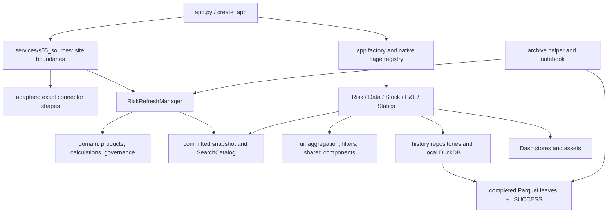
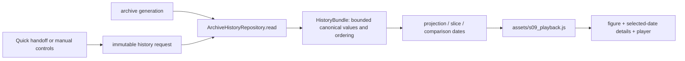
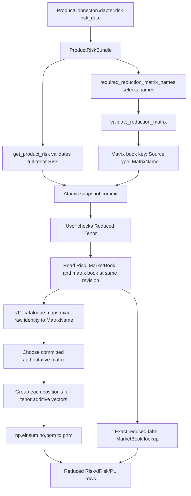

# all — Rebirth implementation handbook

**Branch:** `v5`, created from `v4` commit `950ea707a50f8d12beafa363855207ecc5ed505d`. This commit consolidates documentation only; the application's non-Markdown files are unchanged. All 22 original Markdown documents are combined here and removed only from the new branch. Their originals remain available at the pinned source commit.

This handbook preserves every source section and complete fenced code/patch block. Navigation is rewritten for one file, related material is grouped by topic, and the opening precedence rules distinguish alternative or superseded recipes. The large original patches are retained as reference bundles; choose the focused implementation once.

<a id="chapter-01"></a>
## Chapter 1 — Implementation order and source authority

This is the single replacement for the 22 Markdown documents previously on `Rebirth-V5` branch `v4`. It brings their implementation instructions, complete patches, operating guides and architecture references into one chaptered document. The [source register in Chapter 13](#chapter-13) identifies where each former document now lives.

**The `v5` branch consolidates documentation. It does not install the application changes described in this handbook.** The source branch and exact commit used for this consolidation are recorded in the source register. Files described by the original guides as “implemented locally” were tested in the review workspace; publishing those instructions does not apply their patches to the branch.

### How to use this handbook

Use the implementation sequence below as the working plan. Then use the named source section within the relevant chapter for exact paths, functions, additions, replacements and tests. The chapters retain the detailed source instructions so that code, assumptions and rollback steps are not lost.

The original documents overlap. **Do not apply every patch consecutively.** In particular:

- The Risk cache patch appears in both the former `FIXESMD.md` and `OPTIMISATIONS.md`. Use **OPTIMISATIONS section 2 and its Appendix A** as the canonical focused cache recipe, and apply it once.
- Use **FIXESMD Part B's Statics picker callback and its corresponding tests** for the Statics fix. Its complete Appendix A also includes the cache patch and optional-tool manifest changes. A selective Statics application should not bring those unrelated hunks with it.
- If you choose to apply the **whole FIXESMD Appendix A**, also create the three optional Python tools from its appendices; its manifest test expects them. That whole patch replaces the separate Statics/cache applications, rather than following them.
- The matrix, promotion, Cross Gamma, connector and saved-view documents describe different points in the application's development. Read their stated baseline and compare the current function before applying anything. A later comprehensive recipe can supersede an earlier partial recipe.
- `NEWTESTS.md` is an architecture, operating and test reference. Its name does not mean every suggested test has been added, or that the whole document is a patch to execute.

Within retained source text, old document filenames and headings identify the original material. They are not instructions to recreate all the separate Markdown files. Earlier source claims such as “not published” describe that source's original delivery; this opening and the source register describe the new documentation branch. Earlier benchmark results remain evidence for their stated checkout, fixtures and environment, not fresh measurements of this branch or production.

#### What the status words mean

| Status in a chapter | What you should do |
|---|---|
| Existing implementation | Inspect the current code and use it; do not install it a second time. |
| Implemented/tested locally | Compare the supplied patch with your checkout, apply missing changes and run the stated checks. It was not installed by publishing its manual. |
| Proposal or future development | Implement and verify it as a new change. Do not inherit the local patch's test result as evidence for this proposal. |
| Historical or overlapping recipe | Use it for explanation or a missing part after comparing with the authoritative current implementation. It is not an additional mandatory patch. |
| Optional tool or demonstration | Add only when you need it. Synthetic history and chart examples do not provide real historical observations or change live application charts. |

The focused local Statics/cache/tool work described in the review passed **686 tests**, with **56 warnings**, on the documented `main` baseline `8f65a1124e54702597347967c7064eb4f7edf133` plus those local changes. The original 668- and 672-test counts refer to earlier stages. This handbook consolidation has not reproduced those application tests against the destination branch, and it does not claim the remaining proposals passed them.

### Implementation order

The sequence below replaces any earlier “apply the whole manual in order” reading. Each phase should be a reviewable application change or small group of related changes. The exact recipes remain in the corresponding chapters.

#### Phase 0 — Establish the actual starting code

1. Record your checkout's commit and uncommitted changes. Use a separate implementation branch from `v5` if you want to keep the consolidated reference branch easy to compare.
2. Read the README and NEWTESTS architecture, financial contracts, refresh and state sections. The position/quote distinction explains why some seemingly simple grouping changes alter results.
3. Run the existing tests before changing application code and record the result. Compare each proposed target function with the version shown in its source section; the exact review patches target the `main` commit named above, whereas `v5` was created from the recorded `v4` commit.
4. Mark an item already present only after checking its behavior or test, not merely finding a similar function name. Do not reset the checkout to an older baseline to make a patch apply.

**Detailed source:** [Chapter 3](#chapter-03), FIXESMD Part A; [Chapter 2](#chapter-02), NEWTESTS sections 3–6; [Chapter 11](#chapter-11), NEWTESTS section 15; [Chapter 13](#chapter-13), the source register.

#### Phase 1 — Apply the small, verified Statics and Risk cache fixes

1. Apply the Statics Write picker reset callback and its tests. It clears the old dataframe's view state when the selection changes, so an old filter cannot hide the new dataframe.
2. Apply the canonical Risk cache patch once: reuse the numeric/quote index for the unchanged selected scope, bound its retained memory and entries, guard refresh/clear races, and stop retaining complete Explorer table variants.
3. Verify Statics dataframe switching and Risk expansion/filter/measure/refresh behavior. Keep the displayed values, membership and market quote calculations unchanged.

**Detailed source:** [Chapter 3](#chapter-03), FIXESMD Part B's Statics instructions and OPTIMISATIONS section 2; [Chapter 12](#chapter-12), OPTIMISATIONS Appendix A. The duplicate “Step B4/B5” labels in the original FIXESMD refer to separate Statics and cache subsections; choose by the full heading, not by step number alone.

The cache patch does not add Portfolio, pagination, a total visible-row cap, or a prebuilt fully expanded browser table. Aggregate P&L and Top Promotions retain their separate workspace component cache.

#### Phase 2 — Correct values, selected populations and recovery

1. Make P&L preview, saved effective values and send calculations use the same adjustment semantics. Preserve adjustments outside the edited selection and detect stale saves where concurrency is supported.
2. Preserve Data's selected identity, contributor filters, period and loaded-result label across Load, navigation and playback changes.
3. Correct quote aggregation and capped-total labeling before changing chart appearance. A quote shared by multiple portfolios remains one quote.
4. Preserve Stock's clicked filtered population, all relevant currencies and prior-only exits in its Changes view.
5. Make P&L reconciliation explicit about matched and missing coverage, historical dates and the metric selected for drill-through.
6. Preserve last-good refresh behavior, truthful missing values and safe tenor-reduction support counts and recovery.
7. Add the missing Market Move graph return where it is still absent. This fixes a missing component; it is separate from redesigning its appearance.

**Detailed source:** [Chapter 4](#chapter-04), FIXESMD F1–F7; [Chapter 8](#chapter-08), FIXESMD D4. F5's demo alias translation is conditional on the documented fixture mismatch; it is not a general production identifier rewrite. Consult [Chapter 9](#chapter-09) for tenor/matrix/connector prerequisites and [Chapter 10](#chapter-10) for promotion and supplemental-risk prerequisites. Apply only the missing authoritative change when recipes overlap.

#### Phase 3 — Bound allocations, output and retained results

1. Check the date-by-tenor grid size **before** constructing it. Keep the existing numeric preload and Play/Pause behavior for a history selection that fits.
2. Add a global visible-row budget to Risk Explorer and a total construction budget to P&L Validate, with an explicit indication that detail is limited. Continue calculating financial totals from the full selected population.
3. Load Stock position detail when requested and send only its server-selected page. Apply filtering and sorting to the full selected population before selecting the page.
4. Push supported Data contributor filters into the parameterized SQL query before its row limit. Preserve exact include/exclude and Split behavior.
5. Bound retained P&L history statistics and summary results. Evicting a recomputable result must not delete historical archive data.

**Detailed source:** [Chapter 5](#chapter-05), OPTIMISATIONS section 3 item 1 and section 4 items 1–5. Its full lazy Stock paging recipe includes callback ownership changes; adding pagination controls alone would still send the whole dataset.

P&L Validate currently relies on hidden descendants for browser-only expansion. The immediate construction guard and a later server-driven expansion design are different changes. Do not remove hidden rows and leave the existing expansion interaction without a way to load children.

#### Phase 4 — Remove repeated work inside those bounds

1. Group sibling positions once instead of scanning the same parent dataframe for every child.
2. Skip values that a table deliberately leaves undisplayed; preserve completeness and financial semantics for the values it does show.
3. Share the Risk surface pivot between chart and matrix, reuse the already selected detail scope, and slice only the Search columns required by its active filters.
4. Avoid copying a full Portfolio refresh snapshot when the callback only needs completion/status information.
5. Avoid rebuilding the hidden Statics Read panel during Write interactions.
6. Batch Stock history requests and reduce repeated archive metadata work, keeping integrity validation and freshness guarantees intact.

**Detailed source:** [Chapter 5](#chapter-05), OPTIMISATIONS section 3 items 2–6; section 4 items 6–8; section 5 R1; section 6. Correct Stock identity/scope first so batching requests cannot efficiently fetch the wrong population.

#### Phase 5 — Add useful Stock fields and authentic history

1. Expose the existing Quantity and dQuantity fields through the Stock metrics/configuration paths described in the recipe.
2. Add optional metadata such as ISIN through its source-to-display path without silently changing position identity or merge cardinality.
3. Connect dated source reads and daily capture for the datasets you actually need, including Stock. Verify one completed capture through the application's real readers before scheduling it.
4. Keep daily snapshots, current adjustment state and durable adjustment/save/send audit events as separate responsibilities. Add the adjustment audit flow after Phase 2 establishes consistent effective-value behavior.
5. Use the synthetic history helpers only for development and demonstration. Missing past real observations require an authoritative backfill; a daily capture job begins collecting from the dates for which real source data is available.

**Detailed source:** [Chapter 7](#chapter-07), FIXESMD Part E, `followdata.md` and `fix20.md`; [Chapter 2](#chapter-02), NEWTESTS section 12; [Chapter 12](#chapter-12), the complete optional tool sources. Where integration recipes overlap, follow the chapter's precedence note and install one authoritative Stock capture path.

#### Phase 6 — Integrate better chart designs

1. Generate the optional chart previews if you want to compare the alternatives on the supplied examples.
2. Replace one live chart at a time using the real prepared-data path. Preserve the shared-pivot improvement from Phase 4 when changing surface styling.
3. Check tenor ordering, axis/hover units, zero and missing-value treatment, colour ranges and comparison dates. Confirm the selected scope's values against the table.

**Detailed source:** [Chapter 8](#chapter-08), FIXESMD Part D; [Chapter 12](#chapter-12), the full preview-generator source; [Chapter 2](#chapter-02), NEWTESTS section 13. The preview generator does not automatically install new charts in Dash. Use the chart acceptance criteria for browser review after each integration.

#### Phase 7 — Add Portfolio to main Risk only after the capacity checks

1. Determine whether the reported 100k rows are raw positions or already grouped rows. Measure the actual groups and output cells for the intended Portfolio breakdown; do not automatically multiply every row by 400.
2. Use Portfolio as a bounded optional position breakdown or paged detail. The cache patch and Phase 3's output guard are prerequisites.
3. Preserve unique market quote identity and full-population Risk/P&L totals. Do not add Portfolio indiscriminately to shared registries that already include it in joins/groupings.
4. Test narrow, broad, collapsed and expanded selections shaped like the real 300–400-portfolio data. Measure response bytes, peak worker memory and browser responsiveness as well as calculation time.

**Detailed source:** [Chapter 6](#chapter-06), FIXESMD Part C; [Chapter 5](#chapter-05), OPTIMISATIONS section 7.2. The minimal two-file inline Portfolio recipe is not, by itself, a production rollout recipe for the reported scale.

This phase depends on Phases 1–4. It does not technically need to wait for history or visual redesigns.

#### Phase 8 — Apply remaining targeted improvements when relevant

1. Revisit supplemental connector validation, finite-value checks, tenor-reduction market scoping, log-buffer bounds, smaller temporary copies and browser gesture work using representative measurements.
2. Use the connector timeout/failure/bulk-fetch material if those source paths are used. Reconcile overlapping recipes and preserve uniqueness validation, exact source requests and atomic publication.
3. Apply the JTD reference pagination/formatting proposal if that table remains difficult to use. Keep this display work separate from New Trades/JTD financial and reference authority.
4. Consolidate duplicated state/editor paths only after their behavior is covered. Introduce another cache, database, worker or frontend framework only for a measured remaining requirement.

**Detailed source:** [Chapter 5](#chapter-05), OPTIMISATIONS section 5 R2–R7, section 3 item 7 and section 4 item 9; [Chapter 4](#chapter-04), FIXESMD F8; [Chapter 9](#chapter-09), connectors; [Chapter 8](#chapter-08), JTD reference display. Per-node aggregate caching, fully lazy P&L expansion and broader metadata caches remain conditional investigations.

#### Phase 9 — Validate, commit and operate each completed change

For every application change, run its focused tests, check the relevant user interaction, compare values/scope/dates/nulls, and inspect the diff before committing. Run the full suite for an integrated batch. Run browser checks for callback and JavaScript changes; numeric tests alone do not show whether a large table is usable.

Use the original source's rollback instructions for the exact change you applied. Do not restore whole files over later unrelated work. Do not clear or rewrite completed historical archives to undo a cache, chart or table change.

**Detailed source:** [Chapter 11](#chapter-11), OPTIMISATIONS section 8, FIXESMD Part H/verification ledger and NEWTESTS section 15. The existing fixture benchmark budgets are useful baselines, but passing them does not establish production safety for unrestricted Portfolio expansion.

### Topic map for the detailed chapters

This table maps the chapters to the original material. Some source documents span several chapters so that implementation details sit with their topic. The [source register](#chapter-13) provides their complete placement.

| Topic | Original material retained in this handbook | How to treat overlapping material |
|---|---|---|
| [1 — Implementation order and source authority](#chapter-01) | This consolidated opening and precedence rules | Start here. The phase sequence governs implementation, while the numbered chapters organize reference material. |
| [2 — Architecture, operation and current behavior](#chapter-02) | README; NEWTESTS sections 1–14; FIXESMD Part G | Reference. Current code and tests remain authoritative; local review changes are explicitly dated. |
| [3 — Baseline, Statics and Risk cache](#chapter-03) | FIXESMD Parts A/B; OPTIMISATIONS section 2 | Apply the focused changes once, using the complete source patches in Chapter 12. |
| [4 — Financial and page correctness](#chapter-04) | FIXESMD Part F; fix13 | Correct values, identity, selection, coverage and recovery before redesigning presentation. |
| [5 — Capacity and performance](#chapter-05) | OPTIMISATIONS sections 3–7 | Bound allocations/output first, then remove repeated work. Most items remain proposals. |
| [6 — Portfolio on main Risk](#chapter-06) | FIXESMD Part C | Requires the earlier cache, output limits and scale checks. The minimal inline recipe is not a capacity guarantee. |
| [7 — Stock, history and source integration](#chapter-07) | FIXESMD Part E; followdata; fix20 | Use the chapter's precedence rules to select one capture integration. Demonstration tools do not recover real history. |
| [8 — Charts and JTD reference display](#chapter-08) | FIXESMD Part D; fix23 | Separate missing-plot correctness, optional visual previews and live display changes. |
| [9 — Tenor reduction, matrices and connectors](#chapter-09) | FIX1; TENOR_REDUCTION_MATRIX_FLOW; bulk; fix12; fix16; fix17; fix22 | Compare the current owner with the applicable complete recipe. Do not stack successive rewrites blindly. |
| [10 — Promotions, saved views and supplemental risk](#chapter-10) | fix14; fix15; fix18; fix19; fix21; v1file | Historical and targeted recipes overlap. Apply missing current behavior once and preserve financial authority. |
| [11 — Diagnostics, validation and future development](#chapter-11) | NEWTESTS sections 15–18; FIXESMD Part H; OPTIMISATIONS section 8/Appendix C; network | Reference and verification. Network diagnosis is not itself a patch; earlier cache descriptions can predate the focused fix. |
| [12 — Complete patches, tools and historical reviews](#chapter-12) | FIXESMD appendices; OPTIMISATIONS Appendices A/B | Complete source needed by earlier recipes. OPTIMISATIONS Appendix A is the canonical focused Risk cache patch. |
| [13 — Source register](#chapter-13) | All 22 original document paths and their placement | Provenance and exact lookup. Do not recreate the deleted documents to follow cross-references. |

The detailed material follows. Read it with the phase order and status rules above; its source-level headings are retained for exact lookup and provenance.

### Read this before applying the collected implementations

The original documents are preserved below as source sections, but they are not a sequence of patches to apply indiscriminately. Several describe the same feature at different stages. Follow the chapter roadmap first, then use the chosen implementation once. Original words such as “current,” “implemented,” “today,” and branch names describe that source document's stated baseline; combining the documents does not install their code or update those historical claims.

The source collection was checked against `Rebirth-V5` branch `v4` at `950ea707a50f8d12beafa363855207ecc5ed505d`. Documentation-only publication to the new `v5` branch must not be confused with runtime implementation. Before applying any source patch, compare its named functions with that branch's actual code. Prefer behavior tests and current symbols over an old whole-file replacement or line number.

#### Which version to use once

| Feature | Primary implementation/reference | What to do with overlapping instructions |
|---|---|---|
| Reusable Risk hierarchy index | `OPTIMISATIONS` section 2 and its exact cache patch | The same cache fix appears in `FIXESMD` Part B and Appendix A. Apply one copy only. The focused patch avoids unintentionally taking the Statics and optional-tools changes with it. It changes reuse, not quote or Risk arithmetic. |
| Cache race/lifetime diagnostics | Apply the Risk cache patch first; retain the remaining diagnostics from `network` as separate proposals | `network` describes the old 24-entry Explorer component cache and requests an epoch guard. The focused cache patch removes retained Explorer component trees and supplies epoch guards. Do not reintroduce that cache or add a second guard. Aggregate P&L/Top Promotions still use the separate rendered-workspace cache; reduced books and other caches still have their own costs. |
| Reduced-tenor authority | `TENOR_REDUCTION_MATRIX_FLOW` for explanation, `fix22` for the consolidated implementation, and `followdata` Part 1 for a new real matrix | `fix16` supplies revision/Risk-Type reduction reuse; `fix17` supplies dated matrices committed with Risk. They are pieces of the consolidated design, not competing additional caches. Retain both when already present. |
| Credit reduced tenor | Current automatic shared `CREDIT_STANDARD` mapping in `fix22` | The first Credit variant requiring a catalogue row per Underlying is explicitly obsolete. Do not restore Credit rows to `s11_matrix.csv` from an earlier example. Credit map-and-sum is distinct from the non-Credit numeric matrix bundle. |
| Cross Gamma `dRisk` and promotion | `fix19` for the contract and installation, with `v1file` as the matching low-level edit reference | Do not apply both as separate features. Preserve connector-owned source `dRisk`, the raw/developed distinction, and one shared promotion computation. Do not add Split or Portfolio to promotion aggregation keys. |
| Promotion sorting | `fix15` Top Promotions ordering and `fix21` promoted Explorer display-bucket ordering address different views | Check each view separately. An already-working Top Promotions selector does not prove the promoted Explorer row sorter is fixed. Preserve signed aggregation before absolute-value ranking. |
| New Trades and JTD scope | `fix18` hierarchy selection/date behavior first; `fix23` JTD presentation afterward | Formatting must preserve `fix18`'s clicked/promoted identity scope. JTD formatting should not add a second source load, new promotion calculation, or matrix work. |
| JTD number formatting | Final numeric presentation-copy solution in `fix23` | The final recommendation explicitly supersedes an earlier hidden sign-marker/row-index design. Use the four named numeric fields and semantic negative-color rules once. |
| Large Stock detail | `OPTIMISATIONS` section 4, item 3 | Do not copy JTD's native pagination as the large-Stock solution. Native pagination still sends the selected dataset. Stock needs lazy loading and server paging with filtering/sorting over the full matching scope before the requested page is selected. |
| Stock archive integration | For the integrated production route, use `followdata` Part 3's optional `stock_loader` at the archive boundary | `FIXESMD` Part E's `archive_with_stock` job wrapper is a smaller alternative; do not install both routes. The wrapper's `SimpleNamespace` omits `combined_pl`, which matters if the historical missing-P&L hardening below is also selected. |
| Historical missing-P&L preservation | `followdata` section 4.8A, after explicitly choosing the archive policy | The same-revision `combined_pl` projection preserves unavailable Predict P&L that the display frame zero-fills. It is not equivalent to archiving the display dataframe. Preserve the original snapshot authority when combining this change with Stock capture. |
| P&L history cache bounds | `OPTIMISATIONS` section 4, item 5 | Replace, rather than stack on top of, the simpler 64-entry count-only helper in `followdata`. The later proposal distinguishes small statistics from summary DataFrames and accounts for summary bytes. Neither budget is a hard whole-process memory limit. |
| Adjustment and send correctness | `FIXESMD` Part F1 before enabling real senders; Part E for durable audit design | `followdata` correctly describes repository replacement semantics, but that alone does not resolve editor/Save/scoped-Send inconsistencies. Use one effective-value calculation and preserve untouched keys. The active CSV state is not an append-only audit history. |
| Market arithmetic and charts | `FIXESMD` F3 for Data/Quick Risk quote behavior; `fix13` only for its explicitly defined Split-contribution convention | The `fix13` Split-sum experiment assumes custom Gamma contributions are already zeroed. It is not permission to sum ordinary duplicated MarketBook quotes or to add Market Sum back to Data playback. Confirm the input authority and test indexed/reference agreement before changing arithmetic. |
| Refresh Portfolio copying | `OPTIMISATIONS` section 5 R1 | The older V3 cold-path cleanup and current Portfolio-only copy removal have overlapping goals. Check the existing signature/call site and remove the remaining unnecessary copy once; retain public defensive-copy behavior where callers own returned frames. |
| Statics picker and hidden Read work | `FIXESMD` Part B for Write-state reset, then `OPTIMISATIONS` section 6 for skipping hidden Read work | These are complementary changes to different callbacks. Skipping hidden rendering does not replace the picker-state reset. Never page the Write dataset and then save the visible page as a complete replacement file. |

#### Conflicts that need an explicit implementation choice

**Connector failure isolation and total runtime bounds.** `FIX1` describes bounded calls, per-call deadlines, retries and the original cumulative budget. `fix12` is explicitly an experiment that disables the cumulative budget to prevent one failed product from suppressing all later products. `fix15` records subsequent product-level isolation work. Do not apply the budget-removal experiment as a generic performance improvement or silently re-enable a global circuit that skips unrelated healthy products. Preserve native client deadlines and the bounded connector gate, then test the desired isolation and total-refresh behavior together. `bulk` changes Commodity request scope, not these timeout/isolation policies.

**Stock daily capture alternatives.** Choose one Stock wiring path before editing `tools/s02_archive.py`. The recommended integrated `followdata` route adds the callable at the writer boundary, preserves the original snapshot for other archive projections, and threads it through the manager helper and CLI. Its new `STOCK_LOADER` resolver is proposed code; it is not a pre-existing environment setting. The `FIXESMD` wrapper instead attaches the validated Stock frame in job composition. In either route, do not edit a completed daily leaf in place. The old guides differ on whether an existing leaf lacking Stock is an intentional no-op or a job error; define that monitoring outcome explicitly and keep any repair/migration separate.

**Read-only playback limits.** The history-grid proposal changes the allocation guard, not Play/Pause's basic behavior. The browser still receives numeric values for the selected dates and draws one date at a time. Compute the date-by-axis cell count before allocating the complete grid. Do not interpret this as a requirement to fetch each animation frame from the server or prebuild one Plotly chart per date.

**Visible row budgets and financial totals.** Risk and P&L output limits bound constructed interface rows. They must not cap the position population used for full totals. Native-hidden P&L rows cannot simply be removed while retaining a browser-only expansion handler; building children on demand needs a corresponding server callback. The immediate P&L tree budget and the future lazy tree are separate steps.

**Logging versus financial history.** `fix15`'s Application Logs modal, `network`'s request/process diagnostics, the daily official archive, the optional intraday capture proposal, and adjustment/send audit records solve different problems. A process log does not replace an immutable financial event record, and an end-of-day cut does not reconstruct every intraday revision. Start with the existing operational logs and a targeted incident reproduction; enable heavier heartbeat/soak diagnostics when investigating the crash, then size retained data from measurements.

#### Source-status ledger

This table reports what the source documents say. It is not a claim that every described change has been independently reimplemented or verified on the new branch.

| Original source | Status and how it should be used in this combined manual |
|---|---|
| `README.md` | Baseline operation, setup, contracts, ownership, archive and publication reference. Reconcile statements about old caches or optional functionality with the selected later patches. |
| `FIX1.md` | Baseline bounded-Market behavior and native deadline guidance. Read alongside later product-failure isolation proposals; do not treat all historical cumulative-budget policies as simultaneously active. |
| `TENOR_REDUCTION_MATRIX_FLOW.md` | Explanation of the dated non-Credit matrix chain and exact multiplication; Credit and Cross Gamma are explicitly separate. |
| `FIXESMD.md` | Mixed status: locally executed Statics/cache fixes and optional demonstration tools, plus unapplied Portfolio, chart, Stock/history and correctness recipes. Full Appendix A includes multiple changes, so select its hunks deliberately. Historical review appendices retain their original dates. |
| `NEWTESTS.md` | Architecture, current behavior, module/test inventory, operational reference and future-development map. It is not a giant test patch or a sequential implementation script. Verification counts belong to its recorded reviewed tree. |
| `OPTIMISATIONS.md` | Exact locally executed Risk cache patch plus proposed performance changes and measured audit evidence. Most listed optimisations remain proposals. Numeric retention budgets and fixture timings are initial evidence, not production capacity guarantees. |
| `experiments/fix12.md` | Explicit proposed experiment: product-call Market failure isolation, including removal of the cumulative refresh budget. Treat its budget choice carefully in the integrated refresh policy. |
| `experiments/fix13.md` | Explicit proposed experiment: Split-aware Market aggregation and scalar-label alignment, plus lag diagnosis. Depends on its stated custom Gamma convention. |
| `experiments/fix14.md` | Reports implementation on `v2-fix`: saved-view selection and Default/Custom classification. Check whether the five replacements already exist before applying historical full-function code. |
| `experiments/fix15.md` | Reports implementation on `v3`, except its P&L diagnostic ideas. Pins, JTD, logging, retry/isolation and cold-path changes are historical foundation; use later Credit/JTD/cache refinements where they overlap. |
| `experiments/fix16.md` | Reports implementation on `v3`: reduction once per revision and active Risk Type. A prerequisite already incorporated into the consolidated reduced-tenor chain, not the new hierarchy-index cache. |
| `experiments/fix17.md` | Reports implementation on `v4`: same-date matrix bundles returned with Risk and committed atomically. Preserve this authority when changing matrices. |
| `experiments/fix18.md` | Reports implementation on `v4`: hierarchy trade/JTD detail scope and T−1 supplemental Risk dates. Written against the commit immediately after `fix17`; avoid replacing newer callbacks wholesale. |
| `experiments/fix19.md` | Cross Gamma `dRisk`/promotion implementation and installation guide. Shares the same feature as `v1file`; do not duplicate promotion logic. |
| `experiments/fix20.md` | Investigation and daily-history operating guide; explicitly documentation-only. The Stock capture gap remains until one selected integration route is installed. |
| `experiments/fix21.md` | Documentation-only proposed correction for promoted Explorer ordering. Separate from Top Promotions sorting. |
| `experiments/fix22.md` | Consolidated reduced-tenor audit/implementation guide at its named `v4` commit; explicitly identifies obsolete Credit semantics and remaining unresolved findings. |
| `experiments/fix23.md` | Revised documentation-only JTD pagination/formatting proposal. Use its final numeric-copy design; earlier marker variants are superseded. |
| `experiments/bulk.md` | Documentation-only exact `(Underlying, Tenor Swap)` Commodity bulk proposal. Preserve FX's existing Underlying-only interface and reject unrequested returned pairs. |
| `experiments/followdata.md` | Documentation-only real-source, matrix, archive, Stock and P&L integration guide. Its four source paths and optional sender paths remain separate; source integration does not repair all reviewed page behavior. |
| `experiments/network.md` | Diagnostic proposal that explicitly assumes `fix12`–`fix23` have been applied. That assumption is not evidence that the branch contains every fix. Old Explorer-cache observations need updating after the focused cache patch; root-cause hypotheses still require incident evidence. |
| `experiments/v1file.md` | Earlier narrow manual edit sequence for Cross Gamma `dRisk` and shared promotion; use as supporting detail for `fix19`, not a second implementation. |

#### Final application rule

Make one behavior change at a time, retain its focused regression, and commit it separately. Keep source integration, correctness, output/memory limits, and optional polish as distinct reviewable changes. Run the selected chapter's tests against the code actually being changed. A previous passing test count, a published manual, or the presence of a historical experiment is not proof that a proposal has been installed.

<a id="chapter-02"></a>
## Chapter 2 — Architecture, operation and existing behaviour

Read this chapter to understand existing owners and contracts. Its source descriptions refer to their stated baseline; the proposed changes in later chapters are not installed merely by appearing in this handbook.

In this chapter:

- [Rebirth V5](#part-src-readme-00) — `README.md`.
- [Part G — what is currently implemented and how to use it](#part-src-fixesmd-09) — `FIXESMD.md`.
- [1. Purpose and boundaries](#part-src-newtests-02) — `NEWTESTS.md`.
- [2. How to run and use the application](#part-src-newtests-03) — `NEWTESTS.md`.
- [3. Architecture and dependency direction](#part-src-newtests-04) — `NEWTESTS.md`.
- [4. Boot, shared shell, and refresh](#part-src-newtests-05) — `NEWTESTS.md`.
- [5. Financial contracts and calculation sequence](#part-src-newtests-06) — `NEWTESTS.md`.
- [6. State, caches, and persistence](#part-src-newtests-07) — `NEWTESTS.md`.
- [7. Risk page](#part-src-newtests-08) — `NEWTESTS.md`.
- [8. Data page](#part-src-newtests-09) — `NEWTESTS.md`.
- [9. Stock page](#part-src-newtests-10) — `NEWTESTS.md`.
- [10. P&L page](#part-src-newtests-11) — `NEWTESTS.md`.
- [11. Statics page](#part-src-newtests-12) — `NEWTESTS.md`.
- [12. History, archive jobs, and notebooks](#part-src-newtests-13) — `NEWTESTS.md`.
- [13. Frontend assets and charts](#part-src-newtests-14) — `NEWTESTS.md`.
- [14. Configuration, deployment, and diagnostics](#part-src-newtests-15) — `NEWTESTS.md`.

<a id="part-src-readme-00"></a>
> **Source: `README.md` — Rebirth V5.** Baseline operating, setup, contracts and release reference. Original wording such as “current”, “implemented” and “not published” belongs to that source's stated date/baseline.

<a id="src-readme-rebirth-v5"></a>
### Rebirth V5

Rebirth V5 is the page-owned rebuild of the Cube risk application. It keeps
the financial content carried forward from V1 while making cold start,
historical reads, promotions, saved filters, and refresh ownership explicit.
It is a Dash 4.4 application backed by pandas/NumPy for current snapshots and
PyArrow/DuckDB for lazy Parquet history.

> **Demonstration data only.** The checked-in connectors and 262-day archive
> are deterministic synthetic fixtures presented as `TEMP_REPLACE_ME`. The example
> send functions are not production integrations. Replace those boundaries
> and complete the relevant control review before using this application for
> financial decisions.

`app.py` is the only runtime entrypoint. Importing it builds the shell and
service boundaries without loading source data or scanning annual history.
The first page can therefore paint before the initial refresh begins.

<a id="src-readme-quick-start"></a>
#### Quick start

From PowerShell in the repository root:

```powershell
python -m venv .venv
.\.venv\Scripts\python.exe -m pip install -r requirements-dev.txt
.\.venv\Scripts\python.exe app.py
```

Open `http://127.0.0.1:8050/`. The equivalent launch forms are:

```powershell
.\.venv\Scripts\python.exe app.py --host 0.0.0.0 --port 8050
$env:HOST = "0.0.0.0"
$env:PORT = "8050"
.\.venv\Scripts\python.exe app.py
```

`--debug` or `DASH_DEBUG=1` enables Dash debug mode. Production WSGI servers
import `app:server`. `gunicorn.conf.py` deliberately uses one `gthread` worker
because the committed snapshot and refresh progress are process-owned; its
thread and timeout overrides are `GUNICORN_THREADS` and
`GUNICORN_TIMEOUT_SECONDS`.

Runtime dependencies are pinned in `requirements.txt`: Dash 4.4.0, DuckDB
1.5.5, NumPy 2.5.1, pandas 3.0.3, PyArrow 25.0.1, Plotly 6.9.0, tzdata
2026.3, and Gunicorn 23.0.0 on non-Windows hosts. The Dash pin is intentional
because the native P&L editor is lifecycle-tested against its DataTable and
Patch behavior. `requirements-dev.txt` adds Plotly Cloud, pytest, and Ruff.

<a id="src-readme-pages-and-user-flow"></a>
#### Pages and user flow

| Route | Owner | User workflow |
|---|---|---|
| `/` | Risk | Current risk, P&L, search, promotions, and pivot exploration. |
| `/data` | Data | Editable Risk or Market historical selection and playback. |
| `/stock` | Stock | Current mapped stock rows and inline Stock/dStock history. |
| `/pnl` | P&L | Aggregate review, inline history, governed editors, send, and validation. |
| `/static-data` | Statics | Read approved connector files or edit the governed subset. |

<a id="src-readme-risk"></a>
##### Risk

The top workspace is one open-by-default **Aggregate P&L** disclosure with exactly
four compact tabs in this order:

1. **Aggregate P&L** renders the mapped snapshot by the selected governed
   dimension.
2. **Quick Risk** resolves one committed risk identity, renders its exact
   hierarchy, and can hand it to Data.
3. **Quick Market** resolves one committed quote identity, renders its current
   matrix, and can hand the editable identity to Data for history.
4. **Top Promotions** is a flat Vol Score rank with ten rows per page. Its
   connector-signal selector defaults to Vol Score; the internal promotion
   threshold score is not shown as a table column.

The Data handoff is only a prefill. It never locks Data controls. A strict
Quick handoff performs one initial history request; after that, Risk Type,
Risk Greek, underlying, identity mode, dates, projection, and slice are
normal Data controls again.

The Risk Explorer has only **Cross** and **SplitVA** tabs. Both expose their
Risk Type/Greek families as expandable, chevron-driven financial hierarchies;
Credit also retains its Single/Multi presentation.
Its action row is four columns: Split; Underlying ordering by Risk/dRisk/P&L;
one Region/Promotion/Reduced tenor checklist; and the current promotion level
with its recompute/reset actions. Reduced tenor is reversible and lazy: the
first use builds one reduced book for the active Risk Type and committed
revision. Later Reduced requests across filters reuse it; Full mode continues
to use the authoritative full book.
For non-Credit catalogue matches in `data/s11_matrix.csv`, products apply the
selected matrix after P&L. Every registered one-axis Credit product and raw
Underlying automatically uses the shared code-defined `CREDIT_STANDARD`
Full-Tenor-to-Reduced-Tenor mapping. A Credit-only request does not read the
catalogue; it is loaded lazily only for non-Credit reduction. Risk,
dRisk, P&L, breakdowns, and Credit measures are summed within each existing
position. Market quotes are never multiplied or summed: an exact
reduced-tenor label reuses the matching full-tenor quote and otherwise remains
blank.
The default governed view is Activity, with Activities 1, 2, and 3 as the
baseline scope. The Risk filter row is Activity, Signoff Group, Category, and
Sub Category, with explicit include/exclude semantics. Portfolio remains an
internal position boundary and is still available to Stock and P&L. Saved Views
is a form: selecting a named view or changing a selector edits a draft;
only **Apply filters** changes Risk outputs, and **Cancel changes** restores the
last committed selection. Stock and P&L use the same small contract while
keeping independent page state. On the first visit to each page, Base is
resolved from that page's authoritative data and committed once automatically;
later draft changes still require Apply. Clear Cache invalidates data caches but
preserves the page's committed view; the reduced book is rebuilt on its next use.

Promotions are computed against thresholds at exact Risk Type + Risk Greek
grain. The baseline generation uses Activities 1-3 and is committed with the
refresh revision. **Recalculate promotions** is the explicit action that
creates a new revision-bound promotion generation from the visible scope;
filter and display changes do not continually recompute it. Eligibility still
uses the governed threshold rules, while ranking uses the deterministic
connector-owned **Vol Score**. Reset returns to the baseline generation.

<a id="src-readme-data"></a>
##### Data

Data has **Risk History** and **Market History** tabs. Risk uses a reported/raw
underlying dropdown and always plots `Risk`; Market uses its exact raw identity
and always plots the archived `Official` value. There is no redundant metric
selector. The user then chooses Risk Type, Risk Greek, underlying, and a
segmented WTD/MTD/YTD/1Y/5Y/All/Custom period. Custom start/end dates appear
only for Custom.
`Load history` snapshots those controls into one immutable request; changing a
control alone does not scan the archive. Quick handoffs are consumed once, so
the controls remain editable after navigation.

The returned bundle drives ProductSpec-shaped projection and slice controls,
Date A/Date B comparison, a canonical scalar/line/surface plot, and bounded
selected-date details. Two-axis swap/option-over-time projections default the
fixed axis to **Sum**, using a null-preserving sum across its tenors, while each
individual tenor remains selectable. The compact browser-side player supports
static mode, play/pause, live slider dragging, and wheel scrubbing without
another server query. There is no default raw-history table or second raw
payload. Loading status appears immediately while the single history read is
running.

<a id="src-readme-stock"></a>
##### Stock

Stock first paints an empty shell, then loads the latest connector comparison
asynchronously. Its Saved Views disclosure owns the five governed filters—
Activity, Signoff Group, Portfolio, Category, and Sub Category—which default to
the same Activities 1-3 scope as Risk and affect the pivot only after Apply.
A configurable chevron pivot defaults to Activity → Category (Bucket) → CRDS
→ CPTY, with optional Currency/Product columns and `Stock`/`dStock` values.
The underlying detail stays position-level and preserves portfolio and static
metadata rather than aggregating it.

Clicking a CRDS/CPTY leaf loads its history chart on the same page. The same
selection can be made manually with always-visible WTD/MTD/YTD/1Y/All/Custom
controls; start/end dates appear only for Custom. Period and custom-date
changes update the selected history directly.
History is chart-only: it does not open another route or send a raw history
table to the browser.

<a id="src-readme-pl"></a>
##### P&L

One authoritative saved-filter row—Activity, Signoff Group, Portfolio,
Category, and Sub Category—governs every P&L section. The page-owned review is
Risk Type → Risk Greek → Underlying and carries **Today**, **MTD**, and **YTD**.
It reads its historical summary when the P&L page is entered, independently of
the Risk-page Aggregate P&L callback. Underlying children are bounded so a
large Greek cannot send thousands of rows to the browser at once. Clicking a
Today/MTD/YTD value at Total, Risk Type, Greek, or Underlying level reveals the
summed inline history for that exact hierarchy scope. The chart uses segmented
WTD/MTD/YTD/1Y/All/Custom controls, shows start/end only for Custom, and has one
Both/Colossus/Predict source dropdown; no raw history table remains.

The lower workflow contains the current Send All, SOG editor, Portfolio editor,
adjustment-save, and Validate P&L sections. Derived fields stay locked. Validate
P&L compares official Predict/Risk results with Colossus. It stays fully lazy
while its disclosure is closed, reuses an unchanged rendered result, and builds
the hierarchy once for a new date/filter state. Chevrons then expand only their
local subtree in the browser without rerunning the comparison. Missing
historical dates remain missing rather than being silently filled with zero.
Validation reads only the Risk and Colossus payloads it consumes and retains at
most the eight most recently used date comparisons in process memory.

<a id="src-readme-statics"></a>
##### Statics

Statics has **Read** and **Write** tabs. Read can inspect the approved
`data/s01_readiness.csv` through `data/s09_reported.csv` sequence plus the
read-only `data/s11_matrix.csv` catalogue in a bounded filterable table.
Write is intentionally limited to:

- `s06_portfolios.csv`
- `s07_thresholds.csv`
- `s08_concerto.csv`
- `s09_reported.csv`

The editable table provides Add row, editable existing cells, row deletion,
column hiding, Save, and Cancel. Governed connector columns cannot be
permanently deleted because doing so would make the source unreadable. Save
validates the complete schema and domain invariants, writes a temporary file,
publishes it with an atomic replace, and refreshes the Read table immediately.
Cancel reloads the governed file.

<a id="src-readme-runtime-status-and-failure-behavior"></a>
#### Runtime, status, and failure behavior

All five pages use the persistent shared shell. Clear Cache sits beside the
theme switch. The operational controls are:

- **Refresh Portfolios**, **Refresh Risk** (`Shift+F8`), and **Refresh PL**
  (`Shift+F9`), each with visible running/completion status.
- **Commodity quotes: Loaded/Disabled**. Disabling quotes does not hide
  Commodity Risk.
- **Risk dates: Checker/Today**. The date editor is a draft until Apply;
  Cancel discards it. Checker readiness and inventory are disclosed lazily.
- **Auto P&L: On/Off · 15 min**. This timer is browser-local; it does not create
  a second backend scheduler.
- **Clear Cache**, which advances the reset generation, clears reconstructable
  process caches, and performs one guarded full refresh. It does not delete
  Parquet or governed files.

Applied Commodity, Risk Checker, and date settings mirror the one committed
process snapshot. Auto P&L alone is browser-local scheduling state.

A cold visit to any of the five routes starts or follows one process-owned
background writer after the shell paints. Risk and P&L also schedule that same
idempotent attempt from their page builders; direct Data, Stock, and Statics
visits use the shared shell. Concurrent browsers follow the same attempt. Slow
source work happens outside the reader lock, so every reader sees the previous
immutable revision until the whole replacement is ready. A failed refresh is
rejected transactionally: the UI keeps the last successful snapshot, reports
one bounded warning, and offers retry. A watchdog can report a stalled attempt
but never starts a duplicate writer.

Cold-start market fan-out is deliberately conservative: one market request is
in flight by default and there are no automatic retries. Every callable
connector boundary has a 15-second caller-side deadline, while one refresh may
spend at most 120 seconds waiting on all external calls combined. A bounded
daemon gate retains at most eight calls that ignored their deadline and never
starts a second copy of the same still-running call. The first operational
Market failure opens a refresh-local circuit: all remaining Underlying, leg,
and product requests are skipped and represented by shaped missing quotes.
Schema/type failures still reject the candidate.
FX Delta can instead supply one bulk Open hook and one bulk Current hook, each
receiving the complete ordered Underlying scope. Open-only or Current-only
quotes copy across to preserve continuity; when both are absent the quote stays
blank. Cold checker or Risk availability failures can commit a valid partial
snapshot; optional overlays simply remain empty. Warm transactional failures
retain the prior committed revision. Browser-local automatic ticks within 14
minutes of another automatic attempt are coalesced, preventing several open
sessions from replaying the same refresh sequentially.

The manager's deadline stops waiting; it cannot kill arbitrary Python code.
Real connector clients should also set finite native connect/read deadlines so
the abandoned I/O and its daemon thread eventually terminate.
`CUBE_STARTUP_TIMEOUT_SECONDS` changes that reporting threshold from its
2,400-second default; it remains a UI watchdog rather than the connector
deadline or refresh budget.

On Plotly Starter, an inactive container can sleep. The platform wake-up is
outside the Dash process and can make the first request look like a crash even
though the application has no traceback. Once the container is awake, the
fresh app import is kept free of data/archive I/O and is covered by the local
startup budget. Moving to an always-on plan is the only way to eliminate the
hosting sleep itself.

`CUBE_LOG_LEVEL` selects the process log level (default `INFO`). Runtime timing
covers app build, refresh stages, Stock current load, promotion recalculation,
Validate P&L stages, and Data/Stock/P&L history queries. The release benchmark
separately times preparation, filtering, and Cross rendering. Performance logs
use bounded structural fields; they do not log underlying identities or
financial values. Warning deduplication prevents a single incident from
flooding the page.

<a id="src-readme-historical-data-and-cache"></a>
#### Historical data and cache

The authoritative layout is:

```text
data/histo/YYYY-MM-DD/
├── risk.parquet
├── colossus.parquet
├── market.parquet
├── stock.parquet
└── _SUCCESS
```

This checkout contains 262 weekday leaves from 2025-08-21 through 2026-08-21.
Each deterministic day has 10,000 risk rows and 5,000 rows each for Colossus,
Market, and Stock. `_SUCCESS` records schema version 4, date, revision, source
dates, columns, row counts, SHA-256 hashes, and the immutable fixture identifier
`deterministic-rebirth-v4`. V5 is the application release; schema version 4
and that fixture identifier intentionally do not change.
The raw v4 Parquet identity strings also remain byte-stable so the governed
files and recorded digests are not rewritten for terminology alone. Every V5
archive read boundary translates those legacy identities to the current
`TEMP_REPLACE_ME` contract before returning data to application code or UI.

Parquet is authoritative. DuckDB is an embedded query engine here, not a
server: no service, credentials, or persistent database file are required.
Data and Stock open their in-memory history connections only after history is
requested. P&L deliberately opens its own summary query when that page is
entered so Today/MTD/YTD are immediately available; its leaf series remains
click-driven. Every owner pushes exact identity, date, and column predicates
into Parquet scans. The P&L overview reads only current-year files for YTD/MTD
and the latest Risk file for Today, rather than scanning obsolete periods.
Connections and distinct catalogues are reused while the
archive-generation fingerprint is unchanged, then discarded after Clear Cache
or an archive change. Query and browser-payload budgets keep results bounded.

The owners are `ArchiveHistoryRepository`/`ArchiveSQLStore` for Data,
`SQLStockHistoryRepository` for Stock, and `SQLPLHistoryRepository` for P&L.
The scheduled archive boundary is idempotent: a completed `_SUCCESS` leaf is
never overwritten, and a partial pending leaf is never published.

<a id="src-readme-live-source-and-merge-contracts"></a>
#### Live source and merge contracts

The checked-in files document the live connector boundaries:

| File | Exact boundary |
|---|---|
| `s01_readiness.csv` | Risk Type, Risk Greek, Age |
| `s02_checker.csv` | Risk Type, Risk Greek, MRX File, Product; the identifier is nonblank text and has no required suffix |
| `s03_risk.csv` | Source Type, identity/tenors, Portfolio, Group, connector-owned Vol Score, and governed Risk/dRisk measure pairs |
| `s04_open.csv` | Source Type, identity/tenors and tenor order, Open |
| `s05_current.csv` | Source Type, identity/tenors and tenor order, Current |
| `s06_portfolios.csv` | unique Portfolio plus Product, Activity, SignoffGroup, Category, and optional Sub Category |
| `s07_thresholds.csv` | unique Risk Type + Risk Greek with positive P&L, Risk, and dRisk thresholds |
| `s08_concerto.csv` | unique Risk Type + Risk Greek to ConcertoField |
| `s09_reported.csv` | unique Risk Type + Risk Greek + Underlying to Reported Underlying |
| `s11_matrix.csv` | unique non-Credit Risk Type + Risk Greek + Underlying to a named reduced-tenor matrix; Credit uses the shared code mapping |

The Stock connector returns exactly `CRDS, CPTY, Portfolio, Instrument,
Currency, Quantity, Market Value`. Colossus history returns exactly `Portfolio,
Underlying, Risk Type, Risk Greek, PL`. Connector adapters require exact column
names and order, nonblank text identities, and finite numeric measures; shared
alias guessing is deliberately absent.

The financial invariants are:

- `ProductSpec` is the authority for Source Type, Risk Type/Greek, axes, tenor
  order, market keys, metric formulas, and plot dimensionality.
- Current/Open joins occur at exact quote grain with declared pandas
  cardinality, normally `many_to_one`; duplicates fail rather than multiply
  rows.
- Portfolio config is unique by Portfolio and joins `many_to_one`. Unmapped
  positions are retained as `Portfolio Mapped=False` with `Unmapped` labels.
- Reported Underlying is a unique, non-recursive Risk Type + Risk Greek + raw
  Underlying map. It is applied exactly once after P&L; unmatched rows retain
  the raw underlying.
- Thresholds are unique and positive at Risk Type + Risk Greek grain and must
  cover every release pair used by promotions.
- Concerto mapping is unique at Risk Type + Risk Greek grain. Adjustments are
  keyed by Market Date + Portfolio + ConcertoField.
- Current/prior Stock identities are unique and compare `one_to_one`; portfolio
  metadata then joins `many_to_one`. Static metadata is not aggregated.
- A committed refresh revision is immutable and returned defensively. Row-count
  and merge-cardinality violations reject the candidate before any partial
  state can leak to readers.

<a id="src-readme-ordered-ownership-tree"></a>
#### Ordered ownership tree

Within each owned folder, `sNN_` gives a stable reading and ownership sequence;
it is not a strict import dependency order. Files are deliberately small enough
to have one important responsibility, while a page keeps its layout, callbacks,
and page-only helpers together.

```text
cube/
├── adapters/
│   ├── s01_common.py          strict frame validation
│   ├── s02_ir.py              IR products
│   ├── s03_fx.py              FX products
│   ├── s04_credit.py          Credit products and measures
│   ├── s05_commodities.py     Commodity products
│   ├── s06_crossgamma.py      Cross-Gamma connector
│   ├── s07_newpositions.py    New-position blotter
│   └── s08_stock.py           Stock connector
├── app/
│   ├── s01_settings.py        paths, host, port, and JupyterHub prefixes
│   ├── s02_contracts.py       structural boundary protocols
│   ├── s03_logging.py         safe logging and timed spans
│   ├── s04_startup.py         one-writer cold-start coordinator
│   ├── s05_progress.py        progress serialization
│   ├── s06_routing.py         native page routing
│   └── s07_factory.py         application composition
├── domain/
│   ├── s01_schema.py          portfolio/reporting registry
│   ├── s02_products.py        ProductSpec catalogue
│   ├── s03_calculations.py    risk and P&L calculations
│   ├── s04_crossgamma.py      Cross-Gamma rules
│   ├── s05_newtrades.py       new-trade rules
│   ├── s06_reporting.py       reported-underlying mapping
│   ├── s07_governance.py      mapping and threshold validation
│   ├── s08_pnl.py             P&L mapping/send/adjustment rules
│   ├── s09_stock.py           Stock comparison and mapping
│   ├── s10_search.py          exact Quick identity catalogue
│   └── s11_tenorreduction.py  post-P&L matrix or Credit map-and-sum transform
├── history/
│   ├── s01_models.py          Data requests and canonical bundles
│   ├── s02_contracts.py       archive schemas and manifests
│   ├── s03_io.py              atomic archive I/O
│   ├── s04_queries.py         bounded projections and plots
│   ├── s05_store.py           generation-aware DuckDB store
│   ├── s06_repository.py      Data history repository
│   └── s07_sql.py             SQL P&L history repository
├── pages/
│   ├── s01_notfound.py        fallback page
│   ├── data/
│   │   ├── s01_selection.py   editable request/handoff state
│   │   ├── s02_view.py        Data layout and figures
│   │   └── s03_callbacks.py   catalogue, query, chart, and playback callbacks
│   ├── stock/
│   │   ├── s01_data.py        current comparison and filters
│   │   ├── s02_history.py     lazy Stock SQL contract
│   │   ├── s03_view.py        current table and inline history layout
│   │   ├── s04_callbacks.py   asynchronous current/history callbacks
│   │   └── s05_pivot.py       Stock chevron-pivot model
│   ├── pnl/
│   │   ├── s01_common.py      P&L page contracts
│   │   ├── s02_editor.py      editor transformations
│   │   ├── s03_history.py     lazy Colossus/Predict history
│   │   ├── s04_sender.py      current send/editor/validation sections
│   │   ├── s05_sendcallbacks.py send and adjustment callbacks
│   │   ├── s06_validation.py  official comparison rules
│   │   ├── s07_view.py        page and inline-history layout
│   │   ├── s08_aggregate.py   mapped Aggregate P&L callbacks
│   │   ├── s09_drilldown.py   cell selection and inline chart callbacks
│   │   └── s10_summary.py     bounded Today/MTD/YTD hierarchy
│   ├── static_data/
│   │   ├── s01_store.py       approved files, validation, atomic save
│   │   ├── s02_view.py        Read/Write layout
│   │   └── s03_callbacks.py   lazy read and governed write callbacks
│   └── risk/
│       ├── s01_common.py      IDs and shared Risk contracts
│       ├── s02_state.py       committed/browser state envelopes
│       ├── s03_defaults.py    default scopes
│       ├── s04_handoff.py     Quick-to-Data payloads
│       ├── s05_charts.py      Risk figures
│       ├── s06_explorertables.py explorer table builders
│       ├── s07_explorer.py    explorer callbacks
│       ├── s08_quickrisk.py   Quick Risk view
│       ├── s09_quickmarket.py Quick Market view
│       ├── s10_search.py      exact search callbacks
│       ├── s11_promotion.py   immutable promotion model
│       ├── s12_promotecallbacks.py promotion actions
│       ├── s13_workspacetables.py four-tab table builders
│       ├── s14_workspacecallbacks.py four-tab callbacks
│       ├── s15_refresh.py     runtime controls and progress
│       ├── s16_view.py        Risk page composition
│       └── s17_callbacks.py   Risk callback facade
├── services/
│   ├── s01_snapshots.py       immutable snapshot models
│   ├── s02_state.py           atomic state and refresh manager
│   ├── s03_adjustments.py     validated local P&L adjustment CSVs
│   ├── s04_savedviews.py      atomic shared saved-view JSON
│   ├── s05_sources.py         source wiring and fixture connectors
│   ├── s06_refresh.py         refresh orchestration
│   └── s07_tenorreduction.py  matrix and Credit tenor-map provider boundary
└── ui/
    ├── s01_constants.py       shared field/hierarchy registry
    ├── s02_aggregation.py     shared financial aggregation
    ├── s03_filters.py         saved filter controls
    └── s04_components.py      shell, tables, loaders, and controls
```

The other ordered owners are:

- `assets/s01_shell.css` through `s08_promotions.css`: shell, controls/tables,
  Risk, P&L, responsive rules, visuals, history, and promotion styling.
- `assets/s09_playback.js` through `s14_pnl.js`: Data playback, theme/Plotly,
  table interaction, refresh lifecycle, Risk interaction, and P&L cell
  selection.
- `data/s01_readiness.csv` through `s09_reported.csv`, plus
  `data/s11_matrix.csv`: the connector, governance, and tenor-reduction
  sequence documented above.
- `jobs/s01_archive.ipynb`, `s02_explore.ipynb`: scheduled archive and ad-hoc
  DuckDB exploration.
- `tools/s01_fixtures.py`, `s02_archive.py`, `s03_benchmark.py`: deterministic
  data, official archiving, and regression budgets.
- `tests/s01_schema.py` through `s44_tenorreductionsource.py`: domain,
  integration, startup,
  publishing, UI, history, observability, architecture, assets, and Statics
  contracts. Tests do not count against the production ownership budget.

The handful of unnumbered names are tool conventions, not stray ownership:
`app.py` is the Dash/WSGI discovery entrypoint; `publish.py` is the human release
command; `gunicorn.conf.py` is Gunicorn's conventional config name;
`requirements*.txt`, `pytest.ini`, `plotly-cloud.toml`, `.gitignore`, and
`.gitattributes` are read by external tools; and `__init__.py` files define
Python packages and their public exports. Dated archive leaves and `_SUCCESS`
also keep their immutable data-contract names. This `README.md` is the
repository's only Markdown document.

<a id="src-readme-jupyter-and-archive-jobs"></a>
#### Jupyter and archive jobs

Run `app.py` from a Jupyter terminal exactly as in Quick start.
`RuntimeSettings` detects `JUPYTERHUB_SERVICE_PREFIX`; its default `proxy` mode
derives the request prefix as `<hub-prefix>/proxy/<PORT>/`. Set
`DASH_JUPYTERHUB_MODE=service` for a JupyterHub service, or set
`DASH_REQUESTS_PATHNAME_PREFIX` and `DASH_ROUTES_PATHNAME_PREFIX` explicitly.
All relative data paths resolve from the repository root, not the notebook's
working directory.

- `jobs/s01_archive.ipynb` runs the idempotent official archive job. It finds
  the repository through `RISK_CUBE_PROJECT_ROOT` or parent discovery and uses
  `PL_HISTORICAL_PATH` plus `COLOSSUS_LOADER=module:function` when overridden.
- `jobs/s02_explore.ipynb` calls `open_history_database(...)` and exposes
  `archive_days`, `risk_history`, `market_history`, `colossus_history`, and
  `stock_history` as in-memory DuckDB views.

The application path overrides are `CONCERTO_MAPPING_PATH`,
`PL_ADJUSTMENT_PATH`, `PL_HISTORICAL_PATH`, and
`SAVED_FILTER_VIEWS_PATH`. Defaults are respectively `data/s08_concerto.csv`,
`adjustments/`, `data/histo/`, and `data/saved_views/`.

<a id="src-readme-download-risk-and-market-parquet-history"></a>
##### Download Risk and Market Parquet history

Use this procedure when complete Rebirth history leaves already exist in S3
and must be copied onto the machine that runs the application. The current
reader is deliberately local: it does not install DuckDB `httpfs`, query S3
URLs, or discover Hive partitions. It validates local files first and then
passes their exact paths to an in-memory DuckDB connection. The governed file
extension is `.parquet`, not `.pq`.

Do the download before starting the app. This keeps network transfer and full
archive validation out of the browser cold-start path.

<a id="src-readme-1-check-the-s3-layout"></a>
###### 1. Check the S3 layout

The S3 prefix must preserve this exact date-folder layout:

```text
s3://YOUR-BUCKET/cube/histo/
└── YYYY-MM-DD/
    ├── risk.parquet
    ├── colossus.parquet
    ├── market.parquet
    ├── stock.parquet       # optional unless declared by _SUCCESS
    └── _SUCCESS
```

Risk and Market are the two history datasets used by the Data page, but a day
with only those two files is not a valid application archive. Every schema-v4
leaf also requires `colossus.parquet` and `_SUCCESS`. If `_SUCCESS` declares
Stock metadata, that same leaf must contain `stock.parquet`. The application
rejects partial leaves, extra files, wrong row counts, changed hashes, and a
Market Date that differs from the folder name.

Do not hand-create `_SUCCESS`. It is the completion manifest written by the
official archive boundary and contains the schema version, revision, source
dates, columns, row counts, and SHA-256 digest of every payload.

<a id="src-readme-2-check-aws-access"></a>
###### 2. Check AWS access

Install and authenticate the AWS CLI outside the repository, then run:

```powershell
aws --version
aws sts get-caller-identity
$S3HistoryUri = "s3://YOUR-BUCKET/cube/histo"
aws s3 ls $S3HistoryUri
```

The identity needs permission to list the selected bucket/prefix and read its
objects. Use `--profile YOUR-PROFILE` on each AWS command if the default AWS
profile is not the correct one. Do not save access keys in this repository.

<a id="src-readme-3-choose-the-local-history-directory"></a>
###### 3. Choose the local history directory

From PowerShell in the repository root:

```powershell
$ProjectRoot = (Get-Location).Path
$HistoryRoot = Join-Path $ProjectRoot "private_data\histo"
New-Item -ItemType Directory -Force -Path $HistoryRoot | Out-Null
$env:PL_HISTORICAL_PATH = $HistoryRoot
```

`PL_HISTORICAL_PATH` is the historical root for Risk, Market, P&L, and Stock;
the old name does not mean it is limited to P&L. Set it in the same process
environment that will launch the application. `private_data/` is ignored by
Git, so this choice also keeps real financial history separate from the
versioned temporary-data fixture under `data/histo/`.

<a id="src-readme-4-preview-the-download"></a>
###### 4. Preview the download

Always run the dry run first. The filters copy only governed archive files and
preserve every `YYYY-MM-DD` directory:

```powershell
aws s3 sync $S3HistoryUri $HistoryRoot `
  --exclude "*" `
  --include "*/risk.parquet" `
  --include "*/colossus.parquet" `
  --include "*/market.parquet" `
  --include "*/stock.parquet" `
  --include "*/_SUCCESS" `
  --dryrun
```

Check that the source and destination are correct and that the preview contains
the expected dates. Do not add `--delete`; it is unnecessary for an immutable
archive and could remove local leaves that are not present in the selected S3
prefix. AWS documents the `sync`, `--dryrun`, `--exclude`, and `--include`
behaviour in its [CLI reference](https://docs.aws.amazon.com/cli/latest/reference/s3/sync.html).

<a id="src-readme-5-download-the-files"></a>
###### 5. Download the files

Run the same command without `--dryrun`:

```powershell
aws s3 sync $S3HistoryUri $HistoryRoot `
  --exclude "*" `
  --include "*/risk.parquet" `
  --include "*/colossus.parquet" `
  --include "*/market.parquet" `
  --include "*/stock.parquet" `
  --include "*/_SUCCESS"
```

For the simplest safe workflow, keep the app stopped until this command and
the validation in the next step have completed.

The equivalent Jupyter cell is:

```python
from pathlib import Path
import os
import subprocess

project_root = next(
    path.resolve()
    for path in (Path.cwd(), *Path.cwd().parents)
    if (path / "cube").is_dir()
)
history_root = project_root / "private_data" / "histo"
history_root.mkdir(parents=True, exist_ok=True)
s3_history_uri = "s3://YOUR-BUCKET/cube/histo"

command = [
    "aws", "s3", "sync", s3_history_uri, str(history_root),
    "--exclude", "*",
    "--include", "*/risk.parquet",
    "--include", "*/colossus.parquet",
    "--include", "*/market.parquet",
    "--include", "*/stock.parquet",
    "--include", "*/_SUCCESS",
]
subprocess.run([*command, "--dryrun"], check=True)
# Inspect the dry-run output, then uncomment the next line.
# subprocess.run(command, check=True)
os.environ["PL_HISTORICAL_PATH"] = str(history_root)
```

<a id="src-readme-6-validate-every-downloaded-leaf"></a>
###### 6. Validate every downloaded leaf

Run this cell from the repository environment. Full validation checks the
completion manifest, exact files, Parquet schemas, row counts, source dates,
and SHA-256 hashes before DuckDB is opened:

```python
from pathlib import Path
import os
from cube.history import list_completed_v4_archive_days

history_root = Path(os.environ["PL_HISTORICAL_PATH"])
days = list_completed_v4_archive_days(history_root)
if not days:
    raise RuntimeError(f"No valid schema-v4 history found under {history_root}")

print(f"Validated {len(days)} days")
print(f"First: {days[0].snapshot_date}")
print(f"Last:  {days[-1].snapshot_date}")
print(f"Latest Risk rows:   {days[-1].risk_rows:,}")
print(f"Latest Market rows: {days[-1].market_rows:,}")
```

Then make one small SQL check without loading every row into pandas:

```python
from cube.history import open_history_database

db = open_history_database(history_root)
try:
    display(db.sql("""
        SELECT "Snapshot Date",
               count(*) AS risk_rows
        FROM risk_history
        GROUP BY "Snapshot Date"
        ORDER BY "Snapshot Date" DESC
        LIMIT 5
    """).df())
    display(db.sql("""
        SELECT "Snapshot Date",
               count(*) AS market_rows
        FROM market_history
        GROUP BY "Snapshot Date"
        ORDER BY "Snapshot Date" DESC
        LIMIT 5
    """).df())
finally:
    db.close()
```

<a id="src-readme-7-start-the-application"></a>
###### 7. Start the application

Keep `PL_HISTORICAL_PATH` set and launch from the same PowerShell window:

```powershell
.\.venv\Scripts\python.exe app.py
```

Open Data and select Risk or Market. The first history interaction opens the
local in-memory DuckDB views lazily. If the app was already running during a
download, restart it or use Clear Cache once so every history owner sees the
new archive generation. The current Plotly publisher does not bundle
`private_data/`; a hosted deployment needs its own approved pre-start download
or an explicitly reviewed history bundle. Its release validator is also
fixture-specific today, so it must be generalized before publishing real
history in place of the checked-in 262-day temporary-data archive.

<a id="src-readme-file-contracts"></a>
###### File contracts

Do not manually reshape downloaded files. A valid file produced by the current
archive writer has these boundaries:

- `risk.parquet` is the full committed, post-mapping Risk Explorer snapshot.
  It therefore contains derived fields such as Activity and Reported
  Underlying even though the raw Risk connector does not. At minimum it needs
  `Source Type`, `Portfolio`, `Underlying`, `Risk Type`, `Risk Greek`,
  `Product`, `Risk`, `dRisk`, and `PL`. Text identities are nonblank; `Risk` is
  finite and required; `dRisk` and `PL` may be null but cannot be infinite or
  non-numeric when present.
- `market.parquet` has exactly `Source Type`, `Risk Type`, `Risk Greek`,
  `Underlying`, `Tenor Swap`, `Tenor Option`, `Tenor Swap Order`,
  `Tenor Option Order`, `Market Date`, `Open`, `Current`, `Move`,
  `Market Status`, and `Market Data Status`. It uses raw Underlying and has no
  Portfolio or Activity. Quote identity is unique across Source Type, Risk
  Type, Risk Greek, Underlying, Tenor Swap, and Tenor Option. Market Status is
  exactly `OFFICIAL`. `Open`, `Current`, and `Move` may be null; `Move` must be
  present exactly when both quotes are present and must equal Current minus
  Open. Tenor orders are connector-owned non-negative integers and are null
  only for axes that the product does not declare.
- `colossus.parquet` is mandatory and has exactly `Portfolio`, `Underlying`,
  `Risk Type`, `Risk Greek`, and `PL`. Its first four columns form a unique,
  nonblank key and `PL` is a required finite number.

If the S3 objects are raw connector outputs rather than complete leaves written
by Rebirth, downloading them is not sufficient. Run them through the official
archive writer instead of inventing `_SUCCESS` or renaming columns by hand.

<a id="src-readme-generate-one-new-official-day-from-connectors"></a>
##### Generate one new official day from connectors

Skip this section when S3 already contains complete archive leaves. To fetch
one new day from the configured Risk and Market connectors and write its
Parquet leaf, first replace the production boundaries in
`cube/services/s05_sources.py`: `get_risk`, `get_market_open`,
`get_market_status`, and `get_market_state`. The archive also requires a real
Colossus loader returning the five-column contract above.

After the natural Market Date is `OFFICIAL`, run:

```powershell
$env:RISK_CUBE_PROJECT_ROOT = (Get-Location).Path
$env:PL_HISTORICAL_PATH = Join-Path (Get-Location).Path "private_data\histo"
$env:COLOSSUS_LOADER = "your_connector_module:get_colossus_pl"
.\.venv\Scripts\python.exe -m tools.s02_archive
```

Alternatively, open `jobs/s01_archive.ipynb` and run its cells from top to
bottom. A successful first run prints `archived`; a repeated run for the same
date prints `already_archived` and does not overwrite the completed leaf.

The checked-in job intentionally creates only the current natural official
Market Date. It does not accept a backfill date. To obtain a past year, either
download already completed leaves from S3 with the steps above or implement a
separate reviewed date-aware backfill boundary. Never copy today's payload into
older date folders: date, source-date, manifest, and hash validation will
reject it or, if validation is bypassed, produce financially false history.

<a id="src-readme-common-failures"></a>
###### Common failures

- **No history appears:** confirm that the date directory contains the complete
  file set and a valid `_SUCCESS`, then run the validation cell.
- **Access denied or no objects listed:** check the AWS account/profile,
  bucket, prefix, `s3:ListBucket`, and `s3:GetObject` permissions.
- **Hash, row-count, or schema error:** remove only the affected local date
  after confirming its absolute path, re-download that complete leaf, and
  validate again. Do not edit its Parquet files or `_SUCCESS` independently.
- **Market source is not OFFICIAL yet:** wait for the authoritative market
  status and rerun the daily job.
- **Selected Market Date is not the current natural Market Date:** the daily
  job is being used as an unsupported backfill. Use completed S3 leaves or a
  reviewed backfill implementation.
- **Real data appears in Git status:** check that `PL_HISTORICAL_PATH` points to
  ignored `private_data/histo`, not versioned `data/histo`. Do not commit
  confidential history unless that publication has been explicitly approved.

<a id="src-readme-persistence-boundary"></a>
#### Persistence boundary

Local Statics writes are durable filesystem changes. Saved filter views are
small validated JSON files in `data/saved_views/`; P&L adjustments are complete
per-portfolio CSV files under `adjustments/YYYY-MM-DD/`. All three write
boundaries use atomic replacement and reject malformed or stale writes.

Plotly and similar deployments may provide ephemeral or release-local writable
filesystems. A Statics edit, saved view, or adjustment made inside a deployed
container can disappear on restart/redeploy and is not automatically pushed to
Git. Commit approved CSV changes for the next release, and use an explicitly
durable shared store for saved views/adjustments if cross-release persistence
is required. Do not increase Gunicorn workers without first moving refresh
state and these write boundaries to shared infrastructure.

<a id="src-readme-test-and-benchmark-gate"></a>
#### Test and benchmark gate

Run the complete gate before a release:

```powershell
.\.venv\Scripts\python.exe -m pytest -q
.\.venv\Scripts\python.exe -m ruff check .
.\.venv\Scripts\python.exe -m ruff format --check .
.\.venv\Scripts\python.exe tools/s01_fixtures.py --check
.\.venv\Scripts\python.exe tools/s03_benchmark.py --enforce
```

The benchmark is read-only. It audits a fresh-process import/app build for
unexpected I/O, a spot refresh, prepare/filter/Cross operations on a
100,000-row and 500-portfolio fixture, and the first Risk, Market, Stock, and
P&L overview queries across all 262 leaves. The enforced local regression budgets are
2.0 s for app build, 2.0 s for spot refresh, 2.5 s for preparation, 0.5 s for
filtering, 1.5 s for Cross, and 2.5/2.0/2.5/3.5 s for the first
Risk/Market/Stock/P&L history queries. Absolute times remain hardware-dependent;
a budget failure exits nonzero so the regression is visible.

`tools/s01_fixtures.py --check` validates the checked-in fixture without
rewriting it. `tools/s02_archive.py` is the CLI form of the official archive
boundary.

<a id="src-readme-github-and-plotly-release"></a>
#### GitHub and Plotly release

This checkout publishes to the private `streamlitdash/Rebirth-V5` repository
through the `rebirth-v5` remote and updates the existing Rebirth V5 Plotly
application. Run the full gate, push the reviewed commit, then publish:

- [GitHub repository](https://github.com/streamlitdash/Rebirth-V5)
- [Live Plotly application](https://8d1e8451-d8ed-4e0b-ba89-bdaef442d5a1.plotly.app)

```powershell
.\.venv\Scripts\python.exe publish.py
.\.venv\Scripts\plotly.exe app status --verbose
.\.venv\Scripts\plotly.exe app logs --type build
.\.venv\Scripts\plotly.exe app logs --type runtime
```

`publish.py` validates the exact 262-day archive, stages only `app.py`,
`gunicorn.conf.py`, `requirements.txt`, `cube/`, `assets/`, and `data/`, then
recompresses only the staged Parquet copy before publishing. The governed
source archive is never modified. Use `--keep-bundle <directory>` only when you
also intend to publish and retain the staged runtime for inspection; it is not
a dry run. After publish, smoke-test a cold wake, all five routes, both Data
modes, Stock and P&L inline history, promotion recalculation, Statics
validation, dark/light mode, and Clear Cache.

<a id="part-src-fixesmd-09"></a>
> **Source: `FIXESMD.md` — Part G — what is currently implemented and how to use it.** Local tested fixes plus proposals, optional tools and dated review evidence; use the master roadmap and select overlapping patches once. Original wording such as “current”, “implemented” and “not published” belongs to that source's stated date/baseline.

<a id="src-fixesmd-part-g--what-is-currently-implemented-and-how-to-use-it"></a>
### Part G — what is currently implemented and how to use it

| Area | Current use | Important boundary |
|---|---|---|
| Startup/refresh | Start `app.py`; let the browser request the first refresh; inspect progress and last-good revision | App construction is lazy; runtime refresh is not an automatic daily archive |
| Main Risk | Apply the governed filters; expand a Risk row; click a metric cell for tenor detail; choose the available tenor view | Portfolio exists in data, but main Portfolio leaf support is a proposal below |
| Quick Risk | Search a reported risk identity; inspect its bounded pivot; send a history handoff to Data | It uses position scope; market footer/cap findings remain pending |
| Quick Market | Search raw quote identity and inspect tenors | Portfolio metadata does not belong in quote identity |
| Full/reduced tenors | Use the existing tenor-view controls/provider-backed reduction | Provider failure fallback exists; invalidation and conservation findings remain pending |
| Data | Choose Risk/Market identity and period, press Load, then inspect/play/compare archive dates | Existing state/quote issues are documented; preview layout is not installed |
| Stock | Use current comparison/pivot and open Position detail for existing fields; select a row for history | Current dates/identity names must match available archive; clicked scope finding remains pending |
| P&L | Review overview/history; Validate against Colossus; edit and save adjustments; configured send functions are the destination boundary | Demo sends deliberately reject delivery; arithmetic/save issues must be resolved before relying on a changed workflow |
| Statics Read | Choose a source table to inspect | Read display does not save data |
| Statics Write | Choose one of four writable static tables, edit, use existing validation/save controls | The picker now clears stale table view state; source validation remains |
| Cash Flow | Inspect the direct-PL New Trades overlay in Risk and its trade detail | This is an auxiliary classification, not a sixth native route; see NEWTESTS module map |
| Saved views | Save/reapply governed filter views through the existing saved-view controls | This is view configuration, not an archive of the financial data displayed at save time |
| Application Logs | Open the logs control for bounded recent process records | In-memory log display is not a durable financial audit history |
| Official history | Use the archive writer/job after dated source integration; query completed v4 leaves | Writer is idempotent per date; Stock needs the additional job composition shown above |
| Adjustments | Active values are stored under date/portfolio files and reloaded by editors | Older versions/actor/reason/send receipts need the explicit audit extension |

Detailed source ownership, protocol boundaries, product formulas, callback interaction and every source/test/config file are in **NEWTESTS.md**. The findings appendices preserve all earlier review items rather than silently dropping issues that were not the focus of today's question.

<a id="part-src-newtests-02"></a>
> **Source: `NEWTESTS.md` — 1. Purpose and boundaries.** Architecture, operation, test inventory and future-development reference; not an additional patch bundle. Original wording such as “current”, “implemented” and “not published” belongs to that source's stated date/baseline.

<a id="src-newtests-1-purpose-and-boundaries"></a>
### 1. Purpose and boundaries

Rebirth is a Dash application for reviewing a governed financial risk snapshot, its estimated P&L, current Stock positions, historical observations, and the configuration that shapes those views. It is not a general portfolio-management platform, a pricing engine for arbitrary instruments, or an execution system.

The five native routes are:

| Route | Owner | Main question |
|---|---|---|
| `/` | Risk | What exposures, market moves, promotions, and estimated P&L are in the committed snapshot? |
| `/data` | Data | How did one exact Risk or Market identity change across archived dates and tenor axes? |
| `/stock` | Stock | What positions are held, what is their market value, and what history belongs to the selected scope? |
| `/pnl` | P&L | What are Today/MTD/YTD results; what should be adjusted, validated, and sent? |
| `/static-data` | Statics | What do the approved connector/configuration files contain, and which governed files may be edited? |

Unknown routes use `cube/pages/s01_notfound.py`; the registry also gives that layout the conventional Dash `not_found_404` key.

**Data status matters.** The checked-in sources and 262-date archive are deterministic demonstration fixtures. Current connector identities use `TEMP_REPLACE_ME`; older immutable archive strings may retain `FAKE_REPLACE_ME`. `send_sog_pl` and `send_portfolio_pl` are replacement boundaries, not evidence of a production integration. The archive ends on 21 August 2026. A page requesting a later natural date can correctly fail to find fixture Stock; do not silently label August data as September data.

**Terminology.** Risk means a sourced sensitivity/exposure; dRisk is the supplied change measure, not a number the browser invents. PL is the product-formula result or the appropriate historical source. Stock is market value, and dStock is market-value change. dStock is not automatically investment return or market P&L: position additions/removals and currency effects may contribute.

<a id="part-src-newtests-03"></a>
> **Source: `NEWTESTS.md` — 2. How to run and use the application.** Architecture, operation, test inventory and future-development reference; not an additional patch bundle. Original wording such as “current”, “implemented” and “not published” belongs to that source's stated date/baseline.

<a id="src-newtests-2-how-to-run-and-use-the-application"></a>
### 2. How to run and use the application

<a id="src-newtests-21-local-launch"></a>
#### 2.1 Local launch

From the repository root, the documented environment is:

```powershell
python -m venv .venv
.\.venv\Scripts\python.exe -m pip install -r requirements-dev.txt
.\.venv\Scripts\python.exe app.py
```

Then open `http://127.0.0.1:8050/`. Host, port, debug, and proxy paths are controlled by `RuntimeSettings` in `cube/app/s01_settings.py`. `app.py --host 127.0.0.1 --port 8051` overrides local address settings. `app:server` is the WSGI object. `use_reloader=False` avoids creating a duplicate refresh process during local launch.

For this review workspace only, an environment also exists at `../.review-venv/`; that is not part of the repository or an application dependency.

<a id="src-newtests-22-normal-user-journey"></a>
#### 2.2 Normal user journey

1. Wait for the shell's initial refresh to finish, or inspect its explicit failure state. A later failed refresh should leave the last good snapshot available.
2. On Risk, inspect the current date/status and apply the intended saved view. Editing filter controls changes a draft; **Apply filters** commits it. **Cancel changes** restores the committed selection.
3. Use Aggregate P&L for the selected reporting dimension, Quick Risk for a reported/raw risk identity, and Quick Market for a raw quote identity. Hand an identity to Data when history is needed.
4. In Risk Explorer, select the product family and expand Cross or SplitVA rows. A selected metric cell drives tenor detail. Promotion recalculation is a separate explicit action; ordinary filters do not continuously create promotion generations.
5. On Data, choose identity and period, then **Load history**. Projection, slice, comparison dates, and playback act on the returned bundle. A Quick handoff pre-fills controls once; it should not lock them thereafter.
6. On Stock, apply its independent page filters, inspect the pivot and position rows, and select history. Read the limitations in section 9 before interpreting a leaf's history or a total dStock as a whole-book reconciliation.
7. On P&L, use the page's one committed filter scope for summary, history, editors, and send sections. Editing, saving an adjustment, and sending are distinct actions. Current connectors demonstrate the boundary only.
8. On Statics, Read is inspection; Write is limited to the approved configuration subset. Save validates and replaces the file. It does not itself publish a new risk snapshot.

<a id="src-newtests-23-when-the-date-is-outside-the-demonstration-archive"></a>
#### 2.3 When the date is outside the demonstration archive

Stock source availability is different from a page rendering failure. Check the requested date against `data/histo/`. The browser review saw a September 4 request while the fixture archive ended August 21. Use an explicitly labeled supported historical/demo date for investigation, or provide the correct dated source. Changing a shared date while Stock stays mounted has an additional state limitation described below; do not assume every page silently rebases its local date stores.

<a id="part-src-newtests-04"></a>
> **Source: `NEWTESTS.md` — 3. Architecture and dependency direction.** Architecture, operation, test inventory and future-development reference; not an additional patch bundle. Original wording such as “current”, “implemented” and “not published” belongs to that source's stated date/baseline.

<a id="src-newtests-3-architecture-and-dependency-direction"></a>
### 3. Architecture and dependency direction



The intended direction is external data → validated domain objects/frames → a committed read boundary → page-owned aggregation/presentation. Browser callbacks should not assemble a competing market or risk snapshot.

- `cube/domain/` owns financial meaning, identity keys, formula choices, aggregation rules, and validation.
- `cube/adapters/` translates site APIs into exact connector shapes. It should not invent Portfolio mappings or reported identity.
- `cube/services/` owns I/O composition, refresh transactions, durable small stores, and optional reference providers.
- `cube/history/` owns archived contracts, atomic persistence, generation detection, SQL access, and typed query results.
- `cube/ui/` contains shared presentation/filter behavior. It currently also normalizes canonical column labels to internal UI names; that bridge is an identified cleanup candidate.
- `cube/pages/` owns route-specific layout, callbacks, selections, and charts.
- `cube/app/` owns settings, protocols, startup, routes, logging, and the composition root.
- `assets/` owns browser behavior and CSS. It operates on bounded returned data and DOM state, not source connectors.

This is not a perfectly isolated textbook layering. `cube/history/s07_sql.py` has P&L-shaped query results; page modules contain some pure projection logic; `_RefreshStateMixin` and `RiskRefreshManager` share internal state; factory and Risk cache both participate in prepared-frame lifecycle. Describe those as the current design, not as independent services that can be freely distributed.

<a id="src-newtests-31-page-injection"></a>
#### 3.1 Page injection

`cube/app/s07_factory.py::build_app` creates the services and stores page builder callables in Flask configuration under `PAGE_SERVICES_CONFIG_KEY`. `cube/pages/__init__.py::page_services` reads the active Flask app. Each page's `layout()` calls its corresponding builder. This avoids storing one user's state in module globals and lets app factories inject test sources.

`cube/app/s06_routing.py::register_native_pages` registers stable layout callables and clears/rebuilds Dash's process-global page registry. The shell mounts one `dash.page_container`; only the active route's body is mounted. `suppress_callback_exceptions=True` is used because page targets appear/disappear with navigation. The page registry is process-global even though services are app-specific; test factories need to account for that distinction.

<a id="src-newtests-32-why-page-ownership-exists"></a>
#### 3.2 Why page ownership exists

Risk Explorer interactions do not need to import the Stock page to obtain filters, and Stock should not load P&L history just to paint a shell. Shared concepts go in shared contracts/helpers; page-specific renderers and callback IDs stay with their page. A small callback-registration facade is useful. Arbitrarily splitting helpers to meet a file-length target is not an architectural benefit.

<a id="part-src-newtests-05"></a>
> **Source: `NEWTESTS.md` — 4. Boot, shared shell, and refresh.** Architecture, operation, test inventory and future-development reference; not an additional patch bundle. Original wording such as “current”, “implemented” and “not published” belongs to that source's stated date/baseline.

<a id="src-newtests-4-boot-shared-shell-and-refresh"></a>
### 4. Boot, shared shell, and refresh

<a id="src-newtests-41-cold-start"></a>
#### 4.1 Cold start

`app.py::create_app` configures logging, creates a manager through `build_production_refresh_manager`, resolves paths, builds `PLSendConfig`, and injects Stock/history/reduction services into `build_app`. It does not intentionally load all connectors or scan an annual archive merely by importing the WSGI entrypoint.

`build_app` uses a warm committed snapshot if one exists; otherwise it constructs a loading shell. `StartupCoordinator` owns one process-level background initial writer. Shared startup controls and Risk/P&L route builders may request that same idempotent attempt; concurrent browsers follow its progress rather than each starting a new writer.

```mermaid
sequenceDiagram
    participant B as Browser
    participant A as Dash/Flask shell
    participant C as StartupCoordinator
    participant M as Refresh manager
    participant S as Site connectors
    B->>A: request route and shell
    A-->>B: shell, stores, status controls
    B->>A: start/follow refresh; poll status
    A->>C: idempotent start
    C->>M: refresh candidate
    M->>S: bounded connector calls
    S-->>M: validated candidate inputs
    M->>M: calculate, map, validate, build catalog
    M->>M: atomic commit revision
    A-->>B: revision/progress updates
    B->>A: page callbacks for committed revision
```

Health/progress reads are compact. They should not deep-copy every financial frame. The startup watchdog reports a stalled attempt; it does not kill arbitrary Python connector code or authorize a second writer.

<a id="src-newtests-42-refresh-variants"></a>
#### 4.2 Refresh variants

| Action | Owner and intended effect |
|---|---|
| Refresh Risk | `RiskRefreshManager.refresh(force_risk=True, ...)`: rebuild the required risk/market/calculation/governance candidate and dependent release/search state. |
| Refresh PL | `refresh(force_pl=True, ...)`: refresh the appropriate current-market/P&L path while retaining eligible dated source state. |
| Refresh Portfolios | `refresh_portfolios`: reload Portfolio/reporting governance and rebuild dependent governed views from committed source caches. |
| Apply forced dates/settings | Risk date-draft logic validates/rebases the draft, then passes settings to one manager refresh with revision/reset expectations. |
| Clear Cache | `reset_refresh`: advance reset generation, discard reconstructable state, perform a guarded refresh; page/history owners observe the generation and clear their caches. |
| Automatic P&L | Browser-local 15-minute scheduling; manager coalesces near-concurrent automatic attempts using a minimum-age check. |

`cube/pages/risk/s15_refresh.py::register_refresh_callbacks` owns the Dash coordination even though its controls are in the shared shell. `assets/s12_refresh.js` handles browser startup/polling/status lifecycle. It is important to trace both when a button appears stuck: one owns server work, the other the immediate browser presentation.

<a id="src-newtests-43-transaction-and-failure-boundaries"></a>
#### 4.3 Transaction and failure boundaries

`RiskRefreshManager` performs expensive source work outside the reader state lock, constructs a candidate, validates it, then commits together with its search catalog. `_RefreshStateMixin::_commit_full_snapshot` publishes the related fields under the state lock. Readers hold the previous committed object until replacement is ready. `StaleRefreshError`, `StaleResetGenerationError`, and `RefreshInProgressError` distinguish stale requests from busy ownership.

Current operational controls include:

- 15-second caller-side deadline per callable connector boundary;
- 120-second combined waiting budget per refresh;
- a bounded daemon call gate retaining at most eight calls that have not returned;
- one normal market request in flight by default;
- zero automatic market retries by default;
- one refresh-wide operational market circuit breaker.

The last point is a current limitation: the first operational market failure can skip other products' requests. `experiments/fix12.md` proposes isolation by product; it is not proof of an implemented change. Schema/type errors are treated differently from operational unavailability and can reject the candidate. A warm rejected transaction should preserve its last good snapshot. Cold unavailable feeds may yield a valid partial candidate where the explicit contracts permit it.

The manager timeout stops waiting; it cannot terminate arbitrary Python code. Real clients still need native connection/read timeouts. Do not confuse connector deadlines, startup watchdog reporting, Gunicorn timeout, and publish-status polling: they have different owners and effects.

<a id="part-src-newtests-06"></a>
> **Source: `NEWTESTS.md` — 5. Financial contracts and calculation sequence.** Architecture, operation, test inventory and future-development reference; not an additional patch bundle. Original wording such as “current”, “implemented” and “not published” belongs to that source's stated date/baseline.

<a id="src-newtests-5-financial-contracts-and-calculation-sequence"></a>
### 5. Financial contracts and calculation sequence

<a id="src-newtests-51-grain-first"></a>
#### 5.1 Grain first

| Data | Identity/authority | Why it matters |
|---|---|---|
| Product Risk | Product identity + raw Underlying + declared tenors + Portfolio | Multiple portfolios can legitimately own exposure to the same quote. |
| Open/Current quote | Risk Type + Risk Greek + raw Underlying + declared tenor axes within its Source Type/product | Portfolio and Group are not quote keys. |
| Quote order | Connector-owned rank per raw Underlying and axis | Rank describes display authority; it is not quote identity. |
| Portfolio config | Exactly one row per Portfolio | Governance joins `many_to_one`; ambiguous mappings must fail. |
| Reported mapping | Unique Risk Type + Risk Greek + raw Underlying → reported name | Many raw names may share a reported identity; quote calculation must precede this mapping. |
| Threshold | Exact Risk Type + Risk Greek | Ratios mean nothing if thresholds are joined at the wrong product grain. |
| Stock | CRDS + CPTY + Portfolio + Instrument + Currency in current contract | Current/prior comparison is one-to-one on the five fields, not on CRDS alone. |
| Archived Risk | Completed post-calculation snapshot with date/revision metadata | Historical filtering needs historical governed fields, not a re-created current snapshot. |
| Archived Market | Complete unique raw MarketBook with official status | Quote-only tenors must remain accessible even without a current position. |

<a id="src-newtests-52-normal-calculation-path"></a>
#### 5.2 Normal calculation path

```text
readiness/inventory → source Risk date
                         ↓
product adapter → get_product_risk
Market Date/status → Open + Current adapters → validated MarketBook
                         ↓
Risk left many-to-one MarketBook → product PL (+ derived Gamma rows)
                         ↓
Cross Gamma / New Trades supplemental rows using the same quote authority
                         ↓
Portfolio mapping → Reported Underlying → thresholds / baseline pins
                         ↓
dashboard conversion + release validation → snapshot + SearchCatalog
                         ↓
UI preparation → committed page filters → aggregates/tables/plots
```

Open and Current merge `one_to_one`; Risk joins the resulting quotes `many_to_one`. Never “fix” a merge error by arbitrarily dropping a duplicate quote or collapsing distinct portfolios. Check the exact declared key and whether repeated rows are genuinely identical first.

Dates are separate authorities: Market Date, previous business-date Open, checker date, each product's aged Risk date, and optional forced overrides. A stale Risk feed does not automatically request an equally stale current-market quote. Date normalization in the checked-in code uses pandas business-day conventions; it is not a comprehensive exchange-specific holiday service.

<a id="src-newtests-53-product-catalogue"></a>
#### 5.3 Product catalogue

`cube/domain/s02_products.py::PRODUCT_SPECS` is the authority. The current registered set is:

| Key / Source Type | Type / Greek | Axes | Market unit | Formula |
|---|---|---|---|---|
| `fxdelta` / `fx/delta` | FX / Delta | scalar | pips | percentage |
| `fxgamma` / `fx/gamma` | FX / Gamma | scalar | outright | Taylor gamma |
| `fxvega` / `fx/vega` | FX / Vega | Swap | vol points | absolute |
| `irdelta` / `ir/delta` | IR / Delta | Swap | bp | absolute |
| `irgamma` / `ir/gamma` | IR / Gamma | Swap | bp | Taylor gamma; move scale 10,000, risk step 10 |
| `irdeltavega` / `ir/deltavega` | IR / DeltaVega | Swap × Option | bp | percentage |
| `xccy` / `ir/xccy` | IR / XCCY | Swap | bp | absolute |
| `xccyvega` / `ir/xccyvega` | IR / XCCYVega | Swap × Option | bp | percentage |
| `inflation` / `ir/inflation` | IR / Inflation | Swap | bp | absolute |
| `inflationvega` / `ir/inflationvega` | IR / InflationVega | Swap × Option | bp | percentage |
| `basis` / `ir/basis` | IR / Basis | Swap | bp | absolute |
| `bond` / `ir/bond` | IR / Bond | Swap | bp | absolute |
| `creditdelta` / `credit/delta` | Credit / Delta | Swap | bp | absolute |
| `creditvega` / `credit/vega` | Credit / Vega | Swap | bp | absolute |
| `commodelta` / `commo/delta` | Commo / Delta | Swap | outright | percentage |
| `commovega` / `commo/vega` | Commo / Vega | Swap | vol points | absolute |

An auxiliary `CASH_FLOW_PRODUCT_SPEC` (`new-position/cash-flow`, Cash Flow/New) uses identity PL for New Trades. It is deliberately outside the aged Risk/MarketBook catalogue: it must not create fabricated market quotes or readiness entries. The user-facing Commodity label may differ from the canonical `Commo` value.

<a id="src-newtests-54-formula-and-missing-value-rules"></a>
#### 5.4 Formula and missing-value rules

`cube/domain/s03_calculations.py::_pnl_move` and `get_product_pl` apply:

```text
raw move       = Current − Open
absolute PL    = Risk × raw move × multiplier
percentage PL  = Risk × ((Current − Open) / Open) × multiplier
Taylor move    = raw move × gamma_move_scale
developed Risk = sourced Gamma Risk × Taylor move / gamma_risk_step
Taylor PL      = 0.5 × developed Risk × Taylor move × multiplier
```

The sourced Gamma row retains Taylor PL. A derived Delta row in the Gamma split carries the developed exposure, unavailable dRisk, and zero PL to avoid counting the Taylor contribution twice.

The current implementation coalesces a missing single quote leg from its available counterpart as a continuity policy; when both are absent, quote/P&L availability remains missing. It also normalizes certain nonfinite calculations to zero in `_normalize_computed_pl` and `_normalize_developed_risk`, including a flagged percentage move from zero Open. Those are implemented policies, not universally safe financial assumptions. The review recommends replacing undefined/nonfinite arithmetic with a rejected or explicitly unavailable result instead of an apparently ordinary zero. Changes must include raw-source reproductions and source/status propagation.

Null-preserving sums such as `sum(min_count=1)` prevent an entirely unavailable group from becoming zero. They do not by themselves establish completeness when only some contributing observations are present. Coverage/status needs its own meaning.

<a id="src-newtests-55-supplemental-risk-and-governance"></a>
#### 5.5 Supplemental risk and governance

- **Cross Gamma:** `cube/domain/s04_crossgamma.py` validates portfolio-level cross sensitivities, derives its market scope, and develops the supported dual-leg rows. `adapters/s06_crossgamma.py` owns the strict external boundary; it must not become an ad-hoc alternate market source.
- **New Trades:** `adapters/s07_newpositions.py` validates the raw blotter (including trade identity/time and source shape). `domain/s05_newtrades.py` creates required market scope and calculates rows using governed product contracts. Direct Cash Flow PL is an auxiliary classification. Preserve Trade ID traceability into Risk detail.
- **Reported names:** `attach_reported_underlying` maps after raw PL; missing mappings fall back to the raw label. Quick Risk can use reported identities; Quick Market stays raw.
- **Promotion:** `evaluate_promotions` compares aggregate absolute Risk/dRisk/PL to exact product thresholds. Baseline promotion uses the configured base scope; explicit current-view generation has its own immutable metadata. Connector-owned Vol Score ranks Top Promotions and is not the threshold ratio.
- **Pins:** `load_pinned_promotions` / `apply_pinned_promotions` read `data/s12_pinned.csv`. A pin supplements actual reason/bucket handling; it must not invent absent exposure or fake an infinite financial score.
- **JTD:** `services/s08_jtd.py::jtd_reference_rows` is an optional exact-Underlying reference lookup from `s13_jtd.csv`, cached by file metadata. It is not the source of all computed Credit JTD sensitivity values.
- **Reduced tenor:** `ReducedTenorReducer` operates post-P&L. Non-Credit products select a matrix from `s11_matrix.csv`; one-axis Credit products use the shared Credit mapping. Sum additive exposures within existing position boundaries. Quote values are matched to an exact reduced tenor when possible; they are not summed as though they were exposures.

<a id="part-src-newtests-07"></a>
> **Source: `NEWTESTS.md` — 6. State, caches, and persistence.** Architecture, operation, test inventory and future-development reference; not an additional patch bundle. Original wording such as “current”, “implemented” and “not published” belongs to that source's stated date/baseline.

<a id="src-newtests-6-state-caches-and-persistence"></a>
### 6. State, caches, and persistence

<a id="src-newtests-61-ownership-map"></a>
#### 6.1 Ownership map

| State | Owner / lifetime | Contents and intended use |
|---|---|---|
| Committed financial snapshot | `RiskRefreshManager`, one process | Large authoritative Risk, MarketBook, PL and governed frames; atomic revision. |
| Compact read views | `ControlSnapshot`, `PLSnapshot`, `FrameRead`, health/progress types | Copy only what a workflow needs, tied to same-revision metadata. |
| Exact search index | `SearchCatalog`, one committed revision | Risk identities/hierarchies and unique quote identity options. |
| Prepared Risk frame | Factory preparation cache plus `_RiskDataCache` | Avoid re-normalizing full data for every page/callback. Ownership is currently shared. |
| Filtered/reduced Risk | `_RiskDataCache` | Filtered frames: at most 32 entries and 512 MiB of accounted frame storage; revision-scoped reduced books, compact quotes and promotion generations have separate ownership. |
| Cross hierarchy indexes | `_RiskDataCache.hierarchy_index` | At most four entries and 256 MiB of conservatively accounted retained data; one immutable filtered frame and normalized Credit measure per key. |
| Explorer component trees | `_RiskDataCache.render_explorer` | Serialize each visible-table build; do not retain the resulting full component tree in the cache. Applies to Cross, SplitVA and Credit Multi. |
| Workspace component trees | `_RiskDataCache.rendered` | Aggregate P&L and Top Promotions retain their separate 24-entry LRU, without a byte budget; epoch checks prevent invalidated builds from repopulating it. |
| Draft/applied user filters | Page Dash stores/components | Small JSON-safe selection state; no global per-user DataFrame. |
| Data history request/bundle | Typed `HistoryQuery` plus browser bundle stores | Immutable requested identity/date scope and bounded canonical values for client playback. |
| Stock current comparison | Stock callback closure cache | Up to four revision/date keys; filters project those server frames. |
| History connections/catalogues | Archive/Stock/P&L repositories | Lazy in-memory DuckDB, metadata fingerprints, small selector/query caches. |
| Named saved views | `SavedFilterViewRepository` | Shared named catalogue, but each page has its own draft/applied state. |
| P&L adjustments | `LocalCsvAdjustmentRepository` | Complete date/portfolio files with revision/save metadata. |
| Statics | `StaticDataStore` | Approved CSV files; atomic per-file replacement. |
| Logs | App logging handler/modal | Bounded process-local operational records; not a durable business audit ledger. |

Browser state is untrusted input: parse/validate selections, identities, revisions and action envelopes before using them. Large authoritative frames stay on the server. Data playback is an intentional exception for a bounded canonical bundle, not permission to serialize the entire archive.

<a id="src-newtests-62-implemented-risk-cache-lifecycle-and-remaining-costs"></a>
#### 6.2 Implemented Risk cache lifecycle and remaining costs

The local redesign on 6 September 2026 moves reuse for the main Cross view from whole rendered component trees to `ui/s02_aggregation.py::HierarchyAggregationIndex`. The index stores additive measures in NumPy arrays and factorizes authoritative quote identities once. Node aggregation still preserves the existing missing-value sums, breakdown validation and independent quote aggregation. The source and index frames must be treated as immutable; there is no browser-owned mutable index.

`_RiskDataCache.hierarchy_index` keys reuse by the identity of the actual cached filtered frame plus a normalized Credit measure. The frame already represents its revision, product/family, split/filter, reduction and promotion scope. Expansion, metric display, sort and hierarchy presentation can reuse that index when the numeric scope remains the same. A retained entry holds a strong reference to its source frame, preventing a recycled Python object ID from becoming an accidental cache hit. Standard Cross, including Credit Single, obtains this index through `s07_explorer.py`; SplitVA and Credit Multi retain their independent aggregation paths.

The hierarchy LRU is bounded by **four entries and 256 MiB of accounted retained data**. `HierarchyAggregationIndex.memory_bytes` counts the full retained frame, numeric arrays and quote-index arrays; a separate Credit transformation also accounts for its retained source frame. Counting shared frame storage is intentionally conservative because the index can outlive a filtered-cache entry. This is not a bound on total process memory, Python object overhead, temporary build allocations, browser memory, or response size. An unowned frame or an index larger than the byte limit is still usable for that call but is not retained. Ownership for insertion means the source is the current prepared frame or one of the cache's current filtered frames.

`replace_frame` and `clear_reconstructable` advance `_cache_epoch` and clear hierarchy indexes alongside the other derived entries. Index builds capture the epoch and cannot repopulate a cache cleared while they were running. `filtered` verifies that the frame it obtained still matches the current frame before capturing revision/epoch; a changed revision causes a retry, while a same-revision cache clear allows the computed result to serve its caller without reinsertion. These checks guard the filter/refresh/reset race; they do not replace the page's existing action/view-token validation.

Every main Explorer view now calls `render_explorer`, which uses the existing reentrant render lock to serialize component construction and returns the result without retaining it. The numeric index amortizes repeated Cross aggregation preparation, but visible HTML must still be rebuilt and sent. Direct callers of `build_risk_table` can omit an index and receive a local one; when supplied, the builder uses the index's frame for both row membership and numeric values. Mixing its row positions with a separately transformed frame would be incorrect.

The `rendered` helper remains in use by the separate Aggregate P&L and Top Promotions workspace callbacks. Its **24-entry component LRU still has no byte budget**; it now also captures the epoch and skips insertion after invalidation during a build. The shared render lock serializes these builds too. This is a focused replacement of the large Explorer render-cache behavior, not a universal cache framework or removal of every component cache.

Reduced books remain lazy by revision/product scope, and explicit promotion generations remain count-bounded. The factory and page cache still both retain preparation/revision state; consolidating that ownership is preferable to adding another preparation cache. Remaining gaps, unchanged by this redesign:

- Clearing derived Risk frames does not recreate the cached `ReducedTenorReducer`; successful definitions and negative provider results can survive Clear Cache. A reproduced transient failure stays in full-tenor fallback until a new reducer instance is constructed.
- `SQLPLHistoryRepository` keeps `_stats_cache` and `_risk_summary_cache` in ordinary unbounded dictionaries until archive/connection reset. Distinct filters can accumulate full summary frames. Add a bounded LRU/byte policy; its SQL filter values are already normalized.
- Stock callback/cache dates and loaded history scope are not fully synchronized with shared revision changes.
- Every cache does not need a common abstract framework. Document its key, authority, maximum retained size, invalidation trigger, and failure recovery; then consolidate only duplicated ownership.

<a id="src-newtests-63-persistence-is-not-publication"></a>
#### 6.3 Persistence is not publication

Saved views use small validated shared JSON documents with a file-lock boundary. Adjustment saves replace complete selected portfolio files. They retain save/revision metadata for the effective stored version, but they are not an append-only audit history of every prior edit or send. Statics validates a complete governed file and publishes it using a temporary file and `os.replace`. Those are three distinct write contracts.

Atomic replacement prevents a reader seeing half-written bytes. It does not prove cross-file transactionality or protect two editors from a last-writer-wins overwrite. Statics currently has no content-hash/base-version conflict check. Its `static-data-revision` is a browser refresh signal, not a compare-and-swap database version. A future concurrency control should add an explicit saved-file fingerprint, without removing existing schema validation.

Hosted writable files may be ephemeral. A saved view, adjustment, or Statics edit is not automatically committed to Git or preserved across redeployment. Keep durable storage requirements explicit before changing worker topology.

<a id="part-src-newtests-08"></a>
> **Source: `NEWTESTS.md` — 7. Risk page.** Architecture, operation, test inventory and future-development reference; not an additional patch bundle. Original wording such as “current”, “implemented” and “not published” belongs to that source's stated date/baseline.

<a id="src-newtests-7-risk-page"></a>
### 7. Risk page

<a id="src-newtests-71-components-and-interactions"></a>
#### 7.1 Components and interactions

`s16_view.py::build_layout` constructs the committed page: date/editor disclosures, checker inventory, unmapped books, workspace tabs, Explorer controls, and selected detail. `s17_callbacks.py` composes four callback groups and injects one Risk cache.

| Workflow | Main chain |
|---|---|
| Refresh/settings | shared controls → `s15_refresh` → force-date helpers in `s02_state` → manager → revision/status stores → page outputs |
| Aggregate P&L | applied reporting filters → `s14_workspacecallbacks` → cached prepared frame → shared `build_aggregate_pl_table` |
| Quick Risk | search controls `s08_quickrisk` → callback helpers `s10_search` → manager/SearchCatalog exact risk pivot → hierarchy/figure |
| Quick Market | search controls `s09_quickmarket` → manager exact quote result → quote-grain table/chart; optional detail/history helpers |
| Top Promotions | current/baseline generation + filters → `s13_workspacetables::top_promotions_frame` → bounded rank table |
| Explorer | family/split/view/filter/actions → `s07_explorer` → serialized `render_explorer` build → `_RiskDataCache.filtered` → cached index for standard Cross / independent SplitVA or Credit Multi aggregates → `s06_explorertables` → selected tenor detail in `s05_charts` |
| Recalculate/reset promotion | `s12_promotecallbacks` → `s11_promotion` typed generation → server cache + browser metadata → refreshed presentation |
| Data handoff | `s04_handoff` validates exact identity and filter view → shared handoff store + navigation → Data consumes once |

Cross and SplitVA are different presentations over governed data. Credit also has Single/Multi presentation and measure choices. Only standard Cross, including Credit Single after its selected measure transformation, uses the new reusable hierarchy index. All Explorer presentations avoid retaining full component trees, while Aggregate P&L and Top Promotions keep the separate workspace render cache. Product shapes and tenor axes should come from ProductSpec and quote-order columns, not guesses from visible labels.

<a id="src-newtests-72-selection-and-stale-event-handling"></a>
#### 7.2 Selection and stale event handling

Browser delegated actions in `assets/s13_risk.js` include a sequence and view token. `s02_state.py::_is_current_risk_action` validates the envelope against the rendered generation. `risk_action_view_token` includes data revision, risk type/family, table view, reporting dimension, and relevant generation state. This stops a late click from an old table being applied to a replacement view.

Open rows, selected contexts, and metric-detail controls are small state. Hierarchy keys are structured/serialized instead of parsed from human labels. `ui/s02_aggregation.py` contains `frame_for_context`, `visible_tree_level`, `tree_scope`, and aggregation indexes that select the corresponding frame without duplicating semantic levels. Quote aggregation must use its quote index independently of portfolio count.

These structures do not guarantee that every fully expanded table remains small. In the review's server-side capacity probe before the cache redesign, an all-open IR Vega family with 4,441 positions produced 5,835 rendered hierarchy rows, about 17.07 MB of serialized content, and about 6.97 seconds of server work; the Delta case was about 9.28 MB and 3.75 seconds. Those are historical measured examples on the review environment, not timings for the redesigned cache, browser timings, or universal capacity limits. Prefer sensible default collapse, bounded children/continuation, and selected-scope detail before increasing request timeouts or eagerly rendering the entire family.

The user's subsequent scale clarification is approximately **100k rows before adding Portfolio to the view, with 300–400 portfolios**. Whether 100k means raw positions or existing aggregate groups is still unconfirmed. Raw positions already contain Portfolio, so adding a group does not inherently multiply the input by 400. Existing aggregate groups may each split into many contributing books, however. Count actual distinct hierarchy/Portfolio combinations instead of assuming a dense Cartesian product.

For this scale, prefer an aggregated main tree and a **server-paged Portfolio detail for one selected row**. Resolve its exact context/filters/revision, aggregate its matching positions, calculate full matching totals, and only then select the displayed page (initial policy: 50 books, to be measured). Keep unique quote aggregation independent of book count. Hidden descendants are already skipped, but every visible row is still constructed as HTML and included in the response. The local cache redesign now reuses standard Cross numeric indexes across display states and stops retaining main Explorer component trees. It does not add paging or a visible-row limit, and it does not index SplitVA or Credit Multi. Aggregate P&L/Top Promotions still retain up to 24 workspace component trees without a byte budget.

Bounded visible rows and a progressively scoped production measurement remain necessary before enabling broad inline Portfolio expansion. The companion guide's two-file leaf patch is a functional proposal, not production capacity clearance; the suggested Portfolio detail and paging are also not implemented. The synthetic 100k-raw-position/400-portfolio probe in section 15.3 checks a modest selected scope with at most nine rendered rows. It does not measure a fully expanded book, 100k pre-aggregated display groups, or browser/production capacity.

<a id="src-newtests-73-promotion-is-a-separate-decision-from-filtering"></a>
#### 7.3 Promotion is a separate decision from filtering

`PromotionBasis`, `PromotionRow`, and `PromotionGeneration` record explicit current-view promotion decisions. Changing a display filter does not silently recompute the generation. Reset returns to baseline. A stale-basis indicator explains when the visible scope differs from the one used to calculate the selected generation.

This separation is justified: users should know why an exposure is promoted. Do not simplify it by deriving a new decision on every table click. Do simplify duplicated browser/store representations if they express the same immutable selection.

<a id="src-newtests-74-current-plot-design-and-proposals"></a>
#### 7.4 Current plot design and proposals

Current detail supports line, heatmap, matrix, and product-shaped panels through `s05_charts`; Quick Risk and Quick Market have their own builders. Some shared meanings are duplicated across these chart owners. Preferred evolution is a small shared chart style/metric vocabulary and shape-specific helpers, not one universal plotting framework.

Proposed previews are design examples only: aligned exposure/change panels; readable signed heatmaps; a selected curve/surface slice; explicit source units and as-of labels; comparable color domains across dates; gray/unavailable cells rather than zero colors. Keep matrix values accessible because a financial surface often needs exact inspection. Do not put quote changes, exposure, and currency P&L on an unlabeled common numeric axis.

<a id="part-src-newtests-09"></a>
> **Source: `NEWTESTS.md` — 8. Data page.** Architecture, operation, test inventory and future-development reference; not an additional patch bundle. Original wording such as “current”, “implemented” and “not published” belongs to that source's stated date/baseline.

<a id="src-newtests-8-data-page"></a>
### 8. Data page

`s02_view.py::build_data_page` paints an archive-free shell. `s01_selection.py` derives legal Risk Type → Greek → Underlying choices from catalog entries. `s03_callbacks.py` owns handoff consumption, selector state, request creation, archive generation, query, serialization, and clientside callback registration.



The typed contracts live in `history/s01_models.py`: `RiskFilterView`, `HistoryIdentity`, `HistoryHandoff`, `HistoryQuery`, axis ordering, and `HistoryBundle`. `HistoryIdentity` retains actual source membership and raw/reported mode; an ambiguous string label is insufficient authority.

`choose_history_request` snapshots the controls on Load or a pending Quick handoff. The consumed nonce stops a handoff replay from overwriting later edits. `poll_archive_generation` and the repository fingerprint notice completed archive changes; invalidation differs from loading a new user-selected identity.

`ArchiveHistoryRepository` queries date availability, resolves the selected period against observed dates, loads only required rows/columns, applies Risk filters, constructs canonical axes, and enforces row/date/cell budgets. `ArchiveSQLStore` owns the lazy generation-scoped connection and distinct catalogues. Older archive formats remain supported through a legacy fallback in the repository; that fallback currently recognizes a specific exception message and is a cleanup candidate.

The browser receives a canonical bundle rather than a second raw-history payload. `assets/s09_playback.js` derives allowed projections and slices, handles Date A/B, static/playback modes, slider/wheel controls, and redraws without a new source query for each animation frame. Risk history plots Risk; Market history plots its official archived quote. The current code also offers aggregation/slice choices whose financial meaning must stay explicit: summing exposure across a tenor axis and aggregating quote values are different operations.

For UI changes, test the full handoff/manual-edit/load flow, scalar/one-axis/two-axis bundles, missing dates/cells, maximum payload, and reset while playback is active. The fixture archive having only one year does not make a 5Y request invalid; it should resolve truthfully to available history.

<a id="part-src-newtests-10"></a>
> **Source: `NEWTESTS.md` — 9. Stock page.** Architecture, operation, test inventory and future-development reference; not an additional patch bundle. Original wording such as “current”, “implemented” and “not published” belongs to that source's stated date/baseline.

<a id="src-newtests-9-stock-page"></a>
### 9. Stock page

<a id="src-newtests-91-current-implementation"></a>
#### 9.1 Current implementation

`build_stock_page_route` selects the comparison date pair and builds a shell. The single-use load interval and shared revision/reset inputs trigger `s04_callbacks.py::load_current_stock`. It calls `s01_data.py::load_stock_page_data`, which obtains current and prior Stock through the adapter, loads Portfolio governance, and calls `map_stock_comparison_portfolios`.

The domain compares exact five-field identities using an outer one-to-one merge. It keeps current/prior values and Added/Removed/Changed status. The current page then calls `stock_display_rows`, retaining only positions with a current market value and presenting Stock/dStock plus unaggregated metadata.

Applied Stock filters affect its pivot and detail rows. `s05_pivot.py::build_stock_pivot` defaults to Activity → Category (Bucket) → CRDS → CPTY, offers optional Currency/Product columns and Stock/dStock measures, and constructs only expanded hierarchy descendants. `s03_view.py` supplies the DataTables and history controls.

History currently resolves CRDS + Activity against the current mapped snapshot, calls `SQLStockHistoryRepository` once per resulting exact identity, validates the returned frames, sums value by date, and plots Stock plus dStock. The manual history selectors intentionally remain independent of table filters in the existing tests.

<a id="src-newtests-92-what-remains-wrong-or-ambiguous"></a>
#### 9.2 What remains wrong or ambiguous

These are review findings, not implemented changes:

1. **Shipped identity mismatch:** current Stock normalizes fixture names to TEMP, but Stock SQL history queries raw archive FAKE names. A current identity returned zero rows where the corresponding raw identity returned two available dates.
2. **Clicked scope broadening:** the leaf may be CPTY/Portfolio-specific but its history payload only retains CRDS + Activity. A filtered 100-value leaf reproduced a 1,000-value resolved history scope including a hidden second portfolio. Clicked scope should carry exact path, committed filters, column split, and revision. Manual archive selection can remain independent if labeled.
3. **Silent split truncation:** only the first eight split labels are shown. Nine 100-value currencies reproduced eight displayed columns totaling 800 while position count remained nine. Show a total and explicit remainder or selectable column pages.
4. **Date lifecycle:** `stock-date-store` is initialized on route mount and never written by callbacks. Shared refresh reloads its old dates; loaded history also does not automatically rebase to a new Stock snapshot.
5. **Exit reconciliation:** prior-only rows are deliberately hidden. A whole-book change of −390 reproduced visible current-position dStock of +110 because a −500 exited position was omitted. Use a Changes view for reconciliation; do not call the existing projection an arithmetic bug.
6. **History membership:** current identity/mapping selection means history of today's selected basket, not the historical book including exited members. Label it or implement a dated membership authority.
7. **Currency/completeness:** establish whether Market Value is local or reporting currency before summing unlike currencies. Null-preserving sums alone cannot distinguish a partial identity observation from complete history.

<a id="src-newtests-93-a-coherent-next-design"></a>
#### 9.3 A coherent next design

Use one visible scope/date bar; Current Positions and Changes modes; a pivot with total and selectable sort metric; a selected-scope detail area; then aligned Stock line and signed dStock bar panels sharing dates. Add a prior → additions → exits → continuing-position change → current waterfall using the existing comparison data. Show exact identities in lazy position detail rather than eagerly sending every row into a closed disclosure.

The unused provisional promotion/temporary-currency hierarchy functions in `domain/s09_stock.py` and the accepted-but-discarded `promotion_threshold` builder argument can be removed or quarantined once external compatibility requirements are checked. That is a clearer simplification than adding another hierarchy abstraction.

<a id="part-src-newtests-11"></a>
> **Source: `NEWTESTS.md` — 10. P&L page.** Architecture, operation, test inventory and future-development reference; not an additional patch bundle. Original wording such as “current”, “implemented” and “not published” belongs to that source's stated date/baseline.

<a id="src-newtests-10-pl-page"></a>
### 10. P&L page

<a id="src-newtests-101-three-related-different-authorities"></a>
#### 10.1 Three related, different authorities

- Current calculated P&L comes from the committed manager snapshot.
- Historical overview/series comes from official Risk/Predict and Colossus archive projections.
- Effective send rows combine governed calculated rows with approved saved adjustments; editor drafts are not the committed market snapshot.

`PLSendConfig` injects Concerto mapping, adjustment repository, send functions, and history source. `cube/pages/pnl/__init__.py::register_callbacks` composes aggregate, validation, drilldown, and send callback groups.

<a id="src-newtests-102-summary-and-inline-history"></a>
#### 10.2 Summary and inline history

`s07_view.py::build_pl_page` owns the shell. `s08_aggregate.py` owns page filter values and calls a `PLRiskSummaryQueryProtocol` source. `SQLPLHistoryRepository.risk_summary` builds Risk Type → Greek → Underlying results; `s10_summary.py` renders the bounded hierarchy.

The current summary uses the latest Predict/Risk result for Today and official Colossus totals for MTD/YTD through the archive date. Do not describe those columns as a single interchangeable current-source calculation. `s09_drilldown.py` converts a selected hierarchy scope and period into an inline query; `s03_history.py::build_pl_history_figure` shows the requested historical sources. Date gaps remain meaningful.

<a id="src-newtests-103-editor-adjustment-save-and-send"></a>
#### 10.3 Editor, adjustment save, and send

```text
same-revision PL snapshot + governance + Concerto mapping
    → normalized send base
    → optional saved adjustment overlay
    → committed page filters + selected SOG/Portfolio scope
    → native editor draft with stable row IDs
    → validate/re-govern edited fields
    ├→ Save adjustments: persist selected complete portfolio files
    └→ Send: validate exact scope/revision and call injected sender
```

`s02_editor.py` contains pure conversion, allowed-scope, dropdown, row-governance, and draft helpers. `s04_sender.py` builds editor/send components. `s05_sendcallbacks.py` materializes effective queries lazily, controls each editor, saves adjustments, and sends all/SOG/Portfolio scopes. Derived mapping fields stay governed rather than freely edited. P&L file storage is `services/s03_adjustments.py`; pure adjustment semantics are in `domain/s08_pnl.py`.

Source functions named `send_*` remain examples in this checkout. Replacing them with real external transmission changes operational consequences; wire explicit authentication, recipient/system contracts, idempotency, outcome handling and audit requirements at that boundary before enabling it for a live workflow.

<a id="src-newtests-104-validate-pl"></a>
#### 10.4 Validate P&L

`s06_validation.py` loads official Risk and Colossus for a selected date, builds a comparison and hierarchy, and renders it lazily while the disclosure is open. It keeps at most eight date comparisons, and browser chevrons can expand a prepared subtree without re-running the whole comparison. `assets/s14_pnl.js` also bridges native table range selection.

This is comparison/diagnostic UI, not a proof that all raw feeds reconcile. Missing/unmatched values and mapping scope need to remain visible. A useful future exceptions view would rank unexplained differences with drill-through to source rows, thresholds, freshness, and adjustment provenance.

<a id="part-src-newtests-12"></a>
> **Source: `NEWTESTS.md` — 11. Statics page.** Architecture, operation, test inventory and future-development reference; not an additional patch bundle. Original wording such as “current”, “implemented” and “not published” belongs to that source's stated date/baseline.

<a id="src-newtests-11-statics-page"></a>
### 11. Statics page

`StaticDataStore` whitelists exact files and resolves paths inside its data root. Read allows the connector/governance sequence plus `s11_matrix.csv`. Write is limited to Portfolio mapping, thresholds, Concerto mapping, and reported-underlying mapping. `s12_pinned.csv` and `s13_jtd.csv` exist but are not in the current Statics picker whitelist.

`s02_view.py` builds read/write tables and controls. `s03_callbacks.py` switches tabs, loads files, appends blank rows, cancels drafts, saves, and refreshes the Read table through a local revision signal. Store validation delegates to the existing domain loaders, so the editor cannot weaken exact schemas or one-to-one governance keys.

<a id="src-newtests-111-existing-local-fix"></a>
#### 11.1 Existing local fix

`reset_static_table_view` is a separate callback triggered by the Write file selector. It clears `filter_query`, `sort_by`, `page_current`, `hidden_columns`, `active_cell`, and `selected_cells`. Previously, DataTable kept view state from the prior schema; an old-column filter could make a newly selected file appear empty. This is a reversible UI-state fix. It does not change file content or validation semantics. `tests/s42_statics.py` includes its focused regression.

<a id="src-newtests-112-save-lifecycle-and-remaining-improvements"></a>
#### 11.2 Save lifecycle and remaining improvements

Save validates the whole table, flushes a temporary CSV, and atomically replaces the approved target. The status then asks the user to refresh the affected source to commit it into the app. A successful save is not yet a successful financial refresh. Portfolio/reporting changes, thresholds and Concerto mapping are consumed by different downstream owners; expose that effect rather than implying one generic button always updates everything.

Useful next changes are a visible draft/file state, before/after summary, selected-file fingerprint for stale-write rejection, cancel/unsaved-change behavior, and a small impact summary. Do not build a new governance platform merely to manage four CSV files. Preserve full-file validation and make the authority/date of the applied snapshot explicit.

<a id="part-src-newtests-13"></a>
> **Source: `NEWTESTS.md` — 12. History, archive jobs, and notebooks.** Architecture, operation, test inventory and future-development reference; not an additional patch bundle. Original wording such as “current”, “implemented” and “not published” belongs to that source's stated date/baseline.

<a id="src-newtests-12-history-archive-jobs-and-notebooks"></a>
### 12. History, archive jobs, and notebooks

<a id="src-newtests-121-completed-leaf-contract"></a>
#### 12.1 Completed-leaf contract

The tracked archive uses 262 weekday directories from `2025-08-21` through `2026-08-21`, each containing:

```text
data/histo/YYYY-MM-DD/
    risk.parquet
    market.parquet
    colossus.parquet
    stock.parquet
    _SUCCESS
```

The manifest records schema version, dates, revision, row counts, columns, hashes and fixture identity. Application version V5 does not require changing archive schema version 4 or its `deterministic-rebirth-v4` marker. Read logic must handle label normalization without rewriting those immutable source bytes.

`s02_contracts.py` validates shapes and models; `s03_io.py` discovers and validates leaves, separates complete from pending state, writes completed official snapshots atomically, and adapts a manager into the official archive boundary. Do not invent `_SUCCESS`, alter one Parquet file independently, or backfill today's payload into historical folders.

<a id="src-newtests-122-query-owners"></a>
#### 12.2 Query owners

| Owner | Main role |
|---|---|
| `history/s04_queries.py` | Exact bounded Risk/Market queries, legacy support, PL projection and process cache invalidation. |
| `ArchiveSQLStore` | Data's lazy generation-scoped Risk/Market SQL and distinct selectors. |
| `ArchiveHistoryRepository` | Typed Data requests → period resolution → bounded canonical bundle/order. |
| `SQLPLHistoryRepository` | P&L summary, hierarchy, series and bounded raw-row results over virtual views. |
| `SQLStockHistoryRepository` | Page-owned Stock catalogue and exact position history. |
| `open_history_database` / `open_history_query_database` | In-memory SQL exploration/query setup over local validated files. |

DuckDB is an embedded query engine here, not a separately managed service or persistent database. Parquet remains authoritative. Connections are lazy, and generation metadata determines when they are rebuilt. The application does not currently provide a live remote S3 query backend; the README's S3 workflow downloads complete leaves first.

<a id="src-newtests-123-daily-archive-and-exploration"></a>
#### 12.3 Daily archive and exploration

`tools/s02_archive.py::run_scheduled_archive` resolves `PL_HISTORICAL_PATH`, a `COLOSSUS_LOADER` in `module:function` form, and the manager factory. It calls `archive_from_manager(..., refresh=True)`. The daily job is idempotent: an existing completed official date is not overwritten. It targets the current natural official date, not an arbitrary historical backfill.

**Stock archive integration gap:** the ordinary `RefreshSnapshot` has no `stock_frame`. `archive_official_snapshot` only writes Stock when that optional field is supplied, and the default scheduled manager path does not supply it. The checked-in fixture leaves all containing `stock.parquet` therefore does not prove the daily job will continue Stock history. Add an explicit dated Stock loader/snapshot input at the archive boundary and test its completed manifest before promising a daily Stock archive. Keep its date aligned with the official archive Market Date.

`jobs/s01_archive.ipynb` is the notebook wrapper suitable for scheduling. It locates the project via the explicit root/environment or parent discovery and executes the shared job boundary. `jobs/s02_explore.ipynb` locates the repository, opens the in-memory database, and demonstrates date/count and grouped Risk queries against `archive_days`, `risk_history`, `market_history`, `colossus_history`, and `stock_history`. Do not import a second Dash app just to explore history.

`tools/s01_fixtures.py` creates deterministic connector data and streamed history fixtures, validates them, and has a read-only `--check` mode. Its write/install helpers are fixture-generation machinery, not the production archive scheduler. `tools/s03_benchmark.py` measures cold import, refresh, scale preparation/filter/render, and first history reads without rewriting source data.

<a id="src-newtests-124-optional-local-synthetic-history-examples"></a>
#### 12.4 Optional local synthetic-history examples

Two standalone tools added during this review demonstrate generation and real repository reads without changing the shipped archive or calling live connectors:

```powershell
.\.venv\Scripts\python.exe -m tools.s05_demo_history --start 2026-08-19 --end 2026-08-21 --output ../demo-history
.\.venv\Scripts\python.exe -m tools.s06_read_demo_history --archive ../demo-history
```

The generator requires an output directory outside the repository, validates the entire requested range against the supported synthetic fixture dates, and accepts only empty or complete tagged synthetic output. It constructs a snapshot that explicitly includes Stock, uses the existing atomic archive writer, retains validated completed days, then checks manifest hashes/schemas and SQL view counts. That explicit `stock_frame` example does not fix the default scheduled manager's Stock omission.

The reader verifies synthetic provenance, derives dates from completed leaves, and exercises P&L, typed Data Risk/Market, and exact Stock history repository APIs. Its Stock example uses an identity from the archive catalogue; it is not a regression fix for the separate current-Stock TEMP → archived FAKE mismatch. The examples reject untagged/real archives so their output remains clearly demonstration data. Neither tool is imported by the app or adds a scheduled job.

<a id="part-src-newtests-14"></a>
> **Source: `NEWTESTS.md` — 13. Frontend assets and charts.** Architecture, operation, test inventory and future-development reference; not an additional patch bundle. Original wording such as “current”, “implemented” and “not published” belongs to that source's stated date/baseline.

<a id="src-newtests-13-frontend-assets-and-charts"></a>
### 13. Frontend assets and charts

The CSS/JS names are ordered because Dash loads assets from the directory; shared namespace exports are consumed by later scripts. The full file inventory below explains each asset.

- Shell CSS defines typography, colors, backgrounds, spacing and semantic financial/status colors.
- Controls/table CSS styles disclosures, editors, calendar controls and table states.
- Page CSS covers Risk, P&L, Stock/Statics visuals, responsive layouts, Data/history, promotions and the application-log modal.
- `s09_playback.js` owns Data bundle projections, date comparisons and local playback.
- `s10_theme.js` coordinates theme and Plotly relayout alongside shared shell helpers.
- `s11_tables.js` handles selection/copy/resize and discovery of native-table UI hooks.
- `s12_refresh.js` owns browser-side startup and refresh progress polling/status.
- `s13_risk.js` owns delegated Risk hierarchy/cell actions and shortcuts.
- `s14_pnl.js` owns P&L range selection and local validation-tree interaction.

Browser scripts are necessary because some interactions should not require a server round trip per pointer movement or animation frame. They also introduce lifecycle risk when native pages mount/unmount. Check listener deduplication, observers, route disposal, disabled controls, keyboard behavior, and stale action envelopes in a real browser; matching braces in a source test does not establish any of those properties.

<a id="src-newtests-131-chart-acceptance-criteria"></a>
#### 13.1 Chart acceptance criteria

For every plot, verify: metric and unit; exact scope; as-of/source dates; sign/zero reference; missing-value representation; tenor order; stable comparison scale; overflow/aggregation disclosure; readable hover; bounded traces/points; resize/theme behavior; and a table/drill-through path for exact values. These are display requirements with financial consequences, not decoration.

Proposed previews linked by the companion review are synthetic/design artifacts. They are not tests of the current app and do not imply live data integration. The local `tools/s04_chart_previews.py` reads the shipped synthetic archive and renders an exposure curve, aligned Open/Current/Move view, signed surface heatmap, and selected surface slice into `docs/chart-previews/index.html` with a small `data.json` payload. Run `python -m tools.s04_chart_previews --output docs/chart-previews` to regenerate the standalone gallery. It is not imported by `app.py`. Integrate one actual chart path at a time, using the existing product/metric contracts and real component callbacks.

<a id="part-src-newtests-15"></a>
> **Source: `NEWTESTS.md` — 14. Configuration, deployment, and diagnostics.** Architecture, operation, test inventory and future-development reference; not an additional patch bundle. Original wording such as “current”, “implemented” and “not published” belongs to that source's stated date/baseline.

<a id="src-newtests-14-configuration-deployment-and-diagnostics"></a>
### 14. Configuration, deployment, and diagnostics

<a id="src-newtests-141-runtime-settings"></a>
#### 14.1 Runtime settings

| Setting | Where read | Purpose |
|---|---|---|
| `HOST`, `PORT`, `DASH_DEBUG` | `RuntimeSettings`; optional CLI overrides in `app.py` | Local bind/debug settings. |
| `DASH_REQUESTS_PATHNAME_PREFIX`, `DASH_ROUTES_PATHNAME_PREFIX` | `RuntimeSettings` | Public/browser and backend route prefixes. |
| `JUPYTERHUB_SERVICE_PREFIX`, `DASH_JUPYTERHUB_MODE` | `RuntimeSettings` | Derive proxy/service URLs; proxy mode assumes prefix stripping. |
| `CONCERTO_MAPPING_PATH` | `app.py` | Concerto field mapping; default `data/s08_concerto.csv`. |
| `PL_ADJUSTMENT_PATH` | `app.py` | Adjustment directory; default `adjustments/`. |
| `PL_HISTORICAL_PATH` | `app.py`, archive job | Local complete archive root; default `data/histo/`. |
| `SAVED_FILTER_VIEWS_PATH` | `app.py` | Named shared views; default `data/saved_views/`. |
| `RISK_PRODUCT_DELAY_SECONDS` | `app.py` | Optional demonstration/stage delay, not a source timeout. |
| `CUBE_STARTUP_TIMEOUT_SECONDS` | app factory | Startup watchdog reporting threshold; default 2,400 seconds. |
| `CUBE_LOG_LEVEL` | app logging | Runtime logging verbosity. |
| `GUNICORN_THREADS`, `GUNICORN_TIMEOUT_SECONDS` | `gunicorn.conf.py` | Thread count and server timeout; defaults 4 and 300 seconds. |
| `COLOSSUS_LOADER`, `RISK_CUBE_PROJECT_ROOT` | archive job/notebook | Explicit daily archive integration and project discovery. |

Relative configured paths resolve from the application root rather than the terminal's working directory. Full connector deadline/retry settings also exist as explicit `RiskRefreshManager` constructor arguments; do not assume every constructor policy has an environment variable.

<a id="src-newtests-142-deployment"></a>
#### 14.2 Deployment

`gunicorn.conf.py` uses one `gthread` worker intentionally: the committed snapshot and writer state are process-local. Increasing workers would create independent snapshots/caches and does not solve the current consistency model. The simplest supported deployment remains one snapshot owner with bounded threaded requests.

`publish.py` validates the exact demonstration archive, stages `app.py`, `gunicorn.conf.py`, `requirements.txt`, `cube/`, `assets/`, and `data/`, recompresses staged Parquet, and invokes the Plotly publisher. The original archive is not rewritten. `plotly-cloud.toml` identifies the existing application. `--keep-bundle` retains staging while publishing; it is not a dry-run flag.

The current publisher is fixture-specific. Before using it with real or newer history, replace exact historical-date/row/fixture assumptions with the intended release contract. Do not merely bypass manifest validation. Runtime writes, credentials and private data must have a deliberately managed deployment/persistence boundary; `.gitignore` does not make all untracked or staged data safe by itself.

<a id="src-newtests-143-diagnostics"></a>
#### 14.3 Diagnostics

`app/s03_logging.py` supplies `perf_span`, bounded structured metrics, warning deduplication, and the process log buffer/terminal bridge. `app/s08_applogs.py` exposes the log modal. `app/s05_progress.py::progress_payload` serializes compact manager/coordinator state. The factory installs HTTP health/start/progress endpoints and response headers including no-store behavior for relevant JSON paths.

When debugging, capture the first source/validator failure, the exact date/status/product, and the last good revision. A later UI exception may be a consequence. Compare raw-source output against declared columns, dtypes, blanks, duplicate keys and tenor order before editing validators. Logs should explain stage/authority without becoming an unbounded dump of financial frames.

[Back to implementation order](#chapter-01) · [Source register](#chapter-13)

<a id="chapter-03"></a>
## Chapter 3 — Baseline, Statics picker and reusable Risk cache

Start from the actual code in your checkout. Apply the Statics callback/test hunks and the focused OPTIMISATIONS Risk cache patch once. The full FIXESMD patch in Chapter 12 is an alternative reconstruction bundle, not a second cache implementation.

In this chapter:

- [Part A — establish the exact starting point](#part-src-fixesmd-03) — `FIXESMD.md`.
- [Part B — reproduce the implemented Statics and Risk cache fixes](#part-src-fixesmd-04) — `FIXESMD.md`.
- [1. Status, scope and the first decisions](#part-src-optimisations-01) — `OPTIMISATIONS.md`.
- [2. The cache fix, repeated in full](#part-src-optimisations-02) — `OPTIMISATIONS.md`.

<a id="part-src-fixesmd-03"></a>
> **Source: `FIXESMD.md` — Part A — establish the exact starting point.** Local tested fixes plus proposals, optional tools and dated review evidence; use the master roadmap and select overlapping patches once. Original wording such as “current”, “implemented” and “not published” belongs to that source's stated date/baseline.

<a id="src-fixesmd-part-a--establish-the-exact-starting-point"></a>
### Part A — establish the exact starting point

<a id="src-fixesmd-step-a1-preserve-your-existing-work"></a>
#### Step A1. Preserve your existing work

Run from your repository checkout:

```powershell
git status --short
git rev-parse HEAD
git diff --stat
```

Do not reset or overwrite an existing checkout to follow this guide. If it has unrelated edits, use a separate checkout. For a new directory:

```powershell
git clone https://github.com/streamlitdash/Rebirth-V5.git Rebirth-V5-review
Set-Location Rebirth-V5-review
git switch -c review-guided-fixes 8f65a1124e54702597347967c7064eb4f7edf133
```

These are user-run reproduction commands; this review has not created or pushed that branch. If your intended `main` has advanced, compare its changes before applying the exact baseline snippets. Do not assume an old line number still identifies the right code.

<a id="src-fixesmd-step-a2-install-the-repositorys-pinned-dependencies"></a>
#### Step A2. Install the repository's pinned dependencies

For a new Windows environment:

```powershell
py -m venv .venv
& '.\.venv\Scripts\python.exe' -m pip install -r requirements.txt -r requirements-dev.txt
& '.\.venv\Scripts\python.exe' -m pytest -q
```

For this review workspace, the existing interpreter is `..\.review-venv\Scripts\python.exe` when running from `repo`. Substitute that path for `.\.venv\Scripts\python.exe` in the commands below if working here. No dependency upgrade is part of these changes.

The baseline full suite passed **668 tests** during the earlier review. That is a dated baseline result, not a promise that a different environment or production connector will pass.

<a id="part-src-fixesmd-04"></a>
> **Source: `FIXESMD.md` — Part B — reproduce the implemented Statics and Risk cache fixes.** Local tested fixes plus proposals, optional tools and dated review evidence; use the master roadmap and select overlapping patches once. Original wording such as “current”, “implemented” and “not published” belongs to that source's stated date/baseline.

<a id="src-fixesmd-part-b--reproduce-the-implemented-statics-and-risk-cache-fixes"></a>
### Part B — reproduce the implemented Statics and Risk cache fixes

<a id="src-fixesmd-step-b1-locate-the-callback-insertion-point"></a>
#### Step B1. Locate the callback insertion point

Open `cube/pages/static_data/s03_callbacks.py`, function `register_callbacks`. Find `render_static_data_table`, whose final statement returns `build_static_data_table(selected_file, store=static_store)`. Insert the following callback immediately after that function and immediately before the existing callback that outputs the Write table's `columns` and `data`.

```python
    @app.callback(
        Output("static-data-write-table", "filter_query"),
        Output("static-data-write-table", "sort_by"),
        Output("static-data-write-table", "page_current"),
        Output("static-data-write-table", "hidden_columns"),
        Output("static-data-write-table", "active_cell"),
        Output("static-data-write-table", "selected_cells"),
        Input("static-data-write-selector", "value"),
    )
    def reset_static_table_view(_selected_file):
        # DataTable retains view state when its data and schema are replaced.
        # A filter on a column from the previous file can hide every new row.
        return "", [], 0, [], None, []
```

No new imports are needed: `Input` and `Output` are already imported. Remove nothing from the data-loading/editing callback. Do not reset this state on every Save or Add Row; this callback is triggered by choosing a different dataframe.

<a id="src-fixesmd-step-b2-add-the-regression-test"></a>
#### Step B2. Add the regression test

In `tests/s42_statics.py`, place the exact new parametrized test from Appendix A after `test_statics_empty_editor_mounts_without_fixed_header_crash` and before `test_static_store_writes_validated_csv_atomically`. All of its imports/helpers already exist in that module. Appendix A is the complete applied diff, including the test; it contains no elided sections.

<a id="src-fixesmd-step-b3-run-focused-checks"></a>
#### Step B3. Run focused checks

```powershell
& '.\.venv\Scripts\python.exe' -m pytest tests/s42_statics.py -q
& '.\.venv\Scripts\python.exe' -m ruff check cube/pages/static_data/s03_callbacks.py tests/s42_statics.py
& '.\.venv\Scripts\python.exe' -m ruff format --check cube/pages/static_data/s03_callbacks.py tests/s42_statics.py
git diff --check
```

Verified result in this workspace: **13 passed**, lint/format passed. Dash DataTable deprecation warnings remain; migrating the entire table system is not necessary for this bug fix.

<a id="src-fixesmd-step-b4-check-the-actual-failing-interaction"></a>
#### Step B4. Check the actual failing interaction

1. Start the app with `python app.py --port 8057` using your environment's Python.
2. Open Statics → Write → Portfolio Mapping.
3. Filter its Portfolio column to one displayed value; `BOOK_A` was the review's test value.
4. Change the picker to Top Thresholds.
5. Confirm the filter is cleared and the new dataframe's rows are visible.
6. Change to Concerto Mapping and Reported Underlying Mapping; confirm each schema and its rows match the selection.
7. Return to Portfolio Mapping and confirm it still loads.

This browser sequence was executed successfully. No Save is needed. The original failure was retained view state: the picker and new columns changed, but the old Portfolio filter hid the new rows. The fix changes no static data. Switching dataframes already replaced unsaved table rows before this patch; the patch adds no new draft-discard behavior.

<a id="src-fixesmd-step-b5-roll-back-only-this-change-if-necessary"></a>
#### Step B5. Roll back only this change if necessary

If no subsequent changes touched these blocks, remove `reset_static_table_view` and its decorator, then remove the added parametrized test. Alternatively reverse the exact Appendix A patch with `git apply -R --check` followed by `git apply -R` against a saved patch file. Do not use a whole-file reset if the files contain other changes.

<a id="src-fixesmd-step-b4-implement-the-reusable-risk-index"></a>
#### Step B4. Implement the reusable Risk index

This is now an **applied local change**, following the cache discussion. The original `main` creates `HierarchyAggregationIndex` inside each new Cross table build and caches up to 24 finished table variants. The delivered Explorer instead reuses the numeric/quote index for the same filtered data and Credit measure, and renders the requested visible rows without retaining complete Explorer tables.

The code changes are in four existing files; tests are in one existing module. **Appendix A contains every exact added/removed line, including all imports and regression tests.** Follow the numbered placement instructions below with those hunks, or apply the complete Appendix A patch once to the stated baseline. Do not apply it twice if the Statics or cache changes are already present.

1. **`cube/ui/s02_aggregation.py`, `_MarketQuoteIndex`:** immediately after `_means_by_group` and before `value`, add the `memory_bytes` property from Appendix A. It counts `_row_quote_codes`, `_quote_values`, `_quote_to_option`, `_option_to_swap` and `_swap_to_underlying`. Remove none of the quote identity or hierarchical averaging code.
2. **Same file, `HierarchyAggregationIndex`:** replace its request-local docstring with the read-only reusable-scope contract. Immediately after `__init__` and before `aggregate`, add its `memory_bytes` property. Account for the retained frame, numeric array and all three quote indexes. Leave `aggregate` and the financial validation logic unchanged. The accounting is conservative retained-data accounting, not a measurement or cap of process RSS or construction peaks.
3. **`cube/pages/risk/s02_state.py`, imports/constants:** add `HierarchyAggregationIndex` and `apply_credit_measure` to the aggregation imports, import `CREDIT_MEASURES`, and add `_HIERARCHY_CACHE_MAX_ENTRIES = 4` and `_HIERARCHY_CACHE_MAX_BYTES = 256 * 1024 * 1024` after the existing filter-cache limits. These are internal initial budgets, not claims that every production worker can spare that memory.
4. **Same file, `_RiskDataCache.__init__`:** immediately after `_filtered_bytes`, initialize `_cache_epoch`, `_hierarchies` and `_hierarchy_bytes` exactly as shown. Each index entry retains the source frame, the index and its accounted size. Strong source references make `id(frame)` keys safe from object-ID reuse while retained.
5. **Same class, `replace_frame` and `clear_reconstructable`:** after clearing filter bytes, increment `_cache_epoch`, clear `_hierarchies`, and zero `_hierarchy_bytes`. Preserve all existing invalidation of market/reduction/promotion/workspace caches. This includes Clear Cache even when the financial revision has not changed.
6. **Same class, `filtered`:** after `current(manager)`, check under `_lock` that the returned frame is still `_frame`; retry if refresh replaced it. Capture both revision and epoch under that same lock. Before publishing a newly filtered result, retain the existing revision check and add the epoch check. A result whose clear epoch changed can finish its request but is not retained. This closes the old frame/new revision pairing window.
7. **Same class, immediately before `rendered`:** add `hierarchy_index` and `render_explorer` from the complete patch. The key is the exact immutable filtered-frame identity plus normalized Credit measure. Existing filter keys already distinguish data revision, filters, exclusion, splits, product/family, promotion generation and tenor reduction; do not create a parallel manual copy of those keys. Display expansion, metric visibility, sort and reported/raw presentation do not change this numeric index. Build under the existing reentrant computation lock, publish only in the unchanged epoch for an owned source frame, bypass retention for oversized/unowned results, and evict oldest entries until both limits hold. `render_explorer` keeps serialized construction but retains no component tree.
8. **Same class, `rendered`:** capture the epoch before starting a workspace build and check it before retaining the result. Keep this method for Aggregate P&L and Top Promotions. Their existing 24-entry component cache is separate and remains in use; this change is not a claim that all rendered caches across the application have been removed.
9. **`cube/pages/risk/s06_explorertables.py`, `build_risk_table`:** append the optional keyword `aggregation_index` to the signature. A supplied index's `frame` is authoritative for both row membership and metrics. Only construct a new index when none was supplied, preserving standalone callers. Keep the existing row renderer, quote treatment, number formatting and breakdowns.
10. **`cube/pages/risk/s07_explorer.py`, `render_active_risk_table`:** remove both `render_key = json.dumps(...)` blocks and the now-unused `json` import. Replace the two `cache.rendered(render_key, builder)` calls with `cache.render_explorer(builder)`. In `build_main_component`, preserve the Credit Multi early return. For standard Cross/Credit Single, replace the direct Credit frame transformation with `cache.hierarchy_index(filtered, credit_measure=...)`, using the selected/default Credit measure only on Credit. Pass that index into `build_risk_table`. Leave SplitVA's existing Credit transformation and aggregation rules intact.
11. **`tests/s19_riskfilters.py`:** add the two module imports and all cache regressions in Appendix A immediately after `test_render_cache_serializes_and_deduplicates_concurrent_builds`, before `test_full_tenor_mode_does_not_read_catalog_or_call_matrix_provider`. Keep the pre-existing tests. The new cases exercise real registered callback reuse, display membership, unchanged source data, independent quotes, Credit/filter scope, memory eviction, concurrency, refresh/clear and workspace stale publication.
12. **Validate and use:** run the focused command below, then the full delivered-tree checks in Part H. Restart the local application normally. No new UI setting is required. Open/close Risk branches and metric breakdowns as before; the unchanged data scope reuses the index. Change filters/measure or refresh and the corresponding data/index is used. Clear Cache drops retained indexes. Do not add Portfolio to shared registries as part of this change.

```powershell
& '.\.venv\Scripts\python.exe' -m pytest tests/s06_ui.py tests/s19_riskfilters.py tests/s33_riskstate.py tests/s34_riskpivot.py tests/s36_riskarch.py -q
```

The 256 MiB budget bounds accounted retained index data in one cache instance. Other application data, the existing filtered-frame cache, workspace component caches, Python object overhead and temporary build allocations also consume memory. Oversized scopes still calculate without retention, so they can rebuild on subsequent expansion. Do not present the budget as a guarantee against out-of-memory failures.

This patch improves **index reuse**, not every part of table rendering. Visible rows are still rebuilt/serialized on each request, and returning to an identical view can cost more HTML construction than the old finished-table hit. SplitVA and Credit Multi stop retaining Explorer component trees but still use their existing per-render reductions; they do not gain the Cross numeric index. No row pagination, branch insertion protocol, new Portfolio filter or total visible-row cap was implemented. Those remain necessary follow-up work for unrestricted Portfolio display at the reported scale.

<a id="src-fixesmd-step-b5-reproduce-the-scoped-capacity-comparison"></a>
#### Step B5. Reproduce the scoped capacity comparison

Appendix H contains the complete `cache-scale-probe.py` diagnostic. Save it next to a checkout named `repo`, then run it with that checkout's dependency environment. It constructs labelled synthetic **100,000 raw positions across 400 portfolios**, sharing 250 quotes; it does not read or write production sources. Its output is `cache-scale-results.json` beside the script. If your checkout has another name, update only its `ROOT / 'repo'` path references first.

```powershell
& '.\.review-venv\Scripts\python.exe' cache-scale-probe.py
```

The script compares the existing standalone fresh-index renderer with the new supplied-index path for four small visible scopes, and asserts exact serialized table equality and conserved Risk/P&L/quote values. It retains one index and no Explorer component trees. The output includes every measured time and accounted byte count. This is a controlled server-side comparison, not a browser benchmark, process-memory profile or approval to expand 100k grouped rows into books. Its full results are recorded in Part H.

To roll back this cache change independently, reverse only the four Risk/aggregation file hunks and the new s19 imports/tests in Appendix A. Keep the unrelated Statics fix and optional tools. Restart and rerun the focused tests. The cache patch changes no archive, connector or persisted financial data.

<a id="part-src-optimisations-01"></a>
> **Source: `OPTIMISATIONS.md` — 1. Status, scope and the first decisions.** Local tested cache fix plus proposed optimisations; isolated measurements do not establish production capacity. Original wording such as “current”, “implemented” and “not published” belongs to that source's stated date/baseline.

<a id="src-optimisations-1-status-scope-and-the-first-decisions"></a>
### 1. Status, scope and the first decisions

This is a source-wide audit of the main execution paths: startup, refresh, adapters/validation/calculations, reporting, tenor reduction, search, Risk, Data, Stock, P&L, Statics, history/archive access, browser rendering, logging and deployment. It identifies concrete remaining opportunities and also records existing optimisations worth preserving. It cannot certify that no other bottleneck exists in a private connector or a production workload that was not supplied.

**Publication scope:** this Markdown guide, including the exact cache patch as text. Publishing the guide does not apply that patch to the destination branch, merge application code into `main`, or deploy the application. Future sections are implementation proposals unless explicitly marked **implemented locally**. **Measured** identifies an isolated probe, not an integrated application change.

**Implemented locally before this audit:** the Statics Write picker reset and the Risk Explorer index-cache change. The cache patch is reproduced in full in Appendix A and explained step by step in section 2. It preserves the numeric/quote calculation rules while changing reuse and retention. The full local tree passed **686 tests, 56 warnings in 116.04 seconds**; that tree also contains the earlier Statics/tool additions. This count is evidence for that exact local tree, not a promised test count for applying the cache patch alone to an older checkout.

**Reported production scale:** approximately 100k rows and 300–400 portfolios. It remains unconfirmed whether 100k means raw positions across books or already aggregated groups before books are split. Those are materially different sizes. No recommendation assumes a dense 100k × 400 cross join, and no benchmark below claims to reproduce that case.

The highest-value direction is to bound allocations and browser output first, then remove repeated work for the same validated data. Do not replace the application with a new backend, add a queue for ordinary clicks, or cache every possible display combination. Keep one financial source of truth and make each display request small.

<a id="src-optimisations-11-how-to-read-and-apply-the-recommendations"></a>
#### 1.1 How to read and apply the recommendations

Each proposal gives the source function, the current trigger/cost, exact placement and replacement instructions, and validation requirements. A complete code block marked proposed is not a claim that it has been integrated. Broader UI proposals require all listed callback/state/schema changes together; a short helper alone is not the finished feature.

Blocks that replace only a signature, expression or branch are fragments for the named existing location. Complete functions and callbacks are identified explicitly. Do not execute every block as a standalone script or replace a whole module with a fragment.

Apply one coherent change at a time. Preserve the existing index-cache patch before following recommendations that refer to it. Use file path plus function name as the authority; line numbers describe the audited checkout and move after edits. Validate totals, unavailable values, row identity and source revision before judging timings.

The audit and guide introduce no additional runtime changes beyond those already implemented in the prior cache turn. Temporary probe scripts use synthetic/checked-in data and live outside the application package. Their measurements distinguish component bytes, accounted retained data and process/browser memory rather than equating them.

<a id="src-optimisations-12-current-benchmark-evidence"></a>
#### 1.2 Current benchmark evidence

The existing `tools/s03_benchmark.py` was run again during this audit, without changing thresholds. All nine reported budgets passed:

| Existing benchmark | Time | Budget | Actual scope |
|---|---:|---:|---|
| Fresh process import | 1,276.588 ms | 2,000 ms | No data reads/network during import |
| Spot refresh | 1,449.467 ms | 2,000 ms | 10,572 dashboard rows, 502 portfolios |
| Prepare scaled data | 344.282 ms | 2,500 ms | 100,000 raw rows, 500 portfolios |
| Default filter | 30.723 ms | 500 ms | 100,000 rows |
| Cross render labelled `100k` | 52.545 ms | 1,500 ms | **8,460 scoped input rows**, default expansion |
| First Risk history | 1,275.784 ms | 2,500 ms | 524 rows, 262 dates |
| First Market history | 385.802 ms | 2,000 ms | 1,572 rows, 262 dates |
| First Stock history | 757.702 ms | 2,500 ms | One exact identity, 262 dates |
| First P&L overview | 1,527.570 ms | 3,500 ms | 4,303 summary rows |

These are fixture measurements on the review machine. They do not show browser layout time, peak RSS, an all-open 100k-row tree, hundreds of exact Stock identity queries, or production connector latency. The `interaction.cross_render_100k` name describes the originating fixture; `run_benchmarks` filters it to one Risk type before the table operation. The `rows` result is the actual table input and must accompany the name.

**Exact measurement improvement:** in `tools/s03_benchmark.py::run_benchmarks`, rename that label to `interaction.cross_render_scoped` or preserve the label with an explicit scoped-row field in reports. Add a separate test operation using the actual `_RiskDataCache`/registered callback path, repeated open-state changes, and actual filtered row count. Reuse the complete synthetic comparison script in Appendix B as the starting point. Record visible rows and serialized response bytes as well as elapsed time. Do not silently change the fixture distribution or raise a threshold to make a failed production sample appear acceptable.

For production investigation, record four separate observations: (1) input/prepared/filtered rows and distinct hierarchy-book combinations; (2) index construction versus visible-component construction time; (3) response bytes and visible row/cell count; (4) worker memory and browser responsiveness. The existing `perf_span` helper can emit bounded counts; there is no need for a new monitoring system. Do not serialize a complete table a second time on every request just to log its size—capture actual response bytes or use an isolated probe.

<a id="part-src-optimisations-02"></a>
> **Source: `OPTIMISATIONS.md` — 2. The cache fix, repeated in full.** Local tested cache fix plus proposed optimisations; isolated measurements do not establish production capacity. Original wording such as “current”, “implemented” and “not published” belongs to that source's stated date/baseline.

<a id="src-optimisations-2-the-cache-fix-repeated-in-full"></a>
### 2. The cache fix, repeated in full

The original design prepared numeric/quote indexes once per table build, then cached the finished component tree by display state. That avoided repeated work within a render, but changing open rows could still rebuild the same index and retain another complete table. The new local design retains the compact index for an unchanged data/measure scope and constructs only the requested visible table without retaining Explorer display variants.

The scope is deliberately precise: standard Cross, including Credit Single, gains numeric-index reuse. SplitVA and Credit Multi stop retaining Explorer component trees but still use their existing reductions. Aggregate P&L and Top Promotions keep their separate 24-entry workspace component cache. This is not yet a displayed-row cap or a guarantee against very large visible tables.

<a id="src-optimisations-21-implement-the-reusable-risk-index"></a>
#### 2.1 Implement the reusable Risk index

This is now an **applied local change**, following the cache discussion. The original `main` creates `HierarchyAggregationIndex` inside each new Cross table build and caches up to 24 finished table variants. The delivered Explorer instead reuses the numeric/quote index for the same filtered data and Credit measure, and renders the requested visible rows without retaining complete Explorer tables.

The code changes are in four existing files; tests are in one existing module. **Appendix A contains every exact added/removed line, including all imports and regression tests.** Follow the numbered placement instructions below with those hunks, or apply the complete Appendix A patch once to the stated baseline. Do not apply it twice if the cache changes are already present.

1. **`cube/ui/s02_aggregation.py`, `_MarketQuoteIndex`:** immediately after `_means_by_group` and before `value`, add the `memory_bytes` property from Appendix A. It counts `_row_quote_codes`, `_quote_values`, `_quote_to_option`, `_option_to_swap` and `_swap_to_underlying`. Remove none of the quote identity or hierarchical averaging code.
2. **Same file, `HierarchyAggregationIndex`:** replace its request-local docstring with the read-only reusable-scope contract. Immediately after `__init__` and before `aggregate`, add its `memory_bytes` property. Account for the retained frame, numeric array and all three quote indexes. Leave `aggregate` and the financial validation logic unchanged. The accounting is conservative retained-data accounting, not a measurement or cap of process RSS or construction peaks.
3. **`cube/pages/risk/s02_state.py`, imports/constants:** add `HierarchyAggregationIndex` and `apply_credit_measure` to the aggregation imports, import `CREDIT_MEASURES`, and add `_HIERARCHY_CACHE_MAX_ENTRIES = 4` and `_HIERARCHY_CACHE_MAX_BYTES = 256 * 1024 * 1024` after the existing filter-cache limits. These are internal initial budgets, not claims that every production worker can spare that memory.
4. **Same file, `_RiskDataCache.__init__`:** immediately after `_filtered_bytes`, initialize `_cache_epoch`, `_hierarchies` and `_hierarchy_bytes` exactly as shown. Each index entry retains the source frame, the index and its accounted size. Strong source references make `id(frame)` keys safe from object-ID reuse while retained.
5. **Same class, `replace_frame` and `clear_reconstructable`:** after clearing filter bytes, increment `_cache_epoch`, clear `_hierarchies`, and zero `_hierarchy_bytes`. Preserve all existing invalidation of market/reduction/promotion/workspace caches. This includes Clear Cache even when the financial revision has not changed.
6. **Same class, `filtered`:** after `current(manager)`, check under `_lock` that the returned frame is still `_frame`; retry if refresh replaced it. Capture both revision and epoch under that same lock. Before publishing a newly filtered result, retain the existing revision check and add the epoch check. A result whose clear epoch changed can finish its request but is not retained. This closes the old frame/new revision pairing window.
7. **Same class, immediately before `rendered`:** add `hierarchy_index` and `render_explorer` from the complete patch. The key is the exact immutable filtered-frame identity plus normalized Credit measure. Existing filter keys already distinguish data revision, filters, exclusion, splits, product/family, promotion generation and tenor reduction; do not create a parallel manual copy of those keys. Display expansion, metric visibility, sort and reported/raw presentation do not change this numeric index. Build under the existing reentrant computation lock, publish only in the unchanged epoch for an owned source frame, bypass retention for oversized/unowned results, and evict oldest entries until both limits hold. `render_explorer` keeps serialized construction but retains no component tree.
8. **Same class, `rendered`:** capture the epoch before starting a workspace build and check it before retaining the result. Keep this method for Aggregate P&L and Top Promotions. Their existing 24-entry component cache is separate and remains in use; this change is not a claim that all rendered caches across the application have been removed.
9. **`cube/pages/risk/s06_explorertables.py`, `build_risk_table`:** append the optional keyword `aggregation_index` to the signature. A supplied index's `frame` is authoritative for both row membership and metrics. Only construct a new index when none was supplied, preserving standalone callers. Keep the existing row renderer, quote treatment, number formatting and breakdowns.
10. **`cube/pages/risk/s07_explorer.py`, `render_active_risk_table`:** remove both `render_key = json.dumps(...)` blocks and the now-unused `json` import. Replace the two `cache.rendered(render_key, builder)` calls with `cache.render_explorer(builder)`. In `build_main_component`, preserve the Credit Multi early return. For standard Cross/Credit Single, replace the direct Credit frame transformation with `cache.hierarchy_index(filtered, credit_measure=...)`, using the selected/default Credit measure only on Credit. Pass that index into `build_risk_table`. Leave SplitVA's existing Credit transformation and aggregation rules intact.
11. **`tests/s19_riskfilters.py`:** add the two module imports and all cache regressions in Appendix A immediately after `test_render_cache_serializes_and_deduplicates_concurrent_builds`, before `test_full_tenor_mode_does_not_read_catalog_or_call_matrix_provider`. Keep the pre-existing tests. The new cases exercise real registered callback reuse, display membership, unchanged source data, independent quotes, Credit/filter scope, memory eviction, concurrency, refresh/clear and workspace stale publication.
12. **Validate and use:** run the focused command below, then the full delivered-tree checks in section 8. Restart the local application normally. No new UI setting is required. Open/close Risk branches and metric breakdowns as before; the unchanged data scope reuses the index. Change filters/measure or refresh and the corresponding data/index is used. Clear Cache drops retained indexes. Do not add Portfolio to shared registries as part of this change.

```powershell
& '.\.venv\Scripts\python.exe' -m pytest tests/s06_ui.py tests/s19_riskfilters.py tests/s33_riskstate.py tests/s34_riskpivot.py tests/s36_riskarch.py -q
```

The 256 MiB budget bounds accounted retained index data in one cache instance. Other application data, the existing filtered-frame cache, workspace component caches, Python object overhead and temporary build allocations also consume memory. Oversized scopes still calculate without retention, so they can rebuild on subsequent expansion. Do not present the budget as a guarantee against out-of-memory failures.

This patch improves **index reuse**, not every part of table rendering. Visible rows are still rebuilt/serialized on each request, and returning to an identical view can cost more HTML construction than the old finished-table hit. SplitVA and Credit Multi stop retaining Explorer component trees but still use their existing per-render reductions; they do not gain the Cross numeric index. No row pagination, branch insertion protocol, new Portfolio filter or total visible-row cap was implemented. Those remain necessary follow-up work for unrestricted Portfolio display at the reported scale.

<a id="src-optimisations-22-reproduce-the-scoped-capacity-comparison"></a>
#### 2.2 Reproduce the scoped capacity comparison

Appendix B contains the complete `cache-scale-probe.py` diagnostic. Save it next to a checkout named `repo`, then run it with that checkout's dependency environment. It constructs labelled synthetic **100,000 raw positions across 400 portfolios**, sharing 250 quotes; it does not read or write production sources. Its output is `cache-scale-results.json` beside the script. If your checkout has another name, update only its `ROOT / 'repo'` path references first.

```powershell
& '.\.review-venv\Scripts\python.exe' cache-scale-probe.py
```

The script compares the existing standalone fresh-index renderer with the new supplied-index path for four small visible scopes, and asserts exact serialized table equality and conserved Risk/P&L/quote values. It retains one index and no Explorer component trees. The output includes every measured time and accounted byte count. This is a controlled server-side comparison, not a browser benchmark, process-memory profile or approval to expand 100k grouped rows into books. Its full results are recorded in section 8.

To roll back this cache change independently, reverse only the four Risk/aggregation file hunks and the new s19 imports/tests in Appendix A. Keep the unrelated Statics fix and optional tools. Restart and rerun the focused tests. The cache patch changes no archive, connector or persisted financial data.

[Back to implementation order](#chapter-01) · [Source register](#chapter-13)

<a id="chapter-04"></a>
## Chapter 4 — Correctness of P&L, Data, Stock and market values

Correct effective values, selected populations, quote authority and recovery before adding visual or history features. The fix13 Split-contribution experiment is conditional on its stated source convention; it must not override ordinary quote uniqueness or the Data/Quick Risk rules in F3.

In this chapter:

- [Part F — exact migration order for the other reviewed issues](#part-src-fixesmd-08) — `FIXESMD.md`.
- [Fix 13 — Sum market splits before averaging tenors, and diagnose Risk lag](#part-src-experiments-fix13-00) — `experiments/fix13.md`.

<a id="part-src-fixesmd-08"></a>
> **Source: `FIXESMD.md` — Part F — exact migration order for the other reviewed issues.** Local tested fixes plus proposals, optional tools and dated review evidence; use the master roadmap and select overlapping patches once. Original wording such as “current”, “implemented” and “not published” belongs to that source's stated date/baseline.

<a id="src-fixesmd-part-f--exact-migration-order-for-the-other-reviewed-issues"></a>
### Part F — exact migration order for the other reviewed issues

The following changes are **pending**. They are included to preserve every finding and its implementation boundary, not to claim that a new financial workflow has already been installed. Where the change needs a business decision, the decision is named explicitly rather than filled with guessed semantics.

<a id="src-fixesmd-step-f1-make-pl-effective-value-arithmetic-consistent"></a>
#### Step F1. Make P&L effective-value arithmetic consistent

Files: `cube/domain/s08_pnl.py`, `cube/pages/pnl/s02_editor.py`, `cube/pages/pnl/s05_sendcallbacks.py`, `cube/services/s03_adjustments.py`.

1. Decide whether an entered adjustment is a replacement value or a delta. Current persisted overlay is replacement; the added-row editor can instead sum with the base.
2. For the smallest compatible correction, retain **replacement** persistence and label the UI accordingly. Add/modify rows through one full business key: Market Date + Portfolio + ConcertoField, with Risk Type/Greek and SOG governed by mapping.
3. In the scoped-send path of `s05_sendcallbacks.py`, replace the independent collapse of all displayed rows with the same base-plus-adjustment overlay used for the saved effective result. Reuse `apply_adjustment_overlay`; do not add a second financial calculator in a callback.
4. In Save, load the complete active adjustment set for each touched portfolio before replacing its file. Upsert edited keys; preserve keys not edited, even when Show adjustments is off. A deletion must be explicit rather than inferred from the hidden subset.
5. If a whole-portfolio replacement remains the repository API, supply the complete updated portfolio set to it. Keep its atomic file replacement and validation.
6. Use an adjustment-store version for concurrent editing; the risk snapshot's Base Revision alone cannot distinguish two saves against the same snapshot. The audit/storage section describes a single transactional store if this is required.
7. Make preview, Save, scoped Send and Send filtered book display/use the same effective result. Distinguish pending draft changes from persisted changes before sending.
8. Add regression cases: base 100 plus entered replacement 10 previews/saves/sends 10; explicit delta mode, if added, consistently produces 110; editing IR preserves existing FX; explicit clear works; a stale concurrent save cannot silently overwrite the newer adjustment.

<a id="src-fixesmd-step-f2-preserve-datas-query-scope-and-loaded-state-identity"></a>
#### Step F2. Preserve Data's query scope and loaded-state identity

Files: `cube/pages/data/s02_view.py`, `s03_callbacks.py`, `cube/history/s01_models.py`, `assets/s09_playback.js`.

1. Keep one draft containing kind, exact identity, imported Risk contributor filters and period/dates. Populate it once when consuming a Quick handoff.
2. In `choose_history_request`, stop rebuilding the same imported identity through a filter-free catalog `to_handoff()` when Load or period changes should preserve its scope. Reuse the imported filter view when its identity still matches. Clearing scope must be visible and explicit.
3. Move Load after the full query control set in `s02_view.py`.
4. Build the loaded caption from the committed request/bundle, not from uncommitted selector values. Include filter include/exclude semantics and actual date range.
5. When the active kind changes, either restore that kind's own loaded result or clear the incompatible result. Preserve a prior result during draft editing only with its own caption and a pending-changes label.
6. Hydrate the period/custom dates alongside identity when returning to the page; shell request persistence without matching control hydration caused MTD data beneath All.
7. Keep dataset identity separate from view/slice/date state in `s09_playback.js`. Remove view/slice/compare dates from the key that resets the player to its last observation. Preserve/clamp the selected date only when the dataset changes.
8. Compute single-series bounds from the selected projection. Share bounds only when a comparison or explicit scale lock requires them.
9. Test the actual journeys: Quick Risk Activity 1 → Data → reload; Risk load → Market tab; MTD → another page → return; chosen date → different chart view.

<a id="src-fixesmd-step-f3-correct-quote-aggregation-before-redesigning-data-charts"></a>
#### Step F3. Correct quote aggregation before redesigning Data charts

Files: `assets/s09_playback.js` and `cube/pages/risk/s08_quickrisk.py`.

1. Use `bundle.kind` to distinguish additive Risk from Market quote levels in the history view choices.
2. Remove the generic Market Sum choice; select an exact fixed tenor. Add a defined average/basket only when constituents, weighting, units and coverage are explicit.
3. In the Quick Risk footer, do not sum Open/Current/Move across Portfolio rows. Use an available authoritative quote aggregate only where it has a meaning, or leave the footer unavailable. All-missing quotes must not become zero.
4. Distinguish complete hierarchy totals from a capped visible-leaf subtotal. Either calculate from the full filtered population or label the visible subset and its coverage. Do not relabel 250 shown books as the total of 300.
5. Regressions: duplicate positions sharing one quote do not multiply its value; 20 + missing does not masquerade as a market fall from a previously summed 50; missing quote totals remain missing; capped display and full population are distinguishable.

<a id="src-fixesmd-step-f4-preserve-stock-selected-scope-and-complete-totals"></a>
#### Step F4. Preserve Stock selected scope and complete totals

Files: `cube/pages/stock/s05_pivot.py`, `s01_data.py`, `s04_callbacks.py`, `s02_history.py`.

1. Replace the clicked-history population represented only by CRDS + Activity with the exact constituent identities resolved from the applied filters and clicked row/column. Retain the selected path and revision in the selection payload.
2. Resolve a row click against that filtered population, not the unfiltered current snapshot. Manual broad search remains a separate explicit action.
3. Remove silent first-eight column truncation. Page columns or show an explicit remainder and compatible totals. Do not mix currencies to make a convenient grand total.
4. Add Current positions / Changes as separate projections over the existing outer comparison. Include prior-only exits in Changes and retain current-only semantics in Current positions.
5. Re-derive route-default dates when the relevant snapshot/date authority changes; invalidate dependent history when its source revision changes.
6. Replace a missing-leaf internal-path error with requested date, latest available date and an explicit load-latest action. Do not silently use old data under a current label.
7. Regressions: clicked 100 cannot broaden to 1,000; nine currency columns cannot omit the ninth silently; a 500 exit reconciles whole-book change −390 rather than current-only +110; refresh and missing-date states retain truthful captions.

<a id="src-fixesmd-step-f5-normalize-the-democurrentarchive-identity-boundary"></a>
#### Step F5. Normalize the demo/current/archive identity boundary

Files: `cube/adapters/s08_stock.py`, `cube/pages/stock/s02_history.py`, `cube/history/s07_sql.py`, and the current CSV normalization in `cube/services/s05_sources.py`.

1. Define one explicit demo alias translation for `FAKE_REPLACE_ME` / `TEMP_REPLACE_ME` at a read boundary. Keep raw historical identity as provenance; use canonical identity consistently in matching.
2. Apply it to filter values and archive identity values in the relevant Stock/P&L reads; do not merely clear the user's filters until values appear.
3. Preserve all remaining exact keys, dates and cardinality checks. Do not add prefix heuristics for unrelated real identifiers.
4. Verify a current canonical identity finds its archived equivalent without matching another portfolio; missing identities still return no result.
5. Do not rewrite completed schema-v4 parquet files beneath existing manifests to solve a presentation alias mismatch.

<a id="src-fixesmd-step-f6-make-pl-reconciliation-complete-and-actionable"></a>
#### Step F6. Make P&L reconciliation complete and actionable

Files: `cube/pages/pnl/s06_validation.py`, `s08_aggregate.py`, `s10_summary.py`, `cube/history/s07_sql.py`.

1. Retain missing leaf Predict/Colossus values and attach coverage/status before hierarchy aggregation.
2. Compare matched Predict and Colossus totals over the same population; show unmatched amounts/counts separately. Partial Predict 10 versus complete Colossus 24 is not a complete residual.
3. Replace the per-branch ten-child cap with paging/load-more plus Underlying search. Sorting should surface missing and discrepant rows; do not sort solely by absolute Predict when it can be absent.
4. Add Difference and Status beside Predict/Colossus. Use explicit Missing Predict/Missing Colossus/Matched/Mismatch statuses.
5. Rename archive-derived Today using its actual date; display current base/effective-to-send separately.
6. Carry the clicked Today/MTD/YTD metric and period into history. Add daily/cumulative presentation without changing the underlying PL calculation.
7. Include historical-only filter options in history mode; do not silently discard a selected portfolio absent from the current snapshot.
8. Test missing one side, all missing, eleven+ children, old portfolios, month/year boundaries and the date/metric drill-through.

<a id="src-fixesmd-step-f7-keep-refresh-degradation-and-tenor-reduction-truthful"></a>
#### Step F7. Keep refresh degradation and tenor reduction truthful

Files: `cube/domain/s03_calculations.py`, `cube/domain/s11_tenorreduction.py`, `cube/pages/risk/s02_state.py`.

1. Give empty and nonempty Open/Current frames the same canonical numeric dtypes before joining. Avoid assigning an object-typed empty Series into a float column. Keep `many_to_one` Risk→Market validation.
2. Test Open-only, Current-only, both empty, connector outage and last-good-state behavior. Missing market values remain unavailable, never zero.
3. When Clear Cache is an explicit request to retry a repaired reduction provider, clear/recreate the reducer's matrix/catalog/failure caches as well as derived frames.
4. Replace the reduction support count's eight-bit accumulator with a safe integer or boolean-support operation. Verify 255, 256 and 257 contributing tenors.
5. Do not assume a Risk transformation conserves monetary P&L. Keep authoritative full-tenor P&L totals or require an explicitly conservative PL allocation contract. Test total invariance for each portfolio and retained missing coverage.
6. Preserve pinned promotion reasons and threshold/reporting authority. Do not solve a display problem by weakening financial validation or inventing promotion scores.

<a id="src-fixesmd-step-f8-reduce-unnecessary-implementation-layers-after-behavior-is-covered"></a>
#### Step F8. Reduce unnecessary implementation layers after behavior is covered

1. Consolidate Data handoff/draft ownership rather than adding another state store to reconcile existing stores.
2. Consolidate SOG/Portfolio P&L editors around one draft/effective-result model rather than duplicating callbacks again.
3. Keep the current page-owned Stock pivot; remove the obsolete hierarchy/promotion route only after proving no live imports need it. Update or retire tests that exist solely for the removed route.
4. Load Stock's unaggregated detail only when requested; batch selected history identities in one bounded read when measurements justify it.
5. Keep the bounded archive reader/cache and immutable published snapshot. Measure larger supported selections before adding workers, queues, databases or a generic chart framework.

<a id="part-src-experiments-fix13-00"></a>
> **Source: `experiments/fix13.md` — Fix 13 — Sum market splits before averaging tenors, and diagnose Risk lag.** Conditional Split-contribution experiment and lag diagnosis; keep ordinary quote aggregation authoritative. Original wording such as “current”, “implemented” and “not published” belongs to that source's stated date/baseline.

<a id="src-experiments-fix13-fix-13--sum-market-splits-before-averaging-tenors-and-diagnose-risk-lag"></a>
### Fix 13 — Sum market splits before averaging tenors, and diagnose Risk lag

**Status:** Proposed experiment. This document does not change the application
source code.

<a id="src-experiments-fix13-required-result"></a>
#### Required result

The Risk Explorer market columns must use this order of calculation:

```text
remove duplicate Portfolio / XVA / Hedges copies
    -> sum Risk, Gamma, and other Split contributions at one exact market cell
    -> average Tenor Option cells inside each Tenor Swap
    -> average Tenor Swap levels inside each raw Underlying
    -> average raw Underlyings at the displayed parent
```

This document assumes the existing custom logic already sets the Gamma market
contribution to zero. Do **not** add another Gamma-zeroing function here.

Example:

```text
1Y: Risk Move 2 + Gamma Move 0 = tenor Move 2
2Y: Risk Move 6 + Gamma Move 0 = tenor Move 6

Underlying Move = average(2, 6) = 4
```

For a scalar product such as FX Delta, `Spot` and `N/A` are not real tenors.
They represent one scalar market cell:

```text
FX Delta Move = Risk Move + Gamma Move
              = Risk Move + 0
```

Never sum the raw position rows. The same market quote is repeated for multiple
Portfolios and sometimes for XVA/Hedges, so summing raw rows would weight the
quote by the number of books.

<a id="src-experiments-fix13-where-the-calculation-belongs"></a>
#### Where the calculation belongs

Put the calculation in:

```text
cube/ui/s02_aggregation.py
```

There is also one scalar-label correction in:

```text
cube/domain/s03_calculations.py::_with_dashboard_tenors
```

The two implementations that must agree are:

```text
hierarchical_market_value()  # slower reference/fallback path
_MarketQuoteIndex.value()    # fast path used by the normal Risk Explorer
```

Do not put the arithmetic in `should_show_sum()`. That function only decides
whether a market cell is visible.

No edit is needed in `cube/pages/risk/s06_explorertables.py` for this formula.
It already passes each scoped hierarchy frame to the aggregation layer.

<a id="src-experiments-fix13-part-1--give-both-scalar-fx-sources-the-same-non-tenor-label"></a>
#### Part 1 — Give both scalar FX sources the same non-tenor label

<a id="src-experiments-fix13-1-make-fx-gamma-use-spot-just-like-fx-delta"></a>
##### 1. Make FX Gamma use `Spot`, just like FX Delta

In `cube/domain/s03_calculations.py`, inside `_with_dashboard_tenors()`, find:

```python
result[TENOR_SWAP] = "Spot" if spec.key == "fxdelta" else "N/A"
```

Replace it with:

```python
result[TENOR_SWAP] = "Spot" if spec.key in {"fxdelta", "fxgamma"} else "N/A"
```

Both products are scalar. This makes the FX Delta Risk row and the FX Gamma
derived `Split="Gamma"` row share one scalar cell. Without this one-line change,
the reducer treats `Spot` and `N/A` as two cells and can halve the displayed FX
Delta value even when Gamma is zero.

Tenor Option is already `N/A` for both, so do not change it.

<a id="src-experiments-fix13-part-2--change-the-reference-market-reducer"></a>
#### Part 2 — Change the reference market reducer

<a id="src-experiments-fix13-2-replace-hierarchical_market_value"></a>
##### 2. Replace `hierarchical_market_value()`

Replace the current function with:

```python
def hierarchical_market_value(frame: pd.DataFrame, column: str) -> float:
    """Sum split contributions at a quote cell, then average tenor levels."""
    if column not in {"open", "current", "move"}:
        raise ValueError(f"Unsupported market column: {column}")
    if frame.empty:
        return float("nan")

    identity = [
        "risk type",
        "risk greek",
        "source type",
        "underlying",
        "tenor swap",
        "tenor option",
        "split",
    ]
    quotes = (
        frame[[*identity, column]]
        .dropna(subset=[column])
        .drop_duplicates()
    )
    if quotes.empty:
        return float("nan")

    option_totals = quotes.groupby(
        ["underlying", "tenor swap", "tenor option"],
        dropna=False,
    )[column].sum(min_count=1)
    swap_averages = option_totals.groupby(
        level=["underlying", "tenor swap"],
        dropna=False,
    ).mean()
    underlying_averages = swap_averages.groupby(
        level="underlying",
        dropna=False,
    ).mean()
    return float(underlying_averages.mean())
```

Why each step exists:

```text
source type + split in the identity
    -> Risk and Gamma remain separate contributions

drop_duplicates()
    -> repeated Portfolio/XVA/Hedges copies count once

first sum()
    -> combine Split contributions at the exact market cell

later mean() calls
    -> average option tenors, swap tenors, and raw Underlyings
```

<a id="src-experiments-fix13-part-3--change-the-fast-risk-explorer-reducer"></a>
#### Part 3 — Change the fast Risk Explorer reducer

Changing only `hierarchical_market_value()` is not enough. The normal Explorer
uses `_MarketQuoteIndex`, so both paths must be edited.

<a id="src-experiments-fix13-3-expand-the-quote-identity"></a>
##### 3. Expand the quote identity

Find `_MARKET_QUOTE_IDENTITY` and replace it with:

```python
_MARKET_QUOTE_IDENTITY = (
    "risk type",
    "risk greek",
    "source type",
    "underlying",
    "tenor swap",
    "tenor option",
    "split",
)
```

<a id="src-experiments-fix13-4-add-a-grouped-sum-helper"></a>
##### 4. Add a grouped-sum helper

Keep `_means_by_group()` unchanged. Immediately below it, add:

```python
@staticmethod
def _sums_by_group(
    values: np.ndarray,
    group_codes: np.ndarray,
) -> tuple[np.ndarray, np.ndarray]:
    groups, inverse = np.unique(group_codes, return_inverse=True)
    totals = np.bincount(inverse, weights=values)
    return groups, totals
```

<a id="src-experiments-fix13-5-sum-only-the-first-level"></a>
##### 5. Sum only the first level

In `_MarketQuoteIndex.value()`, replace:

```python
option_codes, option_means = self._means_by_group(
    self._quote_values[quote_codes],
    self._quote_to_option[quote_codes],
)
swap_codes, swap_means = self._means_by_group(
    option_means,
    self._option_to_swap[option_codes],
)
```

with:

```python
option_codes, option_totals = self._sums_by_group(
    self._quote_values[quote_codes],
    self._quote_to_option[quote_codes],
)
swap_codes, swap_means = self._means_by_group(
    option_totals,
    self._option_to_swap[option_codes],
)
```

Leave the remaining swap-to-underlying mean and final underlying mean exactly as
they are.

The result is:

```text
exact option cell: sum Splits
swap row:          average its option cells
underlying row:    average its swap levels
reported parent:   average its raw Underlyings
```

The same rule is automatically applied to Open, Current, and Move because
`HierarchyAggregationIndex` already loops over `_MARKET_COLUMNS`. This keeps the
displayed relationship `Move = Current - Open` coherent, assuming the Gamma
Open, Current, and Move contributions are all zero as stated.

<a id="src-experiments-fix13-6-show-the-reported-parent-value-if-required"></a>
##### 6. Show the reported parent value, if required

The default Explorer is Reported Underlying mode. The current visibility rule
can leave a Reported Underlying market cell blank even though the reducer can
calculate its equal-weight raw-underlying average.

If the phrase “top level of Underlying” includes the Reported Underlying row,
replace `_is_semantic_underlying()` with:

```python
def _is_semantic_underlying(context: dict[str, str]) -> bool:
    """Show market values at a displayed identity or its descendants."""
    promoted_underlying = context.get("display bucket") not in {None, "Other"}
    return (
        promoted_underlying
        or "reported underlying" in context
        or "underlying" in context
        or any(
            column in context
            for column in (
                "tenor swap",
                "tenor option",
                "split",
                *VIEW_DIMENSIONS,
            )
        )
    )
```

This makes a reported parent display the equal-weight average of its raw
Underlyings. The Display Bucket condition lets a promoted Underlying row show
the same value when duplicate hierarchy labels are skipped.

If the top market value is only required in Raw Underlying mode, skip this one
visibility edit.

<a id="src-experiments-fix13-part-4--add-one-regression-test"></a>
#### Part 4 — Add one regression test

In `tests/s19_riskfilters.py`, add these imports from
`cube.ui.s02_aggregation`:

```python
HierarchyAggregationIndex,
aggregate_values,
```

Then add a test with this shape:

```python
def test_market_sums_splits_before_averaging_tenors() -> None:
    def row(
        *,
        source_type: str,
        underlying: str,
        tenor: str,
        split: str,
        portfolio: str,
        open_value: float,
        current_value: float,
    ) -> dict[str, object]:
        return {
            "risk type": "IR",
            "risk greek": "Delta",
            "source type": source_type,
            "underlying": underlying,
            "tenor swap": tenor,
            "tenor option": "N/A",
            "split": split,
            "portfolio": portfolio,
            "risk": 0.0,
            "risk expo": 0.0,
            "risk hedges": 0.0,
            "drisk": 0.0,
            "drisk expo": 0.0,
            "drisk hedges": 0.0,
            "pl": 0.0,
            "pl expo": 0.0,
            "pl hedges": 0.0,
            "open": open_value,
            "current": current_value,
            "move": current_value - open_value,
        }

    rows = []
    cells = {
        ("U1", "1Y"): (100.0, 102.0),
        ("U1", "2Y"): (200.0, 206.0),
        ("U2", "1Y"): (50.0, 51.0),
        ("U2", "2Y"): (70.0, 73.0),
    }
    for (underlying, tenor), (open_value, current_value) in cells.items():
        for portfolio in ("BOOK-A", "BOOK-B"):
            rows.append(
                row(
                    source_type="ir/delta",
                    underlying=underlying,
                    tenor=tenor,
                    split="Risk",
                    portfolio=portfolio,
                    open_value=open_value,
                    current_value=current_value,
                )
            )
            rows.append(
                row(
                    source_type="ir/gamma",
                    underlying=underlying,
                    tenor=tenor,
                    split="Gamma",
                    portfolio=portfolio,
                    open_value=0.0,
                    current_value=0.0,
                )
            )

    frame = pd.DataFrame(rows)
    fallback = aggregate_values(frame)
    index = HierarchyAggregationIndex(frame)
    fast = index.aggregate(index.frame)

    # U1 mean Move = (2 + 6) / 2 = 4.
    # U2 mean Move = (1 + 3) / 2 = 2.
    # Top mean Move = (4 + 2) / 2 = 3.
    assert fallback["move"] == pytest.approx(3.0)
    assert fast["move"] == pytest.approx(3.0)
    assert fast["open"] == pytest.approx(105.0)
    assert fast["current"] == pytest.approx(108.0)
```

Add a second small assertion using FX rows after `_with_dashboard_tenors()` has
assigned `Spot` to both FX Delta and FX Gamma. Its expected Move must be
`Risk + 0`, not half of Risk. This protects the one-line scalar correction in
step 1.

Run:

```powershell
.\.venv\Scripts\python.exe -m pytest tests\s19_riskfilters.py -q
```

<a id="src-experiments-fix13-part-5--optional-make-clicked-market-detail-use-the-same-rule"></a>
#### Part 5 — Optional: make clicked market detail use the same rule

The steps above fix the main Risk Explorer hierarchy table. Clicked tenor
detail uses separate reductions in:

```text
cube/ui/s02_aggregation.py::detail_frame
cube/pages/risk/s05_charts.py::build_line_chart
cube/pages/risk/s05_charts.py::_tenor_surface_pivot
```

Those paths currently average market rows. Therefore, after the main table is
fixed, a clicked pre-Split market chart can still show the old value.

The smallest safe detail change is in `detail_frame()`:

1. Set `market_metric = metric in {"move", "open", "current"}`.
2. For a market metric, omit `source type` from `identity_keys`, leaving raw
   `underlying` as the market-series identity.
3. Keep `source type` and add `split` in `quote_identity` so distinct source and
   Split contributions survive deduplication.
4. For a market metric, group the deduplicated quote rows by `group_keys` and
   use `.sum(min_count=1)` for Open, Current, and Move.
5. For Risk, dRisk, and P&L detail, retain the existing source-aware behavior.

The essential shape is:

```python
market_metric = metric in {"move", "open", "current"}
identity_keys = [
    *(
        []
        if market_metric or "source type" not in scoped
        else ["source type"]
    ),
    "underlying",
]
group_keys = [
    *identity_keys,
    "tenor swap",
    "tenor swap order",
    "tenor option",
    "tenor option order",
]
quote_identity = ["risk type", "risk greek", "split", *group_keys]
if "source type" in scoped and "source type" not in quote_identity:
    quote_identity.insert(2, "source type")

deduplicated_quotes = scoped.drop_duplicates(
    quote_identity + ["open", "current", "move"]
)
if market_metric:
    quotes = (
        deduplicated_quotes.groupby(group_keys, as_index=False)[
            ["open", "current", "move"]
        ]
        .sum(min_count=1)
    )
else:
    quotes = deduplicated_quotes.groupby(group_keys, as_index=False).agg(
        open=("open", "mean"),
        current=("current", "mean"),
        move=("move", "mean"),
    )
```

After this, the existing chart functions can continue averaging exact cells
over option tenors, swap tenors, and raw Underlyings. Do not blindly replace
every chart mean with a sum.

If only the hierarchy table is required now, leave this optional part for a
second commit. It is deliberately separated to keep the first manual edit
small.

<a id="src-experiments-fix13-part-6--chevron-and-filter-lag-what-is-actually-known"></a>
#### Part 6 — Chevron and filter lag: what is actually known

Compression is **not proven** to be the cause of the lag.

Current behavior:

```text
Chevron click
    -> filtered DataFrame is normally reused from cache
    -> every new open-row combination misses the exact component cache
    -> Python rebuilds the full visible hierarchy
    -> Dash returns the full table
    -> the browser replaces and lays out the full table
```

Applying a filter is different:

```text
edit draft dropdown       -> no heavy Risk Explorer rebuild
click Apply               -> publish committed filters
                          -> rebuild Risk Explorer
                          -> also rebuild Aggregate P&L
```

The filter operation itself was fast on the checked fixture. The delay comes
from the downstream component builds. Risk Explorer and Aggregate P&L also use
the same serialized render lock to respect the one-core/memory constraint, so
one build can wait for the other.

The checked fixture measured approximately:

| View | Python build | Uncompressed component JSON | Gzip size |
|---|---:|---:|---:|
| Cross | 0.12 s | 143 KB | 5.3 KB |
| SplitVA | 0.14 s | 767 KB | 26.7 KB |

Real data can be much larger. These figures show that compression may help the
transfer, especially for SplitVA, but it cannot reduce Python aggregation,
render-lock waiting, JSON parsing, React reconciliation, or browser layout.

<a id="src-experiments-fix13-7-identify-the-slow-phase-before-changing-compression"></a>
##### 7. Identify the slow phase before changing compression

In the browser:

1. Open Developer Tools.
2. Open **Network**.
3. Click one chevron.
4. Select the `_dash-update-component` request.
5. Inspect **Timing** and **Response Headers**.

Interpret it as follows:

| Observation | Likely cost |
|---|---|
| High Waiting / TTFB | Server hierarchy build or waiting for the render lock |
| High Content Download and no `gzip`/`br` | Compression can help |
| Request finishes quickly but UI remains frozen | Full-table browser replacement/layout |

<a id="src-experiments-fix13-8-make-the-chevron-react-immediately"></a>
##### 8. Make the chevron react immediately

This improves perceived responsiveness without changing financial data or
server authority.

In `assets/s13_risk.js`, replace the existing block:

```javascript
if (riskAction && !(selectionHeader && hasAggregationModifier(event))) {
  event.preventDefault();
  if (publishRiskAction(riskAction)) return;
}
```

with:

```javascript
if (riskAction && !(selectionHeader && hasAggregationModifier(event))) {
  event.preventDefault();

  const isRow = riskAction.classList.contains("row-toggle");
  const willExpand =
    isRow && riskAction.getAttribute("aria-expanded") !== "true";

  if (publishRiskAction(riskAction)) {
    if (isRow) {
      riskAction.textContent = willExpand ? "\u2212" : "\u25b8";
      riskAction.setAttribute("aria-expanded", String(willExpand));
      riskAction.closest("tr")?.setAttribute(
        "aria-expanded",
        String(willExpand),
      );
    }
    return;
  }
}
```

The children still arrive from the server. This only stops the button from
looking frozen while the request runs.

<a id="src-experiments-fix13-9-stop-hidden-aggregate-pl-from-competing-after-apply"></a>
##### 9. Stop hidden Aggregate P&L from competing after Apply

This is the smallest meaningful filter-path experiment when the user mainly
works in Risk Explorer.

First, in `cube/pages/risk/s16_view.py`, find the `html.Details` whose id is
`ag-pl-details` and change:

```python
open=True,
```

to:

```python
open=False,
```

Second, in `cube/pages/risk/s14_workspacecallbacks.py`, add this callback Input:

```python
Input("ag-pl-details", "open"),
```

Add the matching `aggregate_panel_open` argument to
`reduce_and_render_aggregate_pl()`, in the same position as that Input. Near the
top of the function, add:

```python
if not aggregate_panel_open:
    raise PreventUpdate
```

When Aggregate P&L is closed, applying filters no longer builds its all-risk
table and the Risk Explorer build does not queue behind or in front of it. When
the user opens Aggregate P&L, the `open` Input triggers a fresh render using the
latest committed filters.

This is a plausible scaling/concurrency fix for large real data, not proof that
Aggregate P&L is the only cause.

<a id="src-experiments-fix13-10-enable-compression-only-when-the-header-check-says-it-is-missing"></a>
##### 10. Enable compression only when the header check says it is missing

If the Dash response does not already contain `Content-Encoding: gzip` or
`Content-Encoding: br`, change `requirements.txt` from:

```text
dash==4.4.0
```

to:

```text
dash[compress]==4.4.0
```

Then, in `cube/app/s07_factory.py`, immediately before `app = Dash(...)`, add:

```python
dash_options.setdefault("compress", True)
```

Do not expect this to fix high server Waiting/TTFB or a browser freeze after the
response has arrived. It only reduces response-transfer bytes.

<a id="src-experiments-fix13-do-not-make-these-changes"></a>
#### Do not make these changes

Do not:

- remove `_render_compute_lock`; it is the protection that keeps concurrent
  hierarchy builds from consuming multiple cores and duplicate memory;
- disable the filtered-frame cache;
- pre-render every closed descendant row in the browser, because that increases
  cold-start payload and memory;
- replace every market mean with a sum;
- sum raw Portfolio rows;
- add another Gamma-zeroing function in this experiment.

<a id="src-experiments-fix13-final-checks"></a>
#### Final checks

1. A Risk Move of 2 plus a Gamma Move of 0 displays 2 at the exact tenor.
2. Two tenor totals 2 and 6 display 4 at their Underlying parent.
3. Duplicate Portfolio rows do not change Open, Current, or Move.
4. FX Delta and FX Gamma both use scalar label `Spot`; Risk plus Gamma zero
   displays Risk, not half Risk.
5. Fast and fallback reducers return the same results.
6. Changing only a draft filter does not rebuild Risk Explorer.
7. Applying a filter rebuilds Risk Explorer once.
8. Closed Aggregate P&L does not rebuild on Apply; opening it uses the latest
   filters.
9. A chevron glyph changes immediately, then the correct child rows arrive.
10. Compression is enabled only if the deployment was not already compressing.

<a id="src-experiments-fix13-rollback"></a>
#### Rollback

Revert only the edits described above. This Markdown file is documentation and
does not alter runtime behavior.

[Back to implementation order](#chapter-01) · [Source register](#chapter-13)

<a id="chapter-05"></a>
## Chapter 5 — Capacity, pagination and performance

Bound allocations, browser output and retained results first. Then remove repeated work and measure. The global P&L construction guard is an intermediate safeguard; server-driven branch expansion remains a separate interaction change. Full financial totals must include every selected position.

In this chapter:

- [3. Risk, search, charts and browser work](#part-src-optimisations-03) — `OPTIMISATIONS.md`.
- [4. Data, Stock, P&L and history access](#part-src-optimisations-04) — `OPTIMISATIONS.md`.
- [5. Startup, refresh, financial preparation and operations](#part-src-optimisations-05) — `OPTIMISATIONS.md`.
- [6. Statics: avoid work for the hidden Read panel](#part-src-optimisations-06) — `OPTIMISATIONS.md`.
- [7. Recommended order and changes to avoid](#part-src-optimisations-07) — `OPTIMISATIONS.md`.

<a id="part-src-optimisations-03"></a>
> **Source: `OPTIMISATIONS.md` — 3. Risk, search, charts and browser work.** Local tested cache fix plus proposed optimisations; isolated measurements do not establish production capacity. Original wording such as “current”, “implemented” and “not published” belongs to that source's stated date/baseline.

<a id="src-optimisations-3-risk-search-charts-and-browser-work"></a>
### 3. Risk, search, charts and browser work

<a id="src-optimisations-risk-ui-search-and-browser-performance-audit"></a>
#### Risk, UI, Search and browser performance audit

Audit date: 2026-09-06. Source: the current local Rebirth-V5 checkout, including the already-applied hierarchy-index reuse patch. This section is read-only: every change below is a **proposal**, except the existing optimisation inventory. The row-scoping and detail-scoping probes ran outside the repository. They are not full application benchmarks.

<a id="src-optimisations-what-to-prioritise"></a>
##### What to prioritise

| Order | Finding | Confidence | Main benefit |
| --- | --- | --- | --- |
| 1 | Put a server-side visible-row budget on all three Explorer renderers before Portfolio expansion | High: unbounded recursion is explicit | Bound Python component creation, response size and browser DOM size |
| 2 | Group siblings once instead of scanning the same parent frame once per child | High; bounded 100k-row/400-sibling probe | Avoid repeated string conversion and whole-parent boolean scans |
| 3 | Stop building undisplayed Credit Multi/Split VA totals | High: visibility is known before calculation | Avoid full-scope calculation for cells deliberately left blank |
| 4 | Reuse one surface pivot for the Risk chart and its matrix | High: the same function is called twice | Remove duplicated grouping, ordering and allocations |
| 5 | Reuse the already-selected detail scope | High; 18 direct comparisons passed | Remove a repeated full-frame/context scan |
| 6 | Filter Search using only the selected columns | High structural confidence; performance unmeasured | Avoid copying all position columns per candidate identity |
| 7 | Batch column resizing and restrict rectangle selection to requested rows | High structural confidence; browser timing still required | Reduce main-thread work during mouse gestures |
| 8 | Profile the remaining per-node sums and shared render lock before introducing more caches | Confirmed remaining work, uncertain benefit of replacement | Avoid building a second overcomplicated caching system |

The first item addresses capacity. The others reduce avoidable work. None establishes that a 100k-row dataset expanded into hundreds of portfolios is safe to send in one response. A row count is not a count of source positions: the same source positions can contribute to many displayed parent/child rows.

<a id="src-optimisations-1-bound-the-visible-explorer-tree-before-constructing-more-html"></a>
##### 1. Bound the visible Explorer tree before constructing more HTML

Current source: `cube/pages/risk/s06_explorertables.py::build_tree_rows` at line 138; recursive call around line 316. `build_risk_table` starts at 335, `build_alt_risk_table` at 477, and `build_credit_multi_table` at 646. Closed branches already skip their descendants. There is no shared limit across the branches that are open. Each visible row constructs a label, buttons, cells, attributes and styles. The new index cache does not remove that output cost.

The smallest useful intermediate safeguard is a shared **render budget**, with a visible warning. It must be applied while constructing rows. Calling `body_rows[:2000]` after building everything is not a capacity fix. Do not truncate the source frame: financial totals must use the full filtered scope.

Exact proposed steps:

1. In `s06_explorertables.py`, immediately above `build_tree_rows`, add:

```python
_EXPLORER_TREE_ROW_LIMIT = 1999  # Plus the existing TOTAL row.


def _tree_limit_notice(budget: dict[str, int | bool]) -> list[html.Div]:
    if not budget["truncated"]:
        return []
    return [
        html.Div(
            f"Showing at most {_EXPLORER_TREE_ROW_LIMIT + 1:,} hierarchy rows. "
            "Some hierarchy rows are "
            "omitted. Totals include the full filtered scope. Collapse a "
            "branch or narrow the filters to see the remaining rows.",
            className="detail-note",
            role="status",
        )
    ]
```

2. Append this parameter to `build_tree_rows` after `underlying_sort_metric`:

```python
    render_budget: dict[str, int | bool] | None = None,
```

3. Inside its `for value in ordered_unique(...)` loop, before `next_context = ...`, add:

```python
        if render_budget is not None and int(render_budget["remaining"]) <= 0:
            render_budget["truncated"] = True
            break
```

4. Immediately after the existing `rows.append(html.Tr(...))` statement completes, before `if can_expand and is_open:`, add:

```python
        if render_budget is not None:
            render_budget["remaining"] = int(render_budget["remaining"]) - 1
```

5. In the recursive call to `build_tree_rows`, add `render_budget=render_budget`. The **same object** must be passed to all descendants; resetting 1,999 for each child would not bound the tree. Do not initialise a new budget inside `build_tree_rows`; initialise it only in each top-level builder as in step 6.

6. In each of `build_risk_table`, `build_alt_risk_table` and `build_credit_multi_table`, after the empty-frame return and before building the TOTAL row, add:

```python
    render_budget: dict[str, int | bool] = {
        "remaining": _EXPLORER_TREE_ROW_LIMIT,
        "truncated": False,
    }
```

7. Pass `render_budget=render_budget` into that builder's top-level `build_tree_rows(...)` call.

8. In each builder's final `html.Div([...], className="risk-table-wrap...", ...)`, add `*_tree_limit_notice(render_budget),` as the first item in the child list. Evaluate this after the tree has been built, as those functions already do.

9. Leave the default `render_budget=None` for direct callers until their separate presentation requirements are reviewed. One such caller exists in `cube/pages/risk/s13_workspacetables.py::build_top_book_exposures` at line 438; it is a separate Top Book helper, not the current ranked Top Promotions table. This change explicitly covers the three Explorer views and does not claim to bound every table in the application.

10. Keep Portfolio itself out of the hierarchy until this bound is tested. If inline Portfolio is then added, use the already-documented deepest-leaf approach and include it in row identity. Prefer a 50-row server-paged Portfolio breakdown for large scopes. That pagination is a separate feature; the budget above does not pretend to implement it.

Correctness rules: TOTAL and every displayed parent still aggregate all matching positions; omitted rows must be disclosed; no summary should be labelled as a total of only the visible rows; stale action-token validation must remain; the row-budget mechanism cannot alter quote aggregation or source data. The warning deliberately does not claim an exact omitted-row count because calculating that would require walking the unrendered tree.

Regression/measurement: extend `tests/s06_ui.py` with a small patched limit (for example 8 tree rows), two open sibling branches and grandchildren. Count `html.Tr` in the final body: at most nine including TOTAL. Verify the warning appears only when a further row was suppressed, the grand total is unchanged, and collapsing a branch frees budget for later branches. Repeat for Cross, Split VA and Credit Multi. Run `tests/s19_riskfilters.py` to retain action/callback correctness. On representative 100k-row/400-portfolio data measure server build time, JSON bytes, process RSS, browser response transfer and browser mount time at 500, 1,000 and 2,000 displayed rows. The suggested 2,000 is an initial guard, not a measured universal safe limit.

Rollback: remove the helper, budget argument and the three caller additions together. Do not disable the warning while keeping truncation.

<a id="src-optimisations-2-group-siblings-once-instead-of-repeatedly-rescanning-their-parent"></a>
##### 2. Group siblings once instead of repeatedly rescanning their parent

Current source: `build_tree_rows`, especially `scoped = tree_scope(frame, group_column, value)` at line 170. `cube/ui/s02_aggregation.py::tree_scope` calls `frame_for_context`, which converts the group column to strings and builds a full-length comparison mask for each child. With 400 children of a 100k-row parent this repeatedly inspects the same parent. The reusable numeric index accelerates the sums **after** this scoping step; it does not currently index branch membership.

The minimal change does not need a new persistent hierarchy cache. Build child-position groups once per visited parent and retain the existing special handling for the promoted `Other` branch.

Exact proposed steps:

1. In `build_tree_rows`, after `if group_column is None: return rows` and before the `for value in ordered_unique(...)` loop, add:

```python
    positions_by_value = frame.groupby(
        frame[group_column].astype(str),
        sort=False,
        dropna=False,
    ).indices
```

2. Replace only `scoped = tree_scope(frame, group_column, value)` with:

```python
        scoped = (
            tree_scope(frame, group_column, value)
            if group_column == "display bucket" and value == "Other"
            else frame.iloc[positions_by_value[value]]
        )
```

3. Keep `ordered_unique(...)`, `visible_tree_level(...)`, `next_context`, `row_key(...)` and the existing recursion unchanged. Authoritative tenor sorting and promotion rules remain their responsibility. The row budget in item 1 should be checked before creating each child scope.

4. Do not replace the promoted `Other` fallback with a plain group lookup: `tree_scope` excludes reported identities that are already promoted elsewhere in the same parent. That is financial membership logic, not incidental overhead.

A bounded local probe using 100,000 rows and 400 ordinary group labels produced identical group sums: repeated `tree_scope` took **0.3030 s**, grouped positions took **0.04065 s**, about **7.46× faster for this scoping-only loop**. This is one run on synthetic data, not a claimed sevenfold speed-up of the entire app. Mixed integer/text label comparisons also matched for visible labels. The probe is `probe-risk-ui-optimisations.py` outside the repo.

Before implementation, add a component-level old/new comparison covering reported/raw identity, sparse tenor levels, promotion enabled/disabled and `Other`. Include duplicate DataFrame indices and mixed `1`/`"1"` labels; positions must be positional (`iloc`), never assumed to be the DataFrame's index labels. The existing 100k-row performance fixture should compare cold and repeated expanded views with the same numeric cache. No new cache invalidation is needed for this local-per-parent grouping.

<a id="src-optimisations-3-skip-credit-multi-and-split-va-computation-when-the-cells-are-intentionally-blank"></a>
##### 3. Skip Credit Multi and Split VA computation when the cells are intentionally blank

Current source: `build_alt_risk_table::dimension_cells` at line 505 calculates a pandas groupby and total before `should_show_sum` decides whether anything may be displayed. `build_credit_multi_table::measure_cells` at line 672 calls `credit_measure_values` six times even when `should_show_sum` is false. The helper allocates masks and series and checks connector completeness; the unused TOTAL Risk row alone can touch the entire selected frame six times. `build_credit_multi_table` also recomputes measure availability at line 755 despite having `measure_completeness` already.

Exact proposed steps for Credit Multi:

1. Immediately after `show_value = should_show_sum(selected_metric, context)` in `measure_cells`, add:

```python
        if not show_value:
            return [
                html.Td(
                    "",
                    className=(
                        "metric-cell credit-measure-cell metric-cell-inert "
                        "number-positive"
                    ),
                    **{"data-metric": f"{selected_metric}:{measure}"},
                )
                for measure in CREDIT_MEASURES
            ]
```

2. Replace the `missing_measures = [...]` expression with:

```python
    missing_measures = [
        measure for measure in CREDIT_MEASURES if not measure_completeness[measure]
    ]
```

3. Keep the existing helper for displayed cells. Do not replace all calls with precomputed full-frame numbers without testing partial connector availability and Cross Gamma sources. `credit_measure_values` makes a local completeness decision as well as accepting the outer completeness flag. A naive precompute can blank a locally complete subgroup or leak partial values. P&L is intentionally repeated across measures; summing the six measure columns would double-count it.

Exact proposed steps for Split VA:

1. Add the following at the start of `dimension_cells`, before its groupby:

```python
        show_value = should_show_sum(selected_metric, context)
        if not show_value:
            return [
                html.Td(
                    "",
                    className=(
                        "metric-cell alt-dimension-cell metric-cell-inert"
                        + (" total-column" if value == "Total" else "")
                        + " number-positive"
                    ),
                    **{"data-metric": f"{selected_metric}:{value}"},
                )
                for value in [*dimension_values, "Total"]
            ]
```

2. Remove the later duplicate `show_value = should_show_sum(selected_metric, context)` assignment. Retain all existing groupby/sum code for displayed cells.

These snippets deliberately change only the meaningless sign class of an empty inert cell to neutral-positive. They do not remove a displayed value. If CSS later uses signed backgrounds on inert cells, change the inert styling explicitly rather than computing invisible financial totals for colour.

Tests: patch/spyon `credit_measure_values` and pandas grouping at a hidden total scope to assert they are not called for those cells; compare all displayed text, action attributes, available-measure notes and P&L totals before/after. Include all six measures, absent measures, generic XGamma risk and one genuinely incomplete connector pair. Existing relevant coverage: `tests/s25_crossgamma.py::test_credit_cross_gamma_source_uses_generic_risk_without_measure_pollution` and the Risk component/callback suites. Measure Credit Multi separately; the already-delivered hierarchy-index cache covers standard Cross/Credit Single, not these per-measure calculations.

<a id="src-optimisations-4-build-the-risk-surface-pivot-once-and-share-it-with-chart-and-matrix"></a>
##### 4. Build the Risk surface pivot once and share it with chart and matrix

Current source: `cube/pages/risk/s05_charts.py::_tenor_surface_pivot` line 95; `build_tenor_heatmap` line 488; `_build_detail_panel_from_frame` line 625, especially the second pivot at lines 809–813. In surface/auto mode the heatmap builds the pivot, and the adjacent matrix builds it again from the same detail and metric. Quick Market already returns its pivot with the chart (`s09_quickmarket.py::_market_surface_chart`, line 647), demonstrating the same sharing pattern without a global cache.

Exact proposed steps:

1. Rename the existing heatmap implementation to `_build_tenor_heatmap_from_pivot` and replace its signature with:

```python
def _build_tenor_heatmap_from_pivot(
    pivot: pd.DataFrame,
    metric: str,
    title: str = "Swap x option surface",
    *,
    ambiguous_option_order: bool = False,
    ambiguous_swap_order: bool = False,
) -> dcc.Graph:
```

2. Remove only its initial `_tenor_surface_pivot(detail, metric)` assignment. Keep the rest of the existing trace, axis, colour, annotation and Graph code unchanged.

3. Immediately before that private function, add a public compatibility wrapper with the original signature:

```python
def build_tenor_heatmap(
    detail: pd.DataFrame,
    metric: str,
    title: str = "Swap x option surface",
) -> dcc.Graph:
    pivot, option_ambiguous, swap_ambiguous = _tenor_surface_pivot(detail, metric)
    return _build_tenor_heatmap_from_pivot(
        pivot,
        metric,
        title,
        ambiguous_option_order=option_ambiguous,
        ambiguous_swap_order=swap_ambiguous,
    )
```

4. In `_build_detail_panel_from_frame`, immediately after `matrix_detail: pd.DataFrame | None = None`, add:

```python
    matrix_pivot: pd.DataFrame | None = None

    def surface_chart(surface_detail: pd.DataFrame) -> dcc.Graph:
        nonlocal matrix_pivot
        matrix_pivot, option_ambiguous, swap_ambiguous = _tenor_surface_pivot(
            surface_detail, metric
        )
        return _build_tenor_heatmap_from_pivot(
            matrix_pivot,
            metric,
            title="Swap x option surface",
            ambiguous_option_order=option_ambiguous,
            ambiguous_swap_order=swap_ambiguous,
        )
```

5. Replace the surface branch's `build_tenor_heatmap(displayed_detail, metric, title=...)` call with `surface_chart(displayed_detail)`.

6. Replace the auto branch's `build_tenor_heatmap(detail.loc[paired], metric, title=...)` call with `surface_chart(matrix_detail)`; this branch already sets `matrix_detail = detail.loc[paired]`.

7. At the bottom, replace the block beginning `if matrix_detail is not None and not matrix_detail.empty:` with:

```python
    if matrix_pivot is not None:
        detail_table = build_surface_matrix_table(matrix_pivot, metric)
    else:
        detail_table = build_small_table(displayed_detail, metric)
```

8. Keep `build_tenor_heatmap` in `__all__`; the private helper need not be exported.

Tests: spy on `_tenor_surface_pivot` and assert exactly one call for surface mode and one for an auto panel with paired rows. Compare figure arrays/axis order and the displayed matrix values for a sparse 2×3 and non-square larger grid; absent cells remain absent, not zero. Include conflicting connector-order annotations. Surface market values still use their existing mean, risk/P&L still use `sum(min_count=1)`; this optimisation does not resolve unrelated market-move identity/design issues.

<a id="src-optimisations-5-do-not-select-the-same-detail-context-twice"></a>
##### 5. Do not select the same detail context twice

Current source: `s05_charts.py::build_detail_panel_with_state` line 881 selects `scoped = frame_for_context(frame, context)`, then line 882 calls `detail_frame(frame, context, metric)`, which repeats the same selection internally.

Exact proposed change: replace

```python
    detail = detail_frame(frame, context, metric)
```

with

```python
    detail = detail_frame(scoped, {}, metric)
```

Leave the preceding `scoped = ...`, context/title handling and all aggregation rules in `detail_frame` unchanged. The latter still copies its selected frame before adding the `rows` column, so this does not mutate shared cached data.

A bounded outside-repo probe compared both forms for three contexts and six metrics (`risk`, `drisk`, `pl`, `move`, `open`, `current`): **18 exact DataFrame comparisons passed**. Add an empty selection and a multi-key context as regression cases before implementing. The likely saving grows with the input frame and depth of the selected context; there is no claimed whole-page timing here.

<a id="src-optimisations-6-filter-search-without-copying-every-position-column"></a>
##### 6. Filter Search without copying every position column

Current source: `cube/domain/s10_search.py::_filter_risk_positions` line 154. It constructs `candidates = frame.iloc[positions]` before checking whether any filter selections are nonempty. That copies/slices all available columns, although filtering needs only a small subset. `search_combine_udl_options` at line 1054 calls this once per candidate exact identity; a dictionary containing empty selections still incurs the broad slice.

Replace the complete `_filter_risk_positions` function with:

```python
def _filter_risk_positions(
    frame: pd.DataFrame,
    positions: np.ndarray,
    risk_filters: Mapping[str, Sequence[str] | None] | None,
    *,
    exclude_selected: bool = False,
) -> np.ndarray:
    """Filter exact position numbers using only active filter columns."""
    selected_filters = dict(risk_filters or {})
    unknown = sorted(set(selected_filters) - set(QUICK_RISK_FILTER_COLUMNS))
    if unknown:
        raise ValueError(f"Unknown Quick Risk filters: {unknown}")
    if len(positions) == 0 or not selected_filters:
        return positions

    active_filters: list[tuple[str, list[str]]] = []
    for column in QUICK_RISK_FILTER_COLUMNS:
        raw_selected = selected_filters.get(column)
        if isinstance(raw_selected, (str, bytes)):
            raise TypeError(
                f"Quick Risk filter {column!r} must be a sequence of values"
            )
        selected = list(raw_selected or [])
        if selected:
            active_filters.append((column, selected))
    if not active_filters:
        return positions

    keep = np.ones(len(positions), dtype=bool)
    for column, selected in active_filters:
        matches = frame[column].iloc[positions].isin(selected).to_numpy()
        keep &= ~matches if exclude_selected and column != SPLIT else matches
    return positions[keep]
```

No import changes are required: `Mapping`, `Sequence`, `pd` and `np` already exist. This keeps OR within a filter, AND between filters, and the special always-include Split rule. Exact row positions and their order remain unchanged; quote resolution still occurs after Risk filtering. Unknown-filter and text-instead-of-list rejection remain. A malformed frame/filter combination could raise a different first error because validation now precedes slicing; ordinary validated callers should not depend on that ordering.

An outside-repo probe compiled this exact replacement and compared **36** old/new filter outputs (including duplicate/out-of-order positions, no rows, inclusion/exclusion, empty selections and combined Portfolio/Split filters), plus **three** matching error type/message comparisons for unknown dimensions and malformed text selections. All matched. Before implementation, extend that check to every registered filter and compare `SearchCatalog.search_combine_udl_options` results including retention/removal of the currently selected identity. Relevant existing tests live in `tests/s19_riskfilters.py` and the Search suites discovered by `rg -n 'search_combine_udl_options|_filter_risk_positions' tests`.

Do not automatically replace this with a full-frame filter on every keystroke. A narrow text query can touch only one small identity, so a mandatory scan of all 100k positions could be slower. A cache of filter masks is a later measured option; it needs canonical filter/revision keys and a memory bound.

<a id="src-optimisations-7-reduce-browser-work-during-resize-and-rectangular-selection"></a>
##### 7. Reduce browser work during resize and rectangular selection

Current source: `assets/s11_tables.js::attachResizeHandles` line 269. Every mousemove calls `resizeColumn`, which queries all cells in the column and writes three style properties per cell. `cellsInRectangle` at line 188 queries all selectable cells and filters them even when the requested rectangle is tiny. These are local browser costs, independent of the Python numeric cache.

<a id="src-optimisations-resize-retain-the-current-table-implementation-and-batch-the-gesture"></a>
###### Resize: retain the current table implementation and batch the gesture

Replace only the entire `handle.addEventListener("mousedown", ...)` block at lines 287–305 with:

```javascript
        handle.addEventListener("mousedown", (event) => {
          event.preventDefault();
          event.stopPropagation();
          const startX = event.clientX;
          const startWidth = header.getBoundingClientRect().width;
          const columnCells = Array.from(
            table.querySelectorAll(`tr > *:nth-child(${index + 1})`),
          );
          let pendingWidth = startWidth;
          let frameId = null;

          const applyPendingWidth = () => {
            frameId = null;
            if (!table.isConnected) return;
            columnCells.forEach((cell) => {
              cell.style.width = `${pendingWidth}px`;
              cell.style.minWidth = `${pendingWidth}px`;
              cell.style.maxWidth = `${pendingWidth}px`;
            });
          };
          const onMove = (moveEvent) => {
            pendingWidth = Math.max(82, startWidth + moveEvent.clientX - startX);
            if (frameId === null) {
              frameId = requestAnimationFrame(applyPendingWidth);
            }
          };
          const onUp = () => {
            document.removeEventListener("mousemove", onMove, true);
            document.removeEventListener("mouseup", onUp, true);
            window.removeEventListener("blur", onUp);
            if (frameId !== null) cancelAnimationFrame(frameId);
            applyPendingWidth();
          };

          document.addEventListener("mousemove", onMove, true);
          document.addEventListener("mouseup", onUp, true);
          window.addEventListener("blur", onUp);
        });
```

The existing `resizeColumn` remains for keyboard resizing and the double-click reset remains. This is an incremental improvement: it still writes all cells in the column once per animation frame. A CSS `<colgroup>` redesign could reduce writes further but is a larger table-layout change and is not required for the initial fix.

<a id="src-optimisations-rectangle-visit-only-the-requested-table-rowscolumns"></a>
###### Rectangle: visit only the requested table rows/columns

Inside `cellsInRectangle`, keep all existing start/end/table checks and row/column range calculations. Replace the final `return Array.from(table.querySelectorAll(...)).filter(...)` expression with:

```javascript
    const cells = [];
    for (let rowIndex = rowMin; rowIndex <= rowMax; rowIndex += 1) {
      const row = table.rows[rowIndex];
      if (!row || row.hidden || row.parentElement?.tagName !== "TBODY") continue;
      for (let columnIndex = columnMin; columnIndex <= columnMax; columnIndex += 1) {
        const cell = row.cells[columnIndex];
        if (
          cell?.matches("td.metric-cell, th.index-cell, th.aggregate-index")
          && clipboardValueFromCell(cell) !== ""
        ) cells.push(cell);
      }
    }
    return cells;
```

This uses `rowIndex` and `cellIndex`, matching the original function's coordinate system. It does not reinterpret hidden rows or invent spreadsheet coordinates for colspans. Test selection/copy across hidden Quick Risk descendants, totals, keyboard modifiers, blank cells and multiple tables; resize via mouse and keyboard, double-click reset, blur during drag and table replacement during drag. Use DevTools Performance on a representative bounded table; compare long tasks and style/layout work. Syntax alone is not sufficient browser validation. No runtime JS changes have been applied by this audit.

<a id="src-optimisations-8-confirmed-remaining-work-that-should-be-profiled-not-prematurely-abstracted"></a>
##### 8. Confirmed remaining work that should be profiled, not prematurely abstracted

1. **Per-node aggregate reductions still run.** `HierarchyAggregationIndex.aggregate` in `cube/ui/s02_aggregation.py` (around line 1179) receives each scoped frame, gathers its rows from numeric arrays and calculates sums; market indexes deduplicate quote codes and calculate the existing hierarchy of means. The delivered cache avoids rebuilding these arrays/quote indexes across expansion, not every reduction. A small per-node numeric-result cache might help repeated expansions, but it needs a node-membership key including hierarchy identity, promotion/filter scope and market visibility. Reusing a result based only on the displayed label is wrong. Do items 1–2 and measure first; do not precompute every possible dimension hierarchy for 100k rows.

2. **Split VA and Credit Multi still do per-node calculations for visible cells.** The blank-cell change above is safe and small. A reusable measure-array index could help, but validate Cross Gamma overlays, missingness and source completeness first. Do not force these special tables through the standard index by silently changing their numbers. Their payoff should be reported separately from standard Cross.

3. **Explorer rendering is serialised.** `_RiskDataCache.render_explorer` at line 1093 uses the same `_render_compute_lock` as index creation/workspace builds. This bounds simultaneous large Python component allocations, but one large render can delay another user's request. Do not simply remove the lock or add parallel workers to hide latency: peak memory can multiply. Bound rows first, measure concurrent-user queue delay and RSS, then consider separate locks for index single-flight and bounded render execution if evidence justifies it.

4. **Workspace component caching remains.** `_RiskDataCache.rendered` at line 1098 retains up to 24 rendered results for Aggregate P&L/Top Promotions. It is separate from the removed Explorer component cache. Top Promotions is already bounded; Aggregate size depends on the chosen reporting dimension. Measure its maximum response and retained size before changing it. Lowering every cache limit blindly can just move work back into repeated rendering. The hierarchy cache is capped at four entries/256 MiB of retained-data accounting; filtered frames at 32 entries/512 MiB. Those are separate caches, not a 256 MiB total process-memory guarantee.

5. **Quick Risk parent pivots are independently recomputed for each prefix.** `SearchCatalog.pivot_combined_hierarchy` at line 1313 does this deliberately to preserve non-additive quote aggregation. It already caps leaves and payload (`250 × number of selected levels` from UI). Never derive market parent values by summing children, and never aggregate parent totals from the visible leaf cap. A risk-only rollup could reuse deepest additive totals; market parents still require the correct quote authority. This is a later measured optimisation, not the first capacity fix.

6. **Detail output can still be large.** `build_small_table` at `s06_explorertables.py:829` emits all grouped detail rows, and surfaces display both all cells in a Plotly figure and an HTML matrix. Typically this is far smaller than positions after grouping, but a broad multi-underlying selection can still be large. Measure actual detail cardinality; if excessive, add server paging for the table and require an exact underlying for a meaningful market surface. Do not silently drop tenor coordinates or downsample a risk heatmap: isolated exposures would disappear.

7. **Avoid waste on invisible workspace views.** The main reducer at `s07_explorer.py:591` already returns `no_update` for detail-only versus table-only events and renders only the active Cross/alt branch. Workspace tabs also gate their work. This is existing good behaviour. A request to split the large callback into several callbacks should not undo the one-request state-plus-render path.

<a id="src-optimisations-existing-good-optimisations-to-preserve"></a>
##### Existing good optimisations to preserve

- `_RiskDataCache.filtered` uses a bounded LRU with data-byte accounting and single-flight computation; reduced tenor books and exact quote caches are revision-aware. Do not duplicate those frames in browser Stores.
- The newly implemented `hierarchy_index` shares numeric/quote state across display changes, distinguishes Credit measure, uses strong source references, and refuses oversized/unowned frames. Refresh and clear invalidate it. Explorer does not retain full component trees any more.
- Main Explorer uses delegated `data-risk-*` actions and view tokens, avoiding thousands of pattern-matching Dash inputs. The callback rejects stale generation actions.
- `reduce_and_render_risk_view` owns state and display atomically, removing the previous extra network round-trip. Row expansion does not rerender detail; detail metric changes do not rerender the table.
- `SearchCatalog` constructs immutable exact-identity position indexes and a Risk-to-quote bridge at publication. The dropdown stops at a bounded number of matching options, and market quotes do not depend on portfolio count.
- Quick Risk resolves ProductSpec axes before pivoting. Do not reintroduce the discarded pattern of building an expensive generic pivot first and then doing the normal second pivot to discover its shape.
- Quick Market already shares the surface pivot with its matrix. Native Quick Risk collapse is acceptable because its hierarchy is already bounded; it does not establish that an unrestricted main Risk tree can be hidden in the DOM safely.
- The browser code already moved Risk table enhancement to scoped output-node observers, uses delegated document interactions and disconnects relevant hooks on lifecycle changes. Do not add more whole-document observers per table or per cell.
- Theme changes adjust Plotly layout instead of rebuilding the data pipeline. Animation/playback code already checks visibility and reduced motion. These are not the principal 100k-position bottlenecks.

<a id="src-optimisations-focused-execution-order"></a>
##### Focused execution order

Apply and validate each proposal independently: row budget → sibling scoping → invisible-cell work → shared surface pivot → single detail scope → narrow Search filter slices → browser gestures. Keep each commit small enough to revert. Do not combine a metric correctness fix with a performance change and call all output differences an optimisation. Record baseline/final rendered rows, serialized bytes, cold/warm callback time and peak process memory for the same revision, same selected scope and same open-row state.

The already-delivered index-cache fix belongs before these steps and should be repeated verbatim from the root audit's actual git diff. This section intentionally does not fabricate that diff or claim these proposals were applied.

<a id="part-src-optimisations-04"></a>
> **Source: `OPTIMISATIONS.md` — 4. Data, Stock, P&L and history access.** Local tested cache fix plus proposed optimisations; isolated measurements do not establish production capacity. Original wording such as “current”, “implemented” and “not published” belongs to that source's stated date/baseline.

<a id="src-optimisations-4-data-stock-pl-and-history-access"></a>
### 4. Data, Stock, P&L and history access

<a id="src-optimisations-data-stock-pl-and-archive-history-optimisation-audit"></a>
#### Data, Stock, P&L and archive-history optimisation audit

This section is based on the checked-out source on 6 September 2026, after the local Risk index-cache change. It is a read-only audit. The code below is an implementation proposal unless a measurement explicitly says it was exercised in a temporary in-process probe. None of these page or history changes was applied. The accompanying small probe is `optimisations-history-probe.py` outside the repository. It uses generated Stock rows and the existing read-only archive; no real data was modified.

<a id="src-optimisations-priorities-and-measured-evidence"></a>
##### Priorities and measured evidence

| Finding | Priority | Confidence | Main reason |
| --- | --- | --- | --- |
| Check canonical history size before allocating its Cartesian grid | P1 capacity guard | Confirmed from source | The current 16,000-cell guard runs after allocating the potentially huge grid. |
| Move Risk history contributor filters into SQL before `LIMIT` | P1 correctness and performance | Confirmed from source | A small selected book can currently be rejected because unrelated books exceed the 100,000-row database bound first. |
| Page Stock position detail on the server and load it only when opened | P1 payload reduction | Confirmed; synthetic serialization measured | Native pagination sends every row to the browser, even inside closed `<details>`. |
| Bound the complete hidden P&L Validate tree | P1 capacity guard | Confirmed from source | All descendants are built with `hidden=True`; ten children per parent is not a total-row bound. |
| Bound P&L history result caches by entries and estimated bytes | P1 memory retention | Confirmed from source | `_stats_cache` and `_risk_summary_cache` have no eviction within an archive generation. |
| Group Stock children in one pass | P2 inexpensive algorithm change | Output equality and timing measured on a generated 100k-row case | Replaces one full scope scan per sibling with one grouping pass. |
| Batch exact Stock history identities and separate bounds from search | P2 repeated reads | Confirmed execution path; benefit depends on identity count | One CRDS + Activity can fan out to many identities and queries. |
| Stop repeated metadata discovery within one history action | P2 archive I/O | Measured on 262 local completed dates | Warm discovery still stats every file; network shares may cost more. |
| Build P&L summary child lookup once per render | P3 local simplification | Confirmed source; not benchmarked | `_children` scans all summary paths each time. |

Measured synthetic example, not a production guarantee: 100,000 generated current Stock positions spread over 400 portfolios, with some null Stock values. Three repetitions of the current single-level Portfolio pivot had a median **634.2 ms**. Replacing only `_ordered_children` with the groupby version below had a median **328.8 ms**, with exactly equal `StockPivotResult` records, columns and position count. This does not measure deeper trees, callback transport, rendering, or the source load.

The same generated Stock detail produced **33,761,127 UTF-8 bytes** of compact JSON, before HTTP compression. Serializing its full records took a median **520.1 ms**. Its first 50 rows produced **16,734 bytes**. Real identifiers, columns and values will change these numbers. Native `page_size=15` currently does not prevent the full payload.

Existing local archive metadata probe, five calls over 262 completed dates: `ArchiveHistoryRepository.generation()` median **107.3 ms**; `list_queryable_v4_archive_days()` first call **417.5 ms**, warm calls about **65 ms**. These are metadata/schema discovery measurements on this local machine, not whole-file hash timings, not SQL query timings, and not a network-share forecast.

<a id="src-optimisations-1-reject-oversized-data-history-grids-before-allocation"></a>
##### 1. Reject oversized Data history grids before allocation

**Evidence.** `cube/history/s06_repository.py`, `ArchiveHistoryRepository.read`, around lines 424–454, calculates axis orders, calls `_canonical_values`, and only then checks `len(values) > self._max_cells`. `cube/history/s01_models.py`, `_canonical_values`, around lines 871–920, creates `pd.MultiIndex.from_product([dates, *axis_labels])`. The raw-row cap is 10,000 and the canonical-cell cap is 16,000, but sparse source rows can have many distinct dates and axis labels. For example, 1,000 dates and 100 labels on each of two axes imply 10,000,000 grid cells even with far fewer observed rows. A post-allocation guard cannot protect the allocation itself.

This is a capacity fix. It should preserve the same error/limit semantics for already rejected requests and avoid changing valid charts.

1. In `cube/history/s06_repository.py`, add `from math import prod` with the standard-library imports.
2. In `ArchiveHistoryRepository.read`, immediately after the `ordering = HistoryOrdering(...)` block and **before** `values = _canonical_values(...)`, add:

```python
        expected_cells = len(dates) * prod(
            len(axis.labels) for axis in ordering.axes
        )
        if expected_cells > self._max_cells:
            raise HistoryValidationError(
                f"Canonical history has {expected_cells:,} cells and exceeds the "
                f"{self._max_cells:,}-cell browser budget. Choose a narrower period "
                "or exact identity."
            )
```

3. Keep the existing post-build `len(values)` guard as a cheap defensive check. It also catches future changes to canonicalization whose size formula might differ.
4. Do not reduce a requested grid by silently dropping tenor/date cells. Missing cells must still become null for requests within budget.
5. Add a regression to `tests/s30_history.py`: construct a sparse two-axis query whose raw-row count is below 10,000 but whose expected grid exceeds the configured cap; replace `_canonical_values` with a function that fails if called, and verify the preflight raises the correct `HistoryValidationError` first. Also cover scalar data (`prod([]) == 1`), empty dates, an empty axis and exactly-at-limit data.
6. Re-run the existing one-axis, two-axis, cross-date order and browser budget tests in `tests/s30_history.py` and `tests/s31_data.py`. Measure peak memory only on a safe bounded synthetic grid; do not allocate an enormous production-like grid merely to demonstrate a known hazard.

No cache or new subsystem is required. Rollback consists only of removing the import and preflight block.

<a id="src-optimisations-2-apply-data-risk-contributor-filters-before-the-sql-row-bound"></a>
##### 2. Apply Data Risk contributor filters before the SQL row bound

**Evidence.** `cube/history/s05_store.py`, `ArchiveSQLStore.rows`, lines 258–339, filters identity and dates, orders, then uses `LIMIT max_rows + 1`. `cube/history/s06_repository.py`, `ArchiveHistoryRepository.read`, lines 375–402, rejects over 100,000 rows before `_apply_risk_filters(period_rows, handoff.filter_view)` executes. At the user's size, a selected Portfolio could have only a few thousand relevant rows but fail because other portfolios are read first. This is a correctness-of-query-bound improvement as well as less transport from DuckDB to pandas.

The exact existing semantics matter: `RiskFilterView` validates an allowlisted tuple of filters; values are OR within one field and AND across fields. Exclusion negates each populated reporting field, while **Split always remains inclusive**. The current Data store converts legacy `FAKE_REPLACE_ME` text to `TEMP_REPLACE_ME` before pandas filtering; preserve that existing behaviour until the separate alias correctness change is approved. The exact helper below was executed against DuckDB in eight small read-only cases and matched the current normalized pandas selection, including nulls, exclusion with Split, both fixture-label spellings and a quoted value. This validates the predicate only; the repository/callback integration remains unapplied and needs the tests listed below.

1. In `cube/history/s05_store.py`, import `RiskFilterView` from `.s01_models`.
2. Add this helper after `_quoted`. It interpolates only identifiers previously validated by `RiskFilterView` and quoted by `_quoted`; all selected values and legacy-label text remain SQL parameters:

```python
def _risk_filter_clause(view: RiskFilterView | None) -> tuple[str, list[object]]:
    if view is None:
        return "TRUE", []
    if not isinstance(view, RiskFilterView):
        raise TypeError("filter_view must be a RiskFilterView or None")
    clauses: list[str] = []
    parameters: list[object] = []
    for column, selected in view.filters:
        placeholders = ", ".join("?" for _value in selected)
        expression = f"replace(CAST({_quoted(column)} AS VARCHAR), ?, ?)"
        matches = f"coalesce({expression} IN ({placeholders}), FALSE)"
        negate = view.exclude_selected and column != "Split"
        clauses.append(f"NOT ({matches})" if negate else matches)
        parameters.extend((_LEGACY_ARCHIVE_NOTICE, _TEMP_NOTICE, *selected))
    return " AND ".join(clauses) or "TRUE", parameters
```

3. Add the keyword parameter `filter_view: RiskFilterView | None = None` to `ArchiveSQLStore.rows`. Before building `parameters`, calculate:

```python
        if kind != "risk" and filter_view is not None:
            raise ValueError("Market history does not accept Risk contributor filters")
        filter_clause, filter_parameters = _risk_filter_clause(filter_view)
```

4. In its SQL, add `AND ({filter_clause})` **after** the exact-underlying predicate and **before** the date predicate. Insert `*filter_parameters` into the bound parameter list after `*identities` and before `start_date`. Keep the `LIMIT max_rows + 1` parameter last.
5. In `ArchiveHistoryRepository.read`, add `filter_view=handoff.filter_view` to the `_store.rows(...)` call, immediately after its existing `max_rows=self._max_rows` argument. `HistoryHandoff.filter_view` is a real field in `s01_models.py`; its `__post_init__` explicitly rejects non-None filters for `kind == "market"` (around lines 357–365). Consequently valid Market requests pass `None`, and the store's new guard still rejects an invalid direct caller. No conditional is required or desirable to conceal invalid Market filters. Keep `_apply_risk_filters(...)` in place initially: it remains necessary for the legacy CSV fallback and provides a parity check while this change is introduced. Do not add contributor filters to Market queries.
6. Leave `available_dates` unchanged in this patch. That preserves current period resolution and visible gaps across the identity's observed dates. Filtering available dates too would alter which dates presets resolve to, and deserves a separate product decision.
7. Add tests to `tests/s30_history.py` using a lowered `max_rows` rather than a giant fixture: an identity with six source rows, a limit of three, and a selected Portfolio with two rows must now load exactly those two. Verify unfiltered requests still fail, selected requests above their own bound still fail, include/exclude multi-field parity, null values, Split inclusion, and the existing fixture-label mapping.
8. Compare the new SQL selection against `_apply_risk_filters` on the full small reference frame. Test typed malicious/invalid column names are rejected by `RiskFilterView` and quoted values remain parameters.

This proposal does not deduplicate positions, change quote grain, fill nulls, or bypass archive validation. Rollback removes the new argument/clause while retaining the established pandas filter.

<a id="src-optimisations-3-make-stock-position-detail-lazy-and-server-paged"></a>
##### 3. Make Stock position detail lazy and server-paged

**Evidence.** `cube/pages/stock/s03_view.py`, `build_stock_position_detail`, lines 167–218, uses `data=stock_table_records(display)`, `filter_action="native"`, `sort_action="native"`, `page_action="native"`, `page_size=15`, inside an `html.Details`. `cube/pages/stock/s04_callbacks.py`, `render_current_stock`, lines 300–410, outputs `stock_table_records(display)` for the entire filtered current frame. A closed Details element changes visibility, not the data transmitted. `stock_table_records` materializes object columns, dictionaries and a JSON ID for every row.

The related Statics Read table has the same native-pagination payload issue. Keep its solution separate from the small editable mapping tables, which need whole-frame validation.

The practical minimal Stock change is one page callback over the already server-owned `StockPageData`. It does not need a database or a cache of HTML tables. There is a UX choice: the snippet below replaces the native column-query language with an explicit plain-text search box. If the native filter syntax must remain, implement and test a small allowlisted parser instead; do not use `eval`, and do not claim native filtering works across rows the browser never receives.

<a id="src-optimisations-exact-stock-edits-in-order"></a>
###### Exact Stock edits, in order

1. In `cube/pages/stock/s03_view.py`, add `from math import ceil` with the standard-library imports. Add `stock_detail_page` to the module's existing `__all__` list.
2. Replace the complete `build_stock_position_detail` function, from its `def` through its return and before `build_stock_filter_bar`, with this function. It retains the existing argument for current builder call sites, and creates no position records during layout construction. Use an explicit button and callback-owned `Div.hidden`, as below: the installed Dash HTML component only reports Details clicks and does not synchronize a native Summary toggle back to `Details.open`. An `Input(..., "open")` alone would therefore not reliably load the detail:

```python
def build_stock_position_detail(display: pd.DataFrame) -> html.Div:
    """Create a lazy, server-paged view of unaggregated connector rows."""
    del display
    table = dash_table.DataTable(
        id="stock-position-detail-table",
        columns=_stock_table_columns(),
        data=[],
        filter_action="none",
        sort_action="custom",
        sort_mode="multi",
        sort_by=[],
        page_action="custom",
        page_current=0,
        page_size=50,
        page_count=0,
        active_cell=None,
        fixed_rows={"headers": True},
        style_table={"overflowX": "auto", "maxHeight": "52vh"},
        style_cell={
            "padding": "7px 9px",
            "textAlign": "left",
            "minWidth": "100px",
            "whiteSpace": "nowrap",
        },
        style_cell_conditional=[
            {
                "if": {"column_id": ["Quantity", "Stock", "dStock"]},
                "textAlign": "right",
                "fontVariantNumeric": "tabular-nums",
            }
        ],
    )
    content = html.Div(
        [
            html.P(
                "Static identifiers and Portfolio mappings are shown exactly as received.",
                className="page-note",
            ),
            html.Label("Search position detail", htmlFor="stock-detail-search"),
            dcc.Input(
                id="stock-detail-search",
                type="text",
                debounce=True,
                value="",
                maxLength=200,
            ),
            html.P(id="stock-detail-status", className="page-note", role="status"),
            table,
        ],
        id="stock-position-detail",
        hidden=True,
    )
    return html.Div(
        [
            html.Button(
                "Show position detail",
                id="stock-detail-toggle",
                type="button",
                n_clicks=0,
                **{"aria-expanded": "false", "aria-controls": "stock-position-detail"},
            ),
            content,
        ],
        className="stock-position-detail",
    )
```

3. In the same module, add this complete helper **after** `stock_table_records` and **before** `stock_pivot_columns`. It searches/sorts the full filtered frame, then serializes only the selected slice. Invalid browser page/sort values fail explicitly; no filter expression is evaluated:

```python
def stock_detail_page(display, *, search="", page_current=0, page_size=50, sort_by=()):
    text = str(search or "").strip()
    if len(text) > 200:
        raise ValueError("Stock detail search is limited to 200 characters")
    if isinstance(page_size, bool) or page_size not in {15, 25, 50, 100}:
        raise ValueError("Unsupported Stock detail page size")
    size = int(page_size)
    if isinstance(page_current, bool) or not isinstance(page_current, int) or page_current < 0:
        raise ValueError("Invalid Stock detail page number")
    if not isinstance(sort_by, (list, tuple)):
        raise ValueError("Invalid Stock detail sort")
    work = display
    if text:
        matches = pd.Series(False, index=work.index)
        for column in STOCK_DISPLAY_COLUMNS:
            matches |= work[column].astype("string").str.contains(
                text, case=False, regex=False, na=False
            )
        work = work.loc[matches]
    columns, ascending = [], []
    for item in sort_by or ():
        if not isinstance(item, Mapping):
            raise ValueError("Invalid Stock detail sort")
        column, direction = item.get("column_id"), item.get("direction")
        if column not in STOCK_DISPLAY_COLUMNS or direction not in {"asc", "desc"}:
            raise ValueError("Invalid Stock detail sort")
        if column not in columns:
            columns.append(column)
            ascending.append(direction == "asc")
    if columns:
        work = work.sort_values(columns, ascending=ascending, kind="stable")
    pages = ceil(len(work) / size)
    page = min(page_current, max(pages - 1, 0))
    return stock_table_records(work.iloc[page * size : (page + 1) * size]), pages
```

4. In `cube/pages/stock/s04_callbacks.py`, replace the current import `from .s03_view import STOCK_PERIODS, stock_pivot_columns, stock_table_records` with:

```python
from .s03_view import STOCK_PERIODS, stock_detail_page, stock_pivot_columns
```

5. Inside `register_callbacks`, immediately after the existing local `cached_page` helper and before the callback decorated with `Output("stock-loaded-snapshot", "data")`, insert this helper. This is the **exact existing filter-resolution block**, moved to one location; it uses the already imported functions and retains the prior fallback and logging:

```python
    def selected_display(page_data: StockPageData, committed_filter_state) -> pd.DataFrame:
        try:
            committed_values = committed_filter_state_values(
                committed_filter_state,
                STOCK_SAVED_VIEW_CONTROLS,
            )
        except ValueError as error:
            app.logger.warning("Ignoring invalid committed Stock filters: %s", error)
            committed_values = None
        if committed_values is None:
            defaults = default_stock_filter_values(page_data.mapped_stock)
            filter_values = [defaults[field.key] for field in STOCK_FILTER_FIELDS]
            exclude_value: list[str] = []
        else:
            filter_values, exclude_value = committed_values
        return stock_display_rows(
            page_data.mapped_stock,
            dimension_filters=stock_filter_map(filter_values),
            exclude_selected=stock_exclude_selected(exclude_value),
        )
```

6. Replace the complete `render_current_stock` callback, **including its decorator**, from `@app.callback(Output("stock-current-table", "data"), ...)` through the end of the function and before `toggle_stock_branch`, with the following. Its inputs stay the same. Its output tuple changes from eight to **seven** everywhere because position detail now has its own callback. This includes the empty, pivot-only and full-update return branches:

```python
    @app.callback(
        Output("stock-current-table", "data"),
        Output("stock-current-table", "columns"),
        Output("stock-row-count", "children"),
        Output("stock-mapped-count", "children"),
        Output("stock-unmapped-count", "children"),
        Output("stock-history-crds", "options"),
        Output("stock-history-activity", "options"),
        Input("stock-loaded-snapshot", "data"),
        Input(STOCK_SAVED_VIEW_CONTROLS.committed_state_id, "data"),
        Input("stock-pivot-rows", "value"),
        Input("stock-pivot-column", "value"),
        Input("stock-pivot-values", "value"),
        Input("stock-pivot-open-paths", "data"),
        prevent_initial_call=True,
    )
    def render_current_stock(
        loaded_snapshot,
        committed_filter_state,
        pivot_rows,
        pivot_column,
        pivot_values,
        open_paths,
    ):
        page_data = cached_page(loaded_snapshot)
        if page_data is None:
            empty = pd.DataFrame(columns=list(STOCK_DISPLAY_COLUMNS))
            pivot = build_stock_pivot(
                empty,
                row_fields=pivot_rows,
                column_field=pivot_column,
                value_fields=pivot_values,
                open_paths=open_paths,
            )
            return (
                [], stock_pivot_columns(pivot.columns),
                "Rows: 0", "Mapped: 0", "Unmapped: 0", [], [],
            )
        display = selected_display(page_data, committed_filter_state)
        pivot = build_stock_pivot(
            display,
            row_fields=pivot_rows,
            column_field=pivot_column,
            value_fields=pivot_values,
            open_paths=open_paths,
        )
        try:
            trigger = ctx.triggered_id
        except MissingCallbackContextException:
            trigger = None
        if trigger in {
            "stock-pivot-open-paths", "stock-pivot-rows",
            "stock-pivot-column", "stock-pivot-values",
        }:
            return (
                pivot.records, stock_pivot_columns(pivot.columns),
                no_update, no_update, no_update, no_update, no_update,
            )
        all_rows = stock_display_rows(page_data.mapped_stock)
        crds_values = sorted(
            all_rows["CRDS"].astype(str).unique().tolist(), key=str.casefold
        )
        activity_values = sorted(
            all_rows["Activity"].astype(str).unique().tolist(), key=str.casefold
        )
        mapped = int(display["Portfolio Mapped"].eq(True).sum())
        return (
            pivot.records,
            stock_pivot_columns(pivot.columns),
            f"Rows: {len(display):,} of {len(all_rows):,}",
            f"Mapped: {mapped:,}",
            f"Unmapped: {len(display) - mapped:,}",
            [{"label": value, "value": value} for value in crds_values],
            [{"label": value, "value": value} for value in activity_values],
        )
```

7. Immediately after that replacement callback, still **inside** `register_callbacks` and before `toggle_stock_branch`, add these three complete callbacks. The explicit button owns visibility; the detail renderer owns data/page count/status; the reset callback owns page reset/active cell. There are no duplicate outputs and no connector reads. Button clicks produce a real Dash property update, so visibility and loading remain synchronized. Do not add the entire frame to a `dcc.Store`:

```python
    @app.callback(
        Output("stock-position-detail", "hidden"),
        Output("stock-detail-toggle", "children"),
        Output("stock-detail-toggle", "aria-expanded"),
        Input("stock-detail-toggle", "n_clicks"),
        prevent_initial_call=True,
    )
    def toggle_stock_detail(clicks):
        opened = bool(int(clicks or 0) % 2)
        return (
            not opened,
            "Hide position detail" if opened else "Show position detail",
            str(opened).lower(),
        )

    @app.callback(
        Output("stock-position-detail-table", "data"),
        Output("stock-position-detail-table", "page_count"),
        Output("stock-detail-status", "children"),
        Input("stock-position-detail", "hidden"),
        Input("stock-loaded-snapshot", "data"),
        Input(STOCK_SAVED_VIEW_CONTROLS.committed_state_id, "data"),
        Input("stock-detail-search", "value"),
        Input("stock-position-detail-table", "page_current"),
        Input("stock-position-detail-table", "page_size"),
        Input("stock-position-detail-table", "sort_by"),
        prevent_initial_call=True,
    )
    def render_stock_detail(
        detail_hidden,
        loaded_snapshot,
        committed_filter_state,
        search,
        page_current,
        page_size,
        sort_by,
    ):
        if detail_hidden is not False:
            return [], 0, ""
        page_data = cached_page(loaded_snapshot)
        if page_data is None:
            return [], 0, "Load current Stock to inspect position detail."
        try:
            display = selected_display(page_data, committed_filter_state)
            records, pages = stock_detail_page(
                display,
                search=search,
                page_current=page_current,
                page_size=page_size,
                sort_by=sort_by,
            )
        except (TypeError, ValueError) as error:
            app.logger.warning("Could not render Stock detail: %s", error)
            return [], 0, f"Position detail could not be shown: {error}"
        if not pages:
            return [], 0, "No positions match this search and the applied filters."
        return records, pages, f"{len(records):,} positions on this page · {pages:,} pages."

    @app.callback(
        Output("stock-position-detail-table", "page_current"),
        Output("stock-position-detail-table", "active_cell"),
        Input("stock-loaded-snapshot", "data"),
        Input(STOCK_SAVED_VIEW_CONTROLS.committed_state_id, "data"),
        Input("stock-detail-search", "value"),
        Input("stock-position-detail-table", "sort_by"),
        Input("stock-position-detail-table", "page_size"),
        prevent_initial_call=True,
    )
    def reset_stock_detail_page(
        _loaded_snapshot, _committed_filter_state, _search, _sort_by, _page_size
    ):
        return 0, None
```

The reset callback may cause an additional small page projection when filters/search change; it avoids leaving the browser on a stale page number. The full source remains server-owned. This proposal intentionally does not introduce a cache to eliminate that second projection before measuring it.

8. Keep `toggle_stock_branch` and `select_stock_row` unchanged. The existing history row-click callback listens to `stock-current-table.active_cell` (the pivot). The position-detail table does **not** currently have its own history-click callback, and this pagination change does not silently add one. Its compact row IDs are preserved.
9. Update the existing assertions in `tests/s17_stock.py` for the deliberately changed seven-value callback contract. In `test_v5_current_load_is_lazy_cached_and_defaults_activities_one_to_three`, replace `assert rendered[3] == "Rows: 3 of 3"` with `assert rendered[2] == "Rows: 3 of 3"`. In `test_v5_filter_and_row_click_use_cache_then_prefill_history`, remove `detail` from the eight-value unpacking, leaving `(rows, _columns, row_count, mapped, unmapped, crds_options, _activity_options)`. Immediately after that `render(...)` call, query the new callback explicitly:

```python
    render_detail = _callback_for_output(app, "stock-position-detail-table", "data")
    detail, page_count, _detail_status = render_detail(
        False, token, committed, "", 0, 50, []
    )
    assert page_count == 1
```

Keep the existing `assert len(detail) == 1`, no-extra-connector-calls checks and pivot-only `no_update` assertions. Add these regressions to that test module: hidden detail returns no positions before the projection helper is called; button click 1 returns `(False, "Hide position detail", "true")` and click 2 returns `(True, "Show position detail", "false")`; more than 100k synthetic source rows still return at most requested page_size; searching/sorting finds records outside the original first page; invalid page/sort input is rejected; clearing filters/search resets page zero; nulls and connector metadata remain exact; pivot history selection remains unchanged. The test that checks enabled callback output ownership and shell IDs must continue to pass with the four added IDs (`stock-position-detail`, `stock-detail-toggle`, `stock-detail-search`, `stock-detail-status`).
10. Keep summary counts calculated from the **full filtered current Stock frame**. Do not replace full-scope counts or pivot totals with page totals. If export is added later, perform it from the same server query and clearly distinguish “this page” from “all matching rows”.
11. Format the two Python modules and changed Stock tests, run `tests/s17_stock.py`, then browser-check opening/closing detail, multi-column sorting, search debounce, next/previous pages, saved-filter application, and refresh. These are proposed edits: the audit has not applied this callback wiring or claimed it passed those integration tests.

This eliminates the major payload without introducing a second full-data cache. Sorting/filtering 100k rows still has a server cost; measure it before adding any filtered-view cache. Rollback restores the native table and its original output ownership.

The complete Stock snippets above received a limited read-only smoke check in `optimisations-stock-wiring-probe.py`: all five function/callback blocks parse, the proposed layout instantiates with empty custom-paged data behind a hidden Div, the explicit toggle returns the correct visibility/text/ARIA properties on both clicks, the missing-snapshot renderer returns seven outputs, the proposed callback outputs are unique, and small helper examples page/search/sort correctly. The installed Dash frontend was inspected to confirm why the native Details approach was unsuitable. This does not replace the requested real app/browser and existing Stock test integration checks, which remain pending because this is a guide-only publication.

<a id="src-optimisations-4-bound-the-hidden-pl-validate-tree"></a>
##### 4. Bound the hidden P&L Validate tree

**Evidence.** `cube/pages/pnl/s06_validation.py`, `_tree_rows`, lines 413–500, recurses into `path in nodes` regardless of whether the path is open. Closed descendants receive `hidden=True`. `VALIDATE_PL_CHILD_LIMIT = 10` limits siblings, but many parents at up to six levels can still produce a large component tree. `build_validate_pl_table` is lazy at the section level and date comparisons are cached, which helps. It does not limit the entire tree once requested. `_validate_unmapped_table` also materializes every unmapped record and should share a display budget or gain its own paging.

This is the exact situation discussed in the Portfolio conversation: caching numeric leaf data is useful; building every descendant's HTML and hiding it is still expensive. The current local JavaScript toggles depend on descendants being present, so simply changing `if can_expand:` to `if can_expand and is_open:` would break expansion. Do not make that isolated edit.

Recommended staged change:

1. First add a global build budget, for example `_VALIDATE_PL_MAX_RENDERED_ROWS = 1_000`, next to `VALIDATE_PL_CHILD_LIMIT`. Keep the ten-child limit too. Treat the number as an initial measured UI budget, not a financial limit.
2. Add an optional shared mutable counter argument to `_tree_rows`, initialized once at the root, passed to recursive calls, decremented before creating each `html.Tr`. Return immediately if it reaches zero. Use the same counter across all branches rather than resetting it per recursion. Do not change `_hierarchy_nodes` or its full-scope aggregates.

```python
# Add to _tree_rows' keyword parameters:
remaining: list[int] | None = None,

# Add at the beginning of _tree_rows:
if remaining is None:
    remaining = [_VALIDATE_PL_MAX_RENDERED_ROWS]

# Add at the start of the for-path loop, before creating components:
if remaining[0] <= 0:
    break
remaining[0] -= 1

# Pass through to its existing recursive _tree_rows(...) call:
remaining=remaining,
```

3. Update the visible limit note in `_validate_tree_table`: “Totals include every filtered row. The tree shows up to 10 children per branch and up to 1,000 hierarchy rows in this view. Narrow the page filters to inspect other rows.” This is honest truncation disclosure; do not imply a hidden child was absent from source data.
4. A bounded tree can still hide some children due to depth-first allocation. Treat the hard bound as immediate crash protection, not the final browse experience. The subsequent functional change should reuse the current comparison/numeric hierarchy and render requested branches on the server, with a 50-row child page. Add a browser store for open paths and parent pages, replace only the Validate toggle's local DOM handler with a Dash callback, and build descendants only when opened. This is a coupled Python/JavaScript change and requires a browser regression; it is not supplied as a one-line patch.
5. For `_validate_unmapped_table`, add a bounded server-paged detail or at minimum an explicit first-N preview/count. Preserve full unmapped totals and allow narrowing by page filters. Avoid creating a second unbounded HTML table beside the newly bounded main tree.
6. Add a test in the existing Validate P&L test module (locate with `rg -n 'build_validate_pl_table' tests`) with multiple ten-way branches: assert the **total hierarchy-row** count is bounded (header/root rows are additional), full root totals equal all input rows, and the limit note is present. Include closed branches because they are the current hidden payload. After the server-expansion change, verify expanding/collapsing works in the browser and counts include only actually built visible rows.

Rollback of stage one is only the budget/counter/note. Do not remove the existing date comparison cache, hierarchy prefix grouping, stale-generation checks, or authoritative archive hash validation.

<a id="src-optimisations-5-give-pl-history-numeric-caches-real-retention-bounds"></a>
##### 5. Give P&L history numeric caches real retention bounds

**Evidence.** `cube/history/s07_sql.py`, `SQLPLHistoryRepository.__init__`, lines 996–1008, initializes two ordinary dictionaries. `_cached_stats` (1129–1140), `_remember_hierarchy_stats` (1142–1163), and `risk_summary` (1356–1578) add one entry per filter scope. They clear on connection/generation replacement, but there is no within-generation eviction. Repeated saved views or many users can retain many summary DataFrames. These are numeric results, not HTML, so they are much smaller than the former Risk table cache; they still need a bound.

Do not replace this with a general distributed cache. A process-local LRU is sufficient for this reconstructable state. Each worker owns its own budget; deployment memory budgeting must multiply by worker count and include live query memory.

1. Add `from collections import OrderedDict` and `import sys` to `s07_sql.py`.
2. Keep the existing key/value type annotations, but initialize `_stats_cache` and `_risk_summary_cache` as `OrderedDict()` instead of `{}`. Optionally annotate them as OrderedDict explicitly for clarity.
3. Add `_PL_STATS_CACHE_ENTRIES = 128`, `_PL_RISK_CACHE_ENTRIES = 16`, and `_PL_RISK_CACHE_BYTES = 16 * 1024 * 1024` beside other private query limits. These are initial tunable retention budgets, not hard process-RSS guarantees.
4. Add this size helper near `_empty_summary`. `deep=True` covers DataFrame text but tuple paths may own nested strings, so count those conservatively as well:

```python
def _risk_summary_cache_bytes(result: PLRiskSummaryResult) -> int:
    frame = result.summary
    paths = frame.get(PL_RISK_SUMMARY_PATH, ())
    nested = sum(
        sys.getsizeof(part)
        for path in paths
        if isinstance(path, tuple)
        for part in path
    )
    return int(frame.memory_usage(index=True, deep=True).sum()) + nested
```

5. Add these two methods to `SQLPLHistoryRepository`, and call them only while its existing `RLock` is held:

```python
    def _remember_stats(self, key, value) -> None:
        self._stats_cache[key] = value
        self._stats_cache.move_to_end(key)
        while len(self._stats_cache) > _PL_STATS_CACHE_ENTRIES:
            self._stats_cache.popitem(last=False)

    def _remember_risk_summary(self, key, result) -> None:
        if _risk_summary_cache_bytes(result) > _PL_RISK_CACHE_BYTES:
            return
        self._risk_summary_cache[key] = result
        self._risk_summary_cache.move_to_end(key)
        while (
            len(self._risk_summary_cache) > _PL_RISK_CACHE_ENTRIES
            or sum(_risk_summary_cache_bytes(item)
                   for item in self._risk_summary_cache.values()) > _PL_RISK_CACHE_BYTES
        ):
            self._risk_summary_cache.popitem(last=False)
```

6. Replace `self._stats_cache[key] = cached` in `_cached_stats` with `self._remember_stats(key, cached)`. On a hit call `move_to_end(key)`.
7. Replace the direct assignment in `_remember_hierarchy_stats` with `self._remember_stats((clause, tuple(parameters)), (...existing tuple...))`.
8. In `risk_summary`, on an existing cache hit call `self._risk_summary_cache.move_to_end(cache_key)` before returning its defensive copy. Replace `self._risk_summary_cache[cache_key] = result` with `self._remember_risk_summary(cache_key, result)`.
9. Keep both clear operations in `_close_connection`. Keep returned defensive DataFrame copies: callers must not mutate retained results. An oversized result can still be returned to the current caller; it simply must not remain cached.
10. Cap total selected filter values separately if profiling or abuse hardening needs it. The current `_normalized_filters` caps each text length but not count; a 128-entry stats cache alone is not a strict byte bound for arbitrarily large key tuples. A simple key-byte check can skip caching a key whose UTF-8 text estimate exceeds 16 KiB, without rejecting the underlying valid query. If applied, use it in both remember methods.
11. Add focused repository tests for entry eviction, hit recency, oversized-summary bypass, total estimated byte budget, Clear Cache and new archive generation, defensive-copy isolation and equivalent totals after eviction/recompute. This change should only alter reuse, not SQL or financial aggregation.

The DataFrame byte estimate is accounting, not exact RSS; Python and DuckDB overhead, temporary copies and active queries remain separate. Use an RSS measurement during representative repeated-filter use to select final values.

<a id="src-optimisations-6-replace-stocks-sibling-rescans-with-one-grouping-pass"></a>
##### 6. Replace Stock's sibling rescans with one grouping pass

**Evidence.** `cube/pages/stock/s05_pivot.py`, `_ordered_children`, lines 148–158, obtains distinct labels and then scans `frame.loc[labels.eq(label)]` for each label. With 400 portfolios in a 100k-position scope, those sibling masks scan the same frame repeatedly. Each recursive level repeats the pattern.

The following exact function replacement was exercised in-process by the synthetic probe and produced identical output for that fixture. It is not yet an app patch and needs the existing Stock regression tests plus null/duplicate-index variants before integration.

1. Replace `_ordered_children` in `s05_pivot.py` with:

```python
def _ordered_children(
    frame: pd.DataFrame, field: str
) -> Iterable[tuple[str, pd.DataFrame]]:
    labels = frame[field].fillna("Unmapped").astype(str)
    children = [
        (str(label), child, abs(_metric_value(child, "Stock") or 0.0))
        for label, child in frame.groupby(
            labels, sort=False, observed=True, dropna=False
        )
    ]
    children.sort(key=lambda item: (-item[2], item[0].casefold()))
    return ((label, child) for label, child, _magnitude in children)
```

2. Keep `_metric_value(...).sum(min_count=1)`, ordering by absolute **net Stock**, tie-breaking, and the full child frames. Do not change the ordering to sum of absolute position values; that would change behaviour.
3. Test the existing pivot default, toggle, column split and totals tests in `tests/s17_stock.py`; add null labels, all-null metrics, cancellation to zero, duplicate indices, empty data and multiple expanded levels. Compare old/new complete output on small fixtures rather than writing an implementation-mirroring test.
4. Measure the 100k/400-book case and a representative deeper hierarchy. Expect less sibling scanning, not a fix for unbounded rendered rows.
5. Only after that simple change, consider reusing the Stock display projection across expand/collapse. `render_current_stock` calls `stock_display_rows` on every pivot change even though `loaded_snapshot` and committed filters are unchanged. A prepared projection may be keyed by the snapshot token, canonical committed filters and exclusion mode; do not include open paths in that key. Retain it only with a small entry/byte budget and clear it with the owning `cached_pages` store. Do not implement this additional cache unless measured projection time justifies it.

This is the same principle as the Risk fix but at a smaller scope. The first change removes an avoidable algorithmic cost without adding retention at all.

<a id="src-optimisations-7-batch-stock-history-and-obtain-bounds-without-a-catalog-search"></a>
##### 7. Batch Stock history and obtain bounds without a catalog search

**Evidence.** `cube/pages/stock/s04_callbacks.py`, `load_stock_history`, lines 565–612, resolves CRDS + Activity to a list of exact source identities, calls `query_source.catalog(crds, limit=1)` only to obtain global min/max dates, then loops `query_source.rows(identity, ...)` for every identity. `cube/pages/stock/s02_history.py`, `SQLStockHistoryRepository.catalog`, lines 286–338, executes both a bounds aggregate and a `SELECT DISTINCT` search. `rows`, lines 340–402, discovers the archive and executes an exact query each time. It returns an already normalized frame; the callback then normalizes it again.

At 400 identities, this can mean 400 metadata scans and 400 SQL statements for one chart. It is not always 400: the fan-out is the number of exact `STOCK_IDENTITY_COLUMNS` combinations for the selected CRDS + Activity, which must be measured.

1. Keep the existing `StockHistoryQueryProtocol` and callable fallback working. Introduce an optional `@runtime_checkable` `StockHistoryBatchQueryProtocol` in `s02_history.py` with two methods: `bounds()` returning min/max/date count and `rows_many(identities, start_date, end_date)`. Do not add required methods to the current protocol and silently break external implementations.
2. Implement the optional methods on `SQLStockHistoryRepository`. In `_current_connection`, calculate and retain the tiny global bounds once when a new completed-days tuple opens. Clear them in `clear()`. The existing `catalog` can reuse these same bounds and perform its search only when options are actually requested.
3. In `rows_many`, validate every identity through the current `stock_history_identity_token`/`from_token` contract, deduplicate only **identical selected keys**, normalize dates and reject reversed dates. Never deduplicate archive positions to hide an invalid duplicate.
4. Hold the existing repository lock for registration, query, and unregistration. Register the small requested-key DataFrame as `_stock_selected_keys`; semijoin it to `stock_history` on **all** `STOCK_IDENTITY_COLUMNS`. A portable SQL core is:

```python
        selected = pd.DataFrame(validated_identities, columns=STOCK_IDENTITY_COLUMNS)
        selected = selected.drop_duplicates().reset_index(drop=True)
        predicates = " AND ".join(
            f'h."{column}" = s."{column}"' for column in STOCK_IDENTITY_COLUMNS
        )
        projection = ", ".join(
            f'h."{column}"' for column in STOCK_HISTORY_COLUMNS
        )
        connection.register("_stock_selected_keys", selected)
        try:
            frame = connection.execute(
                f'''SELECT {projection} FROM stock_history h
                    SEMI JOIN _stock_selected_keys s ON {predicates}
                    WHERE h."{STOCK_DATE_COLUMN}" BETWEEN ? AND ?
                    ORDER BY h."{STOCK_DATE_COLUMN}"
                    LIMIT ?''',
                [start.date().isoformat(), end.date().isoformat(), max_rows + 1],
            ).df()
        finally:
            connection.unregister("_stock_selected_keys")
```

The snippet assumes the method has established `connection = self._current_connection()` inside the lock, validated `max_rows` as a positive bound, and handled an empty identity list by returning an empty `STOCK_HISTORY_COLUMNS` frame. Use a configured bound such as 100,000 exact history rows and explicitly raise if exceeded; do not silently truncate a chart. The registered column identifiers are constants, not browser strings.

5. Rename returned columns to the exact `STOCK_HISTORY_COLUMNS` order. Validate duplicate dated identities and unexpected keys. Group by the exact identity only to apply the existing `normalize_stock_history_frame` boundary if reusing it; preserve every valid row for later Stock summation. Keep the existing single-identity method as an adapter to this implementation or keep it unchanged initially.
6. In `load_stock_history`, detect `isinstance(stock_history_source, StockHistoryBatchQueryProtocol)`. For the batch implementation use `bounds()` instead of `catalog(...limit=1)` and call `rows_many` once. Keep the original per-identity path for custom/callable providers. Do not remove the legacy boundary validation without an explicit validated-result contract; a small repeated validation is preferable to trusting an arbitrary external source.
7. Preserve the look-back business day needed for `dStock`, actual archive gaps, and per-date summation of Market Value. No zero filling or forward filling. Quantity requires its own compatible-unit policy and should not be added to a combined CRDS history by simply summing unrelated units.
8. Add tests to `tests/s17_stock.py`: two exact identities with the same CRDS/Activity match the concatenated old result, query count is one, archive discovery is one for the batch, duplicate requested keys do not double values, unexpected/duplicate returned identities fail, prior business day is retained, missing dates stay missing, and the old provider protocol still works. Benchmark identity counts 1, 10 and 400 using small dated fixtures.

This adds one narrow optional repository capability, not a new storage format or persistent database.

<a id="src-optimisations-8-reduce-redundant-archive-metadata-work-without-weakening-validation"></a>
##### 8. Reduce redundant archive metadata work without weakening validation

**Evidence.** `cube/history/s03_io.py`, `_completed_archive_root_signature`, lines 583–606, enumerates all date leaves and stats all entries on every call to `list_queryable_v4_archive_days`. The completed-day validation result is already cached at `_completed_v4_archive_days_cached(maxsize=16)`. P&L and Stock call discovery from `_current_connection` on every query. Data has a separate `ArchiveHistoryRepository.generation` scan, lines 231–255, using `is_file` plus separate `stat()` calls for size and mtime. Its 60-second page interval is not a query interval; request callbacks also trigger generation checks.

Do **not** claim that interactive history rehashes every financial file on every click. It does not. The code deliberately keeps digest-verified `list_completed_v4_archive_days` and publish/test gates separate from the interactive schema/manifest/row-count path. Preserve both paths and all immutable-leaf contracts.

1. First make each fingerprint scan cheaper without changing its observable cadence. In `ArchiveHistoryRepository.generation`, replace the file comprehension with a loop that obtains each file's `stat()` once, uses `stat.S_ISREG(stat_result.st_mode)` for the existing regular-file check, and stores size/mtime from the same result. Add `from stat import S_ISREG`.
2. Apply the same single-stat approach to `_completed_archive_root_signature`: it already stores `stat = entry.stat()` but then calls `entry.is_file()` separately. Use `S_ISREG(stat.st_mode)` for that boolean. Keep all entries in the signature, including unexpected files/directories, so the completion contract still detects them.
3. Preserve existing treatment of absent files, concurrent creation and error handling. Catch only `FileNotFoundError` if a formerly absent expected file vanishes between enumeration and stat; do not swallow permission errors or completed-marker corruption. The full validation routine must still fail a completed leaf whose required file is missing.
4. Remove **intra-action** repeated discovery first: the Stock batch operation above must reuse one `_current_connection()` result for all its SQL statements. Bounds must be generation-scoped. Likewise any P&L action running multiple SQL statements should acquire the current connection once and pass that local handle.
5. Do not memoize archive discovery forever or key it solely on the root directory mtime. Existing date files and `_SUCCESS` metadata participate in validation, and new or invalid completed leaves must be detected.
6. A short worker-local discovery TTL is an optional later optimization for slow network shares only after these changes are measured. If adopted, make the freshness delay explicit (for example, five seconds), force refresh on Clear Cache and official publication, and clear the memo on error. Do not use that memo for strict digest verification/publish gates. This audit does **not** recommend a background filesystem watcher or new catalog service for this purpose.
7. Verify missing/in-progress leaves, new completed dates, changed manifests, unexpected files, non-directory roots and permission errors all retain their previous outcomes. Preserve `test_repository_is_lazy_bounded_and_generation_includes_new_leaves` and `test_catalog_and_exact_reads_share_one_validated_generation` in `tests/s30_history.py`.

On the measured local archive this is a secondary optimisation: a warm ~65–107 ms scan is real, but sending a 34 MB Stock detail and rebuilding a large hidden table are larger risks. On a high-latency share, reassess using timed spans.

<a id="src-optimisations-9-index-pl-summary-children-once-with-no-retained-html-cache"></a>
##### 9. Index P&L summary children once, with no retained HTML cache

**Evidence.** `cube/pages/pnl/s10_summary.py`, `_children`, lines 77–85, scans the complete `rows` mapping for every parent whose children are requested. `build_pl_summary_table` already converts the summary DataFrame to a `rows` dictionary. The underlying SQL summary is cached, and leaf display is already paged; keep those strengths.

1. In `build_pl_summary_table`, immediately after its existing loop that fills `rows`, build a parent lookup once:

```python
    children_by_parent: dict[tuple[str, ...], list[tuple[str, ...]]] = {}
    for path in rows:
        if path:
            children_by_parent.setdefault(path[:-1], []).append(path)
    for children in children_by_parent.values():
        children.sort(key=_sort_key)
```

2. In the nested `append_row`, replace `children = _children(rows, path)` with `children = children_by_parent.get(path, [])`.
3. Remove `_children` if `rg -n '_children\(' cube/pages/pnl/s10_summary.py tests` proves there are no other callers; update any test that directly targeted that private helper to assert rendered business order instead.
4. Preserve `_sort_key`, open-path reduction, the existing 75-leaf paging size (`PL_SUMMARY_LEAF_PAGE_SIZE = 75`), history cell IDs, and whole-scope totals. Do not introduce a cross-request table cache for this small lookup.
5. Compare rendered output for collapsed, expanded and paged summaries, including ties. Only keep the change if representative summary timings warrant it; this is P3 compared with the capacity items above.

<a id="src-optimisations-existing-optimisations-and-contracts-to-retain"></a>
##### Existing optimisations and contracts to retain

| Area inspected | What already works | Why it should remain |
| --- | --- | --- |
| Data `s01_selection`, `s02_view`, `s03_callbacks` | Exact typed identities, lazy catalog/query, canonical-only browser bundle; browser-side projection/playback and generation/reset checks | Slider/playback does not reread archive data. Raw history is not serialized into the bundle. |
| Data `ArchiveSQLStore` | One lazy connection per generation, distinct identity catalog cached, exact identity/column/date pushdown, query spans | Do not replace with full pandas reads of all history. Add the missing contributor pushdown. |
| History contracts/I/O/query modules | Atomic `_SUCCESS` publication, strict manifests, schema/row checks, digest-verified strict reader, bounded legacy caches, defensive results | Speed does not justify weakening immutable financial source authority. |
| Current Stock loader | Lazy two-date load, mapped comparison cached for up to four snapshot/date keys, committed filters, raw detail grain | Paging should reuse this source; do not refetch connectors per click or sum static metadata. |
| Stock pivot | Only requested open paths recurse; metric sums use `min_count=1`; small column-split cap | Keep missing metrics null and full-scope sums. Split truncation/visibility is a separate correctness/UX decision, not a free performance change. |
| P&L summary | SQL numeric summary reused per filter generation; three-level tree, only one Greek-level leaf branch open, leaf pagination | Expansion should continue reusing calculated summaries, rather than rescanning the archive or retaining HTML tables. |
| P&L historical series | Lazy selected-cell query, bounded SQL result, observed dates only, optional legacy reader fallback | Preserve honest gaps. A chart-style selector should not become a reason to load all archive rows. |
| Validate P&L | Lazy date discovery, limited-date comparison LRU, full-scope prefix aggregation, stale generation protection, same-render-key `PreventUpdate` | Add total output bounds without removing its correctness safeguards. |
| P&L editor/sender | Browser holds a compact query, effective frames retained server-side with an eight-entry limit, snapshot/filter/adjustment revisions in keys, sender payload copied | Do not cache or bypass authorization/validation side effects to save microseconds. Edits and sends require current revision checks. |

<a id="src-optimisations-separate-correctness-and-ux-work-not-disguised-as-optimisation"></a>
##### Separate correctness and UX work, not disguised as optimisation

- The current Data legacy identity substitution is broader than ideal and Stock/P&L fixture identities can differ. Resolve provenance-aware aliases explicitly; do not use a performance patch to broaden production identity matching.
- Stock pivot displays only the first eight split labels. If omitted splits are possible, expose their count or a governed “Other” total, or require a narrower filter. Removing them silently is not an optimization. Keep metric totals reconciled.
- Stock column additions must classify numeric measures, units, source identifiers and mapping metadata separately. Adding ISIN to financial comparison identity can change row cardinality and the archive contract; attach it through a validated metadata join instead.
- Runtime log rings, official archives and mutable adjustment state are different records. Do not compress or remove business audit events under a performance label. Add an immutable adjustment/send ledger only if the separately described history requirement is implemented.
- P&L plotting currently has a server-backed series selector. Using Plotly's existing legend for visibility could avoid a SQL call if both bounded series are loaded once, but it changes the interaction. Measure that specific call before introducing a browser store; the chart has at most the governed series-row cap, not 100k positions.

<a id="src-optimisations-verification-order-for-these-proposals"></a>
##### Verification order for these proposals

1. Land independent small changes first: Data pre-allocation guard; Data filter pushdown with parity tests; Stock groupby replacement; bounded P&L caches.
2. Then change payload ownership: Stock lazy detail/server paging, followed by Validate P&L total bounds and its coupled server-expansion work if needed.
3. Then batch Stock history and reduce metadata repetition. Benchmark exact-identity fan-out and filesystem location explicitly.
4. Run the focused existing test files for changed layers, add regression cases proving the actual previous behaviour, and test UI output ownership/browser interactions for callback edits. Existing root-reported 686 tests belong to the already implemented Risk cache patch; this audit does not claim those tests validate these unimplemented proposals.
5. For capacity checks record raw rows, unique source/quote/portfolio counts, grouped rows, visible and hidden rendered rows, uncompressed JSON bytes, elapsed callback time, process peak RSS and retained cache accounting. Check both cold and warm behaviour. Do not report pandas frame bytes as process RSS.
6. Compare numbers against an unoptimized reference on small deterministic fixtures: Risk/PL sums, quote independence, Stock prior-day differences, filters, nulls, exact identities and archive generation transitions. On larger synthetic data compare outputs or hashes before publishing any speed claim.
7. Avoid permanent benchmarks that mirror each implementation loop. Add a handful of representative capacity/reuse cases to the existing benchmark harness after identifying live entry points, then keep ordinary tests fast and deterministic.

<a id="part-src-optimisations-05"></a>
> **Source: `OPTIMISATIONS.md` — 5. Startup, refresh, financial preparation and operations.** Local tested cache fix plus proposed optimisations; isolated measurements do not establish production capacity. Original wording such as “current”, “implemented” and “not published” belongs to that source's stated date/baseline.

<a id="src-optimisations-5-startup-refresh-financial-preparation-and-operations"></a>
### 5. Startup, refresh, financial preparation and operations

<a id="src-optimisations-refresh-calculation-reduction-connector-and-runtime-optimisation-audit"></a>
#### Refresh, calculation, reduction, connector and runtime optimisation audit

This section is **a proposed implementation guide, not an applied patch**. It was checked against the current local source after the Risk aggregation-index cache change. Existing financial validation, connector ownership and atomic commits remain requirements. Timings below are isolated synthetic microbenchmarks on the review machine, not a claim about production capacity or crash diagnosis.

<a id="src-optimisations-priority-order-for-this-part-of-the-codebase"></a>
##### Priority order for this part of the codebase

| Priority | Change | Evidence and applicability |
|---|---|---|
| P2 | Avoid the full snapshot copy after Refresh Portfolios | Confirmed redundant work for that callback; follows the already implemented Risk/PL refresh pattern |
| P2 if supplemental books are large | Validate each New Trade/Cross Gamma frame once per manager attempt | Confirmed two domain validations of the same connector result; preserve public validation wrappers |
| P2 if supplemental books are large | Check product/tenor rules in groups instead of `iterrows()` | Measured New Trades validator improvement; Cross Gamma adaptation is proposed, not benchmarked |
| P3, small and low risk | Replace scalar `map(np.isfinite)` with the NumPy ufunc | Measured improvement with equivalent boolean results |
| P3 | Scope tenor-reduction quotes once per matrix batch | Confirmed five full-book masks per batch; measured modest benefit in the sample |
| P3 robustness | Bound performance-warning history and incomplete stdout lines | Confirmed two process-local accumulators lack bounds; not evidence of the user's crash |
| P4 | Remove redundant copies of tiny temporary-source frames | Real duplication but usually tiny benefit; optional housekeeping only |

The user's 100k Risk rows and 300–400 portfolios make visible-row limits and reusable Risk aggregates more urgent than most of these items. In particular, 100k Risk positions does **not** imply 100k New Trades or Cross Gamma matrix cells.

<a id="src-optimisations-r1-avoid-a-full-result-copy-after-refresh-portfolios"></a>
##### R1. Avoid a full result copy after Refresh Portfolios

**Location:** `cube/services/s06_refresh.py::RiskRefreshManager.refresh_portfolios` at line 1577, success return at line 1748 and retained-snapshot return at line 1817; `cube/pages/risk/s15_refresh.py::register_refresh_callbacks.refresh_pipeline` branch around line 646; `cube/app/s02_contracts.py::RefreshManagerProtocol.refresh_portfolios` around line 420. Use the symbols as anchors if preceding changes shift line numbers.

**Current cause:** `refresh_portfolios()` rebuilds the governed views, commits them, then `_copy_snapshot()` copies six frames, including combined P&L, dashboard, MarketBook and unmapped rows. The callback mainly needs the control metadata at this point and uses the established prepared-dashboard path for the actual display. Normal Risk/PL refresh already supports `copy_result=False` and then obtains `control_snapshot`; Portfolio refresh does not.

**Status/confidence:** proposed, high confidence in redundant copying; no production memory reduction has been measured. This optimises the return path, not the necessary recalculation after changed Portfolio mapping.

<a id="src-optimisations-exact-changes"></a>
###### Exact changes

1. In the service method signature add `copy_result: bool = True` after `expected_reset_generation`. Replace its return annotation with `RefreshSnapshot | None`:

   ```python
   def refresh_portfolios(
       self,
       *,
       reason: str = "portfolio mapping",
       expected_revision: int | None = None,
       expected_reset_generation: int | None = None,
       copy_result: bool = True,
   ) -> RefreshSnapshot | None:
   ```

2. Immediately after the method's existing docstring and before acquiring `_refresh_lock`, add:

   ```python
   if not isinstance(copy_result, bool):
       raise TypeError("copy_result must be boolean")
   ```

3. In **this method only**, replace its success return:

   ```python
   return self._copy_snapshot(snapshot) if copy_result else None
   ```

4. In the same method, replace the failure/last-good return:

   ```python
   return self._copy_snapshot(retained) if copy_result else None
   ```

   Do not remove `_commit_snapshot`, `_commit_full_snapshot`, stale-revision checks, `finally` lock release, or any failure handling.

5. Update the protocol declaration in `cube/app/s02_contracts.py` to match:

   ```python
   def refresh_portfolios(
       self,
       *,
       reason: str = "portfolio mapping",
       expected_revision: int | None = None,
       expected_reset_generation: int | None = None,
       copy_result: bool = True,
   ) -> RefreshSnapshotProtocol | None: ...
   ```

6. In `cube/pages/risk/s15_refresh.py`, replace the complete `elif "refresh-portfolios-button" in triggered_ids:` branch with:

   ```python
   elif "refresh-portfolios-button" in triggered_ids:
       refresh_manager.refresh_portfolios(
           reason="portfolio mapping",
           expected_revision=current_revision,
           expected_reset_generation=browser_reset_generation,
           copy_result=False,
       )
       snapshot = refresh_manager.control_snapshot
   ```

7. In test doubles implementing `refresh_portfolios`, accept the new optional keyword if the callback test invokes them. Find these with `rg -n "def refresh_portfolios|refresh-portfolios-button" tests`.

8. Extend `tests/s07_integration.py` with a regression using the existing manager fixture: first create revision 1, spy on `_copy_snapshot`, invoke `refresh_portfolios(copy_result=False)`, assert the return is `None`, assert no `_copy_snapshot` call, and assert `control_snapshot` describes the successfully committed revision. Repeat with a deliberately failing mapping source and assert the retained snapshot/error behaviour remains intact without the large copy. Keep an existing default-call test proving `copy_result=True` still returns an isolated full snapshot.

9. Run the integration and refresh/callback tests selected by the changed symbols, then the full suite before adopting. Measure refresh return duration and peak process memory separately from the necessary mapping/release/search work.

**Invariants:** default public behaviour remains backward compatible; callers cannot mutate committed frames; same error and atomicity semantics; no connector is skipped merely to save time. Rollback is limited to those three production files and the focused regression.

<a id="src-optimisations-r2-validate-supplemental-connector-results-once-inside-each-refresh"></a>
##### R2. Validate supplemental connector results once inside each refresh

**Location:** `cube/domain/s05_newtrades.py::new_trade_market_scope` (line 323) and `build_new_trade_rows` (line 519); `cube/domain/s04_crossgamma.py::cross_gamma_market_scope` (line 302) and `build_cross_gamma_rows` (line 493); calls in `cube/services/s06_refresh.py` around lines 2376, 2403, 2701 and 2721.

**Current cause:** the manager deliberately fetches each supplemental source once before fetching market quotes. It calls the scope function, which validates and copies the complete frame, then later calls the build function, which validates and copies the same raw result again. The adapter may also validate its external schema, but that is a distinct boundary and should stay. The avoidable duplication is specifically the **two domain validations within one refresh attempt**.

**Status/confidence:** proposed, high confidence in call duplication. No proposed public `skip_validation=True` flag is needed. Use small private functions for frames already validated by the manager, as other core paths already distinguish validated internal inputs from external inputs.

<a id="src-optimisations-exact-changes-for-new-trades"></a>
###### Exact changes for New Trades

1. In `cube/domain/s05_newtrades.py`, rename the current scope function to:

   ```python
   def _new_trade_market_scope_validated(
       rows: pd.DataFrame,
   ) -> dict[str, tuple[str, ...]]:
   ```

   Delete only `rows = validate_new_trade_rows(raw_or_validated)` from its body. Keep the remaining scope computation. Adjust its docstring to state that its input is already validated and it does not mutate it.

2. Rename the current builder to:

   ```python
   def _build_new_trade_rows_validated(
       rows: pd.DataFrame,
       market_frames: Mapping[str, pd.DataFrame],
       *,
       multipliers: Mapping[str, float] | None = None,
   ) -> pd.DataFrame:
   ```

   Delete only `rows = validate_new_trade_rows(raw_or_validated)` from its body. Keep the MarketBook mapping guard, multiplier validation, market join, unavailable-data handling, Gamma calculation, cashflows and audit columns.

3. Before `__all__`, add the two original public names as validating wrappers:

   ```python
   def new_trade_market_scope(
       raw_or_validated: object,
   ) -> dict[str, tuple[str, ...]]:
       """Validate an external frame and return its required quote scope."""
       return _new_trade_market_scope_validated(
           validate_new_trade_rows(raw_or_validated)
       )


   def build_new_trade_rows(
       raw_or_validated: object,
       market_frames: Mapping[str, pd.DataFrame],
       *,
       multipliers: Mapping[str, float] | None = None,
   ) -> pd.DataFrame:
       """Validate an external frame and release New Trades."""
       if not isinstance(market_frames, Mapping):
           raise TypeError(
               "market_frames must map Source Type to validated MarketBooks"
           )
       return _build_new_trade_rows_validated(
           validate_new_trade_rows(raw_or_validated),
           market_frames,
           multipliers=multipliers,
       )
   ```

4. Keep the existing public names in `__all__`; do not export the private helpers.

<a id="src-optimisations-exact-changes-for-cross-gamma"></a>
###### Exact changes for Cross Gamma

5. In `cube/domain/s04_crossgamma.py`, rename the current scope function to:

   ```python
   def _cross_gamma_market_scope_validated(
       rows: pd.DataFrame,
   ) -> dict[str, tuple[str, ...]]:
   ```

   Delete its single `rows = validate_cross_gamma_rows(raw_or_validated)` line. Preserve scope ordering and input/output quote identities.

6. Rename the current builder to:

   ```python
   def _build_cross_gamma_rows_validated(
       rows: pd.DataFrame,
       market_frames: Mapping[str, pd.DataFrame],
   ) -> pd.DataFrame:
   ```

   Delete its single validator call. Keep the mapping guard, empty-frame schema, source sensitivity rows, portfolio/input/output grain, contribution sums and output-quote handling.

7. Add the original public names before `__all__`:

   ```python
   def cross_gamma_market_scope(
       raw_or_validated: object,
   ) -> dict[str, tuple[str, ...]]:
       """Validate an external frame and return its required quote scope."""
       return _cross_gamma_market_scope_validated(
           validate_cross_gamma_rows(raw_or_validated)
       )


   def build_cross_gamma_rows(
       raw_or_validated: object,
       market_frames: Mapping[str, pd.DataFrame],
   ) -> pd.DataFrame:
       """Validate an external frame and release Cross Gamma positions."""
       if not isinstance(market_frames, Mapping):
           raise TypeError(
               "market_frames must map Source Type to validated MarketBooks"
           )
       return _build_cross_gamma_rows_validated(
           validate_cross_gamma_rows(raw_or_validated), market_frames
       )
   ```

<a id="src-optimisations-exact-manager-wiring"></a>
###### Exact manager wiring

8. In `cube/services/s06_refresh.py`, replace the imported supplemental scope/build names with the corresponding private helpers and add the two validator imports. Preserve the column constants:

   ```python
   from cube.domain.s04_crossgamma import (
       CROSS_GAMMA_COLUMNS,
       _build_cross_gamma_rows_validated,
       _cross_gamma_market_scope_validated,
       validate_cross_gamma_rows,
   )
   from cube.domain.s05_newtrades import (
       NEW_TRADE_COLUMNS,
       _build_new_trade_rows_validated,
       _new_trade_market_scope_validated,
       validate_new_trade_rows,
   )
   ```

9. Replace the existing `add_supplemental_scope(cross_gamma_market_scope(raw_cross_gamma))` statement with:

   ```python
   raw_cross_gamma = validate_cross_gamma_rows(raw_cross_gamma)
   add_supplemental_scope(
       _cross_gamma_market_scope_validated(raw_cross_gamma)
   )
   ```

   Place this after the existing loader `try/except`, so the operational-error empty-frame fallback is also validated. Keep it inside the existing loader-enabled branch.

10. Replace the New Trades scope statement with:

    ```python
    raw_new_trades = validate_new_trade_rows(raw_new_trades)
    add_supplemental_scope(_new_trade_market_scope_validated(raw_new_trades))
    ```

11. In the later P&L stage, replace only the function names of `build_cross_gamma_rows(...)` and `build_new_trade_rows(...)` calls with `_build_cross_gamma_rows_validated(...)` and `_build_new_trade_rows_validated(...)`. Keep their arguments, multiplier handling and `_with_supplemental_credit_sp01` wrapper. Change the matching progress `function_name` string to the new helper name so diagnostic locations remain accurate.

12. Extend `tests/s25_crossgamma.py`, `tests/s26_newtrades.py` and the manager integration tests. Prove external callers still reject duplicate identity, invalid axes, nonfinite sensitivity and malformed schemas; prove the manager calls each domain validator once in a successful attempt; assert public builder output equals private-builder output for validated frames; and assert input frames remain unchanged. Recheck missing quote behaviour, cashflows, Gamma developed Delta, and the same totals per portfolio/output identity.

**Do not do:** remove adapter validation, use a mutable global cache of supplemental frames, cache them across dates without a source revision, or trust that an arbitrary DataFrame is validated because its columns look right. This change reuses only the result within one already isolated refresh attempt.

<a id="src-optimisations-r3-replace-row-wise-producttenor-checks-with-grouped-checks"></a>
##### R3. Replace row-wise product/tenor checks with grouped checks

**Location:** `cube/domain/s05_newtrades.py::validate_new_trade_rows`, loop at line 311; `cube/domain/s04_crossgamma.py::validate_cross_gamma_rows`, loop at line 252.

**Current cause:** the allowed tenor axes depend on ProductSpec, but the code resolves the same product pair and performs scalar `.at` checks for every row. With many rows of the same product, that repeats the same rule lookup thousands of times. It is the rule that is grouped, not the financial positions: no rows are aggregated or removed.

**Measured:** a synthetic frame of 100,000 valid MARKET New Trade rows took a median **3,724.943 ms** with the original validator and **585.828 ms** with the grouped axes block below, across three runs. `assert_frame_equal` passed for valid output; both versions rejected a missing required tenor, a populated unused tenor and an unknown Greek. This is not a full regression suite and is not an end-to-end refresh timing.

<a id="src-optimisations-new-trades-replacement"></a>
###### New Trades replacement

1. Inside `validate_new_trade_rows`, keep everything before `pairs, _ = _product_catalogue()` exactly as it is.
2. Replace the block from that assignment through `_validate_axes(rows, row_index=row_index, spec=spec)` with:

   ```python
   pairs, _ = _product_catalogue()
   market_rows = rows.loc[market]
   for pair, group in market_rows.groupby(
       [RISK_TYPE, RISK_GREEK], sort=False, dropna=False
   ):
       try:
           spec = pairs[pair]
       except KeyError as exc:
           row_index = group.index[0]
           raise ValueError(
               f"New Trades pair {pair!r} is not in PRODUCT_SPECS at row {row_index}"
           ) from exc
       for column in (TENOR_SWAP, TENOR_OPTION):
           blank = group[column].eq("")
           invalid = blank if column in spec.tenor_columns else ~blank
           if invalid.any():
               _validate_axes(
                   rows, row_index=group.index[invalid][0], spec=spec
               )
   ```

3. Keep the final `return rows.reset_index(drop=True)`. Keep `_validate_axes` because the grouped block uses it to produce the authoritative error for an invalid row.

<a id="src-optimisations-cross-gamma-replacement"></a>
###### Cross Gamma replacement

4. Inside `validate_cross_gamma_rows`, replace the block beginning `pair_catalogue = _product_by_pair()` and ending with `_validate_axes(result, row_index=row_index, spec=spec, side=side)` with:

   ```python
   pair_catalogue = _product_by_pair()
   for side, type_column, greek_column in (
       ("Input", INPUT_RISK_TYPE, INPUT_RISK_GREEK),
       ("Output", OUTPUT_RISK_TYPE, OUTPUT_RISK_GREEK),
   ):
       for pair, group in result.groupby(
           [type_column, greek_column], sort=False, dropna=False
       ):
           row_index = group.index[0]
           if pair == ("Cash Flow", "New"):
               raise ValueError(
                   f"Cross Gamma {side} cannot use Cash Flow/New at row {row_index}"
               )
           try:
               spec = pair_catalogue[pair]
           except KeyError as exc:
               raise ValueError(
                   f"Cross Gamma {side} pair {pair!r} is not in PRODUCT_SPECS "
                   f"at row {row_index}"
               ) from exc
           columns = (
               _INPUT_COLUMNS_BY_AXIS
               if side == "Input"
               else _OUTPUT_COLUMNS_BY_AXIS
           )
           for axis, column in columns.items():
               blank = group[column].eq("")
               invalid = blank if axis in spec.tenor_columns else ~blank
               if invalid.any():
                   _validate_axes(
                       result,
                       row_index=group.index[invalid][0],
                       spec=spec,
                       side=side,
                   )
   ```

5. Keep all checks after this block, particularly expected XGamma/XGamma Vega classification and duplicate full matrix cells. The Cross Gamma replacement is a reviewed proposal but was **not** benchmarked or adopted in this audit.

6. Add regression examples for mixed scalar/curve/surface products on both Input and Output sides, blank/forbidden tenor cells, cashflow rejection, unknown pairs, empty frames and duplicate cells. Error ordering can change when several different invalid rows exist: grouping may report a different valid diagnostic first. Do not assert identical first-error ordering unless that is an intentional API requirement; assert the same malformed rows are rejected and valid results remain identical.

**Why this is not overengineering:** it replaces a per-row loop with a per-product loop inside the existing validators. It does not add another data model, framework, cache or validation engine.

<a id="src-optimisations-r4-use-numpys-vectorised-finite-number-check"></a>
##### R4. Use NumPy's vectorised finite-number check

**Locations:** `cube/domain/s05_newtrades.py` lines 150, 176 and 304; `cube/domain/s04_crossgamma.py` lines 242 and 414.

**Cause:** `.map(np.isfinite)` invokes a scalar function for each value. The operands here have already gone through `pd.to_numeric`; `np.isfinite(series)` performs the same finite-number operation as an array operation and preserves a Series index.

**Measured:** on 100,000 float values including NaN and positive/negative infinity, median `fillna(0.0).map(np.isfinite)` was **68.248 ms** versus **0.358 ms** for `np.isfinite(series.fillna(0.0))`, across three runs. The resulting Series were equal. This is a local operation, not a prediction of whole-app speedup.

<a id="src-optimisations-exact-replacements"></a>
###### Exact replacements

1. In `_finite_numeric` and `_optional_finite_numeric`, replace:

   ```python
   invalid = booleans | numeric.isna() | ~numeric.fillna(0.0).map(np.isfinite)
   ```

   with:

   ```python
   invalid = booleans | numeric.isna() | ~np.isfinite(numeric.fillna(0.0))
   ```

2. In `validate_new_trade_rows`, replace:

   ```python
   nonfinite_traded = known & ~traded_numeric.fillna(0.0).map(np.isfinite)
   ```

   with:

   ```python
   nonfinite_traded = known & ~np.isfinite(traded_numeric.fillna(0.0))
   ```

3. In `validate_cross_gamma_rows`, replace only the finite-check operand:

   ```python
   | ~converted_sensitivity.map(np.isfinite)
   ```

   with:

   ```python
   | ~np.isfinite(converted_sensitivity)
   ```

4. In `_build_input_legs` in the same file, replace:

   ```python
   | ~invalid_move.fillna(0.0).map(np.isfinite)
   ```

   with:

   ```python
   | ~np.isfinite(invalid_move.fillna(0.0))
   ```

5. NumPy is already imported in both files. Add no dependency. Do not remove the separate boolean, `isna`, known-trade or market-availability guards. The intermediate `fillna(0.0)` is only part of a validation mask; this change does **not** turn missing financial data into zero.

6. Run `tests/s25_crossgamma.py` and `tests/s26_newtrades.py`. Add parametrized dtype/value checks covering float64, nullable numeric inputs, NaN, infinity, booleans, numeric strings, blank optional fields, and nonnumeric text. Compare acceptance and outputs with the current implementation before merging.

<a id="src-optimisations-r5-avoid-five-full-marketbook-filters-per-tenor-reduction-batch"></a>
##### R5. Avoid five full-MarketBook filters per tenor-reduction batch

**Location:** `cube/domain/s11_tenorreduction.py::ReducedTenorReducer._quote_values` (line 510), `_reduce_batch` quote comprehension (line 603), `_reduce_credit_batch` quote loop (line 757).

**Cause:** `_quote_values` selects the same Source Type + Underlying from the full MarketBook each time it is called. Each batch calls it for up to five quote columns. Quote scope does not change between those calls.

**Status:** proposed, modest measured benefit. On 100k synthetic quotes and a five-column lookup, preselecting one 1k-row underlying subset reduced median time from **28.780 ms** to **25.406 ms**. There is no basis for claiming a fivefold whole-reduction speedup. For a small MarketBook this can be deferred.

<a id="src-optimisations-minimal-exact-change"></a>
###### Minimal exact change

1. In `_reduce_batch`, immediately before the `quote_values_by_column = {` comprehension, insert:

   ```python
   batch_market = market_frame
   if not market_frame.empty:
       batch_market = market_frame.loc[
           market_frame[SOURCE_TYPE].eq(source_type)
           & market_frame[UNDERLYING].eq(underlying)
       ]
   ```

2. Inside that comprehension, replace only the first argument to `self._quote_values` from `market_frame` to `batch_market`. Keep all remaining arguments and the `if column in batch` clause.

3. In `_reduce_credit_batch`, immediately before `for column in MARKET_QUOTE_COLUMNS:`, insert the same `batch_market` block. In that loop replace only the first `_quote_values` argument with `batch_market`.

4. Keep `_quote_values` unchanged. It still verifies scope on a much smaller frame, retains the existing missing-value defaults and resolves connector labels in the same way. Keeping its private signature avoids unnecessary interface changes.

5. Extend `tests/s43_reducedtenor.py` with an explicit MarketBook containing unrelated products/underlyings and all five quote columns. Compare complete reduced frames before/after; verify missing quotes, market-only tenors, Credit reduction, multiple portfolios and chunked versus unchunked output.

**Limits:** this does not address the existing first-occurrence quote choice if someone passes conflicting duplicate quotes to this private lookup. Do not treat selecting an arbitrary duplicate as a new optimisation; preserve the authoritative upstream quote uniqueness checks. Matrix/provider caching and the 32 MiB transient tensor budget already exist and should remain.

<a id="src-optimisations-r6-bound-the-two-small-runtime-accumulators-that-are-currently-unbounded"></a>
##### R6. Bound the two small runtime accumulators that are currently unbounded

**Location:** `cube/app/s03_logging.py::_warned` at line 38, `perf_span` around line 385, and `_TerminalTee.write` around line 251.

The published App Logs buffer is already bounded to 200 records with per-record and response character limits. Two adjacent details are different:

- `_warned` stores one `(event, revision)` key for every revision that exceeded a timing budget, without eviction. Usually small, but it grows across a long-lived process.
- `_TerminalTee._pending` accumulates text until a newline arrives. Repeated `print(..., end="")` or a source writing a very long unterminated line can grow this string without a bound. The later per-record truncation does not apply until a completed line is emitted.

Neither is confirmed as a cause of the user's Portfolio crash. They are worthwhile bounded-memory hygiene, not a reason to replace the logging system.

<a id="src-optimisations-bound-warning-de-duplication"></a>
###### Bound warning de-duplication

1. Extend the existing collections import:

   ```python
   from collections import OrderedDict, deque
   ```

2. Replace `_warned: set[tuple[str, object]] = set()` with:

   ```python
   _PERFORMANCE_WARNING_KEY_LIMIT = 512
   _warned: OrderedDict[tuple[str, object], None] = OrderedDict()
   _warned_lock = RLock()
   ```

3. Immediately before the `@contextmanager` decorator above `perf_span`, add the following helper. Keep that decorator attached to `perf_span`, not to the new helper:

   ```python
   def _first_performance_warning(key: tuple[str, object]) -> bool:
       with _warned_lock:
           if key in _warned:
               _warned.move_to_end(key)
               return False
           _warned[key] = None
           while len(_warned) > _PERFORMANCE_WARNING_KEY_LIMIT:
               _warned.popitem(last=False)
           return True
   ```

4. Replace `if over_budget and warning_key not in _warned:` with `if over_budget and _first_performance_warning(warning_key):` and delete the immediately following `_warned.add(warning_key)` line. Keep the actual warning/info emissions unchanged.

5. Replace the body of `reset_performance_warnings` with:

   ```python
   with _warned_lock:
       _warned.clear()
   ```

   An evicted ancient revision may warn again if revisited. That is acceptable for bounded operational diagnostics; if the business needs immutable event history, this logger is not that store.

<a id="src-optimisations-bound-incomplete-stdout-text"></a>
###### Bound incomplete stdout text

6. Add `_TERMINAL_PENDING_CHAR_LIMIT = 16_384` next to the other logging size constants.

7. In `_TerminalTee.write`, after the existing loop that handles all completed lines, still inside `with self._lock`, add:

   ```python
   if len(self._pending) > _TERMINAL_PENDING_CHAR_LIMIT:
       _APPLICATION_LOG_HANDLER.append_terminal_text(
           self._source,
           self._pending[:_TERMINAL_PENDING_CHAR_LIMIT]
           + " ... [unterminated output truncated]",
       )
       self._pending = ""
   ```

   The original stdout stream has already received the complete text. Only the bounded browser mirror discards the excess. Keep redaction in `append_terminal_text` and the existing output-record cap. One exceptionally large `write()` argument can still exist transiently; this stops accumulation across repeated writes.

8. Extend `tests/s32_observability.py` and `tests/s46_applogs.py`: generate more than 512 distinct revision warnings and assert the bound; repeat a retained key and assert no repeated warning; concurrently claim the same warning key and assert one warning; write repeated chunks without a newline and assert bounded `_pending`, unchanged underlying stream content and bounded browser output. Check normal complete-line behaviour and redaction.

<a id="src-optimisations-r7-optional-remove-duplicate-copies-of-small-temporary-source-results"></a>
##### R7. Optional: remove duplicate copies of small temporary source results

**Location:** `cube/services/s05_sources.py::_read_temp_csv` (line 183), `get_risk_checker` (line 317), `get_portfolio_config` (line 564), `get_risk_thresholds` (line 587), `get_reported_underlyings` (line 596), `get_pinned_promotions` (line 613).

`_read_temp_csv()` already returns `frame.copy(deep=True)`. Several public temporary loaders immediately copy that caller-owned result again. These files are typically small, so this is housekeeping after higher-impact work.

1. Keep the defensive copy in `_read_temp_csv`. It protects the `lru_cache`'s stored source frame.
2. In `get_risk_checker`, replace `return readiness.copy(), checker.copy()` with `return readiness, checker`.
3. In `get_portfolio_config` and `get_reported_underlyings`, replace only their final `return frame.copy()` with `return frame`. Keep their date/notice/schema checks.
4. Replace `return _read_temp_csv("risk_thresholds").copy()` with `return _read_temp_csv("risk_thresholds")`.
5. Replace `return _read_temp_csv("pinned_promotions").copy()` with `return _read_temp_csv("pinned_promotions")`.
6. In the source tests, mutate a returned frame, call the source again and assert the cached original remains unchanged. Confirm changed file revision still invalidates the loader.

Do not copy this advice into real site-owned connectors blindly: a real connector may return a shared frame. The proof here depends specifically on the checked-in `_read_temp_csv` boundary.

<a id="src-optimisations-optimisations-already-present-that-should-be-retained"></a>
##### Optimisations already present that should be retained

1. **Lazy import/startup:** `app.py::create_app` passes loaders by reference. `cube/app/s04_startup.py::_run` performs refresh in the startup worker with `copy_result=False`. Adding a preload during import would recreate the startup bottleneck.
2. **Prepared dashboard per committed revision:** `cube/app/s07_factory.py::prepared_committed_dashboard` (line 292) already uses a lock to share one defensive read and preparation for a revision, with checks for an out-of-order caller. This is related to, but distinct from, the new reusable per-scope Risk aggregation index.
3. **Narrow defensive reads:** `cube/services/s02_state.py` provides `health`, `progress`, `control_snapshot`, `pl_snapshot` and `read_frame`. Health/progress do not copy large DataFrames. Use these instead of `manager.snapshot` for metadata-only work; do not weaken the full snapshot's ownership guarantee.
4. **Selective refresh:** `cube/services/s06_refresh.py` reuses unchanged per-product Risk and Market caches. A Live/OFFICIAL status-only transition retains Open and reloads Current; a changed quote scope invalidates that reuse. A no-change attempt can commit metadata without rebuilding financial data.
5. **Transactional reuse:** the refresh writer takes shallow copies of frame dictionaries, reuses immutable-by-convention committed frame references and stages replacements outside the state lock. Do not replace this with a deep copy of every product at the start of each refresh.
6. **Bounded connector concurrency:** `_load_market_frames` uses a bounded executor, time budgets, retry handling and a connector-call gate; FX Delta supports bulk hooks. These are network-boundary safeguards, not unnecessary abstractions. Increasing threads without observing connector call latency, service limits and memory is not an optimisation plan.
7. **Tenor matrix reuse and working-set limit:** `ReducedTenorReducer` caches validated matrices/catalogue entries by name and chunks its transient NumPy tensors around a 32 MiB working-set target. The implementation already applies matrix calculations in batches. Do not replace it with a per-position DataFrame loop or one huge whole-book tensor.
8. **Lazy, revision-aware local reference loaders:** source CSV and JTD caches use path/mtime/size keys and return isolated caller rows. They are not the same as the problematic cache of multiple rendered tables. File-revision keys remain necessary for refresh visibility.
9. **Single Gunicorn worker:** `gunicorn.conf.py` explicitly uses one worker because refresh, revision and progress state are process-local. More workers would create independent managers and consume multiple copies of the dataset. Retain the current worker count until there is an actual requirement for a shared state architecture.
10. **Deployment staging isolation:** `publish.py` copies only the runtime files/directories and re-encodes only staged historical fixture Parquet files. Source archives remain unchanged. History hash/manifest checks protect the immutable fixture contract. Repeated deployment verification costs build time, not ordinary Risk interaction latency.

<a id="src-optimisations-ideas-deliberately-deferred-or-rejected"></a>
##### Ideas deliberately deferred or rejected

- **Blanket removal of `.copy()`:** `cube/domain/s03_calculations.py`, governance and adapter boundaries make multiple copies. Some may be reducible, but many establish ownership before normalization or separate source versus developed Gamma rows. Profile the refresh's existing `readiness`, `risk`, `market`, `pl`, `release`, `search` and `result_copy` timings first. A mass replacement with `copy=False` has correctness risk and no measured business benefit in this audit.
- **Deleting schema, duplicate, many-to-one or release validation:** rejected. The safe optimisation reuses a known validation result inside one attempt. It does not permit duplicate quotes to multiply Risk/P&L.
- **Disabling all validators because the adapter validated:** rejected. Site-owned adapters can differ, and public domain functions are directly callable. Adapter and public domain validation have distinct responsibilities.
- **Caching every refresh input indefinitely:** rejected. Risk dates, market status, source scope, governance mapping and connector freshness all matter. Existing selective reuse is more appropriate than a global DataFrame cache without a revision contract.
- **Global string categorisation of all frames:** potentially useful only after measurement. It changes dtype/`groupby(observed=...)` behaviour and can introduce phantom category combinations. The application already uses `observed=True` where intended. Do not change the external schema to categoricals merely for this review.
- **Changing financial floats to float32:** rejected as a default. The performance problem does not justify reducing numerical precision of risk, market moves or P&L.
- **Parallelising every product/calculation:** deferred. Source access and pandas work have different bottlenecks, and simultaneous large frame merges can raise peak memory. Existing bounded market concurrency is deliberate. Measure the network/CPU split before adding concurrency.
- **Caching cloud-compressed archive copies persistently:** deferred. `publish.py` does reread/validate/re-encode the synthetic history during publication. A content-addressed packaging cache would add manifests, invalidation and cleanup logic for occasional build work; no evidence justifies it yet. Do not remove archive hashes to make publishing faster.
- **Replacing process-local state with Redis/queues/databases solely for this optimisation:** rejected at present. The current single-process app can be improved with smaller caches, bounded rendering, narrower reads and existing NumPy/pandas operations.
- **Lengthening timeouts or setting them to zero:** does not reduce repeated computation or memory. Tune only from an observed request/connector budget, and keep the startup, connector and publish-poll timeouts conceptually separate.

<a id="src-optimisations-measurement-protocol-for-these-proposals"></a>
##### Measurement protocol for these proposals

1. Keep the current Risk index-cache patch as a separate baseline and record the exact revision/dirty diff being measured.
2. Use the existing `cube.app.s03_logging::perf_span` and refresh stage metrics before introducing new observability infrastructure. Record row count, product count, portfolio count, quote count, cache-hit state, wall time and process memory; avoid logging financial identities/values unnecessarily.
3. Apply one proposal at a time. Record cold and warm runs separately and compare medians across several repetitions using the same input and no connector delays.
4. Compare full outputs with `pd.testing.assert_frame_equal` or a documented tolerance for an intentionally changed numerical reduction order. These proposals do not intentionally change arithmetic order or precision, so prefer exact comparisons first.
5. Preserve real failure cases: unavailable quotes, malformed source schemas, duplicate market identity, stale revisions, failed refresh retaining last-good data, and an input frame being mutated by a caller.
6. The read-only audit probe is `optimisation_pipeline_probe.py` in the review workspace, outside the repository. It measured the three operations reported above without editing source, refreshing production connectors or writing archive history. A full test suite must be run after an implementation; these proposed edits have not been applied by this audit.

<a id="part-src-optimisations-06"></a>
> **Source: `OPTIMISATIONS.md` — 6. Statics: avoid work for the hidden Read panel.** Local tested cache fix plus proposed optimisations; isolated measurements do not establish production capacity. Original wording such as “current”, “implemented” and “not published” belongs to that source's stated date/baseline.

<a id="src-optimisations-6-statics-avoid-work-for-the-hidden-read-panel"></a>
### 6. Statics: avoid work for the hidden Read panel

**Priority: P2. Evidence: source and measured payload. Status: proposed.** `cube/pages/static_data/s03_callbacks.py::render_static_data_table` depends on selected file and static revision, but does not check which mode is visible. Saving a mapping while in Write increments the revision and rebuilds the hidden Read table. `s02_view.py::build_static_data_table` serializes every row; native `page_size=50` only controls the browser display.

Measured checked-in payloads were: All Risks 10,000 rows/21 columns → **5,086,175 component bytes**; Open 318 rows → 71,244 bytes; Current 318 rows → 72,212 bytes; Portfolio Mapping 645 rows → 142,211 bytes. No production values were used for this probe. These are serialized component sizes, not process RSS.

The smallest change is to stop rebuilding the Read panel while Write is selected:

1. In `s03_callbacks.py`, locate the callback with `Output("static-data-table-container", "children")`.
2. Add `Input("static-data-mode", "value")` after the revision input. `Input` and `no_update` are already imported.
3. Replace only that callback function with the following complete definition. Keep the existing Statics Write picker reset and editor/save callback unchanged.

```python
    def render_static_data_table(selected_file, _revision, mode):
        if mode != "read":
            return no_update
        if not selected_file:
            return html.Div("No file selected.", className="static-data-empty")
        return build_static_data_table(selected_file, store=static_store)
```

4. In `tests/s42_statics.py`, update direct calls to this callback for the third `mode` argument. Add a counting store regression: hidden Write mode returns `no_update` and performs zero reads when revision changes; switching to Read triggers exactly one read and displays the latest saved revision.
5. Validate entering Write, saving, switching back to Read, changing files, and keeping an unsaved Write draft when switching modes. This proposal does not add a mode-triggered editor reload, which could discard such a draft.

This avoids unnecessary hidden work but still sends the full file when Read is used. If real `s03_risk.csv` is much larger, implement **read-only server pagination** as a separate UI change using the same principles as Stock position detail: filter and sort the full permitted source before selecting the page; show total count and page scope; whitelist fields; reset page state on file/scope change. Changing `page_size` alone does not solve network/memory use. Do not page the writable mapping buffer and then save only that page through the current whole-file replacement API. Small governed Write files should retain whole-table validation and atomic saving.

<a id="part-src-optimisations-07"></a>
> **Source: `OPTIMISATIONS.md` — 7. Recommended order and changes to avoid.** Local tested cache fix plus proposed optimisations; isolated measurements do not establish production capacity. Original wording such as “current”, “implemented” and “not published” belongs to that source's stated date/baseline.

<a id="src-optimisations-7-recommended-order-and-changes-to-avoid"></a>
### 7. Recommended order and changes to avoid

<a id="src-optimisations-71-a-practical-implementation-sequence"></a>
#### 7.1 A practical implementation sequence

The audit contains 25 numbered proposals or grouped investigations: eight Risk/UI items, nine history/page items, seven pipeline/runtime items and the Statics Read guard. Several small changes are independent. Use the following order to keep each review understandable; do not put all proposals into a single application commit.

| Batch | Exact scope | Why this comes here | Completion evidence |
|---|---|---|---|
| 0 — existing fix | Section 2 and Appendix A: reusable Risk index, bounded retention, refresh/clear race tests | Establish the already verified baseline | Focused Risk tests, identical scoped output, refresh/clear checks |
| 1 — prevent large allocations | Section 4 item 1: canonical-grid preflight; section 3 item 1: Explorer output budget; section 4 item 4 stage one: total Validate tree budget and bounded unmapped preview | These protect allocation/output directly; faster arithmetic does not make unlimited HTML safe | Guards run before allocation; component counts bounded; full-scope totals unchanged; limits visibly disclosed |
| 2 — reduce large payloads | Section 4 item 3: lazy server-paged Stock detail | Removes full-position serialization from ordinary pivot interactions | Closed detail has no row payload; pages/search/sort/history selection work; registered callback outputs have one owner |
| 3 — query the selected scope | Section 4 item 2: parameterized Risk contributor pushdown | Avoid rejecting a small selected book because unrelated positions hit the SQL limit | Exact pandas/SQL parity, Split exclusion rules, selected-scope row-bound tests |
| 4 — bound retained history | Section 4 item 5: P&L statistics/summary retention limits | Prevent growth across repeated filter scopes within one archive generation | Entry/estimated-byte limits, eviction/recompute equality, refresh/clear and defensive-copy tests |
| 5 — remove repeated local work | Section 3 items 2–6; section 4 item 6; section 5 R1; section 6 | Sibling grouping, hidden-cell skip, shared pivot, single detail scope, narrow Search slicing, Stock grouping, Portfolio return-copy avoidance, hidden Statics guard | Same displayed numbers/order/nulls/actions; compare identical cold/warm scopes |
| 6 — history fan-out | Section 4 items 7–8 | One selected CRDS/Activity may issue many exact-identity queries and repeated metadata scans | One batch query with old-provider fallback; same history and look-back dates; generation freshness preserved |
| 7 — conditional refinements | Section 5 R2–R7; section 3 item 7; section 4 item 9 | Supplemental validation, finite masks, tenor scope, logging bounds, temporary copies, browser gestures, summary child lookup | Relevant regressions and representative measured benefit; browser QA for JavaScript |
| 8 — only if still needed | Section 3 item 8; Validate server expansion after its first-stage guard; optional Stock prepared projection and metadata TTL | These introduce more state or interaction changes | A demonstrated remaining bottleneck plus explicit memory/freshness and callback contracts |

R4's finite-mask replacement and the logging bounds are small enough to land independently; their order above reflects expected impact, not a dependency. R2 and R3 are especially relevant only if the supplemental New Trades/Cross Gamma sources themselves are large.

<a id="src-optimisations-72-portfolio-on-the-main-risk-page"></a>
#### 7.2 Portfolio on the main Risk page

The implemented cache change is not a capacity certificate for adding Portfolio. It avoids rebuilding the numeric index on every display change and stops retaining Explorer HTML variants. It does not bound how much visible HTML a user can request, and an oversized index can still be built transiently without retention.

1. Establish whether the reported 100k is raw position rows or an already grouped dataset. Record distinct rows for the actual intended hierarchy after adding Portfolio. Do not estimate that by multiplying every group by 400 unless the source really contains that dense combination.
2. Apply and verify the visible-row budget before enabling a new high-cardinality level.
3. Prefer Portfolio as the deepest optional position breakdown or a 50-row detail page. Keep ProductSpec tenor ownership and exact action-token identities. Do not add Portfolio to every shared dimension registry: some groupby/join paths already include it and can produce duplicate column keys.
4. Keep quote identities independent of Portfolio. Adding a book level must partition Risk/P&L positions while preserving the original market quote authority; a replicated quote is not an additional observation.
5. Measure 300–400 real-shaped portfolios with narrow, broad, collapsed and expanded scopes. Compare grouped rows, visible cells, callback response bytes, peak worker memory and browser responsiveness before enabling it in production.

No Portfolio hierarchy patch or production-scale safety result is included in this documentation publication. The exact existing cache patch is supplied; the subsequent Portfolio UX decision should follow the measured output limit.

<a id="src-optimisations-73-keep-chart-design-separate-from-speed-claims"></a>
#### 7.3 Keep chart design separate from speed claims

The chart work here removes duplicate selection/pivot construction. It does not claim to fix the market-move plotting issue or make a chart attractive by itself. Keep a separate visual review: preserve contractual tenor order, show nulls as missing, use units in axis/hover labels, and compare a zero-centred diverging risk surface with a restrained line/bar tenor view on the same data. Use a stable comparable colour range when comparing dates and clearly disclose any per-view rescaling.

The prior chart-preview tool and FIXESMD/NEWTESTS describe those visual alternatives. Do not apply that optional tool or fabricate historical observations as part of these performance patches. Authentic daily archives and an adjustment audit ledger remain separate business features, with their own provenance and persistence requirements.

Keep these existing choices unless measurement and a deliberate contract change justify otherwise:

- Connector uniqueness, merge-cardinality and breakdown validation. Removing checks can turn a visible failure into a wrong total.
- Separate position identity and quote identity. Portfolio is a position key, not a market quote key.
- Last-good refresh state and atomic commits; immutable completed archive leaves and their integrity checks.
- Lazy startup/import, active-page/query loading, existing filtered-data/index bounds, and product-owned tenor ordering.
- One worker while financial snapshot/progress state is process-local. Extra worker processes duplicate state and memory; increasing worker count is not a free throughput switch.
- Existing DuckDB/Parquet/pandas/Dash boundaries. No new database or frontend framework is required by the findings here.
- Clear distinction between active adjustments, historical snapshots and audit events. Do not trade away provenance to make history appear faster.

Do not eagerly build every combination of filter, measure, tenor and portfolio. Do not send a complete giant component tree and assume CSS hiding or virtual scrolling will remove its server/network cost. Do not truncate financial data before aggregation or label a displayed-page subtotal as the complete book. Do not sum child market averages, invent zero for unavailable data, or use arbitrary duplicate removal.

[Back to implementation order](#chapter-01) · [Source register](#chapter-13)

<a id="chapter-06"></a>
## Chapter 6 — Portfolio on the main Risk page

The two-file Portfolio recipe is a functional proposal. Apply and verify the cache and output safeguards in Chapters 3 and 5 first, then test the actual portfolio/group cardinality. Do not treat its small fixture result as approval for unbounded production expansion.

In this chapter:

- [Part C — Portfolio on the main Risk page](#part-src-fixesmd-05) — `FIXESMD.md`.

<a id="part-src-fixesmd-05"></a>
> **Source: `FIXESMD.md` — Part C — Portfolio on the main Risk page.** Local tested fixes plus proposals, optional tools and dated review evidence; use the master roadmap and select overlapping patches once. Original wording such as “current”, “implemented” and “not published” belongs to that source's stated date/baseline.

<a id="src-fixesmd-part-c--portfolio-on-the-main-risk-page"></a>
### Part C — Portfolio on the main Risk page

**Portfolio is already part of position identity. Adding a display grouping should not require changing Risk or Market connector schemas.** The detailed tested recipe below covers the relevant allowlists and the failure caused by registering Portfolio globally without following its existing data projection.

The old crash cannot be conclusively attributed without its traceback. This review reproduces current failure modes that plausibly explain it and tests a smaller implementation. Large unrestricted expansions can still become slow; a correct grouping implementation is not an unlimited performance guarantee.

<a id="src-fixesmd-portfolio-on-main-risk-diagnosis-and-a-scoped-implementation-recipe"></a>
#### Portfolio on main Risk: diagnosis and a scoped implementation recipe

Portfolio was initially reviewed against `8f65a11`, with the local Statics picker patch present. Those source/callback probes changed no Risk application source and used temporary in-process substitutions only; their Portfolio patch remains unapplied. **Subsequently, the Risk cache change in Steps B4–B5 was implemented locally.** Earlier failure/capacity measurements below describe their original probe state; the current cache behavior is identified separately.

<a id="src-fixesmd-answer"></a>
##### Answer

Portfolio can be shown on main Risk without changing the financial calculation grain. It is already part of every position and survives into the prepared Risk frame. The current UI intentionally excludes it from Risk filters and the shared view-dimension controls. A partial change at the wrong layer can throw an exception or silently lose book-level detail.

The smallest main Risk change is **an extra Portfolio leaf below the existing hierarchy**, plus a Portfolio entry in the row-identity allowlist. It is not a connector/schema change. Do not add Portfolio to the shared view-dimension registry just to obtain these rows: that registry also controls Split VA and Aggregate PL columns.

I cannot identify the historical crash conclusively without its traceback/version. I reproduced specific failures against this checkout that explain why a casual 'add Portfolio' edit is unsafe.

<a id="src-fixesmd-production-volume-clarification--100k-rows-and-300400-portfolios"></a>
##### Production-volume clarification — 100k rows and 300–400 portfolios

The user subsequently reported approximately **100,000 rows before adding Portfolio to the view, across 300–400 portfolios**, and that the previous crash was reportedly caused by data volume. The exact meaning of the 100,000 count (raw positions or already grouped rows) remains unconfirmed. This changes the production recommendation: **the two-file leaf patch below is a functional recipe, not a sufficient production rollout for this volume.** A volume failure is credible independently of the separate duplicate-column exception reproduced earlier. No production crash trace or memory profile establishes which resource was exhausted.

Distinguish the two possible counts:

- If 100,000 is the raw position count across all books, Portfolio is already retained on those rows. Grouping by it does not inherently multiply the source into 30–40 million rows. It reveals more of the existing positions as separate display groups, plus hierarchy parents.
- If 100,000 is the number of groups after books have been combined, splitting each group into its contributing books can increase displayed leaves substantially. A fully populated case with 300–400 books in every group would contain 30–40 million group/book combinations; this is an illustrative dense upper case, not an estimate of this dataset. Count the actual distinct existing hierarchy keys plus Portfolio before attempting a render. Do not build a cross join or fill nonexistent position combinations.

The renderer skips descendants of closed rows (`cube/pages/risk/s06_explorertables.py::build_tree_rows`). Before the applied cache change, every new table state created a `HierarchyAggregationIndex` over the full filtered frame and `_RiskDataCache.rendered` retained up to **24 complete component trees**, bounded by count rather than size. **Current local behavior:** standard Cross/Credit Single reuses a bounded index for the same data scope/measure; all Explorer views stop retaining full component trees. Separate Aggregate P&L/Top Promotions caches still use `rendered`. Every Explorer request still builds its visible HTML and returns the complete visible table; there is no visible-row limit or pagination. Index retention, server construction, response size and browser load remain distinct quantities. Neither the historical nor current code establishes the original crash cause without its logs.

<a id="src-fixesmd-revised-minimal-production-design"></a>
###### Revised minimal production design

1. Keep the default main Risk hierarchy aggregated across Portfolio. Display a portfolio count or a **View portfolios** action for an exact selected row.
2. Resolve that row's structured context, committed filters, product/measure, identity mode and data revision on the server. Reuse the existing scope and aggregation functions. Preserve independent unique-quote aggregation; adding books must not multiply Open/Current values.
3. Group only that selected scope by Portfolio. Show a searchable detail table with **50 portfolios per page as an initial policy**, subject to measurement. Perform search, sorting and pagination before constructing/sending browser rows. Sending every position and paginating in the browser does not provide this bound.
4. Calculate the selected-scope parent totals over all matching positions before slicing the display page. Label `Showing 1–50 of N portfolios` and keep those totals distinct from any displayed-page subtotal. A selected book can then open its tenor chart or positions.
5. If Portfolio must appear inline in the main hierarchy, add a shared displayed-row budget and branch continuation before enabling it. Count/limit nodes before allocating their components, including all already-open branches. Start collapsed; an unrestricted expansion is not a supported fallback.
6. **Implemented for Explorer in Step B4:** complete Explorer table variants are no longer retained, and standard Cross/Credit Single uses an index cache bounded by entries and accounted bytes. Workspace caches remain separate. This does not replace bounded output. A server-side Portfolio filter can further narrow the scope, but needs the complete filter integration described below.
7. Measure the real raw/prepared/filtered row counts, distinct group/book combinations, visible rows/cells, callback time, serialized response size, worker peak memory, and browser responsiveness. Exercise repeated scope/page changes as well as one initial load. Begin with a small scope and increase it progressively; do not construct the presumed worst case merely to discover that it fails.

This plan reuses the current pandas/Dash application. It does not require a new database, queue, or grid framework. A paged selected-scope detail is the recommended Portfolio implementation at the reported volume. The inline leaf patch below remains unapplied and its earlier small-data checks are not production capacity evidence. The initial capacity clarification changed documentation only; subsequent Steps B4–B5 implemented cache reuse and measured a synthetic 100k-raw-position/400-book fixture with small visible scopes. That comparison is not a fully expanded production capacity test.

<a id="src-fixesmd-what-add-portfolio-means-here"></a>
##### What “add Portfolio” means here

| Requested behavior | Current behavior | Required change |
|---|---|---|
| Expand a main Cross row to see books | Portfolio is retained internally, but absent from tree groups and allowed row keys | Two-file leaf-row recipe below |
| Add Portfolio to Quick Risk's Rows selector | Domain pivot supports Portfolio, UI selector rejects it | Add the option locally; correct the existing footer issue before treating it as an authoritative total |
| Put one Portfolio label in every aggregate table row | A parent row often contains many portfolios | Show a book count/“Multiple (N)” or expand to book leaves; choosing the first book would mislabel the aggregate |
| Pivot Portfolio into horizontal Split VA columns | Global dimension selection currently falls back to Activity | A separate, capped portfolio-column design, including unique prepared-column projection and valid detail keys |
| Filter the whole Risk page by Portfolio | Risk registry excludes Portfolio, while Stock/P&L retain it | End-to-end filter-registry, saved-view, handoff, callback, and test change; adding a dropdown alone is insufficient |
| Add a new portfolio to connector/config data | Position schema already requires Portfolio | Supply a normal portfolio position and its governed config; do not duplicate Portfolio as metadata or add it to market quote keys |

There is no existing Statics switch that changes the Risk tree hierarchy. The Statics picker fix does not alter any of these contracts.

<a id="src-fixesmd-reproduced-current-failure-modes"></a>
##### Reproduced current failure modes

1. **Shared view-dimension edit creates duplicate prepared columns.** `cube/ui/s02_aggregation.py::prepare_risk_data`, lines 453–471, explicitly emits `"portfolio"` and then expands `*VIEW_DIMENSIONS`. Temporarily adding `"portfolio"` to `VIEW_DIMENSIONS` produced two identically named output columns. Calling `build_alt_risk_table(..., dimension="portfolio")` raised `AttributeError: 'DataFrame' object has no attribute 'unique'` inside `ordered_unique` (line 884). A direct group-by on the duplicate label would also receive a DataFrame instead of a Series. The input duplicate check at lines 325–327 cannot catch a duplicate created later by the output projection.
2. **Hierarchy-only edit loses the leaves.** `ROW_KEY_COLUMNS` at `cube/ui/s01_constants.py:126` excludes Portfolio. `row_key` drops it, while `frame_for_context` rejects it (`cube/ui/s02_aggregation.py:899`, `:930`). Rendering groups `["risk greek", "portfolio"]` on two books displayed only `Delta`. Different book contexts also serialized to the same underlying-only key.
3. **Filter-only edit fails validation.** Passing `{ "portfolio": ["BOOK-A"] }` into `apply_filters` raised `ValueError: Unknown reporting-dimension filters: ['portfolio']`. See `cube/ui/s02_aggregation.py:474` and `cube/ui/s01_constants.py:45`.
4. **A selector value alone does not enable Portfolio.** The actual registered `reduce_and_render_risk_view` callback accepted `dimension="portfolio"` without crashing, but `selected_dimension` normalized it to Activity. Cross retained its fixed hierarchy; Split VA used Activity columns. See `cube/ui/s02_aggregation.py:887`, `cube/pages/risk/s07_explorer.py:596`, and `cube/pages/risk/s06_explorertables.py:414`.

These are different failure mechanisms. Removing a validator or adding the same field to several registries is not a complete repair.

<a id="src-fixesmd-complete-minimal-main-risk-recipe"></a>
##### Complete minimal main Risk recipe

Proposed patch: `portfolio-main-risk-proposed.patch` beside this guide. It passed `git apply --check` against this checkout. It adds book leaves to the shared main Risk hierarchy helper used by Cross, Split VA's row hierarchy, and Credit Multi. Existing promotion/region/identity logic and Activity remain in place; Portfolio comes last.

**1. `cube/ui/s01_constants.py`, `ROW_KEY_COLUMNS`, line 126**

Before:

```python
ROW_KEY_COLUMNS = ["label", "risk type", *ALT_GROUPS, *VIEW_DIMENSIONS]
```

After:

```python
ROW_KEY_COLUMNS = ["label", "risk type", *ALT_GROUPS, *VIEW_DIMENSIONS, "portfolio"]
```

This makes book row keys distinct and lets existing scope/detail callbacks filter the selected book. A group name without this change is incomplete.

**2. `cube/pages/risk/s06_explorertables.py`, `_active_groups_for_frame`, lines 42–67**

Replace its final return expression with:

```python
    groups = [
        group
        for group in get_active_groups(
            promotion_enabled,
            region_enabled,
            region_available=region_available,
        )
        if group not in {"reported underlying", "underlying"} or group == identity_group
    ]
    # Keep position identity local to the tree; shared view dimensions pivot columns.
    return [*groups, "portfolio"]
```

This helper is called by all three main Risk table builders. It preserves their current hierarchy and adds only the deepest book level. The existing lazy expansion means a closed parent does not render its Portfolio descendants.

**3. Preserve the schema/preparation boundaries.** This particular implementation does not edit `PORTFOLIO_FIELDS`, `PORTFOLIO_UI_FIELD`, `VIEW_DIMENSION_FIELDS`, `VIEW_DIMENSIONS`, `BASE_GROUPS`, `ALT_GROUPS`, `prepare_risk_data`, or connector keys. Because the extra group is local to rendering, the prepared column projection still emits exactly one Portfolio column. No column deduplication change is required for this recipe. Verify `prepared.columns.is_unique` and `list(prepared.columns).count("portfolio") == 1` in a regression test.

If a future feature deliberately puts Portfolio into shared `VIEW_DIMENSIONS` or `ALT_GROUPS`, its output projection must instead construct an ordered unique list of **column names** before indexing, e.g. `output_columns = list(dict.fromkeys([...]))`. Do not deduplicate position rows. That alternative also needs registry, labels, dimension-control, pivot-width, detail-key, saved-state and Aggregate PL tests. It is larger than the two-file leaf-row feature.

**4. Add focused regressions to `tests/s19_riskfilters.py`.** Keep the existing no-Portfolio-filter/no-shared-dimension tests: they remain correct with this scoped design. Add cases using `_raw_risk_frame` and `_reducible_raw_frame` that assert:

- Exactly one prepared Portfolio column; two input books remain two positions.
- Expanded main Cross shows BOOK-A and BOOK-B with distinct `data-risk-key` values. Expand using real visible tree levels, because scalar/curve placeholder tenor levels are skipped.
- `row_key`/`parse_row_key` round-trip a Portfolio context; `frame_for_context` selects the correct book; `detail_frame(..., {"portfolio": "BOOK-A"}, "risk")` returns Risk 10 and PL 4 in the two-book fixture.
- Parent Risk = 30 and PL = 10; parent Open = 3 and Current = 4 despite two book rows. Adding position detail must not multiply quotes.
- Region on/off, promotion on/off and reported/raw identity modes show book leaves without duplicate keys. Include scalar, curve, surface and Credit Multi branches.
- The actual registered main callback renders expanded leaves; the detail callback renders a selected book. A source helper test alone does not prove callback integration.

The two executable reproduction scripts beside this guide already exercise the runtime equivalents of these changes and retain their outputs. Port their focused assertions into the repository suite when implementing. Then run the applicable focused suite and `git diff --check`, and browser-test expansion/cell click after restarting the server.

**5. Review and apply only when implementing.** From the repo, check the patch with `git apply --check ../portfolio-main-risk-proposed.patch`; applying it is a separate step. Restart the app after an implementation, then select one Risk type/underlying and expand down through Activity to Portfolio. Reversing the same two-file patch removes the additional tree level; it changes no saved financial data.

If a UI on/off control is wanted instead of always-available leaf expansion, add explicit hierarchy state and include it in `risk_generation_state`/`risk_action_view_token`, cache keys, callback inputs, and selection reset behavior. A module-global per-user toggle would be incorrect. That optional control is not part of the minimal patch.

<a id="src-fixesmd-validation-and-performance-evidence"></a>
##### Validation and performance evidence

The local demo refresh completed with 10,572 dashboard rows, 502 portfolios, and 17 source families including scalar FX, curves, surfaces, Credit, Commo, and the cash-flow overlay. Tests used the current checkout and its real production demo refresh manager; nothing was sent externally.

Fixture results:

- Two books: Risk 10 + 20 = 30; PL 4 + 6 = 10.
- Book A detail remained Risk 10 and PL 4 after a valid Portfolio context was enabled.
- Parent market remained Open 3 / Current 4; both book leaves correctly reference the same quote.
- A correctly allowlisted direct tree rendered `Delta > USD-SOFR > 1Y > BOOK-A/BOOK-B` with distinct keys.

A synthetic 100-book × 10-tenor fixture, with two metric columns, measured:

| Tree placement/state | Rendered rows | Serialized component size | Server build time |
|---|---:|---:|---:|
| Portfolio last, collapsed | 1 | 1.8 KB | ~0.001 s |
| Portfolio last, all expanded | 1,012 | 1.84 MB | ~0.90 s |
| Portfolio above Underlying, all expanded | 1,201 | 2.18 MB | ~1.65 s |
| Split VA with 100 Portfolio columns, collapsed hierarchy | 3 including header | 91.6 KB | ~0.01 s |

The last case already creates 102 columns: index, 100 books, Total. Width/cell count increases even with a closed hierarchy. Tree figures are serialized Dash components and Python timings, not browser measurements or capacity guarantees. More visible metrics and broadly expanded books increase the payload further. Main Risk has no visible-row cap at `build_tree_rows` (`cube/pages/risk/s06_explorertables.py:138`). Keep Portfolio deepest, start collapsed, and add branch paging or a displayed-row budget before offering “expand all” on a large production book. Preserve full parent totals if children are paged, and state how many children are visible.

The scoped main-tree implementation also passed the actual registered main/detail callback fixture: BOOK-A and BOOK-B rendered under Activity with distinct Portfolio-bearing row keys; selected Book A detail rendered. All 17 demo source families were rendered under both reported and raw identity modes, with book leaves present in every nonempty case. Split VA with Activity columns and Credit Multi also rendered successfully.

For a deliberately broad direct-render stress test, all demo rows of each Risk type were expanded with promotion and region enabled:

| Direct-render scope | Source positions | Table rows including header/total | Serialized component size | Server build time |
|---|---:|---:|---:|---:|
| FX | 846 | 1,102 | 3.14 MB | 1.92 s |
| IR | 7,924 | 10,333 | 30.00 MB | 62.91 s |
| Credit | 973 | 1,317 | 3.80 MB | 2.73 s |
| Commo | 828 | 1,090 | 3.11 MB | 1.77 s |
| Cash Flow | 1 | 7 | 0.02 MB | 0.02 s |

**The all-IR row is an upper-bound stress probe, not a normal page timing.** The registered page callback applies `filter_ir_family` (`cube/ui/s02_aggregation.py:653`) before rendering, so ordinary UI requests contain only the selected IR family. Both filters and lazy expansion usually reduce scope further. Nevertheless, the broad test shows why successful rendering must not be described as an unlimited safety guarantee. Credit Multi over all demo Credit produced 1,314 table rows and 5.99 MB; its runtime was not separately recorded.

A second probe used the same IR family restriction as the page before fully expanding all remaining rows (all books, promotion and region enabled):

| IR family | Source positions | Table rows | Serialized size | Server build time |
|---|---:|---:|---:|---:|
| delta | 2,517 | 3,232 | 9.28 MB | 3.75 s |
| basis | 966 | 1,270 | 3.65 MB | 1.51 s |
| vega | 4,441 | 5,835 | 17.07 MB | 6.97 s |

Those family-scoped figures are relevant to the current page's possible scope, though they still force all branches open and are not browser timings. They support starting Portfolio leaves collapsed and bounding wide expansion. The family probe is `portfolio-ir-family-repro.py`.

One source-based optimization candidate is `build_tree_rows:156`: every recursive invocation recreates `set(open_rows or [])`, then passes the full list into its children. Construct the set once per render and reuse it. This repeated allocation is visible in source; its share of the measured time was not profiled. A rendering budget/paging design remains necessary even after that optimization because the final DOM/payload still grows.

See `portfolio-main-callback-results.json` for full-demo Cross/identity-mode and registered-callback results; `portfolio-risk-repro-results.json` contains baseline failures, financial fixtures, Quick Risk and synthetic size probes. These artifacts are more precise than a blanket statement that Portfolio “cannot crash.”

<a id="src-fixesmd-quick-risk-is-an-alternative-with-a-current-totals-caveat"></a>
##### Quick Risk is an alternative, with a current totals caveat

The backend already accepts Portfolio in `SearchCatalog.pivot_combined_hierarchy` (`cube/domain/s10_search.py:1313`) and caps visible leaves. A local option could be added to `QUICK_SEARCH_INDEX_OPTIONS` at `cube/pages/risk/s08_quickrisk.py:29`:

```python
QUICK_SEARCH_INDEX_OPTIONS = (
    *_QUICK_SEARCH_IDENTITY_OPTIONS,
    ("Portfolio", "Portfolio"),
    *((field.label, field.external_name) for field in PORTFOLIO_FIELDS),
)
```

The actual Quick Risk rendering helper with that option rendered examples from all 17 demo source families without an exception. `cube/pages/risk/s10_search.py:178` reshapes selected rows to `Underlying > chosen non-tenor fields > product tenor axes`; selecting Underlying/Tenor/Portfolio therefore becomes Underlying/Portfolio/Tenor for curves. Scalar products have no tenor axis. The UI cap remains 250 leaf groups (`s08_quickrisk.py:18`), and parent domain aggregates use full matching source data.

However, `build_quick_search_pivot` currently sums every metric from the visible leaves for its footer (`s08_quickrisk.py:474–529`). That means:

- 300 identical Risk-10 books produce a full parent Risk of 3,000 but a footer labeled Total of 2,500 at the 250-leaf cap.
- With Open 3 / Current 4 per book, that footer shows Open 750 / Current 1,000 / Move 250. Quotes are not additive across portfolios.
- On the demo IR Delta grouped identity, 632 leaf groups were available; the 250 visible leaves summed to Risk ~161.8m against the complete identity Risk ~303.5m. The status text states a leaf count, but the generic Total label still invites the wrong reading.

Fix this footer before promoting Portfolio Rows as an authoritative workflow: label the visible-leaf subtotal, show full additive identity totals separately, and derive market summaries from unique quotes/full parent aggregation (or leave total market cells blank). The chart is also built from visible leaves, so disclose its same scope. Portfolio is a sensible Quick Risk addition, but the main tree recipe avoids exposing this existing footer defect as its primary path.

<a id="src-fixesmd-financialschema-boundaries-to-preserve"></a>
##### Financial/schema boundaries to preserve

`cube/domain/s03_calculations.py:535` includes Portfolio in position keys; line 577 validates unique position keys. `ProductSpec.market_keys` at `cube/domain/s02_products.py:171` deliberately excludes Portfolio. The Risk/market join at `cube/domain/s03_calculations.py:873` is `many_to_one`: many portfolio positions share an authoritative quote. Keep it that way.

`PORTFOLIO_FIELDS` contains config metadata; `Portfolio` is the separate identity at `cube/domain/s01_schema.py:15`. `PORTFOLIO_CONFIG_COLUMNS` line 124 already prepends it. Adding Portfolio as another metadata entry would duplicate the config identity as well as affecting downstream display registries.

The main tree's independent market aggregation (`cube/ui/s02_aggregation.py:941`, `HierarchyAggregationIndex`) and selected-book detail (`:1324`) already separate quote and position aggregation. Preserve those implementations. Quick Market explicitly rejects Portfolio as a Risk-only index (`cube/domain/s10_search.py:1200`); adding books to quote keys is not a solution.

No historical traceback, production load test, browser memory profile, or arbitrary custom connector dataset was available for this probe. The verified conclusion is narrower and useful: Portfolio is supported at position grain; the scoped main-tree change works through existing aggregation/callback contracts on the tested fixtures/demo; partial registry edits and unrestricted rendering remain concrete failure risks.

<a id="src-fixesmd-exact-unapplied-portfolio-patch"></a>
###### Exact unapplied Portfolio patch

Save this as `portfolio-main-risk-proposed.patch` outside the checkout if using the patch commands above. These bytes are not part of the applied application diff.

```diff
--- a/cube/ui/s01_constants.py
+++ b/cube/ui/s01_constants.py
@@ -123,7 +123,7 @@
 
 TOP_EXPOSURE_LABELS = ("Big Risk", "Big dRisk", "Big PL")
 TOP_EXPOSURE_GROUPS = ["label", "risk type", "risk greek", "reported underlying"]
-ROW_KEY_COLUMNS = ["label", "risk type", *ALT_GROUPS, *VIEW_DIMENSIONS]
+ROW_KEY_COLUMNS = ["label", "risk type", *ALT_GROUPS, *VIEW_DIMENSIONS, "portfolio"]
 METRIC_COLUMNS = ["risk", "drisk", "pl"]
 UNDERLYING_SORT_METRICS = tuple(METRIC_COLUMNS)
 DEFAULT_UNDERLYING_SORT_METRIC = "pl"
--- a/cube/pages/risk/s06_explorertables.py
+++ b/cube/pages/risk/s06_explorertables.py
@@ -54,7 +54,7 @@
         if str(underlying_identity_mode).strip().casefold() == "underlying"
         else "reported underlying"
     )
-    return [
+    groups = [
         group
         for group in get_active_groups(
             promotion_enabled,
@@ -63,6 +63,8 @@
         )
         if group not in {"reported underlying", "underlying"} or group == identity_group
     ]
+    # Keep position identity local to the tree; shared view dimensions pivot columns.
+    return [*groups, "portfolio"]
 
 
 def metric_class(column: str, expanded_metrics: list[str] | None = None) -> str:
```

[Back to implementation order](#chapter-01) · [Source register](#chapter-13)

<a id="chapter-07"></a>
## Chapter 7 — Stock columns, dated sources, archives and audit history

For one integrated production capture path, prefer followdata Part 3's optional stock_loader at the archive writer boundary. The FIXESMD archive_with_stock job wrapper is an alternative, not a preceding step. Keep the original snapshot/combined_pl authority when adding historical missing-P&L handling. Define existing-leaf handling explicitly; never edit a completed leaf in place. Use Chapter 5's later entry/byte P&L cache limits instead of stacking the older count-only helper.

In this chapter:

- [Part E — history, daily capture, adjustments, logging and Stock columns](#part-src-fixesmd-07) — `FIXESMD.md`.
- [Follow the data — add a tenor matrix, Market/history, Stock/history, and P&L/history](#part-src-experiments-followdata-00) — `experiments/followdata.md`.
- [Daily history setup and Promotion Score investigation](#part-src-experiments-fix20-00) — `experiments/fix20.md`.

<a id="part-src-fixesmd-07"></a>
> **Source: `FIXESMD.md` — Part E — history, daily capture, adjustments, logging and Stock columns.** Local tested fixes plus proposals, optional tools and dated review evidence; use the master roadmap and select overlapping patches once. Original wording such as “current”, “implemented” and “not published” belongs to that source's stated date/baseline.

<a id="src-fixesmd-part-e--history-daily-capture-adjustments-logging-and-stock-columns"></a>
### Part E — history, daily capture, adjustments, logging and Stock columns

<a id="src-fixesmd-history-daily-capture-adjustment-records-and-stock-columns"></a>
#### History, daily capture, adjustment records, and Stock columns

Source section for FIXESMD. Reviewed Rebirth v5 at `8f65a11`, 2026-09-06. No application source was changed by this work. Existing Statics edits belong to the parent task. Older workspace helper commands are retained as the execution ledger. Prefer the portable repository tools in section 11 and the full source in this manual’s appendices; those have no workspace-name dependency.

<a id="src-fixesmd-1-what-already-exists-and-what-is-missing"></a>
##### 1. What already exists, and what is missing

| Need | Current producer / storage | Current reader | Required work |
|---|---|---|---|
| Daily official Risk | `archive_official_snapshot()` writes committed `dashboard_frame` to `risk.parquet` | Data `ArchiveHistoryRepository`; SQL `risk_history` | Connect real dated Risk/market sources and schedule capture. A browser refresh does not automatically archive. |
| Daily Market | Same writer writes the complete `market_frame` to `market.parquet` | Data history; `market_history` | Keep full quote grain, including market-only tenors. |
| Predict P&L | Already contained in `risk.parquet` as `PL` | `SQLPLHistoryRepository` derives Predict | Do not add a second independently calculated predicted.csv for v4. |
| Actual/Colossus P&L | Dated `colossus_loader` writes `colossus.parquet` | `SQLPLHistoryRepository`, P&L Validate | Replace the demo Colossus function with a real dated source. |
| Stock | Writer supports optional `stock_frame` and writes `stock.parquet` | `SQLStockHistoryRepository`; offline SQL `stock_history` | **Stock is missing from the normal manager/scheduled capture path.** Add a wrapper that fetches/validates same-date Stock before the archive is committed. |
| Active saved P&L adjustments | `LocalCsvAdjustmentRepository`, date/portfolio CSVs | P&L editors/effective-send rows | Already persists current state. This is not an immutable edit history. |
| Every adjustment change / who changed it | None | None | Add a durable versioned adjustment/audit store. |
| Exact P&L payload sent, recipient outcome, receipt | None; callbacks invoke send functions and display status | None | Add a durable send-attempt/outcome ledger and retain payload hashes/bodies. Demo send functions intentionally reject delivery. |
| Every intraday risk revision / raw feed payload | None; refresh owns in-memory snapshots | No replay reader | Separate capture store keyed date/run/revision, with snapshot metadata. Do not overload one-leaf-per-day official archive. |
| Application timings and errors | Python logging + bounded in-memory Application Logs | UI log panel / process output | Route process output to durable rotating/platform logs; logs do not replace financial payload history. |

Evidence: `cube/history/s03_io.py:779–976`; `cube/services/s01_snapshots.py:41–64` has no Stock field; `tools/s02_archive.py:57–69`; `app.py:69–91`; `cube/services/s03_adjustments.py`; `cube/pages/pnl/s05_sendcallbacks.py:713–807`; `cube/app/s03_logging.py:32–36,279–307`.

<a id="src-fixesmd-2-generate-safe-synthetic-history-now"></a>
##### 2. Generate safe synthetic history now

The checked-in application data is synthetic. Generating more dates with its fixture builders demonstrates readers; it does not create real financial history. The fixture builder only accepts its governed date range. It does not backfill arbitrary real dates.

The repository fixture command has only `--check` and `--probe-size`. Running it without either flag rewrites repository CSVs and the full fixture archive (`tools/s01_fixtures.py:2109–2152`). There is no `--output`, `--start`, or `--end` option on the existing fixture CLI. `tools.s02_archive` has no argparse date/output CLI at all.

Use the supplied **new** helper `generate_demo_history.py`. It calls the real public fixture builder and official writer, requires an output directory, and rejects any path inside `repo`. From this workspace:

```powershell
Set-Location 'C:\Users\cheny\Documents\Codex\2026-09-04\look-at-rebirth-v5-on-github'
& '.\.review-venv\Scripts\python.exe' '.\generate_demo_history.py' --start 2026-08-19 --end 2026-08-21 --output '.\demo-history-sep06'
& '.\.review-venv\Scripts\python.exe' '.\read_demo_history.py'
```

Both commands were executed successfully. They create/read only the isolated demo directory. The helper builds each day with `tools.s01_fixtures.build_official_history_fixture(day)` and passes a synthetic snapshot carrying `fixture="deterministic-rebirth-v4"` to `cube.history.archive_official_snapshot`. It does not send P&L.

Observed per day:

```text
2026-08-19 archived risk 10000 market 5000 colossus 5000 stock 5000
2026-08-20 archived risk 10000 market 5000 colossus 5000 stock 5000
2026-08-21 archived risk 10000 market 5000 colossus 5000 stock 5000
Validated completed schema-v4 days and all payload hashes: 3
risk_history 30000
market_history 15000
colossus_history 15000
stock_history 15000
```

Rerun one day to prove idempotence:

```powershell
& '.\.review-venv\Scripts\python.exe' '.\generate_demo_history.py' --start 2026-08-21 --end 2026-08-21 --output '.\demo-history-sep06'
```

Verified output: `2026-08-21 already_archived ...`; all payload hashes still passed. Completed dates are not overwritten.

<a id="src-fixesmd-resulting-files-and-contracts"></a>
###### Resulting files and contracts

```text
demo-history-sep06/
  2026-08-19/
    risk.parquet
    market.parquet
    colossus.parquet
    stock.parquet
    _SUCCESS
  2026-08-20/...
  2026-08-21/...
```

`_SUCCESS` is JSON, not an empty marker. It records schema version 4, official Market Date/status, revision, refresh timestamp, risk source dates, row counts, exact columns, optional Stock metadata, and SHA256 for every payload. The writer writes a temporary sibling leaf, writes `_SUCCESS` last, and renames the leaf into place (`s03_io.py:872–943`). Do not create the marker by hand, add unrelated files to completed leaves, or overwrite parquet files underneath existing hashes.

Exact fixed payload schemas:

```text
Colossus: Portfolio, Underlying, Risk Type, Risk Greek, PL
Stock: CRDS, CPTY, Portfolio, Instrument, Currency, Quantity, Market Value
Market: Source Type, Risk Type, Risk Greek, Underlying,
        Tenor Swap, Tenor Option, Tenor Swap Order, Tenor Option Order,
        Market Date, Open, Current, Move, Market Status, Market Data Status
```

Risk is the committed flat dashboard frame, including Portfolio/reporting identity, tenor axes and order, Risk/dRisk/PL, market status, promotion fields, and applicable Credit measures. Keep the validated frame; do not substitute a grouped display tree. Colossus grain is its first four columns; Stock currently uses its first five text columns as identity. Risk source dates may differ from the archive Market Date; the manifest's `risk_dates` map preserves that fact.

<a id="src-fixesmd-3-read-the-archive-with-the-current-apis"></a>
##### 3. Read the archive with the current APIs

The supplied `read_demo_history.py` is an executed example. Equivalent code from a process whose import path includes `repo`:

```python
from pathlib import Path
from cube.history import (
    ArchiveHistoryRepository, HistoryQuery, SQLPLHistoryRepository,
    list_completed_v4_archive_days, open_history_database,
)
from cube.pages.stock.s02_history import (
    SQLStockHistoryRepository, stock_history_identity_from_token,
)

root = Path(r'C:\Users\cheny\Documents\Codex\2026-09-04\look-at-rebirth-v5-on-github\demo-history-sep06')
days = list_completed_v4_archive_days(root)  # strict completed-leaf validation

pl = SQLPLHistoryRepository(root)
print(pl.series(preset='all').series)
# Other supported selection arguments: path, history_types,
# preset='custom', start_date, end_date, filters, criteria, exclude_selected.

data = ArchiveHistoryRepository(root)
entry = next(e for e in data.catalog().entries
             if e.kind == 'market' and len(e.identity.axes) == 0)
bundle = data.read(HistoryQuery(handoff=entry.to_handoff(), period='all'))
print(bundle.values)

stock = SQLStockHistoryRepository(root)
choice = stock.catalog(limit=1).options[0]
identity = stock_history_identity_from_token(choice['value'])
print(stock.rows(identity, '2026-08-19', '2026-08-21'))

db = open_history_database(root)
try:
    print(db.execute('SELECT * FROM archive_days ORDER BY "Snapshot Date"').df())
    print(db.execute('SELECT count(*) FROM stock_history').fetchone())
finally:
    db.close()
pl.clear()
stock.clear()
```

Verified: P&L reader returns six daily points (Predict and Colossus for each of three dates); Data scalar Risk/Market each returns three canonical values; Stock returns three observations with Quantity and Market Value. These are existing API names, not proposed API.

<a id="src-fixesmd-point-the-local-app-at-this-archive"></a>
###### Point the local app at this archive

```powershell
$env:PL_HISTORICAL_PATH = 'C:\Users\cheny\Documents\Codex\2026-09-04\look-at-rebirth-v5-on-github\demo-history-sep06'
$env:PL_ADJUSTMENT_PATH = 'C:\Users\cheny\Documents\Codex\2026-09-04\look-at-rebirth-v5-on-github\demo-adjustments-sep06'
Set-Location 'C:\Users\cheny\Documents\Codex\2026-09-04\look-at-rebirth-v5-on-github\repo'
& '..\.review-venv\Scripts\python.exe' '.\app.py' --port 8052
```

`PL_HISTORICAL_PATH` feeds all three history readers via `app.py:63–91`, despite its PL-specific name. Choose **All** or the explicit three-day custom range when testing. Data lets you select an archive-backed identity directly. Stock's inline history still starts from an identity in the current Stock book (`stock/s04_callbacks.py:562–573`), so an archived-only identity is not directly discoverable through that page yet; the reader API can still query it.

This environment variable does **not** replace current feeds: demo `GetStock` still reads its hardcoded fixture root (`adapters/s08_stock.py:42,231–246`), and demo Colossus still reads `data/histo` in `services/s05_sources.py:636–642`. Configure those current/source boundaries separately for a real deployment. An `S3://` URI is not a drop-in substitute for the local Path root; sync complete governed leaves to a local mounted directory first, or implement a supported remote storage adapter.

<a id="src-fixesmd-4-real-end-of-day-capture"></a>
##### 4. Real end-of-day capture

<a id="src-fixesmd-preconditions"></a>
###### Preconditions

1. Replace the personal Risk/Open/Current connectors and dated Portfolio/reporting config using the existing adapter boundaries. Fetch actual dates from authoritative systems.
2. Replace `cube.services.s05_sources.get_colossus_pl(market_date)`, or set `COLOSSUS_LOADER=your_importable_module:function`. It must return the exact five-column schema above with unique four-key identity. This environment variable is consumed by `tools/s02_archive.py:35–54`.
3. Replace the Stock callable at app composition with a real `GetStock(date)` returning the exact seven-column contract. Use `build_stock_adapter(stock=your_get_stock)` to validate it. Merely changing a display table cannot add an upstream field.
4. Decide which daily timestamp is official, where the persistent archive root lives, and how failures will be retried/reconciled.

Existing command, **after real connector integration**:

```powershell
$env:PL_HISTORICAL_PATH = 'D:\Rebirth\history'
$env:COLOSSUS_LOADER = 'your_site_module:get_colossus_pl'
& 'C:\path\to\venv\Scripts\python.exe' -m tools.s02_archive
```

That command currently captures Risk, Market, and Colossus. It does not capture Stock because the manager snapshot has no `stock_frame`. The writer will skip non-OFFICIAL snapshots, forced/non-natural Market Dates, or snapshots carrying refresh errors (`history/s03_io.py:793–817`). A same-date rerun returns `already_archived`.

<a id="src-fixesmd-minimum-new-stock-capture-addition"></a>
###### Minimum new Stock capture addition

Add a small job composition wrapper, rather than making the Risk refresh manager own the Stock UI. The following is a **proposed new function**, assembled from current interfaces:

```python
from types import SimpleNamespace
from pathlib import Path
import pandas as pd
from cube.adapters.s08_stock import build_stock_adapter
from cube.domain.s03_calculations import market_date_for
from cube.history import archive_official_snapshot

def archive_with_stock(manager, colossus_loader, get_stock, root):
    snapshot = manager.refresh(
        force_risk=True, force_pl=True, reason='scheduled_official_archive'
    )
    stock_date = pd.Timestamp(snapshot.market_date).normalize()
    natural_date = market_date_for(snapshot.system_date).normalize()
    if (str(snapshot.market_status).strip() != 'OFFICIAL'
            or snapshot.errors or stock_date != natural_date):
        return archive_official_snapshot(snapshot, colossus_loader, root)
    leaf = Path(root).expanduser().resolve() / stock_date.date().isoformat()
    if leaf.exists():
        # Validates the existing leaf before taking the idempotent return.
        result = archive_official_snapshot(snapshot, colossus_loader, root)
        if not (leaf / 'stock.parquet').is_file():
            raise ValueError('Completed daily leaf lacks Stock; governed repair required')
        return result
    stock = build_stock_adapter(stock=get_stock).get_stock(stock_date)
    capture = SimpleNamespace(
        revision=snapshot.revision,
        refreshed_at=snapshot.refreshed_at,
        system_date=snapshot.system_date,
        market_date=snapshot.market_date,
        market_status=snapshot.market_status,
        risk_dates=snapshot.risk_dates,
        dashboard_frame=snapshot.dashboard_frame,
        market_frame=snapshot.market_frame,
        errors=snapshot.errors,
        stock_date=stock_date,
        stock_frame=stock,
    )
    return archive_official_snapshot(capture, colossus_loader, root)
```

Pass the same real Stock callable used by `app.py` into this wrapper. Do not attach the synthetic `fixture` tag to real captures. The Stock read must succeed before publishing the completed daily leaf. Stock Date must equal Market Date (`s03_io.py:855–864`). If a completed leaf already lacks Stock, rerunning the writer will not append it: create a deliberate governed repair/migration process with validation rather than editing that leaf ad hoc.

The proposed wrapper was exercised with synthetic inputs and successfully wrote 5,000 Stock rows into a separate demo leaf. It is not installed in the application or invoked by the existing CLI. Recommended finishing checks for the wrapper: return distinct exit status/structured run result for skipped versus failed attempts; validate that the completed leaf includes all expected payloads; record the capture date, revision, row counts and path. Keep actual source-system timestamps, receipt identifiers and data-cutoff policy in operational metadata. If Colossus is not ready when Risk becomes OFFICIAL, the job should retry later; one dated leaf is a coherent daily cut, not a place to mix arbitrary source vintages.

<a id="src-fixesmd-external-scheduling-without-creating-an-automation-here"></a>
###### External scheduling, without creating an automation here

Use Task Scheduler, the existing Jupyter Scheduler notebook, or the deployment runner. `jobs/s01_archive.ipynb` already invokes `tools.s02_archive.run_from_env()`; it needs updating to the Stock wrapper if Stock is required.

Configure the runner with the absolute Python path, repository working directory, environment/root paths, service credentials, and an end-of-day trigger **after the real source's official cut**. Do not assume a universal 17:30 cutoff. Use one capture attempt at a time; retry transient failures and not-yet-OFFICIAL responses. Alert if the expected `_SUCCESS` leaf is still absent by the agreed deadline. Ordinary successful execution is insufficient if the result says `skipped`.

There is currently no real historical-range CLI. Do not force the live system date or mislabel current data to invent a backfill. A real backfill requires dated source APIs, historical Portfolio/reporting authority and source risk dates, then the same validation/writer contract. The synthetic helper is not that backfill integration.

<a id="src-fixesmd-5-daily-risk-snapshots-versus-every-revision-logging"></a>
##### 5. Daily Risk snapshots versus every-revision logging

The official archive is one completed cut per Market Date. It stores the committed flat financial result, not every raw feed response, every refresh attempt, or every browser filter. If daily official Risk is the goal, use that existing archive.

If the goal is “reconstruct every intraday decision,” add a separate store such as:

```text
capture_events/YYYY-MM-DD/<run-id>/
  risk.parquet
  market.parquet
  unmapped.parquet
  metadata.json
```

Proposed metadata: run ID, UTC captured-at, market/source risk dates, revision, refresh reason, source status, connector version, mapping version/hash, errors and payload hashes. Key by a unique run ID plus revision; process revision alone restarts with the process. Capture only committed revisions, and record failed refresh attempts separately without presenting retained last-good values as a new successful snapshot. If raw feed auditing is required, retain raw connector payloads before transformation in a separate governed data zone.

Do not put these extra files inside a completed schema-v4 daily leaf: strict readers validate its expected entries. Build a separate intraday reader/UI only if that workflow is needed. Current code has no automatic append-on-refresh persistence hook.

<a id="src-fixesmd-6-adjustments-current-values-exist-the-audit-trail-does-not"></a>
##### 6. Adjustments: current values exist; the audit trail does not

Existing layout:

```text
adjustments/YYYY-MM-DD/<safe-portfolio-name>--<12-char-hash>.csv
```

Exact persisted columns:

```text
Market Date, Risk Type, Risk Greek, Portfolio, SignoffGroup,
ConcertoField, PL, Adjustment, Base Revision, Saved At UTC, Adjustment ID
```

The business key is Market Date + Portfolio + ConcertoField. `save()` validates rows, replaces complete files for the selected portfolios, preserves unrelated portfolios, rejects a lower base revision, and generates new Adjustment IDs (`services/s03_adjustments.py:228 onward`). Empty replacement for a named portfolio clears its saved rows. This is current active state, not a sequence of all edits.

Executed in isolated `demo-adjustments-sep06`: saved one adjustment 125, then 150 under the same date/key. `load()` returned one row containing 150; the Adjustment ID changed. The prior 125 value was no longer stored by that repository. `Saved At UTC` and `Base Revision` alone cannot reconstruct who changed what.

<a id="src-fixesmd-minimal-extension-for-auditability"></a>
###### Minimal extension for auditability

Add a durable append-only event/version store with these explicit fields:

```text
event_id, occurred_at_utc, actor, action,
market_date, base_revision, portfolio, concerto_field,
before_payload, after_payload, payload_sha256,
reason, request_id, outcome
```

Use an authenticated actor from the deployment identity boundary; the current app does not supply one. Do not quietly treat a browser-entered name or operating-system account as authenticated identity. Require a reason if the business workflow requires one.

Put the integration at the repository boundary, so both SOG and Portfolio Save use it. A separate logger call after `LocalCsvAdjustmentRepository.save()` is not a transactional audit design: the CSV can change while audit writing fails. The clean small deployment option is one SQLite transaction that appends the version/event and updates active adjustment state; the CSV format can remain an export/import boundary. A shared multi-process deployment should use an appropriate shared database. Preserve the repository's `load` and `save` interface for the editors.

Before replacing storage, write tests for create/change/clear, same-revision competing edits, rollback, date/portfolio scope, old revision rejection and actor/reason presence. Do not describe the existing CSV save timestamp as a complete audit trail.

<a id="src-fixesmd-sending-is-a-separate-record"></a>
###### Sending is a separate record

P&L history currently shows Predict/Colossus; it does not show an immutable effective-P&L series incorporating every saved adjustment or every sent payload. For reconciliation, retain four distinct concepts: base Predict, adjustment versions, effective approved value, and actually sent payload/receipt. Do not silently add saved adjustments to historical Predict and rename the result Predict.

For each destination, persist the exact governed payload and hash with a request/idempotency key before sending; record accepted/rejected/unknown status and provider receipt afterward. The hook points are `pnl/s05_sendcallbacks.py:752` for selected scope and `:789–797` for Send All. A crash after delivery but before receipt recording must remain “unknown,” with retry governed by destination idempotency, rather than being called “failed” and blindly resent. The existing demo send functions at `services/s05_sources.py:676–693` intentionally reject all delivery. No P&L was sent during this review.

Application Logs are a bounded in-memory console (200 records), with timing logs deliberately excluding financial values (`app/s03_logging.py:32–36,304–307`). Configure persistent process logs separately, for diagnosis. They do not substitute for the financial audit records above.

<a id="src-fixesmd-7-stock-columns-already-available-in-the-ui"></a>
##### 7. Stock columns already available in the UI

Before adding fields, open **Position detail · unaggregated connector rows** (`pages/stock/s03_view.py:153–191`). It already exposes:

```text
CRDS, CPTY, Portfolio, Activity, SignoffGroup, Category, SubCategory,
Product, Instrument, Currency, Quantity, Stock, dStock, Portfolio Mapped
```

These are not missing from the connector. The main pivot intentionally shows a subset. Its row selector already supports Activity, Category/Bucket, CRDS, CPTY, Portfolio, SignoffGroup, SubCategory, Product, Currency and Instrument. Column splits currently support Currency/Product; values support Stock/dStock (`stock/s05_pivot.py:17–36`). The detail table has horizontal scrolling, sorting/filtering and paging.

`Quantity` is already a finite numeric connector and archive column. `Stock` is current Market Value; `dStock` is current minus prior Market Value. Prior/Current Quantity and Quantity Change already exist in the comparison frame (`domain/s09_stock.py:36–45,436–499`). Do not rename or repurpose Risk fields to display them.

<a id="src-fixesmd-8-worked-numeric-change-expose-quantity-and-dquantity"></a>
##### 8. Worked numeric change: expose Quantity and dQuantity

<a id="src-fixesmd-a-quantity-in-the-pivot-with-no-schema-change"></a>
###### A. Quantity in the pivot, with no schema change

In `cube/pages/stock/s05_pivot.py`, replace the values tuple at line 35 with:

```python
STOCK_PIVOT_VALUES = (
    ('Stock', 'Stock'),
    ('dStock', 'dStock'),
    ('Quantity', 'Quantity'),
)
```

Keep `STOCK_PIVOT_DEFAULT_VALUES` unchanged if Stock/dStock should remain the default. The layout derives options from this tuple. `Quantity` already reaches the display frame and numeric detail formatting.

Quantities should not be blindly totaled across unrelated instruments/contract units. For a conservative first implementation, replace `_metric_value` at `s05_pivot.py:143–145` with:

```python
def _metric_value(frame: pd.DataFrame, metric: str) -> float | None:
    if metric in {'Quantity', 'dQuantity'}:
        if len(frame[['Instrument', 'Currency']].drop_duplicates()) != 1:
            return None
    value = pd.to_numeric(frame[metric], errors='coerce').sum(min_count=1)
    return None if pd.isna(value) else float(value)
```

This displays quantities at compatible instrument/currency scopes and leaves heterogeneous parent totals unavailable. If the real source defines another compatible unit identity, use that explicit authority instead.

<a id="src-fixesmd-b-dquantity-in-detail-and-pivot"></a>
###### B. dQuantity in detail and pivot

1. In `pages/stock/s01_data.py`, import `QUANTITY_CHANGE_COLUMN` from `cube.domain.s09_stock`.
2. Add `'dQuantity'` after `'Quantity'` in `STOCK_DISPLAY_COLUMNS` (`:63–78`).
3. Add `QUANTITY_CHANGE_COLUMN` beside `CURRENT_QUANTITY_COLUMN` in the explicit display projection (`:175–190`).
4. Add `QUANTITY_CHANGE_COLUMN: 'dQuantity'` to the rename mapping (`:193–198`).
5. Add `('dQuantity', 'dQuantity')` to `STOCK_PIVOT_VALUES`.
6. Add `'dQuantity'` to both numeric sets in `pages/stock/s03_view.py:60,176`.

Expected example: prior Quantity 100, current 125 -> Quantity 125, dQuantity 25. Added/removed leg handling should follow `compare_stock_snapshots`, not a new calculation in the table. The current detail display excludes prior-only removed positions (`s01_data.py:172`); if removed positions should be reviewable, add a separate Added/Changed/Removed comparison view instead of pretending all rows are current positions.

<a id="src-fixesmd-c-quantity-history"></a>
###### C. Quantity history

The archive and `SQLStockHistoryRepository.rows()` already return Quantity. The figure is hardcoded to Market Value in `pages/stock/s02_history.py:414–455`. To add a Quantity history mode:

1. Add a visible metric selector with exact options Market Value / Quantity in `build_stock_history_section`.
2. Add its value as an Input to the Stock history callback at `pages/stock/s04_callbacks.py:508 onward`.
3. Parameterize `stock_value_history_frame` and `build_stock_value_history_figure` with a validated metric from `STOCK_HISTORY_METRICS` (`s02_history.py:36`); use the selected source column and label the output Quantity/dQuantity when chosen.
4. Preserve the extra preceding-business-day read already present at `s04_callbacks.py:591–608`, so the first visible delta can be computed.
5. Before summing Quantity, verify that the selected identities have one compatible Instrument/Currency unit, or require selection of one exact position/instrument. The current chart combines identities under CRDS + Activity; that scope can include heterogeneous quantities.
6. Test missing dates: a missing observation remains unavailable; do not manufacture a zero holding or a change over a missing previous business day.

<a id="src-fixesmd-9-worked-metadata-change-add-isin-without-changing-position-identity"></a>
##### 9. Worked metadata change: add ISIN without changing position identity

Do **not** just append ISIN to `STOCK_TEXT_COLUMNS`. In current code `STOCK_IDENTITY_COLUMNS = STOCK_TEXT_COLUMNS` (`domain/s09_stock.py:21–30`). Doing that would change comparison keys, history identity tokens, archive schema and every old schema-v4 leaf. `validate_stock_frame` requires exact ordered columns (`:365–398`). It also makes a metadata correction look like an Added/Removed position.

For an optional display-only ISIN, retain the current seven-column Stock source/archive and join an authoritative dated instrument lookup after financial comparison. Example lookup:

```text
Instrument,ISIN
Bond A,GB0000000001
Bond B,US0000000002
```

The values above are illustrative metadata, not claims about actual securities. Resolve metadata as of the displayed Stock date if historical interpretation matters. Keep dated files outside completed archive leaves, for example `stock_metadata/2026-08-21/instruments.csv`. Do not use today's mapping to imply historical metadata was the same.

<a id="src-fixesmd-exact-pure-enrichment-helper-for-a-new-pagesstocks06_metadatapy"></a>
###### Exact pure enrichment helper for a new `pages/stock/s06_metadata.py`

```python
import pandas as pd

def enrich_stock_isin(display: pd.DataFrame, metadata: pd.DataFrame) -> pd.DataFrame:
    required = ['Instrument', 'ISIN']
    if list(metadata.columns) != required:
        raise ValueError('Instrument metadata must be exactly Instrument, ISIN')
    lookup = metadata.copy()
    for column in required:
        valid = lookup[column].map(lambda value: isinstance(value, str) and bool(value.strip()))
        if not valid.all():
            raise ValueError(f'{column} must contain nonblank text')
        lookup[column] = lookup[column].astype('string').str.strip()
    if lookup['Instrument'].duplicated().any():
        raise ValueError('Instrument metadata must have one row per Instrument')
    result = display.merge(lookup, on='Instrument', how='left',
                           sort=False, validate='many_to_one')
    if len(result) != len(display):
        raise AssertionError('Metadata join changed Stock row count')
    return result
```

Do not use `drop_duplicates()` to hide conflicting Instrument->ISIN mappings. Missing lookup rows remain null. Do not aggregate ISIN text in numeric totals.

<a id="src-fixesmd-wire-it-through-the-existing-current-view-flow"></a>
###### Wire it through the existing current-view flow

1. Add an optional `instrument_metadata: pd.DataFrame` field to `StockPageData` in `pages/stock/s01_data.py:82–89`, with an empty two-column default via `dataclasses.field(default_factory=...)` for old fixtures/callers.
2. Add optional `instrument_metadata_source` to `load_stock_page_data` (`:306`), accepting a dated callable or DataFrame. Resolve it once for `current` after source reads, validate it, and include it in the returned `StockPageData`. Do not fetch it on each expand/click.
3. Add `instrument_metadata=None` to `stock_display_rows`. Build the existing display projection first, then call `enrich_stock_isin(display, metadata)` before the final output-column selection. If no source is configured, supply an empty `Instrument,ISIN` frame. Add `'ISIN'` after `'Instrument'` in `STOCK_DISPLAY_COLUMNS`.
4. Pass `page_data.instrument_metadata` to display calls in `pages/stock/s04_callbacks.py:198,361,393` and `pages/stock/s03_view.py:638`. This keeps direct component and live callback paths aligned.
5. Add the optional metadata source to Stock callback registration (`s04_callbacks.py:104–112`), and pass it into the load call at `:183–189`.
6. Thread that source through `cube/app/s07_factory.py::build_app` to Stock callback registration (`:732 onward`) and through Stock direct-source helpers if used. In `app.py::create_app`, pass the dated site metadata source alongside `stock_source` and `stock_portfolio_source`. This is a new explicit injection, not an existing environment variable.
7. Position detail automatically derives columns from `STOCK_DISPLAY_COLUMNS`; optionally add `('ISIN','ISIN')` to pivot row fields if grouping by it is useful. It remains metadata, not a value metric or source identity.

Acceptance checks: before/after numeric totals and row counts identical; two positions in different Portfolios retain two rows; duplicate lookup Instrument rejected; missing ISIN remains blank; changing ISIN alone does not change Added/Removed classification; existing schema-v4 history still loads unchanged. If a future requirement is to embed new fields directly in `stock.parquet`, introduce a versioned archive contract and backward-compatible reader deliberately instead of changing the meaning of existing v4.

Executed the helper above on three synthetic display rows: row count stayed three, Quantity/Stock/dStock values were byte-for-byte unchanged at DataFrame comparison, one missing ISIN stayed null, and a duplicate Instrument lookup raised the specified error. The full UI wiring is a proposed change, not an implemented feature.

<a id="src-fixesmd-10-validation-and-rollout-checklist"></a>
##### 10. Validation and rollout checklist

Run focused existing tests from repo using the review environment:

```powershell
& '..\.review-venv\Scripts\python.exe' -m pytest -q tests/s17_stock.py tests/s31_data.py
```

Locate archive/adjustment test modules with `rg --files tests` before naming further paths; add targeted behavioral tests alongside existing cases. Required capture checks: non-OFFICIAL skip, error snapshot skip, repeated date no-op, complete Stock payload when requested, mismatched Stock Date rejection, exact schemas, SHA mismatch rejection, and no reader visibility before `_SUCCESS` publication. Test the writer and real readers together, as the supplied synthetic helper does.

Keep demonstration output, production archive root, audit store and process logs distinct. Use persistent storage with backups for production. After adding new official leaves while an app is running, Clear Cache or let the existing generation check discover the change; restart if necessary. Do not replace the committed demonstration archive to test one small feature.

<a id="src-fixesmd-11-portable-optional-tools-now-included-in-the-reviewed-patch"></a>
##### 11. Portable optional tools now included in the reviewed patch

The review-only helpers described earlier have now been ported into two optional repository tools. They are implemented additions to this patch, separate from the existing production scheduling entry point. They do not change or run the Dash app, call live connectors, send P&L, or edit existing completed archives.

From the repository root, using the project's activated Python environment:

```powershell
python -m tools.s05_demo_history --start 2026-08-19 --end 2026-08-21 --output ../demo-history
python -m tools.s06_read_demo_history --archive ../demo-history
```

For this review environment specifically, `python` can be replaced with `& '..\.review-venv\Scripts\python.exe'`. The tool paths and imports are portable; there are no hardcoded user or workspace paths.

`s05_demo_history.py` requires `--output` outside the repository. It rejects the full request before writing if the requested date range extends beyond the governed synthetic range (2025-08-21 through 2026-08-21), is reversed, or contains no business days. The dates are generated using the existing deterministic fixture builder, with the original source-specific Risk Dates retained. Market/Stock dates are the synthetic archive date. The entire existing output root must be empty or contain only complete `deterministic-rebirth-v4` fixture days; real/untagged, incomplete, legacy or unrelated contents are refused before generation. Existing tagged days are checked against their completion markers, payload hashes, ordered schemas and row counts. The existing schema-v4 immutable writer creates new days and returns `already_archived` for existing ones.

`s06_read_demo_history.py` requires `--archive`, verifies synthetic provenance, derives its start/end from available completed days, and uses the real P&L, Data and Stock readers. It prints a prominent `SYNTHETIC` label, P&L daily values, scalar Risk/Market history counts, and Quantity/Market Value history for one exact Stock identity. It is read-only. This is a smoke-test/read example, not a comprehensive business reconciliation report.

Executed validation:

- Re-ran all three existing isolated days (2026-08-19 through 2026-08-21): `already_archived` for each, and every pre-existing manifest/payload hash remained unchanged.
- Strict schemas and SHA-256 verification passed: Risk 30,000 rows; Market, Colossus and Stock 15,000 rows each across those three days.
- Actual readers returned six P&L rows (Predict/Colossus × three dates), three Risk and three Market observations, and three Stock observations.
- A fresh isolated two-day generation succeeded and the reader automatically reported 2026-08-20 through 2026-08-21.
- Requests extending beyond the fixture range, a reversed range, a weekend-only range, output inside the repository, and a copied complete archive with its synthetic marker removed all failed before new archive writes. The untagged archive copy's hashes remained unchanged.
- Ruff check and Ruff format check pass for both new tool files.

To display the isolated history in the application, set the existing reader setting before launch:

```powershell
$env:PL_HISTORICAL_PATH = (Resolve-Path '../demo-history').Path
python app.py
```

This setting controls the historical readers. The current Stock/source adapters retain their existing configuration; a history root does not create or replace today's live positions. Restore or remove the environment variable after the demo session if the same terminal will be used for another environment.


<a id="src-fixesmd-exact-placement-for-the-proposed-stock-archive-wrapper"></a>
#### Exact placement for the proposed Stock archive wrapper

This subsection completes the job wiring for the `archive_with_stock` function shown above. It remains a proposal; the delivered CLI has not been changed to capture real Stock.

1. Open **`tools/s02_archive.py`**. Put `archive_with_stock` immediately after `_default_manager_factory` and before `run_scheduled_archive`. Copy its complete body from the history section above.
2. Add `from types import SimpleNamespace`, `import pandas as pd`, `from cube.adapters.s08_stock import build_stock_adapter`, and `from cube.domain.s03_calculations import market_date_for` with the imports. `Path` is already imported; do not add it twice. In the `cube.history` import list replace `archive_from_manager` with `archive_official_snapshot`, because the new wrapper now owns the refresh/Stock attachment.
3. In `run_scheduled_archive`, add the optional keyword argument `stock_loader: Callable | None = None` after `colossus_loader`.
4. Keep the existing environment/root/Colossus resolution and manager construction. Replace its final statement `return archive_from_manager(manager, loader, root, refresh=True)` with:

   ```python
       if stock_loader is None:
           from cube.adapters.s08_stock import get_stock

           stock_loader = get_stock
       return archive_with_stock(manager, loader, stock_loader, root)
   ```

5. The default is the same `get_stock` boundary currently injected by `app.py`. Replace that site's implementation with the real dated source before relying on it for production. For injected jobs/tests, pass `stock_loader=your_dated_callable`. Do not invent an existing `STOCK_LOADER` environment variable; this baseline has none.
6. `run_from_env()` can stay unchanged because it already delegates to `run_scheduled_archive()`. **`jobs/s01_archive.ipynb` can also stay unchanged under this exact same-module implementation**, because it already calls `run_from_env()`. If you instead put the wrapper in a new job module, change the notebook import explicitly; do not do both variants.
7. In `main()`, include `stock_rows={result.stock_rows}` in the printed result beside the existing row counts. Do not interpret an ordinary process exit as an archived date if `result.status` is skipped. Configure the runner to distinguish skipped/not-yet-official from completed and failed.
8. Update the scheduler fixtures in `tests/s29_archive.py`, especially `test_manager_and_scheduler_wrapper_force_one_coherent_refresh`, to pass an exact seven-column same-date Stock fixture. Keep the legacy-leaf rejection test. Add mismatch-date, Stock-loader failure, valid complete Stock manifest, existing leaf without Stock, non-OFFICIAL skip and idempotent completed-day cases. Verify the actual Stock reader sees the resulting date before enabling scheduling.
9. Run `python -m pytest tests/s29_archive.py tests/s17_stock.py -q`, then the full suite and `git diff --check`. The existing fixture publisher checks its specific synthetic archive; do not run it to publish newly captured real financial history without adapting that release contract.

<a id="part-src-experiments-followdata-00"></a>
> **Source: `experiments/followdata.md` — Follow the data — add a tenor matrix, Market/history, Stock/history, and P&L/history.** Detailed proposed source/history integration; choose its Stock writer hook instead of the alternative job wrapper. Original wording such as “current”, “implemented” and “not published” belongs to that source's stated date/baseline.

<a id="src-experiments-followdata-follow-the-data--add-a-tenor-matrix-markethistory-stockhistory-and-plhistory"></a>
### Follow the data — add a tenor matrix, Market/history, Stock/history, and P&L/history

This is the step-by-step implementation guide for the current Rebirth V5 code on branch **v4**. It is deliberately detailed enough to follow as a change checklist.

This Markdown file is documentation only. Adding this file does not itself connect a source, create a matrix, write history, or send P&L.

The four requested parts are:

1. add a new reduced-tenor matrix;
2. add live Market data to Quick Market and Market history to the Data page;
3. add live Stock and Stock history to the Stock page; and
4. add Predict P&L, Colossus actual P&L history, and, if required, the two outbound P&L senders to the P&L page.

The current code already owns the pages, callbacks, tables, charts, revision checks, filtering, and most validation. The safest implementation is to replace the narrow data boundaries and leave page code alone.

<a id="src-experiments-followdata-the-most-important-distinction"></a>
#### The most important distinction

These are separate data paths:

~~~text
Reduced tenor
  ProductSpec
    -> dated Risk connector returns Risk + named matrices
    -> refresh validates and commits both in one revision
    -> Risk page applies a matrix only when Reduced is selected

Live Market
  one committed Market Status (Live or OFFICIAL)
    -> ProductSpec Open connector at T-1 + Current connector at Market Date
    -> one validated raw-quote MarketBook in the refresh revision
    -> Quick Market and Predict P&L

Market history
  committed natural-date OFFICIAL MarketBook
    -> market.parquet in a complete immutable daily archive
    -> ArchiveHistoryRepository
    -> /data Market History tab

Live Stock
  GetStock(current date) + GetStock(prior business date)
    -> Stock validator
    -> Portfolio mapping
    -> /stock current table and pivot

Stock history
  scheduled GetStock(market date)
    -> stock.parquet in a completed daily archive
    -> SQLStockHistoryRepository
    -> /stock history chart

Current Predict P&L
  validated Risk + validated Open/Current MarketBook
    -> product P&L calculation
    -> committed combined_pl
    -> /pnl send editors

Actual P&L history
  scheduled Colossus loader
    -> colossus.parquet beside archived Predict risk.parquet
    -> SQLPLHistoryRepository
    -> /pnl overview and Colossus/Predict chart

Outbound P&L
  committed combined_pl
    -> mapping + Portfolio governance + adjustment overlay
    -> SOG sender and Portfolio sender
~~~

Do not collapse these paths into one connector. In particular:

- changing a tenor matrix must not fetch data from a page callback;
- making live Market work does not create history until a complete OFFICIAL archive is published;
- there is no separate Market-history loader: the archive writer uses the committed **snapshot.market_frame**;
- Quick Market only creates a typed handoff to **/data**; the Data page is the only active Market-history workspace;
- making live Stock work does not populate Stock history;
- there is no separate live Predict-P&L connector;
- Colossus is actual P&L for history and validation, not the source of current Predict;
- the upper P&L overview currently reads the latest archive, while the send editors use the live committed refresh snapshot.

<a id="src-experiments-followdata-files-involved"></a>
#### Files involved

| Purpose | Current owner |
|---|---|
| Product registry and matrix bundle type | **cube/domain/s02_products.py** |
| Matrix selector and reduction rules | **cube/domain/s11_tenorreduction.py** |
| Temporary matrix provider | **cube/services/s07_tenorreduction.py** |
| Matrix selector CSV | **data/s11_matrix.csv** |
| Active product source composition | **cube/services/s05_sources.py** |
| Refresh and same-revision matrix commit | **cube/services/s06_refresh.py** |
| Revision-bound matrix read | **cube/services/s02_state.py** |
| Risk-page reduced cache | **cube/pages/risk/s02_state.py** |
| Market Open/Current validation and merge | **cube/domain/s03_calculations.py** |
| Committed Quick Market/search MarketBook | **cube/domain/s10_search.py** |
| Market archive/history contracts | **cube/history/s01_models.py**, **s02_contracts.py** |
| Market archive queries and lazy SQL | **cube/history/s04_queries.py**, **s05_store.py**, **s06_repository.py** |
| Data-page Market history UI | **cube/pages/data/s01_selection.py**, **s02_view.py**, **s03_callbacks.py** |
| Quick Market → Data handoff | **cube/pages/risk/s04_handoff.py** |
| Stock schema and comparisons | **cube/domain/s09_stock.py** |
| Stock adapter boundary | **cube/adapters/s08_stock.py** |
| Stock current-page loader | **cube/pages/stock/s01_data.py** |
| Stock SQL history repository | **cube/pages/stock/s02_history.py** |
| Stock callbacks | **cube/pages/stock/s04_callbacks.py** |
| Predict P&L calculation | **cube/domain/s03_calculations.py** |
| P&L send governance | **cube/domain/s08_pnl.py** |
| P&L page dependency config | **cube/pages/pnl/s01_common.py** |
| P&L editor and send callbacks | **cube/pages/pnl/s02_editor.py**, **s05_sendcallbacks.py** |
| P&L history callbacks | **cube/pages/pnl/s09_drilldown.py** |
| Colossus and sender replacement points | **cube/services/s05_sources.py** |
| Unified archive contracts and writer | **cube/history/s02_contracts.py**, **s03_io.py** |
| P&L SQL history repository | **cube/history/s07_sql.py** |
| Scheduled archive entry point | **tools/s02_archive.py** |
| App composition | **app.py**, **cube/app/s07_factory.py** |

<a id="src-experiments-followdata-before-changing-code"></a>
#### Before changing code

<a id="src-experiments-followdata-step-01--start-from-a-clean-branch"></a>
##### Step 0.1 — start from a clean branch

From the repository root:

~~~powershell
git status --short --branch
git branch --show-current
~~~

Do not discard unrelated changes. Commit or preserve them separately before following this guide.

<a id="src-experiments-followdata-step-02--decide-where-real-data-lives"></a>
##### Step 0.2 — decide where real data lives

The checked-in sources and archive contain deterministic temporary data. Real credentials and private financial data must not be committed.

Use:

- environment variables or the approved secret service for credentials;
- an approved durable path for history;
- a synchronous, bounded site client behind the existing callable boundary;
- the same archive root for the scheduler and the web app.

The shared history variable is currently named **PL_HISTORICAL_PATH**, even though it now contains Risk, Market, P&L, and optional Stock history.

For example:

~~~powershell
$env:PL_HISTORICAL_PATH = 'D:\rebirth-private\histo'
~~~

Code blocks containing names such as **AUTHORIZED_MARKET_CLIENT**, **AUTHORIZED_MARKET_OPERATIONAL_ERRORS**, **YOUR_SYNC_STOCK_CLIENT**, **AUTHORIZED_COLOSSUS_CLIENT**, **AUTHORIZED_COLOSSUS_OPERATIONAL_ERRORS**, **SANITIZED_MANAGER_FACTORY**, or **HISTORY_ROOT** are templates. Replace every all-capital placeholder with the approved site object, exception tuple, or path before running the block. Do not add a fake implementation merely to make an import succeed.

The resolved leaf layout is flat by date:

~~~text
<PL_HISTORICAL_PATH>/
  2026-09-01/
    risk.parquet
    colossus.parquet
    market.parquet
    stock.parquet
    _SUCCESS
~~~

Do not create nested year/month folders.

<a id="src-experiments-followdata-step-03--keep-all-new-source-functions-synchronous"></a>
##### Step 0.3 — keep all new source functions synchronous

The current adapters and Dash callbacks call these functions synchronously. An async function would return a coroutine instead of a DataFrame unless the entire boundary were redesigned.

Use a normal function with explicit connection and read timeouts:

~~~python
def get_something(selected_date: pd.Timestamp) -> pd.DataFrame:
    raw = SYNC_CLIENT.load(
        as_of=selected_date.date().isoformat(),
        connect_timeout=5,
        read_timeout=30,
    )
    ...
~~~

Do not wrap blocking I/O in async merely to change the keyword. If the client itself is asynchronous, create one deliberately owned synchronous adapter at the composition boundary and test its timeout/cancellation behavior.

---

<a id="src-experiments-followdata-part-1--add-a-new-matrix-to-tenor-reduction"></a>
### Part 1 — add a new matrix to tenor reduction

<a id="src-experiments-followdata-11-choose-exactly-one-lane"></a>
#### 1.1 Choose exactly one lane

Most mistakes start by changing more files than the requested matrix needs.

<a id="src-experiments-followdata-lane-a--a-new-raw-underlying-uses-an-existing-identical-matrix"></a>
##### Lane A — a new raw Underlying uses an existing identical matrix

Add:

- one selector row in **data/s11_matrix.csv**; and
- coverage/regression tests.

Do not add a new ProductSpec or copy the same numeric matrix under another name.

This lane works only when the reused MatrixName is available to the owning source:

- if that source returns **ProductRiskBundle**, its own **matrices** mapping must include the bare reused name; or
- if that source returns a plain Risk DataFrame, the app-level fallback provider must supply that name.

A matrix committed by another source is keyed by that other source type and is not automatically reusable. A bundled source that omits the name is authoritative and will stay Full rather than fall back.

<a id="src-experiments-followdata-lane-b--an-existing-eligible-product-needs-a-new-numeric-definition"></a>
##### Lane B — an existing eligible product needs a new numeric definition

Add:

- one selector row;
- one named matrix in the owning dated Risk response;
- a fallback provider entry only if the deployment still uses the static provider; and
- tests.

This is the normal “add a new matrix” lane.

<a id="src-experiments-followdata-lane-c--credit-tenor-reduction"></a>
##### Lane C — Credit tenor reduction

Credit does not use a numeric selector matrix. Update the shared **CREDIT_STANDARD** two-column Full Tenor to Reduced Tenor mapping.

Do not add a Credit row to **data/s11_matrix.csv**.

<a id="src-experiments-followdata-lane-d--a-brand-new-risk-typerisk-greek-product"></a>
##### Lane D — a brand-new Risk Type/Risk Greek product

First add the whole product to the product registry, adapters, readiness, thresholds, market connectors, P&L calculation, source composition, and tests. Once the product works in Full tenor, follow Lane B.

Do not add a fake ProductSpec only to make a matrix selector row pass validation.

<a id="src-experiments-followdata-12-understand-the-exact-current-chain"></a>
#### 1.2 Understand the exact current chain

The current non-Credit path is:

~~~text
cube/domain/s02_products.py::PRODUCT_SPECS
  -> only axes == (SWAP_AXIS,) are eligible

data/s11_matrix.csv
  -> Risk Type + Risk Greek + raw Underlying selects MatrixName

owning adapter risk(risk_date)
  -> ProductRiskBundle(risk=..., matrices={MatrixName: DataFrame})

RiskRefreshManager._validated_bundle_matrices()
  -> validates Risk first
  -> selects only matrix names actually required by that Risk response
  -> validates each matrix independently
  -> stores key (source_type, MatrixName)

atomic refresh commit
  -> Risk rows, MarketBook, P&L, and matrices share one revision

Risk page
  -> reads committed matrix book once per revision
  -> applies matrix only when Reduced is selected
  -> caches the result by revision and active Risk Type
~~~

A Full-tenor page render does not call the app-level fallback provider and does not perform matrix multiplication. An owning-source Risk refresh can still fetch and validate its dated bundled matrices even if every user remains in Full mode.

<a id="src-experiments-followdata-13-step-1--prove-that-the-product-is-eligible"></a>
#### 1.3 Step 1 — prove that the product is eligible

Open **cube/domain/s02_products.py** and find the exact source in **PRODUCT_SPECS_BY_SOURCE_TYPE**.

Run this from the repository root, replacing the source value:

~~~powershell
& '.\.venv\Scripts\python.exe' -c "from cube.domain.s02_products import PRODUCT_SPECS_BY_SOURCE_TYPE, SWAP_AXIS; s=PRODUCT_SPECS_BY_SOURCE_TYPE['ir/basis']; print(s); assert s.axes == (SWAP_AXIS,); assert s.risk_type != 'Credit'"
~~~

The product must have exactly one axis and that axis must be **SWAP_AXIS**.

These do not qualify:

- scalar products with no tenor axis;
- two-axis surfaces with Swap and Option tenor;
- Credit, because Credit has its own mapping path.

Adding a selector CSV row cannot make an ineligible ProductSpec reducible. **load_reduced_tenor_catalog()** rejects it.

<a id="src-experiments-followdata-14-step-2--capture-the-exact-raw-identity-and-full-tenors"></a>
#### 1.4 Step 2 — capture the exact raw identity and full tenors

Use the validated Risk source, not a displayed label.

Record:

1. Source Type;
2. Risk Type;
3. Risk Greek;
4. raw Underlying; and
5. every actual Tenor Swap label returned for that Underlying.

The selector uses raw **Underlying**, not **Reported Underlying**.

Use a small diagnostic against the owning adapter:

~~~python
import pandas as pd

from cube.domain.s02_products import (
    PRODUCT_SPECS_BY_SOURCE_TYPE,
    ProductRiskBundle,
)
from cube.domain.s03_calculations import get_product_risk
from cube.services.s05_sources import get_product_connector_adapters

SOURCE_TYPE = "ir/basis"
RISK_DATE = pd.Timestamp("2026-09-01")

spec = PRODUCT_SPECS_BY_SOURCE_TYPE[SOURCE_TYPE]
raw_result = get_product_connector_adapters()[SOURCE_TYPE].risk(RISK_DATE)
raw_risk = (
    raw_result.risk
    if isinstance(raw_result, ProductRiskBundle)
    else raw_result
)
risk = get_product_risk(spec, RISK_DATE, raw_risk)

print(
    risk[["Underlying", "Tenor Swap"]]
    .drop_duplicates()
    .sort_values(["Underlying", "Tenor Swap"], kind="stable")
    .to_string(index=False)
)
~~~

Do not guess case, prefixes, spaces, or tenor aliases. Matrix coverage is label-based.

<a id="src-experiments-followdata-15-step-3--choose-the-matrixname"></a>
#### 1.5 Step 3 — choose the MatrixName

Choose a stable, nonblank, source-specific name, for example:

~~~text
IR_BASIS_GBP_STANDARD
~~~

Rules:

- use the exact same spelling in the selector and bundle mapping;
- bundle keys are bare strings, not tuples;
- several Underlyings may share one MatrixName only when their numeric definition is identical;
- do not reuse one name for two different definitions.

Committed matrices are internally keyed by **(source_type, MatrixName)**, but the fallback provider receives only **MatrixName** and caches by that name. Globally unique descriptive names avoid ambiguity.

<a id="src-experiments-followdata-16-step-4--build-the-matrix-in-the-correct-orientation"></a>
#### 1.6 Step 4 — build the matrix in the correct orientation

The mandatory orientation is:

- rows/index = new reduced Tenor Swap labels;
- columns = old full Tenor Swap labels;
- calculation = new vector equals matrix multiplied by old vector.

Never transpose it.

Example:

~~~python
import pandas as pd

matrix = pd.DataFrame(
    [
        [1.0, 1.0, 1.0, 0.0, 0.0],
        [0.0, 0.0, 0.0, 1.0, 0.0],
        [0.0, 0.0, 0.0, 0.0, 1.0],
    ],
    index=["1Y", "5Y", "10Y"],
    columns=["6M", "1Y", "2Y", "5Y", "10Y"],
    dtype=float,
)
~~~

For an old Risk vector:

~~~text
6M=10, 1Y=20, 2Y=30, 5Y=40, 10Y=50
~~~

the result is:

~~~text
1Y=60, 5Y=40, 10Y=50
~~~

The matrix validator requires:

- a pandas DataFrame;
- at least one row and one column;
- nonblank unique string row labels;
- nonblank unique string column labels;
- finite numeric values;
- no booleans, NaN, or infinity.

Validate it immediately:

~~~python
from cube.domain.s11_tenorreduction import validate_reduction_matrix

matrix = validate_reduction_matrix(
    matrix,
    matrix_name="IR_BASIS_GBP_STANDARD",
)
~~~

The validator intentionally does not enforce column sums or reject an all-zero output row. If the business rule is “preserve total additive exposure,” add this explicit assertion in the source test:

~~~python
import numpy as np

assert np.allclose(matrix.sum(axis=0).to_numpy(), 1.0)
~~~

Avoid all-zero rows. They can create blank reduced rows and increase table/memory size without representing exposure.

<a id="src-experiments-followdata-17-step-5--prove-full-tenor-coverage"></a>
#### 1.7 Step 5 — prove full-tenor coverage

Every actual full tenor in the selected Source Type + Underlying batch must appear in the matrix columns.

Use:

~~~python
UNDERLYING = "GBP SONIA BASIS"

actual = set(
    risk.loc[risk["Underlying"].eq(UNDERLYING), "Tenor Swap"]
    .astype(str)
    .str.strip()
)
missing = actual - set(matrix.columns)
assert not missing, f"Matrix misses full tenors: {sorted(missing)}"
~~~

Coverage is fail-safe and all-or-nothing per batch:

- if one actual tenor is missing, the whole batch stays Full;
- the reducer does not silently drop that tenor;
- extra unused matrix columns are allowed;
- case and aliases still have to match exactly after surrounding whitespace is stripped.

<a id="src-experiments-followdata-18-step-6--add-the-selector-row"></a>
#### 1.8 Step 6 — add the selector row

Edit **data/s11_matrix.csv**.

The header and order must remain exactly:

~~~csv
Risk Type,Risk Greek,Underlying,MatrixName
~~~

Add one row, for example:

~~~csv
IR,Basis,GBP SONIA BASIS,IR_BASIS_GBP_STANDARD
~~~

The tuple:

~~~text
Risk Type + Risk Greek + raw Underlying
~~~

must be unique.

The selector contains no matrix weights. It only selects a name.

For Lane A, point the new Underlying row at the already existing MatrixName. Before stopping, verify that the owning source’s ProductRiskBundle contains that bare name, or that the source is unbundled and the app-level fallback provider supplies it. Then continue with tests and refresh/restart.

<a id="src-experiments-followdata-19-step-7--return-the-matrix-with-the-owning-dated-risk-response"></a>
#### 1.9 Step 7 — return the matrix with the owning dated Risk response

The preferred production source returns a **ProductRiskBundle**.

In the actual adapter registered for the source, change the Risk callable from returning only a DataFrame:

~~~python
def get_basis_risk(risk_date: pd.Timestamp) -> pd.DataFrame:
    return load_and_shape_basis_risk(risk_date)
~~~

to:

~~~python
import logging

import pandas as pd

from cube.domain.s02_products import ProductRiskBundle


LOGGER = logging.getLogger(__name__)


def get_basis_risk(risk_date: pd.Timestamp) -> ProductRiskBundle:
    selected_date = pd.Timestamp(risk_date).normalize()
    risk = load_and_shape_basis_risk(selected_date)

    try:
        raw_matrix = load_basis_matrix(selected_date)
        matrix = (
            raw_matrix
            .set_index("Reduced Tenor")
        )
        matrices = {
            "IR_BASIS_GBP_STANDARD": matrix.copy(deep=True),
        }
    except Exception:
        LOGGER.exception(
            "Could not load the dated reduced-tenor matrix",
            extra={
                "source_type": "ir/basis",
                "risk_date": selected_date.date().isoformat(),
            },
        )
        matrices = {}

    return ProductRiskBundle(
        risk=risk.copy(deep=True),
        matrices=matrices,
    )
~~~

Replace only:

- **load_and_shape_basis_risk** with the existing Risk connector;
- **load_basis_matrix** with the real matrix call;
- **Reduced Tenor** with the actual row-label field, if different;
- the source type and MatrixName with the real values.

The matrix and Risk must be for the same **risk_date**. Fetching the matrix later when the user clicks Reduced would mix revisions and add page latency.

The matrix response must have its reduced labels in the DataFrame index. If the external source puts them in a normal column, call **set_index()** before returning.

Return caller-owned copies. Do not expose a mutable client cache directly.

<a id="src-experiments-followdata-the-critical-authority-rule"></a>
##### The critical authority rule

As soon as a source returns any **ProductRiskBundle**, that source becomes authoritative for its matrices in that committed revision.

If a required bundled matrix is missing or invalid:

- valid Risk still commits for the interactive app;
- the affected batch remains Full;
- the page does not fall back to a stale static provider matrix;
- matrix validation records an operational warning in **RefreshSnapshot.errors**;
- **archive_official_snapshot()** therefore returns **status="skipped"** with reason **"The committed snapshot reports refresh errors."**, without loading Colossus or writing that date's Risk, Market, Colossus, or Stock leaf.

This is intentional under the current all-or-nothing official archive policy. A dated source failure must not silently substitute a different-date fixture, and a completed history leaf must not imply that every committed input was healthy. Operationally, this means a matrix outage affects more than the Reduced display: fix the dated matrix source and rerun a fresh successful OFFICIAL refresh before the archive retry window closes. If the business instead wants matrix warnings to be non-blocking for history, that is a separate policy/code change; do not achieve it by deleting errors in the scheduler.

<a id="src-experiments-followdata-110-step-8--update-the-temporary-provider-only-when-it-is-still-active"></a>
#### 1.10 Step 8 — update the temporary provider only when it is still active

The checked-in fixture uses **cube/services/s07_tenorreduction.py**:

- **_TEMP_REDUCTION_MATRICES** stores numeric definitions;
- **get_reduced_tenor_matrix_bundle()** copies the complete fixture bundle;
- **get_reduced_tenor_matrix(name)** is the UI fallback provider.

For a fixture-only change, edit the existing dictionary in **cube/services/s07_tenorreduction.py**. Insert the new entry and keep every existing entry; do not replace the whole dictionary:

~~~python
_TEMP_REDUCTION_MATRICES = {
    # Keep every existing matrix entry above and below this one.
    "IR_BASIS_GBP_STANDARD": _matrix(
        [
            [1.0, 1.0, 0.0, 0.0],
            [0.0, 0.0, 1.0, 1.0],
        ],
        index=["6M", "2Y"],
        columns=["3M", "6M", "1Y", "2Y"],
    ),
}
~~~

Then add the matching fixture selector row to **data/s11_matrix.csv**:

~~~csv
IR,Basis,TEMP_REPLACE_ME - GBP 3M/6M,IR_BASIS_GBP_STANDARD
~~~

The fixture helper **_matrix()** automatically prefixes both its row and column labels with **TEMP_REPLACE_ME -**. That makes the actual matrix columns **TEMP_REPLACE_ME - 3M**, **TEMP_REPLACE_ME - 6M**, **TEMP_REPLACE_ME - 1Y**, and **TEMP_REPLACE_ME - 2Y**, matching the checked-in **ir/basis** fixture. The first reduced row adds 3M + 6M into 6M; the second adds 1Y + 2Y into 2Y. Do not use that helper for real, unprefixed tenor labels.

This fixture row deliberately differs from the production-style selector example in Step 6. Use the Step 6 row for a real **GBP SONIA BASIS** source; use the prefixed row above only with the checked-in temporary fixture.

In a real deployment, prefer the same-date ProductRiskBundle. Do not load every matrix for every product as the fixture currently does. The owning source should return only the small set it owns and that can be dated consistently with its Risk.

<a id="src-experiments-followdata-111-step-9--do-not-edit-the-risk-page"></a>
#### 1.11 Step 9 — do not edit the Risk page

For an existing eligible product, no page or callback change is required.

Existing code already:

- exposes the Reduced option;
- lazily creates the reducer;
- reads the committed matrix book once per revision;
- caches reduced books by revision and active Risk Type;
- preserves Full data when a definition is unavailable;
- rebuilds promotion against the selected Full/Reduced basis.

Do not add:

- another Reduced checkbox;
- a page callback that fetches a matrix;
- matrix data in browser stores;
- a new UUID;
- a special case for the Underlying in the UI.

<a id="src-experiments-followdata-112-what-is-transformed-and-what-is-not"></a>
#### 1.12 What is transformed and what is not

The reducer multiplies/sums additive values that are present, including:

- Risk;
- dRisk;
- PL;
- Risk/dRisk/PL Expo and Hedges aliases;
- populated Credit measure columns.

It does not multiply or average:

- Open;
- Current;
- Market Move;
- Market Available;
- Market Data Status.

Those values are looked up from the complete committed MarketBook using:

~~~text
Source Type + raw Underlying + reduced Tenor Swap
~~~

Therefore a valid reduced Risk row can have a blank market quote if the new reduced tenor label has no exact quote in the MarketBook.

The matrix row order becomes:

~~~text
Tenor Swap Order = 0, 1, 2, ...
~~~

<a id="src-experiments-followdata-113-credit-is-a-separate-map-and-sum-path"></a>
#### 1.13 Credit is a separate map-and-sum path

Every one-axis Credit source automatically selects **CREDIT_STANDARD**.

The provider returns exactly:

~~~csv
Full Tenor,Reduced Tenor
1Y,1Y
3Y,3Y
4Y,5Y
5Y,5Y
7Y,7Y
10Y,10Y
~~~

Those six rows are the checked-in fixture example, not the production tenor contract. Production may use a different complete mapping, such as the site’s common 15-full-tenor to 5-reduced-tenor definition. Only the two exact column names/order, nonblank labels, and unique Full Tenor values are structural requirements.

Rules:

- Full Tenor must be unique;
- several full tenors may map to the same Reduced Tenor;
- mapped additive rows are summed;
- ordered first appearance controls reduced order;
- one missing source tenor keeps the whole Credit batch Full.

To change Credit:

1. update the real provider response for **CREDIT_STANDARD**, or the fixture **_TEMP_CREDIT_TENOR_MAPPINGS**;
2. preserve the exact two-column order;
3. add Credit mapping tests;
4. restart the process because provider success/failure is cached.

The current refresh manager deliberately ignores Credit mappings in ProductRiskBundle: **required_reduction_matrix_names()** returns no numeric names for Credit. **CREDIT_STANDARD** is loaded only through the app-level matrix provider. Carrying a dated Credit mapping in the Risk bundle would require a new contract and tests; a new Risk revision alone does not reload the current Credit mapping.

Do not add Credit rows to **data/s11_matrix.csv**.

<a id="src-experiments-followdata-114-if-this-is-a-brand-new-product"></a>
#### 1.14 If this is a brand-new product

Complete these first:

1. add a unique **ProductSpec** in **cube/domain/s02_products.py**;
2. use exactly **(SWAP_AXIS,)** if it should reduce;
3. add its Risk connector;
4. add Open and Current market connector hooks;
5. register the adapter in active source composition;
6. add readiness/checker inventory;
7. add threshold coverage;
8. add Portfolio/reporting mappings where required;
9. prove Full-tenor P&L and MarketBook behavior;
10. add product, schema, connector, integration, and publish tests.

Then return to Section 1.3 and add the matrix.

<a id="src-experiments-followdata-115-tests-to-add-or-update"></a>
#### 1.15 Tests to add or update

<a id="src-experiments-followdata-domain-matrix-tests"></a>
##### Domain matrix tests

Update **tests/s43_reducedtenor.py** with:

- selector identity accepted;
- exact hand calculation;
- row order;
- Risk, dRisk, and PL transformed;
- quote values looked up rather than weighted;
- missing full tenor leaves the whole batch Full;
- the business column-sum rule, if required.

Minimal arithmetic shape:

~~~python
import pandas as pd

from cube.domain.s11_tenorreduction import validate_reduction_matrix


def test_new_basis_matrix_has_expected_orientation_and_math():
    matrix = pd.DataFrame(
        [
            [1.0, 1.0, 1.0, 0.0, 0.0],
            [0.0, 0.0, 0.0, 1.0, 0.0],
            [0.0, 0.0, 0.0, 0.0, 1.0],
        ],
        index=["1Y", "5Y", "10Y"],
        columns=["6M", "1Y", "2Y", "5Y", "10Y"],
        dtype=float,
    )
    validated = validate_reduction_matrix(
        matrix,
        matrix_name="IR_BASIS_GBP_STANDARD",
    )

    old = pd.Series(
        [10.0, 20.0, 30.0, 40.0, 50.0],
        index=["6M", "1Y", "2Y", "5Y", "10Y"],
    )
    actual = validated @ old

    assert actual.to_dict() == {
        "1Y": 60.0,
        "5Y": 40.0,
        "10Y": 50.0,
    }
~~~

<a id="src-experiments-followdata-provider-tests"></a>
##### Provider tests

Update **tests/s44_tenorreductionsource.py**:

- every selector name is available from the fixture provider;
- the new provider call returns a defensive copy;
- malformed names fail clearly.

<a id="src-experiments-followdata-connector-and-revision-tests"></a>
##### Connector and revision tests

Update:

- **tests/s20_connectors.py** for the exact bundle name and supplied date;
- **tests/s07_integration.py** for the committed **(source_type, MatrixName)** key, defensive copies, P&L-only reuse, and forced Risk-date replacement;
- **tests/s19_riskfilters.py** for no fallback call when a source is authoritative, one matrix read per revision, cache reuse, and lazy Full behavior.

In particular, update the complete hard-coded key set in **tests/s07_integration.py::test_dated_risk_matrices_are_reused_then_replaced_with_their_source**. It currently expects only:

~~~python
{
    ("ir/delta", "IR_DELTA_STANDARD"),
    ("fx/vega", "FX_VEGA_STANDARD"),
}
~~~

If the change creates a new **(source_type, MatrixName)** key, add it to that exact set and assert that its matrix is reused by a P&L-only refresh and replaced by the next owning-source Risk-date refresh. Lane A may leave the set unchanged when it only adds another Underlying under an already expected source/name.

Retain explicit failure tests:

- missing bundle matrix;
- invalid bundle matrix;
- transposed/missing labels;
- same name on another source remains isolated by committed key;
- valid Risk remains available;
- no stale static fallback;
- the matrix warning is present in **snapshot.errors**;
- passing that warned snapshot to **archive_official_snapshot()** returns **skipped** before the Colossus loader is called and before any history leaf is created.

<a id="src-experiments-followdata-116-validate-part-1"></a>
#### 1.16 Validate Part 1

~~~powershell
& '.\.venv\Scripts\python.exe' -m pytest tests\s43_reducedtenor.py tests\s44_tenorreductionsource.py tests\s07_integration.py tests\s19_riskfilters.py tests\s20_connectors.py -q -p no:cacheprovider
~~~

Then:

1. restart the app;
2. force Risk refresh for the owning source;
3. inspect **manager.read_reduction_matrices()** and confirm the current revision plus exact key;
4. select Full and record totals;
5. select Reduced and hand-check every additive measure;
6. confirm reduced tenor order;
7. confirm quote blanks only where no exact reduced-tenor quote exists;
8. run a P&L-only refresh and confirm the matrix is retained;
9. force a new Risk date and confirm the old matrix is replaced.

Static provider catalogue/data and provider failures are process-cached. Navigation or changing a filter does not reload them.

The checked-in composition already supplies the boundaries in both places:

- **cube/services/s05_sources.py::build_production_refresh_manager()** passes the reduced-tenor catalogue to the refresh manager;
- **app.py::create_app()** passes the matching catalogue and provider to **build_app()**.

If you rename or replace those provider/catalogue functions rather than changing their bodies, update both composition points. **build_app()** requires catalogue and provider together; passing only one fails.

<a id="src-experiments-followdata-117-common-part-1-failures"></a>
#### 1.17 Common Part 1 failures

| Symptom | Most likely cause |
|---|---|
| New Underlying stays Full | Selector uses Reported Underlying, or actual full tenor is missing from matrix columns |
| Catalogue fails at startup/use | Wrong four-column order, duplicate identity, Credit/scalar/surface row |
| Values look transposed | Rows and columns were reversed |
| Bundle matrix is ignored | Bundle key spelling differs from MatrixName |
| Static provider is never called | Source returned ProductRiskBundle and is authoritative |
| Risk works but reduced matrix does not | Matrix validation failed independently; inspect refresh logs |
| Reduced Risk exists but Open/Current is blank | No exact market quote for the new reduced tenor label |
| Edit appears to do nothing | Old process/revision cache is still active |
| Reduced output is larger than expected | Too many matrix rows or all-zero output rows |

<a id="src-experiments-followdata-118-part-1-done-checklist"></a>
#### 1.18 Part 1 done checklist

- [ ] Correct lane chosen.
- [ ] Existing ProductSpec is exactly one Swap axis, or full new-product integration completed.
- [ ] Raw Underlying captured from validated Risk.
- [ ] Matrix rows are reduced tenors and columns are full tenors.
- [ ] Every actual full tenor is covered.
- [ ] Selector has exact four-column schema and unique identity.
- [ ] Dated owning source returns ProductRiskBundle with a bare MatrixName key.
- [ ] Risk and matrix use the same risk_date.
- [ ] No Risk page callback was added.
- [ ] Domain, provider, connector, revision, and UI cache tests pass.
- [ ] App restarted and a new owning-source Risk revision committed.

---

<a id="src-experiments-followdata-part-2--add-live-market-data-and-market-history"></a>
### Part 2 — add live Market data and Market history

<a id="src-experiments-followdata-21-understand-what-is-already-implemented"></a>
#### 2.1 Understand what is already implemented

Market history already exists in Rebirth V5. Do not add another Market-history loader, another page, or another SQL repository.

The complete current chain is:

~~~text
get_market_state()
  + get_market_open(T-1 business date, one raw Underlying, selected status)
  + get_market_status(Market Date, one raw Underlying, selected status)
    -> ProductConnectorAdapter
    -> RiskRefreshManager
    -> validated and merged MarketBook
    -> RefreshSnapshot.market_frame
    -> archive_from_manager()
    -> archive_official_snapshot()
    -> <PL_HISTORICAL_PATH>/<YYYY-MM-DD>/market.parquet
    -> ArchiveSQLStore / ArchiveHistoryRepository
    -> /data Market History
~~~

The easiest production change is therefore:

1. replace the three temporary Market functions in **cube/services/s05_sources.py**;
2. disable both temporary FX Delta bulk hooks, or replace both with bounded real bulk calls;
3. keep the existing manager, archive writer, repository, Data page, and callbacks;
4. point both the scheduled job and web app at the same durable **PL_HISTORICAL_PATH**;
5. run the scheduled archive only when the authoritative status is **OFFICIAL**; and
6. configure the real Colossus loader described in Part 4, because a complete schema-v4 daily leaf cannot contain Market alone.

Do not add a **MARKET_HISTORY_LOADER** environment variable. None is needed.

<a id="src-experiments-followdata-22-keep-the-four-market-authorities-separate"></a>
#### 2.2 Keep the four Market authorities separate

There are four different pieces of authority:

| Authority | Owner |
|---|---|
| Market Date | **RiskRefreshManager** and **market_date_for()** |
| Live versus OFFICIAL | one call to **get_market_state()** per refresh |
| Open source date | the T-1 business date supplied to **get_market_open()** |
| Quote identity and tenor rank | each product's **ProductSpec** plus connector-owned order columns |

The refresh manager resolves status once and passes the exact same value to every Open and Current connector. The only accepted values are the case-sensitive strings:

~~~python
"Live"
"OFFICIAL"
~~~

Do not let each product connector compare against its own clock. That could combine Live IR with OFFICIAL Credit in one revision.

Open's request date is the prior business day. The Current/OFFICIAL request date is the selected Market Date. The persisted **Market Date** remains the selected official date; do not archive Open under its T-1 source date.

The current centralized calendar is pandas Monday-to-Friday rollback, not a site holiday calendar. If the desk requires holiday-aware Market/Open dates, change **market_date_for()** and **checker_date_for()** as one governed calendar authority and update their tests. Do not special-case a holiday inside only one product connector.

<a id="src-experiments-followdata-23-know-the-exact-live-connector-contracts"></a>
#### 2.3 Know the exact live connector contracts

The normal adapter path calls a product connector with one Risk-derived raw **Underlying** at a time. A deliberately registered bulk hook instead receives the exact ordered requested Underlying tuple. Return only the requested scope, or a correctly shaped empty DataFrame when the upstream source explicitly says that no quote exists.

For a scalar product, Open returns:

~~~text
Underlying, Open
~~~

and Current returns:

~~~text
Underlying, Current, Market Status
~~~

For a one-axis product, Open returns:

~~~text
Underlying, Tenor Swap, Tenor Swap Order, Open
~~~

and Current returns:

~~~text
Underlying, Tenor Swap, Tenor Swap Order, Current, Market Status
~~~

For a two-axis product, Open returns:

~~~text
Underlying, Tenor Swap, Tenor Option,
Tenor Swap Order, Tenor Option Order, Open
~~~

and Current returns the same identity/order fields followed by:

~~~text
Current, Market Status
~~~

The exact columns are derived from the existing ProductSpec:

~~~python
spec = PRODUCT_SPECS_BY_SOURCE_TYPE[source_type]

open_columns = [
    UNDERLYING,
    *spec.tenor_columns,
    *spec.tenor_order_columns,
    OPEN,
]

current_columns = [
    UNDERLYING,
    *spec.tenor_columns,
    *spec.tenor_order_columns,
    CURRENT,
    MARKET_STATUS,
]
~~~

The downstream validator adds/checks the ProductSpec **Risk Type** and **Risk Greek** when those optional fields reach it. The templates below also validate optional upstream Source Type/Risk Type/Risk Greek before projecting the narrow result, so a contradictory partition label is never silently dropped.

Contract rules:

- **Open** and **Current** are finite numeric values or null; booleans and arbitrary strings fail;
- a genuine missing quote stays null, never zero;
- each exact Market key is unique;
- declared tenor ranks are non-negative integers;
- ranks should express the source's intended stable display order; the domain resolves leg disagreements and collisions before the final one-to-one archived mapping;
- undeclared axes are not invented by the connector;
- raw Underlying is the identity—do not return **Reported Underlying**, Portfolio, Activity, or other Risk reporting fields; and
- a timeout, authentication failure, malformed response, or server error must raise a sanitized exception. It is not an empty quote response.

<a id="src-experiments-followdata-24-step-1--replace-the-market-state-resolver"></a>
#### 2.4 Step 1 — replace the Market-state resolver

Open **cube/services/s05_sources.py** and replace only the body of **get_market_state()**. Keep its public signature so the existing manager composition remains valid.

Use this shape, adapting only the approved client's method and response-field names:

~~~python
def get_market_state(
    market_date: pd.Timestamp,
    *,
    trading_timezone: str = "Europe/London",
    now: datetime | pd.Timestamp | None = None,
) -> str:
    """Return the one authoritative source state for this refresh."""
    del trading_timezone, now  # production authority is the service, not this process
    selected_date = market_date_for(
        _normalized_date(market_date, parameter="market_date")
    )
    try:
        raw = AUTHORIZED_MARKET_CLIENT.get_market_state(
            as_of=selected_date.date().isoformat(),
            connect_timeout=3,
            read_timeout=8,
        )
    except AUTHORIZED_MARKET_OPERATIONAL_ERRORS:
        raise RuntimeError("Market-state source failed") from None
    status = raw.get(MARKET_STATUS) if isinstance(raw, Mapping) else raw
    return _market_status(status)
~~~

Also import or construct **AUTHORIZED_MARKET_CLIENT** through the approved secret/client composition. Client construction must not perform network I/O at module import or app construction; the first remote call belongs inside the connector function after refresh begins. Do not put a token, password, URL containing credentials, or private response sample in this repository.

The final **_market_status()** call is important. It rejects variants such as **Official**, **official**, **EOD**, **LIVE**, blank, or an unknown status instead of silently routing them.

If the authority service is unavailable, raise a short sanitized exception. Do not fall back from OFFICIAL to Live, do not use the old 22:00 fixture rule in production, and do not reuse an earlier status without an explicit governed policy.

Define **AUTHORIZED_MARKET_OPERATIONAL_ERRORS** as the exact tuple of approved client timeout, connection, authentication, and availability exceptions. Do not include **Exception**, **TypeError**, **ValueError**, or schema/programming errors. Only known operational failures should be translated to the fixed safe **RuntimeError** used by the manager's fail-soft path; contract/programming failures must propagate so the refresh retains last-good. Never include a raw client message, URL, request/response body, credential, or financial value in the replacement exception.

The manager's current hard deadline for one connector call is 15 seconds, and timed-out thread work cannot be forcibly cancelled. Keep the client's total connection/read deadline comfortably below that bound, as in the 3-second/8-second examples. A client timeout longer than the manager deadline can leave abandoned work occupying the eight-call connector gate. If the site genuinely requires more time, change and test the manager deadline and gate policy deliberately rather than only increasing the client timeout.

<a id="src-experiments-followdata-25-step-2--replace-the-open-connector"></a>
#### 2.5 Step 2 — replace the Open connector

In the same file, replace only the body of **get_market_open()**. Keep the parameters exactly as they are.

~~~python
def get_market_open(
    source_type: str,
    open_date: pd.Timestamp,
    underlying: str,
    *,
    market_status: str,
) -> pd.DataFrame:
    selected_date = _business_date(open_date, parameter="open_date")
    selected_status = _market_status(market_status)
    if not isinstance(underlying, str) or not underlying.strip():
        raise ValueError("underlying must be nonblank text")

    selected_underlying = underlying.strip()
    spec = _source_spec(source_type)
    columns = [
        UNDERLYING,
        *spec.tenor_columns,
        *spec.tenor_order_columns,
        OPEN,
    ]

    try:
        response = AUTHORIZED_MARKET_CLIENT.get_open(
            source_type=source_type,
            as_of=selected_date.date().isoformat(),
            underlying=selected_underlying,
            source=selected_status,
            connect_timeout=3,
            read_timeout=8,
        )
    except AUTHORIZED_MARKET_OPERATIONAL_ERRORS:
        raise RuntimeError("Market Open source failed") from None

    if not isinstance(response, Mapping) or not {
        "availability",
        "rows",
    }.issubset(response):
        raise TypeError("Market Open client must return availability plus rows")
    rows = response["rows"]
    try:
        frame = (
            rows.copy(deep=True)
            if isinstance(rows, pd.DataFrame)
            else pd.DataFrame.from_records(rows)
        )
    except (TypeError, ValueError):
        raise ValueError("Market Open rows could not be normalized") from None
    if response["availability"] == "NO_DATA":
        if not frame.empty:
            raise ValueError("Market Open NO_DATA response contains rows")
        return pd.DataFrame(columns=columns)
    if response["availability"] != "OK" or frame.empty:
        raise ValueError("Market Open availability/rows contract is invalid")

    frame = frame.rename(
        columns={
            # "your_open_field": OPEN,
            # "your_underlying_field": UNDERLYING,
            # "your_swap_tenor_field": "Tenor Swap",
            # "your_swap_rank_field": "Tenor Swap Order",
        }
    )
    if frame.columns.duplicated().any():
        raise ValueError("Market Open response has duplicate canonical columns")
    missing = [column for column in columns if column not in frame.columns]
    if missing:
        raise ValueError(f"Market Open response is missing columns: {missing}")

    for field, expected in (
        ("Source Type", source_type),
        ("Risk Type", spec.risk_type),
        ("Risk Greek", spec.risk_greek),
    ):
        if field in frame:
            exact = frame[field].map(
                lambda value: isinstance(value, str) and value == expected
            )
            if not exact.all():
                raise ValueError(f"Market Open response contradicts {field}")

    answer = frame.loc[:, columns].copy().reset_index(drop=True)
    wrong_scope = ~answer[UNDERLYING].eq(selected_underlying)
    if wrong_scope.any():
        raise ValueError("Market Open returned a different Underlying")
    return answer
~~~

Delete the commented rename examples after inserting the actual source mapping. Do not use **reindex(columns=...)** to manufacture a missing required column: check **missing** first.

Map the real client's result to the explicit **availability = OK/NO_DATA** envelope. Only the documented **NO_DATA** result with no rows becomes a correctly shaped empty DataFrame. An unexpected empty OK result, absent envelope field, unknown status, transport failure, or parsing failure raises. If the client supplies a DataFrame in **rows**, the template takes a defensive copy.

<a id="src-experiments-followdata-26-step-3--replace-the-currentofficial-connector"></a>
#### 2.6 Step 3 — replace the Current/OFFICIAL connector

Replace only the body of **get_market_status()**. Despite the historical function name, this is the quote leg that returns **Current** plus the already selected Market Status.

~~~python
def get_market_status(
    source_type: str,
    market_date: pd.Timestamp,
    underlying: str,
    *,
    market_status: str,
) -> pd.DataFrame:
    selected_date = _business_date(market_date, parameter="market_date")
    selected_status = _market_status(market_status)
    if not isinstance(underlying, str) or not underlying.strip():
        raise ValueError("underlying must be nonblank text")

    selected_underlying = underlying.strip()
    spec = _source_spec(source_type)
    quote_columns = [
        UNDERLYING,
        *spec.tenor_columns,
        *spec.tenor_order_columns,
        CURRENT,
    ]
    output_columns = [*quote_columns, MARKET_STATUS]

    try:
        response = AUTHORIZED_MARKET_CLIENT.get_current(
            source_type=source_type,
            as_of=selected_date.date().isoformat(),
            underlying=selected_underlying,
            source=selected_status,
            connect_timeout=3,
            read_timeout=8,
        )
    except AUTHORIZED_MARKET_OPERATIONAL_ERRORS:
        raise RuntimeError("Current Market source failed") from None

    if not isinstance(response, Mapping) or not {
        "availability",
        "rows",
    }.issubset(response):
        raise TypeError("Current Market client must return availability plus rows")
    rows = response["rows"]
    try:
        frame = (
            rows.copy(deep=True)
            if isinstance(rows, pd.DataFrame)
            else pd.DataFrame.from_records(rows)
        )
    except (TypeError, ValueError):
        raise ValueError("Current Market rows could not be normalized") from None
    if response["availability"] == "NO_DATA":
        if not frame.empty:
            raise ValueError("Current Market NO_DATA response contains rows")
        return pd.DataFrame(columns=output_columns)
    if response["availability"] != "OK" or frame.empty:
        raise ValueError("Current Market availability/rows contract is invalid")

    frame = frame.rename(
        columns={
            # "your_current_field": CURRENT,
            # map the same identity and rank fields as Open
        }
    )
    if frame.columns.duplicated().any():
        raise ValueError("Current Market response has duplicate canonical columns")
    missing = [column for column in quote_columns if column not in frame.columns]
    if missing:
        raise ValueError(f"Current Market response is missing columns: {missing}")

    for field, expected in (
        ("Source Type", source_type),
        ("Risk Type", spec.risk_type),
        ("Risk Greek", spec.risk_greek),
    ):
        if field in frame:
            exact = frame[field].map(
                lambda value: isinstance(value, str) and value == expected
            )
            if not exact.all():
                raise ValueError(f"Current Market response contradicts {field}")

    if MARKET_STATUS in frame.columns:
        exact = frame[MARKET_STATUS].map(
            lambda value: isinstance(value, str) and value == selected_status
        )
        if not exact.all():
            raise ValueError("Current Market response contradicts selected status")

    frame[MARKET_STATUS] = selected_status
    answer = frame.loc[:, output_columns].copy().reset_index(drop=True)
    wrong_scope = ~answer[UNDERLYING].eq(selected_underlying)
    if wrong_scope.any():
        raise ValueError("Current Market returned a different Underlying")
    return answer
~~~

Use the same upstream field-to-canonical-field mapping for Open and Current. The current domain reconciliation is deterministic: Open is preferred for a tenor label, Current supplies a rank only when Open does not, and any rank collision between different labels causes that Underlying/axis vocabulary to be densely renumbered by preferred rank and stable source order. Do not add a second reconciliation rule inside the connector.

<a id="src-experiments-followdata-27-step-4--keep-or-replace-the-adapter-map"></a>
#### 2.7 Step 4 — keep or replace the adapter map

The easiest setup is one approved client that supports every Source Type. Keep **get_product_connector_adapters()** and **build_production_refresh_manager()**, and keep the per-Underlying wrappers inside **_get_csv_product_connector_adapters()**.

However, one mandatory FX Delta choice remains. The current FX Delta adapter registers these two separate bulk fixture functions:

- **get_fx_delta_market_open_bulk()**; and
- **get_fx_delta_market_status_bulk()**.

The manager prefers those hooks over the generic functions. Therefore, replacing only **get_market_open()** and **get_market_status()** would leave FX Delta reading the temporary CSV.

The smallest production change is to remove the two bulk assignments so every product, including FX Delta, uses the newly replaced per-Underlying functions:

~~~python
adapters[source_type] = ProductConnectorAdapter(
    risk=risk,
    market_open=market_open,
    market_status=market_status_connector,
    market_open_bulk=None,
    market_status_bulk=None,
)
~~~

Replace the existing **ProductConnectorAdapter(...)** construction in that helper with this form. Test that FX Delta now reaches the approved client and that no temporary Market CSV partition is read.

This fallback makes FX Delta use sequential per-Underlying calls under the current default **market_max_workers=1**. Measure the largest production FX scope against the 15-second per-call and 120-second total connector budgets. If it cannot fit, implement both real bounded bulk legs; do not raise worker counts or introduce async blindly.

If the real API truly supports a bounded bulk request, the alternative is to replace both public FX bulk function bodies with approved calls for the exact manager-supplied ordered Underlying tuple. Do not leave either fixture body active, mix one real bulk leg with one temporary leg, or issue an unbounded “all markets” query merely to preserve batching.

The private wrapper's name still says **csv**; renaming it is optional cleanup, not required behavior.

If different product families use different services or payloads, create a **ProductConnectorAdapter** per exact Source Type through the existing builders:

- **cube/adapters/s02_ir.py::build_ir_adapters()**;
- **cube/adapters/s03_fx.py::build_fx_adapters()**;
- **cube/adapters/s04_credit.py::build_credit_adapter()**; and
- **cube/adapters/s05_commodities.py::build_commo_adapter()**.

Return the complete mapping from **get_product_connector_adapters()**. Do not provide only the new product: the manager requires complete Source Type coverage.

<a id="src-experiments-followdata-28-step-5--let-the-domain-merge-the-two-legs"></a>
#### 2.8 Step 5 — let the domain merge the two legs

Do not merge Open and Current in the connector. The existing functions in **cube/domain/s03_calculations.py** already:

1. add/check the ProductSpec Risk Type and Risk Greek;
2. validate numeric quotes and exact Market keys;
3. validate non-negative integer rank values;
4. outer one-to-one merge Open and Current;
5. reconcile label/rank authority with Open preference and deterministic collision renumbering;
6. attach the selected Market Status;
7. calculate **Move = Current - Open**; and
8. create a visible **Market Data Status**.

The current continuity policy copies a single available leg to the missing leg:

- missing Open with Current present → **Available; Open copied from Current**;
- missing Current with Open present → **Available; Current copied from Open**.

This makes Move zero for that row and records why. Do not pre-copy or pre-zero quotes in the connector, because doing so would hide which leg was absent and defeat the status message.

<a id="src-experiments-followdata-29-step-6--verify-the-committed-live-marketbook"></a>
#### 2.9 Step 6 — verify the committed live MarketBook

Run a refresh through the manager rather than calling a page callback:

~~~python
from cube.services.s05_sources import build_production_refresh_manager

manager = build_production_refresh_manager()
snapshot = manager.refresh(
    force_risk=True,
    force_pl=True,
    reason="market_connector_smoke",
)

assert not snapshot.errors, snapshot.errors
assert snapshot.market_status in {"Live", "OFFICIAL"}
assert not snapshot.market_frame.empty
print(snapshot.market_frame.head())
~~~

The committed frame is the full raw-quote MarketBook, including Market-only tenors. Do not substitute a Risk-joined or page-filtered frame when archiving.

A sanitized **RuntimeError** from a Market connector is treated as an operational source failure: the manager can convert that failed leg to empty, commit one coherent degraded revision with **snapshot.errors**, and the archive writer then skips that revision. Contract/programming failures such as **TypeError** or **ValueError** fail the refresh and retain the previous coherent snapshot. In neither case may a partial new MarketBook be mixed with the old revision.

Then start the app and verify:

1. Quick Market uses the same committed revision;
2. scalar, one-axis, and two-axis products render;
3. the displayed status matches the one resolver call;
4. Open, Current, and Move are numerically correct; and
5. a missing quote shows the framework-owned Market Data Status rather than silently becoming an invented upstream zero.

Changing the Credit measure—SP01, PSP01, JTD, Theta, and the other committed measure overlays—or clicking Promotion **Recalculate** uses the existing committed/revision-bound Risk data. Neither action changes ProductSpec, calls Market/history, nor creates a connector UUID. Only the separate source Refresh controls invoke **RiskRefreshManager** loading under the normal revision rules.

<a id="src-experiments-followdata-210-exact-persisted-marketparquet-contract"></a>
#### 2.10 Exact persisted market.parquet contract

For a schema-v4 day, the writer validates and projects **snapshot.market_frame** to exactly this ordered schema:

~~~text
Source Type
Risk Type
Risk Greek
Underlying
Tenor Swap
Tenor Option
Tenor Swap Order
Tenor Option Order
Market Date
Open
Current
Move
Market Status
Market Data Status
~~~

The unique identity is:

~~~text
Source Type + Risk Type + Risk Greek + Underlying
+ Tenor Swap + Tenor Option
~~~

This is raw quote grain. It deliberately has no Portfolio, Group, Activity, mapping, or Reported Underlying.

The archive validator requires:

- a non-empty Market frame;
- exactly one Market Date, equal to the date-folder name;
- every Market Status exactly **OFFICIAL**;
- a known Source Type and its exact registered Risk Type/Risk Greek pair;
- nullable finite Open, Current, and Move;
- Move present exactly when both legs are present and equal to **Current - Open**;
- a unique exact Market identity;
- required declared-axis order fields with consistent label/rank mappings; and
- a nonblank Market Data Status.

For undeclared axes the canonical archive uses **N/A** with a null order. FX Delta's undeclared Swap axis uses **Spot** with a null order. The committed Market catalogue in **cube/domain/s10_search.py::_dashboard_tenors()** creates this normalization; the archive writer only validates/projects it. Do not invent a second convention in the source or expect archive ingestion to repair raw rows.

<a id="src-experiments-followdata-211-step-7--understand-the-unified-writer"></a>
#### 2.11 Step 7 — understand the unified writer

There is intentionally no Market-history loader. **archive_official_snapshot()** reads the committed **snapshot.market_frame** and writes it in the same transaction as the rest of the daily leaf.

For the canonical current schema, one completed leaf is:

~~~text
<PL_HISTORICAL_PATH>/<YYYY-MM-DD>/
  risk.parquet
  colossus.parquet
  market.parquet
  stock.parquet       # only when Stock archival from Part 3 is enabled
  _SUCCESS
~~~

Risk, Colossus, and Market are mandatory for a complete schema-v4 leaf. Stock is optional unless the manifest declares it.

The writer:

1. requires the snapshot's Market Date to be the natural business date for its System Date;
2. skips a Live snapshot;
3. skips a snapshot containing refresh errors;
4. validates Risk, Colossus, Market, and optional Stock before publication;
5. writes compressed Parquet into a hidden pending directory;
6. records row counts, ordered columns, dates, revision, and SHA-256 payload hashes in **_SUCCESS**;
7. publishes by atomically renaming the completed directory; and
8. returns **already_archived** on a valid repeat for the same date.

Never write **market.parquet** directly into a completed date folder. Never hand-create or patch **_SUCCESS**. A partial or mismatched leaf is intentionally invisible/invalid.

<a id="src-experiments-followdata-the-part-4-dependency"></a>
##### The Part 4 dependency

The scheduled writer always requires a callable, non-empty, valid Colossus loader. Therefore, after implementing only Part 2, live Market works, but production daily history publication is not ready until the real Colossus boundary in Part 4 is configured—or complete externally produced schema-v4 leaves already exist.

Do not insert dummy Colossus rows to unblock Market history. Complete Part 4's loader first, then run the unified writer.

<a id="src-experiments-followdata-212-step-8--configure-and-run-the-official-daily-archive"></a>
#### 2.12 Step 8 — configure and run the official daily archive

The scheduler and web process must use the exact same durable root:

~~~powershell
$env:PL_HISTORICAL_PATH = 'D:\rebirth-private\histo'
$env:COLOSSUS_LOADER = 'your_connector_module:get_colossus_pl'
~~~

The default is **data/histo**, but real private history should normally use an ignored, mounted, durable directory such as the example above. Do not commit private leaves to GitHub.

The checked-in **publish.py** is intentionally specific to the deterministic demo archive: it requires the exact 262 fixture dates, fixture tag, row counts, Stock file, revisions, and hashes under **data/histo**. It does not publish an arbitrary private **PL_HISTORICAL_PATH**. For a hosted production deployment, deliberately choose one approved mechanism:

- mount the durable history root into the runtime;
- download complete validated leaves from approved storage before serving financial pages; or
- generalize the staging/publish contract and its tests for the governed production archive.

Do not copy private history into Git merely to satisfy the fixture-specific publish gate. The app must not begin serving history until the staged/mounted root has passed strict validation.

After the authoritative resolver returns **OFFICIAL**, run:

~~~powershell
& '.\.venv\Scripts\python.exe' -m tools.s02_archive
~~~

The entry point resolves **PL_HISTORICAL_PATH** and **COLOSSUS_LOADER**, builds the production manager, forces one coherent Risk/P&L refresh, and calls **archive_from_manager()**.

Expected behavior:

- before OFFICIAL → **skipped**;
- committed/retained snapshot with **snapshot.errors** → **skipped** and no Colossus call/write;
- cold-start or contract refresh exception before a usable snapshot → command failure, with no ArchiveResult and no published leaf;
- first valid official run → **archived**;
- second valid run for the same completed date → **already_archived**; and
- invalid Risk, Colossus, Market, Stock, or manifest data → failure with no published partial leaf.

The existing **jobs/s01_archive.ipynb** is a notebook wrapper around the same workflow. Schedule one entry point, not both.

<a id="src-experiments-followdata-213-step-9--put-existing-market-history-in-the-correct-place"></a>
#### 2.13 Step 9 — put existing Market history in the correct place

If another governed process already produces Rebirth schema-v4 leaves, copy or mount each complete date directory under the configured root:

~~~text
D:\rebirth-private\histo\
  2026-08-28\
    risk.parquet
    colossus.parquet
    market.parquet
    _SUCCESS
  2026-08-31\
    risk.parquet
    colossus.parquet
    market.parquet
    stock.parquet
    _SUCCESS
~~~

Install without exposing a half-copied leaf to the Data page:

1. copy/download the complete date folders into a separate staging root on the same target volume;
2. run the strict structural, digest, and full value validation from Section 2.16 against that staging root;
3. verify the final **<PL_HISTORICAL_PATH>/<YYYY-MM-DD>** target does not already exist;
4. atomically rename the validated date directory into the final root; and
5. rerun strict validation on the final root before clearing the app cache.

The complete directory must appear at once. Never copy payloads directly into a visible final date folder, never expose **_SUCCESS** before its payloads, and never overwrite an existing completed date. The Data page polls archive generation and could otherwise observe a half-installed leaf.

Copy the whole immutable leaf. Do not copy only **market.parquet**, only **colossus.parquet**, or a loose collection of source files. A leaf with Stock must include Stock metadata and hash in its manifest; a leaf without Stock must not contain an undeclared Stock file.

Before switching the app to that root, run strict validation as shown in Section 2.16.

<a id="src-experiments-followdata-if-you-only-have-raw-historical-market-rows"></a>
##### If you only have raw historical Market rows

The current daily tool deliberately has no backfill-date argument. Do not force today's manager to an old display date, copy today's Risk into old folders, use test fixture snapshot types, or manufacture a manifest.

The easiest correct choices, in order, are:

1. obtain complete writer-produced schema-v4 leaves from the authoritative archive;
2. reconstruct a full coherent official snapshot for every date in a separate reviewed backfill job; or
3. design a new Market-only archive schema and repository as an explicit larger project.

For option 2, the backfill must supply, for each business date:

- **system_date** and **market_date** corresponding to that historical run;
- Market Status **OFFICIAL**;
- no snapshot errors;
- full mapped Risk/dashboard authority and exact Risk dates;
- full canonical MarketBook;
- the real Colossus data for that same date; and
- Stock for that date if the leaf declares Stock.

Write first to a new staging root using **archive_official_snapshot()**, validate every completed leaf, compare row counts/totals to source control totals, and only then switch **PL_HISTORICAL_PATH**. Do not mutate an existing completed root in place.

If only Market exists and there is no corresponding Risk and Colossus authority, the current schema deliberately cannot represent it as a completed Rebirth day.

<a id="src-experiments-followdata-214-step-10--leave-the-data-page-wiring-unchanged"></a>
#### 2.14 Step 10 — leave the Data page wiring unchanged

The web app already performs all required wiring:

1. **app.py** resolves **PL_HISTORICAL_PATH**;
2. **cube/app/s07_factory.py** creates **ArchiveHistoryRepository** with that same root;
3. the **/data** route mounts a lazy shell;
4. Data callbacks load the Market catalogue only after interaction; and
5. **ArchiveSQLStore** opens an in-memory DuckDB view over selected **market.parquet** leaves with identity/date/column pushdown.

Do not add a startup scan or load all history into a Dash Store. That would make app startup and every browser session pay for the whole archive.

The Market-history identity is exactly one:

~~~text
Source Type + Risk Type + Risk Greek + raw Underlying
~~~

ProductSpec axes then determine whether the Data page renders a scalar, curve, or surface. Portfolio/reporting filters do not apply to Market history.

The archive column is still named **Current**. The Data page intentionally labels it **Official** in the browser. Do not rename the Parquet field to Official.

Observed dates drive WTD, MTD, YTD, 1Y, 5Y, All, and Custom periods. Missing dates/cells remain gaps/nulls, never zero. Current guardrails are 100,000 repository rows, 2,000 dates, 10,000 raw browser rows, and 16,000 canonical cells.

<a id="src-experiments-followdata-215-step-11--keep-the-quick-market-handoff-small"></a>
#### 2.15 Step 11 — keep the Quick Market handoff small

Quick Market does not fetch history. **cube/pages/risk/s04_handoff.py** creates a typed handoff that tells **/data** which exact raw identity to open and uses the **current** metric.

The UUID is not inside **HistoryHandoff**. **_handoff_payload()** places **handoff.to_mapping()** beside a separate UUID-backed **nonce** used only as a small navigation/event trigger. It allows selecting the same row twice to retrigger navigation. It is not a quote identifier, not a Market data version, and not the cause of a connector refresh by itself.

Do not replace the handoff with the Market DataFrame or place Market history in a client-side Store. Keep **/data** as the only active Market-history workspace.

<a id="src-experiments-followdata-216-step-12--validate-installed-archive-history-strictly"></a>
#### 2.16 Step 12 — validate installed archive history strictly

Use the strict completed-day path outside interactive requests:

~~~python
from pathlib import Path

from cube.history import (
    list_completed_v4_archive_days,
    load_risk_archive,
    load_stock_archive_frame,
    open_history_database,
)

root = Path(r"D:\rebirth-private\histo")
days = list_completed_v4_archive_days(root)
assert days, f"No completed schema-v4 leaves under {root}"
assert all(day.market_rows > 0 for day in days)

# Full offline value/domain validation for externally installed leaves.
for day in days:
    archive = load_risk_archive(root, day.snapshot_date)
    assert archive.market is not None and not archive.market.empty
    if day.stock_path is not None:
        assert not load_stock_archive_frame(root, day.snapshot_date).empty

with open_history_database(root) as database:
    summary = database.execute(
        '''
        SELECT
            "Snapshot Date",
            count(*) AS rows,
            count(DISTINCT "Market Date") AS market_dates
        FROM market_history
        GROUP BY "Snapshot Date"
        ORDER BY "Snapshot Date"
        '''
    ).df()
    assert summary["market_dates"].eq(1).all()
    print(summary.tail())
~~~

**list_completed_v4_archive_days()** checks the manifest, exact file set, Parquet schemas, row counts, and SHA-256 hashes. The explicit **load_risk_archive()** and conditional **load_stock_archive_frame()** calls additionally run the full Risk, Colossus, Market, and optional Stock value/domain validators for every installed day. **open_history_database()** starts from strict completed-day validation and scans relation values such as Market Date versus Snapshot Date.

The interactive Data page deliberately uses **list_queryable_v4_archive_days()** and the lazy query database, which validate manifest/file/schema/row metadata but do not hash every whole file on every click. Run the strict check in deployment, after copying/downloading leaves, and on a schedule. Do not claim an interactive query rehashes the entire archive.

The catalogue is generation-cached and polled periodically. After externally installing valid leaves, use Data's **Clear Cache** action or restart the process. Never “refresh the cache” by weakening manifest validation.

<a id="src-experiments-followdata-217-step-13--smoke-test-the-exact-data-page-query"></a>
#### 2.17 Step 13 — smoke-test the exact Data-page query

Replace the identity values below with one real archived raw Underlying:

~~~python
from pathlib import Path

from cube.history import ArchiveHistoryRepository, HistoryQuery

root = Path(r"D:\rebirth-private\histo")
repository = ArchiveHistoryRepository(root)
entry = next(
    item
    for item in repository.catalog().entries
    if item.kind == "market"
    and item.identity.source_type == "ir/delta"
    and item.identity.risk_type == "IR"
    and item.identity.risk_greek == "Delta"
    and item.identity.underlying == "YOUR_RAW_UNDERLYING"
)
bundle = repository.read(
    HistoryQuery(handoff=entry.to_handoff(), period="mtd")
)

assert not bundle.empty
assert bundle.metric_column == "Current"
assert "Portfolio" not in bundle.raw_rows.columns
print(bundle.resolved_start, bundle.resolved_end, len(bundle.raw_rows))
~~~

Use the bounded MTD request for the first smoke test. Test 1Y/5Y/All separately only when the selected identity remains within the repository and browser row/cell budgets.

Check at least one exact row against its source:

~~~text
date + Source Type + Risk Type + Risk Greek + raw Underlying
+ Tenor Swap + Tenor Option -> Current
~~~

For one-axis history, missing date/tenor combinations must remain null in the canonical grid. For a two-axis product, verify both rank orders and one surface cell manually.

<a id="src-experiments-followdata-218-tests-to-add-or-update-for-market"></a>
#### 2.18 Tests to add or update for Market

<a id="src-experiments-followdata-live-source-and-merge-tests"></a>
##### Live source and merge tests

Update **tests/s04_market.py**, **tests/s20_connectors.py**, and **tests/s07_integration.py** for:

- exact Market-state date and exact **Live/OFFICIAL** value;
- importing/building the manager and app performs no Market I/O; first I/O occurs inside refresh;
- one resolver call shared by all product connectors;
- Open receives T-1 business date;
- Current receives Market Date;
- both legs receive the same selected status;
- exact Risk-derived Underlying scope;
- scalar, one-axis, and two-axis ordered schemas;
- valid nullable quotes;
- empty genuine quote response;
- the direct boundary raises a sanitized transport failure rather than returning an invented empty response;
- duplicate Market keys fail;
- invalid, negative, fractional, or missing declared-axis ranks fail;
- Open wins a same-label Open/Current rank disagreement;
- disjoint labels or colliding ranks are densely renumbered deterministically;
- a one-leg quote gets the documented copy/status behavior;
- Market-only tenors remain in the committed MarketBook; and
- an operational **RuntimeError** becomes a coherent degraded snapshot with errors and is not archived;
- a contract/programming failure retains the previous coherent snapshot; and
- neither failure path partially mixes old and new Market data.

Also update **tests/s08_feeds.py**. Its current partition-cache and London 22:00 tests call the public temporary Market functions directly. After production replacement, move those fixture-only assertions to fixture/private helpers and test the public boundaries with a mocked approved client; never make unit tests call the real service.

<a id="src-experiments-followdata-archive-and-data-tests"></a>
##### Archive and Data tests

Keep or extend **tests/s29_archive.py**, **tests/s30_history.py**, **tests/s31_data.py**, and **tests/s12_startup.py** for:

- Market schema, date, status, Move, identity, and rank validation;
- null quotes remain null;
- atomic publication and idempotent rerun;
- manifest Market row count/columns/hash;
- no partial leaf after a validation/write failure;
- cross-date rank conflicts fail history ordering;
- missing date/cell reindexing stays null;
- lazy and bounded catalogue/query behavior;
- the browser's fixed **Official** label over archived Current;
- direct selector and Quick Market handoff select the same identity;
- Clear Cache changes repository generation without bypassing validation; and
- Data remains the only active Market-history path.

Do not make tests depend on private production values. Use sanitized deterministic adapter responses and temporary archive roots.

<a id="src-experiments-followdata-219-validate-part-2"></a>
#### 2.19 Validate Part 2

Run the focused regression suites:

~~~powershell
& '.\.venv\Scripts\python.exe' -m pytest tests\s04_market.py tests\s07_integration.py tests\s08_feeds.py tests\s20_connectors.py tests\s29_archive.py tests\s30_history.py tests\s31_data.py tests\s12_startup.py -q -p no:cacheprovider
~~~

Then validate a non-production root:

1. run a Live refresh and confirm no daily leaf is published;
2. inject a sanitized OFFICIAL resolver, Market client, and real-contract Colossus fixture;
3. run the archive once and expect **archived**;
4. run it again and expect **already_archived**;
5. run **list_completed_v4_archive_days()**;
6. inspect one manifest's Market row count and hash;
7. query one exact identity through **ArchiveHistoryRepository**;
8. open **/data**, choose Market, and confirm the same Current/Official value; and
9. use Quick Market and confirm it opens the same Data identity without starting a connector call.

Only after this passes should the production scheduler use the durable root.

<a id="src-experiments-followdata-220-common-part-2-failures"></a>
#### 2.20 Common Part 2 failures

| Symptom | Most likely cause |
|---|---|
| Live Quick Market is empty | Connector returned wrong raw Underlying/keys or refresh retained last-good after an error |
| Every Move is zero | Source pre-copied one leg, or Open and Current point to the same upstream snapshot |
| Open is dated incorrectly | Connector ignored the manager-supplied T-1 date |
| Refresh rejects/retains last-good for Market status | A Current connector contradicted the one supplied Live/OFFICIAL value |
| Refresh/archive rejects tenor order | A declared order is missing, noninteger, negative, or otherwise invalid |
| Tenor order differs from the source expectation | Open/Current disagreed or ranks collided and the documented reconciliation changed the final order |
| Archive says skipped | Status is Live, date is not natural, or snapshot has refresh errors |
| Market works but no date folder appears | Part 4 Colossus is unconfigured/not FINAL/control-invalid, another enabled source failed, or scheduler/web roots differ |
| Data page shows no Market history | Leaf is incomplete/invalid, wrong root, stale catalogue generation, or identity differs |
| Historical Current appears under Official | Expected UI label; the stored column remains Current |
| One Underlying has two histories | Raw identity spelling changed across dates |
| Copied leaf is ignored | Only market.parquet was copied, file set/manifest/hash/schema is invalid |
| Interactive query opens but strict audit fails | Queryable validation intentionally skips whole-file digest checks |
| Startup becomes slow | History was loaded eagerly instead of leaving the existing lazy repository intact |

<a id="src-experiments-followdata-221-part-2-done-checklist"></a>
#### 2.21 Part 2 done checklist

- [ ] Market-state service returns exactly **Live** or **OFFICIAL** once per refresh.
- [ ] Open uses supplied T-1 business date, raw Underlying, and selected status.
- [ ] Current uses supplied Market Date, raw Underlying, and the same status.
- [ ] Scalar, one-axis, and two-axis exact schemas pass.
- [ ] Quotes are finite numeric-or-null; true missing stays null.
- [ ] Exact Market keys are unique and tenor ranks are stable.
- [ ] Direct connector failures raise sanitized errors; manager operational degradation and contract-failure last-good behavior are both tested.
- [ ] Existing adapter coverage remains complete.
- [ ] Both FX Delta bulk fixture hooks are disabled or replaced together.
- [ ] Domain—not connector—owns leg merge, copy policy, status text, and Move.
- [ ] Committed full MarketBook includes Market-only tenors.
- [ ] Scheduler and web app use the same durable **PL_HISTORICAL_PATH**.
- [ ] Real Part 4 Colossus loader exists before publishing production history.
- [ ] Writer creates the entire immutable daily leaf; no file/manifest is hand-patched.
- [ ] Existing history is installed only as complete validated schema-v4 leaves.
- [ ] Strict completed-day/hash validation passes.
- [ ] ArchiveHistoryRepository returns an exact Current row for a known identity.
- [ ] Data page shows that value as Official with null-preserving gaps.
- [ ] Quick Market handoff opens the same identity without carrying data.
- [ ] Focused live, archive, history, Data, and startup tests pass.

---

<a id="src-experiments-followdata-part-3--add-stock-and-stock-history"></a>
### Part 3 — add Stock and Stock history

<a id="src-experiments-followdata-31-treat-current-stock-and-history-as-two-deliveries"></a>
#### 3.1 Treat current Stock and history as two deliveries

Current Stock is a two-date live read:

~~~text
GetStock(current Market Date)
+ GetStock(prior pandas business day)
  -> exact identity comparison
  -> Portfolio mapping
  -> /stock
~~~

Stock history is scheduled persistence:

~~~text
GetStock(official Market Date)
  -> unified archive writer
  -> stock.parquet + _SUCCESS
  -> SQLStockHistoryRepository
  -> /stock history chart
~~~

If current Stock works but history is empty, that is expected until completed daily archive leaves contain Stock.

<a id="src-experiments-followdata-32-current-stock-contract"></a>
#### 3.2 Current Stock contract

The source must return exactly these columns in exactly this order:

~~~python
(
    "CRDS",
    "CPTY",
    "Portfolio",
    "Instrument",
    "Currency",
    "Quantity",
    "Market Value",
)
~~~

The current repository's **temporary** Stock identity is all five text columns:

~~~python
(
    "CRDS",
    "CPTY",
    "Portfolio",
    "Instrument",
    "Currency",
)
~~~

This is an implementation placeholder, not a proven production position key. Before copying the adapter code, prove the real governed key with the Stock source owner and with a representative date range:

1. obtain the documented source position key and its effective-date/version rules;
2. test uniqueness on several ordinary dates, month-end, new positions, closed positions, amendments, and corrections;
3. confirm whether multiple source lots may legitimately share CRDS + CPTY + Portfolio + Instrument + Currency;
4. keep **STOCK_IDENTITY_COLUMNS = STOCK_TEXT_COLUMNS** only if the source contract guarantees those five fields are unique per date;
5. if the real key is narrower, wider, or needs a stable Position ID, stop and change the Stock contract end to end before enabling the live feed.

Do not make a nonconforming real feed fit by aggregating rows or retaining an arbitrary first row in **_site_stock_source()**. That would destroy position identity before current comparison and history. A governed identity change must update, together:

- **cube/domain/s09_stock.py**: **STOCK_COLUMNS**, **STOCK_IDENTITY_COLUMNS**, comparison joins, and validation;
- **cube/adapters/s08_stock.py**: exact-history identity validation;
- **cube/history/s02_contracts.py** and **cube/history/s03_io.py**: archive/history contracts and manifest checks;
- **cube/pages/stock/s01_data.py** and **cube/pages/stock/s02_history.py**: current identity payloads, SQL predicates, and selected-history behavior;
- schema version/backfill policy if persisted columns or key semantics change;
- **tests/s17_stock.py**, **tests/s29_archive.py**, and startup tests.

The remaining steps use the current five-field temporary identity. Follow them unchanged only after that key passes the proof above.

Rules under that current contract:

- all five identity values are real, nonblank Python strings;
- Quantity and Market Value are finite numbers and are not booleans;
- negative numeric values are valid;
- one date cannot contain duplicate five-field identities;
- do not aggregate duplicates or keep an arbitrary first row;
- do not use **astype(str)** on nullable source fields, because null becomes the misleading string **nan**;
- Activity, SignoffGroup, Category, and Sub Category come from Portfolio configuration, not GetStock.

The current page calls the source twice:

1. current date;
2. current date minus one pandas business day.

The current code uses weekdays, not a holiday calendar. If the real source cannot serve the prior weekday on a holiday, deliberately replace date authority and add holiday tests; do not silently substitute another date inside the connector.

<a id="src-experiments-followdata-33-step-1--replace-the-temporary-stock-source"></a>
#### 3.3 Step 1 — replace the temporary Stock source

The narrow boundary is **cube/adapters/s08_stock.py**.

Keep **StockConnectorAdapter**, **build_stock_adapter()**, **validate_stock_frame()**, and public **get_stock()**. Replace the temporary source at the bottom with a real synchronous source.

Recommended shape:

~~~python
def _site_stock_source(stock_date: pd.Timestamp) -> pd.DataFrame:
    selected = normalize_stock_date(stock_date)

    raw = YOUR_SYNC_STOCK_CLIENT.get_stock(
        as_of=selected.date().isoformat(),
        connect_timeout=5,
        read_timeout=30,
    )
    if not isinstance(raw, pd.DataFrame):
        raw = pd.DataFrame.from_records(raw)

    frame = raw.rename(
        columns={
            # "real_crds_field": "CRDS",
            # "real_counterparty_field": "CPTY",
            # "real_portfolio_field": "Portfolio",
            # "real_instrument_field": "Instrument",
            # "real_currency_field": "Currency",
            # "real_quantity_field": "Quantity",
            # "real_market_value_field": "Market Value",
        }
    )

    missing = [
        column
        for column in STOCK_COLUMNS
        if column not in frame.columns
    ]
    if missing:
        raise ValueError(f"Real Stock is missing columns: {missing}")

    frame = frame.loc[:, list(STOCK_COLUMNS)].copy(deep=True)
    frame = validate_stock_frame(
        frame,
        label=f"Stock for {selected.date().isoformat()}",
    )

    duplicate = frame.duplicated(
        list(STOCK_IDENTITY_COLUMNS),
        keep=False,
    )
    if duplicate.any():
        examples = (
            frame.loc[duplicate, list(STOCK_IDENTITY_COLUMNS)]
            .head(5)
            .to_dict("records")
        )
        raise ValueError(
            f"Real Stock contains duplicate identities: {examples}"
        )

    if frame.empty:
        raise ValueError(
            f"Real Stock is empty for {selected.date().isoformat()}"
        )
    return frame


_STOCK_ADAPTER = build_stock_adapter(stock=_site_stock_source)


def get_stock(stock_date: object) -> pd.DataFrame:
    return _STOCK_ADAPTER.get_stock(stock_date)


GetStock = get_stock
~~~

Also import **STOCK_IDENTITY_COLUMNS** if it is not already imported in the edited section; the current module already imports it.

Replace only the client call and rename mapping with site-specific details.

The client object imported or created at module scope must be configuration-only and lazy. Importing **cube.adapters.s08_stock** occurs during app construction; client construction must not authenticate, discover a remote schema, open a socket, or perform any other network I/O. The first remote operation belongs inside **_site_stock_source()**, when the Stock page or archive job actually invokes it.

Remove or stop using:

- **_temp_stock_source**;
- **_TEMP_STOCK_ADAPTER**;
- the fixture-only archive read as the current source.

The old fixture history helpers may remain for their tests, but the active public **get_stock()** must call the real source.

If live Stock has already been implemented somewhere else, do not create a second connector. Pass that existing validated callable into **build_app(stock_source=...)** and use the same callable in the archive scheduler below.

<a id="src-experiments-followdata-34-step-2--leave-current-stock-page-logic-unchanged"></a>
#### 3.4 Step 2 — leave current Stock page logic unchanged

**app.py** already passes:

~~~python
stock_source=get_stock
stock_portfolio_source=get_portfolio_config
~~~

The existing chain:

~~~text
cube/pages/stock/s04_callbacks.py::load_current_stock
  -> cube/pages/stock/s01_data.py::load_stock_page_data
  -> source(current)
  -> source(prior)
  -> get_portfolio_config(current)
  -> map_stock_comparison_portfolios
  -> current pivot/table/detail
~~~

already owns lazy loading, four-entry process caching, filtering, table creation, and error display.

Do not add another Dash page or another current Stock callback. **/stock** is already registered as a native page.

<a id="src-experiments-followdata-35-step-3--verify-portfolio-authority"></a>
#### 3.5 Step 3 — verify Portfolio authority

The checked-in page currently maps Stock with **get_portfolio_config(current_date)**. That is not the same date authority used by Risk/P&L:

- the Stock callback explicitly passes **portfolio_date=current_date**;
- RiskRefreshManager passes its **checker_date**, normally Market Date minus one business day;
- P&L consumes the already mapped committed Risk snapshot rather than making a separate current-date config call.

The fixture hides this difference because it returns the same rows for every date. Before connecting a truly dated Portfolio source, choose and test one authority.

The smallest no-code choice is to keep current-date Stock mapping and document why Stock intentionally differs from Risk/P&L. If Stock must use the same Portfolio authority as Risk/P&L, change **cube/pages/stock/s04_callbacks.py::load_current_stock** from:

~~~python
portfolio_date=current_date,
~~~

to:

~~~python
portfolio_date=prior_date,
~~~

or pass the exact committed checker date if a later page-state change exposes it. Update **StockPageData.portfolio_date** and callback tests. Do not let the connector silently substitute one date for another.

Confirm:

- one row per Portfolio;
- required metadata columns are present;
- the merge is many Stock rows to one Portfolio row;
- unmapped Portfolios remain visible and explicitly unmapped;
- duplicates in Portfolio configuration fail rather than multiplying Stock.

Do not put Activity or Category into the GetStock contract.

<a id="src-experiments-followdata-36-current-stock-failure-behavior"></a>
#### 3.6 Current Stock failure behavior

One failure in either the current or prior date read fails that current Stock load. The callback:

- logs **Could not load current Stock**;
- retains the previous loaded UI token;
- displays the failure in **stock-load-status**.

Do not catch source errors and return an empty DataFrame. An empty frame would disguise an unavailable source as a genuine zero-position day.

<a id="src-experiments-followdata-37-history-contract"></a>
#### 3.7 History contract

The Stock SQL repository returns exactly:

~~~python
(
    "Stock Date",
    "CRDS",
    "CPTY",
    "Portfolio",
    "Instrument",
    "Currency",
    "Quantity",
    "Market Value",
)
~~~

Rules:

- at most one row per Stock Date plus five-field identity;
- all rows match the exact requested identity;
- all dates are inside the requested range;
- an empty result still has the exact columns in the exact order;
- missing business dates stay missing and appear as chart gaps, never manufactured zeroes.

The page selection is initially CRDS + current Activity. The callback resolves that to one or more exact current five-field identities, queries each identity, and sums visible Market Value across them per date.

Historical Activity is not stored in Stock. If CPTY, Portfolio, Instrument, or Currency changes, that creates a separate exact query identity. The rendered page does **not** draw a separate trace for each identity: it loads every current identity matching the selected CRDS + Activity, concatenates their observations, and **stock_value_history_frame()** sums Market Value by date into one selected CRDS/Activity Stock trace (plus its dStock trace).

The current UI resolves selectable history identities from the current mapped Stock snapshot. An old identity that no longer exists cannot be selected through the normal CRDS + Activity workflow, so its earlier observations disappear from that chart. If continuity across identity changes is required, add a governed stable Stock ID/mapping contract; do not loosen the exact query or join identities by guesswork.

<a id="src-experiments-followdata-38-the-current-scheduled-archive-gap"></a>
#### 3.8 The current scheduled-archive gap

The current archive writer can store **stock_frame** when a test/fixture snapshot happens to expose one. The normal **RefreshSnapshot** does not have **stock_frame** or **stock_date**.

The current scheduled path:

~~~text
tools/s02_archive.py
  -> RiskRefreshManager refresh
  -> archive_from_manager(manager, colossus_loader, root)
~~~

therefore does not load real Stock.

The easiest contained fix is to add an optional **stock_loader** to the archive boundary. Do not put Stock into every Risk refresh and do not mutate the frozen snapshot.

<a id="src-experiments-followdata-39-step-4--add-the-stockloader-type"></a>
#### 3.9 Step 4 — add the StockLoader type

In **cube/history/s02_contracts.py**, immediately after:

~~~python
ColossusLoader = Callable[[pd.Timestamp], pd.DataFrame]
~~~

add:

~~~python
StockLoader = Callable[[pd.Timestamp], pd.DataFrame]
~~~

Add **StockLoader** to that module’s **__all__**.

In **cube/history/__init__.py**:

1. import **StockLoader** from **s02_contracts**;
2. add **StockLoader** to **__all__**.

<a id="src-experiments-followdata-310-step-5--add-stock_loader-to-archive_official_snapshot"></a>
#### 3.10 Step 5 — add stock_loader to archive_official_snapshot

In **cube/history/s03_io.py**, import **StockLoader** with the other archive contracts.

Change the signature from:

~~~python
def archive_official_snapshot(
    snapshot: OfficialSnapshot,
    colossus_loader: ColossusLoader,
    root: str | Path,
) -> ArchiveResult:
~~~

to:

~~~python
def archive_official_snapshot(
    snapshot: OfficialSnapshot,
    colossus_loader: ColossusLoader,
    root: str | Path,
    *,
    stock_loader: StockLoader | None = None,
) -> ArchiveResult:
~~~

Keep the existing eligibility checks and existing completed-leaf no-op before any Stock call.

Find:

~~~python
raw_stock = getattr(snapshot, "stock_frame", None)
stock = None if raw_stock is None else validate_stock_archive_frame(raw_stock)
~~~

Replace it with:

~~~python
if stock_loader is not None and not callable(stock_loader):
    raise TypeError("stock_loader must be callable")

if stock_loader is not None:
    # A configured loader is authority. None/empty/malformed must fail rather
    # than silently publishing the day without Stock.
    raw_stock = stock_loader(pd.Timestamp(market_date))
    stock = validate_stock_archive_frame(raw_stock)
else:
    raw_stock = getattr(snapshot, "stock_frame", None)
    stock = (
        None
        if raw_stock is None
        else validate_stock_archive_frame(raw_stock)
    )
~~~

Then replace the later Stock Date block with explicit precedence:

~~~python
stock_date = market_date
if stock is not None and stock_loader is None:
    stock_date = _normalize_date(
        getattr(snapshot, "stock_date", snapshot.market_date),
        label="Stock Date",
    )
if stock is not None and stock_date != market_date:
    raise RiskArchiveValidationError(
        "Stock Date must match the archive Market Date"
    )
~~~

With an explicit loader, the Market Date passed to that loader is authoritative. Without it, legacy fixture snapshots may still supply **stock_frame** and **stock_date**.

A configured loader returning **None** is not the same as Stock being disabled. It must fail validation and block the complete leaf. Stock is optional only when **stock_loader is None** and the snapshot has no Stock frame.

Leave all other subsequent existing logic intact:

- Stock requires the canonical MarketBook/schema v4;
- Stock Date must equal Market Date;
- exact identity validation;
- write to a pending directory;
- create **stock.parquet**;
- include Stock columns, row count, date, and SHA-256 in **_SUCCESS**;
- write **_SUCCESS** last;
- atomically rename the pending directory.

Because the loader runs inside the writer before publication, a source failure or invalid frame leaves no completed daily leaf.

Update the writer docstring and archived-result reason/log message so operators can see that Stock is included when **stock_rows > 0**. Do not change the result status contract.

<a id="src-experiments-followdata-311-step-6--pass-stock_loader-through-archive_from_manager"></a>
#### 3.11 Step 6 — pass stock_loader through archive_from_manager

Change:

~~~python
def archive_from_manager(
    manager: object,
    colossus_loader: ColossusLoader,
    root: str | Path,
    *,
    refresh: bool = True,
) -> ArchiveResult:
~~~

to:

~~~python
def archive_from_manager(
    manager: object,
    colossus_loader: ColossusLoader,
    root: str | Path,
    *,
    refresh: bool = True,
    stock_loader: StockLoader | None = None,
) -> ArchiveResult:
~~~

Replace the final return with:

~~~python
return archive_official_snapshot(
    snapshot,
    colossus_loader,
    root,
    stock_loader=stock_loader,
)
~~~

This is backward compatible: callers that omit **stock_loader** keep the current optional-Stock behavior.

<a id="src-experiments-followdata-312-step-7--resolve-stock-in-the-scheduled-job"></a>
#### 3.12 Step 7 — resolve Stock in the scheduled job

In **tools/s02_archive.py**:

1. import **StockLoader** from **cube.history**;
2. add a resolver parallel to the Colossus resolver;
3. add **stock_loader** to **run_scheduled_archive()**;
4. pass it through;
5. print **stock_rows**.

Add:

~~~python
def resolve_stock_loader(
    value: str | None,
) -> StockLoader | None:
    reference = str(value or "").strip()
    if not reference:
        return None

    module_name, separator, attribute_name = reference.partition(":")
    if (
        not separator
        or not module_name.strip()
        or not attribute_name.strip()
    ):
        raise ValueError(
            "STOCK_LOADER must use the form 'module:function'"
        )

    module = importlib.import_module(module_name.strip())
    loader = getattr(module, attribute_name.strip(), None)
    if not callable(loader):
        raise TypeError(
            f"Configured Stock loader is not callable: {reference}"
        )
    return loader
~~~

Change the scheduled signature to:

~~~python
def run_scheduled_archive(
    *,
    environ: Mapping[str, str] | None = None,
    manager_factory: Callable[[], object] | None = None,
    colossus_loader: ColossusLoader | None = None,
    stock_loader: StockLoader | None = None,
) -> ArchiveResult:
~~~

Inside it, resolve and pass Stock:

~~~python
values = os.environ if environ is None else environ
root = resolve_archive_root(values)
loader = (
    colossus_loader
    or resolve_colossus_loader(values.get("COLOSSUS_LOADER"))
)
resolved_stock_loader = (
    stock_loader
    if stock_loader is not None
    else resolve_stock_loader(values.get("STOCK_LOADER"))
)
manager = (manager_factory or _default_manager_factory)()

return archive_from_manager(
    manager,
    loader,
    root,
    refresh=True,
    stock_loader=resolved_stock_loader,
)
~~~

Update the main print:

~~~python
print(
    f"{result.status}: {result.reason} date={result.market_date} "
    f"risk_rows={result.risk_rows} "
    f"colossus_rows={result.colossus_rows} "
    f"stock_rows={result.stock_rows} "
    f"path={result.path}"
)
~~~

Add **resolve_stock_loader** to **__all__**.

Do not default the scheduler to the checked-in temporary Stock history loader. That loader supports fixture dates and reads archives; pointing a writer at its own output root can create a circular dependency.

**STOCK_LOADER** must resolve to a top-level callable function. A **StockConnectorAdapter** instance is not itself callable. Export a wrapper such as **cube.adapters.s08_stock:get_stock**, which then calls its adapter’s **get_stock()** method.

Once the real source is active, configure:

~~~powershell
$env:STOCK_LOADER = 'cube.adapters.s08_stock:get_stock'
~~~

If the real callable lives elsewhere, use that exact **module:function**.

Enable this variable before the first official archive job for a new date. If the date was already completed without Stock, rerunning returns **already_archived** and intentionally does not add Stock.

<a id="src-experiments-followdata-stock-must-also-be-official"></a>
##### Stock must also be official

The existing archive eligibility gate knows only the Risk/Market snapshot’s **market_status**. It has no separate Stock readiness flag. A current-date Stock source may still be provisional when Market becomes OFFICIAL.

Before enabling the job, require both:

1. Market is OFFICIAL; and
2. the site’s Stock EOD is final and immutable for that date.

The scheduler’s **get_stock(date)** must return the same official result on every retry. Schedule the job after both authorities are final. If timing cannot guarantee that, add a site-owned Stock-readiness resolver/status gate to **run_scheduled_archive()** and test that the writer is not called until it is final.

Once **STOCK_LOADER** is configured, a Stock timeout, source error, empty response, duplicate identity, or schema failure blocks publication of the entire Risk/Market/Colossus/Stock leaf. That all-or-nothing behavior is intentional.

<a id="src-experiments-followdata-313-step-8--leave-sqlstockhistoryrepository-and-the-page-unchanged"></a>
#### 3.13 Step 8 — leave SQLStockHistoryRepository and the page unchanged

**app.py** already resolves the root and passes the repository inline:

~~~python
history_path = resolve_data_path(
    os.getenv("PL_HISTORICAL_PATH"),
    Path("data/histo"),
    root=project_root,
)

return build_app(
    ...,
    stock_history_source=SQLStockHistoryRepository(history_path),
    ...,
)
~~~

and passes it into **build_app()**.

The repository is lazy:

- construction does no filesystem or DuckDB work;
- first query discovers completed schema-v4 leaves;
- only leaves containing **stock.parquet** enter the Stock view;
- queries are exact identity/date predicate pushdowns;
- the process connection is reused until the archive generation changes;
- Clear Cache closes it.

No Stock page change is required.

<a id="src-experiments-followdata-314-never-patch-a-completed-leaf-by-hand"></a>
#### 3.14 Never patch a completed leaf by hand

A completed daily leaf is immutable.

Never:

- copy **stock.parquet** into an existing completed folder;
- edit **_SUCCESS**;
- overwrite one file in place;
- leave extra files inside the leaf.

There are two validation levels; do not describe them as equivalent:

- **list_completed_v4_archive_days()** is the strict path. It checks the exact file set, manifest, schema/order, row counts, and SHA-256 digests.
- the interactive Stock SQL path uses **list_queryable_v4_archive_days()**. It checks completion metadata, exact file presence, Parquet schema/order, and row counts, but deliberately calls the cached validator with **verify_digests=False** to avoid hashing entire files during page use.

A partial folder without **_SUCCESS** stays hidden. Wrong file sets, schema, or row counts fail both paths. However, same-shape value corruption can pass the interactive query path until a separate strict digest check runs.

If hash integrity is an operational promise, add a strict publish gate after every scheduled write and before exposing/promoting the archive root:

~~~python
from cube.history import list_completed_v4_archive_days

strict_days = list_completed_v4_archive_days(archive_root)
if not any(
    day.snapshot_date == result.market_date
    for day in strict_days
):
    raise RuntimeError("Strict archive validation did not find the new date")
~~~

Run the same strict validation on a schedule to detect later disk/object-store corruption. Do not rely on opening the Stock page to verify hashes.

The normal scheduled manager cannot backfill Stock into past completed leaves:

- a completed date is a no-op; and
- **archive_official_snapshot()** rejects a historical Market Date unless it is the natural Market Date for the supplied snapshot System Date.

For a governed offline backfill:

1. choose a new empty archive root;
2. for every historical date, reconstruct one complete coherent OfficialSnapshot containing that date’s Risk, Market, revision, and per-source Risk Dates;
3. set that reconstructed snapshot’s System Date so **market_date_for(system_date)** resolves to the historical Market Date;
4. load that date’s complete Colossus and Stock;
5. call the same archive writer to produce the whole leaf;
6. validate every leaf and the full new root;
7. compare counts/totals to the existing archive;
8. stop scheduler and app;
9. switch **PL_HISTORICAL_PATH** to the validated root;
10. keep the old root as rollback.

This is a full-leaf migration, not a Stock-only backfill. It needs an approved migration script and tests; never patch existing leaves.

<a id="src-experiments-followdata-315-alternative-query-an-existing-historical-stock-database"></a>
#### 3.15 Alternative: query an existing historical Stock database

If company history already exists and must not be copied to Parquet, implement **StockHistoryQueryProtocol**:

~~~python
class StockHistoryQueryProtocol(Protocol):
    def clear(self) -> None: ...

    def catalog(
        self,
        search: object = None,
        *,
        limit: int = 50,
    ) -> StockHistoryCatalogResult: ...

    def rows(
        self,
        identity: Mapping[str, object],
        start_date: object,
        end_date: object,
    ) -> pd.DataFrame: ...
~~~

Then pass the repository to:

~~~python
build_app(
    ...,
    stock_history_source=YOUR_STOCK_HISTORY_REPOSITORY,
)
~~~

Choose this or the archive route, not both.

The protocol repository must:

- return **StockHistoryCatalogResult** from **catalog()**;
- return the exact eight-column history frame from **rows()**;
- bound selector/search queries;
- filter by exact five-field identity and date in the database;
- implement **clear()**;
- perform no history preload during app import.

<a id="src-experiments-followdata-316-tests-to-add-for-stock"></a>
#### 3.16 Tests to add for Stock

<a id="src-experiments-followdata-current-source-tests"></a>
##### Current source tests

In **tests/s17_stock.py**, add or retain:

- raw source names rename to exact canonical order;
- blank identity rejected;
- nonfinite/boolean numeric rejected;
- duplicate identity rejected;
- current and prior dates both passed to source;
- one unmapped Portfolio retained;
- no source DataFrame mutation.

Replacing public **get_stock()/GetStock** changes two existing fixture tests. Retarget them so unit tests do not call the live client:

- **test_checked_in_legacy_v4_stock_is_validated_and_varies_by_date** should call **load_stock_archive_leaf(STOCK_ARCHIVE_ROOT, date)** directly;
- **test_stock_history_loader_projects_one_exact_identity** should derive its identity from that fixture leaf/helper frame rather than public **get_stock()**.

Add separate mocked tests for **_site_stock_source()** and the public validated wrapper. Never let the test suite depend on a real network or credentials.

<a id="src-experiments-followdata-history-boundary-tests"></a>
##### History boundary tests

In **tests/s17_stock.py**, cover:

- exact empty-result schema;
- exact identity/date bounds;
- duplicate dated identity rejection;
- row from another identity rejection;
- missing business date remains a chart gap;
- identity drift creates a different exact query identity, and the page combines all currently selected CRDS/Activity identities into one date-summed trace.

<a id="src-experiments-followdata-archive-writer-tests"></a>
##### Archive writer tests

In **tests/s29_archive.py**, add:

1. snapshot without **stock_frame** plus injected **stock_loader** produces Stock;
2. loader receives exactly the archive Market Date;
3. manifest has exact Stock date, rows, columns, and hash;
4. loader is not called when date/status/errors make the archive ineligible;
5. loader is not called for an already completed date;
6. loader exception publishes no completed leaf;
7. empty, duplicate, or invalid Stock publishes no completed leaf;
8. a configured loader returning **None** fails instead of silently omitting Stock;
9. **archive_from_manager()** passes the loader after exactly one coherent refresh;
10. scheduled wrapper resolves and passes **STOCK_LOADER**;
11. an explicit loader uses Market Date even when a legacy snapshot has stale **stock_date**;
12. legacy snapshot Stock still validates its supplied **stock_date**;
13. a completed date without Stock remains an intentional no-op;
14. any implemented Stock-readiness gate prevents publication before Stock is final.

Example assertion shape:

~~~python
called = []


def stock_loader(stock_date):
    called.append(pd.Timestamp(stock_date))
    return valid_stock_frame()


result = archive_official_snapshot(
    snapshot_without_stock,
    valid_colossus_loader,
    archive_root,
    stock_loader=stock_loader,
)

assert result.status == "archived"
assert called == [pd.Timestamp(snapshot_without_stock.market_date)]
assert result.stock_rows == len(valid_stock_frame())
assert (result.path / "stock.parquet").is_file()
~~~

<a id="src-experiments-followdata-app-wiring-tests"></a>
##### App wiring tests

In **tests/s12_startup.py**, prove:

- the same real Stock current source is bound;
- SQL/protocol history source is bound;
- cold app construction does not call either source;
- **/stock** remains available;
- history controls reflect whether history is configured;
- prefixed deployment routes still work.

<a id="src-experiments-followdata-317-validate-part-3"></a>
#### 3.17 Validate Part 3

~~~powershell
& '.\.venv\Scripts\python.exe' -m pytest tests\s17_stock.py -q -p no:cacheprovider
& '.\.venv\Scripts\python.exe' -m pytest tests\s29_archive.py -q -p no:cacheprovider
& '.\.venv\Scripts\python.exe' -m pytest tests\s12_startup.py -q -p no:cacheprovider
~~~

Before using the production root:

1. point **PL_HISTORICAL_PATH** to a temporary sandbox root;
2. inject a sanitized manager, Colossus loader, and Stock loader;
3. run one scheduled archive;
4. inspect the five expected files;
5. call **list_completed_v4_archive_days(root)**;
6. construct **SQLStockHistoryRepository(root)**;
7. call **catalog()** and one exact **rows()** query;
8. open the Stock page and load that identity.

<a id="src-experiments-followdata-318-common-part-3-failures"></a>
#### 3.18 Common Part 3 failures

| Symptom | Most likely cause |
|---|---|
| Entire current Stock load fails | Current or prior date source failed |
| Stock current works, history is empty | Scheduler never wrote stock.parquet, wrong root, or selected identity changed |
| Columns error | Wrong names/order or extra source columns were not projected out |
| Duplicate comparison/archive error | The temporary five-field identity is not unique; prove the governed source key and update the full contract rather than aggregating in the adapter |
| Portfolio metadata multiplies rows | Portfolio config is not one row per Portfolio |
| History controls say not configured | No stock_history_source passed to build_app |
| History query returns no match | Current CRDS/Activity resolves a different exact identity than historical rows |
| DuckDB union fails | One completed day has a different Stock schema/order |
| New leaf does not appear | Root is wrong, leaf is incomplete/invalid, or the date was already completed without Stock |
| Interactive Stock query rejects a completed leaf | Row count, schema, date, manifest, or exact file set is invalid |
| Strict archive validation rejects a leaf that the page queried | SHA-256 differs even though the interactive path deliberately skipped digest verification |

<a id="src-experiments-followdata-319-part-3-done-checklist"></a>
#### 3.19 Part 3 done checklist

- [ ] Live synchronous source returns exact seven-column Stock schema.
- [ ] Current and prior dates are supported.
- [ ] Real governed Stock key is documented and tested; the temporary five-field identity is retained only if it is truly unique.
- [ ] Portfolio metadata remains outside Stock source.
- [ ] Current-date versus checker-date Portfolio authority is explicitly chosen and tested.
- [ ] App still uses the existing Stock page/callback.
- [ ] StockLoader type and optional writer parameter added.
- [ ] Scheduler resolves and passes the same real Stock callable.
- [ ] A configured Stock loader returning None/empty/malformed blocks publication rather than disabling Stock.
- [ ] Stock EOD is final before the first immutable official write.
- [ ] Stock is written only as part of a complete schema-v4 leaf.
- [ ] A scheduled/publish gate calls **list_completed_v4_archive_days()** so digest integrity is checked outside the interactive page.
- [ ] App and scheduler use the same durable PL_HISTORICAL_PATH.
- [ ] Current, history, archive, and startup tests pass.
- [ ] One sandbox archive is queryable through SQLStockHistoryRepository.

---

<a id="src-experiments-followdata-part-4--add-pl-colossus-history-and-optional-outbound-sends"></a>
### Part 4 — add P&L, Colossus history, and optional outbound sends

<a id="src-experiments-followdata-41-first-decide-which-pl-is-being-added"></a>
#### 4.1 First decide which “P&L” is being added

There are three separate meanings:

<a id="src-experiments-followdata-predictcurrent-pl"></a>
##### Predict/current P&L

Calculated inside Rebirth from:

~~~text
Risk + Open + Current + ProductSpec formula/multiplier
~~~

There is no independent current Predict-P&L connector.

<a id="src-experiments-followdata-colossus-actual-pl"></a>
##### Colossus actual P&L

Loaded once per official day at archive time. It supplies:

- historical actual values;
- Predict-versus-Colossus validation;
- MTD/YTD actuals in the P&L overview.

<a id="src-experiments-followdata-outbound-pl"></a>
##### Outbound P&L

Governed Predict rows sent to:

- SOG; and
- Portfolio.

The two checked-in send functions deliberately fail closed until replaced.

<a id="src-experiments-followdata-42-current-predict-chain"></a>
#### 4.2 Current Predict chain

~~~text
get_product_connector_adapters()
  -> RiskRefreshManager.refresh()
  -> get_product_pl()
  -> _release_pl_views()
  -> RefreshSnapshot.combined_pl
  -> RiskRefreshManager.pl_snapshot
  -> P&L mapping/governance/adjustments
  -> send editors and send callbacks
~~~

**get_product_pl()**:

- validates Risk;
- validates Open/Current MarketBook;
- joins many Risk rows to one quote;
- applies the ProductSpec move convention and multiplier;
- uses separate Taylor-Gamma behavior;
- leaves unavailable market P&L as NaN in **combined_pl** rather than zero; the separate archive/display zero-fill caveat is covered in Step 4.8A.

**_release_pl_views()**:

- concatenates product P&L and governed overlays;
- maps Portfolio metadata;
- attaches reported identities/promotions;
- commits **combined_pl** for sending;
- creates mapped **dashboard_frame** for display/history;
- creates **unmapped_frame**.

Do not fetch a competing current P&L frame inside **cube/pages/pnl**. If Predict is missing or wrong, fix the owning Risk/Open/Current adapter, ProductSpec formula/multiplier, or Portfolio authority.

<a id="src-experiments-followdata-43-step-1--connect-current-predict-through-product-sources"></a>
#### 4.3 Step 1 — connect current Predict through product sources

For every product that should contribute:

1. confirm a ProductSpec exists;
2. return exact validated Risk at its resolved Risk Date;
3. return Open for the required Open Date;
4. return Current for the Market Date/status;
5. preserve one quote per product market identity;
6. register the adapter in **get_product_connector_adapters()**;
7. provide Portfolio configuration;
8. refresh with **force_risk=True, force_pl=True**;
9. inspect **manager.pl_snapshot.combined_pl**.

Use:

~~~python
snapshot = manager.refresh(
    force_risk=True,
    force_pl=True,
    reason="verify_real_predict_pl",
)

pl_snapshot = manager.pl_snapshot
print(pl_snapshot.revision)
print(pl_snapshot.market_date)
print(
    pl_snapshot.combined_pl[
        [
            "Market Date",
            "Risk Type",
            "Risk Greek",
            "Underlying",
            "Portfolio",
            "PL",
        ]
    ].head()
)
~~~

Verify:

- Market Date is the selected committed date;
- missing market remains missing;
- mapped and unmapped Portfolios are truthful;
- no duplicate market quote multiplied Risk rows;
- P&L agrees with a hand calculation for each ProductSpec formula.

<a id="src-experiments-followdata-44-step-2--keep-the-concerto-mapping-complete"></a>
#### 4.4 Step 2 — keep the Concerto mapping complete

The default mapping is **data/s08_concerto.csv**, or the path in **CONCERTO_MAPPING_PATH**.

Exact schema/order:

~~~csv
Risk Type,Risk Greek,ConcertoField
~~~

Rules:

- nonempty;
- Risk Type + Risk Greek unique;
- ConcertoField unique;
- every mapped pair in current P&L must exist;
- labels must match canonical ProductSpec labels.

For a new product pair, add one row, for example:

~~~csv
IR,Basis,irbasiseffect
~~~

Do not reuse a ConcertoField for two pairs.

<a id="src-experiments-followdata-45-step-3--verify-portfolio-governance"></a>
#### 4.5 Step 3 — verify Portfolio governance

Real **get_portfolio_config(portfolio_date)** must provide the ordered required fields:

~~~text
Portfolio
Product
Activity
SignoffGroup
Category
~~~

**Sub Category** is optional where the existing contract permits it.

There must be one row per Portfolio. The P&L send path:

- keeps only explicitly mapped Portfolio rows in the governed base;
- rejects conflicting SignoffGroup/metadata;
- filters governed Portfolios before aggregation;
- sums one row per Market Date + Portfolio + ConcertoField.

The archive writes the mapped **dashboard_frame**, not all of **combined_pl**. A Predict Portfolio missing from the dated Portfolio configuration is therefore absent from Predict history, while an unknown Colossus Portfolio can still appear as **Unmapped**.

Before production, fail a coverage check for every Portfolio whose Predict history is required:

~~~python
required = set(REQUIRED_PREDICT_PORTFOLIOS)
mapped = set(
    pl_snapshot.combined_pl.loc[
        pl_snapshot.combined_pl["Portfolio Mapped"].eq(True),
        "Portfolio",
    ]
)
missing = required - mapped
assert not missing, (
    f"Required Predict Portfolios are unmapped: {sorted(missing)}"
)
~~~

Replace **REQUIRED_PREDICT_PORTFOLIOS** with the approved inventory. Do not interpret an omitted unmapped Predict Portfolio as zero activity.

<a id="src-experiments-followdata-46-understand-adjustment-behavior"></a>
#### 4.6 Understand adjustment behavior

Internal domain rows use exactly:

~~~python
(
    "Market Date",
    "Risk Type",
    "Risk Greek",
    "Portfolio",
    "SignoffGroup",
    "ConcertoField",
    "PL",
    "Adjustment",
)
~~~

The key is:

~~~text
Market Date + Portfolio + ConcertoField
~~~

An adjustment replaces the base row at that key. It is not added on top of it.

The current local repository writes atomically under:

~~~text
adjustments/YYYY-MM-DD/
  <safe-portfolio>--<hash-prefix>.csv
~~~

It also records Base Revision, Saved At UTC, and Adjustment ID and rejects stale revisions.

If adjustments must survive a deploy/restart, **PL_ADJUSTMENT_PATH** must be on a durable mounted path or the repository must be replaced by an approved durable implementation of the same protocol. This applies even to one worker when its container filesystem is ephemeral. Multi-host deployments additionally require shared storage and concurrency-safe writes; a local host directory is not shared state.

<a id="src-experiments-followdata-47-step-4--replace-outbound-sender-stubs-only-if-sending-is-required"></a>
#### 4.7 Step 4 — replace outbound sender stubs only if sending is required

The stubs are:

- **cube/services/s05_sources.py::send_sog_pl**;
- **cube/services/s05_sources.py::send_portfolio_pl**.

Keep the signature:

~~~python
def send_sog_pl(frame: pd.DataFrame) -> None:
    ...


def send_portfolio_pl(frame: pd.DataFrame) -> None:
    ...
~~~

Despite the eight-column internal schema, current callbacks pass senders exactly these seven columns:

~~~python
(
    "Risk Type",
    "Risk Greek",
    "Portfolio",
    "SignoffGroup",
    "ConcertoField",
    "PL",
    "Adjustment",
)
~~~

The sender implementation should:

1. require a DataFrame;
2. require the exact seven-column order;
3. validate finite numeric PL;
4. send a defensive copy;
5. apply explicit connect/read timeouts;
6. return only after acknowledged success;
7. raise on timeout, rejection, or partial destination failure;
8. use destination idempotency where available;
9. never log the payload, credentials, URLs with query values, response bodies, or financial values;
10. never let a raw client/HTTP exception reach the Dash callback, because the current callback includes **str(exc)** in the user-visible status.

Example shape:

~~~python
import logging

import numpy as np


LOGGER = logging.getLogger(__name__)


_DELIVERY_COLUMNS = (
    "Risk Type",
    "Risk Greek",
    "Portfolio",
    "SignoffGroup",
    "ConcertoField",
    "PL",
    "Adjustment",
)


def _validated_delivery(frame: pd.DataFrame) -> pd.DataFrame:
    if not isinstance(frame, pd.DataFrame):
        raise TypeError("P&L sender expects a pandas DataFrame")
    if tuple(frame.columns) != _DELIVERY_COLUMNS:
        raise ValueError(
            "P&L sender received the wrong columns or column order"
        )

    payload = frame.copy(deep=True)
    boolean = payload["PL"].map(
        lambda value: isinstance(value, (bool, np.bool_))
    )
    numeric = pd.to_numeric(payload["PL"], errors="coerce")
    if (
        boolean.any()
        or numeric.isna().any()
        or not np.isfinite(numeric).all()
    ):
        raise ValueError("P&L sender received nonfinite PL")
    payload["PL"] = numeric.astype(float)
    return payload


def _send_with_client(
    payload: pd.DataFrame,
    *,
    client: object,
    destination: str,
) -> None:
    try:
        receipt = client.send(
            payload.to_dict("records"),
            connect_timeout=5,
            read_timeout=30,
        )
        acknowledged = bool(getattr(receipt, "acknowledged", False))
    except Exception as exc:
        # Deliberately log only approved metadata. Do not use LOGGER.exception(),
        # exc_info=True, repr(exc), or str(exc): client exceptions can contain
        # URLs, headers, request bodies, or response bodies.
        LOGGER.error(
            "P&L delivery transport failed",
            extra={
                "destination": destination,
                "failure_type": type(exc).__name__,
            },
        )
        # The Dash callbacks currently render str(exc), so this message must be
        # safe for every user who can see the page. `from None` suppresses the
        # sensitive client exception as chained context.
        raise RuntimeError(
            f"{destination} P&L delivery failed; see approved server logs"
        ) from None

    if not acknowledged:
        LOGGER.error(
            "P&L delivery was not acknowledged",
            extra={"destination": destination},
        )
        raise RuntimeError(
            f"{destination} did not acknowledge P&L"
        )


def send_sog_pl(frame: pd.DataFrame) -> None:
    payload = _validated_delivery(frame)
    _send_with_client(
        payload,
        client=AUTHORIZED_SOG_CLIENT,
        destination="SOG",
    )


def send_portfolio_pl(frame: pd.DataFrame) -> None:
    payload = _validated_delivery(frame)
    _send_with_client(
        payload,
        client=AUTHORIZED_PORTFOLIO_CLIENT,
        destination="Portfolio",
    )
~~~

Replace only client-specific calls and response checks. Preserve the sanitized boundary: catch transport/response exceptions inside the sender and raise a fixed safe message **from None**. Unit-test this with a client exception containing a fake secret, URL query, and response body; assert none appears in the raised message, Dash status, or captured approved log fields.

**Send All is not transactional.** SOG may succeed while Portfolio fails. The UI reports partial success.

<a id="src-experiments-followdata-important-missing-context-in-the-current-sender-payload"></a>
##### Important missing context in the current sender payload

The seven-column callback payload does not include Market Date or snapshot revision.

If the endpoint requires either:

- do not infer it from wall-clock time;
- do not read a module global;
- deliberately extend the sender contract and callbacks to carry trusted server-side context;
- update both destinations and tests together.

That is a separate contract change. Do not silently hide it inside the sender.

<a id="src-experiments-followdata-48-current-pl-overview-is-archive-backed"></a>
#### 4.8 Current P&L overview is archive-backed

The upper P&L overview uses **SQLPLHistoryRepository.risk_summary()**.

Its “Current” value means:

~~~text
latest archived Predict value
~~~

It is not the warm **manager.pl_snapshot**.

The send editors below it use the live committed snapshot. Therefore:

- before today’s archive runs, the upper overview can show the prior date;
- send data can simultaneously be current.

The easiest correct solution is to run the official archive after OFFICIAL is available. Making the upper overview merge live and archived data is a separate feature with new authority and matching rules.

<a id="src-experiments-followdata-48a--decide-the-archived-missing-pl-policy"></a>
##### 4.8A — decide the archived missing-P&L policy

The live calculation and the current archive do not have the same missingness behavior:

1. **combined_pl** preserves unavailable market P&L as NaN;
2. **to_dashboard_frame()** calls **_zero_fill_dashboard_metrics()** and converts null PL to 0.0 for display;
3. **archive_official_snapshot()** currently archives **snapshot.dashboard_frame**;
4. therefore current **risk.parquet** cannot distinguish an unavailable Predict PL from a genuine zero.

The SQL view contains a completeness guard, but it cannot recover information that was already zero-filled before persistence.

The easiest hookup is to accept and explicitly document the existing display-zero policy. If the business requires historical missingness to remain truthful, build the archive projection from the same-revision **snapshot.combined_pl** inside the scheduled writer. This avoids retaining a third large DataFrame in every live worker.

In **cube/history/s03_io.py**, import:

~~~python
from cube.domain.s02_products import PL, PORTFOLIO_MAPPED
from cube.domain.s07_governance import to_dashboard_frame
~~~

Replace:

~~~python
risk = validate_risk_archive_frame(snapshot.dashboard_frame)
~~~

with:

~~~python
raw_combined_pl = getattr(snapshot, "combined_pl", None)
if isinstance(raw_combined_pl, pd.DataFrame):
    mapped = raw_combined_pl.loc[
        raw_combined_pl[PORTFOLIO_MAPPED].eq(True)
    ]
    archive_projection = to_dashboard_frame(mapped)
    archive_projection[PL] = mapped[PL].to_numpy(copy=True)
    raw_risk_archive = archive_projection
else:
    # Backward compatibility for minimal legacy/test OfficialSnapshot objects.
    raw_risk_archive = snapshot.dashboard_frame

risk = validate_risk_archive_frame(raw_risk_archive)
~~~

This keeps the archive mapped and in exact dashboard column order while restoring authoritative PL after the display projection zero-fills it. The real RefreshSnapshot’s **combined_pl**, MarketBook, dashboard, and metadata are already part of the same atomic revision.

Add tests proving:

- live **combined_pl** has NaN when market is unavailable;
- display **dashboard_frame** has the current deliberate 0.0;
- **risk.parquet** retains it;
- SQL excludes that incomplete Predict group rather than displaying zero.

If this hardening is not implemented, document historical Predict zero-fill as current behavior and do not claim that an archived zero proves market availability.

<a id="src-experiments-followdata-49-colossus-actual-history-contract"></a>
#### 4.9 Colossus actual history contract

The site loader signature is:

~~~python
def get_colossus_pl(
    market_date: pd.Timestamp,
) -> pd.DataFrame:
    ...
~~~

It must return exactly:

~~~python
(
    "Portfolio",
    "Underlying",
    "Risk Type",
    "Risk Greek",
    "PL",
)
~~~

Rules:

- exact column order;
- at least one row;
- first four columns nonblank text;
- first four columns form a unique key;
- PL is finite and nonboolean;
- Product is deliberately absent.

The semantic contract is equally important:

- **PL is one-day/DTD official actual P&L for exactly the requested Market Date**;
- it is not MTD, YTD, inception-to-date, or another cumulative value—the SQL repository sums daily values to build MTD/YTD, so a cumulative input would be double-counted;
- values are already converted to the approved reporting currency and unit;
- the sign convention is the approved Rebirth/Colossus convention;
- Underlying should use the same raw identity as archived Risk; and
- Risk Type/Risk Greek should use canonical ProductSpec labels.

The current structural **validate_colossus_frame()** enforces the five-column shape, text/key rules, and finite PL. It cannot prove source date, finality, DTD semantics, currency, unit, sign, or completeness because none of those fields remain in the canonical frame. It also does not reject an unknown Underlying or Risk pair; unmatched actuals remain valid Colossus-only/**Unmapped** rows. The loader must validate the upstream metadata and control totals before projecting them away. Add explicit governed identity/allowlist reconciliation in the loader if production policy requires unknown identities to fail instead.

Do not add Product by duplicating or arbitrarily deduplicating Colossus rows. If the business requires Product-level actuals for one multi-product Portfolio, that needs a deliberate archive schema revision across contract, writer, manifest, SQL projection, migrations, and tests.

<a id="src-experiments-followdata-410-step-5--replace-get_colossus_pl"></a>
#### 4.10 Step 5 — replace get_colossus_pl

In **cube/services/s05_sources.py**, replace the temporary body of **get_colossus_pl()**.

Recommended shape:

~~~python
import math
from collections.abc import Mapping


def _colossus_market_date(value: object) -> pd.Timestamp:
    selected = pd.Timestamp(value)
    if pd.isna(selected):
        raise ValueError("market_date must not be blank or NaT")
    if selected.tzinfo is not None:
        selected = selected.tz_localize(None)
    return selected.normalize()


def _validated_colossus_payload(
    payload: object,
    *,
    metadata: Mapping[str, object],
    selected: pd.Timestamp,
) -> pd.DataFrame:
    required_metadata = {
        "market_date",
        "status",
        "row_count",
        "pl_total",
        "pnl_basis",
        "currency",
        "unit",
        "sign_convention",
    }
    missing_metadata = sorted(required_metadata - set(metadata))
    if missing_metadata:
        raise ValueError(
            f"Colossus controls are missing fields: {missing_metadata}"
        )

    source_date = _colossus_market_date(metadata["market_date"])
    if source_date != selected:
        raise ValueError("Colossus source date does not match requested Market Date")
    if metadata["status"] != "FINAL":
        raise RuntimeError("Colossus is not final for the requested Market Date")

    expected_metadata = {
        "pnl_basis": "DTD",
        "currency": APPROVED_COLOSSUS_REPORTING_CURRENCY,
        "unit": APPROVED_COLOSSUS_UNIT,
        "sign_convention": APPROVED_COLOSSUS_SIGN_CONVENTION,
    }
    for field, expected in expected_metadata.items():
        if metadata[field] != expected:
            raise ValueError(f"Colossus {field} does not match approved policy")

    expected_rows = metadata["row_count"]
    if type(expected_rows) is not int or expected_rows < 1:
        raise ValueError("Colossus row_count control must be a positive integer")
    if isinstance(metadata["pl_total"], bool):
        raise ValueError("Colossus PL control total must be numeric")
    try:
        expected_total = float(metadata["pl_total"])
    except (TypeError, ValueError):
        raise ValueError("Colossus PL control total must be numeric") from None
    if not math.isfinite(expected_total):
        raise ValueError("Colossus PL control total must be finite")

    try:
        raw = (
            payload.copy(deep=True)
            if isinstance(payload, pd.DataFrame)
            else pd.DataFrame.from_records(payload)
        )
    except (TypeError, ValueError):
        raise ValueError("Colossus rows could not be normalized") from None
    frame = raw.rename(
        columns={
            # "real_portfolio": "Portfolio",
            # "real_underlying": "Underlying",
            # "real_risk_type": "Risk Type",
            # "real_risk_greek": "Risk Greek",
            # "real_pl": "PL",
        }
    )
    if frame.columns.duplicated().any():
        raise ValueError("Colossus response has duplicate canonical columns")
    missing = [
        column
        for column in COLOSSUS_COLUMNS
        if column not in frame.columns
    ]
    if missing:
        raise ValueError(f"Colossus P&L is missing columns: {missing}")

    answer = validate_colossus_frame(
        frame.loc[:, list(COLOSSUS_COLUMNS)].copy(deep=True)
    )
    if len(answer) != expected_rows:
        raise ValueError("Colossus row count does not match its source control")
    if not math.isclose(
        float(answer["PL"].sum()),
        expected_total,
        rel_tol=0.0,
        abs_tol=APPROVED_COLOSSUS_TOTAL_TOLERANCE,
    ):
        raise ValueError("Colossus PL does not match its source control total")
    return answer


def get_colossus_pl(
    market_date: pd.Timestamp,
) -> pd.DataFrame:
    selected = _colossus_market_date(market_date)

    try:
        response = AUTHORIZED_COLOSSUS_CLIENT.get_pl(
            as_of=selected.date().isoformat(),
            connect_timeout=5,
            read_timeout=30,
        )
    except AUTHORIZED_COLOSSUS_OPERATIONAL_ERRORS:
        raise RuntimeError(
            "Colossus source failed for the requested Market Date"
        ) from None
    if not isinstance(response, Mapping) or "rows" not in response:
        raise TypeError("Colossus client must return rows plus source controls")
    return _validated_colossus_payload(
        response["rows"],
        metadata=response,
        selected=selected,
    )
~~~

Use the current imported **COLOSSUS_COLUMNS** and **validate_colossus_frame**. Define the four **APPROVED_COLOSSUS_...** values from governed configuration: reporting currency, unit, sign convention, and an explicit control-total tolerance appropriate to that unit. Do not guess them in this guide. If the validator is not imported directly in this module after your edit, import it from **cube.history**.

The response-envelope field names are the adapter contract in this example. Map the authorized service's readiness/date/currency/unit/sign/row-count/total fields into this envelope before calling the helper. If the source has an independent signed checksum or another stronger control, validate that as well. Do not manufacture controls from the same already-truncated five-column result and call that reconciliation.

Define **AUTHORIZED_COLOSSUS_OPERATIONAL_ERRORS** as the exact approved client transport/availability exception tuple; do not catch programming/schema errors as operational. Client/module construction must be configuration-only and perform no authentication, schema fetch, or network call at import time. The scheduled tool imports the configured loader module before refresh; first Colossus I/O belongs inside **get_colossus_pl()** after archive eligibility is known.

Do not catch source/validation failure and publish zeros. The whole daily archive must fail before publication.

<a id="src-experiments-followdata-where-the-colossus-data-goes"></a>
##### Where the Colossus data goes

Do not manually put a file inside **PL_HISTORICAL_PATH/<date>**. That directory is the archive writer's destination and becomes immutable when **_SUCCESS** is published.

The intended direction is:

~~~text
authorized Colossus API or governed dated source file
  -> get_colossus_pl(exact Market Date)
  -> canonical five-column DataFrame
  -> validate_colossus_frame()
  -> archive_official_snapshot()
  -> <PL_HISTORICAL_PATH>/<YYYY-MM-DD>/colossus.parquet
     beside risk.parquet, market.parquet, optional stock.parquet, and _SUCCESS
~~~

The writer—not the loader—chooses the archive destination, Parquet compression, manifest row count, and SHA-256 hash.

If the authorized source is already a dated Parquet drop rather than an API, keep the inbound source in a different governed directory. For example:

~~~text
<COLOSSUS_SOURCE_ROOT>/
  2026-08-31.parquet
  2026-08-31.ready.json
  2026-09-01.parquet
  2026-09-01.ready.json
~~~

The upstream publisher must write/close the Parquet payload to a temporary name, atomically rename it to the final dated name, then atomically publish the ready JSON last. The marker must contain the exact **market_date**, **status=FINAL**, **pnl_basis=DTD**, **row_count**, independently reconciled **pl_total**, approved **currency**, **unit**, **sign_convention**, and the payload **sha256**. The scheduler must ignore a payload that has no final marker.

Add a site-owned environment variable for that inbound directory:

~~~powershell
$env:COLOSSUS_SOURCE_ROOT = 'D:\governed-input\colossus'
~~~

Put **_colossus_market_date()**, **_validated_colossus_payload()**, and the approved constants from the API example in the same connector module, then use this file-backed loader:

~~~python
import hashlib
import json
import math
import os
from collections.abc import Mapping
from pathlib import Path

import pandas as pd

from cube.history import COLOSSUS_COLUMNS, validate_colossus_frame


def _sha256(path: Path) -> str:
    digest = hashlib.sha256()
    with path.open("rb") as handle:
        for block in iter(lambda: handle.read(1024 * 1024), b""):
            digest.update(block)
    return digest.hexdigest()


def get_colossus_pl(
    market_date: pd.Timestamp,
) -> pd.DataFrame:
    selected = _colossus_market_date(market_date)
    root_text = os.environ.get("COLOSSUS_SOURCE_ROOT", "").strip()
    if not root_text:
        raise RuntimeError("COLOSSUS_SOURCE_ROOT is not configured")
    source_root = Path(root_text).expanduser()
    if not source_root.is_absolute():
        raise ValueError("COLOSSUS_SOURCE_ROOT must be an absolute path")
    source_root = source_root.resolve(strict=True)

    source = source_root / f"{selected.date().isoformat()}.parquet"
    ready = source_root / f"{selected.date().isoformat()}.ready.json"

    try:
        metadata = json.loads(ready.read_text(encoding="utf-8"))
        if not isinstance(metadata, Mapping):
            raise ValueError("ready marker must be an object")
        expected_hash = metadata.get("sha256")
        if not isinstance(expected_hash, str) or _sha256(source) != expected_hash:
            raise ValueError("payload hash does not match ready marker")
        raw = pd.read_parquet(source)
    except (OSError, UnicodeError, json.JSONDecodeError, ValueError):
        raise RuntimeError(
            "Final Colossus source is unavailable for the requested Market Date"
        ) from None

    return _validated_colossus_payload(
        raw,
        metadata=metadata,
        selected=selected,
    )
~~~

The imports plus the two helpers make this example self-contained in a separate approved connector module. If you keep the replacement in **cube/services/s05_sources.py**, several imports already exist; reuse them rather than duplicating imports. Replace the source-to-canonical rename mapping inside **_validated_colossus_payload()** and remove its comments before use.

The dated filename is only an example of a governed source convention. If the real system uses date folders, CSV, a database, or an API, change only the source read. Preserve the callable signature and canonical returned DataFrame.

For old actual P&L:

- a loose historical Colossus source file belongs in the inbound source root and must be processed together with same-date Risk and Market through a reviewed full-leaf backfill;
- an already complete schema-v4 date folder belongs under **PL_HISTORICAL_PATH** as a whole immutable leaf; and
- a lone **colossus.parquet** must never be copied into or added to a completed archive folder.

<a id="src-experiments-followdata-411-step-6--configure-the-scheduled-archive"></a>
#### 4.11 Step 6 — configure the scheduled archive

The scheduler resolves:

~~~text
COLOSSUS_LOADER=module:function
~~~

The default is:

~~~text
cube.services.s05_sources:get_colossus_pl
~~~

Blank or unset **COLOSSUS_LOADER** selects that default; it does not disable Colossus. A non-default value must be an importable **module:function** pointing to a top-level callable. A lambda, nested function, notebook-local function, or misspelled attribute will fail resolution.

Set it explicitly in production if the real function lives elsewhere:

~~~powershell
$env:COLOSSUS_LOADER = 'cube.services.s05_sources:get_colossus_pl'
$env:COLOSSUS_SOURCE_ROOT = 'D:\governed-input\colossus'
$env:PL_HISTORICAL_PATH = 'D:\rebirth-private\histo'
~~~

If Part 3 is implemented:

~~~powershell
$env:STOCK_LOADER = 'cube.adapters.s08_stock:get_stock'
~~~

Run the entry point only after all enabled sources are immutable for the date:

- Market source is **OFFICIAL**;
- Colossus source is **FINAL** and its date/control totals reconcile; and
- Stock source is final when Part 3 Stock archival is enabled.

~~~powershell
& '.\.venv\Scripts\python.exe' -m tools.s02_archive
~~~

The scheduler:

1. builds the production refresh manager;
2. refreshes with force Risk and force P&L;
3. requires the naturally resolved Market Date;
4. requires Market Status exactly OFFICIAL;
5. requires no committed refresh errors;
6. loads Colossus and verifies its final/date/semantic controls before five-column projection;
7. optionally loads final Stock;
8. validates all canonical frames;
9. writes a pending directory;
10. writes **_SUCCESS** last;
11. atomically renames the leaf.

If Market is still Live, the writer returns **skipped**. If Market is OFFICIAL but Colossus/Stock is not final or a source/control check fails, the command fails without publishing a leaf. Schedule a later retry; do not fake OFFICIAL/FINAL or return partial/zero data.

If a valid completed date already exists, it returns **already_archived** without calling the source loaders or overwriting it. A corrupt, partial, or invalid final date directory raises; it is not reported as already archived.

<a id="src-experiments-followdata-412-step-7--verify-the-daily-leaf"></a>
#### 4.12 Step 7 — verify the daily leaf

Expected schema-v4 files:

~~~text
risk.parquet
colossus.parquet
market.parquet
stock.parquet       optional
_SUCCESS
~~~

Under the default display-zero policy, **risk.parquet** contains the committed mapped **snapshot.dashboard_frame** and therefore the archived Predict PL. If Step 4.8A hardening is applied, it instead contains the newly generated same-revision mapped projection from **snapshot.combined_pl**, with authoritative PL restored after mapping. In either mode, validate the exact policy you chose; do not assume the file is always a byte-for-byte projection of **dashboard_frame**.

**colossus.parquet** contains actual P&L at its separate four-key grain.

The canonical file and **_SUCCESS** do not retain Colossus source date/finality/DTD/currency/unit/sign controls. Retain the approved source receipt or ready marker in the governed upstream audit system and log only a metadata-level reconciliation result/incident ID—never the financial control total or payload.

**market.parquet** is required by schema v4 even though P&L history SQL projects Risk and Colossus.

**_SUCCESS** records:

- schema version 4;
- exact official date/status;
- revision;
- per-source Risk Dates;
- row counts;
- exact columns;
- hashes;
- optional Stock metadata.

Strictly validate:

~~~python
from cube.history import list_completed_v4_archive_days

days = list_completed_v4_archive_days(HISTORY_ROOT)
assert days
print(days[-1])
~~~

Do not hand-author **_SUCCESS**.

<a id="src-experiments-followdata-413-how-sql-pl-history-is-built"></a>
#### 4.13 How SQL P&L history is built

**SQLPLHistoryRepository** creates one virtual history with:

~~~python
(
    "Market Date",
    "P&L Type",
    "Activity",
    "SignoffGroup",
    "Category",
    "Sub Category",
    "Risk Type",
    "Risk Greek",
    "Underlying",
    "Product",
    "Portfolio",
    "Mapping Status",
    "PL",
)
~~~

<a id="src-experiments-followdata-predict-projection"></a>
##### Predict projection

Predict comes from archived **risk.parquet** and is aggregated at:

~~~text
date
+ SignoffGroup
+ Risk Type
+ Risk Greek
+ raw Underlying
+ Product
+ Portfolio
~~~

SQL excludes a group only when archived **risk.parquet** still contains missing PL. With the current writer’s display-normalized **dashboard_frame**, unavailable PL has already become 0.0, so the SQL guard cannot detect it. The optional archive-frame hardening in Step 4.8A is required before this exclusion becomes effective for real unavailable Predict rows.

<a id="src-experiments-followdata-colossus-projection"></a>
##### Colossus projection

Colossus keeps each official four-key row once. It attaches Activity, SignoffGroup, Category, Sub Category, and Product from that same date’s Risk-derived Portfolio authority.

If a Portfolio:

- is absent from Risk; or
- maps to more than one distinct SignoffGroup/Product authority,

the Colossus row is labelled **Unmapped**. It is not duplicated or guessed.

<a id="src-experiments-followdata-414-step-8--leave-app-pl-history-wiring-unchanged"></a>
#### 4.14 Step 8 — leave app P&L history wiring unchanged

**app.py** already constructs:

~~~python
pl_send_config = PLSendConfig(
    mapping_source=mapping_path,
    adjustment_repository=LocalCsvAdjustmentRepository(
        adjustment_path
    ),
    send_sog_pl=send_sog_pl,
    send_portfolio_pl=send_portfolio_pl,
    history_source=SQLPLHistoryRepository(history_path),
)
~~~

and passes:

~~~python
pl_send_config=pl_send_config
pl_history_root=history_path
~~~

No P&L page callback change is required.

The existing P&L page registers:

- archive-backed overview and filters;
- inline Colossus/Predict history;
- lazy SOG and Portfolio editors;
- adjustment save/send;
- Predict-versus-Colossus validation.

The SQL repository:

- performs no I/O at construction;
- accepts only completed schema-v4 Parquet leaves;
- uses an in-memory DuckDB connection;
- caps DuckDB memory at 384 MB and threads at 2;
- uses a temporary spill directory;
- reopens on archive generation change;
- clears connection/caches/spill state on Clear Cache.

Missing dates remain missing. **series()** does not fill gaps with zero.

<a id="src-experiments-followdata-real-history-row-limit"></a>
##### Real-history row limit

**PL_HISTORY_MAX_SERIES_ROWS** is currently 524. One row is returned per observed date and requested P&L type. When both Colossus and Predict exist every day, 262 dates fit and the 263rd fully observed date exceeds the limit. An “All” multi-year request then raises instead of silently truncating.

Before loading long real history, choose one:

- keep the existing limit and default users to a bounded period such as 1Y;
- add reviewed date-windowing or deterministic downsampling;
- raise the limit only after measuring browser payload, query time, and memory and adding boundary tests.

Never silently discard rows without telling the user which period was returned.

<a id="src-experiments-followdata-bound-the-python-result-caches"></a>
##### Bound the Python result caches

DuckDB’s 384 MB limit does not bound Python pandas objects. **SQLPLHistoryRepository._stats_cache** and **_risk_summary_cache** are ordinary dictionaries and can grow for every unique high-cardinality filter combination until Clear Cache or archive-generation rollover.

For production, either disable these result caches or cap them. One contained FIFO/LRU-style insertion helper is:

~~~python
from collections import OrderedDict


PL_HISTORY_RESULT_CACHE_MAX_ENTRIES = 64


def _remember_bounded(cache, key, value) -> None:
    cache[key] = value
    cache.move_to_end(key)
    while len(cache) > PL_HISTORY_RESULT_CACHE_MAX_ENTRIES:
        cache.popitem(last=False)
~~~

Change both cache declarations and type annotations so **_stats_cache** and **_risk_summary_cache** are initialized as **OrderedDict** instances. Then replace every direct cache assignment with **_remember_bounded(...)** in all three write sites: **_remember_hierarchy_stats()**, **_cached_stats()**, and **risk_summary()**. Missing **_cached_stats()** leaves an unbounded path even if the other two methods are patched. Move a key to the end on a cache hit if true LRU behavior is wanted. Add a test that issues more than the limit in unique filter keys and proves old entries are evicted and totals remain correct. Log cache entry counts and process RSS; do not log filter values or financial results.

<a id="src-experiments-followdata-415-step-9--run-a-safe-end-to-end-archive-test"></a>
#### 4.15 Step 9 — run a safe end-to-end archive test

Do not first test against the production history root.

Use a temporary/sandbox root and injected sanitized sources:

The following call assumes Part 3’s optional **stock_loader** scheduler patch has already been applied:

~~~python
from tools.s02_archive import run_scheduled_archive

result = run_scheduled_archive(
    environ={
        "PL_HISTORICAL_PATH": str(SANDBOX_ROOT),
    },
    manager_factory=SANITIZED_MANAGER_FACTORY,
    colossus_loader=SANITIZED_COLOSSUS_LOADER,
    stock_loader=SANITIZED_STOCK_LOADER,
)
assert result.status == "archived"
~~~

If Part 3 has not been applied, omit the unsupported Stock argument:

~~~python
result = run_scheduled_archive(
    environ={
        "PL_HISTORICAL_PATH": str(SANDBOX_ROOT),
    },
    manager_factory=SANITIZED_MANAGER_FACTORY,
    colossus_loader=SANITIZED_COLOSSUS_LOADER,
)
assert result.status == "archived"
~~~

Then:

~~~python
from cube.history import SQLPLHistoryRepository

repository = SQLPLHistoryRepository(SANDBOX_ROOT)

summary = repository.risk_summary()
series = repository.series(
    path=(),
    history_types=("Colossus", "Predict"),
    preset="all",
)

print(summary.as_of_date)
print(summary.summary.head())
print(series.series.head())
~~~

Finally:

1. open the P&L page;
2. confirm overview as-of date;
3. click a Risk Type/Greek/Underlying value;
4. choose Both;
5. confirm observed Colossus and Predict points;
6. confirm a missing date is a gap;
7. open Validate P&L for that date;
8. verify mapped and Unmapped actuals.

<a id="src-experiments-followdata-416-tests-to-add-for-pl"></a>
#### 4.16 Tests to add for P&L

<a id="src-experiments-followdata-current-predict-tests"></a>
##### Current Predict tests

Use **tests/s04_market.py** and **tests/s07_integration.py** for:

- matched Risk/Open/Current hand calculation;
- missing market remains unavailable;
- percentage and absolute move behavior;
- Taylor-Gamma behavior;
- exact many-to-one quote grain;
- mapped and unmapped Portfolio handling;
- committed revision/date.

<a id="src-experiments-followdata-mapping-adjustments-and-sender-tests"></a>
##### Mapping, adjustments, and sender tests

Use **tests/s05_pl.py** and **tests/s09_plui.py** for:

- missing mapping pair;
- duplicate pair;
- duplicate ConcertoField;
- adjustment replace semantics;
- stale revision rejection;
- exact seven-column delivery payload;
- sender does not mutate input;
- acknowledged success;
- timeout/rejection;
- a transport/response exception containing fake sensitive text is reduced to a fixed safe raised message and approved metadata-only logs;
- partial Send All;
- idempotency behavior.

<a id="src-experiments-followdata-colossus-and-archive-tests"></a>
##### Colossus and archive tests

Update **tests/s08_feeds.py** for the real source boundary. The existing **test_legacy_v4_colossus_loader_reads_unified_parquet_archive_grain** expects 5,000 temporary rows containing **TEMP_REPLACE_ME** and must no longer call the replaced public production loader. Retarget that fixture assertion to a fixture-only helper, then add mocked real-loader tests for:

- exact requested Market Date reaches the source;
- source date mismatch fails;
- non-FINAL/absent ready marker fails;
- DTD rather than cumulative semantic metadata;
- approved currency, unit, and sign convention;
- reconciled row count, PL control total, and file hash;
- safe transport failure;
- exact canonical five-column result; and
- importing the module performs no client/network call.

Use **tests/s29_archive.py** for:

- exact ordered Colossus schema;
- blank text rejection;
- nonfinite PL rejection;
- duplicate key rejection;
- empty actuals rejection;
- OFFICIAL eligibility;
- naturally resolved date;
- snapshot errors;
- exact eligible date passed to Colossus;
- no Colossus call for Live, non-natural, errored, or already-valid completed dates;
- no leaf when Colossus finality/date/control validation fails;
- atomic pending write;
- existing-date idempotency;
- partial/corrupt leaf behavior.

<a id="src-experiments-followdata-sqlpage-history-tests"></a>
##### SQL/page history tests

Use:

- **tests/s24_plhistory.py**;
- **tests/s28_validation.py**;
- **tests/s29_archive.py**;
- **tests/s09_plui.py**.

Cover:

- summary and series totals;
- latest archive Current behavior;
- current display-zero archive behavior, or missing Predict PL remains absent after Step 4.8A hardening;
- ambiguous Product becomes Unmapped;
- new archive generation becomes visible;
- Clear Cache closes/reopens state;
- spill cleanup;
- the 524-row series boundary and selected long-history behavior;
- bounded Python result-cache eviction across many unique filter keys;
- observed missing dates remain missing.

<a id="src-experiments-followdata-startuppublish-tests"></a>
##### Startup/publish tests

Use:

- **tests/s12_startup.py** for paths, env, and lazy wiring;
- **tests/s13_publish.py** for deployable imports and required artifacts.

<a id="src-experiments-followdata-417-validate-part-4"></a>
#### 4.17 Validate Part 4

~~~powershell
& '.\.venv\Scripts\python.exe' -m pytest tests\s05_pl.py tests\s08_feeds.py tests\s09_plui.py tests\s24_plhistory.py tests\s28_validation.py tests\s29_archive.py -q -p no:cacheprovider
& '.\.venv\Scripts\python.exe' -m pytest tests\s04_market.py tests\s07_integration.py tests\s12_startup.py tests\s13_publish.py -q -p no:cacheprovider
~~~

<a id="src-experiments-followdata-418-common-part-4-failures"></a>
#### 4.18 Common Part 4 failures

| Symptom | Most likely cause |
|---|---|
| Predict is missing | Risk/Open/Current adapter or ProductSpec calculation is incomplete |
| Upper overview lags send editors | Overview is latest archive; editors are live manager snapshot |
| Send build fails for one pair | data/s08_concerto.csv lacks that exact Risk Type/Greek |
| Sender endpoint has wrong date | Current delivery payload has no Market Date; contract was not deliberately extended |
| Adjustment appears added twice | Implementation added instead of replacing the same key |
| A valid selected history shows Predict but no matching Colossus points | Actual identity/filter/date does not match, or the governed actual source was semantically incomplete |
| History has Colossus Unmapped | Portfolio absent/ambiguous in that date’s archived Risk authority |
| Product attribution looks wrong | Five-column Colossus contract cannot disambiguate a multi-product Portfolio |
| MTD/YTD actual grows far too quickly | Loader supplied cumulative rather than one-day/DTD Colossus PL |
| Colossus sign/unit/currency is wrong | Loader projected rows before validating/converting approved semantic controls |
| Today’s leaf is absent | Market is not OFFICIAL, Colossus/Stock is not final, a loader/control failed, root is wrong, or refresh carried errors |
| SQL rejects history | Leaves are legacy/non-v4, corrupt, differently shaped, or missing _SUCCESS |
| Unavailable archived Predict displays as zero | Current writer archives display-normalized dashboard_frame; apply Step 4.8A if historical missingness must be retained |
| All history fails after about 262 dual-type dates | The 524-row series bound was exceeded |
| Worker RSS grows with filter combinations | Python stats/risk-summary result caches were left unbounded |

<a id="src-experiments-followdata-419-part-4-done-checklist"></a>
#### 4.19 Part 4 done checklist

- [ ] Predict comes from real Risk/Open/Current adapters, not a page P&L fetch.
- [ ] Product formula/multiplier hand checks pass.
- [ ] Portfolio authority is unique and complete.
- [ ] Concerto mapping covers every send pair uniquely.
- [ ] Adjustment replacement semantics preserved.
- [ ] Senders either remain fail-closed or use exact seven-column acknowledged delivery.
- [ ] Sender date/revision requirement explicitly handled, not inferred.
- [ ] Real Colossus loader verifies requested date, FINAL state, DTD semantics, currency/unit/sign, row count, and control total before returning exact five-column unique finite data.
- [ ] File-backed Colossus uses an absolute governed source root, atomic payload publication, a marker published last, and a verified payload hash.
- [ ] Importing/building the app or scheduled job performs no Colossus network/source read.
- [ ] Scheduler writes complete OFFICIAL schema-v4 leaves to durable storage.
- [ ] App and scheduler share PL_HISTORICAL_PATH.
- [ ] Archived missing-P&L policy is explicitly accepted or Step 4.8A is implemented and tested.
- [ ] Long-history row limit and Python result-cache bound are tested.
- [ ] SQL summary/series and Validate P&L work on a sandbox archive.
- [ ] Current, send, archive, history, startup, and publish tests pass.

---

<a id="src-experiments-followdata-final-integration-order"></a>
### Final integration order

Follow this order to minimize ambiguity.

<a id="src-experiments-followdata-phase-1--pure-contracts"></a>
#### Phase 1 — pure contracts

1. Add/validate the new tenor matrix and selector.
2. Replace the Market-state, Open, and Current boundaries, including the FX Delta bulk decision, and add their unit tests.
3. Verify the full committed live MarketBook and Quick Market.
4. Add the real Stock source and its unit tests.
5. Add the real Colossus loader and its unit tests.
6. Keep outbound senders fail-closed until their payload contract is approved.

<a id="src-experiments-followdata-phase-2--archive-support"></a>
#### Phase 2 — archive support

1. Point the app and scheduled job at the same sandbox **PL_HISTORICAL_PATH**.
2. Configure the mandatory real Colossus loader.
3. Prove Colossus source date, FINAL readiness, DTD/currency/unit/sign metadata, row count, and control total before the first immutable write.
4. Add optional **StockLoader** and pass it through the writer/job if Stock history is required.
5. Test OFFICIAL/finality eligibility, full-leaf validation, and atomicity.
6. Produce one complete Risk/Colossus/Market leaf, with Stock only when configured.
7. Run strict completed-day/hash/value validation and query one exact Market identity through **ArchiveHistoryRepository**.

<a id="src-experiments-followdata-phase-3--page-integration"></a>
#### Phase 3 — page integration

1. Start the app.
2. Force one full Risk/P&L refresh.
3. Verify Full and Reduced Risk.
4. Verify Quick Market Open/Current/Move and status.
5. Open the same identity in **/data** and verify archived Current appears as Official.
6. Verify current/prior Stock.
7. Query Stock history.
8. Verify archive-backed P&L overview and chart.
9. Verify Predict-versus-Colossus validation.
10. Verify adjustment editor without sending.

<a id="src-experiments-followdata-phase-4--sending"></a>
#### Phase 4 — sending

1. Confirm the endpoint accepts the exact seven-column payload, or formally extend the contract.
2. Test against a non-production destination.
3. Test timeout, rejection, and partial Send All.
4. Enable one destination at a time.
5. Never use a successful UI message as the only delivery audit; retain the destination’s approved acknowledgement/idempotency record.

<a id="src-experiments-followdata-full-repository-validation"></a>
### Full repository validation

After all code changes:

~~~powershell
& '.\.venv\Scripts\python.exe' -m pytest -q -p no:cacheprovider
& '.\.venv\Scripts\python.exe' -m ruff check .
& '.\.venv\Scripts\python.exe' -m ruff format --check .
git diff --check
git status --short
~~~

If the repository does not expose Ruff as a Python module, use the project’s checked-in lint command instead. Do not install or upgrade dependencies only to change the guide.

<a id="src-experiments-followdata-operational-smoke-test"></a>
### Operational smoke test

Use one known source/date/identity and record:

1. current refresh revision;
2. Market Date;
3. exact Market Status returned by the one resolver call;
4. one Open request date and one Current request date;
5. one live Open, Current, and Move value;
6. per-source Risk Date;
7. matrix committed key;
8. Full and Reduced hand totals;
9. completed archive path;
10. exact Colossus source date and FINAL status;
11. approved DTD/currency/unit/sign identifiers and a control-total-reconciled pass/fail flag, without logging the financial total;
12. Market and Colossus row counts;
13. the same archived Current/Official value on **/data**;
14. Stock current/prior source dates and archived row count, when enabled;
15. P&L overview as-of date;
16. one Predict and one Colossus series value; and
17. sender acknowledgement in a non-production destination, when sending is enabled.

Do not use production financial values in Git, screenshots, test fixtures, or logs.

<a id="src-experiments-followdata-rollback"></a>
### Rollback

<a id="src-experiments-followdata-tenor-matrix-rollback"></a>
#### Tenor matrix rollback

1. Deselect Reduced for immediate user recovery.
2. Remove the exact selector row.
3. Stop returning/remove the named matrix.
4. Revert exact-key test expectations.
5. restart the app;
6. force the owning source’s Risk refresh.

No history migration is required.

<a id="src-experiments-followdata-market-rollback"></a>
#### Market rollback

1. Pause the scheduled archive.
2. Restore the previous **get_market_state()**, **get_market_open()**, and **get_market_status()** bodies as one coherent set.
3. Restore the matching FX Delta bulk-hook choice and any bulk function bodies changed with it.
4. restore the previous **PL_HISTORICAL_PATH** only if the root itself changed;
5. strictly validate that target root;
6. restart the app/job and force one full Risk/P&L refresh;
7. keep valid completed leaves untouched; and
8. re-enable scheduling only after the restored source passes its smoke test.

Do not delete or patch completed archive history as a connector rollback.

<a id="src-experiments-followdata-stock-rollback"></a>
#### Stock rollback

1. Pause the scheduled archive.
2. Restore the previous current Stock callable.
3. unset **STOCK_LOADER** or omit it from the scheduler.
4. strictly validate the unchanged history root;
5. restart the app/job and smoke the restored current Stock path;
6. keep valid completed leaves untouched;
7. if necessary, pass no Stock history source to disable history controls; and
8. re-enable scheduling only after every enabled source is final and valid.

Schema-v4 permits valid dates with and without Stock. Do not delete archive history as rollback.

<a id="src-experiments-followdata-pl-rollback"></a>
#### P&L rollback

1. Pause the scheduled archive.
2. Restore sender functions to fail-closed stubs.
3. restore the previous **COLOSSUS_LOADER** plus its client/**COLOSSUS_SOURCE_ROOT** configuration;
4. restore the previous **PL_HISTORICAL_PATH** only if it changed;
5. strictly validate the target history root;
6. restart the app/job and smoke the restored loader without sending;
7. preserve user adjustment files; and
8. re-enable scheduling only after Market OFFICIAL and every enabled source is final.

If a semantically wrong but hash-valid Colossus day was already published, ordinary rollback cannot overwrite that immutable date. Build a corrected complete archive in a new root, validate every leaf and source control, switch both app and job to that root, and retain the old root for audit.

Never recursively delete adjustment or history roots during rollback.

<a id="src-experiments-followdata-final-acceptance-criteria"></a>
### Final acceptance criteria

The change is complete only when all of these are true:

- a new non-Credit matrix is selected by exact raw identity, is same-date with Risk, and is committed/reused/replaced by revision;
- Credit still uses only its separate shared map;
- live Market uses one authoritative status, supplied Open/Current dates, exact raw identity, and stable tenor order;
- the committed MarketBook includes Market-only tenors and Quick Market reads that same revision;
- **/data** queries complete schema-v4 leaves and shows archived Current as Official with missing cells preserved;
- live Stock returns exact current/prior frames and the current page needs no new callback;
- scheduled official archives contain validated optional Stock and required Predict/Colossus/Market data;
- Colossus source date, FINAL readiness, DTD currency/unit/sign semantics, row count, and control total are verified before five-column projection;
- archive-backed Stock and all P&L history query only completed schema-v4 leaves; any approved external Stock-history alternative implements the bounded **StockHistoryQueryProtocol** without patching those leaves;
- missing Stock dates and missing P&L dates are not manufactured as zero, and the per-row Predict archive zero-fill policy is explicitly accepted or hardened;
- Portfolio and Product ambiguity is explicit rather than deduplicated;
- P&L overview archive timing is understood;
- outbound sender payload/context is explicit;
- focused and full tests pass;
- real secrets and financial data remain outside Git.

<a id="part-src-experiments-fix20-00"></a>
> **Source: `experiments/fix20.md` — Daily history setup and Promotion Score investigation.** History operations and promotion troubleshooting; later Stock integration choices are in this chapter. Original wording such as “current”, “implemented” and “not published” belongs to that source's stated date/baseline.

<a id="src-experiments-fix20-daily-history-setup-and-promotion-score-investigation"></a>
### Daily history setup and Promotion Score investigation

This guide explains the current `v4` behavior. It does not change the Risk,
promotion, history, or connector code.

<a id="src-experiments-fix20-part-1--where-promotion-is-calculated"></a>
#### Part 1 — Where promotion is calculated

The cold-start promotion path is:

```text
per-product Risk/P&L frames
    + Gamma rows
    + XGamma rows
    + New Trades rows
        |
        v
cube/services/s02_state.py::_release_pl_views
        |
        +-- merge Portfolio configuration
        +-- attach Reported Underlying
        +-- apply_baseline_promotions
        +-- apply_pinned_promotions
        +-- build dashboard_frame
        +-- _validate_dashboard_release
        |
        v
cube/ui/s02_aggregation.py::prepare_risk_data
```

<a id="src-experiments-fix20-1-the-release-coordinator"></a>
##### 1. The release coordinator

File:

```text
cube/services/s02_state.py
```

Function:

```python
_release_pl_views(...)
```

This function concatenates all ordinary product P&L frames and the non-empty
XGamma/New Trades overlay frames. It then calls:

```python
enriched = apply_baseline_promotions(enriched, thresholds)
enriched = apply_pinned_promotions(enriched, pinned_promotions)
```

This is the best place to inspect the complete frame immediately before and
after baseline promotion.

<a id="src-experiments-fix20-2-the-authoritative-baseline-calculation"></a>
##### 2. The authoritative baseline calculation

File:

```text
cube/domain/s07_governance.py
```

Functions:

```python
_apply_validated_thresholds(...)
apply_baseline_promotions(...)
```

The aggregation keys are exactly:

```text
Risk Type + Risk Greek + Reported Underlying
```

`Portfolio` and `Split` are not promotion keys. That is what allows ordinary
Risk, developed Gamma, developed XGamma and New Trades to contribute the
metrics they actually own to the same promoted identity. Raw Cross Gamma source
rows contribute connector Risk and dRisk under their XGamma source pair.
Developed `Split = XGAMMA` rows contribute developed Risk under the destination
pair; developed dRisk remains unavailable.

Only Portfolio-mapped rows in Activities 1–3 contribute to the cold-start
baseline calculation. The temporary fixtures also recognize their explicit
legacy aliases (`Macro`, `Credit`, `Hedge`) and temp-prefixed equivalents. The
calculation is:

```python
risk_ratio = abs(total_risk) / risk_threshold
drisk_ratio = abs(total_drisk) / drisk_threshold
pl_ratio = abs(total_pl) / pl_threshold

promotion_score = max(risk_ratio, drisk_ratio, pl_ratio)
```

A ratio greater than or equal to `1.0` adds the corresponding reason:

```text
Big Risk
Big dRisk
Big PL
```

The classification is then joined back onto every matching position row.

<a id="src-experiments-fix20-3-pinned-promotions"></a>
##### 3. Pinned promotions

File:

```text
cube/domain/s07_governance.py
```

Function:

```python
apply_pinned_promotions(...)
```

This function only prefixes `*` and moves a matched Reported Underlying into
the promoted bucket. It does not calculate or replace `Promotion Score`.

<a id="src-experiments-fix20-4-the-two-validation-boundaries"></a>
##### 4. The two validation boundaries

The new committed dashboard is checked by:

```text
cube/domain/s07_governance.py::_validate_dashboard_release
```

The Risk Explorer then normalizes and checks it again in:

```text
cube/ui/s02_aggregation.py::prepare_risk_data
```

The error:

```text
Column 'promotion score' contains missing, non-numeric, or non-finite values
```

comes from `prepare_risk_data`. That is the final reporter, not necessarily the
place that created the bad value.

<a id="src-experiments-fix20-part-2--investigate-the-two-invalid-rows"></a>
#### Part 2 — Investigate the two invalid rows

Current `v4` has both of these protections:

```python
# cube/domain/s07_governance.py
result[PROMOTION_SCORE] = result[PROMOTION_SCORE].fillna(0.0)
```

```python
# cube/ui/s02_aggregation.py
frame["promotion score"] = frame["promotion score"].fillna(0.0)
```

Therefore, a genuine pandas null should not reach the failing numeric check.
If the two rows still fail, check these possibilities first:

1. The running server has an older `cube/domain/s07_governance.py`.
2. The running server has an older `cube/ui/s02_aggregation.py`.
3. The server was not fully restarted after copying the files.
4. The value is text such as `"NA"`, `"nan"`, `"None"` or `"inf"`, not a
   genuine null.
5. A local edit replaces `Promotion Score` after baseline promotion.

<a id="src-experiments-fix20-smallest-useful-temporary-print"></a>
##### Smallest useful temporary print

Put the diagnostic at the input of the function that raised the pictured error.
This preserves the exact value before the UI applies its neutral-null fallback.

In:

```text
cube/ui/s02_aggregation.py
```

Inside `prepare_risk_data`, place the block immediately after the duplicate
column check and before:

```python
if "display bucket" not in frame:
```

Temporarily add:

```python
if "promotion score" in frame:
    raw_score = frame["promotion score"]
    boolean_score = raw_score.map(
        lambda value: isinstance(value, (bool, np.bool_))
    )
    numeric_score = pd.to_numeric(raw_score, errors="coerce")
    bad_score = boolean_score | numeric_score.isna()
    bad_score |= numeric_score.notna() & ~np.isfinite(numeric_score)

    if bad_score.any():
        columns = [
            "source type",
            "risk type",
            "risk greek",
            "split",
            "portfolio",
            "underlying",
            "reported underlying",
            "activity",
            "risk",
            "drisk",
            "pl",
            "promotion score",
        ]
        available = [column for column in columns if column in frame]
        debug = frame.loc[bad_score, available].copy()
        debug["raw promotion score"] = raw_score.loc[bad_score].map(repr)
        print("INVALID PROMOTION ROWS")
        print(debug.to_string(index=True))
```

Both `pandas as pd` and `numpy as np` are already imported in this file.

Restart the Python server completely and reproduce the error. This print shows:

- whether the rows are XGamma, New Trades, Gamma or ordinary Risk;
- their raw and reported identities;
- Activity and Portfolio;
- the exact Python representation of `Promotion Score`.

Remove the temporary block after finding the source.

<a id="src-experiments-fix20-quick-version-and-import-path-check"></a>
##### Quick version and import-path check

First confirm the source files in the launch directory contain both fallbacks:

```bash
grep -n "PROMOTION_SCORE.*fillna(0.0)" cube/domain/s07_governance.py
grep -n 'promotion score.*fillna(0.0)' cube/ui/s02_aggregation.py
```

Then confirm the Python environment imports those exact files rather than a
second checkout or installed copy:

```bash
.venv/bin/python -c "import cube.domain.s07_governance as g; import cube.ui.s02_aggregation as a; print(g.__file__); print(a.__file__)"
```

Both paths must point inside the directory from which this app is launched.
Then stop the current Python process and start it again. A browser refresh alone
does not reload Python modules.

<a id="src-experiments-fix20-part-3--what-is-saved-every-day"></a>
#### Part 3 — What is saved every day

The application uses one immutable directory per official Market Date:

```text
<PL_HISTORICAL_PATH>/YYYY-MM-DD/
├── risk.parquet
├── market.parquet
├── colossus.parquet
└── _SUCCESS
```

`stock.parquet` is supported by the archive format but is not written by the
standard production job because the ordinary refresh snapshot does not contain
a Stock frame.

<a id="src-experiments-fix20-riskparquet"></a>
##### `risk.parquet`

The source is:

```python
snapshot.dashboard_frame
```

It is the final Portfolio-mapped Risk Explorer snapshot after:

- product Risk/dRisk loading;
- market attachment and P&L;
- Gamma development;
- XGamma and New Trades overlays;
- Portfolio mapping;
- Reported Underlying mapping;
- baseline and pinned promotion.

It retains position-grain fields including Portfolio, raw and reported
Underlying, Risk, dRisk, P&L, tenors and attached market values.

It does not separately save:

- unmapped Portfolio rows;
- raw per-product connector frames;
- `combined_pl`;
- reduced-tenor caches;
- matrices;
- browser filters, expanded rows or other UI state.

<a id="src-experiments-fix20-marketparquet"></a>
##### `market.parquet`

This is the complete official MarketBook at raw Underlying and quote-tenor
grain. It includes market-only tenors that have no matching Risk row.

<a id="src-experiments-fix20-colossusparquet"></a>
##### `colossus.parquet`

This is the separate official P&L source with exactly:

```text
Portfolio
Underlying
Risk Type
Risk Greek
PL
```

The first four columns must be unique, nonblank keys. `PL` must be finite.

<a id="src-experiments-fix20-_success"></a>
##### `_SUCCESS`

This is the completion manifest. It records:

- archive schema version;
- Market Date and `OFFICIAL` status;
- committed revision;
- per-product Risk dates;
- columns and row counts;
- SHA-256 digest for every payload.

Do not create or edit `_SUCCESS` manually.

<a id="src-experiments-fix20-part-4--when-the-daily-job-writes"></a>
#### Part 4 — When the daily job writes

The daily job forces one coherent Risk and P&L refresh. It writes only when:

1. The selected Market Date is the current natural business Market Date.
2. Market Status is exactly `OFFICIAL`.
3. The committed refresh contains no errors.
4. A completed archive does not already exist for that date.

Possible results are:

```text
archived          A new completed date was written.
already_archived  That date already exists and was not overwritten.
skipped           The date/status/error eligibility checks failed.
```

Running `app.py` does not automatically create history. The job must be run or
scheduled separately.

<a id="src-experiments-fix20-part-5--minimum-live-setup"></a>
#### Part 5 — Minimum live setup

The daily archive needs:

1. Working real Risk connectors.
2. Working Open and Current market connectors.
3. A real market-state function that eventually returns `OFFICIAL`.
4. Working Portfolio, threshold and Reported Underlying sources.
5. XGamma and New Trades loaders if those overlays are enabled.
6. A real Colossus P&L loader.
7. A persistent writable history directory.
8. The same connector credentials and network access in the scheduler process.
9. The repository Python environment with pandas, PyArrow and DuckDB installed.

The checked-in default Colossus loader reads an existing temporary archive. It
does not obtain a genuinely new live day. Real history therefore needs a real
replacement loader.

<a id="src-experiments-fix20-colossus-loader-contract"></a>
##### Colossus loader contract

Create a function in your connector module:

```python
import pandas as pd


def get_colossus_pl(market_date: pd.Timestamp) -> pd.DataFrame:
    frame = obtain_real_colossus_data(market_date)
    return frame[
        [
            "Portfolio",
            "Underlying",
            "Risk Type",
            "Risk Greek",
            "PL",
        ]
    ]
```

The archive validates the returned DataFrame. Do not add extra columns or
change their order.

<a id="src-experiments-fix20-part-6--run-one-archive-manually-on-jupyterhub"></a>
#### Part 6 — Run one archive manually on JupyterHub

Use a persistent path. Do not use `/tmp`, and do not put confidential live
history under the versioned temporary `data/histo` directory.

From a Jupyter terminal:

```bash
export RISK_CUBE_PROJECT_ROOT="/path/to/Rebirth-V5"
export PL_HISTORICAL_PATH="/persistent/path/rebirth-history"
export COLOSSUS_LOADER="my_connectors:get_colossus_pl"

cd "$RISK_CUBE_PROJECT_ROOT"
.venv/bin/python -m tools.s02_archive
```

The configured module must be importable from that Python environment.

The entry point is:

```text
tools/s02_archive.py
```

After one successful manual run, schedule:

```text
jobs/s01_archive.ipynb
```

once each business day after the real market-state source becomes `OFFICIAL`.

<a id="src-experiments-fix20-part-7--point-the-application-at-the-same-history"></a>
#### Part 7 — Point the application at the same history

The archive job and application must use the same absolute
`PL_HISTORICAL_PATH`:

```bash
export PL_HISTORICAL_PATH="/persistent/path/rebirth-history"
cd "/path/to/Rebirth-V5"
.venv/bin/python app.py
```

Despite its old name, `PL_HISTORICAL_PATH` is the root for Risk, Market, P&L
and Stock history.

If a new date is downloaded or created while the application is running,
restart the app or use Clear Cache so each history repository sees the new
archive generation.

DuckDB is an embedded local query engine. It does not require a DuckDB server,
database credentials or a persistent `.duckdb` file.

<a id="src-experiments-fix20-part-8--download-already-created-history-from-s3"></a>
#### Part 8 — Download already-created history from S3

The application does not download from S3 itself. Copy complete archive leaves
locally before launching the app.

Required S3 layout:

```text
s3://YOUR-BUCKET/cube/histo/
└── YYYY-MM-DD/
    ├── risk.parquet
    ├── market.parquet
    ├── colossus.parquet
    ├── stock.parquet       # optional
    └── _SUCCESS
```

AWS access needs permission to list the prefix and read its objects. Do not put
AWS access keys in the repository.

First preview the download:

```bash
aws s3 sync s3://YOUR-BUCKET/cube/histo "$PL_HISTORICAL_PATH" \
  --exclude "*" \
  --include "*/risk.parquet" \
  --include "*/market.parquet" \
  --include "*/colossus.parquet" \
  --include "*/stock.parquet" \
  --include "*/_SUCCESS" \
  --dryrun
```

Then run the same command without `--dryrun`.

Do not use `--delete`. Do not download only `risk.parquet`; a complete archive
day requires `colossus.parquet`, `market.parquet` and a matching `_SUCCESS`.

<a id="src-experiments-fix20-part-9--validate-the-downloaded-or-generated-history"></a>
#### Part 9 — Validate the downloaded or generated history

Run this from the same repository environment:

```python
from pathlib import Path
import os

from cube.history import list_completed_v4_archive_days


history_root = Path(os.environ["PL_HISTORICAL_PATH"])
days = list_completed_v4_archive_days(history_root)

if not days:
    raise RuntimeError(f"No valid schema-v4 history found under {history_root}")

print(f"Validated {len(days)} days")
print(f"First date: {days[0].snapshot_date}")
print(f"Last date:  {days[-1].snapshot_date}")
print(f"Latest Risk rows:   {days[-1].risk_rows:,}")
print(f"Latest Market rows: {days[-1].market_rows:,}")
```

<a id="src-experiments-fix20-part-10--important-limitations"></a>
#### Part 10 — Important limitations

- There is no in-app remote history downloader.
- There is no browser CSV/Parquet history export button.
- `Load history` queries the locally available Parquet archive and displays it.
- The standard daily job writes locally; it does not upload completed leaves to
  S3. A central S3 archive needs a separate approved upload/synchronization job.
- The standard daily production job does not currently archive Stock.
- The daily job does not backfill arbitrary historical dates.

<a id="src-experiments-fix20-final-checklist"></a>
#### Final checklist

```text
[ ] Both Promotion Score fillna lines exist in the running source tree
[ ] Python server was fully restarted
[ ] Invalid rows were printed with their exact raw Promotion Score values
[ ] Real Risk/Open/Current/market-state connectors work in the scheduler process
[ ] Real Colossus loader returns the exact five-column contract
[ ] PL_HISTORICAL_PATH is absolute, persistent and writable
[ ] Manual archive run returns archived or already_archived
[ ] Completed date contains all required files and _SUCCESS
[ ] list_completed_v4_archive_days validates at least one day
[ ] app.py uses the same PL_HISTORICAL_PATH
[ ] daily notebook/job runs only after OFFICIAL
```

[Back to implementation order](#chapter-01) · [Source register](#chapter-13)

<a id="chapter-08"></a>
## Chapter 8 — Charts and JTD reference presentation

Fix missing graphs and quote semantics before styling. Preview generation is optional and does not modify the live Dash app. Preserve Chapter 5's shared surface pivot when changing appearance. JTD native pagination applies to its selected small reference table; it is not a substitute for server-paged Stock positions.

In this chapter:

- [Part D — the new chart results and how to reproduce them](#part-src-fixesmd-06) — `FIXESMD.md`.
- [Fix 23 — Paginate and format the JTD reference table](#part-src-experiments-fix23-00) — `experiments/fix23.md`.

<a id="part-src-fixesmd-06"></a>
> **Source: `FIXESMD.md` — Part D — the new chart results and how to reproduce them.** Local tested fixes plus proposals, optional tools and dated review evidence; use the master roadmap and select overlapping patches once. Original wording such as “current”, “implemented” and “not published” belongs to that source's stated date/baseline.

<a id="src-fixesmd-part-d--the-new-chart-results-and-how-to-reproduce-them"></a>
### Part D — the new chart results and how to reproduce them

<a id="src-fixesmd-step-d1-add-the-optional-generator"></a>
#### Step D1. Add the optional generator

Create **`tools/s04_chart_previews.py`** with the complete source in Appendix B. The filename is already present in the delivered local version. Do not put it in `assets/`: Python tools are not browser assets. Do not import it from `app.py` or register new callbacks merely to preview charts.

<a id="src-fixesmd-step-d2-run-it"></a>
#### Step D2. Run it

```powershell
& '.\.venv\Scripts\python.exe' -m tools.s04_chart_previews --date 2026-08-21 --output docs/chart-previews
```

Optional `--archive` selects an archive root, but the preview intentionally expects the exact shipped synthetic USD SOFR / USD SOFR Vol identities. It is not a generic production report. A missing identity raises a clear error rather than silently selecting a different book.

It creates:

```text
docs/chart-previews/index.html   # offline Plotly gallery; the JS library is embedded
docs/chart-previews/data.json    # compact synthetic provenance and plotted values
```

Open `index.html` directly in a browser, or run `python -m http.server 8060 --bind 127.0.0.1` from the repo and visit `/docs/chart-previews/index.html`. Stop the temporary server when finished. No server or production account is needed to use the generated file.

<a id="src-fixesmd-step-d3-inspect-all-three-proposals"></a>
#### Step D3. Inspect all three proposals

1. **Risk curve:** exposure and hedge bars, plus net diamonds on the same y-axis. Negative exposure remains negative. The net is validated against exposure + hedges. A secondary axis no longer changes their apparent relative magnitude.
2. **Market curve:** Open and Current rate lines above a separate signed Move panel. The axes share tenor order; the two panels have explicit units. For this demo IR source only, decimal rates are displayed as percent and decimal changes as basis points. Do not apply those multipliers indiscriminately to FX, volatility, price or credit products.
3. **Surface:** a zero-centered signed heatmap with values in cells, plus an expiry profile. Click a heatmap cell or choose an expiry to update the profile. The plotted surface total is checked against the input risk total. All axes use existing connector ranks.

These are design previews. The application still uses its existing chart functions. The inline conversation preview uses the same synthetic values for comparison; its presentation code is not a dependency to install into Dash. Production implementation should use the existing Plotly/Dash stack.

<a id="src-fixesmd-step-d4-the-smallest-first-application-chart-change-if-selected-later"></a>
#### Step D4. The smallest first application chart change, if selected later

The missing Market Move graph and unattractive chart design are separate issues.

For the missing graph: in `cube/pages/risk/s05_charts.py::build_line_chart`, move the final `return dcc.Graph(...)` **out of the non-market `else` branch** so it executes for Open, Current, Move and Risk metrics. Keep the return's `figure` and config. This is a proposed code change, not part of the delivered app patch. Verify `open`, `current`, `move`, `risk`, `drisk` and `pl` each returns a Graph.

For the Risk design, edit only the non-market branch initially:

1. Keep `tenor_axis_order`, the grouping keys, `.sum(min_count=1)` and the ordered `curve` preparation.
2. Remove the secondary `yaxis2` layout and every `yaxis="y2"` trace assignment from that branch.
3. When breakdown columns exist, render Exposure and Hedges as grouped signed bars on `y`; render Net as a diamond marker on the same `y`. The trace patterns are fully implemented in Appendix B's `risk_curve`.
4. For a metric without a breakdown, render one signed bar series on `y` rather than inventing Exposure/Hedges columns.
5. Use raw application values and the active metric's units. The preview's division by one million is a labelled display choice, not a change to the calculation or export.
6. Keep source tenor order, missing observations, ambiguous-order annotations, callback return type and the matrix/table beside the graph.
7. Use a single legend, visible zero line, restrained grid, readable 12–13px labels, and responsive dimensions. Do not replace the existing table when changing the chart.

For the Market design, use separate Plotly subplots within `build_line_chart` when Move is selected. Preserve its existing unique-quote aggregation before plotting. Rates and moves require ProductSpec-aware display metadata; the fixed synthetic conversions in the preview are not a production-wide contract. Open/Current alone can be simple lines.

For the surface, edit `build_tenor_heatmap`: keep `_tenor_surface_pivot`, connector order and missing-cell values; replace the red/green scale with a clear signed scale, make the chart responsive, and put sparse-cell values in hover or in cells when the matrix is small. Add the linked row/column profile only after its selection is shared with the detail table. Do not sum market quotes merely to reuse a Risk slice.

<a id="src-fixesmd-step-d5-chart-acceptance-checks-before-application-rollout"></a>
#### Step D5. Chart acceptance checks before application rollout

Check scalar, swap-only, option-only and two-axis selections; Risk/dRisk/P&L and all three market metrics; positive, negative and missing values; long labels; narrowed and combined-underlying scopes; full/reduced tenor views. Confirm totals and row counts stay unchanged. Test the displayed chart and table together in the browser at normal and narrow widths. Preview appearance does not prove these production branches have been implemented.

<a id="part-src-experiments-fix23-00"></a>
> **Source: `experiments/fix23.md` — Fix 23 — Paginate and format the JTD reference table.** Proposed JTD reference presentation; its final numeric formatting approach supersedes its earlier alternatives. Original wording such as “current”, “implemented” and “not published” belongs to that source's stated date/baseline.

<a id="src-experiments-fix23-fix-23--paginate-and-format-the-jtd-reference-table"></a>
### Fix 23 — Paginate and format the JTD reference table

**Status:** Revised implementation guide for `v4` after confirming the four
financial columns are `Risk JTD`, `EaD`, `EPE`, and `CVA`. Adding or updating
this document does not change runtime behavior.

<a id="src-experiments-fix23-final-recommendation"></a>
#### Final recommendation

Now that the exact fields and comma-formatting requirement are known, the
easiest correct implementation is:

1. make a presentation copy of the selected JTD rows;
2. convert exactly `Risk JTD`, `EaD`, `EPE`, and `CVA` from CSV strings to real
   numeric values in that copy;
3. render the copy with a native-paginated Dash DataTable;
4. give those four columns the same grouped number presentation used by the
   app's other native financial tables; and
5. add one `< 0` conditional-color rule for each of the four columns.

```python
JTD_REFERENCE_NUMERIC_COLUMNS = (
    "Risk JTD",
    "EaD",
    "EPE",
    "CVA",
)
```

```python
page_action="native",
page_current=0,
page_size=10,
```

```python
{
    "if": {
        "filter_query": f"{{{column}}} < 0",
        "column_id": column,
    },
    "color": "var(--negative)",
}
```

This version needs no hidden marker fields, `row_index` rules, custom page
buttons, callback, store, UUID, connector, promotion recalculation, or
reduced-tenor change.

<a id="src-experiments-fix23-number-format-decision"></a>
#### Number-format decision

The app consistently uses comma grouping and right-aligned financial values.
It also defines the theme-aware `var(--negative)` semantic token; using that
token here avoids the hard-coded-red plus dark-mode override used by some older
DataTables. The intended treatment is:

- commas for thousands and millions;
- right-aligned financial columns;
- tabular numerals; and
- semantic red for negative values.

The business contract is now explicit: all four values are integers. Use the
same whole-number comma format already used by the app's P&L editor and
unmapped financial table:

```python
JTD_REFERENCE_NUMBER_FORMAT = Format(
    group=",",
    precision=0,
    scheme=Scheme.fixed,
)
```

That serializes to the d3 specifier `,.0f`:

| Numeric value | Display |
|---:|---:|
| `1234` | `1,234` |
| `1234567` | `1,234,567` |
| `-2500000` | `-2,500,000` in semantic red |

This uses literal comma grouping, not compact SI labels such as `1.2M` or
`500K`. Fractional values and non-integer source syntax are invalid under this
contract and must produce an actionable card error; do not silently round or
reinterpret them as integers.

<a id="src-experiments-fix23-why-this-is-simpler-than-the-earlier-marker-design"></a>
#### Why this is simpler than the earlier marker design

The earlier draft preserved all four financial values as strings. That made
comma formatting impossible through DataTable and required separate sign
markers so red cells would remain correct across native pages.

The clarified requirement explicitly wants those four fields formatted as
financial numbers. Once their presentation payload is numeric:

- DataTable applies comma formatting natively;
- `{Risk JTD} < 0`, `{EaD} < 0`, `{EPE} < 0`, and `{CVA} < 0` evaluate correctly;
- each rule follows its record across every native page;
- only four conditional rules are needed; and
- there is no internal marker data or Toggle Columns side effect.

Do not use `row_index` for sign styling. In pinned Dash 4.4.0, `row_index` is
evaluated within the current native page, so a page-one style can affect the
wrong page-two row.

<a id="src-experiments-fix23-current-chain"></a>
#### Current chain

The JTD reference table is a lazy local-file detail in Risk Explorer. Although
the CSV is static, this is **not** the `/static-data` page.

```text
Credit JTD measure plus an existing/clicked hierarchy selection
  -> Risk Explorer detail callback
  -> resolve clicked raw/reported/promoted Underlying
  -> jtd_reference_rows(underlying)
  -> exact match in data/s13_jtd.csv
  -> build_jtd_reference_table(...)
  -> plain html.Table containing every matching row
```

| Responsibility | Current location |
|---|---|
| Lazy file read, cache and exact issuer lookup | `cube/services/s08_jtd.py` |
| Decide whether Credit/JTD detail should load | `cube/pages/risk/s07_explorer.py::render_active_detail()` |
| Carry JTD reference rows into detail | `cube/pages/risk/s05_charts.py::build_detail_panel_with_state()` |
| Render the current flat HTML table | `cube/pages/risk/s13_workspacetables.py::build_jtd_reference_table()` |
| JTD card and scroll styling | `assets/s03_risk.css` |
| JTD regressions | `tests/s48_jtd.py` |

The current service reads every CSV value with `dtype="string"`, requires only
`Underlying`, preserves all additional columns dynamically, exact-matches the
selected issuer, and returns a caller-owned filtered copy.

<a id="src-experiments-fix23-scope-which-must-remain-unchanged"></a>
#### Scope which must remain unchanged

This patch changes only JTD reference presentation.

- The service continues to read and cache the file as strings.
- Conversion happens only in a copy of the rows for the currently selected
  issuer; the cached source frame is never mutated.
- JTD reference remains available only for Credit JTD in the Cross/main table;
  the current `table_view != "alt"` guard continues to exclude SplitVA.
- Raw Underlying still wins over Reported Underlying, which wins over an
  eligible promoted Display Bucket; `Other` remains ineligible.
- `s13_jtd.csv` remains absent from the Static Data page's read/write allowlists.
- Reference values never feed financial Risk/dRisk, P&L, promotion, row
  ordering, recalculation, or tenor reduction.
- Missing files, no matches, missing required financial headers, and invalid
  selected-issuer numeric values produce
  a detail-card message rather than crashing the page.

The auxiliary CSV column named `Risk JTD` is reference presentation data. It
must not be confused with or fed into the dashboard's calculated Credit
Risk/dRisk JTD measure pair.

<a id="src-experiments-fix23-intended-result"></a>
#### Intended result

| Behavior | Intended contract |
|---|---|
| Component | Dash DataTable inside the existing JTD card |
| Pagination | Native/client-side, 10 rows per page |
| Browser payload | Every matching row for one exact Underlying |
| Numeric fields | Required on every non-empty JTD reference result: `Risk JTD`, `EaD`, `EPE`, `CVA` |
| Number display | Comma-grouped integers (`,.0f`) |
| Negative color | `var(--negative)` in the negative cell only |
| Zero/positive color | Normal text color |
| Other fields | Preserved as text and never sign-colored |
| Row/column order | Same as the selected source frame |
| Empty/error behavior | Existing card, with no DataTable |
| Callback/store work | None |

Native pagination limits the rows rendered at once but still sends every
matching issuer row to the browser. If one issuer can contain thousands of
rows, true server-side pagination is a separate feature requiring a sliced
service query and callback.

<a id="src-experiments-fix23-files-to-change"></a>
#### Files to change

The minimal verified patch changes four files:

1. `cube/pages/risk/s13_workspacetables.py` — numeric presentation copy,
   grouped DataTable columns, native pagination and negative rules;
2. `assets/s03_risk.css` — remove the fixed height which can clip the pager;
3. `tests/s48_jtd.py` — lock the four-column numeric/pagination contract; and
4. `tests/s39_assets.py` — lock the pager-safe JTD wrapper CSS.

Do not change `cube/services/s08_jtd.py`, the CSV schema, callback wiring,
promotion code, recalculation code, or reduced-tenor code.

<a id="src-experiments-fix23-step-1--add-the-exact-numeric-presentation-contract"></a>
#### Step 1 — add the exact numeric presentation contract

In `cube/pages/risk/s13_workspacetables.py`, add these constants near the other
module constants:

```python
JTD_REFERENCE_NUMERIC_COLUMNS: tuple[str, str, str, str] = (
    "Risk JTD",
    "EaD",
    "EPE",
    "CVA",
)
JTD_REFERENCE_PAGE_SIZE = 10
JTD_REFERENCE_NUMBER_FORMAT = Format(
    group=",",
    precision=0,
    scheme=Scheme.fixed,
)
_JTD_REFERENCE_SAFE_INTEGER_MAX = (2**53) - 1
```

`Format` and `Scheme` are already imported in this module. Add the three
constants to its existing `__all__` list so tests and future callers share one
authority. Keep `_JTD_REFERENCE_SAFE_INTEGER_MAX` private; it protects the
integer payload from JavaScript precision loss.

Header matching remains exact and case-sensitive. `EAD`, `Ead`, `Cva`, and
headers with surrounding spaces are different fields and must not be guessed.

<a id="src-experiments-fix23-step-2--create-a-numeric-presentation-copy"></a>
#### Step 2 — create a numeric presentation copy

Add a private helper in `s13_workspacetables.py` immediately above
`build_jtd_reference_table()`:

```python
def _jtd_numeric_display_frame(frame: pd.DataFrame) -> pd.DataFrame:
    display = frame.copy()
    missing = [
        column
        for column in JTD_REFERENCE_NUMERIC_COLUMNS
        if column not in display.columns
    ]
    if missing:
        raise ValueError(
            "JTD reference is missing required financial column(s): "
            + ", ".join(missing)
            + "."
        )

    for column in JTD_REFERENCE_NUMERIC_COLUMNS:
        raw = display[column].astype("string").str.strip()
        blank = raw.isna() | raw.eq("").fillna(False)
        integer_token = raw.str.fullmatch(r"[+-]?\d+", na=False)
        invalid = ((~blank) & ~integer_token).to_numpy(dtype=bool)
        parsed: list[object] = []

        for position, value in enumerate(raw):
            if bool(blank.iloc[position]) or invalid[position]:
                parsed.append(pd.NA)
                continue

            integer = int(str(value), 10)
            if abs(integer) > _JTD_REFERENCE_SAFE_INTEGER_MAX:
                invalid[position] = True
                parsed.append(pd.NA)
                continue

            parsed.append(integer)

        if invalid.any():
            rows = [
                str(int(position))
                for position in np.flatnonzero(invalid)[:5] + 1
            ]
            raise ValueError(
                f"JTD reference column {column!r} contains a non-integer "
                f"token or unsafe integer at selected data row(s) "
                f"{', '.join(rows)}."
            )

        display[column] = pd.array(parsed, dtype="Int64")
    return display
```

For a non-empty result, all four exact headers are required. This catches a
misspelled or stale production header instead of silently omitting formatting.
The checked-in header-only sample still follows the existing empty-result path.

The helper accepts blanks and signed or unsigned base-10 integer tokens. It
rejects decimal points, exponent notation, populated malformed values, `NaN`,
`inf`, `-inf`, and integers outside `±9,007,199,254,740,991` for the selected
issuer. That bound is the largest integer a browser can represent exactly.
Positional row reporting does not depend on the caller's DataFrame index
labels.

The source CSV should contain raw integer values such as `1234567`; DataTable
adds display commas. The strict parser intentionally rejects a source token
such as `"1,234"`. If the deployed source already stores display commas, add
an explicit, tested normalization rule before parsing rather than silently
stripping arbitrary punctuation.

Why validate in this presentation helper rather than the file service?

- only the selected issuer's rows need numeric presentation;
- one malformed value for an unrelated issuer cannot disable every JTD detail;
- the cached source frame remains unchanged and string-preserving; and
- an invalid selected value can use the existing detail-card error treatment.

<a id="src-experiments-fix23-step-3--replace-only-the-non-empty-html-table-branch"></a>
#### Step 3 — replace only the non-empty HTML-table branch

Keep the current title, missing-file, empty-match, outer card, and ARIA behavior.
Replace only the current `headers`, `rows`, and `html.Table` block.

The non-empty branch should have this shape:

```python
else:
    try:
        display = _jtd_numeric_display_frame(frame)
    except ValueError as numeric_error:
        content = html.Div(
            str(numeric_error),
            className="empty-state",
            role="status",
        )
    else:
        numeric_columns = JTD_REFERENCE_NUMERIC_COLUMNS
        records = (
            display.astype(object)
            .where(pd.notna(display), None)
            .to_dict("records")
        )
        columns = [
            {
                "name": str(column),
                "id": str(column),
                **(
                    {
                        "type": "numeric",
                        "format": JTD_REFERENCE_NUMBER_FORMAT,
                    }
                    if column in numeric_columns
                    else {}
                ),
            }
            for column in display.columns
        ]

        content = html.Div(
            html.Div(
                dash_table.DataTable(
                    id="jtd-reference-table",
                    columns=columns,
                    data=records,
                    editable=False,
                    cell_selectable=False,
                    filter_action="none",
                    sort_action="none",
                    page_action="native",
                    page_current=0,
                    page_size=JTD_REFERENCE_PAGE_SIZE,
                    style_table={"overflowX": "auto"},
                    style_cell={
                        "padding": "8px 10px",
                        "borderBottom": "1px solid var(--outline-soft)",
                        "backgroundColor": "var(--surface)",
                        "color": "var(--text)",
                        "fontFamily": "inherit",
                        "fontSize": "12px",
                        "lineHeight": "1.3",
                        "textAlign": "left",
                        "whiteSpace": "nowrap",
                    },
                    style_header={
                        "backgroundColor": "var(--surface-muted)",
                        "color": "var(--text)",
                        "fontWeight": 850,
                    },
                    style_cell_conditional=(
                        [
                            {
                                "if": {"column_id": list(numeric_columns)},
                                "fontVariant": "tabular-nums",
                                "textAlign": "right",
                            }
                        ]
                        if numeric_columns
                        else []
                    ),
                    style_data_conditional=[
                        {
                            "if": {
                                "filter_query": f"{{{column}}} < 0",
                                "column_id": column,
                            },
                            "color": "var(--negative)",
                        }
                        for column in numeric_columns
                    ],
                ),
                className="detail-table jtd-reference-table",
            ),
            className="detail-table-wrap jtd-reference-table-wrap",
            tabIndex=0,
            role="region",
            **{"aria-label": title},
        )
```

Important details:

- all matching records—not only the first ten—go into `data`;
- the four configured fields become real Python numbers or `None`;
- other dynamic fields remain strings and keep their source order;
- the `Format` object adds commas in the browser without converting values
  back to strings;
- each red rule contains both the numeric comparison and one `column_id`;
- filter queries follow records across native pages, unlike `row_index` rules;
- `fontVariant: tabular-nums` is accepted by pinned Dash 4.4;
- `var(--negative)` uses the existing light/dark semantic color token; and
- the labelled region replaces the native table caption's accessible name.

<a id="src-experiments-fix23-step-4--ensure-the-pager-is-not-clipped"></a>
#### Step 4 — ensure the pager is not clipped

The current JTD wrapper is capped at `320px`. A ten-row DataTable plus its pager
can be clipped or trapped inside a nested vertical scroller.

In `assets/s03_risk.css`, replace:

```css
.jtd-reference-table-wrap { max-height: 320px; }
```

with:

```css
.jtd-reference-table-wrap {
  max-height: none;
  overflow: visible;
}

.jtd-reference-table-wrap .dash-table-container {
  width: 100%;
}

/* Dash 4.4 hard-codes black current-page text and removes focus outlines. */
:root[data-theme="dark"]
  .jtd-reference-table-wrap .previous-next-container,
:root[data-theme="dark"]
  .jtd-reference-table-wrap .previous-next-container .page-number {
  color: var(--text);
}

:root[data-theme="dark"]
  .jtd-reference-table-wrap .previous-next-container .current-page-shadow,
:root[data-theme="dark"]
  .jtd-reference-table-wrap .previous-next-container input.current-page {
  border-bottom-color: var(--outline) !important;
  background: var(--surface) !important;
  color: var(--text) !important;
}

:root[data-theme="dark"]
  .jtd-reference-table-wrap
  .previous-next-container input.current-page::placeholder {
  color: var(--text) !important;
}

:root[data-theme="dark"]
  .jtd-reference-table-wrap .previous-next-container button.first-page,
:root[data-theme="dark"]
  .jtd-reference-table-wrap .previous-next-container button.previous-page,
:root[data-theme="dark"]
  .jtd-reference-table-wrap .previous-next-container button.next-page,
:root[data-theme="dark"]
  .jtd-reference-table-wrap .previous-next-container button.last-page {
  background: transparent;
  color: var(--text);
}

:root[data-theme="dark"]
  .jtd-reference-table-wrap .previous-next-container button.first-page:disabled,
:root[data-theme="dark"]
  .jtd-reference-table-wrap .previous-next-container button.previous-page:disabled,
:root[data-theme="dark"]
  .jtd-reference-table-wrap .previous-next-container button.next-page:disabled,
:root[data-theme="dark"]
  .jtd-reference-table-wrap .previous-next-container button.last-page:disabled {
  color: var(--text-muted);
}

.jtd-reference-table-wrap
  .previous-next-container button.first-page:focus-visible,
.jtd-reference-table-wrap
  .previous-next-container button.previous-page:focus-visible,
.jtd-reference-table-wrap
  .previous-next-container button.next-page:focus-visible,
.jtd-reference-table-wrap
  .previous-next-container button.last-page:focus-visible,
.jtd-reference-table-wrap
  .previous-next-container input.current-page:focus-visible {
  outline: 2px solid var(--focus) !important;
  outline-offset: 2px;
}
```

Horizontal scrolling remains owned by `style_table`; the native pager stays
outside a fixed-height vertical scroller.

The actual Dash 4.4 page controls are `.first-page`, `.previous-page`,
`.next-page`, `.last-page`, and `input.current-page` inside
`.previous-next-container`. Do not copy `.dash-pagination` or
`.dash-pagination-btn` selectors from another page; they are not the contract
for this pinned component. The `!important` focus rule intentionally overrides
Dash's more-specific built-in `outline: none`.

<a id="src-experiments-fix23-step-5--update-the-regressions"></a>
#### Step 5 — update the regressions

In `tests/s48_jtd.py`, import DataTable and the new renderer constants:

```python
from dash import dash_table, html

from cube.pages.risk.s13_workspacetables import (
    JTD_REFERENCE_NUMBER_FORMAT,
    JTD_REFERENCE_NUMERIC_COLUMNS,
    JTD_REFERENCE_PAGE_SIZE,
    build_jtd_reference_table,
)
```

Keep the current exact-lookup, file-error, empty-file, and promoted-identity
tests. Replace the flat HTML-table test with a 12-row DataTable test which
asserts:

```python
assert JTD_REFERENCE_NUMERIC_COLUMNS == (
    "Risk JTD",
    "EaD",
    "EPE",
    "CVA",
)
assert JTD_REFERENCE_PAGE_SIZE == 10
assert JTD_REFERENCE_NUMBER_FORMAT.to_plotly_json()["specifier"] == ",.0f"

assert table.page_action == "native"
assert table.page_current == 0
assert table.page_size == 10
assert table.filter_action == "none"
assert table.sort_action == "none"
assert len(table.data) == 12
```

Use staggered negative integers across the four columns, including a negative
in source row 11 so page 2 is exercised manually. Include positive integers,
zero, blank, `1234`, `1234567`, and a negative numeric-looking value in a
non-allowlisted text column. Assert the four financial values in `table.data`
are Python integers or `None`, never strings, floats, pandas scalars, or pandas
null sentinels.

For each of the exact four column definitions, assert:

```python
definition["type"] == "numeric"
assert definition["format"].to_plotly_json()["specifier"] == ",.0f"
```

Assert the presentation payload contains Python numbers and `None`, not numeric
strings or pandas null sentinels. Assert every other column remains text and
the complete row/column order is preserved.

Lock the exact four red rules:

```python
assert table.style_data_conditional == [
    {
        "if": {
            "filter_query": f"{{{column}}} < 0",
            "column_id": column,
        },
        "color": "var(--negative)",
    }
    for column in JTD_REFERENCE_NUMERIC_COLUMNS
]
```

Also add tests for:

1. empty and explicit-error states containing no DataTable;
2. exact issuer no-match returning an empty frame;
3. each missing required financial header producing a status error rather than
   a partially formatted table;
4. blank numeric cells becoming `None`;
5. `"1.0"`, `"1.0000000000000001"`, `"1e3"`, `"-0.004"`, `"bad"`,
   `"NaN"`, `"inf"`, `"-inf"`, and the documented-invalid `"1,234"`
   source token producing the integer error state;
6. `"9007199254740991"` and `"-9007199254740991"` remaining exact, while
   either adjacent out-of-range value produces the integer error state;
7. an unrelated numeric-looking text field remaining unformatted and uncolored;
8. right alignment plus `fontVariant: tabular-nums` targeting only the four
   financial columns;
9. a non-default DataFrame index still reporting the correct selected-row
   position, with no DataTable and `role="status"` in the error branch;
10. the caller frame remaining unchanged after both successful and failed
   presentation conversion; and
11. the existing wrapper/card classes and labelled-region accessibility.

In `tests/s39_assets.py`, add a required regression proving that the scoped JTD
wrapper contains `max-height: none` and `overflow: visible`, the nested
`.dash-table-container` rule exists, and the old scoped `max-height: 320px` rule
is gone. Also lock the real `.previous-next-container`, `.current-page`, four
page-button, dark-theme, disabled-state, and `:focus-visible` selectors. Assert
that stale `.dash-pagination` and `.dash-pagination-btn` selectors are not added
to the JTD scope.

Python component tests can inspect numeric payloads, format specifiers, page
settings, and style rules. They cannot execute browser formatting or pagination,
so the page-two color and visible commas remain mandatory live checks.

<a id="src-experiments-fix23-step-6--run-focused-verification"></a>
#### Step 6 — run focused verification

Baseline before implementing this guide:

```text
tests/s48_jtd.py + tests/s39_assets.py
12 passed
```

Run the relevant set after implementation:

```powershell
& '.\.venv\Scripts\python.exe' -m pytest `
  tests\s48_jtd.py `
  tests\s06_ui.py `
  tests\s39_assets.py `
  -q -p no:cacheprovider
```

Then compile the changed renderer and run the repository's normal full checks:

```powershell
& '.\.venv\Scripts\python.exe' -m py_compile `
  cube\pages\risk\s13_workspacetables.py
```

<a id="src-experiments-fix23-step-7--live-acceptance"></a>
#### Step 7 — live acceptance

Use a controlled test file with at least 12 rows for one exact Underlying. The
four fields must include staggered negatives, zero, positive, blank, thousands,
and millions.

1. Open Risk Explorer and select Credit.
2. In the Cross/main table, choose JTD and select an Underlying row.
3. Confirm the reference card remains above the normal detail grid.
4. Confirm page 1 shows ten rows and page 2 shows the remaining rows.
5. Confirm paging does not make a new server request.
6. Confirm `1234` displays as `1,234`.
7. Confirm `1234567` displays as `1,234,567`.
8. Confirm a negative in each of `Risk JTD`, `EaD`, `EPE`, and `CVA` is red.
9. Confirm a page-two negative stays red and does not repeat a page-one pattern.
10. Confirm zero, positive, blank, Underlying, and other text cells are not red.
11. Confirm only the four numeric columns are right-aligned/tabular.
12. Confirm source row and visible column order are unchanged.
13. Confirm no internal marker or Toggle Columns control appears.
14. Repeat in light and dark themes; current-page text must remain readable.
15. Repeat at 200% browser zoom and confirm the pager is visible and usable.
16. Tab through first/previous/current/next/last page controls and confirm a
    visible focus outline in both themes.
17. Perform a screen-reader check of the labelled region and pager.
18. Select another issuer and confirm its rebuilt table starts on page 1.
19. Test a fractional or malformed selected value and confirm a readable card
    error.
20. Remove one required financial header and confirm a readable card error.
21. Switch to SplitVA or away from JTD and confirm the reference card disappears.
22. Confirm the Static Data page still cannot read or write `s13_jtd.csv`.

This sequence does not test promotion recalculation or tenor reduction. A
correct paginated JTD reference table is not evidence that those separate flows
are fixed.

<a id="src-experiments-fix23-common-mistakes"></a>
#### Common mistakes

<a id="src-experiments-fix23-leaving-the-four-values-as-strings"></a>
##### Leaving the four values as strings

Dash formats only real numeric payloads. Adding `type="numeric"` or a `Format`
object does not convert `"1234567"`; it remains an unformatted string and
`< 0` styling is unreliable.

<a id="src-experiments-fix23-pre-formatting-with-format_number"></a>
##### Pre-formatting with `format_number()`

`format_number()` returns strings. It is correct for the app's native HTML risk
cells, but using it here would undo the numeric DataTable payload needed for
pagination-safe `< 0` queries. Use DataTable `Format` instead.

<a id="src-experiments-fix23-using-row_index-for-negative-color"></a>
##### Using `row_index` for negative color

Dash 4.4 evaluates it within each native page. Use a filter query on the numeric
record value so the color follows the row.

<a id="src-experiments-fix23-keeping-hidden-sign-markers"></a>
##### Keeping hidden sign markers

They were necessary only while preserving the four values as strings. Numeric
payloads make them redundant and substantially complicate the table.

<a id="src-experiments-fix23-silently-blanking-bad-populated-values"></a>
##### Silently blanking bad populated values

Blank is allowed. A populated fractional, non-integer, or out-of-safe-range
token should produce an actionable selected-issuer error, not silently become
zero, be rounded, or disappear.

<a id="src-experiments-fix23-parsing-the-whole-cached-file"></a>
##### Parsing the whole cached file

Convert a copy of the selected issuer rows. Do not mutate the cached source or
let an unrelated issuer's bad token disable the current selection.

<a id="src-experiments-fix23-applying-one-broad-red-rule"></a>
##### Applying one broad red rule

Create one rule per column with both `filter_query` and `column_id`; otherwise a
negative in one field can color unintended cells.

<a id="src-experiments-fix23-forgetting-comma-grouping"></a>
##### Forgetting comma grouping

`precision=0` alone gives whole values but no separators. Include `group=","`
and test the resulting `,.0f` specifier.

<a id="src-experiments-fix23-allowing-decimal-source-values"></a>
##### Allowing decimal source values

The confirmed JTD reference contract is a base-10 integer token. Validate its
syntax and exact browser-safe range before creating `Int64`; do not route it
through floating point or rely on the display format to round fractional data.

<a id="src-experiments-fix23-slicing-to-ten-rows-before-datatable"></a>
##### Slicing to ten rows before DataTable

Native pagination needs all matching records. Pre-slicing leaves no second page.

<a id="src-experiments-fix23-adding-a-page-callback"></a>
##### Adding a page callback

Native pagination already owns page state. A callback is needed only for future
server-side pagination.

<a id="src-experiments-fix23-leaving-the-320px-wrapper"></a>
##### Leaving the 320px wrapper

It can clip the pager. Remove the cap and verify at enlarged zoom.

<a id="src-experiments-fix23-hard-coding-red"></a>
##### Hard-coding red

Use `var(--negative)` so the value remains legible in both themes.

<a id="src-experiments-fix23-expected-chain-after-the-change"></a>
#### Expected chain after the change

```text
data/s13_jtd.csv
  -> existing lazy cached string-preserving read
  -> existing exact Underlying lookup
  -> copy selected issuer rows
  -> parse four exact integer fields without a floating-point round trip
  -> DataTable receives all selected rows
  -> Format adds comma grouping with zero decimals
  -> four numeric < 0 rules add semantic red
  -> browser renders ten rows per page
```

No financial calculation authority or callback contract changes.

<a id="src-experiments-fix23-rollout-and-rollback"></a>
#### Rollout and rollback

Deploy the renderer, CSS, and tests together. Do not add proprietary JTD rows
to the checked-in header-only sample.

Restart the app as part of the normal deployment and run the 22-step live
acceptance sequence with controlled data.

Rollback is local and stateless: restore the previous HTML-table branch and the
prior wrapper height. There is no database migration, callback state, UUID,
service schema, promotion generation, or reduced-tenor state to unwind.

[Back to implementation order](#chapter-01) · [Source register](#chapter-13)

<a id="chapter-09"></a>
## Chapter 9 — Tenor matrices, connectors and refresh

Much of the dated-matrix/reduction chain is described as already present on earlier branches. Inspect before reapplying. Use the consolidated matrix flow and fix22 for overlapping reduction rules; do not restore obsolete per-Underlying Credit catalogue rows. Retain native connector deadlines and bounded call admission when resolving historical isolation/budget alternatives.

In this chapter:

- [How a Risk connector matrix becomes reduced-tenor Risk](#part-src-tenor_reduction_matrix_flow-00) — `TENOR_REDUCTION_MATRIX_FLOW.md`.
- [Fix 22 — Rebuild and verify the current reduced-tenor matrix chain](#part-src-experiments-fix22-00) — `experiments/fix22.md`.
- [Fix 16 — Cache reduced tenor once for fast switching](#part-src-experiments-fix16-00) — `experiments/fix16.md`.
- [Fix 17 — Load dated reduced-tenor matrices with Risk](#part-src-experiments-fix17-00) — `experiments/fix17.md`.
- [Fix 1: bounded Market calls](#part-src-fix1-00) — `FIX1.md`.
- [Fix 12 — Isolate market failures by product](#part-src-experiments-fix12-00) — `experiments/fix12.md`.
- [Commodity bulk Market update — simple exact-pair guide](#part-src-experiments-bulk-00) — `experiments/bulk.md`.

<a id="part-src-tenor_reduction_matrix_flow-00"></a>
> **Source: `TENOR_REDUCTION_MATRIX_FLOW.md` — How a Risk connector matrix becomes reduced-tenor Risk.** Detailed dated matrix/quote authority reference; compare with the actual destination code. Original wording such as “current”, “implemented” and “not published” belongs to that source's stated date/baseline.

<a id="src-tenor_reduction_matrix_flow-how-a-risk-connector-matrix-becomes-reduced-tenor-risk"></a>
### How a Risk connector matrix becomes reduced-tenor Risk

This document describes the current Rebirth V5 implementation exactly. It covers the non-Credit numeric matrices carried beside Risk in `ProductRiskBundle`, from the connector boundary to the multiplication used by Risk Explorer.

The short version is:

1. A product Risk adapter returns full-tenor Risk and its same-date reduced-tenor matrix in one `ProductRiskBundle`.
2. Refresh validates both, stores the matrix under `(Source Type, MatrixName)`, and atomically commits it with the Risk revision.
3. Nothing is multiplied during refresh or cold start.
4. When the user checks **Reduced Tenor**, the UI reads the matrix from that same revision.
5. The catalogue selects a matrix by exact `Risk Type`, `Risk Greek`, and raw `Underlying`.
6. The reducer multiplies every additive full-tenor vector by the selected matrix:

   `reduced[position, new_tenor, measure] = sum(matrix[new_tenor, old_tenor] * full[position, old_tenor, measure])`

Market quotes are not multiplied. Credit uses a separate map-and-sum definition.

<a id="src-tenor_reduction_matrix_flow-what-this-matrix-is"></a>
#### What this matrix is

`ProductRiskBundle.matrices` contains **reduced-tenor numeric matrices**. Despite the short field name, it is not:

- the Risk DataFrame itself;
- a Cross Gamma sensitivity matrix;
- the Credit full-tenor-to-reduced-tenor mapping; or
- a generic matrix that every product must return.

Only registered one-axis `Tenor Swap` products can use this numeric reduction path. Scalar products and two-axis surfaces are left unchanged. Credit one-axis products use the separate `CREDIT_STANDARD` map-and-sum path described below.

The contracts live in:

- [`cube/domain/s02_products.py`](cube/domain/s02_products.py): `ProductRiskBundle`, `ProductRiskResult`, and `ProductConnectorAdapter`.
- [`cube/domain/s11_tenorreduction.py`](cube/domain/s11_tenorreduction.py): catalogue, matrix validation, selection, and multiplication.
- [`data/s11_matrix.csv`](data/s11_matrix.csv): identity-to-`MatrixName` selection catalogue.

<a id="src-tenor_reduction_matrix_flow-do-i-need-a-wrapper-bridge"></a>
#### Do I need a wrapper bridge?

You need a wrapper only when the existing site Risk function still returns a plain DataFrame while matrix acquisition or parsing is separate.

If the function registered as `ProductConnectorAdapter.risk` already returns this object, no further wrapper is required:

```python
ProductRiskBundle(
    risk=full_tenor_risk,
    matrices={
        "IR_DELTA_STANDARD": ir_delta_reduction_matrix,
    },
)
```

If the existing connector returns only Risk, use a thin synchronous wrapper:

```python
import pandas as pd

from cube.domain.s02_products import ProductConnectorAdapter, ProductRiskBundle


def get_ir_delta_risk_bundle(risk_date: pd.Timestamp) -> ProductRiskBundle:
    # Both calls must resolve data for this exact risk_date.
    risk = get_site_ir_delta_risk(risk_date)
    matrices = get_site_ir_delta_reduction_matrices(risk_date)

    return ProductRiskBundle(
        risk=risk,
        matrices={
            # Key must exactly match MatrixName in data/s11_matrix.csv.
            "IR_DELTA_STANDARD": matrices["IR_DELTA_STANDARD"],
        },
    )


ir_delta_adapter = ProductConnectorAdapter(
    risk=get_ir_delta_risk_bundle,
    market_open=get_site_ir_delta_open,
    market_status=get_site_ir_delta_current,
)
```

If the site function now returns a custom object containing both parts, unwrap that object and validate only its Risk member before building the framework-owned bundle. An arbitrary tuple, dictionary, or site object is not recognized by `RiskRefreshManager`:

```python
from cube.adapters.s01_common import exact_frame
from cube.adapters.s02_ir import IR_DELTA_RISK
from cube.domain.s02_products import ProductRiskBundle


def get_delta_risk(risk_date: pd.Timestamp) -> ProductRiskBundle:
    site_result = get_site_delta_risk_and_matrix(risk_date)
    risk = exact_frame(
        site_result.risk,
        columns=IR_DELTA_RISK,
        label="IR Delta risk",
    )
    return ProductRiskBundle(
        risk=risk,
        matrices=site_result.matrices,
    )
```

This matters when using the builders in [`cube/adapters`](cube/adapters). Their existing low-level `RiskSource` boundary expects a DataFrame and calls `exact_frame(...)`. Passing a tuple or custom package into that boundary unchanged fails before the refresh manager can see it. Put the conversion inside the registered adapter Risk function, after extracting and validating the Risk DataFrame.

This wrapper does not need `async`, a daemon, or its own thread. The registered Risk callable is synchronous. Prefer one upstream bulk response or one bounded sub-call that returns Risk and the matrices together.

The bundle has no separate matrix-date field. The manager therefore cannot prove the matrix date itself: the adapter is responsible for returning Risk and matrices for the one `risk_date` it received.

Do not:

- insert matrix rows or columns into the Risk DataFrame;
- return `(risk, matrices)` as a tuple;
- use a catalogue label as a dictionary key unless it is the exact `MatrixName` value;
- return a stale or independently dated matrix; or
- wrap a source in `ProductRiskBundle` merely to return an empty mapping.

That last point is important because returning a bundle declares the source authoritative for matrices in that revision. If a required matrix is absent or invalid, the affected Risk remains full tenor; the UI deliberately will not fall back to a possibly stale fixture/provider matrix.

The current fixture bridge is `_get_csv_product_connector_adapters()` in [`cube/services/s05_sources.py`](cube/services/s05_sources.py). Its bound `risk()` function returns:

```python
return ProductRiskBundle(
    risk=get_risk(risk_date, _source),
    matrices=get_reduced_tenor_matrix_bundle(),
)
```

That fixture returns a shared example bundle for convenience. A production adapter should normally return only the named matrices relevant to its own source and current Risk response.

There are therefore two possible meanings of “bridge”:

- **Site connector bridge:** the small wrapper above. You add this only when site output is not already `ProductRiskBundle`.
- **Presentation bridge:** already implemented in `_RiskDataCache._reduce_filtered()` as `_to_reducer_columns()` -> `ReducedTenorReducer.reduce()` -> `_from_reducer_columns()`.

Do not write a second UI bridge or a second multiplication layer. Once the registered adapter returns `ProductRiskBundle`, the manager and UI paths below are already connected.

<a id="src-tenor_reduction_matrix_flow-end-to-end-flow"></a>
#### End-to-end flow



The source-level call chain is:

```text
ProductConnectorAdapter.risk(risk_date)
  -> RiskRefreshManager._load_product_risk(...)
  -> refresh loop unwraps ProductRiskBundle
  -> get_product_risk(...) validates full-tenor Risk
  -> RiskRefreshManager._validated_bundle_matrices(...)
  -> RiskRefreshManager._commit_full_snapshot(...)
  -> RiskRefreshManager.read_reduction_matrices()
  -> _RiskDataCache._reduce_filtered(...)
  -> ReducedTenorReducer.reduce(...)
  -> ReducedTenorReducer._reduce_batch(...)
  -> np.einsum("no,pom->pnm", ...)
```

<a id="src-tenor_reduction_matrix_flow-step-1-the-catalogue-selects-the-name"></a>
#### Step 1: the catalogue selects the name

[`data/s11_matrix.csv`](data/s11_matrix.csv) has exactly these columns, in this order:

```csv
Risk Type,Risk Greek,Underlying,MatrixName
```

The selection key is the exact tuple:

```text
(Risk Type, Risk Greek, raw Underlying)
```

`Reported Underlying`, display buckets, and other UI labels do not participate. Text values must match the validated Risk rows exactly. Each identity may occur only once, although several identities may share one `MatrixName`.

Example:

```csv
IR,Delta,USD SOFR,IR_DELTA_STANDARD
IR,Delta,EUR ESTR,IR_DELTA_STANDARD
IR,Delta,GBP SONIA,GBP_IR_DELTA_STANDARD
```

This means USD SOFR and EUR ESTR share one matrix, while GBP SONIA uses another.

During refresh, `required_reduction_matrix_names(...)` selects only the distinct names needed by raw Underlyings actually present in that source's validated Risk. Extra matrices supplied in the bundle are ignored.

<a id="src-tenor_reduction_matrix_flow-step-2-the-matrix-contract-is-validated"></a>
#### Step 2: the matrix contract is validated

For a numeric matrix:

- rows are the **new/reduced tenor labels**;
- columns are the **old/full tenor labels**;
- every row and column label must be nonblank text and unique;
- every weight must be finite numeric data;
- booleans are rejected;
- the DataFrame must not be empty; and
- matrix row order is preserved and becomes the output `Tenor Swap Order`.

Example:

```python
import pandas as pd

matrix = pd.DataFrame(
    [
        [1.0, 1.0, 0.0],
        [0.0, 0.5, 1.0],
    ],
    index=["2Y", "Long"],       # reduced tenors
    columns=["1Y", "2Y", "5Y"],  # full tenors
)
```

The validator does not require rows or columns to sum to one. Negative weights, fractional weights, and structurally all-zero rows are allowed. These are business-defined linear weights, not probabilities. The matrix owner must verify that the weights have the intended conservation and risk meaning. At calculation time, an all-zero row has no non-zero support and produces `NaN` additive outputs rather than manufactured zeros.

At use time, the matrix must cover every full-tenor label that occurs in the selected source/identity batch. Extra unused matrix columns are allowed. If even one actual full tenor is missing, the whole mapped batch remains at full tenor; the reducer does not drop the uncovered exposure. This coverage check is lazy because it needs the actual Risk batch; `validate_reduction_matrix()` checks matrix structure, not business completeness or whether the axes were accidentally transposed.

Validation is implemented by `validate_reduction_matrix()` in [`cube/domain/s11_tenorreduction.py`](cube/domain/s11_tenorreduction.py).

<a id="src-tenor_reduction_matrix_flow-step-3-refresh-records-source-ownership-and-commits-the-matrix"></a>
#### Step 3: refresh records source ownership and commits the matrix

In `RiskRefreshManager.refresh()` in [`cube/services/s06_refresh.py`](cube/services/s06_refresh.py):

1. `_load_product_risk()` calls the registered adapter.
2. If the result is a `ProductRiskBundle`, refresh separates `risk_result.risk` from `risk_result.matrices`.
3. `get_product_risk(...)` validates the Risk DataFrame first.
4. `_validated_bundle_matrices(...)` asks the catalogue which matrix names that validated Risk actually needs.
5. Each required matrix is validated.
6. Each valid matrix is stored internally under:

   ```python
   (spec.source_type, matrix_name)
   ```

   For example:

   ```python
   ("ir/delta", "IR_DELTA_STANDARD")
   ```

7. The source type is added to the authoritative-source set because it returned a bundle.

The internal key includes `Source Type` even though the external bundle key is only `MatrixName`. This prevents one source's matrix from accidentally serving another source with the same name.

If a required bundled matrix is missing or malformed, refresh keeps the valid Risk, logs an operational warning, and records the warning in the committed snapshot's `errors`. It does not publish an invalid matrix. Because the bundled source remains authoritative, the affected batch later stays full tenor instead of using the fallback provider.

Matrix lifetime follows the Risk source:

- a P&L-only or portfolio-only refresh reuses the committed matrix;
- when one source's Risk changes date or is reloaded, that source's old matrices are removed and replaced from its new response;
- unchanged sources retain their matrices; and
- the matrix book and financial frames are published together by `_commit_full_snapshot()`.

`read_reduction_matrices()` in [`cube/services/s02_state.py`](cube/services/s02_state.py) returns defensive copies plus:

```text
revision
matrices: {(Source Type, MatrixName): DataFrame}
authoritative_source_types: {Source Type, ...}
```

This is the revision bridge between refresh and the UI. No matrix multiplication happens in the connector, `_load_product_risk()`, validation, or snapshot commit.

<a id="src-tenor_reduction_matrix_flow-step-4-reduced-tenor-activates-the-calculation"></a>
#### Step 4: Reduced Tenor activates the calculation

Risk Explorer uses a checklist value named `reduced-tenor`; unchecked is the full-tenor view. The option is handled in [`cube/pages/risk/s07_explorer.py`](cube/pages/risk/s07_explorer.py).

For full-tenor requests, the UI does not construct the reducer, read the reduction catalogue, call the fallback matrix provider, or read the matrix book. Bundled matrices may already be in the refresh snapshot, but they are dormant.

For a reduced-tenor request, [`cube/pages/risk/s02_state.py`](cube/pages/risk/s02_state.py) follows this path:

1. `_RiskDataCache.filtered(..., reduced_tenor=True)` requests a reduced book.
2. `_reduced_for_scope(...)` caches it by `(revision, active Risk Type)`.
3. `_reduce_filtered(...)` converts the lowercase prepared UI columns back to canonical domain names.
4. `_market_quotes_for_revision(...)` reads one compact MarketBook for the same revision.
5. `_reduction_matrices_for_revision(...)` calls `read_reduction_matrices()` once for the revision.
6. If either read has a different revision, the current attempt is discarded and the loop retries against the new revision.
7. `ReducedTenorReducer.reduce(...)` receives full post-P&L rows, same-revision quotes, committed matrices, and the authoritative-source set.
8. The resulting reduced book is cached and normal Risk Explorer filtering is applied.

A new revision invalidates the reduced book, quote cache, and matrix-book cache. This prevents a matrix from revision N being applied to Risk from revision N+1.

<a id="src-tenor_reduction_matrix_flow-step-5-the-reducer-selects-the-actual-matrix"></a>
#### Step 5: the reducer selects the actual matrix

`ReducedTenorReducer._batches()` in [`cube/domain/s11_tenorreduction.py`](cube/domain/s11_tenorreduction.py):

1. keeps only registered one-axis `Tenor Swap` source types;
2. maps each non-Credit row's exact `(Risk Type, Risk Greek, raw Underlying)` through the catalogue;
3. groups rows by `MatrixName`, `Source Type`, `Risk Type`, `Risk Greek`, and raw `Underlying`; and
4. passes each group's row positions to the reducer.

For each non-Credit batch, `reduce()` chooses the matrix as follows:

```python
if source_type in authoritative_source_types:
    matrix = committed_matrices.get((source_type, matrix_name))
else:
    matrix = matrix_provider(matrix_name)
```

The actual code validates and caches provider results, but that is the decision rule.

Therefore:

- a source that returned `ProductRiskBundle` uses only its committed same-revision matrix;
- a bundled source never falls back if its matrix is missing;
- a legacy source whose adapter returned only a DataFrame may use the configured provider; and
- a missing or malformed selected matrix leaves the entire batch unchanged at full tenor.

In the current app composition, [`app.py`](app.py) supplies `get_reduced_tenor_matrix` as the legacy/Credit provider. It is not called for a non-Credit source that has a committed authoritative bundle matrix.

Both sides of the composition must remain wired:

- `build_production_refresh_manager(..., reduced_tenor_catalog=...)` gives refresh the catalogue used to select and validate required bundle names.
- `build_app(..., reduced_tenor_catalog=..., reduced_tenor_matrix_provider=...)` enables the UI reducer and supplies legacy non-Credit fallbacks plus the Credit mapping.

The two `build_app` arguments are an all-or-nothing pair. If both are omitted, the checklist can still be rendered but Reduced Tenor is a no-op. If only one is supplied, app construction rejects the configuration.

<a id="src-tenor_reduction_matrix_flow-step-6-exact-multiplication"></a>
#### Step 6: exact multiplication

Before multiplying, `_reduce_batch()` treats each position and additive measure as a full-tenor vector.

Position identity is every remaining column after excluding:

- `Tenor Swap` and `Tenor Swap Order`;
- the additive measures being transformed;
- market quote columns; and
- carried metadata such as Vol Score, promotion fields, and thresholds.

Duplicate rows for the same position and old tenor are summed first, independently for every additive measure.

The array dimensions are:

```text
W / weights:  (new tenor n, old tenor o)
X / summed:   (position p, old tenor o, additive measure m)
Y / result:   (position p, new tenor n, additive measure m)
```

The exact implementation is:

```python
reduced_values = np.einsum("no,pom->pnm", weights, summed, optimize=True)
```

Equivalently:

```text
Y[p, n, m] = sum over o of W[n, o] * X[p, o, m]
```

The same selected matrix is applied independently to every position and every additive measure present in the frame, including:

- `Risk`, `dRisk`, and `PL`;
- `Risk Expo`, `Risk Hedges`;
- `dRisk Expo`, `dRisk Hedges`;
- `PL Expo`, `PL Hedges`;
- `P&L Expo`, `P&L Hedges`; and
- any present Credit measure columns defined by `CREDIT_MEASURE_COLUMNS`.

Missing additive input is not silently converted into a real zero. During accumulation, a missing term contributes zero, while a second support calculation tracks whether any non-zero matrix weight touched an observed input. If none did, that reduced output is reset to `NaN`. If some contributing tenors are observed and others are missing, the result is the weighted sum of the observed terms; measure-value completeness is not all-or-nothing.

The reducer creates one output row per position and matrix row. `Tenor Swap` becomes the matrix's row label, and `Tenor Swap Order` becomes `0, 1, ..., N-1` in matrix row order. Processed full-tenor rows are removed; reduced rows are inserted in stable position order. Unmapped, ineligible, or failed batches pass through unchanged.

`Vol Score`, promotion fields, and Risk/dRisk/PL thresholds are carried from the first source-order row for the resolved position; they are not multiplied. UI-derived `abs pl` and `rows` are dropped before reduction and recalculated afterward.

<a id="src-tenor_reduction_matrix_flow-worked-example"></a>
##### Worked example

Using:

```text
                 old/full tenor
                 1Y    2Y    5Y
new 2Y          1.0   1.0   0.0
new Long        0.0   0.5   1.0
```

and position P1:

```text
Risk   = [10, 20, 30]
dRisk  = [ 1,  2,  3]
PL     = [100, 200, 300]
```

the output is:

```text
Risk[2Y]     = 1.0*10 + 1.0*20 + 0.0*30 = 30
Risk[Long]   = 0.0*10 + 0.5*20 + 1.0*30 = 40

dRisk[2Y]    = 1.0*1  + 1.0*2  + 0.0*3  = 3
dRisk[Long]  = 0.0*1  + 0.5*2  + 1.0*3  = 4

PL[2Y]       = 1.0*100 + 1.0*200 + 0.0*300 = 300
PL[Long]     = 0.0*100 + 0.5*200 + 1.0*300 = 400
```

Position P2 is transformed separately with the same weights. Expo and hedge measures are also transformed separately; they are not reconstructed from the new total after reduction.

<a id="src-tenor_reduction_matrix_flow-market-quotes-are-never-matrix-products"></a>
#### Market quotes are never matrix products

`Open`, `Current`, `Move`, `Market Available`, and `Market Data Status` are excluded from the additive tensor.

For each new reduced-tenor label, `_quote_values()` looks for an exact same-revision MarketBook row with:

```text
(Source Type, raw Underlying, Tenor Swap == reduced label)
```

If an exact quote exists, its quote fields are copied. If it does not exist:

- `Open`, `Current`, and `Move` are `NaN`;
- `Market Available` is `False`; and
- `Market Data Status` is blank.

For the worked example, a real `2Y` quote may be copied to the new `2Y` row. A synthetic `Long` row receives no quote unless the MarketBook itself contains an exact `Long` quote. The reducer never calculates `Long` market data from the `1Y`, `2Y`, and `5Y` quotes.

<a id="src-tenor_reduction_matrix_flow-credit-is-different"></a>
#### Credit is different

Every one-axis Credit source uses the provider-owned two-column `CREDIT_STANDARD` mapping:

```text
Full Tenor, Reduced Tenor
```

Credit maps each full tenor to a target tenor and sums additive rows by position and target. It does not use `ProductRiskBundle.matrices`, the non-Credit numeric `einsum`, or per-Underlying rows in `s11_matrix.csv`.

The same completeness rule applies: if the Credit mapping omits an actual full tenor, the whole affected batch remains full tenor. Credit market quotes are also exact target-label lookups and are never summed.

The temporary numeric matrices and Credit mapping provider are in [`cube/services/s07_tenorreduction.py`](cube/services/s07_tenorreduction.py).

<a id="src-tenor_reduction_matrix_flow-cross-gamma-is-also-different"></a>
#### Cross Gamma is also different

`cross_gamma_matrix_loader` and `get_cross_gamma_sensitivities` are supplemental Cross Gamma Risk inputs. They are not reduced-tenor weight matrices and do not flow through `ProductRiskBundle.matrices`.

Do not use a Cross Gamma sensitivity grid as the `W[new_tenor, old_tenor]` matrix described here.

<a id="src-tenor_reduction_matrix_flow-what-happens-on-cold-start"></a>
#### What happens on cold start

On a cold Risk refresh, a bundled connector fetches or parses its matrix as part of its synchronous `risk(risk_date)` call. The manager validates and commits that matrix, but does not perform the tensor multiplication.

The potentially heavier reduction is lazy: it happens only on the first Reduced Tenor request for a revision and Risk Type, then its result is reused from the server-side cache. Full-tenor users do not invoke it.

For a stable connector boundary:

- use the same `risk_date` for Risk and matrix data;
- prefer one bulk response or one bounded matrix sub-call;
- keep the wrapper synchronous;
- return only source-relevant matrices; and
- enforce network timeouts in the real connector/client, not by spawning an additional matrix thread.

<a id="src-tenor_reduction_matrix_flow-verification"></a>
#### Verification

Run the focused contracts:

```powershell
python -m pytest `
  tests/s07_integration.py::test_dated_risk_matrices_are_reused_then_replaced_with_their_source `
  tests/s19_riskfilters.py::test_full_tenor_mode_does_not_read_catalog_or_call_matrix_provider `
  tests/s19_riskfilters.py::test_reduced_click_uses_committed_matrix_memory_without_provider_calls `
  tests/s19_riskfilters.py::test_reduced_tenor_book_is_built_once_then_reused_across_filters `
  tests/s43_reducedtenor.py::test_matrix_contract_requires_finite_numeric_unique_labelled_axes `
  tests/s43_reducedtenor.py::test_reducer_batches_positions_and_transforms_all_additive_measures `
  tests/s43_reducedtenor.py::test_committed_matrix_is_authoritative_and_missing_peer_stays_full `
  tests/s43_reducedtenor.py::test_market_quotes_are_exact_label_matches_and_never_matrix_products `
  tests/s43_reducedtenor.py::test_incomplete_matrix_skips_mapped_source_group_without_losing_risk `
  tests/s44_tenorreductionsource.py::test_temp_provider_covers_every_seed_reduction_name
```

After a refresh, the smallest direct diagnostic is:

```python
book = manager.read_reduction_matrices()

print("revision:", book.revision)
print("authoritative sources:", sorted(book.authoritative_source_types))
for (source_type, matrix_name), matrix in sorted(book.matrices.items()):
    print(source_type, matrix_name, matrix.shape)
    print("reduced rows:", matrix.index.tolist())
    print("full columns:", matrix.columns.tolist())
```

For a correctly bundled IR Delta source, expect an authoritative source such as `ir/delta` and a key such as `("ir/delta", "IR_DELTA_STANDARD")`.

<a id="src-tenor_reduction_matrix_flow-common-failure-modes"></a>
#### Common failure modes

| Symptom | Exact likely cause | Result |
|---|---|---|
| Risk validates, but selected rows remain full tenor | Required bundle key is missing, matrix is invalid, or a full-tenor label is uncovered | Risk is preserved; authoritative source does not fall back |
| Fallback provider is called unexpectedly | Adapter returned a plain DataFrame rather than `ProductRiskBundle` | Provider matrix may be used for that legacy source |
| Matrix is present but never selected | `MatrixName` key or exact raw Risk identity does not match `s11_matrix.csv` | Rows remain unmapped/full tenor |
| Reduced click fails while full view works | Non-Credit catalogue itself is malformed and was not validated during refresh | Fix the four-column catalogue contract |
| Reduced Risk is correct but quote is blank | No exact MarketBook quote exists for the new reduced label | Quote remains unavailable by design |
| Matrix appears transposed | Full tenors were placed on rows and reduced tenors on columns | Correct to rows=new, columns=old |
| New tenor order is wrong | Matrix DataFrame row order is wrong | Reorder matrix rows; row order owns output order |
| Credit ignores the numeric bundle matrix | Credit deliberately uses `CREDIT_STANDARD` map-and-sum | Update the Credit mapping provider instead |
| Cross Gamma data has no effect on tenor reduction | Cross Gamma is a separate supplemental Risk source | Supply a true reduction-weight matrix in the product Risk bundle |

<a id="src-tenor_reduction_matrix_flow-rollback"></a>
#### Rollback

To stop a site source from declaring matrices authoritative, change that adapter's `risk` callable back to returning only its validated Risk DataFrame. The current legacy provider path will then be eligible on a Reduced Tenor request.

That is a compatibility rollback, not the preferred production design: it breaks the same-date ownership link between the Risk response and its matrix. The safer rollback during an incident is usually to leave the bundle contract in place, omit or reject the bad matrix, and preserve full-tenor Risk until a corrected same-date matrix is available.

<a id="part-src-experiments-fix22-00"></a>
> **Source: `experiments/fix22.md` — Fix 22 — Rebuild and verify the current reduced-tenor matrix chain.** Consolidated reduced-tenor reference and proposed remaining corrections; source implementation statuses remain dated. Original wording such as “current”, “implemented” and “not published” belongs to that source's stated date/baseline.

<a id="src-experiments-fix22-fix-22--rebuild-and-verify-the-current-reduced-tenor-matrix-chain"></a>
### Fix 22 — Rebuild and verify the current reduced-tenor matrix chain

**Status:** Audit and implementation guide for `v4` at
`3d702eb6d29ee40a745eda61015ebb7f6e5473f6`. Adding this document does not
change runtime behavior.

This guide consolidates the latest reduced-tenor design. The current behavior
is not the design from any one older experiment. It is the combination of:

```text
1c3fbfc  automatic shared Credit mapping
8f65a11  one reduced book per revision and Risk Type
ea3341f  dated non-Credit matrices committed with Risk
```

If an implementation stopped after one of the earlier versions, it can look
mostly correct while still using the wrong matrix authority, recomputing on
every filter, or requiring obsolete Credit catalogue rows.

<a id="src-experiments-fix22-short-answer"></a>
#### Short answer

The current intended chain is:

```text
REFRESH
resolved source Risk Date
  -> adapter.risk(risk_date)
  -> full-tenor Risk plus same-date non-Credit matrix bundle
  -> validate Risk
  -> select required MatrixNames from s11_matrix.csv
  -> validate only those matrices
  -> calculate full-tenor market/P&L
  -> atomically commit Risk, Risk Date, MarketBook, P&L and matrices

RISK EXPLORER
Reduced tenor selected
  -> read the committed dashboard revision
  -> read exact full-tenor market quotes for that revision
  -> read the committed non-Credit matrix book for that revision
  -> build one reduced book for (revision, active Risk Type)
  -> apply IR family, Split and reporting filters
  -> apply an explicit manual promotion generation, if any
  -> apply the selected Credit display measure
  -> render table and detail
```

Credit is deliberately different:

```text
every one-axis Credit source
  -> ignore s11_matrix.csv
  -> use one provider-owned CREDIT_STANDARD mapping
  -> map Full Tenor to Reduced Tenor
  -> sum every additive measure within the existing position
```

The numeric matrix is a post-P&L presentation transform. It is not a market
quote transform and it is not part of the full-tenor P&L calculation.

<a id="src-experiments-fix22-the-two-authorities-must-not-be-mixed"></a>
#### The two authorities must not be mixed

| Contract | Non-Credit | Credit |
|---|---|---|
| Eligibility | Exact one-axis `Tenor Swap` product plus catalogue match | Every registered one-axis Credit product |
| Selector | `s11_matrix.csv` exact Risk Type + Risk Greek + raw Underlying | No catalogue row |
| Definition | Numeric matrix | Ordered two-column mapping |
| Shape | Rows = reduced tenors; columns = full tenors | `Full Tenor`, `Reduced Tenor` |
| Data authority | Same source Risk Date as `ProductRiskBundle.risk` | Provider/code-owned `CREDIT_STANDARD` |
| Committed key | `(source_type, MatrixName)` | Not stored in the dated matrix book |
| Calculation | `new = matrix @ old` for every additive vector | Map and sum by reduced label |
| Missing definition | Keep the whole affected batch at full tenor | Keep the whole affected batch at full tenor |
| Market values | Exact output-label lookup only | Exact output-label lookup only |

The application-level `matrix_provider` remains necessary for Credit and for a
legacy adapter which returns only a DataFrame. It must not override a missing
matrix from a source which returned a `ProductRiskBundle`.

<a id="src-experiments-fix22-how-the-design-reached-its-current-state"></a>
#### How the design reached its current state

<a id="src-experiments-fix22-initial-v5--e7c1685"></a>
##### Initial V5 — `e7c1685`

The initial design had catalogue-selected non-Credit matrices. They were
loaded through the provider on the first Reduced click and reduction happened
after the current filters. Different filter combinations could therefore run
the expensive calculation again. The provider cache was process-owned rather
than Risk-Date-owned.

<a id="src-experiments-fix22-first-credit-version--61e980f--now-obsolete"></a>
##### First Credit version — `61e980f` — now obsolete

The first Credit implementation added a direct mapping, but required a
`CREDIT_STANDARD` row in `s11_matrix.csv` for every Credit Underlying. Do not
copy that version.

<a id="src-experiments-fix22-current-credit-semantics--1c3fbfc"></a>
##### Current Credit semantics — `1c3fbfc`

Every one-axis Credit source and raw Underlying now selects
`CREDIT_STANDARD` automatically. Credit rows were removed from
`s11_matrix.csv`, the non-Credit catalogue became lazy for a Credit-only UI
request, and quote compaction was expanded to all reducible source types.

<a id="src-experiments-fix22-current-cache-semantics--8f65a11"></a>
##### Current cache semantics — `8f65a11`

Reduction moved before session filters and manual promotion. The canonical
reduced book is now cached by:

```python
(revision, active_risk_type)
```

This is why changing Activity, Signoff Group, Category, Sub Category, Split or
include/exclude should not rerun tenor reduction for the same revision and
Risk Type.

<a id="src-experiments-fix22-current-non-credit-authority--ea3341f"></a>
##### Current non-Credit authority — `ea3341f`

The product Risk adapter can now return `ProductRiskBundle(risk, matrices)`.
The matrices use the exact same source Risk Date, are validated during the
refresh, and are committed atomically with Risk. A Reduced click reads the
small committed matrix book from memory; it makes no matrix connector call.

Fix 17 is the final authority for dated non-Credit matrices. The later T-1
supplemental-data change does not alter ordinary product Risk Dates or matrix
dates.

<a id="src-experiments-fix22-step-by-step-implementation"></a>
#### Step-by-step implementation

<a id="src-experiments-fix22-1-decide-whether-the-product-is-actually-reducible"></a>
##### 1. Decide whether the product is actually reducible

The engine only accepts products whose registered axes are exactly:

```python
(Tenor Swap,)
```

Scalar products and two-axis surfaces pass through. Current one-axis source
types include IR Delta/Gamma/XCCY/Inflation/Basis/Bond, FX Vega, Commodity
Delta/Vega, and Credit Delta/Vega. A non-Credit source still needs an exact
catalogue row; eligibility alone does not reduce it.

Do not try to force a scalar or surface product into `s11_matrix.csv`. The
catalogue validator rejects an ineligible Risk Type/Greek pair.

<a id="src-experiments-fix22-2-treat-s11_matrixcsv-as-a-selector-not-as-matrix-data"></a>
##### 2. Treat `s11_matrix.csv` as a selector, not as matrix data

File:

```text
data/s11_matrix.csv
```

It must contain exactly these columns in this order:

```csv
Risk Type,Risk Greek,Underlying,MatrixName
```

Example production rows:

```csv
Risk Type,Risk Greek,Underlying,MatrixName
IR,Delta,USD SOFR,IR_DELTA_STANDARD
IR,Delta,EUR ESTR,IR_DELTA_STANDARD
FX,Vega,EUR/USD Vol,FX_VEGA_STANDARD
```

Rules:

- `Underlying` is the exact raw connector `Underlying`, not Reported
  Underlying or Display Bucket;
- matching is case-sensitive after surrounding whitespace is stripped;
- `(Risk Type, Risk Greek, Underlying)` must be unique;
- several Underlyings may share one `MatrixName`;
- there are no Credit rows in the current design; and
- the file contains no matrix weights.

The Statics page exposes this file read-only. Replace it through the deployment
or governed source, then restart the process. Clear Cache does not reload the
reducer's already-cached catalogue.

<a id="src-experiments-fix22-3-build-the-non-credit-matrix-in-the-correct-orientation"></a>
##### 3. Build the non-Credit matrix in the correct orientation

The required orientation is:

```text
index   = new/reduced Tenor Swap labels
columns = old/full Tenor Swap labels
cells   = finite numeric weights
```

For example:

```python
pd.DataFrame(
    [
        [1.0, 1.0, 1.0, 0.0, 0.0],
        [0.0, 0.0, 0.0, 1.0, 0.0],
        [0.0, 0.0, 0.0, 0.0, 1.0],
    ],
    index=["1Y", "5Y", "10Y"],
    columns=["6M", "1Y", "2Y", "5Y", "10Y"],
)
```

For one position and one measure, the calculation is:

```text
new[n] = sum(matrix[n, old] * full[old])
```

The reducer implements this as `matrix @ full_vector`; do not transpose it.
The matrix row order becomes `Tenor Swap Order = 0, 1, ...`.

The validator enforces nonblank unique axes and finite numeric cells. It does
not enforce the business meaning of the weights. For a pure rebucketing which
must preserve the total, each full-tenor column should normally sum to `1.0`.
Rows do not need to sum to one. If rows are normalized instead of columns, the
book can shrink or grow even though validation passes.

Every actual full-tenor label in a mapped source/Underlying batch must appear
among the matrix columns. One missing label leaves that entire batch at full
tenor. A CSV parser will usually need to set the label column as the DataFrame
index explicitly:

```python
raw = pd.read_csv(matrix_file)
matrix = raw.set_index("Reduced Tenor")
matrix.index.name = None
```

<a id="src-experiments-fix22-4-return-risk-and-dated-matrices-from-the-same-product-adapter"></a>
##### 4. Return Risk and dated matrices from the same product adapter

Core contract:

```text
cube/domain/s02_products.py::ProductRiskBundle
cube/domain/s02_products.py::ProductConnectorAdapter
```

The production pattern is:

```python
from cube.domain.s02_products import ProductRiskBundle


def get_ir_delta_risk(risk_date: pd.Timestamp) -> ProductRiskBundle:
    response = client.get_risk_package(risk_date=risk_date)
    risk = parse_risk_file(response.risk_file)

    try:
        matrices = parse_matrix_secondary_file(response.matrix_file)
    except Exception:
        logger.exception("IR Delta reduced-tenor matrix file failed")
        matrices = {}

    return ProductRiskBundle(risk=risk, matrices=matrices)
```

The adapter's `matrices` mapping is keyed by the bare catalogue name:

```python
{
    "IR_DELTA_STANDARD": ir_delta_matrix,
    "ANOTHER_MATRIX": another_matrix,
}
```

Do not return `(source_type, MatrixName)` keys from the adapter. The refresh
manager adds `source_type` when it commits the book.

Use the exact `risk_date` supplied to `adapter.risk()`. Do not use Market Date,
checker date, today's date, or a second independently resolved date. Prefer one
Risk package response. One Risk call plus one same-date bulk matrix call is an
acceptable fallback. Do not call once per Portfolio, Underlying, row, or
MatrixName.

Keep optional matrix parsing inside its own `try` block. A malformed optional
matrix must not discard otherwise valid Risk or cause the Risk connector to be
retried.

Only adapters which actually own dated non-Credit matrices need to return a
bundle. Other production adapters can continue to return a DataFrame. The
fixture currently wraps every product in a bundle for convenience; copying
that blanket wrapper into a real connector layer creates unnecessary matrix
work during refresh.

<a id="src-experiments-fix22-5-keep-the-refresh-managers-exact-selection-and-authority-rules"></a>
##### 5. Keep the refresh manager's exact selection and authority rules

Relevant symbols:

```text
cube/domain/s11_tenorreduction.py::required_reduction_matrix_names
cube/services/s06_refresh.py::_validated_bundle_matrices
cube/services/s06_refresh.py::RiskRefreshManager.refresh
```

After Risk validation, the manager must:

```text
load the catalogue lazily
  -> select exact Risk Type + Risk Greek
  -> intersect exact raw Underlyings present in validated Risk
  -> deduplicate MatrixName
  -> ignore extra returned matrix names
  -> validate each required matrix independently
  -> store valid matrices under (source_type, MatrixName)
```

Mark the source type authoritative whenever it returned a
`ProductRiskBundle`, even if one required matrix was missing or invalid. That
prevents a failed live dated matrix from silently falling back to a static or
stale provider matrix.

Refresh lifecycle must remain:

```text
source unchanged            reuse its committed matrices
P&L-only refresh            reuse all committed matrices
Portfolio-only refresh      reuse all committed matrices
source Risk Date changed    remove and replace only that source's matrices
force_risk=True             reload every changed source's matrices
later refresh stage fails   preserve the previous atomic snapshot
```

The matrix book and authoritative-source set are committed under the same
state lock as Risk frames and the new snapshot revision.

<a id="src-experiments-fix22-6-keep-the-revision-bound-read-model"></a>
##### 6. Keep the revision-bound read model

Required boundaries:

```text
cube/services/s01_snapshots.py::ReductionMatrixRead
cube/services/s02_state.py::read_reduction_matrices
cube/app/s02_contracts.py::ReductionMatrixReadProtocol
cube/app/s02_contracts.py::RefreshManagerProtocol.read_reduction_matrices
```

The read returns:

```python
ReductionMatrixRead(
    revision=revision,
    matrices={(source_type, matrix_name): caller_owned_frame},
    authoritative_source_types=frozenset(...),
)
```

It is separate from the large refresh snapshot so ordinary UI reads do not
copy matrix frames. The Risk cache checks that the matrix revision equals the
dashboard revision. A revision race causes the filter loop to restart against
the newer revision rather than combining new Risk with old matrices.

<a id="src-experiments-fix22-7-wire-the-same-catalogue-into-both-owners"></a>
##### 7. Wire the same catalogue into both owners

The catalogue is intentionally used at two boundaries:

```text
Refresh manager
  -> decides which returned dated matrices are required and committed

Risk-page reducer
  -> maps each prepared raw Risk identity to its MatrixName
```

Current composition is:

```python
# cube/services/s05_sources.py
RiskRefreshManager(
    ...,
    reduced_tenor_catalog=get_reduced_tenor_catalog_source(),
)
```

and:

```python
# app.py
build_app(
    ...,
    reduced_tenor_catalog=get_reduced_tenor_catalog_source(),
    reduced_tenor_matrix_provider=get_reduced_tenor_matrix,
)
```

Supplying only the manager side is not enough for row mapping. Supplying only
the app side loses dated matrix selection and atomic authority. `build_app()`
also requires its catalogue and provider together.

In the latest design, the app provider has two jobs:

1. return `CREDIT_STANDARD`; and
2. support legacy plain-DataFrame adapters.

For a bundled non-Credit source, the committed matrix book wins and the
provider must not be called on the Reduced click.

<a id="src-experiments-fix22-8-implement-credit-as-the-shared-mapping-not-catalogue-matrices"></a>
##### 8. Implement Credit as the shared mapping, not catalogue matrices

Current symbols:

```text
cube/domain/s11_tenorreduction.py::CREDIT_STANDARD_MAPPING_NAME
cube/domain/s11_tenorreduction.py::validate_credit_tenor_mapping
cube/domain/s11_tenorreduction.py::ReducedTenorReducer._reduce_credit_batch
cube/services/s07_tenorreduction.py::get_credit_tenor_mapping
```

The provider must return exactly:

```text
Full Tenor, Reduced Tenor
```

Example:

```python
pd.DataFrame(
    [
        ("3Y", "3Y"),
        ("4Y", "5Y"),
        ("5Y", "5Y"),
    ],
    columns=["Full Tenor", "Reduced Tenor"],
)
```

Full-tenor labels must be unique. Repeated reduced labels are intentional and
cause summation. The first used occurrence in the mapping controls output
order.

The one shared mapping must cover the union of actual Tenor Swap labels from
every registered one-axis Credit source, currently Credit Delta and Credit
Vega. If the business requires different source-specific mappings, the current
shared contract must be extended; adding Credit rows to `s11_matrix.csv` does
nothing because the reducer deliberately ignores them.

Credit mapping applies after P&L and sums, per existing position:

```text
Risk, dRisk, P&L
Risk/dRisk Expo and Hedges
P&L Expo and Hedges
Risk/dRisk SP01
Risk/dRisk PSP01
Risk/dRisk PM01
Risk/dRisk PM01P
Risk/dRisk Theta
Risk/dRisk JTD
```

Changing the Credit measure in the UI happens later. The reducer transforms
all measure columns once, then `apply_credit_measure()` copies the selected
pair into the display Risk/dRisk columns. A Credit measure change should
rerender the table but should not rebuild the reduced book.

<a id="src-experiments-fix22-9-preserve-position-grain-and-transform-only-additive-values"></a>
##### 9. Preserve position grain and transform only additive values

The numeric reducer batches by:

```text
MatrixName + Source Type + Risk Type + Risk Greek + raw Underlying
```

Inside a batch, a position is every remaining column except:

```text
Tenor Swap and Tenor Swap Order
additive measure columns
market quote columns
carried promotion/threshold metadata
```

Portfolio, Split, Group, Product, reporting dimensions, raw Underlying and
Reported Underlying therefore remain boundaries. There is no cross-Portfolio
matrix aggregation.

Risk, dRisk, P&L, breakdowns and Credit measure pairs are transformed. Vol
Score, thresholds and baseline promotion metadata carry their first source
value. Promotion may then be recomputed by its owner.

<a id="src-experiments-fix22-10-never-multiply-or-sum-market-quotes"></a>
##### 10. Never multiply or sum market quotes

Before reduction, the UI reads the complete committed MarketBook for the same
revision and compacts exact keys:

```text
Source Type + raw Underlying + Tenor Swap
```

For each reduced label:

- an exact matching full-tenor label supplies Open, Current, Move, availability
  and status;
- a synthetic label such as `Long` has blank Open/Current/Move, availability
  `False`, and blank status; and
- quotes are never matrix products, weighted averages, or sums.

The Risk source date and Market Date can legitimately differ. That is why the
matrix follows Risk Date while quotes come from the committed MarketBook.

<a id="src-experiments-fix22-11-build-the-reduced-book-before-filters-and-promotion"></a>
##### 11. Build the reduced book before filters and promotion

Current UI cache path:

```text
cube/pages/risk/s02_state.py::_RiskDataCache.filtered
cube/pages/risk/s02_state.py::_reduced_for_scope
cube/pages/risk/s02_state.py::_reduce_filtered
```

The exact order is:

```text
committed prepared full book
  -> scope to active Risk Type, or all Risk Types for promotion recalc
  -> reduce and cache that canonical book
  -> IR family filter
  -> Risk Type, Split and reporting filters
  -> explicit manual promotion generation
```

Do not move reduction back after filters. Doing so recreates the original
performance defect and can make an incomplete definition appear to work only
because a filter hid the missing tenor.

Do not bake a session promotion generation into `_reduced_frames`. Promotion
is session/filter-basis-owned and must remain after the shared reduced book.

<a id="src-experiments-fix22-12-understand-the-cache-layers"></a>
##### 12. Understand the cache layers

| Cache | Key/lifetime | Invalidated by |
|---|---|---|
| Dated non-Credit matrix book | Source Risk Date, published with revision | Changed source Risk refresh |
| UI matrix read | Revision | New committed dashboard revision |
| Compact MarketBook quotes | Revision | Clear Cache or new revision |
| Canonical reduced book | `(revision, active_risk_type)` | Clear Cache or new revision |
| Exact filtered result | Revision + filters + Reduced flag + generation | LRU/reset/revision |
| Static provider/Credit mapping | Reducer process lifetime | Process restart |
| UI-loaded catalogue | Reducer process lifetime | Process restart |

Clear Cache deliberately rebuilds the reduced book and quote cache, but it
does not reconstruct the reducer or retry a provider name previously cached as
unavailable. Editing `s11_matrix.csv` or `CREDIT_STANDARD` therefore requires
an application restart, not only Clear Cache.

<a id="src-experiments-fix22-13-promotion-recalculation-is-a-separate-all-risk-scope"></a>
##### 13. Promotion recalculation is a separate all-Risk scope

`risk-explorer-options` includes the Reduced flag in `PromotionBasis`. Clicking
**Recalculate all Risk views** calls:

```python
cache.filtered(
    refresh_manager,
    None,
    None,
    ...,
    reduced_tenor=basis.reduced_tenor,
)
```

That builds or reads the `(revision, None)` all-Risk reduced book. A table may
already have built `(revision, "Credit")`, but those are different cache keys;
the first reduced promotion recalculation can therefore reduce the same Credit
rows again as part of the all-Risk book.

Only after filtering and reduction does promotion aggregate generic Risk,
dRisk and P&L and create the generation identifier. The UUID is not the
expensive part. The selected Credit measure is not a promotion-basis input and
is applied only while rendering the Credit table.

Changing Full/Reduced makes an existing manual generation stale and shows the
warning to recalculate or reset. It does not automatically recalculate.

<a id="src-experiments-fix22-what-an-older-or-partial-implementation-is-likely-missing"></a>
#### What an older or partial implementation is likely missing

Use this as the porting checklist:

- [ ] Remove every Credit row from `s11_matrix.csv`.
- [ ] Automatically select `CREDIT_STANDARD` for all one-axis Credit sources.
- [ ] Make the Credit-only UI path avoid opening the non-Credit catalogue or
  matrix book.
- [ ] Reduce all Credit Risk/dRisk measure pairs, not only generic Risk/dRisk or
  SP01.
- [ ] Cache the canonical reduced book by `(revision, active_risk_type)`.
- [ ] Reduce before IR/Split/reporting filters and before manual promotion.
- [ ] Clear reduced and market caches on Clear Cache and new revision.
- [ ] Add `ProductRiskBundle`, while retaining DataFrame adapter compatibility.
- [ ] Fetch a non-Credit matrix bundle with the exact source Risk Date.
- [ ] Select only catalogue-required names after Risk validation.
- [ ] Commit matrices under `(source_type, MatrixName)` to avoid name collisions.
- [ ] Commit Risk and matrices atomically.
- [ ] Carry an `authoritative_source_types` set even when a bundled matrix is
  missing.
- [ ] Never fall back to the static provider for a bundled authoritative source.
- [ ] Remove only a changed source's old matrices during selective refresh.
- [ ] Reuse matrices during P&L-only and Portfolio-only refreshes.
- [ ] Add the separate revision-bound defensive matrix read.
- [ ] Retry the UI read on a revision race.
- [ ] Wire the same catalogue into both refresh manager and Risk-page cache.
- [ ] Keep the provider for Credit and legacy adapters.
- [ ] Use raw Underlying, not Reported Underlying, for catalogue matching.
- [ ] Treat matrix rows as outputs and columns as inputs.
- [ ] Require complete actual-tenor coverage or pass the entire batch through.
- [ ] Transform additive values only; use exact-label market quote lookup.
- [ ] Make a Credit measure switch reuse the already-reduced all-measure frame.

<a id="src-experiments-fix22-confirmed-current-repository-findings"></a>
#### Confirmed current-repository findings

The core chain above is present and its focused tests pass, but the checked-in
fixture is not a production-complete example.

<a id="src-experiments-fix22-1-all-checked-in-definitions-are-placeholders"></a>
##### 1. All checked-in definitions are placeholders

`data/s11_matrix.csv` and `cube/services/s07_tenorreduction.py` deliberately
prefix labels with:

```text
TEMP_REPLACE_ME -
```

The IR and FX matrices are constants, not real dated service responses. A
production deployment must replace the catalogue values, matrix parser/bundle,
and Credit mapping together. Replacing only the visible CSV is insufficient.

<a id="src-experiments-fix22-2-the-fixture-credit-mapping-does-not-cover-credit-vega"></a>
##### 2. The fixture Credit mapping does not cover Credit Vega

The current placeholder mapping covers:

```text
1Y, 3Y, 4Y, 5Y, 7Y, 10Y
```

The fixture Credit Vega source contains:

```text
1M, 3M, 6M
```

Reduced mode logs incomplete-mapping warnings and keeps Credit Vega at full
tenor. Fixture Credit Delta uses 1Y/3Y/5Y/7Y, which all map to themselves, so
the current fixture does not demonstrate a real Credit tenor collapse.

Before production sign-off, `CREDIT_STANDARD` must cover the actual union of
Credit Delta and Credit Vega labels and create the approved reduced buckets.

<a id="src-experiments-fix22-3-sparse-non-credit-positions-currently-create-unsupported-output-rows"></a>
##### 3. Sparse non-Credit positions currently create unsupported output rows

The numeric reducer emits every matrix row for each preserved position. When a
position has no observed input under any nonzero weight for one output, its
additive values become blank, but the output row remains.

On the current fixture, one all-Risk probe produced:

```text
full rows                         10,572
reduced rows                      12,378
all-core-additive blank outputs    1,806

FX Vega       423 ->   846 rows, 423 blank outputs
IR Delta      705 -> 2,088 rows, 1,383 blank outputs
```

This can make a feature named Reduced tenor increase the server/table workload.
Current focused tests do not define whether unsupported rows should remain for
a regular grid or be dropped. Decide that business/UI contract explicitly. If
the rows are not required, drop output rows with no support across all additive
measures and add a sparse-position regression test before changing runtime.

<a id="src-experiments-fix22-4-the-fixture-bundles-matrices-from-every-product-adapter"></a>
##### 4. The fixture bundles matrices from every product adapter

`cube/services/s05_sources.py::_get_csv_product_connector_adapters` returns the
same small non-Credit matrix bundle from every fixture Risk function. This is a
local simplification, not the recommended production pattern. It means refresh
can inspect matrix metadata even when the user remains in Full mode.

Real adapters should return a bundle only where they own a same-date matrix
secondary file. Other products should return their normal DataFrame.

<a id="src-experiments-fix22-5-mixed-full-and-reduced-batches-are-not-labelled-in-the-ui"></a>
##### 5. Mixed full and reduced batches are not labelled in the UI

Missing catalogue rows, incomplete matrices and unavailable definitions all
preserve full tenor safely. The table can therefore contain reduced and
full-tenor batches together without a visible status column. App Logs capture
missing/malformed bundled matrices and Credit coverage warnings, but an
incomplete non-Credit matrix's runtime coverage fallback is currently silent.

For operational clarity, add a diagnostic/status count before treating the
feature as production-complete.

<a id="src-experiments-fix22-6-catalogueprovider-recovery-requires-a-restart"></a>
##### 6. Catalogue/provider recovery requires a restart

The manager logs catalogue failures while processing a bundle, but the UI
reducer independently loads the same catalogue on its first non-Credit Reduced
request. That read is not wrapped by the reducer's provider fail-soft handler.
An invalid catalogue can therefore still fail the callback.

Provider failures and the loaded catalogue are also cached for the reducer's
lifetime. A corrected static service or edited CSV is not retried by Clear
Cache or a new data revision. A restart is the current recovery path. A future
hardening patch should catch catalogue-load failure and provide an explicit
reloader/invalidation policy.

<a id="src-experiments-fix22-scope-boundaries-which-can-look-like-missing-reduction"></a>
#### Scope boundaries which can look like missing reduction

Reduced tenor currently belongs to Risk Explorer table/detail requests.
Aggregate P&L, Quick Risk, Quick Market and search do not accept the Reduced
flag. Top Promotions reads the committed full-tenor rows, although it can show
a classification from a manual generation calculated on a reduced basis.

New Trades position detail also rereads full `combined_pl`. A synthetic reduced
label may therefore find only an exact same-label trade or no trade rather than
all full tenors which contributed through the matrix. Extending those views
requires a separate contribution-lineage contract; it is not accomplished by
passing the current boolean farther downstream.

<a id="src-experiments-fix22-verification"></a>
#### Verification

<a id="src-experiments-fix22-contract-tests-already-passing"></a>
##### Contract tests already passing

Run:

```powershell
& '.\.venv\Scripts\python.exe' -m pytest `
    tests\s43_reducedtenor.py `
    tests\s44_tenorreductionsource.py `
    tests\s19_riskfilters.py `
    tests\s07_integration.py `
    tests\s20_connectors.py `
    -q -p no:cacheprovider
```

Current result:

```text
102 passed
```

These tests cover matrix/mapping validation, math, exact quotes, fail-safe
passthrough, revision ownership, dated source replacement, cache reuse and
Credit's automatic route.

<a id="src-experiments-fix22-tests-still-needed-before-production-sign-off"></a>
##### Tests still needed before production sign-off

Add tests for:

1. numeric reduction of PSP01, PM01, PM01P, Theta and JTD as well as SP01;
2. every production catalogue identity matching a real raw Underlying;
3. each numeric matrix covering every actual full tenor for its source;
4. `CREDIT_STANDARD` covering the union of every Credit source tenor;
5. the approved sparse-position output-row policy;
6. an invalid catalogue failing soft in the UI path;
7. a realistic full-book `(revision, None)` reduction time and memory bound;
8. Reduced Credit measure switching followed by promotion recalc; and
9. repeated reduced promotion recalc reusing the all-Risk cache.

<a id="src-experiments-fix22-hand-calculation"></a>
##### Hand calculation

For one known position, calculate by hand:

```text
matrix @ Risk
matrix @ dRisk
matrix @ P&L
matrix @ every populated Credit measure pair
```

Compare those values at the same Portfolio, raw Underlying and output tenor.
Check total preservation only when the business matrix columns sum to one.

<a id="src-experiments-fix22-live-acceptance-sequence"></a>
##### Live acceptance sequence

1. Restart the application after installing the catalogue/provider changes.
2. Force a Risk refresh for one matrix-owning source.
3. Confirm `read_reduction_matrices().revision` equals the committed revision.
4. Confirm the expected `(source_type, MatrixName)` keys and source Risk Date.
5. Select Full tenor and record rows/values for one known position.
6. Select Reduced tenor and compare every additive vector with the hand result.
7. Confirm an exact output tenor reuses its market quote.
8. Confirm a synthetic output tenor has blank market values.
9. Switch SP01, PSP01, PM01, PM01P, Theta and JTD; confirm no second reduction.
10. Change reporting filters; confirm the same reduced book is reused.
11. Click promotion recalculation; confirm the first all-Risk build is bounded
    and the next identical request is a cache hit.
12. Run a P&L-only refresh; confirm matrices are reused.
13. Change one source Risk Date; confirm only its matrices are replaced.
14. Remove one required matrix in a test environment; confirm Risk remains and
    only that batch stays full tenor without static fallback.
15. Deselect Reduced tenor; confirm the authoritative full book returns intact.

<a id="src-experiments-fix22-expected-behavior-after-a-correct-implementation"></a>
#### Expected behavior after a correct implementation

- Full mode performs no UI matrix, mapping or reduction work.
- A non-Credit Reduced click performs no network matrix request.
- The first Reduced request per revision and active Risk Type builds once.
- Later filters and Credit measure changes reuse that reduced book.
- The first reduced promotion recalc may build the separate all-Risk book once.
- Risk and dated non-Credit matrices can never cross revisions.
- Missing optional matrices never discard valid Risk.
- A bundled missing matrix never falls back to fixture/static data.
- Credit needs no catalogue row and reduces every measure pair together.
- Market quotes remain full-tenor observations attached only by exact label.
- Full mode is always reversible because the committed source book is never
  mutated.

<a id="src-experiments-fix22-rollout-and-rollback"></a>
#### Rollout and rollback

Deploy catalogue, connector parser/bundle and Credit mapping changes together.
Restart the application so process-owned catalogue/provider caches are fresh,
then force the affected Risk sources to publish a new revision.

The immediate user rollback is to deselect Reduced tenor; Full mode retains the
authoritative committed book. For a code rollback, revert the production
adapter/catalogue/provider deployment as one unit and restart. Do not leave a
live catalogue name pointing at a stale temporary provider definition.

<a id="part-src-experiments-fix16-00"></a>
> **Source: `experiments/fix16.md` — Fix 16 — Cache reduced tenor once for fast switching.** Historical v3 revision/Risk-Type reduction cache, incorporated in the consolidated reduction chain. Original wording such as “current”, “implemented” and “not published” belongs to that source's stated date/baseline.

<a id="src-experiments-fix16-fix-16--cache-reduced-tenor-once-for-fast-switching"></a>
### Fix 16 — Cache reduced tenor once for fast switching

**Status:** Implemented on the `v3` branch.

This is the smallest functional fix for repeatedly switching between Full and
Reduced tenor. It changes only the Risk server cache. It adds no background
worker, callback, JavaScript, CSS, or cold-start work.

<a id="src-experiments-fix16-what-was-slow"></a>
#### What was slow

Previously the cache key contained every filter as well as the Reduced-tenor
flag:

```text
revision + Risk Type + IR family + Split + reporting filters
+ include/exclude + Full/Reduced + promotion generation
```

The first exact key was cached, but a new Category, Activity, Signoff Group,
Subcategory, Split, or include/exclude selection could run the complete tenor
reduction again. A filtered result larger than 96 MiB was not cached at all.

<a id="src-experiments-fix16-new-flow"></a>
#### New flow

```text
Committed prepared book
  -> select the active Risk Type
  -> lazily build its reduced book once
  -> choose Full or Reduced book
  -> apply IR family, Split, and reporting filters
  -> apply the selected promotion generation
  -> render the table
```

The reduced books are owned by `_RiskDataCache` and keyed only by:

```python
(revision, active_risk_type)
```

Keeping the Risk Type in this key avoids reducing irrelevant products and
preserves the Credit rule: a Credit-only request does not open the non-Credit
`s11_matrix.csv` catalogue.

The first Reduced click after a refresh or Clear Cache still performs one real
calculation. Later Full/Reduced switches and later filters reuse it. A new data
revision correctly builds a new book.

<a id="src-experiments-fix16-files-changed"></a>
#### Files changed

```text
cube/pages/risk/s02_state.py
tests/s19_riskfilters.py
README.md
experiments/fix16.md
```

No connector, financial P&L, matrix, callback, layout, asset, or deployment
file changes are required.

<a id="src-experiments-fix16-manual-implementation"></a>
#### Manual implementation

<a id="src-experiments-fix16-1-increase-the-small-exact-filter-cache"></a>
##### 1. Increase the small exact-filter cache

In `cube/pages/risk/s02_state.py`, change:

```python
_FILTER_CACHE_MAX_BYTES = 96 * 1024 * 1024
```

to:

```python
_FILTER_CACHE_MAX_BYTES = 512 * 1024 * 1024
```

The canonical full and reduced books are separate from this bounded cache.
The larger limit simply makes the most recent exact Full/Reduced filtered
views more likely to remain available on the 20 GB host. It is a maximum, not
a preallocation; the existing 32-entry limit remains.

<a id="src-experiments-fix16-2-add-the-revision-owned-reduced-books"></a>
##### 2. Add the revision-owned reduced books

In `_RiskDataCache.__init__`, immediately after `_tenor_reducer`, add:

```python
self._reduced_frames: dict[tuple[int, str | None], pd.DataFrame] = {}
```

In both `replace_frame()` and `clear_reconstructable()`, add this beside the
other cache resets:

```python
self._reduced_frames.clear()
```

<a id="src-experiments-fix16-3-add-_reduced_for_scope"></a>
##### 3. Add `_reduced_for_scope()`

Place this method immediately after `_reduce_filtered()`:

```python
def _reduced_for_scope(
    self,
    frame: pd.DataFrame,
    manager: RefreshManagerProtocol | None,
    *,
    revision: int,
    active_risk_type: str | None,
) -> pd.DataFrame | None:
    key = (revision, active_risk_type)
    with self._lock:
        cached = self._reduced_frames.get(key)
        if cached is not None:
            return cached

    scoped = (
        frame
        if active_risk_type is None
        else frame.loc[frame["risk type"].eq(active_risk_type)]
    )
    reduced = self._reduce_filtered(
        scoped,
        manager,
        revision=revision,
        fallback=frame,
    )
    if reduced is None:
        return None

    with self._lock:
        if self._revision != revision:
            return None
        existing = self._reduced_frames.get(key)
        if existing is not None:
            return existing
        self._reduced_frames[key] = reduced
        return reduced
```

The existing `_filter_compute_lock` already makes this single-flight, so no
new lock or executor is necessary. Reduction and manager reads happen without
holding `_lock`; the final revision check prevents stale publication.

<a id="src-experiments-fix16-4-choose-the-book-before-filtering"></a>
##### 4. Choose the book before filtering

In `_RiskDataCache.filtered()`, replace the old filter-then-reduce section with:

```python
selected_book = frame
if reduced_tenor:
    selected_book = self._reduced_for_scope(
        frame,
        manager,
        revision=revision,
        active_risk_type=active_risk_type,
    )
    if selected_book is None:
        continue

filtered = apply_filters(
    filter_ir_family(selected_book, active_risk_type, ir_family),
    [active_risk_type] if active_risk_type else [],
    list(splits or ()),
    dimension_filters,
    exclude_selected=exclude_selected,
)
filtered = apply_promotion_generation(
    filtered,
    parsed_generation,
    revision=revision,
)
```

Delete the old `if reduced_tenor:` block that called `_reduce_filtered()`
after those filters.

Promotion remains after filtering because a current-view promotion belongs to
one session and filter basis; it must not be baked into the shared reduced
book. Baseline promotion fields remain ordinary committed row metadata.

<a id="src-experiments-fix16-why-filtering-afterward-is-valid"></a>
#### Why filtering afterward is valid

Current visible filters operate on position fields retained by the reducer:
Risk Type, Risk Greek/IR family, Split, Activity, Signoff Group, Category, and
Subcategory. Portfolio remains an internal grouping boundary even though Risk
does not expose it as a filter. Raw and Reported Underlying are also retained.
Reduction therefore cannot combine rows across those boundaries.

Tenor definitions are expected to cover every real tenor in their configured
source. If a definition is incomplete, the existing safe behavior retains the
whole affected source/Underlying batch at full tenor. With the shared reduced
book, that decision remains consistent when filters change instead of a filter
temporarily hiding the uncovered tenor.

Do not reuse this optimization for a future filter based on tenor, a market
value/availability field, promotion bucket, or a numeric metric without first
rechecking the aggregation semantics.

<a id="src-experiments-fix16-tests"></a>
#### Tests

`tests/s19_riskfilters.py` verifies that:

- Full mode performs no matrix/catalogue work;
- two different reporting filters cause only one reducer execution;
- reducing once before filtering matches the former filter-first result for
  both mapped and unmapped rows;
- Full and Reduced output remains reversible and financially correct;
- market quotes are read once per cache/revision lifetime, reused across Risk
  Types and filters, and reread after Clear Cache or a new revision;
- Clear Cache forces exactly one new reduced build;
- a new revision forces exactly one new reduced build;
- current-view promotion is applied after filtering and is not baked into the
  shared reduced book;
- Credit remains reducible without opening the non-Credit catalogue even when
  the committed frame also contains IR rows.

Run:

```powershell
& '.\.venv\Scripts\python.exe' -m pytest tests\s19_riskfilters.py tests\s43_reducedtenor.py tests\s44_tenorreductionsource.py -q
& '.\.venv\Scripts\python.exe' -m pytest -q
& '.\.venv\Scripts\python.exe' -m ruff check .
& '.\.venv\Scripts\python.exe' -m ruff format --check .
git diff --check
```

<a id="src-experiments-fix16-expected-behavior-and-troubleshooting"></a>
#### Expected behavior and troubleshooting

- Full mode and cold start do no reduced-tenor work.
- The first Reduced click for a Risk Type can still take one calculation.
- Repeated Full/Reduced switching with the same committed revision reuses the
  reduced DataFrame and the existing exact rendered-table cache.
- Changing a reporting filter no longer runs tenor reduction again.
- A refresh or Clear Cache deliberately invalidates the reduced book.
- If the server cache hits but the browser still pauses, the remaining cost is
  Dash serializing and replacing the visible HTML hierarchy. That is a separate
  virtualization/client-rendering change and is not hidden inside this patch.

<a id="src-experiments-fix16-rollback"></a>
#### Rollback

Revert the four runtime edits in `cube/pages/risk/s02_state.py`: restore the
96 MiB limit, remove `_reduced_frames`, remove its two resets and helper, and
restore filter-then-reduce inside `filtered()`. No data or CSV rollback is
required.

<a id="part-src-experiments-fix17-00"></a>
> **Source: `experiments/fix17.md` — Fix 17 — Load dated reduced-tenor matrices with Risk.** Source reports dated Risk/matrix bundles implemented on v4; preserve that snapshot authority. Original wording such as “current”, “implemented” and “not published” belongs to that source's stated date/baseline.

<a id="src-experiments-fix17-fix-17--load-dated-reduced-tenor-matrices-with-risk"></a>
### Fix 17 — Load dated reduced-tenor matrices with Risk

**Status:** Implemented on the `v4` branch.

This change lets one product Risk adapter return both:

1. the normal full-tenor Risk DataFrame; and
2. a secondary collection of reduced-tenor matrices loaded for the exact same
   Risk Date.

It does not add a matrix request when the user clicks Reduced Tenor. The click
uses the matrix book already committed in server memory. Existing adapters
which return only a DataFrame continue to work.

<a id="src-experiments-fix17-resulting-flow"></a>
#### Resulting flow

```text
adapter.risk(risk_date)
  -> one Risk response plus its same-date matrix secondary file
  -> validate the Risk frame
  -> match s11_matrix.csv by Risk Type + Risk Greek + raw Underlying
  -> deduplicate MatrixName
  -> validate only the required matrices
  -> commit Risk, Risk Date and matrices in one revision

Reduced Tenor click
  -> read the small committed matrix book from memory once per revision
  -> reduce and cache once per revision + active Risk Type
  -> later Full/Reduced switches reuse the cached result
```

There is no Portfolio-row matrix loop. Catalogue matching uses distinct raw
Underlyings, and several Underlyings may share one MatrixName.

<a id="src-experiments-fix17-files-changed"></a>
#### Files changed

Runtime files:

```text
cube/domain/s02_products.py
cube/domain/s11_tenorreduction.py
cube/services/s01_snapshots.py
cube/services/s02_state.py
cube/services/s05_sources.py
cube/services/s06_refresh.py
cube/services/s07_tenorreduction.py
cube/app/s02_contracts.py
cube/pages/risk/s02_state.py
```

Regression tests:

```text
tests/s07_integration.py
tests/s19_riskfilters.py
tests/s20_connectors.py
tests/s43_reducedtenor.py
```

No callback, layout, JavaScript, CSS, P&L formula, market connector, or Credit
reduction rule was changed.

<a id="src-experiments-fix17-step-by-step-manual-implementation"></a>
#### Step-by-step manual implementation

<a id="src-experiments-fix17-1-add-the-adapter-result-type"></a>
##### 1. Add the adapter result type

In `cube/domain/s02_products.py`, immediately before
`ProductConnectorAdapter`, add:

```python
@dataclass(frozen=True)
class ProductRiskBundle:
    """One dated adapter response containing Risk and optional tenor matrices."""

    risk: pd.DataFrame
    matrices: Mapping[str, pd.DataFrame]


ProductRiskResult = pd.DataFrame | ProductRiskBundle
```

Change the `risk` field in `ProductConnectorAdapter` from:

```python
risk: Callable[[pd.Timestamp], pd.DataFrame]
```

to:

```python
risk: Callable[[pd.Timestamp], ProductRiskResult]
```

This is backward compatible:

```python
# Still valid
def risk(risk_date: pd.Timestamp) -> pd.DataFrame:
    ...
```

```python
# New dated-matrix form
def risk(risk_date: pd.Timestamp) -> ProductRiskBundle:
    ...
```

Do not return an unnamed tuple. The named bundle prevents Risk and matrices
from being accidentally swapped.

<a id="src-experiments-fix17-2-add-the-exact-catalogue-selector"></a>
##### 2. Add the exact catalogue selector

In `cube/domain/s11_tenorreduction.py`:

1. import `Collection`, `Mapping`, and `ProductSpec`;
2. add `required_reduction_matrix_names()` after
   `load_reduced_tenor_catalog()`; and
3. export it in `__all__`.

The helper is:

```python
def required_reduction_matrix_names(
    catalog: pd.DataFrame,
    spec: ProductSpec,
    risk: pd.DataFrame,
) -> tuple[str, ...]:
    if spec.source_type in CREDIT_REDUCTION_SOURCE_TYPES:
        return ()

    active_underlyings = risk[UNDERLYING].drop_duplicates()
    selected = catalog.loc[
        catalog[RISK_TYPE].eq(spec.risk_type)
        & catalog[RISK_GREEK].eq(spec.risk_greek)
        & catalog[UNDERLYING].isin(active_underlyings)
    ]
    return tuple(selected[MATRIX_NAME].drop_duplicates().tolist())
```

It does not validate the same inputs again. The manager calls it only after the
catalogue and product Risk frame have passed their existing validators.

Example:

```text
s11 rows:
IR,Delta,USD SOFR,IR_STANDARD
IR,Delta,EUR ESTR,IR_STANDARD
IR,Delta,GBP SONIA,IR_STANDARD

active Risk Underlyings:
USD SOFR, EUR ESTR

required result:
("IR_STANDARD",)
```

The shared name is processed once even if many Portfolios contain those
Underlyings.

<a id="src-experiments-fix17-3-allow-the-reducer-to-use-committed-matrices"></a>
##### 3. Allow the reducer to use committed matrices

In `ReducedTenorReducer.reduce()` add these keyword arguments:

```python
committed_matrices: Mapping[tuple[str, str], pd.DataFrame] | None = None,
authoritative_source_types: Collection[str] = (),
```

In the non-Credit branch, replace the unconditional provider lookup with:

```python
if source_type in authoritative_sources:
    matrix = (committed_matrices or {}).get((source_type, matrix_name))
else:
    matrix = self._matrix(matrix_name)
```

Keep the Credit branch unchanged. Credit still uses:

```python
self._credit_mapping("CREDIT_STANDARD")
```

The `authoritative_source_types` set matters. If a live bundle omitted or
failed to parse a required matrix, that Underlying must remain at full tenor.
It must not silently use a temporary hard-coded matrix. A source which still
returns only a DataFrame retains the old provider behavior.

The committed key is:

```python
(source_type, matrix_name)
```

Using Source Type avoids collisions if two products use the same MatrixName.
A date is not required in this key because the complete source matrix set is
replaced whenever that source's Risk Date changes.

<a id="src-experiments-fix17-4-add-the-revision-bound-matrix-read-model"></a>
##### 4. Add the revision-bound matrix read model

In `cube/services/s01_snapshots.py`, after `FrameRead`, add:

```python
@dataclass(frozen=True)
class ReductionMatrixRead:
    revision: int
    matrices: dict[tuple[str, str], pd.DataFrame]
    authoritative_source_types: frozenset[str]
```

This is separate from `RefreshSnapshot`, so normal snapshot reads do not copy
all matrices.

<a id="src-experiments-fix17-5-add-the-matching-app-protocol"></a>
##### 5. Add the matching app protocol

In `cube/app/s02_contracts.py` add `ReductionMatrixReadProtocol` with:

```python
revision: int
matrices: Mapping[tuple[str, str], pd.DataFrame]
authoritative_source_types: frozenset[str]
```

Add this method to `RefreshManagerProtocol`:

```python
def read_reduction_matrices(self) -> ReductionMatrixReadProtocol: ...
```

Also add `ReductionMatrixReadProtocol` to `__all__`.

<a id="src-experiments-fix17-6-publish-and-read-matrices-atomically"></a>
##### 6. Publish and read matrices atomically

In `cube/services/s02_state.py`:

1. import `ReductionMatrixRead`;
2. add `read_reduction_matrices()` beside `read_frame()`; and
3. add the matrix dictionary and source set to `_commit_full_snapshot()`.

The read method captures the revision and matrices under the existing short
state lock, and gives every caller its own DataFrame copies:

```python
def read_reduction_matrices(self) -> ReductionMatrixRead:
    with self._state_lock:
        revision = self._snapshot.revision
        matrices = {
            key: frame.copy(deep=True)
            for key, frame in self._reduction_matrices.items()
        }
        source_types = frozenset(self._reduction_matrix_source_types)
    return ReductionMatrixRead(
        revision=revision,
        matrices=matrices,
        authoritative_source_types=source_types,
    )
```

Inside `_commit_full_snapshot()`, assign:

```python
self._reduction_matrices = reduction_matrices
self._reduction_matrix_source_types = reduction_matrix_source_types
```

These assignments stay in the same lock block as Risk frames, Risk Dates and
the new snapshot revision. A reader can therefore never see new Risk with old
matrices.

<a id="src-experiments-fix17-7-teach-the-refresh-manager-about-bundles"></a>
##### 7. Teach the refresh manager about bundles

In `cube/services/s06_refresh.py`:

1. import `ProductRiskBundle`, `ProductRiskResult`, the catalogue types and the
   matrix validators;
2. add optional `reduced_tenor_catalog` to `RiskRefreshManager.__init__`;
3. keep the catalogue source lazy;
4. initialize the two matrix state fields;
5. change `_load_product_risk()` to return `ProductRiskResult`;
6. unpack a bundle only after the connector call returns;
7. validate Risk with the existing `get_product_risk()` first;
8. select and validate only required matrices; and
9. pass the matrix state through both full commit call sites.

The new manager state is:

```python
self._reduction_matrices: dict[tuple[str, str], pd.DataFrame] = {}
self._reduction_matrix_source_types: set[str] = set()
```

At the beginning of a refresh, copy the committed values beside the existing
Risk-frame state. Before loading changed sources, remove only their old matrix
entries:

```python
next_reduction_matrices = {
    key: matrix
    for key, matrix in base_reduction_matrices.items()
    if key[0] not in changed_source_types
}
next_reduction_matrix_source_types = (
    base_reduction_matrix_source_types - changed_source_types
)
```

After the existing Risk connector call:

```python
if isinstance(risk_result, ProductRiskBundle):
    raw_risk = risk_result.risk
    raw_matrices = risk_result.matrices
else:
    raw_risk = risk_result
    raw_matrices = None

validated_risk = get_product_risk(spec, risk_date, raw_risk)
next_risk[source_type] = validated_risk

if isinstance(risk_result, ProductRiskBundle):
    next_reduction_matrix_source_types.add(source_type)
    next_reduction_matrices.update(
        self._validated_bundle_matrices(
            spec,
            validated_risk,
            raw_matrices,
            product_label=product_label,
        )
    )
```

`_validated_bundle_matrices()` does four small operations:

```text
load s11 lazily
-> find distinct required names
-> ignore extra returned names
-> validate and store each required matrix
```

If one matrix is missing or malformed, it logs an App Logs/terminal incident,
skips only that matrix, and continues. The valid Risk frame and every other
matrix remain available.

Lifecycle behavior:

```text
Risk source unchanged      -> reuse its matrix set
P&L-only refresh           -> reuse all matrix sets
Portfolio-only refresh     -> reuse all matrix sets
Risk source/date changed   -> replace only that source's matrix set
force_risk=True            -> reload all source matrix sets
Risk connector fails       -> existing fail-soft empty Risk behavior continues
later transaction fails    -> last committed Risk and matrices remain together
```

<a id="src-experiments-fix17-8-return-a-bundle-from-the-active-fixture-adapter"></a>
##### 8. Return a bundle from the active fixture adapter

In `cube/services/s07_tenorreduction.py`, add:

```python
def get_reduced_tenor_matrix_bundle() -> dict[str, pd.DataFrame]:
    return {
        matrix_name: matrix.copy()
        for matrix_name, matrix in _TEMP_REDUCTION_MATRICES.items()
    }
```

This is only the local fixture's equivalent of one secondary matrix file. It
does not perform network calls.

In `cube/services/s05_sources.py`, change the bound Risk adapter to:

```python
def risk(risk_date: pd.Timestamp, *, _source: str = source_type) -> ProductRiskBundle:
    return ProductRiskBundle(
        risk=get_risk(risk_date, _source),
        matrices=get_reduced_tenor_matrix_bundle(),
    )
```

Pass the same catalogue source into the manager:

```python
RiskRefreshManager(
    ...,
    connector_adapters=get_product_connector_adapters(),
    reduced_tenor_catalog=get_reduced_tenor_catalog_source(),
)
```

The manager retains only catalogue names matching that validated product and
its active raw Underlyings. The fixture secondary file is tiny and local.

<a id="src-experiments-fix17-9-read-the-matrix-book-once-per-ui-revision"></a>
##### 9. Read the matrix book once per UI revision

In `cube/pages/risk/s02_state.py`, add three small fields to `_RiskDataCache`:

```python
self._reduction_matrix_revision: int | None = None
self._reduction_matrices: Mapping[tuple[str, str], pd.DataFrame] | None = None
self._reduction_matrix_source_types: frozenset[str] = frozenset()
```

Clear these fields in `replace_frame()` when a new dashboard revision is
published.

Add `_reduction_matrices_for_revision()`. It:

1. returns the already-read in-memory matrix book for the current revision;
2. otherwise calls `manager.read_reduction_matrices()` once;
3. checks that its revision equals the dashboard revision; and
4. returns `None` on a race so the existing filter loop restarts on the newer
   revision.

In `_reduce_filtered()`, convert the prepared frame to canonical columns once,
read the matrix book only if a non-Credit reducible source is present, and call:

```python
reducer.reduce(
    canonical_reducible,
    market_frame=market_quotes,
    committed_matrices=committed_matrices,
    authoritative_source_types=authoritative_source_types,
)
```

Full Tenor performs no matrix read. Credit-only Reduced Tenor keeps the shared
Credit map-and-sum route and does not read the non-Credit matrix book.

The existing V3 reduced-book cache remains:

```python
(revision, active_risk_type)
```

Therefore the first Reduced click per revision/Risk Type calculates once;
later switches and filters reuse it.

<a id="src-experiments-fix17-how-to-connect-the-real-risk-service"></a>
#### How to connect the real Risk service

Do not create 30 `if underlying == ...` branches. Do not call the network once
per Portfolio, Risk row, or matrix name.

<a id="src-experiments-fix17-preferred-risk-and-matrices-in-one-upstream-response"></a>
##### Preferred: Risk and matrices in one upstream response

Replace one product's existing Risk function in the adapter file:

```python
import logging

from cube.domain.s02_products import ProductRiskBundle

_LOG = logging.getLogger(__name__)


def get_ir_delta_risk(risk_date: pd.Timestamp) -> ProductRiskBundle:
    response = real_client.get_risk_package(risk_date=risk_date)

    risk_frame = parse_risk_file(response.risk_file)
    try:
        matrix_frames = parse_matrix_secondary_file(response.matrix_file)
    except Exception:
        _LOG.exception("IR Delta reduced-tenor matrix file failed")
        matrix_frames = {}

    return ProductRiskBundle(
        risk=risk_frame,
        matrices=matrix_frames,
    )
```

`parse_matrix_secondary_file()` must return:

```python
{
    "IR_DELTA_STANDARD": ir_matrix_dataframe,
    "ANOTHER_MATRIX": another_matrix_dataframe,
}
```

Each matrix DataFrame must have:

```text
index   = new reduced tenor labels
columns = old full tenor labels
values  = finite numeric weights
```

Example:

```python
pd.DataFrame(
    [[1.0, 1.0, 0.0], [0.0, 0.0, 1.0]],
    index=["2Y", "5Y"],
    columns=["1Y", "2Y", "5Y"],
)
```

Register this function exactly where the old Risk function was registered:

```python
adapters["ir/delta"] = ProductConnectorAdapter(
    risk=get_ir_delta_risk,
    market_open=get_ir_delta_market_open,
    market_status=get_ir_delta_market_status,
)
```

You do not call `get_ir_delta_risk()` a second time. The adapter registry holds
the function and the refresh manager calls it with the resolved Risk Date.

Keep the `try` block around only the optional matrix extraction/parsing. This is
important: if matrix parsing raises before the adapter returns its bundle, the
refresh manager cannot preserve the already-valid Risk frame. Returning an
empty matrix mapping keeps Risk available. The manager then records a
missing-matrix incident for each required `s11_matrix.csv` name and leaves only
those batches at full tenor. Do not retry the Risk call merely because its
optional matrix file is malformed.

<a id="src-experiments-fix17-acceptable-alternative-one-risk-call-plus-one-bulk-matrix-call"></a>
##### Acceptable alternative: one Risk call plus one bulk matrix call

If the upstream API cannot return a secondary file with Risk, use:

```text
one Risk call for the product/date
plus
one bulk matrix call for distinct required MatrixNames and the same date
```

Apply the same small `try`/`except` around that one optional bulk matrix call.
On failure, log the exception and return the valid Risk with `matrices={}`.

Do not make 30 separate matrix network calls. If the upstream service can only
serve one matrix per request, that client limitation should be fixed or given a
bulk wrapper before enabling it during cold start.

<a id="src-experiments-fix17-s11_matrixcsv"></a>
#### `s11_matrix.csv`

Keep exactly these columns and order:

```csv
Risk Type,Risk Greek,Underlying,MatrixName
```

`Underlying` means raw connector `Underlying`, not `Reported Underlying`.

Example:

```csv
Risk Type,Risk Greek,Underlying,MatrixName
IR,Delta,USD SOFR,IR_DELTA_STANDARD
IR,Delta,EUR ESTR,IR_DELTA_STANDARD
FX,Vega,EUR/USD Vol,FX_VEGA_STANDARD
```

Underlyings absent from the validated product Risk response are ignored for
that refresh. Underlyings with no catalogue row remain full tenor without a UI
marker.

Credit remains separate. All one-axis Credit sources continue to use the
single 15-to-5 `CREDIT_STANDARD` full-tenor-to-reduced-tenor mapping and sum
Risk, dRisk and P&L. Credit does not need rows in `s11_matrix.csv`.

<a id="src-experiments-fix17-failure-behavior"></a>
#### Failure behavior

```text
one missing matrix
  -> incident appears in App Logs/terminal
  -> affected batch remains full tenor
  -> other matrices still reduce
  -> Risk remains available
  -> next products continue

one malformed matrix
  -> same behavior

whole Risk connector failure
  -> existing shaped-empty Risk handling remains
  -> later products continue according to the existing Risk failure policy
```

There is no fallback from a failed live bundled matrix to temporary matrix
data. That would conceal the failure and could apply the wrong date.

<a id="src-experiments-fix17-validation-performed"></a>
#### Validation performed

Focused tests cover:

- the same resolved Risk Date producing Risk and its dated matrix bundle;
- only catalogue-relevant matrices being committed;
- shared MatrixName values stored once per source;
- P&L-only and Portfolio-only matrix reuse;
- source-date changes replacing only that source's matrices;
- defensive reads;
- one missing authoritative matrix leaving only its batch full tenor;
- legacy DataFrame adapters retaining the old provider behavior;
- Credit retaining automatic map-and-sum; and
- repeated Reduced clicks performing no provider or connector calls.

Run the focused checks:

```powershell
& '.\.venv\Scripts\python.exe' -m pytest `
    tests\s07_integration.py `
    tests\s19_riskfilters.py `
    tests\s20_connectors.py `
    tests\s43_reducedtenor.py `
    tests\s44_tenorreductionsource.py -q
```

Run code quality checks:

```powershell
& '.\.venv\Scripts\python.exe' -m ruff check cube tests
& '.\.venv\Scripts\python.exe' -m ruff format --check cube tests
git diff --check
```

<a id="part-src-fix1-00"></a>
> **Source: `FIX1.md` — Fix 1: bounded Market calls.** Baseline bounded-Market design; later isolation policies must be reconciled before implementation. Original wording such as “current”, “implemented” and “not published” belongs to that source's stated date/baseline.

<a id="src-fix1-fix-1-bounded-market-calls"></a>
### Fix 1: bounded Market calls

This note describes the Rebirth V5 cold-start Market-call design. The main
implementation is in `cube/services/s06_refresh.py`; connector composition is
in `cube/services/s05_sources.py`.

<a id="src-fix1-problem"></a>
#### Problem

Rebirth V4.1 could start 20 Market calls concurrently and retry each failed
call four times. With a real service, that allowed one refresh to create a
large burst of requests and up to five attempts per Underlying and leg. Slow
or unavailable network calls could occupy the worker pool long enough for the
host or browser request to time out.

<a id="src-fix1-v5-behavior"></a>
#### V5 behavior

The safe production defaults are:

```python
_MARKET_MAX_WORKERS = 1
_MARKET_RETRIES = 0
_MARKET_RETRY_DELAY_SECONDS = 0.5
_CONNECTOR_CALL_TIMEOUT_SECONDS = 15.0
_CONNECTOR_REFRESH_BUDGET_SECONDS = 120.0
_CONNECTOR_MAX_OUTSTANDING_CALLS = 8
```

The refresh therefore makes at most one normal Market request at a time and
does not multiply failures with automatic retries. The limits remain explicit
constructor settings for a site that has measured and approved a different
connection budget.

All callable connector boundaries run through a finite daemon call gate. The
refresh owner waits for at most 15 seconds for one call and at most 120 seconds
across a complete refresh. A timed-out call may finish later, but the gate
never launches another call with the same key while it is still running and
retains at most eight outstanding calls process-wide.

The first operational Market exception or timeout opens one refresh-scoped
circuit. Remaining Underlyings, the other quote leg, and later products are not
requested; correctly shaped missing legs allow the calculation to continue.
Cold Risk/checker availability failures similarly become shaped empty inputs,
and unavailable optional overlays remain empty. `TypeError` and `ValueError`
from returned data still fail fast because they indicate a programming or
schema-contract error. A warm transactional failure retains the last good
committed snapshot.

When only one quote leg exists, continuity is preserved:

- missing Open uses Current;
- missing Current uses Open;
- when both are missing, the quote and P&L remain unavailable.

<a id="src-fix1-fx-delta-bulk-adapter"></a>
#### FX Delta bulk adapter

`ProductConnectorAdapter` has optional `market_open_bulk` and
`market_status_bulk` hooks. They are accepted only for `fx/delta`. Each hook
receives the complete ordered tuple of requested Underlyings and returns one
DataFrame for that leg, reducing FX Delta to one Open request and one Current
request. If no bulk hook is supplied, the normal bounded per-Underlying path is
used.

The temporary adapter demonstrates the signature:

```python
def get_fx_delta_market_open_bulk(
    source_date,
    underlyings,
    *,
    market_status,
):
    ...
```

The bulk result may contain only requested Underlyings. A schema/type error is
rejected; an operational exception becomes one missing bulk leg.

<a id="src-fix1-native-client-deadline"></a>
#### Native client deadline

The manager now guarantees a finite wait for the application, but Python
cannot safely terminate an arbitrary connector function blocked inside its own
I/O. The real MRX/network client should also set a finite connect/read deadline
so the abandoned daemon call releases its socket and thread:

```python
MARKET_TIMEOUT_SECONDS = 5


def get_market_data(market_date, underlying, *, market_status):
    return mrx_call(
        market_date,
        underlying,
        market_status=market_status,
        timeout=MARKET_TIMEOUT_SECONDS,
    )
```

Use the real client's timeout unit. The manager deadline protects the refresh;
the client deadline releases the underlying resource.

<a id="src-fix1-multi-session-automatic-refresh"></a>
#### Multi-session automatic refresh

The 15-minute timer remains browser-local, but the manager coalesces an
automatic request made within 14 minutes of the previous automatic attempt.
Manual Risk, P&L, settings, and Clear Cache actions are never coalesced.

<a id="src-fix1-verification"></a>
#### Verification

Run:

```powershell
python -m pytest tests/s07_integration.py tests/s20_connectors.py tests/s22_refreshdates.py -q
python -m pytest tests/s12_startup.py tests/s16_refreshshell.py -q
```

These contracts cover hard caller deadlines, total refresh budget, bounded
outstanding calls, circuit breaking, zero-retry defaults, cold fail-soft
behavior, strict schema failures, FX Delta bulk calls, quote-leg continuity,
automatic-request coalescing, and single-writer cold-start behavior.

<a id="part-src-experiments-fix12-00"></a>
> **Source: `experiments/fix12.md` — Fix 12 — Isolate market failures by product.** Historical proposed experiment; its cumulative-budget removal is not the default integrated recommendation. Original wording such as “current”, “implemented” and “not published” belongs to that source's stated date/baseline.

<a id="src-experiments-fix12-fix-12--isolate-market-failures-by-product"></a>
### Fix 12 — Isolate market failures by product

**Status:** Proposed experiment. This document does not change the application source code.

<a id="src-experiments-fix12-problem"></a>
#### Problem

The refresh currently shares one market circuit breaker across every product in
`cube/services/s06_refresh.py`:

```python
market_circuit = _OperationalCircuitBreaker()
```

That same object is passed into the Open and Current calls for Credit Delta,
FX Delta, FX Vega, and the remaining products:

```python
circuit=market_circuit
```

This means that if Credit Delta Open has a network failure, the shared circuit
opens. FX Delta and FX Vega can then be skipped even though their own connectors
may be working.

The required behaviour is:

```text
Credit Delta Open fails
    -> record Credit Delta Open as missing
    -> still call Credit Delta Current
    -> still call FX Delta
    -> still call FX Vega
    -> show a warning for the failed Credit Delta call
```

<a id="src-experiments-fix12-smallest-manual-change"></a>
#### Smallest manual change

Make the circuit breaker local to each product call instead of sharing it across
all products.

<a id="src-experiments-fix12-1-disable-the-cumulative-refresh-budget-for-this-experiment"></a>
##### 1. Disable the cumulative refresh budget for this experiment

Find:

```python
connector_budget = _ConnectorRefreshBudget(
    self._connector_refresh_budget_seconds
)
```

Replace it with:

```python
connector_budget = None
```

Then delete the two blocks that begin with:

```python
if connector_budget.is_exhausted and not risk_circuit.is_open:
```

and:

```python
if connector_budget.is_exhausted and not market_circuit.is_open:
```

This is necessary for two reasons:

1. `None.is_exhausted` would raise an error.
2. The shared cumulative budget can independently skip every remaining product
   after an earlier product consumes the budget.

This does **not** remove the individual connector deadline. Each connector call
still has its existing per-call timeout.

<a id="src-experiments-fix12-2-give-every-open-call-its-own-circuit"></a>
##### 2. Give every Open call its own circuit

Inside:

```python
for spec in open_specs:
```

add this immediately before the Open connector call:

```python
product_open_circuit = _OperationalCircuitBreaker()
```

Then make the call look like this:

```python
raw_open = self._load_product_market_open(
    spec,
    checker_date,
    requested_underlyings,
    market_status=expected_market_status,
    circuit=product_open_circuit,
    budget=None,
)
```

<a id="src-experiments-fix12-3-give-every-current-call-its-own-circuit"></a>
##### 3. Give every Current call its own circuit

Inside:

```python
for spec in status_specs:
```

add this immediately before the Current connector call:

```python
product_status_circuit = _OperationalCircuitBreaker()
```

Then make the call look like this:

```python
raw_status = self._load_product_market_status(
    spec,
    market_date,
    requested_underlyings,
    market_status=expected_market_status,
    circuit=product_status_circuit,
    budget=None,
)
```

<a id="src-experiments-fix12-4-leave-the-existing-global-circuit-declarations-for-the-first-experiment"></a>
##### 4. Leave the existing global circuit declarations for the first experiment

Do not remove `market_circuit` or `risk_circuit` yet. Other error-handling paths
may still refer to them. The important change is that the product Open and
Current connector calls no longer use one shared market circuit.

Existing Risk calls can continue to use:

```python
budget=connector_budget
```

because `connector_budget` is now `None`. An operational Risk connector failure
already returns `_empty_product_risk(spec)` and continues to the next product.

<a id="src-experiments-fix12-result-when-a-product-fails"></a>
#### Result when a product fails

<a id="src-experiments-fix12-only-open-fails"></a>
##### Only Open fails

If Current succeeds, the existing market-leg merge copies Current into Open.
The product remains usable and its market move is zero.

<a id="src-experiments-fix12-only-current-fails"></a>
##### Only Current fails

If Open succeeds, the existing market-leg merge copies Open into Current. The
product remains usable and its market move is zero.

<a id="src-experiments-fix12-open-and-current-both-fail"></a>
##### Open and Current both fail

For that product only:

- Open and Current remain `NA`.
- `Market Available` is `False`.
- Market status reports `No matching market row`.
- Dashboard-visible Market Move and P&L are zero.
- Risk and dRisk remain available if the Risk connector succeeded.
- The UI shows a warning and the exact incident is written to the terminal log.

FX Delta, FX Vega, and every later product are still called normally.

<a id="src-experiments-fix12-risk-fails"></a>
##### Risk fails

A failed Risk connector cannot safely invent Portfolio, Underlying, or tenor
identities. That product therefore contributes zero Risk rows, a warning is
shown, and later product connectors are still called.

<a id="src-experiments-fix12-errors-that-should-continue-versus-stop"></a>
#### Errors that should continue versus stop

Network and service-availability failures should be handled product by product:

```text
log exact error -> add UI warning -> use shaped missing data -> continue
```

Data contract errors must remain fatal:

- missing required columns;
- duplicate connector keys;
- invalid values;
- merge-cardinality errors;
- connector signature errors such as `TypeError`.

These indicate bad code or bad data, so the refresh should fail and retain the
last known-good dashboard instead of silently replacing it.

<a id="src-experiments-fix12-checks-to-run"></a>
#### Checks to run

1. Register products in this order: Credit Delta, FX Delta, FX Vega.
2. Make Credit Delta Open raise a network/availability error.
3. Confirm FX Delta Open and FX Vega Open are each called once.
4. Confirm Credit Delta Current is still called.
5. If Credit Delta Current succeeds, confirm it is copied into Open.
6. If both Credit Delta market legs fail, confirm its dashboard Open/Current are
   missing, `Market Available` is false, and Market Move/P&L are zero.
7. Confirm later products still contain their normal data.
8. Make Credit Delta Risk fail and confirm later Risk connectors are still
   called.
9. Make Credit Delta return an invalid schema and confirm the refresh fails and
   retains the previous good dashboard.
10. Confirm connector retries remain disabled and the refresh still uses one
    worker.

<a id="src-experiments-fix12-rollback"></a>
#### Rollback

Revert only the edits described above in `cube/services/s06_refresh.py`. This
Markdown file itself is documentation and does not affect runtime behaviour.

<a id="part-src-experiments-bulk-00"></a>
> **Source: `experiments/bulk.md` — Commodity bulk Market update — simple exact-pair guide.** Proposed Commodity bulk quote integration; preserve exact pair scope and the existing FX path. Original wording such as “current”, “implemented” and “not published” belongs to that source's stated date/baseline.

<a id="src-experiments-bulk-commodity-bulk-market-update--simple-exact-pair-guide"></a>
### Commodity bulk Market update — simple exact-pair guide

This guide is for the current Rebirth V5 code on branch **v4**.

It explains the smallest change needed to add bulk Market updates for:

- `commo/delta`
- `commo/vega`

The important correction is that a Commodity request cannot be scoped by
`Underlying` alone. Each Commodity bulk connector must receive the exact ordered,
unique Risk pairs:

```text
(Underlying, Tenor Swap)
```

FX Delta must keep its existing Underlying-only bulk interface.

This file is an implementation guide only. Publishing it does not change the
running application.

<a id="src-experiments-bulk-short-answer"></a>
#### Short answer

Do not create another refresh manager, cache, UUID, async layer, page callback, or
general-purpose market-scope framework.

Make four narrow changes:

1. keep FX Delta exactly as it is;
2. derive unique `(Underlying, Tenor Swap)` pairs from the already validated
   Commodity Risk frame;
3. pass those pairs once to each Commodity Open or Current bulk connector; and
4. reject any returned Commodity pair that was not requested.

The two Commodity Greeks remain separate because they are separate products and
may use different sources.

```text
Commo Delta Open     -> one call containing all Delta Risk pairs
Commo Delta Current  -> one call containing all Delta Risk pairs
Commo Vega Open      -> one call containing all Vega Risk pairs
Commo Vega Current   -> one call containing all Vega Risk pairs
```

That means:

| Refresh | Commodity bulk calls |
|---|---:|
| Warm Recalculate, Current only | `2` |
| Cold/full Risk refresh, Open and Current | `4` |
| Commodity quotes disabled | `0` |

There must not be one request per tenor and there must not be one combined
Delta-and-Vega request.

<a id="src-experiments-bulk-corrected-result-for-the-current-fixtures"></a>
#### Corrected result for the current fixtures

The current temporary fixtures make the effect of the corrected scope measurable:

| Product | Risk rows | Risk Underlyings | Unique Risk pairs | Current Market pairs | Pairs after this change |
|---|---:|---:|---:|---:|---:|
| Commo Delta | `414` | `3` | `9` | `12` | `9` |
| Commo Vega | `414` | `3` | `9` | `12` | `9` |

Risk contains `1M`, `3M`, and `6M`. The current Market fixture also contains a
market-only `1Y` row for each Underlying. Because the new request is deliberately
driven by exact Risk pairs, those three `1Y` rows are not requested. Each Commodity
MarketBook therefore changes from 12 rows to 9 rows.

This is expected, not a bulk-connector bug:

- quotes and P&L for the 9 Risk pairs must match the old path;
- market-only `1Y` rows will no longer appear in Quick Market or history; and
- if the business later requires market-only tenors, provide a separate
  authoritative tenor catalogue. Do not discover or guess them from a previous
  Market response or from UI state.

<a id="src-experiments-bulk-the-exact-contract"></a>
#### The exact contract

For Commodity, the bulk input is an ordered tuple of two-value tuples:

```python
CommodityMarketKey = tuple[str, str]
CommodityMarketScope = tuple[CommodityMarketKey, ...]

scope = (
    ("BRENT", "DEC26"),
    ("GOLD", "MAR27"),
)
```

The rules are simple:

- `Underlying` comes from validated Risk;
- `Tenor Swap` comes from the same validated Risk row;
- duplicate Risk positions collapse to one pair;
- first-seen Risk order is retained;
- `Tenor Swap Order` does **not** come from Risk; it remains Market-owned output;
- a connector may return fewer requested pairs when quotes are unavailable;
- a connector may never return an unrequested pair; and
- never split the pairs into independent Underlying and tenor lists.

For example, if the request is:

```text
(BRENT, DEC26)
(GOLD, MAR27)
```

then `(BRENT, MAR27)` is outside scope even though both individual values occur in
the request. Filtering with two independent `.isin(...)` calls would wrongly allow
that crossed pair. Use an exact two-column join.

<a id="src-experiments-bulk-how-the-current-bulk-flow-works"></a>
#### How the current bulk flow works

The current FX Delta path is already the model for call timing and failure handling:

```text
Recalculate / refresh request
  -> RiskRefreshManager resolves which Market legs need refreshing
  -> it builds the requested scope
  -> it prefers adapter.market_open_bulk or adapter.market_status_bulk
  -> the source reads one partition / makes one upstream request
  -> the normal product validators validate the returned DataFrame
  -> Open and Current merge into MarketBook
  -> the existing P&L calculation runs
```

Keep that chain. Only the Commodity scope changes from an Underlying tuple to an
exact pair tuple.

The active registration is in `cube/services/s05_sources.py`, inside
`_get_csv_product_connector_adapters()`. Do not add these hooks only to
`cube/adapters/s05_commodities.py`; that is not the active composition point for
this path.

<a id="src-experiments-bulk-files-to-change"></a>
#### Files to change

Only these runtime files need changing:

1. `cube/domain/s02_products.py`
2. `cube/services/s05_sources.py`
3. `cube/services/s06_refresh.py`

Update these tests:

4. `tests/s20_connectors.py`
5. `tests/s07_integration.py`

No page, table, history, P&L, ProductSpec, or calculation file needs a new bulk
implementation.

<a id="src-experiments-bulk-step-1--add-the-narrow-commodity-callable-type"></a>
#### Step 1 — add the narrow Commodity callable type

In `cube/domain/s02_products.py`, leave `ProductBulkMarketConnector` unchanged.
FX Delta already uses it and must continue receiving `tuple[str, ...]`.

Immediately after it, add a Commodity-specific scope and protocol:

```python
CommodityMarketKey = tuple[str, str]
CommodityMarketScope = tuple[CommodityMarketKey, ...]


class ProductTenoredBulkMarketConnector(Protocol):
    """One Commodity connector for exact Risk Underlying/tenor pairs."""

    def __call__(
        self,
        source_date: pd.Timestamp,
        market_keys: CommodityMarketScope,
        *,
        market_status: str,
    ) -> pd.DataFrame: ...


ProductBulkMarketHook = (
    ProductBulkMarketConnector | ProductTenoredBulkMarketConnector
)
```

Then change only the two optional field annotations in
`ProductConnectorAdapter`:

```python
market_open_bulk: ProductBulkMarketHook | None = None
market_status_bulk: ProductBulkMarketHook | None = None
```

Update that class's bulk docstring to say:

- FX Delta receives an ordered, unique Underlying tuple.
- Commo Delta and Commo Vega receive ordered, unique
  `(Underlying, Tenor Swap)` pairs from validated Risk.

Do not add new adapter fields. The existing `market_open_bulk` and
`market_status_bulk` fields are sufficient.

<a id="src-experiments-bulk-step-2--add-the-commodity-source-functions"></a>
#### Step 2 — add the Commodity source functions

Work in `cube/services/s05_sources.py`.

<a id="src-experiments-bulk-21-leave-fx-unchanged"></a>
##### 2.1 Leave FX unchanged

Do not rewrite these functions:

```text
_bulk_underlying_scope
_get_fx_delta_market_bulk
get_fx_delta_market_open_bulk
get_fx_delta_market_status_bulk
```

FX does not have a tenor axis, so its current Underlying-only contract is correct.

<a id="src-experiments-bulk-22-validate-the-commodity-pair-input"></a>
##### 2.2 Validate the Commodity pair input

Import `CommodityMarketScope` from `cube.domain.s02_products`, then add a small
validator beside `_bulk_underlying_scope`:

```python
def _bulk_commodity_scope(
    market_keys: CommodityMarketScope,
) -> CommodityMarketScope:
    if not isinstance(market_keys, tuple):
        raise TypeError("market_keys must be an ordered tuple")

    normalized: list[tuple[str, str]] = []
    for item in market_keys:
        if not isinstance(item, tuple) or len(item) != 2:
            raise ValueError(
                "Commodity market_keys must contain "
                "(Underlying, Tenor Swap) tuples"
            )
        underlying, tenor_swap = item
        if not isinstance(underlying, str) or not underlying.strip():
            raise ValueError("Commodity Underlying must be nonblank text")
        if not isinstance(tenor_swap, str) or not tenor_swap.strip():
            raise ValueError("Commodity Tenor Swap must be nonblank text")
        normalized.append((underlying.strip(), tenor_swap.strip()))

    if len(set(normalized)) != len(normalized):
        raise ValueError("Commodity market_keys must be unique")
    return tuple(normalized)
```

<a id="src-experiments-bulk-23-read-one-partition-and-filter-by-exact-pair"></a>
##### 2.3 Read one partition and filter by exact pair

Add one shared private Commodity helper:

```python
def _get_commo_market_bulk(
    source_type: str,
    dataset: str,
    source_date: pd.Timestamp,
    market_keys: CommodityMarketScope,
    *,
    market_status: str,
) -> pd.DataFrame:
    if dataset not in {"market_open", "market_status"}:
        raise ValueError("dataset must be 'market_open' or 'market_status'")
    date_parameter = "open_date" if dataset == "market_open" else "market_date"
    _business_date(source_date, parameter=date_parameter)
    selected_status = _market_status(market_status)
    requested = _bulk_commodity_scope(market_keys)
    spec = _source_spec(source_type)
    if source_type not in {"commo/delta", "commo/vega"}:
        raise ValueError("Commodity bulk source_type is not supported")
    if spec.tenor_columns != ["Tenor Swap"]:
        raise ValueError("Commodity bulk expects exactly the Tenor Swap axis")

    value_column = OPEN if dataset == "market_open" else CURRENT
    output_columns = [
        UNDERLYING,
        *spec.tenor_columns,
        *spec.tenor_order_columns,
        value_column,
    ]
    frame = _source_rows(
        dataset,
        source_type,
        output_columns,
        allow_empty=True,
    )

    requested_frame = pd.DataFrame(
        requested,
        columns=[UNDERLYING, "Tenor Swap"],
    )
    requested_frame["__bulk_pair_order"] = range(len(requested_frame))
    frame = requested_frame.merge(
        frame,
        how="inner",
        on=[UNDERLYING, "Tenor Swap"],
        validate="one_to_one",
    )
    frame = (
        frame.sort_values("__bulk_pair_order", kind="stable")
        .drop(columns="__bulk_pair_order")
        .reset_index(drop=True)
    )
    frame = frame.loc[:, output_columns]

    _require_temp_notice(
        frame,
        [UNDERLYING, *spec.tenor_columns],
        dataset=dataset,
    )
    if dataset == "market_status":
        frame[MARKET_STATUS] = selected_status
    return frame
```

The important line is the merge on both columns. Do not use:

```python
frame[UNDERLYING].isin(underlyings) & frame["Tenor Swap"].isin(tenors)
```

That loses the pairing and can return crossed rows.

<a id="src-experiments-bulk-24-add-four-thin-public-wrappers"></a>
##### 2.4 Add four thin public wrappers

Add:

```text
get_commo_delta_market_open_bulk
get_commo_delta_market_status_bulk
get_commo_vega_market_open_bulk
get_commo_vega_market_status_bulk
```

Each wrapper should only bind its `source_type` and `dataset`, then call
`_get_commo_market_bulk(...)`. Keep the same date and `market_status` keyword
contract as FX.

For example:

```python
def get_commo_delta_market_open_bulk(
    open_date: pd.Timestamp,
    market_keys: CommodityMarketScope,
    *,
    market_status: str,
) -> pd.DataFrame:
    return _get_commo_market_bulk(
        "commo/delta",
        "market_open",
        open_date,
        market_keys,
        market_status=market_status,
    )
```

The other three wrappers are the same shape with the bound product and leg
changed.

<a id="src-experiments-bulk-25-register-the-hooks"></a>
##### 2.5 Register the hooks

Inside `_get_csv_product_connector_adapters()`, use two explicit maps:

```python
bulk_open = {
    "fx/delta": get_fx_delta_market_open_bulk,
    "commo/delta": get_commo_delta_market_open_bulk,
    "commo/vega": get_commo_vega_market_open_bulk,
}
bulk_status = {
    "fx/delta": get_fx_delta_market_status_bulk,
    "commo/delta": get_commo_delta_market_status_bulk,
    "commo/vega": get_commo_vega_market_status_bulk,
}
```

Then register:

```python
market_open_bulk=bulk_open.get(source_type),
market_status_bulk=bulk_status.get(source_type),
```

Add the four public Commodity functions to `__all__` if this module continues to
export the FX functions there.

For a real upstream connector, send one request containing the exact pairs, for
example:

```json
{
  "marketDate": "2026-08-14",
  "riskType": "Commo",
  "riskGreek": "Delta",
  "marketStatus": "OFFICIAL",
  "keys": [
    {"underlying": "BRENT", "tenorSwap": "DEC26"},
    {"underlying": "GOLD", "tenorSwap": "MAR27"}
  ]
}
```

Do not loop over the old one-Underlying connector inside the new bulk wrapper.
That would preserve the old call count while only changing the function name.

<a id="src-experiments-bulk-step-3--build-the-commodity-pairs-from-validated-risk"></a>
#### Step 3 — build the Commodity pairs from validated Risk

Work in `cube/services/s06_refresh.py`.

<a id="src-experiments-bulk-31-widen-the-existing-fx-only-gate"></a>
##### 3.1 Widen the existing FX-only gate

Near the existing refresh constants, add:

```python
_BULK_MARKET_SOURCE_TYPES = frozenset(
    {"fx/delta", "commo/delta", "commo/vega"}
)
_COMMODITY_BULK_SOURCE_TYPES = (
    _BULK_MARKET_SOURCE_TYPES - {"fx/delta"}
)
```

`RiskRefreshManager.__init__()` currently rejects a bulk hook on every source except
`fx/delta`. Replace its FX-only condition:

```python
if source_type != "fx/delta" and any(bulk_hooks.values()):
    ...
```

with:

```python
if source_type not in _BULK_MARKET_SOURCE_TYPES and any(bulk_hooks.values()):
    ...
```

Update the error text to list the three supported source types. Do not remove the
guard entirely: a bulk hook on a product such as `credit/delta` must still fail at
construction.

<a id="src-experiments-bulk-32-derive-a-stable-pair-scope"></a>
##### 3.2 Derive a stable pair scope

Near `_risk_underlyings`, add:

```python
@staticmethod
def _commodity_market_scope(
    spec: ProductSpec,
    risk_frame: pd.DataFrame,
) -> tuple[tuple[str, str], ...]:
    if spec.source_type not in _COMMODITY_BULK_SOURCE_TYPES:
        raise ValueError("Commodity pair scope requested for an unsupported source")
    columns = [UNDERLYING, *spec.tenor_columns]
    scope = risk_frame.loc[:, columns].drop_duplicates(keep="first")
    return tuple(scope.itertuples(index=False, name=None))
```

Call this with `next_risk[source_type]`. That frame has already passed
`get_product_risk(...)`, so it is the correct contract boundary.

Do not reload Risk inside the Market connector. The selected Risk date can differ
from the Open and Current dates because of readiness Age or Force Risk.

<a id="src-experiments-bulk-33-pass-the-pair-scope-only-for-commodity-bulk"></a>
##### 3.3 Pass the pair scope only for Commodity bulk

Add an optional internal keyword to `_load_product_market_open(...)` and
`_load_product_market_status(...)`:

```python
commodity_scope: tuple[tuple[str, str], ...] | None = None
```

When selecting the bulk argument, branch only on the two Commodity source types:

```python
if (
    bulk_connector is not None
    and spec.source_type in _COMMODITY_BULK_SOURCE_TYPES
    and commodity_scope is None
):
    raise ValueError("Commodity bulk connector requires exact Risk pairs")

bulk_scope = (
    commodity_scope
    if spec.source_type in _COMMODITY_BULK_SOURCE_TYPES
    else underlyings
)
```

For a Commodity bulk hook, require `commodity_scope` to be present. For FX Delta,
continue passing the unchanged `underlyings` tuple. The ordinary, non-bulk fallback
still needs `underlyings` and should remain unchanged.

Keep `_load_bulk_market_frame(...)`'s second positional argument as
`underlyings`. Its current quick contract check compares returned Underlying text
against that tuple. Pass the exact pairs only to the connector lambda:

```python
return self._load_bulk_market_frame(
    spec,
    underlyings,
    connector=bulk_connector,
    stage="market_open",
    label="Open",
    load_bulk=lambda: bulk_connector(
        open_date,
        bulk_scope,
        market_status=selected_status,
    ),
    circuit=circuit,
    budget=budget,
)
```

Make the same narrow change in `_load_product_market_status(...)`, using
`market_date`, its existing stage/label, and the same `bulk_scope`. If pair tuples
are passed as `_load_bulk_market_frame(...)`'s second argument, every returned
string Underlying will be rejected, so keep the two scopes in their stated places.

At each Open and Current call site, build and pass the scope:

```python
commodity_scope = (
    self._commodity_market_scope(spec, next_risk[source_type])
    if source_type in _COMMODITY_BULK_SOURCE_TYPES
    else None
)
```

Then pass `commodity_scope=commodity_scope` to the matching loader.

Base Risk tenor changes already put that product into the existing Open and
Current refresh sets. No new cache key, scope fingerprint, or invalidation system
is needed.

<a id="src-experiments-bulk-34-reject-an-out-of-scope-returned-pair"></a>
##### 3.4 Reject an out-of-scope returned pair

The existing `_reject_unrequested_market_underlyings(...)` check is not enough for
Commodity because it cannot see an extra tenor under a valid Underlying.

Add:

```python
@staticmethod
def _reject_unrequested_commodity_market_pairs(
    spec: ProductSpec,
    frame: pd.DataFrame,
    requested: tuple[tuple[str, str], ...],
    *,
    label: str,
) -> None:
    columns = [UNDERLYING, *spec.tenor_columns]
    returned = set(frame.loc[:, columns].itertuples(index=False, name=None))
    extras = sorted(returned - set(requested))
    if extras:
        raise ValueError(
            f"{label} returned Commodity pairs outside validated Risk scope: "
            f"{extras[:5]}"
        )
```

Run this check after `get_product_market_open(...)` or
`get_product_market_status(...)`, because those normal validators have already
normalized and validated the returned identity columns.

At both call sites, run the exact-pair check only when that leg actually used its
Commodity bulk hook. This keeps removing the optional hook as a clean rollback to
the existing ordinary connector:

```python
if uses_bulk and commodity_scope is not None:
    self._reject_unrequested_commodity_market_pairs(
        spec,
        validated_open,
        commodity_scope,
        label=f"{spec.key} market open",
    )
```

Initialize `uses_bulk = False` before the Commodity-disabled branch so the value is
always defined. Use `validated_status` and the status label in the Current branch.

Keep the existing Underlying-only rejection for FX and the ordinary products.
Returning fewer pairs in either leg is valid. The existing merge copies Current to
Open when only Current exists, and Open to Current when only Open exists. A pair is
unavailable only when it is absent from both legs. None of these cases should be
changed to zero.

<a id="src-experiments-bulk-35-keep-supplemental-commodity-scope-fail-closed-for-now"></a>
##### 3.5 Keep supplemental Commodity scope fail-closed for now

The current Cross Gamma and New Trades scope helpers provide Underlyings but no
Commodity tenor. Today their fixture products are Credit-only, so this does not
affect the current result.

Add a guard after `supplemental_market_scope` is built:

```python
unsupported = {
    source_type
    for source_type in _COMMODITY_BULK_SOURCE_TYPES
    if supplemental_market_scope.get(source_type)
}
if unsupported:
    raise ValueError(
        "Supplemental Commodity market scope requires exact "
        "(Underlying, Tenor Swap) pairs"
    )
```

Do not guess a tenor and do not combine each supplemental Underlying with every
base-Risk tenor. If Commodity supplemental rows are required later, change those
source contracts to supply their own validated exact pairs.

<a id="src-experiments-bulk-step-4--update-the-tests"></a>
#### Step 4 — update the tests

Keep the test change focused on the contract and call count.

<a id="src-experiments-bulk-testss20_connectorspy"></a>
##### `tests/s20_connectors.py`

Replace the FX-only registration assertion with assertions that:

- FX Delta still receives `tuple[str, ...]`;
- Commo Delta and Commo Vega register both bulk hooks;
- all other products still have no bulk hooks; and
- the fixture Commodity scope is derived as:

```python
pairs = tuple(
    risk[["Underlying", "Tenor Swap"]]
    .drop_duplicates(keep="first")
    .itertuples(index=False, name=None)
)
```

For each Commodity product, assert:

```text
414 Risk rows
9 unique Risk pairs
9 returned Open pairs
9 returned Current pairs
no 1Y returned
```

<a id="src-experiments-bulk-testss07_integrationpy"></a>
##### `tests/s07_integration.py`

Add or update tests for these behaviours:

1. duplicate Risk rows across Portfolios collapse to one first-seen pair;
2. Commo Delta and Commo Vega each make one Open call and one Current call;
3. their ordinary per-Underlying hooks are not called when bulk is configured;
4. an empty validated Commodity Risk frame makes zero Commodity calls;
5. disabled Commodity quotes make zero Commodity calls;
6. enabling Commodity quotes makes one call per product per required leg;
7. either connector leg may return a subset of the requested pairs;
8. an extra tenor under a requested Underlying is rejected;
9. a crossed pair is rejected;
10. FX Delta still receives its old Underlying-only tuple;
11. nonempty Underlying-only supplemental Commodity scope fails closed;
12. a pair missing from one leg uses the existing other-leg continuity rule;
13. a pair missing from both legs remains unavailable; and
14. the manager accepts bulk hooks for the exact three allowed source types but
    still rejects one on `credit/delta`.

Compare old and new Commodity quotes and P&L only on the 9 requested Risk pairs.
Separately assert that the three market-only `1Y` rows are absent. Do not assert
12-row parity because that would contradict the new Risk-driven contract.

<a id="src-experiments-bulk-what-must-remain-unchanged"></a>
#### What must remain unchanged

- FX Delta's public bulk signatures
- Risk date, Open date, and Current date ownership
- Live versus OFFICIAL resolution
- Commodity enabled/disabled behaviour
- the ordinary per-Underlying connector as a configuration rollback
- connector timeout, retry, circuit-breaker, and last-good handling
- Market validation and P&L formulas
- Quick Market and history formatting

A bulk operational failure must follow the existing failure path. Do not silently
retry every pair through the ordinary connector; that can turn one failed call into
many calls and recreate the original stall.

<a id="src-experiments-bulk-validation-commands"></a>
#### Validation commands

Run the focused tests first:

```powershell
python -m pytest tests/s20_connectors.py tests/s07_integration.py -q
```

Then run the complete checks used by the repository:

```powershell
python -m ruff check .
python -m ruff format --check cube/domain/s02_products.py cube/services/s05_sources.py cube/services/s06_refresh.py tests/s20_connectors.py tests/s07_integration.py
python -m pytest -q
```

Useful final search:

```powershell
rg -n "commo/(delta|vega)|market_(open|status)_bulk|CommodityMarketScope" cube tests
```

<a id="src-experiments-bulk-definition-of-done"></a>
#### Definition of done

The implementation is complete when all of the following are true:

- FX Delta still receives one ordered Underlying tuple;
- Commo Delta and Commo Vega receive exact ordered Risk
  `(Underlying, Tenor Swap)` pairs;
- duplicate Portfolio positions do not duplicate request pairs;
- each Commodity product makes at most one call per refreshed Market leg;
- an unrequested or crossed Commodity pair fails validation;
- a one-leg-only pair uses the existing continuity rule;
- a pair absent from both legs remains unavailable rather than becoming zero;
- Commodity disabled mode makes no Commodity connector calls;
- current fixture MarketBooks contain 9 Risk-driven pairs per Commodity Greek and
  exclude the three market-only `1Y` rows;
- the focused and full test suites pass; and
- no new async, cache, UUID, or page logic has been introduced.

That is the complete change. The key is not merely adding Commodity names to the
existing FX allowlist: Commodity bulk must carry the exact Underlying-and-tenor
identity from validated Risk all the way to the source and back.

[Back to implementation order](#chapter-01) · [Source register](#chapter-13)

<a id="chapter-10"></a>
## Chapter 10 — Promotions, saved views and supplemental Risk

These sources capture successive promotion and saved-view changes. fix19 and v1file describe the same Cross Gamma dRisk/promotion correction; apply it once. Top Promotions sorting and promoted Explorer sorting are different views. Later scoped JTD behavior should survive any earlier whole-function replacement.

In this chapter:

- [Fix 14 — Keep saved views selected and classify cleared Risk filters correctly](#part-src-experiments-fix14-00) — `experiments/fix14.md`.
- [Fix 15 — V3 pins, JTD reference, usable logs, and a smaller cold path](#part-src-experiments-fix15-00) — `experiments/fix15.md`.
- [Fix 18 — Hierarchy trade details and T-1 supplemental Risk Date](#part-src-experiments-fix18-00) — `experiments/fix18.md`.
- [Fix 19 — Preserve Cross Gamma dRisk and shared promotion](#part-src-experiments-fix19-00) — `experiments/fix19.md`.
- [Fix 21 — Make promoted-underlying sorting follow Risk, dRisk, or P&L](#part-src-experiments-fix21-00) — `experiments/fix21.md`.
- [Manual Cross Gamma dRisk and Shared Promotion Changes](#part-src-experiments-v1file-00) — `experiments/v1file.md`.

<a id="part-src-experiments-fix14-00"></a>
> **Source: `experiments/fix14.md` — Fix 14 — Keep saved views selected and classify cleared Risk filters correctly.** Historical v2-fix saved-view implementation guide; check whether the replacements already exist. Original wording such as “current”, “implemented” and “not published” belongs to that source's stated date/baseline.

<a id="src-experiments-fix14-fix-14--keep-saved-views-selected-and-classify-cleared-risk-filters-correctly"></a>
### Fix 14 — Keep saved views selected and classify cleared Risk filters correctly

**Status:** Implemented on the `v2-fix` branch.

<a id="src-experiments-fix14-what-this-fixes"></a>
#### What this fixes

This is only a saved-view state fix. It does not change the risk data, market
data, filters themselves, or any financial calculation.

After this change:

- selecting a named view and clicking **Apply** keeps that named view;
- changing any filter and clicking **Apply** changes the label to **Custom Mode**;
- clearing every Risk filter is also **Custom Mode**, because the Risk default
  is Activity 1–3 rather than “no filters”;
- the real Activity 1–3 default still displays as **Default**;
- the one-time saved-view catalogue refresh cannot overwrite a newer browser
  selection with Default;
- Apply wins if it arrives together with the startup refresh or initialization.

Risk Default specifically means the available Activity 1–3 values with every
other Risk filter empty. Clearing every Risk filter is therefore Custom Mode.
Pages without this special Risk matcher still treat all-empty filters as Base.

All runtime edits are in:

```text
cube/ui/s03_filters.py
```

There are five required replacements.

<a id="src-experiments-fix14-1-replace-matches_activity_1_to_3_base"></a>
#### 1. Replace `matches_activity_1_to_3_base()`

Find the whole function beginning with:

```python
def matches_activity_1_to_3_base(
```

Replace that whole function, up to the `@dataclass` immediately below it, with:

```python
def matches_activity_1_to_3_base(
    filters: Mapping[str, Sequence[str] | None],
    exclude_selected: bool,
    activity_options: Sequence[object] | None = None,
) -> bool:
    """Recognize the shared Activity 1-3 Base after page-specific expansion."""

    if exclude_selected or any(
        values for key, values in filters.items() if key != "activity"
    ):
        return False
    selected = {
        str(value).strip()
        for value in (filters.get("activity") or ())
        if str(value).strip()
    }
    if not selected:
        return False

    def owner_for(raw_value: object) -> int | None:
        value = " ".join(
            unicodedata.normalize("NFKC", str(raw_value)).split()
        ).casefold()
        if value.startswith(_TEMP_ACTIVITY_PREFIX):
            value = value[len(_TEMP_ACTIVITY_PREFIX) :]
        return next(
            (
                index
                for index, aliases in enumerate(_BASE_ACTIVITY_ALIASES)
                if value in aliases
            ),
            None,
        )

    if activity_options is not None:
        available_defaults = {
            str(option.get("value") if isinstance(option, Mapping) else option).strip()
            for option in activity_options
            if owner_for(option.get("value") if isinstance(option, Mapping) else option)
            is not None
        }
        return selected == available_defaults

    selected_owners = {owner_for(value) for value in selected}
    return None not in selected_owners and selected_owners == set(
        range(len(_BASE_ACTIVITY_ALIASES))
    )
```

The important line is:

```python
if not selected:
    return False
```

Previously, an empty selection could be compared with an empty set of
recognized default options and incorrectly be treated as Default.

<a id="src-experiments-fix14-2-replace-committed_view_identifier"></a>
#### 2. Replace `committed_view_identifier()`

Inside `register_saved_filter_view_callbacks()`, find the nested function
beginning with:

```python
    def committed_view_identifier(
```

Replace that whole nested function, up to the next `@app.callback`, with:

```python
    def committed_view_identifier(
        selected_identifier: object,
        filter_values: Sequence[Sequence[str] | None],
        exclude_value: Sequence[str] | None,
        activity_options: Sequence[object] | None = None,
    ) -> str:
        """Name an applied exact view, otherwise mark it as unsaved Custom."""

        if is_custom_saved_view(selected_identifier):
            return CUSTOM_SAVED_VIEW_ID

        current_filters = selected_filter_payload(controls, filter_values)
        current_exclude = "exclude" in (exclude_value or [])
        if is_base_saved_view(selected_identifier):
            if controls.base_filter_matcher is not None:
                return (
                    BASE_SAVED_VIEW_ID
                    if controls.base_filter_matcher(
                        current_filters,
                        current_exclude,
                        activity_options,
                    )
                    else CUSTOM_SAVED_VIEW_ID
                )
            base_filters = {field.key: [] for field in controls.fields}
            return (
                BASE_SAVED_VIEW_ID
                if current_filters == base_filters and not current_exclude
                else CUSTOM_SAVED_VIEW_ID
            )

        try:
            selected_view = page_view(
                repository.get(controls.scope, str(selected_identifier))
            )
        except (OSError, ValueError):
            return CUSTOM_SAVED_VIEW_ID
        expected_filters = {
            field.key: list(selected_view.filters[field.key])
            for field in controls.fields
        }
        if (
            current_filters == expected_filters
            and current_exclude == selected_view.exclude_selected
        ):
            return selected_view.identifier
        return CUSTOM_SAVED_VIEW_ID
```

This removes the old `committed_state` fallback. The selected view is now named
only from the filter values actually being applied:

```text
exact Default values    -> Default
exact named-view values -> that named view
anything else           -> Custom Mode
```

There are two calls to `committed_view_identifier()` in the same file. At both
calls, remove this argument:

```python
committed_state,
```

Each remaining call must look like:

```python
selected = committed_view_identifier(
    selected_identifier,
    filter_values,
    exclude_value,
    activity_options,
)
```

<a id="src-experiments-fix14-3-stop-catalogue-refresh-from-resetting-the-selector"></a>
#### 3. Stop catalogue refresh from resetting the selector

In the saved-view catalogue callback, find:

```python
            else:
                status = "Shared saved views are ready."
```

Replace it with:

```python
            else:
                # The one-shot catalogue refresh owns only the option list.
                # Returning a selector value from its stale State can overwrite
                # a selection made while the server response was in flight.
                selected = no_update
                status = "Shared saved views are ready."
```

Then find:

```python
            if selected not in identifiers:
                selected = BASE_SAVED_VIEW_ID
```

Replace it with:

```python
            if selected is not no_update and selected not in identifiers:
                selected = BASE_SAVED_VIEW_ID
```

Immediately below that block, add:

```python
            option_identifier = (
                selected_identifier if selected is no_update else selected
            )
```

Finally, in the `saved_view_options()` call immediately below it, replace:

```python
include_custom=is_custom_saved_view(selected),
```

with:

```python
include_custom=is_custom_saved_view(option_identifier),
```

`no_update` is already imported from Dash at the top of the file, so no new
import is required.

This is the part that prevents a delayed one-time server response from writing
an old Default value over a view that the user just selected. Using
`option_identifier` also keeps the disabled Custom Mode option in the catalogue
when Custom Mode is already active.

<a id="src-experiments-fix14-4-let-user-actions-win-over-the-catalogue-refresh"></a>
#### 4. Let user actions win over the catalogue refresh

Inside `mutate_saved_views()`, find:

```python
        try:
            triggered = ctx.triggered_id
        except MissingCallbackContextException:
            triggered = controls.refresh_id
```

Replace it with:

```python
        try:
            triggered_ids = set(ctx.triggered_prop_ids.values())
        except (AttributeError, LookupError, MissingCallbackContextException):
            try:
                triggered = ctx.triggered_id
            except (AttributeError, LookupError, MissingCallbackContextException):
                triggered = controls.refresh_id
            triggered_ids = {triggered}
        triggered = next(
            (
                candidate
                for candidate in (
                    controls.save_id,
                    controls.delete_id,
                    controls.cancel_id,
                    controls.apply_id,
                    controls.refresh_id,
                )
                if candidate in triggered_ids
            ),
            controls.refresh_id,
        )
```

Dash can report the startup refresh and a button click in the same callback.
This small priority list makes Save, Delete, Cancel, or Apply own that response
instead of letting the timer hide the user action.

<a id="src-experiments-fix14-5-let-apply-win-if-it-arrives-with-initialization"></a>
#### 5. Let Apply win if it arrives with initialization

Inside `commit_filter_draft()`, find this block:

```python
        try:
            triggered = ctx.triggered_id
        except MissingCallbackContextException:
            triggered = controls.apply_id if int(apply_clicks or 0) > 0 else None
        if triggered == controls.initialized_id:
            if not initialized or committed_state is not None:
                raise PreventUpdate
            selected_identifier = BASE_SAVED_VIEW_ID
        elif triggered != controls.apply_id or int(apply_clicks or 0) <= 0:
            raise PreventUpdate
        else:
            selected_identifier = committed_view_identifier(
                selected_identifier,
                filter_values,
                exclude_value,
                activity_options,
            )
```

Replace it with:

```python
        try:
            triggered_ids = set(ctx.triggered_prop_ids.values())
        except (AttributeError, LookupError, MissingCallbackContextException):
            try:
                triggered = ctx.triggered_id
            except (AttributeError, LookupError, MissingCallbackContextException):
                triggered = controls.apply_id if int(apply_clicks or 0) > 0 else None
            triggered_ids = {triggered} if triggered is not None else set()

        apply_triggered = (
            controls.apply_id in triggered_ids and int(apply_clicks or 0) > 0
        )
        initialized_triggered = controls.initialized_id in triggered_ids
        if apply_triggered:
            selected_identifier = committed_view_identifier(
                selected_identifier,
                filter_values,
                exclude_value,
                activity_options,
            )
        elif initialized_triggered:
            if not initialized or committed_state is not None:
                raise PreventUpdate
            selected_identifier = BASE_SAVED_VIEW_ID
        else:
            raise PreventUpdate
```

This handles the first Apply cleanly when Dash combines it with the one-time
initialization update. It checks which input actually triggered, rather than
treating an old non-zero click count as a new Apply.

<a id="src-experiments-fix14-nothing-else-needs-changing"></a>
#### Nothing else needs changing

Do not change:

- the saved-view repository;
- the filter dropdown callbacks;
- the risk-data cache;
- Portfolio or any other filter field;
- the financial calculations.

The branch also contains regression tests in:

```text
tests/s23_savedviews.py
```

You do not need to copy the test edits for the runtime fix to work, but they
protect these five cases from returning later.

<a id="src-experiments-fix14-test-it"></a>
#### Test it

Run:

```powershell
.\.venv\Scripts\python.exe -m pytest tests\s23_savedviews.py tests\s19_riskfilters.py -q
```

Then check these five actions in the app:

1. Select a named view, click **Apply**, and confirm its name remains visible.
2. Change one filter, click **Apply**, and confirm **Custom Mode** appears.
3. On the Risk page, clear every filter, click **Apply**, and confirm Custom Mode
   appears rather than Default.
4. Reapply the real Activity 1–3 default and confirm Default appears.
5. Apply a view as soon as the page becomes ready and confirm it does not jump
   back to Default.

<a id="src-experiments-fix14-rollback"></a>
#### Rollback

Revert the five blocks above in `cube/ui/s03_filters.py`. The Markdown guide
itself does not affect runtime behavior.

<a id="part-src-experiments-fix15-00"></a>
> **Source: `experiments/fix15.md` — Fix 15 — V3 pins, JTD reference, usable logs, and a smaller cold path.** Historical v3 implementation guide with some separate proposals; later Credit, JTD and cache guidance takes precedence where overlapping. Original wording such as “current”, “implemented” and “not published” belongs to that source's stated date/baseline.

<a id="src-experiments-fix15-fix-15--v3-pins-jtd-reference-usable-logs-and-a-smaller-cold-path"></a>
### Fix 15 — V3 pins, JTD reference, usable logs, and a smaller cold path

**Status:** Implemented on the `v3` branch, except for the P&L changes in the
diagnostic section. Those P&L ideas are deliberately **not implemented**.

This guide explains the V3 edits in the order in which data flows through the
application. The implementation stays intentionally small: it adds two CSV
inputs, reuses the existing promotion/detail/callback paths, isolates one
product's connector failure from the next product, and removes avoidable full
DataFrame copies.

<a id="src-experiments-fix15-scope-and-explicit-exclusions"></a>
#### Scope and explicit exclusions

V3 contains:

- an `*` promotion reason driven by `data/s12_pinned.csv`;
- Top Promotions ordering by absolute Vol Score, Risk, dRisk, or P&L while
  retaining the signed number in the table;
- a lazy `data/s13_jtd.csv` table on Credit JTD detail clicks;
- a modal Application Logs window containing structured events, warnings,
  errors, tracebacks, and `print()` output from the current process;
- one configurable retry for quick product Risk/dRisk connector failures;
- product-level market connector failure isolation;
- direct Credit reduced-tenor mapping and post-P&L summation;
- simpler release-frame ownership and cache-first dashboard preparation.

V3 deliberately does **not** add:

- CPU, RSS/memory, or thread-count instrumentation;
- a startup profiling mode;
- any Gunicorn marker, worker, or timeout change. The intended runtime here is
  the user's direct JupyterHub process;
- any P&L-page behavior change. The P&L section below is diagnosis and future
  guidance only.

<a id="src-experiments-fix15-file-map"></a>
#### File map

Copy the following files together if applying V3 manually. A partial copy can
leave a CSV source registered without the release step that consumes it, or a
UI control without the calculation behind it.

```text
Pinned promotions
  data/s12_pinned.csv
  cube/domain/s07_governance.py
  cube/services/s05_sources.py
  cube/services/s02_state.py
  cube/services/s06_refresh.py
  cube/ui/s02_aggregation.py
  cube/pages/risk/s11_promotion.py
  cube/pages/risk/s13_workspacetables.py
  cube/pages/risk/s16_view.py

Credit JTD reference
  data/s13_jtd.csv
  cube/services/s08_jtd.py
  cube/pages/risk/s07_explorer.py
  cube/pages/risk/s05_charts.py
  cube/pages/risk/s13_workspacetables.py
  assets/s03_risk.css

Application Logs modal
  cube/app/s03_logging.py
  cube/app/s08_applogs.py
  assets/s14_app_logs.css

Cold-path simplification
  cube/services/s06_refresh.py
  cube/services/s02_state.py
  cube/domain/s07_governance.py
  cube/app/s07_factory.py

Credit reduced tenor
  data/s11_matrix.csv
  cube/domain/s11_tenorreduction.py
  cube/services/s07_tenorreduction.py
```

The V3 regression tests live in `tests/`; they do not run in production, but
copying them is recommended because they protect the exact contracts described
below.

---

<a id="src-experiments-fix15-1-pinned-promotion-reason-"></a>
#### 1. Pinned promotion reason `*`

<a id="src-experiments-fix15-csv-contract"></a>
##### CSV contract

Create `data/s12_pinned.csv` with these columns in exactly this order and with
exact capitalization:

```csv
Risk Type,Risk Greek,Reported Underlying,Underlying
IR,Delta,KRx,KRW
```

The example means: pin the raw `KRW` member of the reported `KRx` IR Delta
identity. Replace the example with real identities. An empty file containing
only the header is valid.

All four fields are required for every data row. Keys are exact and
case-sensitive after the normal source normalization. Duplicate four-column
keys and unknown Risk Type/Risk Greek pairs are rejected.

The important distinction is:

```text
Underlying          = the raw connector/market identity, for example KRW
Reported Underlying = the displayed reporting parent, for example KRx
```

The raw Underlying remains a market key. The pin is applied only after P&L and
the Reported Underlying mapping have completed.

<a id="src-experiments-fix15-domain-implementation"></a>
##### Domain implementation

In `cube/domain/s07_governance.py`:

1. `PINNED_PROMOTION_COLUMNS` defines the exact four-column contract.
2. `load_pinned_promotions()` loads and validates the optional CSV.
3. `apply_pinned_promotions()` uses exact `MultiIndex` membership; it does not
   merge the CSV into position rows and therefore cannot multiply financial
   rows.
4. A matched raw row identifies its three-column reported parent:
   `Risk Type + Risk Greek + Reported Underlying`.
5. Every mapped position belonging to that parent receives `*`, and its
   `Display Bucket` becomes the Reported Underlying.

Apply pins immediately after the normal threshold calculation:

```python
enriched = apply_baseline_promotions(reported, thresholds)
enriched = apply_pinned_promotions(enriched, pinned_promotions)
```

Do not replace the ordinary promotion reason. The result is deliberately
additive and idempotent:

```text
no threshold breach + pin  -> *
Big Risk + pin             -> *, Big Risk
Big dRisk + Big PL + pin   -> *, Big dRisk, Big PL
```

`Promotion Score` remains the true calculated score. Do not set it to infinity
or another invented value to force ordering.

<a id="src-experiments-fix15-source-and-refresh-wiring"></a>
##### Source and refresh wiring

In `cube/services/s05_sources.py`:

- register `s12_pinned.csv` in `TEMP_CSV_FILES`;
- register its exact schema in `TEMP_CSV_SCHEMAS`;
- expose `get_pinned_promotions()`;
- pass that source into `build_production_refresh_manager()`.

In `cube/services/s06_refresh.py`, store the optional pinned source on
`RiskRefreshManager`, load it with the other local governance inputs, and pass
the validated frame into `_release_pl_views()` for both a full refresh and a
Portfolio-only refresh.

In `cube/services/s02_state.py::_release_pl_views()`, apply the pins after
`apply_baseline_promotions()` and before selecting mapped/unmapped dashboard
views. `cube/domain/s07_governance.py::build_dashboard_dataframe()` follows the
same order for its one-shot/test path.

<a id="src-experiments-fix15-preserve-the-pin-during-manual-promotion-recalculation"></a>
##### Preserve the pin during manual promotion recalculation

The Risk Explorer can reclassify ordinary promotions from a filtered view.
Without preservation, that operation would overwrite the committed `*`.

The V3 flow preserves the pin in both existing recalculation paths:

- `cube/ui/s02_aggregation.py::recompute_filtered_promotion()`;
- `cube/pages/risk/s11_promotion.py::apply_promotion_generation()`.

Only the `*` token is carried forward. Risk, dRisk, P&L, thresholds, and the
ordinary `Big ...` reasons are still recomputed by the existing logic. Do not
reread `s12_pinned.csv` inside a Dash callback; use the pin already present in
the committed frame.

<a id="src-experiments-fix15-promotion-label-parsing"></a>
##### Promotion label parsing

`cube/pages/risk/s13_workspacetables.py::top_book_exposure_frame()` splits a
combined reason into individual tokens. This matters because `*, Big Risk` is
two labels, not one new unknown label. The stable label order is:

```text
* -> Big Risk -> Big dRisk -> Big PL
```

The pin coexists with existing reasons. It does not replace their ordering
logic or create a separate fake financial score.

---

<a id="src-experiments-fix15-2-top-promotions-ordering"></a>
#### 2. Top Promotions ordering

The existing flat Top Promotions table is retained. V3 changes only the signal
used for ranking and aligns its wrapper styling with the existing tenor detail
table.

In `cube/pages/risk/s13_workspacetables.py`, define all four controls:

```python
TOP_PROMOTION_SIGNALS = {
    "vol-score": "Vol Score",
    "risk": "Risk",
    "drisk": "dRisk",
    "pl": "P&L",
}
```

In `top_promotions_frame()`, rank the selected column by magnitude:

```python
promoted["_signal_rank"] = pd.to_numeric(
    promoted[signal_column], errors="coerce"
).abs()
```

Sort `_signal_rank` descending with the existing deterministic tie-breakers.
The `.abs()` is only for the hidden rank key. The displayed Risk, dRisk, P&L,
and Vol Score values retain their original signs.

At the reported-parent aggregation, Vol Score uses the signed member with the
largest absolute size. This avoids choosing a small positive score over a much
larger negative score before the rank is calculated.

Examples:

```text
displayed values: -900, +700, -20
rank order:        -900, +700, -20
```

`cube/pages/risk/s16_view.py` builds the order selector directly from
`TOP_PROMOTION_SIGNALS`, so these four entries produce the four UI choices. The
existing lazy callback in `cube/pages/risk/s14_workspacecallbacks.py` remains
the rendering path; no new callback or connector call is required.

The Top Promotions table remains bounded and paginated. Do not render hundreds
of rows as one large unpaged Dash component tree.

---

<a id="src-experiments-fix15-3-credit-jtd-reference-table"></a>
#### 3. Credit JTD reference table

<a id="src-experiments-fix15-csv-contract-1"></a>
##### CSV contract

Create `data/s13_jtd.csv`. It must contain a column named exactly
`Underlying`; every other column is optional and application-owned. For
example:

```csv
Underlying,Issuer Name,Sector,Country,Comment
ACME,Acme plc,Industrials,GB,Watch
ACME,Acme plc,Industrials,GB,Second reference row
OTHER,Other plc,Financials,US,
```

All columns and every row whose `Underlying` exactly equals the clicked issuer
are displayed in their original order. The match is deliberately exact:
`ACME` does not match `acme`, and whitespace is not guessed away.

<a id="src-experiments-fix15-lazy-service"></a>
##### Lazy service

`cube/services/s08_jtd.py` owns the file boundary:

- `JTD_REFERENCE_PATH` points to `data/s13_jtd.csv`;
- `jtd_reference_rows()` stats and reads the file only when JTD detail is
  actually requested;
- `_read_jtd_reference()` keeps only the latest file revision in a one-entry
  cache keyed by path, modification time, and size;
- `JTDReferenceError` converts missing, unreadable, malformed, or invalid files
  into an actionable UI/log message.

This file is not loaded during cold start and is not loaded for non-JTD clicks.

<a id="src-experiments-fix15-existing-click-path"></a>
##### Existing click path

In `cube/pages/risk/s07_explorer.py::render_active_detail()`:

1. use the clicked Credit measure in Multi view;
2. use the currently selected Credit measure in Singles view;
3. continue only when that effective measure is `JTD`;
4. use the selected `underlying`, falling back to `reported underlying` when
   that is the displayed identity;
5. call `jtd_reference_rows()` and pass the result into the existing detail
   builder;
6. log `JTDReferenceError` and display its readable message instead of hiding
   the whole detail panel.

There is no new browser store and no second connector call.

`cube/pages/risk/s05_charts.py::build_detail_panel_with_state()` carries the
optional JTD frame into its internal detail builder.
`cube/pages/risk/s13_workspacetables.py::build_jtd_reference_table()` renders a
flat HTML table with every CSV column and matching row. `assets/s03_risk.css`
supplies the small card/table wrapper styles.

If Reported Underlying mode shows `KRx` but the file contains only raw `KRW`,
an exact `KRx` lookup has no match. Add the displayed issuer label to
`s13_jtd.csv`, or use raw Underlying mode when that is the intended authority.

---

<a id="src-experiments-fix15-4-application-logs-modal"></a>
#### 4. Application Logs modal

The App Logs button remains beside the other header utilities. It opens a
centered modal with **Refresh** and **Close** actions rather than inserting a
box into the page flow.

The current V3 desktop header is shown below. **Clear Cache** appears dim in
this cold-start capture because it is disabled until the first snapshot is
available; when enabled it uses the same styling as **App Logs**.


<a id="src-experiments-fix15-captured-output"></a>
##### Captured output

`cube/app/s03_logging.py` keeps one bounded process-local log buffer. Logger
records are accepted from the application namespaces `cube`, `app`,
`__main__`, and `dash.dash`:

- structured Cube operator events are retained;
- ordinary logger records are retained at `WARNING`, `ERROR`, and `CRITICAL`;
- exception tracebacks are included when `logger.exception(...)` or
  `exc_info=True` is used;
- complete lines written by normal `print()`/`stdout` are mirrored into the
  same buffer while still appearing in the Jupyter terminal;
- common `password`, `secret`, `token`, `authorization`, and API-key text is
  masked before browser display;
- entry count and response characters are bounded.

`configure_runtime_logging()` calls `_install_terminal_tees()` once. Therefore
only output written after application logging is configured can appear. The
modal is not a complete copy of old Jupyter terminal history, browser-console
errors, another process's logs, network-proxy logs, or arbitrary bare stderr.
Stderr is deliberately not mirrored separately because application logger
errors already contain their message and traceback; mirroring both would show
the same failure twice.

Use logging for an error when a traceback is useful:

```python
try:
    risky_call()
except Exception:
    LOGGER.exception("Credit Delta failed")
```

A bare `print("Credit Delta failed")` is also shown, but it has no traceback
unless the traceback itself is printed.

<a id="src-experiments-fix15-modal-files"></a>
##### Modal files

- `cube/app/s08_applogs.py::build_app_log_panel()` defines the modal and
  `register_app_log_callbacks()` keeps the existing explicit
  open/refresh/close flow.
- `assets/s14_app_logs.css` styles the backdrop, centered dialog, bounded
  scroll area, and header utility spacing.

The log buffer is intentionally in memory. The existing **Clear Cache** action
does not clear this log buffer; a process restart always does. Do not put raw
financial tables, credentials, or full connector responses in logs.

---

<a id="src-experiments-fix15-5-minimal-cold-start-changes"></a>
#### 5. Minimal cold-start changes

These changes address two concrete costs without adding another scheduler,
worker pool, telemetry subsystem, or startup mode.

<a id="src-experiments-fix15-51-isolate-a-failed-products-market-calls"></a>
##### 5.1 Isolate a failed product's market calls

The product loop is in `cube/services/s06_refresh.py`. Previously, one shared
market circuit could be opened by a product-specific Open/Current failure. A
Credit Delta failure could therefore skip FX Delta, FX Vega, and every later
product.

V3 keeps the existing circuit/deadline machinery but scopes ordinary market
connector failures to the current product. Conceptually, each product gets a
fresh `_OperationalCircuitBreaker` unless the refresh-wide circuit is already
open because the market-status boundary or the total connector budget failed:

```python
for spec in product_specs:
    product_market_circuit = (
        market_circuit
        if market_circuit.is_open
        else _OperationalCircuitBreaker()
    )
    # Open and Current for this product share product_market_circuit.
```

Expected behavior:

```text
Credit Delta Open times out
  -> remaining Credit Delta market work is shaped as unavailable
  -> FX Delta is still attempted
  -> FX Vega is still attempted

market-status resolution or total refresh budget fails
  -> the refresh-wide circuit stays open
  -> later market calls are skipped because the failure is systemic
```

This does not retry a failed **market** connector and does not turn missing
Open/Current quotes into zero. It allows the existing unavailable/NA market
shape and operator warning to represent that product, then continues.

<a id="src-experiments-fix15-52-retry-each-product-risk-connector-once"></a>
##### 5.2 Retry each product Risk connector once

The retry settings sit together at the top of
`cube/services/s06_refresh.py`:

```python
_RISK_RETRIES = 1
_RISK_RETRY_DELAY_SECONDS = 0.5
```

They are also constructor arguments on `RiskRefreshManager`, so a deployment or
test can change them without editing the retry loop. `risk_retries=1` means one
retry after the first call, or two attempts at most. Set it to `0` to disable
Risk retries.

The flow is deliberately small:

```text
first product Risk call
  -> quick operational failure
  -> wait 0.5 seconds
  -> retry once
  -> if the retry also fails, record one snapshot data warning
  -> retain an empty result for that product
  -> continue with the next product
```

Only ordinary product Risk/dRisk connector availability failures are retried.
Contract errors such as `TypeError` or `ValueError` are not retried. Neither are
manager deadline, busy-gate, or total-budget errors: after a manager deadline,
the original daemon connector thread may still be running, so starting another
network request would be unsafe. The existing same-key connector gate remains a
second protection against duplicated outstanding calls.

The terminal records the first failed attempt as a retry warning. If the retry
also fails, the existing final connector error is logged as well; the dashboard
still receives one unavailable-data warning for that product.

This retry does not apply to the Risk checker, governance inputs, supplemental
sources, or Market Open/Current connectors.

<a id="src-experiments-fix15-53-shorten-full-frame-lifetimes"></a>
##### 5.3 Shorten full-frame lifetimes

In `cube/services/s02_state.py::_release_pl_views()`, reuse one owned working
variable through:

```text
concat -> Portfolio config -> Reported Underlying -> promotions -> pins
```

Then create only the required mapped dashboard and unmapped result. Avoid
keeping separate `combined`, `configured`, `reported`, `enriched`, and `mapped`
full-frame variables alive at the same time.

In `cube/domain/s07_governance.py::to_dashboard_frame()`, first resolve the
final dashboard columns, make one owned result copy, normalize that result, and
return it. Avoid copying the entire source at entry and copying it again at
return.

These are ownership changes, not financial-calculation changes. Do not add
`gc.collect()` calls; dropping references is the simpler fix.

<a id="src-experiments-fix15-54-prepare-a-committed-dashboard-cache-first"></a>
##### 5.4 Prepare a committed dashboard cache-first

In `cube/app/s07_factory.py`:

- `current_cube_page()` reads the small committed control revision first;
- `prepared_committed_dashboard(revision=...)` checks the per-revision cache
  before asking the manager for a defensive `dashboard_frame` copy;
- the existing lock makes one caller prepare a cache miss while concurrent
  callers reuse the prepared result;
- stale/newer revision checks remain intact.

The public manager's defensive-copy contract remains unchanged. The goal is
only to prevent several reconnecting browser requests from making and
normalizing the same whole-dashboard copy.

No history import redesign, SearchCatalog redesign, layout metadata cache,
CPU/memory/thread instrumentation, or Gunicorn edit is part of V3.

---

<a id="src-experiments-fix15-6-credit-reduced-tenor-mapping"></a>
#### 6. Credit reduced-tenor mapping

Credit does not need a numeric reduction matrix. It uses a direct, ordered
mapping and sums additive values after P&L has already been calculated:

```text
Full tenor   Reduced tenor
3Y           3Y
4Y           5Y
5Y           5Y

Risk at 3Y = original 3Y Risk
Risk at 5Y = original 4Y Risk + original 5Y Risk
```

The same grouping and summation applies independently to Risk, dRisk, P&L,
Expo/Hedges breakdowns, and present Credit measures such as SP01 or JTD. It is
performed within each existing position identity, so Portfolios, Groups,
Splits, and reporting dimensions are not combined with each other.

<a id="src-experiments-fix15-step-1--no-credit-catalogue-rows"></a>
##### Step 1 — no Credit catalogue rows

Credit does not use `data/s11_matrix.csv`. Every registered one-axis Credit
source and raw Underlying automatically selects the shared
`CREDIT_STANDARD` mapping. Keep `s11_matrix.csv` only for non-Credit IR/FX
matrix selection. A Credit-only request does not open that file; the catalogue
is loaded lazily only when a non-Credit reduced-tenor batch needs it.

<a id="src-experiments-fix15-step-2--supply-the-one-shared-ordered-mapping"></a>
##### Step 2 — supply the one shared ordered mapping

The temporary integration point is
`cube/services/s07_tenorreduction.py::_TEMP_CREDIT_TENOR_MAPPINGS`:

```python
_TEMP_CREDIT_TENOR_MAPPINGS = {
    "CREDIT_STANDARD": _tenor_mapping(
        [
            ("3Y", "3Y"),
            ("4Y", "5Y"),
            ("5Y", "5Y"),
        ]
    ),
}
```

For the real common 15-to-5 structure, provide 15 pairs with only five
distinct targets. This one definition applies to Credit Delta, Credit Vega,
every raw Credit Underlying, and future registered one-axis Credit products.
This is a structural example—replace every placeholder with the exact labels
returned by the connector:

```python
credit_15_to_5 = [
    ("FULL_01", "REDUCED_1"),
    ("FULL_02", "REDUCED_1"),
    ("FULL_03", "REDUCED_1"),
    ("FULL_04", "REDUCED_2"),
    ("FULL_05", "REDUCED_2"),
    ("FULL_06", "REDUCED_2"),
    ("FULL_07", "REDUCED_3"),
    ("FULL_08", "REDUCED_3"),
    ("FULL_09", "REDUCED_3"),
    ("FULL_10", "REDUCED_4"),
    ("FULL_11", "REDUCED_4"),
    ("FULL_12", "REDUCED_4"),
    ("FULL_13", "REDUCED_5"),
    ("FULL_14", "REDUCED_5"),
    ("FULL_15", "REDUCED_5"),
]
```

For your stated sub-example, the relevant entries are simply:

```python
("3Y", "3Y")
("4Y", "5Y")
("5Y", "5Y")
```

If their Risk values are `10`, `20`, and `30`, the reduced output is `3Y = 10`
and `5Y = 50`. The identical grouping is independently applied to dRisk and
already-calculated P&L.

The checked-in `_tenor_mapping()` adds `TEMP_REPLACE_ME - ` because the seed
connectors use temporary labels. A real provider must return a DataFrame with
the connector's exact labels and exactly these columns, in this order:

```text
Full Tenor, Reduced Tenor
```

Every full tenor actually present in Credit must have one mapping row. Full
tenors are unique; repeated reduced tenors are intentional.
The first occurrence of each reduced tenor controls its display order. Labels
are exact after surrounding whitespace is stripped—there is no tenor parsing
or guessed ordering.

<a id="src-experiments-fix15-calculation-and-failure-behavior"></a>
##### Calculation and failure behavior

`cube/domain/s11_tenorreduction.py::ReducedTenorReducer` chooses the path from
the authoritative Credit ProductSpec:

```text
Registered one-axis Credit source
  -> automatically select CREDIT_STANDARD
  -> load and validate the two-column mapping once
  -> map each full Tenor Swap to its reduced label
  -> sum additive post-P&L columns per existing position and reduced tenor
  -> reuse an exact target-label market quote where one exists
```

Open, Current, and Move are never summed or averaged. A reduced `5Y` uses the
real `5Y` quote; a target such as `Long` with no exact old quote stays blank and
unavailable. If the mapping is missing, malformed, or does not cover every
actual full tenor, the complete Credit batch remains at full tenor and a
warning is logged. Non-Credit IR/FX matrix behavior is unchanged.

Mappings are loaded lazily on the first Reduced tenor request and cached for
the process lifetime. Restart the app after editing a mapping definition. The
temporary Credit Vega fixture uses a different month-tenor shape, so it safely
stays full-tenor until the fixture itself is aligned with the shared mapping.

---

<a id="src-experiments-fix15-7-sogportfolio-pl-diagnosis--not-implemented"></a>
#### 7. SOG/Portfolio P&L diagnosis — not implemented

**Nothing in this section changes P&L code on V3.** It records the most likely
cause, the exact prerequisites, and small future options so the symptom can be
verified before changing financial-send behavior.

<a id="src-experiments-fix15-why-risk-explorer-can-show-data-while-sogportfolio-pl-shows-nothing"></a>
##### Why Risk Explorer can show data while SOG/Portfolio P&L shows nothing

The two pages deliberately consume different committed frames:

```text
Risk Explorer
  snapshot.dashboard_frame
  -> cube/domain/s07_governance.py::_zero_fill_dashboard_metrics()
  -> missing/non-finite display P&L, dRisk and market move can become 0

SOG/Portfolio P&L editor
  snapshot.combined_pl
  -> cube/pages/pnl/s02_editor.py::_effective_rows()
  -> cube/domain/s08_pnl.py::build_pl_send_base()
  -> cube/domain/s08_pnl.py::_mapped_raw_rows()
  -> cube/domain/s08_pnl.py::_normalise_pl()
  -> every retained PL value must be finite
```

Therefore one blank, `NaN`, `inf`, or `-inf` P&L value in the P&L page's
currently allowed Portfolio scope can raise `PLSendValidationError` even though
the Risk Explorer displays the same position as zero.

The initial SOG/Portfolio option callback
`cube/pages/pnl/s05_sendcallbacks.py::refresh_effective_query()` calls
`effective_query_rows()` while building the selector options. That call is not
currently converted into an editor status message. If it raises, the output
stores/options do not update, which can look like a table that is permanently
waiting or empty.

This is the leading source-level explanation, not a claim based on a live
production capture. Confirm it with the checks below.

<a id="src-experiments-fix15-exact-prerequisites-for-a-row-to-appear"></a>
##### Exact prerequisites for a row to appear

All of the following must be true:

1. `app.py` must construct `PLSendConfig` and register the P&L callbacks.
2. The refresh manager must have a committed revision and
   `snapshot.combined_pl` must be available.
3. The SOG or Portfolio disclosure must be open (the existing summary click
   count is odd).
4. The P&L page's own committed saved filters must leave at least one governed
   Portfolio. Risk Explorer filters do not drive this page.
5. A source row must have `Portfolio Mapped == True`. Unmapped Portfolio rows
   are intentionally excluded.
6. The mapped row must contain nonblank text for `Risk Type`, `Risk Greek`,
   `Portfolio`, and `SignoffGroup`, plus a valid `Market Date`.
7. Every retained raw `PL` value must be numeric and finite. Zero is valid;
   blank, `NaN`, `inf`, `-inf`, text, and booleans are invalid.
8. `data/s08_concerto.csv` (or `CONCERTO_MAPPING_PATH`) must have exactly these
   columns in this order:

   ```csv
   Risk Type,Risk Greek,ConcertoField
   ```

   It must be nonempty, every retained Risk Type/Risk Greek pair must have one
   row, each pair must be unique, and a `ConcertoField` cannot belong to two
   different pairs.
9. Portfolio governance derived from the committed P&L must have one
   consistent metadata row per Portfolio. In particular, a Portfolio cannot
   resolve to conflicting `SignoffGroup` values.
10. If the source already supplies `ConcertoField`, it must equal the governed
    mapping value.
11. Cross-Gamma source-sensitivity rows must have `PL == 0`; they are then
    removed before the send aggregation.
12. Rows grouped to the same `Market Date + Portfolio + ConcertoField` must
    agree on Risk Type, Risk Greek, and SignoffGroup.
13. When adjustments are included, adjustment rows must satisfy the same
    finite P&L, mapping, Portfolio, SignoffGroup, date, and uniqueness rules.
14. The compact browser query revision and market date must still equal the
    current committed snapshot.
15. The selected SOG or Portfolio must still exist in the effective rows after
    all of the above filters and governance have been applied.

Portfolio remains necessary on the P&L page because it is part of the send and
adjustment identity. Removing Portfolio from the Risk Explorer filter does not
remove the Portfolio column from `combined_pl` or from this P&L workflow.

<a id="src-experiments-fix15-no-history-behavior"></a>
##### No-history behavior

Historical data does **not** gate the SOG/Portfolio send editor. The editor is
built from the current `pl_snapshot.combined_pl`; it does not call the history
repository.

The separate upper historical overview in
`cube/pages/pnl/s08_aggregate.py::register_pl_aggregate_callbacks()` is
archive-backed. If the SQL history repository has no matching days, its query
can correctly return an empty summary. Also, while
`committed_filter_state is None`, that callback raises `PreventUpdate`; the
existing placeholder can consequently remain visible and feel stuck.

So there are two independent symptoms:

```text
SOG/Portfolio editor empty -> inspect current combined P&L validation first
historical overview empty  -> inspect history source/filter initialization
```

No-history should not be used as the explanation for a failed send-editor
table unless runtime evidence shows a different callback dependency.

<a id="src-experiments-fix15-simple-diagnostic-checks"></a>
##### Simple diagnostic checks

Run these temporarily where a `snapshot` is available, for example immediately
after `snapshot = current_pl_snapshot()` while diagnosing
`refresh_effective_query()`. Remove them after the issue is understood.

```python
import numpy as np
import pandas as pd

raw = snapshot.combined_pl.copy()
mapped = raw["Portfolio Mapped"].eq(True)
pl_number = pd.to_numeric(raw["PL"], errors="coerce")
pl_boolean = raw["PL"].map(lambda value: isinstance(value, (bool, np.bool_)))
bad_pl = mapped & (pl_boolean | pl_number.isna() | ~np.isfinite(pl_number))

print("all rows", len(raw))
print("mapped rows", int(mapped.sum()))
print("invalid mapped PL rows", int(bad_pl.sum()))
print(
    raw.loc[
        bad_pl,
        ["Risk Type", "Risk Greek", "Portfolio", "SignoffGroup", "PL"],
    ].head(20).to_string(index=False)
)
```

Check the Concerto mapping without printing financial values:

```python
mapping = pd.read_csv("data/s08_concerto.csv", dtype="string")
pairs = raw.loc[mapped, ["Risk Type", "Risk Greek"]].drop_duplicates()
missing_pairs = pairs.merge(
    mapping[["Risk Type", "Risk Greek"]],
    on=["Risk Type", "Risk Greek"],
    how="left",
    indicator=True,
)
print(missing_pairs.loc[missing_pairs["_merge"].ne("both")].to_string(index=False))
print("duplicate mapping pairs", int(mapping.duplicated(["Risk Type", "Risk Greek"]).sum()))
print("duplicate ConcertoField", int(mapping.duplicated("ConcertoField").sum()))
```

Check Portfolio governance consistency:

```python
from cube.domain.s01_schema import PORTFOLIO_METADATA_COLUMNS

governance = raw.loc[
    mapped,
    ["Portfolio", *PORTFOLIO_METADATA_COLUMNS],
].drop_duplicates()
conflicts = governance.loc[governance.duplicated("Portfolio", keep=False)]
print("conflicting portfolios", conflicts["Portfolio"].drop_duplicates().tolist())
print(conflicts.head(20).to_string(index=False))
```

If the invalid P&L count is nonzero, group it by identity to find the smallest
source scope without dumping the entire frame:

```python
print(
    raw.loc[bad_pl]
    .groupby(["Risk Type", "Risk Greek"], dropna=False)
    .size()
    .sort_values(ascending=False)
    .to_string()
)
```

<a id="src-experiments-fix15-suggested-future-changes--explicitly-not-implemented"></a>
##### Suggested future changes — explicitly not implemented

Choose the missing-P&L business rule before editing this path. The smallest
safe future patch would be:

1. In `cube/pages/pnl/s05_sendcallbacks.py::refresh_effective_query()`, catch
   `PLSendValidationError` around option materialization and show the exact
   reason in a visible editor status instead of leaving stores unchanged.
2. If a blank raw P&L means “not applicable,” omit only those genuinely blank
   rows from the send base and log the omitted row count. Keep malformed text,
   booleans, and infinities as errors. Do not silently invent a zero financial
   send value without explicit business approval.
3. Reduce the blast radius by validating after the P&L page filters have chosen
   its allowed Portfolios, and where practical isolate the selected SOG or
   Portfolio's error in the rendered editor.
4. In `cube/pages/pnl/s08_aggregate.py`, replace the initialization-time
   `PreventUpdate` with an explicit “P&L filters are loading”/empty result so an
   archive placeholder cannot appear frozen.
5. If desired, show the committed live P&L as a clearly labelled **Today**
   value when history is empty. Leave MTD/YTD blank or archive-only; do not
   manufacture missing historical days.

These ideas must receive their own tests and review before implementation
because the P&L page is also a governed send boundary.

---

<a id="src-experiments-fix15-8-manual-verification"></a>
#### 8. Manual verification

<a id="src-experiments-fix15-pins-and-top-promotions"></a>
##### Pins and Top Promotions

1. Add one real exact four-key row to `data/s12_pinned.csv`.
2. Refresh the application once.
3. Confirm the reported identity displays `*` even without a threshold breach.
4. Confirm an ordinary breach displays `*, Big Risk` (or the relevant combined
   reasons), not just `*`.
5. Recompute promotion and confirm `*` remains.
6. In Top Promotions, select Vol Score, Risk, dRisk, and P&L in turn. Confirm
   each orders by largest absolute value and negative values remain negative in
   the table.

<a id="src-experiments-fix15-jtd"></a>
##### JTD

1. Add two `s13_jtd.csv` rows for one exact displayed Credit issuer.
2. Open Credit Multi and click that issuer's JTD cell.
3. Confirm both rows and every column appear below the existing detail.
4. Open Credit Singles, select Jump to Default, and click the same issuer.
5. Rename/remove the file temporarily and confirm the detail shows a readable
   error and Application Logs contains the traceback.

<a id="src-experiments-fix15-logs"></a>
##### Logs

1. Run `print("visible test")` after application startup.
2. Emit `logging.getLogger("cube.test").warning("warning test")`.
3. Open App Logs and click Refresh; confirm both lines appear.
4. Trigger or simulate `LOGGER.exception(...)`; confirm a traceback appears.
5. Close and reopen the modal; confirm it does not shift the dashboard layout.

<a id="src-experiments-fix15-connector-isolation-and-cold-page"></a>
##### Connector isolation and cold page

1. Make FX Delta Risk fail once and then succeed. Confirm it is called exactly
   twice and publishes normally.
2. Make FX Delta Risk fail on both attempts. Confirm it is called exactly twice,
   is retained as empty/unavailable, and FX Vega is still called.
3. Set `risk_retries=0` and confirm a failed Risk connector is called once.
4. Raise a contract `ValueError` and confirm it is surfaced without a retry.
5. Make only Credit Delta Open fail quickly in a test connector.
6. Confirm Credit Delta is marked unavailable/warned.
7. Confirm FX Delta and FX Vega market connectors are still called.
8. Start two dashboard requests against the same committed revision and confirm
   the prepared-dashboard work is reused.
9. Confirm the cold shell, validated dashboard, modal, and detail panels all
   open and close normally.

<a id="src-experiments-fix15-credit-reduced-tenor"></a>
##### Credit reduced tenor

1. Confirm `data/s11_matrix.csv` contains no Credit rows.
2. Supply `3Y -> 3Y`, `4Y -> 5Y`, and `5Y -> 5Y` in `CREDIT_STANDARD`.
3. Restart the app and open the full-tenor view; confirm all original rows are
   unchanged.
4. Select **Reduced tenor**; confirm 3Y remains separate and 4Y plus 5Y become
   one 5Y Risk, dRisk, and P&L row for each Portfolio.
5. Confirm the reduced 5Y market values equal the original 5Y quote only.
6. Remove the 4Y mapping, restart, and confirm the complete Underlying safely
   remains at full tenor rather than losing its 4Y exposure.

<a id="src-experiments-fix15-9-automated-checks"></a>
#### 9. Automated checks

Use the repository environment and run focused tests first:

```powershell
.\.venv\Scripts\python.exe -m pytest tests\s06_ui.py tests\s07_integration.py tests\s12_startup.py tests\s19_riskfilters.py tests\s43_reducedtenor.py tests\s44_tenorreductionsource.py tests\s46_applogs.py tests\s48_jtd.py tests\s48_pinnedpromotions.py -q
```

Then run the whole suite and repository checks:

```powershell
.\.venv\Scripts\python.exe -m pytest -q
.\.venv\Scripts\python.exe -m ruff check .
.\.venv\Scripts\python.exe -m ruff format --check .
git diff --check
git diff --stat
```

<a id="src-experiments-fix15-10-rollback"></a>
#### 10. Rollback

For a complete rollback, revert the V3 commit rather than deleting individual
helpers. That keeps source registration, manager arguments, release logic, UI
controls, CSS, and tests in sync.

For a data-only rollback:

- leave `data/s12_pinned.csv` header-only to disable pins;
- leave `data/s13_jtd.csv` header-only to return “No JTD reference rows”;
- remove or disable `CREDIT_STANDARD` in the provider to disable only Credit
  reduced tenor without changing the authoritative full-tenor data;
- no restart is required for an `s13_jtd.csv` edit once its file modification
  time/size changes, while `s12_pinned.csv` is picked up on the next governed
  refresh.

Do not roll back by replacing missing market data with zero or by deleting
Portfolio from `combined_pl`; both would break existing financial identities.

<a id="part-src-experiments-fix18-00"></a>
> **Source: `experiments/fix18.md` — Fix 18 — Hierarchy trade details and T-1 supplemental Risk Date.** Source reports v4 hierarchy detail/date work; preserve clicked scope when applying later UI changes. Original wording such as “current”, “implemented” and “not published” belongs to that source's stated date/baseline.

<a id="src-experiments-fix18-fix-18--hierarchy-trade-details-and-t-1-supplemental-risk-date"></a>
### Fix 18 — Hierarchy trade details and T-1 supplemental Risk Date

**Status:** Implemented on the `v4` branch of `Rebirth-V5`.

This guide explains the two commits immediately after the dated-matrix change:

```text
c4834f3  Show trade details from hierarchy rows
0950f47  Use T-1 risk date for supplemental data
```

It is written for someone applying the changes manually on top of commit
`ea3341f` (`Fix 17 — Load dated reduced-tenor matrices with Risk`).

<a id="src-experiments-fix18-what-this-fixes"></a>
#### What this fixes

1. New Trades detail is shown when the user clicks either:
   - the `New Trades` split itself; or
   - any parent hierarchy row which contains New Trades below it.
2. The normal tenor table and plots still describe the row actually clicked.
3. New Trades and Cash Flow use one flat ten-column table:

   ```text
   TradeID
   TypeTrade
   Underlying
   Risk
   NotionalTraded
   TradedSpread
   Portfolio
   TraderCode
   TraderName
   TradeTime
   ```

4. JTD reference data can be opened from a promoted issuer row as well as a raw
   or Reported Underlying row.
5. Cross Gamma and New Trades receive the checker/T-1 Risk Date. Their Market
   Date remains the selected Market Date.

<a id="src-experiments-fix18-what-this-does-not-change"></a>
#### What this does not change

- It does not change ordinary product Risk dates.
- It does not change Open or Current market connector dates.
- It does not change the Cross Gamma or New Trades calculations.
- It does not add another connector call.
- It does not change cold-start, retry, timeout, reduced-tenor, CSS or JavaScript
  behavior.
- It does not make the checker calendar holiday-aware. The existing checker
  calculation uses weekdays, so Monday maps to the preceding Friday.

<a id="src-experiments-fix18-files-changed"></a>
#### Files changed

Required runtime files:

```text
cube/domain/s05_newtrades.py
cube/pages/risk/s02_state.py
cube/pages/risk/s07_explorer.py
cube/pages/risk/s13_workspacetables.py
cube/adapters/s06_crossgamma.py
cube/adapters/s07_newpositions.py
cube/services/s05_sources.py
cube/services/s06_refresh.py
```

Regression-test files:

```text
tests/s06_ui.py
tests/s15_overlays.py
tests/s26_newtrades.py
tests/s48_jtd.py
```

The application needs the eight runtime files. The four test files do not
change runtime behavior, but they prove that the manual implementation is
complete.

<a id="src-experiments-fix18-safest-way-to-apply-it"></a>
#### Safest way to apply it

If your checkout is an unchanged copy of commit `ea3341f`, copying all twelve
files above from the current `v4` branch is the easiest exact installation.

If you have put real connector functions into `cube/services/s05_sources.py`,
do **not** replace that entire file. Apply only Step 8 below so that your real
connector code is preserved. The same warning applies to any other file you
have customized.

Before editing, check the branch and working tree:

```powershell
git branch --show-current
git status --short
git log -1 --oneline
```

Keep a copy of every locally customized file before applying the manual edits.

<a id="src-experiments-fix18-resulting-data-flow"></a>
#### Resulting data flow

<a id="src-experiments-fix18-new-trades-hierarchy-click"></a>
##### New Trades hierarchy click

```text
clicked Risk hierarchy context
  -> scope the already-filtered dashboard rows
  -> check whether that scope contains Split == "New Trades"
  -> only then read position-grain combined_pl
  -> apply the same filters and promotion generation
  -> select the matching Trade IDs
  -> render the ten-column flat table
  -> render the normal tenor detail for the original clicked row
```

The aggregated Risk Explorer frame is used only to decide whether New Trades
exist below the selected row. The descriptive trade table is then read from
`combined_pl`, because Trade ID, Portfolio, trader and traded-level information
must remain at position grain.

<a id="src-experiments-fix18-supplemental-date"></a>
##### Supplemental date

```text
selected Market Date
  -> existing checker_date calculation
  -> supplemental_risk_date = checker_date
  -> Cross Gamma loader(supplemental_risk_date)
  -> New Trades loader(supplemental_risk_date)
  -> released rows: Risk Date = checker date
  -> released rows: Market Date = selected Market Date
```

For example:

```text
Market Date:  Monday 2026-07-20
Risk Date:    Friday 2026-07-17
```

<a id="src-experiments-fix18-step-by-step-manual-implementation"></a>
#### Step-by-step manual implementation

<a id="src-experiments-fix18-part-a--hierarchy-new-trades-and-promoted-jtd"></a>
#### Part A — Hierarchy New Trades and promoted JTD

<a id="src-experiments-fix18-1-expand-the-canonical-trade-detail-fields"></a>
##### 1. Expand the canonical trade-detail fields

Open `cube/domain/s05_newtrades.py` and find
`NEW_TRADE_DETAIL_COLUMNS`.

Replace:

```python
NEW_TRADE_DETAIL_COLUMNS = (
    TRADE_ID,
    RISK,
    NOTIONAL,
    TRADED_LEVEL,
    TRADE_TIME,
    TRADER_CODE,
    TRADER_NAME,
)
```

with:

```python
NEW_TRADE_DETAIL_COLUMNS = (
    TRADE_ID,
    ROW_TYPE,
    UNDERLYING,
    RISK,
    NOTIONAL,
    TRADED_LEVEL,
    PORTFOLIO,
    TRADER_CODE,
    TRADER_NAME,
    TRADE_TIME,
)
```

This is the position-detail contract. It does not alter the connector's larger
New Trades blotter schema.

<a id="src-experiments-fix18-2-detect-new-trades-below-the-selected-hierarchy-row"></a>
##### 2. Detect New Trades below the selected hierarchy row

Open `cube/pages/risk/s02_state.py` and find
`_new_trade_detail_requested`.

Replace the complete old function:

```python
def _new_trade_detail_requested(
    selected_context: Mapping[str, str],
    splits: Sequence[str] | None,
) -> bool:
    """Recognize New Trades from either the row path or its exact page filter."""

    selected_split = selected_context.get("split")
    return selected_split == NEW_TRADE_SPLIT or (
        selected_split is None and tuple(splits or ()) == (NEW_TRADE_SPLIT,)
    )
```

with:

```python
def _new_trade_detail_requested(
    filtered: pd.DataFrame,
    selected_context: Mapping[str, str],
) -> bool:
    """Whether the selected hierarchy scope contains any New Trades rows."""

    scoped = frame_for_context(filtered, dict(selected_context))
    return bool("split" in scoped and scoped["split"].eq(NEW_TRADE_SPLIT).any())
```

Why this is needed:

- the old function only recognized an explicit `New Trades` split or a page
  filtered exclusively to New Trades;
- the new function scopes the visible data by the clicked hierarchy path; and
- a Risk Greek, promoted issuer or other parent row now qualifies when at least
  one descendant has `split == "New Trades"`.

Do not replace this with a check of every split in the whole page. That would
show unrelated trades under a sibling branch.

<a id="src-experiments-fix18-3-add-the-jtd-identity-helper"></a>
##### 3. Add the JTD identity helper

In the same `cube/pages/risk/s02_state.py` file, add this function immediately
after `_new_trade_detail_requested`:

```python
def _jtd_underlying_for_context(
    selected_context: Mapping[str, str],
) -> str | None:
    """Resolve the clicked raw, reported, or promoted issuer identity."""

    underlying = selected_context.get("underlying") or selected_context.get(
        "reported underlying"
    )
    if underlying:
        return str(underlying)
    promoted = selected_context.get("display bucket")
    if promoted and promoted != "Other":
        return str(promoted)
    return None
```

The priority is deliberately:

```text
raw Underlying
-> Reported Underlying
-> promoted display bucket
```

`Other` is not a real issuer and must not be sent to the JTD CSV lookup.

No new import is required on the `ea3341f` base: `Mapping`, `pd`,
`frame_for_context` and `NEW_TRADE_SPLIT` are already imported.

<a id="src-experiments-fix18-4-update-the-risk-explorer-detail-callback"></a>
##### 4. Update the Risk Explorer detail callback

Open `cube/pages/risk/s07_explorer.py`.

<a id="src-experiments-fix18-4a-clean-up-the-imports"></a>
###### 4a. Clean up the imports

In the import from `cube.ui.s02_aggregation`, remove `row_key`.

In the import from `.s02_state`, add:

```python
_jtd_underlying_for_context,
```

Remove this import because it is no longer needed in this file:

```python
from .s13_workspacetables import NEW_TRADE_SPLIT
```

<a id="src-experiments-fix18-4b-replace-the-new-trades-selection-block"></a>
###### 4b. Replace the New Trades selection block

Inside the detail callback, immediately after the Credit-measure handling, find
the block starting with `filtered_splits = (` and ending after the construction
of `detail_selection`.

Replace that whole block with:

```python
new_trades_selected = _new_trade_detail_requested(
    filtered,
    selected_context,
)
```

Then use the following position-detail block:

```python
new_trade_details = None
if new_trades_selected:
    combined = refresh_manager.read_frame("combined_pl").frame
    new_trade_details = _new_trade_details_for_selection(
        combined,
        selected_context,
        detail_risk_type,
        ir_family,
        splits,
        reporting_filter_map(dimension_values),
        exclude_selected=exclude_selected,
        promotion_generation=promotion_generation,
        revision=int(cache.revision),
    )
```

Important details:

- `combined_pl` is read only when the selected scope actually contains New
  Trades;
- pass the original `selected_context` into the position-grain selector; and
- do not manufacture a replacement row key with `split="New Trades"`.

Manufacturing a new key was the reason a parent click could lose or distort its
ordinary tenor detail.

<a id="src-experiments-fix18-4c-use-the-promoted-jtd-helper"></a>
###### 4c. Use the promoted-JTD helper

In the JTD block, replace:

```python
jtd_underlying = selected_context.get("underlying") or selected_context.get(
    "reported underlying"
)
```

with:

```python
jtd_underlying = _jtd_underlying_for_context(selected_context)
```

Finally, in the call to `build_detail_panel_with_state`, make sure the second
argument is the original `selection`:

```python
return build_detail_panel_with_state(
    filtered,
    selection,
    compose_detail_metric(plot_measure, plot_component),
    tenor_view,
    new_trade_details=new_trade_details,
    jtd_reference=jtd_reference,
    jtd_underlying=jtd_underlying,
    jtd_error=jtd_error,
)
```

There should be no remaining `detail_selection`, `detail_context`,
`filtered_splits` or `row_key` use in this callback.

<a id="src-experiments-fix18-5-expand-and-relax-the-flat-detail-table"></a>
##### 5. Expand and relax the flat detail table

Open `cube/pages/risk/s13_workspacetables.py`.

<a id="src-experiments-fix18-5a-replace-the-table-columns-and-labels"></a>
###### 5a. Replace the table columns and labels

Replace both constants near the top of the file with:

```python
NEW_TRADE_DETAIL_COLUMNS = (
    "trade id",
    "row type",
    "underlying",
    "risk",
    "notional",
    "traded level",
    "portfolio",
    "trader code",
    "trader name",
    "trade time",
)
NEW_TRADE_DETAIL_LABELS = {
    "trade id": "TradeID",
    "row type": "TypeTrade",
    "underlying": "Underlying",
    "risk": "Risk",
    "notional": "NotionalTraded",
    "traded level": "TradedSpread",
    "portfolio": "Portfolio",
    "trader code": "TraderCode",
    "trader name": "TraderName",
    "trade time": "TradeTime",
}
```

The lowercase names are the internal normalized names. The values in
`NEW_TRADE_DETAIL_LABELS` are the exact headers shown to the user.

<a id="src-experiments-fix18-5b-accept-compact-ui-aliases"></a>
###### 5b. Accept compact UI aliases

In `_normalize_new_trade_detail_columns`, keep the existing Portfolio-field
aliases and make the explicit alias section read:

```python
aliases = {
    **{
        field.external_name.strip().casefold(): field.key
        for field in PORTFOLIO_FIELDS
    },
    "portfolio": "portfolio",
    "tradeid": "trade id",
    "typetrade": "row type",
    "type trade": "row type",
    "notionaltraded": "notional",
    "notional traded": "notional",
    "tradedspread": "traded level",
    "traded spread": "traded level",
    "tradercode": "trader code",
    "tradername": "trader name",
    "tradetime": "trade time",
}
```

`Notional` remains optional. The other nine detail columns are required. Do not
make `Row Type`, `Underlying` or `Portfolio` optional because those fields are
part of the requested trade identity.

<a id="src-experiments-fix18-5c-allow-a-parent-context-without-an-explicit-split"></a>
###### 5c. Allow a parent context without an explicit split

In `new_trade_detail_frame`, replace:

```python
if str(context.get("split", "")) != split:
    return normalized.iloc[0:0].loc[:, list(NEW_TRADE_DETAIL_COLUMNS)]
```

with:

```python
selected_split = str(context.get("split", ""))
if selected_split and selected_split != split:
    return normalized.iloc[0:0].loc[:, list(NEW_TRADE_DETAIL_COLUMNS)]
```

Make the identical condition change at the start of
`build_new_trade_detail_table`:

```python
selected_split = str(context.get("split", ""))
if selected_split and selected_split != split:
    return None
```

This means:

```text
no Split in the clicked parent path  -> table is allowed
Split == New Trades                  -> table is allowed
Split == Risk or another sibling     -> table is suppressed
```

<a id="src-experiments-fix18-5d-render-all-ten-cells-in-the-exact-order"></a>
###### 5d. Render all ten cells in the exact order

Inside `build_new_trade_detail_table`, replace the complete existing
`rows.append(...)` block with:

```python
rows.append(
    html.Tr(
        [
            html.Td(_format_new_trade_text(record["trade id"])),
            html.Td(_format_new_trade_text(record["row type"])),
            html.Td(_format_new_trade_text(record["underlying"])),
            html.Td(
                _format_new_trade_number(record["risk"], decimals=1),
                className="detail-number",
            ),
            html.Td(
                _format_optional_new_trade_number(
                    record["notional"], decimals=0
                ),
                className="detail-number",
            ),
            html.Td(
                _format_new_trade_number(
                    record["traded level"], decimals=6
                ),
                className="detail-number",
            ),
            html.Td(_format_new_trade_text(record["portfolio"])),
            html.Td(_format_new_trade_text(record["trader code"])),
            html.Td(_format_new_trade_text(record["trader name"])),
            html.Td(_format_new_trade_text(record["trade time"])),
        ]
    )
)
```

Keep the empty-row `colSpan` derived from
`len(NEW_TRADE_DETAIL_COLUMNS)`. It will automatically become ten.

Cash Flow uses this same table. Its normalized detail row supplies:

```text
TypeTrade = CASHFLOW
Underlying = Cash Flow
Risk = released cash-flow amount
Portfolio = source Portfolio
unavailable trade fields = blank/em dash
```

Do not merge the descriptive table back into the aggregated dashboard frame.
The existing position-grain trace is the correct authority.

<a id="src-experiments-fix18-part-b--t-1-risk-date-for-cross-gamma-and-new-trades"></a>
#### Part B — T-1 Risk Date for Cross Gamma and New Trades

<a id="src-experiments-fix18-6-rename-the-cross-gamma-adapter-date-parameter"></a>
##### 6. Rename the Cross Gamma adapter date parameter

Open `cube/adapters/s06_crossgamma.py`.

This step is a semantic rename: the supplied date was previously named
`market_date`, but it now represents a Risk Date.

Change the protocol to:

```python
class CrossGammaSource(Protocol):
    """Site-owned portfolio sensitivity matrix source."""

    def __call__(self, risk_date: pd.Timestamp) -> pd.DataFrame: ...
```

Change `_normalized_date` messages from `market_date` to `risk_date`:

```python
def _normalized_date(value: object) -> pd.Timestamp:
    if value is None or isinstance(value, (bool, np.bool_)):
        raise TypeError("risk_date must be a date-like value")
    try:
        selected = pd.Timestamp(value)
    except (TypeError, ValueError) as exc:
        raise ValueError("risk_date must be a valid scalar date") from exc
    if pd.isna(selected):
        raise ValueError("risk_date must be a valid scalar date")
    if selected.tzinfo is not None:
        selected = selected.tz_localize(None)
    return selected.normalize()
```

Change the adapter wrapper to:

```python
def build_cross_gamma_adapter(*, sensitivities: CrossGammaSource) -> CrossGammaLoader:
    """Bind a personal portfolio sensitivity source to the strict raw contract."""

    if not callable(sensitivities):
        raise TypeError("sensitivities must be callable")

    def get_cross_gamma(risk_date: pd.Timestamp) -> pd.DataFrame:
        selected_date = _normalized_date(risk_date)
        return validate_cross_gamma_rows(sensitivities(selected_date))

    return get_cross_gamma
```

Rename the temp and public function parameters as well:

```python
def _temp_cross_gamma(_risk_date: pd.Timestamp) -> pd.DataFrame:
    ...


def get_cross_gamma(risk_date: pd.Timestamp) -> pd.DataFrame:
    """Return deterministic temp Credit Cross Gamma sensitivity rows."""

    return _DEFAULT_ADAPTER(risk_date)
```

No Cross Gamma columns, matrix identities or calculations change here.

<a id="src-experiments-fix18-7-rename-the-new-positionsnew-trades-adapter-date-parameter"></a>
##### 7. Rename the New Positions/New Trades adapter date parameter

Open `cube/adapters/s07_newpositions.py`.

Change the protocol to:

```python
class NewPositionsSource(Protocol):
    """Personal blotter callable bound by :func:`build_new_positions_adapter`."""

    def __call__(self, risk_date: pd.Timestamp) -> pd.DataFrame: ...
```

Change the three validation messages inside `_normalized_date` from
`market_date` to `risk_date`.

Change the adapter wrapper to:

```python
def build_new_positions_adapter(
    *,
    blotter: NewPositionsSource,
) -> NewPositionsLoader:
    """Bind a personal raw-blotter function to the strict public contract."""

    if not callable(blotter):
        raise TypeError("blotter must be callable")

    def get_new_positions(risk_date: pd.Timestamp) -> pd.DataFrame:
        selected_date = _normalized_date(risk_date)
        return validate_new_positions(blotter(selected_date))

    return get_new_positions
```

For the temp source, change:

```python
def _temp_new_positions(risk_date: pd.Timestamp) -> pd.DataFrame:
    """Return deterministic illustrative rows; replace this source in production."""

    trade_day = risk_date.normalize()
```

Change the public wrapper to:

```python
def get_new_positions(risk_date: pd.Timestamp) -> pd.DataFrame:
    """Return the validated deterministic temp new-position blotter."""

    return _DEFAULT_ADAPTER(risk_date)
```

Do not change the New Trades schema or row validation in this step.

<a id="src-experiments-fix18-8-update-the-two-service-connector-boundaries"></a>
##### 8. Update the two service connector boundaries

Open `cube/services/s05_sources.py`.

Replace only these two functions. This is especially important if this file
contains your real connector code.

```python
def get_cross_gamma_sensitivities(risk_date: pd.Timestamp) -> pd.DataFrame:
    """Return validated portfolio-level XGAMMA sensitivity matrix rows."""

    selected_date = _normalized_date(risk_date, parameter="risk_date")
    return get_cross_gamma_matrix(selected_date)


def get_new_trades(risk_date: pd.Timestamp) -> pd.DataFrame:
    """Return the validated mixed MARKET/CASHFLOW New Trades blotter."""

    selected_date = _normalized_date(risk_date, parameter="risk_date")
    return get_new_position_blotter(selected_date)
```

If your real functions are in another adapter file, their equivalent signature
should also be:

```python
def my_cross_gamma_connector(risk_date: pd.Timestamp) -> pd.DataFrame:
    ...


def my_new_trades_connector(risk_date: pd.Timestamp) -> pd.DataFrame:
    ...
```

The refresh manager already holds function references. Do not call either
function yourself during app construction.

<a id="src-experiments-fix18-9-pass-the-checker-date-from-the-refresh-manager"></a>
##### 9. Pass the checker date from the refresh manager

Open `cube/services/s06_refresh.py`.

<a id="src-experiments-fix18-9a-define-one-shared-supplemental-risk-date"></a>
###### 9a. Define one shared supplemental Risk Date

Find this comment in the Risk-loading section:

```python
# Raw supplemental sources are loaded exactly once before
# MarketBook calls. Their input/target identities expand the
# connector scope without becoming ordinary aged Risk rows.
```

Immediately below it, add:

```python
supplemental_risk_date = checker_date
```

Keep the existing `raw_cross_gamma`, `raw_new_trades` and market-scope
initialization immediately after it.

<a id="src-experiments-fix18-9b-change-the-two-loader-calls"></a>
###### 9b. Change the two loader calls

Change:

```python
lambda: loader(market_date)
```

to:

```python
lambda: loader(supplemental_risk_date)
```

Do this in exactly two places:

```text
("supplemental", "cross_gamma")
("supplemental", "new_trades")
```

Do not change ordinary product Risk loaders or market loaders.

<a id="src-experiments-fix18-9c-stamp-both-released-overlay-frames-correctly"></a>
###### 9c. Stamp both released overlay frames correctly

In the Cross Gamma overlay block, use:

```python
if not cross_gamma.empty:
    cross_gamma[RISK_DATE] = supplemental_risk_date
    cross_gamma[MARKET_DATE] = market_date
```

In the New Trades overlay block, use:

```python
if not new_trades.empty:
    new_trades[RISK_DATE] = supplemental_risk_date
    new_trades[MARKET_DATE] = market_date
```

Do not change the `MARKET_DATE` assignments. Cross Gamma and New Trades still
use the current MarketBook to calculate their released output. Only their
source Risk Date is T-1.

<a id="src-experiments-fix18-real-connector-example"></a>
#### Real connector example

The connector receives the resolved checker date directly:

```python
def get_real_new_trades(risk_date: pd.Timestamp) -> pd.DataFrame:
    print(f"New Trades Risk Date: {risk_date:%Y-%m-%d}")
    return real_client.get_new_trades(risk_date=risk_date)


def get_real_cross_gamma(risk_date: pd.Timestamp) -> pd.DataFrame:
    print(f"Cross Gamma Risk Date: {risk_date:%Y-%m-%d}")
    return real_client.get_cross_gamma(risk_date=risk_date)
```

Register those functions in
`cube/services/s05_sources.py::build_production_refresh_manager`. Pass the
functions by reference; do not invoke them there:

```python
RiskRefreshManager(
    ...,
    cross_gamma_matrix_loader=get_real_cross_gamma,
    new_trades_loader=get_real_new_trades,
    ...,
)
```

If you kept the existing public wrapper names
`get_cross_gamma_sensitivities` and `get_new_trades` and edited only their
bodies, the existing registrations in `build_production_refresh_manager` are
already correct and need no further change.

Positional callers continue to work because the callable still accepts one
date. A caller using a keyword must change:

```python
get_new_trades(market_date=selected_date)
```

to:

```python
get_new_trades(risk_date=selected_date)
```

The same applies to Cross Gamma.

<a id="src-experiments-fix18-regression-tests"></a>
#### Regression tests

The implementation changed these tests:

<a id="src-experiments-fix18-testss06_uipy"></a>
##### `tests/s06_ui.py`

Verify:

- the exact ten headers and their order;
- selected-context filtering;
- a parent context without `split` can render the table;
- an explicit non-New-Trades split suppresses it;
- the empty state spans ten columns;
- missing Notional remains allowed;
- Cash Flow uses the same table; and
- a parent click keeps ordinary tenor detail while adding the trade table.

<a id="src-experiments-fix18-testss26_newtradespy"></a>
##### `tests/s26_newtrades.py`

Verify:

- Cash Flow position details survive the complete manager release;
- the normalized detail projection has exactly ten columns; and
- `_new_trade_detail_requested(filtered, context)` is true only when that
  selected scope contains at least one New Trades row.

<a id="src-experiments-fix18-testss48_jtdpy"></a>
##### `tests/s48_jtd.py`

Verify the JTD priority:

```text
raw Underlying > Reported Underlying > promoted display bucket
```

Also verify that `display bucket == "Other"` returns no issuer.

<a id="src-experiments-fix18-testss15_overlayspy"></a>
##### `tests/s15_overlays.py`

Wrap both supplemental loaders so the test records the date supplied by the
manager. For a clock on Monday `2026-07-20`, assert:

```python
expected_risk_date = pd.Timestamp("2026-07-17")

assert snapshot.market_date == pd.Timestamp("2026-07-20")
assert snapshot.checker_date == expected_risk_date
assert cross_gamma_dates == [expected_risk_date]
assert new_trade_dates == [expected_risk_date]
```

For both `XGAMMA` and `New Trades` rows in `combined_pl`, assert:

```text
Risk Date   == 2026-07-17
Market Date == 2026-07-20
```

<a id="src-experiments-fix18-validation-commands"></a>
#### Validation commands

Run the four focused test files first:

```powershell
& '.\.venv\Scripts\python.exe' -m pytest `
    tests\s06_ui.py `
    tests\s15_overlays.py `
    tests\s26_newtrades.py `
    tests\s48_jtd.py -q
```

Then run the full test suite:

```powershell
& '.\.venv\Scripts\python.exe' -m pytest -q
```

Run the quality checks:

```powershell
& '.\.venv\Scripts\python.exe' -m ruff check cube tests
& '.\.venv\Scripts\python.exe' -m ruff format --check cube tests
git diff --check
```

The published `v4` implementation passed 673 tests plus Ruff, formatting and
`git diff --check`.

<a id="src-experiments-fix18-manual-smoke-test"></a>
#### Manual smoke test

After changing Python files, completely restart the Python/Dash server. A
browser refresh alone does not reload imported Python modules.

1. Start the app and allow revision 1 to finish.
2. Open the Risk Explorer.
3. Select a Risk hierarchy which contains a `New Trades` descendant.
4. Click the Risk Greek or issuer parent row.
5. Confirm the New Trades table appears above the ordinary tenor detail.
6. Confirm all ten headers appear in the exact requested order.
7. Click an explicit `Risk` split and confirm the New Trades table disappears.
8. Select Credit JTD and click a promoted issuer row.
9. Confirm the flat JTD reference table appears for that issuer.
10. Print or log the date received by both real supplemental connectors.
11. On a Monday Market Date, confirm both receive the preceding Friday.
12. Inspect `combined_pl` and confirm supplemental Risk Date is T-1 while Market
    Date remains the selected date.

<a id="src-experiments-fix18-common-problems"></a>
#### Common problems

<a id="src-experiments-fix18-the-table-still-appears-only-when-new-trades-is-clicked"></a>
##### The table still appears only when `New Trades` is clicked

You likely changed the table component but missed either:

```text
cube/pages/risk/s02_state.py::_new_trade_detail_requested
cube/pages/risk/s07_explorer.py detail callback
```

Both changes are required.

<a id="src-experiments-fix18-clicking-a-parent-shows-the-table-but-loses-the-ordinary-tenor-detail"></a>
##### Clicking a parent shows the table but loses the ordinary tenor detail

Remove the old synthetic `detail_selection`/`row_key` logic. Pass the original
`selection` to `build_detail_panel_with_state`.

<a id="src-experiments-fix18-missing-new-trade-detail-columns-appears"></a>
##### `Missing new-trade detail columns` appears

The selected position trace must contain:

```text
Trade ID
Row Type
Underlying
Risk
Traded Level
Portfolio
Trader Code
Trader Name
Trade Time
```

`Notional` is the only optional display field.

<a id="src-experiments-fix18-the-table-shows-trades-from-an-unrelated-branch"></a>
##### The table shows trades from an unrelated branch

Make sure `_new_trade_detail_requested` calls:

```python
frame_for_context(filtered, dict(selected_context))
```

before checking the `split` column. Do not check the entire page frame without
the selected hierarchy context.

<a id="src-experiments-fix18-a-promoted-jtd-issuer-shows-no-reference-rows"></a>
##### A promoted JTD issuer shows no reference rows

Check that:

- the selected display bucket is not `Other`;
- the promoted issuer text exactly matches `Underlying` in `s13_jtd.csv`; and
- `s13_jtd.csv` was copied into the active `data` directory.

<a id="src-experiments-fix18-the-connector-still-receives-market-date"></a>
##### The connector still receives Market Date

Check all three parts of Step 9:

1. `supplemental_risk_date = checker_date` exists;
2. both loaders receive `supplemental_risk_date`; and
3. both overlay `RISK_DATE` columns receive it.

Then fully restart the server.

<a id="src-experiments-fix18-a-keyword-call-raises-unexpected-keyword-argument-market_date"></a>
##### A keyword call raises `unexpected keyword argument 'market_date'`

Change the caller to `risk_date=...`. Positional calls require no change.

<a id="src-experiments-fix18-monday-does-not-map-to-friday-around-a-holiday"></a>
##### Monday does not map to Friday around a holiday

This change deliberately reuses the existing weekday checker calculation. It
does not add a holiday calendar. If a site holiday calendar is required, that
is a separate change to the date authority and should not be hidden in these
supplemental adapters.

<a id="src-experiments-fix18-old-buttons-or-old-table-columns-are-still-visible"></a>
##### Old buttons or old table columns are still visible

Stop the running server, start it again from the updated checkout, then hard
refresh the browser. Confirm the terminal's working directory points to the
same repository where these files were edited.

<a id="src-experiments-fix18-rollback"></a>
#### Rollback

If these exact commits have been committed and pushed, use normal revert
commits in newest-first order:

```powershell
git revert 0950f47
git revert c4834f3
```

Do not use `git reset --hard` on a working copy containing personal connector
edits.

For a manual uncommitted installation, restore the eight runtime files from
your saved copies. If you also copied or edited the regression tests, restore
those four test files as well. The clean base immediately before these changes
is commit `ea3341f`.

<a id="src-experiments-fix18-final-checklist"></a>
#### Final checklist

```text
[ ] 8 runtime files updated
[ ] 4 regression-test files updated or equivalent tests added
[ ] No real connector code overwritten
[ ] New Trades parent-click detection uses the scoped filtered frame
[ ] Original clicked selection still owns ordinary tenor detail
[ ] Ten requested table columns appear in exact order
[ ] JTD accepts promoted issuer and rejects Other
[ ] Cross Gamma receives checker/T-1 date
[ ] New Trades receives checker/T-1 date
[ ] Supplemental Risk Date is T-1
[ ] Supplemental Market Date remains selected Market Date
[ ] Server fully restarted
[ ] Focused tests pass
[ ] Full suite and quality checks pass
```

<a id="part-src-experiments-fix19-00"></a>
> **Source: `experiments/fix19.md` — Fix 19 — Preserve Cross Gamma dRisk and shared promotion.** Cross Gamma dRisk/promotion guide; same underlying correction as v1file, not two separate installations. Original wording such as “current”, “implemented” and “not published” belongs to that source's stated date/baseline.

<a id="src-experiments-fix19-fix-19--preserve-cross-gamma-drisk-and-shared-promotion"></a>
### Fix 19 — Preserve Cross Gamma dRisk and shared promotion

<a id="src-experiments-fix19-what-this-fixes"></a>
#### What this fixes

This change does two things:

1. It adds connector-owned `dRisk` to the raw Cross Gamma source exposure.
2. It prevents a genuinely missing neutral `Promotion Score` from stopping the
   Risk dashboard during startup.

The shared promotion calculation itself already existed. Do not add a second
promotion calculation and do not group promotion by `Split`.

The current release order is:

```text
ordinary Risk and developed Gamma
    + developed Cross Gamma
    + New Trades
    -> Portfolio configuration
    -> Reported Underlying
    -> promotion calculation
```

Promotion is calculated at:

```text
Risk Type + Risk Greek + Reported Underlying
```

`Split` and `Portfolio` are not promotion keys. Therefore matching rows from
all four sources contribute to the same signed totals.

Example:

```text
Ordinary FX Delta Risk       40
Developed Cross Gamma Risk   20
Developed Gamma Risk         15
New Trades FX Delta Risk     25
                              --
Total FX Delta Risk         100
```

The total is calculated first. `abs()` is applied only when the total is
divided by its promotion threshold.

<a id="src-experiments-fix19-important-scope-rule"></a>
#### Important scope rule

The committed baseline promotion calculation uses only rows that:

- have a mapped Portfolio; and
- belong to the configured Activities 1–3 promotion universe.

Rows outside that universe remain in the data, but do not contribute to the
baseline total. They can inherit a result from an eligible row with the same
Risk Type, Risk Greek and Reported Underlying.

<a id="src-experiments-fix19-exact-cross-gamma-calculation"></a>
#### Exact Cross Gamma calculation

The real Cross Gamma connector must now provide both:

```text
Cross Gamma Sensitivity
dRisk
```

Only `Cross Gamma Sensitivity` is developed through the input MarketBook
`Move`:

```python
developed_risk = cross_gamma_sensitivity * input_market_move
```

When several input matrix cells develop into the same output identity, their
developed Risk values are summed:

```text
Portfolio
+ Group
+ Output Risk Type
+ Output Risk Greek
+ Output Underlying
+ Output Tenor Swap
+ Output Tenor Option
```

Cross Gamma P&L remains exactly zero.

Connector `dRisk` remains authoritative on the raw `XGamma` or `XGamma Vega`
source row and contributes to that source Greek's promotion. Developed output
dRisk stays unavailable, just like the Delta developed from ordinary Gamma.
The code does not invent a dRisk transformation that the connector contract
has not defined.

<a id="src-experiments-fix19-files-involved"></a>
#### Files involved

Functional runtime files:

```text
cube/domain/s04_crossgamma.py
cube/adapters/s06_crossgamma.py
cube/domain/s07_governance.py
cube/ui/s02_aggregation.py
```

Documentation-only correction:

```text
cube/domain/s03_calculations.py
cube/pages/risk/s06_explorertables.py
```

Regression tests:

```text
tests/s25_crossgamma.py
tests/s14_reporting.py
tests/s19_riskfilters.py
```

No functional change is needed in:

```text
cube/services/s05_sources.py
```

Its existing `get_cross_gamma_sensitivities(risk_date)` function already
forwards the adapter result into the refresh manager.

<a id="src-experiments-fix19-easiest-manual-installation"></a>
#### Easiest manual installation

<a id="src-experiments-fix19-1-stop-the-server-completely"></a>
##### 1. Stop the server completely

Do not rely on a browser refresh or Shift+F9. Stop the Python server/kernel so
the old imported modules and committed snapshot are removed.

<a id="src-experiments-fix19-2-copy-the-three-framework-files"></a>
##### 2. Copy the three framework files

Copy these complete files from the updated branch:

```text
cube/domain/s04_crossgamma.py
cube/domain/s07_governance.py
cube/ui/s02_aggregation.py
```

You may also copy `cube/domain/s03_calculations.py` and
`cube/pages/risk/s06_explorertables.py`; they only correct explanations of the
Cross Gamma dRisk and Credit-measure behavior.

<a id="src-experiments-fix19-3-do-not-overwrite-your-real-cross-gamma-connector"></a>
##### 3. Do not overwrite your real Cross Gamma connector

If `cube/adapters/s06_crossgamma.py` contains your real connector code, keep
that code. Only update its returned DataFrame contract as shown below.

Import `DRISK` if it is not already imported:

```python
from cube.domain.s02_products import DRISK
```

Every returned row must include a finite `dRisk` value:

```python
{
    "Portfolio": portfolio,
    "Group": group,
    "Input Risk Type": input_risk_type,
    "Input Risk Greek": input_risk_greek,
    "Risk Greek": source_xgamma_greek,
    "Input Underlying": input_underlying,
    "Input Tenor Swap": input_tenor_swap,
    "Input Tenor Option": input_tenor_option,
    "Output Risk Type": output_risk_type,
    "Output Risk Greek": output_risk_greek,
    "Output Underlying": output_underlying,
    "Output Tenor Swap": output_tenor_swap,
    "Output Tenor Option": output_tenor_option,
    "Cross Gamma Sensitivity": cross_gamma_sensitivity,
    "dRisk": cross_gamma_drisk,
}
```

Return the exact ordered schema:

```python
from cube.domain.s04_crossgamma import CROSS_GAMMA_COLUMNS

frame = pd.DataFrame(rows)
return frame.loc[:, list(CROSS_GAMMA_COLUMNS)]
```

The exact order is:

```text
Portfolio
Group
Input Risk Type
Input Risk Greek
Risk Greek
Input Underlying
Input Tenor Swap
Input Tenor Option
Output Risk Type
Output Risk Greek
Output Underlying
Output Tenor Swap
Output Tenor Option
Cross Gamma Sensitivity
dRisk
```

Missing, blank, boolean, infinite or non-numeric Cross Gamma Risk/dRisk values
are rejected at the adapter boundary. Do not replace a missing real connector
value with a made-up number.

<a id="src-experiments-fix19-4-leave-the-service-forwarding-code-alone"></a>
##### 4. Leave the service forwarding code alone

This remains sufficient in `cube/services/s05_sources.py`:

```python
def get_cross_gamma_sensitivities(risk_date: pd.Timestamp) -> pd.DataFrame:
    selected_date = pd.Timestamp(risk_date).normalize()
    return get_cross_gamma_matrix(selected_date)
```

Do not call the Cross Gamma adapter a second time elsewhere.

<a id="src-experiments-fix19-5-start-a-completely-new-server-process"></a>
##### 5. Start a completely new server process

Start the app normally after the files are in place. A full restart is required
because the raw schema constants and callback modules are imported at process
startup.

<a id="src-experiments-fix19-what-changed-inside-s04_crossgammapy"></a>
#### What changed inside `s04_crossgamma.py`

<a id="src-experiments-fix19-raw-schema"></a>
##### Raw schema

`dRisk` is placed immediately after `Cross Gamma Sensitivity`:

```python
CROSS_GAMMA_COLUMNS = (
    # identity columns remain unchanged
    CROSS_GAMMA_SENSITIVITY,
    DRISK,
)
```

Both numeric values are excluded from the duplicate-cell identity:

```python
CROSS_GAMMA_CELL_COLUMNS = tuple(
    column
    for column in CROSS_GAMMA_COLUMNS
    if column not in (CROSS_GAMMA_SENSITIVITY, DRISK)
)
```

This means two rows with the same complete matrix-cell identity are still a
duplicate even when their Risk or dRisk values disagree.

<a id="src-experiments-fix19-validation"></a>
##### Validation

Both values use the same required finite-number check:

```python
for column in (CROSS_GAMMA_SENSITIVITY, DRISK):
    raw_values = result[column]
    boolean_values = raw_values.map(
        lambda value: isinstance(value, (bool, np.bool_))
    )
    converted = pd.to_numeric(raw_values, errors="coerce")
    invalid = boolean_values | converted.isna() | ~converted.map(np.isfinite)
    if invalid.any():
        rows = result.index[invalid].tolist()[:5]
        raise ValueError(
            f"{column!r} must contain finite numbers at rows {rows}"
        )
    result[column] = converted.astype(float)
```

<a id="src-experiments-fix19-source-drisk-and-developed-risk"></a>
##### Source dRisk and developed Risk

Each raw input cell keeps its connector dRisk on the source row and creates one
developed Risk contribution:

```python
joined[_CONTRIBUTION] = (
    joined[CROSS_GAMMA_SENSITIVITY].astype(float)
    * invalid_move.astype(float)
)
```

The existing output grouping sums that Risk over the complete output identity:

```python
developed = (
    contributions.groupby(
        output_keys,
        sort=False,
        as_index=False,
        dropna=False,
    )[_CONTRIBUTION]
    .sum(min_count=1)
    .rename(columns={_CONTRIBUTION: RISK})
)
```

The old line overwriting source Cross Gamma `dRisk` was removed. Developed
output dRisk deliberately remains unavailable:

```python
result[DRISK] = np.nan
```

Cross Gamma P&L remains:

```python
result[PL] = 0.0
```

<a id="src-experiments-fix19-why-all-four-sources-already-contribute-to-promotion"></a>
#### Why all four sources already contribute to promotion

`cube/services/s02_state.py::_release_pl_views` builds one release before
calling promotion:

```python
release_frames = ordinary_product_pl_frames
release_frames.extend(cross_gamma_and_new_trade_overlays)
enriched = pd.concat(release_frames, ignore_index=True, sort=False)
enriched = attach_reported_underlying(enriched, reported_underlyings)
enriched = apply_baseline_promotions(enriched, thresholds)
```

Developed ordinary Gamma already becomes:

```text
Risk Greek = Delta
Split = Gamma
Risk = developed Gamma Risk
dRisk = unavailable
PL = 0
```

Developed Cross Gamma becomes its declared output identity, for example:

```text
Input:  Credit / Delta / CDX IG
Output: FX / Delta / EUR/USD

Released promotion identity:
FX / Delta / Reported EUR/USD
Split = XGAMMA
```

A matching ordinary FX Delta row, developed Gamma Delta row and New Trades FX
Delta row therefore share one promotion total.

The raw Cross Gamma source row remains separately visible under `XGamma` or
`XGamma Vega`. Its connector Risk and dRisk participate in that separate source
Greek's promotion result.

<a id="src-experiments-fix19-promotion-score-startup-protection"></a>
#### Promotion Score startup protection

The governance calculation already assigns an unclassified identity the
neutral result:

```python
result[DISPLAY_BUCKET] = result[DISPLAY_BUCKET].fillna("Other")
result[PROMOTION_REASON] = result[PROMOTION_REASON].fillna("")
result[PROMOTION_SCORE] = result[PROMOTION_SCORE].fillna(0.0)
```

This fix adds two small protections without hiding a new pipeline defect:

1. A new dashboard release requires `Promotion Score` to be finite and
   nonmissing. The governed calculation above is the only place that supplies
   a neutral zero.
2. UI preparation can still render an older already-committed snapshot whose
   neutral score is genuinely missing.

Bad text, booleans and infinity still raise an error. Only a true missing value
is treated as neutral zero.

<a id="src-experiments-fix19-credit-sp01-display"></a>
#### Credit SP01 display

Credit Cross Gamma source rows contain generic connector Risk/dRisk rather than
separate SP01/PSP01 columns. When the Credit measure selector is used, the UI
keeps both generic values on those source rows:

```python
selected.loc[source_mask] = frame.loc[source_mask, metric].astype(float)
```

Developed Credit Delta Cross Gamma rows populate `Risk SP01`. Their developed
`dRisk SP01` remains unavailable at the calculation boundary and is displayed
as zero on the dashboard.

<a id="src-experiments-fix19-verification"></a>
#### Verification

From the repository root, run:

```powershell
python -m pytest tests/s25_crossgamma.py tests/s14_reporting.py tests/s19_riskfilters.py tests/s15_overlays.py tests/s05_pl.py tests/s26_newtrades.py -q
```

Expected focused result for this change:

```text
121 passed
```

Then run the complete suite:

```powershell
python -m pytest -q
```

The completed v4 verification for this change was:

```text
676 passed
```

<a id="src-experiments-fix19-quick-manual-check"></a>
#### Quick manual check

Choose one destination identity that has all relevant sources, such as
`FX / Delta / EUR/USD`, and print:

```python
check = dashboard.loc[
    dashboard["Risk Type"].eq("FX")
    & dashboard["Risk Greek"].eq("Delta")
    & dashboard["Reported Underlying"].eq("EUR/USD"),
    [
        "Split",
        "Underlying",
        "Risk",
        "dRisk",
        "PL",
        "Promotion Score",
        "Promotion Reason",
    ],
]
print(check.to_string(index=False))
```

You should see the same Promotion Score and Promotion Reason on matching
`Risk`, `Gamma`, `XGAMMA`, and `New Trades` rows.

<a id="src-experiments-fix19-common-failures"></a>
#### Common failures

<a id="src-experiments-fix19-cross-gamma-columns-must-be-exactly-"></a>
##### `Cross Gamma columns must be exactly ...`

Your real connector has not added `dRisk`, has added it in the wrong place, or
returns an extra column. Select `CROSS_GAMMA_COLUMNS` immediately before return.

<a id="src-experiments-fix19-drisk-must-contain-finite-numbers"></a>
##### `'dRisk' must contain finite numbers`

At least one raw matrix cell has missing, text, boolean or infinite dRisk. Fix
the connector data. Do not weaken the validator or invent zero.

<a id="src-experiments-fix19-a-developed-output-is-not-joining-ordinary-risk"></a>
##### A developed output is not joining ordinary risk

Compare these exact fields after Reported Underlying is attached:

```text
Risk Type
Risk Greek
Reported Underlying
```

`Split`, Portfolio and raw input Underlying are not promotion keys.

<a id="src-experiments-fix19-a-row-does-not-contribute-to-baseline-promotion"></a>
##### A row does not contribute to baseline promotion

Check:

```text
Portfolio Mapped == True
Activity is inside the Activities 1–3 promotion universe
```

<a id="src-experiments-fix19-the-old-promotion-score-error-still-appears"></a>
##### The old Promotion Score error still appears

Confirm that both `cube/domain/s07_governance.py` and
`cube/ui/s02_aggregation.py` were copied, then fully stop and restart the
Python server. A browser refresh alone does not replace imported modules or the
old committed snapshot.

<a id="src-experiments-fix19-final-checklist"></a>
#### Final checklist

```text
[ ] Cross Gamma connector returns exact ordered columns
[ ] dRisk is finite on every Cross Gamma matrix cell
[ ] s04_crossgamma.py copied
[ ] s07_governance.py copied
[ ] s02_aggregation.py copied
[ ] personal adapter logic preserved
[ ] s05_sources.py not duplicated or recalled elsewhere
[ ] server process fully restarted
[ ] focused tests pass
[ ] ordinary/Gamma/XGAMMA/New Trades share destination promotion
[ ] Cross Gamma P&L remains zero
[ ] application opens without a missing Promotion Score error
```

<a id="part-src-experiments-fix21-00"></a>
> **Source: `experiments/fix21.md` — Fix 21 — Make promoted-underlying sorting follow Risk, dRisk, or P&L.** Proposed promoted Explorer bucket-sort correction; separate from Top Promotions sorting. Original wording such as “current”, “implemented” and “not published” belongs to that source's stated date/baseline.

<a id="src-experiments-fix21-fix-21--make-promoted-underlying-sorting-follow-risk-drisk-or-pl"></a>
### Fix 21 — Make promoted-underlying sorting follow Risk, dRisk, or P&L

This is an implementation guide for the confirmed Risk Explorer ordering
defect. Adding this document does not change runtime behavior.

<a id="src-experiments-fix21-what-this-fixes"></a>
#### What this fixes

The **Sort selected identity by** control offers:

```text
Risk
dRisk
P&L
```

P&L is the configured default. The intended identity order is descending by
the absolute value of the selected aggregated metric:

```text
abs(sum(Risk))
abs(sum(dRisk))
abs(sum(P&L))
```

The aggregation is signed first and made absolute afterward. It is not
`sum(abs(position value))`.

The metric sorter itself already implements this correctly. The problem is
that promoted identities do not reach it.

<a id="src-experiments-fix21-confirmed-current-behavior"></a>
#### Confirmed current behavior

The selector is correctly passed through the Risk callback, generation state,
render key, and table builder. The defect is inside:

```text
cube/ui/s02_aggregation.py::ordered_unique
```

Promotion is enabled by default. A promoted Reported Underlying is displayed
as a `display bucket` row immediately below its Risk Greek. The existing
`display bucket` branch ignores `underlying_sort_metric` and always uses:

```text
maximum Promotion Score descending
Other last
```

The hierarchy subsequently skips the duplicate Reported Underlying level on a
promoted branch. In the default Reported identity mode, the raw Underlying
level is also removed. The visible row therefore looks like an underlying but
is actually a Display Bucket, so changing Risk/dRisk/P&L cannot affect it.

The resulting default hierarchy is effectively:

```text
Risk Greek
    promoted Display Buckets by Promotion Score
    Other
        Region
            Group
                Reported Underlying by the selected absolute metric
```

Inside `Other`, identity ordering is local to each Region/Group. It is not a
global order across the whole Greek.

<a id="src-experiments-fix21-reproduction-evidence"></a>
#### Reproduction evidence

One checked-in fixture scope produced:

```text
Rendered promoted order:  G10 Rates, GBP SONIA
Promotion Score:           27.44, 12.24
Absolute P&L:              5,368, 19,743
Correct P&L order:         GBP SONIA, G10 Rates
```

Selecting Risk, dRisk, or P&L did not change those Display Bucket rows. With
Promotion disabled, the selected metric order worked across the tested Risk
Types and identity modes.

Credit SP01, PSP01, PM01, PM01P, Theta, and JTD use the same hierarchy and can
all exhibit the same promoted-bucket issue. In Credit Single view, Risk/dRisk
sorting uses the currently selected Credit measure because that measure is
applied before the table is built.

<a id="src-experiments-fix21-smallest-implementation"></a>
#### Smallest implementation

Change one branch in:

```text
cube/ui/s02_aggregation.py
```

Function:

```python
ordered_unique(...)
```

Replace the current `display bucket` branch:

```python
if column == "display bucket":
    promoted = (
        frame.loc[frame[column].ne("Other")]
        .groupby(column)["promotion score"]
        .max()
        .sort_values(ascending=False, kind="stable")
    )
    values = promoted.index.astype(str).tolist()
    if frame[column].eq("Other").any():
        values.append("Other")
    return values
```

with:

```python
if column == "display bucket":
    promoted_frame = frame.loc[frame[column].ne("Other")]

    if underlying_sort_metric is not None:
        metric = selected_underlying_sort_metric(underlying_sort_metric)
        values = _ordered_by_metric(
            promoted_frame,
            column,
            metric,
        )
    else:
        # Retain Promotion Score ordering for callers that do not supply the
        # Risk Explorer's identity-sort selection.
        promoted = (
            promoted_frame.groupby(column)["promotion score"]
            .max()
            .sort_values(ascending=False, kind="stable")
        )
        values = promoted.index.astype(str).tolist()

    if frame[column].eq("Other").any():
        values.append("Other")

    return values
```

<a id="src-experiments-fix21-expected-behavior-after-the-change"></a>
#### Expected behavior after the change

When the Risk Explorer supplies a selected metric:

```text
Risk selected   -> promoted buckets by abs(sum(Risk))
dRisk selected  -> promoted buckets by abs(sum(dRisk))
P&L selected    -> promoted buckets by abs(sum(P&L))
Other           -> always last
```

When another caller invokes `ordered_unique` without an
`underlying_sort_metric`, the existing Promotion Score order remains
available as the fallback.

The existing `_ordered_by_metric` helper supplies a deterministic
case-insensitive label tie-break after metric magnitude.

<a id="src-experiments-fix21-why-this-is-the-safest-change"></a>
#### Why this is the safest change

This is presentation-only. Do not change any of the following:

```text
promotion thresholds
Promotion Score
Promotion Reason
Display Bucket classification
Risk/dRisk/P&L values
Credit-measure conversion
promotion generation UUIDs
callback inputs or outputs
render-cache keys
Reported Underlying mapping
```

The patch changes only sibling ordering inside an already-built hierarchy.
It neither promotes nor demotes an identity.

<a id="src-experiments-fix21-regression-test"></a>
#### Regression test

Add the focused pure-function test to:

```text
tests/s06_ui.py
```

Use promotion scores deliberately opposed to the financial metrics so the
test cannot pass accidentally:

```python
@pytest.mark.parametrize(
    ("metric", "expected"),
    [
        ("risk", ["B", "A", "Other"]),
        ("drisk", ["A", "B", "Other"]),
        ("pl", ["B", "A", "Other"]),
    ],
)
def test_promoted_display_buckets_follow_selected_metric(
    metric: str,
    expected: list[str],
) -> None:
    frame = pd.DataFrame(
        {
            "display bucket": ["A", "B", "Other"],
            "promotion score": [9.0, 1.0, 0.0],
            "risk": [10.0, 50.0, 1_000.0],
            "drisk": [80.0, 20.0, 1_000.0],
            "pl": [5.0, -100.0, 1_000.0],
        }
    )

    assert ordered_unique(
        frame,
        "display bucket",
        underlying_sort_metric=metric,
    ) == expected
```

Also retain or add a fallback assertion:

```python
assert ordered_unique(frame, "display bucket") == ["A", "B", "Other"]
```

That proves callers without a selected metric still receive Promotion Score
ordering.

<a id="src-experiments-fix21-verification"></a>
#### Verification

From the repository root, run:

```powershell
& '.\.venv\Scripts\python.exe' -m pytest tests/s06_ui.py tests/s19_riskfilters.py -q
& '.\.venv\Scripts\python.exe' -m pytest -q
git diff --check
```

Then perform this browser check:

1. Open Risk Explorer with Promotion enabled.
2. Expand a Greek containing at least two promoted identities.
3. Record the promoted order under P&L.
4. Select Risk and confirm the order follows descending absolute Risk.
5. Select dRisk and confirm the order follows descending absolute dRisk.
6. Return to P&L and confirm descending absolute P&L.
7. Confirm `Other` remains last.
8. Repeat on Credit after selecting one non-default Credit measure.

<a id="src-experiments-fix21-important-limitations"></a>
#### Important limitations

This fix does not globally sort identities inside `Other`. Region and Group
remain higher hierarchy levels, and underlyings are sorted only among siblings
inside the same parent. Global ordering would require a separate product
decision and hierarchy reordering.

Credit Multi shows several measures simultaneously. Its Risk/dRisk hierarchy
sort still uses the generic Risk/dRisk columns rather than one visible measure
column. P&L is common across those columns. Choosing a specific Credit Multi
measure as the hierarchy-sort authority is a separate decision.

Pinned identities are not guaranteed to be first by this change. If pinned
rows require an absolute priority over the selected financial metric, add an
explicit pinned rank rather than changing or fabricating their financial
values.

<a id="src-experiments-fix21-rollback"></a>
#### Rollback

Rollback is confined to `ordered_unique`: restore the original Promotion
Score-only `display bucket` branch. No data migration, cache migration, or
connector rollback is required. Restart the server after replacing the Python
file so the running process imports the restored function.

<a id="src-experiments-fix21-final-checklist"></a>
#### Final checklist

```text
[ ] Only cube/ui/s02_aggregation.py runtime behavior changed
[ ] Promoted buckets honor Risk
[ ] Promoted buckets honor dRisk
[ ] Promoted buckets honor P&L
[ ] Default P&L uses abs(sum(P&L)) descending
[ ] Other remains last
[ ] Promotion Score fallback remains for callers without a selector
[ ] Promotion classification and thresholds are unchanged
[ ] Focused tests pass
[ ] Full test suite passes
[ ] Browser check covers Promotion and a Credit measure
```

<a id="part-src-experiments-v1file-00"></a>
> **Source: `experiments/v1file.md` — Manual Cross Gamma dRisk and Shared Promotion Changes.** Earlier low-level Cross Gamma dRisk/promotion recipe, overlapping fix19. Original wording such as “current”, “implemented” and “not published” belongs to that source's stated date/baseline.

<a id="src-experiments-v1file-manual-cross-gamma-drisk-and-shared-promotion-changes"></a>
### Manual Cross Gamma dRisk and Shared Promotion Changes

You only need to manually edit four functional files. Do not change
`cube/services/s05_sources.py`, and do not copy over your real connector.

<a id="src-experiments-v1file-1-edit-cubedomains04_crossgammapy"></a>
#### 1. Edit `cube/domain/s04_crossgamma.py`

<a id="src-experiments-v1file-1a-add-drisk-to-the-raw-connector-columns"></a>
##### 1A. Add `dRisk` to the raw connector columns

Find:

```python
CROSS_GAMMA_COLUMNS = (
```

At the end, change:

```python
    CROSS_GAMMA_SENSITIVITY,
)
```

to:

```python
    CROSS_GAMMA_SENSITIVITY,
    DRISK,
)
```

`DRISK = "dRisk"` should already be defined near the top of the file.

<a id="src-experiments-v1file-1b-change-the-matrix-cell-identity"></a>
##### 1B. Change the matrix-cell identity

Replace:

```python
CROSS_GAMMA_CELL_COLUMNS = tuple(
    column for column in CROSS_GAMMA_COLUMNS if column != CROSS_GAMMA_SENSITIVITY
)
```

with:

```python
CROSS_GAMMA_CELL_COLUMNS = tuple(
    column
    for column in CROSS_GAMMA_COLUMNS
    if column not in (CROSS_GAMMA_SENSITIVITY, DRISK)
)
```

This ensures Risk and dRisk values are not incorrectly treated as identity
columns.

<a id="src-experiments-v1file-1c-validate-both-risk-and-drisk"></a>
##### 1C. Validate both Risk and dRisk

Inside:

```python
def validate_cross_gamma_rows(...)
```

find the block beginning:

```python
raw_sensitivity = result[CROSS_GAMMA_SENSITIVITY]
```

and ending:

```python
result[CROSS_GAMMA_SENSITIVITY] = converted_sensitivity.astype(float)
```

Replace that entire block with:

```python
for column in (CROSS_GAMMA_SENSITIVITY, DRISK):
    raw_values = result[column]

    boolean_values = raw_values.map(
        lambda value: isinstance(value, (bool, np.bool_))
    )

    converted = pd.to_numeric(raw_values, errors="coerce")

    invalid = (
        boolean_values
        | converted.isna()
        | ~converted.map(np.isfinite)
    )

    if invalid.any():
        rows = result.index[invalid].tolist()[:5]
        raise ValueError(
            f"{column!r} must contain finite numbers at rows {rows}"
        )

    result[column] = converted.astype(float)
```

<a id="src-experiments-v1file-1d-preserve-source-xgamma-drisk"></a>
##### 1D. Preserve source XGamma dRisk

Inside:

```python
def _build_input_legs(...)
```

find:

```python
source[SPLIT] = CROSS_GAMMA_SOURCE_SPLIT
source[DRISK] = np.nan
source[PL] = 0.0
```

Delete only:

```python
source[DRISK] = np.nan
```

The result should be:

```python
source[SPLIT] = CROSS_GAMMA_SOURCE_SPLIT
source[PL] = 0.0
```

<a id="src-experiments-v1file-1e-keep-developed-output-drisk-unavailable"></a>
##### 1E. Keep developed output dRisk unavailable

Inside:

```python
def _attach_output_market(...)
```

keep this exactly as it is:

```python
result[SOURCE_TYPE] = spec.source_type
result[SPLIT] = XGAMMA_SPLIT
result[DRISK] = np.nan
result[PL] = 0.0
```

Do not remove this `result[DRISK] = np.nan` line.

The resulting contract is:

```text
Raw XGamma row dRisk = connector dRisk
Developed output dRisk = unavailable
Developed output Risk = Cross Gamma Sensitivity × input Move
```

<a id="src-experiments-v1file-2-edit-your-real-cross-gamma-adapter"></a>
#### 2. Edit your real Cross Gamma adapter

File:

```text
cube/adapters/s06_crossgamma.py
```

<a id="src-experiments-v1file-2a-import-drisk"></a>
##### 2A. Import `DRISK`

Change:

```python
from cube.domain.s02_products import GROUP, PORTFOLIO, RISK_GREEK
```

to:

```python
from cube.domain.s02_products import DRISK, GROUP, PORTFOLIO, RISK_GREEK
```

If your import uses several lines, simply add:

```python
DRISK,
```

<a id="src-experiments-v1file-2b-add-drisk-to-every-returned-row"></a>
##### 2B. Add dRisk to every returned row

Where you build each connector row, add:

```python
DRISK: real_connector_drisk_value,
```

For example:

```python
{
    PORTFOLIO: portfolio,
    GROUP: group,
    INPUT_RISK_TYPE: input_risk_type,
    INPUT_RISK_GREEK: input_risk_greek,
    RISK_GREEK: source_xgamma_greek,
    INPUT_UNDERLYING: input_underlying,
    INPUT_TENOR_SWAP: input_tenor_swap,
    INPUT_TENOR_OPTION: input_tenor_option,
    OUTPUT_RISK_TYPE: output_risk_type,
    OUTPUT_RISK_GREEK: output_risk_greek,
    OUTPUT_UNDERLYING: output_underlying,
    OUTPUT_TENOR_SWAP: output_tenor_swap,
    OUTPUT_TENOR_OPTION: output_tenor_option,
    CROSS_GAMMA_SENSITIVITY: cross_gamma_sensitivity,
    DRISK: cross_gamma_drisk,
}
```

If your connector already returns a DataFrame, rename its dRisk column if
necessary:

```python
frame = frame.rename(
    columns={
        "your real dRisk column": DRISK,
    }
)
```

Then return the exact order:

```python
return frame.loc[:, list(CROSS_GAMMA_COLUMNS)]
```

The final columns must be exactly:

```text
Portfolio
Group
Input Risk Type
Input Risk Greek
Risk Greek
Input Underlying
Input Tenor Swap
Input Tenor Option
Output Risk Type
Output Risk Greek
Output Underlying
Output Tenor Swap
Output Tenor Option
Cross Gamma Sensitivity
dRisk
```

Do not set real missing dRisk to a made-up zero.

<a id="src-experiments-v1file-2c-update-temporary-rows-if-you-still-use-them"></a>
##### 2C. Update temporary rows if you still use them

In `_temp_cross_gamma`, add a finite dRisk to every dictionary, for example:

```python
CROSS_GAMMA_SENSITIVITY: 12_500.0,
DRISK: 1_250.0,
```

Repeat this for every temporary row.

<a id="src-experiments-v1file-3-edit-cubedomains07_governancepy"></a>
#### 3. Edit `cube/domain/s07_governance.py`

<a id="src-experiments-v1file-3a-ensure-neutral-promotion-values-are-filled"></a>
##### 3A. Ensure neutral promotion values are filled

At the end of:

```python
def _apply_validated_thresholds(...)
```

immediately before `return result`, make sure all three lines exist:

```python
result[DISPLAY_BUCKET] = result[DISPLAY_BUCKET].fillna("Other")
result[PROMOTION_REASON] = result[PROMOTION_REASON].fillna("")
result[PROMOTION_SCORE] = result[PROMOTION_SCORE].fillna(0.0)

return result
```

The earlier `Promotion Score` error can happen when the third line is missing
from the deployed version.

<a id="src-experiments-v1file-3b-reject-missing-promotion-scores-before-publishing"></a>
##### 3B. Reject missing Promotion Scores before publishing

Inside:

```python
def _validate_dashboard_release(...)
```

find:

```python
if column == RISK or column in threshold_columns:
    invalid |= numeric.isna()
```

Replace it with:

```python
if column in (RISK, PROMOTION_SCORE) or column in threshold_columns:
    invalid |= numeric.isna()
```

<a id="src-experiments-v1file-4-edit-cubeuis02_aggregationpy"></a>
#### 4. Edit `cube/ui/s02_aggregation.py`

<a id="src-experiments-v1file-4a-allow-an-older-snapshot-with-a-missing-promotion-score-to-open"></a>
##### 4A. Allow an older snapshot with a missing Promotion Score to open

Inside:

```python
def prepare_risk_data(...)
```

find:

```python
if "promotion score" not in frame:
    frame["promotion score"] = 0.0
```

Replace it with:

```python
if "promotion score" not in frame:
    frame["promotion score"] = 0.0
else:
    frame["promotion score"] = frame["promotion score"].fillna(0.0)
```

This only fills genuinely missing values. Bad text and infinity continue to
produce an error.

<a id="src-experiments-v1file-4b-display-source-xgamma-drisk"></a>
##### 4B. Display source XGamma dRisk

Inside:

```python
def credit_measure_values(...)
```

find:

```python
if metric == "risk":
    selected.loc[source_mask] = frame.loc[source_mask, "risk"].astype(float)
```

Replace it with:

```python
selected.loc[source_mask] = frame.loc[source_mask, metric].astype(float)
```

This means source XGamma rows retain both their generic Risk and generic dRisk
when changing the Credit measure selector.

<a id="src-experiments-v1file-5-do-not-change-the-promotion-grouping"></a>
#### 5. Do not change the promotion grouping

In `cube/domain/s07_governance.py`, the promotion keys must remain:

```python
keys = [
    RISK_TYPE,
    RISK_GREEK,
    REPORTED_UNDERLYING,
]
```

Do not add `Split` or `Portfolio`.

That is why these rows combine:

```text
Split=Risk
Split=Gamma
Split=XGAMMA
Split=New Trades
```

when they share the same destination:

```text
Risk Type + Risk Greek + Reported Underlying
```

<a id="src-experiments-v1file-6-do-not-change-cubeservicess05_sourcespy"></a>
#### 6. Do not change `cube/services/s05_sources.py`

This remains correct:

```python
def get_cross_gamma_sensitivities(
    risk_date: pd.Timestamp,
) -> pd.DataFrame:
    selected_date = pd.Timestamp(risk_date).normalize()
    return get_cross_gamma_matrix(selected_date)
```

Do not call the Cross Gamma adapter again anywhere else.

<a id="src-experiments-v1file-7-fully-restart-the-server"></a>
#### 7. Fully restart the server

After saving all four functional files:

1. Stop the running Python/Dash server.
2. Stop the Jupyter kernel if necessary.
3. Start a completely new process.
4. Open the app again.

A browser refresh or Shift+F9 may leave old imported modules or the old
committed snapshot in memory.

<a id="src-experiments-v1file-final-confirmation"></a>
#### Final confirmation

When these rows share the same destination identity:

```text
Risk Type + Risk Greek + Reported Underlying
```

promotion includes:

```text
ordinary Risk
+ developed Cross Gamma Risk
+ developed Gamma Risk
+ New Trades Risk/P&L
```

`Split` and `Portfolio` are deliberately not promotion grouping keys. The
committed baseline calculation still uses only Portfolio-mapped rows in the
configured Activities 1–3 promotion universe.

[Back to implementation order](#chapter-01) · [Source register](#chapter-13)

<a id="chapter-11"></a>
## Chapter 11 — Diagnostics, tests, validation and future development

Historical test counts and diagnostic observations belong to the source revision stated beside them. The network runbook assumes earlier fixes; that assumption is not proof they exist. Its former 24-entry Explorer cache description is superseded when Chapter 3's cache patch is applied. Use diagnostics to distinguish server exceptions, blocked calls, memory pressure and browser costs.

In this chapter:

- [Part H — validation, delivery and rollback](#part-src-fixesmd-10) — `FIXESMD.md`.
- [15. Test strategy and observed verification](#part-src-newtests-16) — `NEWTESTS.md`.
- [16. Development recipes](#part-src-newtests-17) — `NEWTESTS.md`.
- [17. Practical roadmap](#part-src-newtests-18) — `NEWTESTS.md`.
- [18. Complete tracked file inventory](#part-src-newtests-19) — `NEWTESTS.md`.
- [Session work ledger](#part-src-fixesmd-11) — `FIXESMD.md`.
- [Final executed verification — Risk cache patch, 6 September 2026](#part-src-fixesmd-12) — `FIXESMD.md`.
- [Earlier executed verification — Statics/tools delivery, 6 September 2026](#part-src-fixesmd-13) — `FIXESMD.md`.
- [8. Validation, rollout and rollback](#part-src-optimisations-08) — `OPTIMISATIONS.md`.
- [Appendix C — audit evidence and coverage](#part-src-optimisations-11) — `OPTIMISATIONS.md`.
- [Network and worker diagnosis — make every disconnect explainable](#part-src-experiments-network-00) — `experiments/network.md`.

<a id="part-src-fixesmd-10"></a>
> **Source: `FIXESMD.md` — Part H — validation, delivery and rollback.** Local tested fixes plus proposals, optional tools and dated review evidence; use the master roadmap and select overlapping patches once. Original wording such as “current”, “implemented” and “not published” belongs to that source's stated date/baseline.

<a id="src-fixesmd-part-h--validation-delivery-and-rollback"></a>
### Part H — validation, delivery and rollback

<a id="src-fixesmd-step-h1-reproduce-the-new-tools"></a>
#### Step H1. Reproduce the new tools

Create the Python files exactly as shown in the appendices. Run the chart generator, isolated synthetic-history generator, and actual history readers. Verify the schema-v4 completion markers/hashes and the printed counts. The synthetic history tools do not replace real dated connectors.

<a id="src-fixesmd-step-h2-validate-the-delivered-tree"></a>
#### Step H2. Validate the delivered tree

Before the broad run, update `tests/s35_pipelinearch.py::test_legacy_compatibility_boundaries_are_removed`. In its final expected `tools/*.py` filename set, add `"s04_chart_previews.py"`, `"s05_demo_history.py"`, and `"s06_read_demo_history.py"` immediately after `"s03_benchmark.py"`. Remove none of the existing names or legacy checks. The exact diff is in Appendix A. This test intentionally enumerates tools, so an optional tool addition requires updating that manifest.

```powershell
& '.\.venv\Scripts\python.exe' -m pytest -q
& '.\.venv\Scripts\python.exe' -m ruff check .
& '.\.venv\Scripts\python.exe' -m ruff format --check tools/s04_chart_previews.py tools/s05_demo_history.py tools/s06_read_demo_history.py cube/pages/static_data/s03_callbacks.py tests/s42_statics.py tests/s35_pipelinearch.py cube/ui/s02_aggregation.py cube/pages/risk/s02_state.py cube/pages/risk/s06_explorertables.py cube/pages/risk/s07_explorer.py tests/s19_riskfilters.py
git diff --check
git status --short
```

Run the broad suite once after assembling the final files; do not infer success from a previous baseline run. The final validation record below gives the checks actually executed in this review. Production connector checks require the real integration environment and were not run here.

<a id="src-fixesmd-step-h3-review-changes-before-promotion"></a>
#### Step H3. Review changes before promotion

The runtime patch contains the Statics callback plus the four Risk cache/aggregation modules from Step B4. Tests are the Statics regression, Risk cache regressions and the three new tool names in the existing manifest. New tools/manuals/previews are separate additions. Portfolio, page redesign, Stock metadata, adjustment audit storage and real scheduled capture must not appear as installed features until their proposed changes are implemented and tested.

Generated Plotly HTML embeds a sizeable JavaScript library. It is a review output, not an asset to load on every application page. Keep it out of the production bundle if the bundle does not need design documentation; the Python generator can recreate it.

<a id="src-fixesmd-step-h4-rollback"></a>
#### Step H4. Rollback

Reverse the isolated Statics or cache hunks independently if needed; Step B5 identifies the cache rollback scope. The optional tools and generated previews have no app imports; excluding them from a deployment changes no runtime behavior. Keep generated demo archives outside production archive roots. Do not delete or modify a real completed leaf as a rollback shortcut. If you later apply a proposed financial change, retain the prior version and validate restored totals/coverage before returning to service.

<a id="part-src-newtests-16"></a>
> **Source: `NEWTESTS.md` — 15. Test strategy and observed verification.** Architecture, operation, test inventory and future-development reference; not an additional patch bundle. Original wording such as “current”, “implemented” and “not published” belongs to that source's stated date/baseline.

<a id="src-newtests-15-test-strategy-and-observed-verification"></a>
### 15. Test strategy and observed verification

<a id="src-newtests-151-existing-organization"></a>
#### 15.1 Existing organization

`pytest.ini` sets `python_files = s*.py` and `testpaths = tests`; filenames intentionally do not follow pytest's usual `test_*.py` pattern. There are 48 tracked test modules, including two separately named `s48_*` modules and no requirement that numbering be contiguous. The complete per-file table below describes each owner and counts test function definitions; parametrization means those counts are not collected-case totals.

The suite includes financial contracts, adapters, dates, market joins, snapshots, overlays, reporting, page behavior, SQL/archive, frontend-source checks, performance logging, deployment staging, and architecture ownership. This is useful coverage, but passing it is not a guarantee of correct end-to-end browser behavior or every combined production-shaped case.

<a id="src-newtests-152-commands"></a>
#### 15.2 Commands

Run focused tests first for an actual change:

```powershell
.\.venv\Scripts\python.exe -m pytest tests/s04_market.py tests/s21_provenance.py -q
.\.venv\Scripts\python.exe -m pytest tests/s17_stock.py -q
.\.venv\Scripts\python.exe -m pytest tests/s42_statics.py -q
.\.venv\Scripts\python.exe -m pytest tests/s19_riskfilters.py -q
```

Choose the relevant line, not every command by habit. Before a release, the repository's documented gates are:

```powershell
.\.venv\Scripts\python.exe -m pytest -q
.\.venv\Scripts\python.exe -m ruff check .
.\.venv\Scripts\python.exe -m ruff format --check .
.\.venv\Scripts\python.exe tools/s01_fixtures.py --check
.\.venv\Scripts\python.exe tools/s03_benchmark.py --enforce
git diff --check
```

`--check` validates fixtures without regenerating them. Benchmark enforcement is hardware-sensitive, so compare an isolated run on a known machine and investigate the named stage instead of hiding a failure by raising every budget.

<a id="src-newtests-153-what-was-actually-observed-in-this-review"></a>
#### 15.3 What was actually observed in this review

The earlier recorded full baseline run in the surrounding workspace's `review-tests.log` reports **668 passed, 52 warnings**. A later full-suite run on 6 September 2026, after the Statics patch, its regression, the three optional tools and their manifest entries, reports **672 passed, 56 warnings in 114.75 seconds** in `../final-tests-sep06.log`. At that stage repository-wide Ruff lint passed, Ruff formatting checks passed for the six changed/new Python files, and `git diff --check` passed. Both results are historical: they predate the subsequent Risk cache redesign and do not validate that new patch or any unapplied proposal.

**Risk cache redesign final verification: 686 tests passed, 56 warnings, 116.04 seconds**, recorded in `../final-cache-tests-sep06.log`. Whole-repository Ruff, formatting checks for all 11 changed/added Python files, and `git diff --check` passed. The four implementation files and 12 added test function definitions are present locally. The focused `tests/s19_riskfilters.py` run reports **55 passed in 3.17 seconds**; its 52 test function definitions include parametrized cases. Added coverage checks index reuse through the standard Cross table builder and the registered Explorer callback, independent quote aggregation and Credit measures, filter separation, source immutability, revision/reset isolation, LRU/byte/oversize behavior, unowned-frame bypass, concurrent/in-flight invalidation, and serialized Explorer builds without component retention. The implementation does not include Portfolio integration or a browser rendering budget.

The separate workspace `cache-scale-probe.py` produced `cache-scale-results.json` using **100,000 synthetic raw positions, 400 books and 250 shared quotes**. It compared fresh-index and reused-index standard Cross renders for four modest display states; every serialized visible table was exactly equal, and Risk/P&L totals were conserved. It retained one hierarchy index and zero Explorer component trees. The prepared source frame accounted for 39,957,132 bytes and the cached index for 51,981,132 bytes; these are retained-data accounting figures, not measured process RSS.

| Synthetic display state | Rendered rows | JSON bytes | Fresh index | Reused-index path |
|---|---:|---:|---:|---:|
| Collapsed, initial/cold index | 3 | 6,481 | 134.1 ms | 131.2 ms |
| One open hierarchy key | 4 | 8,717 | 137.2 ms | 20.7 ms |
| Two open hierarchy keys | 9 | 20,569 | 181.8 ms | 64.4 ms |
| One open key, Risk/PL metric expansion | 4 | 14,451 | 138.8 ms | 20.7 ms |

The first reused-path call still constructs its index; later rows demonstrate warm reuse. These are server-side example timings for small visible scopes, not browser timings, production capacity, a fully expanded 100k-row table, or a case with 100k pre-aggregated groups. The probe does not implement or benchmark Portfolio leaf expansion/paging, and it is outside the repository's application/test modules.

Warnings include Dash DataTable deprecation. A separate isolated benchmark log recorded passing first Market/Stock/P&L history budgets; inspect the full log for all stages and environment effects. No browser timings should be inferred from server-side callback timings or these test results.

The local Statics reset has its own regression and browser investigation in the companion review. Reproduction scripts outside the repository captured defects the baseline suite did not detect, including reducer recovery, actual source/history identity mismatch, clicked Stock scope broadening, and split truncation. Keep them as evidence; convert each into a durable regression alongside its eventual fix.

<a id="src-newtests-154-higher-value-additional-tests"></a>
#### 15.4 Higher-value additional tests

| Scenario | Assertion worth protecting |
|---|---|
| Raw bad arithmetic | Undefined percentage/overflow never becomes an ordinary valid-looking zero. |
| Missing quotes | Scalar/curve/surface unavailable input yields a valid-shaped result or explicit failed candidate, with truthful status. |
| One product outage | The chosen circuit policy is explicit; healthy products behave as designed. |
| Reducer recovery | Failure → provider recovery → Clear Cache retries and produces the reduced book. |
| Multiple portfolios per quote | Risk/PL aggregate correctly while a quote is not portfolio-weighted. |
| Shared reported identity | Raw member PL precedes reporting; metadata/tenor reductions remain correct. |
| Current fixture to Stock SQL | The current identity retrieves the real corresponding archived rows. |
| Same CRDS/Activity, different CPTY/Portfolio | A clicked leaf/column keeps its exact displayed scope. |
| Nine or more currency splits | No financial contribution disappears without explicit remainder/total. |
| Added/removed Stock | Changes reconcile prior-to-current; current-only projection is distinctly labeled. |
| Date commit while Stock mounted | Date pair, loaded snapshot and history agree or explicitly indicate retained older scope. |
| Statics file switch | Old filter/sort/page/hidden/selection state is cleared for the new schema. |
| Concurrent Statics editors | Stale base fingerprint fails before overwriting newer saved content, once that feature exists. |
| History partial availability | Gaps and incomplete totals are distinguishable from complete zero observations. |
| Cache churn | Bounded entry/byte limits hold across many scopes and resets. |
| Browser lifecycle | Direct cold route, filters Apply/Cancel, expansion through refresh, handoff edits, playback, theme, and keyboard selection work in mounted pages. |

Some architecture tests assert exact filenames, symbol locations, line limits, or delimiter counts. Keep import-direction/public-contract checks, but replace brittle checks when they obstruct a legitimate simplification. A JavaScript file with balanced braces can still have broken behavior; a correct extracted helper can fail a line-count/inventory test. Do not add more source-string assertions in place of a missing behavioral regression.

<a id="part-src-newtests-17"></a>
> **Source: `NEWTESTS.md` — 16. Development recipes.** Architecture, operation, test inventory and future-development reference; not an additional patch bundle. Original wording such as “current”, “implemented” and “not published” belongs to that source's stated date/baseline.

<a id="src-newtests-16-development-recipes"></a>
### 16. Development recipes

<a id="src-newtests-161-add-a-product-without-bypassing-the-system"></a>
#### 16.1 Add a product without bypassing the system

1. Define the actual position and quote grain, formula/unit convention, tenor axes and order authority.
2. Add the unique ProductSpec key/source/type/Greek in `domain/s02_products.py`.
3. Add/bind the exact adapter boundary and register it in `services/s05_sources.py`; support generic loader fallback only if its contract is truly appropriate.
4. Provide readiness/inventory and threshold coverage, plus Portfolio/reported mappings where applicable.
5. Trace release schema, SearchCatalog, family labels, scalar/curve/surface plotting and history contracts. Do not add a fake quote just to satisfy a plot.
6. Test raw connector shapes, duplicate/absent quotes, formulas, mapped/unmapped positions, reporting, committed reads, search and one complete page interaction.

<a id="src-newtests-162-change-a-chart"></a>
#### 16.2 Change a chart

Start at the actual builder, determine its input grain and metric authority, and document what the current plot makes hard to answer. Change the smallest renderer/style helper, preserving data order and nulls. Verify a real scalar/curve/surface case and a sparse case in a browser. Share style conventions where useful; do not move every chart into a newly invented configuration framework.

<a id="src-newtests-163-add-a-page"></a>
#### 16.3 Add a page

Register the route through `app/s06_routing.py`, add a builder to factory-injected page services, provide the page `layout` and one callback facade, and put small cross-page selection state in the shared shell only if another page needs it. New source data still needs a service/typed repository boundary, not page-module global I/O. Include cold/direct URL, empty/error, reset/revision and path-prefix cases.

There are exactly five application pages in this baseline. Cash Flow is a New Trades calculation/classification in the Risk workflow; it is not a sixth native Cashflows page. A future page for it would need the registration and ownership work above.

<a id="src-newtests-164-add-a-portfolio-reporting-leaf-carefully"></a>
#### 16.4 Add a Portfolio reporting leaf carefully

Portfolio already exists as a position identity and as a Stock/P&L filter. Exposing it as a Risk reporting leaf is a presentation change, not permission to aggregate source positions away or add Portfolio to market quote keys. A naive addition to the generic view-dimension registry can duplicate the prepared `portfolio` column because the current dashboard conversion already includes it as position metadata. The companion fix guide contains the tested small recipe and its current/proposed status. Validate unique prepared columns and main/detail callbacks across product families; do not assume a dropdown entry alone completes the change.

At the subsequently reported 100k-row/300–400-portfolio scale, use the selected-scope paged design in section 7.2 first. The two-file leaf recipe alone has no display budget and should not be treated as the production implementation. Reuse existing scope resolution and aggregation rather than adding another financial data model.

<a id="src-newtests-165-change-governance-or-persistence"></a>
#### 16.5 Change governance or persistence

Modify the authoritative domain schema/validator first. Trace its CSV editor, source loader/cache, refresh/release, affected selectors and archive representation. Preserve old archives unless migration is an explicit supported operation. For persistent drafts/adjustments, define whether the operation replaces one row, a portfolio, or a whole file; atomically replacing bytes is not enough to define business conflict behavior.

<a id="src-newtests-166-diagnose-a-merge-or-missing-plot"></a>
#### 16.6 Diagnose a merge or missing plot

Use `rg` to locate the live validator and inspect keys at each boundary. Record exact columns/dtypes, row and unique-key counts, duplicate groups, Open-only/Current-only/matched keys, tenor rank collisions, Portfolio mapping, and raw/reported identity. A blank chart can start in a source identity mismatch, not Plotly. Fix that boundary before spending time on chart styling.

<a id="part-src-newtests-18"></a>
> **Source: `NEWTESTS.md` — 17. Practical roadmap.** Architecture, operation, test inventory and future-development reference; not an additional patch bundle. Original wording such as “current”, “implemented” and “not published” belongs to that source's stated date/baseline.

<a id="src-newtests-17-practical-roadmap"></a>
### 17. Practical roadmap

<a id="src-newtests-171-order-work-by-trust-then-clarity-then-capability"></a>
#### 17.1 Order work by trust, then clarity, then capability

**First: correctness and recovery.** Address the reproduced calculation/missing-data issues, Stock identity and scope mismatches, silent split omission, reducer recovery, and date/revision state. Bound history caches and add the minimum behavioral regressions. Preserve atomic snapshot publication and source validation.

**Second: make the daily workflow legible.** Unify scope/date/unit labels, show incomplete/stale observations, improve chart comparison scales, split level/change plots, keep exact values available, and distinguish current holdings from changes. Refine Statics save impact and stale-edit handling. Integrate reviewed previews one actual component at a time.

**Third: remove maintenance friction.** Consolidate prepared-data lifecycle; reduce canonical↔lowercase schema round trips; remove unused Stock hierarchy code and obsolete arguments after checking callers; isolate older archive readers if still required; relax brittle architecture tests; batch exact Stock history requests; load selected detail lazily.

**Then add capabilities that reuse existing authority:**

| Development | Why it fits | Prerequisite / smallest useful version |
|---|---|---|
| Data-quality/freshness panel | Users need to know whether a low risk or PL number is complete. | Reuse snapshot errors/status/dates and expose matched/missing quote coverage; do not invent a second health database. |
| “What changed?” comparison | Revision/date comparisons make large risk moves actionable. | Exact identity + stable scope; show added/removed/changed rows and contributions. |
| P&L exceptions review | Turns Validate P&L into a prioritized investigation workflow. | Explicit Predict/Colossus/adjustment sources, gap handling and drill-through. |
| Stock reconciliation | Explains daily market-value movement including exits. | Existing outer comparison plus a Changes view and waterfall. |
| Saved investigation context | Reopening a useful filter/identity/metric scope reduces repeated setup. | Save small versioned IDs/filters/date mode, not full financial frames; define stale revision behavior. |
| Scenario shocks | ProductSpec and sensitivities can support a bounded “what if” tool. | Explicit unit conventions and valuation approximation; one reviewed product/shock family first. Do not imply full repricing or approved risk limits. |
| Export of reviewed scope | Users may need exact inspected rows and provenance. | Bounded selected scope with date/revision/source/unit metadata and appropriate data-handling boundary. |

Avoid adding distributed workers, Redis, a plugin system, a universal table schema, or a generic workflow engine merely because the repository is large. Introduce infrastructure only for an observed deployment, concurrency, durability or latency need. A coherent one-process application with explicit immutable reads can remain the simplest correct design.

<a id="src-newtests-172-what-is-not-implemented-by-this-guide"></a>
#### 17.2 What is not implemented by this guide

The roadmap, live-app chart replacements, new browser tests, Stock redesign, broader preparation/history-cache consolidation, conflict control, scenarios, and expanded exceptions tooling are proposals. The standalone chart gallery and synthetic history tools have been delivered as local artifacts; they are not integrated application features. The Statics view reset and the focused Risk hierarchy-index/cache lifecycle redesign are local application changes. The latter's final validation is recorded separately in section 15.3. Portfolio grouping/paging remains unapplied. Consult the companion `FIXESMD` document for the exact reviewed implementation sequence and code changes; this manual is the architecture/test reference.

<a id="part-src-newtests-19"></a>
> **Source: `NEWTESTS.md` — 18. Complete tracked file inventory.** Architecture, operation, test inventory and future-development reference; not an additional patch bundle. Original wording such as “current”, “implemented” and “not published” belongs to that source's stated date/baseline.

<a id="src-newtests-18-complete-tracked-file-inventory"></a>
### 18. Complete tracked file inventory

The following inventory is generated from `git ls-files` and the live Python AST at the stated baseline, with local Statics and Risk cache responsibilities updated below. The tool-manifest update changes an expected filename set without changing module ownership or the tracked inventory. Every tracked source/config/test/document/notebook/asset outside repeated archive leaves is listed. “Entry points” selects useful public symbols (or private owner symbols where a module is intentionally internal), not every local expression/helper. The earlier sections explain their interactions; the tables make ownership findable.

<a id="src-newtests-181-application-package"></a>
#### 18.1 Application package

| File | Responsibility | Entry points / owners |
|---|---|---|
| [`cube/app/__init__.py`](cube/app/__init__.py) | Application composition, startup, routing, and diagnostics. | Package exports/marker; inspect importing modules for use. |
| [`cube/app/s01_settings.py`](cube/app/s01_settings.py) | Runtime configuration for local, JupyterHub, and WSGI launches. | `env_flag`, `normalize_path_prefix`, `resolve_data_path`, `RuntimeSettings` |
| [`cube/app/s02_contracts.py`](cube/app/s02_contracts.py) | Structural types at the boundary between Dash and the refresh pipeline. | `AdjustmentRepositoryProtocol`, `RefreshProgressProtocol`, `RefreshHealthProtocol`, `SearchResultProtocol`, `RefreshSnapshotProtocol`, `ControlSnapshotProtocol`, `PLSnapshotProtocol`, `FrameReadProtocol`, `RefreshManagerProtocol` |
| [`cube/app/s03_logging.py`](cube/app/s03_logging.py) | Small structured timing helpers for startup, pages, and lazy queries. | `attach_application_log_handler`, `recent_application_log_text`, `clear_application_logs`, `configure_runtime_logging`, `perf_span`, `reset_performance_warnings` |
| [`cube/app/s04_startup.py`](cube/app/s04_startup.py) | Process-owned cold-start coordination for the risk cube. | `StartupStatus`, `StartupCoordinator` |
| [`cube/app/s05_progress.py`](cube/app/s05_progress.py) | Small, frame-free startup and refresh status serialization. | `progress_payload` |
| [`cube/app/s06_routing.py`](cube/app/s06_routing.py) | Native Dash page catalogue for the V5 application shell. | `register_native_pages` |
| [`cube/app/s07_factory.py`](cube/app/s07_factory.py) | Dash application factory and HTTP boundary configuration. | `build_app` |
| [`cube/app/s08_applogs.py`](cube/app/s08_applogs.py) | Bounded, process-local application log modal for operators. | `build_app_log_panel`, `register_app_log_callbacks` |

<a id="src-newtests-182-domain"></a>
#### 18.2 Domain

| File | Responsibility | Entry points / owners |
|---|---|---|
| [`cube/domain/__init__.py`](cube/domain/__init__.py) | Pure risk-cube contracts, calculations, and governance. | Package exports/marker; inspect importing modules for use. |
| [`cube/domain/s01_schema.py`](cube/domain/s01_schema.py) | Authoritative portfolio-configuration and reporting-field schema. | `PortfolioField` |
| [`cube/domain/s02_products.py`](cube/domain/s02_products.py) | Immutable product contracts and the authoritative product catalogue. | `ProductMarketConnector`, `ProductBulkMarketConnector`, `GenericMarketConnector`, `ProductionIntegrationError`, `AxisSpec`, `ProductSpec`, `DirectPLClassification`, `ProductConnectorAdapter` |
| [`cube/domain/s03_calculations.py`](cube/domain/s03_calculations.py) | Strict source validation and product-level market/P&L calculations. | `market_date_for`, `checker_date_for`, `risk_date_for`, `get_risk`, `get_market_open`, `get_market_status`, `get_product_risk`, `get_product_market_open`, `get_product_market_status`, `get_product_market`, `get_product_pl`, `build_all_pl` |
| [`cube/domain/s04_crossgamma.py`](cube/domain/s04_crossgamma.py) | Pure validation and dual-leg development of portfolio Cross Gamma risk. | `validate_cross_gamma_rows`, `cross_gamma_market_scope`, `build_cross_gamma_rows` |
| [`cube/domain/s05_newtrades.py`](cube/domain/s05_newtrades.py) | Pure New Trades validation, MarketBook joins, and P&L calculation. | `validate_new_trade_rows`, `new_trade_market_scope`, `build_new_trade_rows` |
| [`cube/domain/s06_reporting.py`](cube/domain/s06_reporting.py) | Validated reporting identities applied after raw market P&L calculation. | `load_reported_underlying_mapping`, `attach_reported_underlying` |
| [`cube/domain/s07_governance.py`](cube/domain/s07_governance.py) | Portfolio governance, reporting identity, promotion, and release views. | `load_config`, `load_thresholds`, `load_reported_underlyings`, `load_pinned_promotions`, `apply_baseline_promotions`, `apply_pinned_promotions`, `evaluate_promotions`, `apply_thresholds`, `merge_config`, `to_dashboard_frame`, `build_dashboard_dataframe` |
| [`cube/domain/s08_pnl.py`](cube/domain/s08_pnl.py) | Pure P&L-send mapping, aggregation, and adjustment rules. | `PLSendValidationError`, `normalize_market_date`, `load_plsend_mapping`, `load_historical_pl`, `load_legacy_pl_history_leaf`, `load_pl_history`, `normalize_pl_history_types`, `validate_pl_history_frame`, `select_pl_history_series`, `pl_history_period_bounds`, `pl_history_period_values`, `load_portfolio_governance`, `normalize_pl_send_rows`, `validate_pl_send_rows`, `empty_pl_send_frame`, `build_pl_send_base`, `collapse_pl_send_rows`, `apply_adjustment_overlay` |
| [`cube/domain/s09_stock.py`](cube/domain/s09_stock.py) | Pure Stock-to-Portfolio mapping at the governed Portfolio grain. | `normalize_stock_promotion_threshold`, `prepare_stock_hierarchy`, `summarize_stock_hierarchy`, `summarize_visible_stock_hierarchy`, `validate_stock_frame`, `map_stock_portfolios`, `compare_stock_snapshots`, `map_stock_comparison_portfolios`, `filter_stock_comparison` |
| [`cube/domain/s10_search.py`](cube/domain/s10_search.py) | Immutable, exact-identity lookup catalog for one committed Cube refresh. | `SearchResult`, `ResolvedHistoryIdentity`, `SearchCatalog`, `build_search_catalog` |
| [`cube/domain/s11_tenorreduction.py`](cube/domain/s11_tenorreduction.py) | Pure post-P&L reduction of one-axis Tenor Swap risk vectors. | `MatrixProvider`, `load_reduced_tenor_catalog`, `validate_reduction_matrix`, `validate_credit_tenor_mapping`, `ReducedTenorReducer`, `reduce_tenor_swap` |

<a id="src-newtests-183-adapters"></a>
#### 18.3 Adapters

| File | Responsibility | Entry points / owners |
|---|---|---|
| [`cube/adapters/__init__.py`](cube/adapters/__init__.py) | Strict external connector adapters owned by Rebirth V5. | Package exports/marker; inspect importing modules for use. |
| [`cube/adapters/s01_common.py`](cube/adapters/s01_common.py) | Shared validation helpers for site-owned Risk and Market connectors. | `RiskSource`, `MarketSource`, `exact_frame`, `exact_status`, `exact_underlying`, `market_frame` |
| [`cube/adapters/s02_ir.py`](cube/adapters/s02_ir.py) | Strict IR connector adapters. | `build_ir_adapters` |
| [`cube/adapters/s03_fx.py`](cube/adapters/s03_fx.py) | Strict FX connector adapters. | `build_fx_adapters` |
| [`cube/adapters/s04_credit.py`](cube/adapters/s04_credit.py) | Strict Credit connector adapter. | `build_credit_adapter` |
| [`cube/adapters/s05_commodities.py`](cube/adapters/s05_commodities.py) | Working Commodity Delta curve adapter example. | `build_commo_adapter` |
| [`cube/adapters/s06_crossgamma.py`](cube/adapters/s06_crossgamma.py) | Strict Cross Gamma sensitivity adapter with deterministic Credit fixtures. | `CrossGammaSource`, `build_cross_gamma_adapter`, `get_cross_gamma` |
| [`cube/adapters/s07_newpositions.py`](cube/adapters/s07_newpositions.py) | Strict raw-blotter adapter scaffold for intraday new trades. | `NewPositionsSource`, `validate_new_positions`, `build_new_positions_adapter`, `get_new_positions` |
| [`cube/adapters/s08_stock.py`](cube/adapters/s08_stock.py) | Validated Stock connector boundary with a replaceable temp implementation. | `StockSource`, `normalize_stock_date`, `StockConnectorAdapter`, `build_stock_adapter`, `load_stock_archive_leaf`, `load_stock_history`, `get_stock` |

<a id="src-newtests-184-services"></a>
#### 18.4 Services

| File | Responsibility | Entry points / owners |
|---|---|---|
| [`cube/services/__init__.py`](cube/services/__init__.py) | Runtime services that coordinate domain work. | Package exports/marker; inspect importing modules for use. |
| [`cube/services/s01_snapshots.py`](cube/services/s01_snapshots.py) | Immutable refresh errors, committed views, progress, and health models. | `RefreshInProgressError`, `StaleRefreshError`, `StaleResetGenerationError`, `RefreshSnapshot`, `ControlSnapshot`, `PLSnapshot`, `FrameRead`, `RefreshProgressSnapshot`, `RefreshHealthSnapshot` |
| [`cube/services/s02_state.py`](cube/services/s02_state.py) | Committed refresh state, defensive reads, progress, and atomic commits. | `_callable_name`, `_product_progress_label`, `_safe_failure_location`, `_log_refresh_metrics`, `_RefreshStateMixin` |
| [`cube/services/s03_adjustments.py`](cube/services/s03_adjustments.py) | Validated date/portfolio CSV storage for active P&L adjustments. | `AdjustmentPersistenceError`, `empty_persisted_adjustments`, `LocalCsvAdjustmentRepository` |
| [`cube/services/s04_savedviews.py`](cube/services/s04_savedviews.py) | Durable shared saved filter-view repository. | `SavedViewError`, `SavedViewConflictError`, `SavedViewValidationError`, `SavedFilterView`, `normalize_saved_view_name`, `SavedFilterViewRepository` |
| [`cube/services/s05_sources.py`](cube/services/s05_sources.py) | Lazy site-owned connector boundary over explicit temp CSV fixtures. | `TempCsvConnectorError`, `get_market_state`, `get_risk_checker`, `get_risk`, `get_cross_gamma_sensitivities`, `get_new_trades`, `get_market_open`, `get_market_status`, `get_fx_delta_market_open_bulk`, `get_fx_delta_market_status_bulk`, `get_portfolio_config`, `get_risk_thresholds`, `get_reported_underlyings`, `get_pinned_promotions`, `get_colossus_pl`, `send_sog_pl`, `send_portfolio_pl`, `get_product_connector_adapters`, `build_production_refresh_manager` |
| [`cube/services/s06_refresh.py`](cube/services/s06_refresh.py) | Atomic refresh orchestration with fail-soft last-good reads. | `ConnectorCallTimeoutError`, `ConnectorCallBusyError`, `ConnectorRefreshBudgetError`, `RiskRefreshManager` |
| [`cube/services/s07_tenorreduction.py`](cube/services/s07_tenorreduction.py) | Temporary reduced-tenor catalogue and injectable matrix provider boundary. | `get_reduced_tenor_catalog_source`, `get_reduced_tenor_matrix`, `get_credit_tenor_mapping` |
| [`cube/services/s08_jtd.py`](cube/services/s08_jtd.py) | Lazy lookup for the optional Jump-to-Default reference table. | `JTDReferenceError`, `jtd_reference_rows` |

<a id="src-newtests-185-history"></a>
#### 18.5 History

| File | Responsibility | Entry points / owners |
|---|---|---|
| [`cube/history/__init__.py`](cube/history/__init__.py) | Canonical immutable-history and archive API for Rebirth V5. | Package exports/marker; inspect importing modules for use. |
| [`cube/history/s01_models.py`](cube/history/s01_models.py) | Strict, lazy Risk and Market history contracts for the native Data page. | `HistoryValidationError`, `RiskFilterView`, `HistoryIdentity`, `HistoryHandoff`, `HistoryCatalogEntry`, `HistoryIdentityCatalog`, `HistoryQuery`, `HistoryAxisOrder`, `HistoryOrdering`, `HistoryBundle`, `resolve_actual_period_dates` |
| [`cube/history/s02_contracts.py`](cube/history/s02_contracts.py) | Flat, atomic archives for one official Risk Explorer snapshot per date. | `RiskArchiveValidationError`, `OfficialSnapshot`, `RiskArchive`, `CompletedArchiveDay`, `ArchiveResult`, `archive_leaf_path`, `validate_risk_archive_frame`, `validate_colossus_frame`, `validate_market_archive_frame`, `validate_stock_archive_frame` |
| [`cube/history/s03_io.py`](cube/history/s03_io.py) | Atomic archive persistence, manifest validation, and date discovery. | `load_risk_archive`, `load_risk_colossus_archive`, `load_stock_archive_frame`, `list_completed_v4_archive_days`, `list_queryable_v4_archive_days`, `list_completed_market_dates`, `archive_official_snapshot`, `archive_from_manager` |
| [`cube/history/s04_queries.py`](cube/history/s04_queries.py) | Bounded archive projections and exact Risk, Market, and P&L queries. | `build_history_portfolio_authority`, `project_archive_to_pl_history`, `load_shared_pl_history`, `load_risk_history_for_identity`, `load_market_history_for_identity`, `load_full_market_history_for_identity`, `clear_archive_caches` |
| [`cube/history/s05_store.py`](cube/history/s05_store.py) | Lazy generation-scoped SQL access for Risk and Market history. | `ArchiveSQLStore` |
| [`cube/history/s06_repository.py`](cube/history/s06_repository.py) | Lazy Data-page catalog and bounded Risk/Market history repository. | `ArchiveHistoryRepository` |
| [`cube/history/s07_sql.py`](cube/history/s07_sql.py) | Lazy in-memory DuckDB views and bounded P&L history queries. | `PLHistoryHierarchyResult`, `PLHistorySeriesResult`, `PLHistoryRowsResult`, `PLRiskSummaryResult`, `open_history_database`, `open_history_query_database`, `SQLPLHistoryRepository` |

<a id="src-newtests-186-shared-ui"></a>
#### 18.6 Shared UI

| File | Responsibility | Entry points / owners |
|---|---|---|
| [`cube/ui/__init__.py`](cube/ui/__init__.py) | Shared presentation helpers owned by the Rebirth V5 UI boundary. | Package exports/marker; inspect importing modules for use. |
| [`cube/ui/s01_constants.py`](cube/ui/s01_constants.py) | Shared schema, hierarchy, and metric constants for the Rebirth V5 UI. | `get_active_groups`, `get_active_alt_groups`, `compose_detail_metric`, `split_detail_metric` |
| [`cube/ui/s02_aggregation.py`](cube/ui/s02_aggregation.py) | Risk preparation/filtering and hierarchy aggregation; reusable immutable-scope numeric/quote indexes with conservative retained-data accounting. | `tenor_sort_key`, `tenor_axis_order`, `prepare_risk_data`, `apply_filters`, `preserve_pinned_promotions`, `recompute_filtered_promotion`, `filter_ir_family`, `credit_measure_column`, `credit_measure_available`, `credit_measure_values`, `apply_credit_measure`, `decimals_for`, `format_number`, `number_sign_class`, `selected_underlying_sort_metric`, `ordered_unique`, `selected_dimension`, `hierarchy_groups`, `dimension_title`, `row_key`, `parse_row_key`, `triggered_pattern_click`, `frame_for_context`, `hierarchical_market_value`, `average_move`, `HierarchyAggregationIndex`, `_MarketQuoteIndex`, `memory_bytes`, `aggregate_values`, `should_show_sum`, `display_metric`, `default_open_rows`, `visible_tree_level`, `tree_scope`, `detail_frame` |
| [`cube/ui/s03_filters.py`](cube/ui/s03_filters.py) | Reusable Dash controls and callbacks for shared saved filter views. | `matches_activity_1_to_3_base`, `SavedFilterViewControls`, `saved_view_options`, `build_saved_filter_view_bar`, `selected_filter_payload`, `committed_filter_state`, `committed_filter_state_values`, `base_saved_filter_view`, `is_base_saved_view`, `is_custom_saved_view`, `selected_saved_view_label`, `saved_view_control_values`, `saved_view_apply_request`, `saved_view_request_values`, `saved_view_request_id`, `saved_view_request_matches_base`, `register_saved_filter_view_callbacks` |
| [`cube/ui/s04_components.py`](cube/ui/s04_components.py) | Cross-page Dash components for tables, loading, and refresh lifecycle. | `build_aggregate_pl_table`, `build_cube_loader`, `build_header_utilities`, `build_operating_date_content`, `build_shared_refresh_shell`, `build_initial_load_layout` |

<a id="src-newtests-187-risk-page"></a>
#### 18.7 Risk page

| File | Responsibility | Entry points / owners |
|---|---|---|
| [`cube/pages/risk/__init__.py`](cube/pages/risk/__init__.py) | Native Dash Pages entry for the V5 Risk dashboard. | `layout`, `register_callbacks` |
| [`cube/pages/risk/s01_common.py`](cube/pages/risk/s01_common.py) | V5 Risk-page constants, controls, labels, and common presentation helpers. | `reporting_filter_map`, `quick_risk_filter_map`, `metric_title` |
| [`cube/pages/risk/s02_state.py`](cube/pages/risk/s02_state.py) | V5 Risk-page action/date state and prepared/filtered/reduced data ownership; bounded reusable Cross indexes, epoch invalidation and separate Explorer/workspace render lifetimes. | `_RiskDataCache`, `hierarchy_index`, `render_explorer`, `rendered`, `risk_action_view_token`, `risk_exclude_selected`, `filter_unmapped_portfolios`, `normalize_forced_dates`, `normalize_view_date`, `auto_refresh_enabled`, `commodity_market_enabled`, `risk_checker_enabled`, `collect_forced_dates`, `snapshot_forced_dates`, `snapshot_forced_view_date`, `make_force_draft`, `draft_forced_dates`, `draft_base_dates`, `draft_view_date`, `draft_base_view_date`, `force_dates_dirty`, `cancel_force_dates`, `rebase_force_draft`, `ForceApplyResult`, `apply_force_dates`, `persisted_force_dates` |
| [`cube/pages/risk/s03_defaults.py`](cube/pages/risk/s03_defaults.py) | V5 Risk-only immutable Filter View defaults. | `DefaultRiskFilterSelection`, `resolve_default_risk_activities`, `default_risk_filter_values`, `default_risk_filter_payload` |
| [`cube/pages/risk/s04_handoff.py`](cube/pages/risk/s04_handoff.py) | Typed Quick Risk/Market handoff into the V5 native Data page. | `build_risk_filter_view`, `build_history_handoff`, `register_callbacks` |
| [`cube/pages/risk/s05_charts.py`](cube/pages/risk/s05_charts.py) | V5 Risk-page tenor state, line, heatmap, matrix, and detail-panel builders. | `build_surface_matrix_table`, `detail_tenor_partitions`, `detail_tenor_view_state`, `selected_context_title`, `build_line_chart`, `build_tenor_heatmap`, `build_detail_panel_with_state` |
| [`cube/pages/risk/s06_explorertables.py`](cube/pages/risk/s06_explorertables.py) | V5 Cross and Split VA hierarchy presentation; standard Cross accepts a reusable aggregation index and consistently uses its frame. | `metric_class`, `metric_header`, `build_columns`, `build_tree_rows`, `build_risk_table`, `build_alt_risk_table`, `build_credit_multi_table`, `build_small_table` |
| [`cube/pages/risk/s07_explorer.py`](cube/pages/risk/s07_explorer.py) | V5 Explorer callbacks; reusable standard Cross/Credit Single indexes and uncached serialized component builds for all Explorer presentations. | `register_explorer_callbacks` |
| [`cube/pages/risk/s08_quickrisk.py`](cube/pages/risk/s08_quickrisk.py) | V5 Quick Risk controls and position-grain result presentation. | `build_quick_search`, `build_quick_risk_figure`, `build_quick_search_pivot` |
| [`cube/pages/risk/s09_quickmarket.py`](cube/pages/risk/s09_quickmarket.py) | V5 Quick Market controls, quote-grain results, and lazy history presentation. | `build_quick_market_search`, `quick_market_history_cell_state`, `quick_market_history_identity`, `quick_market_history_date_window`, `build_quick_market_history_result`, `build_quick_market_result` |
| [`cube/pages/risk/s10_search.py`](cube/pages/risk/s10_search.py) | V5 callback-only helpers for Quick Risk search interactions. | `_combine_udl_browser_search`, `_quick_search_result_parts`, `_combine_udl_dropdown_options`, `_normalise_quick_search_index`, `_prune_quick_search_indexes`, `_product_shaped_quick_search_indexes`, `_render_quick_search_pivot` |
| [`cube/pages/risk/s11_promotion.py`](cube/pages/risk/s11_promotion.py) | Explicit, revision-bound promotion generations for the V5 Risk page. | `PromotionBasis`, `PromotionRow`, `PromotionGeneration`, `baseline_promotion_generation`, `calculate_current_view_promotion`, `promotion_basis_is_stale`, `promotion_basis_summary`, `apply_promotion_generation`, `promotion_table`, `build_promotion_generation_controls` |
| [`cube/pages/risk/s12_promotecallbacks.py`](cube/pages/risk/s12_promotecallbacks.py) | V5 page-owned callbacks for explicit Risk promotion generations. | `RiskPromotionCacheProtocol`, `register_promotion_callbacks` |
| [`cube/pages/risk/s13_workspacetables.py`](cube/pages/risk/s13_workspacetables.py) | V5 promotions, exposure, and new-trade table presentation. | `top_book_exposure_frame`, `top_promotions_frame`, `build_top_promotions_table`, `top_book_hierarchy_frame`, `default_top_book_open_rows`, `build_top_book_exposures`, `new_trade_detail_frame`, `build_jtd_reference_table`, `build_new_trade_detail_table` |
| [`cube/pages/risk/s14_workspacecallbacks.py`](cube/pages/risk/s14_workspacecallbacks.py) | V5 Risk-page workspace callback ownership. | `register_workspace_callbacks` |
| [`cube/pages/risk/s15_refresh.py`](cube/pages/risk/s15_refresh.py) | V5 Risk-page startup and refresh callback ownership. | `register_refresh_callbacks` |
| [`cube/pages/risk/s16_view.py`](cube/pages/risk/s16_view.py) | Committed V5 Risk-page layout, date editor, checker, and mapping disclosures. | `build_risk_date_editor`, `build_risk_checker_inventory`, `build_unmapped_books_table`, `build_layout` |
| [`cube/pages/risk/s17_callbacks.py`](cube/pages/risk/s17_callbacks.py) | Public V5 Risk-page callback composition boundary. | `register_callbacks` |

<a id="src-newtests-188-data-page"></a>
#### 18.8 Data page

| File | Responsibility | Entry points / owners |
|---|---|---|
| [`cube/pages/data/__init__.py`](cube/pages/data/__init__.py) | Native V5 Risk and Market history page. | `layout` |
| [`cube/pages/data/s01_selection.py`](cube/pages/data/s01_selection.py) | Pure direct-selection helpers owned by the V5 Data page. | `effective_identity_mode`, `matching_entries`, `risk_type_options`, `risk_greek_options`, `underlying_options`, `selected_value`, `catalog_key_for_handoff`, `direct_history_handoff` |
| [`cube/pages/data/s02_view.py`](cube/pages/data/s02_view.py) | Layout and ProductSpec-shaped figures owned by the native Data page. | `build_data_page`, `empty_history_figure` |
| [`cube/pages/data/s03_callbacks.py`](cube/pages/data/s03_callbacks.py) | Page-owned lazy query and playback callbacks for V5 Data history. | `serialize_history_bundle`, `history_breadcrumb`, `history_request_payload`, `query_history_bundle`, `poll_archive_generation`, `load_archive_catalog`, `register_callbacks` |

<a id="src-newtests-189-stock-page"></a>
#### 18.9 Stock page

| File | Responsibility | Entry points / owners |
|---|---|---|
| [`cube/pages/stock/__init__.py`](cube/pages/stock/__init__.py) | Native V5 route and composition boundary for the Stock page. | `build_stock_page_route`, `layout` |
| [`cube/pages/stock/s01_data.py`](cube/pages/stock/s01_data.py) | Stock filter contracts, date normalization, and source loading. | `StockPageData`, `default_stock_activities`, `stock_activity_options`, `stock_display_rows`, `default_stock_filter_values`, `stock_history_identities`, `default_stock_dates`, `normalize_stock_date_pair`, `stock_filter_map`, `stock_exclude_selected`, `stock_filter_options`, `load_stock_page_data` |
| [`cube/pages/stock/s02_history.py`](cube/pages/stock/s02_history.py) | V5 page-owned, lazy Stock archive queries and presentation helpers. | `StockHistoryCatalogResult`, `StockHistoryQueryProtocol`, `stock_history_identity_token`, `stock_history_identity_from_token`, `stock_history_identity_options`, `stock_history_date_range`, `normalize_stock_history_frame`, `SQLStockHistoryRepository`, `build_stock_history_empty_figure`, `stock_value_history_frame`, `build_stock_value_history_figure` |
| [`cube/pages/stock/s03_view.py`](cube/pages/stock/s03_view.py) | Small, page-owned components for the V5 Stock workflow. | `stock_table_records`, `stock_pivot_columns`, `build_stock_table`, `build_stock_position_detail`, `build_stock_filter_bar`, `build_stock_history_section`, `stock_summary_text`, `build_stock_page_shell`, `build_stock_page_from_data`, `build_stock_page_placeholder`, `build_stock_page`, `build_stock_page_from_sources` |
| [`cube/pages/stock/s04_callbacks.py`](cube/pages/stock/s04_callbacks.py) | Page-owned callbacks for the single-flow V5 Stock page. | `register_callbacks` |
| [`cube/pages/stock/s05_pivot.py`](cube/pages/stock/s05_pivot.py) | Small, page-owned Stock pivot projection. | `StockPivotResult`, `normalize_stock_pivot_controls`, `stock_pivot_path_token`, `stock_pivot_path_from_token`, `normalize_stock_pivot_open_paths`, `toggle_stock_pivot_path`, `build_stock_pivot`, `stock_pivot_row_payload` |

<a id="src-newtests-1810-pl-page"></a>
#### 18.10 P&L page

| File | Responsibility | Entry points / owners |
|---|---|---|
| [`cube/pages/pnl/__init__.py`](cube/pages/pnl/__init__.py) | Native V5 page entry and callback facade for the governed P&L workflow. | `layout`, `register_callbacks` |
| [`cube/pages/pnl/s01_common.py`](cube/pages/pnl/s01_common.py) | Shared contracts for the single authoritative V5 P&L page. | `PLHistoryQueryProtocol`, `PLRiskSummaryQueryProtocol`, `PLSendConfig`, `pl_filter_map`, `committed_pl_filter_values`, `pl_cache_generation`, `pl_filter_options`, `pl_external_filter_map`, `apply_pl_filters` |
| [`cube/pages/pnl/s02_editor.py`](cube/pages/pnl/s02_editor.py) | Pure governed V5 P&L editor and effective-row helpers. | `_is_checked`, `_governance`, `_display_records`, `_domain_frame`, `_risk_type_options`, `_risk_greek_options`, `_datatable_options`, `_editor_dropdowns` |
| [`cube/pages/pnl/s03_history.py`](cube/pages/pnl/s03_history.py) | Plotly figure for the inline, lazy Aggregate P&L history view. | `build_pl_history_figure` |
| [`cube/pages/pnl/s04_sender.py`](cube/pages/pnl/s04_sender.py) | P&L send/editor layout owned independently from the page shell. | `build_pl_send_sections` |
| [`cube/pages/pnl/s05_sendcallbacks.py`](cube/pages/pnl/s05_sendcallbacks.py) | Callbacks for governed V5 P&L adjustment, editing, and sending. | `register_pl_send_callbacks` |
| [`cube/pages/pnl/s06_validation.py`](cube/pages/pnl/s06_validation.py) | Official historical Risk comparison for the V5 Validate P&L section. | `normalize_validate_pl_open_paths`, `build_validate_pl_comparison`, `build_validate_pl_table`, `build_validate_pl_section`, `register_validate_pl_callbacks` |
| [`cube/pages/pnl/s07_view.py`](cube/pages/pnl/s07_view.py) | V5 Dash components for governed P&L adjustment, send, and exploration. | `build_pl_inline_history_section`, `build_pl_filter_bar`, `build_pl_page` |
| [`cube/pages/pnl/s08_aggregate.py`](cube/pages/pnl/s08_aggregate.py) | P&L-page filter ownership and historical summary callbacks. | `register_pl_aggregate_callbacks` |
| [`cube/pages/pnl/s09_drilldown.py`](cube/pages/pnl/s09_drilldown.py) | Inline, lazy history for the current Aggregate P&L table. | `register_pl_history_callbacks` |
| [`cube/pages/pnl/s10_summary.py`](cube/pages/pnl/s10_summary.py) | Dedicated Risk Type → Greek → Underlying P&L summary components. | `path_token`, `decode_open_paths`, `build_pl_summary_table` |

<a id="src-newtests-1811-statics-page"></a>
#### 18.11 Statics page

| File | Responsibility | Entry points / owners |
|---|---|---|
| [`cube/pages/static_data/__init__.py`](cube/pages/static_data/__init__.py) | Public facade for the V5 Statics Dash page. | Package exports/marker; inspect importing modules for use. |
| [`cube/pages/static_data/s01_store.py`](cube/pages/static_data/s01_store.py) | Small validated, atomic CSV store for the Statics page. | `StaticDataStore` |
| [`cube/pages/static_data/s02_view.py`](cube/pages/static_data/s02_view.py) | Read and governed-write layout for the Statics page. | `build_static_data_table`, `build_static_data_page`, `layout` |
| [`cube/pages/static_data/s03_callbacks.py`](cube/pages/static_data/s03_callbacks.py) | Page-owned callbacks for Statics read and governed write modes. | `register_callbacks` |

<a id="src-newtests-1812-root-packages-and-route-fallback"></a>
#### 18.12 Root packages and route fallback

| File | Responsibility |
|---|---|
| [`cube/__init__.py`](cube/__init__.py) | Rebirth V5 application package. |
| [`cube/pages/__init__.py`](cube/pages/__init__.py) | V5 Dash page services backed by the active Flask application. `page_services()` reads the active Flask app configuration. |
| [`cube/pages/s01_notfound.py`](cube/pages/s01_notfound.py) | Explicit native Dash Pages fallback owned by the V5 page package. |

<a id="src-newtests-1813-browser-assets"></a>
#### 18.13 Browser assets

| File | Responsibility |
|---|---|
| [`assets/s01_shell.css`](assets/s01_shell.css) | Theme tokens, base typography/shell/layout and shared colors. Its old “one stylesheet” header does not describe the now-split asset tree. |
| [`assets/s02_controls.css`](assets/s02_controls.css) | Shared controls, disclosures, tables and current/legacy date-picker styling. |
| [`assets/s03_risk.css`](assets/s03_risk.css) | Risk workspace, Aggregate P&L, Top Promotions and Explorer presentation. |
| [`assets/s04_pnl.css`](assets/s04_pnl.css) | P&L send/editor/native DataTable presentation. |
| [`assets/s05_responsive.css`](assets/s05_responsive.css) | Responsive and supporting panel rules, including unmapped views. |
| [`assets/s06_visuals.css`](assets/s06_visuals.css) | Statics and Stock/table/visual page presentation. |
| [`assets/s07_history.css`](assets/s07_history.css) | Native Data page, history projections/playback and inline historical views. |
| [`assets/s08_promotions.css`](assets/s08_promotions.css) | Explicit promotion-generation actions and scope/status presentation. |
| [`assets/s09_playback.js`](assets/s09_playback.js) | ProductSpec-shaped Data history projections, slices, comparisons and browser-local playback. |
| [`assets/s10_theme.js`](assets/s10_theme.js) | Shared theme, Plotly appearance, shell motion and loader helpers; exposes helpers to later assets. |
| [`assets/s11_tables.js`](assets/s11_tables.js) | Native-table selection/copy/resize and dynamic UI-hook discovery. |
| [`assets/s12_refresh.js`](assets/s12_refresh.js) | Shared cold-start/retry/polling and refresh-progress browser lifecycle. |
| [`assets/s13_risk.js`](assets/s13_risk.js) | Risk hierarchy/cell delegated events, click tokens and keyboard shortcuts. |
| [`assets/s14_app_logs.css`](assets/s14_app_logs.css) | Shared header utilities and bounded app-log modal styling. |
| [`assets/s14_pnl.js`](assets/s14_pnl.js) | Native P&L DataTable range-selection bridge and local validation-tree expansion. |

<a id="src-newtests-1814-tools"></a>
#### 18.14 Tools

| File | Responsibility | Entry points / owners |
|---|---|---|
| [`tools/__init__.py`](tools/__init__.py) | Package marker; no runtime behavior. | Package exports/marker; inspect importing modules for use. |
| [`tools/s01_fixtures.py`](tools/s01_fixtures.py) | Generate deterministic connectors and streamed realistic history fixtures. | `FixtureSource`, `OfficialHistoryFixture`, `FixtureValidationError`, `build_datasets`, `validate_datasets`, `build_official_history_fixture`, `iter_official_history_fixtures`, `validate_official_history_fixture`, `probe_representative_history_leaf`, `main` |
| [`tools/s02_archive.py`](tools/s02_archive.py) | Jupyter Scheduler entry point for the daily official Risk archive. | `resolve_archive_root`, `resolve_colossus_loader`, `run_scheduled_archive`, `run_from_env`, `main` |
| [`tools/s03_benchmark.py`](tools/s03_benchmark.py) | Measure Rebirth V5 startup and lazy-history paths on checked-in scale data. | `BenchmarkResult`, `run_benchmarks`, `main` |

<a id="src-newtests-1815-tests-complete-file-map"></a>
#### 18.15 Tests: complete file map

Counts below are test function definitions in the inspected live source, not collected parametrized cases. A module’s listed purpose is its current scope; the new tests recommended in section 15 are not implied to exist.

| File | Scope | Test definitions |
|---|---|---:|
| [`tests/s01_schema.py`](tests/s01_schema.py) | High-signal tests for the governed schema and product catalogue. | 6 |
| [`tests/s02_checker.py`](tests/s02_checker.py) | Checker, readiness, and business-date contract tests. | 16 |
| [`tests/s03_adapters.py`](tests/s03_adapters.py) | Executable examples for every checked-in personal adapter. | 10 |
| [`tests/s04_market.py`](tests/s04_market.py) | MarketBook, status routing, risk join, and tenor-order tests. | 21 |
| [`tests/s05_pl.py`](tests/s05_pl.py) | Governed P&L aggregation, overlay, history, and adjustment-storage tests. | 28 |
| [`tests/s06_ui.py`](tests/s06_ui.py) | Stable component-level checks for collapsible search and status-aware charts. | 35 |
| [`tests/s07_integration.py`](tests/s07_integration.py) | One fast end-to-end refresh over the explicit temp connector boundaries. | 29 |
| [`tests/s08_feeds.py`](tests/s08_feeds.py) | Focused temp-connector partition-cache tests. | 5 |
| [`tests/s09_plui.py`](tests/s09_plui.py) | PL disclosure laziness and application-factory boundary checks. | 20 |
| [`tests/s10_reads.py`](tests/s10_reads.py) | Targeted committed-state reads avoid unrelated DataFrame copies. | 3 |
| [`tests/s11_fixtures.py`](tests/s11_fixtures.py) | Canonical temp-fixture generator contract tests. | 13 |
| [`tests/s12_startup.py`](tests/s12_startup.py) | Cold-start shell, worker ownership, watchdog, and failure tests. | 25 |
| [`tests/s13_publish.py`](tests/s13_publish.py) | V5 runtime bundle and Plotly publish boundary regression tests. | 6 |
| [`tests/s14_reporting.py`](tests/s14_reporting.py) | Governed Reported Underlying mapping and post-P&L aggregation tests. | 10 |
| [`tests/s15_overlays.py`](tests/s15_overlays.py) | Focused contracts for the supported raw supplemental-risk paths. | 3 |
| [`tests/s16_refreshshell.py`](tests/s16_refreshshell.py) | Persistent refresh lifecycle checks for native Dash Pages. | 16 |
| [`tests/s17_stock.py`](tests/s17_stock.py) | Contracts for dated Stock comparison, local filters, and lazy callbacks. | 33 |
| [`tests/s18_newpositions.py`](tests/s18_newpositions.py) | Focused tests for the raw New Trades blotter adapter scaffold. | 17 |
| [`tests/s19_riskfilters.py`](tests/s19_riskfilters.py) | Risk filters/Portfolio boundaries, explicit generations, hierarchy-index reuse/bounds/immutability and concurrent render/invalidation regressions. | 52 |
| [`tests/s20_connectors.py`](tests/s20_connectors.py) | Connector-boundary clarity and fixture isolation tests. | 4 |
| [`tests/s21_provenance.py`](tests/s21_provenance.py) | Regression tests for the compact active product-pipeline contracts. | 2 |
| [`tests/s22_refreshdates.py`](tests/s22_refreshdates.py) | Force-date browser lifecycle and readiness-label regressions. | 4 |
| [`tests/s23_savedviews.py`](tests/s23_savedviews.py) | Page-local saved filter-view storage and component contracts. | 14 |
| [`tests/s24_plhistory.py`](tests/s24_plhistory.py) | Live inline P&L history figure and observed-series contracts. | 2 |
| [`tests/s25_crossgamma.py`](tests/s25_crossgamma.py) | Focused pure contracts for portfolio-level XGAMMA development. | 18 |
| [`tests/s26_newtrades.py`](tests/s26_newtrades.py) | Integrated New Trades calculation and runtime-publication regressions. | 6 |
| [`tests/s27_expandable.py`](tests/s27_expandable.py) | Cross-surface visual contracts for expandable hierarchy controls. | 6 |
| [`tests/s28_validation.py`](tests/s28_validation.py) | Official historical Risk comparison and Validate P&L regressions. | 17 |
| [`tests/s29_archive.py`](tests/s29_archive.py) | Official flat Risk archive, projection, and scheduler contracts. | 44 |
| [`tests/s30_history.py`](tests/s30_history.py) | V3.2 typed history, exact archive query, and frozen-order contracts. | 14 |
| [`tests/s31_data.py`](tests/s31_data.py) | Focused native Data handoff, lazy query, and playback tests. | 18 |
| [`tests/s32_observability.py`](tests/s32_observability.py) | Structured V5 performance logging contracts. | 8 |
| [`tests/s33_riskstate.py`](tests/s33_riskstate.py) | Rebirth V5 Risk defaults and explicit-promotion contracts. | 3 |
| [`tests/s34_riskpivot.py`](tests/s34_riskpivot.py) | Focused Risk Explorer layout regressions. | 1 |
| [`tests/s35_pipelinearch.py`](tests/s35_pipelinearch.py) | Final V5 pipeline ownership and legacy-boundary guards. | 2 |
| [`tests/s36_riskarch.py`](tests/s36_riskarch.py) | Ownership guards for the modular V5 Risk page. | 6 |
| [`tests/s37_domainarch.py`](tests/s37_domainarch.py) | V5 domain/service ownership through ordered implementation modules. | 2 |
| [`tests/s38_uiarch.py`](tests/s38_uiarch.py) | V5 shared-UI ownership and page-isolation guards. | 4 |
| [`tests/s39_assets.py`](tests/s39_assets.py) | Deterministic ownership and content integrity for V5 frontend assets. | 7 |
| [`tests/s40_pagearch.py`](tests/s40_pagearch.py) | Final V5 page-tree ownership with no compatibility package. | 4 |
| [`tests/s41_modulearch.py`](tests/s41_modulearch.py) | Meaningful P&L and Stock page-module ownership guards. | 3 |
| [`tests/s42_statics.py`](tests/s42_statics.py) | V5 Statics read/write contracts. | 10 |
| [`tests/s43_reducedtenor.py`](tests/s43_reducedtenor.py) | Focused contracts for the pure reduced-Tenor Swap engine. | 18 |
| [`tests/s44_tenorreductionsource.py`](tests/s44_tenorreductionsource.py) | Temporary matrix-provider boundary checks. | 3 |
| [`tests/s45_failurevisibility.py`](tests/s45_failurevisibility.py) | Cold-start failure reasons remain visible in progress and terminal logs. | 4 |
| [`tests/s46_applogs.py`](tests/s46_applogs.py) | Bounded application-log modal regressions. | 5 |
| [`tests/s48_jtd.py`](tests/s48_jtd.py) | Jump-to-Default reference-table regressions. | 4 |
| [`tests/s48_pinnedpromotions.py`](tests/s48_pinnedpromotions.py) | Pinned-promotion and selectable Top Promotions contracts. | 4 |

<a id="src-newtests-1816-runtime-deployment-and-tool-configuration"></a>
#### 18.16 Runtime, deployment and tool configuration

| File | Responsibility |
|---|---|
| [`app.py`](app.py) | Only runtime composition/CLI entrypoint: `create_app`, `RuntimeSettings`, injected services, module `app` and WSGI `server`. |
| [`publish.py`](publish.py) | Fixture-specific validation, minimal runtime staging, staged Parquet compression, and Plotly publish command. Not a dry-run-only utility. |
| [`gunicorn.conf.py`](gunicorn.conf.py) | One gthread worker; environment-configured threads/timeout; graceful shutdown/keepalive. |
| [`plotly-cloud.toml`](plotly-cloud.toml) | Existing Plotly application identity and URL slug; not runtime financial configuration. |
| [`requirements.txt`](requirements.txt) | Pinned runtime Python dependencies and conditional non-Windows Gunicorn. |
| [`requirements-dev.txt`](requirements-dev.txt) | Runtime dependencies plus Plotly Cloud publishing CLI, pytest, and Ruff. |
| [`pytest.ini`](pytest.ini) | Discovers `tests/s*.py`, sets test root and reporting options. |
| [`.gitignore`](.gitignore) | Ignores local environments/caches/logs/private inputs/adjustments/pending archive and scratch DB files. It deliberately tracks completed fixture archives. |
| [`.gitattributes`](.gitattributes) | Text/newline normalization and binary treatment for Parquet/images/PDF. |

<a id="src-newtests-1817-tracked-connector-and-reference-files"></a>
#### 18.17 Tracked connector and reference files

The headers below come from the actual CSVs. Fixture values are demonstration data. No missing `s10` file is inferred from numbering.

| File | Purpose | Exact header |
|---|---|---|
| [`data/s01_readiness.csv`](data/s01_readiness.csv) | Per Risk Type/Greek source Age, used to choose Risk dates. | Risk Type, Risk Greek, Age |
| [`data/s02_checker.csv`](data/s02_checker.csv) | Not-ready Risk inventory: file identifier and product metadata. | Risk Type, Risk Greek, MRX File, Product |
| [`data/s03_risk.csv`](data/s03_risk.csv) | Raw product Risk/dRisk, position identity, Group, Vol Score and governed measure pairs. | Source Type, Underlying, Tenor Swap, Tenor Option, Portfolio, Group, Risk, dRisk, Vol Score, Risk SP01, dRisk SP01, Risk PSP01, dRisk PSP01, Risk PM01, dRisk PM01, Risk PM01P, dRisk PM01P, Risk Theta, dRisk Theta, Risk JTD, dRisk JTD |
| [`data/s04_open.csv`](data/s04_open.csv) | Opening quotes and connector-owned tenor orders. | Source Type, Underlying, Tenor Swap, Tenor Option, Tenor Swap Order, Tenor Option Order, Open |
| [`data/s05_current.csv`](data/s05_current.csv) | Current market quotes and connector-owned tenor orders. | Source Type, Underlying, Tenor Swap, Tenor Option, Tenor Swap Order, Tenor Option Order, Current |
| [`data/s06_portfolios.csv`](data/s06_portfolios.csv) | One-row-per-Portfolio product/activity/signoff/category governance; Statics-writable. | Portfolio, Product, Activity, SignoffGroup, Category |
| [`data/s07_thresholds.csv`](data/s07_thresholds.csv) | Exact product PL/Risk/dRisk positive thresholds; Statics-writable. | Risk Type, Risk Greek, PL, Risk, dRisk |
| [`data/s08_concerto.csv`](data/s08_concerto.csv) | Risk Type/Greek to Concerto field mapping; Statics-writable. | Risk Type, Risk Greek, ConcertoField |
| [`data/s09_reported.csv`](data/s09_reported.csv) | Raw-to-reported Underlying mapping; Statics-writable. | Risk Type, Risk Greek, Underlying, Reported Underlying |
| [`data/s11_matrix.csv`](data/s11_matrix.csv) | Non-Credit exact product/Underlying to reduced-tenor matrix name; Statics-readable only. | Risk Type, Risk Greek, Underlying, MatrixName |
| [`data/s12_pinned.csv`](data/s12_pinned.csv) | Exact pinned promotion identities consumed by governance; not in current Statics whitelist. | Risk Type, Risk Greek, Reported Underlying, Underlying |
| [`data/s13_jtd.csv`](data/s13_jtd.csv) | Optional exact-Underlying reference rows shown by JTD detail; not in current Statics whitelist. | Underlying |

<a id="src-newtests-1818-notebooks-existing-guides-and-experiment-artifacts"></a>
#### 18.18 Notebooks, existing guides and experiment artifacts

| File | Purpose / status |
|---|---|
| [`README.md`](#src-readme) | Existing operating/release guide. Contains useful exact contracts; some prose is stale (for example the claim that it is the only Markdown file and an older test inventory). Verify behavior against code. |
| [`FIX1.md`](#src-fix1) | Bounded market-call design note: deadlines, shared refresh circuit, partial/missing legs and optional FX Delta bulk hooks. |
| [`experiments/fix12.md`](#src-experiments-fix12) | Proposed product-isolated market circuit. It is not implemented by the presence of this document. |
| [`experiments/fix13.md`](#src-experiments-fix13) | Proposed market split/tenor aggregation and Risk-lag investigation. Treat proposed equations/changes as design until traced to live code. |
| [`experiments/fix14.md`](#src-experiments-fix14) | Saved-view selection/cleared-filter note labeled implemented on v2-fix; live shared-filter code/tests are the authority for current behavior. |
| [`experiments/fix15.md`](#src-experiments-fix15) | v3 pins/JTD/logging/cold-path note; its P&L diagnostic ideas remain explicitly unimplemented proposals. |
| [`experiments/fix16.md`](#src-experiments-fix16) | v3 lazy reduced-tenor caching design note; current `_RiskDataCache` implements the reuse, with recovery limitations documented in this guide. |
| [`experiments/v3-header-buttons.png`](experiments/v3-header-buttons.png) | Historical UI screenshot supporting experiment notes; not a current browser acceptance test. |
| [`jobs/s01_archive.ipynb`](jobs/s01_archive.ipynb) | Official daily-archive notebook: optional explicit project root, project discovery/environment, shared idempotent scheduler invocation. |
| [`jobs/s02_explore.ipynb`](jobs/s02_explore.ipynb) | Read-only SQL exploration notebook: project discovery, in-memory views, available-date counts and example grouped Risk query. |

<a id="src-newtests-1819-repeated-immutable-archive-files"></a>
#### 18.19 Repeated immutable archive files

Tracked archive coverage: **1,310 files in 262 dated leaves**, 2025-08-21 through 2026-08-21. Each leaf is represented by the following five explicitly accounted-for file roles; there is no application source hidden inside this grouping.

| Relative pattern | Tracked files | Role |
|---|---:|---|
| `data/histo/YYYY-MM-DD/_SUCCESS` | 262 | Completion/authority manifest: schema, dates, revision, shape, hashes and fixture marker. |
| `data/histo/YYYY-MM-DD/colossus.parquet` | 262 | Official portfolio/Underlying/type/Greek PL source. |
| `data/histo/YYYY-MM-DD/market.parquet` | 262 | Complete official quote-grain MarketBook with tenor order. |
| `data/histo/YYYY-MM-DD/risk.parquet` | 262 | Committed governed risk/exposure/P&L snapshot rows. |
| `data/histo/YYYY-MM-DD/stock.parquet` | 262 | Exact Stock position observations. |

<a id="src-newtests-1820-local-changes-and-additions-produced-during-this-review"></a>
#### 18.20 Local changes and additions produced during this review

The tracked changes below include the earlier Statics/test-manifest edits and the later Risk cache implementation/regressions. The additional files are documentation or standalone tools/preview artifacts and are not automatically loaded by `app.py`. This is a working-tree status distinction, not an assertion that they have been committed or deployed. See section 15.3 for the validation stage of each change.

| File | Role |
|---|---|
| [`cube/pages/static_data/s03_callbacks.py`](cube/pages/static_data/s03_callbacks.py) | Tracked application change: reset the selected Statics file's dependent Write-picker state when the file changes. |
| [`tests/s42_statics.py`](tests/s42_statics.py) | Tracked regression change: exercise the Statics file-switch reset. |
| [`tests/s35_pipelinearch.py`](tests/s35_pipelinearch.py) | Tracked test-manifest change: add `s04_chart_previews.py`, `s05_demo_history.py` and `s06_read_demo_history.py` to the exact allowed tools set; retain all existing boundary checks. |
| [`cube/ui/s02_aggregation.py`](cube/ui/s02_aggregation.py) | Tracked Risk cache change: document immutable scope reuse and account retained frame, numeric-array and quote-array storage through `memory_bytes`. |
| [`cube/pages/risk/s02_state.py`](cube/pages/risk/s02_state.py) | Tracked Risk cache change: four-entry/256-MiB hierarchy LRU keyed by owned frame identity and normalized Credit measure; strong references, epoch invalidation, unowned/oversize bypass, filter race checks, uncached serialized Explorer builds and guarded workspace render insertion. |
| [`cube/pages/risk/s06_explorertables.py`](cube/pages/risk/s06_explorertables.py) | Tracked Risk cache change: accept a reusable standard Cross index and use its frame consistently; keep a local-index fallback for other callers. |
| [`cube/pages/risk/s07_explorer.py`](cube/pages/risk/s07_explorer.py) | Tracked Risk cache change: use indexed standard Cross/Credit Single and `render_explorer` for every Explorer view; retain independent SplitVA/Credit Multi aggregation. |
| [`tests/s19_riskfilters.py`](tests/s19_riskfilters.py) | Tracked regression change: 12 added test function definitions cover Risk index reuse, scope/measure isolation, ownership/memory bounds and concurrent invalidation/render behavior; final verification is recorded in section 15.3. |
| [`NEWTESTS.md`](#src-newtests) | This architecture, operating, test and development reference. |
| [`FIXESMD.md`](#src-fixesmd) | Companion implementation/fix guide; consult its exact status and change scope. |
| `tools/s04_chart_previews.py` | Local standalone read-only renderer of synthetic archived examples; not imported by the application. |
| `tools/s05_demo_history.py` | Local optional synthetic archive generator using existing fixture/atomic-writer contracts, with required isolated output and provenance validation. |
| `tools/s06_read_demo_history.py` | Local read-only synthetic archive example through real Data, P&L and Stock repositories; dates and identity come from that archive. |
| `docs/chart-previews/index.html` | Locally generated offline Plotly preview gallery, not the live app. |
| `docs/chart-previews/data.json` | Locally generated preview data payload used by the gallery; does not replace source/archive data. |

These three optional Python files and two generated preview files are not included in this documentation-only publication. The complete tool sources are embedded in [FIXESMD.md](#src-fixesmd); follow its instructions to create the tools and generate the gallery locally. Workspace logs/results also remain local, and example absolute paths must be adapted to your checkout.

The surrounding workspace also contains review logs and reproduction scripts (`review_repro_*.py`), the synthetic `cache-scale-probe.py`/`cache-scale-results.json` measurement, and an external `rebirth-tenor-alternatives.html` preview. They are investigation artifacts outside the application checkout. Their presence is not runtime wiring.

<a id="src-newtests-1821-inventory-verification-and-maintenance"></a>
#### 18.21 Inventory verification and maintenance

The baseline inventory above accounts for **196 non-archive tracked files** and **1,310 archive files**, totaling **1,506 tracked files**. It includes **153 Python files**, of which **48 are test modules**. Boilerplate package markers are listed rather than silently omitted. Notebook code cells are described without executing the notebooks. Generated preview files are listed separately from the tracked baseline.

When the source changes, regenerate the inventory from `git ls-files`, inspect changed module symbols and callback dependencies, update the source baseline/date, and move only actually completed roadmap items into current-behavior sections. Do not update this document by copying an older architecture diagram that uses removed package paths.

<a id="part-src-fixesmd-11"></a>
> **Source: `FIXESMD.md` — Session work ledger.** Local tested fixes plus proposals, optional tools and dated review evidence; use the master roadmap and select overlapping patches once. Original wording such as “current”, “implemented” and “not published” belongs to that source's stated date/baseline.

<a id="src-fixesmd-session-work-ledger"></a>
### Session work ledger

1. Reconfirmed GitHub main and preserved the existing local Statics change.
2. Re-read live definitions rather than using old guide paths as authority.
3. Traced Portfolio from its position contract into prepared data, row keys, hierarchy and callbacks; reproduced incomplete-edit failures and tested the smaller proposal.
4. Inspected existing tenor renderers and produced concrete replacements using the checked-in synthetic archive.
5. Verified preview Risk decomposition and surface totals; exercised chart selection in the browser.
6. Traced daily Risk/Market/Colossus/Stock production and readers; identified the missing Stock attachment in standard scheduled capture.
7. Generated and hash-validated three isolated synthetic daily leaves; exercised real Data, P&L and Stock readers and idempotent recapture.
8. Distinguished current adjustment values, immutable audit versions, sent payload receipts and runtime logs.
9. Traced existing Stock fields and documented Quantity/dQuantity plus optional metadata enrichment without changing position identity.
10. Produced the complete architecture/test inventory and this manual, including exact applied diff, full helper source, proposals and all previous review findings.
11. Recorded final checks below. These review checks preceded GitHub documentation publication; no financial sends occurred.
12. After the user clarified production size and questioned cache design, traced the original per-render index and component cache, then implemented bounded index reuse and Explorer component non-retention locally.
13. Added financial, registered callback, eviction and concurrency regressions; compared exact visible output with a synthetic 100k-position/400-portfolio fixture; updated both manuals with the final applied state.

<a id="part-src-fixesmd-12"></a>
> **Source: `FIXESMD.md` — Final executed verification — Risk cache patch, 6 September 2026.** Local tested fixes plus proposals, optional tools and dated review evidence; use the master roadmap and select overlapping patches once. Original wording such as “current”, “implemented” and “not published” belongs to that source's stated date/baseline.

<a id="src-fixesmd-final-executed-verification--risk-cache-patch-6-september-2026"></a>
### Final executed verification — Risk cache patch, 6 September 2026

- **Full current-tree pytest: 686 passed, 56 warnings, 116.04 seconds.** Workspace log: `final-cache-tests-sep06.log`. This supersedes the earlier 672-test delivery as the current full-suite result. The warnings remain Dash DataTable deprecations.
- **Whole-repository Ruff checks passed; formatting checks passed for all 11 changed/added Python files.** The applied patch now covers eight tracked application/test files: five application files, two regression modules and the tool manifest. The three optional Python tools remain separate additions.
- **Risk regressions:** the focused s19 run passed 55 collected cases. Its 12 new test functions cover registered callback reuse across expansion/metric changes, exact scope/Credit isolation, unchanged source data and independent quotes, entry/byte budgets, concurrent construction, invalidation and stale publication. The complete suite includes these regressions.
- **Controlled scale comparison:** synthetic 100,000 raw positions across 400 portfolios share 250 quote identities. Four small visible views contained 3, 4, 9 and 4 rendered rows, including headers/totals. The fresh-index and reused-index outputs were byte-for-byte equal after consistent JSON serialization. Risk was 400,000, P&L was 40 within floating-point tolerance, and the shared quote move remained 0.0001.
- **Measured retention:** one index, 51,981,132 bytes of conservatively accounted retained data, and zero retained Explorer component trees. This is not process RSS or a limit on transient allocations. The separate prepared frame measured 39,957,132 bytes and shares some underlying storage with the index.
- **Measured server timings:** first build 134.1 ms with a fresh standalone index versus 131.2 ms through the new cache path; subsequent scopes were 137.2/20.7 ms, 181.8/64.4 ms and 138.8/20.7 ms for fresh/reused paths. These are illustrative measurements from `cache-scale-probe.py`, not a production speed guarantee. No browser timing, memory profile or fully expanded book was measured. The fixture represents 100k raw positions, not 100k aggregate rows multiplied by every book.
- **Remaining limits:** every request still constructs/serializes visible HTML; an exact repeated view can cost more than an old complete-table cache hit. SplitVA/Credit Multi keep their existing reductions. The Aggregate P&L/Top Promotions component cache remains separate at 24 entries, now protected from publication after a concurrent clear/refresh. No global row budget or Portfolio integration was added.

The chart, Statics browser and history results below remain the earlier executed checks; cache changes did not modify those paths. The nine older isolated benchmark budgets were not rerun as part of this targeted cache comparison. No production source, scheduler, downstream sender or deployment was exercised.

<a id="part-src-fixesmd-13"></a>
> **Source: `FIXESMD.md` — Earlier executed verification — Statics/tools delivery, 6 September 2026.** Local tested fixes plus proposals, optional tools and dated review evidence; use the master roadmap and select overlapping patches once. Original wording such as “current”, “implemented” and “not published” belongs to that source's stated date/baseline.

<a id="src-fixesmd-earlier-executed-verification--staticstools-delivery-6-september-2026"></a>
### Earlier executed verification — Statics/tools delivery, 6 September 2026

- **Full delivered-tree pytest suite: 672 passed, 56 warnings, 114.75 seconds.** Log: workspace `final-tests-sep06.log`. Warnings are Dash DataTable deprecations. The first assembled run found the exact tool-filename manifest did not include the three new tools; its list was updated without removing any legacy checks, then the entire suite was rerun successfully.
- **`ruff check .`: passed.** **Ruff format check for all six changed/new Python files: passed.** **`git diff --check`: passed.** No application/test file other than the three shown in Appendix A was modified; the optional tools and documentation are additions.
- **Statics:** 13 focused tests passed in the earlier narrow run; the final full suite includes them. The failing old-filter/file-switch browser sequence and all four writable dataframe choices were verified after the fix.
- **Portfolio proposal:** exact two-file patch passed `git apply --check` and remained unapplied. Real registered main/detail callbacks and all 17 synthetic source families rendered with the temporary proposal, including reported/raw, Credit Multi and Split VA paths. Risk/P&L totals and unique quote values were preserved in the two-book fixture. Capacity measurements in Part C are server build/component-size observations, not production or browser guarantees.
- **Charts:** the offline Plotly gallery rendered all four figures; the expiry selector updated the profile. The inline proposal was inspected in light/dark at 736px and 360px; series toggling and expiry selection changed the displayed result. The actual application charts were not replaced. Risk decomposition and surface totals were asserted; duplicated position rows were checked not to change quotes. Sparse JSON values remain null. Caption/source data distinguish the 21 August market cut from DeltaVega's 19 August Risk source date.
- **Synthetic history:** three isolated dates produced 30,000 Risk rows and 15,000 rows each for Market, Colossus and Stock. Complete schema-v4 manifests and SHA-256 hashes passed. Existing-date reruns retained all hashes. The portable tools also generated a fresh two-day archive and rejected bad ranges/repository output/untagged data before writing. Actual P&L, Data and Stock readers queried the isolated history successfully; the final root read returned six P&L observations and three dates each for scalar Risk, Market and one exact Stock identity.
- **Documentation:** source inventory/fence/link checks were performed; current implementation, tested proposals and future integration remain labelled separately. Exact applied patch and complete new-tool source are embedded below.

The nine benchmark budgets passed in the earlier isolated baseline review. They were not rerun for this documentation/optional-tool turn; do not interpret that older result as a new production load test. No private production feed, actual P&L sender, scheduler or deployment was exercised.

<a id="part-src-optimisations-08"></a>
> **Source: `OPTIMISATIONS.md` — 8. Validation, rollout and rollback.** Local tested cache fix plus proposed optimisations; isolated measurements do not establish production capacity. Original wording such as “current”, “implemented” and “not published” belongs to that source's stated date/baseline.

<a id="src-optimisations-8-validation-rollout-and-rollback"></a>
### 8. Validation, rollout and rollback

<a id="src-optimisations-81-record-the-actual-baseline-first"></a>
#### 8.1 Record the actual baseline first

1. In a V5 checkout, record `git rev-parse HEAD` and `git status --short`. The patch in Appendix A was generated against `8f65a1124e54702597347967c7064eb4f7edf133`; account for any newer changes before applying it. Preserve existing uncommitted work independently.
2. Reuse the project's Python environment and pinned requirements. In the commands below, `.venv` means that environment; the review machine used the sibling `.review-venv` instead. Do not introduce new infrastructure to reproduce this audit.
3. If the cache change is absent, save Appendix A to `risk-index-cache.patch`, run `git apply --check risk-index-cache.patch`, then apply it. If the check fails, inspect the conflicting source; do not force the patch into a different repository generation.
4. Run the focused tests in section 2. Then run the full suite and existing benchmark before starting the remaining proposals. Avoid production connectors when validating a UI/cache refactor.

```powershell
& '.\.venv\Scripts\python.exe' -m pytest -q
& '.\.venv\Scripts\python.exe' -m ruff check .
& '.\.venv\Scripts\python.exe' tools/s03_benchmark.py
git diff --check
```

The previous full local application verification was **686 passed, 56 warnings, 116.04 seconds**, plus Ruff and diff checks. During this documentation-only audit the nine existing benchmark operations were rerun and all budgets passed. This guide does **not** claim that the proposed page/pipeline edits passed the full suite: they have not been applied.

<a id="src-optimisations-82-compare-the-cache-change-on-its-stated-scope"></a>
#### 8.2 Compare the cache change on its stated scope

Appendix B contains the complete synthetic probe. It compares a fresh index per standalone render with a reused supplied index on 100,000 raw positions, 400 portfolios and 250 shared quotes. The visible views are deliberately small.

| View | Visible rows including total | Fresh index path | Reused index path |
|---|---:|---:|---:|
| Initial collapsed scope, cold | 3 | 134.1 ms | 131.2 ms |
| First expansion, warm | 4 | 137.2 ms | 20.7 ms |
| Further expansion, warm | 9 | 181.8 ms | 64.4 ms |
| Earlier expansion with Risk/P&L breakdowns, warm | 4 | 138.8 ms | 20.7 ms |

All four serialized component outputs matched exactly. The generated scope retained Risk = 400,000, P&L = 40 within floating-point tolerance, and Move = 0.0001. Source-frame accounting was 39,957,132 bytes; the single retained index accounted for 51,981,132 bytes. No Explorer component tree was retained. These byte values overlap through shared frame references and must not be blindly added as disjoint process allocations.

The fresh-path comparison deliberately calls the standalone current renderer without supplying an index; it is not a benchmark of an old finished-table cache hit. An identical finished view previously could return cached HTML faster. The improvement trades that HTML retention for numeric-index reuse across different views. The first index construction still costs time and memory.

<a id="src-optimisations-83-validate-each-new-proposal-independently"></a>
#### 8.3 Validate each new proposal independently

1. Apply the complete file/signature/callback changes for one numbered proposal, including all named import and return-shape adjustments. Do not paste a fragment without its surrounding instructions.
2. Add regressions for the actual defect or contract: a grid guard before allocation, a page-sized payload, an unfiltered versus selected SQL row bound, a retained-cache budget, or unchanged source/quote identities. Avoid tests that simply copy the new implementation loop.
3. Run the relevant existing suites named in that section. For callback changes also inspect registered output ownership and shell component IDs, then exercise real interactions in the browser. Python syntax and component serialization do not prove a browser gesture works.
4. Compare outputs against the unchanged reference on deterministic small fixtures. Keep Risk/P&L sums, quote independence, missing-data semantics, exact identity, order, adjustment revision and last-good-refresh behaviour. These proposals do not intentionally reduce financial precision.
5. Repeat a bounded synthetic workload with the same row distribution and selection. Separate first construction, warm reuse, serialization and browser rendering. Report median repeated timings where available; preserve the distinction where this guide reports only one run.
6. Observe peak process RSS and retained memory after several filter/expand/clear/refresh cycles. A pandas `memory_usage` result, response byte count and worker RSS measure different things. Include simultaneous requests if multi-user concurrency is the remaining concern.
7. Run the full suite before integrating the tested change. Keep code review, merge and deployment as explicit steps in the actual implementation; publishing this guide alone performs none of them.

<a id="src-optimisations-84-roll-back-without-losing-financial-state"></a>
#### 8.4 Roll back without losing financial state

For an individual proposed change, reverse that proposal's application and regression hunks together, preserving unrelated work. For the already applied cache fix, reverse only the four runtime files and added s19 regressions in Appendix A. Restart the application and repeat the focused tests. These source changes do not require deleting an archive, clearing persisted adjustments or resetting financial history.

Do not restore all of `cube/` from `main` just to undo one optimisation. If a new callback protocol is rolled back, restore its producer, consumer and output ownership together. Keep an output-truncation warning for as long as the corresponding hard display limit remains active.

<a id="part-src-optimisations-11"></a>
> **Source: `OPTIMISATIONS.md` — Appendix C — audit evidence and coverage.** Local tested cache fix plus proposed optimisations; isolated measurements do not establish production capacity. Original wording such as “current”, “implemented” and “not published” belongs to that source's stated date/baseline.

<a id="src-optimisations-appendix-c--audit-evidence-and-coverage"></a>
### Appendix C — audit evidence and coverage

<a id="src-optimisations-evidence-and-limitations"></a>
#### Evidence and limitations

The audit used the local V5 source, GitHub repository/default-branch metadata, the existing benchmark, read-only archive metadata, and bounded synthetic probes. Production source credentials, production connector latencies, worker memory logs and a real browser crash trace were not provided. Source-confirmed allocation and duplication hazards are not proof of which one caused the reported crash.

Documentation validation applies the embedded cache patch to isolated copies of the five baseline files and compares the results with the current local files. It also verifies the embedded diagnostic, navigation links, Markdown fences and standalone Python block syntax. Targeted signature/branch/expression fragments require the stated surrounding code. These checks validate the guide and exact patch, not the runtime behaviour of every unapplied proposal.

| Evidence | What it establishes | What it does not establish |
|---|---|---|
| Exact local git diff in Appendix A | Every line of the implemented Risk cache change and its regression additions | That publishing Markdown has applied code remotely |
| Prior full-tree 686-test result | Existing local cache/Statics/tool tree passes the repository suite | That unapplied proposals or a 100k expanded browser workload pass |
| Nine-operation benchmark rerun | Current fixture budgets pass with stated scopes | Production capacity or browser layout performance |
| Appendix B cache comparison | Identical output and index reuse on four small views of 100k synthetic positions | Old cached-HTML hit latency or all-open Portfolio safety |
| Risk grouping/detail/Search probes | Same checked outputs; sibling grouping avoids repeated scope scans | Every promotion/connector/null edge case or browser timings |
| Stock pivot/detail probe | Exact fixture pivot equality, lower grouped build time, large full-detail JSON cost | Real Stock source cardinality or performance of the unapplied page callback |
| Eight DuckDB filter predicate comparisons | Predicate matches tested current pandas/legacy-label semantics | Full repository integration or an approved new alias policy |
| Supplemental validator/finite/tenor probes | Reported isolated timings and tested valid/rejected outputs | A proportionate full-refresh improvement for the user's Risk data |
| Statics serialized fixture tables | Native pagination retains a full data payload | Actual worker RSS or source-file production sizes |
| Archive metadata timings | Repeated local fingerprint/discovery has measurable cost | Whole-file rehashing per click or network-share timing |

Temporary audit scripts were kept outside `cube/` and did not alter real connectors or completed archives. Their workspace names are `cache-scale-probe.py`, `probe-risk-ui-optimisations.py`, `optimisations-history-probe.py`, `optimisations-history-sql-probe.py`, `optimisations-stock-wiring-probe.py`, `optimisation_pipeline_probe.py`, and `optimisations-root-probes.py`. Appendix B embeds the complete cache comparison required to reproduce the repeated fix. The numbered sections contain the actual proposed replacements used for the documented local comparisons; additional cases there are explicitly required before integration.

<a id="src-optimisations-area-by-area-coverage"></a>
#### Area-by-area coverage

| Area | Source boundary searched/reviewed | Outcome |
|---|---|---|
| Entry point and app assembly | `app.py`, `cube/app/`, page shell, startup worker, service protocols | Preserve lazy import, prepared revision and narrow snapshot access; one Portfolio callback return-copy gap |
| Product/schema/source boundaries | `cube/app/s02_contracts.py`, `cube/history/s02_contracts.py`, `cube/domain/`, `cube/services/`, adapters and product registry | Preserve strict quote/position contracts; grouped supplemental validation and safe within-attempt reuse |
| Refresh and financial release | Refresh manager, state, calculations, governance, mappings, search publication | Preserve atomic last-good state and selective caches; profile stage costs before removing copies |
| Risk | Every module in `cube/pages/risk/`, shared aggregation/tree helpers | Implemented cache included; output bounds, sibling groups, hidden cells, detail reuse and remaining workspace retention |
| Search/Quick Risk/Quick Market | Search catalog, quote bridge, callbacks/pivots | Narrow filter slices; retain bounded quick views and independent market rollups |
| Data/history | All `cube/history/`, Data selection/view/callbacks | Grid preflight and filter pushdown first; existing canonical browser playback remains |
| Stock | Loader/display, pivot, current/history callbacks and SQL source | Lazy detail/pagination, sibling grouping and batched exact history; preserve metadata versus measure grain |
| P&L | Layout/callbacks, summary, Validate, editor/sender/history | Bound hidden tree and numeric cache; child lookup; preserve revision-aware mutation boundaries |
| Statics | Store/view/callbacks | Retain picker reset and atomic writes; avoid hidden Read work; read paging separate from editable buffers |
| Browser assets | All tracked JavaScript/CSS, particularly table gestures and chart/playback lifecycle | Resize/selection work; retain scoped observers, token actions and theme-only Plotly updates |
| Runtime and persistence | Logging, jobs, archives, gunicorn, cloud config, publish script | Bound small accumulators; retain single worker, integrity checks and isolated publish staging |
| Tests, benchmarks, fixtures | All tracked test modules, tools, requirements, pytest config and read-only sample data | Use representative existing harness; add missing visible/payload/concurrency scope rather than more generic infrastructure |

`experiments/` and the prior optional chart-preview artifacts are development/reference material, not active startup or request paths. Their presence should not be blamed for the user's live table rendering without an import/deployment reference. This audit intentionally does not rewrite historical Parquet/CSV data for a source performance review.

<a id="src-optimisations-complete-tracked-sourcetestasset-inventory"></a>
#### Complete tracked source/test/asset inventory

The baseline inventory below contains 168 tracked Python, JavaScript and CSS paths outside `experiments/`. Listing is coverage of the source search, not a claim that each line has a measured performance defect. Numbered findings identify the executed or directly inspected paths. Optional tools added during the earlier review are listed separately. Historical fixture files are data, not an optimisation target to rewrite.

<a id="src-optimisations-root-runtimepublication"></a>
##### Root runtime/publication

- `app.py`
- `gunicorn.conf.py`
- `publish.py`

<a id="src-optimisations-assets"></a>
##### assets

- `assets/s01_shell.css`
- `assets/s02_controls.css`
- `assets/s03_risk.css`
- `assets/s04_pnl.css`
- `assets/s05_responsive.css`
- `assets/s06_visuals.css`
- `assets/s07_history.css`
- `assets/s08_promotions.css`
- `assets/s09_playback.js`
- `assets/s10_theme.js`
- `assets/s11_tables.js`
- `assets/s12_refresh.js`
- `assets/s13_risk.js`
- `assets/s14_app_logs.css`
- `assets/s14_pnl.js`

<a id="src-optimisations-cube__init__py"></a>
##### cube/__init__.py

- `cube/__init__.py`

<a id="src-optimisations-cubeadapters"></a>
##### cube/adapters

- `cube/adapters/__init__.py`
- `cube/adapters/s01_common.py`
- `cube/adapters/s02_ir.py`
- `cube/adapters/s03_fx.py`
- `cube/adapters/s04_credit.py`
- `cube/adapters/s05_commodities.py`
- `cube/adapters/s06_crossgamma.py`
- `cube/adapters/s07_newpositions.py`
- `cube/adapters/s08_stock.py`

<a id="src-optimisations-cubeapp"></a>
##### cube/app

- `cube/app/__init__.py`
- `cube/app/s01_settings.py`
- `cube/app/s02_contracts.py`
- `cube/app/s03_logging.py`
- `cube/app/s04_startup.py`
- `cube/app/s05_progress.py`
- `cube/app/s06_routing.py`
- `cube/app/s07_factory.py`
- `cube/app/s08_applogs.py`

<a id="src-optimisations-cubedomain"></a>
##### cube/domain

- `cube/domain/__init__.py`
- `cube/domain/s01_schema.py`
- `cube/domain/s02_products.py`
- `cube/domain/s03_calculations.py`
- `cube/domain/s04_crossgamma.py`
- `cube/domain/s05_newtrades.py`
- `cube/domain/s06_reporting.py`
- `cube/domain/s07_governance.py`
- `cube/domain/s08_pnl.py`
- `cube/domain/s09_stock.py`
- `cube/domain/s10_search.py`
- `cube/domain/s11_tenorreduction.py`

<a id="src-optimisations-cubehistory"></a>
##### cube/history

- `cube/history/__init__.py`
- `cube/history/s01_models.py`
- `cube/history/s02_contracts.py`
- `cube/history/s03_io.py`
- `cube/history/s04_queries.py`
- `cube/history/s05_store.py`
- `cube/history/s06_repository.py`
- `cube/history/s07_sql.py`

<a id="src-optimisations-cubepages__init__py"></a>
##### cube/pages/__init__.py

- `cube/pages/__init__.py`

<a id="src-optimisations-cubepagesdata"></a>
##### cube/pages/data

- `cube/pages/data/__init__.py`
- `cube/pages/data/s01_selection.py`
- `cube/pages/data/s02_view.py`
- `cube/pages/data/s03_callbacks.py`

<a id="src-optimisations-cubepagespnl"></a>
##### cube/pages/pnl

- `cube/pages/pnl/__init__.py`
- `cube/pages/pnl/s01_common.py`
- `cube/pages/pnl/s02_editor.py`
- `cube/pages/pnl/s03_history.py`
- `cube/pages/pnl/s04_sender.py`
- `cube/pages/pnl/s05_sendcallbacks.py`
- `cube/pages/pnl/s06_validation.py`
- `cube/pages/pnl/s07_view.py`
- `cube/pages/pnl/s08_aggregate.py`
- `cube/pages/pnl/s09_drilldown.py`
- `cube/pages/pnl/s10_summary.py`

<a id="src-optimisations-cubepagesrisk"></a>
##### cube/pages/risk

- `cube/pages/risk/__init__.py`
- `cube/pages/risk/s01_common.py`
- `cube/pages/risk/s02_state.py`
- `cube/pages/risk/s03_defaults.py`
- `cube/pages/risk/s04_handoff.py`
- `cube/pages/risk/s05_charts.py`
- `cube/pages/risk/s06_explorertables.py`
- `cube/pages/risk/s07_explorer.py`
- `cube/pages/risk/s08_quickrisk.py`
- `cube/pages/risk/s09_quickmarket.py`
- `cube/pages/risk/s10_search.py`
- `cube/pages/risk/s11_promotion.py`
- `cube/pages/risk/s12_promotecallbacks.py`
- `cube/pages/risk/s13_workspacetables.py`
- `cube/pages/risk/s14_workspacecallbacks.py`
- `cube/pages/risk/s15_refresh.py`
- `cube/pages/risk/s16_view.py`
- `cube/pages/risk/s17_callbacks.py`

<a id="src-optimisations-cubepagess01_notfoundpy"></a>
##### cube/pages/s01_notfound.py

- `cube/pages/s01_notfound.py`

<a id="src-optimisations-cubepagesstatic_data"></a>
##### cube/pages/static_data

- `cube/pages/static_data/__init__.py`
- `cube/pages/static_data/s01_store.py`
- `cube/pages/static_data/s02_view.py`
- `cube/pages/static_data/s03_callbacks.py`

<a id="src-optimisations-cubepagesstock"></a>
##### cube/pages/stock

- `cube/pages/stock/__init__.py`
- `cube/pages/stock/s01_data.py`
- `cube/pages/stock/s02_history.py`
- `cube/pages/stock/s03_view.py`
- `cube/pages/stock/s04_callbacks.py`
- `cube/pages/stock/s05_pivot.py`

<a id="src-optimisations-cubeservices"></a>
##### cube/services

- `cube/services/__init__.py`
- `cube/services/s01_snapshots.py`
- `cube/services/s02_state.py`
- `cube/services/s03_adjustments.py`
- `cube/services/s04_savedviews.py`
- `cube/services/s05_sources.py`
- `cube/services/s06_refresh.py`
- `cube/services/s07_tenorreduction.py`
- `cube/services/s08_jtd.py`

<a id="src-optimisations-cubeui"></a>
##### cube/ui

- `cube/ui/__init__.py`
- `cube/ui/s01_constants.py`
- `cube/ui/s02_aggregation.py`
- `cube/ui/s03_filters.py`
- `cube/ui/s04_components.py`

<a id="src-optimisations-tests"></a>
##### tests

- `tests/s01_schema.py`
- `tests/s02_checker.py`
- `tests/s03_adapters.py`
- `tests/s04_market.py`
- `tests/s05_pl.py`
- `tests/s06_ui.py`
- `tests/s07_integration.py`
- `tests/s08_feeds.py`
- `tests/s09_plui.py`
- `tests/s10_reads.py`
- `tests/s11_fixtures.py`
- `tests/s12_startup.py`
- `tests/s13_publish.py`
- `tests/s14_reporting.py`
- `tests/s15_overlays.py`
- `tests/s16_refreshshell.py`
- `tests/s17_stock.py`
- `tests/s18_newpositions.py`
- `tests/s19_riskfilters.py`
- `tests/s20_connectors.py`
- `tests/s21_provenance.py`
- `tests/s22_refreshdates.py`
- `tests/s23_savedviews.py`
- `tests/s24_plhistory.py`
- `tests/s25_crossgamma.py`
- `tests/s26_newtrades.py`
- `tests/s27_expandable.py`
- `tests/s28_validation.py`
- `tests/s29_archive.py`
- `tests/s30_history.py`
- `tests/s31_data.py`
- `tests/s32_observability.py`
- `tests/s33_riskstate.py`
- `tests/s34_riskpivot.py`
- `tests/s35_pipelinearch.py`
- `tests/s36_riskarch.py`
- `tests/s37_domainarch.py`
- `tests/s38_uiarch.py`
- `tests/s39_assets.py`
- `tests/s40_pagearch.py`
- `tests/s41_modulearch.py`
- `tests/s42_statics.py`
- `tests/s43_reducedtenor.py`
- `tests/s44_tenorreductionsource.py`
- `tests/s45_failurevisibility.py`
- `tests/s46_applogs.py`
- `tests/s48_jtd.py`
- `tests/s48_pinnedpromotions.py`

<a id="src-optimisations-tools"></a>
##### tools

- `tools/__init__.py`
- `tools/s01_fixtures.py`
- `tools/s02_archive.py`
- `tools/s03_benchmark.py`

<a id="src-optimisations-earlier-optional-review-tools-outside-baseline"></a>
##### Earlier optional review tools, outside baseline

- `tools/s04_chart_previews.py`
- `tools/s05_demo_history.py`
- `tools/s06_read_demo_history.py`

<a id="part-src-experiments-network-00"></a>
> **Source: `experiments/network.md` — Network and worker diagnosis — make every disconnect explainable.** Incident runbook with historical prerequisites/cache assumptions; use current cache ownership when applying diagnostics. Original wording such as “current”, “implemented” and “not published” belongs to that source's stated date/baseline.

<a id="src-experiments-network-network-and-worker-diagnosis--make-every-disconnect-explainable"></a>
### Network and worker diagnosis — make every disconnect explainable

This is a repository-wide diagnosis and implementation guide for Rebirth V5. It assumes the changes described by `experiments/fix12.md` through `experiments/fix23.md` have been applied. It deliberately does **not** change financial calculations, connector authority, reduced-tenor rules, promotion semantics, or table contents.

The immediate goal is narrower: the next time the browser says it cannot connect to the server, the logs and tests must prove which of these happened:

1. one Dash callback failed with an ordinary Python exception;
2. the process stayed alive, but all Gunicorn request threads were occupied;
3. the worker timed out or was restarted;
4. the operating system or platform killed the process for memory;
5. a connector or reduced-tenor provider never returned;
6. the server returned successfully, but a large or malformed response froze the browser; or
7. the request never reached this application because the browser, proxy, or route failed.

Do the observability patch first. Do not increase timeouts, add workers, or rewrite promotion until one reproduced incident has a request ID, boot ID, process ID, memory reading, active-request count, and phase timings.

<a id="src-experiments-network-short-answer"></a>
#### Short answer

The strongest code-level explanation is **request-thread starvation with a possible memory spike**, not the credit-measure UUID and not necessarily a network socket failure.

The repository's production configuration defaults to one process and four request threads:

```python
# gunicorn.conf.py
workers = 1
threads = 4                  # default through GUNICORN_THREADS
worker_class = "gthread"
timeout = 300
```

Risk cache misses are serialized behind two process-global locks:

- `_RiskDataCache._filter_compute_lock` serializes every cold filter or reduction;
- `_RiskDataCache._render_compute_lock` serializes every cold component-tree render.

One concrete four-thread queue is possible without a circular deadlock:

```text
T1  Recalculate holds the filter lock
T2  Risk render holds the render lock, then waits for the filter lock
T3  another render waits for the render lock
T4  a detail/filter request waits for the filter lock
```

There is then no request thread available for `/healthz`, even though the worker and its background heartbeat can still be alive.

A thread waiting for either lock still occupies one of the four Gunicorn slots. Rapidly changing `SP01 -> PSP01 -> JTD -> Theta` can issue several full Risk callbacks. The pinned Dash 4.4 renderer can stop watching an older callback, but it does not cancel the HTTP request already executing in Python. Four current or superseded requests can therefore occupy all four server threads. At that point even `/healthz` and `/progressz` wait in the same queue, so the UI reports a server connection problem while the process may still be alive.

Recalculate adds a heavier chain:

```text
Credit measure click
  -> full Risk reducer/render callback
  -> cold filter/render cache variant may be built

Recalculate click
  -> all-Risk filtered/reduced book, risk_type=None
  -> promotion calculation and Python row materialisation
  -> new promotion-generation identifier is published
  -> Risk reducer/render runs again for that generation
```

The identifier is only the version of the newly calculated promotion result. It is not the expensive part. The expensive part is the all-Risk reduction/filter, the promotion copies/grouping, and the generation-specific rerender around it.

The 32-character UUID allocation is trivial, but a successful recalculation does put the new ID into filtered and rendered cache keys. Recalculating an identical basis repeatedly can therefore retain several generation-specific frames and component variants until count/byte eviction. The test plan below deliberately clicks an unchanged basis more than the 16-generation limit and verifies associated objects are evicted too.

Navigation appears to repair the page because it remounts a clean button and output tree. It does **not** prove the old server request stopped. In fact, returning to Risk can issue a fresh initial render while the abandoned request is still holding or waiting for a Risk lock.

<a id="src-experiments-network-what-implementing-every-earlier-fix-still-leaves-behind"></a>
#### What implementing every earlier fix still leaves behind

The earlier guides solve real functional problems, but they do not eliminate this failure class:

- Fix 13 deliberately keeps serialized Risk component rendering and explains that cold hierarchy/open-row combinations wait for it.
- Fix 15 adds useful in-app logs, but those logs are process-local and bounded. They disappear when the worker restarts and cannot capture platform, proxy, or pre-logging failures.
- Fix 16 adds revision-owned reduced books and raises the exact filtered-frame allowance to 512 MiB. It reuses the same global filter lock and does not add one aggregate cache budget.
- Fix 22 confirms that Reduced Credit and Recalculate use two different reduced scopes: `(revision, "Credit")` and `(revision, None)`. It also confirms that Reduced can contain more rows than Full when unsupported sparse outputs are retained.
- Fix 23 native JTD pagination limits visible rows, but `page_action="native"` still sends every matching issuer record to the browser. It is display pagination, not server pagination.

So “all fixes applied” remains compatible with a process that is alive but thread-starved, or a process that is killed at a high-memory point.

<a id="src-experiments-network-repository-wide-findings-ranked"></a>
#### Repository-wide findings, ranked

| Priority | Failure mode | Exact code evidence | Why it matches |
|---|---|---|---|
| P0 | Four-thread starvation | `gunicorn.conf.py`; `_RiskDataCache.filtered()` and `.rendered()` in `cube/pages/risk/s02_state.py` | Several current/stale callbacks can fill all four slots while waiting on the two global locks; health polling then also stalls. |
| P0 | Recalculate callback 500 leaves the button stuck | `manage_promotion_generation()` in `cube/pages/risk/s12_promotecallbacks.py` catches only `TypeError` and `ValueError`; `assets/s13_risk.js` disables the button optimistically | Any other exception produces a Dash 500. No client `finally` resets the optimistic busy state. Navigation remounts it. |
| P0 | Memory kill/restart | 512 MiB filtered cache; unbounded reduced-frame bytes; 24 render trees by count; 16 promotion generations; full-book promotion copies; history result caches | An OS `SIGKILL`/exit 137 produces no Python traceback. App Logs vanish with the process. |
| P1 | Reduced-tenor peak allocation | `ReducedTenorReducer` accumulates chunk and batch DataFrames before two concatenations; Recalculate can separately build the all-Risk reduced book | The advertised tensor chunk bound is not a bound on final output or concatenation copies. |
| P1 | Connector gate exhaustion | `_DaemonConnectorCallGate` in `cube/services/s06_refresh.py` times out the waiter but cannot kill the connector thread; capacity is eight | Eight distinct permanently blocked calls make later connector work Busy until the original calls return or the process restarts. |
| P1 | Startup thread has no terminal transition for some `BaseException`s | the connector gate can retain/re-raise `BaseException`; `StartupCoordinator._run()` handles `Exception` | A dead startup worker can remain reported as running/non-retryable unless status explicitly detects `worker_alive=false`. |
| P1 | Clear Cache peak | `reset_refresh()` can build/copy the replacement snapshot before reconstructable UI caches are cleared | Old snapshot + old UI caches + staged frames + committed replacement + defensive return copy can coexist. |
| P1 | Browser unresolved request | pinned Dash 4.4 renderer plus optimistic state in `assets/s13_risk.js` | A request may continue after its output unmounts. A truncated HTTP-200 JSON body can surface as an unhandled rejection and leave the loading lifecycle unresolved. |
| P1 | Detached Risk observers | `riskGridObservers` in `assets/s11_tables.js` retains grid elements until a real `pagehide` | Native Dash Pages navigation does not unload the document; route cycles can retain detached grids and fail to attach to the replacement grids. |
| P2 | Large client payload | the main Risk callback returns 14 outputs; Fix 23 native JTD pagination sends all matches | A 200 can complete on the server yet spend a long time transferring, parsing JSON, or mounting React/DataTable nodes. |
| P2 | Proxy/platform event | there is no current request correlation or durable worker-lifecycle record | A 502/503/504 or container replacement cannot currently be separated from an application exception. |

<a id="src-experiments-network-the-main-callback-is-unusually-broad"></a>
##### The main callback is unusually broad

`cube/pages/risk/s07_explorer.py::reduce_and_render_risk_view` is one synchronous callback with 14 outputs and roughly 22 inputs. It owns filter-control convergence, hierarchy rendering, alternate views, and detail output in one request. It currently has no outer start/error/finish envelope and no separate timings for:

- filter/reduced-book acquisition;
- hierarchy aggregation;
- component-tree construction;
- detail/JTD construction;
- JSON response size.

Changing a credit measure is display semantics, but it changes the render/cache key and can make this broad callback cold. Publishing a new promotion generation also invalidates generation-specific filter/render variants and invokes the callback again.

Record `browser_revision`, `cache_revision`, manager revision, refresh reason/stage, and whether an automatic refresh is active at callback start. The global 15-minute auto refresh can overlap a user's measure churn/Recalculate and commit a new revision through the same callback graph. Without these fields, a refresh race can look measure-specific.

Also record the number of expanded hierarchy rows. `risk-row-action-store.open_rows` validates key shape but has no cardinality ceiling; a large valid expansion can produce an enormous component response.

<a id="src-experiments-network-recalculate-has-several-simultaneous-allocations"></a>
##### Recalculate has several simultaneous allocations

`calculate_current_view_promotion()` does more than generate a UUID. In the current chain it can retain:

1. the cached all-Risk filtered or reduced book;
2. a full classified position copy;
3. grouped parent summaries;
4. a merge back to the full book;
5. another copy while preserving pins;
6. a second summary grouping; and
7. up to 20,000 Python `PromotionRow` objects.

These objects can overlap a previous credit-measure render and the generation-triggered next render.

<a id="src-experiments-network-cache-memory-is-only-partly-bounded"></a>
##### Cache memory is only partly bounded

`_RiskDataCache` currently has several independent retention policies rather than one process budget:

- filtered frames: at most 32 entries and 512 MiB;
- reduced frames: keyed by `(revision, active_risk_type)`, with no byte/entry bound;
- rendered Dash component trees: 24 entries, count-bound only;
- promotion generations: 16 entries, each with up to 20,000 Python rows;
- prepared frame, market quote maps, and reducer matrices: separate lifetimes.

There are other Python-side caches outside Risk:

- `SQLPLHistoryRepository._stats_cache` and `_risk_summary_cache` are ordinary dictionaries without entry or byte eviction until the repository connection/cache is cleared;
- history query LRUs retain DataFrames by identity/filter combination;
- source and P&L LRUs are count-bound rather than byte-bound.

DuckDB's configured memory limit does not limit these Python DataFrames, component trees, dictionaries, or dataclass rows.

<a id="src-experiments-network-a-stale-render-can-be-republished-after-a-revision-change"></a>
##### A stale render can be republished after a revision change

The filter/reduced publication paths recheck the revision. `cache.rendered()` does not. A render begun on revision N can finish after `replace_frame()` clears the caches for revision N+1, then insert the stale component tree back into `_rendered`. It may be unreachable but still consumes memory until eviction. Add an epoch/revision check before rendered publication and a deterministic regression for this race.

<a id="src-experiments-network-current-scale-evidence"></a>
##### Current scale evidence

A read-only repeated-fixture probe was used to expose retention shape; it is not a production forecast:

| Shape | Prepared | Reduced Credit | Reduced all-Risk | Filtered cache | Retained DataFrame subtotal |
|---|---:|---:|---:|---:|---:|
| checked-in 10,572-row fixture | 7.6 MiB | 0.8 MiB | 10.2 MiB | 11.2 MiB | 29.8 MiB |
| 100,000 repeated production-shape rows | 72.5 MiB | 7.5 MiB | 92.9 MiB | 100.4 MiB | about 273 MiB including both reduced scopes |

The 100,000-row probe excludes rendered component trees, promotion dataclasses and transient copies, SearchCatalog, manager snapshots, refresh staging, response serialization, and history caches. It also confirmed that Reduced is not guaranteed to be smaller: the checked-in fixture goes from 10,572 Full rows to 12,378 Reduced rows, including 1,806 unsupported blank-output rows documented in Fix 22.

<a id="src-experiments-network-what-the-current-checks-do-and-do-not-prove"></a>
#### What the current checks do and do not prove

The focused existing suite is healthy:

```text
86 passed
tests/s12_startup.py
tests/s19_riskfilters.py
tests/s32_observability.py
tests/s45_failurevisibility.py
tests/s46_applogs.py
```

That proves the existing startup, cache, operator-log, and Python failure contracts. It does not run a real one-worker/four-thread Gunicorn process, issue concurrent Dash HTTP POSTs, measure response bytes/RSS, kill a worker, or execute the browser lifecycle.

The current benchmark also does not clear this incident. On this audit run:

- app import, 10,572-row refresh, 100k prepare/filter/render, market history, stock history, and P&L overview were inside their budgets;
- Risk history first-open took 7,095 ms against a 2,500 ms budget, so `tools/s03_benchmark.py --enforce` exited 1;
- the benchmark is sequential and has no Reduced Credit -> measure churn -> all-Risk Recalculate path.

The live Plotly runtime could not be inspected during this audit because the saved CLI session returned HTTP 401 for both app status and runtime logs. That means this document ranks plausible causes from code evidence; it does not pretend to name the latest production exit reason without platform logs.

<a id="src-experiments-network-the-minimum-event-contract"></a>
#### The minimum event contract

Every heavy request and operation needs a start record and exactly one terminal record. Completion-only timing is not enough: an OOM kill or timeout happens before the completion log.

Use these identifiers consistently:

| Field | Meaning |
|---|---|
| `server_boot_id` | one random ID for the lifetime of the application process; reuse `StartupCoordinator.server_boot_id` |
| `pid` | operating-system process ID |
| `request_id` | one random ID per HTTP request, returned as `X-Cube-Request-ID` |
| `operation_id` | one random ID per expensive logical operation such as promotion calculation or reduced build |
| `revision` | committed financial snapshot revision, never a financial value |

Safe event fields are:

```text
event, status, stage, request_id, operation_id, server_boot_id,
pid, thread, method, path, http_status, request_bytes, response_bytes,
duration_ms, active_requests, oldest_request_ms, rss_mb, peak_rss_mb,
revision, cache_hit, lock_wait_ms, compute_ms, rows, cache_entries,
cache_bytes, connector_active, connector_oldest_seconds
```

Never log:

- a Dash request body;
- filter values, Underlyings, books, portfolios, trade IDs, or financial values;
- query strings;
- cookies, authorization headers, tokens, or connector credentials;
- a whole DataFrame, records list, or response body.

Log only the URL path without its query. Do not parse the Dash JSON body in generic middleware merely to obtain inputs. Explicit phase logs inside the known callbacks provide safer operation names without retaining or accidentally printing user data.

<a id="src-experiments-network-step-by-step-diagnostic-patch"></a>
#### Step-by-step diagnostic patch

Apply the changes in this order. The first rollout should add evidence, not alter financial results.

<a id="src-experiments-network-1-configure-logging-before-the-rest-of-the-application-imports"></a>
##### 1. Configure logging before the rest of the application imports

In `app.py`, import and call the logging bootstrap before importing adapters, pages, history repositories, or connector factories:

```python
from cube.app.s03_logging import configure_runtime_logging, perf_span

configure_runtime_logging()

# Import the remaining cube modules only after logging is live.
from cube.adapters.s08_stock import get_stock  # noqa: E402
from cube.app.s07_factory import build_app  # noqa: E402
# ...the remaining current imports...
```

At present, most Cube modules are imported before `configure_runtime_logging()`. An import-time exception can therefore precede the configured terminal/application handlers.

Do not make App Logs the crash authority. `cube/app/s03_logging.py` keeps only 200 process-local entries, limits each record to 4,000 characters, and returns at most 100/64 KiB. It is useful while the worker lives; stdout/stderr runtime logs must be the durable incident source.

Extend `_OPERATOR_EVENT_FIELDS` in `cube/app/s03_logging.py` with the safe network fields above so the in-app drawer can show the latest incident IDs. Keep the existing redaction and response bounds.

<a id="src-experiments-network-2-add-one-requestprocess-diagnostics-module"></a>
##### 2. Add one request/process diagnostics module

Create `cube/app/s09_network.py`. Keep it independent of pandas and financial modules so health and logging never acquire a snapshot/cache lock.

The module should own:

- the shared boot ID supplied by the startup coordinator;
- a lock-protected map of `request_id -> monotonic start`;
- request start/finish/error hooks;
- a cheap process snapshot;
- a periodic stdout heartbeat;
- a helper that returns the current request ID to callback phase logs.

Use this shape:

```python
from __future__ import annotations

from pathlib import Path
from threading import Event, Lock, Thread, active_count
from time import monotonic, perf_counter
from uuid import uuid4
import logging
import os

from flask import Flask, g, got_request_exception, has_request_context, request


LOGGER = logging.getLogger("cube.network")
_SLOW_REQUEST_MS = float(os.getenv("CUBE_SLOW_REQUEST_MS", "2000"))


def _linux_memory() -> tuple[int | None, int | None]:
    """Return current and high-water RSS bytes without adding a dependency."""
    try:
        values: dict[str, int] = {}
        for line in Path("/proc/self/status").read_text(encoding="utf-8").splitlines():
            name, separator, rest = line.partition(":")
            if separator and name in {"VmRSS", "VmHWM"}:
                values[name] = int(rest.split()[0]) * 1024
        return values.get("VmRSS"), values.get("VmHWM")
    except (OSError, ValueError, IndexError):
        return None, None


class NetworkDiagnostics:
    def __init__(self, server_boot_id: str) -> None:
        self.server_boot_id = str(server_boot_id)
        self.started_at = monotonic()
        self._lock = Lock()
        self._inflight: dict[str, float] = {}
        self._heartbeat_stop = Event()

    def _begin(self, request_id: str) -> int:
        with self._lock:
            self._inflight[request_id] = monotonic()
            return len(self._inflight)

    def _finish(self, request_id: str) -> None:
        with self._lock:
            self._inflight.pop(request_id, None)

    def snapshot(self, *, include_memory: bool = True) -> dict[str, object]:
        now = monotonic()
        with self._lock:
            starts = tuple(self._inflight.values())
        rss, peak = _linux_memory() if include_memory else (None, None)
        return {
            "server_boot_id": self.server_boot_id,
            "pid": os.getpid(),
            "uptime_seconds": round(now - self.started_at, 3),
            "thread_count": active_count(),
            "active_requests": len(starts),
            "oldest_request_ms": (
                round((now - min(starts)) * 1000.0, 3) if starts else 0.0
            ),
            "rss_bytes": rss,
            "peak_rss_bytes": peak,
        }

    @staticmethod
    def current_request_id() -> str | None:
        if not has_request_context():
            return None
        return getattr(g, "cube_request_id", None)

    def install(self, server: Flask) -> None:
        @server.before_request
        def cube_request_start() -> None:
            request_id = uuid4().hex
            g.cube_request_id = request_id
            g.cube_request_started = perf_counter()
            g.cube_request_finished = False
            active = self._begin(request_id)
            if request.path.endswith("_dash-update-component") or request.method != "GET":
                LOGGER.info(
                    "cube.http.start request_id=%s boot=%s pid=%s method=%s path=%s "
                    "request_bytes=%s active=%s",
                    request_id,
                    self.server_boot_id,
                    os.getpid(),
                    request.method,
                    request.path,
                    request.content_length,
                    active,
                )

        @server.after_request
        def cube_request_finish(response):
            request_id = getattr(g, "cube_request_id", "missing")
            started = getattr(g, "cube_request_started", perf_counter())
            duration_ms = (perf_counter() - started) * 1000.0
            response.headers["X-Cube-Request-ID"] = request_id
            response.headers["X-Cube-Boot-ID"] = self.server_boot_id
            response.headers["Server-Timing"] = f"cube;dur={duration_ms:.3f}"
            self._finish(request_id)
            g.cube_request_finished = True
            traced = request.path.endswith("_dash-update-component") or request.method != "GET"
            unusual = response.status_code >= 400 or duration_ms >= _SLOW_REQUEST_MS
            if traced or unusual:
                snapshot = self.snapshot(include_memory=True)
                level = logging.WARNING if unusual else logging.INFO
                LOGGER.log(
                    level,
                    "cube.http.finish request_id=%s boot=%s pid=%s method=%s path=%s "
                    "status=%s duration_ms=%.3f request_bytes=%s response_bytes=%s "
                    "active=%s oldest_request_ms=%s rss_bytes=%s",
                    request_id,
                    self.server_boot_id,
                    os.getpid(),
                    request.method,
                    request.path,
                    response.status_code,
                    duration_ms,
                    request.content_length,
                    response.content_length,
                    snapshot["active_requests"],
                    snapshot["oldest_request_ms"],
                    snapshot["rss_bytes"],
                )
            return response

        def cube_request_exception(sender, exception, **_extra) -> None:
            request_id = getattr(g, "cube_request_id", "missing")
            LOGGER.error(
                "cube.http.error request_id=%s boot=%s pid=%s error_type=%s",
                request_id,
                self.server_boot_id,
                os.getpid(),
                type(exception).__name__,
                exc_info=(type(exception), exception, exception.__traceback__),
            )

        # Keep a strong receiver: this function is local to install().
        got_request_exception.connect(
            cube_request_exception,
            sender=server,
            weak=False,
        )

        @server.teardown_request
        def cube_request_teardown(_error: BaseException | None) -> None:
            if getattr(g, "cube_request_finished", False):
                return
            request_id = getattr(g, "cube_request_id", "missing")
            self._finish(request_id)
```

The production version should emit these as `cube_operator_event` dictionaries too, using only the safe field allowlist. The example intentionally does not parse request JSON and does not call `response.get_data()`, because either can increase memory or expose values. `response.content_length` may legitimately be `None`; Gunicorn access logging supplies the final response length as an independent measurement.

`/proc/self/status` provides current/high-water RSS on the Linux deployment. It returns `None` on local Windows. For a Windows-only soak, collect the child process working set from the test harness or add a pinned cross-platform process-metrics dependency; do not make the health endpoint fail when RSS is unavailable.

Add a heartbeat method which logs `process.heartbeat` every 15 seconds while diagnostics are enabled. It should call `snapshot()` and cheap, precomputed cache/gate snapshots. It must never calculate `DataFrame.memory_usage(deep=True)` on the heartbeat thread. Compute byte counts when a cache entry is published, then read counters here.

Recommended environment controls:

```text
CUBE_NETWORK_DIAGNOSTICS=1
CUBE_DIAGNOSTICS_HEARTBEAT_SECONDS=15
CUBE_SLOW_REQUEST_MS=2000
```

After the incident is fixed, keep the request IDs and worker lifecycle permanently; move the heartbeat to 30–60 seconds or disable it by environment.

<a id="src-experiments-network-3-install-diagnostics-with-the-existing-boot-id"></a>
##### 3. Install diagnostics with the existing boot ID

In `cube/app/s07_factory.py`, create diagnostics after `StartupCoordinator` is created and before routes/callbacks can serve requests:

```python
from uuid import uuid4

from cube.app.s09_network import NetworkDiagnostics


startup = startup_coordinator.status() if startup_coordinator is not None else None
server_boot_id = startup.server_boot_id if startup is not None else uuid4().hex
network_diagnostics = NetworkDiagnostics(server_boot_id)
network_diagnostics.install(app.server)
app.server.config["CUBE_NETWORK_DIAGNOSTICS"] = network_diagnostics
```

Use this same `server_boot_id` everywhere. Do not create a second unrelated boot UUID in each page or callback.

Add the following safe fields to `/healthz` and `/progressz`:

```text
server_boot_id, pid, uptime_seconds, thread_count,
active_requests, oldest_request_ms, rss_bytes, peak_rss_bytes
```

Keep `/progressz` frame-free and cache-lock-free. Preserve the current `/healthz` status-code contract until the deployment health-probe behavior is known.

Optionally add:

- `/livez`: returns 200 if this WSGI process can answer;
- `/readyz`: returns 200 only when a usable snapshot exists, otherwise 503.

These endpoints must only read cheap counters. A lock-free handler still cannot respond if all four Gunicorn request slots are already occupied, so a timeout with a continuing process heartbeat is itself the starvation signature. Do not claim that adding `/livez` reserves capacity.

<a id="src-experiments-network-4-turn-on-gunicorn-access-error-and-worker-lifecycle-logs"></a>
##### 4. Turn on Gunicorn access, error, and worker-lifecycle logs

Extend `gunicorn.conf.py`:

```python
import faulthandler
import os
import sys


network_diagnostics = os.getenv("CUBE_NETWORK_DIAGNOSTICS", "0") == "1"
accesslog = "-" if network_diagnostics else None
errorlog = "-"
capture_output = True
loglevel = os.getenv("GUNICORN_LOG_LEVEL", "info")
access_log_format = (
    "%(t)s pid=%(p)s method=%(m)s path=%(U)s status=%(s)s "
    "response_bytes=%(B)s duration_us=%(D)s "
    "request_id=%({x-cube-request-id}o)s"
)


def post_worker_init(worker):
    faulthandler.enable(file=sys.stderr, all_threads=True)
    worker.log.info("cube.worker.ready pid=%s", worker.pid)


def worker_abort(worker):
    worker.log.critical("cube.worker.abort pid=%s", worker.pid)
    faulthandler.dump_traceback(file=sys.stderr, all_threads=True)


def worker_exit(server, worker):
    server.log.warning("cube.worker.exit pid=%s", worker.pid)


def child_exit(server, worker):
    server.log.warning("cube.worker.child_exit pid=%s", worker.pid)
```

Gunicorn documents `worker_abort` as the hook generally reached on a worker timeout. It also documents `%(D)s` as request microseconds and `{header}o` as a response header in the access format. The response request ID therefore joins the application start/finish event to the Gunicorn access event.

Keep the access log gated by incident mode: otherwise every browser's one-second `/progressz` request creates a durable line. If access logging must remain permanently enabled, add a tested custom logger/filter which samples successful health/progress GETs while always retaining slow, failed, Dash POST, and lifecycle records.

`timeout=300` means worker silence, not a guaranteed 300-second deadline for each request, especially with a `gthread` worker. A hosting proxy may abandon one long response earlier while Python continues working, and an otherwise responsive threaded worker may not be killed merely because one callback is long. Treat an actual `worker_abort`/platform termination record as evidence; do not infer one from elapsed time alone.

A `SIGKILL` or whole-container kill cannot run a Python exit hook. That absence is useful evidence: an abrupt heartbeat end followed by a new boot ID, especially with exit 137/OOM in platform logs, is a process kill rather than a caught callback exception.

Log `BrokenPipeError`/client-disconnect cases distinctly. They usually mean the browser or hosting proxy gave up on a long response while Python was still computing or writing; they are not proof that the worker originated the failure.

Do not enable `max_requests` as the first response. Automatic recycling can hide a leak and deliberately destroys the process-local snapshot. Diagnose and bound the retained objects first.

<a id="src-experiments-network-5-add-startfinisherror-phase-logs-around-risk"></a>
##### 5. Add start/finish/error phase logs around Risk

Add a small context manager beside the network diagnostics which emits:

```text
<operation>.start  operation_id=... request_id=...
<operation>.finish operation_id=... request_id=... duration_ms=...
<operation>.error  operation_id=... request_id=... error_type=... traceback
```

It must log `.start` before entering a cache/provider/aggregation call and use `finally` for the terminal event.

Instrument these exact places:

<a id="src-experiments-network-cubepagesrisks07_explorerpy"></a>
###### `cube/pages/risk/s07_explorer.py`

Wrap `reduce_and_render_risk_view` and separately time:

```text
risk.view.total
risk.view.filter_or_reduce
risk.view.hierarchy
risk.view.render
risk.view.detail
risk.view.jtd
```

Include revision, risk-type category, cache hit, row count, response-safe component count, and bytes where available. Do not log the selected Risk Type, measure, book, or underlying as free text; use a fixed enumerated category or a hash only if correlation truly needs it.

Record filter-lock wait separately from compute. A 45-second call with `lock_wait_ms=44,000` is a queue problem; a 45-second call with `compute_ms=44,000` is an algorithm/provider problem.

<a id="src-experiments-network-cubepagesrisks12_promotecallbackspy"></a>
###### `cube/pages/risk/s12_promotecallbacks.py`

Emit a start breadcrumb before `cache.filtered()` and split the operation into:

```text
risk.promotion.filter_reduce
risk.promotion.parent_aggregation
risk.promotion.row_materialisation
risk.promotion.publish
risk.promotion.total
```

Change the callback boundary from:

```python
except (TypeError, ValueError) as error:
```

to:

```python
except Exception as error:
    app.logger.exception(
        "risk.promotion.calculate failed incident=%s revision=%s",
        operation_id,
        revision,
    )
    # Return the existing baseline-restored failure tuple, including:
    # button text normal, disabled=False, aria-busy="false".
```

Do not catch `BaseException`; `KeyboardInterrupt`, `SystemExit`, and process signals are not ordinary callback failures. Keep the existing visible baseline-restored behavior for all ordinary exceptions.

<a id="src-experiments-network-cubepagesrisks02_statepy"></a>
###### `cube/pages/risk/s02_state.py`

For `filtered()`, `_reduced_for_scope()`, and `rendered()` record:

- cache hit/miss;
- time waiting for the compute lock;
- build time after lock acquisition;
- revision/epoch at start and publication;
- rows and precomputed retained bytes;
- total entries/bytes by cache class.

Add a revision/epoch guard to `rendered()` before publishing the completed component tree. If the cache epoch changed, return the result to the already-running caller if needed but do not retain it in the new revision cache.

<a id="src-experiments-network-cubedomains11_tenorreductionpy"></a>
###### `cube/domain/s11_tenorreduction.py`

Record provider/catalog acquisition, batch count, input/output rows, current RSS before/after, and both concatenation phases. The tensor's 32 MiB chunk target is not a full-operation memory ceiling because chunk DataFrames and batch DataFrames are accumulated before concatenation.

The production request path should use revision-committed matrices. If a real reduced-tenor provider performs network I/O lazily under `_cache_lock`, move that I/O to refresh/staging and give the native client explicit connect/read deadlines. A request callback must not hold the global Risk filter lock around unbounded provider I/O.

Aggregate incomplete-mapping coverage into one bounded warning per build/source/Greek/missing-tenor set. The current Credit batch path can warn once per raw Underlying; thousands of incomplete issuers can generate thousands of synchronous stdout records, repeat for Credit and all-Risk scopes, slow the build, and evict the useful first diagnostics. Test that 10,000 equivalent misses produce O(1) warnings plus counts, never 10,000 lines.

<a id="src-experiments-network-cubepagesrisks14_workspacecallbackspy"></a>
###### `cube/pages/risk/s14_workspacecallbacks.py`

Assert and log that Aggregate P&L is gated when its view is closed, as Fix 13 requires. Documentation is not proof that the deployed callback map contains the gate.

<a id="src-experiments-network-cubeservicess08_jtdpy"></a>
###### `cube/services/s08_jtd.py`

Record source byte size, matching row count, result JSON bytes, and duration. Never log issuer names or rows. If Fix 23 can return a large issuer, move from native to custom/server pagination or enforce an explicit validated maximum.

Test JTD both with no selected cell and with an existing selected cell: the measure change enters the main table callback, and a retained selection can make the same request rebuild JTD detail and scan/copy all exact issuer matches.

<a id="src-experiments-network-6-add-cheap-cache-and-connector-snapshots"></a>
##### 6. Add cheap cache and connector snapshots

Add `_RiskDataCache.diagnostics()` with counters updated when objects are inserted/evicted:

```python
{
    "revision": ...,
    "prepared_bytes": ...,
    "filtered_entries": ...,
    "filtered_bytes": ...,
    "reduced_entries": ...,
    "reduced_bytes": ...,
    "render_entries": ...,
    "promotion_generations": ...,
    "promotion_rows": ...,
}
```

For reduced frames, deduplicate by object identity when accounting if two keys share an object. Calculate deep DataFrame size once at publication, not during health polling. For component trees, HTTP response bytes are the most useful transfer measurement; if retained-object sizing is not reliable, expose count and the last/max serialized response size rather than pretending to have an exact Python-object size.

Add `_DaemonConnectorCallGate.diagnostics()`:

```python
{
    "active": ...,
    "capacity": 8,
    "oldest_seconds": ...,
    "timed_out_total": ...,
    "busy_total": ...,
    "late_completed_total": ...,
}
```

Do not expose raw connector keys. At most log a stable bounded hash. A manager timeout only stops waiting; it does not cancel the native thread. The native connector itself must use connect/read/query timeouts so the gate eventually drains.

This checkout's production-manager composition still uses local fixture CSV/Parquet/in-memory providers; it does not contain the site's real HTTP/database client bodies. The repository can test the outer 15-second gate, but it cannot prove a replacement client closes its socket, cursor, or query after that deadline. Audit and instrument those replacement bodies at their actual deployment boundary. If this checkout is deployed unchanged, starvation/memory is more plausible than an upstream network socket.

Make the connector/startup exception policies consistent. `_DaemonConnectorCallGate` can capture and re-raise a `BaseException`, while `StartupCoordinator._run()` handles ordinary `Exception`. Add an explicit status transition when the startup thread is no longer alive but the phase is still `running`, log the terminal incident, and make it retryable where safe. Test `asyncio.CancelledError` and `SystemExit` in a subprocess so the test runner itself is not terminated.

Add configurable per-source row/byte ceilings immediately after each real connector result, before adapters, joins, SearchCatalog, and defensive copies amplify it. Check row count, upstream/file size, and shallow bytes first. Computing `memory_usage(deep=True)` across a pathological object-string frame can itself become the expensive failure, so calculate deep bytes only below the early ceiling or sample safely. Failure-inject a 10x/100x oversized but valid-shaped result and apply the existing source's fail-soft/fail-hard contract instead of letting the operating system choose the outcome.

Also expose cheap counts for the unbounded SQL history dictionaries and the bounded DataFrame LRUs. The soak test should prove they plateau or should replace them with entry-and-byte-bounded caches.

<a id="src-experiments-network-7-add-a-process-heartbeat-to-durable-stdout"></a>
##### 7. Add a process heartbeat to durable stdout

Every 15 seconds during diagnosis, emit one line with:

```text
process.heartbeat server_boot_id pid uptime rss peak_rss thread_count
active_requests oldest_request_ms revision refresh_stage progress_age
filtered_bytes reduced_bytes render_entries promotion_rows
connector_active connector_oldest_seconds
```

This heartbeat is more important than the in-app log drawer:

- heartbeat continues, same boot, active requests reaches four, health times out: request-thread starvation;
- heartbeat continues but connector oldest age grows: connector/provider stall;
- heartbeat stops abruptly after increasing RSS, then a new boot starts: likely memory/process kill;
- an actual `worker_abort` and all-thread dump appear: Gunicorn timeout/stall (the configured 300 seconds is not a per-request stopwatch);
- heartbeat and health remain quick while one request returns 500: callback exception.

Rate-limit automatic all-thread stack dumps. A useful diagnostic rule is one dump after an operation/lock/progress value is unchanged for 30–60 seconds, then no more than one every five minutes. Stack dumps go to stderr/runtime logs, never the browser.

<a id="src-experiments-network-8-add-browser-transport-diagnostics-and-reliable-recovery"></a>
##### 8. Add browser transport diagnostics and reliable recovery

Extend `assets/s12_refresh.js` so diagnostics exist for ordinary Dash callbacks, not only an active refresh panel.

Capture a bounded `sessionStorage` ring buffer containing only:

```text
UTC time, client event type, endpoint path, HTTP status,
elapsed time, response content type, transfer size,
the diagnostic probe's request/boot IDs, online/offline state
```

Developer Tools, Playwright, and the server/proxy logs can read `X-Cube-Request-ID` from Dash's internal fetch response. Ordinary application JavaScript does not automatically receive that raw `Response`. Do not monkey-patch Dash's private fetch just to expose the header. For an in-page incident ID, use the app's own `/healthz` probe, a tested `Server-Timing` path, or a normal callback error/status output. Browser support for any Resource Timing correlation must be tested before relying on it.

Listen for:

- `window.error`;
- `window.unhandledrejection` using only bounded error name/message;
- `online` and `offline`;
- resource timing for `/_dash-update-component`, `/healthz`, and `/progressz`;
- a Dash loading marker remaining active beyond two seconds.

When loading persists, probe `/healthz` with a 3–5 second browser timeout. The existing progress fetch waits 30 seconds and only covers the refresh lifecycle; that is too slow and does not cancel Python callback work.

Show one of these truthful statuses:

```text
Server alive; callback still running
Server alive; callback returned an error (incident ... when available)
Server process restarted (old boot ... -> new boot ...)
Server did not answer; checking platform/runtime logs
Browser received an invalid or interrupted response
Browser is offline
```

Do not build an automatic reload loop. Offer one explicit retry/remount after recording the diagnostic buffer.

In `assets/s13_risk.js`, keep the immediate visual feedback, but add bounded recovery after a confirmed callback failure or boot-ID change. The Python outputs remain authoritative. A server 500, request failure, invalid JSON, or replaced process must restore:

```text
children="Recalculate all Risk views"
disabled=false
aria-busy="false"
```

Do not patch the vendored Dash renderer in `.venv`. Validate whether a later Dash release fixes the unresolved/truncated-response behavior, but treat a Dash upgrade as a separate change because this repository intentionally pins 4.4.0 and has lifecycle-sensitive DataTable/Patch behavior.

<a id="src-experiments-network-9-clean-up-detached-risk-grid-observers"></a>
##### 9. Clean up detached Risk grid observers

Before attaching observers in `assets/s11_tables.js::connectRiskGridObservers`, prune detached elements:

```javascript
riskGridObservers.forEach((observer, grid) => {
  if (!grid.isConnected) {
    observer.disconnect();
    riskGridObservers.delete(grid);
  }
});
```

Reset the retry counter when native page content changes and reconnect against the current `risk-grid` and `alt-risk-grid`. A real `pagehide` only occurs when the document unloads; moving between native Dash pages does not guarantee it.

On route unmount also clear `selectedCells`, `rangeGesture`, and `suppressedMetricClick` references which point at detached table cells. Instrument the document-wide UI observer's batch/node count and duration; if large Risk mounts create browser long tasks, skip known Risk-table subtrees or observe only the stable hook containers.

This is probably secondary to server starvation, but route-cycle memory/stale observer behavior should not contaminate the browser reproduction.

<a id="src-experiments-network-10-add-an-external-probe"></a>
##### 10. Add an external probe

Create `tools/s04_network_probe.py` with this interface:

```text
python tools/s04_network_probe.py \
  --base-url http://127.0.0.1:8050 \
  --seconds 600 \
  --interval 0.5 \
  --timeout 4 \
  --output network-probe.jsonl
```

For `/healthz` and `/progressz`, record only:

```text
timestamp_utc, endpoint, status, elapsed_ms, content_type,
server_boot_id, pid, request_id, active_requests,
oldest_request_ms, rss_bytes, error_type
```

Do not store response bodies or authentication values. If the deployed app requires browser authentication, run the probe locally against the same Gunicorn command or use the browser's signed-in Network panel; do not copy session cookies into a report.

<a id="src-experiments-network-tests-which-can-actually-classify-the-failure"></a>
#### Tests which can actually classify the failure

Create `tests/s49_network.py` for fast contracts, then add a real-server and browser tier. Tests which call callback functions through `.__wrapped__` do not exercise Dash JSON serialization, HTTP concurrency, routing, or JavaScript lifecycle.

<a id="src-experiments-network-a-fast-middleware-and-safety-tests"></a>
##### A. Fast middleware and safety tests

Test that:

1. every response has unique, bounded `X-Cube-Request-ID` and stable `X-Cube-Boot-ID`;
2. start and finish events share the request ID;
3. a route exception produces one error/500 record and decrements active requests;
4. successful one-second `/progressz` polling does not flood INFO logs;
5. a slow or failing poll is logged;
6. query strings, request JSON, cookies, authorization, filter values, and response bodies never appear;
7. `/healthz`/`/progressz` expose only the safe process fields;
8. the request tracker returns to zero after exceptions;
9. heartbeat fields are cheap precomputed values;
10. Gunicorn config enables stdout access/error logs and the lifecycle hooks.

<a id="src-experiments-network-b-actual-dash-http-tests"></a>
##### B. Actual Dash HTTP tests

Use the Flask/Dash client to POST the real `/_dash-update-component` payload for:

- each Credit measure;
- Recalculate;
- the generation-triggered Risk rerender;
- a selected JTD detail.

Assert:

- no 500;
- `application/json` response;
- request/boot correlation headers;
- start plus one finish/error event;
- response byte budget;
- no financial input values in logs;
- every failure tuple re-enables Recalculate.

Keep direct domain/callback unit tests too; the HTTP layer supplements them.

<a id="src-experiments-network-c-real-gunicorn-contention-test"></a>
##### C. Real Gunicorn contention test

Flask `test_client` cannot reproduce the configured worker pool. On Linux CI or the deployment image:

1. start real Gunicorn with one worker and four threads;
2. inject a controlled slow reduced/render builder;
3. issue four or more concurrent Risk POSTs with different cold keys;
4. request `/healthz` every 250–500 ms with a one-second deadline;
5. capture request IDs, heartbeat, active count, oldest age, lock wait, and boot ID.

The test should initially reproduce the classifier even if the health call times out. The permanent fix must either keep health responsive or explicitly reject/coalesce excess heavy work instead of leaving every thread waiting indefinitely.

Do not “fix” the test by adding worker processes. The snapshot, startup coordinator, caches, and promotion generations are process-local; more workers would give users inconsistent state unless those owners are redesigned.

<a id="src-experiments-network-d-exact-browser-reproduction"></a>
##### D. Exact browser reproduction

Add Playwright or Dash browser coverage for:

```text
Open Risk / Credit / Reduced
SP01 -> PSP01 -> JTD -> Theta rapidly
click Recalculate
navigate away while one request is active
return to Risk
select a large JTD issuer
repeat 20–50 cycles
```

Capture:

- `request`, `response`, and `requestfailed` for `/_dash-update-component`;
- response request/boot IDs and byte sizes;
- console errors and `pageerror`;
- `unhandledrejection`;
- time to response start/end;
- time from response end until Dash loading clears and two animation frames pass;
- browser long tasks;
- connected Risk observer count;
- server RSS/cache counters.

Assert that:

- normal runs keep the same boot ID;
- Recalculate ends enabled with `aria-busy=false`;
- only the two currently connected Risk grids are observed;
- old/unmounted callback requests are coalesced or finish within a bound;
- server and browser memory plateau;
- response size and post-response mount time stay within explicit budgets.

Add one browser fault which intercepts a Dash response and returns status 200 with truncated JSON. The app must record “invalid/interrupted response” and offer recovery instead of remaining permanently busy.

<a id="src-experiments-network-e-memorysoak-tests"></a>
##### E. Memory/soak tests

Run the sequence at 100k and 250k production-shape rows in a subprocess so RSS and worker survival are observable. Measure after each phase:

```text
committed/prepared snapshot
Reduced Credit
all credit measure variants
all-Risk Reduced Recalculate
promotion row materialisation
generation-triggered rerender
JTD detail
clear cache / refresh
```

Require:

- aggregate cache bytes plateau after eviction;
- generation eviction also removes generation-specific filter/render entries;
- stale revision renders are not retained;
- thread count returns to baseline;
- connector gate returns to zero;
- second warm calculation is a cache hit;
- no monotonic RSS growth across 20–50 cycles.

The reduced-tenor stress must measure peak RSS, not only final frame bytes, because both chunk and batch concatenations temporarily coexist.

<a id="src-experiments-network-f-connector-and-refresh-fault-tests"></a>
##### F. Connector and refresh fault tests

Add deterministic cases for:

1. eight distinct blocked connector keys, then a ninth Busy response;
2. releasing all eight and proving active returns to zero;
3. a timed-out call which later completes and increments `late_completed_total`;
4. a native connector deadline which really terminates its I/O/thread;
5. a slow matrix provider which must not run under a request lock;
6. refresh failure at release/SearchCatalog while retaining the last-good snapshot;
7. peak RSS during atomic refresh;
8. Clear Cache ordering and no-copy return behavior;
9. a dead startup thread after `CancelledError`/`SystemExit` reaches a visible terminal/retryable state;
10. eight timed-out connectors cannot all allocate/return huge late results together;
11. forced worker exit mid-refresh and a changed boot ID after recovery.

<a id="src-experiments-network-g-cache-boundary-tests-outside-risk"></a>
##### G. Cache-boundary tests outside Risk

Generate many unique history/filter/source keys and prove:

- SQL result dictionaries are bounded or explicitly cleared;
- DataFrame LRUs have a byte ceiling, not only a count;
- Clear Cache reaches every reconstructable process cache intended by its label;
- financial last-good state remains available;
- no cache-clearing test changes source authority or financial values.

<a id="src-experiments-network-live-incident-runbook"></a>
#### Live incident runbook

<a id="src-experiments-network-1-restore-plotly-cli-access"></a>
##### 1. Restore Plotly CLI access

From the repository:

```powershell
$env:PYTHONUTF8='1'
.\.venv\Scripts\plotly.exe user login
.\.venv\Scripts\plotly.exe user whoami
.\.venv\Scripts\plotly.exe app status --verbose
.\.venv\Scripts\plotly.exe app logs --type runtime
```

The UTF-8 environment avoids the local CLI's Windows Unicode rendering issue. If login is not allowed from that machine, obtain the runtime logs from the Plotly Cloud UI instead.

<a id="src-experiments-network-2-deploy-only-the-diagnostic-patch-first"></a>
##### 2. Deploy only the diagnostic patch first

Enable request IDs, Gunicorn logs, heartbeat, phase timings, and browser diagnostics. Do not combine this deploy with a cache/algorithm/worker-count change; otherwise the first reproduction cannot isolate cause.

Record the deployed Git SHA/build time in a generated `build.json` or one `process.boot` log. Never guess which code the worker is running.

<a id="src-experiments-network-3-capture-the-browser"></a>
##### 3. Capture the browser

Open browser developer tools before reproducing:

- Network: Preserve log;
- Console: preserve messages;
- filter Network to `_dash-update-component`, `healthz`, and `progressz`;
- record UTC start time and the exact selector sequence;
- save the HAR only if permitted, then remove cookies/query data before sharing it.

<a id="src-experiments-network-4-run-the-probe-and-exact-sequence"></a>
##### 4. Run the probe and exact sequence

Start `tools/s04_network_probe.py`, then:

```text
Risk -> Credit -> Reduced
SP01 -> PSP01 -> JTD -> Theta
Recalculate all Risk views
wait without navigating for the first failure capture
then navigate away/back once and record whether boot_id changed
```

The first untouched failure is more useful than repeated reload attempts.

<a id="src-experiments-network-5-collect-one-incident-bundle"></a>
##### 5. Collect one incident bundle

Keep:

- exact UTC window;
- deployed Git SHA;
- external runtime logs;
- probe JSONL;
- browser console diagnostics;
- sanitized HAR or request-ID list;
- benchmark/test output;
- old and new boot IDs;
- last five process heartbeats.

Do not include financial records or credentials.

<a id="src-experiments-network-how-to-read-the-evidence"></a>
#### How to read the evidence

| Observed evidence | Classification | Next action |
|---|---|---|
| Dash POST returns 500; same boot ID; matching traceback/request ID | ordinary callback error | Fix that exact exception and keep reliable busy-state reset. |
| Dash POST remains pending; heartbeat continues; active requests approaches four; lock wait grows; health/progress time out; boot unchanged after recovery | Gunicorn thread starvation | Coalesce/debounce stale work; replace coarse global waiting with keyed single-flight/bounded admission; preserve health capacity. |
| Health and heartbeat both pause during Python component/JSON work, then the same boot ID returns | GIL/CPU starvation | Bound component/response size and move/reduce Python-heavy construction; a spare request thread alone may not help. |
| One POST is slow but health remains fast; same boot | isolated slow callback | Use phase timings to optimize the phase, provider, or payload. |
| Request start exists but no finish; an actual `worker_abort`/thread dump is logged | Gunicorn worker timeout/stall | Fix the blocked phase/native deadline; do not merely raise the timeout. |
| Heartbeat RSS rises, then all logs stop; new boot ID; exit 137/OOM/SIGKILL | memory kill | Add aggregate byte bounds and remove peak copies/duplicate reduced scopes. |
| New boot ID with no Python traceback and no prior request start | platform/container replacement | Inspect platform lifecycle/build/resource logs. |
| Browser has 502/503/504 but application has no matching request start | proxy/routing/platform | Inspect Plotly ingress and deployment status, not financial code. |
| Health fast; response is 200 and large; server timing short; browser loading clears much later with long tasks | transfer/JSON/React/DataTable cost | Bound response, server-page/virtualize, and reduce component tree size. |
| Status 200 but truncated/invalid JSON; `unhandledrejection`; busy state never clears | interrupted response/client lifecycle | Prevent kill/oversize transfer and add app-level failure recovery; separately assess Dash upgrade. |
| No Network request after click | stale DOM/client event problem | Fix observer/listener/remount lifecycle. |
| Connector active/oldest grows, progress does not advance | missing native connector timeout | Add connect/read/query deadline and gate telemetry. |
| Navigating back recovers UI, boot unchanged | UI remount or stale request, not a process restart | Correlate the old and new request IDs; do not count remount as cancellation. |
| Navigating back returns a new boot ID | worker/container restarted | Use the last heartbeat, Gunicorn, and platform exit reason. |

<a id="src-experiments-network-smallest-permanent-fix-after-classification"></a>
#### Smallest permanent fix after classification

Do not implement every possible fix at once. Apply the row proven by the evidence.

<a id="src-experiments-network-if-it-is-thread-starvation"></a>
##### If it is thread starvation

1. debounce/coalesce rapid credit-measure changes;
2. add per-key single-flight so duplicate keys share one build;
3. stop waiting indefinitely inside all four request threads—use bounded admission and return/retry for superseded work;
4. attach a cache epoch/revision and discard stale publication;
5. keep one process unless shared snapshot/state is redesigned;
6. prove `/healthz` latency under the real Gunicorn contention test.

Increasing threads alone only admits more memory-heavy work and can make OOM more likely.

<a id="src-experiments-network-if-it-is-memory"></a>
##### If it is memory

1. introduce one environment-configured aggregate Risk cache budget;
2. byte-bound reduced frames, rendered responses/component variants, and promotion generations;
3. evict generation-associated filtered/rendered entries with the generation;
4. eliminate the duplicate `(revision, "Credit")` / `(revision, None)` reduced retention if equivalence tests prove a safe shared representation;
5. optimize promotion Recalculate to aggregate/classify/preserve pins once at parent grain instead of merge-back/copy/re-group;
6. eliminate unsupported blank reduced output rows only after the Fix 22 contract tests approve the policy;
7. clear reconstructable UI caches before the forced Clear Cache refresh and return metadata/no-copy rather than a defensive full snapshot copy;
8. bound SQL history/source caches;
9. use staged incremental/preallocated reduction output if peak concatenation remains the high-water point.

Do not hard-code a memory threshold based on an assumed 20 GB host. Read the actual deployment resource ceiling, make budgets configurable, and leave headroom for atomic refresh plus response serialization.

<a id="src-experiments-network-if-it-is-a-callback-exception"></a>
##### If it is a callback exception

Use the exact request/operation ID and traceback. Catch ordinary exceptions at the promotion callback boundary, log with `logger.exception`, restore baseline status, and always return a non-busy button. Add the exact HTTP regression which failed.

<a id="src-experiments-network-if-it-is-payloadbrowser-rendering"></a>
##### If it is payload/browser rendering

1. record encoded and decoded response sizes;
2. server-page large JTD issuers rather than native-page all records;
3. cap or virtualize very large detail/table outputs;
4. avoid returning unchanged large outputs from the 14-output callback;
5. test time from response end to loading-clear, not only server time;
6. prune detached observers on every native page remount.

Compression helps transfer bytes; it does not reduce server compute, Python object retention, JSON creation, or React/DataTable mount cost.

A cached Dash component tree still has to be JSON-serialized and sent on a warm callback response. A near-zero `cache.rendered()` build time is therefore not proof of a healthy request; keep the response-byte and browser post-response measurements.

<a id="src-experiments-network-if-it-is-connector-exhaustion"></a>
##### If it is connector exhaustion

Reinstate an explicit whole-refresh deadline as well as per-call limits, and configure real native I/O timeouts. Fix 12's product isolation should remain, but an unlimited cumulative refresh plus uncancellable calls can make total refresh time unbounded. Prove late calls drain the eight-slot gate.

<a id="src-experiments-network-files-to-change"></a>
#### Files to change

| File | Change |
|---|---|
| `app.py` | configure logging before remaining Cube imports |
| `gunicorn.conf.py` | access/error output, request correlation, lifecycle hooks, `faulthandler` |
| `cube/app/s03_logging.py` | allowlisted network/operator fields |
| `cube/app/s05_progress.py` | safe process fields in progress payload |
| `cube/app/s07_factory.py` | install diagnostics; health/live/readiness fields |
| `cube/app/s09_network.py` | new request/process tracker, spans, heartbeat |
| `cube/pages/risk/s02_state.py` | lock-wait/cache-byte/epoch diagnostics |
| `cube/pages/risk/s07_explorer.py` | Risk callback phase spans |
| `cube/pages/risk/s12_promotecallbacks.py` | full exception visibility, phase spans, reliable reset |
| `cube/pages/risk/s14_workspacecallbacks.py` | assert Aggregate P&L active-view gate |
| `cube/domain/s11_tenorreduction.py` | provider/batch/concat timings and peak-memory evidence |
| `cube/services/s06_refresh.py` | connector-gate and refresh-stage diagnostics |
| `cube/services/s08_jtd.py` | safe size/count/timing diagnostics |
| `assets/s11_tables.js` | remove detached grid observers |
| `assets/s12_refresh.js` | ordinary-callback health/client diagnostic ring |
| `assets/s13_risk.js` | failed/restarted request recovery for Recalculate |
| `tests/s49_network.py` | fast instrumentation/privacy/error contracts |
| `tools/s03_benchmark.py` | promotion/reduced/RSS/response/concurrency phases |
| `tools/s04_network_probe.py` | external health/progress JSONL probe |

<a id="src-experiments-network-verification-commands"></a>
#### Verification commands

Run fast checks first:

```powershell
& '.\.venv\Scripts\python.exe' -m pytest `
  tests\s12_startup.py `
  tests\s19_riskfilters.py `
  tests\s32_observability.py `
  tests\s45_failurevisibility.py `
  tests\s46_applogs.py `
  tests\s49_network.py `
  -q -p no:cacheprovider

& '.\.venv\Scripts\python.exe' tools\s03_benchmark.py --enforce

& '.\.venv\Scripts\python.exe' -m pytest -q -p no:cacheprovider

git diff --check
```

Then run the Linux Gunicorn contention test, subprocess memory soak, browser test, and one live diagnostic reproduction. A unit suite alone is not sign-off for this incident.

<a id="src-experiments-network-acceptance-criteria"></a>
#### Acceptance criteria

The diagnostic patch is complete only when:

- every Dash POST has a request ID visible in browser Developer Tools/automation, the application log, and the Gunicorn access log;
- every heavy Risk operation has start plus finish/error events;
- boot ID and PID prove whether a process restarted;
- current/peak RSS, active requests, oldest request, and cache/gate counters appear in durable heartbeats;
- successful `/progressz` polling does not flood logs;
- logs contain no request bodies, credentials, filters, identities, or financial values;
- one test distinguishes a 500 from a stalled thread pool from a worker restart;
- the exact rapid measure/Recalculate/navigation browser sequence is automated;
- response bytes and post-response browser time are measured;
- Recalculate cannot remain permanently disabled after a confirmed failure;
- relevant existing tests and the full suite still pass.

The incident itself is fixed only when the reproduction either no longer fails under the agreed production-scale load or fails in a bounded, visible, recoverable way, with RSS/cache/thread counts plateauing.

<a id="src-experiments-network-rollout-and-rollback"></a>
#### Rollout and rollback

<a id="src-experiments-network-rollout"></a>
##### Rollout

1. publish the diagnostics-only commit;
2. authenticate runtime-log access and record the deployed Git SHA;
3. reproduce once and classify from the matrix;
4. implement the smallest proven permanent fix in a separate commit;
5. run HTTP, real-Gunicorn, browser, soak, fault, and existing regressions;
6. leave request IDs, lifecycle logs, and error reset in place permanently;
7. reduce heartbeat frequency after stability is established.

<a id="src-experiments-network-rollback"></a>
##### Rollback

The diagnostic layer is state-free. To roll it back:

1. remove `cube/app/s09_network.py` registration and its health fields;
2. remove Gunicorn access/lifecycle hooks if log volume is unacceptable;
3. remove browser diagnostic storage/listeners;
4. retain any confirmed exception fix and reliable Recalculate reset;
5. do not roll back or migrate financial snapshots, history, mappings, promotion rows, or reduced-tenor data.

<a id="src-experiments-network-references"></a>
#### References

- [Gunicorn settings: access/error logs, format fields, threads, timeouts, and hooks](https://docs.gunicorn.org/en/stable/settings.html)
- [Flask application request lifecycle](https://flask.palletsprojects.com/en/stable/lifecycle/)
- [Flask request context and teardown behavior](https://flask.palletsprojects.com/en/stable/reqcontext/)
- [Dash advanced callback running/error behavior](https://dash.plotly.com/advanced-callbacks)

[Back to implementation order](#chapter-01) · [Source register](#chapter-13)

<a id="chapter-12"></a>
## Chapter 12 — Complete patches, optional tools and original review evidence

Executable source and patch blocks are preserved completely. Choose a patch bundle deliberately: the focused OPTIMISATIONS patch contains the cache only; the combined FIXESMD patch also contains Statics and a manifest expecting three optional tools. Do not apply both cache copies. The original repository/page reviews are dated evidence, not newer instructions superseding the roadmap.

In this chapter:

- [Appendix A — exact locally implemented cache patch](#part-src-optimisations-09) — `OPTIMISATIONS.md`.
- [Appendix B — complete synthetic index-reuse comparison](#part-src-optimisations-10) — `OPTIMISATIONS.md`.
- [Appendix A — complete applied application/test patch](#part-src-fixesmd-14) — `FIXESMD.md`.
- [Appendix B — complete new chart generator source](#part-src-fixesmd-15) — `FIXESMD.md`.
- [Appendix C — complete new isolated demo-history generator source](#part-src-fixesmd-16) — `FIXESMD.md`.
- [Appendix D — complete new reader demonstration source](#part-src-fixesmd-17) — `FIXESMD.md`.
- [Appendix E — full original repository review, retained with its original date](#part-src-fixesmd-18) — `FIXESMD.md`.
- [Appendix F — full Data/Stock/P&L review, retained with its original date](#part-src-fixesmd-19) — `FIXESMD.md`.
- [Appendix G — full Portfolio verification scripts](#part-src-fixesmd-20) — `FIXESMD.md`.
- [Appendix H — complete scoped cache comparison script](#part-src-fixesmd-21) — `FIXESMD.md`.

<a id="part-src-optimisations-09"></a>
> **Source: `OPTIMISATIONS.md` — Appendix A — exact locally implemented cache patch.** Local tested cache fix plus proposed optimisations; isolated measurements do not establish production capacity. Original wording such as “current”, “implemented” and “not published” belongs to that source's stated date/baseline.

<a id="src-optimisations-appendix-a--exact-locally-implemented-cache-patch"></a>
### Appendix A — exact locally implemented cache patch

The following is the complete diff for the **four cache/aggregation application modules and their s19 regressions** against the reviewed V5 baseline. It excludes the separate Statics fix and optional chart/history tools. Save the block as `risk-index-cache.patch` if applying it, then run `git apply --check risk-index-cache.patch` before `git apply risk-index-cache.patch`. If the patch is already present, do not apply it again. Applying a patch is a local source change; publishing this Markdown has not done that in the destination repository.

```diff
diff --git a/cube/pages/risk/s02_state.py b/cube/pages/risk/s02_state.py
index 53bac35..1220586 100644
--- a/cube/pages/risk/s02_state.py
+++ b/cube/pages/risk/s02_state.py
@@ -32,12 +32,15 @@ from cube.domain.s11_tenorreduction import (
     ReducedTenorReducer,
 )
 from cube.ui.s02_aggregation import (
+    HierarchyAggregationIndex,
+    apply_credit_measure,
     apply_filters,
     filter_ir_family,
     frame_for_context,
     parse_row_key,
     prepare_risk_data,
 )
+from cube.ui.s01_constants import CREDIT_MEASURES
 from cube.app.s02_contracts import (
     ControlSnapshotProtocol,
     RefreshManagerProtocol,
@@ -61,6 +64,8 @@ CLEAR_CACHE_COMPLETE_STORE_ID = "clear-cache-complete-store"
 _UNSET = object()
 _FILTER_CACHE_MAX_ENTRIES = 32
 _FILTER_CACHE_MAX_BYTES = 512 * 1024 * 1024
+_HIERARCHY_CACHE_MAX_ENTRIES = 4
+_HIERARCHY_CACHE_MAX_BYTES = 256 * 1024 * 1024
 
 _REDUCER_CANONICAL_COLUMNS = (
     SOURCE_TYPE,
@@ -651,6 +656,11 @@ class _RiskDataCache:
             OrderedDict()
         )
         self._filtered_bytes = 0
+        self._cache_epoch = 0
+        self._hierarchies: OrderedDict[
+            tuple[int, str | None], tuple[pd.DataFrame, HierarchyAggregationIndex, int]
+        ] = OrderedDict()
+        self._hierarchy_bytes = 0
         self._rendered: OrderedDict[str, Any] = OrderedDict()
         self._promotion_generations: OrderedDict[str, PromotionGeneration] = (
             OrderedDict()
@@ -691,6 +701,9 @@ class _RiskDataCache:
                 self._revision = int(revision)
                 self._filtered.clear()
                 self._filtered_bytes = 0
+                self._cache_epoch += 1
+                self._hierarchies.clear()
+                self._hierarchy_bytes = 0
                 self._rendered.clear()
                 self._promotion_generations.clear()
                 self._reduced_frames.clear()
@@ -704,6 +717,9 @@ class _RiskDataCache:
             with self._lock:
                 self._filtered.clear()
                 self._filtered_bytes = 0
+                self._cache_epoch += 1
+                self._hierarchies.clear()
+                self._hierarchy_bytes = 0
                 self._rendered.clear()
                 self._promotion_generations.clear()
                 self._reduced_frames.clear()
@@ -933,7 +949,10 @@ class _RiskDataCache:
         while True:
             frame = self.current(manager)
             with self._lock:
+                if frame is not self._frame:
+                    continue
                 revision = self._revision
+                epoch = self._cache_epoch
             key = (
                 revision,
                 active_risk_type,
@@ -992,6 +1011,8 @@ class _RiskDataCache:
                 with self._lock:
                     if self._revision != revision:
                         continue
+                    if self._cache_epoch != epoch:
+                        return filtered
                     cached = self._filtered.get(key)
                     if cached is not None:
                         self._filtered.move_to_end(key)
@@ -1011,9 +1032,73 @@ class _RiskDataCache:
                         self._filtered_bytes -= old_size
                     return filtered
 
+    def hierarchy_index(
+        self, frame: pd.DataFrame, *, credit_measure: str | None = None
+    ) -> HierarchyAggregationIndex:
+        """Reuse one read-only index across display states of an owned frame.
+
+        Filter/reduction/promotion scope is represented by the exact cached
+        frame. Credit's measure transform is the only additional numeric key.
+        Strong source references prevent object-id reuse while entries live.
+        """
+        measure = (
+            (
+                credit_measure
+                if credit_measure in CREDIT_MEASURES
+                else CREDIT_MEASURES[0]
+            )
+            if credit_measure is not None
+            else None
+        )
+        key = (id(frame), measure)
+        with self._lock:
+            epoch = self._cache_epoch
+            cached = self._hierarchies.get(key)
+            if cached is not None:
+                self._hierarchies.move_to_end(key)
+                return cached[1]
+        with self._render_compute_lock:
+            with self._lock:
+                cached = self._hierarchies.get(key)
+                if cached is not None:
+                    self._hierarchies.move_to_end(key)
+                    return cached[1]
+            selected = apply_credit_measure(frame, measure) if measure else frame
+            index = HierarchyAggregationIndex(selected)
+            size = index.memory_bytes
+            if selected is not frame:
+                size += int(frame.memory_usage(index=True, deep=True).sum())
+            with self._lock:
+                owned = frame is self._frame or any(
+                    frame is entry[0] for entry in self._filtered.values()
+                )
+                if (
+                    self._cache_epoch != epoch
+                    or not owned
+                    or size > _HIERARCHY_CACHE_MAX_BYTES
+                ):
+                    return index
+                self._hierarchies[key] = (frame, index, size)
+                self._hierarchy_bytes += size
+                while (
+                    len(self._hierarchies) > _HIERARCHY_CACHE_MAX_ENTRIES
+                    or self._hierarchy_bytes > _HIERARCHY_CACHE_MAX_BYTES
+                ):
+                    _old_key, (_source, _index, old_size) = self._hierarchies.popitem(
+                        last=False
+                    )
+                    self._hierarchy_bytes -= old_size
+                return index
+
+    def render_explorer(self, build: Callable[[], Any]) -> Any:
+        """Serialize visible-table builds without retaining component trees."""
+        with self._render_compute_lock:
+            return build()
+
     def rendered(self, key: str, build: Callable[[], Any]) -> Any:
         """Return one exact immutable table tree from a bounded thread-safe LRU."""
         with self._lock:
+            epoch = self._cache_epoch
             cached = self._rendered.get(key, _UNSET)
             if cached is not _UNSET:
                 self._rendered.move_to_end(key)
@@ -1029,6 +1114,8 @@ class _RiskDataCache:
                     return existing
             component = build()
             with self._lock:
+                if self._cache_epoch != epoch:
+                    return component
                 self._rendered[key] = component
                 while len(self._rendered) > 24:
                     self._rendered.popitem(last=False)
diff --git a/cube/pages/risk/s06_explorertables.py b/cube/pages/risk/s06_explorertables.py
index dea40eb..234394e 100644
--- a/cube/pages/risk/s06_explorertables.py
+++ b/cube/pages/risk/s06_explorertables.py
@@ -346,7 +346,12 @@ def build_risk_table(
     region_enabled: bool = True,
     underlying_identity_mode: str = "reported",
     underlying_sort_metric: str | None = None,
+    aggregation_index: HierarchyAggregationIndex | None = None,
 ) -> html.Div:
+    # A supplied index owns both row membership and numeric/quote values.
+    # Never mix its row positions with a separately transformed frame.
+    if aggregation_index is not None:
+        frame = aggregation_index.frame
     if frame.empty:
         return html.Div(
             [
@@ -357,7 +362,8 @@ def build_risk_table(
             role="status",
         )
     columns = build_columns(expanded_metrics)
-    aggregation_index = HierarchyAggregationIndex(frame)
+    if aggregation_index is None:
+        aggregation_index = HierarchyAggregationIndex(frame)
     frame = aggregation_index.frame
     total_metrics = aggregation_index.aggregate(frame, include_market=False)
     total_cells = [
diff --git a/cube/pages/risk/s07_explorer.py b/cube/pages/risk/s07_explorer.py
index 0bb27f7..4dca395 100644
--- a/cube/pages/risk/s07_explorer.py
+++ b/cube/pages/risk/s07_explorer.py
@@ -2,7 +2,6 @@
 
 from __future__ import annotations
 
-import json
 import logging
 from typing import Any, Mapping, Sequence
 
@@ -368,10 +367,6 @@ def register_explorer_callbacks(
                 None,
                 generation_state=generation_state,
             )
-            render_key = json.dumps(
-                [view_token, sorted(open_rows or [])],
-                separators=(",", ":"),
-            )
 
             def build_alt_component():
                 filtered = filtered_frame()
@@ -390,7 +385,7 @@ def register_explorer_callbacks(
                     underlying_sort_metric=selected_sort_metric,
                 )
 
-            return no_update, cache.rendered(render_key, build_alt_component)
+            return no_update, cache.render_explorer(build_alt_component)
 
         view_token = risk_action_view_token(
             risk_context,
@@ -399,10 +394,6 @@ def register_explorer_callbacks(
             credit_view,
             generation_state=generation_state,
         )
-        render_key = json.dumps(
-            [view_token, sorted(open_rows or []), promotion_enabled, region_enabled],
-            separators=(",", ":"),
-        )
 
         def build_main_component():
             filtered = filtered_frame()
@@ -418,8 +409,14 @@ def register_explorer_callbacks(
                     underlying_identity_mode=selected_identity_mode,
                     underlying_sort_metric=selected_sort_metric,
                 )
-            if active_risk_type == "Credit":
-                filtered = apply_credit_measure(filtered, credit_measure)
+            aggregation_index = cache.hierarchy_index(
+                filtered,
+                credit_measure=(
+                    credit_measure or CREDIT_MEASURES[0]
+                    if active_risk_type == "Credit"
+                    else None
+                ),
+            )
             return build_risk_table(
                 filtered,
                 expanded_metrics,
@@ -433,9 +430,10 @@ def register_explorer_callbacks(
                 region_enabled=region_enabled,
                 underlying_identity_mode=selected_identity_mode,
                 underlying_sort_metric=selected_sort_metric,
+                aggregation_index=aggregation_index,
             )
 
-        return cache.rendered(render_key, build_main_component), no_update
+        return cache.render_explorer(build_main_component), no_update
 
     def render_active_detail(
         *,
diff --git a/cube/ui/s02_aggregation.py b/cube/ui/s02_aggregation.py
index 56f4e8e..67bcd0c 100644
--- a/cube/ui/s02_aggregation.py
+++ b/cube/ui/s02_aggregation.py
@@ -1093,6 +1093,20 @@ class _MarketQuoteIndex:
         totals = np.bincount(inverse, weights=values)
         return groups, totals / counts
 
+    @property
+    def memory_bytes(self) -> int:
+        """Array storage retained by this quote index."""
+        return sum(
+            values.nbytes
+            for values in (
+                self._row_quote_codes,
+                self._quote_values,
+                self._quote_to_option,
+                self._option_to_swap,
+                self._swap_to_underlying,
+            )
+        )
+
     def value(self, row_positions: np.ndarray) -> float:
         """Evaluate the existing option -> swap -> underlying mean hierarchy."""
         if not len(row_positions) or not len(self._quote_values):
@@ -1118,13 +1132,14 @@ class _MarketQuoteIndex:
 
 
 class HierarchyAggregationIndex:
-    """Precomputed numeric and quote state for one hierarchy render.
+    """Reusable numeric and quote state for one immutable data scope.
 
     The previous renderer rebuilt three pandas grouping pipelines and three
     validation DataFrames for every visible node. This index factorizes quote
     identities once, stores numeric measures in contiguous arrays, and then
-    evaluates each scoped node with small NumPy reductions. It is deliberately
-    request-local: no caller-owned DataFrame or cross-user state is mutated.
+    evaluates each scoped node with small NumPy reductions. Callers may share
+    the index across renders of the same scope, but must not mutate its frame
+    or the source frame. Aggregation itself only reads the retained state.
     """
 
     _ROW_POSITION_BASE = "__cube_aggregation_row_position__"
@@ -1144,6 +1159,19 @@ class HierarchyAggregationIndex:
             column: _MarketQuoteIndex(frame, column) for column in _MARKET_COLUMNS
         }
 
+    @property
+    def memory_bytes(self) -> int:
+        """Conservative retained-data accounting, not total process memory.
+
+        Count the whole frame even when its blocks are shared with the source;
+        retaining an index can outlive the filtered-frame cache entry.
+        """
+        return (
+            int(self.frame.memory_usage(index=True, deep=True).sum())
+            + self._sum_values.nbytes
+            + sum(index.memory_bytes for index in self._market_indexes.values())
+        )
+
     def aggregate(
         self,
         scoped: pd.DataFrame,
diff --git a/tests/s19_riskfilters.py b/tests/s19_riskfilters.py
index 558b3bf..9ee16e2 100644
--- a/tests/s19_riskfilters.py
+++ b/tests/s19_riskfilters.py
@@ -21,6 +21,8 @@ from cube.domain.s07_governance import (
 )
 from cube.domain.s10_search import MARKET_RESULT_COLUMNS, SearchCatalog
 from cube.pages.risk import s07_explorer as events_module
+from cube.pages.risk import s02_state as risk_state
+from cube.pages.risk import s06_explorertables as explorer_tables
 from cube.pages.risk import s14_workspacecallbacks as workspace_callbacks
 from cube.ui.s01_constants import (
     DEFAULT_VIEW_DIMENSION,
@@ -675,6 +677,445 @@ def test_render_cache_serializes_and_deduplicates_concurrent_builds() -> None:
     assert max_active == 1
 
 
+def test_hierarchy_index_reused_across_expansion_and_metric_views(monkeypatch) -> None:
+    # Uneven portfolio duplication must not weight the shared market quotes.
+    raw = _reducible_raw_frame()
+    duplicate = raw.iloc[[0]].assign(Risk=100.0, dRisk=10.0, PL=200.0)
+    prepared = prepare_risk_data(pd.concat([raw, duplicate], ignore_index=True))
+    original = prepared.copy(deep=True)
+    cache = _RiskDataCache(prepared, revision=7)
+    constructor = risk_state.HierarchyAggregationIndex
+    builds = []
+
+    def build_index(frame):
+        builds.append(frame)
+        return constructor(frame)
+
+    def unexpected_render_index(_frame):
+        pytest.fail("Expand/collapse must use the supplied aggregation index")
+
+    monkeypatch.setattr(risk_state, "HierarchyAggregationIndex", build_index)
+    monkeypatch.setattr(
+        explorer_tables, "HierarchyAggregationIndex", unexpected_render_index
+    )
+    states = [
+        ([], []),
+        ([row_key({"risk greek": "Delta"})], []),
+        (
+            [
+                row_key({"risk greek": "Delta"}),
+                row_key({"risk greek": "Delta", "region": "Americas"}),
+            ],
+            ["risk", "pl"],
+        ),
+        ([], ["drisk"]),
+    ]
+    components = []
+    indexes = []
+    for open_rows, expanded_metrics in states:
+        index = cache.hierarchy_index(prepared)
+        indexes.append(index)
+        components.append(
+            cache.render_explorer(
+                lambda: build_risk_table(
+                    prepared,
+                    expanded_metrics=expanded_metrics,
+                    open_rows=open_rows,
+                    promotion_enabled=False,
+                    aggregation_index=index,
+                )
+            )
+        )
+
+    assert len(builds) == 1
+    assert all(index is indexes[0] for index in indexes)
+    assert len({id(component) for component in components}) == len(states)
+    row_counts = [
+        sum(isinstance(item, html.Tr) for item in _walk(component))
+        for component in components
+    ]
+    assert row_counts[0] < row_counts[1] < row_counts[2]
+    assert row_counts[0] == row_counts[3]
+    for component in components:
+        greek = next(
+            item
+            for item in _walk(component)
+            if isinstance(item, html.Tr)
+            and "group-kind-risk-greek" in getattr(item, "className", "")
+        )
+        risk_cell = next(
+            cell
+            for cell in greek.children
+            if getattr(cell, "data-metric", "") == "risk"
+        )
+        assert risk_cell.children.children == "139.0"
+    metrics = indexes[0].aggregate(indexes[0].frame)
+    assert metrics["risk"] == 139.0
+    assert metrics["pl"] == 278.0
+    assert metrics["open"] == 1.5
+    assert metrics["current"] == 2.5
+    assert metrics["move"] == 1.0
+    assert not cache._rendered
+    pd.testing.assert_frame_equal(prepared, original)
+
+
+def test_registered_risk_callback_reuses_index_across_display_states(
+    monkeypatch,
+) -> None:
+    constructor = risk_state.HierarchyAggregationIndex
+    original_lookup = _RiskDataCache.hierarchy_index
+    builds = []
+    caches = []
+
+    def build_index(frame):
+        builds.append(frame)
+        return constructor(frame)
+
+    def lookup(cache, frame, *, credit_measure=None):
+        caches.append(cache)
+        return original_lookup(cache, frame, credit_measure=credit_measure)
+
+    monkeypatch.setattr(risk_state, "HierarchyAggregationIndex", build_index)
+    monkeypatch.setattr(_RiskDataCache, "hierarchy_index", lookup)
+    app = build_app(refresh_manager=_warm_manager())
+    callback = next(
+        metadata["callback"].__wrapped__
+        for metadata in app.callback_map.values()
+        if "callback" in metadata
+        and metadata["callback"].__wrapped__.__name__ == "reduce_and_render_risk_view"
+    )
+    monkeypatch.setattr(
+        events_module,
+        "ctx",
+        SimpleNamespace(
+            triggered_prop_ids={"table-dimension.value": "table-dimension"},
+            triggered_id="table-dimension",
+        ),
+    )
+    args = [
+        "IR",
+        "delta",
+        1,
+        "activity",
+        "main",
+        "single",
+        None,
+        None,
+        None,
+        ["Risk"],
+        "SP01",
+        "risk",
+        "risk",
+        "risk",
+        "total",
+        "auto",
+        [[], [], [], []],
+        [],
+        [],
+        None,
+        "reported",
+        None,
+        [],
+        [],
+        {"risk_type": "IR", "ir_family": "delta", "data_revision": 1},
+        None,
+    ]
+    collapsed = callback(*args)[11]
+    args[22] = [row_key({"risk greek": "Delta"})]
+    expanded = callback(*args)[11]
+    args[23] = ["risk", "pl"]
+    metrics_expanded = callback(*args)[11]
+
+    assert len(builds) == 1
+    assert len(caches) == 3
+    assert all(cache is caches[0] for cache in caches)
+    assert not caches[0]._rendered
+    assert collapsed is not expanded and expanded is not metrics_expanded
+    collapsed_rows = sum(isinstance(item, html.Tr) for item in _walk(collapsed))
+    expanded_rows = sum(isinstance(item, html.Tr) for item in _walk(expanded))
+    assert expanded_rows > collapsed_rows
+
+
+def test_hierarchy_index_separates_filter_scopes() -> None:
+    cache = _RiskDataCache(prepare_risk_data(_raw_risk_frame()), revision=7)
+    core = cache.filtered(None, "IR", "delta", ["Risk"], {"category": ["Core"]})
+    hedge = cache.filtered(None, "IR", "delta", ["Risk"], {"category": ["Hedge"]})
+    core_index = cache.hierarchy_index(core)
+    hedge_index = cache.hierarchy_index(hedge)
+
+    assert core_index is not hedge_index
+    assert cache.hierarchy_index(core) is core_index
+    assert core_index.aggregate(core_index.frame)["risk"] == 10.0
+    assert hedge_index.aggregate(hedge_index.frame)["risk"] == 20.0
+    assert core_index.aggregate(core_index.frame)["open"] == 3.0
+    assert hedge_index.aggregate(hedge_index.frame)["open"] == 3.0
+
+
+def test_hierarchy_index_separates_credit_measures_without_mutating_source() -> None:
+    raw = _raw_risk_frame().assign(
+        **{
+            "Source Type": "credit/delta",
+            "Risk Type": "Credit",
+            "Risk SP01": [100.0, 200.0],
+            "dRisk SP01": [10.0, 20.0],
+            "Risk PSP01": [1.0, 2.0],
+            "dRisk PSP01": [0.1, 0.2],
+        }
+    )
+    prepared = prepare_risk_data(raw)
+    original = prepared.copy(deep=True)
+    cache = _RiskDataCache(prepared, revision=7)
+    native = cache.hierarchy_index(prepared)
+    sp01 = cache.hierarchy_index(prepared, credit_measure="SP01")
+    psp01 = cache.hierarchy_index(prepared, credit_measure="PSP01")
+
+    assert len({id(native), id(sp01), id(psp01)}) == 3
+    assert cache.hierarchy_index(prepared, credit_measure="SP01") is sp01
+    assert cache.hierarchy_index(prepared, credit_measure="invalid") is sp01
+    for index, expected in ((native, 30.0), (sp01, 300.0), (psp01, 3.0)):
+        metrics = index.aggregate(index.frame)
+        assert metrics["risk"] == expected
+        assert metrics["risk expo"] == expected
+        assert metrics["risk hedges"] == 0.0
+        assert metrics["pl"] == 10.0
+        assert metrics["open"] == 3.0
+        assert metrics["current"] == 4.0
+    component = build_risk_table(
+        prepared, [], [], aggregation_index=sp01, promotion_enabled=False
+    )
+    greek = next(
+        item
+        for item in _walk(component)
+        if isinstance(item, html.Tr)
+        and "group-kind-risk-greek" in getattr(item, "className", "")
+    )
+    risk_cell = next(
+        cell for cell in greek.children if getattr(cell, "data-metric", "") == "risk"
+    )
+    assert risk_cell.children.children == "300.0"
+    pd.testing.assert_frame_equal(prepared, original)
+
+
+@pytest.mark.parametrize("invalidate", ["clear", "refresh"])
+def test_hierarchy_index_invalidated_with_its_data_generation(invalidate) -> None:
+    cache = _RiskDataCache(prepare_risk_data(_raw_risk_frame()), revision=7)
+    previous_frame = cache.filtered(None, "IR", "delta", ["Risk"], {})
+    previous = cache.hierarchy_index(previous_frame)
+    if invalidate == "clear":
+        cache.clear_reconstructable()
+        expected = 30.0
+    else:
+        cache.replace_frame(_raw_risk_frame().assign(Risk=[40.0, 50.0]), revision=8)
+        expected = 90.0
+
+    assert not cache._hierarchies
+    assert cache._hierarchy_bytes == 0
+    # A callback already holding the old frame can finish, but cannot repopulate
+    # the shared cache with a view invalidated by refresh or Clear Cache.
+    old_result = cache.hierarchy_index(previous_frame)
+    assert old_result.aggregate(old_result.frame)["risk"] == 30.0
+    assert not cache._hierarchies
+    current_frame = cache.filtered(None, "IR", "delta", ["Risk"], {})
+    current = cache.hierarchy_index(current_frame)
+    assert current is not previous
+    assert current.aggregate(current.frame)["risk"] == expected
+    assert cache.hierarchy_index(current_frame) is current
+
+
+def test_hierarchy_index_does_not_retain_unowned_frames() -> None:
+    prepared = prepare_risk_data(_raw_risk_frame())
+    cache = _RiskDataCache(prepared, revision=7)
+    unowned = prepared.copy()
+
+    first = cache.hierarchy_index(unowned)
+    second = cache.hierarchy_index(unowned)
+
+    assert first is not second
+    assert first.aggregate(first.frame)["risk"] == 30.0
+    assert not cache._hierarchies
+    assert cache._hierarchy_bytes == 0
+
+
+def test_hierarchy_index_lru_evicts_by_entries_and_counts_all_buffers(
+    monkeypatch,
+) -> None:
+    monkeypatch.setattr(risk_state, "_HIERARCHY_CACHE_MAX_ENTRIES", 2)
+    cache = _RiskDataCache(prepare_risk_data(_raw_risk_frame()), revision=7)
+    core = cache.filtered(None, "IR", "delta", ["Risk"], {"category": ["Core"]})
+    hedge = cache.filtered(None, "IR", "delta", ["Risk"], {"category": ["Hedge"]})
+    whole = cache.filtered(None, "IR", "delta", ["Risk"], {})
+    core_index = cache.hierarchy_index(core)
+    hedge_index = cache.hierarchy_index(hedge)
+    assert cache.hierarchy_index(core) is core_index
+    whole_index = cache.hierarchy_index(whole)
+
+    assert len(cache._hierarchies) == 2
+    assert cache.hierarchy_index(core) is core_index
+    assert cache.hierarchy_index(whole) is whole_index
+    quote_bytes = sum(
+        value.nbytes
+        for quote_index in vars(whole_index)["_market_indexes"].values()
+        for value in vars(quote_index).values()
+    )
+    expected_minimum = (
+        int(whole_index.frame.memory_usage(index=True, deep=True).sum())
+        + whole_index._sum_values.nbytes
+        + quote_bytes
+    )
+    assert whole_index.memory_bytes >= expected_minimum
+    assert cache._hierarchy_bytes == core_index.memory_bytes + whole_index.memory_bytes
+    assert cache.hierarchy_index(hedge) is not hedge_index
+    assert len(cache._hierarchies) == 2
+
+
+def test_hierarchy_index_byte_limit_evicts_and_oversize_is_not_retained(
+    monkeypatch,
+) -> None:
+    cache = _RiskDataCache(prepare_risk_data(_raw_risk_frame()), revision=7)
+    core = cache.filtered(None, "IR", "delta", ["Risk"], {"category": ["Core"]})
+    hedge = cache.filtered(None, "IR", "delta", ["Risk"], {"category": ["Hedge"]})
+    core_index = cache.hierarchy_index(core)
+    hedge_index = cache.hierarchy_index(hedge)
+    limit = max(core_index.memory_bytes, hedge_index.memory_bytes)
+    cache.clear_reconstructable()
+    monkeypatch.setattr(risk_state, "_HIERARCHY_CACHE_MAX_BYTES", limit)
+    core = cache.filtered(None, "IR", "delta", ["Risk"], {"category": ["Core"]})
+    hedge = cache.filtered(None, "IR", "delta", ["Risk"], {"category": ["Hedge"]})
+    core_index = cache.hierarchy_index(core)
+    cache.hierarchy_index(hedge)
+
+    assert len(cache._hierarchies) == 1
+    assert 0 < cache._hierarchy_bytes <= limit
+    assert cache.hierarchy_index(core) is not core_index
+    cache.clear_reconstructable()
+    monkeypatch.setattr(risk_state, "_HIERARCHY_CACHE_MAX_BYTES", 1)
+    frame = cache.current(None)
+    first = cache.hierarchy_index(frame)
+    second = cache.hierarchy_index(frame)
+    assert first is not second
+    assert first.aggregate(first.frame)["risk"] == 30.0
+    assert not cache._hierarchies
+    assert cache._hierarchy_bytes == 0
+
+
+@pytest.mark.parametrize("invalidate", ["clear", "refresh"])
+def test_inflight_hierarchy_build_cannot_publish_after_invalidation(
+    monkeypatch, invalidate
+) -> None:
+    frame = prepare_risk_data(_raw_risk_frame())
+    cache = _RiskDataCache(frame, revision=7)
+    constructor = risk_state.HierarchyAggregationIndex
+    entered = Event()
+    release = Event()
+
+    def slow_index(source):
+        entered.set()
+        assert release.wait(timeout=5.0)
+        return constructor(source)
+
+    monkeypatch.setattr(risk_state, "HierarchyAggregationIndex", slow_index)
+    with ThreadPoolExecutor(max_workers=1) as executor:
+        pending = executor.submit(cache.hierarchy_index, frame)
+        assert entered.wait(timeout=5.0)
+        if invalidate == "clear":
+            cache.clear_reconstructable()
+        else:
+            cache.replace_frame(_raw_risk_frame().assign(Risk=[40.0, 50.0]), revision=8)
+        release.set()
+        result = pending.result(timeout=5.0)
+
+    assert result.aggregate(result.frame)["risk"] == 30.0
+    assert not cache._hierarchies
+    assert cache._hierarchy_bytes == 0
+    current = cache.hierarchy_index(cache.current(None))
+    assert current is not result
+    assert current.aggregate(current.frame)["risk"] == (
+        30.0 if invalidate == "clear" else 90.0
+    )
+
+
+def test_concurrent_hierarchy_requests_build_one_index(monkeypatch) -> None:
+    frame = prepare_risk_data(_raw_risk_frame())
+    cache = _RiskDataCache(frame, revision=7)
+    constructor = risk_state.HierarchyAggregationIndex
+    entered = Event()
+    release = Event()
+    builds = []
+
+    def slow_index(source):
+        builds.append(source)
+        entered.set()
+        assert release.wait(timeout=5.0)
+        return constructor(source)
+
+    monkeypatch.setattr(risk_state, "HierarchyAggregationIndex", slow_index)
+    with ThreadPoolExecutor(max_workers=2) as executor:
+        first = executor.submit(cache.hierarchy_index, frame)
+        assert entered.wait(timeout=5.0)
+        second = executor.submit(cache.hierarchy_index, frame)
+        release.set()
+        first_result = first.result(timeout=5.0)
+        second_result = second.result(timeout=5.0)
+
+    assert first_result is second_result
+    assert len(builds) == 1
+
+
+def test_explorer_renders_are_serialized_without_retaining_component_trees() -> None:
+    cache = _RiskDataCache(prepare_risk_data(_raw_risk_frame()), revision=7)
+    entered = Event()
+    release = Event()
+    counts_lock = Lock()
+    active = 0
+    max_active = 0
+    builds = 0
+
+    def build():
+        nonlocal active, max_active, builds
+        with counts_lock:
+            builds += 1
+            active += 1
+            max_active = max(max_active, active)
+        entered.set()
+        assert release.wait(timeout=5.0)
+        with counts_lock:
+            active -= 1
+        return html.Div("Risk rows")
+
+    with ThreadPoolExecutor(max_workers=2) as executor:
+        first = executor.submit(cache.render_explorer, build)
+        assert entered.wait(timeout=5.0)
+        second = executor.submit(cache.render_explorer, build)
+        release.set()
+        first_result = first.result(timeout=5.0)
+        second_result = second.result(timeout=5.0)
+
+    assert first_result is not second_result
+    assert builds == 2
+    assert max_active == 1
+    assert not cache._rendered
+
+
+def test_inflight_workspace_render_does_not_repopulate_cleared_cache() -> None:
+    cache = _RiskDataCache(prepare_risk_data(_raw_risk_frame()), revision=7)
+    entered = Event()
+    release = Event()
+
+    def build():
+        entered.set()
+        assert release.wait(timeout=5.0)
+        return html.Div("Workspace rows")
+
+    with ThreadPoolExecutor(max_workers=1) as executor:
+        pending = executor.submit(cache.rendered, "workspace", build)
+        assert entered.wait(timeout=5.0)
+        cache.clear_reconstructable()
+        release.set()
+        pending.result(timeout=5.0)
+
+    assert not cache._rendered
+
+
 def test_full_tenor_mode_does_not_read_catalog_or_call_matrix_provider() -> None:
     prepared = prepare_risk_data(_reducible_raw_frame())
     calls: list[str] = []
```

<a id="part-src-optimisations-10"></a>
> **Source: `OPTIMISATIONS.md` — Appendix B — complete synthetic index-reuse comparison.** Local tested cache fix plus proposed optimisations; isolated measurements do not establish production capacity. Original wording such as “current”, “implemented” and “not published” belongs to that source's stated date/baseline.

<a id="src-optimisations-appendix-b--complete-synthetic-index-reuse-comparison"></a>
### Appendix B — complete synthetic index-reuse comparison

Save this diagnostic next to a checkout named `repo` and run with its dependency environment. It writes only the JSON result beside itself. The code and fixture assumptions are explicit so the measured small visible scopes cannot be mistaken for a fully expanded production book.

```python
"""Synthetic scoped render comparison; never expands the complete book."""
from pathlib import Path
import importlib.util
import json
import statistics
import sys
import time

ROOT = Path(__file__).resolve().parent
sys.path.insert(0, str(ROOT / 'repo'))
import numpy as np
import pandas as pd
from plotly.utils import PlotlyJSONEncoder
from cube.ui.s02_aggregation import prepare_risk_data, row_key
from cube.pages.risk.s02_state import _RiskDataCache
from cube.pages.risk.s06_explorertables import build_risk_table

spec = importlib.util.spec_from_file_location('fixtures', ROOT / 'repo/tests/s19_riskfilters.py')
fixtures = importlib.util.module_from_spec(spec)
spec.loader.exec_module(fixtures)

raw = pd.DataFrame(fixtures._raw_risk_frame().iloc[0].to_dict(), index=range(100_000))
positions = np.arange(len(raw))
quotes = positions % 250
raw['Portfolio'] = [f'BOOK-{i:03d}' for i in positions // 250]
raw['Underlying'] = [f'SYNTHETIC-USD-{i}' for i in quotes // 50]
raw['Reported Underlying'] = raw['Underlying']
raw['Tenor Swap'] = [f'{i + 1}M' for i in quotes % 50]
raw['Tenor Swap Order'] = quotes % 50
raw['Open'] = 0.03 + quotes / 100_000
raw['Current'] = raw['Open'] + 0.0001
raw['Risk'] = np.where(positions % 2, -2.0, 10.0)
raw['dRisk'] = raw['Risk'] / 10
raw['PL'] = raw['Risk'] * 0.0001
print('Preparing synthetic 100k-row fixture', flush=True)
frame = prepare_risk_data(raw)
cache = _RiskDataCache(frame, revision=1)
scope = cache.filtered(None, 'IR', 'delta', ['Risk'], {})
assert len(scope) == 100_000 and scope.portfolio.nunique() == 400

states = [
    ([], []),
    ([row_key({'risk greek': 'Delta'})], []),
    ([row_key({'risk greek': 'Delta'}), row_key({'risk greek': 'Delta', 'group': 'G10'})], []),
    ([row_key({'risk greek': 'Delta'})], ['risk', 'pl']),
]

def walk(component):
    if isinstance(component, (tuple, list)):
        for child in component:
            yield from walk(child)
        return
    if component is None:
        return
    yield component
    yield from walk(getattr(component, 'children', None))

def render(opened, metrics, *, reuse):
    index = cache.hierarchy_index(scope) if reuse else None
    return build_risk_table(
        scope, metrics, opened, promotion_enabled=False, region_enabled=False,
        aggregation_index=index,
    )

records = []
for opened, metrics in states:
    print(f'Measuring state with {len(opened)} open keys', flush=True)
    start = time.perf_counter()
    old = render(opened, metrics, reuse=False)
    old_seconds = time.perf_counter() - start
    start = time.perf_counter()
    new = render(opened, metrics, reuse=True)
    new_seconds = time.perf_counter() - start
    old_json = json.dumps(old, cls=PlotlyJSONEncoder, sort_keys=True)
    new_json = json.dumps(new, cls=PlotlyJSONEncoder, sort_keys=True)
    assert old_json == new_json
    records.append({
        'open_keys': len(opened), 'expanded_metrics': metrics,
        'rows_rendered': sum(type(node).__name__ == 'Tr' for node in walk(new)),
        'json_bytes': len(new_json.encode()),
        'fresh_index_seconds': round(old_seconds, 4),
        'reused_index_seconds': round(new_seconds, 4),
    })

index = cache.hierarchy_index(scope)
metrics = index.aggregate(index.frame)
assert np.isclose(metrics['risk'], frame.risk.sum())
assert np.isclose(metrics['pl'], frame.pl.sum())
assert np.isclose(metrics['move'], 0.0001)
assert len(cache._hierarchies) == 1 and not cache._rendered
result = {
    'fixture': 'Synthetic 100k raw positions across 400 books; 250 shared quotes. Not production data.',
    'source_rows': len(scope), 'portfolios': scope.portfolio.nunique(),
    'prepared_frame_bytes': int(frame.memory_usage(index=True, deep=True).sum()),
    'retained_index_accounted_bytes': cache._hierarchy_bytes,
    'index_entries': len(cache._hierarchies), 'retained_explorer_trees': len(cache._rendered),
    'records': records,
    'warm_median_fresh_seconds': statistics.median(r['fresh_index_seconds'] for r in records[1:]),
    'warm_median_reused_seconds': statistics.median(r['reused_index_seconds'] for r in records[1:]),
    'risk_total': metrics['risk'], 'pl_total': metrics['pl'], 'move': metrics['move'],
    'verification': 'Serialized visible tables exactly equal; totals conserved; one retained index. Server timings only; no browser/RSS/production capacity claim.',
}
(ROOT / 'cache-scale-results.json').write_text(json.dumps(result, indent=2), encoding='utf-8')
print(json.dumps(result, indent=2))
```

<a id="part-src-fixesmd-14"></a>
> **Source: `FIXESMD.md` — Appendix A — complete applied application/test patch.** Local tested fixes plus proposals, optional tools and dated review evidence; use the master roadmap and select overlapping patches once. Original wording such as “current”, “implemented” and “not published” belongs to that source's stated date/baseline.

<a id="src-fixesmd-appendix-a--complete-applied-applicationtest-patch"></a>
### Appendix A — complete applied application/test patch

This is the exact `git diff` for all eight modified application/test files: Statics, four Risk cache/aggregation modules, the two regression modules, and the tool-file manifest. Apply this patch OR follow Steps B1–B4 and H2 manually, not both.

```diff
diff --git a/cube/pages/risk/s02_state.py b/cube/pages/risk/s02_state.py
index 53bac35..1220586 100644
--- a/cube/pages/risk/s02_state.py
+++ b/cube/pages/risk/s02_state.py
@@ -32,12 +32,15 @@ from cube.domain.s11_tenorreduction import (
     ReducedTenorReducer,
 )
 from cube.ui.s02_aggregation import (
+    HierarchyAggregationIndex,
+    apply_credit_measure,
     apply_filters,
     filter_ir_family,
     frame_for_context,
     parse_row_key,
     prepare_risk_data,
 )
+from cube.ui.s01_constants import CREDIT_MEASURES
 from cube.app.s02_contracts import (
     ControlSnapshotProtocol,
     RefreshManagerProtocol,
@@ -61,6 +64,8 @@ CLEAR_CACHE_COMPLETE_STORE_ID = "clear-cache-complete-store"
 _UNSET = object()
 _FILTER_CACHE_MAX_ENTRIES = 32
 _FILTER_CACHE_MAX_BYTES = 512 * 1024 * 1024
+_HIERARCHY_CACHE_MAX_ENTRIES = 4
+_HIERARCHY_CACHE_MAX_BYTES = 256 * 1024 * 1024
 
 _REDUCER_CANONICAL_COLUMNS = (
     SOURCE_TYPE,
@@ -651,6 +656,11 @@ class _RiskDataCache:
             OrderedDict()
         )
         self._filtered_bytes = 0
+        self._cache_epoch = 0
+        self._hierarchies: OrderedDict[
+            tuple[int, str | None], tuple[pd.DataFrame, HierarchyAggregationIndex, int]
+        ] = OrderedDict()
+        self._hierarchy_bytes = 0
         self._rendered: OrderedDict[str, Any] = OrderedDict()
         self._promotion_generations: OrderedDict[str, PromotionGeneration] = (
             OrderedDict()
@@ -691,6 +701,9 @@ class _RiskDataCache:
                 self._revision = int(revision)
                 self._filtered.clear()
                 self._filtered_bytes = 0
+                self._cache_epoch += 1
+                self._hierarchies.clear()
+                self._hierarchy_bytes = 0
                 self._rendered.clear()
                 self._promotion_generations.clear()
                 self._reduced_frames.clear()
@@ -704,6 +717,9 @@ class _RiskDataCache:
             with self._lock:
                 self._filtered.clear()
                 self._filtered_bytes = 0
+                self._cache_epoch += 1
+                self._hierarchies.clear()
+                self._hierarchy_bytes = 0
                 self._rendered.clear()
                 self._promotion_generations.clear()
                 self._reduced_frames.clear()
@@ -933,7 +949,10 @@ class _RiskDataCache:
         while True:
             frame = self.current(manager)
             with self._lock:
+                if frame is not self._frame:
+                    continue
                 revision = self._revision
+                epoch = self._cache_epoch
             key = (
                 revision,
                 active_risk_type,
@@ -992,6 +1011,8 @@ class _RiskDataCache:
                 with self._lock:
                     if self._revision != revision:
                         continue
+                    if self._cache_epoch != epoch:
+                        return filtered
                     cached = self._filtered.get(key)
                     if cached is not None:
                         self._filtered.move_to_end(key)
@@ -1011,9 +1032,73 @@ class _RiskDataCache:
                         self._filtered_bytes -= old_size
                     return filtered
 
+    def hierarchy_index(
+        self, frame: pd.DataFrame, *, credit_measure: str | None = None
+    ) -> HierarchyAggregationIndex:
+        """Reuse one read-only index across display states of an owned frame.
+
+        Filter/reduction/promotion scope is represented by the exact cached
+        frame. Credit's measure transform is the only additional numeric key.
+        Strong source references prevent object-id reuse while entries live.
+        """
+        measure = (
+            (
+                credit_measure
+                if credit_measure in CREDIT_MEASURES
+                else CREDIT_MEASURES[0]
+            )
+            if credit_measure is not None
+            else None
+        )
+        key = (id(frame), measure)
+        with self._lock:
+            epoch = self._cache_epoch
+            cached = self._hierarchies.get(key)
+            if cached is not None:
+                self._hierarchies.move_to_end(key)
+                return cached[1]
+        with self._render_compute_lock:
+            with self._lock:
+                cached = self._hierarchies.get(key)
+                if cached is not None:
+                    self._hierarchies.move_to_end(key)
+                    return cached[1]
+            selected = apply_credit_measure(frame, measure) if measure else frame
+            index = HierarchyAggregationIndex(selected)
+            size = index.memory_bytes
+            if selected is not frame:
+                size += int(frame.memory_usage(index=True, deep=True).sum())
+            with self._lock:
+                owned = frame is self._frame or any(
+                    frame is entry[0] for entry in self._filtered.values()
+                )
+                if (
+                    self._cache_epoch != epoch
+                    or not owned
+                    or size > _HIERARCHY_CACHE_MAX_BYTES
+                ):
+                    return index
+                self._hierarchies[key] = (frame, index, size)
+                self._hierarchy_bytes += size
+                while (
+                    len(self._hierarchies) > _HIERARCHY_CACHE_MAX_ENTRIES
+                    or self._hierarchy_bytes > _HIERARCHY_CACHE_MAX_BYTES
+                ):
+                    _old_key, (_source, _index, old_size) = self._hierarchies.popitem(
+                        last=False
+                    )
+                    self._hierarchy_bytes -= old_size
+                return index
+
+    def render_explorer(self, build: Callable[[], Any]) -> Any:
+        """Serialize visible-table builds without retaining component trees."""
+        with self._render_compute_lock:
+            return build()
+
     def rendered(self, key: str, build: Callable[[], Any]) -> Any:
         """Return one exact immutable table tree from a bounded thread-safe LRU."""
         with self._lock:
+            epoch = self._cache_epoch
             cached = self._rendered.get(key, _UNSET)
             if cached is not _UNSET:
                 self._rendered.move_to_end(key)
@@ -1029,6 +1114,8 @@ class _RiskDataCache:
                     return existing
             component = build()
             with self._lock:
+                if self._cache_epoch != epoch:
+                    return component
                 self._rendered[key] = component
                 while len(self._rendered) > 24:
                     self._rendered.popitem(last=False)
diff --git a/cube/pages/risk/s06_explorertables.py b/cube/pages/risk/s06_explorertables.py
index dea40eb..234394e 100644
--- a/cube/pages/risk/s06_explorertables.py
+++ b/cube/pages/risk/s06_explorertables.py
@@ -346,7 +346,12 @@ def build_risk_table(
     region_enabled: bool = True,
     underlying_identity_mode: str = "reported",
     underlying_sort_metric: str | None = None,
+    aggregation_index: HierarchyAggregationIndex | None = None,
 ) -> html.Div:
+    # A supplied index owns both row membership and numeric/quote values.
+    # Never mix its row positions with a separately transformed frame.
+    if aggregation_index is not None:
+        frame = aggregation_index.frame
     if frame.empty:
         return html.Div(
             [
@@ -357,7 +362,8 @@ def build_risk_table(
             role="status",
         )
     columns = build_columns(expanded_metrics)
-    aggregation_index = HierarchyAggregationIndex(frame)
+    if aggregation_index is None:
+        aggregation_index = HierarchyAggregationIndex(frame)
     frame = aggregation_index.frame
     total_metrics = aggregation_index.aggregate(frame, include_market=False)
     total_cells = [
diff --git a/cube/pages/risk/s07_explorer.py b/cube/pages/risk/s07_explorer.py
index 0bb27f7..4dca395 100644
--- a/cube/pages/risk/s07_explorer.py
+++ b/cube/pages/risk/s07_explorer.py
@@ -2,7 +2,6 @@
 
 from __future__ import annotations
 
-import json
 import logging
 from typing import Any, Mapping, Sequence
 
@@ -368,10 +367,6 @@ def register_explorer_callbacks(
                 None,
                 generation_state=generation_state,
             )
-            render_key = json.dumps(
-                [view_token, sorted(open_rows or [])],
-                separators=(",", ":"),
-            )
 
             def build_alt_component():
                 filtered = filtered_frame()
@@ -390,7 +385,7 @@ def register_explorer_callbacks(
                     underlying_sort_metric=selected_sort_metric,
                 )
 
-            return no_update, cache.rendered(render_key, build_alt_component)
+            return no_update, cache.render_explorer(build_alt_component)
 
         view_token = risk_action_view_token(
             risk_context,
@@ -399,10 +394,6 @@ def register_explorer_callbacks(
             credit_view,
             generation_state=generation_state,
         )
-        render_key = json.dumps(
-            [view_token, sorted(open_rows or []), promotion_enabled, region_enabled],
-            separators=(",", ":"),
-        )
 
         def build_main_component():
             filtered = filtered_frame()
@@ -418,8 +409,14 @@ def register_explorer_callbacks(
                     underlying_identity_mode=selected_identity_mode,
                     underlying_sort_metric=selected_sort_metric,
                 )
-            if active_risk_type == "Credit":
-                filtered = apply_credit_measure(filtered, credit_measure)
+            aggregation_index = cache.hierarchy_index(
+                filtered,
+                credit_measure=(
+                    credit_measure or CREDIT_MEASURES[0]
+                    if active_risk_type == "Credit"
+                    else None
+                ),
+            )
             return build_risk_table(
                 filtered,
                 expanded_metrics,
@@ -433,9 +430,10 @@ def register_explorer_callbacks(
                 region_enabled=region_enabled,
                 underlying_identity_mode=selected_identity_mode,
                 underlying_sort_metric=selected_sort_metric,
+                aggregation_index=aggregation_index,
             )
 
-        return cache.rendered(render_key, build_main_component), no_update
+        return cache.render_explorer(build_main_component), no_update
 
     def render_active_detail(
         *,
diff --git a/cube/pages/static_data/s03_callbacks.py b/cube/pages/static_data/s03_callbacks.py
index de04418..00ddad9 100644
--- a/cube/pages/static_data/s03_callbacks.py
+++ b/cube/pages/static_data/s03_callbacks.py
@@ -41,6 +41,20 @@ def register_callbacks(app: Any, *, store: StaticDataStore | None = None) -> Non
             return html.Div("No file selected.", className="static-data-empty")
         return build_static_data_table(selected_file, store=static_store)
 
+    @app.callback(
+        Output("static-data-write-table", "filter_query"),
+        Output("static-data-write-table", "sort_by"),
+        Output("static-data-write-table", "page_current"),
+        Output("static-data-write-table", "hidden_columns"),
+        Output("static-data-write-table", "active_cell"),
+        Output("static-data-write-table", "selected_cells"),
+        Input("static-data-write-selector", "value"),
+    )
+    def reset_static_table_view(_selected_file):
+        # DataTable retains view state when its data and schema are replaced.
+        # A filter on a column from the previous file can hide every new row.
+        return "", [], 0, [], None, []
+
     @app.callback(
         Output("static-data-write-table", "columns"),
         Output("static-data-write-table", "data"),
diff --git a/cube/ui/s02_aggregation.py b/cube/ui/s02_aggregation.py
index 56f4e8e..67bcd0c 100644
--- a/cube/ui/s02_aggregation.py
+++ b/cube/ui/s02_aggregation.py
@@ -1093,6 +1093,20 @@ class _MarketQuoteIndex:
         totals = np.bincount(inverse, weights=values)
         return groups, totals / counts
 
+    @property
+    def memory_bytes(self) -> int:
+        """Array storage retained by this quote index."""
+        return sum(
+            values.nbytes
+            for values in (
+                self._row_quote_codes,
+                self._quote_values,
+                self._quote_to_option,
+                self._option_to_swap,
+                self._swap_to_underlying,
+            )
+        )
+
     def value(self, row_positions: np.ndarray) -> float:
         """Evaluate the existing option -> swap -> underlying mean hierarchy."""
         if not len(row_positions) or not len(self._quote_values):
@@ -1118,13 +1132,14 @@ class _MarketQuoteIndex:
 
 
 class HierarchyAggregationIndex:
-    """Precomputed numeric and quote state for one hierarchy render.
+    """Reusable numeric and quote state for one immutable data scope.
 
     The previous renderer rebuilt three pandas grouping pipelines and three
     validation DataFrames for every visible node. This index factorizes quote
     identities once, stores numeric measures in contiguous arrays, and then
-    evaluates each scoped node with small NumPy reductions. It is deliberately
-    request-local: no caller-owned DataFrame or cross-user state is mutated.
+    evaluates each scoped node with small NumPy reductions. Callers may share
+    the index across renders of the same scope, but must not mutate its frame
+    or the source frame. Aggregation itself only reads the retained state.
     """
 
     _ROW_POSITION_BASE = "__cube_aggregation_row_position__"
@@ -1144,6 +1159,19 @@ class HierarchyAggregationIndex:
             column: _MarketQuoteIndex(frame, column) for column in _MARKET_COLUMNS
         }
 
+    @property
+    def memory_bytes(self) -> int:
+        """Conservative retained-data accounting, not total process memory.
+
+        Count the whole frame even when its blocks are shared with the source;
+        retaining an index can outlive the filtered-frame cache entry.
+        """
+        return (
+            int(self.frame.memory_usage(index=True, deep=True).sum())
+            + self._sum_values.nbytes
+            + sum(index.memory_bytes for index in self._market_indexes.values())
+        )
+
     def aggregate(
         self,
         scoped: pd.DataFrame,
diff --git a/tests/s19_riskfilters.py b/tests/s19_riskfilters.py
index 558b3bf..9ee16e2 100644
--- a/tests/s19_riskfilters.py
+++ b/tests/s19_riskfilters.py
@@ -21,6 +21,8 @@ from cube.domain.s07_governance import (
 )
 from cube.domain.s10_search import MARKET_RESULT_COLUMNS, SearchCatalog
 from cube.pages.risk import s07_explorer as events_module
+from cube.pages.risk import s02_state as risk_state
+from cube.pages.risk import s06_explorertables as explorer_tables
 from cube.pages.risk import s14_workspacecallbacks as workspace_callbacks
 from cube.ui.s01_constants import (
     DEFAULT_VIEW_DIMENSION,
@@ -675,6 +677,445 @@ def test_render_cache_serializes_and_deduplicates_concurrent_builds() -> None:
     assert max_active == 1
 
 
+def test_hierarchy_index_reused_across_expansion_and_metric_views(monkeypatch) -> None:
+    # Uneven portfolio duplication must not weight the shared market quotes.
+    raw = _reducible_raw_frame()
+    duplicate = raw.iloc[[0]].assign(Risk=100.0, dRisk=10.0, PL=200.0)
+    prepared = prepare_risk_data(pd.concat([raw, duplicate], ignore_index=True))
+    original = prepared.copy(deep=True)
+    cache = _RiskDataCache(prepared, revision=7)
+    constructor = risk_state.HierarchyAggregationIndex
+    builds = []
+
+    def build_index(frame):
+        builds.append(frame)
+        return constructor(frame)
+
+    def unexpected_render_index(_frame):
+        pytest.fail("Expand/collapse must use the supplied aggregation index")
+
+    monkeypatch.setattr(risk_state, "HierarchyAggregationIndex", build_index)
+    monkeypatch.setattr(
+        explorer_tables, "HierarchyAggregationIndex", unexpected_render_index
+    )
+    states = [
+        ([], []),
+        ([row_key({"risk greek": "Delta"})], []),
+        (
+            [
+                row_key({"risk greek": "Delta"}),
+                row_key({"risk greek": "Delta", "region": "Americas"}),
+            ],
+            ["risk", "pl"],
+        ),
+        ([], ["drisk"]),
+    ]
+    components = []
+    indexes = []
+    for open_rows, expanded_metrics in states:
+        index = cache.hierarchy_index(prepared)
+        indexes.append(index)
+        components.append(
+            cache.render_explorer(
+                lambda: build_risk_table(
+                    prepared,
+                    expanded_metrics=expanded_metrics,
+                    open_rows=open_rows,
+                    promotion_enabled=False,
+                    aggregation_index=index,
+                )
+            )
+        )
+
+    assert len(builds) == 1
+    assert all(index is indexes[0] for index in indexes)
+    assert len({id(component) for component in components}) == len(states)
+    row_counts = [
+        sum(isinstance(item, html.Tr) for item in _walk(component))
+        for component in components
+    ]
+    assert row_counts[0] < row_counts[1] < row_counts[2]
+    assert row_counts[0] == row_counts[3]
+    for component in components:
+        greek = next(
+            item
+            for item in _walk(component)
+            if isinstance(item, html.Tr)
+            and "group-kind-risk-greek" in getattr(item, "className", "")
+        )
+        risk_cell = next(
+            cell
+            for cell in greek.children
+            if getattr(cell, "data-metric", "") == "risk"
+        )
+        assert risk_cell.children.children == "139.0"
+    metrics = indexes[0].aggregate(indexes[0].frame)
+    assert metrics["risk"] == 139.0
+    assert metrics["pl"] == 278.0
+    assert metrics["open"] == 1.5
+    assert metrics["current"] == 2.5
+    assert metrics["move"] == 1.0
+    assert not cache._rendered
+    pd.testing.assert_frame_equal(prepared, original)
+
+
+def test_registered_risk_callback_reuses_index_across_display_states(
+    monkeypatch,
+) -> None:
+    constructor = risk_state.HierarchyAggregationIndex
+    original_lookup = _RiskDataCache.hierarchy_index
+    builds = []
+    caches = []
+
+    def build_index(frame):
+        builds.append(frame)
+        return constructor(frame)
+
+    def lookup(cache, frame, *, credit_measure=None):
+        caches.append(cache)
+        return original_lookup(cache, frame, credit_measure=credit_measure)
+
+    monkeypatch.setattr(risk_state, "HierarchyAggregationIndex", build_index)
+    monkeypatch.setattr(_RiskDataCache, "hierarchy_index", lookup)
+    app = build_app(refresh_manager=_warm_manager())
+    callback = next(
+        metadata["callback"].__wrapped__
+        for metadata in app.callback_map.values()
+        if "callback" in metadata
+        and metadata["callback"].__wrapped__.__name__ == "reduce_and_render_risk_view"
+    )
+    monkeypatch.setattr(
+        events_module,
+        "ctx",
+        SimpleNamespace(
+            triggered_prop_ids={"table-dimension.value": "table-dimension"},
+            triggered_id="table-dimension",
+        ),
+    )
+    args = [
+        "IR",
+        "delta",
+        1,
+        "activity",
+        "main",
+        "single",
+        None,
+        None,
+        None,
+        ["Risk"],
+        "SP01",
+        "risk",
+        "risk",
+        "risk",
+        "total",
+        "auto",
+        [[], [], [], []],
+        [],
+        [],
+        None,
+        "reported",
+        None,
+        [],
+        [],
+        {"risk_type": "IR", "ir_family": "delta", "data_revision": 1},
+        None,
+    ]
+    collapsed = callback(*args)[11]
+    args[22] = [row_key({"risk greek": "Delta"})]
+    expanded = callback(*args)[11]
+    args[23] = ["risk", "pl"]
+    metrics_expanded = callback(*args)[11]
+
+    assert len(builds) == 1
+    assert len(caches) == 3
+    assert all(cache is caches[0] for cache in caches)
+    assert not caches[0]._rendered
+    assert collapsed is not expanded and expanded is not metrics_expanded
+    collapsed_rows = sum(isinstance(item, html.Tr) for item in _walk(collapsed))
+    expanded_rows = sum(isinstance(item, html.Tr) for item in _walk(expanded))
+    assert expanded_rows > collapsed_rows
+
+
+def test_hierarchy_index_separates_filter_scopes() -> None:
+    cache = _RiskDataCache(prepare_risk_data(_raw_risk_frame()), revision=7)
+    core = cache.filtered(None, "IR", "delta", ["Risk"], {"category": ["Core"]})
+    hedge = cache.filtered(None, "IR", "delta", ["Risk"], {"category": ["Hedge"]})
+    core_index = cache.hierarchy_index(core)
+    hedge_index = cache.hierarchy_index(hedge)
+
+    assert core_index is not hedge_index
+    assert cache.hierarchy_index(core) is core_index
+    assert core_index.aggregate(core_index.frame)["risk"] == 10.0
+    assert hedge_index.aggregate(hedge_index.frame)["risk"] == 20.0
+    assert core_index.aggregate(core_index.frame)["open"] == 3.0
+    assert hedge_index.aggregate(hedge_index.frame)["open"] == 3.0
+
+
+def test_hierarchy_index_separates_credit_measures_without_mutating_source() -> None:
+    raw = _raw_risk_frame().assign(
+        **{
+            "Source Type": "credit/delta",
+            "Risk Type": "Credit",
+            "Risk SP01": [100.0, 200.0],
+            "dRisk SP01": [10.0, 20.0],
+            "Risk PSP01": [1.0, 2.0],
+            "dRisk PSP01": [0.1, 0.2],
+        }
+    )
+    prepared = prepare_risk_data(raw)
+    original = prepared.copy(deep=True)
+    cache = _RiskDataCache(prepared, revision=7)
+    native = cache.hierarchy_index(prepared)
+    sp01 = cache.hierarchy_index(prepared, credit_measure="SP01")
+    psp01 = cache.hierarchy_index(prepared, credit_measure="PSP01")
+
+    assert len({id(native), id(sp01), id(psp01)}) == 3
+    assert cache.hierarchy_index(prepared, credit_measure="SP01") is sp01
+    assert cache.hierarchy_index(prepared, credit_measure="invalid") is sp01
+    for index, expected in ((native, 30.0), (sp01, 300.0), (psp01, 3.0)):
+        metrics = index.aggregate(index.frame)
+        assert metrics["risk"] == expected
+        assert metrics["risk expo"] == expected
+        assert metrics["risk hedges"] == 0.0
+        assert metrics["pl"] == 10.0
+        assert metrics["open"] == 3.0
+        assert metrics["current"] == 4.0
+    component = build_risk_table(
+        prepared, [], [], aggregation_index=sp01, promotion_enabled=False
+    )
+    greek = next(
+        item
+        for item in _walk(component)
+        if isinstance(item, html.Tr)
+        and "group-kind-risk-greek" in getattr(item, "className", "")
+    )
+    risk_cell = next(
+        cell for cell in greek.children if getattr(cell, "data-metric", "") == "risk"
+    )
+    assert risk_cell.children.children == "300.0"
+    pd.testing.assert_frame_equal(prepared, original)
+
+
+@pytest.mark.parametrize("invalidate", ["clear", "refresh"])
+def test_hierarchy_index_invalidated_with_its_data_generation(invalidate) -> None:
+    cache = _RiskDataCache(prepare_risk_data(_raw_risk_frame()), revision=7)
+    previous_frame = cache.filtered(None, "IR", "delta", ["Risk"], {})
+    previous = cache.hierarchy_index(previous_frame)
+    if invalidate == "clear":
+        cache.clear_reconstructable()
+        expected = 30.0
+    else:
+        cache.replace_frame(_raw_risk_frame().assign(Risk=[40.0, 50.0]), revision=8)
+        expected = 90.0
+
+    assert not cache._hierarchies
+    assert cache._hierarchy_bytes == 0
+    # A callback already holding the old frame can finish, but cannot repopulate
+    # the shared cache with a view invalidated by refresh or Clear Cache.
+    old_result = cache.hierarchy_index(previous_frame)
+    assert old_result.aggregate(old_result.frame)["risk"] == 30.0
+    assert not cache._hierarchies
+    current_frame = cache.filtered(None, "IR", "delta", ["Risk"], {})
+    current = cache.hierarchy_index(current_frame)
+    assert current is not previous
+    assert current.aggregate(current.frame)["risk"] == expected
+    assert cache.hierarchy_index(current_frame) is current
+
+
+def test_hierarchy_index_does_not_retain_unowned_frames() -> None:
+    prepared = prepare_risk_data(_raw_risk_frame())
+    cache = _RiskDataCache(prepared, revision=7)
+    unowned = prepared.copy()
+
+    first = cache.hierarchy_index(unowned)
+    second = cache.hierarchy_index(unowned)
+
+    assert first is not second
+    assert first.aggregate(first.frame)["risk"] == 30.0
+    assert not cache._hierarchies
+    assert cache._hierarchy_bytes == 0
+
+
+def test_hierarchy_index_lru_evicts_by_entries_and_counts_all_buffers(
+    monkeypatch,
+) -> None:
+    monkeypatch.setattr(risk_state, "_HIERARCHY_CACHE_MAX_ENTRIES", 2)
+    cache = _RiskDataCache(prepare_risk_data(_raw_risk_frame()), revision=7)
+    core = cache.filtered(None, "IR", "delta", ["Risk"], {"category": ["Core"]})
+    hedge = cache.filtered(None, "IR", "delta", ["Risk"], {"category": ["Hedge"]})
+    whole = cache.filtered(None, "IR", "delta", ["Risk"], {})
+    core_index = cache.hierarchy_index(core)
+    hedge_index = cache.hierarchy_index(hedge)
+    assert cache.hierarchy_index(core) is core_index
+    whole_index = cache.hierarchy_index(whole)
+
+    assert len(cache._hierarchies) == 2
+    assert cache.hierarchy_index(core) is core_index
+    assert cache.hierarchy_index(whole) is whole_index
+    quote_bytes = sum(
+        value.nbytes
+        for quote_index in vars(whole_index)["_market_indexes"].values()
+        for value in vars(quote_index).values()
+    )
+    expected_minimum = (
+        int(whole_index.frame.memory_usage(index=True, deep=True).sum())
+        + whole_index._sum_values.nbytes
+        + quote_bytes
+    )
+    assert whole_index.memory_bytes >= expected_minimum
+    assert cache._hierarchy_bytes == core_index.memory_bytes + whole_index.memory_bytes
+    assert cache.hierarchy_index(hedge) is not hedge_index
+    assert len(cache._hierarchies) == 2
+
+
+def test_hierarchy_index_byte_limit_evicts_and_oversize_is_not_retained(
+    monkeypatch,
+) -> None:
+    cache = _RiskDataCache(prepare_risk_data(_raw_risk_frame()), revision=7)
+    core = cache.filtered(None, "IR", "delta", ["Risk"], {"category": ["Core"]})
+    hedge = cache.filtered(None, "IR", "delta", ["Risk"], {"category": ["Hedge"]})
+    core_index = cache.hierarchy_index(core)
+    hedge_index = cache.hierarchy_index(hedge)
+    limit = max(core_index.memory_bytes, hedge_index.memory_bytes)
+    cache.clear_reconstructable()
+    monkeypatch.setattr(risk_state, "_HIERARCHY_CACHE_MAX_BYTES", limit)
+    core = cache.filtered(None, "IR", "delta", ["Risk"], {"category": ["Core"]})
+    hedge = cache.filtered(None, "IR", "delta", ["Risk"], {"category": ["Hedge"]})
+    core_index = cache.hierarchy_index(core)
+    cache.hierarchy_index(hedge)
+
+    assert len(cache._hierarchies) == 1
+    assert 0 < cache._hierarchy_bytes <= limit
+    assert cache.hierarchy_index(core) is not core_index
+    cache.clear_reconstructable()
+    monkeypatch.setattr(risk_state, "_HIERARCHY_CACHE_MAX_BYTES", 1)
+    frame = cache.current(None)
+    first = cache.hierarchy_index(frame)
+    second = cache.hierarchy_index(frame)
+    assert first is not second
+    assert first.aggregate(first.frame)["risk"] == 30.0
+    assert not cache._hierarchies
+    assert cache._hierarchy_bytes == 0
+
+
+@pytest.mark.parametrize("invalidate", ["clear", "refresh"])
+def test_inflight_hierarchy_build_cannot_publish_after_invalidation(
+    monkeypatch, invalidate
+) -> None:
+    frame = prepare_risk_data(_raw_risk_frame())
+    cache = _RiskDataCache(frame, revision=7)
+    constructor = risk_state.HierarchyAggregationIndex
+    entered = Event()
+    release = Event()
+
+    def slow_index(source):
+        entered.set()
+        assert release.wait(timeout=5.0)
+        return constructor(source)
+
+    monkeypatch.setattr(risk_state, "HierarchyAggregationIndex", slow_index)
+    with ThreadPoolExecutor(max_workers=1) as executor:
+        pending = executor.submit(cache.hierarchy_index, frame)
+        assert entered.wait(timeout=5.0)
+        if invalidate == "clear":
+            cache.clear_reconstructable()
+        else:
+            cache.replace_frame(_raw_risk_frame().assign(Risk=[40.0, 50.0]), revision=8)
+        release.set()
+        result = pending.result(timeout=5.0)
+
+    assert result.aggregate(result.frame)["risk"] == 30.0
+    assert not cache._hierarchies
+    assert cache._hierarchy_bytes == 0
+    current = cache.hierarchy_index(cache.current(None))
+    assert current is not result
+    assert current.aggregate(current.frame)["risk"] == (
+        30.0 if invalidate == "clear" else 90.0
+    )
+
+
+def test_concurrent_hierarchy_requests_build_one_index(monkeypatch) -> None:
+    frame = prepare_risk_data(_raw_risk_frame())
+    cache = _RiskDataCache(frame, revision=7)
+    constructor = risk_state.HierarchyAggregationIndex
+    entered = Event()
+    release = Event()
+    builds = []
+
+    def slow_index(source):
+        builds.append(source)
+        entered.set()
+        assert release.wait(timeout=5.0)
+        return constructor(source)
+
+    monkeypatch.setattr(risk_state, "HierarchyAggregationIndex", slow_index)
+    with ThreadPoolExecutor(max_workers=2) as executor:
+        first = executor.submit(cache.hierarchy_index, frame)
+        assert entered.wait(timeout=5.0)
+        second = executor.submit(cache.hierarchy_index, frame)
+        release.set()
+        first_result = first.result(timeout=5.0)
+        second_result = second.result(timeout=5.0)
+
+    assert first_result is second_result
+    assert len(builds) == 1
+
+
+def test_explorer_renders_are_serialized_without_retaining_component_trees() -> None:
+    cache = _RiskDataCache(prepare_risk_data(_raw_risk_frame()), revision=7)
+    entered = Event()
+    release = Event()
+    counts_lock = Lock()
+    active = 0
+    max_active = 0
+    builds = 0
+
+    def build():
+        nonlocal active, max_active, builds
+        with counts_lock:
+            builds += 1
+            active += 1
+            max_active = max(max_active, active)
+        entered.set()
+        assert release.wait(timeout=5.0)
+        with counts_lock:
+            active -= 1
+        return html.Div("Risk rows")
+
+    with ThreadPoolExecutor(max_workers=2) as executor:
+        first = executor.submit(cache.render_explorer, build)
+        assert entered.wait(timeout=5.0)
+        second = executor.submit(cache.render_explorer, build)
+        release.set()
+        first_result = first.result(timeout=5.0)
+        second_result = second.result(timeout=5.0)
+
+    assert first_result is not second_result
+    assert builds == 2
+    assert max_active == 1
+    assert not cache._rendered
+
+
+def test_inflight_workspace_render_does_not_repopulate_cleared_cache() -> None:
+    cache = _RiskDataCache(prepare_risk_data(_raw_risk_frame()), revision=7)
+    entered = Event()
+    release = Event()
+
+    def build():
+        entered.set()
+        assert release.wait(timeout=5.0)
+        return html.Div("Workspace rows")
+
+    with ThreadPoolExecutor(max_workers=1) as executor:
+        pending = executor.submit(cache.rendered, "workspace", build)
+        assert entered.wait(timeout=5.0)
+        cache.clear_reconstructable()
+        release.set()
+        pending.result(timeout=5.0)
+
+    assert not cache._rendered
+
+
 def test_full_tenor_mode_does_not_read_catalog_or_call_matrix_provider() -> None:
     prepared = prepare_risk_data(_reducible_raw_frame())
     calls: list[str] = []
diff --git a/tests/s35_pipelinearch.py b/tests/s35_pipelinearch.py
index 604e548..807e2f3 100644
--- a/tests/s35_pipelinearch.py
+++ b/tests/s35_pipelinearch.py
@@ -55,4 +55,7 @@ def test_legacy_compatibility_boundaries_are_removed() -> None:
         "s01_fixtures.py",
         "s02_archive.py",
         "s03_benchmark.py",
+        "s04_chart_previews.py",
+        "s05_demo_history.py",
+        "s06_read_demo_history.py",
     }
diff --git a/tests/s42_statics.py b/tests/s42_statics.py
index 701b976..ea5d969 100644
--- a/tests/s42_statics.py
+++ b/tests/s42_statics.py
@@ -140,6 +140,43 @@ def test_statics_empty_editor_mounts_without_fixed_header_crash() -> None:
     assert "fixed_rows" not in _table_style()
 
 
+@pytest.mark.parametrize("selected_file", WRITABLE_STATIC_FILES)
+def test_statics_file_switch_replaces_schema_and_clears_previous_view(
+    selected_file: str,
+    tmp_path: Path,
+    monkeypatch: pytest.MonkeyPatch,
+) -> None:
+    store = _store(tmp_path)
+    app = Dash(__name__, suppress_callback_exceptions=True)
+    app.layout = build_static_data_page()
+    register_callbacks(app, store=store)
+    edit = _callback_for_output(app, "static-data-write-table", "data")
+    reset = _callback_for_output(app, "static-data-write-table", "filter_query")
+    previous = store.read("s06_portfolios.csv")
+    monkeypatch.setattr(
+        static_callbacks,
+        "ctx",
+        SimpleNamespace(triggered_id="static-data-write-selector"),
+    )
+
+    columns, rows, status, revision = edit(
+        selected_file,
+        0,
+        0,
+        0,
+        _editable_columns(list(previous.columns)),
+        previous.to_dict("records"),
+        0,
+    )
+
+    expected = store.read(selected_file)
+    assert columns == _editable_columns(list(expected.columns))
+    assert rows == expected.to_dict("records")
+    assert status.startswith("Editing ")
+    assert revision is no_update
+    assert reset(selected_file) == ("", [], 0, [], None, [])
+
+
 def test_static_store_writes_validated_csv_atomically(tmp_path: Path) -> None:
     store = _store(tmp_path)
     frame = store.read("s09_reported.csv")
```

<a id="part-src-fixesmd-15"></a>
> **Source: `FIXESMD.md` — Appendix B — complete new chart generator source.** Local tested fixes plus proposals, optional tools and dated review evidence; use the master roadmap and select overlapping patches once. Original wording such as “current”, “implemented” and “not published” belongs to that source's stated date/baseline.

<a id="src-fixesmd-appendix-b--complete-new-chart-generator-source"></a>
### Appendix B — complete new chart generator source

Create `tools/s04_chart_previews.py` with this entire block; there are no omitted helper definitions.

```python
"""Build standalone tenor-design previews from the shipped synthetic archive.

Run from the repository root:
    python -m tools.s04_chart_previews --output docs/chart-previews

This optional tool reads archive files and writes only the selected output
directory. It is not imported by the Dash app and changes no financial data.
"""

from __future__ import annotations

import argparse
import json
from pathlib import Path

import numpy as np
import pandas as pd
import plotly.graph_objects as go
from plotly.subplots import make_subplots

from cube.history import load_risk_archive
from cube.ui.s02_aggregation import detail_frame, prepare_risk_data, tenor_axis_order


ROOT = Path(__file__).resolve().parents[1]
BLUE = "#2976B8"
ORANGE = "#C37726"
INK = "#263948"
GRID = "#DDE3E8"
WHITE = "#FFFFFF"
DIVERGING = [[0, BLUE], [0.5, "#F4F5F6"], [1, ORANGE]]


def _json_number(value: float, digits: int = 5) -> float | None:
    return round(float(value), digits) if np.isfinite(value) else None


def _style(figure: go.Figure, *, title: str, height: int) -> go.Figure:
    figure.update_layout(
        title={"text": title, "font": {"size": 18}, "x": 0.025},
        template="plotly_white",
        font={"family": "Arial, sans-serif", "size": 13, "color": INK},
        paper_bgcolor=WHITE,
        plot_bgcolor=WHITE,
        height=height,
        margin={"l": 76, "r": 38, "t": 94, "b": 62},
        legend={"orientation": "h", "y": 1.1, "x": 0},
        hoverlabel={"font": {"size": 13}, "namelength": -1},
        hovermode="x unified",
        bargap=0.24,
    )
    figure.update_xaxes(
        showgrid=False, linecolor=GRID, ticks="outside", automargin=True
    )
    figure.update_yaxes(gridcolor=GRID, zerolinecolor=INK, automargin=True)
    return figure


def _ordered_curve(detail: pd.DataFrame, metrics: list[str]) -> pd.DataFrame:
    order, ambiguous = tenor_axis_order(detail, "tenor swap", "tenor swap order")
    if ambiguous:
        raise ValueError("Preview requires one authoritative tenor order")
    return (
        detail.groupby("tenor swap")[metrics]
        .sum(min_count=1)
        .reindex(order)
        .reset_index()
    )


def risk_curve(curve: pd.DataFrame) -> go.Figure:
    """Use one numeric scale for exposures, hedges and the net position."""
    figure = go.Figure()
    for metric, label, color in (
        ("risk expo", "Exposure", BLUE),
        ("risk hedges", "Hedges", ORANGE),
    ):
        figure.add_bar(
            x=curve["tenor swap"],
            y=curve[metric] / 1_000_000,
            name=label,
            marker_color=color,
            hovertemplate="%{x}: %{y:+.3f}m<extra>" + label + "</extra>",
        )
    figure.add_scatter(
        x=curve["tenor swap"],
        y=curve["risk"] / 1_000_000,
        name="Net",
        mode="markers",
        marker={"color": INK, "size": 10, "symbol": "diamond"},
        hovertemplate="%{x}: %{y:+.3f}m<extra>Net</extra>",
    )
    figure.update_layout(barmode="group")
    figure.update_xaxes(
        type="category",
        categoryorder="array",
        categoryarray=curve["tenor swap"],
        title="Swap tenor",
    )
    figure.update_yaxes(
        title="Risk · millions of source units", tickformat="+.1f", rangemode="tozero"
    )
    return _style(figure, title="Exposure, hedges & net", height=430)


def market_curve(detail: pd.DataFrame) -> go.Figure:
    """Keep rate levels and their move in aligned, separate panels.

    The selected demo IR source stores decimal rates. The transformations below
    are display-only: decimal * 100 = percent; decimal change * 10,000 = bp.
    They must not be applied to every ProductSpec without checking its units.
    """
    order, ambiguous = tenor_axis_order(detail, "tenor swap", "tenor swap order")
    if ambiguous or detail["underlying"].nunique() != 1:
        raise ValueError("Select one exact underlying with authoritative tenor order")
    quotes = detail.set_index("tenor swap")[["open", "current", "move"]].reindex(order)
    if not quotes.index.is_unique:
        raise ValueError("Market preview expects one quote per tenor")
    figure = make_subplots(
        rows=2,
        cols=1,
        shared_xaxes=True,
        vertical_spacing=0.1,
        row_heights=[0.65, 0.35],
    )
    for metric, label, color, dash in (
        ("open", "Open", ORANGE, "dash"),
        ("current", "Current", BLUE, "solid"),
    ):
        figure.add_scatter(
            x=order,
            y=quotes[metric] * 100,
            name=label,
            mode="lines+markers",
            line={"color": color, "width": 2.5, "dash": dash},
            marker={"size": 6},
            hovertemplate="%{x}: %{y:.3f}%<extra>" + label + "</extra>",
            row=1,
            col=1,
        )
    figure.add_bar(
        x=order,
        y=quotes["move"] * 10_000,
        name="Move",
        showlegend=False,
        marker_color=[BLUE if value >= 0 else ORANGE for value in quotes["move"]],
        hovertemplate="%{x}: %{y:+.2f} bp<extra>Move</extra>",
        row=2,
        col=1,
    )
    figure.update_xaxes(type="category", categoryorder="array", categoryarray=order)
    figure.update_xaxes(title="Swap tenor", row=2, col=1)
    figure.update_yaxes(title="Rate (%)", row=1, col=1)
    figure.update_yaxes(title="Move (bp)", rangemode="tozero", row=2, col=1)
    return _style(figure, title="Rates and daily move", height=510)


def risk_surface(detail: pd.DataFrame) -> tuple[go.Figure, pd.DataFrame]:
    """Show signed tenor risk on a symmetric scale; preserve missing cells."""
    swaps, swap_ambiguous = tenor_axis_order(detail, "tenor swap", "tenor swap order")
    options, option_ambiguous = tenor_axis_order(
        detail, "tenor option", "tenor option order"
    )
    if swap_ambiguous or option_ambiguous:
        raise ValueError("Preview requires authoritative axis orders")
    matrix = (
        detail.groupby(["tenor option", "tenor swap"])["risk"]
        .sum(min_count=1)
        .unstack("tenor swap")
        .reindex(index=options, columns=swaps)
        / 1_000_000
    )
    finite = matrix.to_numpy()[np.isfinite(matrix.to_numpy())]
    limit = float(np.abs(finite).max()) if finite.size else 1.0
    limit = limit or 1.0
    figure = go.Figure(
        go.Heatmap(
            x=swaps,
            y=options,
            z=matrix.to_numpy(),
            zmin=-limit,
            zmax=limit,
            zmid=0,
            colorscale=DIVERGING,
            xgap=2,
            ygap=2,
            hoverongaps=False,
            texttemplate="%{z:.2f}",
            textfont={"size": 12},
            colorbar={"title": "Risk (m)", "thickness": 12, "len": 0.85},
            hovertemplate="Expiry %{y} · Swap %{x}<br>Risk %{z:+.3f}m<extra></extra>",
        )
    )
    figure.update_xaxes(
        title="Swap tenor", type="category", categoryorder="array", categoryarray=swaps
    )
    figure.update_yaxes(
        title="Option tenor",
        type="category",
        categoryorder="array",
        categoryarray=options,
        autorange="reversed",
    )
    _style(figure, title="Risk by option and swap tenor", height=430)
    figure.update_layout(
        hovermode="closest", margin={"l": 76, "r": 75, "t": 68, "b": 62}
    )
    return figure, matrix


def surface_slice(matrix: pd.DataFrame, option: str) -> go.Figure:
    values = matrix.loc[option]
    figure = go.Figure(
        go.Bar(
            x=matrix.columns,
            y=values,
            marker_color=[BLUE if value >= 0 else ORANGE for value in values],
            hovertemplate="%{x}: %{y:+.3f}m<extra>Selected expiry</extra>",
        )
    )
    figure.update_xaxes(
        title="Swap tenor",
        type="category",
        categoryorder="array",
        categoryarray=list(matrix.columns),
    )
    figure.update_yaxes(title="Risk · millions of source units", rangemode="tozero")
    return _style(figure, title=f"Selected expiry · {option}", height=310)


def build_previews(archive: Path, selected_date: str, output: Path) -> dict:
    archive, output = archive.resolve(), output.resolve()
    if output == archive or output.is_relative_to(archive):
        raise ValueError("Preview output must be outside the input archive")
    loaded = load_risk_archive(archive, selected_date)
    marker = json.loads((loaded.path / "_SUCCESS").read_text(encoding="utf-8"))
    if (
        loaded.schema_version != 4
        or marker.get("fixture") != "deterministic-rebirth-v4"
    ):
        raise ValueError(
            "Preview tool accepts only completed synthetic schema-v4 fixtures"
        )
    selected_date = loaded.market_date
    source_path = loaded.path / "risk.parquet"
    raw = loaded.risk
    prepared = prepare_risk_data(raw)
    curve_scope = {
        "source type": "ir/delta",
        "underlying": "FAKE_REPLACE_ME - USD SOFR",
    }
    surface_scope = {
        "source type": "ir/deltavega",
        "underlying": "FAKE_REPLACE_ME - USD SOFR Vol",
    }

    def exact_scope(identity: dict[str, str]) -> pd.DataFrame:
        mask = pd.Series(True, index=prepared.index)
        for column, value in identity.items():
            mask &= prepared[column].eq(value)
        return prepared.loc[mask]

    curve_detail = detail_frame(exact_scope(curve_scope), {}, "risk")
    market_detail = detail_frame(exact_scope(curve_scope), {}, "move")
    surface_detail = detail_frame(exact_scope(surface_scope), {}, "risk")
    if curve_detail.empty or market_detail.empty or surface_detail.empty:
        raise ValueError(
            "Selected archive lacks the exact synthetic preview identities"
        )
    curve = _ordered_curve(curve_detail, ["risk", "risk expo", "risk hedges"])
    np.testing.assert_allclose(curve["risk"], curve["risk expo"] + curve["risk hedges"])
    figures = [risk_curve(curve), market_curve(market_detail)]
    heatmap, matrix = risk_surface(surface_detail)
    figures += [heatmap, surface_slice(matrix, str(matrix.index[0]))]
    np.testing.assert_allclose(
        matrix.sum().sum() * 1_000_000, surface_detail["risk"].sum()
    )
    output.mkdir(parents=True, exist_ok=True)
    fragments = [
        figure.to_html(
            full_html=False,
            include_plotlyjs=True if index == 0 else False,
            div_id=f"design-{index}",
            config={"responsive": True, "displaylogo": False},
        )
        for index, figure in enumerate(figures)
    ]
    select_options = "".join(
        f'<option value="{option}">{option}</option>' for option in matrix.index
    )
    slice_values = {
        str(option): [_json_number(value) for value in matrix.loc[option]]
        for option in matrix.index
    }
    surface_json = json.dumps(slice_values, allow_nan=False)
    document = f"""<!doctype html>
<html lang="en"><head><meta charset="utf-8"><meta name="viewport" content="width=device-width, initial-scale=1">
<title>Rebirth tenor chart proposals</title><style>
body{{margin:0;background:#f3f5f7;color:#263948;font:15px/1.5 Arial,sans-serif}}
main{{max-width:1000px;margin:0 auto;padding:24px 16px}}h1{{font-size:25px;margin:0 0 6px}}
.caption{{margin:0 0 20px;color:#4b5d6b}}section{{background:#fff;margin:0 0 22px;padding:8px 6px}}
label{{display:block;padding:12px 18px}}select{{font:inherit;padding:7px 16px}}
.note{{padding:0 20px 14px;margin:0}}.plotly-graph-div{{width:100%}}
</style></head><body><main>
<h1>Rebirth · tenor chart proposals</h1><p class="caption">Synthetic market cut · {selected_date} · USD SOFR / USD SOFR Vol · Full tenors · Proposals, not the live app<br>Risk dates: Delta {loaded.risk_dates["ir/delta"]} · DeltaVega {loaded.risk_dates["ir/deltavega"]}</p>
<section>{fragments[0]}<p class="note">All three series use the same scale. Diamonds show net risk without covering the exposure and hedge bars.</p></section>
<section>{fragments[1]}<p class="note">Levels and changes have their own units and aligned tenor axes. Rate conversion is specific to this decimal-rate demo source.</p></section>
<section>{fragments[2]}<label>Inspect expiry <select id="expiry">{select_options}</select></label>{fragments[3]}<p class="note">Click a heatmap cell or choose an expiry. Missing cells remain unavailable; zero stays neutral.</p></section>
</main><script>
const rows={surface_json};
function chooseExpiry(value){{
document.getElementById('expiry').value=value;
Plotly.restyle('design-3',{{y:[rows[value]],'marker.color':[rows[value].map(v=>v>=0?'{BLUE}':'{ORANGE}')]}});
Plotly.relayout('design-3',{{'title.text':'Selected expiry · '+value}});
}}
document.getElementById('expiry').addEventListener('change',event=>chooseExpiry(event.target.value));
document.getElementById('design-2').on('plotly_click',event=>chooseExpiry(String(event.points[0].y)));
</script></body></html>"""
    (output / "index.html").write_text(document, encoding="utf-8")
    curve_rows = [
        {
            "tenor": row["tenor swap"],
            "net": _json_number(row["risk"] / 1_000_000),
            "exposure": _json_number(row["risk expo"] / 1_000_000),
            "hedges": _json_number(row["risk hedges"] / 1_000_000),
        }
        for row in curve.to_dict("records")
    ]
    payload = {
        "source": str(source_path.relative_to(ROOT))
        if source_path.is_relative_to(ROOT)
        else str(source_path),
        "synthetic": True,
        "date": selected_date,
        "risk_dates": {
            source: loaded.risk_dates[source] for source in ("ir/delta", "ir/deltavega")
        },
        "curve": curve_rows,
        "surface": {
            "swaps": list(matrix.columns),
            "options": list(matrix.index),
            "values": [
                [_json_number(value) for value in row] for row in matrix.to_numpy()
            ],
        },
    }
    (output / "data.json").write_text(
        json.dumps(payload, indent=2, allow_nan=False), encoding="utf-8"
    )
    return payload


def main() -> None:
    parser = argparse.ArgumentParser(description=__doc__)
    parser.add_argument("--archive", type=Path, default=ROOT / "data/histo")
    parser.add_argument("--date", default="2026-08-21")
    parser.add_argument("--output", type=Path, default=ROOT / "docs/chart-previews")
    args = parser.parse_args()
    result = build_previews(args.archive.resolve(), args.date, args.output.resolve())
    print(
        json.dumps(
            {
                "output": str(args.output.resolve() / "index.html"),
                "curve_tenors": len(result["curve"]),
                "surface_shape": [
                    len(result["surface"]["options"]),
                    len(result["surface"]["swaps"]),
                ],
            }
        )
    )


if __name__ == "__main__":
    main()
```

<a id="part-src-fixesmd-16"></a>
> **Source: `FIXESMD.md` — Appendix C — complete new isolated demo-history generator source.** Local tested fixes plus proposals, optional tools and dated review evidence; use the master roadmap and select overlapping patches once. Original wording such as “current”, “implemented” and “not published” belongs to that source's stated date/baseline.

<a id="src-fixesmd-appendix-c--complete-new-isolated-demo-history-generator-source"></a>
### Appendix C — complete new isolated demo-history generator source

Create `tools/s05_demo_history.py` with this entire block.

```python
"""Generate SYNTHETIC schema-v4 history in a required directory outside this repo.

Run from the repository root:
    python -m tools.s05_demo_history --start 2026-08-19 --end 2026-08-21 \
        --output ../demo-history

This optional tool uses deterministic fixtures and the existing immutable archive
writer. It never calls live connectors or sends P&L. Existing completed synthetic
days are validated and retained. Real, incomplete, or unrelated output contents
are rejected before any archive is written.
"""

from __future__ import annotations

import argparse
from datetime import date, datetime, timezone
import json
from pathlib import Path
from types import SimpleNamespace

import pandas as pd

from cube.history import (
    CompletedArchiveDay,
    archive_official_snapshot,
    list_completed_v4_archive_days,
    open_history_database,
)
from tools.s01_fixtures import (
    FIXTURE_TAG,
    HISTORICAL_MARKET_DATES,
    build_official_history_fixture,
)


ROOT = Path(__file__).resolve().parents[1]


def fixture_dates(start: str, end: str) -> tuple[str, ...]:
    """Validate the entire requested range before generating its first day."""
    first, last = date.fromisoformat(start), date.fromisoformat(end)
    if first.isoformat() != start or last.isoformat() != end:
        raise ValueError("Use ISO dates in YYYY-MM-DD format.")
    if first > last:
        raise ValueError("--start must be on or before --end.")
    if start < HISTORICAL_MARKET_DATES[0] or end > HISTORICAL_MARKET_DATES[-1]:
        raise ValueError(
            "The entire range must stay within the SYNTHETIC fixture range "
            f"{HISTORICAL_MARKET_DATES[0]} to {HISTORICAL_MARKET_DATES[-1]}."
        )
    days = tuple(day for day in HISTORICAL_MARKET_DATES if start <= day <= end)
    if not days:
        raise ValueError("The range must contain at least one fixture business day.")
    return days


def validate_synthetic_root(root: Path) -> tuple[CompletedArchiveDay, ...]:
    """Read-only preflight: accept an empty root or only complete tagged fixtures.

    The shared archive validator checks _SUCCESS, all payload hashes, ordered
    schemas and row counts. Checking every entry first also rejects incomplete
    leaves that the general history reader intentionally hides.
    """
    if not root.exists():
        return ()
    if not root.is_dir():
        raise ValueError(f"Archive root must be a directory: {root}")
    entries = tuple(root.iterdir())
    for leaf in entries:
        if (
            not leaf.is_dir()
            or leaf.resolve() != leaf
            or leaf.name not in HISTORICAL_MARKET_DATES
            or not (leaf / "_SUCCESS").is_file()
        ):
            raise ValueError(f"Refusing unrelated or incomplete archive entry: {leaf}")
        marker = json.loads((leaf / "_SUCCESS").read_text(encoding="utf-8"))
        if not isinstance(marker, dict) or marker.get("fixture") != FIXTURE_TAG:
            raise ValueError(
                f"Refusing to mix SYNTHETIC data with untagged data: {leaf}"
            )
    days = list_completed_v4_archive_days(root)
    if len(days) != len(entries):
        raise ValueError("Every existing output entry must be a completed v4 fixture.")
    return days


def generate_history(start: str, end: str, output: Path) -> None:
    days = fixture_dates(start, end)
    root = output.expanduser().resolve()
    if root == ROOT or ROOT in root.parents:
        raise ValueError("Use an isolated --output directory outside the repository.")
    validate_synthetic_root(root)
    print(f"SYNTHETIC fixture history only; output: {root}", flush=True)
    for day in days:
        selected = pd.Timestamp(day)
        fixture = build_official_history_fixture(day)
        snapshot = SimpleNamespace(
            revision=fixture.revision,
            refreshed_at=datetime(
                selected.year, selected.month, selected.day, 17, 30, tzinfo=timezone.utc
            ),
            system_date=selected,
            market_date=selected,
            market_status="OFFICIAL",
            risk_dates=fixture.risk_dates,
            dashboard_frame=fixture.risk,
            market_frame=fixture.market,
            stock_frame=fixture.stock,
            stock_date=selected,
            errors=(),
            fixture=FIXTURE_TAG,
        )
        result = archive_official_snapshot(
            snapshot, lambda _date: fixture.colossus, root
        )
        if result.status not in {"archived", "already_archived"}:
            raise RuntimeError(f"Unexpected archive result: {result}")
        print(
            day,
            result.status,
            "risk",
            result.risk_rows,
            "market",
            result.market_rows,
            "colossus",
            result.colossus_rows,
            "stock",
            result.stock_rows,
            flush=True,
        )

    completed = validate_synthetic_root(root)
    print(
        "Validated SYNTHETIC schema-v4 days, payload hashes and schemas:",
        len(completed),
    )
    connection = open_history_database(root)
    try:
        for view in (
            "risk_history",
            "market_history",
            "colossus_history",
            "stock_history",
        ):
            print(
                view, connection.execute(f'SELECT count(*) FROM "{view}"').fetchone()[0]
            )
    finally:
        connection.close()


def main() -> None:
    parser = argparse.ArgumentParser(description=__doc__)
    parser.add_argument(
        "--start", required=True, help="First date, YYYY-MM-DD (inclusive)."
    )
    parser.add_argument(
        "--end", required=True, help="Last date, YYYY-MM-DD (inclusive)."
    )
    parser.add_argument(
        "--output", required=True, type=Path, help="Isolated path outside repo."
    )
    args = parser.parse_args()
    try:
        generate_history(args.start, args.end, args.output)
    except (ValueError, OSError) as exc:
        parser.error(str(exc))


if __name__ == "__main__":
    main()
```

<a id="part-src-fixesmd-17"></a>
> **Source: `FIXESMD.md` — Appendix D — complete new reader demonstration source.** Local tested fixes plus proposals, optional tools and dated review evidence; use the master roadmap and select overlapping patches once. Original wording such as “current”, “implemented” and “not published” belongs to that source's stated date/baseline.

<a id="src-fixesmd-appendix-d--complete-new-reader-demonstration-source"></a>
### Appendix D — complete new reader demonstration source

Create `tools/s06_read_demo_history.py` with this entire block.

```python
"""Read SYNTHETIC history through the real Data, P&L and Stock repositories.

Run from the repository root:
    python -m tools.s06_read_demo_history --archive ../demo-history

Dates come from the available completed archive days. This read-only example
rejects untagged/real archives so its output cannot be mistaken for live results.
"""

from __future__ import annotations

import argparse
from pathlib import Path

from cube.history import (
    ArchiveHistoryRepository,
    HistoryQuery,
    SQLPLHistoryRepository,
)
from cube.pages.stock.s02_history import (
    SQLStockHistoryRepository,
    stock_history_identity_from_token,
)
from tools.s05_demo_history import validate_synthetic_root


def read_history(archive: Path) -> None:
    root = archive.expanduser().resolve()
    days = validate_synthetic_root(root)
    if not days:
        raise ValueError(f"No completed SYNTHETIC archive days in {root}")
    dates = sorted(day.snapshot_date for day in days)
    start, end = dates[0], dates[-1]
    print(f"SYNTHETIC results only; {start} to {end}; {len(days)} completed days")
    print(f"Archive: {root}")
    pl = SQLPLHistoryRepository(root)
    stock = SQLStockHistoryRepository(root)
    try:
        print("P&L history:")
        print(pl.series(preset="all").series.to_string(index=False))

        data = ArchiveHistoryRepository(root)
        catalog = data.catalog()
        for kind in ("risk", "market"):
            entry = next(
                (
                    item
                    for item in catalog.entries
                    if item.kind == kind and not item.identity.axes
                ),
                None,
            )
            if entry is None:
                print(kind, "has no scalar identity in this archive")
                continue
            result = data.read(HistoryQuery(handoff=entry.to_handoff(), period="all"))
            print(
                kind,
                "dates",
                len(result.dates),
                "canonical values",
                len(result.values),
                "source rows",
                len(result.raw_rows),
            )

        catalog = stock.catalog(limit=1)
        if not catalog.options:
            print("No Stock identity is available.")
        else:
            identity = stock_history_identity_from_token(catalog.options[0]["value"])
            rows = stock.rows(identity, start, end)
            print("Stock history (one exact identity):")
            print(
                rows[["Stock Date", "Quantity", "Market Value"]].to_string(index=False)
            )
    finally:
        pl.clear()
        stock.clear()


def main() -> None:
    parser = argparse.ArgumentParser(description=__doc__)
    parser.add_argument("--archive", required=True, type=Path)
    args = parser.parse_args()
    try:
        read_history(args.archive)
    except (ValueError, OSError) as exc:
        parser.error(str(exc))


if __name__ == "__main__":
    main()
```

<a id="part-src-fixesmd-18"></a>
> **Source: `FIXESMD.md` — Appendix E — full original repository review, retained with its original date.** Local tested fixes plus proposals, optional tools and dated review evidence; use the master roadmap and select overlapping patches once. Original wording such as “current”, “implemented” and “not published” belongs to that source's stated date/baseline.

<a id="src-fixesmd-appendix-e--full-original-repository-review-retained-with-its-original-date"></a>
### Appendix E — full original repository review, retained with its original date

The following is the complete 4 September review. Its “source unchanged/clean tree” statements describe that earlier review, before the Statics patch and today's optional artifacts. Its findings remain proposals unless marked implemented in this manual's opening ledger.

Rebirth V5 review — 4 September 2026

Reviewed `streamlitdash/Rebirth-V5`, default branch `main`, commit `8f65a1124e54702597347967c7064eb4f7edf133`. This is a diagnosis and design review; application source was not changed. The local runtime uses the repository's synthetic connectors and archive. Findings do not establish the behavior of private production integrations.

The priority is to make displayed values trustworthy, then unify the small number of chart and cache contracts that currently disagree. Keep the financial validators, authoritative tenor order, separate quote/position grain, bounded history payloads, atomic refresh, and last-good snapshot. These solve real problems.

**Verification**

- Installed the repository's exact direct dependency pins in a separate local environment, including pandas 3.0.3, NumPy 2.5.1, Dash 4.4.0 and Plotly 6.9.0.
- Full pytest suite: **668 passed, 52 warnings, 120.26 seconds**. Warnings concern Dash DataTable deprecation.
- `ruff check .`: passed.
- Local browser: loaded the Risk page, opened Ford CDS tenor detail, changed Risk to Move, and verified the Move detail contains no graph and a visibly empty chart card.
- Targeted Python and JavaScript reproductions confirm the edge cases below; these are outside the checked-in test suite.
- All nine enforced benchmark checks passed on an isolated rerun. The first run overlapped testing and exceeded the Risk history budget; that is not sufficient evidence of an application regression. On the isolated rerun: app import/build 1.25 seconds, spot refresh 1.46 seconds, Risk history 1.27 seconds, P&L overview 1.49 seconds. Results are local measurements, not production guarantees.
- Git working tree remained clean.

**Fixes, in suggested order**

1. **Normalize empty market-leg dtypes before merging. Confirmed bug.**

   A nonempty floating-point Open leg plus an ordinary empty Current DataFrame raises `TypeError: Invalid value '[]' for dtype 'float64'`. Either missing leg reproduces the error for FX Delta, IR Delta and IR DeltaVega. Both legs empty succeeds.

   The market validators return early before quote/order normalization on empty inputs. The merge then attempts an assignment between object and float columns, including an empty mask. The refresh manager itself constructs this empty schema when an external market call fails, so the issue affects the intended degradation path.

   Fix: canonical dtypes for empty and nonempty inputs; skip assignments with no matching rows. Add a manager-level regression for one quote leg succeeding while the other has an operational outage. Keep strict schema/cardinality validation.

   Evidence: [empty Open validation](https://github.com/streamlitdash/Rebirth-V5/blob/8f65a1124e54702597347967c7064eb4f7edf133/cube/domain/s03_calculations.py#L622), [empty Current validation](https://github.com/streamlitdash/Rebirth-V5/blob/8f65a1124e54702597347967c7064eb4f7edf133/cube/domain/s03_calculations.py#L667), [assignments](https://github.com/streamlitdash/Rebirth-V5/blob/8f65a1124e54702597347967c7064eb4f7edf133/cube/domain/s03_calculations.py#L727), [manager fallback shape](https://github.com/streamlitdash/Rebirth-V5/blob/8f65a1124e54702597347967c7064eb4f7edf133/cube/services/s06_refresh.py#L1205).

2. **Separate additive risk/P&L from market quotes in display aggregation. Confirmed arithmetic.**

   Quick Risk's footer sums Open, Current and Move using the same loop as Risk/P&L. Two quote levels 3 and 4 become a Total quote of 7. Two missing quotes become a Total of 0. This overrides the backend's deliberate treatment of quote totals.

   Data's Market History also offers Sum across a surface's fixed tenor axis. Quotes 20 and 30 become 50. If the second quote is missing on the next date, the plot becomes 20: a coverage change looks like a market fall of 30. The Sum feature is documented behavior, but its financial definition should be revised for markets.

   Fix: sum additive measures; leave quote totals blank where no meaningful aggregation exists. Market History should default to an exact fixed tenor. Any basket/mean must have an explicit definition, stable constituents and coverage. Risk can keep its additive Sum view. Produce chart aggregates before paginating detail rows: Quick Risk currently builds its chart/footer from capped leaves even though its ancestor totals describe the full selection.

   Evidence: [Quick Risk totals](https://github.com/streamlitdash/Rebirth-V5/blob/8f65a1124e54702597347967c7064eb4f7edf133/cube/pages/risk/s08_quickrisk.py#L475), [history summation](https://github.com/streamlitdash/Rebirth-V5/blob/8f65a1124e54702597347967c7064eb4f7edf133/assets/s09_playback.js#L372), [backend full totals and leaf cap](https://github.com/streamlitdash/Rebirth-V5/blob/8f65a1124e54702597347967c7064eb4f7edf133/cube/domain/s10_search.py#L1323).

3. **Return the market line charts. Confirmed bug, also observed in the browser.**

   `build_line_chart()` returns a Graph only from its nonmarket branch. Open, Current and Move construct a figure but return `None`. The UI still renders their empty chart card.

   Fix: move the common Graph return outside the branch, and cover all metric branches with meaningful component checks plus one browser journey.

   Evidence: [market branch](https://github.com/streamlitdash/Rebirth-V5/blob/8f65a1124e54702597347967c7064eb4f7edf133/cube/pages/risk/s05_charts.py#L299), [misplaced return](https://github.com/streamlitdash/Rebirth-V5/blob/8f65a1124e54702597347967c7064eb4f7edf133/cube/pages/risk/s05_charts.py#L482).

4. **Make Clear Cache recover failed reduced-tenor lookups. Confirmed bug.**

   The reducer remembers matrices, catalogue entries and failures for its lifetime. Clear Cache removes derived frames but retains the reducer. A repaired provider is therefore not retried. A targeted reproduction returned six full-tenor rows after failure, still six after provider repair and cache clear, and the expected four reduced rows only after constructing a fresh reducer.

   Fix: invalidate/recreate the reducer on explicit reset or a governed matrix revision. Preserve its full-tenor fallback and avoid retrying an unavailable provider on every render.

   Evidence: [cache clear](https://github.com/streamlitdash/Rebirth-V5/blob/8f65a1124e54702597347967c7064eb4f7edf133/cube/pages/risk/s02_state.py#L701), [persistent reducer caches](https://github.com/streamlitdash/Rebirth-V5/blob/8f65a1124e54702597347967c7064eb4f7edf133/cube/domain/s11_tenorreduction.py#L375).

5. **Keep authoritative P&L invariant when changing tenor presentation. Confirmed provider-contract issue.**

   The reducer applies the same arbitrary finite matrix to risk and monetary P&L. A valid risk transformation need not conserve a monetary total. Using the repository's own test matrix, portfolio P1 changes from PL 600 to 700; P2 changes from 150 to 175. Current shipped placeholder matrices are conservative; the accepted provider contract permits this failure.

   Fix: separate risk transformation from conservative P&L allocation, or keep full-book P&L totals authoritative and explicitly describe any projected quantity. A display toggle should not silently redefine actual P&L. Add conservation checks for monetary allocations.

   A separate, smaller reducer bug uses an eight-bit support counter. Exactly 256 contributing tenors wrap to zero and produce missing Risk/dRisk/PL; 255 and 257 work. Use a safe accumulator or boolean support operation.

   Evidence: [matrix validator](https://github.com/streamlitdash/Rebirth-V5/blob/8f65a1124e54702597347967c7064eb4f7edf133/cube/domain/s11_tenorreduction.py#L228), [transformation and support counting](https://github.com/streamlitdash/Rebirth-V5/blob/8f65a1124e54702597347967c7064eb4f7edf133/cube/domain/s11_tenorreduction.py#L616).

6. **Carry observed/estimated/missing status through totals and P&L sending. Confirmed policy gap.**

   Copying one quote leg to the other is an explicit continuity policy in FIX1.md. Preserve it if that is operationally useful. However, it sets Market Available to true and creates zero Move/P&L. The send base accepts that zero and drops the copied-quote provenance. It cannot then distinguish an estimated zero from an observed unchanged market.

   Separately, the dashboard zero-fills unavailable dRisk/P&L/Move, and some invalid/nonfinite risk inputs become zero. These are implemented policies, not accidental typos.

   Fix: structured quality status and coverage counts carried from source to display/export. Show known-value subtotals with explicit incomplete coverage. Define which quality states are allowed for an official submission. Keep invalid-input and omitted-position diagnostics visible.

   Evidence: [continuity status](https://github.com/streamlitdash/Rebirth-V5/blob/8f65a1124e54702597347967c7064eb4f7edf133/cube/domain/s03_calculations.py#L725), [dashboard zero-fill](https://github.com/streamlitdash/Rebirth-V5/blob/8f65a1124e54702597347967c7064eb4f7edf133/cube/domain/s07_governance.py#L511), [send aggregation](https://github.com/streamlitdash/Rebirth-V5/blob/8f65a1124e54702597347967c7064eb4f7edf133/cube/domain/s08_pnl.py#L1081).

**Where to simplify**

- **One small chart-data contract.** Explorer, Quick Risk, Quick Market and browser history independently decide aggregation, units, axes and missingness. Use common prepared series with metric kind, units, authoritative axis order and quality; keep a few straightforward renderers. Do not build a general chart framework. The inconsistent quote totals and disappearing plots show the cost of current duplication.
- **One owner for prepared revision data and cache invalidation.** The factory and `_RiskDataCache` both manage preparation/revision lifecycles. They do not necessarily duplicate every DataFrame allocation. Consolidate ownership before deleting measured performance caches. [Factory](https://github.com/streamlitdash/Rebirth-V5/blob/8f65a1124e54702597347967c7064eb4f7edf133/cube/app/s07_factory.py#L167), [Risk cache](https://github.com/streamlitdash/Rebirth-V5/blob/8f65a1124e54702597347967c7064eb4f7edf133/cube/pages/risk/s02_state.py#L636).
- **Bound P&L history cache memory.** `_risk_summary_cache` and `_stats_cache` are ordinary dictionaries without eviction across distinct filter combinations. Add a simple LRU and a byte budget for frames. This is a source-confirmed growth risk, not a measured out-of-memory incident. [Cache declarations](https://github.com/streamlitdash/Rebirth-V5/blob/8f65a1124e54702597347967c7064eb4f7edf133/cube/history/s07_sql.py#L1002).
- **Reduce schema translation.** UI preparation lowercases/aliases the full frame; reduction translates it back into domain names and then back again. Keep stable field keys and separate display labels. Migrate the reducer boundary first, without a mass repository rename. [Preparation](https://github.com/streamlitdash/Rebirth-V5/blob/8f65a1124e54702597347967c7064eb4f7edf133/cube/ui/s02_aggregation.py#L296), [reverse conversion](https://github.com/streamlitdash/Rebirth-V5/blob/8f65a1124e54702597347967c7064eb4f7edf133/cube/pages/risk/s02_state.py#L90).
- **Test behavior rather than file shape.** Keep dependency-direction and financial-contract tests. Relax exact module inventories and source line caps. JavaScript delimiter counts do not verify playback or filtering. Add a small browser suite for chart metric changes, filter application, expanded-state refresh, history comparison, and failure recovery. [Asset tests](https://github.com/streamlitdash/Rebirth-V5/blob/8f65a1124e54702597347967c7064eb4f7edf133/tests/s39_assets.py#L115).
- **Retire compatibility only when no longer needed.** Runtime signature inspection silently drops unsupported filter arguments; current adapters should implement the declared protocol. Old archive support chooses a fallback by matching exception text. If old archives remain required, isolate/version that reader explicitly; otherwise move migration offline. [Search compatibility](https://github.com/streamlitdash/Rebirth-V5/blob/8f65a1124e54702597347967c7064eb4f7edf133/cube/pages/risk/s10_search.py#L259), [archive fallback](https://github.com/streamlitdash/Rebirth-V5/blob/8f65a1124e54702597347967c7064eb4f7edf133/cube/history/s06_repository.py#L336).

There is no `.github` workflow in this commit. Automating the existing test/lint gate would make the substantial test investment more useful. The checked-in data occupies about 252 MiB across 1,322 files; consider a small everyday fixture plus a versioned full benchmark archive, while preserving deterministic reproducibility. Neither observation justifies a runtime rewrite.

**Plot changes and their purpose**

| Decision the plot should support | Suggested display | Reason |
|---|---|---|
| Where is exposure, and how much does the hedge offset it? | Signed XVA/Hedge bars plus a net marker, one shared axis and zero line | Current Explorer puts total and components on independently scaled axes, making size comparison harder. |
| Which tenors moved? | Open/Current lines above, signed Move bars below, aligned tenor axes and hover | Separates quote levels from changes without overlapping units. |
| Where is surface risk concentrated? | 2D heatmap with selected row/column profile; optional 3D | Negative pockets and far-side tenors remain visible without rotation. Reuse existing heatmap code. |
| What changed between dates? | A, B and B−A heatmaps | Share A/B color bounds; use symmetric zero-centered difference bounds. Fixed bounds during playback prevent artificial visual change. |
| Where do Predict and Colossus disagree? | Existing history lines plus a residual panel and ranked driver bars | Shows the gap directly and connects it to an underlying rather than requiring mental subtraction. |

Use sequential scales for level-only quantities and diverging scales for signed risk/moves/P&L. Do not make missing cells look like zero. Keep connector-owned tenor ordering, numeric matrices, and precise hover. A compact matrix toggle can work on narrow screens; selecting a cell should preserve its exact context.

Give every chart units, currency where applicable, raw/reported identity, as-of date and quality. `ProductSpec.market_unit` already supplies part of this; risk-unit metadata needs explicit definition. Use stable series colors and line styles across pages. Replace conflicting 500/600/800px height rules with one sizing policy based on tenor count and available width. These changes fit the current Plotly stack; [Plotly's heatmap support](https://plotly.com/python/heatmaps/) already provides categorical axes, labels, cell text and missing-cell behavior.

**New capabilities that fit this application**

1. **What changed since the previous committed snapshot?** Rank underlying/tenor changes; distinguish available evidence for market moves, new positions, adjustments and mapping changes. Keep an explicitly unexplained remainder. Existing snapshots, history and overlays are foundations, but provenance must be persisted to support reliable attribution. Start with measured changes before attempting causal explanations.
2. **Exception inbox.** Combine incomplete quotes, invalid/omitted risk, unmapped books, material Predict–Colossus residuals and newly crossed promotion thresholds. Open the exact affected slice with one click. Add ownership/acknowledgement only if this is a shared operational workflow. This makes existing diagnostics actionable.
3. **Controlled scenario workspace.** Apply explicit shocks in product units to a selected snapshot, show approximate P&L by tenor/underlying, and compare entered hypothetical hedges. Start with supported Delta/Gamma calculations and a few named shocks. Keep assumptions, unsupported products and missing inputs visible; isolate scenarios from official snapshots and send actions.

Saved views, history, playback, A/B date comparison, promotions, Stock/dStock and Predict–Colossus validation already exist. The additions above extend those workflows rather than duplicating them.

Suggested sequence: repair the empty-leg, aggregation and missing-chart bugs; fix cache recovery and monetary conservation; carry quality through outputs; consolidate chart preparation and redesign the chart families; then build the change-explanation and exception workflows. Add scenario analysis after units and quality contracts are reliable.

<a id="part-src-fixesmd-19"></a>
> **Source: `FIXESMD.md` — Appendix F — full Data/Stock/P&L review, retained with its original date.** Local tested fixes plus proposals, optional tools and dated review evidence; use the master roadmap and select overlapping patches once. Original wording such as “current”, “implemented” and “not published” belongs to that source's stated date/baseline.

<a id="src-fixesmd-appendix-f--full-datastockpl-review-retained-with-its-original-date"></a>
### Appendix F — full Data/Stock/P&L review, retained with its original date

The following is the complete 5 September page review. Its Statics result is included above; the other identified changes remain pending. It records reasoning and evidence that should not be lost when following the migration order.

Rebirth V5 — Data, Stock, P&L and Statics review

Reviewed 5 September 2026 against `streamlitdash/Rebirth-V5` main at `8f65a1124e54702597347967c7064eb4f7edf133`.

The strongest improvement would be to make the date, selected population and saved state of every result explicit. The pages have useful capabilities, but controls and results can disagree. Simplifying the appearance without fixing those disagreements would leave the hardest usability problems in place.

This review combines source inspection, a local browser using the shipped synthetic data, and targeted executions of the actual Python and JavaScript functions. Production integrations were not exercised. Only the Statics picker fix described below has been implemented, locally. Nothing has been committed, pushed, deployed or sent to downstream P&L destinations.

**Data: the underlying problem**

The page mixes three jobs: choosing what to load, inspecting what has already loaded, and moving through dates. Those jobs need distinct state and a clearer visual order. Currently, even an experienced user has to infer which controls produced the visible result.

1. **Risk and Market selections can disagree with the displayed result.** In the browser, I loaded Risk / Commo Delta / Brent, then switched to Market History without pressing Load. The Market tab and selectors changed, the breadcrumb asked me to choose an identity, but the existing Risk chart, playback and Risk-value table remained visible. Keeping a prior result while editing a query is useful only when its loaded identity remains unmistakable. Here it looks as though the new tab owns the old result. The loading and playback callbacks do not depend on the active tab or draft identity. [Loading and playback dependencies](https://github.com/streamlitdash/Rebirth-V5/blob/8f65a1124e54702597347967c7064eb4f7edf133/cube/pages/data/s03_callbacks.py#L746).

2. **Navigation restores only part of the state.** I loaded Market / Brent / MTD: 15 dates from 3–21 August 2026. After visiting Stock and returning to Data, the result still had those 15 dates, but All was selected. The committed request persists in the application shell, while the remounted period control defaults to All. The visible controls therefore describe a different range from the result. Hydrate all query controls from the saved request, or clear both together. [Persistent request](https://github.com/streamlitdash/Rebirth-V5/blob/8f65a1124e54702597347967c7064eb4f7edf133/cube/app/s07_factory.py#L598), [period defaults](https://github.com/streamlitdash/Rebirth-V5/blob/8f65a1124e54702597347967c7064eb4f7edf133/cube/pages/data/s02_view.py#L181).

3. **Reloading an imported Quick Risk selection can silently broaden its scope.** Executing the actual callback with an Activity 1 handoff and then loading the same identity changed its contributor filter from Activity 1 to none. The breadcrumb stayed identical. This is more serious than clutter: a user can believe they are continuing to inspect one activity while now viewing a broader population. The normal Load path reconstructs a catalog handoff without the imported filters. Preserve the scope on reload and period changes; show its include/exclude chips next to the loaded identity. Removing it should be an explicit, visible action. [Quick Risk filter capture](https://github.com/streamlitdash/Rebirth-V5/blob/8f65a1124e54702597347967c7064eb4f7edf133/cube/pages/risk/s04_handoff.py#L24), [Data Load path](https://github.com/streamlitdash/Rebirth-V5/blob/8f65a1124e54702597347967c7064eb4f7edf133/cube/pages/data/s03_callbacks.py#L669), [filter-free catalog conversion](https://github.com/streamlitdash/Rebirth-V5/blob/8f65a1124e54702597347967c7064eb4f7edf133/cube/history/s01_models.py#L520).

4. **Market quote summation can manufacture a move.** The surface-history Sum option adds quote levels across tenors. In an executed JavaScript case, quotes 20 and 30 became 50; on the next date, 20 and missing became 20. The observed quote had not moved, but the chart appeared to fall by 30. Default Market to an exact tenor. A basket or average needs a stated definition and coverage; adding risk remains valid where the measure is additive. [Summation implementation](https://github.com/streamlitdash/Rebirth-V5/blob/8f65a1124e54702597347967c7064eb4f7edf133/assets/s09_playback.js#L372).

5. **Changing the view disrupts the analysis.** The playback identity includes view and slice, so switching views resets the selected date to the latest observation. A reproduction moved from September 1 to September 3 simply by changing the view. Separately, the single-tenor plot uses bounds from the entire bundle: a selected series of 10 inherited a 10–1,000 scale from another tenor. Preserve the selected date across presentation changes. Use bounds for the selected projection, with an explicit Lock scale option for comparisons. [Playback reset](https://github.com/streamlitdash/Rebirth-V5/blob/8f65a1124e54702597347967c7064eb4f7edf133/assets/s09_playback.js#L641), [bundle-wide bounds](https://github.com/streamlitdash/Rebirth-V5/blob/8f65a1124e54702597347967c7064eb4f7edf133/assets/s09_playback.js#L513).

**Data: the layout I would build**

Use one compact query strip in this order: **Risk / Market → exact identity → contributor scope for Risk → period/custom dates → Load**. The commit action belongs after all query inputs. Keep advanced identity options in a disclosure where practical. Show the latest available date and preserve the user's last period.

Immediately below, put an authoritative result caption containing the loaded kind, identity, contributor scope, actual date range and units. If controls have changed, show “Changes not loaded” beside Load. Switching Risk/Market should either restore that kind's last result or show its empty state. A result should never appear to belong to a different tab.

Then offer **Snapshot / Over time / Compare**. These are questions users can recognize. Reveal only the tenor/date controls needed for the active question. Preserve the date and selected tenor between compatible views.

| Data shape | Snapshot | Over time | Compare |
|---|---|---|---|
| Scalar | Value, previous observation, change, date and coverage | Line with a selected-date marker | A, B and B−A, with timeline context |
| One tenor axis | Signed risk bars or a market curve, in authoritative tenor order | Tenor × date heatmap, linked to a tenor line and date profile | A/B profiles on the same axis, with an aligned difference panel |
| Two tenor axes | Heatmap plus row/column slices and numeric matrix | Fix one tenor dimension, then show the other against time | A, B and B−A heatmaps with aligned axes |

Keep 3D available as an optional view. It is useful for some shapes, but the default should support accurate comparisons without rotation or occlusion. Use common bounds for A and B, and a zero-centered diverging scale for differences and signed risk. Use a sequential scale for market levels. Color should communicate sign/magnitude rather than imply that positive exposure is automatically good.

The detail table must follow the chart selection. At present it filters the date but not the selected slice; comparison shows Date B values without A or the difference. Provide exactly the displayed tenors, with A/B/B−A columns in Compare. Hide internal tenor-order columns from the main table, and format values with meaningful units and precision. The browser currently exposes raw tails such as `1364506.4233960002`. Preserve precision in exports and useful hover details. [Detail-table selection](https://github.com/streamlitdash/Rebirth-V5/blob/8f65a1124e54702597347967c7064eb4f7edf133/assets/s09_playback.js#L675).

Make the two comparison dates searchable or use date pickers constrained to available observations. Default a comparison to the previous available observation unless the user has chosen another baseline. Reduce playback to previous/next observation, date, Play and speed; make looping explicit. Do not intercept ordinary page scrolling over the whole control card. Date axes should make archive gaps visible, with trading-day spacing as an explicit option where useful. [Date dropdowns](https://github.com/streamlitdash/Rebirth-V5/blob/8f65a1124e54702597347967c7064eb4f7edf133/cube/pages/data/s02_view.py#L256), [wheel interception](https://github.com/streamlitdash/Rebirth-V5/blob/8f65a1124e54702597347967c7064eb4f7edf133/assets/s09_playback.js#L726).

Move implementation details such as exact-row counts, cache generations and schema terminology into Diagnostics. The primary status should answer: what is selected, how much is covered, when was it observed, and why is something unavailable?

**Data: simplify the implementation around that flow**

Keep a draft query, a committed query, its loaded bundle and a small presentation state. Consume a Quick Risk/Market handoff once into the draft. Several selector callbacks currently arbitrate among the request, pending handoff, consumed nonce and current value; that creates competing sources of truth. Put units, allowed aggregations and coverage in the bundle contract so a generic JavaScript Sum branch cannot decide financial semantics.

Retain typed identities, strict input validation, authoritative tenor order, bounded archive reads and browser-local playback. Those are useful engineering. Improve behavioral coverage for the actual journeys above; source-substring assertions cannot catch a scope disappearing or a date jumping. Cache prepared arrays per bundle/projection if profiling demonstrates a need, before introducing more infrastructure.

**Stock: correctness before more pivot controls**

1. **History can broaden the clicked selection.** An executed fixture displayed a filtered Counterparty A / Portfolio P1 row worth 100. Clicking it resolved a CRDS + Activity key against the unfiltered snapshot and included Portfolio P2 / Counterparty B worth 900 as well. The history population became 1,000. Preserve the clicked row path, applied filters, currency/column selection and exact constituent identities. Show a breadcrumb and position count above the resulting history. Manual broad search can remain independent, but a row click must mean the selected row. [History key](https://github.com/streamlitdash/Rebirth-V5/blob/8f65a1124e54702597347967c7064eb4f7edf133/cube/pages/stock/s05_pivot.py#L161), [history population resolution](https://github.com/streamlitdash/Rebirth-V5/blob/8f65a1124e54702597347967c7064eb4f7edf133/cube/pages/stock/s04_callbacks.py#L567).

2. **The pivot silently omits columns beyond eight.** Nine currency groups of 100 produced eight visible groups totaling 800, while the position count still included all nine. A display cap must not drop part of a financial result. Offer column paging or an explicit remainder, with a complete total only where units are compatible. [Column cap](https://github.com/streamlitdash/Rebirth-V5/blob/8f65a1124e54702597347967c7064eb4f7edf133/cube/pages/stock/s05_pivot.py#L193).

3. **Current holdings and whole-book changes need different views.** The current table deliberately excludes prior-only positions. In a fixture with a 500 exit, the displayed dStock summed to +110 while the whole-book change was −390. That is a valid current-holdings projection, but cannot serve as the whole-book movement. Use **Current positions / Changes**, with Added, Removed and Continuing entries in Changes and previous/current/difference columns. The domain comparison already computes the exits; expose it. [Current-only projection](https://github.com/streamlitdash/Rebirth-V5/blob/8f65a1124e54702597347967c7064eb4f7edf133/cube/pages/stock/s01_data.py#L149), [outer comparison](https://github.com/streamlitdash/Rebirth-V5/blob/8f65a1124e54702597347967c7064eb4f7edf133/cube/domain/s09_stock.py#L436).

4. **The shipped demo's current and historical names disagree.** Current data normalizes `FAKE_REPLACE_ME` to `TEMP_REPLACE_ME`; the SQL archive lookup compares raw names. A current exact identity returned zero rows where the equivalent archived identity returned two. Normalize aliases consistently at the read boundary, preserving exact identity validation. This is confirmed for the repository's demo data, not evidence about private production names. [Current normalization](https://github.com/streamlitdash/Rebirth-V5/blob/8f65a1124e54702597347967c7064eb4f7edf133/cube/adapters/s08_stock.py#L48), [archive lookup](https://github.com/streamlitdash/Rebirth-V5/blob/8f65a1124e54702597347967c7064eb4f7edf133/cube/pages/stock/s02_history.py#L344).

5. **Unavailable dates need a usable empty state.** In my browser run, Stock requested 4 September while the shipped archive ended 21 August. It displayed an internal “leaf has invalid entries” path error. Show “No Stock snapshot for this date,” the latest available date, and an explicit action to load it. Do not silently present an older snapshot as current. Also re-derive default dates and invalidate dependent history when the source snapshot changes; the current date store is initialized on page entry and refresh retains its date state. This refresh observation is from source inspection. [Page date initialization](https://github.com/streamlitdash/Rebirth-V5/blob/8f65a1124e54702597347967c7064eb4f7edf133/cube/app/s07_factory.py#L457), [refresh dependencies](https://github.com/streamlitdash/Rebirth-V5/blob/8f65a1124e54702597347967c7064eb4f7edf133/cube/pages/stock/s04_callbacks.py#L140).

**Stock: a clearer page and better plots**

Start with **As of / Compared with / Applied view / Reporting currency**, plus freshness. Then show Current positions or Changes. Put custom Rows/Columns/Values behind Customize; give users a useful default hierarchy first. Let the selected row open a compact history/detail area with its exact scope.

Replace the overlaid Stock/dStock axes with two aligned panels: Stock as a line, dStock as signed bars beneath it. Separate scales are still appropriate, but separate panels make their different meanings explicit. Preserve archive gaps and annotate dates with partial constituent coverage. [Current dual-axis chart](https://github.com/streamlitdash/Rebirth-V5/blob/8f65a1124e54702597347967c7064eb4f7edf133/cube/pages/stock/s02_history.py#L475).

A useful new chart is a reconciliation waterfall: previous value → additions → exits → change in continuing positions → current value. The final amount should tie to the table. Do not describe continuing-position valuation change as market P&L without the required attribution inputs. Add a movers/concentration view with a visible remainder, rather than silently truncating contributors.

Clarify whether a history means “today's selected holdings followed backward” or “the holdings that belonged to this group on each historical date.” Current identities/current mapping answer the first question. If the second is useful, it needs dated membership/mapping support. Also establish whether Market Value is already in a common reporting currency before allowing mixed-currency totals; otherwise partition by currency or use dated FX conversion. These are contract/design decisions, not claims that the current production values are definitely mixed.

Keep the page-owned pivot. Remove the unused older hierarchy/promotion route after checking its remaining imports and tests. Load detailed position rows only when their disclosure opens, and batch history reads for a selected basket instead of issuing one query per identity. There is no need for a second generic pivot framework.

**P&L: resolve the financial workflow inconsistencies first**

1. **Adding, saving and sending do not share the same arithmetic.** Using the actual editor/governance functions, a base row of 100 plus an added adjustment row of 10 for the same financial key produced an outbound calculation of 110. Saving the adjustment and applying the persisted overlay produced an effective value of 10. The editor collapses the rows additively, while saved adjustments replace the corresponding base value. No send was performed. Define explicit “Add delta” versus “Replace value” semantics, and compute one canonical effective result used by preview, save and every send path. [Save filtering and collapse](https://github.com/streamlitdash/Rebirth-V5/blob/8f65a1124e54702597347967c7064eb4f7edf133/cube/pages/pnl/s05_sendcallbacks.py#L640), [replacement overlay](https://github.com/streamlitdash/Rebirth-V5/blob/8f65a1124e54702597347967c7064eb4f7edf133/cube/domain/s08_pnl.py#L1214).

2. **Saving one field can remove another saved adjustment.** With Show adjustments off, the save path sends the newly edited rows while replacing the entire affected portfolio file. In a temporary repository, an existing FXPL adjustment of 105 disappeared after saving an IRPL adjustment of 210 for the same portfolio. Use updates by full adjustment key and explicit deletions; a hidden row should not imply deletion. Add adjustment-store version checking, because a snapshot revision alone cannot distinguish two writers editing the same snapshot. This latter concurrency concern is source-based. The existing atomic file replacement is useful and should be retained. [Portfolio replacement selection](https://github.com/streamlitdash/Rebirth-V5/blob/8f65a1124e54702597347967c7064eb4f7edf133/cube/pages/pnl/s05_sendcallbacks.py#L651), [persistence semantics](https://github.com/streamlitdash/Rebirth-V5/blob/8f65a1124e54702597347967c7064eb4f7edf133/cube/services/s03_adjustments.py#L248).

3. **The overview and outbound editor represent different states.** “Today” in the overview comes from the latest archived Predict summary, while sending uses the current risk snapshot and applicable saved adjustments. Both can be valid, but the page must distinguish them with dates and labels. Show live base P&L, the monetary effect of saved adjustments, and effective P&L to send. Put dated official history and MTD/YTD beside those with a clearly identified source/date. Do not use an undated Today label for whichever archive happens to be latest. [Today label](https://github.com/streamlitdash/Rebirth-V5/blob/8f65a1124e54702597347967c7064eb4f7edf133/cube/pages/pnl/s10_summary.py#L26), [archived summary query](https://github.com/streamlitdash/Rebirth-V5/blob/8f65a1124e54702597347967c7064eb4f7edf133/cube/history/s07_sql.py#L1393), [current editor base](https://github.com/streamlitdash/Rebirth-V5/blob/8f65a1124e54702597347967c7064eb4f7edf133/cube/pages/pnl/s02_editor.py#L453).

4. **The shipped demo also has an alias mismatch in the P&L overview.** The browser showed blank TOTAL values under the default current filters. The latest archive was 21 August. Querying it with the current `TEMP_REPLACE_ME` Activity 1 name returned no values; the equivalent archived `FAKE_REPLACE_ME` Activity 1 returned Current P&L of 4,401,992.03. Fix the common identity-normalization boundary, rather than clearing filters until a number appears. [Raw SQL filter matching](https://github.com/streamlitdash/Rebirth-V5/blob/8f65a1124e54702597347967c7064eb4f7edf133/cube/history/s07_sql.py#L258).

5. **Reconciliation totals can compare unequal coverage.** With one missing Predict portfolio and one complete portfolio, the parent displayed Predict 10 against Colossus 24. The Predict total covered only the complete portfolio; Colossus covered both. Missing leaf values are preserved, but parent summation skips them. Display Missing Predict / Missing Colossus / Matched / Mismatch statuses and coverage counts. Compute a matched residual on the same population, with unmatched amounts visible separately. Do not present a partial sum as a complete reconciliation total. [Missing leaf handling](https://github.com/streamlitdash/Rebirth-V5/blob/8f65a1124e54702597347967c7064eb4f7edf133/cube/pages/pnl/s06_validation.py#L249), [hierarchy totals](https://github.com/streamlitdash/Rebirth-V5/blob/8f65a1124e54702597347967c7064eb4f7edf133/cube/pages/pnl/s06_validation.py#L374).

6. **Some reconciliation items cannot be reached.** Each branch renders only ten children. Eleven underlyings within otherwise identical filter dimensions rendered only the first ten; there is no Underlying filter to reach the omitted one. Add search and load-more/paging, and order missing or materially discrepant entries first. Show Predict, Colossus, Difference and Status directly. Sorting only by absolute Predict can bury a large Colossus value whose Predict is absent. [Child cap](https://github.com/streamlitdash/Rebirth-V5/blob/8f65a1124e54702597347967c7064eb4f7edf133/cube/pages/pnl/s06_validation.py#L428).

**P&L: a workflow users can follow**

Organize the page as **Review → Explain → Reconcile → Adjust → Send**, with a shared scope/date caption throughout.

- **Review:** live base, saved-adjustment effect and effective amount to send, alongside clearly dated official totals. Count missing inputs and unresolved differences.
- **Explain:** daily signed P&L bars and a separate cumulative line; contribution bars or a waterfall for the selected period. Clicking MTD/YTD should select the corresponding period and cumulative metric. The current click handler retains the hierarchy identity but discards which metric was clicked. [Click handling](https://github.com/streamlitdash/Rebirth-V5/blob/8f65a1124e54702597347967c7064eb4f7edf133/cube/pages/pnl/s08_aggregate.py#L435).
- **Reconcile:** a searchable exception table and horizontal residual bars, with missing inputs distinct from numerical differences. A zero-centered residual heatmap across SOG/product can locate clusters; the table remains the audit detail.
- **Adjust:** one editor with Group by SOG / Portfolio, rather than two independent copies of draft state. Show Base, Proposed, Difference, Reason and Saved/Unsaved status. Preserve stale drafts for explicit review/rebase when the source changes.
- **Send:** preview the exact effective rows, total, date, scope, revisions and destinations that will be sent. Rename Send All to Send filtered book when it follows the active filters. Scoped send currently uses the current draft while Send All reconstructs persisted data; those choices need consistent semantics and a visible warning when a different draft is excluded. No new destinations or automatic sending are needed.

Historical filters should include historical-only identities. Building options solely from the live snapshot and discarding selections that are absent today can make an old portfolio inaccessible. Use an archive/live option union appropriate to the selected mode, and keep the chosen scope visible.

The highest-value new features here are an adjustment change log with before/after/reason, reconciliation coverage, and an immutable local record of the reviewed outbound payload and its result. These support the existing financial workflow. They should follow the arithmetic fixes rather than sit on top of inconsistent previews.

**Statics: the reported picker problem is reproduced and fixed locally**

The selector itself changes the selected file and schema. A retained table filter can make it appear broken: filter Portfolio Mapping by `BOOK_A`, then choose Top Thresholds. The columns change, but the old Portfolio filter survives and hides every row in the new dataframe.

The fix clears filter, sorting, page, hidden columns and cell selection when the writable dataframe changes. It does not save or alter static source data. The same browser sequence now displays the threshold rows, and Portfolio Mapping, Top Thresholds, Concerto Mapping and Reported Underlying Mapping all display their correct schemas and data.

Changed files: `repo/cube/pages/static_data/s03_callbacks.py` and `repo/tests/s42_statics.py`. Focused validation: 13 Statics tests passed, Ruff lint/format checks passed, and `git diff --check` passed. A second code review found no blocker. The earlier repository-wide review ran 668 passing tests on the unmodified baseline; the full suite was not rerun after this narrow patch. Dash DataTable deprecation warnings remain a separate maintenance item.

**Suggested delivery order**

1. Apply the small Statics fix. Correct P&L adjustment save/effective-value semantics and preservation of existing adjustments.
2. Fix Data scope/result mismatches and Market quote aggregation; fix Stock clicked-history scope and silent column omission. Normalize demo/archive identities at the shared boundary.
3. Make dates, coverage and source state explicit across the three pages. Give Stock a Changes view and P&L matched reconciliation totals.
4. Reorganize Data into Snapshot / Over time / Compare, replace 3D defaults and align chart detail. Simplify Stock controls and consolidate P&L editors.
5. Add the useful extensions: pinned comparison baselines and saved Data views, a Stock change waterfall, and P&L adjustment/payload history. Profile the actual larger datasets before adding infrastructure.

This order ties every refactor to an observable problem or a concrete user question. It preserves the existing domain safeguards and avoids another layer of controls before the results are trustworthy.

<a id="part-src-fixesmd-20"></a>
> **Source: `FIXESMD.md` — Appendix G — full Portfolio verification scripts.** Local tested fixes plus proposals, optional tools and dated review evidence; use the master roadmap and select overlapping patches once. Original wording such as “current”, “implemented” and “not published” belongs to that source's stated date/baseline.

<a id="src-fixesmd-appendix-g--full-portfolio-verification-scripts"></a>
### Appendix G — full Portfolio verification scripts

These are optional diagnostic scripts, not application modules. They make temporary in-process substitutions and do not modify the Risk source. Some explicitly expand large trees; run them outside a production worker. To reproduce their original layout, save them in a workspace containing a `repo/` checkout and run with the project environment. They write their JSON results beside the script. For a differently named checkout, change only the `REPO` path assignment before running. Full application tests belong in `tests/` when the Portfolio feature is actually implemented.

<a id="src-fixesmd-portfolio-risk-repropy"></a>
#### portfolio-risk-repro.py

```python
"""Read-only runtime Portfolio probes; all hypothetical edits are in-memory only."""
from pathlib import Path
import sys, importlib.util, json, time
from types import SimpleNamespace
import pandas as pd
from plotly.utils import PlotlyJSONEncoder
ROOT = Path(__file__).parent
REPO = ROOT / 'repo'
sys.path.insert(0, str(REPO))
spec = importlib.util.spec_from_file_location('risk_fixtures', REPO/'tests/s19_riskfilters.py')
f = importlib.util.module_from_spec(spec); spec.loader.exec_module(f)
from cube.ui import s02_aggregation as agg
from cube.pages.risk import s06_explorertables as tree
from cube.pages.risk import s08_quickrisk as quick
from cube.pages.risk import s10_search as search
from cube.pages.risk import s07_explorer as events
from cube.services.s05_sources import build_production_refresh_manager
from cube.domain.s10_search import SearchCatalog
from cube.app.s07_factory import build_app
from dash import no_update
results={}
def record(name, run):
    start=time.perf_counter()
    try: value=run()
    except Exception as exc: value={'error':type(exc).__name__, 'message':str(exc)}
    results[name]={'seconds':round(time.perf_counter()-start,4),'result':value}
    print(name, json.dumps(results[name],default=str),flush=True)
    (ROOT/'portfolio-risk-repro-results.json').write_text(json.dumps(results,indent=2,default=str),encoding='utf8')
def walk(x):
    if x is None:return
    if isinstance(x,(list,tuple)):
        for y in x:yield from walk(y)
        return
    yield x
    yield from walk(getattr(x,'children',None))
def stats(x):
    nodes=list(walk(x)); return {'tr':sum(type(n).__name__=='Tr' for n in nodes),'th':sum(type(n).__name__=='Th' for n in nodes),'td':sum(type(n).__name__=='Td' for n in nodes),'json_bytes':len(json.dumps(x,cls=PlotlyJSONEncoder))}
def row_labels(x):
    return [n.children for n in walk(x) if getattr(n,'className','')=='row-label-text']
raw=f._raw_risk_frame(); prepared=agg.prepare_risk_data(raw)
record('baseline_contract',lambda:{'rows':len(prepared),'portfolio_columns':list(prepared.columns).count('portfolio'),'books':prepared.portfolio.tolist(),'selected_dimension':agg.selected_dimension('portfolio'),'quick_normalized':search._normalise_quick_search_index(['Underlying','Portfolio']),'portfolio_row_key':agg.row_key({'underlying':'USD-SOFR','portfolio':'BOOK-A'}),'portfolio_scope_rows':len(agg.frame_for_context(prepared,{'portfolio':'BOOK-A'}))})
record('filter_only_failure',lambda:agg.apply_filters(prepared,['IR'],['Risk'],{'portfolio':['BOOK-A']}))
record('hierarchy_only_failure',lambda:{'labels':row_labels(tree.build_tree_rows(prepared,['risk','pl'],[agg.row_key({'risk greek':'Delta'})],[],groups=['risk greek','portfolio']))})
old_dims=agg.VIEW_DIMENSIONS
agg.VIEW_DIMENSIONS=(*old_dims,'portfolio')
def naive_dimension():
    duplicate=agg.prepare_risk_data(raw)
    result={'portfolio_columns':list(duplicate.columns).count('portfolio')}
    try:tree.build_alt_risk_table(duplicate,'risk',[],dimension='portfolio')
    except Exception as exc:result.update(error=type(exc).__name__,message=str(exc))
    return result
record('global_dimension_edit_failure',naive_dimension)
agg.VIEW_DIMENSIONS=old_dims
# Exercise registered main page callback without HTTP: same wrapped callback body used by Dash.
def callback_probe():
    app=build_app(refresh_manager=f._warm_manager())
    cb=next(item['callback'].__wrapped__ for item in app.callback_map.values() if 'callback' in item and item['callback'].__wrapped__.__name__=='reduce_and_render_risk_view')
    old_ctx=events.ctx; events.ctx=SimpleNamespace(triggered_prop_ids={'table-dimension.value':'table-dimension'})
    try:
        out={}
        for view in ('main','alt'):
            data=cb('IR','Delta',1,'portfolio',view,'single',None,None,None,['Risk'],'cs01','risk','risk','risk','total','auto',[[],[],[],[]],[],[],None,'reported',None,[],[],{'risk_type':'IR','ir_family':'Delta','data_revision':1},None)
            comps=[x for x in data if x is not no_update and hasattr(x,'to_plotly_json')]
            out[view]=[{'labels':row_labels(x),**stats(x)} for x in comps]
        return out
    finally: events.ctx=old_ctx
record('main_callback_portfolio_value_only',callback_probe)
# Bounded Quick Risk option addition, using actual domain pivot and UI rendering helper.
old_options=search.QUICK_SEARCH_INDEX_OPTIONS
search.QUICK_SEARCH_INDEX_OPTIONS=(*old_options,('Portfolio','Portfolio'))
quick.QUICK_SEARCH_INDEX_OPTIONS=search.QUICK_SEARCH_INDEX_OPTIONS
catalog=f._quick_catalog()
def fixture_pivot():
    out={}
    for indexes in [('Portfolio',),('Underlying','Portfolio'),('Underlying','Tenor Swap','Portfolio')]:
        r=catalog.pivot_combined_hierarchy('IR | Delta | USD-SOFR',index_columns=indexes,leaf_limit=250)
        out[' > '.join(indexes)]={'total_leaves':r.total,'frame':r.frame.to_dict('records')}
    manager=SimpleNamespace(pivot_combined_hierarchy=catalog.pivot_combined_hierarchy,resolve_history_identity=lambda *a,**kw:SimpleNamespace(source_types=('ir/delta',)))
    component, update=search._render_quick_search_pivot(manager,combine_udl='IR | Delta | USD-SOFR',index_columns=['Underlying','Tenor Swap','Portfolio'],is_open=True)
    out['actual_renderer']={'class':component.className,'effective_rows':update,'labels':row_labels(component),**stats(component)}
    return out
record('quick_risk_fixture_support',fixture_pivot)
manager=build_production_refresh_manager(stage_delays={})
def load_demo():
    snap=manager.refresh(force_risk=True,force_pl=True)
    return {'revision':snap.revision,'dashboard_rows':len(snap.dashboard_frame),'portfolios':snap.dashboard_frame.Portfolio.nunique(),'source_types':snap.dashboard_frame['Source Type'].unique().tolist()}
record('demo_refresh',load_demo)
def demo_quick():
    rawdemo=manager.snapshot.dashboard_frame
    picks=rawdemo.drop_duplicates('Source Type')[['Source Type','Risk Type','Risk Greek','Reported Underlying']]
    out=[]
    for _,row in picks.iterrows():
        identity=' | '.join([row['Risk Type'],row['Risk Greek'],row['Reported Underlying']])
        component, update=search._render_quick_search_pivot(manager,combine_udl=identity,index_columns=['Underlying','Tenor Swap','Tenor Option','Portfolio'],is_open=True)
        effective=list(update) if update is not no_update else ['Underlying','Tenor Swap','Tenor Option','Portfolio']
        r=manager.pivot_combined_hierarchy(identity,index_columns=effective,leaf_limit=250)
        leaves=r.frame.loc[r.frame['__Hierarchy Depth__']==len(effective)]
        base=manager.pivot_combined_hierarchy(identity,index_columns=['Underlying'],leaf_limit=250)
        out.append({'source':row['Source Type'],'identity':identity,'effective_rows':effective,'leaf_count':r.total,'class':component.className,'risk_sum':float(leaves.Risk.sum()),'base_risk_sum':float(base.frame.Risk.sum()),'pl_sum':float(leaves.PL.sum()),'base_pl_sum':float(base.frame.PL.sum()),**stats(component)})
    return out
record('demo_quick_all_products',demo_quick)
# Valid row identity allowlist addition; no schema/view registry changes.
agg.ROW_KEY_COLUMNS.append('portfolio')
def tree_support():
    groups=['risk greek','underlying','tenor swap','portfolio']
    opens=[agg.row_key({'risk greek':'Delta'}),agg.row_key({'risk greek':'Delta','underlying':'USD-SOFR'}),agg.row_key({'risk greek':'Delta','underlying':'USD-SOFR','tenor swap':'1Y'})]
    rows=tree.build_tree_rows(prepared,['risk','pl','open','current'],opens,[],groups=groups)
    scope=agg.frame_for_context(prepared,{'portfolio':'BOOK-A'})
    return {'labels':row_labels(rows),'unique_row_keys':len(set(n.id['key'] for n in walk(rows) if isinstance(getattr(n,'id',None),dict) and 'key' in n.id)),'book_a_risk':float(scope.risk.sum()),'book_a_pl':float(scope.pl.sum()),'detail_book_a':agg.detail_frame(prepared,{'portfolio':'BOOK-A'},'risk').to_dict('records'),'parent_market':{c:agg.hierarchical_market_value(prepared,c) for c in ['open','current']},**stats(rows)}
record('allowlisted_hierarchy_and_detail',tree_support)
# Main tree payload is unbounded once branches expanded; quote identity independent of books.
def all_open(frame,groups):
    return [agg.row_key(row) for depth in range(1,len(groups)) for row in frame[groups[:depth]].drop_duplicates().to_dict('records')]
def size_probe():
    rows=[]; base=raw.iloc[0].to_dict()
    for b in range(100):
        for t in range(10):rows.append({**base,'Portfolio':f'BOOK-{b:03d}','Tenor Swap':f'{t+1}Y','Tenor Swap Order':t,'Risk':10.,'dRisk':1.,'PL':4.})
    index=agg.HierarchyAggregationIndex(agg.prepare_risk_data(pd.DataFrame(rows))); big=index.frame; out={}
    for groups in [['risk greek','underlying','tenor swap','portfolio'],['risk greek','portfolio','underlying','tenor swap']]:
        for expanded in [False,True]:
            start=time.perf_counter(); rendered=tree.build_tree_rows(big,['risk','pl'],all_open(big,groups) if expanded else [],[],groups=groups,aggregation_index=index)
            out[' > '.join(groups)+(' expanded' if expanded else ' collapsed')]={'render_seconds':round(time.perf_counter()-start,3),**stats(rendered)}
    agg.VIEW_DIMENSIONS=(*old_dims,'portfolio'); agg.DIMENSION_LABELS['portfolio']='Portfolio'
    start=time.perf_counter(); rendered=tree.build_alt_risk_table(big,'risk',[],dimension='portfolio'); out['Split VA 100 portfolios collapsed']={'render_seconds':round(time.perf_counter()-start,3),**stats(rendered)}
    agg.VIEW_DIMENSIONS=old_dims
    return out
record('size_comparison_100_books_10_tenors',size_probe)
def cap_probe():
    books=pd.concat([catalog._risk_pivot_frame.iloc[[0]].assign(Portfolio=f'BOOK-{i:03d}') for i in range(300)],ignore_index=True)
    capped=SearchCatalog(revision=3,risk_dates=dict(catalog.risk_dates),market_date=catalog.market_date,market_frame=catalog._market_frame,risk_pivot_frame=books)
    r=capped.pivot_combined_hierarchy('IR | Delta | USD-SOFR',index_columns=['Underlying','Portfolio'],leaf_limit=250)
    component=quick.build_quick_search_pivot(r.frame,combine_udl='IR | Delta | USD-SOFR',index_columns=['Underlying','Portfolio'],total=r.total,revision=3)
    footer=next(n for n in walk(component) if getattr(n,'className','')=='quick-search-total-row')
    values={n.to_plotly_json()['props'].get('data-metric'):n.to_plotly_json()['props'].get('data-copy-value') for n in walk(footer) if type(n).__name__=='Td'}
    return {'total_leaves':r.total,'rendered_rows':len(r.frame),'visible_leaf_risk':r.frame.loc[r.frame['__Hierarchy Depth__']==2,'Risk'].sum(),'parent_risk':r.frame.loc[r.frame['__Hierarchy Depth__']==1,'Risk'].sum(),'footer':values}
record('quick_risk_250_leaf_cap',cap_probe)
```
<a id="src-fixesmd-portfolio-main-callback-repropy"></a>
#### portfolio-main-callback-repro.py

```python
from pathlib import Path
import importlib.util,sys,json,time
from types import SimpleNamespace
from plotly.utils import PlotlyJSONEncoder
ROOT=Path(__file__).parent; REPO=ROOT/'repo';sys.path.insert(0,str(REPO))
spec=importlib.util.spec_from_file_location('risk_fixtures',REPO/'tests/s19_riskfilters.py');f=importlib.util.module_from_spec(spec);spec.loader.exec_module(f)
from cube.ui import s02_aggregation as a
from cube.pages.risk import s06_explorertables as t
from cube.pages.risk import s07_explorer as e
from cube.app.s07_factory import build_app
from cube.services.s05_sources import build_production_refresh_manager
from dash import no_update
out={}
def walk(x):
    if x is None:return
    if isinstance(x,(list,tuple)):
        for y in x:yield from walk(y)
        return
    yield x
    yield from walk(getattr(x,'children',None))
def stats(x):return {'rows':sum(type(n).__name__=='Tr' for n in walk(x)),'json_bytes':len(json.dumps(x,cls=PlotlyJSONEncoder))}
def opens(frame,groups):
    keys=[]
    def visit(scoped,level,context):
        level=a.visible_tree_level(scoped,level,context,groups)
        if level>=len(groups):return
        column=groups[level]
        for value in a.ordered_unique(scoped,column):
            child=a.tree_scope(scoped,column,value)
            if child.empty:continue
            nextcontext={**context,column:value}
            nextlevel=a.visible_tree_level(child,level+1,nextcontext,groups)
            if nextlevel<len(groups):keys.append(a.row_key(nextcontext));visit(child,nextlevel,nextcontext)
    visit(frame,0,{})
    return keys
a.ROW_KEY_COLUMNS.append('portfolio'); original=t._active_groups_for_frame
t._active_groups_for_frame=lambda *args,**kwargs:[*original(*args,**kwargs),'portfolio']
prepared=a.prepare_risk_data(f._raw_risk_frame());groups=t._active_groups_for_frame(prepared,False,False,'reported')
app=build_app(refresh_manager=f._warm_manager())
cb=next(item['callback'].__wrapped__ for item in app.callback_map.values() if 'callback' in item and item['callback'].__wrapped__.__name__=='reduce_and_render_risk_view')
e.ctx=SimpleNamespace(triggered_prop_ids={'table-dimension.value':'table-dimension'})
args=['IR','Delta',1,'activity','main','single',None,None,None,['Risk'],'cs01','risk','risk','risk','total','auto',[[],[],[],[]],[],[],None,'reported',None,opens(prepared,groups),[],{'risk_type':'IR','ir_family':'Delta','data_revision':1},None]
r=cb(*args);main=r[11]
labels=[n.children for n in walk(main) if getattr(n,'className','')=='row-label-text']
keys=[n.to_plotly_json()['props'].get('data-risk-key') for n in walk(main) if type(n).__name__=='Tr']
out['actual_main_callback_appended_portfolio']={'groups':groups,'labels':labels,'portfolio_keys':[k for k in keys if k and 'portfolio' in k],**stats(main)}
# Same registered callback re-renders selected portfolio detail on plot measure change.
e.ctx=SimpleNamespace(triggered_prop_ids={'plot-measure.value':'plot-measure'},triggered_id='plot-measure')
args[-1]={'key':a.row_key({'portfolio':'BOOK-A','underlying':'USD-SOFR'}),'metric':'risk','source':'main'}
r=cb(*args)
out['actual_detail_callback_book_a']={'component_class':getattr(r[-1],'className',None),**stats(r[-1])}
m=build_production_refresh_manager(stage_delays={});snap=m.refresh(force_risk=True,force_pl=True)
frame=a.prepare_risk_data(snap.dashboard_frame)
rows=[]
for source, subset in frame.groupby('source type',sort=False):
    identity=subset['reported underlying'].iloc[0];subset=subset.loc[subset['reported underlying']==identity]
    for mode in ['reported','underlying']:
        g=t._active_groups_for_frame(subset,False,False,mode)
        # Expand through first Portfolio leaves for one exact raw/reporting identity.
        start=time.perf_counter();component=t.build_risk_table(subset,[],opens(subset,g),promotion_enabled=False,region_enabled=False,underlying_identity_mode=mode)
        labels=[n.children for n in walk(component) if getattr(n,'className','')=='row-label-text']
        rows.append({'source':source,'identity_mode':mode,'source_rows':len(subset),'books':subset.portfolio.nunique(),'book_labels_rendered':sum(label in set(subset.portfolio) for label in labels),'seconds':round(time.perf_counter()-start,3),**stats(component)})
out['all_demo_sources_main_cross']=rows
full=[]
for risk_type,subset in frame.groupby('risk type',sort=False):
    g=t._active_groups_for_frame(subset,True,True,'reported');open_keys=opens(subset,g)
    start=time.perf_counter();component=t.build_risk_table(subset,[],open_keys,promotion_enabled=True,region_enabled=True,underlying_identity_mode='reported')
    labels=[n.children for n in walk(component) if getattr(n,'className','')=='row-label-text']
    record={'risk_type':risk_type,'source_rows':len(subset),'book_labels_rendered':sum(label in set(subset.portfolio) for label in labels),'seconds':round(time.perf_counter()-start,3),**stats(component)}
    assert record['book_labels_rendered']>0
    full.append(record)
out['full_demo_all_open_cross_with_promotion_region']=full
# Both other presentation builders share the same runtime hierarchy helper.
credit=frame.loc[frame['risk type']=='Credit'];g=t._active_groups_for_frame(credit,False,False,'reported');open_keys=opens(credit,g)
out['credit_multi']=stats(t.build_credit_multi_table(credit,'risk',open_keys,promotion_enabled=False,region_enabled=False))
out['split_va_activity']=stats(t.build_alt_risk_table(prepared,'risk',opens(prepared,groups),dimension='activity',promotion_enabled=False,region_enabled=False))
assert 'BOOK-A' in out['actual_main_callback_appended_portfolio']['labels']
assert 'BOOK-B' in out['actual_main_callback_appended_portfolio']['labels']
assert all(row['book_labels_rendered']>0 for row in rows)
(ROOT/'portfolio-main-callback-results.json').write_text(json.dumps(out,indent=2,default=str),encoding='utf8')
print(json.dumps(out,indent=2,default=str))
```
<a id="src-fixesmd-portfolio-ir-family-repropy"></a>
#### portfolio-ir-family-repro.py

```python
from pathlib import Path
exec(Path('portfolio-main-callback-repro.py').read_text().split('app=build_app')[0])
from cube.ui.s01_constants import IR_GREEK_FAMILIES
m=build_production_refresh_manager(stage_delays={});snap=m.refresh(force_risk=True,force_pl=True);frame=a.prepare_risk_data(snap.dashboard_frame)
records=[]
for family in IR_GREEK_FAMILIES:
    subset=a.filter_ir_family(frame.loc[frame['risk type']=='IR'],'IR',family)
    if subset.empty:continue
    groups=t._active_groups_for_frame(subset,True,True,'reported');open_keys=opens(subset,groups)
    start=time.perf_counter();component=t.build_risk_table(subset,[],open_keys,promotion_enabled=True,region_enabled=True,underlying_identity_mode='reported')
    item={'family':family,'source_rows':len(subset),'seconds':round(time.perf_counter()-start,3),**stats(component)};records.append(item);print(json.dumps(item),flush=True)
p=Path('portfolio-main-callback-results.json');data=json.loads(p.read_text());data['full_demo_ir_family_all_open']=records;p.write_text(json.dumps(data,indent=2),encoding='utf8')
```

<a id="part-src-fixesmd-21"></a>
> **Source: `FIXESMD.md` — Appendix H — complete scoped cache comparison script.** Local tested fixes plus proposals, optional tools and dated review evidence; use the master roadmap and select overlapping patches once. Original wording such as “current”, “implemented” and “not published” belongs to that source's stated date/baseline.

<a id="src-fixesmd-appendix-h--complete-scoped-cache-comparison-script"></a>
### Appendix H — complete scoped cache comparison script

This is an optional synthetic diagnostic outside the application package. Follow Step B5 for placement and interpretation.

```python
"""Synthetic scoped render comparison; never expands the complete book."""
from pathlib import Path
import importlib.util
import json
import statistics
import sys
import time

ROOT = Path(__file__).resolve().parent
sys.path.insert(0, str(ROOT / 'repo'))
import numpy as np
import pandas as pd
from plotly.utils import PlotlyJSONEncoder
from cube.ui.s02_aggregation import prepare_risk_data, row_key
from cube.pages.risk.s02_state import _RiskDataCache
from cube.pages.risk.s06_explorertables import build_risk_table

spec = importlib.util.spec_from_file_location('fixtures', ROOT / 'repo/tests/s19_riskfilters.py')
fixtures = importlib.util.module_from_spec(spec)
spec.loader.exec_module(fixtures)

raw = pd.DataFrame(fixtures._raw_risk_frame().iloc[0].to_dict(), index=range(100_000))
positions = np.arange(len(raw))
quotes = positions % 250
raw['Portfolio'] = [f'BOOK-{i:03d}' for i in positions // 250]
raw['Underlying'] = [f'SYNTHETIC-USD-{i}' for i in quotes // 50]
raw['Reported Underlying'] = raw['Underlying']
raw['Tenor Swap'] = [f'{i + 1}M' for i in quotes % 50]
raw['Tenor Swap Order'] = quotes % 50
raw['Open'] = 0.03 + quotes / 100_000
raw['Current'] = raw['Open'] + 0.0001
raw['Risk'] = np.where(positions % 2, -2.0, 10.0)
raw['dRisk'] = raw['Risk'] / 10
raw['PL'] = raw['Risk'] * 0.0001
print('Preparing synthetic 100k-row fixture', flush=True)
frame = prepare_risk_data(raw)
cache = _RiskDataCache(frame, revision=1)
scope = cache.filtered(None, 'IR', 'delta', ['Risk'], {})
assert len(scope) == 100_000 and scope.portfolio.nunique() == 400

states = [
    ([], []),
    ([row_key({'risk greek': 'Delta'})], []),
    ([row_key({'risk greek': 'Delta'}), row_key({'risk greek': 'Delta', 'group': 'G10'})], []),
    ([row_key({'risk greek': 'Delta'})], ['risk', 'pl']),
]

def walk(component):
    if isinstance(component, (tuple, list)):
        for child in component:
            yield from walk(child)
        return
    if component is None:
        return
    yield component
    yield from walk(getattr(component, 'children', None))

def render(opened, metrics, *, reuse):
    index = cache.hierarchy_index(scope) if reuse else None
    return build_risk_table(
        scope, metrics, opened, promotion_enabled=False, region_enabled=False,
        aggregation_index=index,
    )

records = []
for opened, metrics in states:
    print(f'Measuring state with {len(opened)} open keys', flush=True)
    start = time.perf_counter()
    old = render(opened, metrics, reuse=False)
    old_seconds = time.perf_counter() - start
    start = time.perf_counter()
    new = render(opened, metrics, reuse=True)
    new_seconds = time.perf_counter() - start
    old_json = json.dumps(old, cls=PlotlyJSONEncoder, sort_keys=True)
    new_json = json.dumps(new, cls=PlotlyJSONEncoder, sort_keys=True)
    assert old_json == new_json
    records.append({
        'open_keys': len(opened), 'expanded_metrics': metrics,
        'rows_rendered': sum(type(node).__name__ == 'Tr' for node in walk(new)),
        'json_bytes': len(new_json.encode()),
        'fresh_index_seconds': round(old_seconds, 4),
        'reused_index_seconds': round(new_seconds, 4),
    })

index = cache.hierarchy_index(scope)
metrics = index.aggregate(index.frame)
assert np.isclose(metrics['risk'], frame.risk.sum())
assert np.isclose(metrics['pl'], frame.pl.sum())
assert np.isclose(metrics['move'], 0.0001)
assert len(cache._hierarchies) == 1 and not cache._rendered
result = {
    'fixture': 'Synthetic 100k raw positions across 400 books; 250 shared quotes. Not production data.',
    'source_rows': len(scope), 'portfolios': scope.portfolio.nunique(),
    'prepared_frame_bytes': int(frame.memory_usage(index=True, deep=True).sum()),
    'retained_index_accounted_bytes': cache._hierarchy_bytes,
    'index_entries': len(cache._hierarchies), 'retained_explorer_trees': len(cache._rendered),
    'records': records,
    'warm_median_fresh_seconds': statistics.median(r['fresh_index_seconds'] for r in records[1:]),
    'warm_median_reused_seconds': statistics.median(r['reused_index_seconds'] for r in records[1:]),
    'risk_total': metrics['risk'], 'pl_total': metrics['pl'], 'move': metrics['move'],
    'verification': 'Serialized visible tables exactly equal; totals conserved; one retained index. Server timings only; no browser/RSS/production capacity claim.',
}
(ROOT / 'cache-scale-results.json').write_text(json.dumps(result, indent=2), encoding='utf-8')
print(json.dumps(result, indent=2))
```

[Back to implementation order](#chapter-01) · [Source register](#chapter-13)

<a id="chapter-13"></a>
## Chapter 13 — Source register and original document navigation

All original source text is retained in topic chapters, with rewritten navigation and explicit source provenance. Original filenames are aliases used in the imported instructions; they do not need to be recreated. The source register records every removed Markdown path and the commit that preserves its original bytes.

### Original files and retained content

| Original Markdown file | Topic chapters | Original blob SHA |
|---|---|---|
| [experiments/bulk.md](#src-experiments-bulk) | [Chapter 9](#chapter-09) | `715305f79f36932ff70a8236854f643498d90f68` |
| [experiments/fix12.md](#src-experiments-fix12) | [Chapter 9](#chapter-09) | `6a87a3741641e8faccb2f51a013fe67c496d43b9` |
| [experiments/fix13.md](#src-experiments-fix13) | [Chapter 4](#chapter-04) | `339f0700c558b38c4b650654c6a90ab1fa36c4ac` |
| [experiments/fix14.md](#src-experiments-fix14) | [Chapter 10](#chapter-10) | `4d12ba018de13566948e122cd84bf9992a8ea4fc` |
| [experiments/fix15.md](#src-experiments-fix15) | [Chapter 10](#chapter-10) | `94c963b17ce65cbdec4dca697ca1bdaa57b4db7f` |
| [experiments/fix16.md](#src-experiments-fix16) | [Chapter 9](#chapter-09) | `9fb4f8e4ce4e23f34a712349893b07106f49ef33` |
| [experiments/fix17.md](#src-experiments-fix17) | [Chapter 9](#chapter-09) | `c1d44c33b788ea098b124da6b760b433e017a9d1` |
| [experiments/fix18.md](#src-experiments-fix18) | [Chapter 10](#chapter-10) | `f49e6a13278ffc6a4263a789a40bd2e13c4afc20` |
| [experiments/fix19.md](#src-experiments-fix19) | [Chapter 10](#chapter-10) | `dfa06c659f96415fe05cb0ba1e44408187ad3280` |
| [experiments/fix20.md](#src-experiments-fix20) | [Chapter 7](#chapter-07) | `2f48f5c5846cd8fd9f8806496fdc0a5463af205f` |
| [experiments/fix21.md](#src-experiments-fix21) | [Chapter 10](#chapter-10) | `98defabcb2140cfb2d10018854e01052444565a6` |
| [experiments/fix22.md](#src-experiments-fix22) | [Chapter 9](#chapter-09) | `743112126a829869db6bfdd1f61844bc53f95b2b` |
| [experiments/fix23.md](#src-experiments-fix23) | [Chapter 8](#chapter-08) | `27f61829b3f2f31b8e5daad7b15aeceab4335c9a` |
| [experiments/followdata.md](#src-experiments-followdata) | [Chapter 7](#chapter-07) | `aba8b21946007f80c0875c1d54343e9cc884e34b` |
| [experiments/network.md](#src-experiments-network) | [Chapter 11](#chapter-11) | `7bc287aee760f632bf317c29e735158ba35ec370` |
| [experiments/v1file.md](#src-experiments-v1file) | [Chapter 10](#chapter-10) | `a8621e6a2b0bf32dde288be1847c6e1d65a91679` |
| [FIX1.md](#src-fix1) | [Chapter 9](#chapter-09) | `4006a8e520021a725a1a64a222e9931e8c248604` |
| [FIXESMD.md](#src-fixesmd) | [Chapter 2](#chapter-02), [Chapter 3](#chapter-03), [Chapter 4](#chapter-04), [Chapter 6](#chapter-06), [Chapter 7](#chapter-07), [Chapter 8](#chapter-08), [Chapter 11](#chapter-11), [Chapter 12](#chapter-12), [Chapter 13](#chapter-13) | `bef138a35b9650e4ce2f1b7c3a7230f3836206fc` |
| [NEWTESTS.md](#src-newtests) | [Chapter 2](#chapter-02), [Chapter 11](#chapter-11), [Chapter 13](#chapter-13) | `e1d653a5e16da3c9edd2f2445d8ac824e48437f0` |
| [OPTIMISATIONS.md](#src-optimisations) | [Chapter 3](#chapter-03), [Chapter 5](#chapter-05), [Chapter 11](#chapter-11), [Chapter 12](#chapter-12), [Chapter 13](#chapter-13) | `a230acfd461c7ae0b84527a201d2483f3b659113` |
| [README.md](#src-readme) | [Chapter 2](#chapter-02) | `e730c4257e7310c4952dee72a0c1d32ed309b30e` |
| [TENOR_REDUCTION_MATRIX_FLOW.md](#src-tenor_reduction_matrix_flow) | [Chapter 9](#chapter-09) | `aa87e9780572aa3d97b5242f66d8bd999d68d9fe` |

<a id="src-experiments-bulk"></a>
#### experiments/bulk.md

Proposed Commodity bulk quote integration; preserve exact pair scope and the existing FX path. [Original source at the preserved commit](https://github.com/streamlitdash/Rebirth-V5/blob/950ea707a50f8d12beafa363855207ecc5ed505d/experiments/bulk.md).

- [Commodity bulk Market update — simple exact-pair guide](#part-src-experiments-bulk-00) — Chapter 9.

<a id="src-experiments-fix12"></a>
#### experiments/fix12.md

Historical proposed experiment; its cumulative-budget removal is not the default integrated recommendation. [Original source at the preserved commit](https://github.com/streamlitdash/Rebirth-V5/blob/950ea707a50f8d12beafa363855207ecc5ed505d/experiments/fix12.md).

- [Fix 12 — Isolate market failures by product](#part-src-experiments-fix12-00) — Chapter 9.

<a id="src-experiments-fix13"></a>
#### experiments/fix13.md

Conditional Split-contribution experiment and lag diagnosis; keep ordinary quote aggregation authoritative. [Original source at the preserved commit](https://github.com/streamlitdash/Rebirth-V5/blob/950ea707a50f8d12beafa363855207ecc5ed505d/experiments/fix13.md).

- [Fix 13 — Sum market splits before averaging tenors, and diagnose Risk lag](#part-src-experiments-fix13-00) — Chapter 4.

<a id="src-experiments-fix14"></a>
#### experiments/fix14.md

Historical v2-fix saved-view implementation guide; check whether the replacements already exist. [Original source at the preserved commit](https://github.com/streamlitdash/Rebirth-V5/blob/950ea707a50f8d12beafa363855207ecc5ed505d/experiments/fix14.md).

- [Fix 14 — Keep saved views selected and classify cleared Risk filters correctly](#part-src-experiments-fix14-00) — Chapter 10.

<a id="src-experiments-fix15"></a>
#### experiments/fix15.md

Historical v3 implementation guide with some separate proposals; later Credit, JTD and cache guidance takes precedence where overlapping. [Original source at the preserved commit](https://github.com/streamlitdash/Rebirth-V5/blob/950ea707a50f8d12beafa363855207ecc5ed505d/experiments/fix15.md).

- [Fix 15 — V3 pins, JTD reference, usable logs, and a smaller cold path](#part-src-experiments-fix15-00) — Chapter 10.

<a id="src-experiments-fix16"></a>
#### experiments/fix16.md

Historical v3 revision/Risk-Type reduction cache, incorporated in the consolidated reduction chain. [Original source at the preserved commit](https://github.com/streamlitdash/Rebirth-V5/blob/950ea707a50f8d12beafa363855207ecc5ed505d/experiments/fix16.md).

- [Fix 16 — Cache reduced tenor once for fast switching](#part-src-experiments-fix16-00) — Chapter 9.

<a id="src-experiments-fix17"></a>
#### experiments/fix17.md

Source reports dated Risk/matrix bundles implemented on v4; preserve that snapshot authority. [Original source at the preserved commit](https://github.com/streamlitdash/Rebirth-V5/blob/950ea707a50f8d12beafa363855207ecc5ed505d/experiments/fix17.md).

- [Fix 17 — Load dated reduced-tenor matrices with Risk](#part-src-experiments-fix17-00) — Chapter 9.

<a id="src-experiments-fix18"></a>
#### experiments/fix18.md

Source reports v4 hierarchy detail/date work; preserve clicked scope when applying later UI changes. [Original source at the preserved commit](https://github.com/streamlitdash/Rebirth-V5/blob/950ea707a50f8d12beafa363855207ecc5ed505d/experiments/fix18.md).

- [Fix 18 — Hierarchy trade details and T-1 supplemental Risk Date](#part-src-experiments-fix18-00) — Chapter 10.

<a id="src-experiments-fix19"></a>
#### experiments/fix19.md

Cross Gamma dRisk/promotion guide; same underlying correction as v1file, not two separate installations. [Original source at the preserved commit](https://github.com/streamlitdash/Rebirth-V5/blob/950ea707a50f8d12beafa363855207ecc5ed505d/experiments/fix19.md).

- [Fix 19 — Preserve Cross Gamma dRisk and shared promotion](#part-src-experiments-fix19-00) — Chapter 10.

<a id="src-experiments-fix20"></a>
#### experiments/fix20.md

History operations and promotion troubleshooting; later Stock integration choices are in this chapter. [Original source at the preserved commit](https://github.com/streamlitdash/Rebirth-V5/blob/950ea707a50f8d12beafa363855207ecc5ed505d/experiments/fix20.md).

- [Daily history setup and Promotion Score investigation](#part-src-experiments-fix20-00) — Chapter 7.

<a id="src-experiments-fix21"></a>
#### experiments/fix21.md

Proposed promoted Explorer bucket-sort correction; separate from Top Promotions sorting. [Original source at the preserved commit](https://github.com/streamlitdash/Rebirth-V5/blob/950ea707a50f8d12beafa363855207ecc5ed505d/experiments/fix21.md).

- [Fix 21 — Make promoted-underlying sorting follow Risk, dRisk, or P&L](#part-src-experiments-fix21-00) — Chapter 10.

<a id="src-experiments-fix22"></a>
#### experiments/fix22.md

Consolidated reduced-tenor reference and proposed remaining corrections; source implementation statuses remain dated. [Original source at the preserved commit](https://github.com/streamlitdash/Rebirth-V5/blob/950ea707a50f8d12beafa363855207ecc5ed505d/experiments/fix22.md).

- [Fix 22 — Rebuild and verify the current reduced-tenor matrix chain](#part-src-experiments-fix22-00) — Chapter 9.

<a id="src-experiments-fix23"></a>
#### experiments/fix23.md

Proposed JTD reference presentation; its final numeric formatting approach supersedes its earlier alternatives. [Original source at the preserved commit](https://github.com/streamlitdash/Rebirth-V5/blob/950ea707a50f8d12beafa363855207ecc5ed505d/experiments/fix23.md).

- [Fix 23 — Paginate and format the JTD reference table](#part-src-experiments-fix23-00) — Chapter 8.

<a id="src-experiments-followdata"></a>
#### experiments/followdata.md

Detailed proposed source/history integration; choose its Stock writer hook instead of the alternative job wrapper. [Original source at the preserved commit](https://github.com/streamlitdash/Rebirth-V5/blob/950ea707a50f8d12beafa363855207ecc5ed505d/experiments/followdata.md).

- [Follow the data — add a tenor matrix, Market/history, Stock/history, and P&L/history](#part-src-experiments-followdata-00) — Chapter 7.

<a id="src-experiments-network"></a>
#### experiments/network.md

Incident runbook with historical prerequisites/cache assumptions; use current cache ownership when applying diagnostics. [Original source at the preserved commit](https://github.com/streamlitdash/Rebirth-V5/blob/950ea707a50f8d12beafa363855207ecc5ed505d/experiments/network.md).

- [Network and worker diagnosis — make every disconnect explainable](#part-src-experiments-network-00) — Chapter 11.

<a id="src-experiments-v1file"></a>
#### experiments/v1file.md

Earlier low-level Cross Gamma dRisk/promotion recipe, overlapping fix19. [Original source at the preserved commit](https://github.com/streamlitdash/Rebirth-V5/blob/950ea707a50f8d12beafa363855207ecc5ed505d/experiments/v1file.md).

- [Manual Cross Gamma dRisk and Shared Promotion Changes](#part-src-experiments-v1file-00) — Chapter 10.

<a id="src-fix1"></a>
#### FIX1.md

Baseline bounded-Market design; later isolation policies must be reconciled before implementation. [Original source at the preserved commit](https://github.com/streamlitdash/Rebirth-V5/blob/950ea707a50f8d12beafa363855207ecc5ed505d/FIX1.md).

- [Fix 1: bounded Market calls](#part-src-fix1-00) — Chapter 9.

<a id="src-fixesmd"></a>
#### FIXESMD.md

Local tested fixes plus proposals, optional tools and dated review evidence; use the master roadmap and select overlapping patches once. [Original source at the preserved commit](https://github.com/streamlitdash/Rebirth-V5/blob/950ea707a50f8d12beafa363855207ecc5ed505d/FIXESMD.md).

- [FIXESMD — exact changes, operation and next implementation steps](#part-src-fixesmd-00) — Chapter 13.
- [0. Read this distinction first](#part-src-fixesmd-01) — Chapter 13.
- [1. How to use this manual](#part-src-fixesmd-02) — Chapter 13.
- [Part A — establish the exact starting point](#part-src-fixesmd-03) — Chapter 3.
- [Part B — reproduce the implemented Statics and Risk cache fixes](#part-src-fixesmd-04) — Chapter 3.
- [Part C — Portfolio on the main Risk page](#part-src-fixesmd-05) — Chapter 6.
- [Part D — the new chart results and how to reproduce them](#part-src-fixesmd-06) — Chapter 8.
- [Part E — history, daily capture, adjustments, logging and Stock columns](#part-src-fixesmd-07) — Chapter 7.
- [Part F — exact migration order for the other reviewed issues](#part-src-fixesmd-08) — Chapter 4.
- [Part G — what is currently implemented and how to use it](#part-src-fixesmd-09) — Chapter 2.
- [Part H — validation, delivery and rollback](#part-src-fixesmd-10) — Chapter 11.
- [Session work ledger](#part-src-fixesmd-11) — Chapter 11.
- [Final executed verification — Risk cache patch, 6 September 2026](#part-src-fixesmd-12) — Chapter 11.
- [Earlier executed verification — Statics/tools delivery, 6 September 2026](#part-src-fixesmd-13) — Chapter 11.
- [Appendix A — complete applied application/test patch](#part-src-fixesmd-14) — Chapter 12.
- [Appendix B — complete new chart generator source](#part-src-fixesmd-15) — Chapter 12.
- [Appendix C — complete new isolated demo-history generator source](#part-src-fixesmd-16) — Chapter 12.
- [Appendix D — complete new reader demonstration source](#part-src-fixesmd-17) — Chapter 12.
- [Appendix E — full original repository review, retained with its original date](#part-src-fixesmd-18) — Chapter 12.
- [Appendix F — full Data/Stock/P&L review, retained with its original date](#part-src-fixesmd-19) — Chapter 12.
- [Appendix G — full Portfolio verification scripts](#part-src-fixesmd-20) — Chapter 12.
- [Appendix H — complete scoped cache comparison script](#part-src-fixesmd-21) — Chapter 12.

<a id="src-newtests"></a>
#### NEWTESTS.md

Architecture, operation, test inventory and future-development reference; not an additional patch bundle. [Original source at the preserved commit](https://github.com/streamlitdash/Rebirth-V5/blob/950ea707a50f8d12beafa363855207ecc5ed505d/NEWTESTS.md).

- [Rebirth V5: architecture, operating guide, tests, and development map](#part-src-newtests-00) — Chapter 13.
- [Navigation](#part-src-newtests-01) — Chapter 13.
- [1. Purpose and boundaries](#part-src-newtests-02) — Chapter 2.
- [2. How to run and use the application](#part-src-newtests-03) — Chapter 2.
- [3. Architecture and dependency direction](#part-src-newtests-04) — Chapter 2.
- [4. Boot, shared shell, and refresh](#part-src-newtests-05) — Chapter 2.
- [5. Financial contracts and calculation sequence](#part-src-newtests-06) — Chapter 2.
- [6. State, caches, and persistence](#part-src-newtests-07) — Chapter 2.
- [7. Risk page](#part-src-newtests-08) — Chapter 2.
- [8. Data page](#part-src-newtests-09) — Chapter 2.
- [9. Stock page](#part-src-newtests-10) — Chapter 2.
- [10. P&L page](#part-src-newtests-11) — Chapter 2.
- [11. Statics page](#part-src-newtests-12) — Chapter 2.
- [12. History, archive jobs, and notebooks](#part-src-newtests-13) — Chapter 2.
- [13. Frontend assets and charts](#part-src-newtests-14) — Chapter 2.
- [14. Configuration, deployment, and diagnostics](#part-src-newtests-15) — Chapter 2.
- [15. Test strategy and observed verification](#part-src-newtests-16) — Chapter 11.
- [16. Development recipes](#part-src-newtests-17) — Chapter 11.
- [17. Practical roadmap](#part-src-newtests-18) — Chapter 11.
- [18. Complete tracked file inventory](#part-src-newtests-19) — Chapter 11.

<a id="src-optimisations"></a>
#### OPTIMISATIONS.md

Local tested cache fix plus proposed optimisations; isolated measurements do not establish production capacity. [Original source at the preserved commit](https://github.com/streamlitdash/Rebirth-V5/blob/950ea707a50f8d12beafa363855207ecc5ed505d/OPTIMISATIONS.md).

- [OPTIMISATIONS — Rebirth V5 performance audit and exact change guide](#part-src-optimisations-00) — Chapter 13.
- [1. Status, scope and the first decisions](#part-src-optimisations-01) — Chapter 3.
- [2. The cache fix, repeated in full](#part-src-optimisations-02) — Chapter 3.
- [3. Risk, search, charts and browser work](#part-src-optimisations-03) — Chapter 5.
- [4. Data, Stock, P&L and history access](#part-src-optimisations-04) — Chapter 5.
- [5. Startup, refresh, financial preparation and operations](#part-src-optimisations-05) — Chapter 5.
- [6. Statics: avoid work for the hidden Read panel](#part-src-optimisations-06) — Chapter 5.
- [7. Recommended order and changes to avoid](#part-src-optimisations-07) — Chapter 5.
- [8. Validation, rollout and rollback](#part-src-optimisations-08) — Chapter 11.
- [Appendix A — exact locally implemented cache patch](#part-src-optimisations-09) — Chapter 12.
- [Appendix B — complete synthetic index-reuse comparison](#part-src-optimisations-10) — Chapter 12.
- [Appendix C — audit evidence and coverage](#part-src-optimisations-11) — Chapter 11.

<a id="src-readme"></a>
#### README.md

Baseline operating, setup, contracts and release reference. [Original source at the preserved commit](https://github.com/streamlitdash/Rebirth-V5/blob/950ea707a50f8d12beafa363855207ecc5ed505d/README.md).

- [Rebirth V5](#part-src-readme-00) — Chapter 2.

<a id="src-tenor_reduction_matrix_flow"></a>
#### TENOR_REDUCTION_MATRIX_FLOW.md

Detailed dated matrix/quote authority reference; compare with the actual destination code. [Original source at the preserved commit](https://github.com/streamlitdash/Rebirth-V5/blob/950ea707a50f8d12beafa363855207ecc5ed505d/TENOR_REDUCTION_MATRIX_FLOW.md).

- [How a Risk connector matrix becomes reduced-tenor Risk](#part-src-tenor_reduction_matrix_flow-00) — Chapter 9.

<a id="part-src-fixesmd-00"></a>
> **Source: `FIXESMD.md` — FIXESMD — exact changes, operation and next implementation steps.** Local tested fixes plus proposals, optional tools and dated review evidence; use the master roadmap and select overlapping patches once. Original wording such as “current”, “implemented” and “not published” belongs to that source's stated date/baseline.

<a id="src-fixesmd-fixesmd--exact-changes-operation-and-next-implementation-steps"></a>
### FIXESMD — exact changes, operation and next implementation steps

Reviewed and assembled on **6 September 2026**. Repository: `streamlitdash/Rebirth-V5`. GitHub `main` was rechecked today and still points to **`8f65a1124e54702597347967c7064eb4f7edf133`** (`Cache reduced tenor by revision`).

<a id="part-src-fixesmd-01"></a>
> **Source: `FIXESMD.md` — 0. Read this distinction first.** Local tested fixes plus proposals, optional tools and dated review evidence; use the master roadmap and select overlapping patches once. Original wording such as “current”, “implemented” and “not published” belongs to that source's stated date/baseline.

<a id="src-fixesmd-0-read-this-distinction-first"></a>
### 0. Read this distinction first

This file records the work from the 4–6 September review session and the subsequent local Risk-cache implementation. The larger page redesigns remain **proposals**. The delivered changes and their exact reproduction instructions are distinguished from work that is still proposed.

The delivered local version consists of:

1. The existing two-file **Statics Write picker fix**, implemented and browser-tested.
2. **`tools/s04_chart_previews.py`**, an optional standalone Plotly preview generator, plus generated `docs/chart-previews/index.html` and `data.json`. The Dash app does not import this tool.
3. **`tools/s05_demo_history.py` and `tools/s06_read_demo_history.py`**, optional synthetic-history generation/read tools. They use existing archive and reader contracts. They do not install a scheduler or real-data connector.
4. **`FIXESMD.md` and `NEWTESTS.md`**, the requested manuals. `NEWTESTS.md` contains the complete component/file inventory, architecture and test map.
5. The Portfolio proposal and review reproductions, included below. The main Risk grouping is **not changed** in this local app version.
6. The exact tool-file manifest in `tests/s35_pipelinearch.py` now includes the three new optional tools. The legacy-boundary assertions remain in place.
7. The **Risk Explorer cache change** in four application modules, with regressions in `tests/s19_riskfilters.py`: reuse a bounded numeric/quote index across expansion states, stop retaining Explorer component trees, and guard refresh/clear publication. Exact placement is in Steps B4–B5 and every diff hunk is in Appendix A.

The earlier Statics/tools delivery passed **672 tests**. The additional Risk cache patch now passes the full suite: **686 tests, 56 warnings, 116.04 seconds**. Whole-repository Ruff and all 11 changed/added Python file formatting checks passed. Part H records the verification scope and the synthetic scale comparison.

**Capacity clarification:** the user reports roughly 100k rows and 300–400 portfolios. Part C recommends a paged Portfolio breakdown or bounded inline expansion. The reusable-index patch is now implemented, but it does not add pagination or a displayed-row limit. The two-file inline Portfolio proposal is still insufficient by itself for a production rollout at that volume.

**Publication destination:** `streamlitdash/Rebirth-V5`, branch `v4`. The application, test and optional tool changes described here remain local; this publication adds the manuals only. The reviewed and tested snapshot is the stated `main` baseline plus those local changes, not the destination branch. No application deployment, scheduled task, static-data save or downstream P&L send has been performed. Synthetic history was generated into a separate workspace directory; it was not mixed into the repository's checked-in archive. The original reviews below include historical verification statements that apply to their stated date; this opening ledger is the authority for the delivered state.

The three optional tool sources are reproduced in this manual's appendices. Their Python files, generated preview gallery and workspace logs/results are not included in this documentation-only publication. Follow the reproduction instructions to create them locally and adapt example workspace paths to your checkout.

<a id="part-src-fixesmd-02"></a>
> **Source: `FIXESMD.md` — 1. How to use this manual.** Local tested fixes plus proposals, optional tools and dated review evidence; use the master roadmap and select overlapping patches once. Original wording such as “current”, “implemented” and “not published” belongs to that source's stated date/baseline.

<a id="src-fixesmd-1-how-to-use-this-manual"></a>
### 1. How to use this manual

Navigation: [Baseline](#src-fixesmd-part-a--establish-the-exact-starting-point) · [Statics](#src-fixesmd-part-b--reproduce-the-implemented-statics-and-risk-cache-fixes) · [Risk cache](#src-fixesmd-step-b4-implement-the-reusable-risk-index) · [Portfolio](#src-fixesmd-part-c--portfolio-on-the-main-risk-page) · [Charts](#src-fixesmd-part-d--the-new-chart-results-and-how-to-reproduce-them) · [History and Stock columns](#src-fixesmd-part-e--history-daily-capture-adjustments-logging-and-stock-columns) · [Remaining migration](#src-fixesmd-part-f--exact-migration-order-for-the-other-reviewed-issues) · [Current usage](#src-fixesmd-part-g--what-is-currently-implemented-and-how-to-use-it) · [Validation](#src-fixesmd-part-h--validation-delivery-and-rollback) · [Full applied patch](#src-fixesmd-appendix-a--complete-applied-applicationtest-patch).

Follow Parts A–E in order to reproduce the delivered version. Part F is the explicit migration plan for reviewed issues that remain unimplemented. Do not treat a proposal as a tested patch. The appendices include full source for every new Python tool and the full applied application diff, so the delivered version can be reconstructed without omitted code.

The Portfolio and history/Stock sections include their own numbered instructions. They distinguish a currently supported action, a tested proposal, and a future feature needing integration. Locations use **file path + function/constant name**; line numbers in earlier evidence are baseline pointers and can move after edits.

<a id="part-src-newtests-00"></a>
> **Source: `NEWTESTS.md` — Rebirth V5: architecture, operating guide, tests, and development map.** Architecture, operation, test inventory and future-development reference; not an additional patch bundle. Original wording such as “current”, “implemented” and “not published” belongs to that source's stated date/baseline.

<a id="src-newtests-rebirth-v5-architecture-operating-guide-tests-and-development-map"></a>
### Rebirth V5: architecture, operating guide, tests, and development map

**Inspected:** 6 September 2026. **Source baseline:** `8f65a1124e54702597347967c7064eb4f7edf133`.

**Publication destination:** `streamlitdash/Rebirth-V5`, branch `v4`. This publication adds the manuals only. The reviewed and tested snapshot is the source baseline above plus the documented local changes; publication does not install those application, test or optional tool changes into `v4`.

This is a guide to the code that exists in this checkout, followed by a prioritized development plan. It is not a claim that every proposed fix or plot preview has been integrated. Local application changes now include the Statics file-switch reset and the Risk hierarchy-index/cache lifecycle redesign described in sections 6 and 7. Their files and regressions are listed in section 18.20. The exact tool-file manifest in `tests/s35_pipelinearch.py` also includes the three new standalone review tools; its legacy-boundary checks remain intact. Portfolio expansion, chart replacements and the broader history/Stock proposals remain unapplied. This documentation change itself does not alter financial calculations, connectors, plots, or deployment.

The complete tracked non-archive file inventory and test-file map are at the end. Repeated archive leaves are grouped by their exact common contract; package initializers are still listed because some contain real page composition. Source filenames and symbols are the authority when older README or experiment notes disagree.

<a id="part-src-newtests-01"></a>
> **Source: `NEWTESTS.md` — Navigation.** Architecture, operation, test inventory and future-development reference; not an additional patch bundle. Original wording such as “current”, “implemented” and “not published” belongs to that source's stated date/baseline.

<a id="src-newtests-navigation"></a>
### Navigation

1. [Purpose and boundaries](#src-newtests-1-purpose-and-boundaries)
2. [How to run and use the application](#src-newtests-2-how-to-run-and-use-the-application)
3. [Architecture and dependency direction](#src-newtests-3-architecture-and-dependency-direction)
4. [Boot, shared shell, and refresh](#src-newtests-4-boot-shared-shell-and-refresh)
5. [Financial contracts and calculation sequence](#src-newtests-5-financial-contracts-and-calculation-sequence)
6. [State, caches, and persistence](#src-newtests-6-state-caches-and-persistence)
7. [Risk page](#src-newtests-7-risk-page)
8. [Data page](#src-newtests-8-data-page)
9. [Stock page](#src-newtests-9-stock-page)
10. [P&L page](#src-newtests-10-pl-page)
11. [Statics page](#src-newtests-11-statics-page)
12. [History, archive jobs, and notebooks](#src-newtests-12-history-archive-jobs-and-notebooks)
13. [Frontend assets and charts](#src-newtests-13-frontend-assets-and-charts)
14. [Configuration, deployment, and diagnostics](#src-newtests-14-configuration-deployment-and-diagnostics)
15. [Test strategy and observed verification](#src-newtests-15-test-strategy-and-observed-verification)
16. [Development recipes](#src-newtests-16-development-recipes)
17. [Practical roadmap](#src-newtests-17-practical-roadmap)
18. [Complete tracked file inventory](#src-newtests-18-complete-tracked-file-inventory)

<a id="part-src-optimisations-00"></a>
> **Source: `OPTIMISATIONS.md` — OPTIMISATIONS — Rebirth V5 performance audit and exact change guide.** Local tested cache fix plus proposed optimisations; isolated measurements do not establish production capacity. Original wording such as “current”, “implemented” and “not published” belongs to that source's stated date/baseline.

<a id="src-optimisations-optimisations--rebirth-v5-performance-audit-and-exact-change-guide"></a>
### OPTIMISATIONS — Rebirth V5 performance audit and exact change guide

Reviewed **6 September 2026** against `streamlitdash/Rebirth-V5` main commit **`8f65a1124e54702597347967c7064eb4f7edf133`**, plus the local Statics and Risk index-cache changes recorded below. Publication destination: **`streamlitdash/Rebirth-V5`, branch `v4`**. The repository and this branch are public. The review, patch and test results remain based on the identified main commit plus the stated local changes; `v4` was not the tested baseline.

Read in order or jump to the [existing cache fix](#src-optimisations-2-the-cache-fix-repeated-in-full), [Risk/UI changes](#src-optimisations-3-risk-search-charts-and-browser-work), [Data/Stock/P&L history](#src-optimisations-4-data-stock-pl-and-history-access), [pipeline/runtime changes](#src-optimisations-5-startup-refresh-financial-preparation-and-operations), [implementation order](#src-optimisations-7-recommended-order-and-changes-to-avoid), or [validation and rollback](#src-optimisations-8-validation-rollout-and-rollback). The appendices include the full cache diff, its complete diagnostic and the source inventory.

[Back to implementation order](#chapter-01) · [Source register](#chapter-13)
