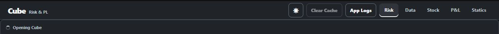

# Fix 15 — V3 pins, JTD reference, usable logs, and a smaller cold path

**Status:** Implemented on the `v3` branch, except for the P&L changes in the
diagnostic section. Those P&L ideas are deliberately **not implemented**.

This guide explains the V3 edits in the order in which data flows through the
application. The implementation stays intentionally small: it adds two CSV
inputs, reuses the existing promotion/detail/callback paths, isolates one
product's connector failure from the next product, and removes avoidable full
DataFrame copies.

## Scope and explicit exclusions

V3 contains:

- an `*` promotion reason driven by `data/s12_pinned.csv`;
- Top Promotions ordering by absolute Vol Score, Risk, dRisk, or P&L while
  retaining the signed number in the table;
- a lazy `data/s13_jtd.csv` table on Credit JTD detail clicks;
- a modal Application Logs window containing structured events, warnings,
  errors, tracebacks, and `print()` output from the current process;
- one configurable retry for quick product Risk/dRisk connector failures;
- product-level market connector failure isolation;
- direct Credit reduced-tenor mapping and post-P&L summation;
- simpler release-frame ownership and cache-first dashboard preparation.

V3 deliberately does **not** add:

- CPU, RSS/memory, or thread-count instrumentation;
- a startup profiling mode;
- any Gunicorn marker, worker, or timeout change. The intended runtime here is
  the user's direct JupyterHub process;
- any P&L-page behavior change. The P&L section below is diagnosis and future
  guidance only.

## File map

Copy the following files together if applying V3 manually. A partial copy can
leave a CSV source registered without the release step that consumes it, or a
UI control without the calculation behind it.

```text
Pinned promotions
  data/s12_pinned.csv
  cube/domain/s07_governance.py
  cube/services/s05_sources.py
  cube/services/s02_state.py
  cube/services/s06_refresh.py
  cube/ui/s02_aggregation.py
  cube/pages/risk/s11_promotion.py
  cube/pages/risk/s13_workspacetables.py
  cube/pages/risk/s16_view.py

Credit JTD reference
  data/s13_jtd.csv
  cube/services/s08_jtd.py
  cube/pages/risk/s07_explorer.py
  cube/pages/risk/s05_charts.py
  cube/pages/risk/s13_workspacetables.py
  assets/s03_risk.css

Application Logs modal
  cube/app/s03_logging.py
  cube/app/s08_applogs.py
  assets/s14_app_logs.css

Cold-path simplification
  cube/services/s06_refresh.py
  cube/services/s02_state.py
  cube/domain/s07_governance.py
  cube/app/s07_factory.py

Credit reduced tenor
  data/s11_matrix.csv
  cube/domain/s11_tenorreduction.py
  cube/services/s07_tenorreduction.py
```

The V3 regression tests live in `tests/`; they do not run in production, but
copying them is recommended because they protect the exact contracts described
below.

---

## 1. Pinned promotion reason `*`

### CSV contract

Create `data/s12_pinned.csv` with these columns in exactly this order and with
exact capitalization:

```csv
Risk Type,Risk Greek,Reported Underlying,Underlying
IR,Delta,KRx,KRW
```

The example means: pin the raw `KRW` member of the reported `KRx` IR Delta
identity. Replace the example with real identities. An empty file containing
only the header is valid.

All four fields are required for every data row. Keys are exact and
case-sensitive after the normal source normalization. Duplicate four-column
keys and unknown Risk Type/Risk Greek pairs are rejected.

The important distinction is:

```text
Underlying          = the raw connector/market identity, for example KRW
Reported Underlying = the displayed reporting parent, for example KRx
```

The raw Underlying remains a market key. The pin is applied only after P&L and
the Reported Underlying mapping have completed.

### Domain implementation

In `cube/domain/s07_governance.py`:

1. `PINNED_PROMOTION_COLUMNS` defines the exact four-column contract.
2. `load_pinned_promotions()` loads and validates the optional CSV.
3. `apply_pinned_promotions()` uses exact `MultiIndex` membership; it does not
   merge the CSV into position rows and therefore cannot multiply financial
   rows.
4. A matched raw row identifies its three-column reported parent:
   `Risk Type + Risk Greek + Reported Underlying`.
5. Every mapped position belonging to that parent receives `*`, and its
   `Display Bucket` becomes the Reported Underlying.

Apply pins immediately after the normal threshold calculation:

```python
enriched = apply_baseline_promotions(reported, thresholds)
enriched = apply_pinned_promotions(enriched, pinned_promotions)
```

Do not replace the ordinary promotion reason. The result is deliberately
additive and idempotent:

```text
no threshold breach + pin  -> *
Big Risk + pin             -> *, Big Risk
Big dRisk + Big PL + pin   -> *, Big dRisk, Big PL
```

`Promotion Score` remains the true calculated score. Do not set it to infinity
or another invented value to force ordering.

### Source and refresh wiring

In `cube/services/s05_sources.py`:

- register `s12_pinned.csv` in `TEMP_CSV_FILES`;
- register its exact schema in `TEMP_CSV_SCHEMAS`;
- expose `get_pinned_promotions()`;
- pass that source into `build_production_refresh_manager()`.

In `cube/services/s06_refresh.py`, store the optional pinned source on
`RiskRefreshManager`, load it with the other local governance inputs, and pass
the validated frame into `_release_pl_views()` for both a full refresh and a
Portfolio-only refresh.

In `cube/services/s02_state.py::_release_pl_views()`, apply the pins after
`apply_baseline_promotions()` and before selecting mapped/unmapped dashboard
views. `cube/domain/s07_governance.py::build_dashboard_dataframe()` follows the
same order for its one-shot/test path.

### Preserve the pin during manual promotion recalculation

The Risk Explorer can reclassify ordinary promotions from a filtered view.
Without preservation, that operation would overwrite the committed `*`.

The V3 flow preserves the pin in both existing recalculation paths:

- `cube/ui/s02_aggregation.py::recompute_filtered_promotion()`;
- `cube/pages/risk/s11_promotion.py::apply_promotion_generation()`.

Only the `*` token is carried forward. Risk, dRisk, P&L, thresholds, and the
ordinary `Big ...` reasons are still recomputed by the existing logic. Do not
reread `s12_pinned.csv` inside a Dash callback; use the pin already present in
the committed frame.

### Promotion label parsing

`cube/pages/risk/s13_workspacetables.py::top_book_exposure_frame()` splits a
combined reason into individual tokens. This matters because `*, Big Risk` is
two labels, not one new unknown label. The stable label order is:

```text
* -> Big Risk -> Big dRisk -> Big PL
```

The pin coexists with existing reasons. It does not replace their ordering
logic or create a separate fake financial score.

---

## 2. Top Promotions ordering

The existing flat Top Promotions table is retained. V3 changes only the signal
used for ranking and aligns its wrapper styling with the existing tenor detail
table.

In `cube/pages/risk/s13_workspacetables.py`, define all four controls:

```python
TOP_PROMOTION_SIGNALS = {
    "vol-score": "Vol Score",
    "risk": "Risk",
    "drisk": "dRisk",
    "pl": "P&L",
}
```

In `top_promotions_frame()`, rank the selected column by magnitude:

```python
promoted["_signal_rank"] = pd.to_numeric(
    promoted[signal_column], errors="coerce"
).abs()
```

Sort `_signal_rank` descending with the existing deterministic tie-breakers.
The `.abs()` is only for the hidden rank key. The displayed Risk, dRisk, P&L,
and Vol Score values retain their original signs.

At the reported-parent aggregation, Vol Score uses the signed member with the
largest absolute size. This avoids choosing a small positive score over a much
larger negative score before the rank is calculated.

Examples:

```text
displayed values: -900, +700, -20
rank order:        -900, +700, -20
```

`cube/pages/risk/s16_view.py` builds the order selector directly from
`TOP_PROMOTION_SIGNALS`, so these four entries produce the four UI choices. The
existing lazy callback in `cube/pages/risk/s14_workspacecallbacks.py` remains
the rendering path; no new callback or connector call is required.

The Top Promotions table remains bounded and paginated. Do not render hundreds
of rows as one large unpaged Dash component tree.

---

## 3. Credit JTD reference table

### CSV contract

Create `data/s13_jtd.csv`. It must contain a column named exactly
`Underlying`; every other column is optional and application-owned. For
example:

```csv
Underlying,Issuer Name,Sector,Country,Comment
ACME,Acme plc,Industrials,GB,Watch
ACME,Acme plc,Industrials,GB,Second reference row
OTHER,Other plc,Financials,US,
```

All columns and every row whose `Underlying` exactly equals the clicked issuer
are displayed in their original order. The match is deliberately exact:
`ACME` does not match `acme`, and whitespace is not guessed away.

### Lazy service

`cube/services/s08_jtd.py` owns the file boundary:

- `JTD_REFERENCE_PATH` points to `data/s13_jtd.csv`;
- `jtd_reference_rows()` stats and reads the file only when JTD detail is
  actually requested;
- `_read_jtd_reference()` keeps only the latest file revision in a one-entry
  cache keyed by path, modification time, and size;
- `JTDReferenceError` converts missing, unreadable, malformed, or invalid files
  into an actionable UI/log message.

This file is not loaded during cold start and is not loaded for non-JTD clicks.

### Existing click path

In `cube/pages/risk/s07_explorer.py::render_active_detail()`:

1. use the clicked Credit measure in Multi view;
2. use the currently selected Credit measure in Singles view;
3. continue only when that effective measure is `JTD`;
4. use the selected `underlying`, falling back to `reported underlying` when
   that is the displayed identity;
5. call `jtd_reference_rows()` and pass the result into the existing detail
   builder;
6. log `JTDReferenceError` and display its readable message instead of hiding
   the whole detail panel.

There is no new browser store and no second connector call.

`cube/pages/risk/s05_charts.py::build_detail_panel_with_state()` carries the
optional JTD frame into its internal detail builder.
`cube/pages/risk/s13_workspacetables.py::build_jtd_reference_table()` renders a
flat HTML table with every CSV column and matching row. `assets/s03_risk.css`
supplies the small card/table wrapper styles.

If Reported Underlying mode shows `KRx` but the file contains only raw `KRW`,
an exact `KRx` lookup has no match. Add the displayed issuer label to
`s13_jtd.csv`, or use raw Underlying mode when that is the intended authority.

---

## 4. Application Logs modal

The App Logs button remains beside the other header utilities. It opens a
centered modal with **Refresh** and **Close** actions rather than inserting a
box into the page flow.

The current V3 desktop header is shown below. **Clear Cache** appears dim in
this cold-start capture because it is disabled until the first snapshot is
available; when enabled it uses the same styling as **App Logs**.



### Captured output

`cube/app/s03_logging.py` keeps one bounded process-local log buffer. Logger
records are accepted from the application namespaces `cube`, `app`,
`__main__`, and `dash.dash`:

- structured Cube operator events are retained;
- ordinary logger records are retained at `WARNING`, `ERROR`, and `CRITICAL`;
- exception tracebacks are included when `logger.exception(...)` or
  `exc_info=True` is used;
- complete lines written by normal `print()`/`stdout` are mirrored into the
  same buffer while still appearing in the Jupyter terminal;
- common `password`, `secret`, `token`, `authorization`, and API-key text is
  masked before browser display;
- entry count and response characters are bounded.

`configure_runtime_logging()` calls `_install_terminal_tees()` once. Therefore
only output written after application logging is configured can appear. The
modal is not a complete copy of old Jupyter terminal history, browser-console
errors, another process's logs, network-proxy logs, or arbitrary bare stderr.
Stderr is deliberately not mirrored separately because application logger
errors already contain their message and traceback; mirroring both would show
the same failure twice.

Use logging for an error when a traceback is useful:

```python
try:
    risky_call()
except Exception:
    LOGGER.exception("Credit Delta failed")
```

A bare `print("Credit Delta failed")` is also shown, but it has no traceback
unless the traceback itself is printed.

### Modal files

- `cube/app/s08_applogs.py::build_app_log_panel()` defines the modal and
  `register_app_log_callbacks()` keeps the existing explicit
  open/refresh/close flow.
- `assets/s14_app_logs.css` styles the backdrop, centered dialog, bounded
  scroll area, and header utility spacing.

The log buffer is intentionally in memory. The existing **Clear Cache** action
does not clear this log buffer; a process restart always does. Do not put raw
financial tables, credentials, or full connector responses in logs.

---

## 5. Minimal cold-start changes

These changes address two concrete costs without adding another scheduler,
worker pool, telemetry subsystem, or startup mode.

### 5.1 Isolate a failed product's market calls

The product loop is in `cube/services/s06_refresh.py`. Previously, one shared
market circuit could be opened by a product-specific Open/Current failure. A
Credit Delta failure could therefore skip FX Delta, FX Vega, and every later
product.

V3 keeps the existing circuit/deadline machinery but scopes ordinary market
connector failures to the current product. Conceptually, each product gets a
fresh `_OperationalCircuitBreaker` unless the refresh-wide circuit is already
open because the market-status boundary or the total connector budget failed:

```python
for spec in product_specs:
    product_market_circuit = (
        market_circuit
        if market_circuit.is_open
        else _OperationalCircuitBreaker()
    )
    # Open and Current for this product share product_market_circuit.
```

Expected behavior:

```text
Credit Delta Open times out
  -> remaining Credit Delta market work is shaped as unavailable
  -> FX Delta is still attempted
  -> FX Vega is still attempted

market-status resolution or total refresh budget fails
  -> the refresh-wide circuit stays open
  -> later market calls are skipped because the failure is systemic
```

This does not retry a failed **market** connector and does not turn missing
Open/Current quotes into zero. It allows the existing unavailable/NA market
shape and operator warning to represent that product, then continues.

### 5.2 Retry each product Risk connector once

The retry settings sit together at the top of
`cube/services/s06_refresh.py`:

```python
_RISK_RETRIES = 1
_RISK_RETRY_DELAY_SECONDS = 0.5
```

They are also constructor arguments on `RiskRefreshManager`, so a deployment or
test can change them without editing the retry loop. `risk_retries=1` means one
retry after the first call, or two attempts at most. Set it to `0` to disable
Risk retries.

The flow is deliberately small:

```text
first product Risk call
  -> quick operational failure
  -> wait 0.5 seconds
  -> retry once
  -> if the retry also fails, record one snapshot data warning
  -> retain an empty result for that product
  -> continue with the next product
```

Only ordinary product Risk/dRisk connector availability failures are retried.
Contract errors such as `TypeError` or `ValueError` are not retried. Neither are
manager deadline, busy-gate, or total-budget errors: after a manager deadline,
the original daemon connector thread may still be running, so starting another
network request would be unsafe. The existing same-key connector gate remains a
second protection against duplicated outstanding calls.

The terminal records the first failed attempt as a retry warning. If the retry
also fails, the existing final connector error is logged as well; the dashboard
still receives one unavailable-data warning for that product.

This retry does not apply to the Risk checker, governance inputs, supplemental
sources, or Market Open/Current connectors.

### 5.3 Shorten full-frame lifetimes

In `cube/services/s02_state.py::_release_pl_views()`, reuse one owned working
variable through:

```text
concat -> Portfolio config -> Reported Underlying -> promotions -> pins
```

Then create only the required mapped dashboard and unmapped result. Avoid
keeping separate `combined`, `configured`, `reported`, `enriched`, and `mapped`
full-frame variables alive at the same time.

In `cube/domain/s07_governance.py::to_dashboard_frame()`, first resolve the
final dashboard columns, make one owned result copy, normalize that result, and
return it. Avoid copying the entire source at entry and copying it again at
return.

These are ownership changes, not financial-calculation changes. Do not add
`gc.collect()` calls; dropping references is the simpler fix.

### 5.4 Prepare a committed dashboard cache-first

In `cube/app/s07_factory.py`:

- `current_cube_page()` reads the small committed control revision first;
- `prepared_committed_dashboard(revision=...)` checks the per-revision cache
  before asking the manager for a defensive `dashboard_frame` copy;
- the existing lock makes one caller prepare a cache miss while concurrent
  callers reuse the prepared result;
- stale/newer revision checks remain intact.

The public manager's defensive-copy contract remains unchanged. The goal is
only to prevent several reconnecting browser requests from making and
normalizing the same whole-dashboard copy.

No history import redesign, SearchCatalog redesign, layout metadata cache,
CPU/memory/thread instrumentation, or Gunicorn edit is part of V3.

---

## 6. Credit reduced-tenor mapping

Credit does not need a numeric reduction matrix. It uses a direct, ordered
mapping and sums additive values after P&L has already been calculated:

```text
Full tenor   Reduced tenor
3Y           3Y
4Y           5Y
5Y           5Y

Risk at 3Y = original 3Y Risk
Risk at 5Y = original 4Y Risk + original 5Y Risk
```

The same grouping and summation applies independently to Risk, dRisk, P&L,
Expo/Hedges breakdowns, and present Credit measures such as SP01 or JTD. It is
performed within each existing position identity, so Portfolios, Groups,
Splits, and reporting dimensions are not combined with each other.

### Step 1 — no Credit catalogue rows

Credit does not use `data/s11_matrix.csv`. Every registered one-axis Credit
source and raw Underlying automatically selects the shared
`CREDIT_STANDARD` mapping. Keep `s11_matrix.csv` only for non-Credit IR/FX
matrix selection. A Credit-only request does not open that file; the catalogue
is loaded lazily only when a non-Credit reduced-tenor batch needs it.

### Step 2 — supply the one shared ordered mapping

The temporary integration point is
`cube/services/s07_tenorreduction.py::_TEMP_CREDIT_TENOR_MAPPINGS`:

```python
_TEMP_CREDIT_TENOR_MAPPINGS = {
    "CREDIT_STANDARD": _tenor_mapping(
        [
            ("3Y", "3Y"),
            ("4Y", "5Y"),
            ("5Y", "5Y"),
        ]
    ),
}
```

For the real common 15-to-5 structure, provide 15 pairs with only five
distinct targets. This one definition applies to Credit Delta, Credit Vega,
every raw Credit Underlying, and future registered one-axis Credit products.
This is a structural example—replace every placeholder with the exact labels
returned by the connector:

```python
credit_15_to_5 = [
    ("FULL_01", "REDUCED_1"),
    ("FULL_02", "REDUCED_1"),
    ("FULL_03", "REDUCED_1"),
    ("FULL_04", "REDUCED_2"),
    ("FULL_05", "REDUCED_2"),
    ("FULL_06", "REDUCED_2"),
    ("FULL_07", "REDUCED_3"),
    ("FULL_08", "REDUCED_3"),
    ("FULL_09", "REDUCED_3"),
    ("FULL_10", "REDUCED_4"),
    ("FULL_11", "REDUCED_4"),
    ("FULL_12", "REDUCED_4"),
    ("FULL_13", "REDUCED_5"),
    ("FULL_14", "REDUCED_5"),
    ("FULL_15", "REDUCED_5"),
]
```

For your stated sub-example, the relevant entries are simply:

```python
("3Y", "3Y")
("4Y", "5Y")
("5Y", "5Y")
```

If their Risk values are `10`, `20`, and `30`, the reduced output is `3Y = 10`
and `5Y = 50`. The identical grouping is independently applied to dRisk and
already-calculated P&L.

The checked-in `_tenor_mapping()` adds `TEMP_REPLACE_ME - ` because the seed
connectors use temporary labels. A real provider must return a DataFrame with
the connector's exact labels and exactly these columns, in this order:

```text
Full Tenor, Reduced Tenor
```

Every full tenor actually present in Credit must have one mapping row. Full
tenors are unique; repeated reduced tenors are intentional.
The first occurrence of each reduced tenor controls its display order. Labels
are exact after surrounding whitespace is stripped—there is no tenor parsing
or guessed ordering.

### Calculation and failure behavior

`cube/domain/s11_tenorreduction.py::ReducedTenorReducer` chooses the path from
the authoritative Credit ProductSpec:

```text
Registered one-axis Credit source
  -> automatically select CREDIT_STANDARD
  -> load and validate the two-column mapping once
  -> map each full Tenor Swap to its reduced label
  -> sum additive post-P&L columns per existing position and reduced tenor
  -> reuse an exact target-label market quote where one exists
```

Open, Current, and Move are never summed or averaged. A reduced `5Y` uses the
real `5Y` quote; a target such as `Long` with no exact old quote stays blank and
unavailable. If the mapping is missing, malformed, or does not cover every
actual full tenor, the complete Credit batch remains at full tenor and a
warning is logged. Non-Credit IR/FX matrix behavior is unchanged.

Mappings are loaded lazily on the first Reduced tenor request and cached for
the process lifetime. Restart the app after editing a mapping definition. The
temporary Credit Vega fixture uses a different month-tenor shape, so it safely
stays full-tenor until the fixture itself is aligned with the shared mapping.

---

## 7. SOG/Portfolio P&L diagnosis — not implemented

**Nothing in this section changes P&L code on V3.** It records the most likely
cause, the exact prerequisites, and small future options so the symptom can be
verified before changing financial-send behavior.

### Why Risk Explorer can show data while SOG/Portfolio P&L shows nothing

The two pages deliberately consume different committed frames:

```text
Risk Explorer
  snapshot.dashboard_frame
  -> cube/domain/s07_governance.py::_zero_fill_dashboard_metrics()
  -> missing/non-finite display P&L, dRisk and market move can become 0

SOG/Portfolio P&L editor
  snapshot.combined_pl
  -> cube/pages/pnl/s02_editor.py::_effective_rows()
  -> cube/domain/s08_pnl.py::build_pl_send_base()
  -> cube/domain/s08_pnl.py::_mapped_raw_rows()
  -> cube/domain/s08_pnl.py::_normalise_pl()
  -> every retained PL value must be finite
```

Therefore one blank, `NaN`, `inf`, or `-inf` P&L value in the P&L page's
currently allowed Portfolio scope can raise `PLSendValidationError` even though
the Risk Explorer displays the same position as zero.

The initial SOG/Portfolio option callback
`cube/pages/pnl/s05_sendcallbacks.py::refresh_effective_query()` calls
`effective_query_rows()` while building the selector options. That call is not
currently converted into an editor status message. If it raises, the output
stores/options do not update, which can look like a table that is permanently
waiting or empty.

This is the leading source-level explanation, not a claim based on a live
production capture. Confirm it with the checks below.

### Exact prerequisites for a row to appear

All of the following must be true:

1. `app.py` must construct `PLSendConfig` and register the P&L callbacks.
2. The refresh manager must have a committed revision and
   `snapshot.combined_pl` must be available.
3. The SOG or Portfolio disclosure must be open (the existing summary click
   count is odd).
4. The P&L page's own committed saved filters must leave at least one governed
   Portfolio. Risk Explorer filters do not drive this page.
5. A source row must have `Portfolio Mapped == True`. Unmapped Portfolio rows
   are intentionally excluded.
6. The mapped row must contain nonblank text for `Risk Type`, `Risk Greek`,
   `Portfolio`, and `SignoffGroup`, plus a valid `Market Date`.
7. Every retained raw `PL` value must be numeric and finite. Zero is valid;
   blank, `NaN`, `inf`, `-inf`, text, and booleans are invalid.
8. `data/s08_concerto.csv` (or `CONCERTO_MAPPING_PATH`) must have exactly these
   columns in this order:

   ```csv
   Risk Type,Risk Greek,ConcertoField
   ```

   It must be nonempty, every retained Risk Type/Risk Greek pair must have one
   row, each pair must be unique, and a `ConcertoField` cannot belong to two
   different pairs.
9. Portfolio governance derived from the committed P&L must have one
   consistent metadata row per Portfolio. In particular, a Portfolio cannot
   resolve to conflicting `SignoffGroup` values.
10. If the source already supplies `ConcertoField`, it must equal the governed
    mapping value.
11. Cross-Gamma source-sensitivity rows must have `PL == 0`; they are then
    removed before the send aggregation.
12. Rows grouped to the same `Market Date + Portfolio + ConcertoField` must
    agree on Risk Type, Risk Greek, and SignoffGroup.
13. When adjustments are included, adjustment rows must satisfy the same
    finite P&L, mapping, Portfolio, SignoffGroup, date, and uniqueness rules.
14. The compact browser query revision and market date must still equal the
    current committed snapshot.
15. The selected SOG or Portfolio must still exist in the effective rows after
    all of the above filters and governance have been applied.

Portfolio remains necessary on the P&L page because it is part of the send and
adjustment identity. Removing Portfolio from the Risk Explorer filter does not
remove the Portfolio column from `combined_pl` or from this P&L workflow.

### No-history behavior

Historical data does **not** gate the SOG/Portfolio send editor. The editor is
built from the current `pl_snapshot.combined_pl`; it does not call the history
repository.

The separate upper historical overview in
`cube/pages/pnl/s08_aggregate.py::register_pl_aggregate_callbacks()` is
archive-backed. If the SQL history repository has no matching days, its query
can correctly return an empty summary. Also, while
`committed_filter_state is None`, that callback raises `PreventUpdate`; the
existing placeholder can consequently remain visible and feel stuck.

So there are two independent symptoms:

```text
SOG/Portfolio editor empty -> inspect current combined P&L validation first
historical overview empty  -> inspect history source/filter initialization
```

No-history should not be used as the explanation for a failed send-editor
table unless runtime evidence shows a different callback dependency.

### Simple diagnostic checks

Run these temporarily where a `snapshot` is available, for example immediately
after `snapshot = current_pl_snapshot()` while diagnosing
`refresh_effective_query()`. Remove them after the issue is understood.

```python
import numpy as np
import pandas as pd

raw = snapshot.combined_pl.copy()
mapped = raw["Portfolio Mapped"].eq(True)
pl_number = pd.to_numeric(raw["PL"], errors="coerce")
pl_boolean = raw["PL"].map(lambda value: isinstance(value, (bool, np.bool_)))
bad_pl = mapped & (pl_boolean | pl_number.isna() | ~np.isfinite(pl_number))

print("all rows", len(raw))
print("mapped rows", int(mapped.sum()))
print("invalid mapped PL rows", int(bad_pl.sum()))
print(
    raw.loc[
        bad_pl,
        ["Risk Type", "Risk Greek", "Portfolio", "SignoffGroup", "PL"],
    ].head(20).to_string(index=False)
)
```

Check the Concerto mapping without printing financial values:

```python
mapping = pd.read_csv("data/s08_concerto.csv", dtype="string")
pairs = raw.loc[mapped, ["Risk Type", "Risk Greek"]].drop_duplicates()
missing_pairs = pairs.merge(
    mapping[["Risk Type", "Risk Greek"]],
    on=["Risk Type", "Risk Greek"],
    how="left",
    indicator=True,
)
print(missing_pairs.loc[missing_pairs["_merge"].ne("both")].to_string(index=False))
print("duplicate mapping pairs", int(mapping.duplicated(["Risk Type", "Risk Greek"]).sum()))
print("duplicate ConcertoField", int(mapping.duplicated("ConcertoField").sum()))
```

Check Portfolio governance consistency:

```python
from cube.domain.s01_schema import PORTFOLIO_METADATA_COLUMNS

governance = raw.loc[
    mapped,
    ["Portfolio", *PORTFOLIO_METADATA_COLUMNS],
].drop_duplicates()
conflicts = governance.loc[governance.duplicated("Portfolio", keep=False)]
print("conflicting portfolios", conflicts["Portfolio"].drop_duplicates().tolist())
print(conflicts.head(20).to_string(index=False))
```

If the invalid P&L count is nonzero, group it by identity to find the smallest
source scope without dumping the entire frame:

```python
print(
    raw.loc[bad_pl]
    .groupby(["Risk Type", "Risk Greek"], dropna=False)
    .size()
    .sort_values(ascending=False)
    .to_string()
)
```

### Suggested future changes — explicitly not implemented

Choose the missing-P&L business rule before editing this path. The smallest
safe future patch would be:

1. In `cube/pages/pnl/s05_sendcallbacks.py::refresh_effective_query()`, catch
   `PLSendValidationError` around option materialization and show the exact
   reason in a visible editor status instead of leaving stores unchanged.
2. If a blank raw P&L means “not applicable,” omit only those genuinely blank
   rows from the send base and log the omitted row count. Keep malformed text,
   booleans, and infinities as errors. Do not silently invent a zero financial
   send value without explicit business approval.
3. Reduce the blast radius by validating after the P&L page filters have chosen
   its allowed Portfolios, and where practical isolate the selected SOG or
   Portfolio's error in the rendered editor.
4. In `cube/pages/pnl/s08_aggregate.py`, replace the initialization-time
   `PreventUpdate` with an explicit “P&L filters are loading”/empty result so an
   archive placeholder cannot appear frozen.
5. If desired, show the committed live P&L as a clearly labelled **Today**
   value when history is empty. Leave MTD/YTD blank or archive-only; do not
   manufacture missing historical days.

These ideas must receive their own tests and review before implementation
because the P&L page is also a governed send boundary.

---

## 8. Manual verification

### Pins and Top Promotions

1. Add one real exact four-key row to `data/s12_pinned.csv`.
2. Refresh the application once.
3. Confirm the reported identity displays `*` even without a threshold breach.
4. Confirm an ordinary breach displays `*, Big Risk` (or the relevant combined
   reasons), not just `*`.
5. Recompute promotion and confirm `*` remains.
6. In Top Promotions, select Vol Score, Risk, dRisk, and P&L in turn. Confirm
   each orders by largest absolute value and negative values remain negative in
   the table.

### JTD

1. Add two `s13_jtd.csv` rows for one exact displayed Credit issuer.
2. Open Credit Multi and click that issuer's JTD cell.
3. Confirm both rows and every column appear below the existing detail.
4. Open Credit Singles, select Jump to Default, and click the same issuer.
5. Rename/remove the file temporarily and confirm the detail shows a readable
   error and Application Logs contains the traceback.

### Logs

1. Run `print("visible test")` after application startup.
2. Emit `logging.getLogger("cube.test").warning("warning test")`.
3. Open App Logs and click Refresh; confirm both lines appear.
4. Trigger or simulate `LOGGER.exception(...)`; confirm a traceback appears.
5. Close and reopen the modal; confirm it does not shift the dashboard layout.

### Connector isolation and cold page

1. Make FX Delta Risk fail once and then succeed. Confirm it is called exactly
   twice and publishes normally.
2. Make FX Delta Risk fail on both attempts. Confirm it is called exactly twice,
   is retained as empty/unavailable, and FX Vega is still called.
3. Set `risk_retries=0` and confirm a failed Risk connector is called once.
4. Raise a contract `ValueError` and confirm it is surfaced without a retry.
5. Make only Credit Delta Open fail quickly in a test connector.
6. Confirm Credit Delta is marked unavailable/warned.
7. Confirm FX Delta and FX Vega market connectors are still called.
8. Start two dashboard requests against the same committed revision and confirm
   the prepared-dashboard work is reused.
9. Confirm the cold shell, validated dashboard, modal, and detail panels all
   open and close normally.

### Credit reduced tenor

1. Confirm `data/s11_matrix.csv` contains no Credit rows.
2. Supply `3Y -> 3Y`, `4Y -> 5Y`, and `5Y -> 5Y` in `CREDIT_STANDARD`.
3. Restart the app and open the full-tenor view; confirm all original rows are
   unchanged.
4. Select **Reduced tenor**; confirm 3Y remains separate and 4Y plus 5Y become
   one 5Y Risk, dRisk, and P&L row for each Portfolio.
5. Confirm the reduced 5Y market values equal the original 5Y quote only.
6. Remove the 4Y mapping, restart, and confirm the complete Underlying safely
   remains at full tenor rather than losing its 4Y exposure.

## 9. Automated checks

Use the repository environment and run focused tests first:

```powershell
.\.venv\Scripts\python.exe -m pytest tests\s06_ui.py tests\s07_integration.py tests\s12_startup.py tests\s19_riskfilters.py tests\s43_reducedtenor.py tests\s44_tenorreductionsource.py tests\s46_applogs.py tests\s48_jtd.py tests\s48_pinnedpromotions.py -q
```

Then run the whole suite and repository checks:

```powershell
.\.venv\Scripts\python.exe -m pytest -q
.\.venv\Scripts\python.exe -m ruff check .
.\.venv\Scripts\python.exe -m ruff format --check .
git diff --check
git diff --stat
```

## 10. Rollback

For a complete rollback, revert the V3 commit rather than deleting individual
helpers. That keeps source registration, manager arguments, release logic, UI
controls, CSS, and tests in sync.

For a data-only rollback:

- leave `data/s12_pinned.csv` header-only to disable pins;
- leave `data/s13_jtd.csv` header-only to return “No JTD reference rows”;
- remove or disable `CREDIT_STANDARD` in the provider to disable only Credit
  reduced tenor without changing the authoritative full-tenor data;
- no restart is required for an `s13_jtd.csv` edit once its file modification
  time/size changes, while `s12_pinned.csv` is picked up on the next governed
  refresh.

Do not roll back by replacing missing market data with zero or by deleting
Portfolio from `combined_pl`; both would break existing financial identities.
